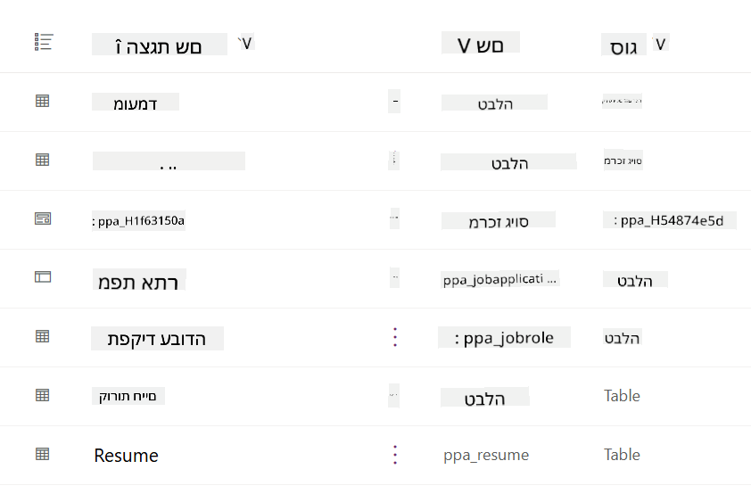
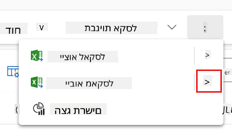
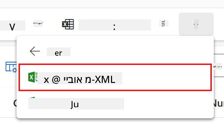
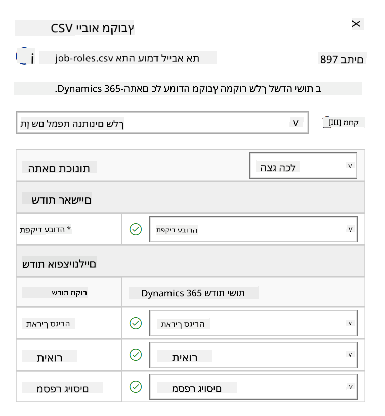
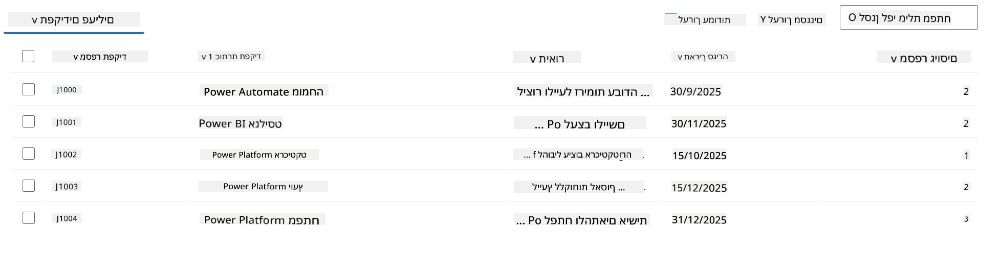
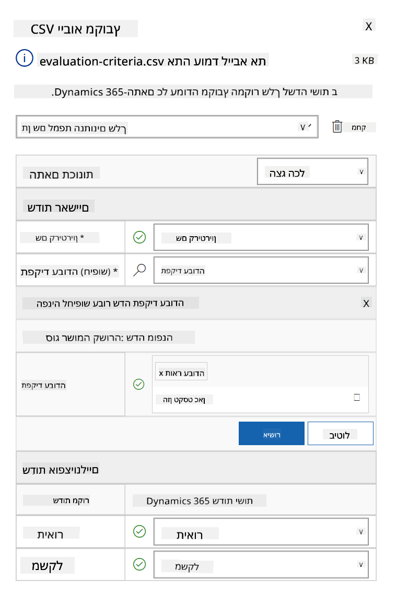
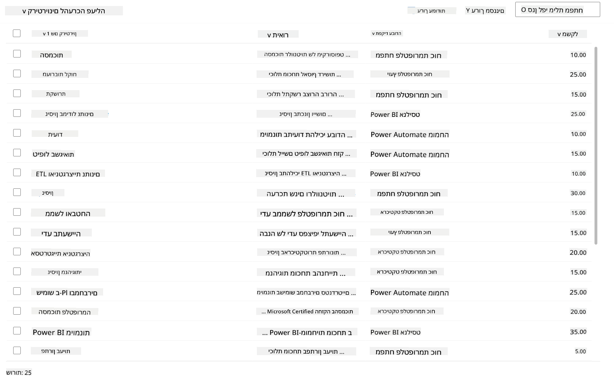

<!--
CO_OP_TRANSLATOR_METADATA:
{
  "original_hash": "2620cf9eaf09a3fc6be7fa31a3a62956",
  "translation_date": "2025-10-17T01:49:40+00:00",
  "source_file": "docs/operative-preview/01-get-started/README.md",
  "language_code": "he"
}
-->
# 🚨 משימה 01: להתחיל עם סוכן הגיוס

--8<-- "disclaimer.md"

## 🕵️‍♂️ שם קוד: `מבצע צייד כישרונות`

> **⏱️ חלון זמן למבצע:** `~45 דקות`

## 🎯 תדריך משימה

ברוך הבא, סוכן. המשימה הראשונה שלך היא **מבצע צייד כישרונות** - הקמת תשתית בסיסית למערכת גיוס מבוססת AI שתשנה את הדרך שבה ארגונים מזהים ומגייסים את הכישרונות הטובים ביותר.

המשימה שלך, אם תבחר לקבל אותה, היא לפרוס ולהגדיר מערכת ניהול גיוס מקיפה באמצעות Microsoft Copilot Studio. תייבא פתרון מוכן מראש המכיל את כל מבני הנתונים הנדרשים, ואז תיצור את סוכן ה-AI הראשון שלך - **סוכן הגיוס** - שישמש כמתאם המרכזי לכל פעולות הגיוס העתידיות.

הפריסה הראשונית הזו מקימה את מרכז הפיקוד שתשפר במהלך תוכנית סוכנות האקדמיה. ראה בכך את הבסיס שעליו תבנה רשת שלמה של סוכנים מתמחים במשימות הבאות.

---

## 🔎 מטרות

על ידי השלמת משימה זו, תוכל:

- **הבנת התרחיש**: לרכוש ידע מקיף על אתגרי אוטומציה בגיוס ופתרונותיהם  
- **פריסת פתרון**: לייבא ולהגדיר בהצלחה את יסודות מערכת ניהול הגיוס  
- **יצירת סוכן**: לבנות סוכן גיוס שהוא תחילת התרחיש שתבנה כסוכן באקדמיה  

---

## 🔍 דרישות מוקדמות

לפני שתתחיל במשימה זו, ודא שיש לך:

- רישיון ל-Copilot Studio  
- גישה לסביבת Microsoft Power Platform  
- הרשאות ניהול ליצירת פתרונות וסוכנים  

---

## 🏢 הבנת תרחיש האוטומציה בגיוס

תרחיש זה מדגים כיצד חברה יכולה להשתמש ב-Microsoft Copilot Studio כדי לשפר ולייעל את תהליך הגיוס שלה. הוא מציג מערכת של סוכנים שעובדים יחד כדי לטפל במשימות כמו סקירת קורות חיים, המלצה על תפקידים, הכנת חומרי ראיונות והערכת מועמדים.

### ערך עסקי

הפתרון עוזר לצוותי משאבי אנוש לחסוך זמן ולקבל החלטות טובות יותר על ידי:

- עיבוד אוטומטי של קורות חיים שהתקבלו בדוא"ל.  
- הצעת תפקידים מתאימים על בסיס פרופיל המועמד.  
- יצירת בקשות עבודה ומדריכי ראיונות מותאמים לכל מועמד.  
- הבטחת תהליכי גיוס הוגנים ותואמים באמצעות תכונות בטיחות ובקרה מובנות.  
- איסוף משוב לשיפור הפתרון.  

### איך זה עובד

- **סוכן הגיוס** המרכזי מתאם את התהליך ושומר נתונים ב-Microsoft Dataverse.  
- **סוכן קליטת הבקשות** קורא קורות חיים ויוצר בקשות עבודה.  
- **סוכן הכנת הראיונות** מייצר שאלות ומסמכים לראיונות בהתבסס על הרקע של המועמד.  
- המערכת יכולה להתפרסם באתר הדגמה, המאפשר למשתמשים אינטראקציה עמה.  

תרחיש זה אידיאלי לארגונים המעוניינים לחדש את תהליכי הגיוס שלהם באמצעות אוטומציה מבוססת AI, תוך שמירה על שקיפות, הוגנות ויעילות.

---

## 🧪 מעבדה: הגדרת סוכן הגיוס

במעבדה זו תקים את הבסיס למערכת האוטומציה בגיוס שלך. תתחיל בייבוא פתרון מוגדר מראש המכיל את כל טבלאות ה-Dataverse ומבני הנתונים הנדרשים לניהול מועמדים, משרות ותהליכי גיוס. לאחר מכן, תזין נתוני דוגמה לטבלאות אלו שיתמכו בלמידה שלך לאורך המודול ויספקו תרחישים מציאותיים לבדיקה. לבסוף, תיצור את סוכן הגיוס ב-Copilot Studio, ותגדיר את ממשק השיחה הבסיסי שישמש כאבן הפינה לכל התכונות האחרות שתוסיף במשימות הבאות.

### 🧪 מעבדה 1.1: ייבוא פתרון

1. עבור אל **[Copilot Studio](https://copilotstudio.microsoft.com)**  
1. בחר את **...** בניווט השמאלי ובחר **Solutions**  
1. בחר את כפתור **Import Solution** בחלק העליון  
1. **[הורד](https://raw.githubusercontent.com/microsoft/agent-academy/refs/heads/main/docs/operative-preview/01-get-started/assets/Operative_1_0_0_0.zip)** את הפתרון המוכן  
1. בחר **Browse** ובחר את הפתרון שהורדת בשלב הקודם  
1. בחר **Next**  
1. בחר **Import**  

!!! success  
    בהצלחה, תראה פס התראה ירוק עם ההודעה הבאה כשהתהליך יסתיים:  
    "Solution "Operative" imported successfully."

לאחר ייבוא הפתרון, עיין במה שייבאת על ידי בחירת שם התצוגה של הפתרון (`Operative`).

הרכיבים הבאים יובאו:

| שם תצוגה | סוג | תיאור |
|-------------|------|-------------|
| מועמד | טבלה | מידע על מועמדים |
| קריטריוני הערכה | טבלה | קריטריוני הערכה לתפקיד |
| מרכז הגיוס | אפליקציה מונחית מודל | אפליקציה לניהול תהליך הגיוס |
| מרכז הגיוס | מפת אתר | מבנה ניווט לאפליקציית מרכז הגיוס |
| בקשת עבודה | טבלה | בקשות עבודה |
| תפקיד עבודה | טבלה | תפקידי עבודה |
| קורות חיים | טבלה | קורות חיים של מועמדים |

כמשימה אחרונה למעבדה זו, בחר את כפתור **Publish all customizations** בחלק העליון של הדף.

### 🧪 מעבדה 1.2: ייבוא נתוני דוגמה

במעבדה זו תוסיף נתוני דוגמה לחלק מהטבלאות שייבאת במעבדה 1.1.

#### הורדת הקבצים לייבוא

1. **[הורד](https://raw.githubusercontent.com/microsoft/agent-academy/refs/heads/main/docs/operative-preview/01-get-started/assets/evaluation-criteria.csv)** את קובץ ה-CSV עם קריטריוני ההערכה  
1. **[הורד](https://raw.githubusercontent.com/microsoft/agent-academy/refs/heads/main/docs/operative-preview/01-get-started/assets/job-roles.csv)** את קובץ ה-CSV עם תפקידי העבודה  

#### ייבוא נתוני דוגמה לתפקידי עבודה

1. חזור לפתרון שייבאת במעבדה הקודמת  
1. בחר את אפליקציית **Hiring Hub** על ידי סימון התיבה בשורה  
1. בחר את כפתור **Play** בחלק העליון  

    !!! warning  
        ייתכן שתתבקש להתחבר מחדש. ודא שאתה עושה זאת. לאחר מכן, תראה את אפליקציית Hiring Hub.

1. בחר **Job Roles** בניווט השמאלי  
1. בחר את סמל **More** (שלוש נקודות זו מתחת לזו) בסרגל הפקודות  
1. בחר את **החץ הימני** ליד *Import from Excel*  

    

1. בחר **Import from CSV**  

    

1. בחר את כפתור **Choose File**, בחר את הקובץ **job-roles.csv** שהורדת זה עתה ולאחר מכן בחר **Open**  
1. בחר **Next**  
1. השאר את השלב הבא כפי שהוא ובחר **Review Mapping**  

    

1. ודא שהמיפוי נכון ובחר **Finish Import**  

    !!! info  
        זה יתחיל ייבוא ותוכל לעקוב אחר ההתקדמות או לסיים את התהליך מיד על ידי בחירה ב-**Done**

1. בחר **Done**

זה עשוי לקחת זמן מה, אך תוכל ללחוץ על כפתור **Refresh** כדי לבדוק אם הייבוא הצליח.

#### ייבוא נתוני דוגמה לקריטריוני הערכה

1. בחר **Evaluation Criteria** בניווט השמאלי  
1. בחר את סמל **More** (שלוש נקודות זו מתחת לזו) בסרגל הפקודות  
1. בחר את **החץ הימני** ליד *Import from Excel*  

    

1. בחר **Import from CSV**  

    

1. בחר את כפתור **Choose File**, בחר את הקובץ **evaluation-criteria.csv** שהורדת זה עתה ולאחר מכן בחר **Open**  
1. בחר **Next**  
1. השאר את השלב הבא כפי שהוא ובחר **Review Mapping**  

    

1. כעת עלינו לבצע עוד קצת עבודה למיפוי. בחר את סמל הזכוכית המגדלת (🔎) ליד שדה Job Role  
1. ודא ש-**Job Title** נבחר כאן, ואם לא - הוסף אותו  
1. בחר **OK**  
1. ודא שהשאר נכון גם כן ובחר **Finish Import**  

    !!! info  
        זה יתחיל ייבוא שוב ותוכל לעקוב אחר ההתקדמות או לסיים את התהליך מיד על ידי בחירה ב-**Done**

1. בחר **Done**

זה עשוי לקחת זמן מה, אך תוכל ללחוץ על כפתור **Refresh** כדי לבדוק אם הייבוא הצליח.

### 🧪 מעבדה 1.3: יצירת סוכן הגי

---

**הצהרת אחריות**:  
מסמך זה תורגם באמצעות שירות תרגום מבוסס AI [Co-op Translator](https://github.com/Azure/co-op-translator). למרות שאנו שואפים לדיוק, יש לקחת בחשבון שתרגומים אוטומטיים עשויים להכיל שגיאות או אי דיוקים. המסמך המקורי בשפתו המקורית צריך להיחשב כמקור סמכותי. למידע קריטי, מומלץ להשתמש בתרגום מקצועי אנושי. אנו לא נושאים באחריות לאי הבנות או לפרשנויות שגויות הנובעות משימוש בתרגום זה.