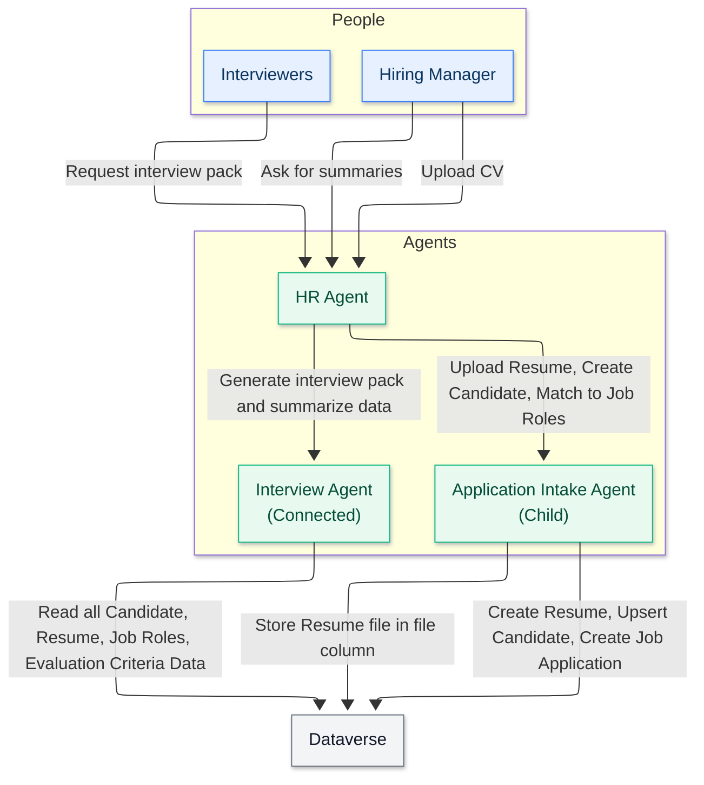

<!--
CO_OP_TRANSLATOR_METADATA:
{
  "original_hash": "02c15421de88efe63b32ca403c366f86",
  "translation_date": "2025-10-17T01:48:12+00:00",
  "source_file": "docs/operative-preview/02-multi-agent/assets/connected-agents-diagram.md",
  "language_code": "he"
}
-->
# תרשים סוכנים מחוברים

---

**הצהרת אחריות**:  
מסמך זה תורגם באמצעות שירות תרגום AI [Co-op Translator](https://github.com/Azure/co-op-translator). למרות שאנו שואפים לדיוק, יש להיות מודעים לכך שתרגומים אוטומטיים עשויים להכיל שגיאות או אי דיוקים. המסמך המקורי בשפתו המקורית צריך להיחשב כמקור סמכותי. עבור מידע קריטי, מומלץ להשתמש בתרגום מקצועי אנושי. איננו אחראים לאי הבנות או לפרשנויות שגויות הנובעות משימוש בתרגום זה.