<!--
CO_OP_TRANSLATOR_METADATA:
{
  "original_hash": "75efaf515d5694d4fd549bfd6518901a",
  "translation_date": "2025-10-17T01:59:21+00:00",
  "source_file": "docs/operative-preview/03-automate-triggers/README.md",
  "language_code": "he"
}
-->
# משימה 03: הוספת טריגרים לאירועים לפעולה אוטונומית

--8<-- "disclaimer.md"

## 🕵️‍♂️ שם קוד: `מבצע נקודת אות`

> **⏱️ חלון זמן המבצע:** `~45 דקות`

## 🎯 תקציר המשימה

ברוך שובך, סוכן. ב-[משימה 02](../02-multi-agent/README.md) - למדת כיצד לבנות סוכן משנה לקליטת בקשות וסוכן מחובר להכנה לראיונות כדי להרחיב את יכולות הסוכן הראשי שלך לגיוס עובדים.

המשימה שלך, אם תבחר לקבל אותה, היא **מבצע נקודת אות** - צלילה עמוקה לתוך **טריגרים לאירועים** - שדרוג מערכת הסוכנים שלך ממצב תגובתי לפעולה **אוטונומית**. תוכל להפוך את הסוכנים שלך מסוכנים שממתינים לקלט אנושי לסוכנים שמגיבים באופן יזום לאירועים חיצוניים ונוקטים פעולה חכמה ללא פיקוח.

חשוב על זה כשדרוג מסוכנים ש_עונים על שאלות_ לסוכנים ש_צופים צרכים_ ו_פועלים באופן עצמאי_. באמצעות טריגרים לאירועים וזרימות עבודה אוטומטיות, סוכן הגיוס שלך יזהה מיילים נכנסים עם קורות חיים, יעבד קבצים מצורפים באופן אוטומטי, ישמור נתונים ב-Dataverse, ויודיע לצוות הגיוס שלך ב-Microsoft Teams - כל זאת בזמן שאתה מתמקד במשימות בעלות ערך גבוה יותר.

ברוך הבא לעולם שבו אוטומציה פוגשת אינטליגנציה.

## 🔎 מטרות

במשימה זו תלמד:

1. כיצד טריגרים לאירועים מאפשרים התנהגות אוטונומית של סוכן ללא אינטראקציה עם משתמש
1. ההבדלים בין סוכנים אינטראקטיביים לאוטונומיים ב-Copilot Studio
1. כיצד ליצור טריגרים לאירועים שמטפלים באופן אוטומטי בקבצים מצורפים למייל ומעלים קבצים ל-Dataverse
1. כיצד לבנות זרימות סוכן שמפרסמות כרטיסים אדפטיביים לערוצי Teams לצורך התראות
1. כיצד להעביר נתונים בין טריגרים לאירועים וזרימות סוכן לצורך אוטומציה מקצה לקצה

## 🤔 מהו טריגר לאירוע?

ב-[Recruit](../../recruit/10-add-event-triggers/README.md) למדנו על טריגרים לאירועים. בואו נעשה סקירה מהירה למקרה שפספסתם.

**טריגרים לאירועים** מאפשרים לסוכן _לפעול_ בעצמו כאשר משהו קורה במערכת אחרת - ללא צורך בהודעת משתמש. כאשר האירוע המוגדר מתרחש - כמו "פריט חדש ב-SharePoint", "מייל חדש", "משימה ב-Planner שהוקצתה", או אפילו חזרה מבוססת זמן, מחבר שולח מטען טריגר לסוכן שלך. הסוכן עוקב אחר ההוראות שלך כדי להחליט אילו פעולות או נושאים לקרוא.

### מאפיינים מרכזיים

- **הפעלה אוטונומית:**
      - בניגוד לטריגרים לנושאים שמתחילים כאשר משתמש מקליד לסוכן, טריגרים לאירועים מופעלים מאירועים חיצוניים, ומאפשרים התנהגות יזומה.

- **מונע מטען:**
      - כל אירוע מספק מטען (משתנים + הוראות אופציונליות) דרך מחבר. הסוכן משתמש בהוראות שהגדרת ובמטען כדי לבחור מה לעשות הלאה.
      - לדוגמה _קריאה לנושא_ או _ביצוע פעולות שהוגדרו על ידי כלים_.

- **דוגמאות מוכנות לשימוש:**
      - קובץ או פריט שנוצר ב-SharePoint/OneDrive
      - משימה ב-Planner שהושלמה/הוקצתה
      - תגובה שהוגשה ב-Microsoft Forms
      - חזרה/לוח זמנים

    הזמינות תלויה במדיניות הנתונים של הארגון שלך שהוגדרה ב-Power Automate.

- **דורש תזמור גנרטיבי:**
      - טריגרים לאירועים זמינים רק כאשר תזמור גנרטיבי מופעל עבור הסוכן.

- **חיוב/שימוש:**
      - כל משלוח טריגר נחשב כהודעה במסגרת קיבולת Copilot Studio.
      - לדוגמה, חזרה של 10 דקות שולחת הודעה כל 10 דקות.

- **מודל אימות והגדרה:**
      - אתה מוסיף טריגרים בתוך סקירת הסוכן, תחת _טריגרים_. האימות עבור מחבר הטריגר משתמש בחשבון של יוצר הסוכן ("אימות יוצר הסוכן").
      - ניתן לערוך פרמטרים ומטען של טריגר בפורטל יוצר Power Automate.

- **בדיקה וניטור:**
      - ניתן לבדוק טריגרים מפאנל הבדיקה של הסוכן ולבחון את ההתנהגות עם מפת הפעילות לפני הפרסום.

!!! info "בקצרה למפתחים"

    חשבו על טריגרים לאירועים כעל **אותות דמויי webhook** שמזרימים מטען מובנה לתוך הסוכן שלכם, ומאפשרים לו _להתחיל_ עבודה ולשרשר פעולות בין מערכות - ללא צורך בהמתנה לבקשת משתמש.

### טריגרים לנושאים - כיצד הם שונים

בעבר למדתם על טריגרים לנושאים ב-[Recruit](../../recruit/07-add-new-topic-with-trigger/README.md), אך ייתכן שאתם עדיין תוהים כיצד _טריגרים לנושאים_ שונים מ_טריגרים לאירועים_, ולמה ההבדל הזה חשוב להבנת מה הופך סוכן לאוטונומי.

טריגרים לנושאים שולטים _מתי נושא מופעל_, בדרך כלל בתגובה להודעת משתמש.

- בתזמור גנרטיבי, הטריגר המוגדר כברירת מחדל הוא **על ידי סוכן** - המתכנן בוחר נושא ששמו/תיאורו מתאים ביותר להודעת המשתמש.
- בתזמור קלאסי, ברירת המחדל היא **ביטויים** - המתכנן בוחר נושא כאשר ביטוי טריגר אחד או כמה מתאימים ביותר להודעת המשתמש.

סוגי טריגרים אחרים כוללים `הודעה התקבלה`, `אירוע התקבל`, `פעילות התקבלה`, `עדכון שיחה`, `Invoke התקבל`, `חוסר פעילות`, ו`תוכנית הושלמה`.

!!! info "הבדל מרכזי"

    טריגרים לנושאים הם _מפעילי פעילות שיחה_ בתוך הצ'אט.
    
    טריגרים לאירועים הם _מפעילי אירועים מערכתיים_ שמועברים דרך מחברים ויכולים להפעיל את הסוכן ללא כל שיחה.

### מדריך מהיר: טריגר לנושא מול טריגר לאירוע

- **טריגר לנושא:** משתמש (או פעילות בצ'אט) אמר/עשה X ➡️ הפעל נושא T.
- **טריגר לאירוע:** SharePoint/Planner/מייל/טיימר הופעל עם מטען P ➡️ הסוכן מעריך הוראות ➡️ קורא פעולות/נושאים בהתאם.

## 🏓 סוכן אינטראקטיבי מול סוכן אוטונומי - השוואה

עכשיו כשאתם יודעים את ההבדל בין טריגרים לאירועים לטריגרים לנושאים, בואו נלמד על ההבדל בין סוכן אינטראקטיבי לסוכן אוטונומי.

במונחי Copilot Studio, "אינטראקטיבי" מתייחס לסוכנים שמתקשרים בעיקר דרך **נושאים** בצ'אט או ערוץ. "אוטונומי" מתייחס לסוכנים שמנצלים גם **טריגרים לאירועים** כדי לפעול ללא קלט משתמש.

הטבלה הבאה מסכמת את ההבדלים והדמיון ביניהם.

| ממד                               | סוכן אינטראקטיבי     | סוכן אוטונומי                                                                                              |
|-------------------------------------|-----------------------|---------------------------------------------------------------------------------------------------------------|
| כיצד הוא מתחיל                    | משתמש (או פעילות בצ'אט) מפעיל נושא. דוגמה: על ידי סוכן, ביטויים, הודעה התקבלה.   | טריגר לאירוע חיצוני שולח מטען דרך מחבר לסוכן. דוגמה: SharePoint, Planner, מייל, לוח זמנים, וכו'. |
| שימוש עיקרי                       | שאלות ותשובות, זרימות עבודה מודרכות, פעולות מונעות בקשה בצ'אט - Teams, אינטרנט, וכו'.  | פעולות יזומות ואוטומציה ברקע - תגובה לשינויים במערכת ואז הודעה, תיוק או תזמור משימות. |
| משטח טריגר                        | טריגרים לנושאים: על ידי סוכן / ביטויים / הודעה התקבלה / סוגי פעילות / Invoke / חוסר פעילות / תוכנית הושלמה | ספריית טריגרים לאירועים דרך מחברים; המטען כולל נתוני אירוע + הוראות אופציונליות. |
| מתכנן (תזמור גנרטיבי)             | מנוצל מאוד עבור טריגרים על ידי סוכן ותוכנית הושלמה לבחירה/רצף נושאים. | נדרש עבור טריגרים לאירועים; הסוכן משתמש בהוראות + מטען כדי להחליט אילו פעולות/נושאים לקרוא. |
| דוגמה טיפוסית                     | משתמש שואל "מה מדיניות ההחזר שלנו?" → נושא מופעל, מבצע שאילתה במאגר מידע, משיב. | משימה חדשה ב-Planner הוקצתה → טריגר לאירוע מופעל → הסוכן מפרסם הודעה ב-Teams, מעדכן רשומה או קורא לנושא. |
| נתיב הגדרה                        | יצירת נושאים, הגדרת סוג טריגר, כתיבת דיאלוג/פעולות; פרסום לערוצים. | הוספת טריגר לאירוע (סקירה → טריגרים), אימות מחבר עם אישורי יוצר הסוכן, הגדרת מטען/הוראות; בדיקה דרך פאנל הבדיקה; פרסום. |
| אימות וממשל                       | פועל תחת הקשר ערוץ/אימות; טריגרים לנושאים מגיבים לפעילויות בצ'אט בערוצים מורשים. | זמינות טריגר תלויה במדיניות נתוני Power Automate; מחברים פועלים תחת חשבון יוצר הסוכן. |
| ניטור                             | בדיקת נושאים בתוך Copilot Studio, בחינת תמלילי שיחות/פעילויות. | שימוש בבדיקת טריגר ומפת פעילות לאימות ביצוע לפני פרסום, מעקב אחר פעילות לאחר פרסום. |
| השפעה על קיבולת                   | כל הודעת משתמש/תגובה של סוכן היא הודעה שצורכת קיבולת. | כל משלוח אירוע הוא גם הודעה, בנוסף לכל פעולה שלאחר מכן. דוגמה: חזרה של 10 דקות = 6 הודעות/שעה |

### מתי להשתמש במה?

- בחרו **טריגרים לנושאים (אינטראקטיביים)** כאשר משתמשים יוזמים את השיחה עם הסוכן - שאלות נפוצות, קליטה מודרכת או משימות בסגנון פקודה בתוך הצ'אט. טריגר על ידי סוכן של המתכנן מפחית את הצורך באיסוף ביטויים ידני.
- הוסיפו **טריגרים לאירועים (אוטונומיים)** כאשר הסוכן צריך להתחיל את השיחה או לנקוט פעולה בעצמו - על עדכונים ב-SharePoint/Dataverse, מייל נכנס או על לוח זמנים. זה מעביר אתכם מפעולות תגובתיות לפעולות יזומות.

## טיפים למפתחים ודגשים

1. **הפעילו תזמור גנרטיבי** עבור כל סוכן שברצונכם להפוך לאוטונומי. טריגרים לאירועים לא יופיעו אחרת.

1. **תכננו את המטען מוקדם.** החליטו אילו שדות מינימליים הסוכן שלכם צריך מהטריגר כמו `itemId`, `assignedTo`, `dueDate` והוסיפו הוראות תמציתיות שמספרות לסוכן אילו פעולות/נושאים לקרוא בהתבסס על ערכי המטען.

1. **טווח האימות חשוב.** טריגרים מאמתים באמצעות חשבון יוצר הסוכן. ודאו שלחשבון יש את ההרשאות הנכונות למחבר ועומד במדיניות נתוני Power Automate.

1. **שליטה בעלות ורעש.** חזרות בתדירות גבוהה או מקורות רועשים מאוד יכולים להגדיל את צריכת ההודעות במהירות - הגבילו היכן שניתן או הוסיפו תנאים בטריגר לסינון אירועים.

1. **בדקו לפני פרסום.** השתמשו ב-**בדיקת טריגר** ובמפת הפעילות כדי לצפות בתוכנית ובפעולות שנקראו - בצעו שינויים בהוראות/מטען עד שההתנהגות תהיה יציבה.

## 🧪 מעבדה 03 - אוטומציה של מיילים עם קורות חיים של מועמדים

כעת נוסיף טריגר לאירוע לסוכן **גיוס עובדים** ונבנה זרימת סוכן בסוכן המשנה **קליטת בקשות** כדי לטפל בעיבוד נוסף לצורך אוטונומיה.

### ✨ תרחיש שימוש

!!! info ""

    **בתור** מגייס/ת משאבי אנוש

    **אני רוצה** לקבל התראה כאשר מייל עם קורות חיים מגיע לתיבת הדואר שלי והועלה באופן אוטומטי ל-Dataverse

    **כדי שאוכל** להישאר מעודכן לגבי קורות חיים שנשלחו במייל עבור בקשות שהועלו באופן אוטומטי ל-Dataverse

נשיג זאת באמצעות שתי טכניקות:

1. טריגר לאירוע כאשר המייל מגיע,
    1. בדיקת `contentType` של הקובץ שווה ל-`PDF` כסוג הפורמט.
    1. חילוץ הקובץ והעלאה ל-Dataverse באמצעות פעולות דרך מחבר Dataverse.
    1. לאחר מכן שליחת הנחיה לסוכן לעיבוד נוסף על ידי העברת פרמטרי קלט מפעולות Dataverse.

1. זרימת סוכן תתווסף לסוכן המשנה **קליטת בקשות** שתופעל על ידי ההנחיה בטריגר לאירוע.
    1. שימוש בפרמטרי הקלט שהועברו מההנחיה של הטריגר לאירוע בכרטיס אדפטיבי שיפורסם בערוץ ב-Microsoft Teams כדי להודיע לצוות הגיוס. הכרטיס האדפטיבי יכיל קישור לשורה ב-Dataverse שתוצג בסוכן **גיוס עובדים**.

בואו נתחיל!

### ✨ דרישות מקדימות להשלמת המשימה

תצטרכו **או**:

- **לסיים את משימה 01 ומשימה 02** ולהכין את סוכן הגיוס שלכם, **או**
- **לייבא את פתרון ההתחלה של משימה 03** אם אתם מתחילים מאפס או צריכים להשלים. [הורדת פתרון ההתחלה של משימה 03](https://aka.ms/agent-academy)

!!! note "ייבוא פתרון ונתוני דוגמה"
    אם אתם משתמשים בפתרון ההתחלה, עיינו ב-[משימה 01](../01-get-started/README.md) להוראות מפורטות על ייבוא פתרונות ונתוני דוגמה לסביבה שלכם.

תצטרכו גם גישה ל-**Microsoft Teams** כדי להשלים את תרגיל המעבדה השני של פרסום כרטיס אדפטיבי ל-Microsoft Teams.

### מעבדה 3.1 - אוטומציה של העלאת קורות חיים ל-Dataverse שהתקבלו במייל

1. בסוכן הגיוס, גללו מטה בלשונית **סקירה כללית** ובחרו **+ הוספת טריגר**.

       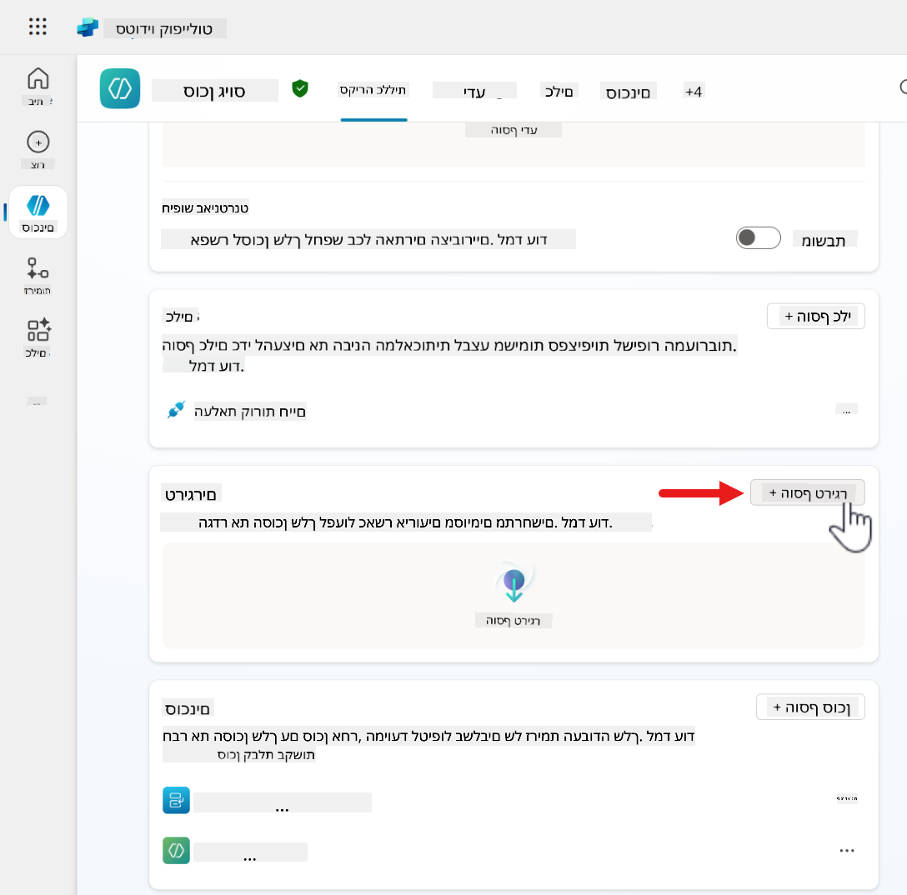

1. תופיע רשימת טריגרים. בחרו **כאשר מייל חדש מגיע (V3)** ובחרו **הבא**.

       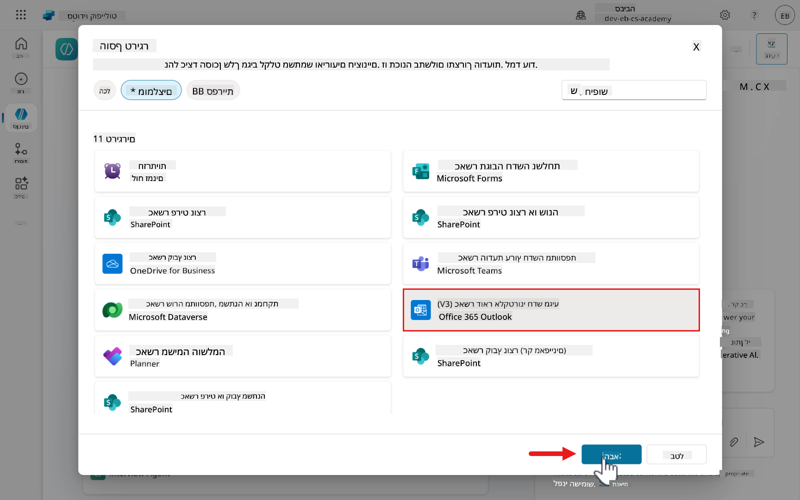

1. כעת נראה את **שם הטריגר** ואת **התחברות** הפניות החיבור לאפליקציות המפורטות.

       שנו את שם הטריגר לשם הבא,
    
       ```text
       כאשר מייל חדש מגיע ממועמד
       ```

       ודאו שאתם רואים סימן ירוק ליד כל הפניות החיבור לאפליקציות המפורטות. אם אינכם רואים סימן ירוק, התחברו דרך שלוש הנקודות (...) ובחרו **+ הפניית חיבור חדשה** כדי ליצור הפניית חיבור חדשה.

       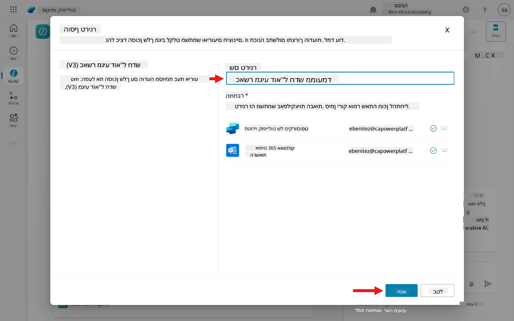

1. השלב האחרון הוא להגדיר את מאפייני הקלט של הטריגר. עדכנו את המאפיינים הבאים לערכים הבאים,

     | מאפיין | כיצד להגדיר | פרטים |
     |----------|------------|---------|
     | **כלול קבצים מצורפים (אופציונלי)** | תפריט נפתח | כן |
     | **מסנן נושא (אופציונלי)** | הקלדה/הזנה עם מקלדת | בקשה |
     | **רק עם קבצים מצורפים (אופציונלי)** | תפריט נפתח | כן |

       בחר
עכשיו נעדכן את הטריגר של האירוע כדי להוסיף יכולות אוטומציה נוספות. בחרו ב**שלוש הנקודות (...)** ליד הטריגר ובחרו **ערוך ב-Power Automate**.

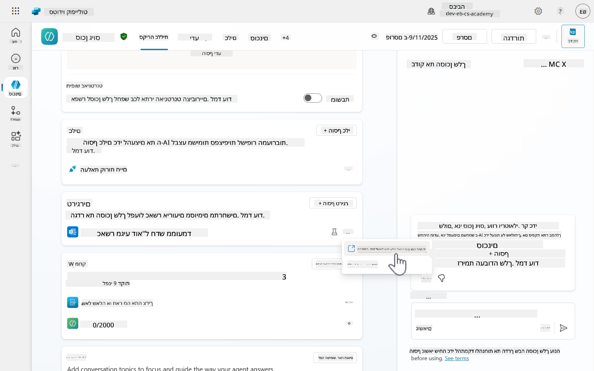

1. הטריגר ייטען כזרימה בפורטל היצירה של Power Automate. מה שאתם רואים הוא מעצב הזרימה בפורטל היצירה של Power Automate. כאן ניתן להוסיף לוגיקה ופעולות נוספות לאוטומציה. הטריגר יופיע בראש, ואחריו **שולח הנחיה לקופילוט המוגדר לעיבוד** כפעולה האחרונה בזרימה.

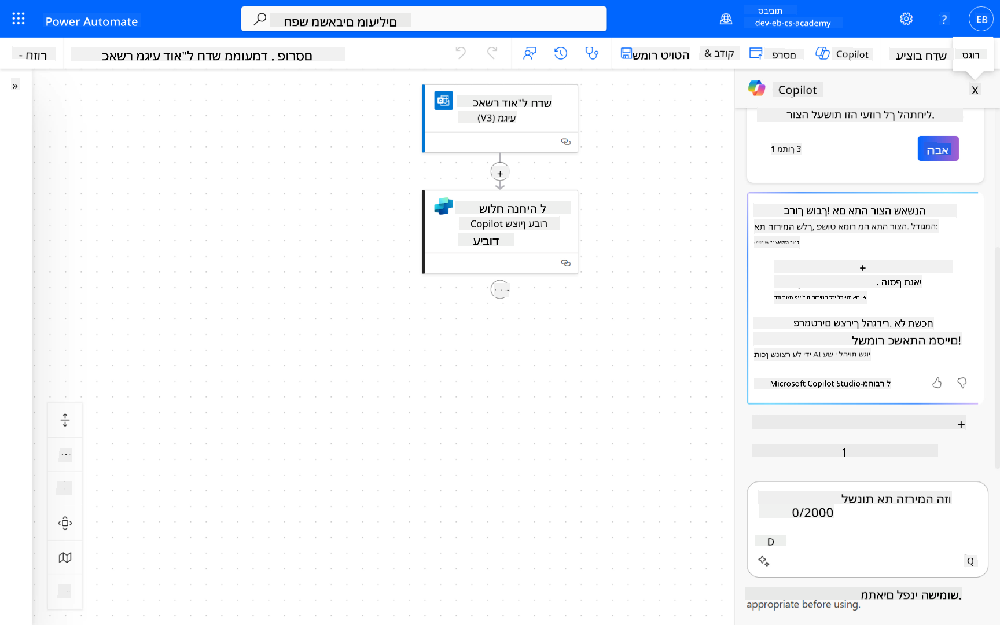

1. כברירת מחדל, הטריגר **כאשר מגיע אימייל חדש** ב-Power Automate עשוי לעבד מספר אימיילים יחד אם כמה מגיעים בו זמנית, ולהפעיל את הזרימה רק פעם אחת עבור הקבוצה.

כדי להבטיח שהזרימה תפעל בנפרד עבור כל אימייל, הפעילו את הגדרת **Split On** בהגדרות הטריגר ובחרו `@triggerOutputs()?['body/value']` בשדה המערך הנפתח.

עם **Split On** מופעל ושדה המערך מוגדר ל-`@triggerOutputs()?['body/value']`, הזרימה תפעל בנפרד עבור כל הודעה, גם אם רבות מגיעות בו זמנית.

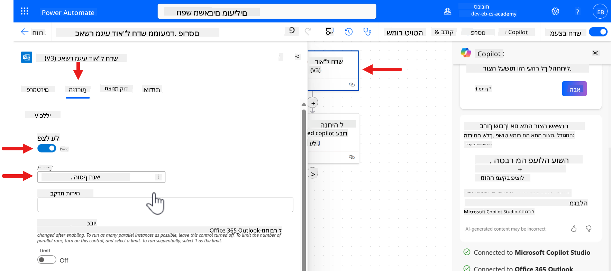

1. עכשיו נוסיף לוגיקה לבדוק את סוג הקובץ של הקובץ המצורף. אנחנו רוצים להעלות רק קבצים מצורפים מסוג .PDF ולא תמונות (שיכולות להגיע מחתימות אימייל). בחרו באייקון **+** מתחת לטריגר ובחרו **Control** תחת סעיף **כלים מובנים**.

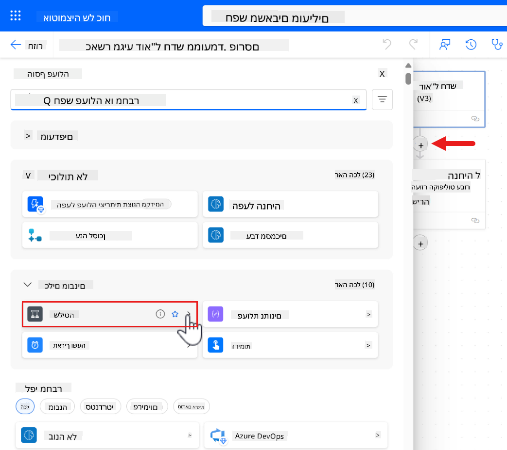

1. בחרו בפעולה **Condition**.

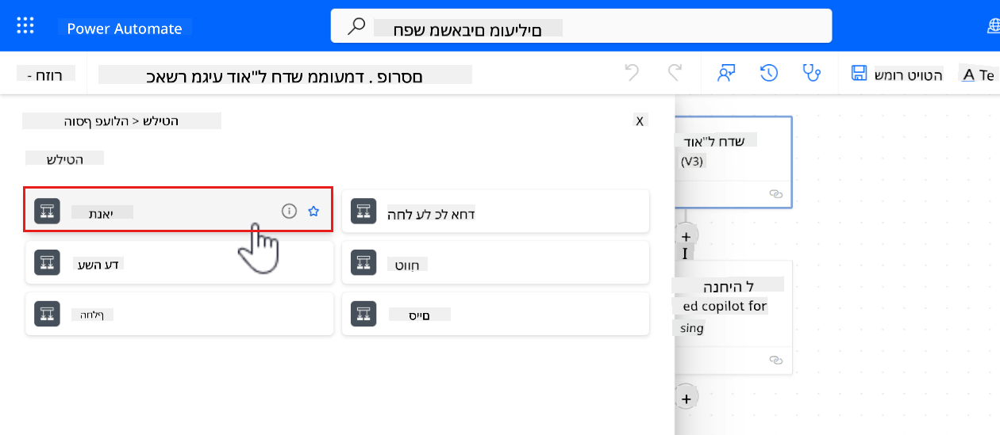

1. עכשיו נגדיר את התנאי לבדוק אם סוג הקובץ המצורף הוא .PDF. בשדה **Choose a value**, בחרו באייקון **ברק** או **fx** בצד ימין.

1. בשדה **Search** הקלידו את הטקסט הבא:

```text
content type
```

1. לאחר מכן, בחרו בפרמטר **Attachments Content-Type** מהטריגר.

1. לאחר מכן, בחרו **Add** כדי להוסיף את הקלט הדינמי לפרמטר **Id** של הפעולה.

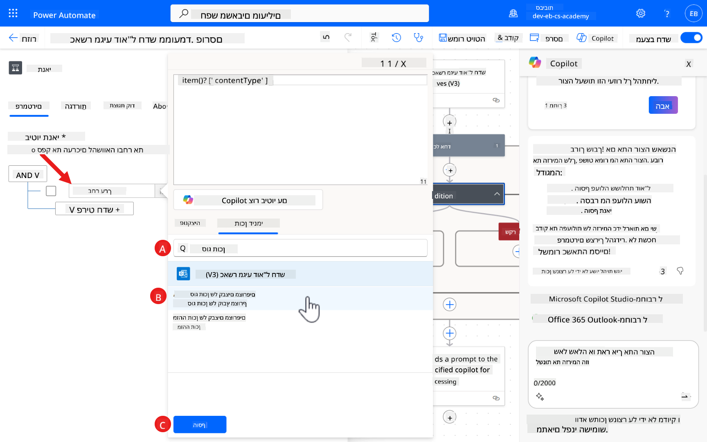

1. נעצור כאן לרגע, כנראה שמתם לב שפעולת **For each** הופיעה באופן אוטומטי.

בחרו בפעולת **For each**. פעולה זו מייצגת לולאה שעוברת על כל קובץ מצורף באימייל, מכיוון שפרמטר **Attachments Content-Type** מהטריגר קשור לכל קובץ מצורף.

מתחת לפני השטח, מדובר במערך ולכן פעולת **For each** נוספה באופן אוטומטי כשבחרנו בפרמטר **Attachments Content-Type** בפעולת **Condition**.

כדי ללמוד עוד על כך, הרחיבו את בלוק הלמידה הנוסף הבא.

??? info "למידה נוספת: הופעת פעולת For each באופן אוטומטי"

🤔 **מדוע "Apply to each" או "For each" מופיעים באופן אוטומטי?**

כאשר אתם בוחרים פרמטר (תוכן דינמי) שמייצג רשימה או מערך של פריטים - לדוגמה, רשימת קבצים מצורפים, אימיילים או שורות - Power Automate מזהה שאולי תרצו לעבד כל פריט בנפרד.

כדי לעזור לכם לעשות זאת, Power Automate מוסיף באופן אוטומטי לולאת **“Apply to each”** (או **For each**) סביב הפעולה שלכם. זה מבטיח שהפעולה שלכם תתבצע פעם אחת עבור כל פריט ברשימה, במקום לנסות לעבד את כל הרשימה בבת אחת (מה שעלול לגרום לשגיאות).

🦋 **דוגמה**

- אם תבחרו "Attachments" מפעולה קודמת (שהיא מערך), ותנסו להשתמש בה בפעולה שמצפה לקובץ יחיד, Power Automate עוטף את הפעולה שלכם בלולאת **"Apply to each"** (או **For each**).
- כך, הפעולה שלכם תתבצע עבור **כל קובץ מצורף** - אחד בכל פעם.

💡 **נקודות מפתח**

- **אוטומטי:** הלולאה מופיעה באופן אוטומטי כדי לעזור לכם לעבד כל פריט באוסף.
- **מונע שגיאות:** ללא הלולאה, הפעולה שלכם עשויה להיכשל מכיוון שהיא לא יכולה להתמודד עם מספר פריטים בבת אחת.
- **רמז חזותי:** זהו דרך חזותית להראות שהזרימה תחזור על הפעולה עבור כל פריט ברשימה.

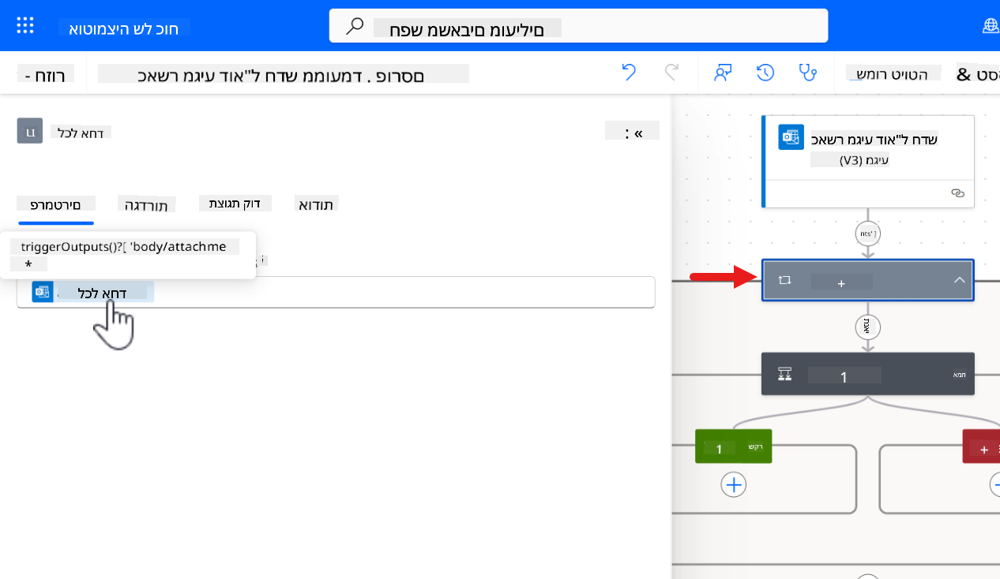

1. בשדה **Choose a value** השני, הקלידו את הטקסט הבא:

```text
application/pdf
```

זה יבטיח שעבור כל קובץ מצורף, תיבדק אם פורמט סיומת הקובץ הוא .PDF.

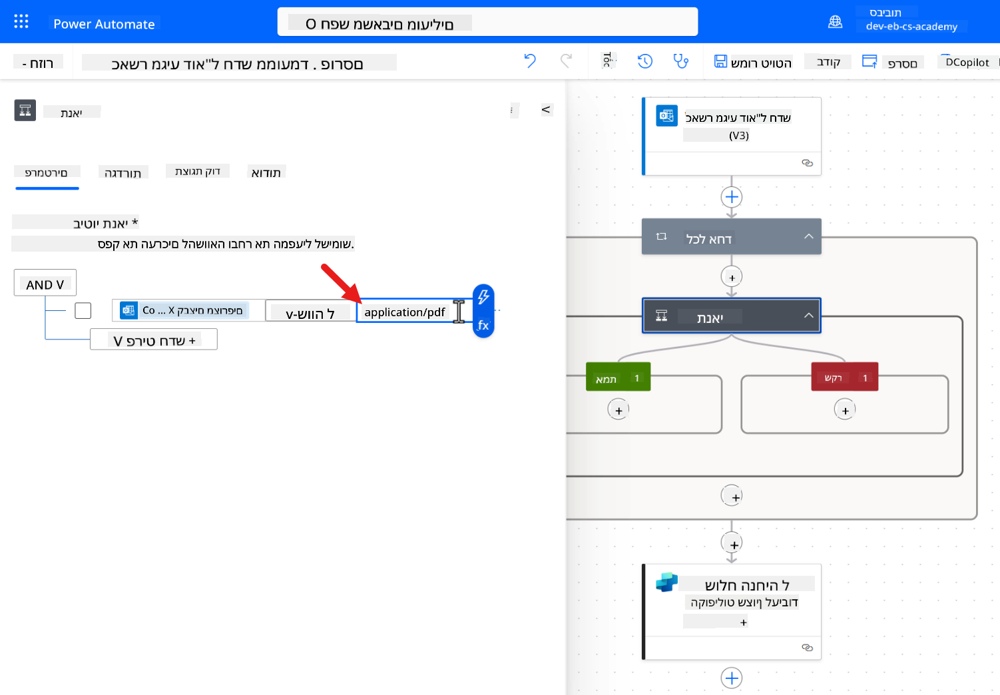

1. עכשיו נגדיר את נתיב **True** כדי לחלץ את הקובץ מהאימייל ולהעלות אותו לטבלת **Resume** ב-Dataverse.

הוסיפו פעולה חדשה מתחת לנתיב **True** וחפשו `html to text`. בחרו בפעולה **Html to text**.

כדי ללמוד עוד על פעולת **Html to text**, הרחיבו את בלוק הלמידה הנוסף הבא.

??? info "למידה נוספת: פעולת Html to text"

🤔 **מהי פעולת "HTML to text"?**

פעולת **HTML to text** ב-Power Automate משמשת להמרת תוכן בפורמט HTML לטקסט רגיל. זה שימושי במיוחד כאשר מקבלים נתונים (כמו אימיילים, תוכן אינטרנט או תגובות API) שמכילים תגי HTML, ורוצים לחלץ רק את הטקסט הקריא ללא עיצוב או קוד.

⚙️ **איך זה עובד?**

- **קלט:** מספקים מחרוזת של תוכן HTML (לדוגמה, גוף של אימייל).
- **פלט:** הפעולה מסירה את כל תגי ה-HTML ומחזירה רק את הטקסט הרגיל.

👍🏻 **מתי כדאי להשתמש בזה?**

- כאשר רוצים לחלץ טקסט קריא מאימיילים, דפי אינטרנט או תגובות API שמכילים HTML.
- לפני שליחת תוכן למערכות שלא תומכות בעיצוב HTML (כמו SMS, הודעות Teams או מסדי נתונים).
- לניקוי נתונים לצורך עיבוד או ניתוח נוסף.

🔭 **איפה למצוא את זה?**

- ב-Power Automate עבור Agent Flows, חפשו את הפעולה בשם `HTML to text`. היא נמצאת תחת מחבר **Data Operations**.

💡 **נקודות מפתח**

- מסירה את כל תגי ה-HTML ומשאירה רק את הטקסט.
- לא מפרשת או מבצעת סקריפטים/סגנונות - רק מסירה תגיות.
- שימושי לניקוי נתונים והכנת תוכן לפלטים בטקסט רגיל.

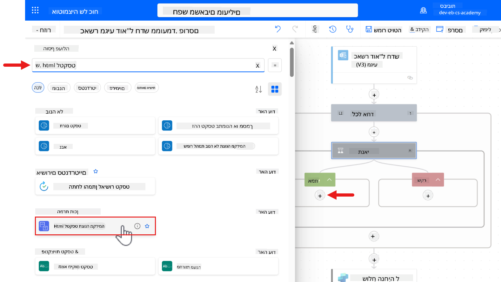

1. עכשיו נצטרך ליצור הפניה חדשה לחיבור עבור פעולת **Html to text** על ידי בחירת **Add new**.

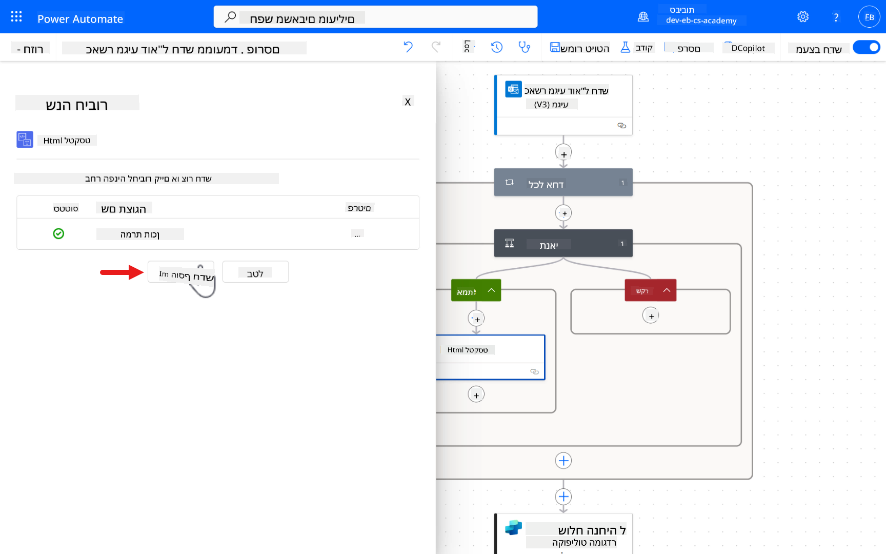

1. עכשיו ניתן להגדיר את הפעולה. הוסיפו את הפרמטר **Body** מהטריגר. בשדה **Content**, בחרו באייקון **ברק** או **fx** בצד ימין.

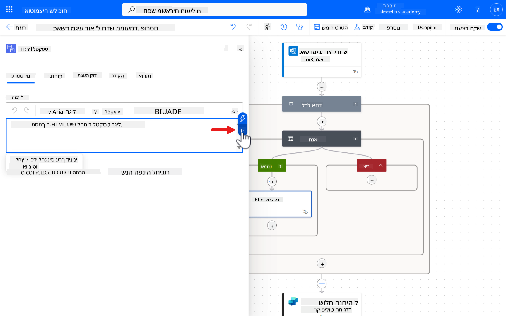

1. בלשונית **Dynamic content**, חפשו `body` ובחרו בפרמטר **Body**, ולאחר מכן בחרו **Add**.

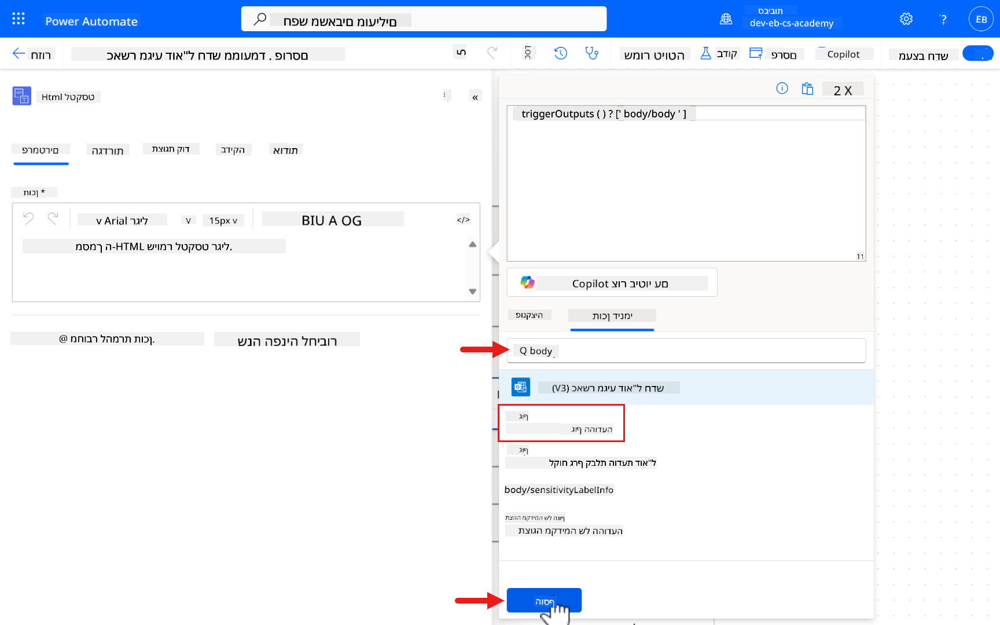

1. סיימנו להגדיר את הפעולה הזו, אז נצא מהפעולה על ידי בחירת שני סוגריים זוויתיים («) המצביעים שמאלה כדי לסגור את הפאנל.

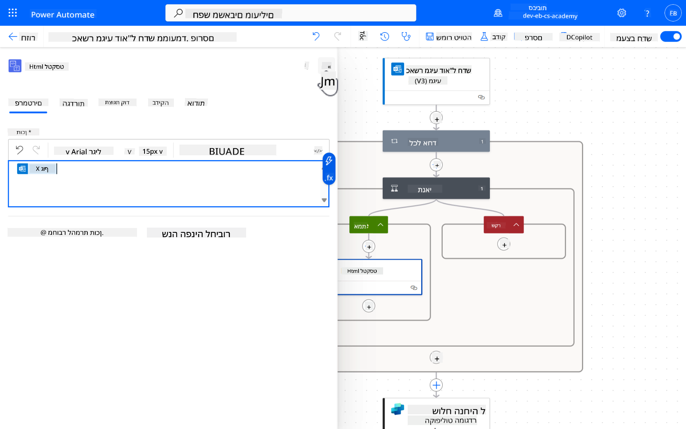

1. נוסיף פעולה חדשה על ידי בחירת **אייקון +** מתחת לפעולת **Html to text**, מה שיטען את הפאנל להוספת פעולות. בחרו במחבר **Microsoft Dataverse**.

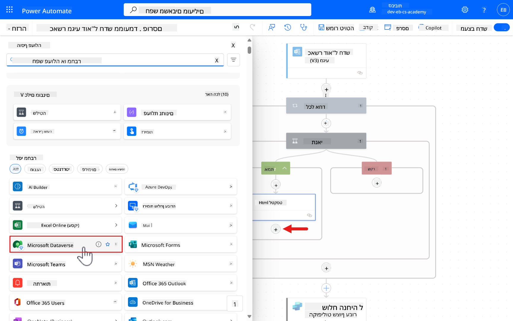

1. בחרו בפעולה **Add a new row**.

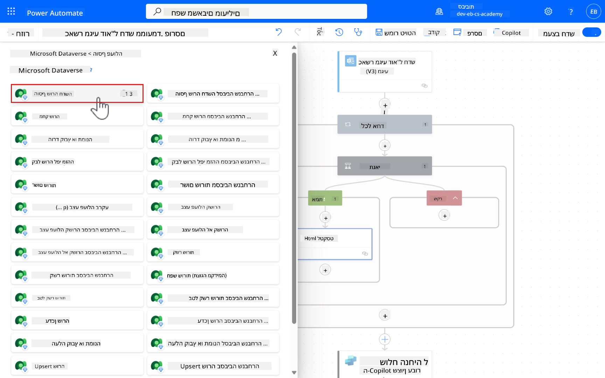

1. שנו את שם הפעולה על ידי בחירת **שלוש הנקודות (...)**, העתקו והדביקו את הטקסט הבא כשם:

```text
Add a new Resume row
```

עבור פרמטר **Table name**, חפשו `res` ובחרו בטבלת **Resumes**.

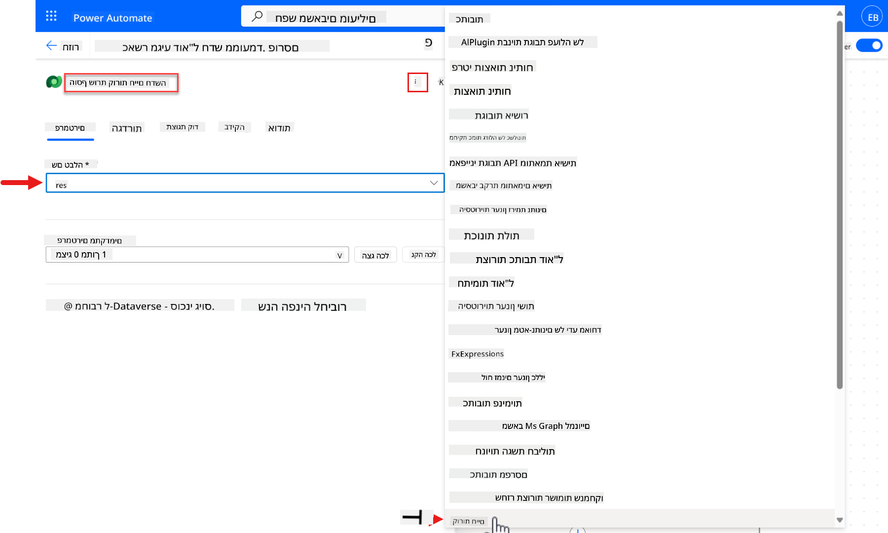

1. בחרו בשדה **Resume Title** ובחרו באייקון **ברק** או **fx** בצד ימין.

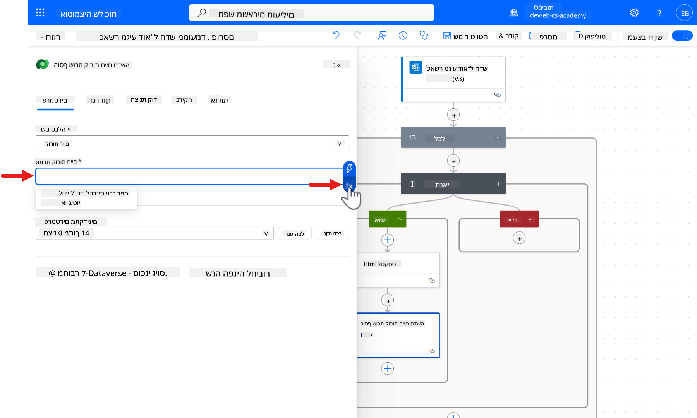

1. בלשונית **Function**, הזינו את הביטוי הבא שמשתמש בפונקציה `item()`:

```text
item()?['name']
```

כדי ללמוד עוד על פונקציית `item()`, הרחיבו את בלוק הלמידה הנוסף הבא.

??? info "למידה נוספת: פונקציית `item()`"

🤔 **מהי פונקציית `item()`?**

- כאשר משתמשים בפעולת **Apply to each**, Power Automate עובר על כל אלמנט באוסף (מערך).
- היא משמשת בעיקר בתוך פעולות כמו **Apply to each** (או **For each**), **Select**, או **Filter array**.

⚙️ **איך זה עובד?**

- `item()` היא פונקציה שמחזירה את הפריט הנוכחי שעובר עיבוד בלולאה או בפעולת מערך.
- בתוך הלולאה, `item()` מתייחסת ל_אלמנט הנוכחי_ שעובר עיבוד.

📌 **איפה משתמשים בזה?**

- **Apply to each:** כדי לגשת לתכונות של הפריט הנוכחי.
- **Select:** כדי לשנות כל פריט במערך.
- **Filter array:** כדי להתייחס לפריט הנוכחי שנבדק.

🦋 **דוגמה**

- ביטוי בתוך לולאה:
       -  `item()?['Email']`
- זה מקבל את תכונת ה-`Email` של הפריט הנוכחי.

💡 **נקודות מפתח**

- `item()` הוא _תלוי הקשר_: הוא תמיד מתייחס לפריט הנוכחי בלולאה או בפעולת מערך שבה אתם נמצאים.
- אם אתם מקננים לולאות, תוכלו להשתמש ב-`items('LoopName')` כדי להתייחס לפריטים בלולאה ספציפית.

בחרו **Add** כדי להוסיף את הביטוי לפרמטר **Resume Title**.

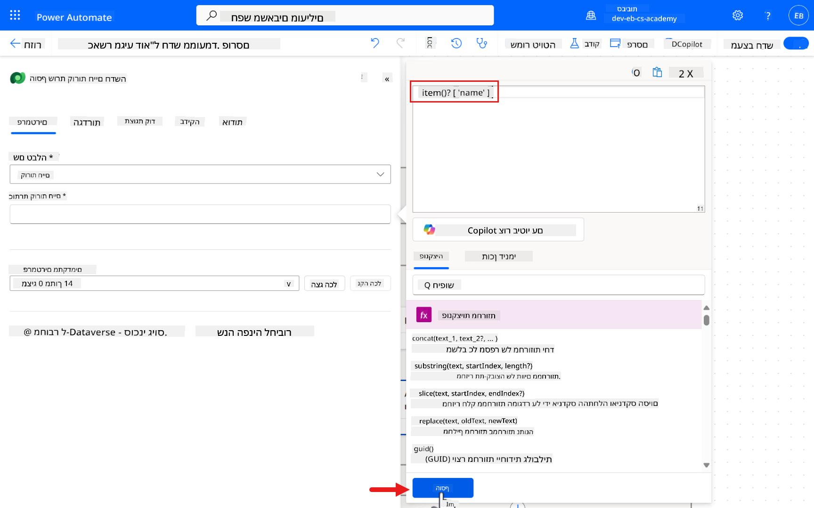

1. עדיין צריך להגדיר כמה פרמטרים נוספים, בחרו **Show all** ובשדה **Cover Letter**, בחרו באייקון **ברק** או **fx** בצד ימין.

בלשונית **Function**, הזינו את הביטוי הבא שמשתמש באותו ביטוי במשימה הקודמת [mission](../02-multi-agent/README.md).

```text
if(greater(length(body('Html_to_text')), 2000), substring(body('Html_to_text'), 0, 2000), body('Html_to_text'))
```

ביטוי זה בודק אם _הטקסט_ מפעולת **Html to text** ארוך מ-2000 תווים, ואם כן, מחזיר רק את 2000 התווים הראשונים; אחרת, מחזיר את הטקסט המלא.

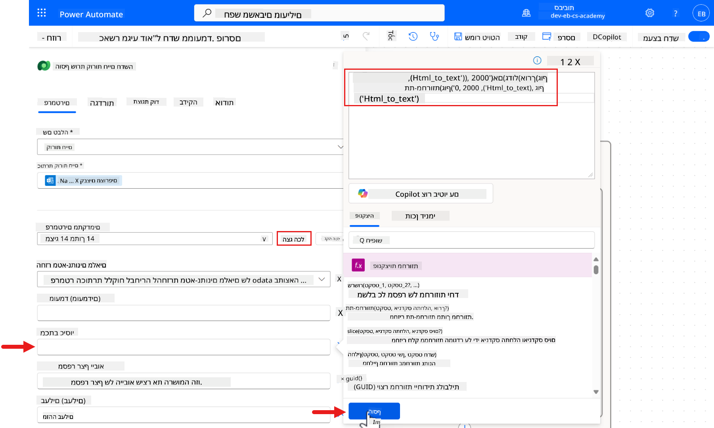

1. הביטוי יתווסף עכשיו לשדה **Cover Letter**.


1. עבור שדה **Source Email Address**, חפשו `from` ובחרו בפרמטר **From** מהטריגר, מכיוון שהוא מכיל את ערך כתובת האימייל.

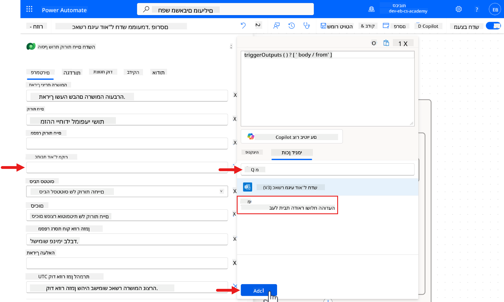

1. עבור שדה **Upload Date**, בחרו באייקון **ברק** או **fx** בצד ימין. בלשונית **Function**, הזינו את הביטוי הבא שמשתמש בפונקציה `utcNow()`:

```text
utcNow()
```

כדי ללמוד עוד על פונקציית `utcNow`, הרחיבו את בלוק הלמידה הנוסף הבא.

??? info "למידה נוספת: פונקציית `utcNow`"

🤔 **מהי פונקציית `utcNow()`?**

- פונקציית utcnow() ב-Power Automate מחזירה את התאריך והשעה הנוכחיים בזמן אוניברסלי מתואם (UTC) בפורמט ISO 8601, כמו: `2025-09-23T04:32:14Z`.

🦋 **דוגמה**

- ביטוי:
       -  `concat('Report generated on ', utcnow())`
- הפלט הוא:
       - Report generated on `2025-09-23T04:32:14Z`

💡 **נקודות מפתח**
- **אין צורך בארגומנטים (פרמטרים קלט):** תמיד מחזיר את חותמת הזמן הנוכחית ב-UTC.
   - **שימושים**
       - הוספת חותמות זמן ליומנים או שמות קבצים
       - השוואת הזמן הנוכחי עם תאריכים אחרים
       - תזמון או תנאים מבוססי זמן

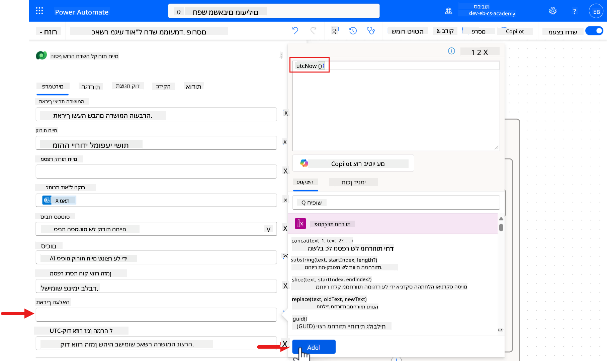

1. סיימנו כעת להגדיר את הפעולה **הוספת שורה חדשה לקורות חיים**, אז בואו נצא מהפאנל על ידי קריסתו.

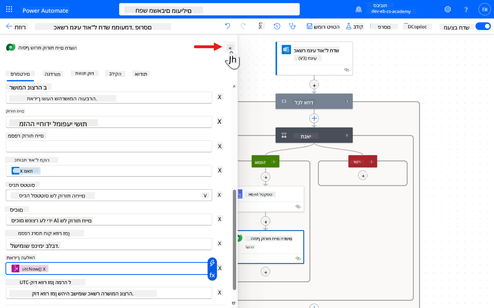

1. נוסיף פעולה חדשה על ידי בחירת **אייקון +** מתחת לפעולה **הוספת שורה חדשה לקורות חיים**, מה שיטען את הפאנל להוספת פעולות. בחרו שוב את מחבר **Microsoft Dataverse**.

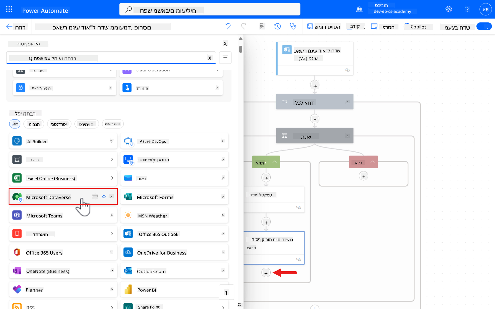

1. בחרו את הפעולה **העלאת קובץ או תמונה**.

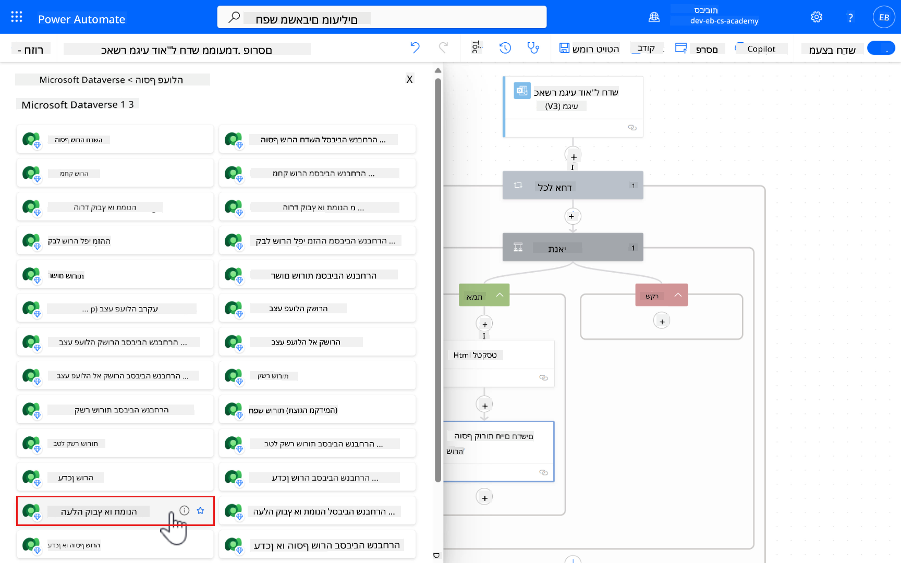

1. שנו את שם הפעולה על ידי בחירת **שלוש נקודות (...)**, העתקו והדביקו את השם הבא:

```text
Upload Resume File
```

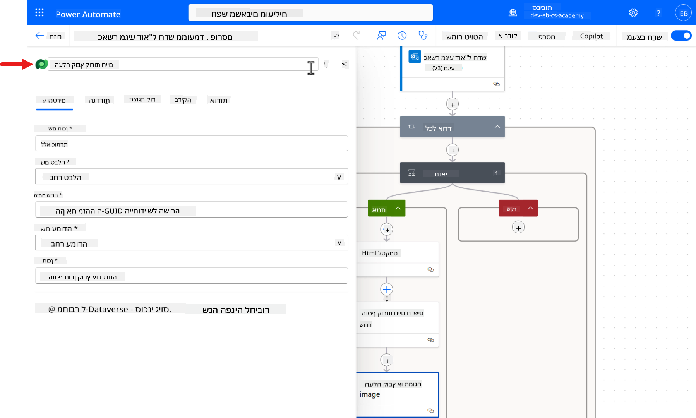

1. בחרו בשדה **Content name** הבא ולחצו על **אייקון הברק** או **אייקון fx** בצד ימין.

בכרטיסיית **Function**, הזינו את הביטוי הבא שמשתמש בפונקציה `item ()`. זה מקבל את תכונת `name` של הפריט הנוכחי (קובץ המצורף).

```text
item()?['name']
```

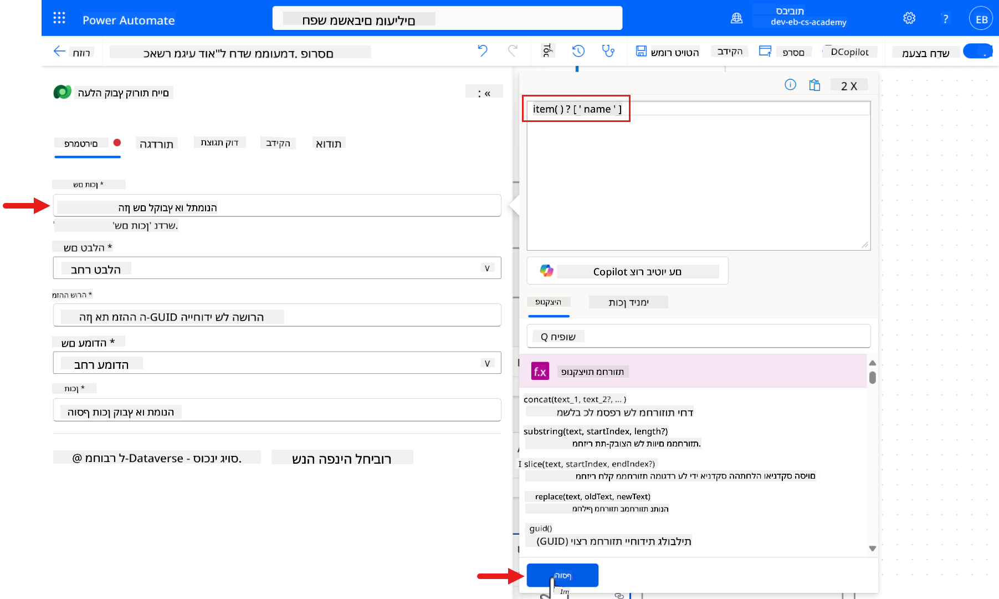

1. עבור פרמטר **Table name**, חפשו `res` ובחרו את טבלת **Resumes**.

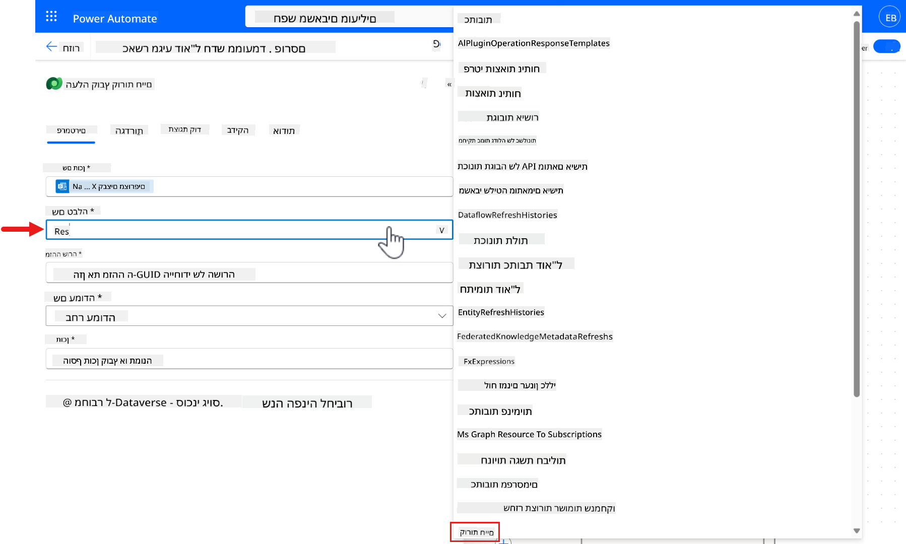

1. בחרו בשדה **Row ID** הבא ולחצו על **אייקון הברק** או **אייקון fx** בצד ימין.

חפשו `ID` ובחרו את פרמטר **Resume** מפעולת Dataverse _הוספת שורה חדשה_, שכן הוא מכיל את ערך ה-ID של השורה שאליה יועלה קובץ ה-PDF.

בחרו **Add**.

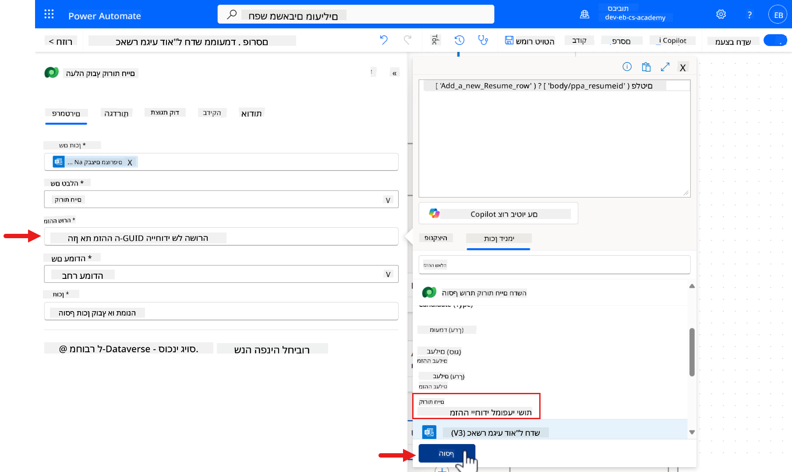

1. בחרו בשדה **Column name** ובחרו באפשרות **Resume PDF**.


1. בחרו בשדה **Content** ולחצו על **אייקון הברק** או **אייקון fx** בצד ימין.

בכרטיסיית **Function**, הזינו את הביטוי הבא שמשתמש בפונקציה `item ()`. זה מקבל את תכונת `contentBytes` של הפריט הנוכחי (קובץ המצורף). `contentBytes` מתייחס לנתוני בינארי גולמיים של קובץ או קובץ מצורף, מקודדים כמחרוזת Base64.

```text
item()?['contentBytes']
```

1. סיימנו להגדיר את הפעולה הזו, אז בואו נצא מהפעולה על ידי בחירת שני סוגריים זוויתיים («) המצביעים שמאלה כדי לקרוס את הפאנל.

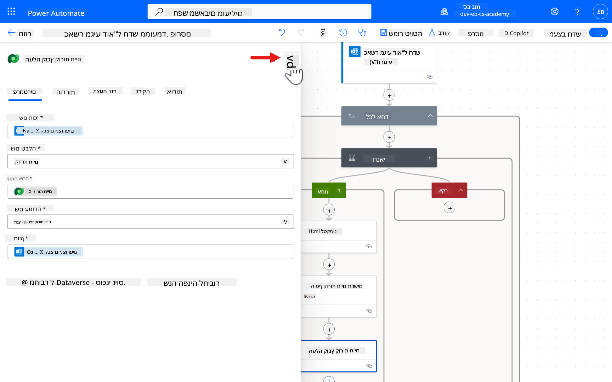

1. כעת, בחרו את **שולח בקשה לקופילוט המוגדר לעיבוד**, ואז גררו ושחררו את הפעולה הזו מתחת לפעולה **Upload Resume File** בנתיב _True_ של התנאי.

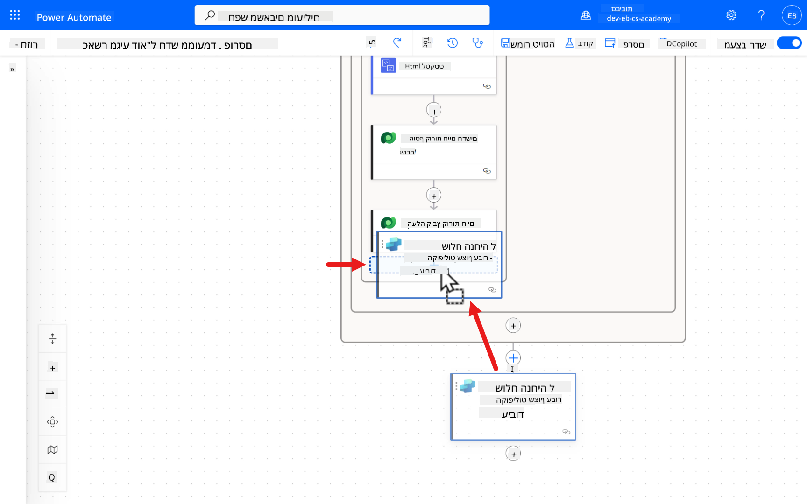

1. בחרו את **שולח בקשה לקופילוט המוגדר לעיבוד** כדי להגדיר אותה.

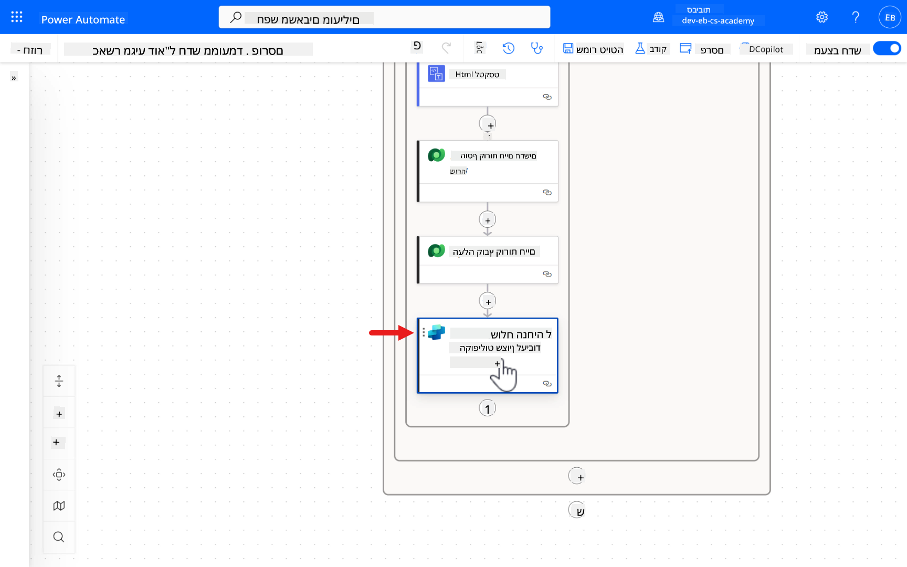

1. בשדה **Body/message**, בחרו את כל תוכן השדה ונקו/מחקו אותו.

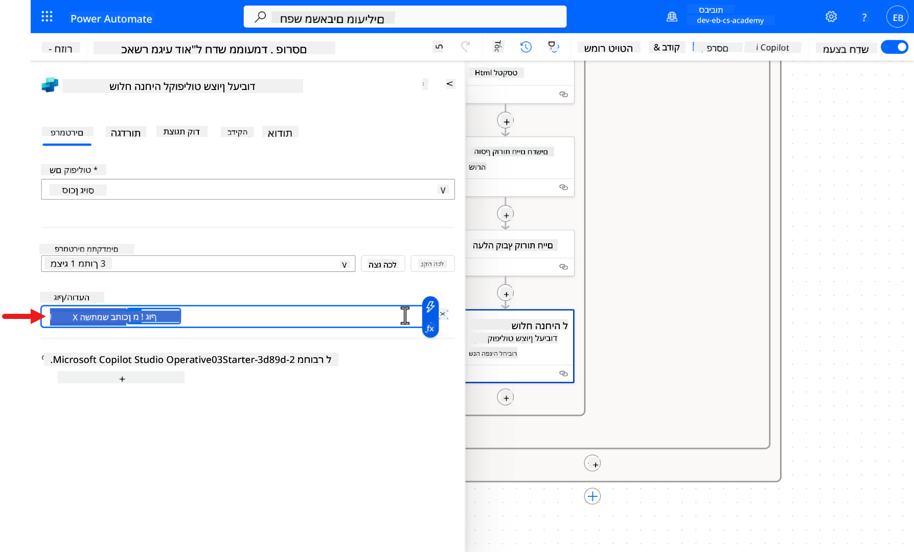

1. העתקו והדביקו את הטקסט הבא לשדה **Body/message** והדגישו את `RESUME ID PLACEHOLDER`.

```text
Send [ResumeId (text)] = "RESUME ID PLACEHOLDER" and [ResumeTitle (text_1)] = "RESUME TITLE PLACEHOLDER" and [ResumeNumber (text_2)]= "RESUME NUMBER PLACEHOLDER" to the Tool "Notify Teams Applicant channel" in the child agent "Application Intake Agent"
```

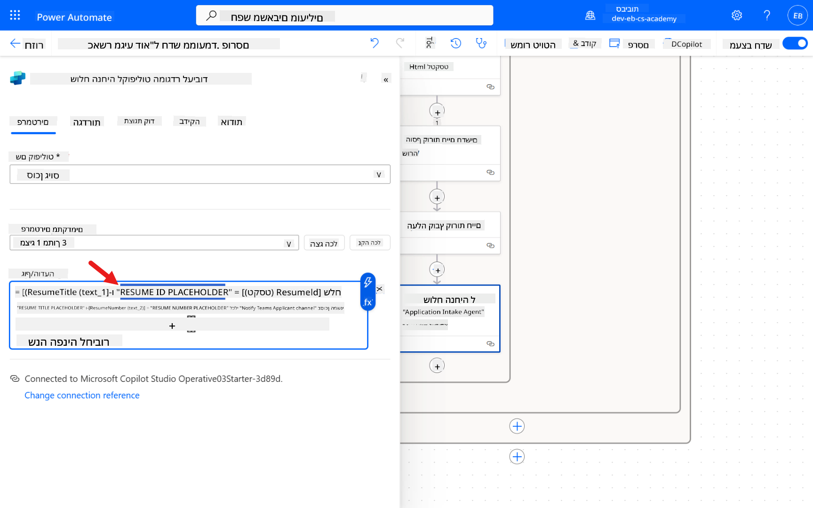

1. בחרו **אייקון הברק** או **אייקון fx** בצד ימין.

חפשו `resume` ובחרו את פרמטר **Resume** מפעולת Dataverse _הוספת שורה חדשה_, שכן הוא מכיל את ערך ה-ID של שורת קורות החיים שנוצרה.

בחרו **Add**.

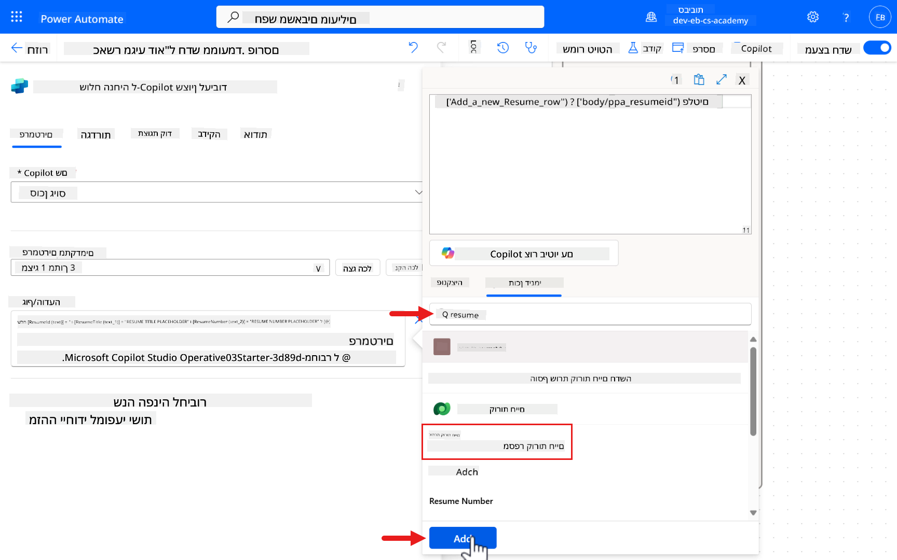

1. הדגישו את `RESUME TITLE PLACEHOLDER`. בחרו **אייקון הברק** או **אייקון fx** בצד ימין.

חפשו `title` ובחרו את פרמטר **Resume Title** מפעולת Dataverse _הוספת שורה חדשה_, שכן הוא מכיל את ערך כותרת קורות החיים של השורה שנוצרה.

בחרו **Add**.

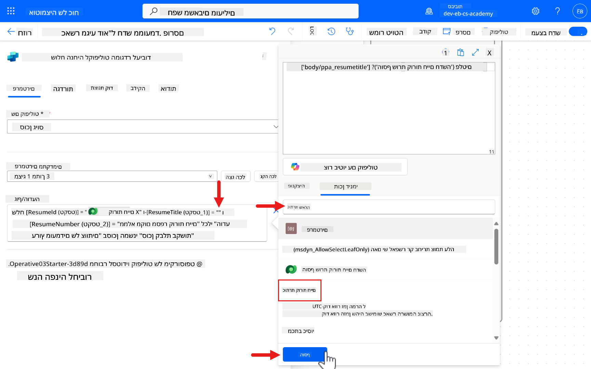

1. הדגישו את `RESUME NUMBER PLACEHOLDER`. בחרו **אייקון הברק** או **אייקון fx** בצד ימין.

חפשו `resume number` ובחרו את פרמטר **Resume Number** מפעולת Dataverse _הוספת שורה חדשה_, שכן הוא מכיל את ערך מספר קורות החיים של השורה שנוצרה.

בחרו **Add**.

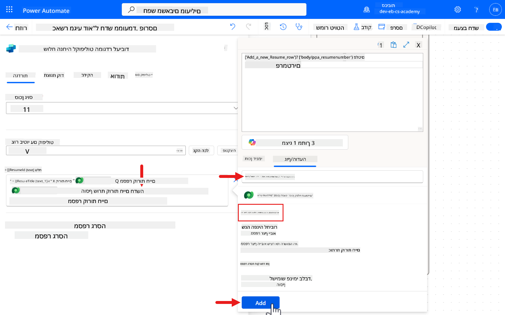

1. סיימנו להגדיר את הפעולה הזו ואת זרימת הסוכן שלנו 🙌🏻 אתם עושים עבודה נהדרת! עכשיו נשמור את זרימת האירוע שלנו על ידי בחירת **Save draft**.

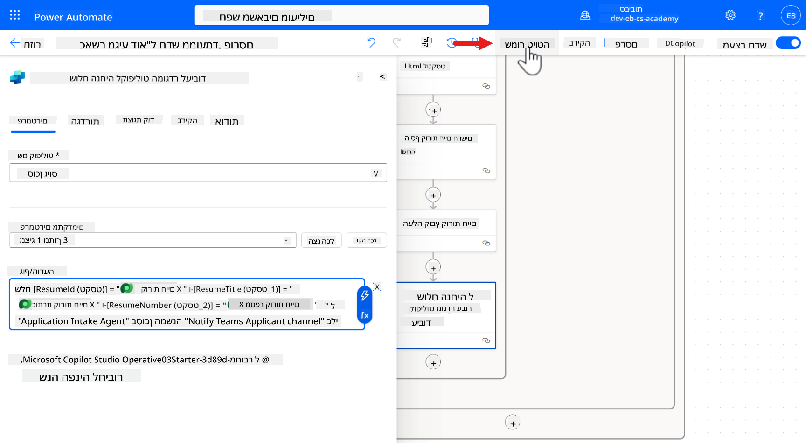

1. כעת עלינו לערוך את פרטי זרימת הסוכן, בחרו **Back**.

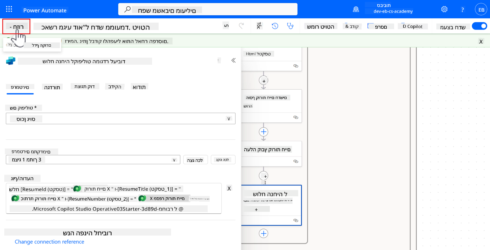

1. בחרו **Edit** בסעיף **Details** ועדכנו את **Plan** לאפשרות **Copilot Studio**.

בחרו **Save**.

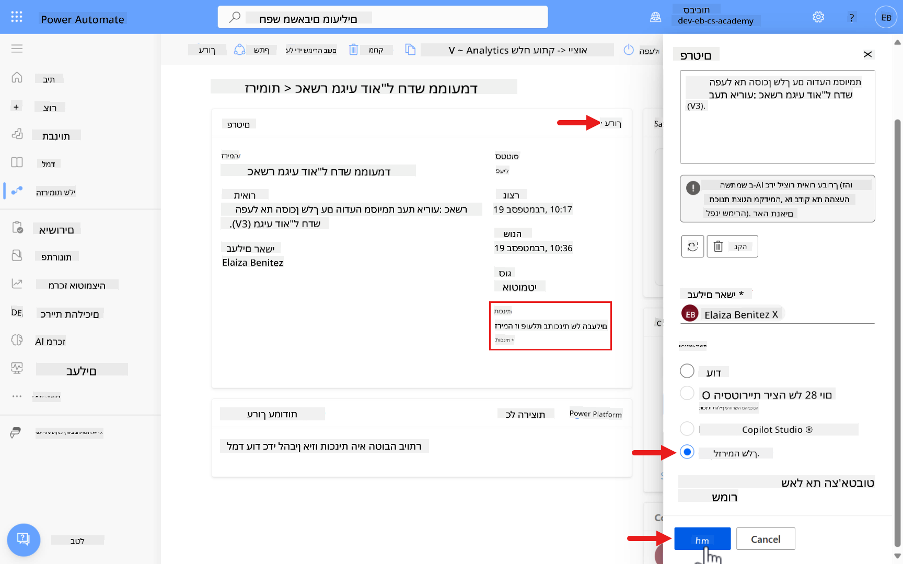

1. יופיע מודאל שיבקש מכם לאשר מעבר לתוכנית Copilot Studio. בחרו **Confirm**.

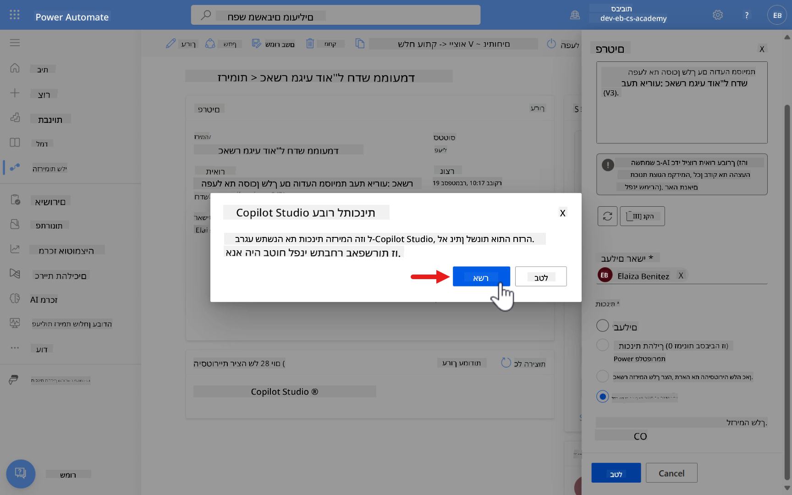

1. התוכנית עודכנה כעת ל-**Copilot Studio**. בחרו **Edit** מכיוון שעלינו לפרסם את זרימת האירוע עבור הסוכן שלנו.

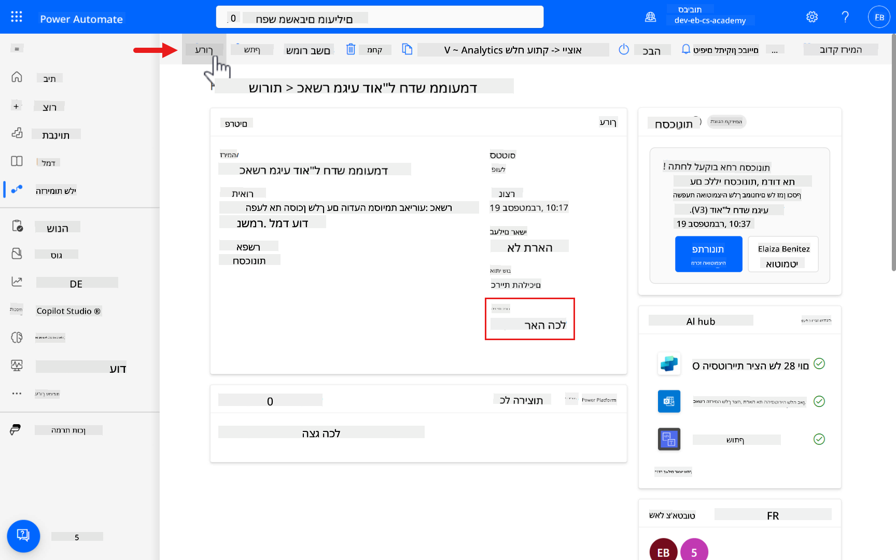

1. בחרו **Publish**.

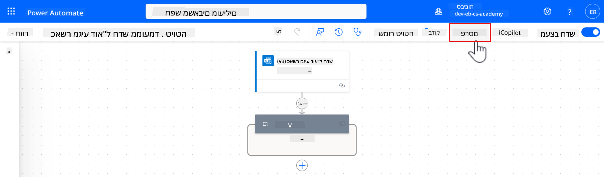

יש! זרימת האירוע פורסמה עכשיו 😃

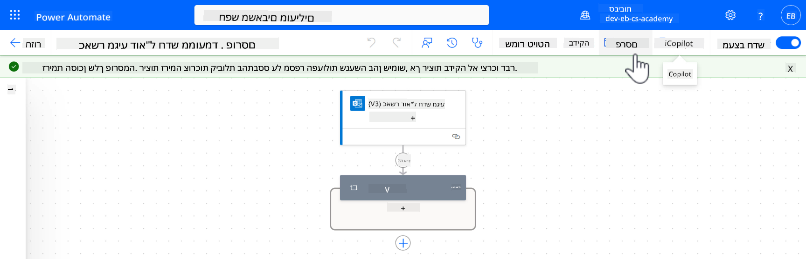

בואו נמשיך ביצירת זרימת סוכן חדשה שתופעל על ידי **סוכן קבלת הבקשות**.

### מעבדה 3.2 - הודעה לערוץ Teams באמצעות כרטיס אדפטיבי

כעת ניצור זרימת סוכן חדשה עבור **סוכן קבלת הבקשות** שמשתמש בערכים שהועברו על ידי טריגר האירוע, כדי לפרסם כרטיס אדפטיבי לערוץ Teams. כרטיס אדפטיבי זה יתריע בפני צוות הגיוס של משאבי אנוש על קובץ ה-PDF שהועלה אוטומטית כדי שיוכלו לבדוק אותו.

בואו נתחיל!

1. ב-**סוכן הגיוס** בחרו בכרטיסיית **Agents** ובחרו את **סוכן קבלת הבקשות**.

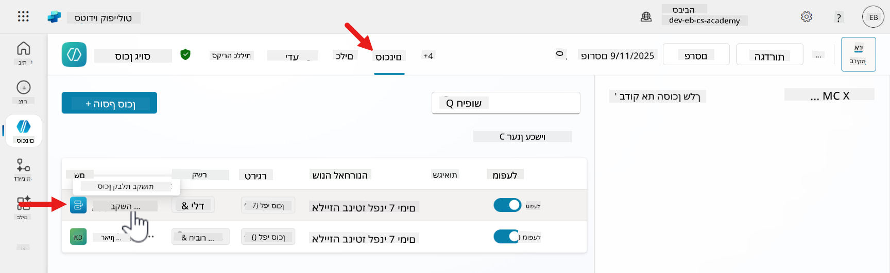

1. גללו למטה ל-**Tools** ובחרו **+ Add**.

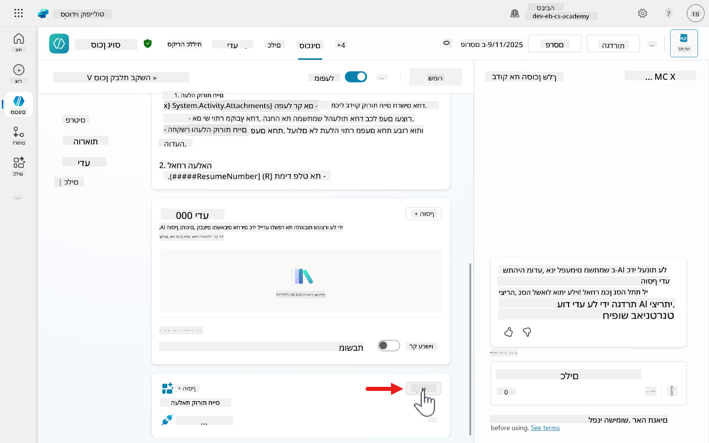

1. יופיע מודאל **Add tool**. בחרו **+ New tool**.

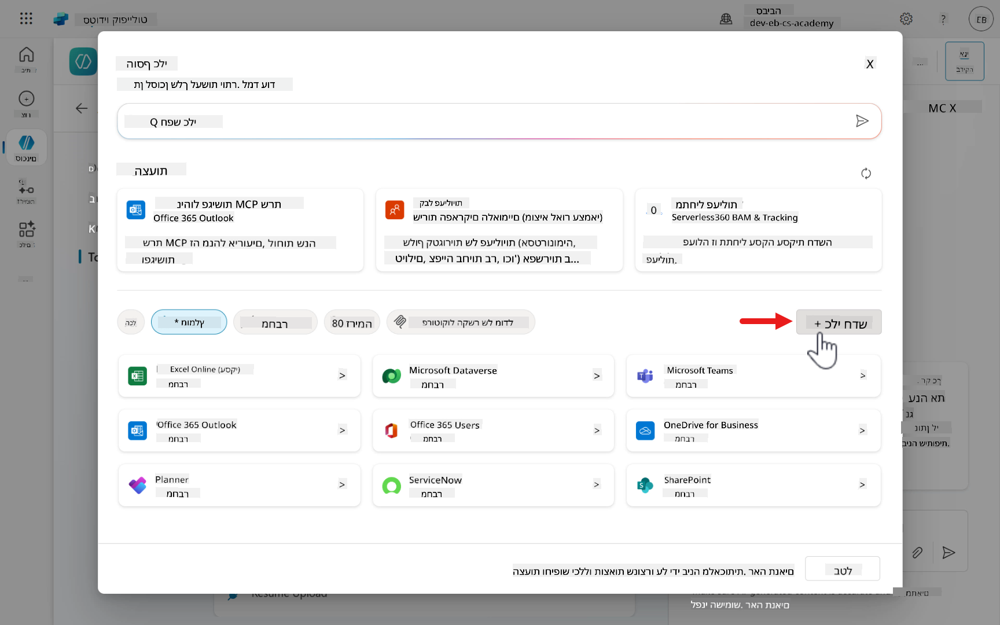

1. בחרו **Agent flow**.

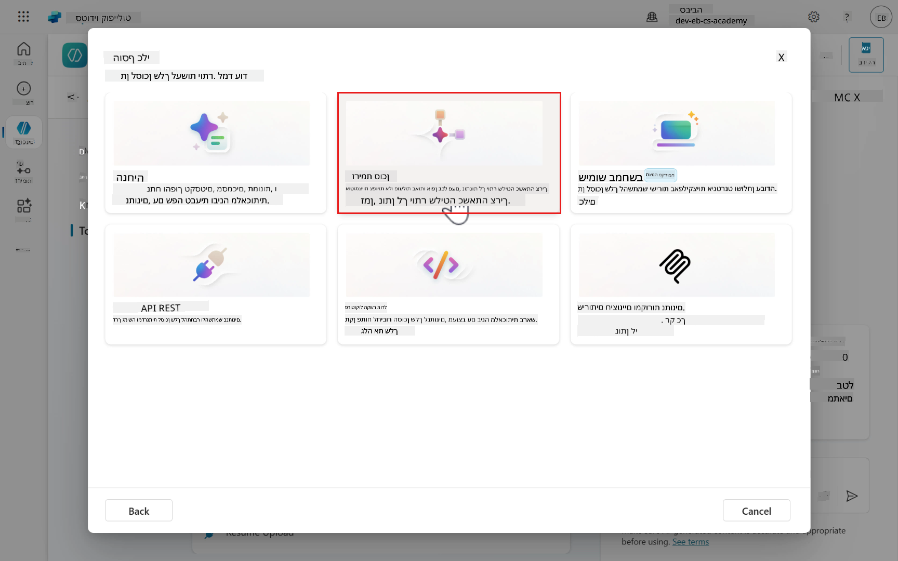

1. לאחר מכן ייטען **מעצב זרימת הסוכן**. בטריגר **When an agent calls the flow**, בחרו **+ Add an input**.


1. בחרו **Text** כסוג קלט המשתמש.


1. בשדה הטקסט של הקלט, העתקו והדביקו את השם הבא עבור פרמטר הקלט.

```text
ResumeId
```


1. חזרו על אותם שלבים כדי להוסיף קלט טקסט שני. העתקו והדביקו את השם הבא עבור פרמטר הקלט.

```text
ResumeTitle
```


1. חזרו על אותם שלבים כדי להוסיף קלט טקסט שלישי. העתקו והדביקו את השם הבא עבור פרמטר הקלט.

```text
ResumeNumber
```


1. זוכרים איך ב-[Recruit](../../recruit/08-add-adaptive-card/README.md#81-create-a-new-topic-with-an-adaptive-card-for-user-to-submit-their-request) הוספנו כרטיס אדפטיבי בתוך נושא עבור הסוכן שלנו? הפעם, נוסיף כרטיס אדפטיבי בזרימת סוכן. כעת נוסיף פעולה נוספת לזרימת הסוכן שלנו שתפרסם כרטיס אדפטיבי לערוץ Teams.

בחרו **אייקון +** מתחת לטריגר.


1. בחרו בפעולה **Post card in a chat or channel**.


1. יש ליצור הפניה לחיבור ל-Microsoft Teams עם חשבון המשתמש שלכם. בחרו **Sign in**.


1. בחרו את חשבון המשתמש שלכם ואז בחרו **Allow access**.


1. עבור פרמטרי הקלט הבאים,

| פרמטר | איך להגדיר | פרטים |
|----------|------------|---------|
| **Post as** | תפריט נפתח | בחרו באפשרות `Flow bot` |
| **Post in** | תפריט נפתח | בחרו באפשרות `Channel` |
| **Team** | תפריט נפתח | בחרו צוות שזמין בסביבתכם ושיש לכם גישה אליו לצורך ביצוע תרגיל מעבדה זה |
| **Channel** | תפריט נפתח | בחרו ערוץ שזמין בסביבתכם ושיש לכם גישה אליו לצורך ביצוע תרגיל מעבדה זה |


1. כעת, נגדיר את שדה **Adaptive Card**. בחרו בשדה **Adaptive Card**.


1. פתחו את [קובץ JSON של טבלת קורות חיים מעודכנת](../../../../../docs/operative-preview/03-automate-triggers/assets/3.2_ResumeTableUpdated.json), העתיקו את כל תוכנו והדביקו אותו לשדה כרטיס אדפטיבי.


1. בדומה למה שעשינו ב-[Recruit](../../recruit/08-add-adaptive-card/README.md#81-create-a-new-topic-with-an-adaptive-card-for-user-to-submit-their-request), נחליף ערכים קיימים ב-JSON עם ערכים אמיתיים או תוכן דינמי.

ראשית, נעדכן את ה-URL עבור תכונת `url` בתוך תכונת `selectAction`. URL זה יוחלף בכתובת ה-URL של תצוגת המערכת של קורות החיים באפליקציית **Hiring Hub** המונעת-מודל. זה יאפשר למגייס לבחור את הפעולה ולהיות מופנה לתצוגת המערכת של קורות החיים באפליקציה המונעת-מודל.

הדגישו את ערך ה-URL הנוכחי ומחקו אותו.


1. באפליקציית **Hiring Hub** המונעת-מודל, נווטו לתצוגת המערכת של **Resumes** באמצעות תפריט הצד השמאלי והעתיקו את ה-URL. לאחר מכן, חזרו לזרימת הסוכן והדביקו את ה-URL שהועתק לתכונת **url** בתוך תכונת `selectAction`.


1. אתם אמורים לראות את הפרטים הבאים, כאשר המסומן בצהוב הוא פרטי הסביבה של אפליקציית **Hiring Hub** המונעת על ידי מודל.

     | פרמטר | ערך | הסבר |
     |----------|------------|---------|
     | **Organization URI** | GUID | כתובת ה-URL של ארגון הסביבה של Dataverse/Dynamics 365 |
     | **appid** | GUID | לפתיחת אפליקציה מונעת על ידי מודל ספציפי, נעשה שימוש בפרמטר השאילתה appid או appname. במקרה זה, נעשה שימוש ב-appid |
     | **viewid** | GUID | פרמטר השאילתה שהוא מזהה התצוגה |

       

1. כעת נוסיף ערכים של תוכן דינמי למספר מאפיינים. נתחיל עם הטקסט שיציג את מספר קורות החיים של השורה שנוצרה באופן אוטונומי על ידי טריגר האירוע.

      בחרו באייקון **panel** כדי לטעון את לוח הפעולות.

       

1. גללו למטה לשורה שבה אתם רואים את מאפיין `text` עבור `RESUME NUMBER PLACEHOLDER`. סמנו את ערך המיקום ומחקו אותו.

       

1. לחצו בין סימני הציטוט הכפולים ובחרו באייקון **lightning bolt** או **fx icon** בצד ימין.

      בלשונית **Dynamic Content** בחרו בפרמטר **ResumeNumber** ולחצו על **Add**.

       

1. פרמטר **ResumeNumber** יתווסף כעת כתוכן דינמי למאפיין `text`.

       

1. נחזור על אותם צעדים עבור `RESUME NAME PLACEHOLDER`. גללו למטה לשורה שבה אתם רואים את מאפיין `text` עבור `RESUME NAME PLACEHOLDER`. סמנו את ערך המיקום ומחקו אותו.

       

1. לחצו בין סימני הציטוט הכפולים ובחרו באייקון **lightning bolt** או **fx icon** בצד ימין.

      בלשונית **Dynamic Content** בחרו בפרמטר **ResumeTitle** ולחצו על **Add**.

       

1. פרמטר **ResumeTitle** יתווסף כעת כתוכן דינמי למאפיין `text`.

       

1. נחזור על אותם צעדים עבור ערך **Due Date** שמייצג את המועד שבו המגייס צריך לעיין בקורות החיים. גללו למטה לשורה שבה אתם רואים את מאפיין `text` עבור `May 21, 2023`.

       

1. מחקו את ערך המיקום של תאריך זה ולחצו בין סימני הציטוט הכפולים.

       

1. בחרו באייקון **lightning bolt** או **fx icon** בצד ימין ובלשונית **Function**, הזינו את הביטוי הבא ולחצו על **Add**.

       ```text
       addDays(utcNow(), 3, 'MMM dd, yyyy')
       ```

      ביטוי זה משתמש בשתי פונקציות.

     | פונקציה | הסבר |
     |----------|------------|
     | **addDays** | מוסיף מספר ימים מסוים לתאריך נתון ומחזיר את התאריך המתקבל בפורמט מחרוזת |
     | **utcNow** | מחזיר את התאריך והשעה הנוכחיים בפורמט זמן אוניברסלי מתואם (UTC) כמחרוזת. |

      עבור ערך utcNow, אנו מעצבים את התאריך להיות חודש ותאריך, ואחריו השנה.

       

      הביטוי יתווסף כעת למאפיין `text`.

       

1. לבסוף, נעדכן את ה-URL עבור מאפיין `url` בתוך מאפיין מערך `actions` בתחתית מטען ה-JSON. כתובת ה-URL הנוכחית של המיקום תוחלף בכתובת ה-URL של שורת קורות החיים באפליקציית **Hiring Hub** המונעת על ידי מודל. זה יאפשר למגייס לבחור בפעולה `Action.OpenURL` של הכרטיס האדפטיבי ולהיות מופנה לקורות החיים באפליקציה המונעת על ידי מודל.

       

1. באפליקציית **Hiring Hub** המונעת על ידי מודל, פתחו שורה בתצוגת מערכת **Resumes** באמצעות תפריט הצד השמאלי. שורת קורות החיים תיטען כטופס באפליקציה המונעת על ידי מודל.

      העתיקו את כתובת ה-URL של שורת קורות החיים.

    ??? מידע "איך לחזור לאפליקציית **Hiring Hub** המונעת על ידי מודל במקרה שיצאתם/סגרתם אותה"

        1. גלשו ל-[https://make.powerapps.com](https://make.powerapps.com) וודאו שאתם בסביבת הפיתוח שבה אתם משתמשים עבור תרגילי המעבדה הללו, אחרת עברו אליה.
        
        

        1. בחרו ב-**Apps** בלוח התפריט בצד שמאל ובאפליקציית **Hiring Hub** המונעת על ידי מודל, בחרו באייקון **Play** כדי לטעון אותה בדפדפן שלכם.
        
        

       

1. לאחר מכן, חזרו לזרימת הסוכן, סמנו את ערך כתובת ה-URL הנוכחית של המיקום ומחקו אותו.

       

1. לאחר מכן, הדביקו את כתובת ה-URL שהועתקה למאפיין **url** בתוך מאפיין `url`.

       

1. אתם אמורים לראות את הבאים. מחקו את ערך מזהה ה-GUID בסוף. נחליף תוכן דינמי - הפרמטר **ResumeId**.

       

1. בחרו באייקון **lightning bolt** או **fx icon** בצד ימין.

      בלשונית **Dynamic Content** בחרו בפרמטר **ResumeId** ולחצו על **Add**.

       

1. פרמטר **ResumeId** יתווסף כתוכן דינמי. המסומן בצהוב הוא פרטי הסביבה של אפליקציית **Hiring Hub** המונעת על ידי מודל.

     | פרמטר | ערך | הסבר |
     |----------|------------|---------|
     | **Organization URI** | GUID | כתובת ה-URL של ארגון הסביבה של Dataverse/Dynamics 365 |
     | **appid** | GUID | לפתיחת אפליקציה מונעת על ידי מודל ספציפי, נעשה שימוש בפרמטר השאילתה appid או appname. במקרה זה, נעשה שימוש ב-appid |
     | **id** | GUID | פרמטר השאילתה שהוא מזהה שורת קורות החיים |

       

1. סיימנו להגדיר את הפעולה **Post card in a chat or channel** 👏🏻 צאו מלוח הגדרת הפעולה על ידי בחירת אייקון **x**.

       

1. לבסוף, נגדיר את הפעולה האחרונה, **Respond to the agent**, על ידי שליחת טקסט חזרה לסוכן לסיום העיבוד.

      בפעולה **Respond to the agent**, בחרו ב-**+Add an output**.

       

1. בחרו ב-**Text** כסוג הפלט.

       

1. הזינו את הבאים כשם הפלט.

       

1. הזינו את הבאים כערך הפלט.

       ```text
       Finished
       ```

       

1. סיימנו להגדיר את זרימת הסוכן. בחרו ב-**Save draft** כדי לשמור את זרימת הסוכן. הודעת אישור תופיע לאחר השמירה.

       

1. לפני פרסום זרימת הסוכן, עלינו לעדכן את הפרטים עבור זרימת הסוכן. בחרו בלשונית **Overview** ובחרו ב-**Edit**.

      בשדה שם הזרימה, הזינו את הבאים.

       ```text
       Notify Teams Applicant channel
       ```      

      לאחר מכן, בחרו באייקון **Refresh** כדי לעדכן את תיאור זרימת הסוכן באמצעות AI.

      לאחר מכן, בחרו ב-**Save** כדי לשמור את הפרטים המעודכנים עבור זרימת הסוכן.

       

1. חזרו ללשונית **Designer** ובחרו ב-**Publish** כדי לפרסם את זרימת הסוכן. הודעת אישור תופיע לאחר השמירה.

       

1. כעת יש להוסיף את זרימת הסוכן ככלי ב-**Application Intake Agent**. חזרו ל-**Hiring Agent** ובחרו בלשונית **Agents**, לאחר מכן בחרו ב-**Application Intake Agent**.

       

1. בסעיף **Details** של הסוכן, נעדכן את שדה **Description**. העתיקו את הבאים והדביקו בסוף טקסט התיאור.

       ```text
       and also notify the Teams Applicant channel
       ```

       

1. לאחר מכן, נוסיף את זרימת הסוכן ככלי. גללו למטה ובחרו ב-**+ Add**.

       

1. בחרו בזרימת הסוכן שנוצרה קודם, **Notify Teams Applicant Channel**.

       

1. לאחר מכן, בחרו ב-**Add and configure**.

       

1. בסעיף **Inputs** של זרימת הסוכן, שלושת הקלטים שהגדרנו קודם בזרימת הסוכן נראים. כברירת מחדל, הגדרת **Fill using** מוגדרת ל-**Dynamically fill with AI**. נשאיר הגדרה זו כפי שהיא, מכיוון שההנחיה מטריגר האירוע (בפעולה האחרונה, **Sends a prompt to the specified copilot for processing** - זהו שלבים 38-44 של **Lab 3.1 - Automate uploading resumes to Dataverse received by email**) תכיל את ערכי הפרמטרים שה-AI יחלץ.

       

1. כעת שהכלי נוסף ל-**Application Intake Agent**, יש לעדכן את ההוראות של הסוכן. בחרו באייקון **back arrow** כדי לחזור לרשימת הסוכנים.

       

1. בחרו ב-**Application Intake Agent** בלשונית **Agents** של **Hiring Agent**.

       

1. בשדה **Instructions**, הזינו שורה חדשה לאחר הוראות `2.Post-Upload`. העתיקו והדביקו את ההוראות הבאות.

       ```text
       Process for Resume Upload via Email
       1. When you receive a message, **Send [ResumeId (text)] = "1680265f-5793-f011-b41b-7c1e525be9f7" and [ResumeTitle (text_1)] = "TAYLOR TESTPERSON (FICTITIOUS).pdf" and [ResumeNumber (text_2)]= "R01026" to the Tool "Notify Teams Applicant channel"** in the child agent "Application Intake Agent", call [AGENT FLOW PLACEHOLDER]
       ```

       

1. סמנו את הטקסט `[AGENT FLOW PLACEHOLDER`.

       

1. הזינו את תו הלוכסן, `/`, ובחרו בכלי **Notify Teams Applicant Channel**.

       
1. זרימת הסוכן תופעל כעת על ידי **סוכן קבלת הבקשות** בהתאם להוראות, לאחר הפעולה האחרונה (**שולח הנחיה לקופילוט המוגדר לעיבוד**) בהפעלת האירוע שולחת את ההנחיה שמכילה את ערכי הפרמטרים חזרה לסוכן.

      בחרו **שמור** כדי לשמור את ההוראות המעודכנות עבור **סוכן קבלת הבקשות**.

       

1. ההוראות יעודכנו כעת לאחר שהסוכן נשמר.

       

1. כעת עלינו **לפרסם** את **סוכן הגיוס**. בחרו **פרסם** בפינה הימנית העליונה, ובחלון _פרסם את הסוכן הזה_ שמופיע, בחרו **פרסם**.

       

1. לאחר הפרסום, תופיע הודעת אישור שהסוכן פורסם.

       

כעת ניתן לבדוק את הסוכן!

### מעבדה 3.3 - בדיקת הפעלת אירוע

1. כדי להפעיל את האירוע, יש לשלוח אימייל עם קובץ PDF של קורות חיים. ב-Outlook, כתבו הודעת אימייל חדשה.

     | רכיב אימייל | פרטים |
     |----------|------------|
     | **לנמען** | השתמשו בחשבון המשתמש המחובר שלכם כערך |
     | **קובץ מצורף** | העלו את הקובץ [TAYLOR TESTPERSON (FICTITIOUS)](../../../../../docs/operative-preview/test-data/resumes/TAYLOR%20TESTPERSON%20(FICTITIOUS).pdf) |
     | **גוף ההודעה** | העתיקו והדביקו את הטקסט הבא כגוף ההודעה |

       ```text
       מנהל גיוס יקר,

       אני כותב כדי להביע את ענייני במשרת מהנדס פלטפורמת Power בכיר בארגונכם. עם ניסיון של מעל תשע שנים במתן פתרונות מאובטחים וניתנים להרחבה על פלטפורמות הענן של מיקרוסופט, אני בטוח ביכולתי לתרום באופן אפקטיבי לצוות שלכם.

       בתפקידי האחרון כמהנדס פלטפורמת Power ראשי, פיתחתי צינור קליטת קורות חיים אוטומטי, שהפחית את הצורך במיון ידני ושיפר את יכולת החיפוש. סיפקתי יישומי ניהול מקרים בתחום משאבי אנוש, הצגתי זרימות מודעות לפתרונות, ויישמתי בדיקות PR לשיפור זמני הפריסה. המומחיות שלי כוללת את Power Apps, Power Automate, Power Pages, Dataverse, ומגוון שירותי Microsoft 365, כמו גם אינטגרציה עם Graph/REST APIs ו-Azure Functions.

       בעבר, פיתחתי אישורים ב-Teams עם כרטיסים אדפטיביים, שהפחיתו את זמני האישור ליום אחד, ויצרתי מסגרות טיפול בשגיאות חזקות. הרקע שלי כולל גם מעבר של זרימות עבודה ישנות ל-Power Automate ובניית פורטלים לשירות עצמי שאומצו על ידי מאות עובדים.

       אני בעל תואר ראשון במדעי המחשב ומוסמך כ-מפתח פלטפורמת Power (PL-400) וכאדריכל פתרונות (PL-600). אני גם נלהב מהדרכה והתנדבתי בקבוצות יצרנים מקומיות.

       אנא מצאו את קורות החיים שלי מצורפים לשיקולכם. אשמח להזדמנות לדון כיצד הכישורים והניסיון שלי מתאימים לצרכים שלכם.

       תודה על זמנכם ותשומת הלב.

       בברכה,
       טיילור טסטפרסון
       ```

       **שלחו** את האימייל לאחר שכתבתם אותו.

       

1. בפורטל Power Automate עבור זרימת הפעלת האירוע, בחרו באייקון **רענן** כדי לצפות בהרצת הזרימה שהצליחה עבור האימייל שנשלח.

       

1. חזרו ל-Copilot Studio ב-**סוכן הגיוס** ובחרו בכרטיסיית **פעילות**.

       

1. כרטיסיית **פעילות** תיטען ותציג את כל הפעילויות של **סוכן הגיוס**. תהיה פעילות עם שם **אוטומטי** ובסטטוס **הושלם**. פעילות זו מייצגת את הפעלת האירוע ואת זרימת הסוכן שהופעלה.

       

1. בחרו בפעילות, ובחרו בהפעלת האירוע במפת הפעילות. בלוח הצד הימני, שימו לב כיצד הפרמטרים בהנחיה מכילים את ערכי הפרמטרים `Resume Id`, `Resume Title` ו-`Resume Number` מהשורה ב-**Dataverse** שנוצרה. זה נובע מערכי התוכן הדינמיים שהוגדרו קודם לכן בשלבים 18 - 27 של **מעבדה 3.1 - אוטומציה של העלאת קורות חיים ל-Dataverse שהתקבלו באימייל**.

       

1. חזרו לאפליקציית **Hiring Hub** המונעת על ידי מודל ובתצוגת מערכת **קורות חיים**, בחרו **רענן** כדי לרענן את התצוגה. השורה החדשה שנוצרה עבור קורות החיים שנשלחו באימייל תופיע כעת, כפי שנוצרה דרך הפעלת האירוע.

       

1. חזרו ל-Copilot Studio ובחרו בזרימת הסוכן **Notify Teams Applicant Channel** בתוך **סוכן קבלת הבקשות** במפת הפעילות. בלוח הצד הימני, שימו לב כיצד הקלטים מכילים ערכים מהשורה ב-Dataverse. זה נובע מההנחיה שנשלחה על ידי הפעולה האחרונה (**שולח הנחיה לקופילוט המוגדר לעיבוד**) בהפעלת האירוע שמכילה את ערכי הפרמטרים מהשורה החדשה שנוצרה ב-Dataverse. כך ניתן להעביר ערכי פרמטרים מהפעלת אירועים לזרימות סוכן.

       

1. לבסוף, בואו נסתכל על הכרטיס האדפטיבי שפורסם לערוץ ב-**Microsoft Teams**. בערוץ, נראה את הכרטיס האדפטיבי שמציג את המידע על השורה החדשה של קורות החיים ב-Dataverse. רחפו מעל הקישור בתחילת הכרטיס האדפטיבי, שימו לב כיצד כתובת ה-URL היא כתובת תצוגת מערכת קורות החיים שהוגדרה קודם לכן ב-JSON (שלבים 15 - 19 של **מעבדה 3.2 - הודעה לערוץ Teams באמצעות כרטיס אדפטיבי**) של הכרטיס האדפטיבי.

       

1. בחרו בקישור, ותועברו לתצוגת מערכת קורות החיים באפליקציית **Hiring Hub** המונעת על ידי מודל בדפדפן שלכם.

       

1. חזרו לכרטיס האדפטיבי שפורסם לערוץ ב-Microsoft Teams. הפעם, רחפו מעל **צפה בקורות חיים** שהוא הפעולה `Action.OpenURL` של הכרטיס האדפטיבי. שימו לב כיצד כתובת ה-URL היא השורה של קורות החיים שהוגדרה קודם לכן ב-JSON (שלבים 30 - 36 של **מעבדה 3.2 - הודעה לערוץ Teams באמצעות כרטיס אדפטיבי**) של הכרטיס האדפטיבי.

       

1. בחרו בפעולה, ותועברו לטופס השורה של קורות החיים באפליקציית **Hiring Hub** המונעת על ידי מודל בדפדפן שלכם.

       

## ✅ משימה הושלמה

ברכות! 👏🏻 עבודה מצוינת, אופרטיבי.

✅ הפעלת אירוע: יצרתם הפעלת אירוע שמעבירה ערכי פרמטרים מ-Dataverse לזרימת סוכן.  
✅ בניית זרימת סוכן: צריכת ערכי פרמטרים מ-Dataverse כדי לפרסם כרטיס אדפטיבי לערוץ ב-Microsoft Teams להתריע לצוות הגיוס של משאבי אנוש.  
✅ עדכון הוראות סוכן משנה: להפעלת הזרימה לאחר שהפעלת האירוע הושלמה.

זה מאפשר ל-**סוכן הגיוס** לעבוד באופן עצמאי בכל פעם שקורות חיים מתקבלים כקבצים מצורפים באימייל ולהודיע לצוות הגיוס של משאבי אנוש לביקורת ידנית.

זהו סוף **מעבדה 03 - אוטומציה של אימיילים של בקשות מועמדים**, בחרו בקישור למטה כדי לעבור לשיעור הבא.

⏭️ [עברו לשיעור **כתיבת הוראות סוכן**](../04-agent-instructions/README.md)

## 📚 משאבים טקטיים

📖 [הפכו את הסוכן שלכם לאוטונומי ב-Copilot Studio](https://learn.microsoft.com/training/modules/autonomous-agents-online-workshop/?WT.mc_id=power-188561-ebenitez)

📖 [הוספת הפעלת אירוע](https://learn.microsoft.com/microsoft-copilot-studio/authoring-trigger-event?WT.mc_id=power-188561-ebenitez)

📖 [שימוש בזרימות סוכן עם הסוכן שלכם](https://learn.microsoft.com/microsoft-copilot-studio/advanced-flow?WT.mc_id=power-188561-ebenitez)

📖 [מבוא להפעלות ב-Power Automate](https://learn.microsoft.com/power-automate/triggers-introduction?WT.mc_id=power-188561-ebenitez)

📖 [שימוש בזרימות Power Automate עם סוכנים](https://learn.microsoft.com/microsoft-copilot-studio/advanced-flow-create?WT.mc_id=power-188561-ebenitez)

📖 [מניעת אובדן נתונים עבור Copilot Studio](https://learn.microsoft.com/microsoft-copilot-studio/admin-data-loss-prevention?WT.mc_id=power-188561-ebenitez)

---

**הצהרת אחריות**:  
מסמך זה תורגם באמצעות שירות תרגום AI [Co-op Translator](https://github.com/Azure/co-op-translator). למרות שאנו שואפים לדיוק, יש לקחת בחשבון שתרגומים אוטומטיים עשויים להכיל שגיאות או אי דיוקים. המסמך המקורי בשפתו המקורית צריך להיחשב כמקור סמכותי. למידע קריטי, מומלץ להשתמש בתרגום מקצועי אנושי. איננו אחראים לאי הבנות או לפרשנויות שגויות הנובעות משימוש בתרגום זה.