<!--
CO_OP_TRANSLATOR_METADATA:
{
  "original_hash": "616d142d4fb5f45d2a168fad6c1f9545",
  "translation_date": "2025-10-17T02:03:00+00:00",
  "source_file": "docs/operative-preview/07-multimodal-prompts/README.md",
  "language_code": "he"
}
-->
# 🚨 משימה 07: חילוץ תוכן מקורות חיים עם הנחיות מולטימודליות

--8<-- "disclaimer.md"

## 🕵️‍♂️ שם קוד: `DOCUMENT RESUME RECON`

> **⏱️ חלון זמן לביצוע:** `~45 דקות`

## 🎯 תדריך משימה

ברוך הבא, סוכן. המשימות הקודמות שלך ציידו אותך בכישורי תזמור סוכנים עוצמתיים, אך כעת הגיע הזמן לפתוח יכולת משנה משחק: **ניתוח מסמכים מולטימודלי**.

המשימה שלך, אם תבחר לקבל אותה, היא **Document Resume Recon** - חילוץ נתונים מובנים מכל מסמך בדיוק רב. בעוד שהסוכנים שלך יכולים לעבד טקסט בקלות, העולם האמיתי דורש טיפול בקבצי PDF, תמונות ומסמכים מורכבים מדי יום. קורות חיים נערמים, חשבוניות דורשות עיבוד, וטפסים דורשים דיגיטציה מיידית.

משימה זו תהפוך אותך מבונה סוכנים מבוססי טקסט בלבד למומחה מולטימודלי. תלמד להגדיר AI שקורא ומבין מסמכים כמו אנליסט אנושי - אך במהירות וביציבות של AI. בסיום המשימה, תבנה מערכת שלמה לחילוץ קורות חיים שמשתלבת עם תהליך הגיוס שלך.

הטכניקות שתלמד כאן יהיו חיוניות לפעולות עיגון נתונים מתקדמות במשימה הבאה שלך.

## 🔎 מטרות

במשימה זו תלמד:

1. מהן הנחיות מולטימודליות ומתי להשתמש במודלים שונים של AI
1. כיצד להגדיר הנחיות עם קלטי תמונה ומסמכים
1. כיצד לעצב פלט הנחיות כ-JSON לחילוץ נתונים מובנים
1. שיטות עבודה מומלצות להנדסת הנחיות עם ניתוח מסמכים
1. כיצד לשלב הנחיות מולטימודליות עם Agent Flows

## 🧠 הבנת הנחיות מולטימודליות

### מה הופך הנחיה ל"מולטימודלית"?

הנחיות מסורתיות פועלות רק עם טקסט. אך הנחיות מולטימודליות יכולות לעבד סוגי תוכן שונים:

- **טקסט**: הוראות ותוכן כתוב
- **תמונות**: תמונות, צילומי מסך, גרפים ודיאגרמות (.PNG, .JPG, .JPEG)  
- **מסמכים**: חשבוניות, קורות חיים, טפסים (.PDF)

יכולת זו פותחת תרחישים עוצמתיים כמו ניתוח קורות חיים, עיבוד חשבוניות או חילוץ נתונים מטפסים.

### למה מולטימודל חשוב לתהליכי העבודה שלך

בכל יום, הארגון שלך מתמודד עם אתגרי עיבוד מסמכים אלו:

- **סינון קורות חיים**: קריאה ידנית של מאות קורות חיים גוזלת זמן יקר
- **עיבוד חשבוניות**: חילוץ פרטי ספק, סכומים ותאריכים מפורמטים מסמכים שונים
- **ניתוח טפסים**: המרת טפסים מנייר לנתונים דיגיטליים

הנחיות מולטימודליות מבטלות צווארי בקבוק אלו על ידי שילוב הבנת שפה של AI עם יכולות ניתוח חזותי. זה מעניק ל-AI שלך את היכולת לעבד מסמכים באותה יעילות כמו טקסט.

### תרחישים עסקיים נפוצים

להלן כמה דוגמאות ליישום הנחיות מולטימודליות:

| תרחיש                | משימה                                                                                                                                      | שדות פלט לדוגמה                                                                                   |
|-------------------------|-------------------------------------------------------------------------------------------------------------------------------------------|---------------------------------------------------------------------------------------------------------|
| **סינון קורות חיים**    | חילוץ שם מועמד, אימייל, טלפון, תפקיד נוכחי, שנות ניסיון ומיומנויות עיקריות.                                                 | שם מועמד, כתובת אימייל, מספר טלפון, תפקיד נוכחי, שנות ניסיון, מיומנויות עיקריות         |
| **עיבוד חשבוניות**  | חילוץ פרטי ספק, תאריך חשבונית, סכום כולל ופרטי שורות מהחשבונית.                                                 | שם ספק, תאריך חשבונית, סכום כולל, פרטי שורות חשבונית                                             |
| **ניתוח טפסים**       | ניתוח טופס בקשה זה וחילוץ כל השדות המלאים.                                                                              | שם שדה (לדוגמה, שם מבקש), ערך שהוזן (לדוגמה, ג'ון דו), ...                                  |
| **אימות מסמכי זיהוי** | חילוץ שם, מספר זיהוי, תאריך תפוגה וכתובת ממסמך זיהוי זה. אימות שכל הטקסט קריא ודיווח על כל חלקים לא ברורים. | שם מלא, מספר זיהוי, תאריך תפוגה, כתובת, דגל חלקים לא ברורים                        |

## ⚙️ בחירת מודל ב-AI Builder

AI Builder מציע מודלים שונים המותאמים למשימות ספציפיות. הבנת איזה מודל להשתמש בו היא קריטית להצלחה.

!!! note "מדויק נכון לספטמבר 2025"
    מודלים של AI Builder מתעדכנים באופן קבוע, לכן בדוק את [תיעוד הגדרות מודלים של AI Builder](https://learn.microsoft.com/ai-builder/prompt-modelsettings) לקבלת זמינות מודלים עדכנית.

### השוואת מודלים

כל המודלים הבאים תומכים בראייה ועיבוד מסמכים

| מודל | 💰עלות | ⚡מהירות | ✅הכי מתאים ל |
|-------|------|-------|----------|
| **GPT-4.1 mini** | בסיסי (הכי חסכוני) | מהיר | עיבוד מסמכים סטנדרטי, סיכום, פרויקטים חסכוניים |
| **GPT-4.1** | סטנדרטי | בינוני | מסמכים מורכבים, יצירת תוכן מתקדמת, צרכים דיוק גבוהים |
| **o3** | פרימיום | איטי (מחשבה תחילה) | ניתוח נתונים, חשיבה ביקורתית, פתרון בעיות מתוחכם |
| **GPT-5 chat** | סטנדרטי | משופר | הבנת מסמכים עדכנית, דיוק תגובה גבוה ביותר |
| **GPT-5 reasoning** | פרימיום | איטי (ניתוח מורכב) | ניתוח מתוחכם ביותר, תכנון, חשיבה מתקדמת |

### הסבר על הגדרות טמפרטורה

טמפרטורה שולטת עד כמה התגובות של AI יצירתיות או צפויות:

- **טמפרטורה 0**: תוצאות צפויות ביותר, עקביות (הכי טוב לחילוץ נתונים)
- **טמפרטורה 0.5**: איזון בין יצירתיות לעקביות  
- **טמפרטורה 1**: יצירתיות מקסימלית (הכי טוב ליצירת תוכן)

לניתוח מסמכים, השתמש ב-**טמפרטורה 0** כדי להבטיח חילוץ נתונים עקבי.

## 📊 פורמטי פלט: טקסט מול JSON

בחירת פורמט הפלט הנכון היא קריטית לעיבוד בהמשך.

### מתי להשתמש בפלט טקסט

פלט טקסט מתאים ל:

- סיכומים קריאים לאדם
- סיווגים פשוטים
- תוכן שאינו דורש עיבוד מובנה

### מתי להשתמש בפלט JSON

פלט JSON חיוני ל:

- חילוץ נתונים מובנים
- שילוב עם מסדי נתונים או מערכות
- עיבוד זרימות Power Automate
- מיפוי שדות עקבי

### שיטות עבודה מומלצות ל-JSON

1. **הגדר שמות שדות ברורים**: השתמש בשמות תיאוריים ועקביים
1. **ספק דוגמאות**: כלול פלט ודוגמאות ערכים לכל שדה
1. **ציין סוגי נתונים**: כלול דוגמאות לתאריכים, מספרים וטקסט
1. **טפל בנתונים חסרים**: תכנן ערכים null או ריקים
1. **אמת מבנה**: בדוק עם סוגי מסמכים שונים

### שיקולי איכות מסמכים

- **רזולוציה**: ודא שהתמונות ברורות וקריאות
- **כיוון**: סובב מסמכים לכיוון הנכון לפני העיבוד
- **תמיכה בפורמט**: בדוק עם סוגי המסמכים הספציפיים שלך (PDF, JPG, PNG)
- **מגבלות גודל**: היה מודע למגבלות גודל קובץ בסביבתך

### אופטימיזציה לביצועים

- **בחר מודלים מתאימים**: שדרג מודלים רק כשצריך
- **אופטימיזציה להנחיות**: לעיתים קרובות, הוראות קצרות וברורות מבצעות טוב יותר
- **טיפול בשגיאות**: תכנן מסמכים שלא ניתן לעבד
- **מעקב עלויות**: מודלים שונים צורכים כמויות שונות של קרדיטים AI Builder

## 🧪 מעבדה 7: בניית מערכת לחילוץ קורות חיים

הגיע הזמן ליישם את הידע המולטימודלי שלך. תבנה מערכת מקיפה לחילוץ קורות חיים שמנתחת מסמכי מועמדים וממירה אותם לנתונים מובנים עבור תהליך הגיוס שלך.

### דרישות מוקדמות להשלמת המשימה

1. תצטרך **או**:

    - **להשלים את משימה 06** ולהחזיק מערכת גיוס רב-סוכנים מוכנה, **או**
    - **לייבא את פתרון ההתחלה של משימה 07** אם אתה מתחיל מאפס או צריך להשלים. [הורד פתרון התחלה למשימה 07](https://aka.ms/agent-academy)

1. מסמכי קורות חיים לדוגמה מ-[Test Resumes](https://download-directory.github.io/?url=https://github.com/microsoft/agent-academy/tree/main/operative/sample-data/resumes&filename=operative_sampledata)

!!! note "ייבוא פתרון ונתוני דוגמה"
    אם אתה משתמש בפתרון ההתחלה, עיין ב-[משימה 01](../01-get-started/README.md) להוראות מפורטות כיצד לייבא פתרונות ונתוני דוגמה לסביבתך.

### 7.1 יצירת הנחיה מולטימודלית

המטרה הראשונה שלך: ליצור הנחיה שמסוגלת לנתח מסמכי קורות חיים ולחלץ נתונים מובנים.

1. היכנס ל-[Copilot Studio](https://copilotstudio.microsoft.com) ובחר **Tools** מהניווט השמאלי.

1. בחר **+ New tool**, ואז בחר **Prompt**.  
    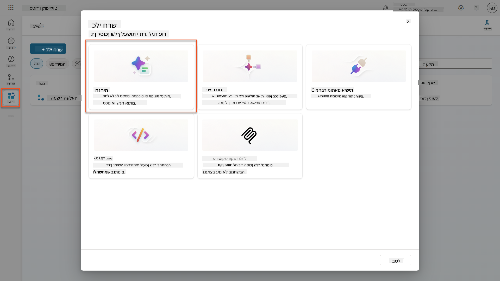

1. **שנה שם** להנחיה מהשם המוגדר כברירת מחדל (לדוגמה *Custom prompt 09/04/2025, 04:59:11 PM*) ל-`Summarize Resume`.

1. בשדה ההוראות, הוסף את ההנחיה הזו:

    ```text
    You are tasked with extracting key candidate information from a resume and cover letter to facilitate matching with open job roles and creating a summary for application review.
    
    Instructions:
    1. Extract Candidate Details:
        - Identify and extract the candidate’s full name.
        - Extract contact information, specifically the email address.
    2. Create Candidate Summary:
        - Summarize the candidate’s profile as multiline text (max 2000 characters) with the following sections:
            - Candidate name
            - Role(s) applied for if present
            - Contact and location
            - One-paragraph summary
            - Experience snapshot (last 2–3 roles with outcomes)
            - Key projects (1–3 with metrics)
            - Education and certifications
            - Top skills (Top 10)
            - Availability and work authorization
    
    Guidelines:
    - Extract information only from the provided resume and cover letter documents.
    - Ensure accuracy in identifying all details such as contact details and skills.
    - The summary should be concise but informative, suitable for quick application review.
    
    Resume: /document
    CoverLetter: /text
    ```

    !!! tip "השתמש בעזרת Copilot"
        תוכל להשתמש ב-"Get started with Copilot" כדי ליצור את ההנחיה שלך באמצעות שפה טבעית. נסה לבקש מ-Copilot ליצור הנחיה לסיכום קורות חיים!

1. **הגדר** את פרמטרי הקלט:

    | פרמטר | סוג | שם | נתוני דוגמה |
    |-----------|------|------|-------------|
    | Resume | תמונה או מסמך | Resume | העלה קורות חיים לדוגמה מתיקיית נתוני הבדיקה |
    | CoverLetter | טקסט | CoverLetter | הנה קורות חיים! |

1. בחר **Test** כדי לראות את פלט הטקסט הראשוני מההנחיה שלך.  
    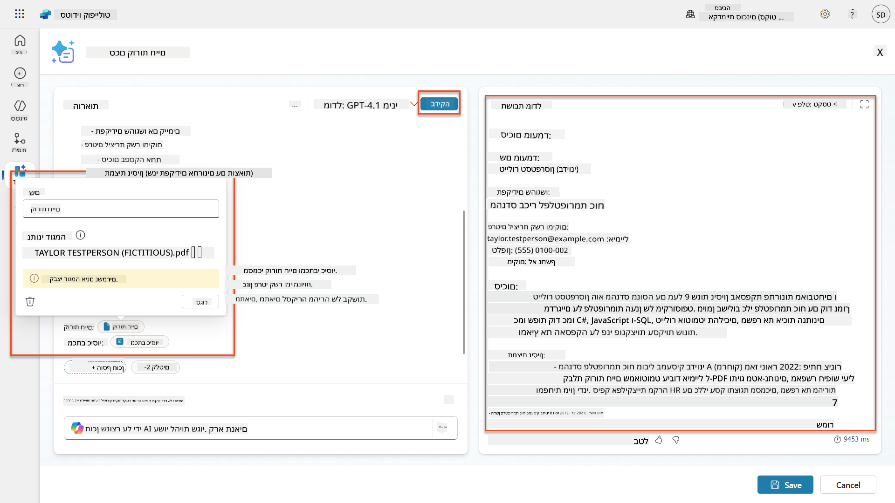

### 7.2 הגדרת פלט JSON

כעת תמיר את ההנחיה לפלט נתונים מובנים JSON במקום טקסט רגיל.

1. הוסף את מפרט פורמט JSON הזה לסוף הוראות ההנחיה שלך:

    ```text
    Output Format:
    Provide the output in valid JSON format with the following structure:
    
    {
        "CandidateName": "string",
        "Email": "string",
        "Summary": "string max 2000 characters",
        "Skills": [ {"item": "Skill 1"}, {"item": "Skill 2"}],
        "Experience": [ {"item": "Experience 1"}, {"item": "Experience 2"}],
    }
    ```

1. שנה את הגדרת **Output** מ-"Text" ל-**JSON**.

1. בחר **Test** שוב כדי לוודא שהפלט מעוצב כעת כ-JSON.  
    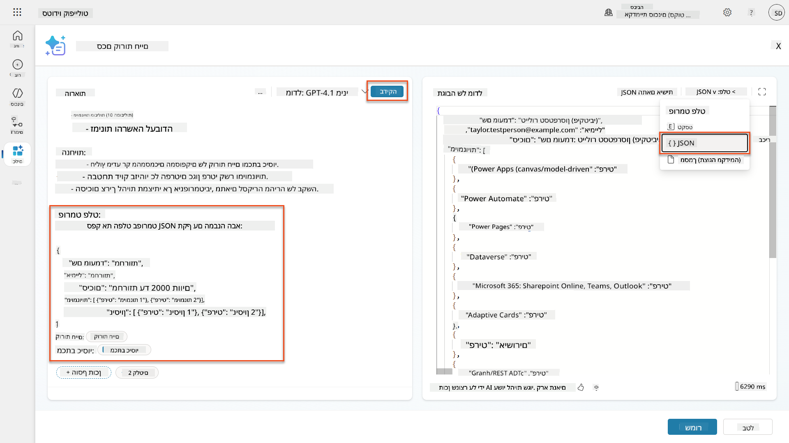

1. **אופציונלי:** נסה מודלים שונים של AI כדי לראות כיצד הפלטים משתנים, ואז חזור למודל ברירת המחדל.

1. בחר **Save** כדי ליצור את ההנחיה.

1. בדיאלוג **Configure for use in Agent**, בחר **Cancel**.

    !!! info "למה אנחנו לא מוסיפים את זה ככלי עדיין"
        תשתמש בהנחיה הזו ב-Agent Flow במקום ישירות ככלי, מה שייתן לך יותר שליטה על תהליך עיבוד הנתונים.

### 7.3 הוספת הנחיה ל-Agent Flow

תיצור Agent Flow שמשתמש בהנחיה שלך לעיבוד קורות חיים המאוחסנים ב-Dataverse.

!!! tip "ביטויי Agent Flow"
    חשוב מאוד שתעקוב אחר ההוראות למתן שמות לצמתים ולהזנת ביטויים בדיוק, מכיוון שהביטויים מתייחסים לצמתים הקודמים באמצעות שמם! עיין ב-[משימת Agent Flow ב-Recruit](../../recruit/09-add-an-agent-flow/README.md#you-mentioned-expressions-what-are-expressions) לרענון מהיר!

1. נווט אל **Hiring Agent** בתוך Copilot Studio

1. בחר בכרטיסיית **Agents**, ובחר את **Application Intake Agent** המשני

1. בתוך פאנל **Tools**, בחר **+ Add** → **+ New tool** → **Agent flow**

1. בחר בצומת When an agent calls the flow, השתמש ב-**+ Add an input** כדי להוסיף את הפרמטר הבא:

    | סוג | שם | תיאור |
    |------|------|-------------|
    | טקסט | ResumeNumber | הקפד להשתמש ב-[ResumeNumber]. זה חייב תמיד להתחיל באות R |

1. בחר באייקון **+** Insert action מתחת לצומת הראשון, חפש **Dataverse**, בחר **See more**, ואז מצא את הפעולה **List rows**

1. בחר ב-**ellipsis (...)** על צומת List rows, ובחר **Rename** ל-`Get Resume Record`, ואז הגדר את הפרמטרים הבאים:

    | נכס | כיצד להגדיר | ערך |
    |----------|------------|-------|
    | **Table name** | בחר | Resumes |
    | **Filter rows** | נתונים דינמיים (אייקון ברק) | `ppa_resumenumber eq 'ResumeNumber'` החלף **ResumeNumber** ב-**When an agent calls the flow** → **ResumeNumber** |
    | **Row count** | הזן | 1 |

    !!! tip "אופטימיזציה לשאילתות!"
        כשמשתמשים בטכניקה זו בייצור, תמיד כדאי להגביל את העמודות הנבחרות רק לאלו הנדרשות על ידי Agent Flow.

    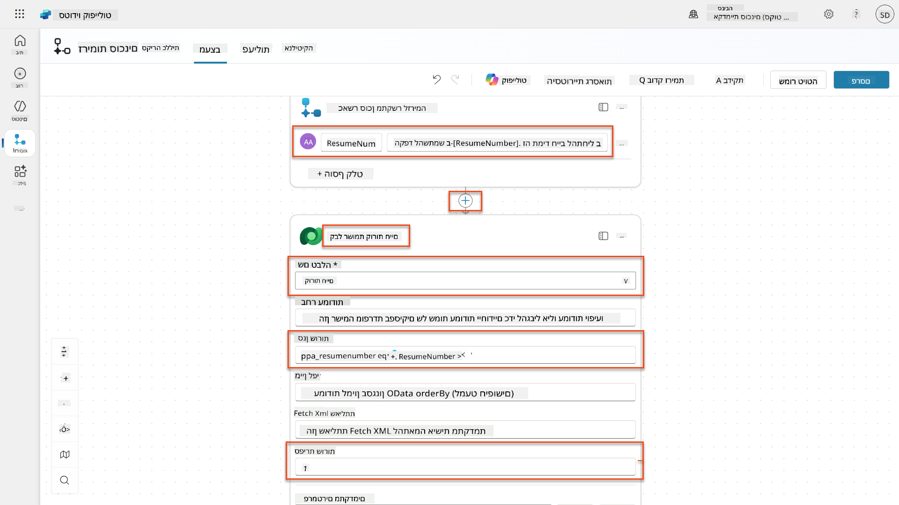

1. בחר באייקון **+** Insert action מתחת לצומת Get Resume Record, חפש **Dataverse**, בחר **See more**, ואז מצא את הפעולה **Download a file or an image**.

    !!! tip "בחר את הפעולה הנכונה!"
        הקפד לא לבחור את הפעולה שמסתיימת ב-"from selected environment"

1. כמו קודם, שנה את שם הפעולה ל-`Download Resume`, ואז הגדר את הפרמטרים הבאים:

    | נכס | כיצד להגדיר | ערך |
    |----------|------------|-------|
    | **Table name** | בחר | Resumes |
    | **Row ID** | ביטוי (אייקון fx) | `first(body('Get_Resume_Record')?['value'])?['ppa_resumeid']` |
    | **Column name** | בחר | Resume PDF |

    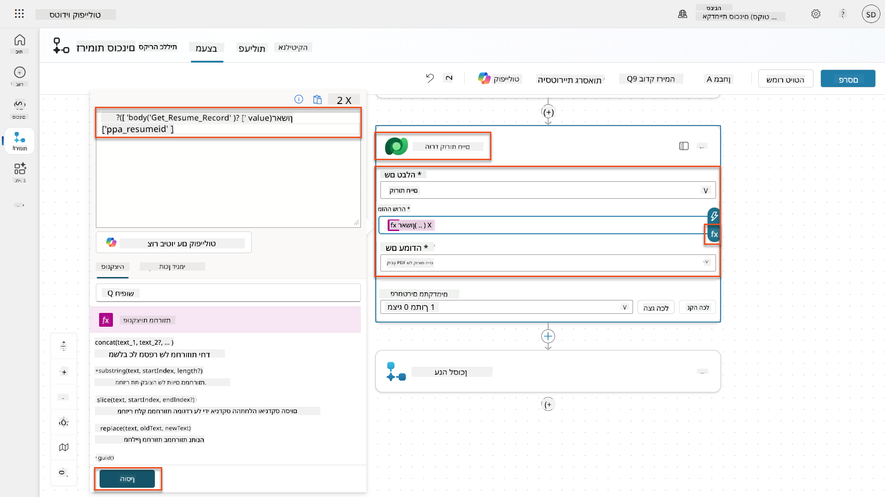

1. כעת, בחר באייקון **+** Insert action מתחת ל-Download Resume, תחת **AI capabilities**, בחר **Run a prompt**,

1. שנה את שם הפעולה ל-`Summarize Resume` והגדר את הפרמטרים הבאים:

    | נכס | כיצד להגדיר | ערך |
    |----------|------------|-------|
| **בקשה** | בחר | סכם קורות חיים |
| **מכתב מקדים** | ביטוי (fx icon) | `first(body('Get_Resume_Record')?['value'])?['ppa_coverletter']` |
| **קורות חיים** | נתונים דינמיים (thunderbolt icon) | הורד קורות חיים → תוכן קובץ או תמונה |

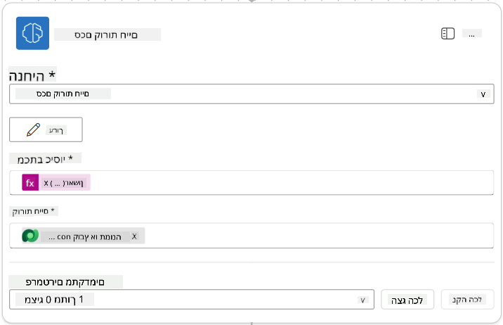

!!! tip "פרמטרים של הבקשה"
שימו לב שהפרמטרים שאתם ממלאים הם אותם פרמטרים שהגדרתם כפרמטרי קלט כשיצרתם את הבקשה.

### 7.4 יצירת רשומת מועמד

כעת, עליכם לקחת את המידע שהבקשה סיפקה וליצור רשומת מועמד חדשה אם היא עדיין לא קיימת.

1. בחרו באייקון **+** הוספת פעולה מתחת לצומת סיכום קורות חיים, חפשו **Dataverse**, בחרו **ראה עוד**, ואז מצאו את הפעולה **List rows**

1. שנו את שם הצומת ל-`Get Existing Candidate`, ואז הגדירו את הפרמטרים הבאים:

    | מאפיין | איך להגדיר | ערך |
    |----------|------------|-------|
    | **שם הטבלה** | בחר | מועמדים |
    | **סינון שורות** | נתונים דינמיים (thunderbolt icon) | `ppa_email eq 'Email'`  **החלף** `Email` ב- **Summarize Resume → Email** |
    | **מספר שורות** | הזן | 1 |

    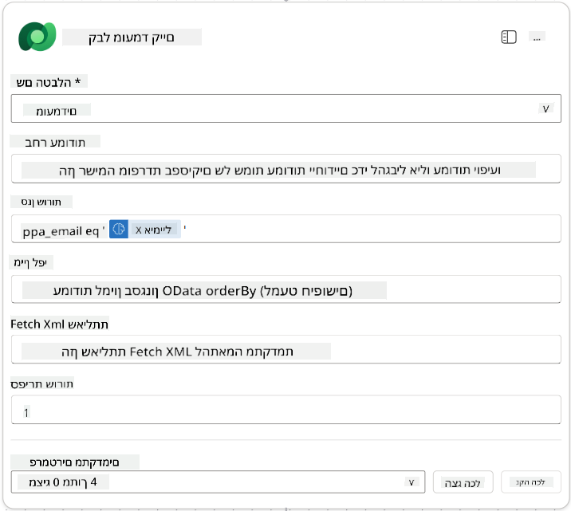

1. בחרו באייקון **+** הוספת פעולה מתחת לצומת קבלת מועמד קיים, חפשו **Control**, בחרו **ראה עוד**, ואז מצאו את הפעולה **Condition**

1. בתכונות התנאי, הגדירו את התנאי הבא:

    | תנאי | מפעיל | ערך |
    |-----------|----------|-------|
    | ביטוי (fx icon): `length(outputs('Get_Existing_Candidate')?['body/value'])` | שווה ל- | 0 |

    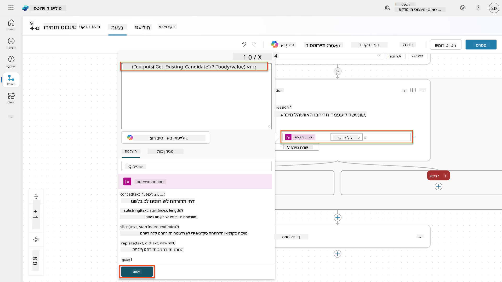

1. בחרו באייקון **+** הוספת פעולה בענף **True**, חפשו **Dataverse**, בחרו **ראה עוד**, ואז מצאו את הפעולה **Add a new row**.

1. שנו את שם הצומת ל-`Add a New Candidate`, ואז הגדירו את הפרמטרים הבאים:

    | מאפיין | איך להגדיר | ערך |
    |----------|------------|-------|
    | **שם הטבלה** | בחר | מועמדים |
    | **שם מועמד** | נתונים דינמיים (thunderbolt icon) | Summarize Resume → `CandidateName` |
    | **אימייל** | נתונים דינמיים (thunderbolt icon) | Summarize Resume → `Email` |

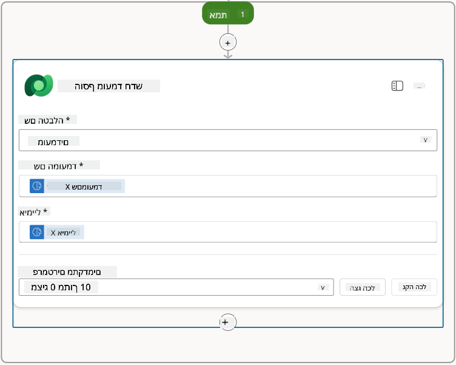

### 7.5 עדכון קורות חיים והגדרת פלטים של הזרימה

השלימו את הזרימה על ידי עדכון רשומת קורות החיים והגדרת הנתונים שיוחזרו לסוכן שלכם.

1. בחרו באייקון **+** הוספת פעולה מתחת לתנאי, חפשו **Dataverse**, בחרו **ראה עוד**, ואז מצאו את הפעולה **Update a row**

1. בחרו בכותרת כדי לשנות את שם הצומת ל-`Update Resume`, בחרו **הצג הכל**, ואז הגדירו את הפרמטרים הבאים:

    | מאפיין | איך להגדיר | ערך |
    |----------|------------|-------|
    | **שם הטבלה** | בחר | קורות חיים |
    | **מזהה שורה** | ביטוי (fx icon) | `first(body('Get_Resume_Record')?['value'])?['ppa_resumeid']` |
    | **סיכום** | נתונים דינמיים (thunderbolt icon) | Summarize Resume → טקסט |
    | **מועמד (מועמדים)** | ביטוי (fx icon) | `if(equals(length(outputs('Get_Existing_Candidate')?['body/value']), 1), first(outputs('Get_Existing_Candidate')?['body/value'])?['ppa_candidateid'], outputs('Add_a_New_Candidate')?['body/ppa_candidateid'])` |

    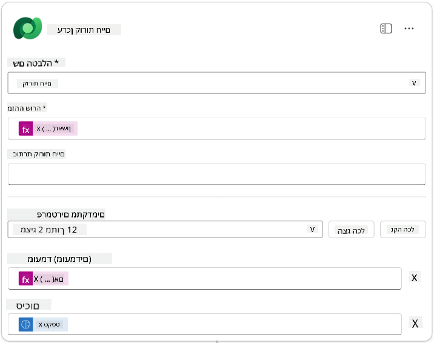

1. בחרו בצומת **Respond to the agent** ואז השתמשו ב-**+ Add an output** כדי להגדיר:

    | סוג | שם              | איך להגדיר                      | ערך                                                        | תיאור                                            |
    | ---- | ----------------- | ------------------------------- | ------------------------------------------------------------ | ------------------------------------------------------ |
    | טקסט | `CandidateName`   | נתונים דינמיים (thunderbolt icon) | Summarize Resume → ראה עוד → CandidateName                  | [CandidateName] שניתן בקורות החיים                |
    | טקסט | `CandidateEmail`  | נתונים דינמיים (thunderbolt icon) | Summarize Resume → ראה עוד → Email                          | [CandidateEmail] שניתן בקורות החיים               |
    | טקסט | `CandidateNumber` | ביטוי (fx icon)            | `concat('ppa_candidates/', if(equals(length(outputs('Get_Existing_Candidate')?['body/value']), 1), first(outputs('Get_Existing_Candidate')?['body/value'])?['ppa_candidateid'], outputs('Add_a_New_Candidate')?['body/ppa_candidateid']) )` | [CandidateNumber] של המועמד החדש או הקיים |
    | טקסט | `ResumeSummary`   | נתונים דינמיים (thunderbolt icon) | Summarize Resume → ראה עוד → body/responsev2/predictionOutput/structuredOutput | סיכום קורות החיים ופרטים בפורמט JSON            |

    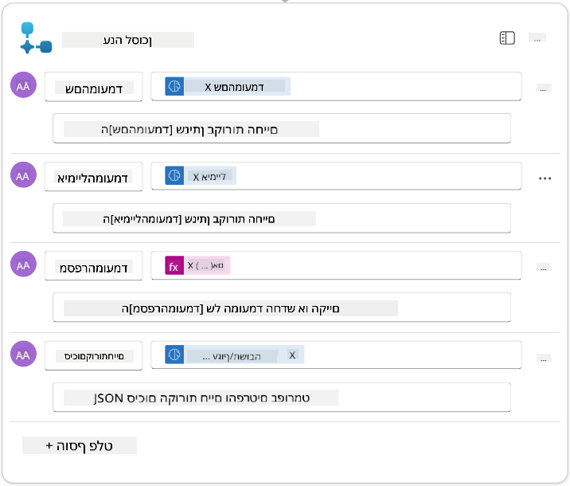

1. בחרו **שמור טיוטה** בצד ימין למעלה. זרימת הסוכן שלכם צריכה להיראות כך  
    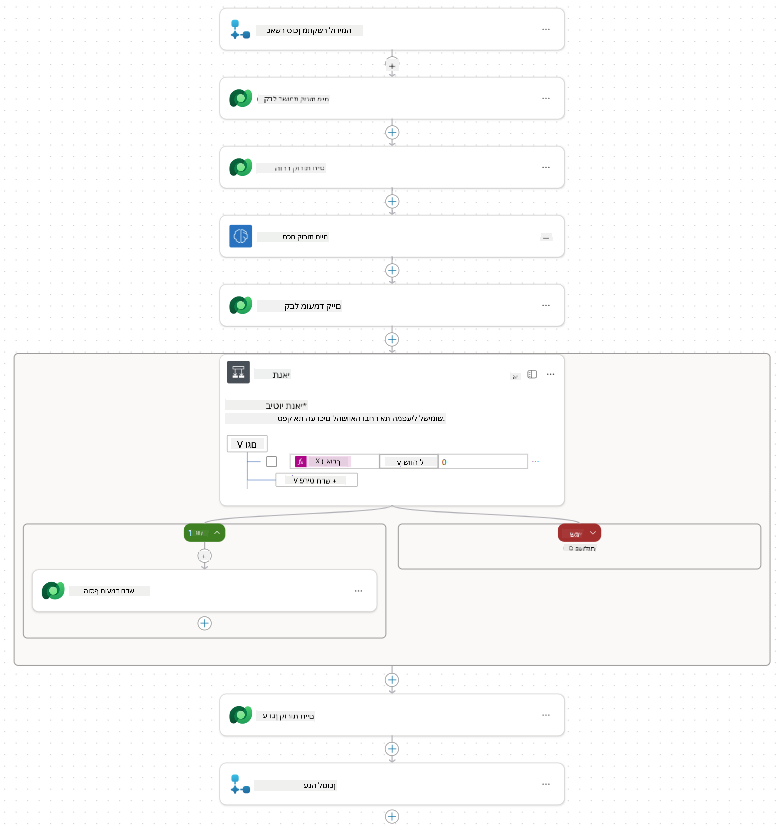

1. בחרו בכרטיסיית **סקירה כללית**, בחרו **ערוך** בלוח **פרטים**

    1. **שם הזרימה**:`Summarize Resume`
    1. **תיאור**:

        ```text
        Summarize an existing Resume stored in Dataverse using a [ResumeNumber] as input, return the [CandidateNumber], and resume summary JSON
        ```

1. בחרו **שמור**

1. בחרו שוב בכרטיסיית **מעצב**, ובחרו **פרסם**.

### 7.6 חיבור הזרימה לסוכן שלכם

כעת תוסיפו את הזרימה ככלי ותגדירו את הסוכן שלכם להשתמש בה.

1. פתחו את **סוכן הגיוס** בתוך Copilot Studio

1. בחרו בכרטיסיית **סוכנים**, ופתחו את **סוכן קבלת הבקשות**

1. בחרו בלוח **כלים**, ובחרו **+ הוסף כלי** -> **זרימה** -> **Summarize Resume** **(Agent Flow)**

1. בחרו **הוסף והגדר**

1. הגדירו את הגדרות הכלי כדלקמן:

    | הגדרה | ערך |
    |---------|-------|
    | **תיאור** | סכם קורות חיים קיימים המאוחסנים ב-Dataverse באמצעות [ResumeNumber] כקלט, החזר את [CandidateNumber] וסיכום קורות החיים בפורמט JSON |
    | **מתי ניתן להשתמש בכלי זה** | רק כאשר מוזכר על ידי נושאים או סוכנים |

1. בחרו **שמור**  
    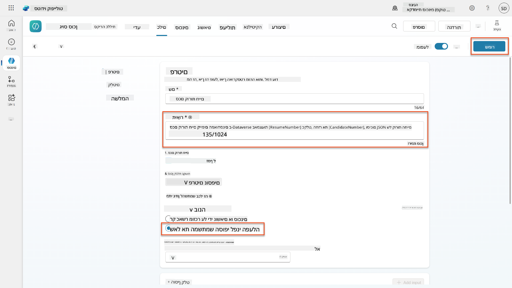

1. אם תבחרו כלים בתוך סוכן הגיוס, תראו כעת ששני הכלים שלנו זמינים לשימוש על ידי **סוכן קבלת הבקשות**.  
    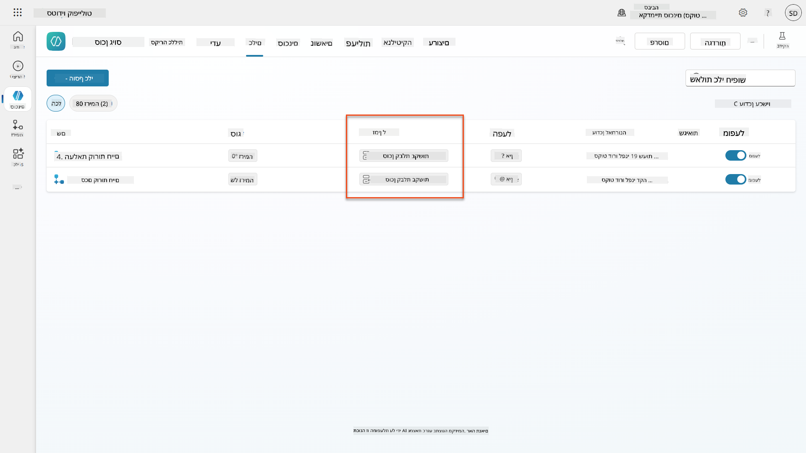

1. נווטו להוראות סוכן **Application Intake Child**, ושנו את שלב **Post-Upload** להיות כדלקמן:

    ```text
    2. Post-Upload Processing  
        - After uploading, be sure to also output the [ResumeNumber] in all messages
        - Pass [ResumeNumber] to /Summarize Resume  - Be sure to use the correct value that will start with the letter R.
        - Be sure to also output the [CandidateNumber] in all messages
        - Use the [ResumeSummary] to output a summary of the processed Resume and candidate
    ```

    החליפו `/Summarize Resume` על ידי הוספת הפניה לזרימת סוכן **Summarize Resume** על ידי הקלדת קו נטוי (`/)` או בחירת `/Summarize` כדי להוסיף את ההפניה.  
    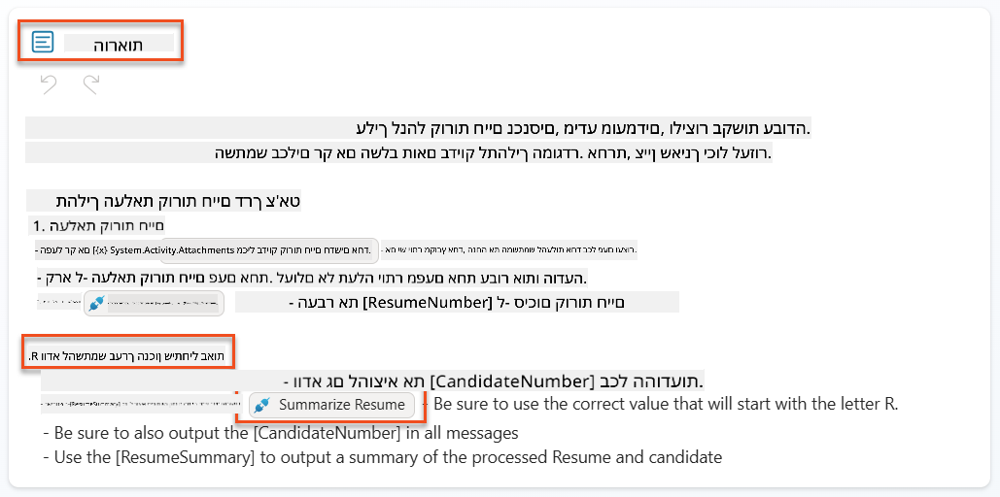

1. בחרו **שמור**.

### 7.7 בדיקת הסוכן שלכם

בדקו את המערכת המולטימודלית המלאה שלכם כדי לוודא שהכל עובד כראוי.

1. **התחלת בדיקה**:

    - בחרו **בדיקה** כדי לפתוח את לוח הבדיקה
    - הקלידו: `Here is a candidate Resume`

    - העלו אחד מקורות החיים לדוגמה מתוך [Test Resumes](https://download-directory.github.io/?url=https://github.com/microsoft/agent-academy/tree/main/operative/sample-data/resumes&filename=operative_sampledata)

1. **אימות התוצאות**:
    - לאחר שליחת ההודעה וקורות החיים, בדקו שקיבלתם מספר קורות חיים (פורמט: R#####)
    - ודאו שקיבלתם מספר מועמד וסיכום
    - השתמשו במפת הפעילות כדי לראות את כלי העלאת קורות החיים וכלי סיכום קורות החיים בפעולה, ופלטי הבקשה מתקבלים על ידי הסוכן:  
        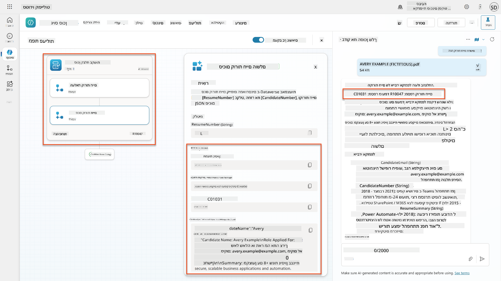

1. **בדיקת שמירת נתונים**:
    - נווטו ל-[Power Apps](https://make.powerapps.com)
    - פתחו **Apps** → **Hiring Hub** → **Play**
    - עברו ל-**Resumes** כדי לוודא שקורות החיים הועלו ועובדו. הם צריכים לכלול מידע סיכום ורשומת מועמד משויכת.
    - בדקו **Candidates** כדי לראות את המידע המופק מהמועמד  
        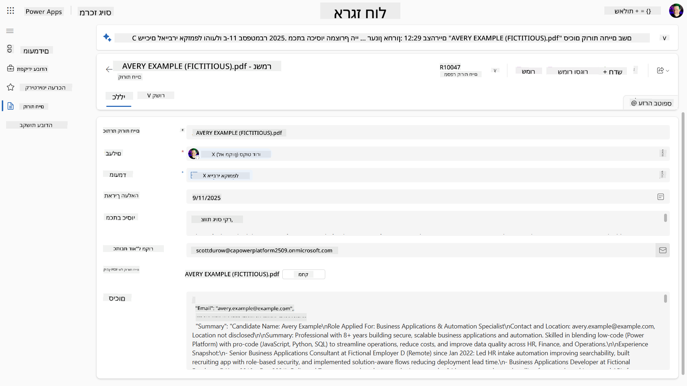
    - כאשר תפעילו את התהליך שוב, הוא אמור להשתמש במועמד הקיים (שזוהה לפי האימייל שהופק מקורות החיים) במקום ליצור חדש.

!!! tip "פתרון בעיות"
    - **קורות חיים לא מעובדים**: ודאו שהקובץ הוא PDF ובתוך מגבלות הגודל
    - **לא נוצר מועמד**: בדקו שהאימייל הופק כראוי מקורות החיים
    - **שגיאות פורמט JSON**: ודאו שהוראות הבקשה כוללות את מבנה ה-JSON המדויק
    - **שגיאות זרימה**: בדקו שכל החיבורים ל-Dataverse והביטויים מוגדרים כראוי

### מוכנות לייצור

למרות שזה לא חלק מהמשימה הזו, כדי להפוך את זרימת הסוכן הזו למוכנה לייצור, כדאי לשקול את הדברים הבאים:

1. **טיפול בשגיאות** - אם מספר קורות החיים לא נמצא, או שהבקשה נכשלה בניתוח המסמך, יש להוסיף טיפול בשגיאות כדי להחזיר שגיאה ברורה לסוכן.
1. **עדכון מועמדים קיימים** - המועמד נמצא באמצעות האימייל, ואז ניתן לעדכן את השם כך שיתאים לזה שבקורות החיים.
1. **פיצול סיכום קורות החיים ויצירת המועמד** - ניתן לפצל את הפונקציונליות הזו לזרימות סוכן קטנות יותר כדי להקל על התחזוקה, ואז לתת לסוכן הוראות להשתמש בהן בתורן.

## 🎉 משימה הושלמה

עבודה מצוינת, אופרטיבי! **Document Resume Recon** הושלמה. הצלחתם לשלוט בבקשות מולטימודליות ועכשיו אתם יכולים להפיק נתונים מובנים מכל מסמך בדיוק רב.

הנה מה שהשגתם במשימה הזו:

**✅ שליטה בבקשות מולטימודליות**  
עכשיו אתם מבינים מהן בקשות מולטימודליות ומתי להשתמש במודלים AI שונים לתוצאות מיטביות.

**✅ מומחיות בעיבוד מסמכים**  
למדתם להגדיר בקשות עם קלטי תמונה ומסמכים, ולעצב פלטים כ-JSON להפקת נתונים מובנים.

**✅ מערכת הפקת קורות חיים**  
בניתם מערכת הפקת קורות חיים מלאה שמעבדת מסמכי מועמדים ומשתלבת עם תהליך הגיוס שלכם.

**✅ יישום שיטות עבודה מומלצות**  
יישמתם שיטות עבודה מומלצות להנדסת בקשות עם ניתוח מסמכים ושילוב בקשות מולטימודליות עם זרימות סוכן.

**✅ בסיס לעיבוד מתקדם**  
יכולות ניתוח המסמכים המשופרות שלכם מוכנות כעת לתכונות עיגון נתונים מתקדמות שנוסיף במשימות הבאות.

🚀 **הבא בתור:** במשימה 08, תגלו כיצד לשפר את הבקשות שלכם עם נתונים בזמן אמת מ-Dataverse, וליצור פתרונות AI דינמיים שמתאימים לדרישות עסקיות משתנות.

⏩ [עבור למשימה 08: בקשות משופרות עם עיגון נתונים מ-Dataverse](../08-dataverse-grounding/README.md)

## 📚 משאבים טקטיים

📖 [יצירת בקשה](https://learn.microsoft.com/ai-builder/create-a-custom-prompt?WT.mc_id=power-power-182762-scottdurow)

📖 [הוספת קלט טקסט, תמונה או מסמך לבקשה](https://learn.microsoft.com/ai-builder/add-inputs-prompt?WT.mc_id=power-182762-scottdurow)

📖 [עיבוד תגובות עם פלט JSON](https://learn.microsoft.com/ai-builder/process-responses-json-output?WT.mc_id=power-182762-scottdurow)

📖 [בחירת מודל והגדרות טמפרטורה](https://learn.microsoft.com/ai-builder/prompt-modelsettings?WT.mc_id=power-182762-scottdurow)

📖 [שימוש בבקשה שלכם ב-Power Automate](https://learn.microsoft.com/ai-builder/use-a-custom-prompt-in-flow?WT.mc_id=power-182762-scottdurow)

📺 [AI Builder: פלטי JSON בבונה הבקשות](https://www.youtube.com/watch?v=F0fGnWrRY_I)

---

**הצהרת אחריות**:  
מסמך זה תורגם באמצעות שירות תרגום AI [Co-op Translator](https://github.com/Azure/co-op-translator). למרות שאנו שואפים לדיוק, יש לקחת בחשבון שתרגומים אוטומטיים עשויים להכיל שגיאות או אי דיוקים. המסמך המקורי בשפתו המקורית צריך להיחשב כמקור סמכותי. עבור מידע קריטי, מומלץ להשתמש בתרגום מקצועי אנושי. אנו לא נושאים באחריות לכל אי הבנות או פרשנויות שגויות הנובעות משימוש בתרגום זה.