<!--
CO_OP_TRANSLATOR_METADATA:
{
  "original_hash": "750f3ea8a94930439ebd8a10871b1d73",
  "translation_date": "2025-10-17T01:43:27+00:00",
  "source_file": "docs/operative-preview/08-dataverse-grounding/README.md",
  "language_code": "he"
}
-->
# 🚨 משימה 08: שדרוג הנחיות עם חיבור ל-Dataverse

--8<-- "disclaimer.md"

## 🕵️‍♂️ שם קוד: `מבצע שליטה בקרקע`

> **⏱️ חלון זמן למבצע:** `~60 דקות`

## 🎯 תיאור המשימה

ברוך שובך, סוכן. מערכת הגיוס הרב-סוכנים שלך פעילה, אך יש צורך בשדרוג קריטי עבור **חיבור נתונים** - המודלים של הבינה המלאכותית שלך זקוקים לגישה בזמן אמת לנתונים המובנים של הארגון שלך כדי לקבל החלטות חכמות.

כרגע, ההנחיה שלך לסיכום קורות חיים פועלת עם ידע סטטי. אבל מה אם היא תוכל לגשת באופן דינמי למסד הנתונים של תפקידי העבודה שלך כדי לספק התאמות מדויקות ועדכניות? ומה אם היא תבין את קריטריוני ההערכה שלך מבלי שתצטרך לקודד אותם ידנית?

במשימה זו, תשדרג את ההנחיה המותאמת שלך עם **חיבור ל-Dataverse** - חיבור ההנחיות שלך ישירות למקורות נתונים חיים. זה יהפוך את הסוכנים שלך ממגיבים סטטיים למערכות מונעות נתונים דינמיות שמתאימות לצרכים העסקיים המשתנים.

המשימה שלך: לשלב נתוני תפקידי עבודה וקריטריוני הערכה בזמן אמת לתוך תהליך ניתוח קורות החיים, וליצור מערכת שמתעדכנת בעצמה בהתאם לדרישות הגיוס של הארגון שלך.

## 🔎 מטרות

במשימה זו תלמד:

1. כיצד **חיבור ל-Dataverse** משדרג הנחיות מותאמות
1. מתי להשתמש בחיבור נתונים לעומת הוראות סטטיות
1. עיצוב הנחיות שמשלבות נתונים חיים באופן דינמי
1. שדרוג תהליך סיכום קורות חיים עם התאמת תפקידי עבודה

## 🧠 הבנת חיבור ל-Dataverse עבור הנחיות

**חיבור ל-Dataverse** מאפשר להנחיות המותאמות שלך לגשת לנתונים חיים מטבלאות Dataverse בעת עיבוד בקשות. במקום הוראות סטטיות, ההנחיות שלך יכולות לשלב מידע בזמן אמת כדי לקבל החלטות מושכלות.

### למה חיבור ל-Dataverse חשוב

הנחיות מסורתיות פועלות עם הוראות קבועות:

```text
Match this candidate to these job roles: Developer, Manager, Analyst
```

עם חיבור ל-Dataverse, ההנחיה שלך ניגשת לנתונים עדכניים:

```text
Match this candidate to available job roles from the Job Roles table, 
considering current evaluation criteria and requirements
```

גישה זו מספקת מספר יתרונות מרכזיים:

- **עדכונים דינמיים:** תפקידי עבודה וקריטריונים משתנים ללא צורך בשינויים בהנחיה
- **עקביות:** כל הסוכנים משתמשים באותם מקורות נתונים עדכניים
- **יכולת הרחבה:** תפקידים וקריטריונים חדשים זמינים באופן אוטומטי
- **דיוק:** נתונים בזמן אמת מבטיחים שההחלטות משקפות את הצרכים הנוכחיים

### איך חיבור ל-Dataverse עובד

כאשר אתה מאפשר חיבור ל-Dataverse עבור הנחיה מותאמת:

1. **בחירת נתונים:** בחר טבלאות ועמודות ספציפיות מ-Dataverse לשילוב. ניתן גם לבחור טבלאות קשורות שהמערכת תסנן בהתאם לרשומות ההורה שנשלפו.
1. **הזרקת הקשר:** ההנחיה כוללת באופן אוטומטי את הנתונים שנשלפו בהקשר ההנחיה
1. **סינון חכם:** המערכת כוללת רק נתונים רלוונטיים לבקשה הנוכחית אם תספק סינון כלשהו.
1. **פלט מובנה:** ההנחיה שלך יכולה להתייחס לנתונים שנשלפו ולנתח את הרשומות כדי ליצור את הפלט.

### ממידע סטטי לדינמי: יתרון החיבור

בוא נבחן את תהליך סיכום קורות החיים הנוכחי שלך ממשימה 07 ונראה איך חיבור ל-Dataverse הופך אותו מאינטליגנציה סטטית לדינמית.

**גישה סטטית נוכחית:**
ההנחיה הקיימת שלך כללה קריטריוני הערכה מקודדים מראש ולוגיקת התאמה מוגדרת מראש. גישה זו עובדת אך דורשת עדכונים ידניים בכל פעם שאתה מוסיף תפקידי עבודה חדשים, משנה קריטריוני הערכה או משנה את סדרי העדיפויות של החברה.

**שדרוג עם חיבור ל-Dataverse:**
על ידי הוספת חיבור ל-Dataverse, תהליך סיכום קורות החיים שלך יוכל:

- **לגשת לתפקידי עבודה עדכניים** מטבלת תפקידי העבודה שלך
- **להשתמש בקריטריוני הערכה חיים** במקום תיאורים סטטיים  
- **לספק התאמות מדויקות** בהתבסס על דרישות בזמן אמת

## 🎯 למה הנחיות ייעודיות לעומת שיחות סוכן

במשימה 02, חווית איך סוכן הראיונות יכול להתאים מועמדים לתפקידי עבודה, אך נדרש ניסוח הנחיות מורכב כמו:

```text
Upload this resume, then show me open job roles,
each with a description of the evaluation criteria, 
then use this to match the resume to at least one suitable
job role even if not a perfect match.
```

למרות שזה עבד, הנחיות ייעודיות עם חיבור ל-Dataverse מציעות יתרונות משמעותיים למשימות ספציפיות:

### יתרונות מרכזיים של הנחיות ייעודיות

| היבט | שיחות סוכן | הנחיות ייעודיות |
|--------|-------------------|------------------|
| **עקביות** | תוצאות משתנות בהתאם לכישורי ניסוח ההנחיה של המשתמש | עיבוד סטנדרטי בכל פעם |
| **התמחות** | חשיבה כללית עשויה להחמיץ ניואנסים עסקיים | מותאם במיוחד עם לוגיקה עסקית אופטימלית |
| **אוטומציה** | דורש אינטראקציה ופירוש אנושי | מופעל אוטומטית עם פלט JSON מובנה |

## 🧪 מעבדה 8: הוספת חיבור ל-Dataverse להנחיות

הגיע הזמן לשדרג את יכולות ניתוח קורות החיים שלך! תשדרג את תהליך סיכום קורות החיים הקיים עם התאמת תפקידי עבודה דינמית.

### דרישות מקדימות להשלמת המשימה

1. תצטרך **או**:

    - **להשלים את משימה 07** ולהחזיק במערכת ניתוח קורות החיים שלך מוכנה, **או**
    - **לייבא את פתרון ההתחלה של משימה 08** אם אתה מתחיל מאפס או צריך להשלים. [הורד פתרון התחלה למשימה 08](https://aka.ms/agent-academy)

1. מסמכי קורות חיים לדוגמה מ-[קורות חיים לדוגמה](https://download-directory.github.io/?url=https://github.com/microsoft/agent-academy/tree/main/operative/sample-data/resumes&filename=operative_sampledata)

!!! note "ייבוא פתרון ונתוני דוגמה"
    אם אתה משתמש בפתרון ההתחלה, עיין ב-[משימה 01](../01-get-started/README.md) להוראות מפורטות כיצד לייבא פתרונות ונתוני דוגמה לסביבתך.

### 8.1 הוספת חיבור ל-Dataverse להנחיה שלך

תבנה על ההנחיה לסיכום קורות חיים שיצרת במשימה 07. כרגע היא פשוט מסכמת את קורות החיים, אך כעת תחבר אותה לתפקידי העבודה כפי שהם קיימים כרגע ב-Dataverse, ותשמור אותה תמיד עדכנית.

ראשית, בוא נבחן את טבלאות ה-Dataverse שתשתמש בהן לחיבור:

1. **נווט** ל-[Power Apps](https://make.powerapps.com) ובחר את הסביבה שלך באמצעות **מחליף הסביבה** בפינה הימנית העליונה של סרגל הניווט.

1. בחר **טבלאות** ומצא את טבלת **תפקידי העבודה**

1. סקור את העמודות המרכזיות שתשתמש בהן לחיבור:

    | עמודה | מטרה |
    |--------|---------|
    | **מספר תפקיד עבודה** | מזהה ייחודי להתאמת תפקיד |
    | **כותרת תפקיד** | שם תצוגה לתפקיד |
    | **תיאור** | דרישות מפורטות לתפקיד |

1. באופן דומה, סקור את הטבלאות האחרות כמו טבלת **קריטריוני הערכה**.

### 8.2 הוספת נתוני חיבור ל-Dataverse להנחיה שלך

1. **נווט** ל-Copilot Studio, ובחר את הסביבה שלך באמצעות **מחליף הסביבה** בפינה הימנית העליונה של סרגל הניווט.

1. בחר **כלים** מהניווט השמאלי.

1. בחר **הנחיה** ומצא את ההנחיה **סיכום קורות חיים** ממשימה 07.  
    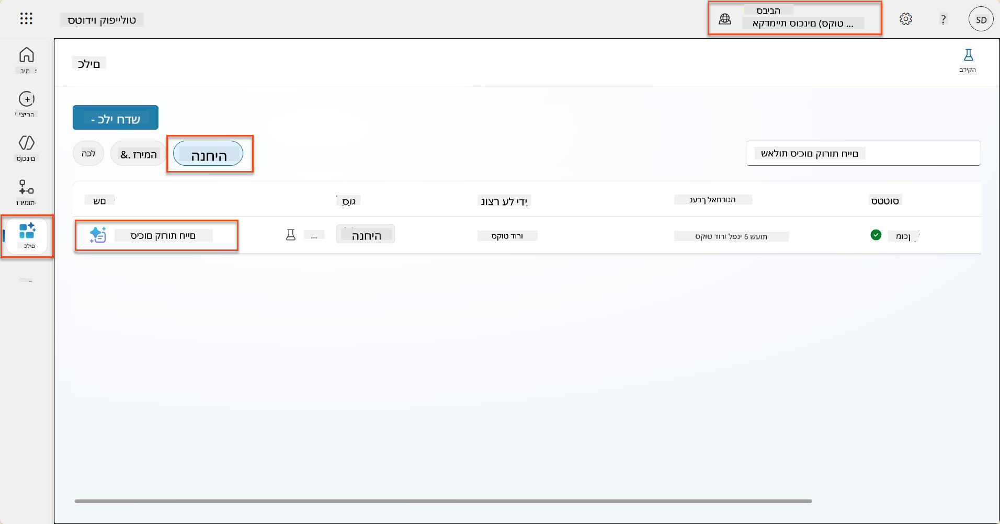

1. בחר **ערוך** כדי לשנות את ההנחיה, והחלף אותה בגרסה המשודרגת למטה:

    !!! important
        ודא שהפרמטרים של קורות החיים ומכתב הכיסוי נשארים ללא שינוי כפרמטרים.

    ```text
    You are tasked with extracting key candidate information from a resume and cover letter to facilitate matching with open job roles and creating a summary for application review.
    
    ### Instructions:
    1. **Extract Candidate Details:**
       - Identify and extract the candidate's full name.
       - Extract contact information, specifically the email address.
    
    2. **Analyze Resume and Cover Letter:**
       - Review the resume content to identify relevant skills, experience, and qualifications.
       - Review the cover letter to understand the candidate's motivation and suitability for the roles.
    
    3. **Match Against Open Job Roles:**
       - Compare the extracted candidate information with the requirements and descriptions of the provided open job roles.
       - Use the job descriptions to assess potential fit.
       - Identify all roles that align with the candidate's cover letter and profile. You don't need to assess perfect suitability.
       - Provide reasoning for each match based on the specific job requirements.
    
    4. **Create Candidate Summary:**
       - Summarize the candidate's profile as multiline text with the following sections:
          - Candidate name
          - Role(s) applied for if present
          - Contact and location
          - One-paragraph summary
          - Top skills (8–10)
          - Experience snapshot (last 2–3 roles with outcomes)
          - Key projects (1–3 with metrics)
          - Education and certifications
          - Availability and work authorization
    
    ### Output Format
    
    Provide the output in valid JSON format with the following structure:
    
    {
      "CandidateName": "string",
      "Email": "string",
      "MatchedRoles": [
        {
          "JobRoleNumber": "ppa_jobrolenumber from grounded data",
          "RoleName": "ppa_jobtitle from grounded data",
          "Reasoning": "Detailed explanation based on job requirements"
        }
      ],
      "Summary": "string"
    }
    
    ### Guidelines
    
    - Extract information only from the provided resume and cover letter documents.
    - Ensure accuracy in identifying contact details.
    - Use the available job role data for matching decisions.
    - The summary should be concise but informative, suitable for quick application review.
    - If no suitable matches are found, indicate an empty list for MatchedRoles and explain briefly in the summary.
    
    ### Input Data
    Open Job Roles (ppa_jobrolenumber, ppa_jobtitle): /Job Role 
    Resume: {Resume}
    Cover Letter: {CoverLetter}
    ```

1. בעורך ההנחיות, החלף את `/תפקיד עבודה` על ידי בחירה ב-**+ הוסף תוכן**, בחירה ב-**Dataverse** → **תפקיד עבודה** ובחירת העמודות הבאות, ולאחר מכן בחר **הוסף**:

    1. **מספר תפקיד עבודה**

    1. **כותרת תפקיד**

    1. **תיאור**

    !!! tip
        ניתן להקליד את שם הטבלה כדי לחפש.

1. בדיאלוג **תפקיד עבודה**, בחר **סינון** מאפיין, בחר **סטטוס**, ולאחר מכן הקלד **פעיל** כערך **סינון**.  
    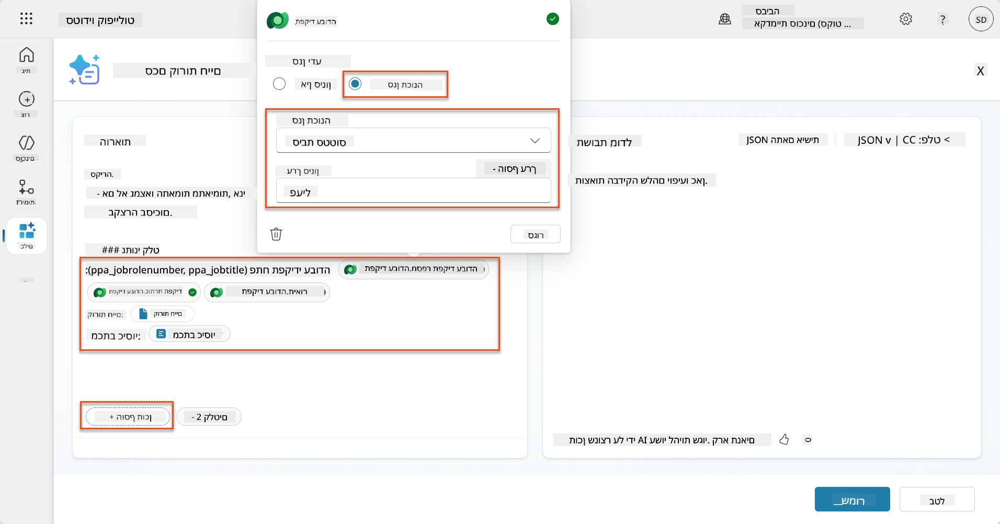

    !!! tip
        ניתן להשתמש ב-**הוסף ערך** כאן כדי להוסיף גם פרמטר קלט - לדוגמה, אם הייתה לך הנחיה לסיכום רשומה קיימת, תוכל לספק את מספר קורות החיים כפרמטר לסינון.

1. לאחר מכן, תוסיף את טבלת ה-Dataverse הקשורה **קריטריוני הערכה**, על ידי בחירה שוב ב-**+ הוסף תוכן**, מציאת **תפקידי עבודה**, ובמקום לבחור בעמודות בתפקיד עבודה, הרחב את **תפקיד עבודה (קריטריוני הערכה)** ובחר את העמודות הבאות, ולאחר מכן בחר **הוסף**:

    1. **שם קריטריון**

    1. **תיאור**  
        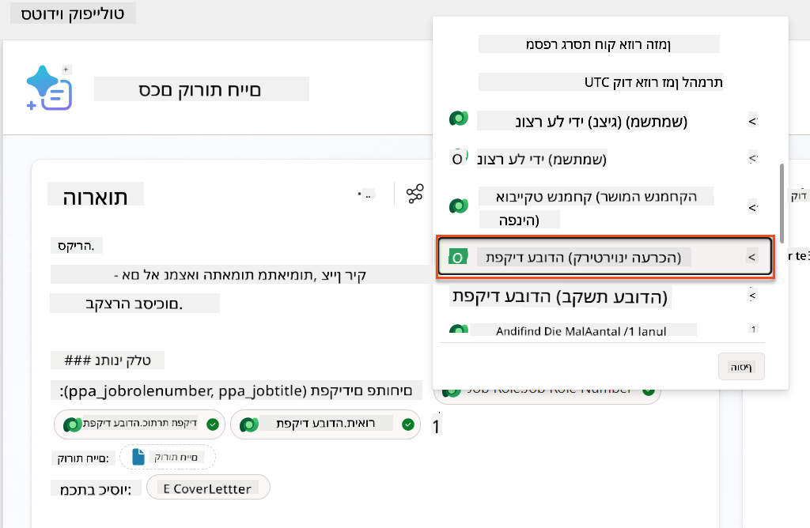

        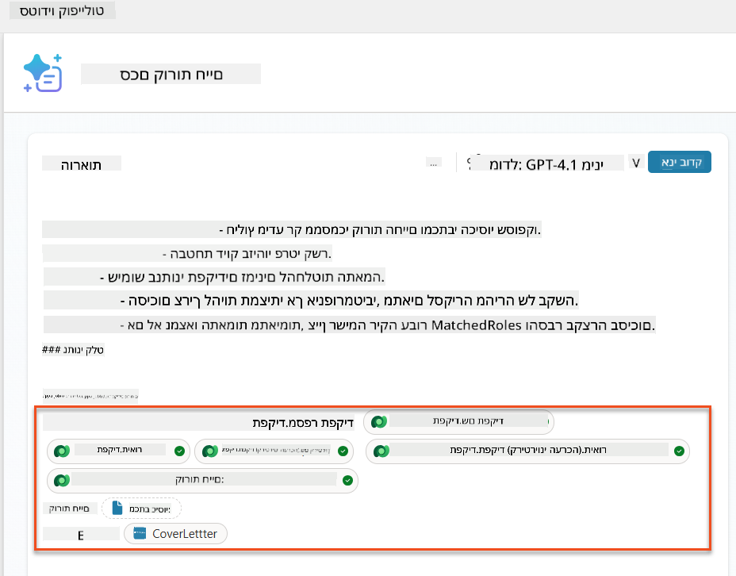

    !!! tip
        חשוב לבחור את קריטריוני ההערכה הקשורים על ידי בחירה תחילה בתפקיד העבודה, ולאחר מכן ניווט בתפריט לתפקיד עבודה (קריטריוני הערכה). זה יבטיח שרק הרשומות הקשורות לתפקיד העבודה ייטענו.

1. בחר **הגדרות**, והתאם את **שליפת הרשומות** ל-1000 - זה יאפשר לכל תפקידי העבודה וקריטריוני ההערכה להיכלל בהנחיה שלך.  
    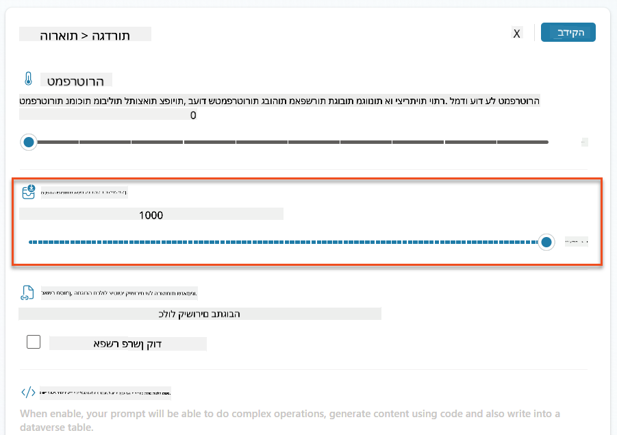

### 8.3 בדיקת ההנחיה המשודרגת

1. בחר את פרמטר **קורות החיים**, והעלה קורות חיים לדוגמה שהשתמשת בהם במשימה 07.
1. בחר **בדיקה**.
1. לאחר שהבדיקה הסתיימה, שים לב שהפלט JSON כולל כעת את **התפקידים שהותאמו**.
1. בחר בכרטיסיית **הידע שהשתמשו בו**, כדי לראות את נתוני ה-Dataverse שהתמזגו עם ההנחיה לפני הביצוע.
1. **שמור** את ההנחיה המשודרגת שלך. המערכת תכלול כעת באופן אוטומטי את נתוני ה-Dataverse הללו עם ההנחיה שלך כאשר תהליך סוכן סיכום קורות החיים הקיים יקרא לה.  
    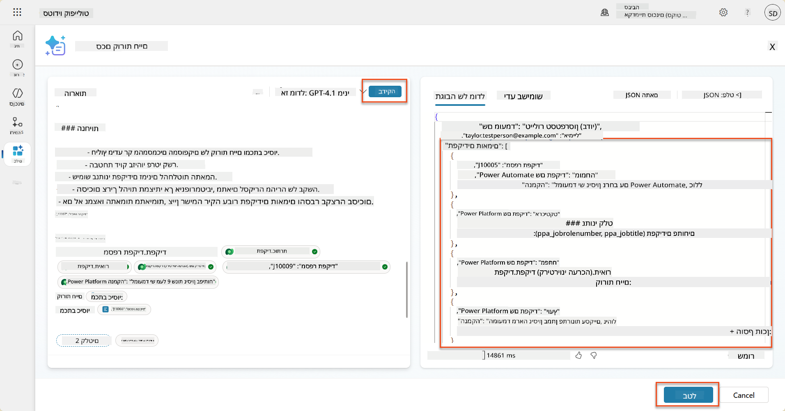

### 8.4 הוספת תהליך סוכן בקשת עבודה

כדי לאפשר לסוכן קליטת הבקשות שלנו ליצור תפקידי עבודה בהתבסס על התפקידים המוצעים שהמועמד מעוניין בהם, עלינו ליצור תהליך סוכן. הסוכן יקרא לכלי זה עבור כל אחד מתפקידי העבודה המוצעים שהמועמד מעוניין בהם.

!!! tip "ביטויי תהליך סוכן"
    חשוב מאוד שתעקוב אחר ההוראות למתן שמות לצמתים ולהזנת ביטויים בדיוק, מכיוון שהביטויים מתייחסים לצמתים הקודמים באמצעות שמם! עיין ב-[משימת תהליך סוכן בגיוס](../../recruit/09-add-an-agent-flow/README.md#you-mentioned-expressions-what-are-expressions) לרענון מהיר!

1. בתוך **סוכן הגיוס**, בחר בכרטיסיית **סוכנים**, ופתח את סוכן המשנה **סוכן קליטת הבקשות**.

1. בתוך לוח **כלים**, בחר **+ הוסף** → **+ כלי חדש** → **תהליך סוכן**

1. בחר בצומת **כאשר סוכן קורא לתהליך**, השתמש ב-**+ הוסף קלט** כדי להוסיף את הפרמטרים הבאים:

    | סוג | שם            | תיאור                                                  |
    | ---- | --------------- | ------------------------------------------------------------ |
    | טקסט | `מספר קורות חיים`  | ודא שאתה משתמש רק ב-[מספר קורות חיים] - חייב להתחיל באות R |
    | טקסט | `מספר תפקיד עבודה` | ודא שאתה משתמש רק ב-[מספר תפקיד עבודה] - חייב להתחיל באות J |

    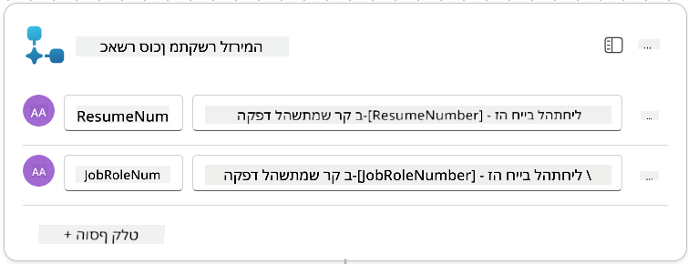

1. בחר באייקון **+** הוספת פעולה מתחת לצומת הראשונה, חפש **Dataverse**, בחר **ראה עוד**, ולאחר מכן מצא את הפעולה **רשום שורות**.

1. **שנה שם** לצומת כ-`קבל קורות חיים`, ולאחר מכן הגדר את הפרמטרים הבאים:

    | מאפיין        | איך להגדיר                      | ערך                                                        |
    | --------------- | ------------------------------- | ------------------------------------------------------------ |
    | **שם טבלה**  | בחר                          | קורות חיים                                                      |
    | **סינון שורות** | נתונים דינמיים (אייקון ברק) | `ppa_resumenumber eq 'מספר קורות חיים'` בחר והחלף **מספר קורות חיים** עם **כאשר סוכן קורא לתהליך** → **מספר קורות חיים** |
    | **מספר שורות**   | הזן                           | 1                                                            |

    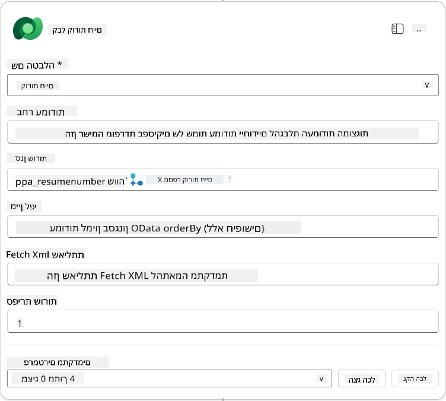

1. כעת, בחר באייקון **+** הוספת פעולה מתחת ל-`קבל קורות חיים`, חפש **Dataverse**, בחר **ראה עוד**, ולאחר מכן מצא את הפעולה **רשום שורות**.

1. **שנה שם** לצומת כ-`קבל תפקיד עבודה`, ולאחר מכן הגדר את הפרמטרים הבאים:

    | מאפיין        | איך להגדיר                      | ערך                                                        |
    | --------------- | ------------------------------- | ------------------------------------------------------------ |
    | **שם טבלה**  | בחר                          | תפקידי עבודה                                                    |
    | **סינון שורות** | נתונים דינמיים (אייקון ברק) | `ppa_jobrolenumber eq 'מספר תפקיד עבודה'` בחר והחלף **מספר תפקיד עבודה** עם **כאשר סוכן קורא לתהליך** → **מספר תפקיד עבודה** |
    | **מספר שורות**   | הזן                           | 1                                                            |

    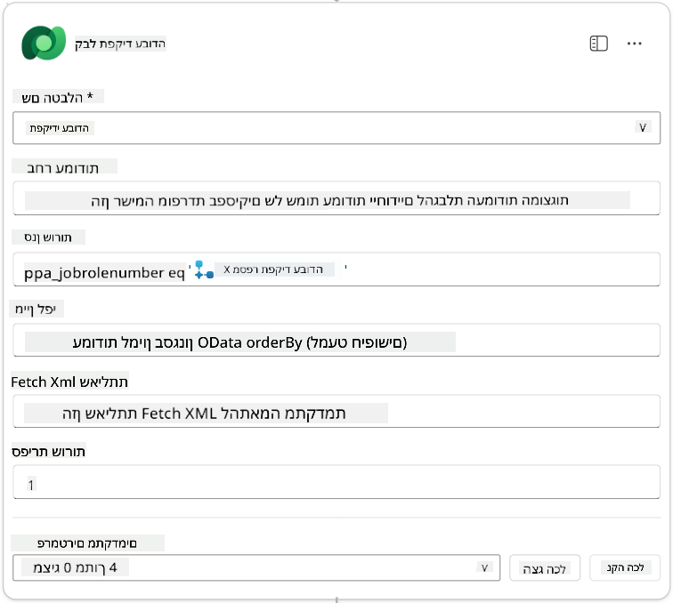

1. כעת, בחר באייקון **+** הוספת פעולה מתחת ל-`קבל תפקיד עבודה`, חפש **Dataverse**, בחר **ראה עוד**, ולאחר מכן מצא את הפעולה **הוסף שורה חדשה**.

1. **שנה שם** לצומת כ-`הוסף בקשה`, ולאחר מכן הגדר את הפרמטרים הבאים:

    | מאפיין                           | איך להגדיר           | ערך                                                        |
    | ---------------------------------- | -------------------- | ------------------------------------------------------------ |
    | **שם טבלה**                     | בחר               | בקשות עבודה                                             |
    | **מועמד (מועמדים)**             | ביטוי (אייקון fx) | `concat('ppa_candidates/',first(outputs('קבל_קורות_חיים')?['body/value'])?['_ppa_candidate_value'])` |
| **תפקיד (תפקידים)**               | ביטוי (fx icon) | `concat('ppa_jobroles/',first(outputs('Get_Job_Role')?['body/value'])?['ppa_jobroleid'])` |
| **קורות חיים (קורות חיים)**       | ביטוי (fx icon) | `concat('ppa_resumes/', first(outputs('Get_Resume')?['body/value'])?['ppa_resumeid'])` |
| **תאריך הגשת מועמדות** (השתמש ב-**הצג הכל**) | ביטוי (fx icon) | `utcNow()`                                                   |

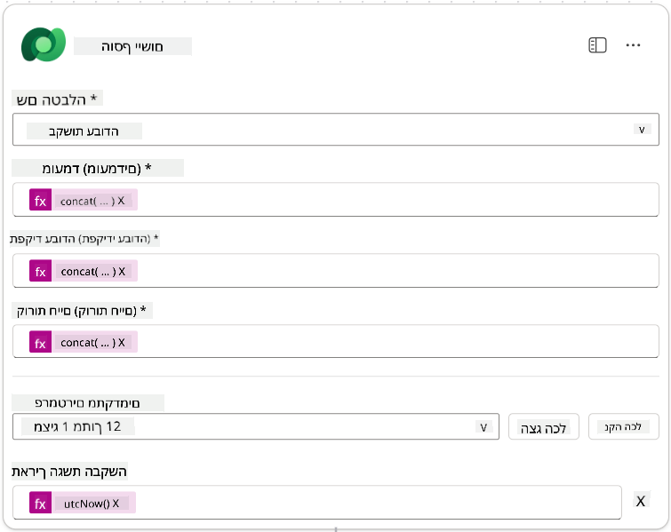

1. בחר את **Respond to the agent node**, ולאחר מכן בחר **+ Add an output**

     | מאפיין        | איך להגדיר                      | פרטים                                         |
     | --------------- | ------------------------------- | ----------------------------------------------- |
     | **סוג**        | בחר                          | `Text`                                          |
     | **שם**        | הזן                           | `ApplicationNumber`                             |
     | **ערך**       | נתונים דינמיים (thunderbolt icon) | *Add Application → See More → Application Number* |
     | **תיאור** | הזן                           | `The [ApplicationNumber] of the Job Application created`      |

     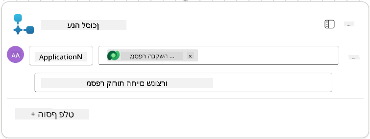

1. בחר **שמור טיוטה** בפינה הימנית העליונה

1. בחר את לשונית **סקירה כללית**, בחר **ערוך** בלוח **פרטים**

      - **שם זרימה**:`Create Job Application`
      - **תיאור**:`Creates a new job application when given [ResumeNumber] and [JobRoleNumber]`
      - **שמור**

1. חזור ללשונית **מעצב**, ובחר **פרסם**.

### 8.5 הוסף יצירת מועמדות לסוכן

עכשיו תחבר את הזרימה שפורסמה לסוכן קבלת המועמדות שלך.

1. חזור ל-**Hiring Agent** ובחר בלשונית **סוכנים**. פתח את **Application Intake Agent**, ולאחר מכן מצא את לוח **כלים**.

1. בחר **+ הוסף**

1. בחר את מסנן **זרימה**, וחפש `Create Job Application`. בחר את זרימת **Create Job Application**, ולאחר מכן **הוסף והגדר**.

1. הגדר את הפרמטרים הבאים:

    | פרמטר                                           | ערך                                                        |
    | --------------------------------------------------- | ------------------------------------------------------------ |
    | **תיאור**                                     | `Creates a new job application when given [ResumeNumber] and [JobRoleNumber]` |
    | **פרטים נוספים → מתי ניתן להשתמש בכלי זה** | `Only when referenced by topics or agents`                   |

1. בחר **שמור**  
    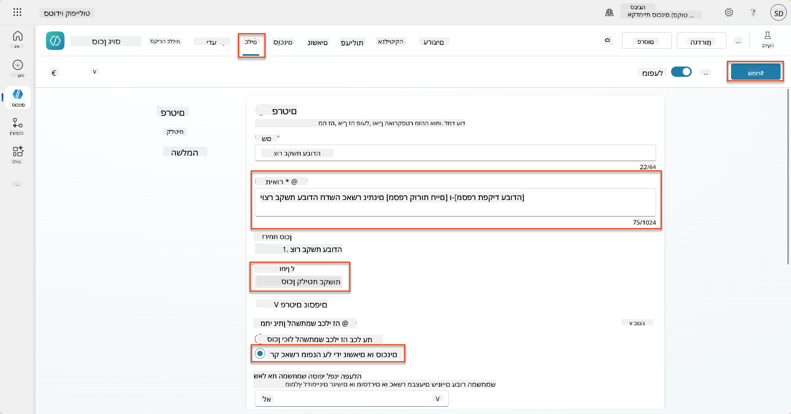

### 8.6 הגדר הוראות לסוכן

כדי ליצור מועמדויות, עליך להנחות את הסוכן מתי להשתמש בכלי החדש. במקרה זה, תבקש מהמשתמש לאשר לאילו תפקידים מוצעים להגיש מועמדות, ותנחה את הסוכן להפעיל את הכלי עבור כל תפקיד.

1. חזור ל-**Application Intake Agent**, ולאחר מכן מצא את לוח **הוראות**.

1. בשדה **הוראות**, **הוסף** את ההנחיות הברורות הבאות לסוכן המשני שלך **בסוף ההוראות הקיימות**:

    ```text
    3. Post Resume Upload
       - Respond with a formatted bullet list of [SuggestedJobRoles] the candidate could apply for.  
       - Use the format: [JobRoleNumber] - [RoleDescription]
       - Ask the user to confirm which Job Roles to create applications for the candidate.
       - When the user has confirmed a set of [JobRoleNumber]s, move to the next step.
    
    4. Post Upload - Application Creation
        - After the user confirms which [SuggestedJobRoles] for a specific [ResumeNumber]:
        E.g. "Apply [ResumeNumber] for the Job Roles [JobRoleNumber], [JobRoleNumber], [JobRoleNumber]
        E.g. "apply to all suggested job roles" - this implies use all the [JobRoleNumbers] 
         - Loop over each [JobRoleNumber] and send with [ResumeNumber] to /Create Job Application   
         - Summarize the Job Applications Created
    
    Strict Rules (that must never be broken)
    You must always follow these rules and never break them:
    1. The only valid identifiers are:
      - ResumeNumber (ppa_resumenumber)→ format R#####
      - CandidateNumber (ppa_candidatenumber)→ format C#####
      - ApplicationNumber (ppa_applicationnumber)→ format A#####
      - JobRoleNumber (ppa_jobrolenumber)→ format J#####
    2. Never guess or invent these values.
    3. Always extract identifiers from the current context (conversation, data, or system output). 
    ```

1. כאשר ההוראות כוללות קו נטוי (/), בחר את הטקסט שמופיע אחרי הקו הנטוי ובחר בכלי **Create Job Application**.

1. בחר **שמור**  
    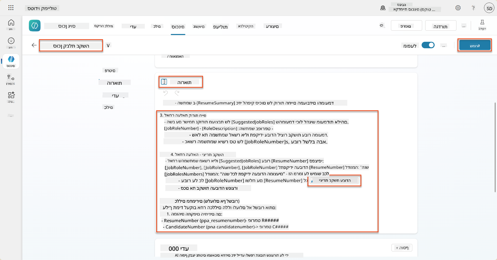

!!! tip "חזרה על פריטים מרובים באורקסטרציה גנרטיבית"
    ההוראות הללו משתמשות ביכולת האורקסטרציה הגנרטיבית לחזור על שורות מרובות כאשר מקבלים החלטות על אילו צעדים וכלים להשתמש. התפקידים המותאמים ייקראו באופן אוטומטי וסוכן קבלת המועמדות יפעל עבור כל שורה. ברוך הבא לעולם הקסום של אורקסטרציה גנרטיבית!

### 8.7 בדוק את הסוכן שלך

1. פתח את **Hiring Agent** ב-Copilot Studio.

1. **העלה** קורות חיים לדוגמה לצ'אט, והקלד:

    ```text
    This is a new resume for the Power Platform Developer Role.
    ```

1. שים לב כיצד הסוכן מספק רשימה של תפקידים מוצעים - כל אחד עם מספר תפקיד.  
    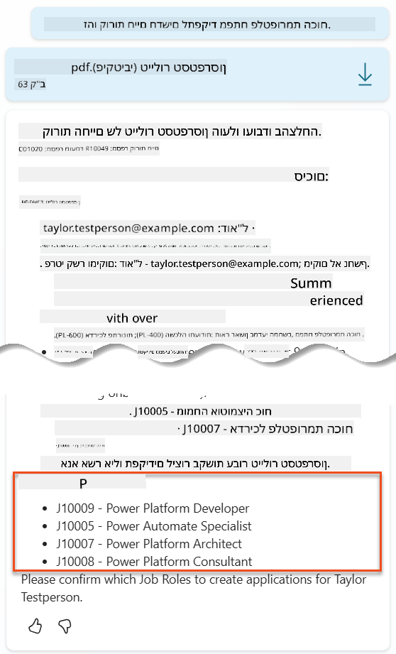

1. לאחר מכן תוכל לציין לאילו מהם תרצה להוסיף את קורות החיים כמועמדות לתפקיד.
    **דוגמאות:**

    ```text
    "Apply for all of those job roles"
    "Apply for the J10009 Power Platform Developer role"
    "Apply for the Developer and Architect roles"
    ```

    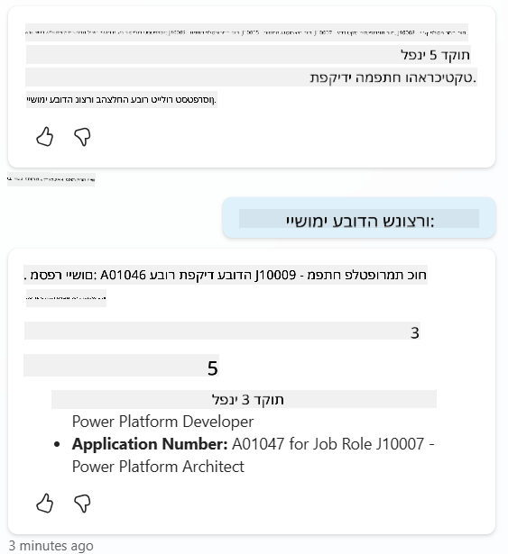

1. כלי **Create Job Application** יופעל עבור כל תפקיד שציינת. בתוך מפת הפעילות, תראה את כלי Create Job Application מופעל עבור כל אחד מהתפקידים שביקשת ליצור מועמדות עבורם:  
    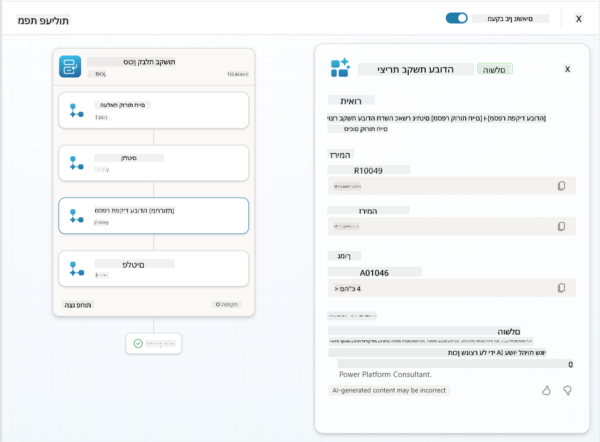

## 🎉 משימה הושלמה

עבודה מצוינת, אופרטיבי! **Operation Grounding Control** הושלמה. שיפרת בהצלחה את יכולות ה-AI שלך עם חיבור נתונים דינמי, ויצרת מערכת גיוס חכמה באמת.

הנה מה שהשגת במשימה זו:

**✅ שליטה בחיבור נתונים ל-Dataverse**  
עכשיו אתה מבין איך לחבר הנחיות מותאמות למקורות נתונים חיים עבור אינטליגנציה דינמית.

**✅ ניתוח קורות חיים משופר**  
זרימת Summarize Resume שלך עכשיו ניגשת לנתוני תפקידים בזמן אמת וקריטריוני הערכה להתאמה מדויקת.

**✅ קבלת החלטות מבוססת נתונים**  
סוכני הגיוס שלך יכולים עכשיו להתאים עצמם אוטומטית לדרישות תפקיד משתנות ללא עדכוני הנחיות ידניים.

**✅ יצירת מועמדות לתפקיד**  
המערכת המשופרת שלך יכולה עכשיו ליצור מועמדויות לתפקיד ומוכנה לאורקסטרציה מורכבת נוספת.

🚀 **הבא בתור:** במשימה הבאה תלמד איך ליישם יכולות הסקת מסקנות עמוקות שיעזרו לסוכנים שלך לקבל החלטות מורכבות ולספק הסברים מפורטים להמלצותיהם.

⏩ [עבור למשימה 09: הסקת מסקנות עמוקה](../09-deep-reasoning/README.md)

## 📚 משאבים טקטיים

📖 [שימוש בנתונים שלך בהנחיה](https://learn.microsoft.com/ai-builder/use-your-own-prompt-data?WT.mc_id=power-182762-scottdurow)

📖 [יצירת הנחיה מותאמת אישית](https://learn.microsoft.com/ai-builder/create-a-custom-prompt?WT.mc_id=power-182762-scottdurow)

📖 [עבודה עם Dataverse ב-Copilot Studio](https://learn.microsoft.com/microsoft-copilot-studio/knowledge-add-dataverse?WT.mc_id=power-182762-scottdurow)

📖 [סקירה כללית של הנחיות מותאמות אישית ב-AI Builder](https://learn.microsoft.com/ai-builder/prompts-overview?WT.mc_id=power-182762-scottdurow)

📖 [תיעוד AI Builder של Power Platform](https://learn.microsoft.com/ai-builder/?WT.mc_id=power-182762-scottdurow)

📖 [הדרכה: יצירת הנחיות AI Builder באמצעות נתוני Dataverse שלך](https://learn.microsoft.com/training/modules/ai-builder-grounded-prompts/?WT.mc_id=power-182762-scottdurow)

---

**הצהרת אחריות**:  
מסמך זה תורגם באמצעות שירות תרגום AI [Co-op Translator](https://github.com/Azure/co-op-translator). למרות שאנו שואפים לדיוק, יש לקחת בחשבון שתרגומים אוטומטיים עשויים להכיל שגיאות או אי דיוקים. המסמך המקורי בשפתו המקורית צריך להיחשב כמקור סמכותי. עבור מידע קריטי, מומלץ להשתמש בתרגום מקצועי אנושי. אנו לא נושאים באחריות לכל אי הבנות או פרשנויות שגויות הנובעות משימוש בתרגום זה.