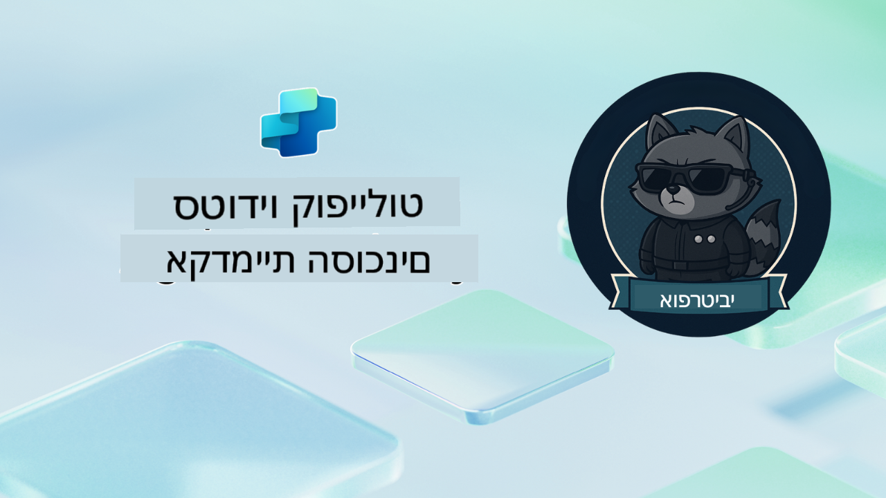

<!--
CO_OP_TRANSLATOR_METADATA:
{
  "original_hash": "24fcbe9a57d3439e05f8866e550c0a84",
  "translation_date": "2025-10-17T01:41:25+00:00",
  "source_file": "docs/operative-preview/README.md",
  "language_code": "he"
}
-->
# ברוך הבא, סוכן

**ברוך הבא, סוכן.**  
המשימה המתקדמת שלך—אם תבחר לקבל אותה—היא לשלוט באמנות בניית **מערכות רב-סוכנים ברמת ארגון** באמצעות **Microsoft Copilot Studio**.

ההכשרה האינטנסיבית הזו תיקח אותך מעבר ליצירת סוכנים בסיסיים אל העולם המתקדם של **תזמור רב-סוכנים**: החל מאוטומציה של תהליכי גיוס ועד בטיחות AI, תלמד לבנות, לתאם ולהפעיל מערכות סוכנים חכמות באמצעות תרחישים אמיתיים ברמת ארגון.

--8<-- "disclaimer.md"

---

## 🎯 מטרת המשימה

עם סיום תוכנית אקדמיית הסוכנים, תוכל:

- לעצב וליישם **מערכות רב-סוכנים** לתרחישים עסקיים מורכבים
- לשלוט בתבניות **תזמור סוכנים** ושיתוף פעולה
- ליישם **בטיחות AI ומודרציה של תוכן** במערכות ייצור
- לבנות **הנחיות רב-מודאליות** לעיבוד וניתוח מסמכים
- לפרוס **סוכנים מוכנים לארגון** עם ממשל ובדיקות מתאימות

---

## 🧪 דרישות מוקדמות

כדי להשלים את כל המשימות, תצטרך:

- סיום הכשרת **Agent Academy Recruit**
- סביבת Microsoft Power Platform עם רישיון **Copilot Studio**
- גישה ל-**Microsoft Dataverse**
- הרשאות מנהל ליצירת פתרונות וסוכנים

---

## 🧬 למי זה מיועד

הקורס המתקדם הזה מתאים ל:

- **ארכיטקטי פתרונות** המעצבים מערכות AI ארגוניות
- **מפתחים** הבונים פתרונות סוכנים מוכנים לייצור
- **אנשי IT** המיישמים ממשל ובטיחות AI
- **אנליסטים עסקיים** היוצרים תהליכי אוטומציה מורכבים
- כל מי שמוכן **להתקדם** מסוכנים בסיסיים למערכות ארגוניות

---

## 🧭 סקירת תוכנית הלימודים

האקדמיה בנויה כסדרה מתקדמת של פעולות שטח—כל משימה מתבססת על הקודמת כדי ליצור מערכת אוטומציה לגיוס מקיפה.

| משימה | כותרת | תדריך פעולה |
|---------|-------|-------------------|
| `01` | 🚨 [התחל עם סוכן הגיוס](./01-get-started/README.md) | פרוס תשתית בסיסית ויצור את סוכן התזמור המרכזי שלך |
| `02` | 🎭 [הפוך את הסוכן שלך למוכן לרב-סוכנים עם סוכנים מחוברים](./02-multi-agent/README.md) | הפוך סוכן יחיד למערכת רב-סוכנים מתואמת |
| `03` | ⚡ [אוטומציה של הסוכן שלך עם טריגרים](./03-automate-triggers/README.md) | יישם התנהגויות סוכן אוטונומיות עם טריגרים מבוססי אירועים |
| `04` | 📝 [כתיבת הנחיות לסוכן](./04-agent-instructions/README.md) | שלוט בתקשורת מדויקת והתנהגות הסוכן |
| `05` | 💬 [התאמת תגובות הסוכן](./05-agent-responses/README.md) | התאמת תגובות הסוכן להשגת השפעה ומעורבות מרבית |
| `06` | 🛡️ [עקרונות מודרציה של תוכן ובטיחות AI](./06-ai-safety/README.md) | יישם אמצעי בטיחות ותאימות ברמת ארגון |
| `07` | 🎨 [חילוץ תוכן קורות חיים עם הנחיות רב-מודאליות](./07-multimodal-prompts/README.md) | עיבוד מסמכים ותמונות עם יכולות AI מתקדמות |
| `08` | 🗄️ [הנחיות - עיגון ב-Dataverse](./08-dataverse-grounding/README.md) | עגן סוכנים בנתוני ארגון לתגובות מדויקות |
| `09` | 🧠 [יישום חשיבה עמוקה להערכת התאמת מועמדים והכנה לראיונות](./09-deep-reasoning/README.md) | יישם חשיבה AI מתקדמת להחלטות מורכבות |
| `10` | 📄 [יצירת מסמכי ראיונות מותאמים אישית למועמדים עם הנחיות](./10-generate-documents/README.md) | צור מסמכים דינמיים בהתבסס על ניתוח הסוכן |
| `11` | 📊 [קבלת משוב משתמשים עם כרטיסים אדפטיביים](./11-obtain-user-feedback/README.md) | אסוף ועבד משוב משתמשים לשיפור מתמיד |
| `12` | 🌐 [פרסום הסוכנים שלך באתר הדגמה לבדיקת בעלי עניין](./12-demo-website/README.md) | פרוס פתרון מלא להדגמה ובדיקת בעלי עניין |

!!! note
    ✅ השלמת תוכנית הלימודים מזכה אותך בתג **סוכן**.  
    🔓 **מפקד** ייפתח בשלבים עתידיים.

<!-- markdownlint-disable-next-line MD033 -->

---

**הצהרת אחריות**:  
מסמך זה תורגם באמצעות שירות תרגום מבוסס AI [Co-op Translator](https://github.com/Azure/co-op-translator). למרות שאנו שואפים לדיוק, יש לקחת בחשבון שתרגומים אוטומטיים עשויים להכיל שגיאות או אי דיוקים. המסמך המקורי בשפתו המקורית צריך להיחשב כמקור סמכותי. למידע קריטי, מומלץ להשתמש בתרגום מקצועי על ידי אדם. אנו לא נושאים באחריות לאי הבנות או לפרשנויות שגויות הנובעות משימוש בתרגום זה.