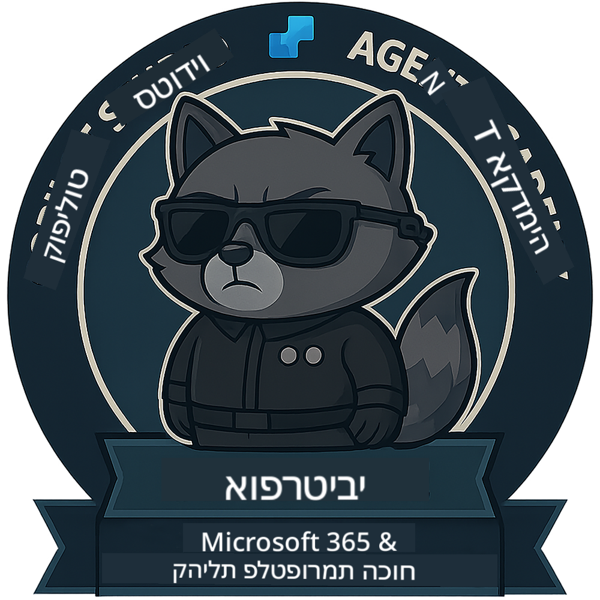

<!--
CO_OP_TRANSLATOR_METADATA:
{
  "original_hash": "1c5c8f18a1c1ec8fcbbb271403cf2ac6",
  "translation_date": "2025-10-17T01:40:57+00:00",
  "source_file": "docs/operative/README.md",
  "language_code": "he"
}
-->
---
hide:
- navigation
---

# אופרטיבי (בקרוב)

הקורס הזה עדיין סודי ביותר. הוא ייפתח בעתיד! 🔓

{ width="300" }

<!-- markdownlint-disable-next-line MD033 -->

---

**הצהרת אחריות**:  
מסמך זה תורגם באמצעות שירות תרגום AI [Co-op Translator](https://github.com/Azure/co-op-translator). למרות שאנו שואפים לדיוק, יש לקחת בחשבון שתרגומים אוטומטיים עשויים להכיל שגיאות או אי דיוקים. המסמך המקורי בשפתו המקורית צריך להיחשב כמקור סמכותי. עבור מידע קריטי, מומלץ להשתמש בתרגום מקצועי אנושי. איננו אחראים לאי הבנות או פירושים שגויים הנובעים משימוש בתרגום זה.