<!--
CO_OP_TRANSLATOR_METADATA:
{
  "original_hash": "d9cd8cd1a4fbd8915171a2ed972cc322",
  "translation_date": "2025-10-17T01:22:25+00:00",
  "source_file": "docs/recruit/00-course-setup/README.md",
  "language_code": "he"
}
-->
# 🚨 משימה 00: הגדרת הקורס

## 🕵️‍♂️ שם קוד: `מבצע מוכנות לפריסה`

> **⏱️ חלון זמן המבצע:** `~30 דקות`  

## 🎯 תדריך המשימה

ברוכים הבאים למשימה הראשונה באימונים שלכם כסוכני Copilot Studio.  
לפני שתוכלו להתחיל לבנות את סוכן הבינה המלאכותית הראשון שלכם, עליכם להקים את **סביבת הפיתוח המוכנה לשטח**.

תדריך זה מפרט את המערכות, פרטי הגישה והשלבים הנדרשים כדי לפעול בהצלחה באקוסיסטם של Microsoft 365.

## 🔎 מטרות

המשימה שלכם כוללת:

1. קבלת חשבון Microsoft 365  
1. קבלת גישה ל-Microsoft Copilot Studio  
1. (אופציונלי) השגת רישיון Microsoft 365 Copilot לפרסום בייצור  
1. יצירת סביבת פיתוח שתשמש כסביבת Copilot Studio שלכם לבנייה  
1. יצירת אתר SharePoint שישמש כמקור נתונים במשימות הבאות

---

## 🔍 דרישות מקדימות

לפני שתתחילו, ודאו שיש לכם:

1. **כתובת אימייל של עבודה או לימודים** (כתובות אישיות כמו @outlook.com, @gmail.com וכו' אינן נתמכות).
1. גישה לאינטרנט ודפדפן מודרני (מומלץ Edge, Chrome או Firefox).  
1. היכרות בסיסית עם Microsoft 365 (לדוגמה, כניסה לאפליקציות Office או Teams).  
1. (אופציונלי) כרטיס אשראי או אמצעי תשלום אם אתם מתכננים לרכוש רישיונות בתשלום.

---

## שלב 1: קבלת חשבון Microsoft 365

Copilot Studio נמצא בתוך Microsoft 365, ולכן אתם צריכים חשבון Microsoft 365 כדי לגשת אליו. תוכלו להשתמש בחשבון קיים אם יש לכם אחד או לבצע את השלבים הבאים כדי לקבל רישיון מתאים:

1. **רכישת מנוי בתשלום ל-Microsoft 365 Business**  
   1. גשו לדף [תוכניות ומחירים של Microsoft 365 Business](https://www.microsoft.com/microsoft-365/business/microsoft-365-plans-and-pricing)
   1. האפשרות הזולה ביותר להתחלה היא תוכנית Microsoft 365 Business Basic. בחרו `נסו בחינם` ועקבו אחר הטופס המודרך למילוי פרטי המנוי, החשבון ומידע התשלום.
   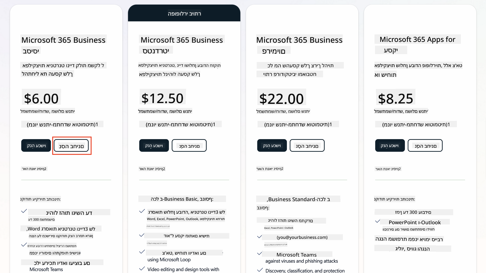
   1. לאחר שיש לכם חשבון חדש, התחברו.

    !!! Tip
        אם אתם מתכננים לפרסם סוכנים בצ'אט של Microsoft 365 Copilot או להתחבר לנתונים ארגוניים (SharePoint, OneDrive, Dataverse), נדרש רישיון Microsoft 365 Copilot. זהו רישיון נוסף שתוכלו ללמוד עליו יותר [באתר הרישוי](https://www.microsoft.com/microsoft-365/copilot#plans)

---

## שלב 2: התחלת ניסיון של Copilot Studio

לאחר שיש לכם Tenant של Microsoft 365, עליכם לקבל גישה ל-Copilot Studio. תוכלו לקבל ניסיון חינם ל-30 יום על ידי ביצוע השלבים הבאים:

1. נווטו ל-[aka.ms/TryCopilotStudio](https://aka.ms/TryCopilotStudio).  
1. הזינו את כתובת האימייל מהחשבון החדש שהגדרתם בשלב הקודם ובחרו `הבא`.  
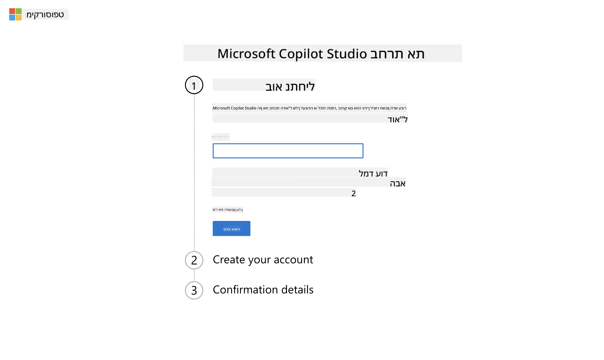
1. המערכת תזהה את החשבון שלכם. בחרו `התחבר`.
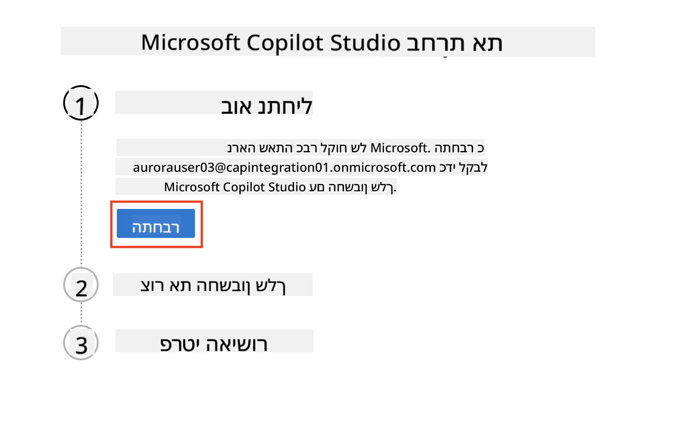  
1. בחרו `התחל ניסיון חינם`.
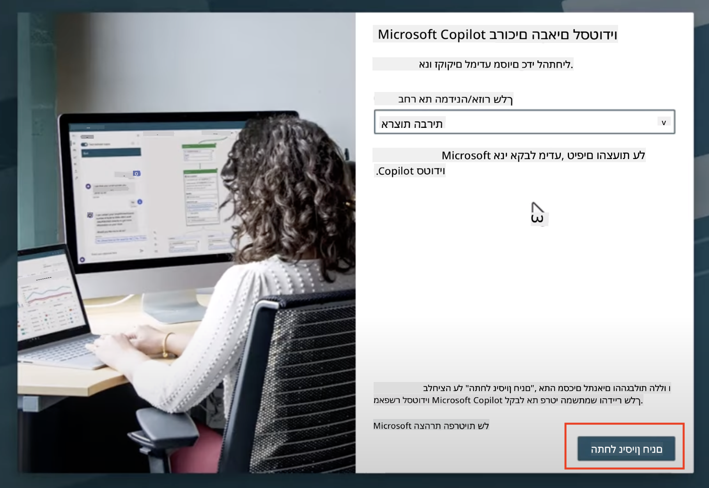

!!! info "הערות על הניסיון"  
     1. הניסיון החינמי מספק **יכולות מלאות של Copilot Studio**.
     1. תקבלו התראות אימייל על תאריך פקיעת הניסיון שלכם. ניתן להאריך את הניסיון במקטעים של 30 יום (עד 90 ימי הפעלה של סוכן).  
     1. אם מנהל ה-Tenant שלכם השבית הרשמה עצמית, תראו שגיאה—צרו קשר עם מנהל Microsoft 365 שלכם כדי להפעיל אותה מחדש.

---

## שלב 3: יצירת סביבת פיתוח חדשה

### הרשמה לתוכנית המפתחים של Power Apps

באמצעות אותו Tenant של Microsoft 365 משלב 1, הירשמו לתוכנית המפתחים של Power Apps כדי ליצור סביבת פיתוח חינמית לבנייה ובדיקה עם Copilot Studio.

1. הירשמו באתר [תוכנית המפתחים של Power Apps](https://aka.ms/PowerAppsDevPlan).

    - הזינו את כתובת האימייל שלכם
    - סמנו את תיבת הסימון
    - בחרו **התחל חינם**

    

1. לאחר ההרשמה לתוכנית המפתחים, תועברו ל-[Power Apps](https://make.powerapps.com/). הסביבה משתמשת בשם שלכם, לדוגמה **הסביבה של Adele Vance**. אם כבר קיימת סביבה עם שם זה, הסביבה החדשה תיקרא **הסביבה של Adele Vance (1)**.

    השתמשו בסביבת הפיתוח הזו ב-Copilot Studio בעת השלמת המעבדות.

!!! Note
    אם אתם משתמשים בחשבון Microsoft 365 קיים ולא יצרתם אחד בשלב 1, לדוגמה - משתמשים בחשבון שלכם בארגון העבודה שלכם, ייתכן שמנהל ה-IT שלכם (או הצוות המקביל) שמנהל את ה-Tenant/הסביבות שלכם השבית את תהליך ההרשמה. במקרה כזה, אנא צרו קשר עם המנהל שלכם, או צרו Tenant בדיקה כפי שמתואר בשלב 1.

---

## שלב 4: יצירת אתר SharePoint חדש

יש ליצור אתר SharePoint חדש שישמש ב-[שיעור 06 - יצירת סוכן מותאם אישית באמצעות חוויית יצירת שיחה עם Copilot והסתמכות על הנתונים שלכם](../06-create-agent-from-conversation/README.md#62-add-an-internal-knowledge-source-using-a-sharepoint-site).

1. בחרו באייקון הוופל בצד השמאלי העליון של Microsoft Copilot Studio כדי להציג את התפריט. בחרו SharePoint מהתפריט.

    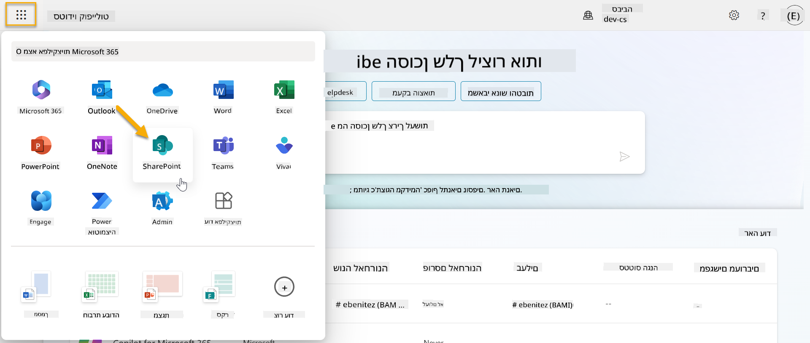

1. SharePoint ייטען. בחרו **+ צור אתר** כדי ליצור אתר SharePoint חדש.

    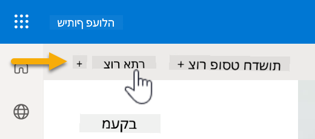

1. יופיע דיאלוג שינחה אתכם ביצירת אתר SharePoint חדש. בחרו **אתר צוות**.

    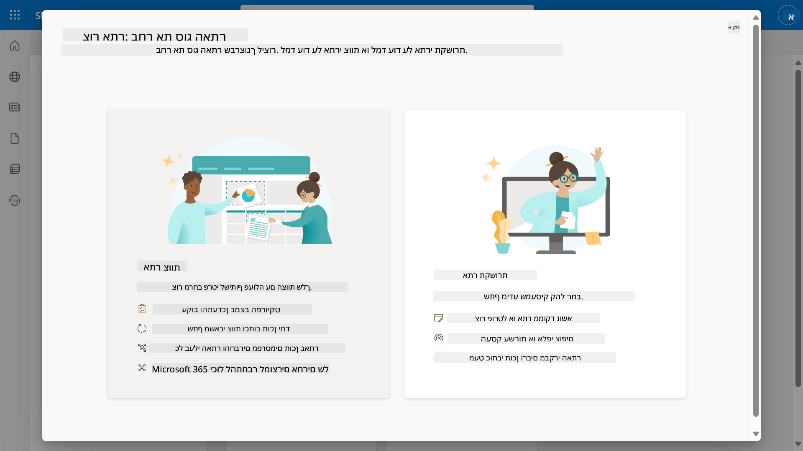

1. בשלב הבא, תיטען רשימת תבניות Microsoft כברירת מחדל. גללו מטה ובחרו בתבנית **שולחן עזרה IT**.

    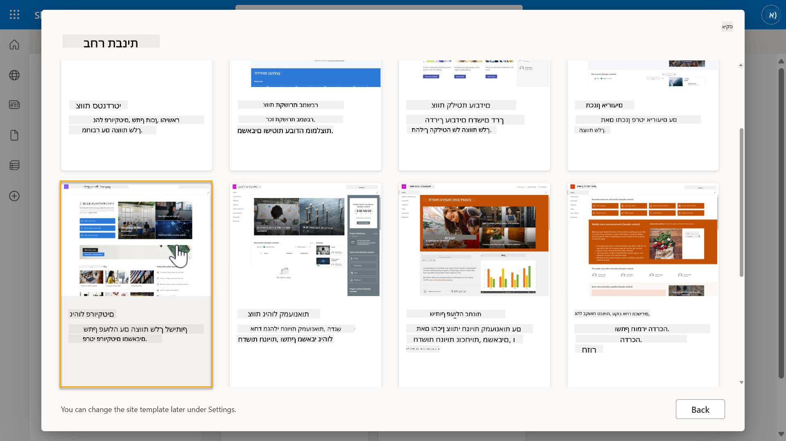

1. בחרו **השתמש בתבנית** כדי ליצור אתר SharePoint חדש באמצעות תבנית שולחן עזרה IT.

    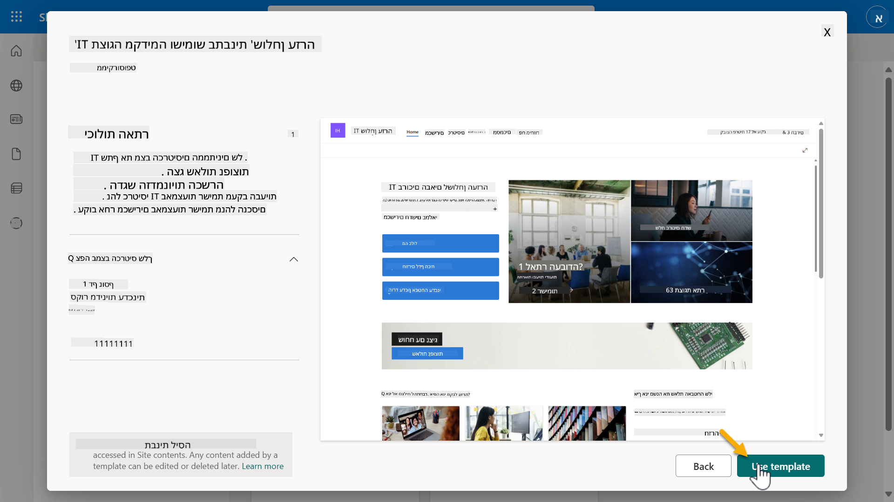

1. הזינו מידע עבור האתר שלכם. הדוגמה הבאה היא לדוגמה:

    | שדה | ערך |
    | --- | --- |
    | שם האתר | Contoso IT |
    | תיאור האתר | Copilot Studio למתחילים |
    | כתובת האתר | ContosoIT |

    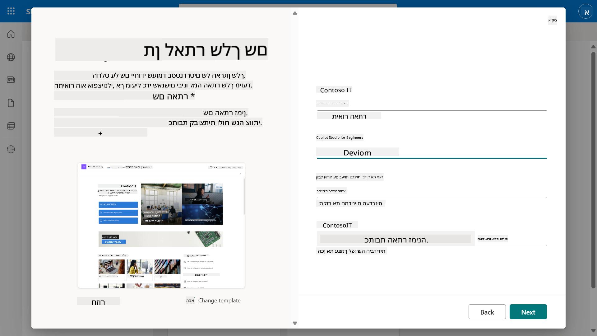

1. בשלב האחרון, ניתן לבחור שפה עבור אתר SharePoint. כברירת מחדל תהיה זו **אנגלית**. השאירו את השפה כ-**אנגלית** ובחרו **צור אתר**.

    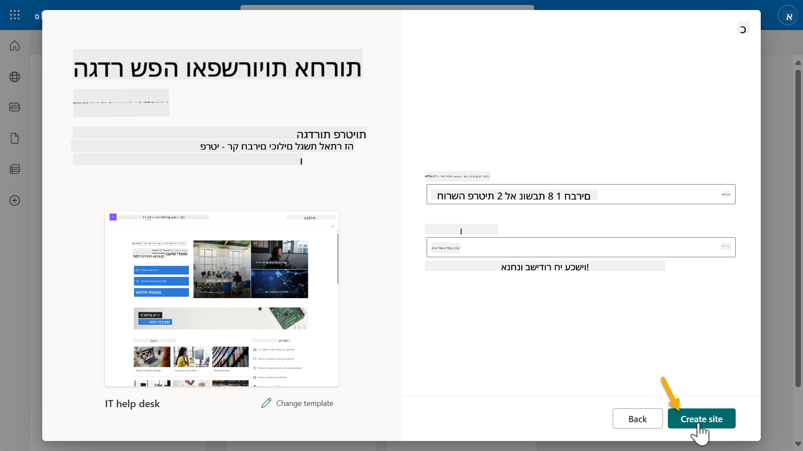

1. אתר SharePoint יוקם במשך מספר שניות. בינתיים, תוכלו לבחור להוסיף משתמשים אחרים לאתר שלכם על ידי הזנת כתובת האימייל שלהם בשדה **הוסף חברים**. לאחר השלמת התהליך, בחרו **סיום**.

    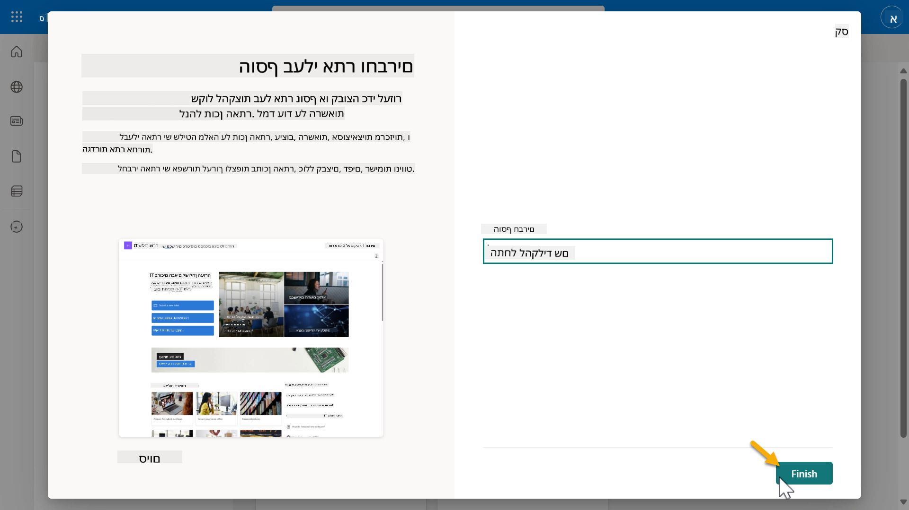

1. דף הבית של אתר SharePoint ייטען. **העתיקו** את כתובת האתר של SharePoint.

1. תבנית זו מספקת דפים עם נתונים לדוגמה על מדיניות IT שונות ושתי רשימות לדוגמה (כרטיסים ומכשירים).

### שימוש ברשימת המכשירים של SharePoint

נשתמש ברשימת **המכשירים** ב-[משימה 07 - הוספת נושא חדש עם טריגר וצמתים](../07-add-new-topic-with-trigger/README.md#73-add-a-tool-using-a-connector).

### הוספת עמודה חדשה

גללו ימינה ברשימה ובחרו בכפתור **+ הוסף עמודה**. בחרו בסוג **היפר-קישור**, הזינו **תמונה** כשם העמודה, ובחרו הוסף.

### יצירת נתוני דוגמה ברשימת המכשירים של SharePoint

עליכם לוודא שאתם ממלאים את הרשימה הזו עם לפחות 4 פריטי נתונים לדוגמה ומוסיפים עמודה נוספת לרשימה זו.  

בעת הוספת נתוני דוגמה, ודאו שהשדות הבאים מלאים:

- תמונת המכשיר - השתמשו בתמונות מתיקיית [תמונות המכשירים](https://github.com/microsoft/agent-academy/tree/main/docs/recruit/00-course-setup/images/device-images)
- כותרת
- סטטוס
- יצרן
- דגם
- סוג נכס
- צבע
- מספר סידורי
- תאריך רכישה
- מחיר רכישה
- מספר הזמנה
- תמונה - השתמשו בקישורים הבאים

|מכשיר  |URL  |
|---------|---------|
|Surface Laptop 13     | [https://raw.githubusercontent.com/microsoft/agent-academy/refs/heads/main/docs/recruit/00-course-setup/images/device-images/Surface-Laptop-13.png](https://raw.githubusercontent.com/microsoft/agent-academy/refs/heads/main/docs/recruit/00-course-setup/images/device-images/Surface-Laptop-13.png)        |
|Surface Laptop 15     | [https://raw.githubusercontent.com/microsoft/agent-academy/refs/heads/main/docs/recruit/00-course-setup/images/device-images/Surface-Laptop-15.png](https://raw.githubusercontent.com/microsoft/agent-academy/refs/heads/main/docs/recruit/00-course-setup/images/device-images/Surface-Laptop-15.png)        |
|Surface Pro    | [https://raw.githubusercontent.com/microsoft/agent-academy/refs/heads/main/docs/recruit/00-course-setup/images/device-images/Surface-Pro-12.png](https://raw.githubusercontent.com/microsoft/agent-academy/refs/heads/main/docs/recruit/00-course-setup/images/device-images/Surface-Pro-12.png)        |
|Surface Studio    | [https://raw.githubusercontent.com/microsoft/agent-academy/refs/heads/main/docs/recruit/00-course-setup/images/device-images/Surface-Studio.png](https://raw.githubusercontent.com/microsoft/agent-academy/refs/heads/main/docs/recruit/00-course-setup/images/device-images/Surface-Studio.png)        |

---

## ✅ משימה הושלמה

הצלחתם:

- להקים סביבת פיתוח של Microsoft 365  
- להפעיל את ניסיון Copilot Studio שלכם  
- ליצור אתר SharePoint להסתמכות סוכנים  
- למלא את רשימת המכשירים לשימוש במשימות עתידיות

אתם רשמית מוכנים להתחיל את **אימוני הסוכנים ברמת מתגייס** ב-[שיעור 01](../01-introduction-to-agents/README.md).  

<!-- markdownlint-disable-next-line MD033 -->

---

**כתב ויתור**:  
מסמך זה תורגם באמצעות שירות תרגום AI [Co-op Translator](https://github.com/Azure/co-op-translator). למרות שאנו שואפים לדיוק, יש להיות מודעים לכך שתרגומים אוטומטיים עשויים להכיל שגיאות או אי דיוקים. המסמך המקורי בשפתו המקורית צריך להיחשב כמקור סמכותי. עבור מידע קריטי, מומלץ להשתמש בתרגום מקצועי אנושי. איננו נושאים באחריות לאי הבנות או לפרשנויות שגויות הנובעות משימוש בתרגום זה.