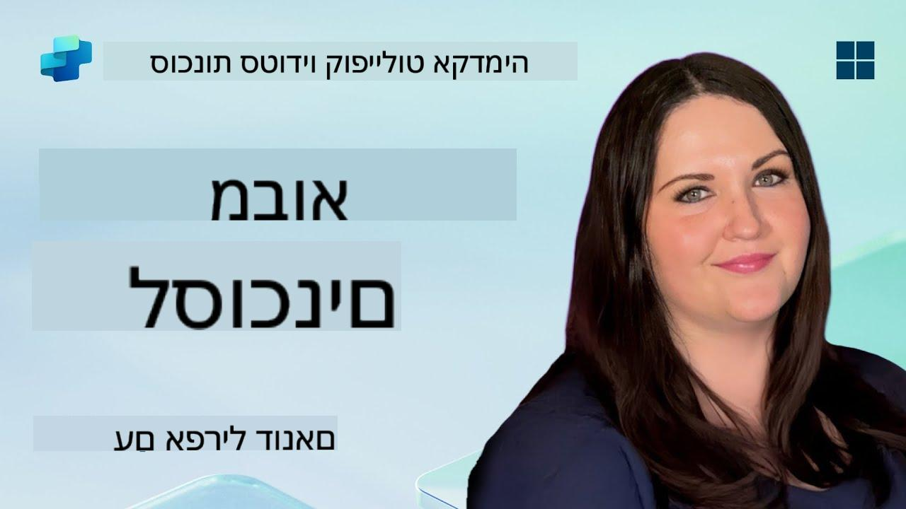

<!--
CO_OP_TRANSLATOR_METADATA:
{
  "original_hash": "d6706e107678264168d77b2e107710b1",
  "translation_date": "2025-10-17T01:37:31+00:00",
  "source_file": "docs/recruit/01-introduction-to-agents/README.md",
  "language_code": "he"
}
-->
# 🚨 משימה 01: מבוא לסוכנים

## 🕵️‍♂️ שם קוד: `מבצע פענוח סוכן AI`

> **⏱️ חלון זמן למבצע:** `~30 דקות – מידע בלבד, ללא עבודה בשטח`

🎥 **צפו בסרטון ההדרכה**

## 🎯 תדריך משימה

ברוך הבא, מגויס. לפני שנצלול לתוך בניית סוכנים, עליך להבין היטב את מושגי ה-AI שמניעים אותם. משימה זו תצייד אותך בידע בסיסי על AI שיחתי, מודלים לשוניים גדולים (LLMs), יצירה מועשרת על ידי אחזור (RAG), וסוגי הסוכנים שתוכל ליצור ב-Copilot Studio.

## 🔎 מטרות

במשימה זו תלמד:

1. מהו AI שיחתי ולמה הוא חשוב  
1. כיצד מודלים לשוניים גדולים (LLMs) מניעים חוויות שיחה  
1. מה מביאה יצירה מועשרת על ידי אחזור (RAG)  
1. ההבדל בין סוכנים שיחתיים לסוכנים אוטונומיים  
1. כיצד סוכנים ב-Copilot Studio מנצלים את המושגים הללו  

בואו נתחיל!

---

## מהו AI שיחתי?

AI שיחתי מתייחס לכל מערכת שיכולה להבין, לעבד ולהגיב לשפה אנושית – בין אם טקסט או דיבור – בצורה שמרגישה טבעית. חשבו על צ'אטבוטים במוקדי תמיכה או עוזרים אישיים וירטואליים באפליקציות האהובות עליכם. מאחורי הקלעים, רוב מערכות ה-AI השיחתיות המודרניות מסתמכות על מודלים לשוניים גדולים (LLMs), עליהם נדבר בהמשך.

### למה זה חשוב

- **חוויית משתמש:** ממשקים שיחתיים הם לרוב אינטואיטיביים יותר מאשר ניווט בתפריטים.  
- **יכולת הרחבה:** סוכן אחד יכול לטפל בעשרות או מאות שיחות בו-זמנית.  
- **יעילות:** במקום לבנות סקריפטים מבוססי חוקים מותאמים אישית, סוכנים מבוססי LLM מתאימים עצמם באופן דינמי לקלט המשתמש.  
- **הרחבה:** עם עיצוב נכון, סוכנים יכולים לגשת למאגרי מידע, להתחבר ל-APIs, או לפעול כ"עמיתים דיגיטליים" בתוך תהליכי עבודה עסקיים.

---

## מודלים לשוניים גדולים (LLMs) 101

בלב רוב מערכות ה-AI השיחתיות נמצאים **מודלים לשוניים גדולים** – רשתות נוירונים שמאומנות על מאגרי טקסט עצומים. הם לומדים דפוסים סטטיסטיים של שפה כך שיוכלו ליצור משפטים קוהרנטיים, לענות על שאלות, או אפילו להעלות רעיונות. נקודות מפתח להבנה:

1. **נתוני אימון:** LLMs צורכים טרה-בייטים של טקסט (דפי אינטרנט, ספרים, מאמרים). "ידע העולם" הזה מאפשר להם להגיב בנושאים רבים.  
1. **טוקניזציה:** הטקסט מפורק ליחידות קטנות הנקראות טוקנים (מילים, תתי-מילים, או תווים). המודל מנבא טוקן אחד בכל פעם.  
1. **חלון הקשר:** לכל LLM יש מגבלה על כמות הטוקנים שהוא יכול "לראות" בו-זמנית. מעבר למגבלה זו, טוקנים קודמים נחתכים.  
1. **הנחיה:** אתה מתקשר עם LLM על ידי שליחת הנחיה. ככל שההנחיה שלך טובה יותר, התגובה תהיה ממוקדת ורלוונטית יותר.  
1. **Zero-shot לעומת Fine-tuning:** Zero-shot מתייחס לשימוש ב-LLM כפי שהוא (רק משקלים גולמיים). Fine-tuning מתייחס להתאמת המודל על נתונים ספציפיים לתחום כך שיענה בצורה מדויקת יותר לצרכים שלך.

!!! Tip "טיפ מקצועי"
    אנלוגיה נפוצה היא ש-LLM הוא כמו "השלמה אוטומטית סופר-חכמה". הוא לא באמת מבין משמעות כמו מוח אנושי, אבל הוא מאוד טוב בניבוי המילה (או הביטוי) הבא הטוב ביותר ברצף.

---

## יצירה מועשרת על ידי אחזור (RAG)

כאשר LLMs מסתמכים רק על נתוני אימון סטטיים, הם עשויים להמציא מידע או להיות לא מעודכנים. RAG מתמודד עם זה על ידי מתן אפשרות למודל "לחפש" מידע עדכני לפני שהוא יוצר תשובה. באופן כללי, RAG עובד כך:

1. **שאלת משתמש:** משתמש שואל שאלה (לדוגמה, "מה חדש ברווחים הרבעוניים של Contoso?").  
1. **שלב האחזור:** המערכת מחפשת מקור מידע (מסמכים, מאגרי נתונים פנימיים, ספריות SharePoint וכו') כדי למצוא קטעים רלוונטיים.  
1. **העשרה:** הקטעים שנמצאו מתווספים או מקדימים את ההנחיה של ה-LLM.  
1. **יצירה:** ה-LLM מעבד את שאלת המשתמש ואת ההקשר שנמצא, ואז יוצר תשובה שמבוססת על נתונים עדכניים.  

עם RAG, הסוכן שלך יכול לגשת לויקי פנימי של החברה, ל-APIs של תוספים, או לחפש במאגרי מידע של שאלות נפוצות – ולהחזיר תשובות שאינן מוגבלות לפרמטרים סטטיים של המודל.

---

## סוכנים שיחתיים מול סוכנים אוטונומיים

בהקשר של Copilot Studio, המונח **סוכן** יכול להתייחס למספר סוגים של עוזרי AI. חשוב להבחין בין:

**סוכנים שיחתיים:**

- מתמקדים בעיקר בדיאלוג דו-כיווני.  
- שומרים על הקשר לאורך מספר פניות בשיחה.  
- בדרך כלל מתוזמרים באמצעות זרימות או טריגרים מוגדרים מראש (לדוגמה, "אם המשתמש אומר X, הגיב עם Y").  
- אידיאליים לתמיכת לקוחות, שאלות נפוצות, אינטראקציות מודרכות, תזמון, או שאלות ותשובות פשוטות.  
  - דוגמאות:  
    - צ'אטבוט ב-Teams שעונה על שאלות מדיניות HR.  
    - בוט Power Virtual Agents בדף SharePoint שמנחה משתמשים במילוי טופס.  

**סוכנים אוטונומיים:**

- מעבר לשיחה דו-כיוונית; הם יכולים **לבצע פעולות** בשם המשתמש.  
- משתמשים בלולאות חשיבה של LLM (חשבו "תכנון → פעולה → תצפית → תכנון מחדש") כדי להשלים משימות.  
- מתחברים לכלים חיצוניים או ל-APIs (לדוגמה, להפעיל זרימת Power Automate, לשלוח הזמנות ליומן, לעבד נתונים ב-Dataverse).  
- פועלים ללא צורך בהנחיות אנושיות מתמשכות – לאחר הפעלה, הם יכולים לטפל בתהליכים מרובי שלבים באופן עצמאי.  
  - דוגמאות:  
    - סוכן שמייצר מסלול טיול, מזמין טיסות, ושולח אישורים במייל.  
    - סוכן "סיכום פגישות" שמצטרף לשיחת Teams, מתמלל אותה בזמן אמת, וכותב סיכום מנהלים ל-OneNote.  

!!! Info "הבדל מרכזי"
    סוכנים שיחתיים ממתינים לקלט מהמשתמש ונשארים בדיאלוג. סוכנים אוטונומיים מתכננים ומבצעים רצף של צעדים באופן יזום תוך שימוש בגישה רחבה יותר לכלים.

---

## סוכנים ב-Copilot Studio

**Copilot Studio** מאחד תרחישים שיחתיים ואוטונומיים תחת מסגרת אחת. כך Copilot Studio עוזר לך לבנות סוכנים:

1. **מעצב סוכנים חזותי:** ממשק קוד נמוך להגדרת הנחיות, זיכרון וכלים עבור זרימות שיחה ופעולה.  
1. **הגדרות LLM:** בחירה בין מודלים שונים של OpenAI או GPT ברמה ארגונית של Microsoft כדי להתאים את הביצועים והעלויות לצרכים שלך.  
1. **מחברי אחזור:** אינטגרציות מוכנות מראש ל-SharePoint, OneDrive, Azure Cognitive Search, ו-Dataverse, המאפשרות RAG באופן מובנה.  
1. **כלים ופונקציות מותאמים אישית:** הגדרת פעולות HTTP מותאמות אישית או זרימות Power Automate שהסוכן שלך יכול להפעיל באופן אוטונומי.  
1. **תמיכה רב-מודלית:** מעבר לטקסט, סוכני Copilot Studio יכולים לעבד תמונות, קבצים, או נתונים מובנים כדי להעשיר את ההקשר.  
1. **פרסום והפצה:** לאחר שהסוכן שלך מוכן, תוכל לפרסם אותו ל-Microsoft 365 Copilot (כך שמשתמשים יפעילו אותו ב-Teams, SharePoint, Outlook וכו') או להטמיע אותו כווידג'ט צ'אט עצמאי בדף אינטרנט.

---

## 🎉 משימה הושלמה

כעת סיימת את המבוא לסוכנים ולמושגי AI בסיסיים. אתה מבין:

1. **LLMs = "המוח" של הסוכן שלך**  
   - אחראי על הבנת שפה ויצירת תוכן.  
   - יותר טוקנים = הקשר עשיר יותר, אך גם עלות גבוהה יותר לכל קריאה.  

1. **RAG = שילוב ידע בזמן אמת**  
   - מגשר על הפער בין LLM סטטי למקורות נתונים משתנים.  
   - מאחזר ומכניס מסמכים או רשומות רלוונטיים להנחיית ה-LLM.  

1. **שיחתי מול אוטונומי**  
   - **שיחתי:** מתמקד בזרימת דיאלוג ושמירת הקשר (לדוגמה, "זיכרון שיחה").  
   - **אוטונומי:** מוסיף "בלוקי פעולה" שמאפשרים לסוכן לקרוא לכלים או שירותים חיצוניים.

---
בהמשך, תחקור את [יסודות Copilot Studio](../02-copilot-studio-fundamentals/README.md)!

שמור על חדות, מגויס - מסע ה-AI שלך רק מתחיל!

## 📚 משאבים טקטיים

🔗 [דף הבית של תיעוד Copilot Studio](https://learn.microsoft.com/microsoft-copilot-studio/)

---

<!-- markdownlint-disable-next-line MD033 -->

---

**הצהרת אחריות**:  
מסמך זה תורגם באמצעות שירות תרגום AI [Co-op Translator](https://github.com/Azure/co-op-translator). למרות שאנו שואפים לדיוק, יש לקחת בחשבון שתרגומים אוטומטיים עשויים להכיל שגיאות או אי דיוקים. המסמך המקורי בשפתו המקורית צריך להיחשב כמקור סמכותי. עבור מידע קריטי, מומלץ להשתמש בתרגום מקצועי אנושי. אנו לא נושאים באחריות לכל אי הבנות או פרשנויות שגויות הנובעות משימוש בתרגום זה.