<!--
CO_OP_TRANSLATOR_METADATA:
{
  "original_hash": "0c51aabca81d6256990caf4c015e6195",
  "translation_date": "2025-10-17T01:30:23+00:00",
  "source_file": "docs/recruit/04-creating-a-solution/README.md",
  "language_code": "he"
}
-->
# 🚨 משימה 04: יצירת פתרון עבור הסוכן שלך

## 🕵️‍♂️ שם קוד: `מבצע CTRL-ALT-PACKAGE`

> **⏱️ חלון זמן המבצע:** `~45 דקות`

🎥 **צפו בהדרכה**

[](https://www.youtube.com/watch?v=1iATbkgfcpU "צפו בהדרכה ביוטיוב")

## 🎯 תדריך המשימה

יוצר סוכנים, ברוך הבא למבצע הטקטי הבא שלך. במשימה זו תלמד כיצד להרכיב פתרון - כלי הפריסה הרשמי עבור סוכן התמיכה הטכנית שלך שנבנה עם Microsoft Copilot Studio. תחשוב על זה כעל תיק דיגיטלי שמכיל את הסוכן שלך ואת הרכיבים שלו.

כל סוכן זקוק לבית מובנה היטב. זה בדיוק מה שפתרון Power Platform מספק - סדר, ניידות ומוכנות לייצור.

בוא נתחיל לארוז.

## 🔎 מטרות

במשימה זו תלמד:

1. להבין מה הם פתרונות Power Platform ותפקידם בפיתוח סוכנים
1. ללמוד את היתרונות של שימוש בפתרונות לארגון ופריסת סוכנים
1. לחקור את תפקידם של מפרסמי פתרונות בניהול רכיבים
1. להבין את מחזור החיים של פתרון Power Platform מפיתוח לייצור
1. ליצור מפרסם פתרון ופתרון מותאם אישית עבור סוכן התמיכה הטכנית שלך

## 🕵🏻‍♀️ פתרון? מה זה?

ב-Microsoft Power Platform, פתרונות הם כמו מכולות או חבילות שמכילות את כל החלקים של האפליקציות או הסוכנים שלך - זה יכול להיות טבלאות, טפסים, זרימות ולוגיקה מותאמת אישית. פתרונות חיוניים לניהול מחזור החיים של אפליקציות (ALM), הם מאפשרים לך לנהל את האפליקציה והסוכנים שלך מרעיון לפיתוח, בדיקה, פריסה ועדכונים.

ב-Copilot Studio, כל סוכן שאתה יוצר נשמר בפתרון Power Platform. כברירת מחדל, סוכנים נוצרים בפתרון ברירת המחדל, אלא אם כן תיצור פתרון מותאם אישית חדש כדי ליצור את הסוכן שלך בתוכו. זה מה שנלמד 🤓 בשיעור הזה ובמעבדה המעשית.

פתרונות נוצרו באופן מסורתי בפורטל יוצרי Power Apps - ממשק מבוסס אינטרנט שבו ניתן לבנות ולהתאים אפליקציות, Dataverse, זרימות, לחקור רכיבי AI ועוד.

   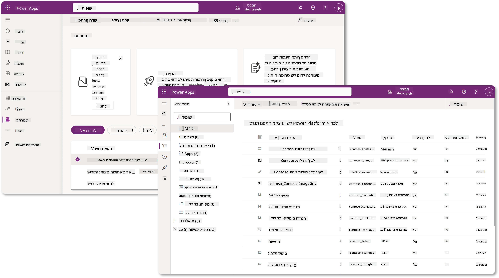

ב-Copilot Studio, יש עכשיו את **Solution Explorer** שבו ניתן לנהל את הפתרונות שלך ישירות. אין צורך לעבור לפורטל יוצרי Power Apps כדי לנהל את הפתרונות שלך, ניתן לעשות זאת ישירות בתוך Copilot Studio 🪄

זה אומר שאתה יכול לבצע את המשימות הרגילות הקשורות לפתרונות:

- **יצירת פתרון** - פתרונות מותאמים אישית מאפשרים לייצא ולייבא סוכנים בין סביבות.
- **הגדרת פתרון מועדף** - בחירת הפתרון שבו ייווצרו סוכנים, אפליקציות וכו' כברירת מחדל.
- **הוספה או הסרה של רכיבים** - הסוכן שלך עשוי להתייחס לרכיבים אחרים כמו משתני סביבה או זרימות ענן. לכן יש לכלול את הרכיבים הללו בפתרון.
- **ייצוא פתרונות** - להעברת פתרונות לסביבה יעד אחרת.
- **ייבוא פתרונות** - ייבוא פתרונות שנוצרו במקום אחר, כולל שדרוג או עדכון פתרונות.
- **יצירה וניהול של צינורות פתרונות** - אוטומציה של פריסת פתרונות בין סביבות.
- **אינטגרציה עם Git** - מאפשרת למפתחים לחבר פתרונות עם מאגרי Git לצורך ניהול גרסאות, שיתוף פעולה ו-ALM. מיועדת לשימוש בסביבות פיתוח בלבד.

   

ישנם שני סוגי פתרונות:

- **פתרונות לא מנוהלים** - משמשים במהלך הפיתוח. ניתן לערוך ולהתאים אותם באופן חופשי לפי הצורך.
- **פתרונות מנוהלים** - משמשים כאשר אתה מוכן לפרוס את האפליקציה שלך לבדיקה או לייצור. הם נעולים כדי למנוע שינויים מקריים.

## 🤔 למה _כדאי_ להשתמש בפתרון עבור הסוכן שלי?

תחשוב על פתרונות כעל _ארגז כלים_. כשאתה צריך לתקן או לבנות משהו (סוכן) במקום אחר (סביבה), אתה אוסף את כל הכלים הנחוצים (רכיבים) ושם אותם בארגז הכלים (פתרון). לאחר מכן, אתה יכול לשאת את ארגז הכלים למקום החדש (סביבה) ולהשתמש בכלים (רכיבים) כדי להשלים את העבודה שלך, או להוסיף כלים חדשים (רכיבים) כדי להתאים את הסוכן או הפרויקט שאתה בונה.

!!! quote "אלייזה, תומכת הענן הידידותית שלך מצטרפת 🙋🏻‍♀️ לשתף כמה מילים:"
    יש לנו אמירה בניו זילנד, "תהיה קיווי מסודר!" שזה קריאה לפעולה לניו זילנדים 🥝 לקחת אחריות על הסביבה שלהם על ידי השלכת פסולת בצורה נכונה ושמירה על מרחבים ציבוריים נקיים. אנחנו יכולים להשתמש באותו הקשר עבור סוכנים על ידי שמירה על כל מה שקשור לסוכן שלך מאורגן ונייד, וזה יעזור לך לשמור על סביבה מסודרת.

זהו נוהג טוב ליצור סוכן בפתרון ייעודי בסביבת המקור (מפתח) שלך. הנה למה פתרונות הם בעלי ערך:

🧩 **פיתוח מאורגן**

- אתה שומר את הסוכן שלך בנפרד מפתרון ברירת המחדל שמכיל הכל בסביבה. כל רכיבי הסוכן שלך נמצאים במקום אחד 🎯

- כל מה שאתה צריך עבור הסוכן שלך נמצא בפתרון, מה שמקל על ייצוא וייבוא לסביבת יעד 👉🏻 זהו הרגל בריא של ALM.

🧩 **פריסה בטוחה**

- אתה יכול לייצא את האפליקציה או הסוכן שלך כפתרון מנוהל ולפרוס אותו לסביבות יעד אחרות (כמו בדיקה או ייצור) מבלי לסכן עריכות מקריות.

🧩 **ניהול גרסאות**

- אתה יכול ליצור תיקונים (תיקונים ממוקדים), עדכונים (שינוי מקיף יותר) או שדרוגים (החלפת פתרון - בדרך כלל שינויים גדולים והוספת תכונות חדשות).

- עוזר לך להוציא שינויים בצורה מבוקרת.

🧩 **ניהול תלות**

- פתרונות עוקבים אחרי אילו חלקים תלויים באחרים. זה מונע ממך לשבור דברים כשאתה מבצע שינויים.

🧩 **שיתוף פעולה בצוות**

- מפתחים ויוצרים יכולים לעבוד יחד באמצעות פתרונות לא מנוהלים בפיתוח, ואז להעביר פתרון מנוהל לפריסה.

## 🪪 הבנת מפרסמי פתרונות

מפרסם פתרון ב-Power Platform הוא כמו תווית או מותג שמזהה מי יצר או מחזיק בפתרון. זהו חלק קטן אך חשוב בניהול האפליקציות, הסוכנים וההתאמות האישיות של זרימות, במיוחד כשעובדים בצוותים או בין סביבות.

כשאתה יוצר פתרון, עליך לבחור מפרסם. מפרסם זה מגדיר:

- קידומת שמתווספת לכל הרכיבים המותאמים אישית (כמו טבלאות, שדות וזרימות).

- שם ומידע ליצירת קשר עבור הארגון או האדם שמחזיק בפתרון.

### 🤔 למה זה חשוב?

1. **זיהוי קל** - הקידומת (לדוגמה - `new_` או `abc_`) עוזרת לזהות במהירות אילו רכיבים שייכים לאיזה פתרון או צוות.

1. **מניעת התנגשויות** - אם שני צוותים יוצרים עמודה בשם סטטוס, הקידומות שלהם (`teamA_status`, `teamB_status`) מונעות התנגשויות בשמות.

1. **תומך ב-ALM** - כשמעבירים פתרונות בין סביבות (פיתוח → בדיקה → ייצור), המפרסם עוזר לעקוב אחרי הבעלות ולשמור על עקביות.

### ✨ דוגמה

נניח שאתה יוצר מפרסם בשם Contoso Solutions עם הקידומת `cts_`.

אם תוסיף עמודה מותאמת אישית בשם _Priority_, היא תישמר כ-`cts_Priority` בפתרון.

כל מי שייתקל בעמודה ברמת הפתרון, לא משנה באיזו סביבה הוא נמצא, יוכל לזהות בקלות שהיא עמודה שקשורה ל-Contoso Solutions.

## 🧭 מחזור החיים של פתרון Power Platform

עכשיו כשאתה מבין את מטרת הפתרון, בוא נלמד על מחזור החיים.

**1. יצירת פתרון בסביבת הפיתוח** - התחל ביצירת פתרון חדש בסביבת הפיתוח שלך.

**2. הוספת רכיבים** - הוסף אפליקציות, זרימות, טבלאות ורכיבים אחרים לפתרון שלך.

**3. ייצוא כפתרון מנוהל** - ארוז את הפתרון שלך לפריסה על ידי ייצואו כפתרון מנוהל.

**4. ייבוא לסביבת בדיקה** - בדוק את הפתרון שלך בסביבת בדיקה נפרדת כדי לוודא שהכל עובד כמצופה.

**5. ייבוא לסביבת ייצור** - פרוס את הפתרון שנבדק לסביבת הייצור החיה שלך.

**6. יישום תיקונים, עדכונים או שדרוגים** - בצע שיפורים או תיקונים באמצעות תיקונים, עדכונים או שדרוגים. 🔁 חזור על המחזור!

### ✨ דוגמה

דמיין שאתה בונה סוכן תמיכה טכנית שיעזור לעובדים עם בעיות כמו בעיות במכשירים, פתרון בעיות רשת, הגדרת מדפסות ועוד.

- אתה מתחיל בסביבת פיתוח באמצעות פתרון לא מנוהל.

- ברגע שהוא מוכן, אתה מייצא אותו כפתרון מנוהל ומייבא אותו לסביבת יעד כמו בדיקות מערכת או בדיקות קבלה של משתמשים (UAT).

- לאחר הבדיקה, אתה מעביר אותו לסביבת הייצור - הכל מבלי לגעת בגרסת הפיתוח המקורית.

## 🧪 מעבדה 04: יצירת פתרון חדש

עכשיו נלמד

- [4.1 איך ליצור מפרסם פתרון](../../../../../docs/recruit/04-creating-a-solution)
- [4.2 איך ליצור פתרון](../../../../../docs/recruit/04-creating-a-solution)

נשאר עם הדוגמה מהקודם, שבה ניצור פתרון בסביבת Copilot Studio הייעודית כדי לבנות את סוכן התמיכה הטכנית שלנו.

בואו נתחיל!

### דרישות מוקדמות

#### תפקיד אבטחה

ב-Copilot Studio, מה שאתה _יכול לעשות_ ב-Solution Explorer תלוי בתפקיד האבטחה של המשתמש שלך.
אם אין לך הרשאה לנהל פתרונות במרכז הניהול של Power Apps, לא תוכל לבצע את המשימות הללו גם ב-Copilot Studio.

כדי לוודא שהכל עובד בצורה חלקה, בדוק שיש לך את תפקידי האבטחה וההרשאות הנכונים. או אם אינך מנהל סביבות בארגון שלך, בקש מצוות מנהלי ה-IT (או המקביל) שמנהל את הדייר/הסביבות שלך.

הבאים הם תפקידי האבטחה שמאפשרים למשתמשים ליצור פתרון בסביבה שלהם.

| תפקיד אבטחה    | תיאור |
| ---------- | ---------- |
| יוצר סביבה | מספק את ההרשאות הנחוצות ליצירה, התאמה אישית וניהול משאבים בתוך סביבה ספציפית, כולל פתרונות  |
| מתאם מערכת  | הרשאות רחבות יותר מיוצר סביבה, כולל היכולת להתאים אישית את הסביבה ולנהל תפקידי אבטחה |
| מנהל מערכת   | רמת ההרשאות הגבוהה ביותר ויכול לנהל את כל ההיבטים של הסביבה, כולל יצירה והקצאת תפקידי אבטחה     |

#### סביבת פיתוח

וודא שאתה עובר לסביבת הפיתוח הייעודית שלך, עיין ב-[שיעור 00 - הגדרת הקורס - שלב 3: יצירת סביבת פיתוח חדשה](../00-course-setup/README.md#step-3-create-new-developer-environment).

1. בפינה הימנית העליונה, בחר את סמל **גלגל השיניים** ועבור מסביבת ברירת המחדל לסביבה שלך, לדוגמה **הסביבה של Adele Vance**.

    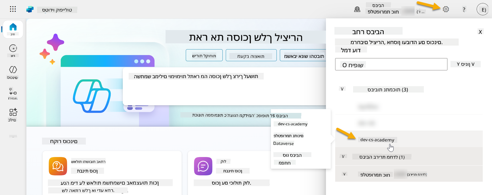

### 4.1 יצירת מפרסם פתרון

1. באמצעות אותה סביבת Copilot Studio שבה השתמשנו בשיעור הקודם, בחר את סמל **שלוש הנקודות (. . .)** בתפריט הצד השמאלי ב-Copilot Studio. בחר **פתרונות** תחת כותרת **חקירה**.

    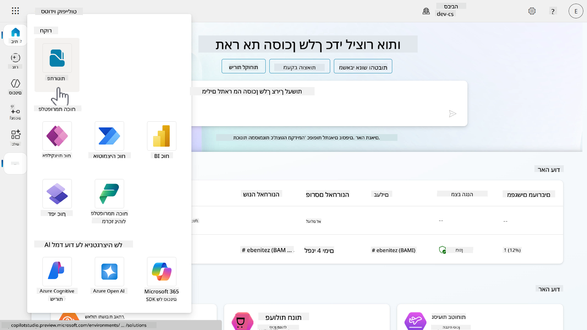

1. **Solution Explorer** ב-Copilot Studio ייטען. בחר **+ פתרון חדש**

    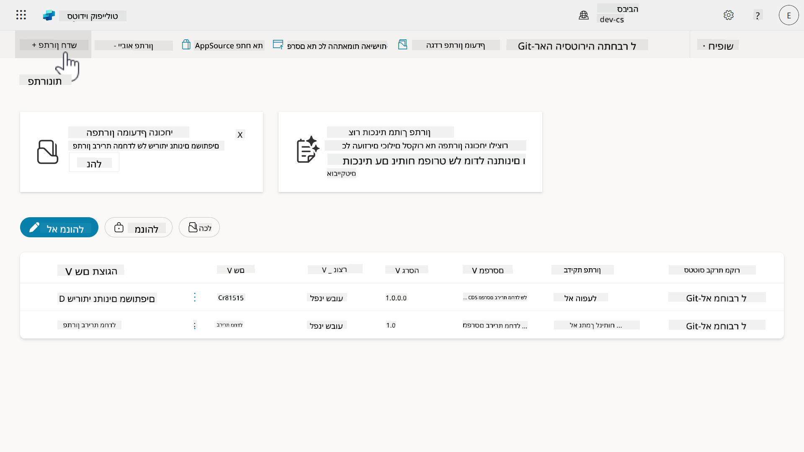

1. חלונית **פתרון חדש** תופיע שבה נוכל להגדיר את פרטי הפתרון שלנו. קודם כל, עלינו ליצור מפרסם חדש. בחר **+ מפרסם חדש**.

    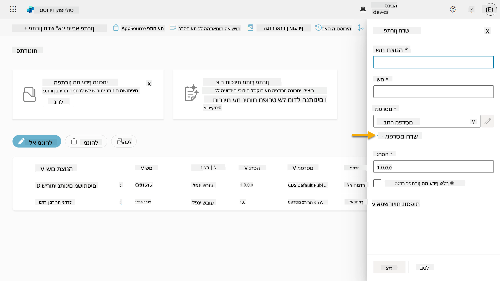  

1. לשונית **מאפיינים** של חלונית **מפרסם חדש** תופיע עם שדות חובה ולא חובה שיש למלא בלשונית **מאפיינים**. כאן נוכל לפרט את פרטי המפרסם שישמשו כתווית או מותג שמזהה מי יצר או מחזיק בפתרון.

    | מאפיין    | תיאור | חובה |
    | ---------- | ---------- | :----------: |
    | שם תצוגה | שם תצוגה עבור המפרסם | כן   |
    | שם  | השם הייחודי ושם הסכימה עבור המפרסם  | כן    |
    | תיאור   | מפרט את מטרת הפתרון    | לא     |
    | קידומת    | קידומת המפרסם שתוחל על רכיבים חדשים שנוצרו   | כן      |
    | קידומת ערך בחירה   | מייצר מספר על בסיס קידומת המפרסם. מספר זה משמש כשמוסיפים אפשרויות לבחירות ומספק אינדיקטור לאיזה פתרון השתמשו להוספת האפשרות.   | כן      |

    העתק והדבק את הבא כ-**שם תצוגה**,

    ```text
    Contoso Solutions
    ```

    העתק והדבק את הבא כ-**שם**,

    ```text
    ContosoSolutions
    ```

    העתק והדבק את הבא כ-**תיאור**,

    ```text
    Copilot Studio Agent Academy
    ```

    העתק והדבק את הבא עבור **קידומת**,

    ```text
    cts
    ```

    כברירת מחדל, קידומת **ערך בחירה** תציג ערך מספרי. עדכן ערך מספרי זה לאלף הקרוב. לדוגמה, בצילום המסך שלי למטה, זה היה בתחילה `77074`. עדכן זאת מ-`77074` ל-`77000`.

    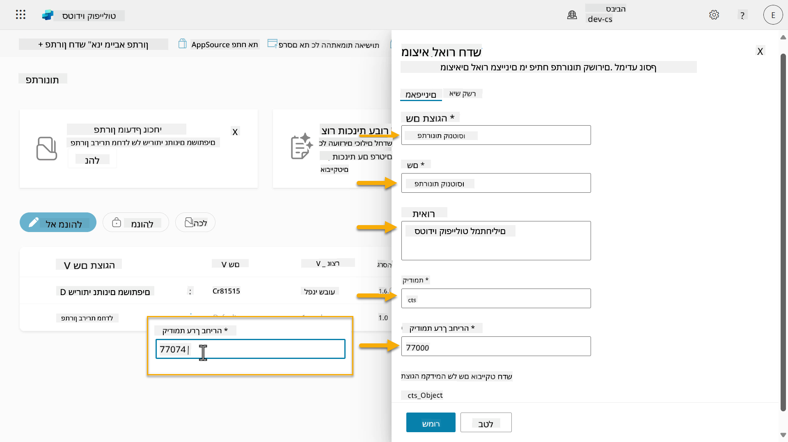  

1. אם ברצונך לספק את פרטי הקשר עבור הפתרון, בחר בלשונית **קשר** ומלא את העמודות המוצגות.

    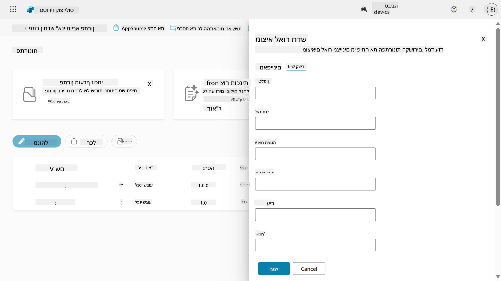

1. בחר בלשונית **מאפיינים** ובחר **שמור** כדי ליצור את המפרסם.

    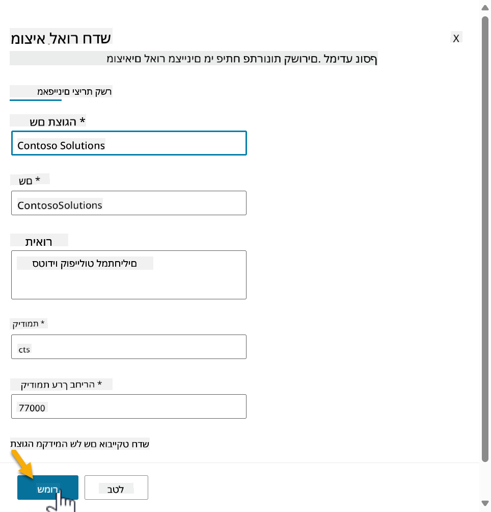
1. חלון **המו"ל החדש** ייסגר ותועברו חזרה לחלון **הפתרון החדש** עם המו"ל החדש שנבחר.

    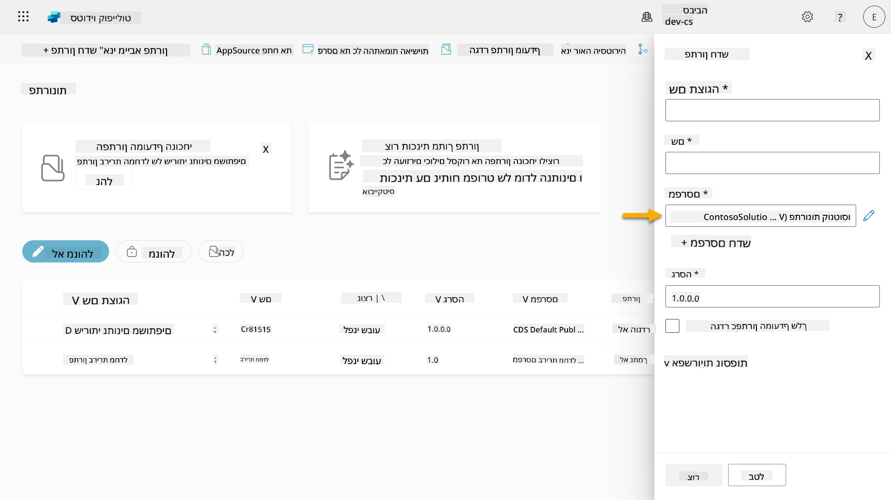  

כל הכבוד, יצרתם מו"ל פתרונות! 🙌🏻 עכשיו נלמד איך ליצור פתרון מותאם אישית חדש.

### 4.2 יצירת פתרון חדש

1. עכשיו כשיצרנו את המו"ל שלנו, נוכל להשלים את שאר הטופס בחלון **הפתרון החדש**.

    העתק והדבק את הטקסט הבא כ-**שם תצוגה**,

    ```text
    Contoso Helpdesk Agent
    ```

    העתק והדבק את הטקסט הבא כ-**שם**,

    ```text
    ContosoHelpdeskAgent
    ```

    מכיוון שאנחנו יוצרים פתרון חדש, [**מספר הגרסה**](https://learn.microsoft.com/power-apps/maker/data-platform/update-solutions#understanding-version-numbers-for-updates/?WT.mc_id=power-172615-ebenitez) כברירת מחדל יהיה `1.0.0.0`.

    סמנו את תיבת הסימון **הגדר כפתרון המועדף שלך**.

    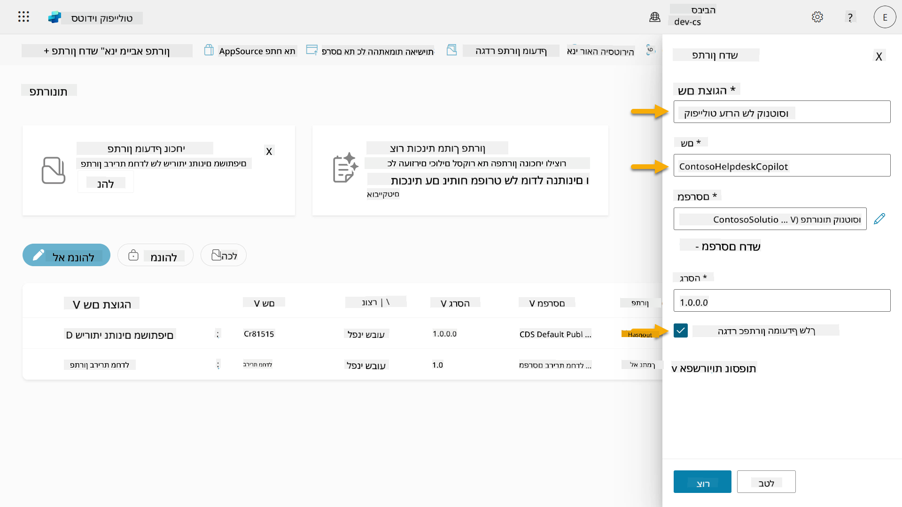  

1. הרחיבו את **אפשרויות נוספות** כדי לראות פרטים נוספים שניתן לספק בפתרון.

    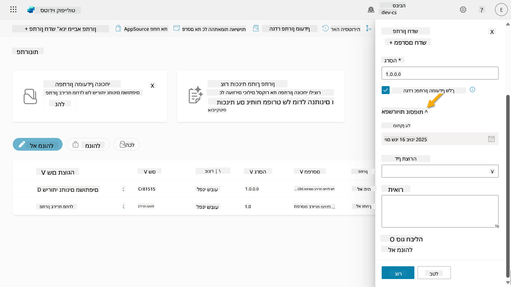

1. תראו את הפרטים הבאים:

    - **הותקן בתאריך** - התאריך שבו הפתרון הותקן.

    - **דף תצורה** - מפתחים מגדירים משאב אינטרנט HTML כדי לעזור למשתמשים לתקשר עם האפליקציה, הסוכן או הכלי שלהם, שם הוא יופיע כדף אינטרנט בסעיף המידע עם הוראות או כפתורים. זה משמש בעיקר חברות או מפתחים שבונים ומשתפים פתרונות עם אחרים.

    - **תיאור** - מתאר את הפתרון או תיאור כללי של דף התצורה.

    נשאיר את השדות האלה ריקים עבור המעבדה הזו.

    בחרו **צור**.

    

1. הפתרון עבור Contoso Helpdesk Agent נוצר כעת. לא יהיו רכיבים עד שניצור סוכן ב-Copilot Studio.

    בחרו באייקון **חץ אחורה** כדי לחזור ל-Solution Explorer.

    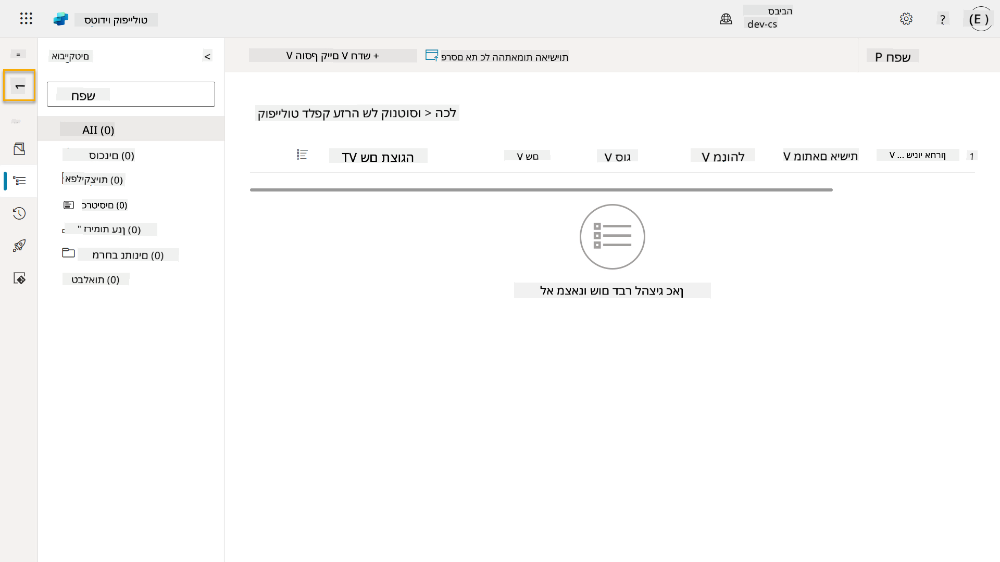

1. שימו לב איך Contoso Helpdesk Agent מוצג כעת כ-**הפתרון המועדף הנוכחי** מכיוון שסימנו את תיבת הסימון **הגדר כפתרון המועדף שלך** קודם.

    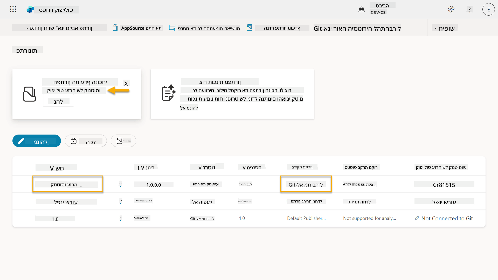

## ✅ משימה הושלמה

ברכות! 👏🏻 יצרתם מו"ל והשתמשתם בו בפתרון החדש שלכם כדי לבנות את הסוכן שלכם!

עבודה מצוינת, יוצרי סוכנים. טביעת רגל דיגיטלית מסודרת היא הצעד הראשון לקראת תפעול בקנה מידה. עכשיו יש לכם את הכלים ואת הגישה לפיתוח סוכנים בר-קיימא ומוכן לארגון.

זהו סוף **מעבדה 04 - יצירת פתרון**, בחרו בקישור למטה כדי לעבור לשיעור הבא. הפתרון שיצרתם במעבדה זו ישמש במעבדה של השיעור הבא.

⏭️ [עברו לשיעור **התחלה מהירה עם סוכנים מוכנים מראש**](../05-using-prebuilt-agents/README.md)

## 📚 משאבים טקטיים

🔗 [יצירת פתרון](https://learn.microsoft.com/power-apps/maker/data-platform/create-solution/?WT.mc_id=power-172615-ebenitez)

🔗 [יצירה וניהול פתרונות ב-Copilot Studio](https://learn.microsoft.com/microsoft-copilot-studio/authoring-solutions-overview/?WT.mc_id=power-172615-ebenitez)

🔗 [שיתוף סוכנים עם משתמשים אחרים](https://learn.microsoft.com/microsoft-copilot-studio/admin-share-bots/?WT.mc_id=power-172615-ebenitez)

🔗 [סיכום משאבים זמינים לתפקידי אבטחה מוגדרים מראש](https://learn.microsoft.com/power-platform/admin/database-security#summary-of-resources-available-to-predefined-security-roles/?WT.mc_id=power-172615-ebenitez)

🔗 [שדרוג או עדכון פתרון](https://learn.microsoft.com/power-apps/maker/data-platform/update-solutions/?WT.mc_id=power-172615-ebenitez)

🔗 [סקירה כללית של צינורות ב-Power Platform](https://learn.microsoft.com/power-platform/alm/pipelines/?WT.mc_id=power-172615-ebenitez)

🔗 [סקירה כללית של אינטגרציה עם Git ב-Power Platform](https://learn.microsoft.com/power-platform/alm/git-integration/overview/?WT.mc_id=power-172615-ebenitez)


---

**הצהרת אחריות**:  
מסמך זה תורגם באמצעות שירות תרגום AI [Co-op Translator](https://github.com/Azure/co-op-translator). למרות שאנו שואפים לדיוק, יש לקחת בחשבון שתרגומים אוטומטיים עשויים להכיל שגיאות או אי דיוקים. המסמך המקורי בשפתו המקורית צריך להיחשב כמקור סמכותי. עבור מידע קריטי, מומלץ להשתמש בתרגום מקצועי אנושי. אנו לא נושאים באחריות לאי הבנות או פירושים שגויים הנובעים משימוש בתרגום זה.