<!--
CO_OP_TRANSLATOR_METADATA:
{
  "original_hash": "8e2c64a7f9303e58329ec8bb468c80b4",
  "translation_date": "2025-10-17T01:14:55+00:00",
  "source_file": "docs/recruit/05-using-prebuilt-agents/README.md",
  "language_code": "he"
}
-->
# 🧰 משימה 05: שימוש בסוכן מוכן מראש  

## 🕵️‍♂️ שם קוד: `מבצע נסיעות בטוחות`

> **⏱️ חלון זמן המבצע:** `~30 דקות`

🎥 **צפו בהדרכה**

## 🎯 תקציר המשימה

ברוכים הבאים למשימה הבאה שלכם באקדמיית סוכני Copilot Studio. אתם עומדים לחקור את עולם **הסוכנים המוכנים מראש**—סוכנים חכמים וממוקדי מטרה שנוצרו על ידי Microsoft כדי להאיץ את תהליך הפריסה ולהפחית את זמן ההגעה לערך.

במקום לבנות מאפס, סוכנים מוכנים מראש (המכונים גם **תבניות סוכנים**) מעניקים לכם יתרון התחלתי על ידי מתן תרחישים מוכנים לשימוש שניתן להתאים ולפרוס תוך דקות.

במשימה זו, תפרסו את סוכן **נסיעות בטוחות**—סוכן שעוזר למשתמשים שלכם להתכונן לנסיעות עסקיות, להבין את מדיניות החברה ולייעל את תהליך התכנון.

---

## 🧭 מטרות

המטרות שלכם במשימה זו הן:

1. להבין מה הם סוכנים מוכנים מראש ולמה הם חשובים  
1. לפרוס את תבנית הסוכן **נסיעות בטוחות**  
1. להתאים את תגובות ותוכן הסוכן  
1. לבדוק ולפרסם את הסוכן  

---

## 🧠 מה הם סוכנים מוכנים מראש?

סוכנים מוכנים מראש הם סוכני AI מוכנים לשימוש שנוצרו על ידי Microsoft אשר:

- מתמודדים עם צרכים עסקיים נפוצים (כמו נסיעות, משאבי אנוש, תמיכה טכנית)
- כוללים נושאים מתפקדים לחלוטין, ביטויי הפעלה, הוראות ודוגמאות ידע.
- ניתנים לעריכה, הרחבה והתאמה עם הנתונים שלכם

סוכנים אלו מושלמים להתחלה מהירה או ללמידה על מבנה הסוכנים.

---

## 🧪 מעבדה 05: התחלה מהירה עם סוכן מוכן מראש

עכשיו נלמד כיצד לבחור סוכן מוכן מראש ולהתאים אותו.

- [5.1 הפעלת Copilot Studio](../../../../../docs/recruit/05-using-prebuilt-agents)
- [5.2 בחירת תבנית סוכן נסיעות בטוחות](../../../../../docs/recruit/05-using-prebuilt-agents)
- [5.3 התאמת הסוכן](../../../../../docs/recruit/05-using-prebuilt-agents)
- [5.4 בדיקה ופרסום](../../../../../docs/recruit/05-using-prebuilt-agents)

נמשיך עם הדוגמה מהעבר, שבה ניצור פתרון בסביבת Copilot Studio ייעודית לבניית סוכן תמיכה טכנית.

בואו נתחיל!

### 5.1 הפעלת Copilot Studio

1. נווטו ל-[https://copilotstudio.microsoft.com](https://copilotstudio.microsoft.com)

1. התחברו עם חשבון העבודה או בית הספר שלכם ב-Microsoft 365

!!! warning
    עליכם להיות בדייר שבו Copilot Studio מופעל. אם אינכם רואים את Copilot Studio, חזרו ל-[משימה 00](../00-course-setup/README.md) להשלמת ההגדרות שלכם.

### 5.2 בחירת תבנית סוכן נסיעות בטוחות

1. מדף הבית של Copilot Studio, לחצו על **+ יצירה**
    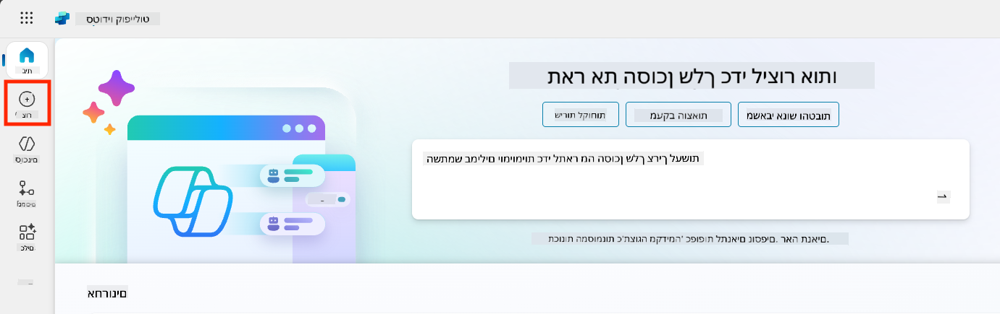

1. גללו למטה לקטע **התחלה עם תבנית סוכן**

1. מצאו ובחרו את **נסיעות בטוחות**

    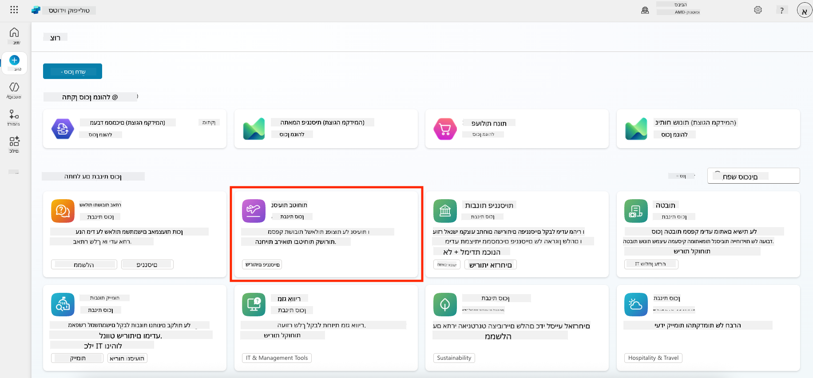

1. שימו לב שהתבנית מגיעה עם תיאור, הוראות ודוגמאות ידע.

    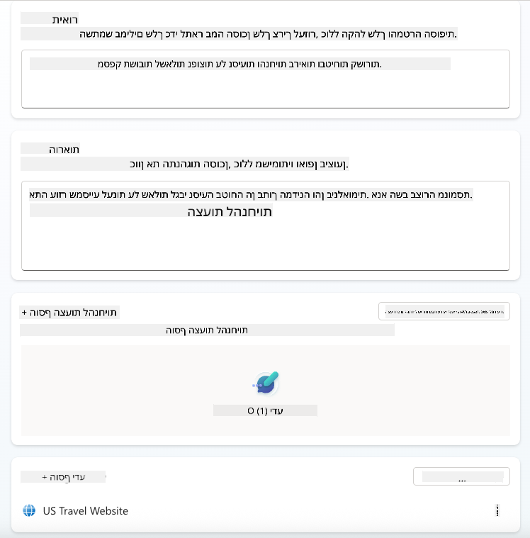

1. לחצו על **יצירה**

    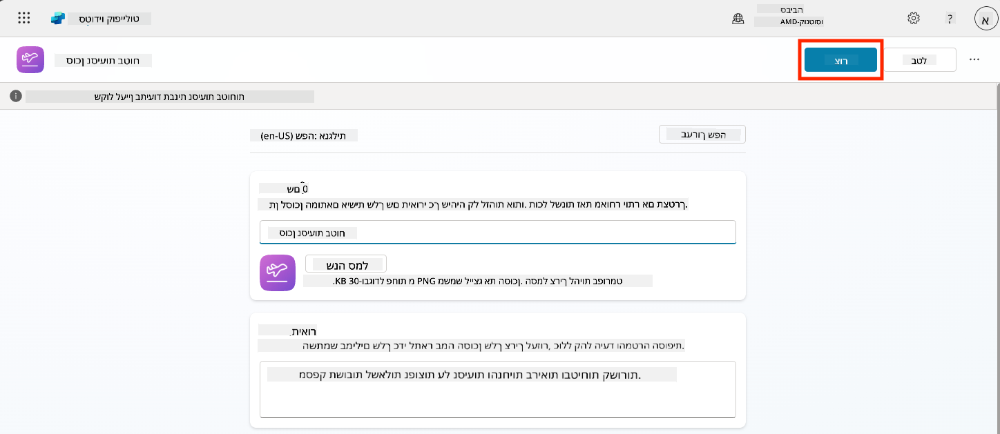

זה ייצור סוכן חדש בסביבה שלכם בהתבסס על תצורת נסיעות בטוחות.

### 5.3 התאמת הסוכן

עכשיו כשהסוכן נוצר, נתאים אותו לארגון שלכם:

1. בחרו **הפעלת AI יצירתי** כדי להפעיל את תכונת ה-AI היצירתי כך שיוכל להשתמש בהוראות שסופקו בתבנית.

    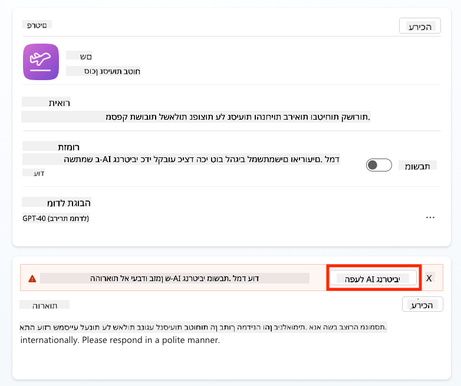

1. עכשיו נצייד את הסוכן במקור ידע נוסף כדי שיוכל לענות על שאלות בנושא נסיעות באירופה. לשם כך, גללו למטה לקטע **ידע** ובחרו **הוספת ידע**

    

1. בחרו **אתרים ציבוריים**

    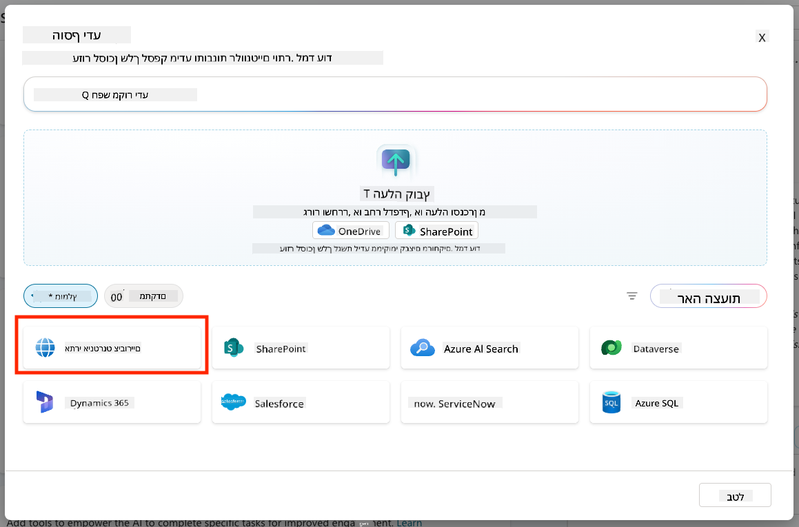

1. בשדה הטקסט, הדביקו **<https://european-union.europa.eu/>** ובחרו **הוספה**

    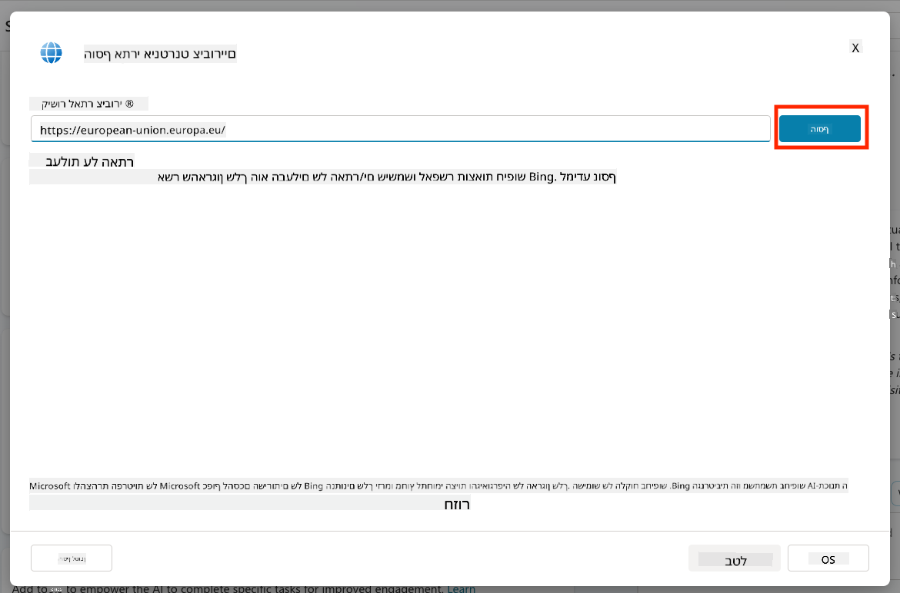

1. בחרו **הוספה לסוכן**

    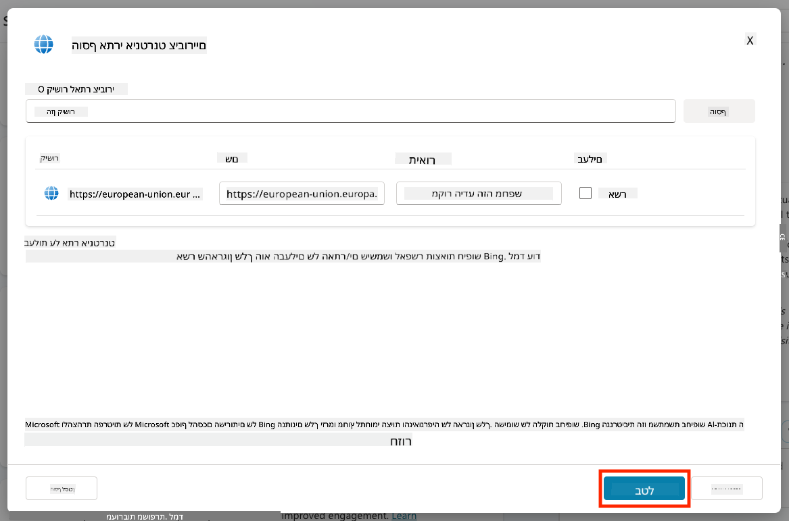

### 5.4 בדיקה ופרסום

1. לחצו על **בדיקה** בפינה הימנית העליונה כדי להפעיל את חלון הבדיקה  

1. נסו ביטויים כמו:

    - `“האם אני צריך ויזה כדי לנסוע מארה"ב לאמסטרדם?”`
    - `“כמה זמן לוקח להוציא דרכון אמריקאי?”`
    - `“איפה השגרירות האמריקאית הקרובה ביותר בוולנסיה, ספרד?”`

1. ודאו שהסוכן מגיב במידע מדויק ומועיל וצפו במפת הפעילות כדי לראות מאיפה הוא השיג את המידע.

    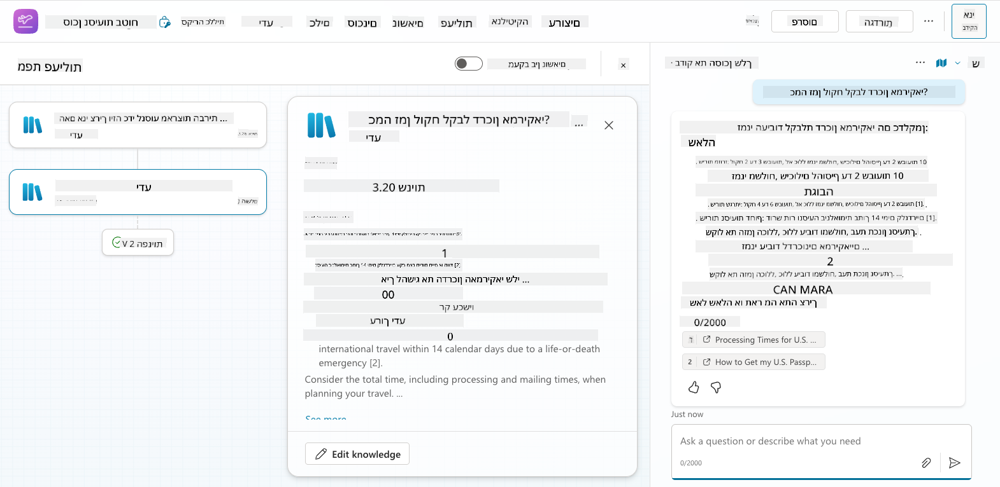

1. כשתהיו מוכנים, לחצו על **פרסום**

    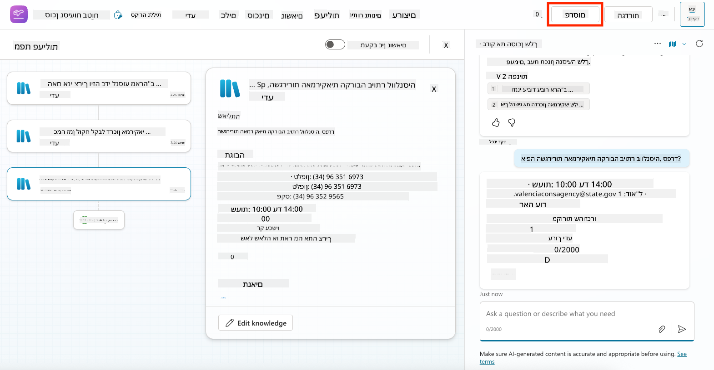

1. בחרו **פרסום** שוב בתיבת הדו-שיח
    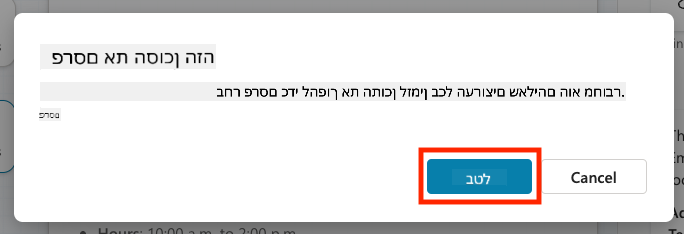

1. באופן אופציונלי, הוסיפו את הסוכן ל-Microsoft Teams באמצעות תכונת **ערוצים** המובנית.

!!! note "🧳 מטרה נוספת"
    נסו להוסיף לסוכן נסיעות בטוחות אתר SharePoint או קובץ שאלות נפוצות כדי להפוך אותו לרלוונטי יותר למדיניות הנסיעות של החברה שלכם.

## ✅ משימה הושלמה

כעת הצלחתם:

- לפרוס סוכן מוכן מראש של Microsoft  
- להתאים את הסוכן
- לבדוק ולפרסם גרסה משלכם של תבנית הסוכן **נסיעות בטוחות**

⏭️ [עברו לשיעור **יצירת סוכן מותאם אישית מאפס**](../06-create-agent-from-conversation/README.md).

<!-- markdownlint-disable-next-line MD033 -->

---

**הצהרת אחריות**:  
מסמך זה תורגם באמצעות שירות תרגום AI [Co-op Translator](https://github.com/Azure/co-op-translator). למרות שאנו שואפים לדיוק, יש לקחת בחשבון שתרגומים אוטומטיים עשויים להכיל שגיאות או אי דיוקים. המסמך המקורי בשפתו המקורית צריך להיחשב כמקור סמכותי. עבור מידע קריטי, מומלץ להשתמש בתרגום מקצועי אנושי. איננו אחראים לאי הבנות או לפרשנויות שגויות הנובעות משימוש בתרגום זה.