<!--
CO_OP_TRANSLATOR_METADATA:
{
  "original_hash": "180f9cc0b40527f61be092c9b0f72aba",
  "translation_date": "2025-10-17T01:35:51+00:00",
  "source_file": "docs/recruit/06-create-agent-from-conversation/README.md",
  "language_code": "he"
}
-->
# 🚨 משימה 06: יצירת סוכן מותאם אישית באמצעות שפה טבעית עם Copilot והטמעתו עם הנתונים שלך

## 🕵️‍♂️ שם קוד: `מבצע יצירת סוכן`

> **⏱️ חלון זמן למשימה:** `~75 דקות`

🎥 **צפו בהדרכה**

[](https://www.youtube.com/watch?v=qZTtQVncGFg "צפו בהדרכה ביוטיוב")

## 🎯 תקציר המשימה

ברוך שובך, יוצר סוכנים. המשימה הזו מציבה אותך בעמדת הפיקוד של היכולת החזקה ביותר ב-Copilot Studio - יצירת סוכן מותאם אישית מאפס באמצעות שפה טבעית... והעצמתו עם הנתונים שלך.

זה לא סתם עוד צ'אטבוט. אתה בונה עמית דיגיטלי מועשר בידע - כזה שיכול לחשוב, להגיב ולהתייחס למידע אמיתי של הארגון.

הנשק שלך? שפה טבעית. המשימה שלך? לעצב, לאמן ולבדוק סוכן עזרה מותאם אישית שיכול לענות על שאלות IT באמצעות SharePoint, קבצים שהועלו או כתובות URL של החברה.

בואו נבנה את הסוכן שלכם מהיסוד.

## 🔎 מטרות

במשימה זו תלמדו:

1. להבין מה הם סוכנים מותאמים אישית וכיצד הם שונים מתבניות מוכנות מראש.
1. יצירת סוכנים באמצעות הנחיות שפה טבעית ועיצוב שיחה עם Copilot.
1. הטמעת סוכנים עם מקורות ידע ארגוניים כולל SharePoint, מסמכים ואתרי אינטרנט.
1. ללמוד על תזמור גנרטיבי וכיצד סוכנים מחפשים ומגיבים באופן דינמי באמצעות מקורות נתונים מרובים.
1. בנייה ובדיקה של סוכן עזרה IT פונקציונלי לחלוטין שיכול לענות על שאלות מהנתונים שלכם.

## 🤔 מהו סוכן _מותאם אישית_?

סוכן מותאם אישית הוא צ'אטבוט או עוזר וירטואלי שאתם יוצרים ומעצבים ב-Copilot Studio כדי לעזור למשתמשים במשימות או שאלות ספציפיות. הוא נקרא מותאם אישית כי:

- **אתם מחליטים על המטרה** - לעזור למשתמשים לבקש חופשה, לבדוק מצב הזמנה, לספק עזרה בשאלות IT.
- **אתם מגדירים את השיחה** - מה הסוכן אומר ואיך הוא צריך להגיב.
- **אתם מטמיעים אותו עם הנתונים שלכם** - חיבור לנתונים ארגוניים דרך מקורות ידע מובנים.
- **אתם מחברים אותו למערכות או יישומים שלכם** - בוחרים מחברים, זרימות, APIs ושרתים.

!!! note
    תחשבו על זה כך: אתם בונים עוזר דיגיטלי משלכם שיכול לדבר עם משתמשים ולבצע משימות עבורם כמו לענות על שאלות, לאסוף מידע הנדרש לתהליך או להתחבר לנתונים הארגוניים שלכם.

### 🤖 מה סוכן מותאם אישית יכול לעשות?

סוכן מותאם אישית יכול לבצע את הפעולות הבאות:

- לשאול משתמשים מידע כמו שמות, תאריכים או העדפות.
- לשמור את המידע הזה בבסיס נתונים או טבלה.
- לחפש נתונים על סמך שאלות שנשאלו ולענות עליהן.
- לעבוד באופן עצמאי ללא אינטראקציה ישירה עם המשתמשים.
- להפעיל פעולות לפי דרישה דרך אינטראקציה ישירה עם המשתמש או באופן עצמאי כמו שליחת מיילים או יצירת רשומות.

### 👩🏻‍💻 למה להשתמש בסוכן מותאם אישית?

- חוסך זמן על ידי אוטומציה של משימות חוזרות.
- מספק למשתמשים חוויה ידידותית ומכוונת.
- ניתן להתאמה לצרכים העסקיים או הפרויקטיים שלכם.

### ✨ דוגמה

אתם יוצרים סוכן מותאם אישית שעוזר לעובדים לבקש חופשה.

הוא שואל את שמם, תאריכי החופשה ושם המנהל שלהם, ואז שומר את המידע במערכת המיועדת לניהול בקשות חופשה, כמו רשימת SharePoint.

עכשיו, במקום לנווט לרשימת SharePoint וליצור פריט חדש, העובדים פשוט משוחחים עם הסוכן.

## 🗣️ השתמשו בשפה טבעית ליצירת סוכנים

בעבר למדתם כיצד לבנות סוכנים במהירות ב-Copilot Studio באמצעות תבניות סוכנים מוכנות מראש ב-[שיעור 05 - התחלה מהירה עם סוכנים מוכנים מראש](../05-using-prebuilt-agents/README.md). בשיעור זה, נעמיק בחוויית יצירת השיחה עם Copilot. Copilot Studio הופך את יצירת הסוכנים לקלה על ידי שיחה עם Copilot, ממש כמו שיחה רגילה.

ב-Copilot Studio, אין צורך לכתוב קוד כדי ליצור סוכן. במקום זאת, אתם מתארים מה אתם רוצים שהסוכן שלכם יעשה בשפה פשוטה, ו-Copilot עוזר לכם לבנות אותו שלב אחר שלב דרך חוויית שיחה.

## 🌱 אבל אני חדש ב"לתאר מה אני רוצה" - מה לעשות?

לתאר בשפה טבעית כדי ליצור סוכן מותאם אישית עשוי להיות מושג חדש עבורכם. בכל פעם שאתם משתמשים ב-Copilot במוצרי ושירותי Microsoft, אתם משתמשים בשפה טבעית בצורת _הנחיה_.

הנחיה היא ההודעה או ההוראה שאתם נותנים לסוכן AI כדי לומר לו מה אתם רוצים שהוא יעשה. תחשבו על זה כמו לתת הוראות לעוזר. ככל שההוראות שלכם ברורות יותר, כך קל יותר לעוזר שלכם להבין ולפעול בהתאם.

### 🪄 למה הנחיות חשובות

- הן מכוונות את התנהגות הסוכן.
- הן עוזרות לסוכן להבין איזה סוג שיחה לנהל.
- הנחיה טובה הופכת את הסוכן ליותר מועיל ומדויק.

### 📝 טיפים לכתיבת הנחיה טובה

- היו ברורים ומדויקים - אמרו בדיוק מה אתם רוצים שהסוכן יעשה.
- חשבו כמו המשתמש - מה המשתמש יגיד? מה הסוכן צריך לענות?
- כללו דוגמאות - אם אפשר, תנו דוגמת אינטראקציה.

### ✨ דוגמה

נניח שצוות משאבי אנוש צריך סוכן שיעזור בבקשות חופשה.

ההנחיה יכולה להיות:

    “אני רוצה לבנות סוכן שעוזר למשתמשים להגיש בקשת חופשה. כאשר משתמש אומר שהוא רוצה לבקש חופשה, הסוכן צריך לשאול את שמו, תאריך תחילת החופשה, תאריך סיום החופשה ושם המנהל שלו. לאחר שהמשתמש מספק את המידע הזה, הסוכן צריך לשמור אותו ברשימת SharePoint שנקראת ‘בקשות חופשה’ ולפרסם הודעה בערוץ Microsoft Teams ייעודי.”

למה ההנחיה הזו עובדת:

- **מציינת בבירור את המטרה** - להגיש בקשת חופשה.
- **מתארת את האינטראקציה עם המשתמש** - מה המשתמש אומר ומה הסוכן צריך לשאול.
- **מפרטת את הנתונים הנדרשים** - שם, תאריך התחלה, תאריך סיום, מנהל.
- **מציינת לאן הנתונים הולכים** - רשימת SharePoint שנקראת בקשות חופשה.

## 🔮 אוקיי, יצרתי את הסוכן שלי... איך אני מטמיע אותו עם ידע?

ב-Copilot Studio, מקורות ידע הם מקומות שבהם הסוכן שלכם יכול למצוא מידע כדי לתת תשובות טובות יותר. כאשר אתם מוסיפים את המקורות הללו, הסוכן שלכם יכול לשלב נתונים ארגוניים ממקומות כמו Power Platform, Dynamics 365, אתרי אינטרנט ומערכות או שירותים אחרים שהחברה שלכם משתמשת בהם.

המקורות הללו עובדים יחד עם AI כדי לעזור לסוכן שלכם להגיב בצורה מדויקת יותר לשאלות משתמשים, זה מושג באמצעות מה שמכונה **תזמור גנרטיבי**.

### 🌿 מהו תזמור גנרטיבי בהקשר של סוכנים?

תזמור גנרטיבי אומר שהסוכן משתמש ב-AI כדי להחליט באופן דינמי כיצד לענות על שאלה על ידי שילוב הכישורים הלשוניים המובנים שלו עם מידע ממקורות הידע שהוספתם.

כאשר משתמש שואל שאלה, הסוכן:

- מבין את השאלה באמצעות AI.
- יכול לשאול את המשתמשים על מידע חסר על ידי יצירת שאלות בזמן אמת.
- בוחר את מקורות הידע הרלוונטיים ביותר.
- מחפש את המקורות הללו לתשובות.
- יוצר תגובה טבעית ומועילה באמצעות המידע שמצא.

### 🏦 למה מקורות ידע חשובים?

1. **תשובות חכמות יותר** - כאשר אתם מוסיפים מקורות ידע, הסוכן שלכם יכול לתת תשובות טובות ומדויקות יותר באמצעות נתונים אמיתיים מהארגון שלכם.

1. **פחות עבודה ידנית** - אתם לא צריכים לכתוב כל תשובה אפשרית. הסוכן יכול לחפש במקורות שהוספתם ולהגיב אוטומטית.

1. **שימוש במידע אמין** - הסוכן שלכם יכול למשוך תשובות ממערכות שאתם כבר משתמשים בהן כמו Dataverse, SharePoint או אתרי החברה כך שלמשתמשים יהיה מידע אמין ממקור אמת.

1. **עובד עם AI גנרטיבי** - מקורות ידע ו-AI עוזרים לסוכן שלכם להבין שאלות ולהגיב בצורה טבעית, גם אם השאלה לא תוכנתה מראש או נוספה כהנחיה התחלתית.

1. **גמיש וניתן להרחבה** - אתם יכולים להוסיף מקורות ידע בכל עת במהלך ההגדרה או בשלב מאוחר יותר, הסוכן שלכם נעשה חכם יותר ככל שהצרכים שלכם משתנים.

### ✨ דוגמה

תארו לעצמכם שאתם בונים סוכן שיעזור לעובדים עם שאלות משאבי אנוש. אתם מוסיפים את מסמך מדיניות משאבי האנוש של החברה ואת אתר SharePoint כמקורות ידע.

כאשר עובד שואל, _“כמה ימי חופשה אני זכאי להם?”_, הסוכן משתמש בתזמור גנרטיבי כדי לחפש את המקורות הללו ולהשיב עם המדיניות הנכונה מבלי שתצטרכו לכתוב את התשובה הזו ידנית. זה חוסך לכם זמן בהתמודדות עם כל שאלה אפשרית שעובד עשוי לשאול לגבי זכויותיו.

## סוגי מקורות ידע שניתן להוסיף

1. **אתרי אינטרנט ציבוריים**
    - **מה זה עושה:** מחפש אתרים ספציפיים (כמו אתר החברה שלכם) באמצעות Bing.
    - **למה זה שימושי:** מצוין למשיכת מידע ציבורי כמו שאלות נפוצות או פרטי מוצרים.

1. **מסמכים**
    - **מה זה עושה:** משתמש במסמכים שאתם מעלים ישירות לסוכן שלכם, כמו קבצי PDF או Word. הקבצים שהועלו נשמרים בצורה מאובטחת ב-Dataverse.
    - **למה זה שימושי:** מאפשר לסוכן שלכם לענות על שאלות בהתבסס על מדריכים פנימיים, חוברות או מדיניות.

1. **SharePoint**
    - **מה זה עושה:** מתחבר לתיקיות או קבצים ב-SharePoint באמצעות Microsoft Graph Search.
    - **למה זה שימושי:** אידיאלי לגישה למסמכי צוות, מדיניות HR או קבצי פרויקטים המאוחסנים ב-SharePoint.

1. **Dataverse**
    - **מה זה עושה:** משתמש בנתונים מובנים מסביבת Dataverse שלכם, טבלאות ושורות, ויכול ליישם מילים נרדפות והגדרות מילון לטבלאות ועמודות לשיפור תגובות הסוכן.
    - **למה זה שימושי:** כאשר אתם צריכים לחפש נתונים ארגוניים המאוחסנים ב-Dataverse כמו מידע על לקוחות.

1. **ידע בזמן אמת עם מחברים**
    - **מה זה עושה:** מאפשר לסוכן שלכם לגשת לנתונים חיים ממערכות ארגוניות אחרות כמו Salesforce, ServiceNow, Dynamics 365, AzureSQL, Databricks ועוד במהלך שיחה, באמצעות הרשאות המשתמש עצמו.
    - **למה זה שימושי:** מספק תגובות עדכניות, מאובטחות ומדויקות מבלי לאחסן או לשכפל נתונים, מה שהופך את הסוכן לחכם ובטוח יותר.

1. **Azure AI Search**
    - **מה זה עושה:** מאפשר לסוכן שלכם לחפש במערכים גדולים של מסמכים המאוחסנים ב-Azure באמצעות חיפוש סמנטי ווקטורי כדי להבין שאלות משתמשים.
    - **למה זה שימושי:** מספק תשובות מדויקות ואמינות ממקורות נתונים מורכבים, תומך בציטוטים ומתרחב היטב עבור אוספי מסמכים גדולים עם בקרות גישה מאובטחות.

## 🔒 הערה על אבטחה

### אימות מקורות ידע

חלק מהמקורות כמו SharePoint ו-Dataverse דורשים אימות משתמש. זה אומר שהסוכן יתייחס רק לנתונים בתשובתו שהמשתמש מורשה לראות. בעוד שמקורות אחרים עשויים לדרוש תצורה נוספת כדי שהסוכן יתחבר אליהם, כמו Azure AI Search שדורש חשבון Azure והגדרת סוג אימות.

## שיפור תגובות הסוכן שלכם ב-Copilot Studio

לאחר שהסוכן שלכם נוצר מחוויית יצירת השיחה, תרצו לבדוק את הסוכן מול ההוראות ש-Copilot יצר מההנחיה שלכם. שיפור תגובות הסוכן ב-Copilot Studio מתמקד בהבטחת הבנה ברורה של המטרות שלכם ובכך שיש לו את המידע הנכון לעבוד איתו.

1. **שפרו את הוראות הסוכן** - כאן אתם אומרים לסוכן איך הוא צריך להתנהג. השתמשו בשפה ברורה ומדויקת.

    לדוגמה:

    ✅ “התנהג כמו סוכן תמיכה ידידותי שמסביר דברים בפשטות.”

    ❌ “תהיה מועיל.” (מעורפל מדי)

1. **בדקו את הטון והשפה** - ודאו שהטון של הסוכן מתאים לקהל שלכם.

    אתם יכולים להגדיר אותו להיות:

    - ידידותי וקליל.
    - מקצועי ותמציתי.
    - תומך וסבלני.

1. **הוסיפו או עדכנו מקורות ידע** - אם הסוכן שלכם צריך לענות על שאלות בנושא מסוים, ודאו שיש לו גישה למידע הנכון.

    - הוסיפו קישורים לאתרים, מסמכים או שאלות נפוצות.
    - שמרו על התוכן מעודכן.
    - השתמשו במידע ברור ומובנה היטב.

1. **השתמשו בנושאים ומפעילים** - אם הסוכן שלכם צריך לטפל במשימות או שיחות ספציפיות, אתם יכולים ליצור נושאים עם ביטויי הפעלה. זה עוזר להכווין את השיחה בצורה מדויקת יותר. נלמד על כך יותר בשיעור הבא.

1. **בדקו עם שאלות אמיתיות** - נסו לשאול את הסוכן את סוגי השאלות שהמשתמשים עשויים לשאול.

    אם התשובות לא טובות:

    - התאימו את הוראות המערכת.
    - הוסיפו עוד דוגמאות או ידע.
    - נסחו מחדש את השאלות שלכם כדי לראות איך הוא מגיב.

1. **סקירה ושיפור מתמיד** - שיפור סוכן הוא תהליך מתמשך!

    לאחר הפרסום:

    - אספו משוב ממשתמשים.
    - עקבו אחר שאלות נפוצות או בלבול.
    - המשיכו לשפר את הגדרות הסוכן.

## 🧪 מעבדה 06: יצירת סוכן מותאם אישית ב-Copilot Studio

עכשיו נלמד כיצד ליצור סוכן מותאם אישית שיכול לשוחח על הנתונים שלכם

- [6.1 השתמשו בשפה טבעית ליצירת סוכן עם Copilot](../../../../../docs/recruit/06-create-agent-from-conversation)
- [6.2 הוסיפו מקור ידע פנימי באמצעות אתר SharePoint](../../../../../docs/recruit/06-create-agent-from-conversation)
- [6.3 הוסיפו מקור ידע פנימי על ידי העלאת מסמך](../../../../../docs/recruit/06-create-agent-from-conversation)
- [6.4 בדקו את הסוכן](../../../../../docs/recruit/06-create-agent-from-conversation)

### ✨ מקרה שימוש
נשתמש באותו תרחיש שימוש מ-[שיעור 03 - יצירת סוכן דקלרטיבי עבור Microsoft 365 Copilot](../03-create-a-declarative-agent-for-M365Copilot/README.md#use-case-scenario)

**כעובד**

**אני רוצה** לקבל עזרה מהירה ומדויקת מסוכן התמיכה הטכנית עבור בעיות כמו תקלות במכשירים, פתרון בעיות רשת, הגדרת מדפסות

**כדי שאוכל** להישאר פרודוקטיבי ולפתור בעיות טכניות ללא עיכובים

בואו נתחיל!

### ✨ דרישות מקדימות

- **אתר SharePoint**

נשתמש באתר SharePoint **Contoso IT** מ-[שיעור 00 - הגדרת הקורס - שלב 3: יצירת אתר SharePoint חדש](../00-course-setup/README.md#step-4-create-new-sharepoint-site).

אם לא הגדרת את אתר SharePoint **Contoso IT**, חזור ל-[שיעור 00 - הגדרת הקורס - שלב 3: יצירת אתר SharePoint חדש](../00-course-setup/README.md#step-4-create-new-sharepoint-site).

- **פתרון**

נשתמש בפתרון **Contoso Helpdesk Agent** מ-[שיעור 04 - יצירת פתרון עבור הסוכן שלך](../04-creating-a-solution/README.md#41-create-a-solution-publisher).

אם לא הגדרת את פתרון **Contoso Agent**, חזור ל-[שיעור 04 - יצירת פתרון עבור הסוכן שלך](../04-creating-a-solution/README.md#41-create-a-solution-publisher).

### 6.1 שימוש בשפה טבעית ליצירת סוכן עם Copilot

!!! warning "שאלות Copilot עשויות להשתנות בין מפגשים"

    חוויית יצירת השיחה עם Copilot יכולה להשתנות בכל פעם, כאשר השאלות המוצעות להכוונה עשויות להיות מעט שונות מהפעם הקודמת.

1. נווט לדף הבית של Copilot Studio ובשדה, הזן את ההנחיה הבאה שמתארת את סוכן התמיכה הטכנית. ההנחיה כוללת את מטרת הסוכן, ההקשר, המשימות הצפויות ותבנית התגובה של הסוכן.

    ```text
    You are an IT help desk agent. Your goal is to assist users with their IT issues. You can access information from our company's knowledge base at https://support.microsoft.com/en-us. Your responses should be polite and helpful. If a user reports a slow computer, ask about the age of the device, current software versions, and if they've recently installed any new programs. If a user is experiencing trouble logging into their email, guide them through password reset procedures. You should be concise and informative, using step-by-step instructions with bullet points when appropriate.
    ```

      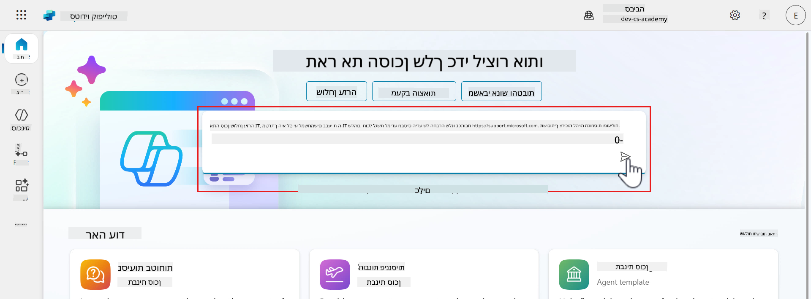

1. חוויית יצירת השיחה עם Copilot תיטען. תראה ש-Copilot בתהליך של תגובה אליך.

      

1. Copilot מאשר שהסוכן הוגדר עם ההוראות שסופקו, ושואל לאישור שם הסוכן. נבקש מ-Copilot לקרוא לסוכן שלנו בשם:

       ```text
       Contoso Helpdesk Agent
       ```

      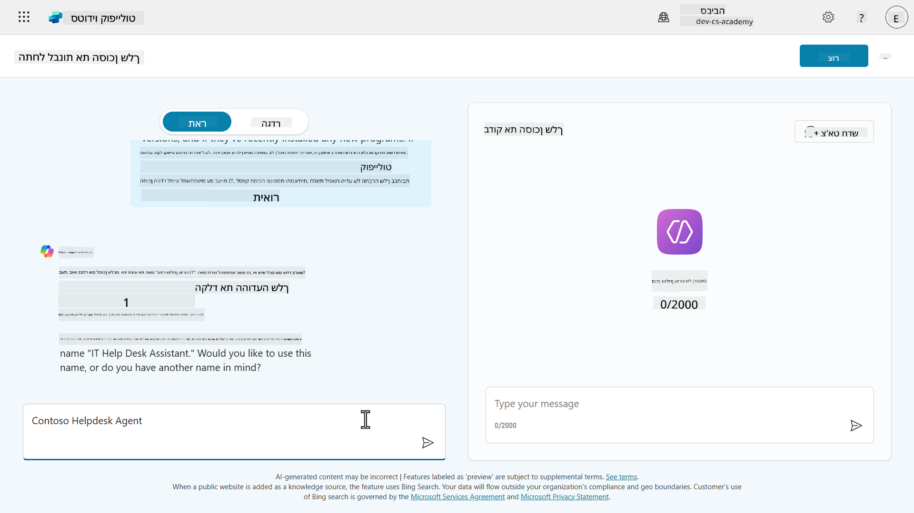

1. Copilot מבצע את הבקשה ונראה ששמו של הסוכן עודכן בלוח הסוכן. לאחר מכן, Copilot מבקש מאיתנו לחדד את ההוראות. הוא שואל כיצד עלינו להגיב לבעיות מסוימות ונבקש שיכיר בבעיה, יספק דוגמאות לנושאים לענות עליהם, ויעצב את התגובה כנקודות.

    העתק והדבק את הטקסט הבא, ושלח את הבקשה ל-Copilot.

       ```text
       תעדף בקשות דחופות. דוגמאות לבעיות IT או תרחישים לעזרה: תקלות במכשירים, בעיות חיבור לרשת, בעיות התחברות. בעת פתרון בעיות, קודם כל הכיר בבעיה שלהם וענה באמפתיה, לאחר מכן ספק הדרכה שלב אחר שלב באמצעות נקודות ושאל אם הם זקוקים לעזרה נוספת.
       ```

      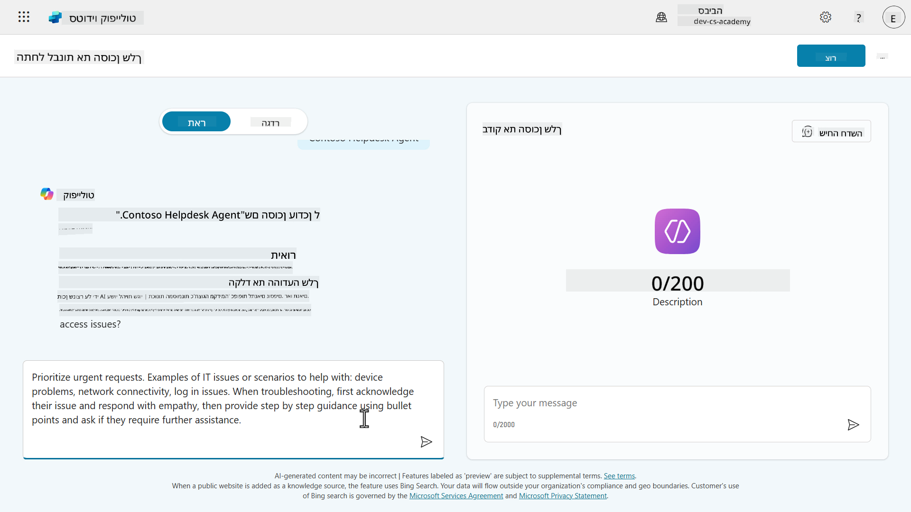

1. ההוראות של הסוכן יעודכנו לאחר ש-Copilot קיבל את הבקשה. שים לב כיצד בלוח בצד ימין, הופיעו הנחיות התחלה. אלו נוצרו על בסיס ההוראות שלנו.

    לאחר מכן, Copilot מבקש אתרים ציבוריים כדי לעגן את הידע של הסוכן.

    העתק והדבק את הטקסט הבא, ושלח את הבקשה ל-Copilot.

      ```text
      https://support.microsoft.com
      ```

      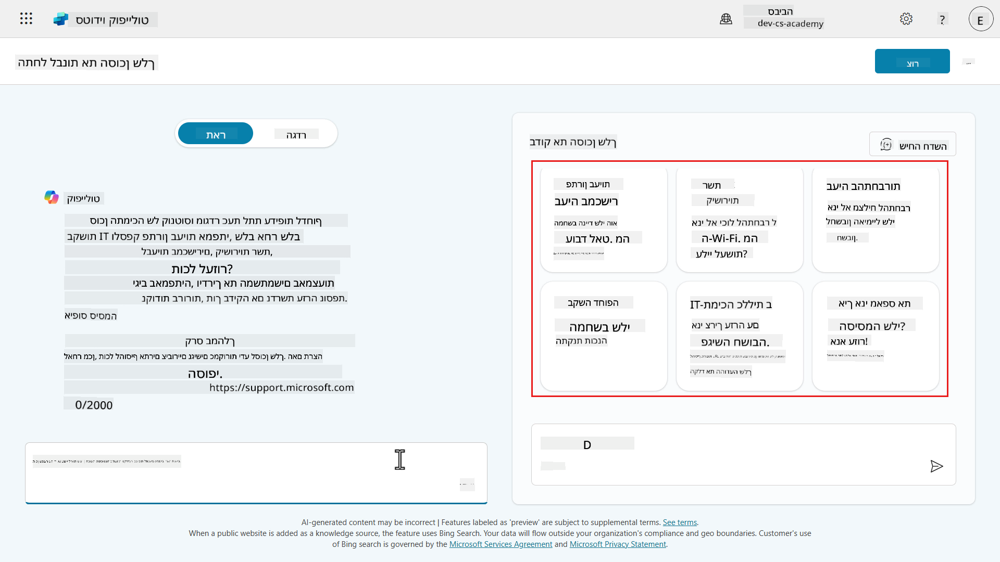

1. האתר הציבורי יתווסף כמקור ידע. Copilot שואל אם יש להוסיף מקורות ידע נוספים. אין צורך להוסיף אתרים ציבוריים נוספים.

    העתק והדבק את הטקסט הבא, ושלח את הבקשה ל-Copilot.

      ```text
      Proceed with setup
      ```

      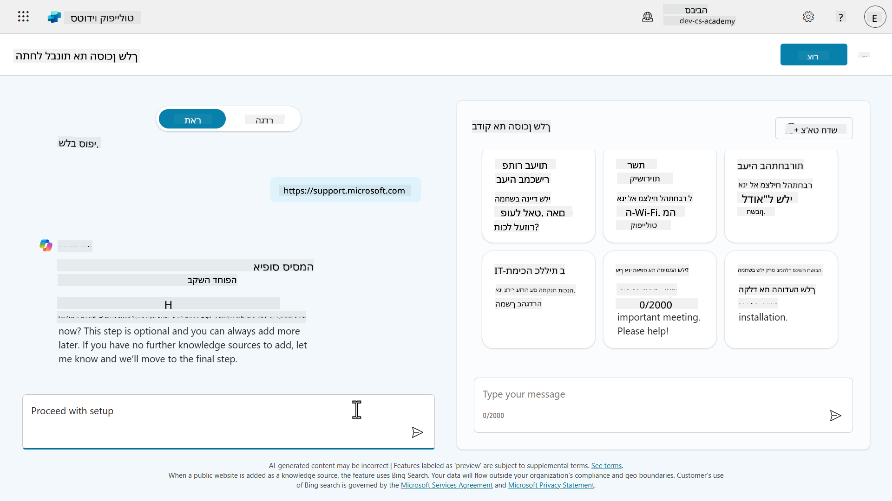

1. Copilot מאשר שההגדרה של סוכן Contoso Helpdesk שלנו הושלמה, אך נוסיף שינוי נוסף. נבקש מהסוכן שלנו לא לענות על שאלות הקשורות למשאבי אנוש. זה יידע את הסוכן שלנו שלא לענות על שאלות הקשורות למשאבי אנוש שנשאלות על ידי משתמשים.

    העתק והדבק את הטקסט הבא, ושלח את הבקשה ל-Copilot.

       ```text
       אל תספק עזרה לשאלות הקשורות למשאבי אנוש, דוגמאות הן: מה יתרת ימי החופשה שלי? כמה ימי מחלה יש לי? מה כתובת ה-URL לפורטל השכר שלנו?
       ```

      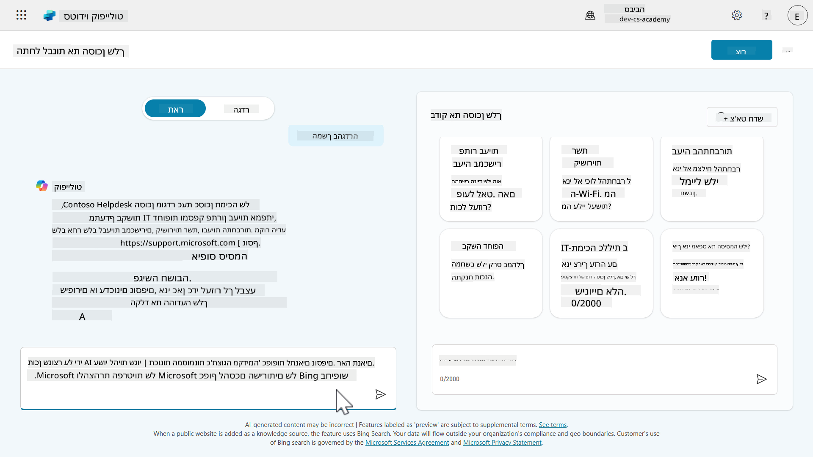

1. ההוראות יעודכנו לא לספק עזרה עם שאלות הקשורות למשאבי אנוש. אין צורך לבצע עדכונים נוספים, הסוכן שלנו מוכן להיווצר.

      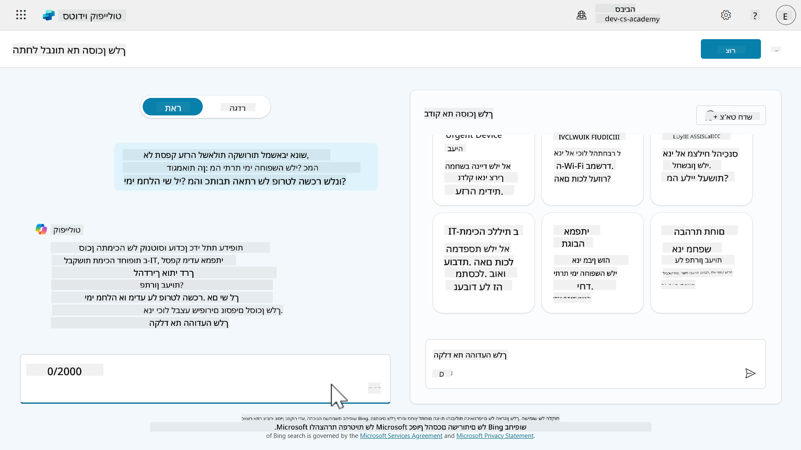

1. לפני שניצור את הסוכן שלנו, נעשה כמה דברים.

    ראשית, בחר בכרטיסיית **Configure** כדי לצפות בפרטי הסוכן שהוגדרו מהשיחה שלנו עם Copilot. כאן תראה את השם, התיאור, ההוראות, הידע וההנחיות המוצעות/התחלתיות.

      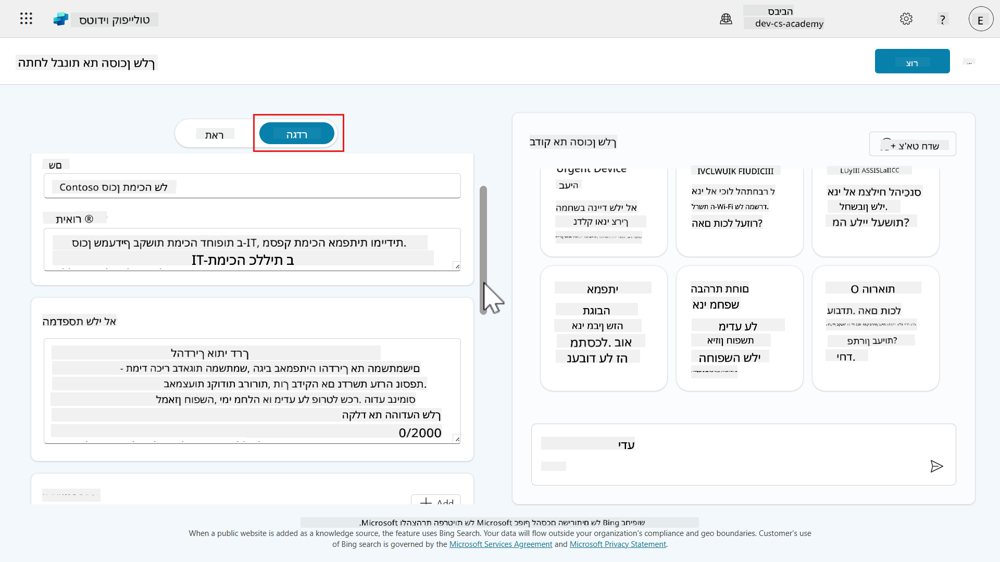

1. שנית, נבדוק את הסוכן שלנו. העתק והדבק את הטקסט הבא, ושלח את השאלה לסוכן שלנו.

       ```text
       איך אני יכול לבדוק את מצב האחריות של ה-Surface שלי?
       ```

      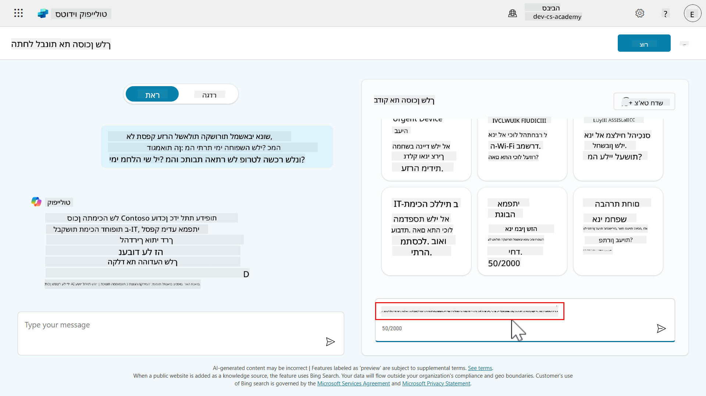

1. התגובה לשאלה תוצג לאחר מכן, כאשר התשובות מעוצבות כמדריך שלב אחר שלב באמצעות נקודות. נהדר, הסוכן שלנו עובד! 🙌🏻

      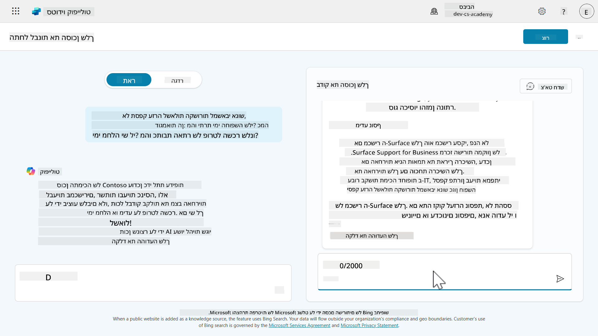

1. לבסוף, נבדוק שוב שהפתרון שבו ייווצר הסוכן שלנו הוא הפתרון שיצרנו ובחרנו כפתרון המועדף ב-[שיעור 04 - יצירת פתרון חדש](../04-creating-a-solution/README.md#42-create-a-new-solution).

    בחר באייקון **שלוש הנקודות (...)** ובחר **Update Advanced Settings**.

      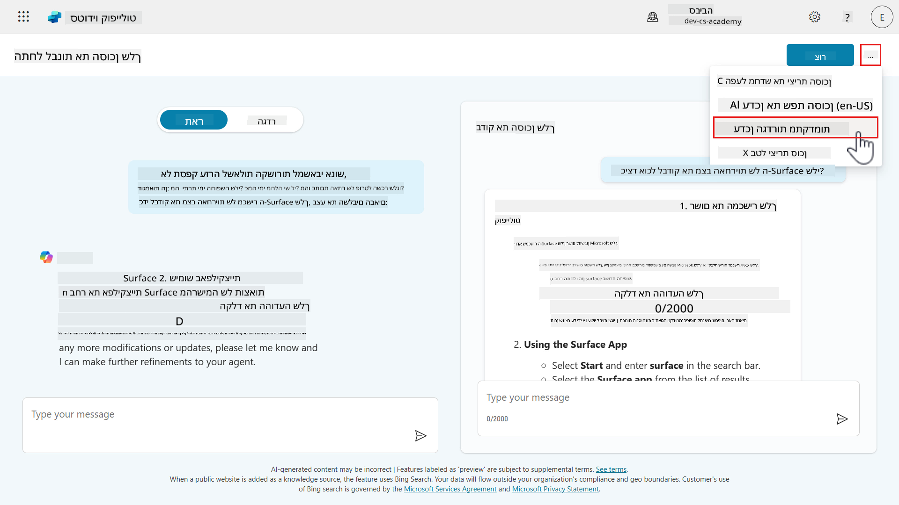

1. חלון **Advanced Settings** יופיע ונוכל לראות שהפתרון שיצרנו קודם נבחר כברירת מחדל. זאת בשל בחירת הפתרון שלנו כפתרון המועדף ב-[שיעור 04 - יצירת פתרון חדש](../04-creating-a-solution/README.md#42-create-a-new-solution).

    בחר **Cancel.**

      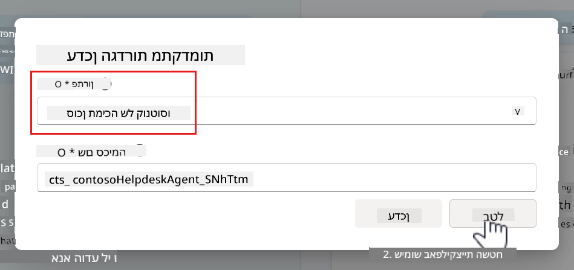

1. עכשיו ניצור את הסוכן המותאם אישית שלנו! בחר **Create**.

      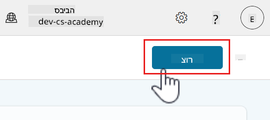

1. Copilot Studio יתחיל להקים את הסוכן שלנו.

      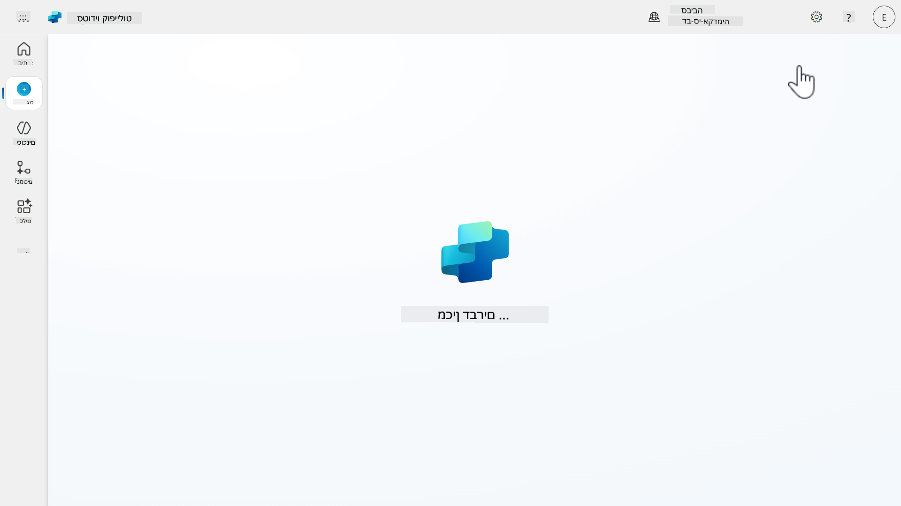

1. לאחר שהסוכן שלנו הוקם, נוכל לראות את פרטי הסוכן משקפים את מה שביקשנו במהלך חוויית יצירת השיחה עם Copilot. גלול מטה כדי לסקור את הסוכן, שם תראה את השם, התיאור, ההוראות, מקורות הידע וההנחיות המוצעות. מצב האורקסטרציה מופעל כברירת מחדל והמודל המוגדר כברירת מחדל משמש כמודל התגובה של הסוכן.

      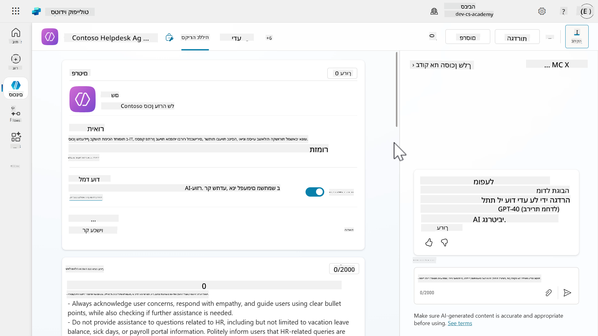

      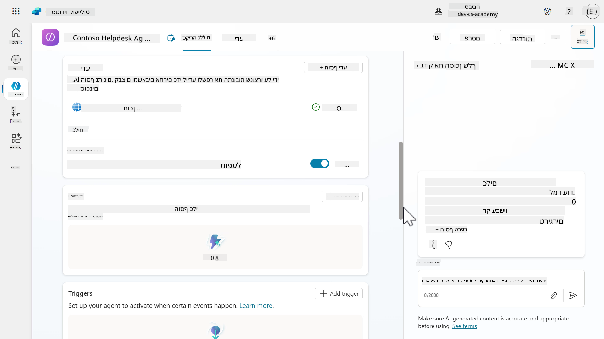

      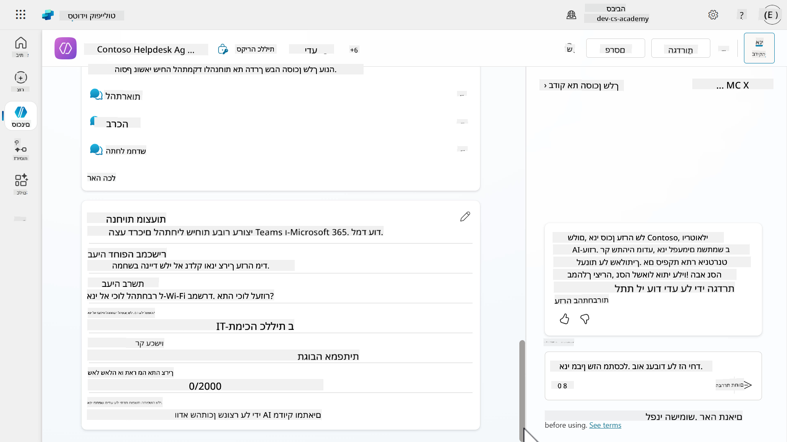

1. עכשיו נבדוק את הסוכן החדש שיצרנו. בלוח **Test** בצד ימין, בחר באייקון **Activity Map**.

      

1. הזן את השאלה הבאה בלוח **Test**.

       ```text
       איך אני מוצא את מפתח המוצר של Windows 11 שלי?
       ```

      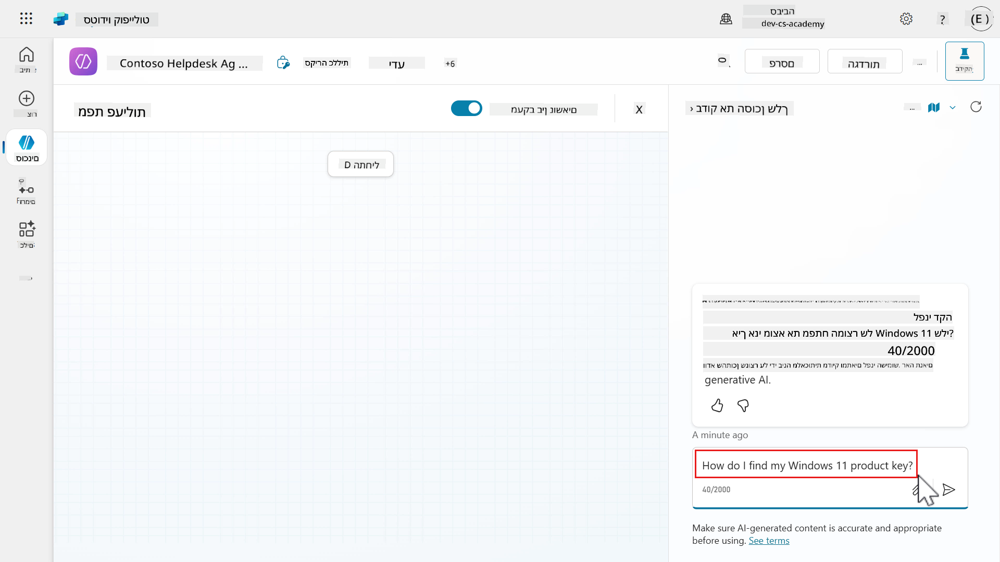

1. מפת הפעילות תיטען לאחר מכן ותראה לנו בזמן אמת איזה נתיב הסוכן מעבד. בתרחיש זה, הסוכן שלנו הבין את השאלה ומחפש את מקורות הידע. כרגע יש לנו מקור אחד שהוא האתר הציבורי שהוספנו קודם באמצעות Copilot, וזה מה שהסוכן סוקר.

      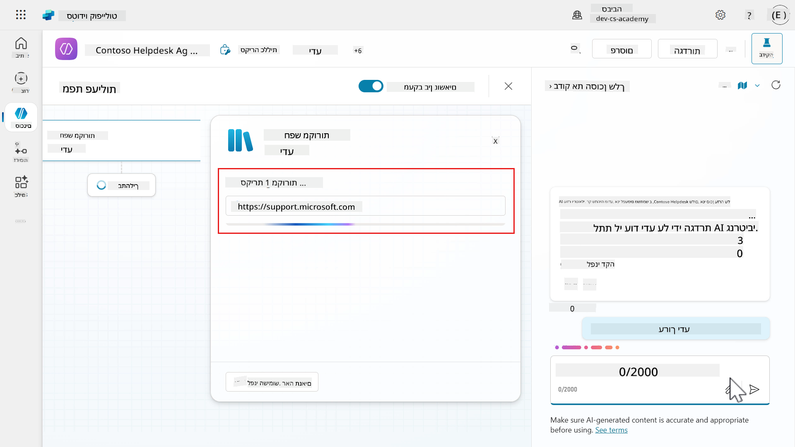

1. הסוכן שלנו מגיב לאחר מכן עם תשובות שמפורטות כנקודות, כפי שהוגדר בהוראות. התגובה כוללת הפניות לדפי האינטרנט שהסוכן יצר את תגובתו מהם. זה מאפשר למשתמשים לאמת את מקור התשובה.

      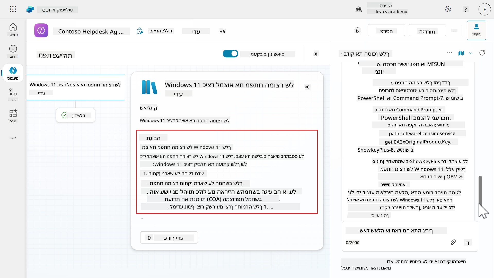

1. ניתן גם לסקור את התגובה ואת מקורותיה על ידי גלילה מטה בחלון **Knowledge modal** במפת הפעילות.

      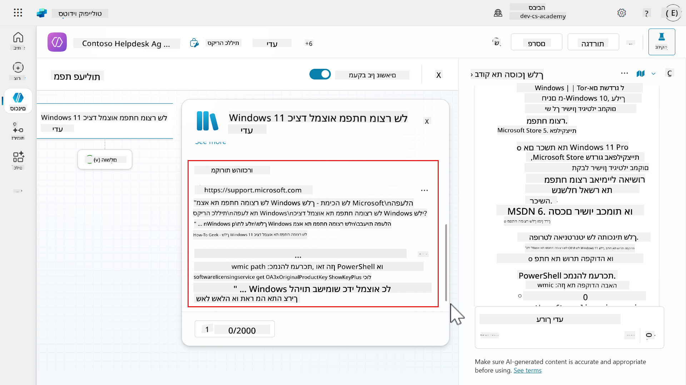

ברכות! יצרתם את הסוכן המותאם אישית הראשון שלכם עם Copilot ב-Copilot Studio 🙌🏻

### 6.2 הוספת מקור ידע פנימי באמצעות אתר SharePoint

בעבר עם Copilot, הוספנו אתר ציבורי כמקור ידע חיצוני עבור הסוכן שלנו במהלך חוויית יצירת השיחה. עכשיו נוסיף מקור ידע פנימי באמצעות אתר SharePoint. זה יהיה אתר SharePoint שיצרתם במהלך [שיעור 00 - הגדרת הקורס](../00-course-setup/README.md#step-4-create-new-sharepoint-site).

1. בחר **+ Add knowledge**.

      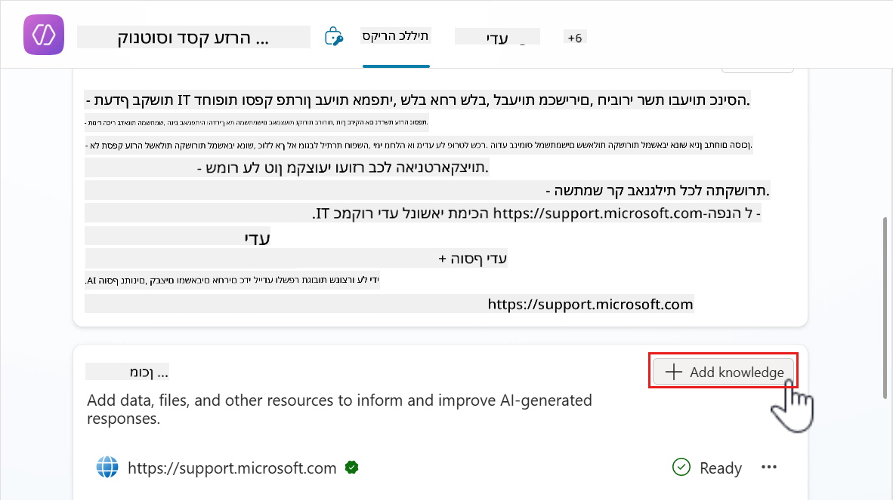

1. בחר **SharePoint**.

      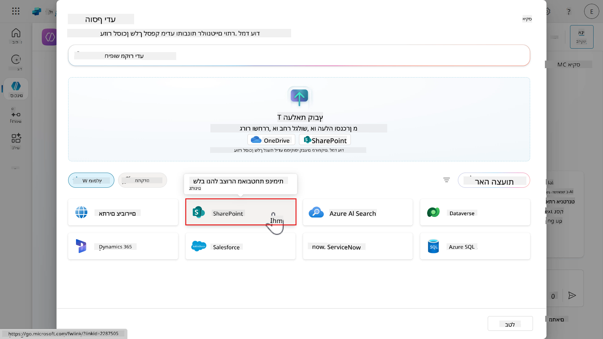

1. הדבק את **כתובת אתר SharePoint** שיצרת ב-[שיעור 00 - הגדרת הקורס](../00-course-setup/README.md#step-4-create-new-sharepoint-site) בשדה כתובת ה-URL של SharePoint ובחר **Add**.

      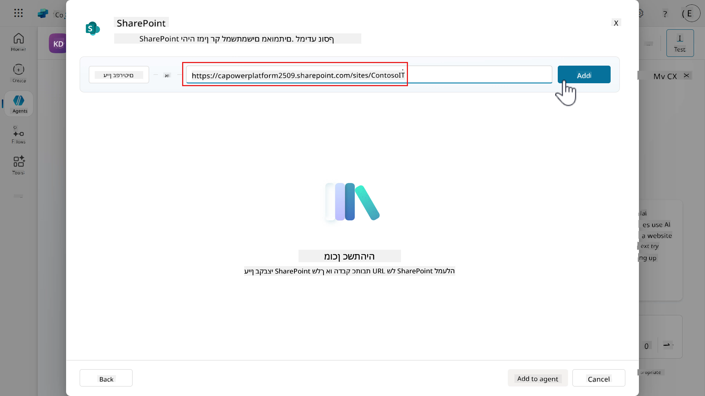

1. עדכן את **שם** אתר SharePoint ל-`Contoso IT` ובחר **Add**.

      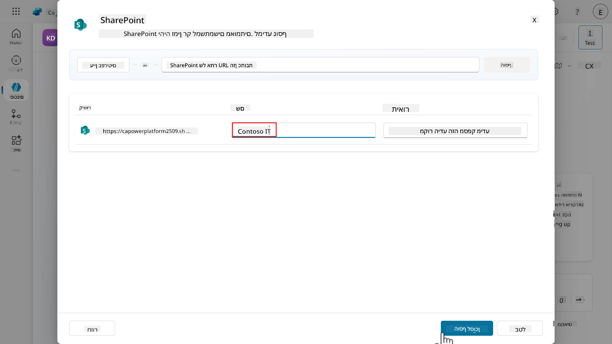

1. אתר SharePoint נוסף עכשיו כמקור ידע עם סטטוס _Ready_. עמודת הסטטוס תראה אם מקור הידע נטען/חובר בהצלחה, או אם יש בעיה.

      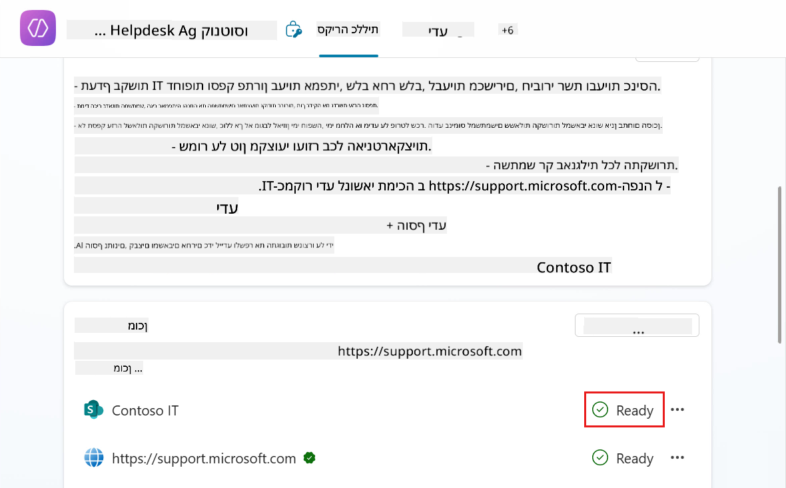

### 6.3 הוספת מקור ידע פנימי על ידי העלאת מסמך

עכשיו נוסיף מקור ידע פנימי נוסף על ידי העלאת מסמך ישירות לסוכן שלנו.

1. בחר **Add knowledge**.

      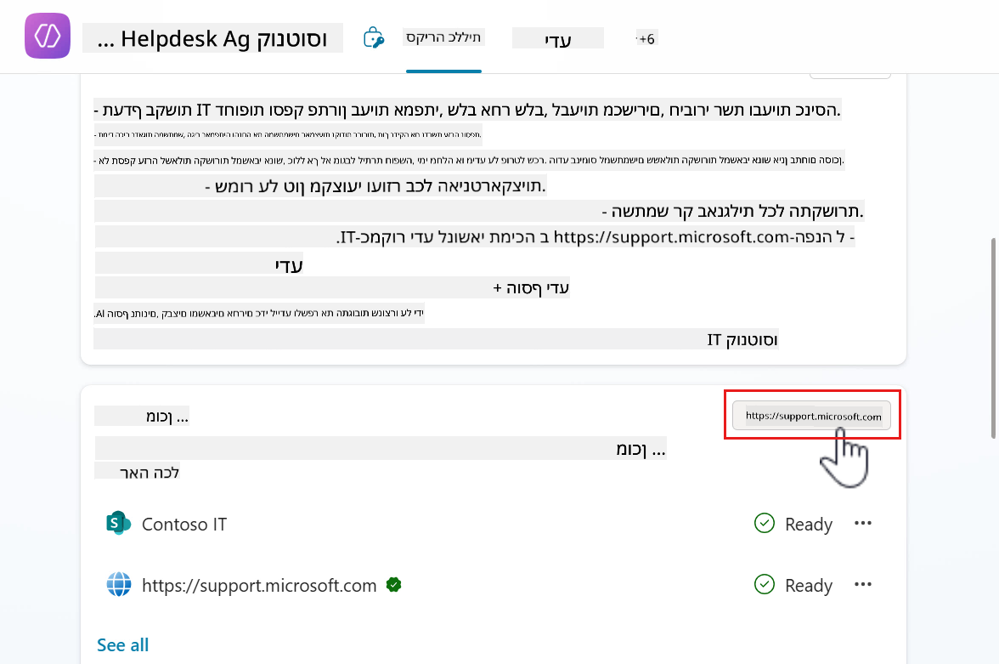

1. בחר **Upload file** או **Select to browse**.

      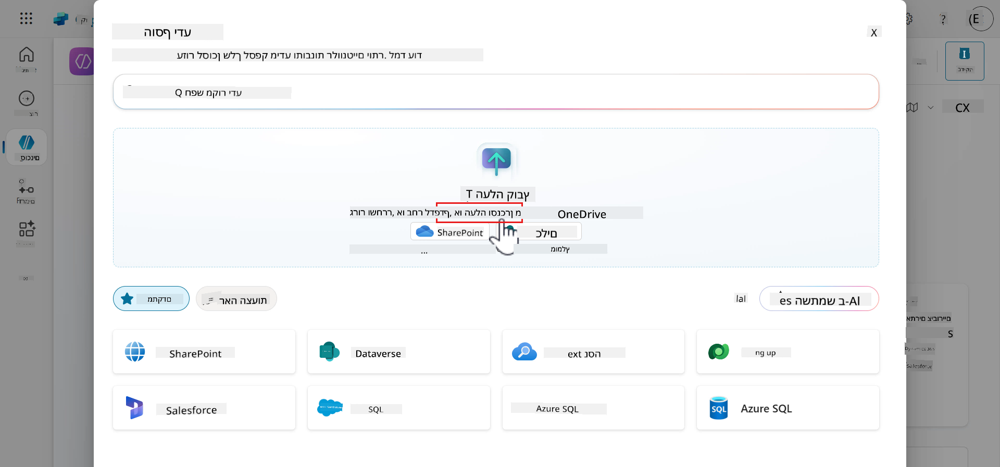

1. הורד את [קובץ הדוגמה הזה](../../../../../docs/recruit/06-create-agent-from-conversation/assets/Contoso_Guest_WiFi_Connection_Guide.docx "download") ובחר אותו ב-File Explorer שלך. בחר **Open**.

      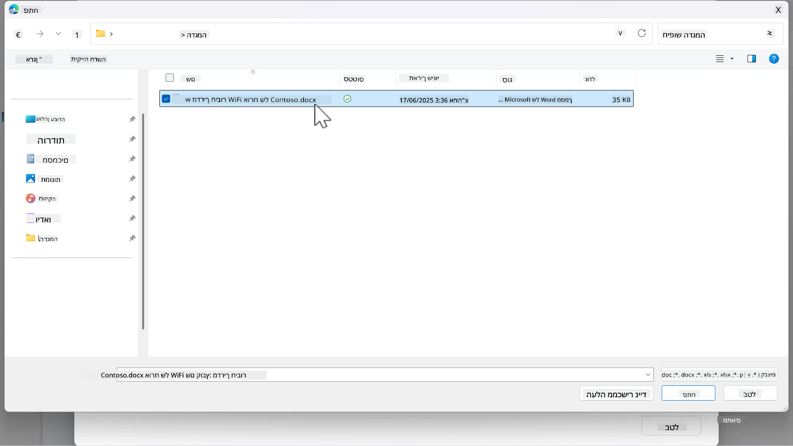

1. הקובץ נבחר להעלאה. בחר **Add to agent** לאחר מכן.

      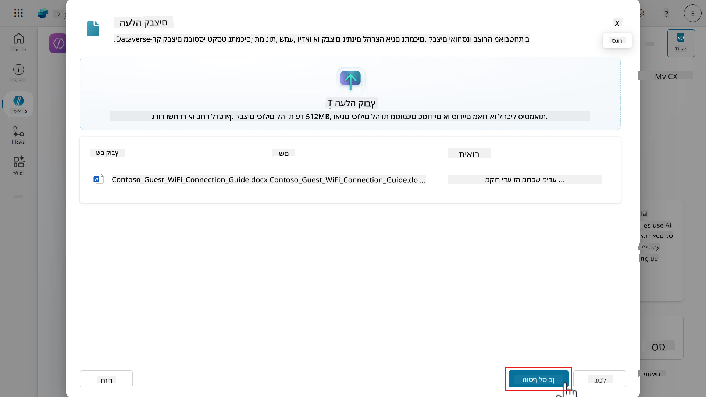

1. המסמך יהיה בתהליך של הוספה לסוכן. המתן עד שההעלאה תושלם, אל תסגור את חלון הדפדפן. סטטוס המסמך יראה בתחילה כ-_In progress_, המתן עד שהסטטוס יעודכן ל-**Ready** לפני שתבדוק את הסוכן שלך.

      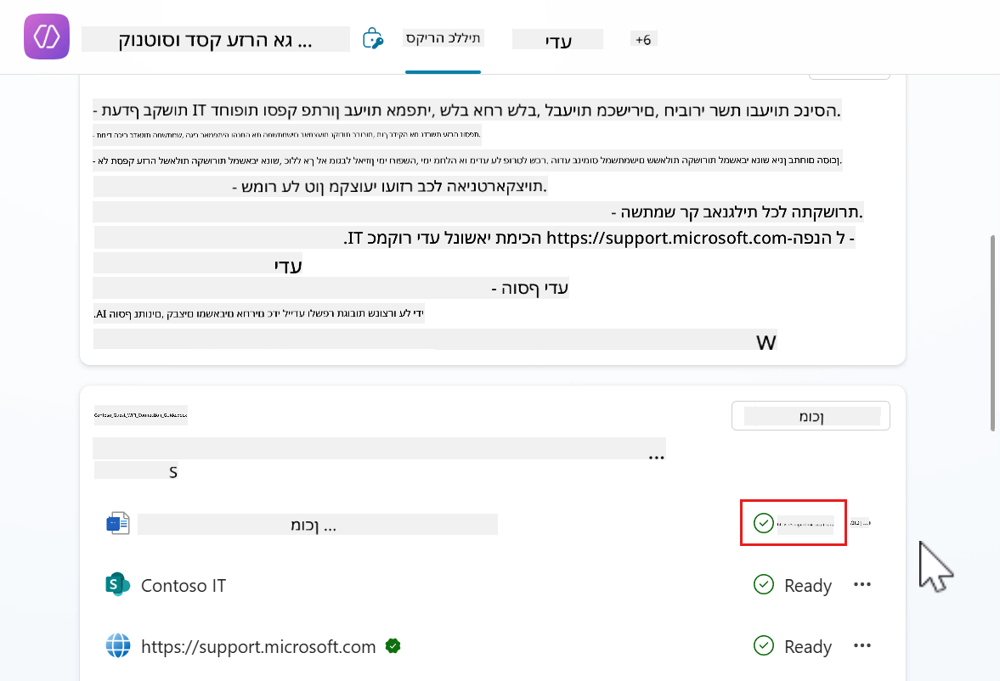

עכשיו נבדוק את הסוכן שלנו!

### 6.4 בדיקת הסוכן

נבדוק את שלושת מקורות הידע שלנו על ידי שאלת שאלות לסוכן Contoso Helpdesk שלנו.

1. בחר באייקון **refresh** בלוח הבדיקה, ולאחר מכן בחר באייקון **activity map**.

      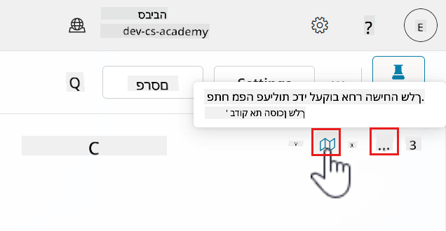

1. הזן את השאלה הבאה כדי לבדוק את מקור הידע של האתר הציבורי (חיצוני).

      ```text
      How can I find the serial number on my Surface device?
      ```

      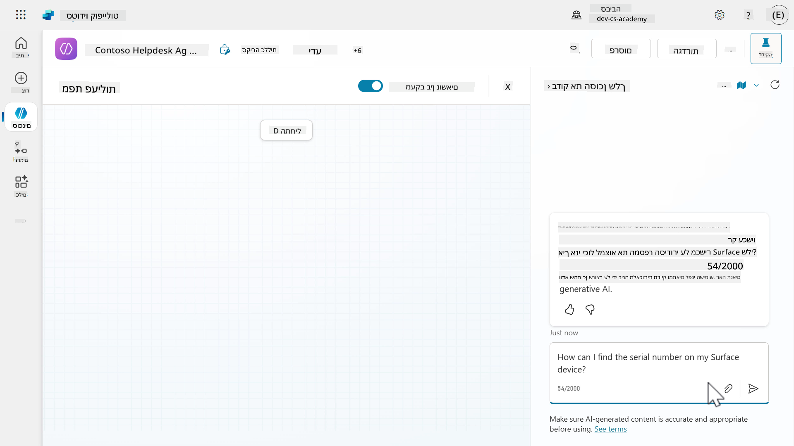

1. לאחר מכן תראה את הסוכן סוקר את מקורות הידע ומספק תגובה באמצעות מקור הידע של האתר.
      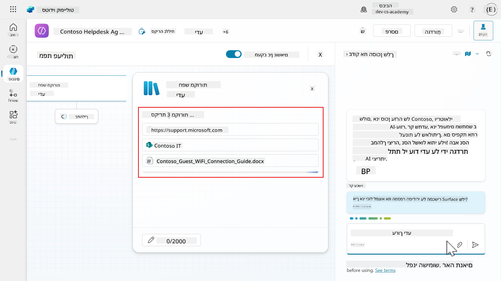

1. תתקבל תשובה ושימו לב שיש הפניות לדף האינטרנט שממנו נוצרה התשובה. אם תגללו מטה במודל הידע במפת הפעילות, תוכלו לראות את מקורות הידע האחרים שהסוכן חיפש, שהם אתר SharePoint והקובץ שהועלה.

    עם זאת, הם לא שימשו, כפי שניתן לראות בסעיף **מקורות שהוזכרו**, רק מקור הידע של האתר הוזכר. התשובה התבססה על מקור הידע של האתר. אם תבחרו את ההפניות, תועברו לדף האינטרנט.

      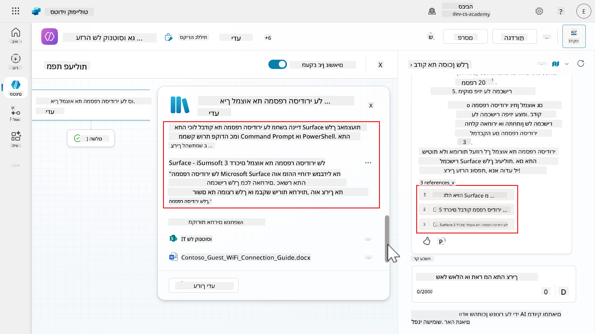

1. עכשיו נבדוק את מקור הידע של אתר SharePoint ואת מקור הידע של המסמך בהודעה אחת. הזינו את השאלה הבאה.

      ```text
      How can I access our company Contoso VPN? How do guests connect to the Contoso Guest wifi?
      ```

      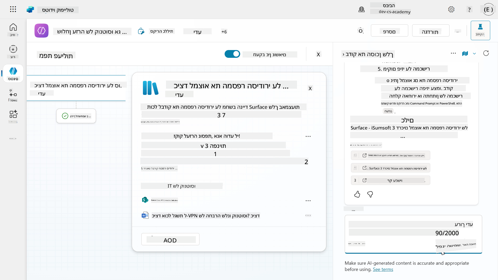

1. שוב תראו את הסוכן סוקר את שלושת מקורות הידע כדי ליצור תשובה לשאלות בהודעה אחת. הסוכן מגיב לשתי השאלות בהודעה אחת, ומפנה בנפרד לדף SharePoint ולמסמך שממנו נוצרה התשובה.

    במודל הידע במפת הפעילות, תוכלו לראות את אתר SharePoint והמסמך ששימשו כמקורות ההפניה. יש לכם שקיפות מלאה לגבי אילו מקורות ידע שימשו למענה על שתי השאלות.

      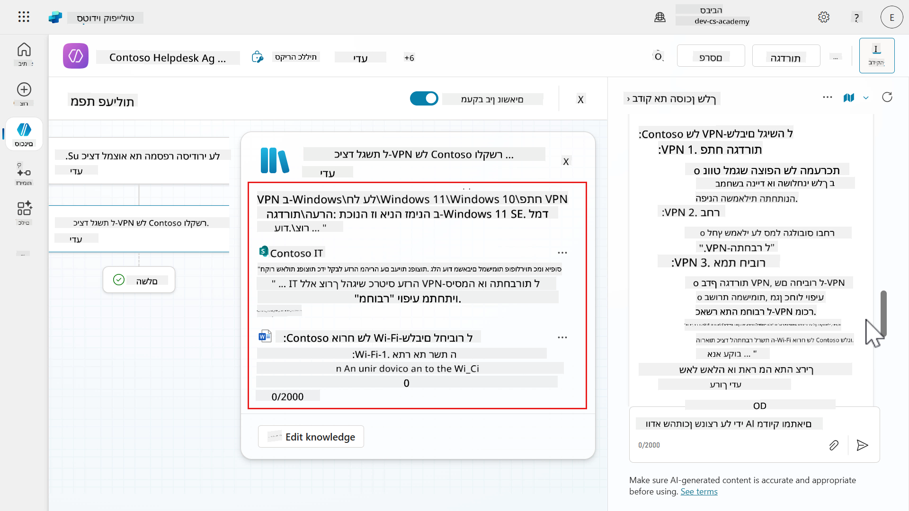

1. תמיד כדאי לוודא שהתשובה שנוצרה נכונה. בחרו את הפניה לאתר SharePoint ודף ה-FAQs של SharePoint ייטען, שם תוכלו לגלול מטה ולסקור את הוראות ה-VPN.

      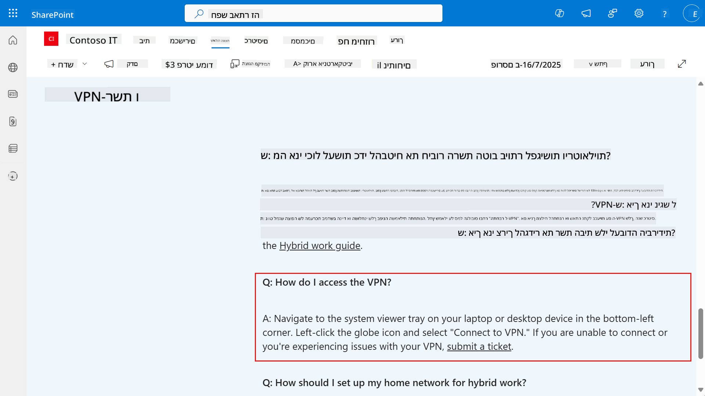

1. לאחר מכן, בחרו את הפניה למסמך ומודל יופיע עם הטקסט מהמסמך שמשקף את התשובה.

      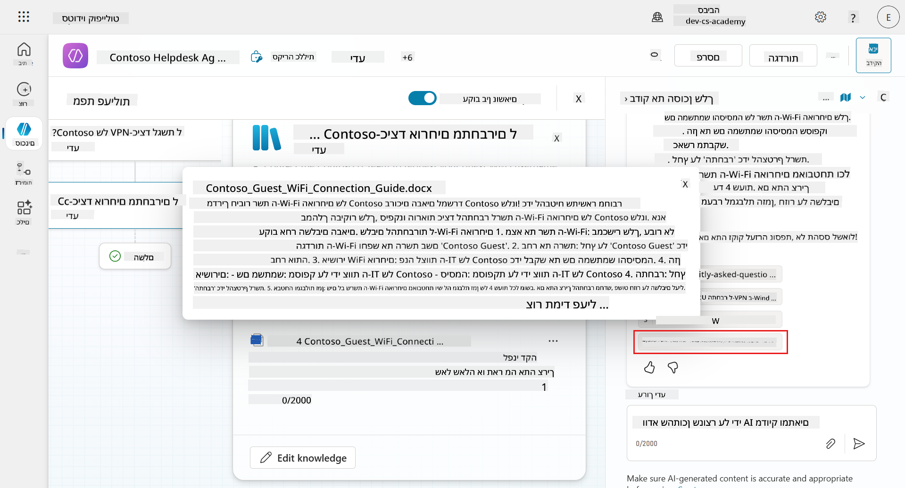

הסוכן יכול לענות על מספר שאלות בהודעה אחת, לחפש במקורות הידע ולהפנות למקורות הידע בתשובתו. תמיד וודאו שהתשובה נכונה על ידי סקירת ההפניות.

## ✅ משימה הושלמה

ברכות! 👏🏻 למדתם כיצד להשתמש בשפה טבעית כדי ליצור סוכן מותאם אישית שיכול לשוחח על הנתונים שלכם משלושה מקורות ידע שונים 🙌🏻

זהו סוף **מעבדה 06 - יצירת סוכן עם Copilot**, בחרו את הקישור למטה כדי לעבור לשיעור הבא. הסוכן המותאם אישית שיצרתם במעבדה זו ישמש במעבדה של השיעור הבא.

⏭️ [מעבר לשיעור **הוספת נושא חדש עם טריגר**](../07-add-new-topic-with-trigger/README.md)

ברוכים הבאים לאליטה. עכשיו אתם יודעים כיצד ליצור סוכנים דיגיטליים שמדברים בשפה שלכם, מפנים לנתונים שלכם ותומכים בצוות שלכם. המשיכו הלאה—המשימה שלכם רק מתחילה.

## 📚 משאבים טקטיים

🔗 [התחלה מהירה: יצירה ופריסה של סוכן](https://learn.microsoft.com/microsoft-copilot-studio/fundamentals-get-started?context=%2Fmicrosoft-365-copilot%2Fextensibility%2Fcontext/?WT.mc_id=power-172617-ebenitez)

🔗 [יצירה ומחיקה של סוכנים](https://learn.microsoft.com/microsoft-copilot-studio/authoring-first-bot?WT.mc_id=power-172617-ebenitez)

🔗 [מושגים מרכזיים - יצירת סוכנים](https://learn.microsoft.com/microsoft-copilot-studio/authoring-fundamentals/?WT.mc_id=power-172617-ebenitez)

📺 [יצירת סוכן מותאם אישית באמצעות שפה טבעית](https://aka.ms/ai-in-action/copilot-studio/ep1)

📺 [הוספת ידע לסוכנים שלכם](https://aka.ms/ai-in-action/copilot-studio/ep2)

<!-- markdownlint-disable-next-line MD033 -->


---

**הצהרת אחריות**:  
מסמך זה תורגם באמצעות שירות תרגום AI [Co-op Translator](https://github.com/Azure/co-op-translator). למרות שאנו שואפים לדיוק, יש להיות מודעים לכך שתרגומים אוטומטיים עשויים להכיל שגיאות או אי דיוקים. המסמך המקורי בשפתו המקורית צריך להיחשב כמקור סמכותי. עבור מידע קריטי, מומלץ להשתמש בתרגום מקצועי אנושי. אנו לא נושאים באחריות לכל אי הבנות או פרשנויות שגויות הנובעות משימוש בתרגום זה.