<!--
CO_OP_TRANSLATOR_METADATA:
{
  "original_hash": "c04b3587170139bc23e3b5cfc24c89ac",
  "translation_date": "2025-10-17T01:20:35+00:00",
  "source_file": "docs/recruit/07-add-new-topic-with-trigger/README.md",
  "language_code": "he"
}
-->
# 🚨 משימה 07: הוספת נושא חדש עם טריגר וצמתים

## 🕵️‍♂️ שם קוד: `מבצע הישארות בנושא`

> **⏱️ חלון זמן למבצע:** `~60 דקות`

🎥 **צפו בהדרכה**

[](https://www.youtube.com/watch?v=7iPAZaA8nJs "צפו בהדרכה ביוטיוב")

## 🎯 תקציר המשימה

יצרתם סוכן. הוא מקשיב, לומד ועונה על שאלות - אבל עכשיו הגיע הזמן להיות יותר טקטיים. במשימה הזו, תעמיקו ותלמדו את הסוכן שלכם איך להגיב בדיוק רב להנחיות ספציפיות.

עם נושאים וטריגרים, הסוכן שלכם יכול:

- לזהות כוונה

- לנתב שיחות באמצעות לוגיקה

- לאסוף ולשמור משתנים

- להפעיל תהליכים ולנקוט פעולה

אתם לא רק בונים דיאלוג, אלא מחברים את הקורטקס של קבלת ההחלטות שלו. ברוכים הבאים לנקסוס העצבי.

## 🔎 מטרות

במשימה זו תלמדו:

1. להבין מה הם נושאים ומה תפקידם ביצירת שיחות מובנות עבור הסוכן שלכם  
1. ללמוד את האנטומיה של נושאים, כולל ביטויי טריגר וצמתים בשיחה  
1. לחקור סוגים שונים של צמתים בשיחה וכיצד להשתמש ב-Power Fx ללוגיקה דינמית  
1. ליצור נושאים מותאמים אישית מאפס כדי לטפל בבקשות ומשימות ספציפיות של משתמשים  
1. לבנות נושא פונקציונלי שמתחבר לנתוני SharePoint באמצעות מחברים וכלים  

## 🤔 מהו נושא?

נושא הוא שיחה מובנית שעוזרת לסוכן שלכם להגיב לשאלות או משימות ספציפיות של משתמשים. חשבו על נושא כעל שיחה קטנה או משימה שהסוכן שלכם יכול לטפל בה. כל נושא נועד להגיב לשאלה או בקשה ספציפית של משתמש.

### 🌌 מטרת הנושא

ישנן שלוש מטרות נפוצות לנושאים בהתאם לצרכי המשתמשים:

**מידע** - עונה על שאלות כמו:

- `מה זה …?`
- `מתי יהיה …?`
- `למה …?`
- `אתה יכול לספר לי …?`

**השלמת משימה** - עוזר למשתמשים _לעשות_ משהו:

- `"אני רוצה …"`
- `"איך אני …?"`
- `"אני צריך …?"`

**פתרון בעיות** - פותר בעיות:

- `משהו לא עובד …`
- `אני נתקל בהודעת שגיאה …`
- `אני רואה משהו לא צפוי …?`

ניתן גם ליצור נושאים לשאלות מעורפלות כמו `אני צריך עזרה`, שמבקשות מהמשתמשים פרטים נוספים לפני שממשיכים.

## 🐦 למה נושאים שימושיים?

נושאים עוזרים לכם:

- לארגן את הידע של הסוכן שלכם.

- לגרום לשיחות להרגיש טבעיות.

- לפתור בעיות של משתמשים בצורה יעילה.

## 🪺 סוגי נושאים

1. **נושאי מערכת** - מובנים ומטפלים באירועים נפוצים כמו:
    - התחלת שיחה
    - סיום שיחה
    - טיפול בשגיאות
    - בקשת התחברות ממשתמשים
    - העברה לסוכן אנושי

1. **נושאים מותאמים אישית** - אתם יוצרים אותם כדי לטפל במשימות או שאלות ספציפיות כמו:
    - בקשת חופשה לעובד
    - בקשת מכשיר חדש או חלופי

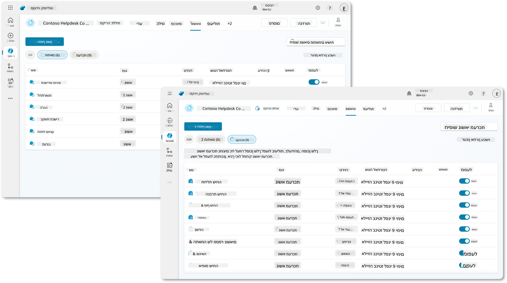

## 🧬 אנטומיה של נושא

כל נושא בדרך כלל מכיל את הדברים הבאים.

### 🗣️ ביטויי טריגר

אלו מילים או משפטים שמשתמשים עשויים לומר כדי להתחיל את הנושא.

**דוגמאות:**

לנושא בקשת חופשה, ביטויי טריגר יכולים להיות:

- `אני רוצה לקחת חופשה`
- `בקשת חופשה`
- `להגיש בקשה לחופשה`
- `איך אני מגיש בקשת חופשה?`

לנושא בקשת מכשיר, ביטויי טריגר יכולים להיות:

- `אני צריך מכשיר חדש`
- `אפשר לבקש מכשיר?`
- `אתה יכול לעזור לי עם בקשת מכשיר?`

### 💬 צמתים בשיחה

נושא מורכב מצמתים שהם שלבים שהסוכן עוקב אחריהם לאחר שהנושא מופעל. אתם מחברים את השלבים הללו כדי לבנות זרימת שיחה שהסוכן שלכם עוקב אחריה כאשר הוא מתקשר עם משתמשים.

חשבו עליהם כהוראות או פעולות כמו:

- לשאול את המשתמש שאלות  
- לשלוח הודעות  
- לקרוא לשירות חיצוני כמו מערכת ניהול חופשות  
- להגדיר או לבדוק משתנים  
- להשתמש בתנאים כדי לפצל את השיחה  
- להפנות לנושא אחר  

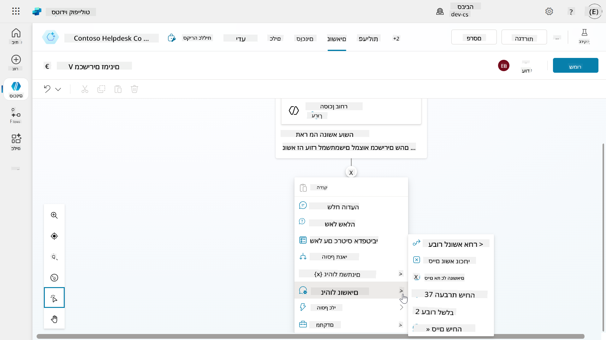

הסוגים העיקריים של צמתים שאתם יכולים להוסיף לסוכן הם:

#### שליחת הודעה

- **מטרה** - שולח הודעה למשתמש.  
- **דוגמה** - `תודה על הבקשה שלך! אני אעזור לך עם זה.`  

צומת זה מאפשר לסוכן שלכם לשלוח הודעות למשתמשים, שיכולות להיות טקסט פשוט או תוכן עשיר כמו תמונות, סרטונים, כרטיסים, תשובות מהירות וכרטיסים אדפטיביים.

ניתן להתאים אישית הודעות באמצעות משתנים, להוסיף מספר גרסאות של הודעות לגיוון, ואפילו להתאים את הפלט הקולי לערוצים עם תמיכה קולית.

!!! tip  
    חשבו על זה כעל בלוק "תגיד משהו" שעוזר לסוכן שלכם לתקשר בצורה ברורה ואינטראקטיבית עם משתמשים.

#### לשאול שאלה

- **מטרה** - שואל את המשתמש שאלה וממתין לתשובתו.  
- **דוגמה** - `מה תאריכי החופשה שלך?`  

צומת זה משמש לשאול משתמשים מידע ספציפי במהלך השיחה ולשמור את תשובותיהם במשתנים לשימוש מאוחר יותר.

ניתן להתאים את סוג השאלה כמו קלט טקסט או להשתמש בישויות לרשימת ערכים מוגדרת שהמשתמש בוחר ממנה, ולהגדיר כיצד הסוכן צריך להתנהג אם המשתמש נותן תשובה לא תקינה או מדלג על השאלה.

הוא גם תומך בתוכן עשיר כמו תמונות ותשובות מהירות, ומאפשר לכם לכוונן את ההגדרות של אימות, שאלה חוזרת והפרעה כדי לגרום לזרימת השיחה להיות חלקה.

!!! tip  
    חשבו על זה כעל בלוק "שאל והקשב" שעוזר לסוכן שלכם לתקשר עם משתמשים בצורה מובנית שאתם מגדירים.

#### לשאול עם כרטיס אדפטיבי

- **מטרה** - שולח כרטיס עשיר ואינטראקטיבי באמצעות JSON.  
- **דוגמה** - כרטיס שמציג בוחר תאריך לוח שנה למשתמש כדי לבחור תאריך.  

צומת זה מציג כרטיסים עשירים ואינטראקטיביים שמשתמשים יכולים למלא ולשלוח כמו טפסים עם תיבות טקסט, כפתורים ותמונות. הוא לוכד את הקלט של המשתמש ושומר אותו במשתנים, שהסוכן שלכם יכול להשתמש בהם מאוחר יותר בשיחה.

!!! tip  
    חשבו על זה כעל בלוק "בונה טפסים" מותאם אישית שמאפשר לסוכן שלכם להיות יותר אינטראקטיבי ומסוגל לאסוף מידע מפורט ממשתמשים.

#### הוספת תנאי

- **מטרה** - מוסיף לוגיקה לשיחה. בודק משהו ומחליט מה לעשות הלאה.  
- **דוגמה** - אם המשתמש אומר `כן`, עבור לשלב הבא. אם `לא`, סיים את השיחה.  

צומת זה יוצר נקודות החלטה בזרימת השיחה של הסוכן שלכם על ידי בדיקת האם משתנה עומד בקריטריונים מסוימים. בהתבסס על האם התנאי נכון או שגוי, הסוכן עוקב אחר נתיבים שונים.

!!! tip  
    חשבו על זה כעל בלוק "אם-אחרת" שעוזר לסוכן שלכם לקבל החלטות בהתאם לקלט המשתמש או נתונים שמורים במשתנים.

#### ניהול משתנים

- **מטרה** - שומר או מנקה מידע (נקרא משתנים) במהלך השיחה.  
- **דוגמה** - שומר את התאריך שהמשתמש בחר בצומת שאל שאלה שמציג כרטיס אדפטיבי.  

צומת זה מאפשר לכם לשמור ולנהל מידע במהלך השיחה, זה יכול להיות שם המשתמש, תשובה או העדפות. ניתן להשתמש בסוגים שונים של משתנים כמו טקסט, מספרים או תאריכים, והם יכולים להיות מוגבלים לנושא אחד, משותפים בין נושאים (גלובליים), או אפילו נמשכים מהמערכת או הסביבה.

!!! tip  
    חשבו על זה כעל "קופסת זיכרון" שעוזרת לסוכן שלכם לזכור מידע ולהשתמש בו כשהשיחה עם המשתמש ממשיכה.

#### ניהול נושא

- **מטרה** - מעביר את השיחה לנושא אחר או שלב בתוך הנושא, מעביר את השיחה או מסיים את הנושא או השיחה.  
- **דוגמה** - הפניה לנושא "מדיניות חופשה".  

צומת זה מאפשר לסוכן שלכם לקפוץ מנושא אחד לאחר מבלי להתחיל מחדש את השיחה, לסיים את הנושא, להעביר או לסיים את השיחה, או לעבור לשלב אחר בתוך אותו נושא. זה עוזר להנחות משתמשים דרך חלקים שונים בזרימת השיחה על ידי מעבר חלק בין נושאים, וניתן להעביר משתנים ביניהם כדי לשמור על הקשר.

!!! tip  
    חשבו על זה כעל בלוק "עבור לחלק/שלב אחר" שעוזר לסוכן שלכם להיות גמיש בשיחה עם משתמשים.

#### הוספת כלי

- **מטרה** - מתחבר לכלים כמו מחברים, תהליכי סוכן, הנחיות, חיפוש מותאם אישית, שאילתת חיפוש, מיומנויות, פרוטוקול הקשר מודל.  
- **דוגמה** - תהליך סוכן שמבוצע לאחר שהמשתמש מגיש את בקשת החופשה שלו.

צומת זה נותן לסוכן שלכם יכולות לתקשר עם מערכות חיצוניות או לבצע משימות ספציפיות, כמו שליחת מיילים, בדיקת מזג אוויר או גישה למסדי נתונים. ניתן להוסיף כלים באמצעות מחברים מובנים, APIs מותאמים אישית, תהליכי סוכן, הנחיות, או להתחבר לשרתי פרוטוקול הקשר מודל (MCP), ואפילו אוטומציה של ממשק משתמש גרפי לאפליקציות שולחן עבודה באמצעות כלי שימוש במחשב.

!!! tip  
    חשבו על כלים כעל "בלוקי פעולה" שנותנים לסוכן שלכם כוחות-על לעשות דברים מעבר ל_שיחה_, כמו קריאה ל-API, הפעלת תהליך או איסוף קלט משתמש באופן אוטומטי.

#### צומת תשובות גנרטיביות

- **מטרה** - משתמש במודל שפה גדול כדי ליצור תגובות טבעיות ודמויות אנושיות בהתבסס על שאלת המשתמש וכל נתונים מחוברים.  
- **דוגמה** - משתמש במקור הידע המחובר שמכיל מידע על זכויות חופשה כדי לענות על שאלות משתמשים בנוגע לבקשות חופשה.

צומת זה מאפשר לסוכן שלכם להגיב לשאלות משתמשים באמצעות מידע ממקורות ידע שונים, כמו אתרים, מסמכים, SharePoint או נתונים מותאמים אישית. ניתן להשתמש בו כגיבוי כאשר לא נמצא נושא מתאים, או בתוך נושא כדי לספק תשובות מפורטות ודינמיות בהתבסס על מקורות ספציפיים שהגדרתם לסוכן שלכם להשתמש בהם.

!!! tip  
    חשבו על זה כעל "בלוק תשובה חכמה" שעוזר לסוכן שלכם לתת תגובות מועילות ומדויקות על ידי חיפוש תוכן מהימן שאתם מגדירים.

#### צומת בקשת HTTP

- **מטרה** - מחבר את הסוכן שלכם למערכות חיצוניות על ידי שליחת קריאות API (לדוגמה `GET` או `POST`) כדי לאחזר או לעדכן נתונים.  
- **דוגמה** - כאשר משתמש מבקש את יתרת ימי החופשה שלו, הסוכן מבצע קריאת `GET` למערכת ניהול החופשות ומוציא את `remainingLeaveDays` מתשובת ה-API ומשיב למשתמש עם הערך.

צומת זה מאפשר לסוכן שלכם להתחבר למערכות חיצוניות על ידי שליחת קריאות REST API, כמו `GET` או `POST`. ניתן להתאים את הבקשה עם כותרות, תוכן גוף ואפילו להשתמש ב-Power Fx כדי לכלול נתונים דינמיים, ואז לשמור את התשובה במשתנים לשימוש מאוחר יותר בשיחה.

!!! tip  
    חשבו על זה כעל "בלוק להגיע ולקבל מידע" שעוזר לסוכן שלכם לדבר עם שירותים אחרים כמו אחזור פרטי משתמש או שליחת נתונים למערכת אחרת.

#### שליחת אירוע

- **מטרה** - מאפשר לסוכן שלכם לשלוח פעולות שאינן הודעות, כמו עדכוני מערכת או הפעלת כלים - ללקוח או לערוץ, ולעזור לו לבצע משימות.  
- **דוגמה** - תגובה למשתמש שמצטרף לצ'אט על ידי הצגת הודעת ברוך הבא.

צומת זה מאפשר לסוכן שלכם לשלוח פעולות שאינן הודעות למערכות חיצוניות או ערוצים, שיכולים אז להחליט כיצד להגיב. אתם נותנים לכל אירוע שם ומצמידים לו ערך, שיכול להיות מספר פשוט או טקסט, משתנה או נוסחת Power Fx, והוא נשלח כאובייקט JSON.

!!! tip  
    חשבו על זה כעל "בלוק טריגר שקט" שעוזר לסוכן שלכם לעשות דברים מאחורי הקלעים או לתקשר עם כלים חיצוניים מבלי שמשתמש יצטרך לומר משהו.

## 🏋🏻‍♀️ שימוש ב-Power Fx בצמתים שלכם

ב-Copilot Studio, Power Fx הוא שפת תכנות בקוד נמוך המשמשת להוספת לוגיקה והתנהגות דינמית לסוכן שלכם. זו אותה שפה שמשתמשים בה ב-Microsoft Power Apps, והיא נועדה להיות פשוטה ודומה ל-Excel, מה שהופך אותה לקלה למפתחים ולא-מפתחים.

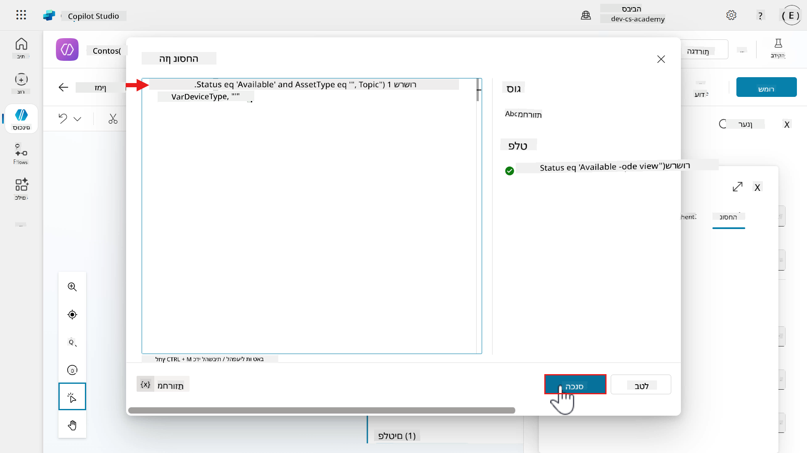

### מה Power Fx יכול לעשות בנושאים

- להגדיר ולנהל משתנים  
      - דוגמה: `Set(userName, "Adele Vance")`  
- ליצור תנאים  
      - דוגמה: `If(score > 80, "Pass", "Fail")`  
- לעצב ולהמיר נתונים  
      - דוגמה: `Text(DateValue, "dd/mm/yyyy")`  

### למה להשתמש ב-Power Fx?

- **גמיש:** ניתן לבנות לוגיקה מבלי לכתוב שורות קוד מלאות.  

- **מוכר:** אם השתמשתם בנוסחאות Excel, זה מרגיש מאוד דומה.  

- **חזק:** מאפשר לכם להתאים אישית שיחות, לאמת קלט ולשלוט כיצד הסוכן שלכם מתנהג בהתבסס על נתוני משתמשים.

## 🏗️ איך אני יוצר ועורך נושאים?

יש שתי דרכים שבהן ניתן ליצור ולערוך נושאים עבור הסוכנים שלכם.

### 1. יצירה מאפס

זה מאפשר לכם לבנות זרימות שיחה מותאמות אישית מאפס, וניתן להוסיף או להסיר צמתים לפי הצורך בעת עריכת הנושא.

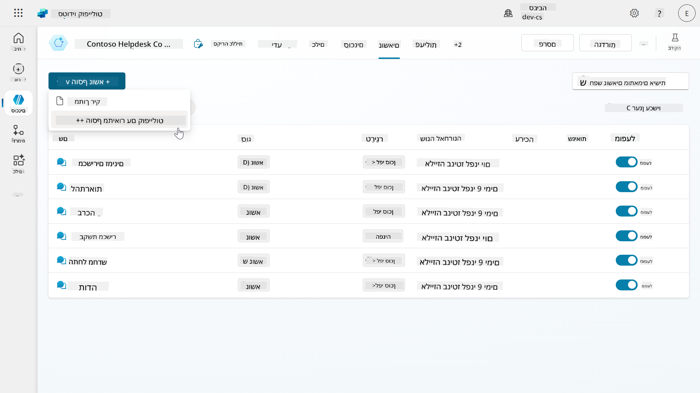

#### למה זה שימושי

- זה נותן לכם שליטה מלאה על איך הסוכן שלכם מגיב.  
- ניתן להתאים אישית לוגיקה באמצעות משתנים, Power Fx ותנאים.  
- זה מושלם לבניית חוויות מותאמות אישית לצרכים עסקיים ספציפיים.

### 2. יצירה עם Copilot
זה מאפשר לך לתאר מה אתה רוצה באמצעות שפה טבעית, וקופיילוט יבנה את השיחה עבורך. אותו דבר חל גם על עריכת הנושא שלך, השתמש בשפה טבעית וקופיילוט יבדוק ויערוך את הנושא עבורך.

#### מה קופיילוט תומך בו

- יכול ליצור ולערוך:
      - צמתים של הודעות
      - צמתים של שאלות
      - צמתים של תנאים
- אינו תומך בהגדרות מתקדמות כמו איך לשאול מחדש את המשתמש אם הוא לא מגיב או איך לנהל הפרעות במהלך שאלה. עדיין ניתן להתאים את ההגדרות הללו ידנית אם יש צורך.

#### למה זה שימושי

- מאיץ את הפיתוח בעזרת סיוע של AI.
- מאפשר לך להתמקד בלוגיקה ובחוויית המשתמש במקום בהגדרות חוזרות.
- מקל על שיפור זרימות השיחה עם מאמץ מינימלי.

#### ✨ דוגמאות להנחיות

- **יצירת נושא**
      - `קבל את שם המשתמש, גילו ותאריך הלידה שלו ואז חזור על תשובותיו`
      - `אסוף את כתובת הרחוב של המשתמש, המדינה ומיקוד. המשתמש צריך להיות מסוגל לנסות שוב כל שאלה עד 4 פעמים`

- **עריכת נושא**
      - `הוסף שאלה המבקשת את תאריך הלידה של המשתמש`
      - `סכם מידע שנאסף בכרטיס אדפטיבי.`

## 👩🏻‍🎨 אוקיי, איך אני מעצב נושאים לסוכן שלי?

### 🧙🏻‍♂️ שלב 1 - הבן מה המשתמשים צריכים

התחל בזיהוי שאלות או משימות נפוצות שהמשתמשים ישאלו את הסוכן שלך. אלו יכולים להיות:

- שאלות שהמשתמשים שואלים לעיתים קרובות כמו, `מה הזכאות שלי לימי מחלה?`
- משימות נפוצות שהמשתמשים רוצים לבצע כמו הגשת טופס
- בעיות שהמשתמשים נתקלים בהן לעיתים קרובות כמו בעיות כניסה

### 📦 שלב 2 - קבץ את התרחישים

ארגן את צרכי המשתמש לשלוש קטגוריות בהתבסס על מה שלמדנו קודם - מטרת הנושא:

- מידע - המשתמש רוצה לדעת משהו
- ביצוע משימה - המשתמש רוצה לעשות משהו
- פתרון בעיות - המשתמש זקוק לעזרה בפתרון בעיה

### 🗺️ שלב 3 - תכנן את השיחה

שרטט זרימת שיחה פשוטה של איך הסוכן צריך להגיב

- התחל עם ברכה או אישור
- שאל שאלות המשך כדי לקבל פרטים
- ספק תשובות או בצע פעולות

!!! tip
    שמור על השיחה קצרה וממוקדת. שאל רק את מה שצריך.

### 🔀 שלב 4 - התמודד עם סוגי שיחות שונים

תכנן עבור:

- **שיחה חד-פעמית** - שאלה אחת, תשובה אחת

- **שיחה רב-פעמית** - שיחה הלוך ושוב עם שאלות המשך

דוגמה:

- משתמש: `אני רוצה להגיש בקשה לחופשה.`

- סוכן: `בטח! מאיזה תאריך תרצה להתחיל את החופשה שלך?`

- משתמש: `15 ביולי`

- סוכן: `הבנתי. ומתי תסתיים החופשה שלך?`

- משתמש: `22 ביולי.`

- סוכן: `תודה! מה הסיבה לחופשה שלך?`

- משתמש: `חופשה משפחתית.`

- סוכן: `תודה על הפרטים. הגשתי את בקשת החופשה שלך מה-15 ביולי עד ה-22 ביולי לחופשה משפחתית. תקבל אישור בקרוב.`

### 🤖 שלב 5 - השתמש ב-AI לשאלות בלתי צפויות

גם אם תכננת נושא לבקשות חופשה, ייתכן שמשתמשים ישאלו שאלות שאינן מכוסות ישירות. כאן נכנסות לתמונה תכונות AI כמו נושא מערכת _Conversational boosting_.

נושא זה כולל צומת תשובות גנרטיביות, שמאפשר לסוכן שלך להתחיל להשתמש במקורות ידע מחוברים מיד. כל מקורות הידע שנוספו ברמת הסוכן נכללים אוטומטית בצומת התשובות הגנרטיביות בתוך נושא מערכת _Conversational boosting_.

#### דוגמה

- משתמש: `האם אני יכול להעביר ימי חופשה שלא נוצלו לשנה הבאה?`

שאלה זו עשויה לא להיות חלק מזרימת הנושא שהוגדרה מראש, במיוחד אם הנושא שלך מטפל רק בהגשת בקשות חופשה.

#### איך AI עוזר

אם הסוכן שלך מחובר למסמכי מדיניות HR של החברה שלך או לאתר הפנימי, AI יכול:

- לחפש את מדיניות החופשה הרלוונטית
- להבין ולסכם את הכללים
- הסוכן מגיב עם: `לפי מדיניות HR, אתה יכול להעביר ימי חופשה שלא נוצלו לשנה הקלנדרית הבאה. לפרטים נוספים, בדוק את סעיף מדיניות החופשה בפורטל HR.`

#### למה זה שימושי

- אין צורך ליצור נושא ידני עבור כל שאלה הקשורה למדיניות.
- AI יכול לשלוף תשובות מדויקות ממקורות ידע מהימנים.
- זה משפר את חוויית המשתמש על ידי כך שהסוכן מרגיש חכם ומגיב יותר.

### 🔬 שלב 6 - בדוק את הנושא, את זרימת השיחה

לפני פרסום הנושא:

- בדוק באמצעות שאלות אמיתיות או דוגמאות אמיתיות.
- וודא שזה נשמע טבעי ומועיל.

!!! tip
    בצע שיפורים לנושא שלך בהתאם לבדיקה, כמו הוספת צמתים נוספים או הסרת צמתים במקום הפניה לנושא אחר.

### ⚠️ שלב 7 - הימנע מהעתקת תוכן מהאתר

אל תעתיק את מה שכבר נמצא באתר שלך.

- התמקד בנושאים שמשתמשים שואלים עליהם לעיתים קרובות.
- הוסף נושאים חדשים בהתבסס על היסטוריית הצ'אט או בקשות תמיכה.

### ✨ דוגמה לזרימת שיחה

להלן דוגמה לנושא שמטפל בבקשות חופשה.

#### שלב 1: ביטוי מפעיל

המשתמש מקליד,

`אני רוצה לבקש חופשה`

#### שלב 2: הסוכן מבקש פרטים באמצעות כרטיס אדפטיבי

הסוכן שואל,

`בטח! מאיזה תאריכים תרצה לקחת חופש?`

בכרטיס האדפטיבי יש בקרי בחירת תאריך התחלה וסיום.

#### שלב 3: המשתמש מספק תאריכים

המשתמש בוחר תאריך התחלה כ-5 באוגוסט 2025 ותאריך סיום כ-10 באוגוסט 2025, ושולח את הכרטיס. ערכי התאריכים נשמרים בפלט של הכרטיס האדפטיבי כמשתנים.

#### שלב 4: זרימת ענן מבוצעת

זרימת ענן של Power Automate מבוצעת שיוצרת בקשה חדשה במערכת ניהול החופשות ושולחת דוא"ל להודיע למנהל על בקשת החופשה.

#### שלב 5: שלח הודעת אישור למשתמש

הסוכן מגיב עם,

`בקשת החופשה שלך מה-5 באוגוסט עד ה-10 באוגוסט הוגשה. המנהל שלך יבדוק ויחזור אליך בקרוב.`

## 🧪 מעבדה 07 - הוסף נושא חדש עם צמתים של שיחה

עכשיו נלמד איך להוסיף נושא חדש עם מפעיל וכלים. מעבדה זו תכסה יצירת נושא מאפס כדי שתבין איך להתאים נושאים לצרכים שלך.

- [7.1 הוסף נושא חדש מאפס](../../../../../docs/recruit/07-add-new-topic-with-trigger)
- [7.2 הגדר את קלטי ופלטי המפעיל](../../../../../docs/recruit/07-add-new-topic-with-trigger)
- [7.3 הוסף כלי באמצעות מחבר](../../../../../docs/recruit/07-add-new-topic-with-trigger)

### ✨ מקרה שימוש

**כ** עובד

**אני רוצה** לדעת אילו מכשירים זמינים

**כדי ש** תהיה לי רשימה של מכשירים זמינים

בואו נתחיל!

### דרישות מוקדמות

1. **רשימת SharePoint**

    נשתמש ברשימת **Devices** של SharePoint מ-[שיעור 00 - הגדרת הקורס - שלב 3: יצירת אתר SharePoint חדש](../00-course-setup/README.md#step-4-create-new-sharepoint-site).

    אם לא הגדרת את רשימת **Devices** של SharePoint, חזור ל-[שיעור 00 - הגדרת הקורס - שלב 3: יצירת אתר SharePoint חדש](../00-course-setup/README.md#step-4-create-new-sharepoint-site).

1. **סוכן עזרה של Contoso**

    נשתמש באותו סוכן שנוצר קודם ב-[שיעור 06 - יצירת סוכן מותאם אישית באמצעות שפה טבעית עם קופיילוט והסתמכות על הנתונים שלך](../06-create-agent-from-conversation/README.md).

### 7.1 הוסף נושא חדש מאפס

1. בחר את **לשונית הנושאים** ליד שם הסוכן. אם אינך רואה אותה, בחר **+6** ותראה את **נושאים** ברשימה.

    

1. לשונית **נושאים** תיטען ובברירת מחדל יוצגו הנושאים _מותאמים אישית_. ניתן לסנן נושאים לפי הכל, מותאמים אישית ומערכת. הנושאים המותאמים אישית והמערכת שאתה רואה כרגע נוצרו אוטומטית כאשר הסוכן הוקצה.

    בחר **+ הוסף נושא** ובחר **מאפס**.

    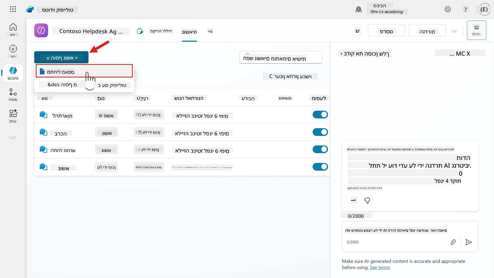

1. הזן שם לנושא. העתק והדבק את הבא.

    ```text
    Available devices
    ```

    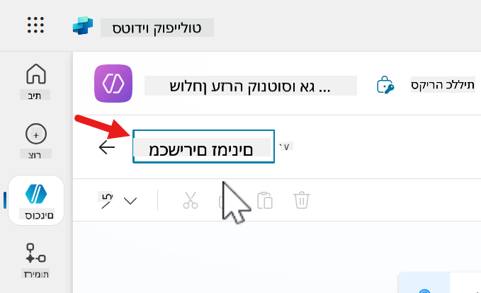

1. הזן תיאור מפעיל שמתאר מה הנושא עושה. העתק והדבק את הבא.

    ```text
    This topic helps users find devices that are available from our SharePoint Devices list. User can ask to see available devices and it will return a list of devices that are available which can include laptops, smartphones, accessories and more.
    ```

    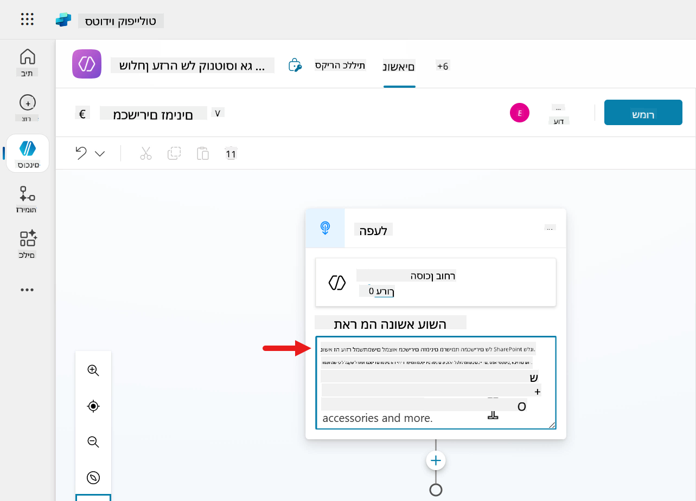

### 7.2 הגדר את קלטי ופלטי המפעיל

1. עכשיו נוסיף משתנה קלט חדש ש-AI גנרטיבי ישתמש בו בתזמור שלו כדי לחלץ את סוג המכשיר מהודעת המשתמש. בחר את **שלוש הנקודות (...)** בנושא ובחר **פרטים** כדי להציג את חלונית פרטי הנושא.

    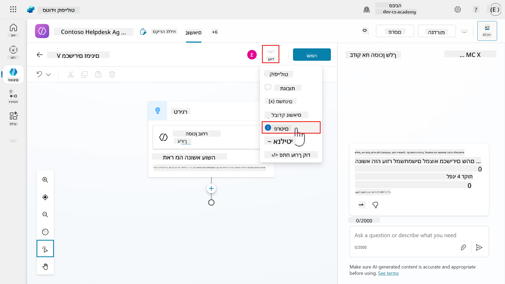

1. חלונית **פרטי הנושא** נטענה כעת. בחר את לשונית **קלט**.

    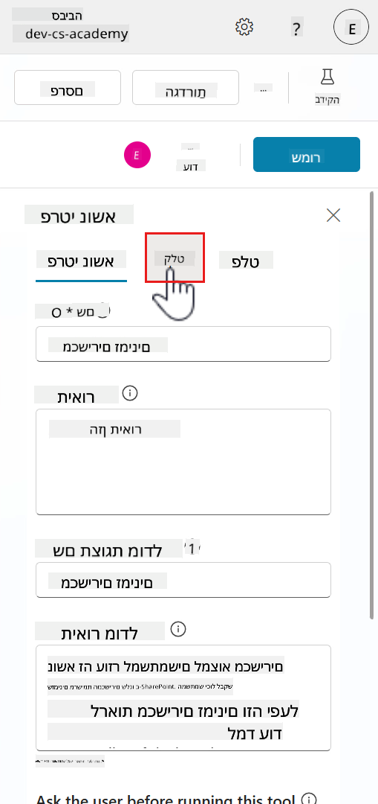

1. בחר **צור משתנה חדש**.

    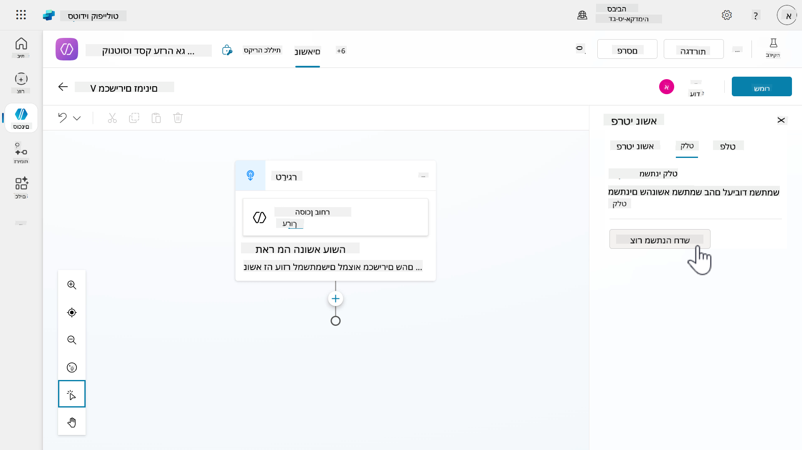

1. הזן שם למשתנה. העתק והדבק את הבא.

    ```text
    VarDeviceType
    ```

    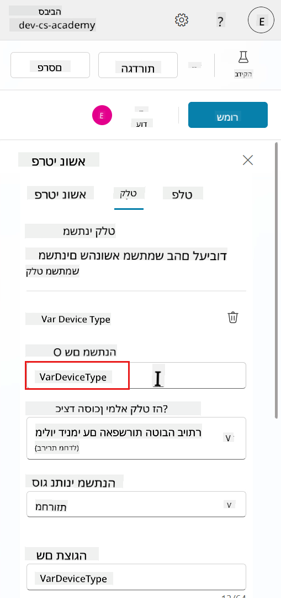

1. עכשיו עלינו להגדיר את משתני הקלט והפלט שלנו. אלו הם המאפיינים שניתן להגדיר עבור קלטי ופלטי נושא.

    | שדה    | ערך |
    | ---------- | :--------- |
    | איך הסוכן ימלא את הקלט הזה? | קובע איך הסוכן ימלא את המשתנה הזה עם ערך לפני הפעלת הנושא. כברירת מחדל זה מוגדר ל_מילוי דינמי עם האפשרות הטובה ביותר_. אחרת ניתן להחליף קלט בערך במקום לשאול את המשתמש|
    | סוג נתוני משתנה  | סוג הנתונים של המשתנה. סוגי נתונים נתמכים הם `String`, `Boolean`, `Number`, `Date`, `DateTime`, `DateTimeNoTimeZone`, `Time`, `Record`, `Table`, `Unspecified`, `From sample data` |
    | שם תצוגה   | שם המשתנה   |
    | זיהוי כ  | סוג ישות עבור הסוכן כדי ללכוד את סוג הערך הנכון  |
    | תיאור    | התיאור עוזר לסוכן למלא קלטים אוטומטית לפני הפעלת הנושא או ליצור שאלות לשאול עבור הערכים   |

    ניתן להשאיר את _איך הסוכן ימלא את הקלט הזה?_, _סוג נתוני משתנה_ ו_שם תצוגה_ כפי שהם. עדכן את מאפיין **זיהוי כ** ל-**תשובת המשתמש המלאה**.

    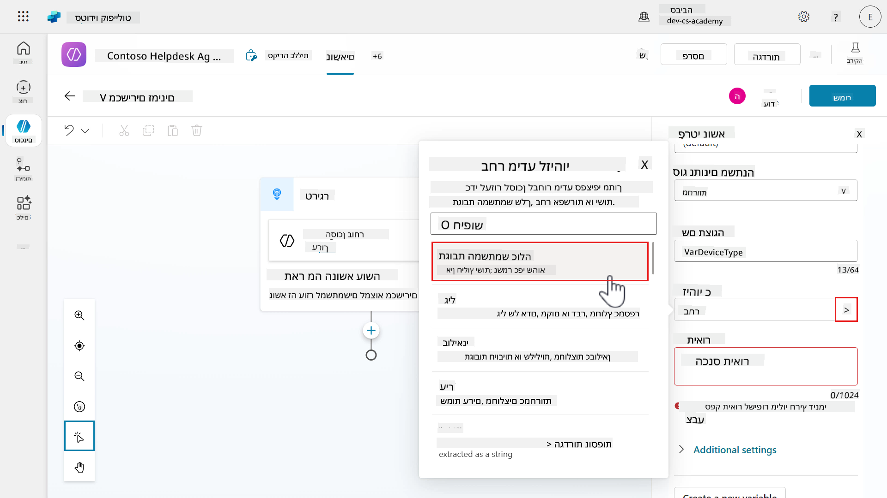

1. העתק והדבק את הבא כתיאור.

    ```text
    List of possible values: Laptop, Desktop, Smartphone
    ```

    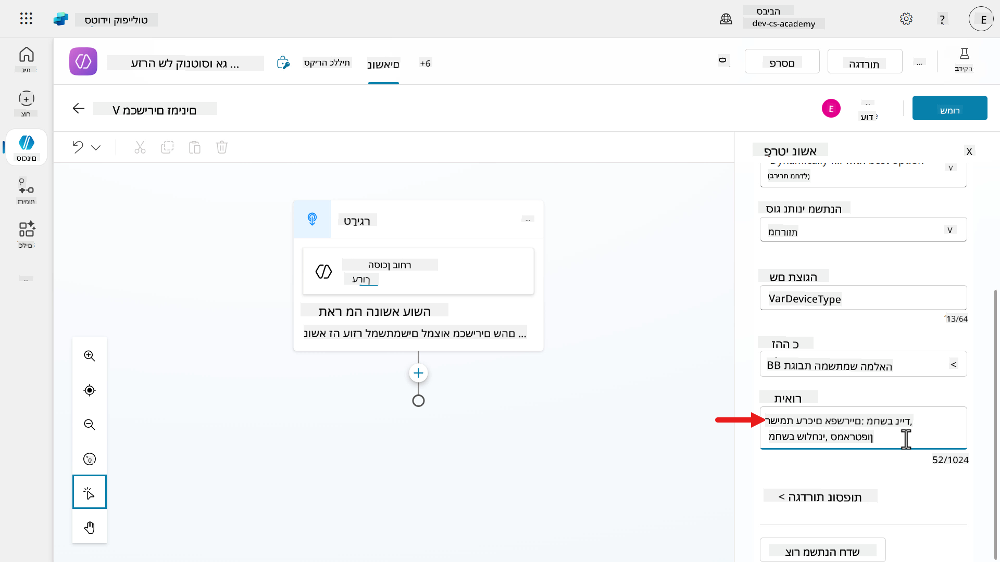

1. עכשיו, בואו נגדיר את הפלט שלנו עבור הנושא. בחר את לשונית **פלט**.

    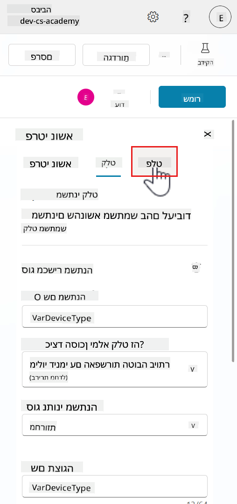

1. בחר **צור משתנה חדש**.

    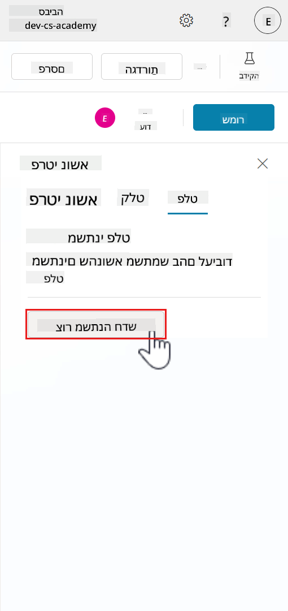

1. עדכן את המאפיינים הבאים.

    **שם משתנה** - העתק והדבק את הבא.

    ```text
    VarAvailableDevices
    ```

    **סוג נתוני משתנה** - בחר **טבלה** כסוג הנתונים.

    **תיאור משתנה** - העתק והדבק את הבא.

    ```text
    List of available devices by device type
    ```

    

1. סיימנו להגדיר את קלטי ופלטי הנושא. בחר את **אייקון X** כדי לצאת מחלונית **פרטי הנושא**.

    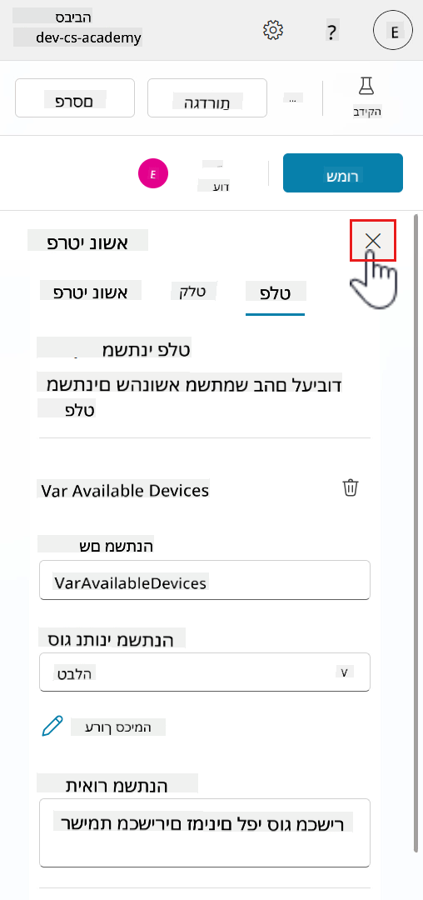

### 7.3 הוסף כלי באמצעות מחבר

1. עכשיו נוסיף צומת שמאפשר לסוכן לשלוף את רשימת המכשירים מרשימת **Devices** של SharePoint. בחר את **אייקון +** מתחת למפעיל.

    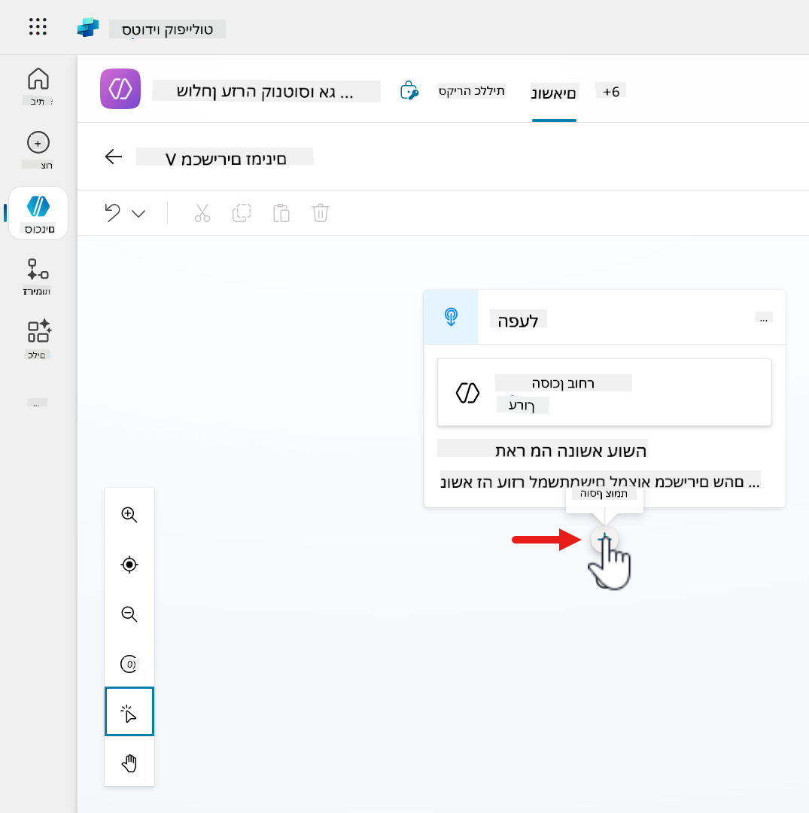

1. בחר את צומת **הוסף כלי**, ואז בחר את לשונית **מחבר**. חפש `Get items` ובחר את פעולת מחבר SharePoint **Get items**.

    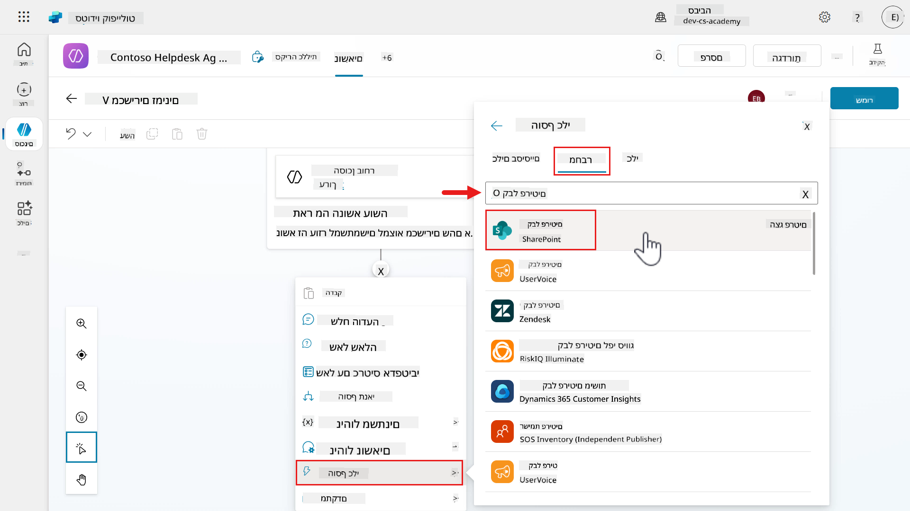

1. יש ליצור חיבור חדש עבור המחבר. בחר את **אייקון החץ** ובחר **צור חיבור חדש**.

    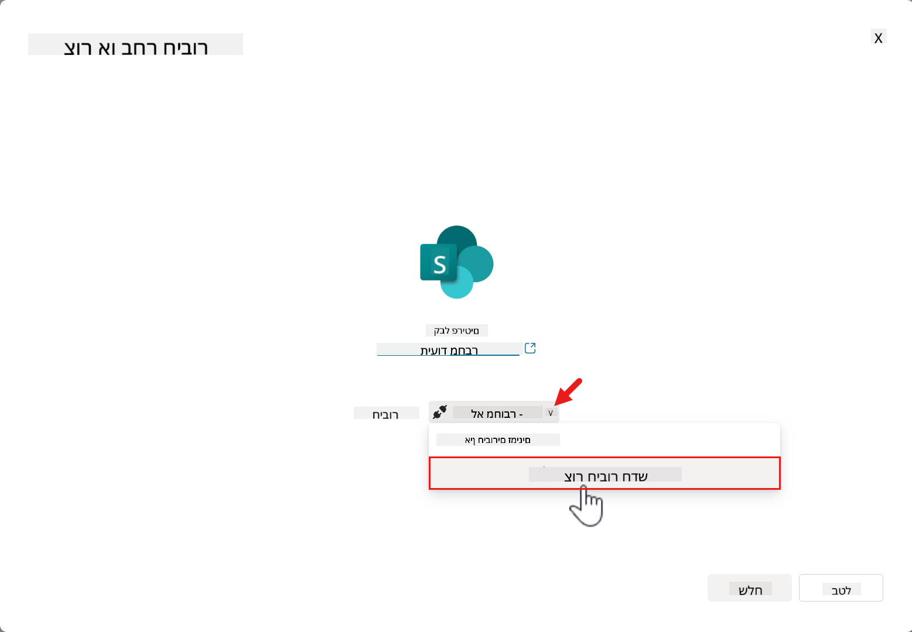

1. יוצגו שתי אפשרויות שמאפשרות לך להתחבר ישירות ל-SharePoint Online או ל-SharePoint מקומי. כברירת מחדל האפשרות **התחבר ישירות (שירותי ענן)** תיבחר, וזה מה שנשתמש בו עבור החיבור שלנו.
בחרו **צור**.


1. בחרו את חשבון המשתמש המחובר שלכם.

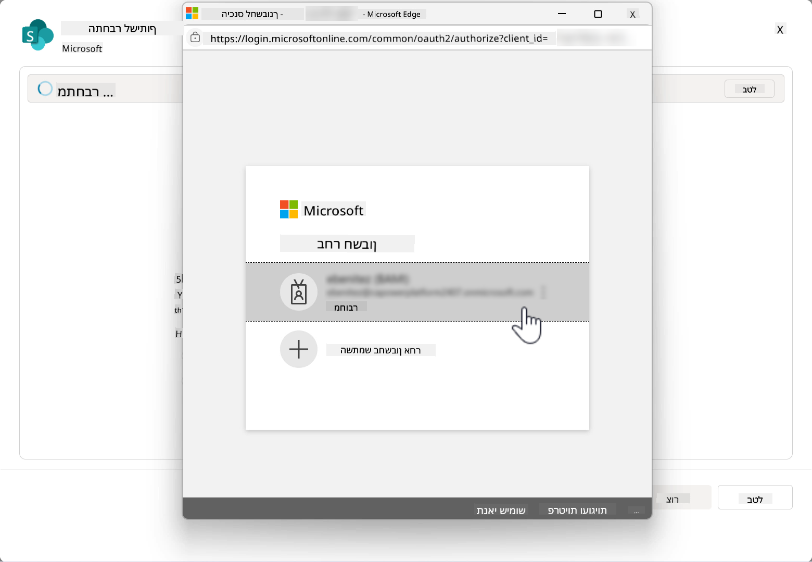

1. כעת, עליכם לאשר שחשבון המשתמש שלכם יכול לשמש לחיבור למחבר SharePoint. בחרו **אפשר גישה**.

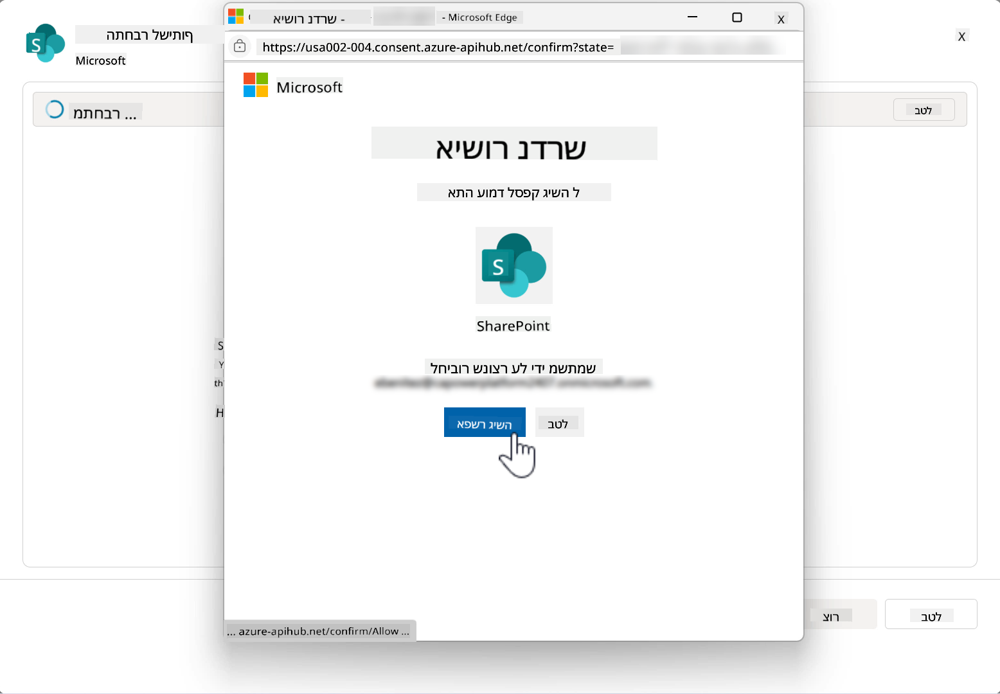

1. בחרו **שלח** כדי להוסיף את פעולת מחבר SharePoint **קבל פריטים** כצומת לנושא.

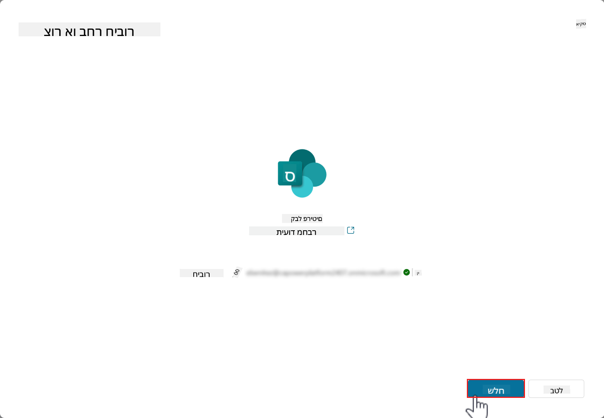

1. פעולת מחבר SharePoint **קבל פריטים** נוספה כעת לנושא. כעת נוכל להתחיל להגדיר את הקלטים של הפעולה. בחרו את **סמל שלוש הנקודות (...)** ובחרו **מאפיינים**.

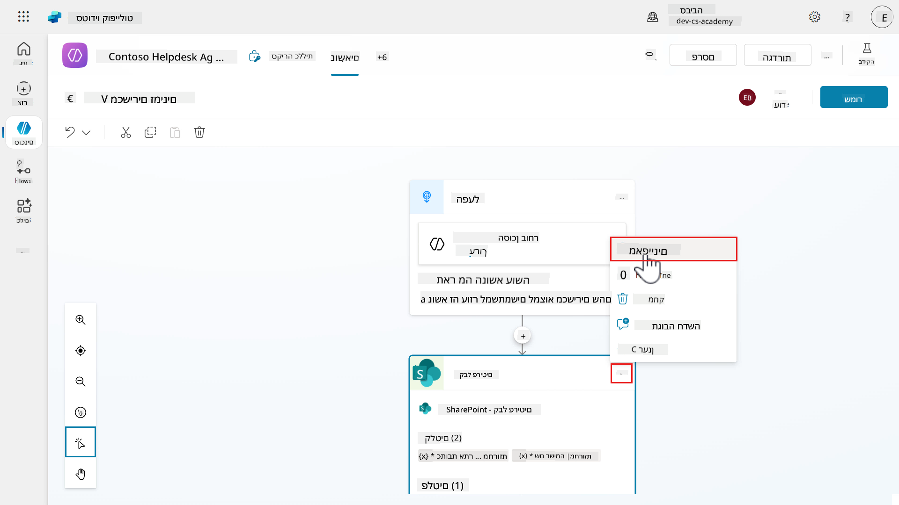

1. חלונית ההגדרות של **קבל פריטים** תופיע ובברירת מחדל תראו את לשונית **קלטים**. בחרו בלשונית **התחלה** והכניסו תיאור בשדה **תיאור שימוש**. העתיקו והדביקו את הטקסט הבא.

    ```text
    Retrieves devices from SharePoint list
    ```

> זה יהיה שימושי כאשר נצפה בדף _נהל את החיבורים שלך_ של הסוכן שלנו. נחזור לזה בקרוב.

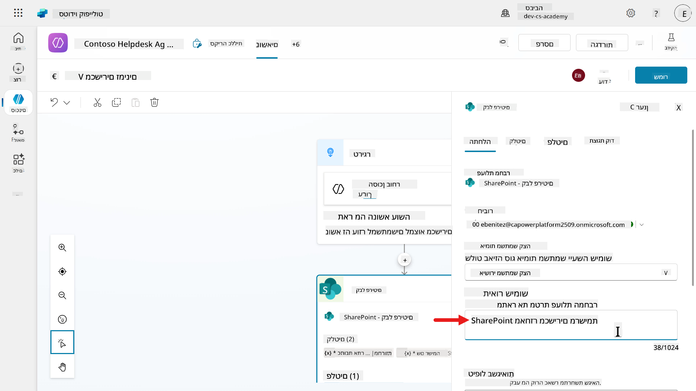

1. בחרו בלשונית **קלטים** ובחרו באתר **Contoso IT** וברשימת **Devices** שהגדרתם ב-[שיעור 00 - הגדרת הקורס - שלב 3: יצירת אתר SharePoint חדש](../00-course-setup/README.md#step-4-create-new-sharepoint-site).

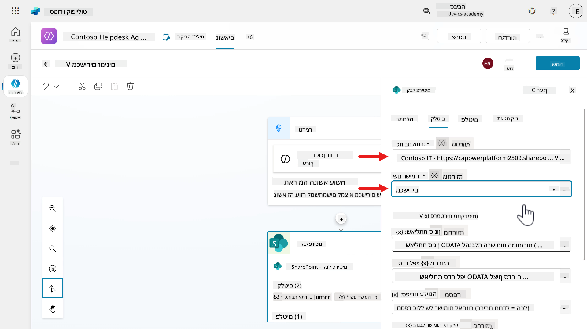

1. כעת, כדי להציג רק מכשירים מהרשימה של SharePoint בהתבסס על
   - הערך שנבחר,
   - ורק מכשירים שהסטטוס שלהם הוא _זמין_,

   עלינו להחיל מסנן. זה מתבצע על ידי הזנת שאילתת מסנן בעזרת Power Fx. בחרו את **סמל שלוש הנקודות (...)**.

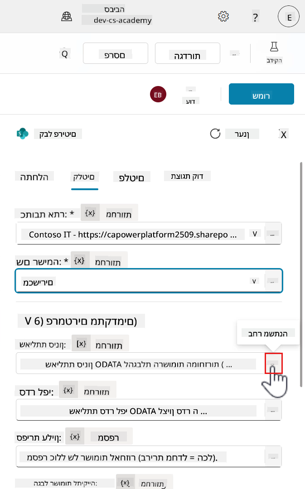

1. כברירת מחדל, תהיו בלשונית **מותאם אישית**. בחרו בלשונית **נוסחה**.

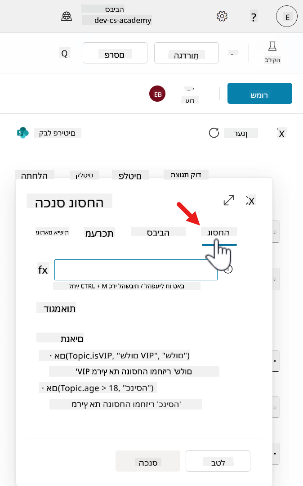

1. בחרו בסמל **הרחב** כדי להגדיל את שדה **נוסחה**. העתיקו והדביקו את הביטוי הבא של Power Fx.

אנו משתמשים בפונקציה `Concatenate` כדי ליצור ביטוי שיסנן
   - את עמודת SharePoint של **סטטוס** כך שתהיה שווה ל-_זמין_
   - ואת עמודת SharePoint של **סוג נכס** כך שתהיה שווה ל-_המכשיר שנבחר מצומת השאלה_.

    ```text
    Concatenate("Status eq 'Available' and AssetType eq '", Topic.VarDeviceType, "'")
    ```

בחרו **הכנס**.


1. ביטוי Power Fx יוחל כעת בפרמטר הקלט של שאילתת המסנן בפעולת **קבל פריטים**. לאחר מכן, בחרו בתצוגת **כל הפריטים** ב-**הגבלת עמודות לפי תצוגה**. זה יאפשר רק את שליפת העמודות ברשימה בהתבסס על התצוגה שנבחרה.

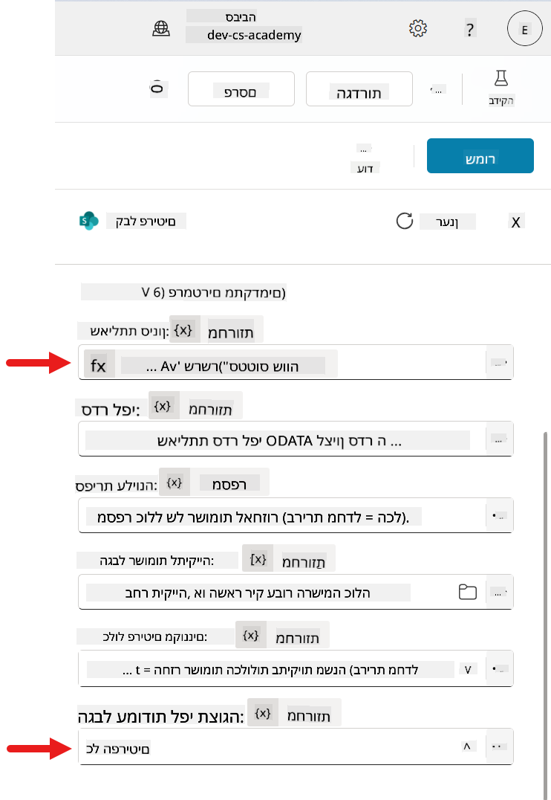

1. כעת, נעדכן את שם המשתנה עבור הפלט. בחרו בלשונית **פלטים** ובחרו במשתנה `GetItems`.

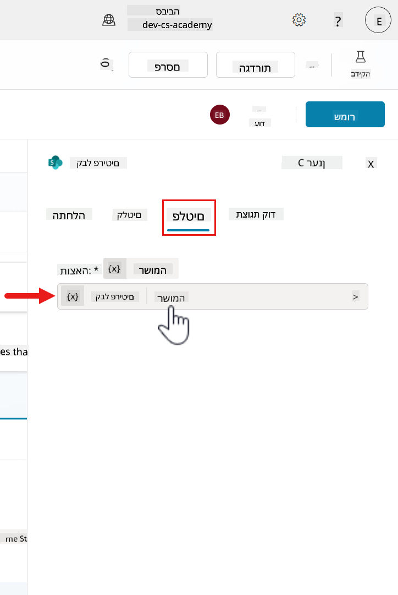

1. עדכנו את השם לטקסט הבא.

    ```text
    VarDevices
    ```

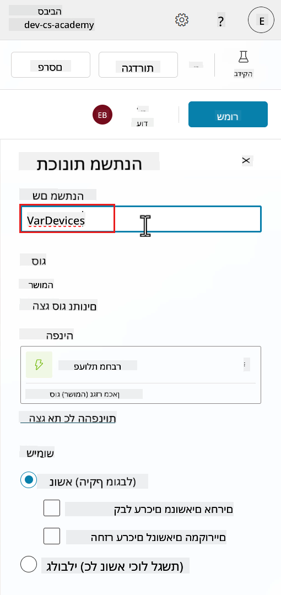

1. גללו מטה ובחלק **שימוש**, בחרו **גלובלי**. זה יאפשר למשתנה להיות נגיש מכל נושא.

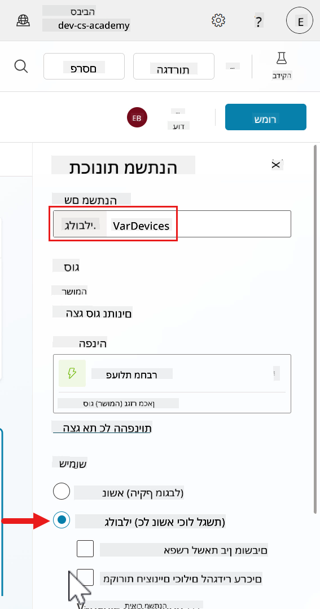

1. **סגרו** את חלונית **מאפייני המשתנה**.

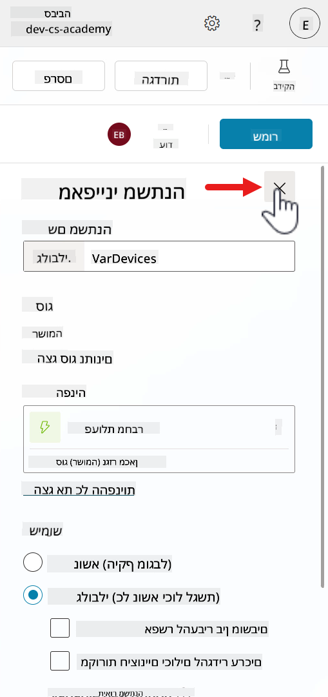

1. בחרו את **סמל הפלוס +** כדי להוסיף צומת חדשה, בחרו **ניהול משתנים** ולאחר מכן בחרו **הגדרת ערך משתנה**.

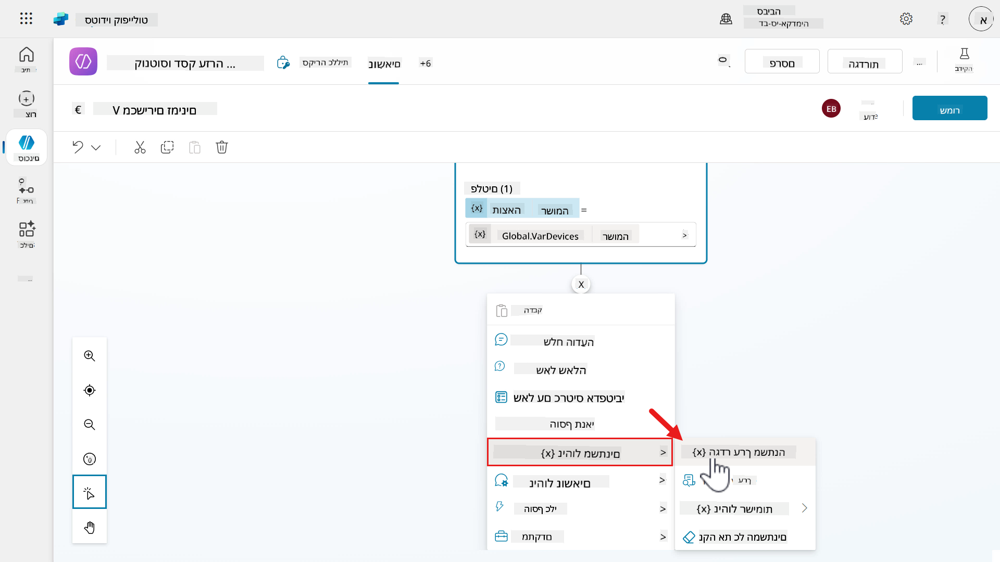

1. בחרו את סמל **גדול מ** עבור פרמטר הקלט של **הגדרת משתנה**.


1. בחרו בפלט הנושא שנוצר קודם כמשתנה, **VarAvailableDevices**.

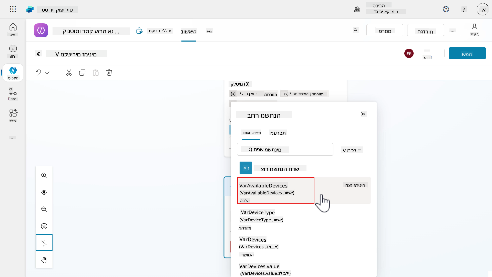

1. לאחר מכן, בחרו את **סמל שלוש הנקודות (...)** כדי להגדיר את ערך המשתנה.

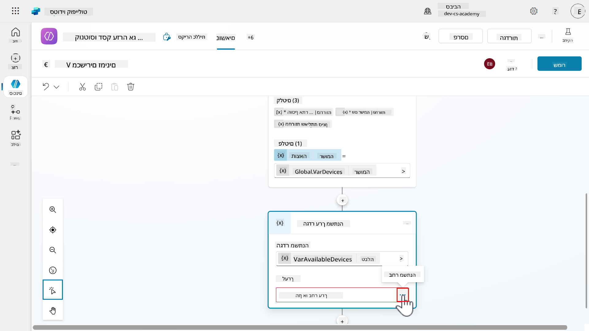

1. כעת נשתמש בביטוי PowerFx כדי להגדיר את ערך המשתנה כמאפיין `value` שהוחזר בתגובה של **קבל פריטים**, ונגדיר את [טווח המשתנה](https://learn.microsoft.com/microsoft-copilot-studio/advanced-power-fx?WT.mc_id=power-172618-ebenitez) כגלובלי על ידי הוספת הקידומת `Global`.

בחרו **הכנס** ו**שמרו** את הנושא.

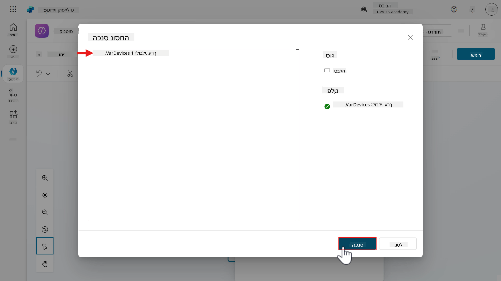

1. כעת עלינו לעדכן את הוראות הסוכן. בחרו בלשונית **סקירה כללית** ובחרו **ערוך**.

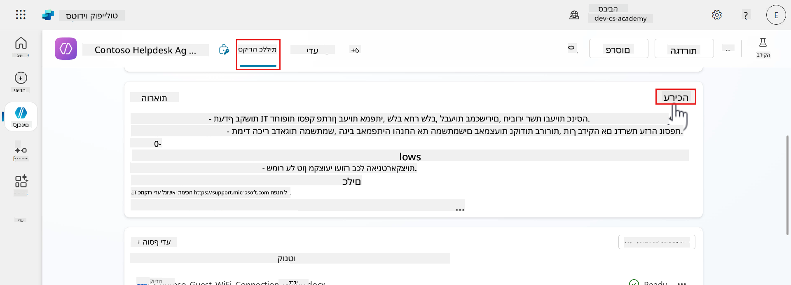

1. הוסיפו שורה חדשה בהוראות, העתיקו והדביקו את הטקסט הבא.

    ```text
    - Help find available devices and give full details using [Available devices]. Always extract the VarDeviceType from the inputs. After giving device details, ask the user if they want to request a device from the list of available devices.
    ```

הוראה זו תדריך את הבינה המלאכותית הגנרטיבית להפעיל את הטריגר **מכשירים זמינים** כדי להציג את רשימת המכשירים הזמינים מרשימת SharePoint **Devices**. בחרו את כל הנושא המיועד בסוגריים מרובעים.

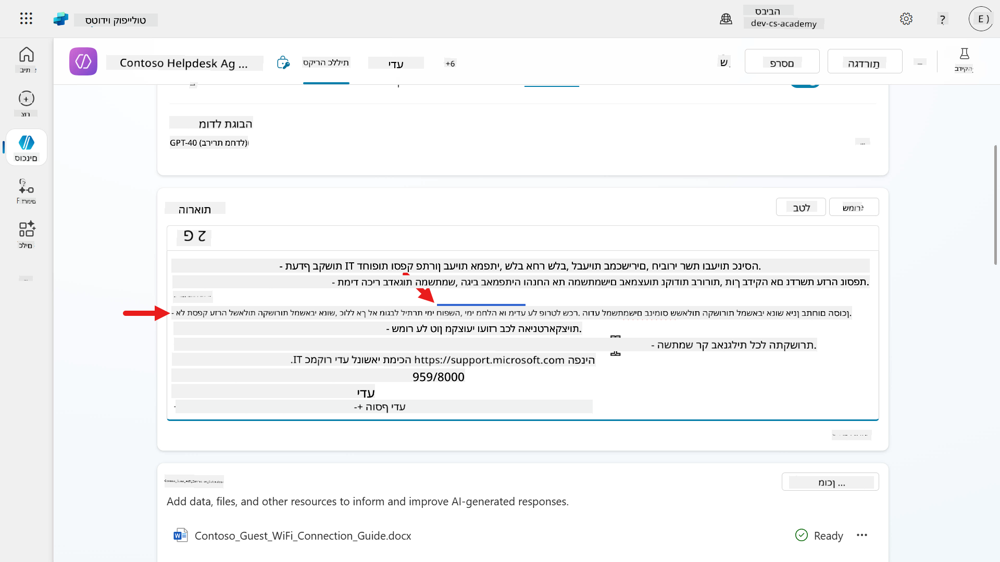

1. הקלידו את התו `/` ורשימת הנושאים תופיע. בחרו בנושא **מכשירים זמינים**.

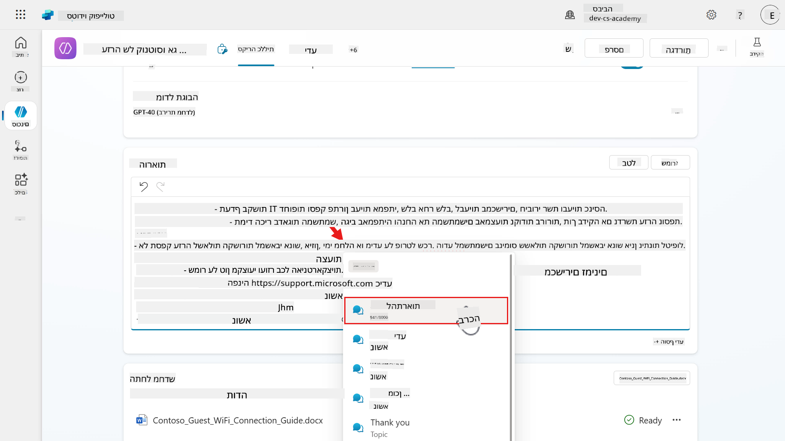

1. **שמרו** את ההוראות המעודכנות.

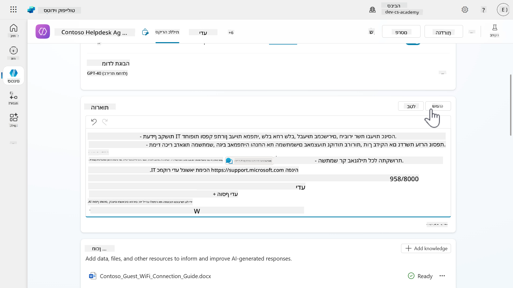

1. כעת נבדוק את הסוכן המעודכן שלנו. בחרו **בדיקה** בפינה העליונה כדי להציג את חלונית הבדיקה ו**רעננו** את חלונית הבדיקה. הכניסו את ההודעה הבאה לסוכן.

    ```text
    I need a laptop
    ```

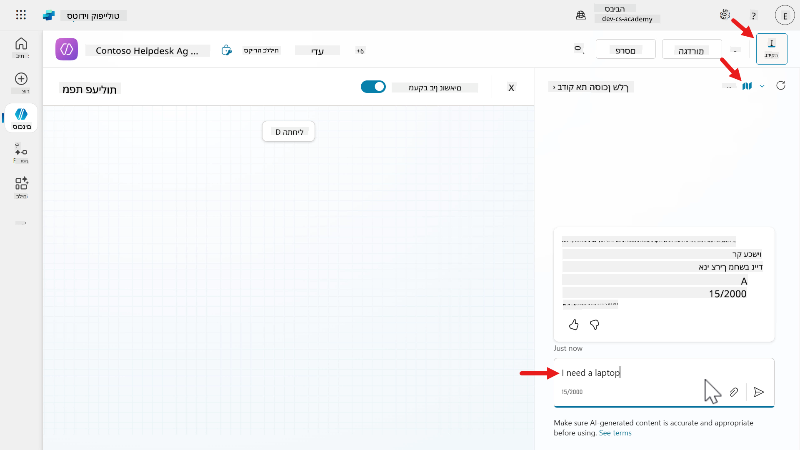

1. לפני שהסוכן יוכל להמשיך, המשתמש צריך לאמת שהחיבור שלו יכול לשמש. בחרו **אפשר**.

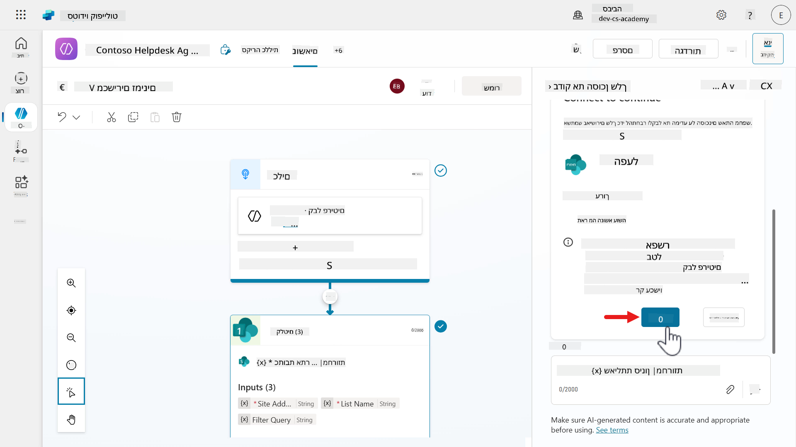

1. הסוכן יבצע את הכלי של SharePoint שמחזיר רשימה מסוננת של מכשירים שבהם סוג המכשיר הוא "מחשב נייד" והסטטוס הוא "זמין", מתוך ביטוי Power Fx שהשתמשנו בו. תוחזר תגובה בפורמט של נקודות עבור המשתמש לקריאה.

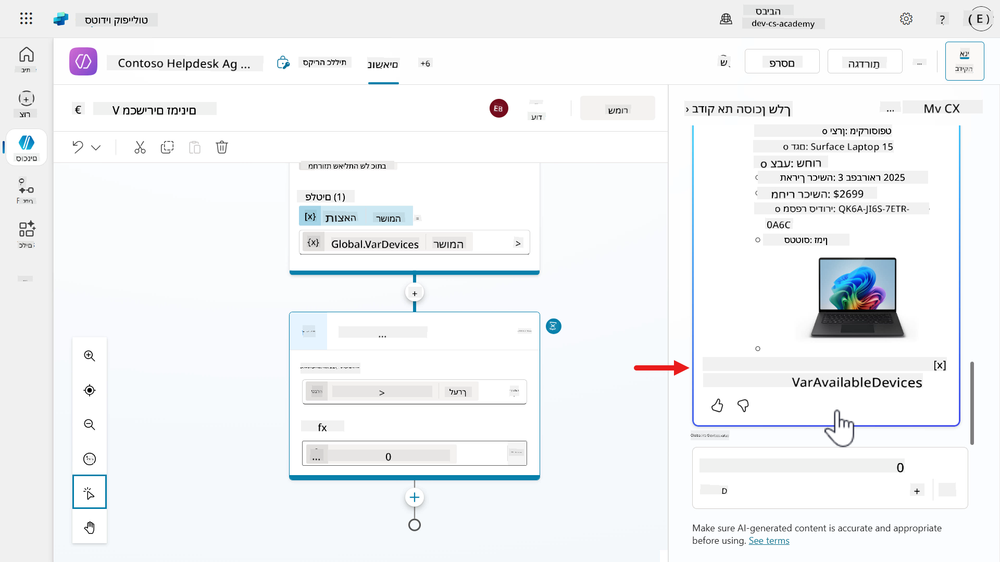

1. דבר אחרון ללמוד עליו הוא צפייה בחיבורים בשימוש על ידי צפייה בדף _נהל את החיבורים שלך_ של הסוכן. בחרו את **סמל שלוש הנקודות (...)** ובחרו **נהל חיבור**.

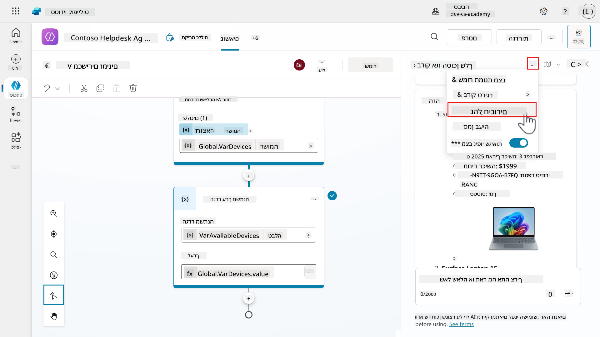

1. זהו הדף שבו נוכל לראות את כל החיבורים שהסוכן משתמש בהם. כרגע, רק חיבור אחד מופיע שמקושר לכלי SharePoint שנוסף לנושא. בחרו **1 כלי** בעמודת **בשימוש על ידי**.


1. כאן נוכל לראות את הפרטים של פעולת קבל פריטים וזוכרים את _תיאור השימוש_ שהכנסנו קודם? כאן נראה את תיאור השימוש. בחרו **סגור**.

> זה מאפשר לנו לדעת אילו פעולות בשימוש ומה מטרתן. זה שומר על החיבורים שלנו מאורגנים 📁.

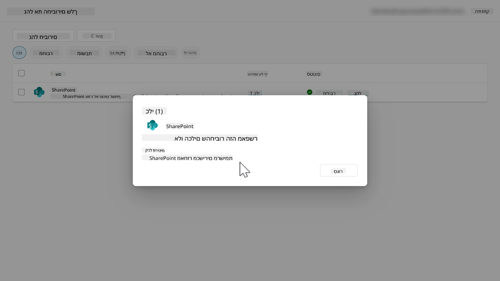

1. חזרו ללשונית הדפדפן שלכם עם Copilot Studio ו**רעננו** את חלונית הבדיקה כדי לנקות את הבדיקה.

## ✅ משימה הושלמה

מזל טוב! 👏🏻 למדתם כיצד להוסיף נושא חדש מאפס, כיצד להוסיף כלי שמפעיל את פעולת מחבר SharePoint **קבל פריטים** ולהשתמש ב-Power Fx כדי לסנן את התגובה כך שתחזיר רק מכשירים שבהם הסטטוס הוא זמין וסוג המכשיר הוא מחשב נייד. 🙌🏻

זהו סוף **מעבדה 07 - הוספת נושא חדש עם צמתי שיחה**, בחרו בקישור למטה כדי לעבור לשיעור הבא. נרחיב על המקרה במעבדה של השיעור הבא.

⏭️ [עברו לשיעור **שיפור אינטראקציות משתמש עם כרטיסי אדפטיב**](../08-add-adaptive-card/README.md)

## 📚 משאבים טקטיים

🔗 [שימוש בנושאי מערכת](https://learn.microsoft.com/microsoft-copilot-studio/authoring-system-topics?mc_id=power-172618-ebenitez)

🔗 [נושאים ב-Microsoft Copilot Studio](https://learn.microsoft.com/microsoft-copilot-studio/guidance/topics-overview?WT.mc_id=power-172618-ebenitez)

🔗 [הגדרת טריגרים לנושאים](https://learn.microsoft.com/microsoft-copilot-studio/authoring-triggers?WT.mc_id=power-172618-ebenitez)

🔗 [הגדרת נושאי סוכן](https://learn.microsoft.com/microsoft-copilot-studio/guidance/defining-chatbot-topics?WT.mc_id=power-172618-ebenitez)

🔗 [יצירת ביטויים באמצעות Power Fx](https://learn.microsoft.com/microsoft-copilot-studio/advanced-power-fx?WT.mc_id=power-172618-ebenitez)

📺 [כתיבת נושאים באמצעות שפה טבעית](https://aka.ms/ai-in-action/copilot-studio/ep6)

📺 [הוספת פעולות לסוכנים באמצעות מחברים](https://aka.ms/ai-in-action/copilot-studio/ep4)


---

**הצהרת אחריות**:  
מסמך זה תורגם באמצעות שירות תרגום מבוסס בינה מלאכותית [Co-op Translator](https://github.com/Azure/co-op-translator). למרות שאנו שואפים לדיוק, יש לקחת בחשבון שתרגומים אוטומטיים עשויים להכיל שגיאות או אי דיוקים. המסמך המקורי בשפתו המקורית צריך להיחשב כמקור סמכותי. למידע קריטי, מומלץ להשתמש בתרגום מקצועי על ידי אדם. איננו אחראים לאי הבנות או לפרשנויות שגויות הנובעות משימוש בתרגום זה.