<!--
CO_OP_TRANSLATOR_METADATA:
{
  "original_hash": "cc4afa4a5a11c9d03896decfbcbd4060",
  "translation_date": "2025-10-17T01:25:37+00:00",
  "source_file": "docs/recruit/09-add-an-agent-flow/README.md",
  "language_code": "he"
}
-->
# 🚨 משימה 09: הוספת זרימת סוכן לנושא שלך לצורך אוטומציה

## 🕵️‍♂️ שם קוד: `מבצע כוח אוטומציה`

> **⏱️ חלון זמן למבצע:** `~30 דקות`  

🎥 **צפו בהדרכה**

[](https://www.youtube.com/watch?v=vtLZJT3eBXg "צפו בהדרכה ביוטיוב")

## 🎯 תיאור המשימה

הסוכן שלך יכול כעת לשוחח עם משתמשים ולספק מידע, אך מצוינות תפעולית אמיתית דורשת מהסוכן שלך לנקוט פעולה. משימה זו תהפוך את הסוכן השיחתי שלך למרכז כוח אוטומציה על ידי ציידו בזרימות סוכן.

בסיום המשימה, תיצור אוטומציה מלאה לבקשת מכשירים שתקלוט נתוני משתמש באמצעות כרטיס אדפטיבי, תשלוף נתונים מ-SharePoint, תשלח התראות למנהלים באמצעות דוא"ל ותספק משוב חלק למשתמשים - הכל מנוהל על ידי הסוכן שלך באמצעות אוטומציה חכמה של זרימת עבודה.

## 🔎 מטרות

במשימה זו תלמד:

1. להבין מהן זרימות סוכן וכיצד הן שונות מזרימות ענן של Power Automate לצורך אוטומציה  
1. ללמוד את התכונות המרכזיות שהופכות את זרימות הסוכן לעוצמתיות, כולל פעולות AI וכתיבה בשפה טבעית  
1. לחקור את מעצב זרימת הסוכן וכיצד להשתמש בביטויים לטיפול דינמי בנתונים  
1. ליצור אוטומציה מלאה לבקשת מכשירים שמשלבת נתוני SharePoint והתראות דוא"ל  

## 🤔 מהי זרימת סוכן?

זרימות סוכן הן דרך עוצמתית לאוטומציה של משימות חוזרות ולחיבור האפליקציות והשירותים שלך. ניתן לחשוב עליהן כזרימות עבודה מובנות, שלב אחר שלב, שהסוכן שלך יכול לבצע כדי לאוטומט משימות או להתחבר לאפליקציות ושירותים אחרים. ניתן לראות אותן כזרימות קטנות שמסייעות לסוכן שלך לבצע דברים כמו לשלוח התראות, לעדכן רשומות או להגיב לאירועים.

בניגוד לסוכנים אוטונומיים שמשתמשים ב-AI כדי לקבל החלטות בזמן אמת, זרימות סוכן הן **זרימות עבודה דטרמיניסטיות** - כלומר הן פועלות באותו מסלול בכל פעם, ומבטיחות תוצאות עקביות ואמינות.

במילים פשוטות:

- הן עוזרות לסוכן שלך _לבצע דברים_, לא רק _לדבר_ עם משתמשים.  
- הן ניתנות לשימוש חוזר בנושאים וסוכנים שונים, וניתן להפעיל אותן באמצעות הודעות משתמש, אירועים או אפליקציות ושירותים אחרים.  

## 🙋🏽 כן, אבל איך זה שונה מזרימות ענן של Power Automate?

גם זרימות סוכן וגם זרימות ענן של Power Automate מסייעות באוטומציה של משימות. הן מיועדות למטרות שונות ופועלות בדרכים שונות.

### 🤖 זרימות סוכן ב-Copilot Studio

**למה הן מיועדות:**

- נבנו עבור סוכנים שיחתיים ואוטונומיים (באמצעות הוראות סוכן) ב-Copilot Studio.  
- מתמקדות באוטומציה חכמה מבוססת AI שמתקשרת עם מערכות עסקיות.  

**למה הן שימושיות:**

- קלות לבנייה ולניהול ישירות ב-Copilot Studio.  
- מצוינות לאוטומציה של משימות שמתרחשות _במהלך השיחה_ עם משתמשים, כמו הגשת בקשת חופשה.  
- אין צורך ברישיון Power Automate נפרד, החיוב מבוסס על שימוש בתוך Copilot Studio. זה יכול לחסוך זמן ועלויות לצוותים ארגוניים.  

**מגבלות:**

- לא ניתן לשתף אותן, להעתיק אותן או להקצות בעלים משותפים.  
- זרימות סוכן נראות וניתנות לשימוש רק בתוך Copilot Studio.  
- נכון לעכשיו, ניתן לערוך טריגרים לאירועים עבור סוכנים בפורטל יוצרי Power Automate.  

### ☁️ זרימות ענן של Power Automate

**למה הן מיועדות:**

- מיועדות לאוטומציה כללית בין אפליקציות ושירותים רבים.  
- יכולות לפעול באופן עצמאי או לעבוד לצד זרימות סוכן.  

**למה הן שימושיות:**

- מציעות מגוון רחב של מחברים.  
- אידיאליות לאוטומציה של תהליכים מחוץ לסוכנים.  
- ניתן לשתף, להשתמש מחדש ולנהל אותן בין צוותים.  

**דרישות:**

- יש צורך ברישיון Power Automate כדי להשתמש בהן.  

### 📗 סיכום

| השתמש בזה | כשאתה רוצה |
| :- | :- |
| זרימות סוכן | לאוטומט משימות בתוך סוכן, להשתמש ב-AI ולשמור הכל ב-Copilot Studio |  
| זרימות ענן של Power Automate | לאוטומט בין אפליקציות ושירותים, או לבנות זרימות עבודה מחוץ לסוכנים |

## 👍🏻 למה להשתמש בזרימות סוכן

זרימות סוכן תמיד פועלות במסלול קבוע - הן עושות את אותו הדבר בכל פעם שניתן להן אותו קלט.

זה הופך אותן ל:

- **אמינות** - אפשר לסמוך עליהן שיפעלו באותה דרך בכל פעם.  
- **צפויות** - אתה יודע איזה תוצאה לצפות כשהזרימה פועלת.  
- **מבוססות חוקים** - הן פועלות לפי שלבים שאתה מגדיר.  

יתרונות נוספים הם:

- **אוטומציה** - מאפשרות לסוכן שלך לטפל במשימות חוזרות כמו הגשת טפסים או שליחת התראות.  
- **מחוברות** - מתחברות ליותר מ-1400 מחברים כמו ServiceNow, SharePoint, Salesforce. אחרת, ניתן לבנות מחבר מותאם אישית.  
- **אינטגרציה הדוקה** - זרימות סוכן הן חלק מהלוגיקה של הסוכן, הן מופעלות ישירות על ידי הודעות משתמש או פעולות בשיחה.  
- **יכולת הרחבה** - ניתן להשתמש בזרימות מחדש בין סוכנים או תרחישים שונים.  
- **ללא קוד או עם מעט קוד** - ניתן לבנות זרימות באמצעות שפה טבעית או מעצב חזותי.  
- **פלטפורמה אחת** - ניתן לעצב, לבדוק ולהפעיל זרימות סוכן במקום אחד - Copilot Studio. אין צורך לעבור בין פלטפורמות.  

## 🏄🏻‍♂️ איך זרימות סוכן משפרות את הסוכן שלך?

זרימות סוכן מרחיבות את יכולות הסוכן שלך מעבר ל"שיחה" עם משתמשים. הן מאפשרות לו לנקוט פעולה ולהתחבר למערכות.

נניח שאתה עובד במחלקת כספים ומקבל הרבה חשבוניות מספקים. בדרך כלל, מישהו צריך לקרוא כל חשבונית, לשלוף את הפרטים החשובים - הסכום, התאריך, מי שלח אותה, ולבדוק אם הכל תואם לרשומות שלך. לאחר מכן לשלוח אותה לאדם הנכון לאישור. זה לוקח זמן ומאמץ.

עם זרימות סוכן ב-Copilot Studio, ניתן לאוטומט את התהליך הזה. ברגע שהחשבונית מגיעה, הסוכן:

1. קורא את המסמך באמצעות עיבוד מסמכים חכם כדי למצוא את המידע המרכזי.  
1. בודק את הפרטים מול נתוני הארגון שלך כדי לוודא שהכל נראה תקין.  
1. שולח אותה לאישור לאדם הנכון.  

זה חוסך זמן, מפחית טעויות ומקל על התהליך כולו.

### תחשוב על זה כך

- **סוכנים**: מקבלי ההחלטות החכמים  
- **זרימות סוכן**: המבצעים האמינים  

### למה זה חשוב

- אתה מקבל את הטוב משני העולמות: אוטומציה אמינה ו-AI גמיש.  
- קל לבנות ולעדכן זרימות ככל שצרכי העסק שלך משתנים.  
- ניתן להרחיב אוטומציה בין צוותים.  

## 🔌 תכונות מרכזיות שהופכות את זרימות הסוכן לעוצמתיות

1. **כתיבה בשפה טבעית**
    - ניתן לתאר מה אתה רוצה שהזרימה תעשה באנגלית פשוטה.  
    - Copilot מבין את הכוונה שלך ובונה את הזרימה עבורך.  
    - אין צורך לכתוב קוד - פשוט תסביר את הרעיון שלך.  

1. **פעולות AI**

    השתמש ב-AI כדי:

    - לקרוא ולהבין מסמכים או תמונות.  
    - לסכם תוכן ארוך לתשובות קצרות ושימושיות.  
    - להציע המלצות או החלטות חכמות.  

1. **פעולות גנרטיביות**
    - מאפשרות לזרימה להתאים את עצמה בזמן אמת.  
    - הסוכן יכול לתכנן ולהתאים שלבים על סמך מידע משתנה.  

1. **פעולות אינטגרציה**
    - חיבור הזרימה לכלים כמו Outlook, Microsoft Teams, ServiceNow, SharePoint ואפליקציות ושירותים אחרים, דרך יותר מ-1400 מחברים מובנים או מחבר מותאם אישית.  
    - זה עוזר לסוכן שלך לעבוד עם האפליקציות שהצוות שלך כבר משתמש בהן.  

1. **מעורבות אנושית**
    - הוסף שלבי אישור שבהם אדם צריך לבדוק או לאשר משהו.  
    - [אישורים מתקדמים](https://learn.microsoft.com/microsoft-copilot-studio/flows-advanced-approvals?WT.mc_id=power-172621-ebenitez) תומכים בתזכורות, האצלת סמכויות ואישורים רב-שלביים.  

## ⚙️ איך זה עובד

1. **טריגר**

    אירוע שמתחיל את הזרימה - כמו משתמש ששואל שאלה, הפעלת הזרימה מנושא, זמן מתוזמן או אירוע שמתרחש במערכת אחרת.  

1. **פעולות**

    אלו הם השלבים שהסוכן מבצע לאחר מכן - שליחת דוא"ל, קריאה ל-API, עדכון כרטיס ב-ServiceNow.  

## 🧶 איך ליצור זרימת סוכן

1. **שפה טבעית**: תאר מה אתה רוצה שהסוכן יעשה, ו-Copilot יבנה את זה עבורך.  
1. **קנבס מעצב**: גרור ושחרר פעולות, תנאים ולולאות במעצב זרימת הסוכן כדי לבנות את הזרימה שלך.  

## 🎨 מהו מעצב זרימת הסוכן?

זהו כלי חזותי ב-Copilot Studio שמסייע לך לבנות, לערוך ולנהל זרימות סוכן שמספקות הוראות שלב אחר שלב שהסוכן שלך מבצע כדי להשלים משימות. הוא תוכנן להיות פשוט לשימוש, גם אם אתה חדש בזרימות סוכן.

### תכונות מרכזיות של מעצב זרימת הסוכן

1. **קנבס חזותי**
    - ניתן לראות את כל הזרימה שלך פרוסה כמו דיאגרמה.  
    - קל להתקרב/להתרחק, להתאים את התצוגה או להשתמש במפת מינימפ כדי לנווט בזרימות גדולות.  

1. **הוספה והסרה של פעולות**
    - לחץ על _פלוס (+)_ כדי להוסיף פעולה חדשה כמו שליחת הודעה או עדכון פריט ברשימת SharePoint.  
    - ניתן לחפש פעולות ממחברים ולהגדיר אותן דרך ההגדרות שלהן.  
    - כדי להסיר פעולה, לחץ על _שלוש נקודות (⋮)_ ובחר _מחק_.  

1. **בדיקת פרמטרים**
    - לחץ על כל פעולה כדי לצפות או לערוך את ההגדרות שלה שנקראות _פרמטרים_.  
    - ניתן להזין ערכים ידנית או להשתמש ב-_ביטויים_ כדי להפוך אותם לדינמיים.  

1. **היסטוריית גרסאות**
    - בכל פעם שאתה שומר את הזרימה שלך, גרסה נרשמת.  
    - ניתן לחזור ולצפות או לשחזר גרסאות קודמות אם יש צורך.  

1. **בדיקת שגיאות**
    - _בודק הזרימה_ מדגיש כל שגיאה.  
    - כל השגיאות יצטרכו להיפתר לפני פרסום הזרימה שלך.  

1. **פרסום ובדיקה**
    - לאחר שהזרימה שלך נקייה משגיאות, פרסם אותה כדי להפוך אותה לפעילה.  
    - השתמש בתכונת _בדיקה_ כדי להפעיל את הזרימה שלך ידנית או אוטומטית ולבדוק אם היא פועלת כמצופה.  

### למה להשתמש במעצב זרימת הסוכן?

- **חזותי ואינטואיטיבי** - ניתן לבנות זרימות על ידי גרירה ולחיצה.  
- **בטוח להתנסות** - היסטוריית גרסאות מאפשרת לך לבטל שינויים.  
- **בדיקות מובנות** - מסייעות לוודא שהכל עובד לפני הפעלה.  

## 🔤 הזכרת _ביטויים_ - מה הם ביטויים?

ביטויים הם נוסחאות קטנות או פקודות שמסייעות לזרימת הסוכן לעבוד עם נתונים. משתמשים בהם כדי לחשב ערכים, לעצב טקסט, לקבל החלטות או לשלוף מידע ספציפי מקלטים.

### למה להשתמש בביטויים?

ביטויים מאפשרים לך:

- **להתאים אישית את הטיפול בנתונים** - לשלב שמות, לעצב תאריכים.  
- **לקבל החלטות** - אם ערך גדול מ-10, לעשות משהו.  
- **להמיר נתונים** - לשנות טקסט לאותיות קטנות, לשלוף חלק ממחרוזת.  
- **לאוטומט לוגיקה** - בלי לכתוב קוד מלא.  

### איך נראים ביטויים?

ביטויים משתמשים בפונקציות. אני הולך לשאול הסבר על מה הן פונקציות ממיקרוסופט MVP לשעבר, ג'רי וויינסטוק.

!!! ציטוט
    פונקציות הן לוגיקה מובנית שממירה את הנתונים שלך דרך פעולות פשוטות או מורכבות בביטוי שלך.

פונקציות מאפשרות לך לבנות ביטויים בלי שתצטרך לכתוב קוד.

הדרך שבה אני אוהב לתאר את זה היא שפונקציה בזרימות סוכן דומה לפונקציות ב-Excel. ניתן לבצע פעולה על נתונים כדי להמיר אותם לתוצאה הרצויה. כשאתה בונה את הנוסחה שלך ב-Excel אתה בוחר את ערך הקלט מהתאים בטבלה או טווח, ואז מיישם פונקציות כדי לעבד את תוצאת הנתונים. דוגמה היא שימוש בפונקציה `COUNT` כדי לחשב את מספר התאים שמכילים מספרים מטווח.

בזרימות סוכן, במקום להתייחס לנתונים מתאים בטבלה, אתה מתייחס לנתוני פלט מהטריגר או פעולות כשאתה בונה את הביטויים שלך. בהמשך לדוגמה הקודמת, השתמש בפונקציה `length` כדי לשלוף את מספר הפריטים שהוחזרו מפעולת מחבר SharePoint _קבל פריטים_.

### למה פונקציות חשובות?

שימוש בפונקציות הופך את זרימות הסוכן שלך ל:

- **חכמות** - הן יכולות להגיב לקלטים או תנאים שונים.  
- **גמישות** - ניתן להתאים אישית את הטיפול בנתונים.  
- **יעילות** - אתה נמנע מצעדים ידניים על ידי אוטומציה של לוגיקה.  

### פונקציות שימושיות ביותר

הבאות הן פונקציות נפוצות בשימוש בזרימות סוכן. לרשימה המלאה של פונקציות, גש למדריך [העזר](https://learn.microsoft.com/azure/logic-apps/workflow-definition-language-functions-reference?WT.mc_id=power-172621-ebenitez).

#### 🔡 טקסט

- `concat()` - מחבר שני חלקים או יותר של טקסט יחד.  
      - דוגמה: `concat('שלום ', firstName)` → “שלום יוסי”

- `toLower()` / `toUpper()` - משנה טקסט לאותיות קטנות או גדולות.  
      - שימושי לאחידות קלט.  

- `substring()` - שולף חלק ממחרוזת.  
      - דוגמה: קבל את שלוש האותיות הראשונות של שם.  

- `trim()` - מסיר רווחים מתחילת וסוף הטקסט.  

#### 🔢 מתמטיקה ומספרים

- `add()`, `sub()`, `mul()`, `div()` - פעולות מתמטיות בסיסיות.  
      - דוגמה: `add(5, 3)` - התוצאה היא 8  

#### 📅 תאריך ושעה

- `utcNow()` - מקבל את התאריך והשעה הנוכחיים ב-UTC.  
      - מצוין לחותמות זמן.  

- `addDays()`, `addHours()` - מוסיף זמן לתאריך.  
- דוגמה: `addDays(utcNow(), 7)` הפלט הוא 7 ימים מהיום.

- `formatDateTime()` - מעצב תאריך למחרוזת קריאה.
      - דוגמה: יום שני, 7 ביולי 2025

#### ✅ לוגי

- `if()` - מפעיל ערך אחד אם נכון, ערך אחר אם שגוי.
      - דוגמה: `if(score > 50, 'Pass', 'Fail')`

- `equals()` - בודק אם שני ערכים זהים.

- `and()`, `or()`, `not()` - משלב תנאים מרובים.

#### 🪣 פונקציות שימושיות נוספות

- `coalesce()` - מחזיר את הערך הראשון שאינו ריק.
      - שימושי לערכים חלופיים/ברירת מחדל.

- `guid()` - יוצר מזהה ייחודי.
      - שימושי למעקב או רישום.

- `length()` - סופר כמה תווים או פריטים יש במחרוזת או מערך.

## ⭐ שיטות עבודה מומלצות

להלן כמה שיטות עבודה מומלצות לבניית זרימות סוכנים ב-Copilot Studio.

1. **התחילו פשוט ובנו בהדרגה**

    - התחילו במשימה קטנה וברורה כמו שליחת הודעה.
    - הוסיפו שלבים נוספים לאחר בדיקת הבסיס של האוטומציה שלכם.

1. **השתמשו בשמות פעולות ברורים ותיאוריים**

    - תייגו כל שלב בצורה ברורה כך שאתם והצוות שלכם תבינו מה הוא עושה.
    - דוגמה: במקום השם ברירת המחדל "עדכון פריט" לפעולת מחבר SharePoint, שנו אותו למה שהוא מעדכן, כמו "עדכון מצב מכשיר".

1. **בדקו שגיאות לפני פרסום**

    - השתמשו ב-**flow checker** כדי למצוא ולתקן בעיות.
    - לא ניתן לפרסם זרימות אם יש שגיאות, לכן נסו לפתור אותן כשהן מתרחשות.

1. **בדקו את הזרימה שלכם ביסודיות**

    - רק בגלל שהיא נשמרת ומתפרסמת, לא אומר שהיא עובדת כמצופה.
    - השתמשו בתכונת _Test_ כדי להפעיל את הזרימה שלכם ידנית או אוטומטית, ובדקו את התוצאות.

1. **השתמשו בהיסטוריית גרסאות**

    - שמרו את הזרימה שלכם לעיתים קרובות כדי שתוכלו לחזור לגרסאות קודמות אם יש צורך.
    - ניתן לצפות ולשחזר גרסאות קודמות באמצעות לוח _Version History_.

1. **השתמשו בפרמטרים ובביטויים בחוכמה**

    - בעת הגדרת פעולות, השתמשו בפרמטרים כדי להפוך את הזרימה שלכם לדינמית.
    - ניתן להזין ערכים ידנית או להשתמש בביטויים כדי לחשב אותם, או לשלב אותם עם ערכים מפעולות קודמות באמצעות בוחר _dynamic content_.

1. **מחקו פעולות שאינן בשימוש**

    - אם הוספתם פעולה והחלטתם מאוחר יותר שאינכם זקוקים לה, הסירו אותה כדי לשמור על זרימה נקייה.

## 🧪 מעבדה 09 - הוספת זרימת סוכן לאוטומציה ושיפור יכולות נושא

עכשיו נלמד כיצד לשפר את הנושא שלנו עם כרטיסים אדפטיביים ושימוש בפונקציונליות מתקדמת של נושאים וצמתים.

- [9.1 יצירת זרימת סוכן](../../../../../docs/recruit/09-add-an-agent-flow)
- [9.2 הוספת זרימת סוכן לנושא](../../../../../docs/recruit/09-add-an-agent-flow)
- [9.3 עדכון נושא בקשת מכשיר עם מספר צמתים לחוויית משתמש טובה יותר](../../../../../docs/recruit/09-add-an-agent-flow)
- [9.4 בדיקת סוכן באמצעות מספר תרחישים](../../../../../docs/recruit/09-add-an-agent-flow)

### ✨ מקרה שימוש

**כ** מנהל של עובד

**אני רוצה** לקבל בקשות למכשירים

**כדי ש** אוכל לבדוק את המכשיר המבוקש על ידי העובד.

בואו נתחיל!

### דרישות מוקדמות

1. **רשימת SharePoint**

    נשתמש ברשימת **Devices** של SharePoint מ-[שיעור 00 - הגדרת הקורס - שלב 3: יצירת אתר SharePoint חדש](../00-course-setup/README.md#step-4-create-new-sharepoint-site).

    אם לא הגדרתם את רשימת **Devices** של SharePoint, חזרו ל-[שיעור 00 - הגדרת הקורס - שלב 3: יצירת אתר SharePoint חדש](../00-course-setup/README.md#step-4-create-new-sharepoint-site).

1. **סוכן Helpdesk של Contoso**

    נשתמש באותו סוכן שנוצר קודם ב-[שיעור 06 - יצירת סוכן מותאם אישית באמצעות שפה טבעית עם Copilot והצמדתו לנתונים שלכם](../06-create-agent-from-conversation/README.md).

### 9.1 יצירת זרימת סוכן

בתרגיל זה, ניצור זרימת סוכן שמחזירה את פריט SharePoint של המכשיר הנבחר ושולחת דוא"ל למנהל עם פרטי המכשיר.

1. בנושא **בקשת מכשיר**, גללו מטה לצומת **שאל עם כרטיס אדפטיבי** והוסיפו צומת חדש. בחרו **הוספת כלי** ובכרטיסיית **כלים בסיסיים** של חלונית הפופ-אפ, בחרו **זרימת סוכן חדשה**.

    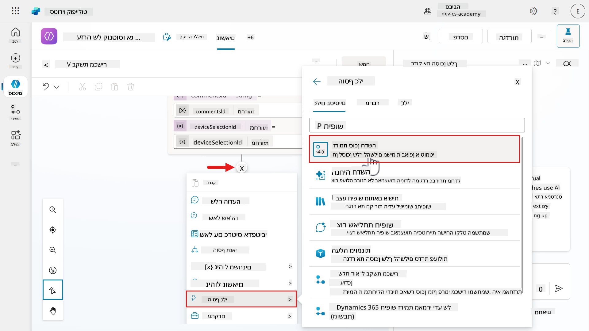

1. מעצב זרימות הסוכן ייטען עם טריגר ופעולה.

    - **טריגר** - כאשר סוכן מפעיל את הזרימה
        - זה יפעיל זרימה מסוכן Copilot Studio.

    - **פעולה** - תגובה לסוכן
        - זה שולח תגובה שיכולה להכיל ערכי פלט חזרה לסוכן Copilot Studio.

    בחרו את הטריגר.

    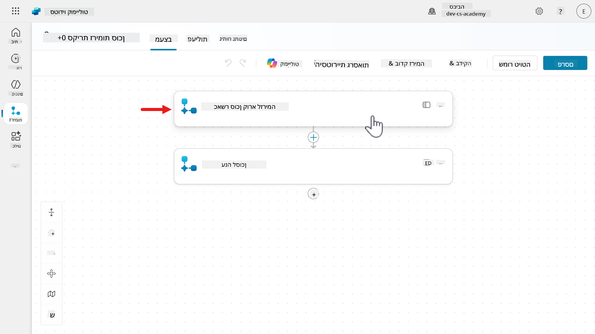

1. כעת נוסיף מספר קלטים לזרימת הסוכן.

    - `DeviceSharePointId` - זה ישמור את הערך, מזהה, של פריט SharePoint. ערך מזהה זה הוא פלט מצומת שאל עם כרטיס אדפטיבי שבו המשתמש בחר את המכשיר.

    - `User` - זה יהיה שם המשתמש שיגיע ממשתנה מערכת של הסוכן.

    - `AdditionalComments` - זה יהיה ההערה שהוזנה על ידי המשתמש, שהיא פלט מצומת שאל עם כרטיס אדפטיבי.

    קודם נוסיף את `DeviceSharePointId` כקלט לטריגר שלנו. בחרו **+ הוספת קלט**.

    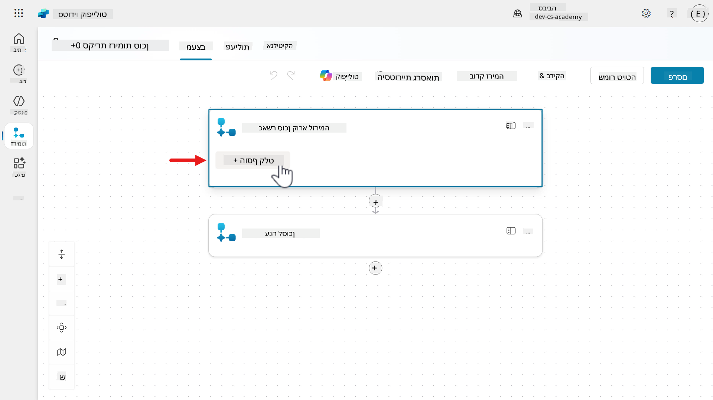

1. עבור סוג קלט המשתמש, בחרו **טקסט**.

    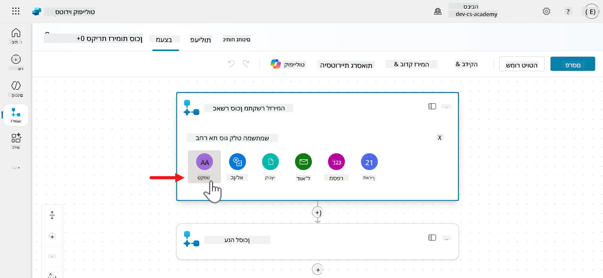

1. עבור שם הקלט, הזינו את הבא.

    ```text
    DeviceSharePointId
    ```

    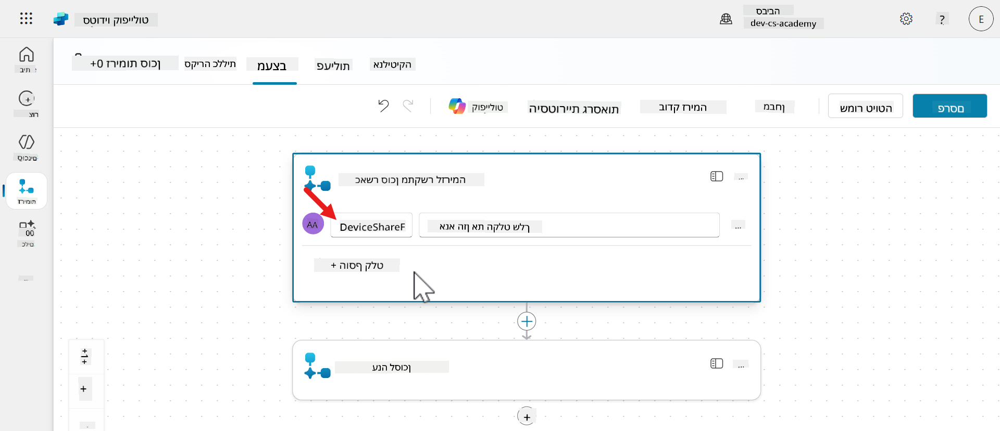

1. כעת נוסיף את הקלט השני, `User`. חזרו על אותם שלבים, בחרו **+ הוספת קלט** ובחרו **טקסט**.

    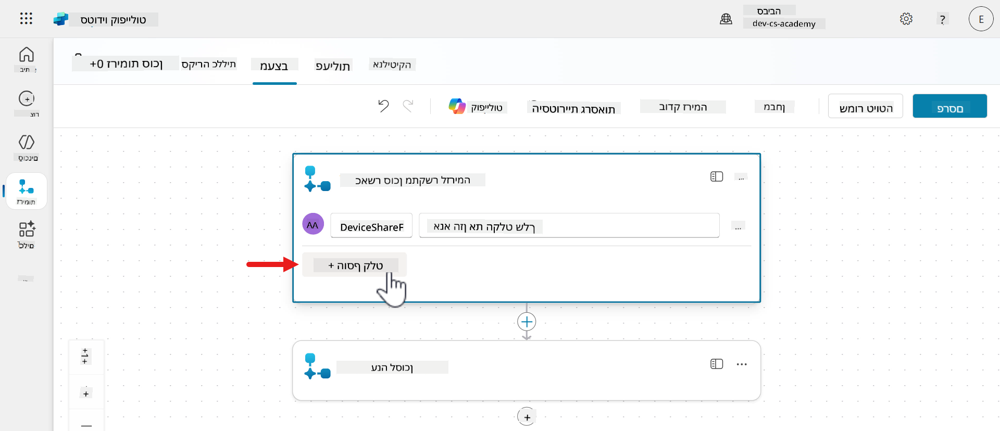

1. עבור שם הקלט, הזינו את הבא.

    ```text
    User
    ```

    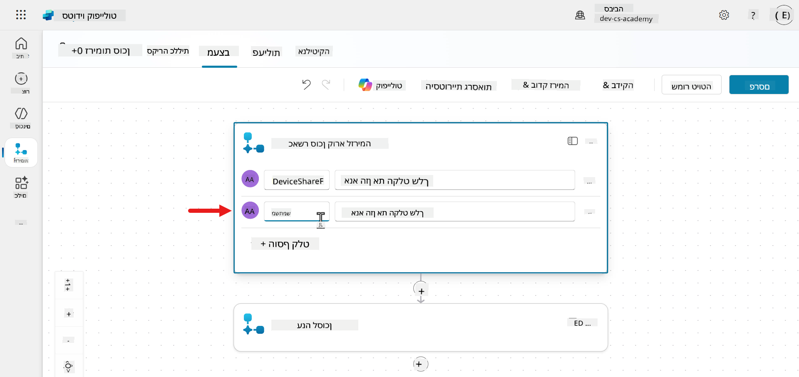

1. כעת נוסיף את הקלט השלישי, `AdditionalComments`. חזרו על אותם שלבים, בחרו **+ הוספת קלט** ובחרו **טקסט**.

    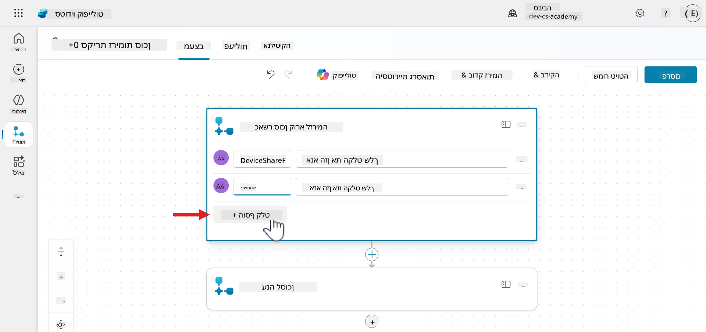

1. עבור שם הקלט, הזינו את הבא.

    ```text
    AdditionalComments
    ```

    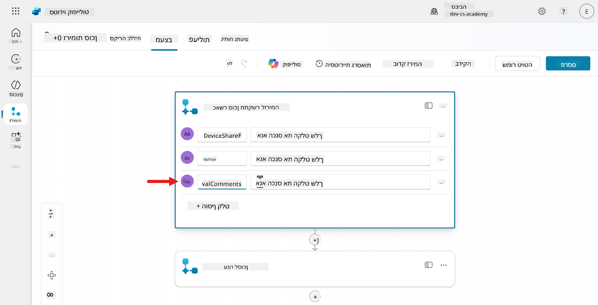

1. עבור קלט `AdditionalComments`, נעדכן אותו כדי להפוך אותו לאופציונלי. בחרו באייקון **שלוש הנקודות (...)** ובחרו **הפוך את השדה לאופציונלי**.

    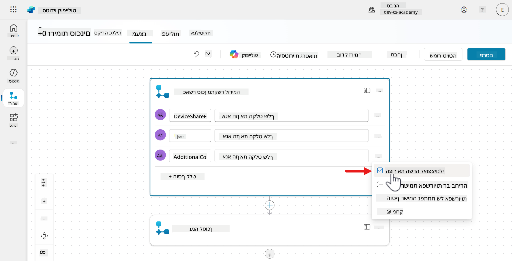

1. עבודה מצוינת! הטריגר הוגדר כעת, בואו נמשיך. בחרו באייקון **פלוס +** מתחת לטריגר כדי להוסיף פעולה חדשה.

    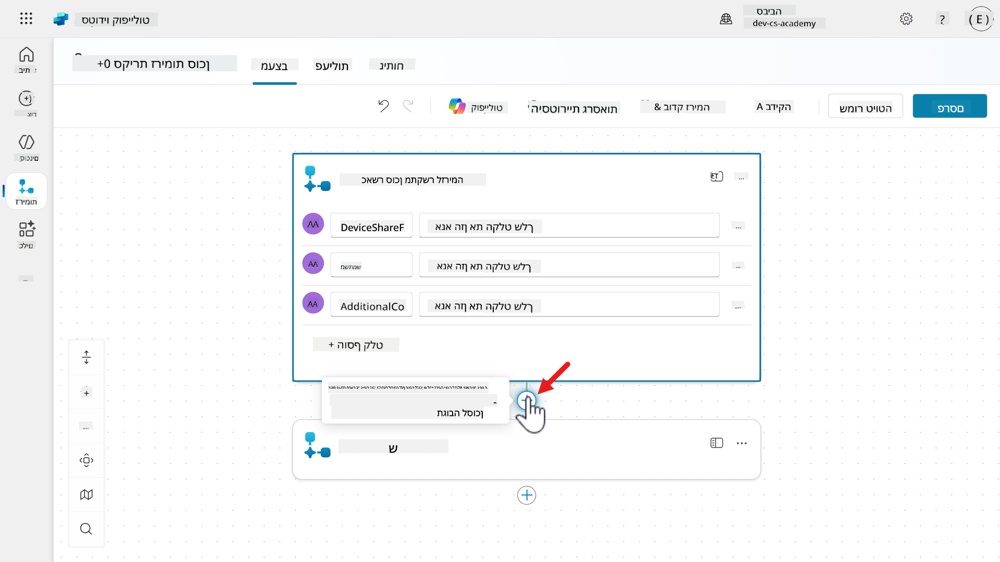

1. תופיע **חלונית הפעולות** שבה תוכלו לצפות בפעולות מ-1400+ מחברים מובנים לשירותי Microsoft וצד שלישי. בשדה **חיפוש** הזינו את הבא,

    ```text
    Get item
    ```

    רשימת פעולות תוצג בתוצאות החיפוש. בחרו את הפעולה **קבלת פריט** ממחבר **SharePoint**.

    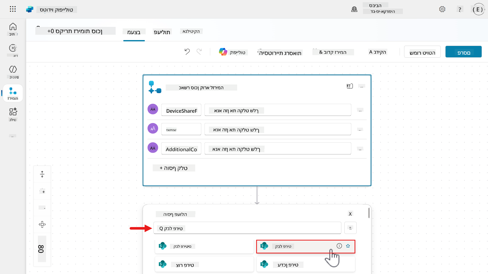

1. כעת נתחיל להגדיר את פעולת **קבלת פריט**.

    בחרו באייקון **שלוש הנקודות (...)** בפעולת **קבלת פריט**.

    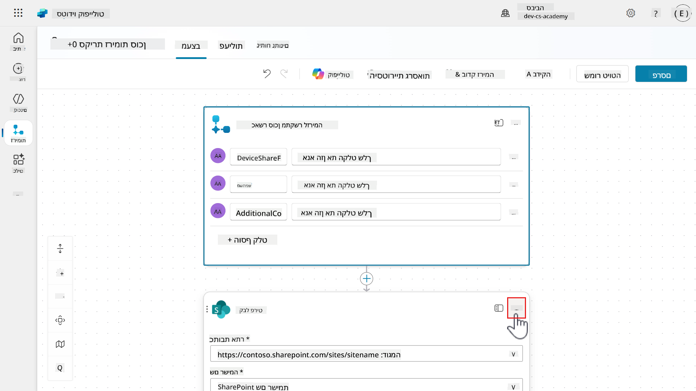

1. בחרו **שנה שם**.

    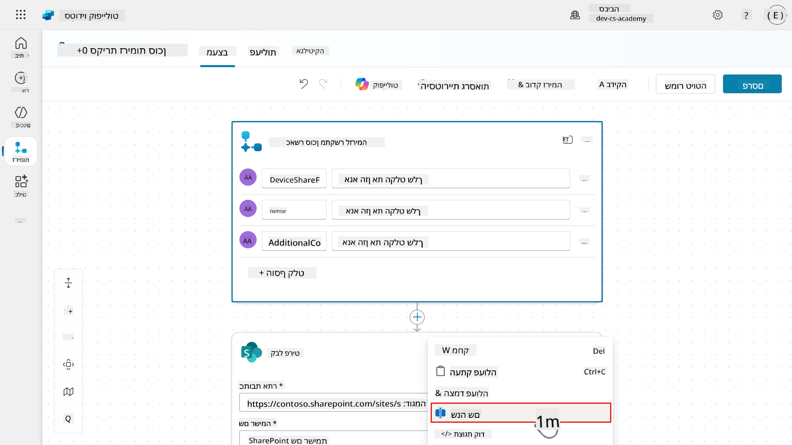

1. שנו את שם הפעולה ל-

    ```text
    Get Device
    ```

    

1. בשדה **כתובת האתר**, בחרו את **כתובת האתר** של אתר SharePoint של Contoso IT שנוצר ב-[שיעור 00 - הגדרת הקורס - שלב 3: יצירת אתר SharePoint חדש](../00-course-setup/README.md#step-4-create-new-sharepoint-site).

    בשדה **שם הרשימה**, בחרו את רשימת **Devices** של SharePoint.

    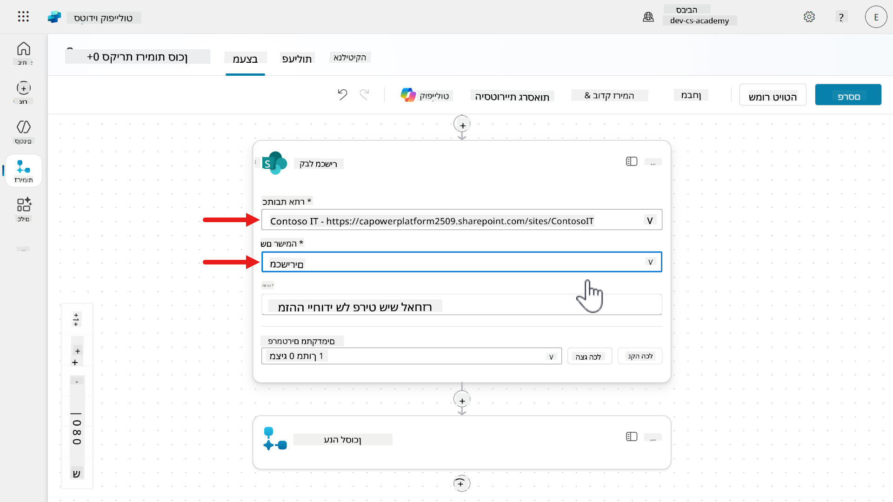

1. בשדה **מזהה**, בחרו באייקון **ברק** או **fx** בצד ימין.

    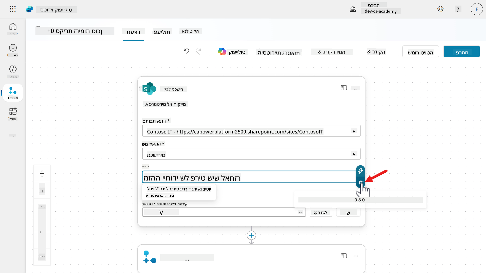

1. בכרטיסיית **תוכן דינמי** של חלונית הפופ-אפ, הזינו את הבא,

    ```text
    sharepoint
    ```

    תוצאות החיפוש יציגו פרמטרי קלט התואמים לערך שחיפשתם. בחרו בפרמטר **DeviceSharePointId** מהטריגר.

    לאחר מכן, בחרו **הוסף** כדי להוסיף את קלט התוכן הדינמי לשדה **מזהה** של הפעולה.

    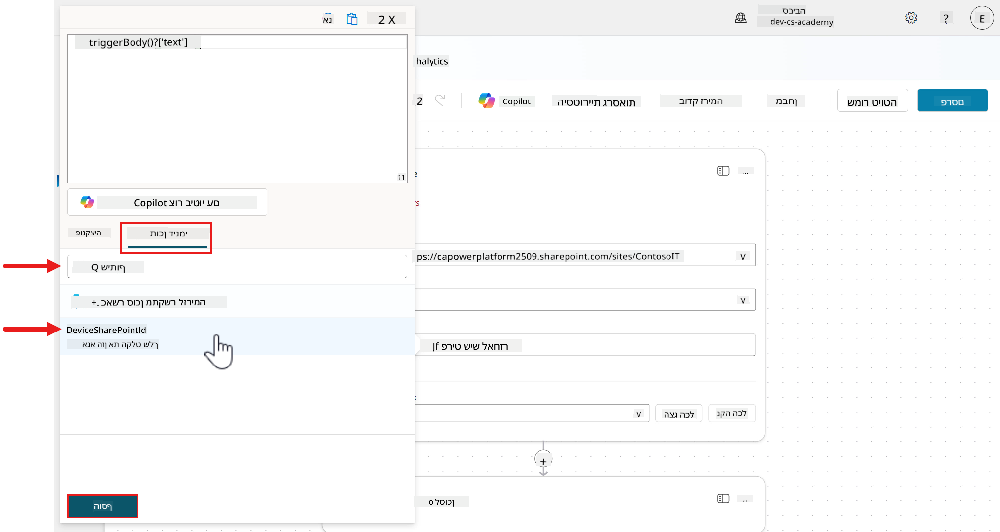

1. קלט התוכן הדינמי מהטריגר כעת מופנה לשדה **מזהה** של הפעולה. נעדכן את אחד הפרמטרים המתקדמים הבא. בחרו **הצג הכל** כדי לצפות בפרמטרים המתקדמים.

    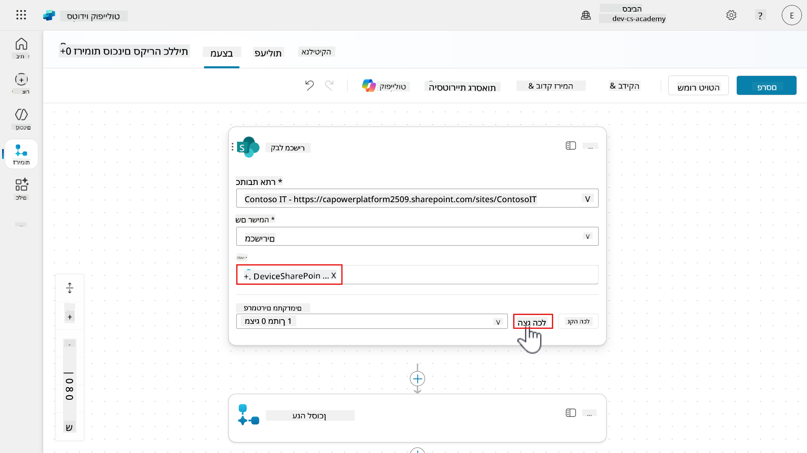

1. פרמטר **הגבלת עמודות לפי תצוגה** יוצג ובברירת מחדל הוא מוגדר ל-**השתמש בכל העמודות (אל תגבילו)**. נעדכן ערך זה לתצוגה כדי להגביל את העמודות המוחזרות בתגובת הפעולה. בחרו בפרמטר **הגבלת עמודות לפי תצוגה** כדי לצפות ברשימת התצוגות.

    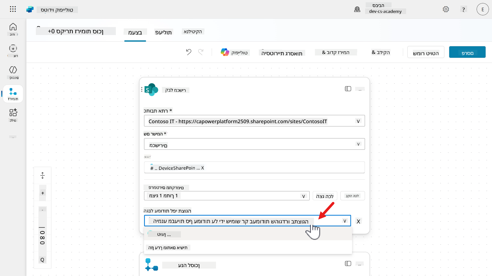

1. בחרו בתצוגת **כל הפריטים**.

    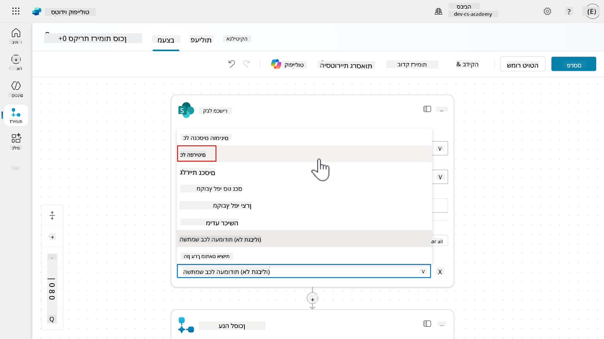

1. בחרו באייקון **פלוס +** מתחת לפעולת _קבלת מכשיר_ כדי להוסיף פעולה חדשה.

    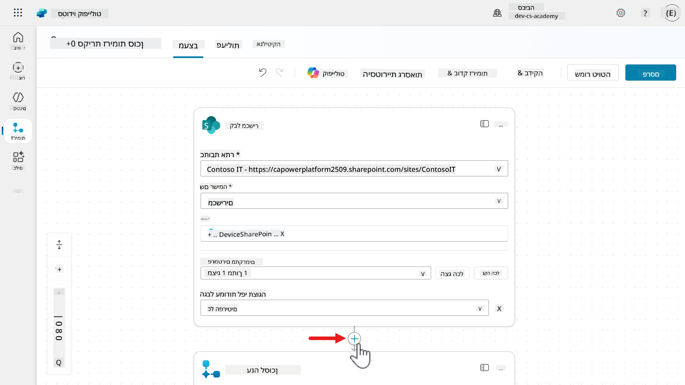

1. בשדה החיפוש הזינו את הבא,

    ```text
    send an email
    ```

    רשימת פעולות תוצג בתוצאות החיפוש. בחרו את הפעולה **שלח דוא"ל (V2)** ממחבר **Office 365 Outlook**.

    

1. לאחר מכן נצטרך ליצור חיבור לפעולת המחבר. בחרו **התחבר**.

    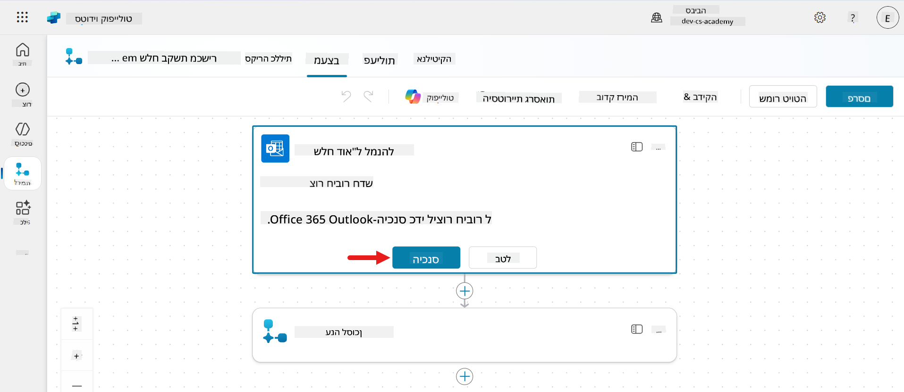

1. בחרו את חשבון המשתמש המחובר שלכם.

    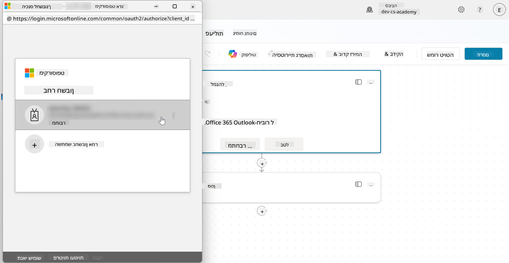

1. בחרו **אפשר גישה**. חיבור נוצר כעת.

    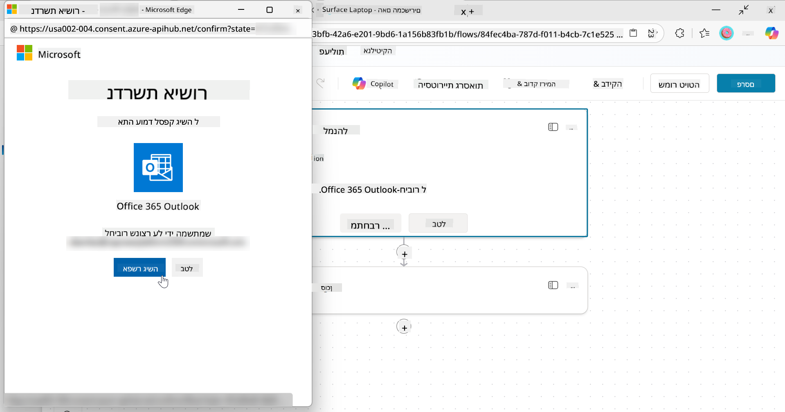

1. שנו את שם הפעולה ל-

    ```text
    Send an email to manager
    ```

    לאחר מכן נגדיר את פרמטרי הקלט של הפעולה שלנו.

    עבור פרמטר הקלט **אל**, בחרו את עצמכם. בדרך כלל זה יהיה המנהל שלכם או שנשתמש בפעולה אחרת שמושכת את המנהל שלכם על בסיס פרופיל Entra ID שלכם, אך לצורך השיעור הזה, בחרו את עצמכם.

    עבור פרמטר הקלט **נושא**, הזינו את הבא,

    ```text
    Request type: new device
    ```

    עבור פרמטר הקלט **גוף**, הזינו את הבא,

    ```text
    Hi,

    New device requested from

    Manufacturer:
    Model:
    Link to item in SharePoint
    Additional comments from:

    This is an automated email from Contoso Helpdesk Copilot
    ```

    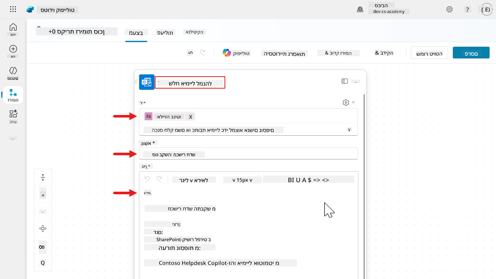

1. לאחר מכן, נעדכן את פרמטר הקלט **גוף** עם הפניות לקלט תוכן דינמי מה-**טריגר** או פעולת **קבלת פריט**. הזינו רווח לאחר השורה השנייה כדי שנוכל להוסיף את שם המשתמש מקלט הטריגר, **User**.

    בחרו באייקון **ברק** או **fx** בצד ימין.

    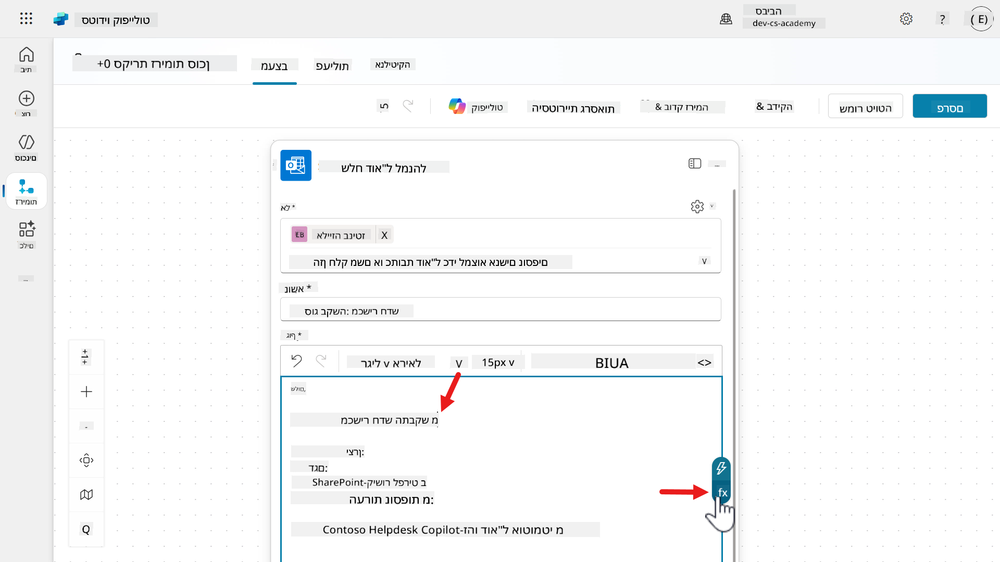

1. בכרטיסיית **תוכן דינמי** של חלונית הפופ-אפ, בחרו בקלט **User** מהטריגר.

    בחרו **הוסף** כדי להוסיף את קלט התוכן הדינמי **User** לפרמטר **גוף** של הפעולה.

    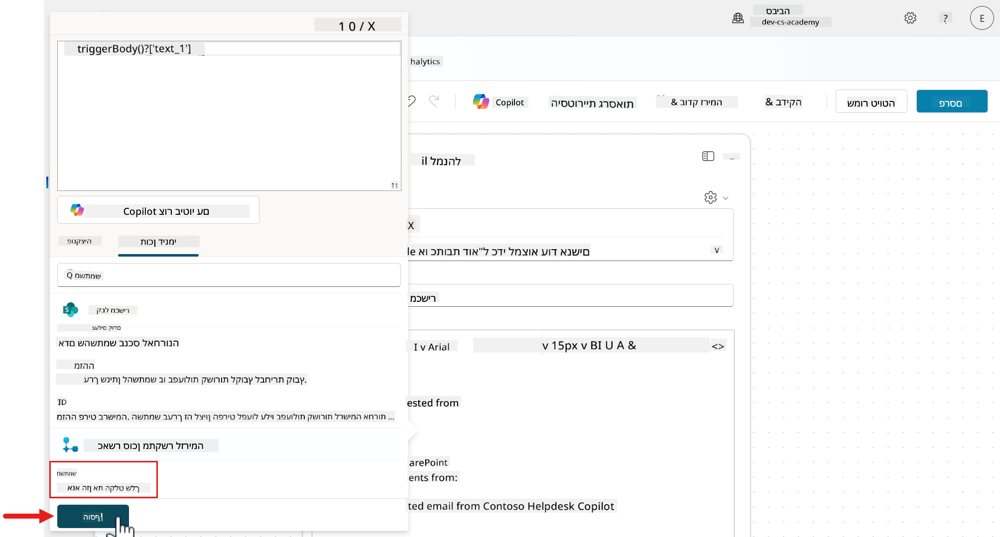
1. תוכן דינמי מהטריגר עכשיו מתייחס לפרמטר **Body** בפעולה. נחזור על אותו תהליך עבור השורות הנותרות בגוף הודעת האימייל.

    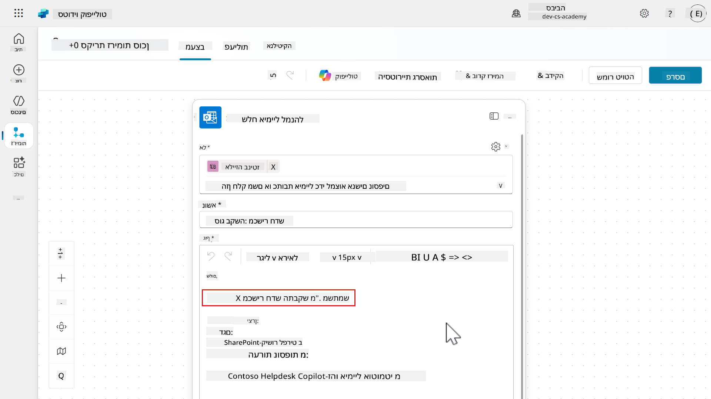

1. לחצו על החלל ליד `Manufacturer:`. בחרו את **אייקון הברק** או **אייקון fx** בצד ימין.

    בלשונית **תוכן דינמי** בלוח הצד, הזינו את הטקסט הבא בשדה החיפוש,

    ```text
    manufacturer
    ```

    בחרו את קלט **Manufacturer value** מהטריגר ולחצו על **Add**.

    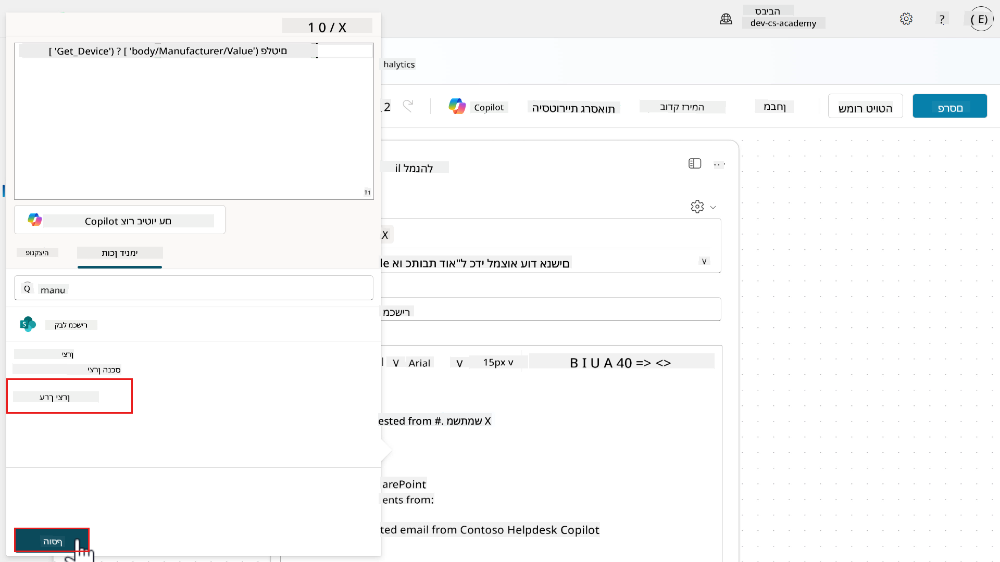

1. לחצו על החלל ליד `Model:`. בחרו את **אייקון הברק** או **אייקון fx** בצד ימין.

    בלשונית **תוכן דינמי** בלוח הצד, הזינו את הטקסט הבא בשדה החיפוש,

    ```text
    model
    ```

    בחרו את קלט **Model** מפעולת **Get item** ולחצו על **Add**.

    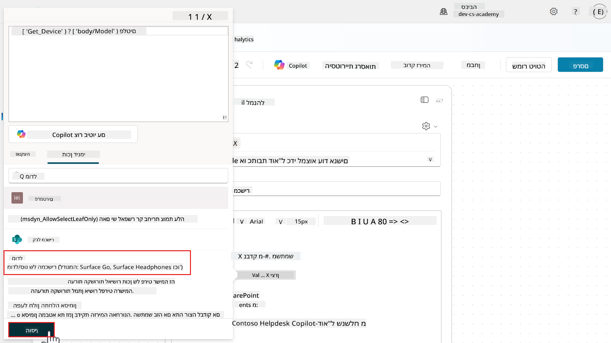

1. עבור הטקסט `Link to item in SharePoint`, נעדכן אותו כך שיהיה קישור בגוף הודעת האימייל. לחצו בתחילת השורה ובחרו את **אייקון הברק** או **אייקון fx** בצד ימין.

    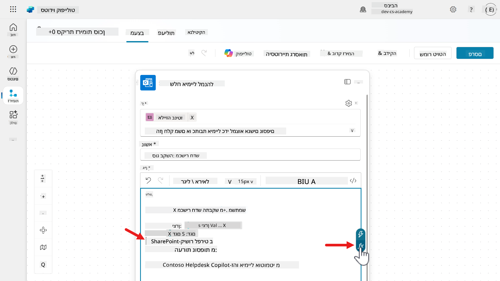

1. לחצו אחרי תגית ה-HTML של העוגן ובחרו את **אייקון הברק** או **אייקון fx** בצד ימין.

    בלשונית **תוכן דינמי** בלוח הצד, הזינו את הטקסט הבא בשדה החיפוש,

    ```text
    link to item
    ```

    בחרו את קלט **Link to item** מפעולת **Get item** ולחצו על **Add**.

    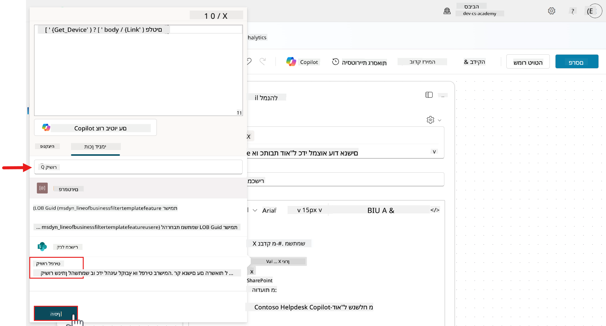

1. יש לעבור לעורך ה-HTML על ידי בחירת אייקון **&lt;/&gt;**.

    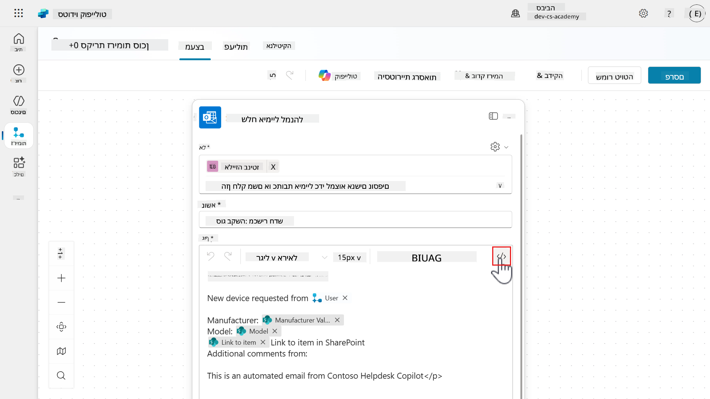

1. עורך ה-HTML עכשיו מופעל. לחצו לפני הטקסט `Link to item in SharePoint`, הוסיפו תגית עוגן HTML ליצירת קישור. העתיקו והדביקו את הטקסט הבא.

    ```text
    <a href="
    ```

    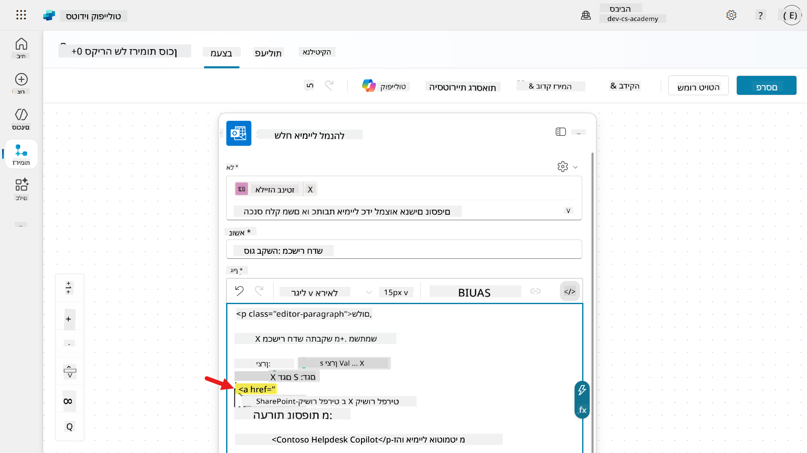

1. קלט התוכן הדינמי של **Link to item** עכשיו מתייחס לפרמטר **Body**. לחצו אחרי קלט **Link to item**, העתיקו והדביקו את הטקסט הבא.

    ```text
    ">
    ```

    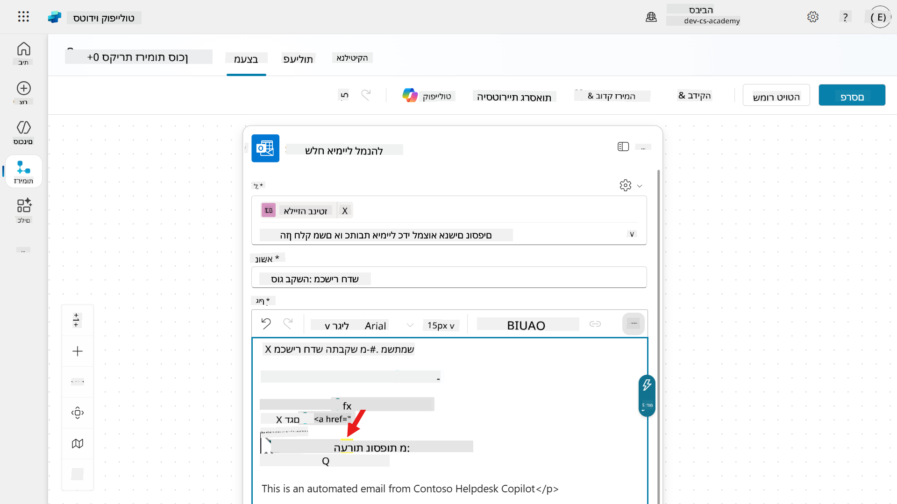

1. לחצו אחרי הטקסט `Link to item in SharePoint`, סגרו את תגית העוגן של ה-HTML. העתיקו והדביקו את הטקסט הבא.

    ```text
    </a>
    ```

    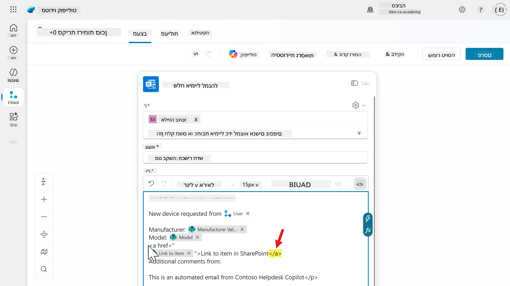

1. בחרו את אייקון **&lt;/&gt;** כדי לעבור לתצוגת קוד.

    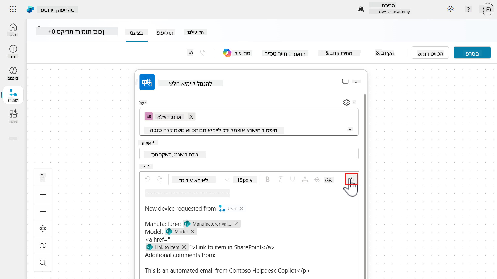

1. לאחר מכן, בחרו שוב את אייקון **&lt;/&gt;** כדי לחזור לתצוגת קוד.

    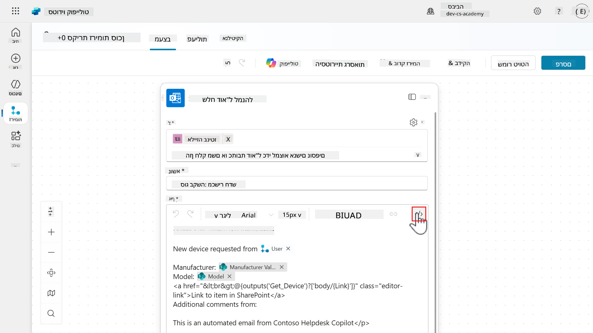

1. שימו לב שיש כמה תווים מיותרים `&lt;br&gt;`. מחקו את התווים הללו.

    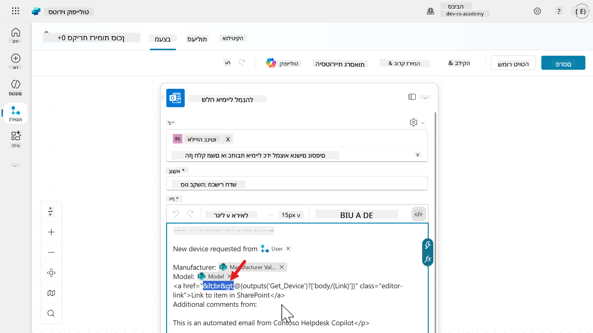

1. סיימנו להוסיף קישור לגוף הודעת האימייל 😎 בחרו את אייקון **&lt;/&gt;** כדי לעבור לתצוגת קוד.

    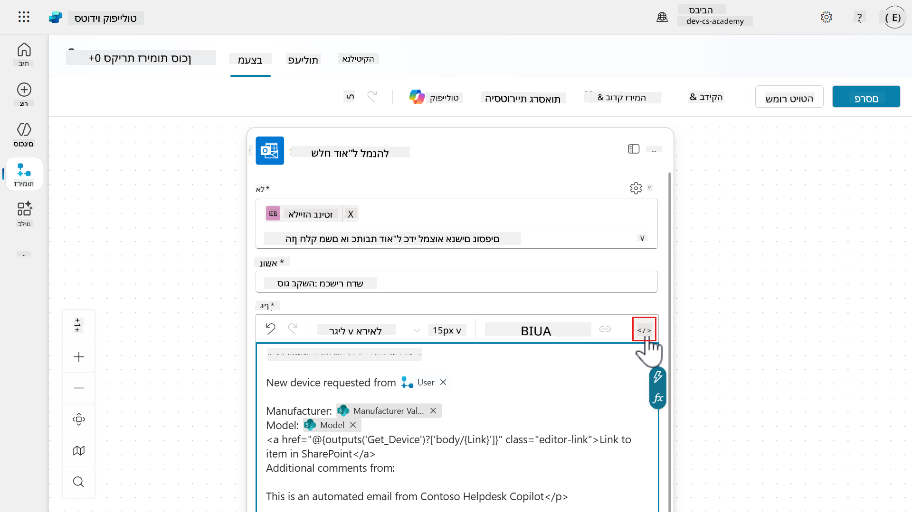

1. לחצו אחרי הטקסט `Additional comments from` לפני תו הנקודתיים ובחרו את **אייקון הברק** או **אייקון fx** בצד ימין.

    

1. בלשונית **תוכן דינמי** בלוח הצד, הזינו את הטקסט הבא בשדה החיפוש,

    ```text
    user
    ```

    בחרו את פרמטר **User** מהטריגר ולחצו על **Add**.

    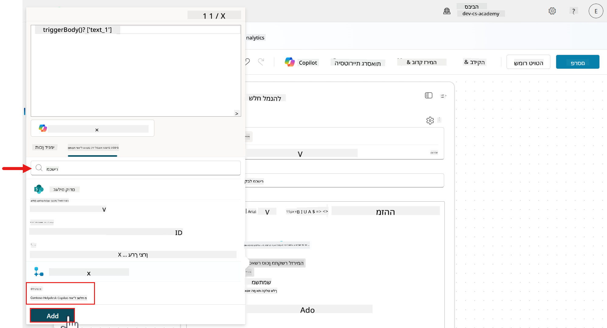

1. עכשיו נוסיף ביטוי שיציג את הערך של Additional Comments אם סופק על ידי המשתמש בצומת **Ask an adaptive card**, אחרת יציג "None" אם המשתמש לא סיפק הערות.

    לחצו אחרי הנקודתיים ובחרו את **אייקון הברק** או **אייקון fx** בצד ימין.

    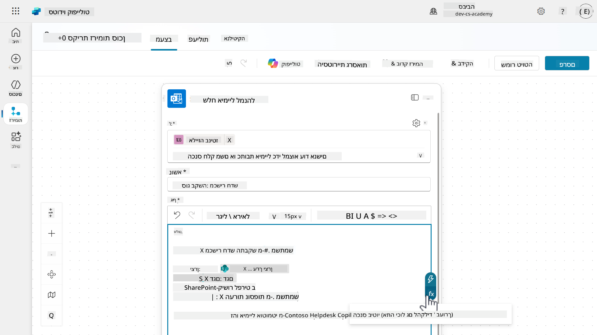

1. בלשונית **Function** בלוח הצד ובשדה הביטוי למעלה, הזינו את הטקסט הבא,

    ```text
    if(empty())
    ```

    ביטוי זה משתמש בפונקציה `if` עבור משפט if-else.

    הפונקציה הבאה היא `empty` שבודקת אם ערך קיים או לא בפרמטר מחרוזת. פרמטר המחרוזת שיש להתייחס אליו הוא ערך פרמטר הקלט `AdditionalComments` מהטריגר.

    

1. לאחר מכן, לחצו **בתוך הסוגריים** אחרי הפונקציה `empty`. נוסיף את פרמטר הקלט `AdditionalComments` מהטריגר.

    בחרו את לשונית **תוכן דינמי**. הזינו את הטקסט הבא בשדה החיפוש,

    ```text
    Additional
    ```

    גללו מטה בלוח הצד ובחרו את קלט **AdditionalComments** מהטריגר. הפרמטר עכשיו יתווסף כפרמטר מחרוזת בביטוי.

    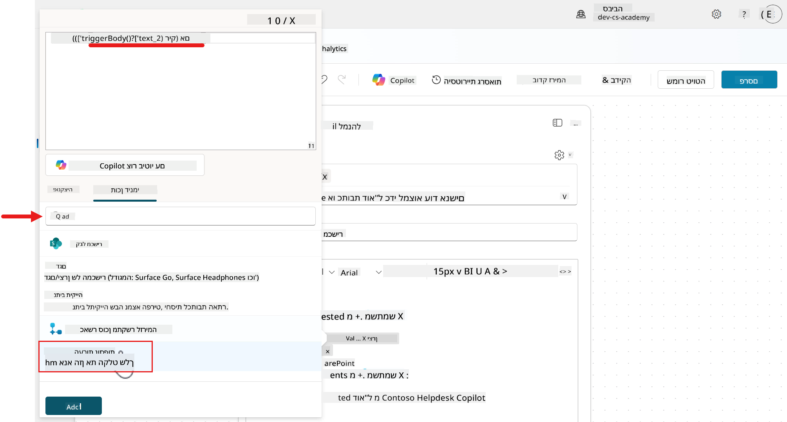

1. עכשיו נגדיר את הלוגיקה **_true_**, שבה אם פרמטר המחרוזת `AdditionalComments` ריק, נרצה להציג מחרוזת (טקסט) של `None`.

    אחרי הסוגריים שמקיפים את פרמטר המחרוזת, הזינו את הטקסט הבא,

    ```text
    , 'None',
    ```

    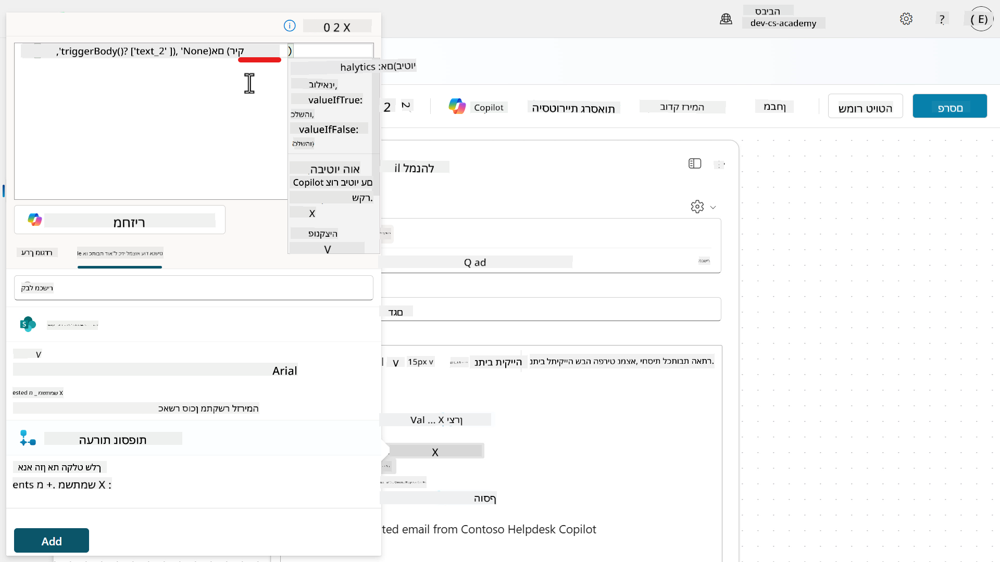

1. לבסוף נגדיר את הלוגיקה **_false_**, שבה אם פרמטר המחרוזת `AdditionalComments` אינו ריק, נרצה להציג את הערך של פרמטר הקלט **AdditionalComments** מהטריגר שלנו.

    > תזכורת: ערך זה יהיה מהשדה Additional Comments בכרטיס האדפטיבי בצומת **Ask with adaptive card** בנושא **Request device**.

    אחרי הפסיק אחרי הלוגיקה **_true_**, בחרו את לשונית **תוכן דינמי**. הזינו את הטקסט הבא בשדה החיפוש,

    ```text
    Additional
    ```

    גללו מטה בלוח הצד ובחרו את קלט **AdditionalComments** מהטריגר. הפרמטר עכשיו יתווסף כפרמטר מחרוזת בביטוי.

    עכשיו הוסיפו אותו לפרמטר **Body** על ידי בחירת **Add**.

    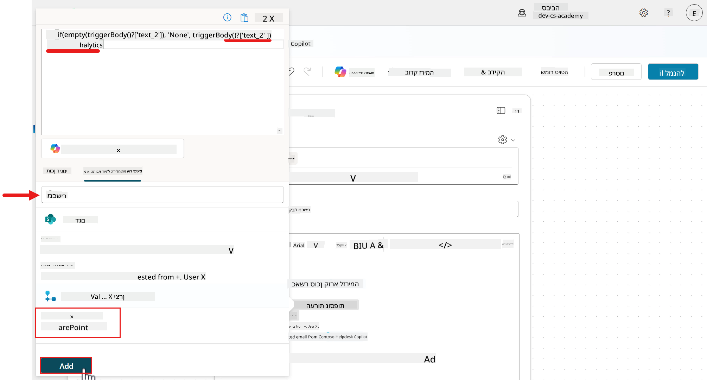

1. מצוין, הביטוי שלנו הושלם! הביטוי עכשיו נוסף לפרמטר **Body**. לבסוף, עצבו את השורה האחרונה באיטליק.

    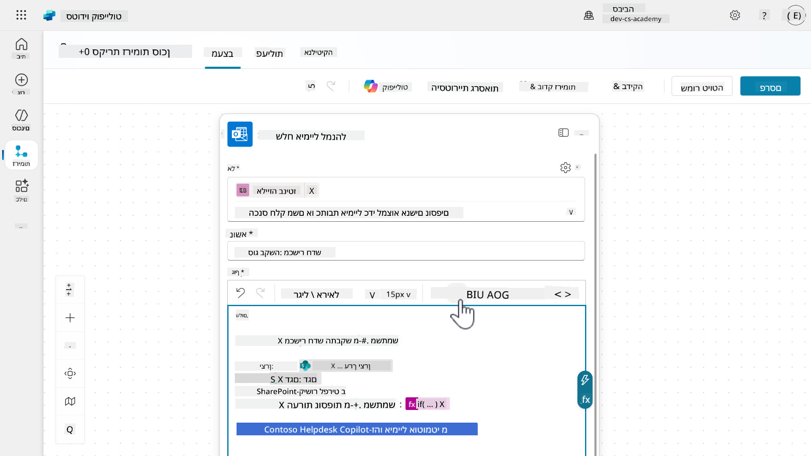

1. עכשיו נעדכן את פעולת **Respond to the agent** כדי לשלוח את ערך פרמטר **Model value** מפעולת **Get item** חזרה לסוכן.

    לחצו על מקש השמאלי של העכבר והזיזו בתנועה כלפי מעלה בתוך המעצב כדי לצפות בפעולת **Respond to the agent**.

    בחרו את פעולת **Respond to the agent** ובחרו את פלט **Text** כסוג.

    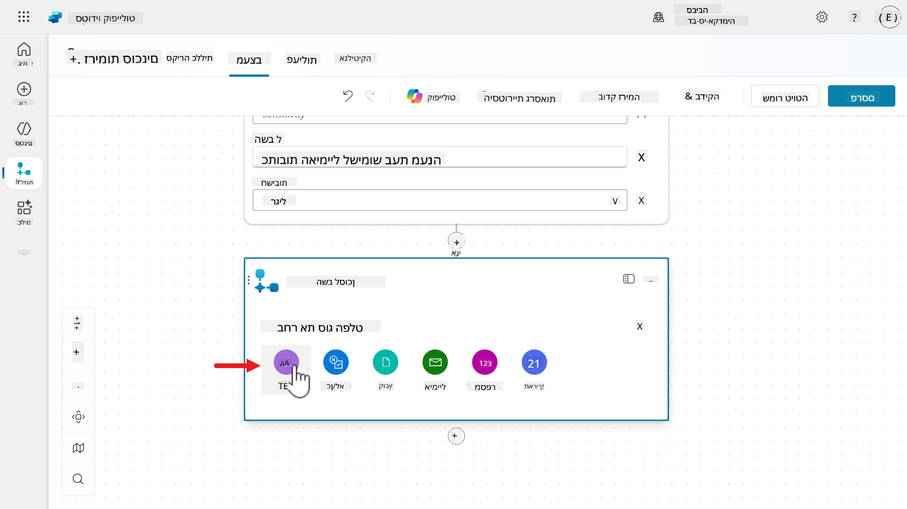

1. הזינו את הטקסט הבא כשם הפלט.

    ```text
    ModelValue
    ```

    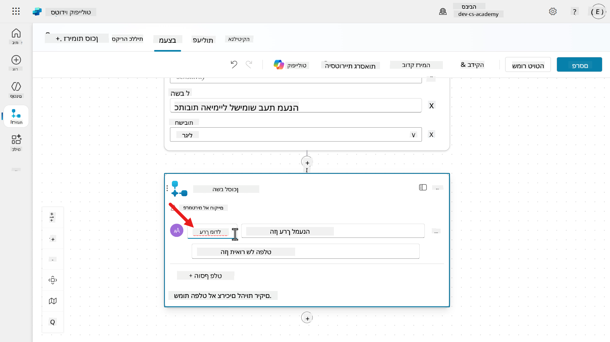

1. בחרו את שדה הערך ובחרו את **אייקון הברק** או **אייקון fx** בצד ימין.

    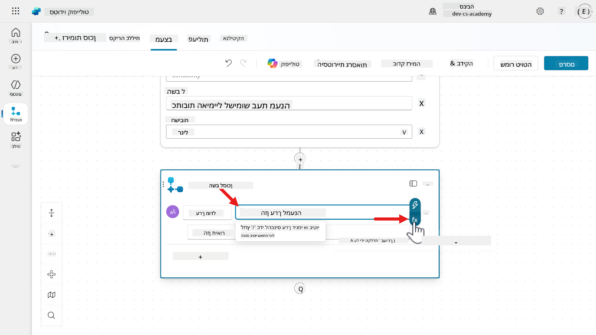

1. בלשונית **תוכן דינמי** בלוח הצד, הזינו את הטקסט הבא בשדה החיפוש,

    ```text
    model
    ```

    בחרו את פרמטר **Model** מפעולת **Get item** ולחצו על **Add**.

    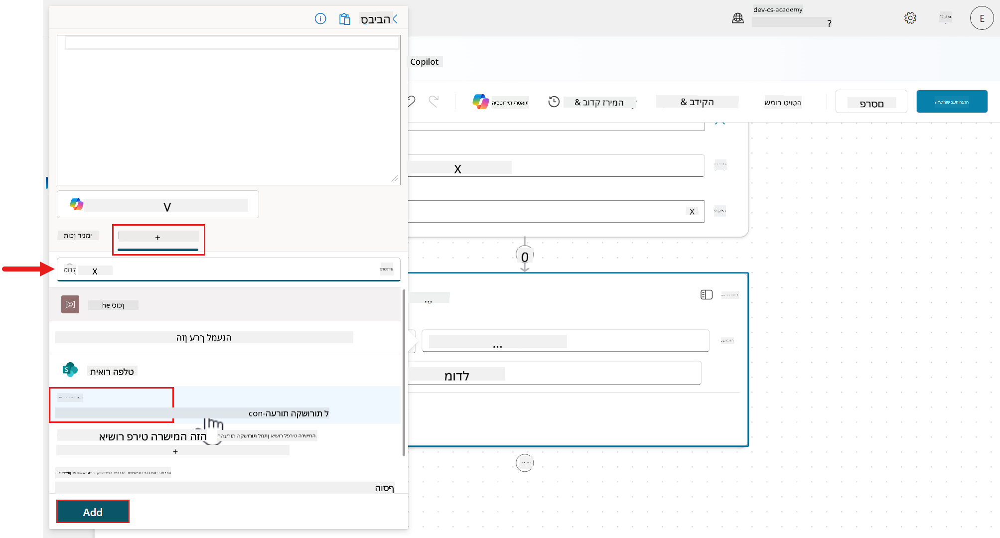

1. פרמטר **Model** עכשיו הוא הערך של פלט הטקסט. בחרו **Save draft** כדי לשמור את זרימת הסוכן שלנו.

    סיימנו את זרימת הסוכן שלנו 👏🏻

    

1. נעשה עדכון נוסף לזרימת הסוכן שלנו לפני הפרסום. בחרו את לשונית **Overview** ובחרו **Edit**.

    

1. עבור **Flow name**, העתיקו והדביקו את הטקסט הבא.

    ```text
    Send device request email
    ```

    עבור **Description**, בחרו את **אייקון הרענון** כדי להשתמש ב-AI ליצירת תיאור אוטומטי על בסיס הטריגר והפעולות בזרימת הסוכן.

    בחרו **Save** כדי לשמור את השם והתיאור המעודכנים של זרימת הסוכן.

    

1. בחרו את לשונית **Designer** ובחרו **Publish** כדי לפרסם את זרימת הסוכן כך שניתן יהיה להוסיף אותה כצומת בנושא **Request device**.

    

1. הודעת אישור תופיע בקרוב כדי לאשר שזרימת הסוכן פורסמה.

    

### 9.2 הוספת זרימת סוכן לנושא

עכשיו נוסיף את זרימת הסוכן לנושא **Request device**.

1. בחרו **Agents** בתפריט בצד שמאל ובחרו את **Contoso Helpdesk Agent**.

    

1. בחרו את לשונית **Topics**.

    

1. בחרו את נושא **Request device**.

    

1. גללו מטה לצומת **Ask with adaptive card** והוסיפו צומת חדש.

    בחרו **Add a tool** ובלשונית **Basic tools** בלוח הצד, בחרו את זרימת הסוכן **Send device request email** שיצרנו ופרסמנו לאחרונה.

    

1. עבור קלטי הטריגר של זרימת הסוכן שלנו, עלינו לבחור את פלטי המשתנים מצומת **Ask with adaptive card**.

    בחרו את **אייקון שלוש הנקודות (...)** עבור קלט **DeviceSharePointId**.

    

1. בחרו את משתנה **deviceSelectionId** שהוא אחד הפלטים שהוגדרו בצומת **Ask with adaptive card**.

    

1. לאחר מכן, בחרו את **אייקון שלוש הנקודות (...)** עבור קלט **User**.

    

1. בחרו את לשונית **System** בלוח הצד של המשתנים ובחרו **User.DisplayName**. משתנה זה מאחסן את שם התצוגה של המשתמש הפנימי שמתקשר עם הסוכן.

    

1. לאחר מכן, בחרו את **אייקון גדול יותר** עבור **Advanced inputs** כדי להרחיב ולראות את קלט **AdditionalComments**.

    

1. בחרו את **אייקון שלוש הנקודות (...)** עבור קלט AdditionalComments.

    

1. בחרו את לשונית **Formula** ואת אייקון ההרחבה בלוח הצד של המשתנים, מכיוון שנשתמש בביטוי Power Fx.

    

1. בדומה לביטוי בזרימת הסוכן שעושה בדיקה מותנית באמצעות פונקציית _if_, אך הפעם
    - באמצעות פונקציות Power Fx,
    - והכנסת ערך ריק או ערך של משתנה הפלט `commentsId` מצומת **Ask with adaptive card**.

    הזינו את הפונקציות הבאות בשדה Power Fx,

    ```text
    If(IsBlank())
    ```

ביטוי זה משתמש בפונקציה `If` עבור משפט if-else.

הפונקציה הבאה בשימוש היא `IsBlank`, אשר בודקת האם ערך קיים או לא קיים בפרמטר מחרוזת. פרמטר המחרוזת שיש להתייחס אליו הוא משתנה הפלט `commentsId` מהצומת **Ask with adaptive card**.


1. כעת, לחץ **בתוך הסוגריים** אחרי הפונקציה `IsBlank`. אנחנו הולכים להכניס את משתנה הפלט `commentsId` מהצומת **Ask with adaptive card**.

הכנס את הבא בתוך הסוגריים,

    ```text
    Topic.commentsId
    ```

והוסף פסיק אחרי הסוגריים.


1. כעת נגדיר את הלוגיקה

   - כאשר **_true_** - אם פרמטר המחרוזת `Topic.commentsId` ריק, אז נרצה להכניס ערך ריק.
   - כאשר **_false_** - אם פרמטר המחרוזת `Topic.commentsId` אינו ריק, אז נכניס את הערך של משתנה commentsId.

אחרי הסוגריים שמקיפים את פרמטר המחרוזת, הכנס את הבא,

    ```text
    "", Topic.commentsId)
    ```

ביטוי Power Fx צריך להיראות כך,

    ```text
    If(IsBlank(Topic.commentsId), "", Topic.commentsId)
    ```

עבודה מצוינת, הביטוי שלנו הושלם! 🙌🏻 כעת בחר **Insert** כדי להגדיר את פרמטר הקלט של זרימת הסוכן לביטוי Power Fx.


1. **שמור** את הנושא.

### 9.3 עדכון נושא בקשת מכשיר עם מספר צמתים לשיפור חוויית המשתמש

כעת נוסיף שני צמתים נוספים:

- **Send a message** - זה ישמש כהודעת אישור שמתייחסת למכשיר שנבחר ושבקשתם הוגשה.

- **Topic management** - לסיום השיחה, נבצע הפניה לצומת **End of conversation**.

בואו נתחיל!

1. בחר את **סמל הפלוס +** מתחת לצומת זרימת הסוכן ובחר בצומת **Send a message**.


1. הכנס את הבא בשדה ההודעה,

    ```text
    Thanks
    ```

לאחר מכן בחר **Insert variable** כדי להתייחס לשם המשתמש.


1. בחר בכרטיסיית **System** וחפש את `User` בשדה החיפוש. בחר במשתנה **User.DisplayName**.


1. הכנס את הבא בשדה ההודעה,

    ```text
    . Your selected device,
    ```

לאחר מכן בחר **Insert variable** והפעם בכרטיסיית **Custom**, בחר במשתנה **ModelValue**.

לאחר מכן הכנס את הבא כדי להשלים את ההודעה.

    ```text
    , has been submitted and will be reviewed by your manager.
    ```

ההודעה צריכה להיראות כך.


1. לבסוף, בחר את **סמל הפלוס +** מתחת לצומת **Send a message** ובחר **Topic management**, ולאחר מכן **Go to another topic** ובחר **End of Conversation**.


1. **שמור** את הנושא.


### 9.4 בדיקת הסוכן באמצעות מספר תרחישים

עבודה מצוינת!!! 😁 כעת נוכל לבדוק את הסוכן שלנו.

#### 9.4.1 בקשת מכשיר והכנסת הערה בכרטיס אדפטיבי

1. **רענן** את חלונית הבדיקה, בחר את סמל **activity map** והכנס את הבא כהודעה לסוכן.

    ```text
    I need a laptop
    ```


1. הסוכן מפעיל את **Available devices** ומגיב עם רשימת המכשירים הזמינים. נכניס את הבא כתשובה לשאלה האם נרצה לבקש מכשיר.

    ```text
    Yes
    ```


1. שים לב כיצד הסוכן הפעיל את **Request device** בהתאם להוראות הסוכן וכי הכרטיס האדפטיבי מוצג כעת בהודעת הסוכן.

בחר במכשיר **Surface Laptop 15** והוסף את הבא כהערה.

    ```text
    I need 16GB of RAM please
    ```


1. גלול מטה עד שתראה את כפתור **Submit Request** ובחר בו כדי לשלוח את הכרטיס האדפטיבי לסוכן.


1. בחר **Allow** כדי לאפשר לסוכן להשתמש באישורי החיבור שלך עבור פעולות שני המחברים.


1. הסוכן יציג לאחר מכן את הודעת האישור הכוללת את המודל שנבחר, ולאחר מכן יפנה לנושא **End of Conversation**. מגניב!


1. בחר **כן** כדי לאמת את שאר נושא **End of Conversation**.


1. לאחר מכן, דרג את החוויה על ידי בחירת אחד הכוכבים בכרטיס סולם הדירוג.

הסוכן ימשיך לצומת **Question** האחרון בנושא **End of Conversation**. בחר **לא**.


1. הנושא יסתיים לאחר מכן כהודעה סופית תוצג בחלונית הבדיקה.


1. בדוק את תיבת הדואר הנכנס של חשבון הדוא"ל שלך כדי לעיין בדוא"ל שנשלח למנהל על ידי זרימת הסוכן. תוכל לראות את פרטי המכשיר שנבחר ואת ההערה שהוכנסה בכרטיס האדפטיבי.


1. לחץ על הקישור והדפדפן צריך לטעון את פריט SharePoint של המכשיר. מעולה!


#### 9.4.2 בקשת מכשיר ללא הכנסת הערה בכרטיס אדפטיבי

כעת נבדוק את התרחיש שבו לא הוכנסה הערה.

1. חזור על אותם שלבים של

   - **רענן** את חלונית הבדיקה ובחר את סמל **activity map**
   - הכנס את ההודעה, `I need a laptop`
   - השב עם `Yes` לשאלה על בקשת מכשיר


1. הפעם בחר במכשיר **Surface Laptop 13** ולא הכנס הערה.


1. **שלח** את הבקשה על ידי בחירת כפתור **Submit Request**.


1. הפעם הדוא"ל שהתקבל בתיבת הדואר הנכנס שלך יציג **None** כהערה.


#### 9.4.3 לא לבקש מכשיר

כעת נבדוק את התרחיש האחרון שבו לא מבקשים מכשיר, ונושא **Goodbye** צריך להיות מופעל בהתאם להוראות הסוכן.

1. חזור על אותם שלבים של

   - **רענן** את חלונית הבדיקה ובחר את סמל **activity map**
   - הכנס את ההודעה, `I need a laptop`
   - הפעם השב עם `No` לשאלה על בקשת מכשיר


1. הסוכן הפעיל את נושא **Goodbye** והשאלה כפי שהוגדרה בנושא נשאלת.


## ✅ משימה הושלמה

מזל טוב! 👏🏻 למדת כיצד לבנות את זרימת הסוכן שלך ולהוסיף אותה לנושא **Request device** הקיים שלנו, וכיצד להפנות את הסוכן לנושא אחר.

זהו סוף **מעבדה 09 - הוספת זרימת סוכן לאוטומציה ושיפור יכולות נושא**, בחר את הקישור למטה כדי לעבור לשיעור הבא. נרחיב על המקרה במעבדה של השיעור הבא.

⏭️ [עבור לשיעור **Add Event Triggers - Enable autonomous agent capabilities**](../10-add-event-triggers/README.md)

## 📚 משאבים טקטיים

🔗 [Introducing agent flows: Transforming automation with AI-first workflows](https://www.microsoft.com/microsoft-copilot/blog/copilot-studio/introducing-agent-flows-transforming-automation-with-ai-first-workflows/)

🔗 [Agent flows overview](https://learn.microsoft.com/microsoft-copilot-studio/flows-overview?WT.mc_id=power-172621-ebenitez)

🔗 [Use agent flows with your agent](https://learn.microsoft.com/microsoft-copilot-studio/advanced-flow?WT.mc_id=power-172621-ebenitez)

🔗 [List of functions in the reference guide](https://learn.microsoft.com/azure/logic-apps/workflow-definition-language-functions-reference?WT.mc_id=power-172621-ebenitez)

📺 [Agent Flows in Copilot Studio](https://www.youtube.com/watch?v=VJTKyk3Pr7s)


---

**הצהרת אחריות**:  
מסמך זה תורגם באמצעות שירות תרגום AI [Co-op Translator](https://github.com/Azure/co-op-translator). למרות שאנו שואפים לדיוק, יש להיות מודעים לכך שתרגומים אוטומטיים עשויים להכיל שגיאות או אי דיוקים. המסמך המקורי בשפתו המקורית צריך להיחשב כמקור סמכותי. עבור מידע קריטי, מומלץ להשתמש בתרגום מקצועי אנושי. איננו אחראים לאי הבנות או לפרשנויות שגויות הנובעות משימוש בתרגום זה.