<!--
CO_OP_TRANSLATOR_METADATA:
{
  "original_hash": "9dceeba2eae2bb73e328602a060eddab",
  "translation_date": "2025-10-17T01:28:38+00:00",
  "source_file": "docs/recruit/11-publish-your-agent/README.md",
  "language_code": "he"
}
-->
# 🚨 משימה 11: פרסם את הסוכן שלך

## 🕵️‍♂️ שם קוד: `מבצע פרסם פרסם פרסם`

> **⏱️ חלון זמן המבצע:** `~30 דקות`  

🎥 **צפו בהדרכה**

[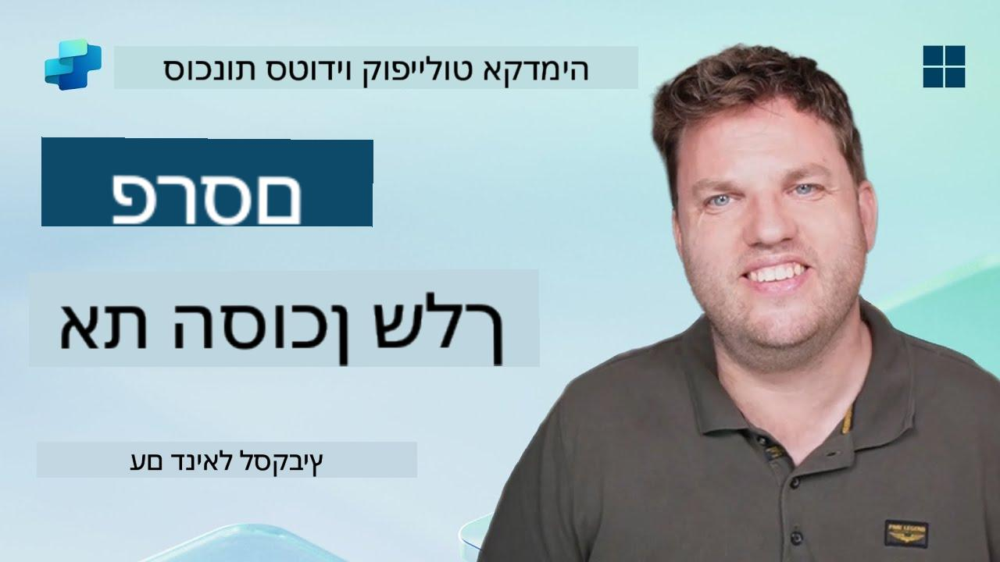](https://www.youtube.com/watch?v=eVZmljhYlSI "צפו בהדרכה ביוטיוב")

## 🎯 תקציר המשימה

לאחר שסיימת סדרת מודולים מאתגרת, יוצר הסוכנים, אתה מוכן כעת לשלב הקריטי ביותר: פרסום הסוכן שלך. הגיע הזמן להפוך את היצירה שלך לזמינה למשתמשים ב-Microsoft Teams וב-Microsoft 365 Copilot.

הסוכן שלך—מצויד במשימה ברורה, כלים חזקים וגישה למקורות ידע מרכזיים—מוכן לשרת. באמצעות Microsoft Copilot Studio, תוכל לפרוס את הסוכן שלך כך שיתחיל לסייע למשתמשים אמיתיים, בדיוק במקום שבו הם עובדים.

בואו נשגר את הסוכן שלכם לפעולה.

## 🔎 מטרות

📖 השיעור הזה מכסה:

1. למה חשוב לפרסם את הסוכן שלך
1. מה קורה כשאתה מפרסם את הסוכן שלך
1. איך להוסיף ערוץ (Microsoft Teams ו-Microsoft 365 Copilot)
1. איך להוסיף את הסוכן ב-Microsoft Teams
1. איך להפוך את הסוכן לזמין ב-Microsoft Teams לכל הארגון שלך

## 🚀 פרסם סוכן

בכל פעם שאתה עובד על סוכן ב-Copilot Studio, ייתכן שתעדכן אותו על ידי הוספת ידע או כלים. כשאתה מוכן עם כל השינויים ובדקת אותם היטב, אתה מוכן לפרסם אותו. פרסום מבטיח שהעדכונים האחרונים יהיו זמינים. אם תעדכן את הסוכן שלך בכלים חדשים ולא תלחץ על כפתור הפרסום, הם עדיין לא יהיו זמינים למשתמשי הקצה.

תמיד וודא שאתה לוחץ על כפתור הפרסום כשאתה רוצה לדחוף את העדכונים למשתמשי הסוכן שלך. ייתכן שלסוכן שלך יש ערוצים שהוספת לו, וכשתלחץ על פרסום, העדכונים יהיו זמינים לכל הערוצים שהוספת לסוכן.

## ⚙️ הגדר ערוצים

ערוצים קובעים היכן המשתמשים שלך יכולים לגשת ולתקשר עם הסוכן שלך. לאחר שתפרסם את הסוכן שלך, תוכל להפוך אותו לזמין במספר ערוצים. כל ערוץ עשוי להציג את תוכן הסוכן שלך בצורה שונה.

תוכל להוסיף את הסוכן שלך לערוצים הבאים:

- **Microsoft Teams ו-Microsoft 365 Copilot** - הפוך את הסוכן שלך לזמין בצ'אטים ובפגישות ב-Teams, ובחוויות Microsoft 365 Copilot ([למידע נוסף](https://learn.microsoft.com/microsoft-copilot-studio/publication-add-bot-to-microsoft-teams))
- **אתר הדגמה** - בדוק את הסוכן שלך באתר הדגמה שמסופק על ידי Copilot Studio ([למידע נוסף](https://learn.microsoft.com/microsoft-copilot-studio/publication-connect-bot-to-web-channels))
- **אתר מותאם אישית** - הטמע את הסוכן שלך ישירות באתר שלך ([למידע נוסף](https://learn.microsoft.com/microsoft-copilot-studio/publication-connect-bot-to-web-channels))
- **אפליקציה לנייד** - שלב את הסוכן שלך באפליקציה מותאמת אישית לנייד ([למידע נוסף](https://learn.microsoft.com/microsoft-copilot-studio/publication-connect-bot-to-custom-application))
- **SharePoint** - הוסף את הסוכן שלך לאתרי SharePoint לצורך סיוע במסמכים ובאתרים ([למידע נוסף](https://learn.microsoft.com/microsoft-copilot-studio/publication-add-bot-to-sharepoint))
- **Facebook Messenger** - התחבר עם משתמשים דרך פלטפורמת ההודעות של Facebook ([למידע נוסף](https://learn.microsoft.com/microsoft-copilot-studio/publication-add-bot-to-facebook))
- **Power Pages** - שלב את הסוכן שלך באתרים של Power Pages ([למידע נוסף](https://learn.microsoft.com/microsoft-copilot-studio/publication-add-bot-to-power-pages))
- **ערוצי Azure Bot Service** - גש לערוצים נוספים כולל Slack, Telegram, Twilio SMS ועוד ([למידע נוסף](https://learn.microsoft.com/microsoft-copilot-studio/publication-connect-bot-to-azure-bot-service-channels))

כדי להוסיף ערוץ, נווט ללשונית **Channels** בסוכן שלך ובחר את הערוץ שברצונך להגדיר. לכל ערוץ יש דרישות הגדרה ספציפיות וייתכן שידרשו צעדי אימות או הגדרות נוספים.

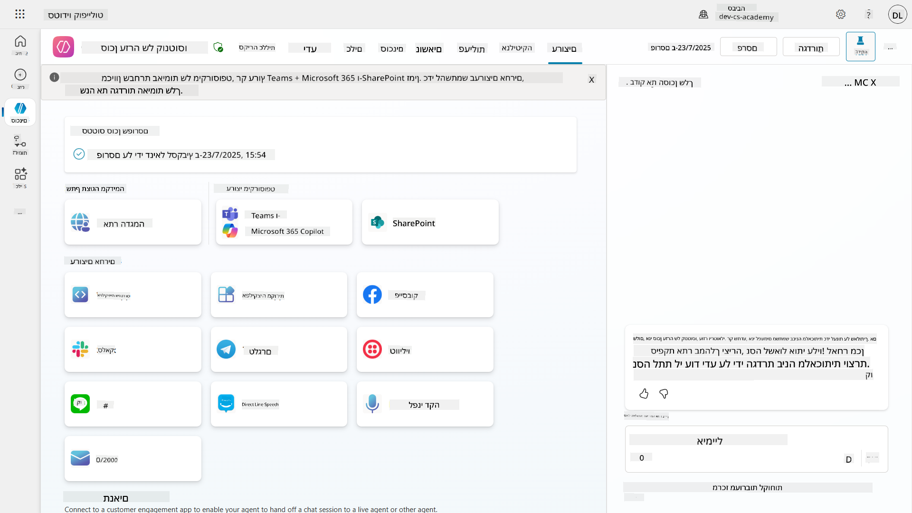

## 📺 חוויות ערוץ

לערוצים שונים יש חוויות משתמש שונות. כשאתה בונה סוכן למספר ערוצים, וודא שאתה מודע להבדלים בין הערוצים. תמיד מומלץ לבדוק את הסוכן שלך במספר ערוצים כדי לראות אם הוא באמת עושה את מה שהתכוונת.

| חוויה                            | אתר           | Teams ו-Microsoft 365 Copilot           | Facebook                 | Dynamics Omnichannel for Customer Service                   |
| --------------------------------- | ------------- | --------------------------------------- | ------------------------ | ----------------------------------------------------------- |
| [סקר שביעות רצון לקוחות][1]      | כרטיס אדפטיבי | טקסט בלבד                              | טקסט בלבד               | טקסט בלבד                                                   |
| [אפשרויות בחירה מרובות][1]       | נתמך         | [נתמך עד שש (ככרטיס Hero)][4]          | [נתמך עד 13][6]         | [נתמך חלקית][8]                                             |
| [Markdown][2]                    | נתמך         | [נתמך חלקית][5]                        | [נתמך חלקית][7]         | [נתמך חלקית][9]                                             |
| [הודעת ברוך הבא][1]              | נתמך         | נתמך                                   | לא נתמך                 | נתמך עבור [צ'אט][10]. לא נתמך עבור ערוצים אחרים.           |
| [Did-You-Mean][3]                | נתמך         | נתמך                                   | נתמך                    | נתמך עבור [Microsoft Teams][11], [צ'אט][10], Facebook, וערוצי טקסט בלבד (SMS דרך [TeleSign][12] ו-[Twilio][13], [WhatsApp][14], [WeChat][15], ו-[Twitter][16]). פעולות מוצעות מוצגות כרשימה טקסטואלית בלבד; משתמשים חייבים להקליד מחדש אפשרות כדי להגיב. |

[1]: https://learn.microsoft.com/microsoft-copilot-studio/authoring-create-edit-topics  
[2]: https://daringfireball.net/projects/markdown/  
[3]: https://learn.microsoft.com/microsoft-copilot-studio/advanced-ai-features  
[4]: https://learn.microsoft.com/microsoftteams/platform/concepts/cards/cards-reference#hero-card  
[5]: https://learn.microsoft.com/microsoftteams/platform/bots/how-to/format-your-bot-messages#text-only-messages  
[6]: https://developers.facebook.com/docs/messenger-platform/send-messages/quick-replies/  
[7]: https://www.facebook.com/help/147348452522644?helpref=related  
[8]: https://learn.microsoft.com/dynamics365/customer-service/asynchronous-channels#suggested-actions-support  
[9]: https://learn.microsoft.com/dynamics365/customer-service/asynchronous-channels#preview-support-for-formatted-messages  
[10]: https://learn.microsoft.com/dynamics365/customer-service/set-up-chat-widget  
[11]: https://learn.microsoft.com/dynamics365/customer-service/configure-microsoft-teams  
[12]: https://learn.microsoft.com/dynamics365/customer-service/configure-sms-channel  
[13]: https://learn.microsoft.com/dynamics365/customer-service/configure-sms-channel-twilio  
[14]: https://learn.microsoft.com/dynamics365/customer-service/configure-whatsapp-channel  
[15]: https://learn.microsoft.com/dynamics365/customer-service/configure-wechat-channel  
[16]: https://learn.microsoft.com/dynamics365/customer-service/configure-twitter-channel  

> [!NOTE]  
> ישנם כמה דוגמאות שבהן ניתן להשתמש בלוגיקה שונה עבור ערוצים שונים. דוגמה לכך ניתן למצוא במאגר Power Platform Snippets:  
>  
> הנרי ג'יימס שיתף דוגמה כיצד להציג כרטיס אדפטיבי שונה כאשר הערוץ הוא Microsoft Teams. ([קישור לדוגמה](https://github.com/pnp/powerplatform-snippets/blob/main/copilot-studio/multiple-topics-matched-topic/source/multiple-topics-matched.yaml#L40))

## 🧪 מעבדה 11: פרסם את הסוכן שלך ל-Teams ול-Microsoft 365 Copilot

### 🎯 מקרה שימוש

סוכן התמיכה הטכנית של Contoso שלך כעת מוגדר לחלוטין עם יכולות חזקות—הוא יכול לגשת למקורות ידע ב-SharePoint, ליצור כרטיסי תמיכה, לשלוח התראות יזומות ולהגיב בצורה חכמה לשאלות משתמשים. עם זאת, כל התכונות הללו זמינות כרגע רק בסביבת הפיתוח שבה בנית אותם.

**האתגר:** משתמשי הקצה לא יכולים ליהנות מיכולות הסוכן שלך עד שהוא יפורסם כראוי ויהפוך לנגיש בערוצים שבהם הם עובדים בפועל.

**הפתרון:** פרסום הסוכן שלך מבטיח שהגרסה האחרונה—עם כל העדכונים האחרונים, הנושאים החדשים, מקורות הידע המשופרים והזרימות המוגדרות—תהיה זמינה למשתמשים אמיתיים. ללא פרסום, המשתמשים עדיין יתקשרו עם גרסה ישנה של הסוכן שלך שעשויה להיות חסרה פונקציונליות קריטית.

הוספת ערוץ Teams ו-Microsoft 365 Copilot חשובה באותה מידה מכיוון:

- **אינטגרציה עם Teams**: העובדים בארגון שלך מבלים את רוב יומם ב-Microsoft Teams לצורך שיתוף פעולה, פגישות ותקשורת. על ידי הוספת הסוכן ל-Teams, משתמשים יכולים לקבל תמיכה טכנית מבלי לעזוב את סביבת העבודה הראשית שלהם.

- **Microsoft 365 Copilot**: משתמשים יכולים לגשת לסוכן התמיכה הטכנית המיוחד שלך ישירות בתוך חוויית Microsoft 365 Copilot שלהם, מה שהופך אותו לאינטגרלי לזרימת העבודה היומית שלהם באפליקציות Office.

- **גישה מרכזית**: במקום לזכור אתרים או אפליקציות נפרדות, משתמשים יכולים לגשת לתמיכה טכנית דרך הפלטפורמות שבהן הם כבר משתמשים, מה שמפחית חיכוכים ומגביר את האימוץ.

המשימה הזו הופכת את עבודת הפיתוח שלך לפתרון מוכן לייצור שמספק ערך אמיתי למשתמשי הקצה בארגון שלך.

### דרישות מוקדמות

לפני שתתחיל במעבדה זו, וודא שיש לך:

- ✅ סיימת את המעבדות הקודמות ויש לך סוכן תמיכה טכנית של Contoso מוגדר לחלוטין
- ✅ הסוכן שלך נבדק ומוכן לשימוש בייצור
- ✅ הרשאות בסביבת Copilot Studio שלך לפרסום סוכנים
- ✅ גישה ל-Microsoft Teams בארגון שלך

### 11.1 פרסם את הסוכן שלך

כעת, לאחר שסיימנו את כל העבודה על הסוכן, עלינו לוודא שכל העבודה שלנו זמינה למשתמשי הקצה שעתידים להשתמש בסוכן שלנו. כדי לוודא שהתוכן זמין לכל המשתמשים, עלינו לפרסם את הסוכן שלנו.

1. עבור לסוכן התמיכה הטכנית של Contoso ב-Copilot Studio (דרך [פורטל היוצר של Copilot Studio](https://copilotstudio.microsoft.com))

    ב-Copilot Studio, קל לפרסם את הסוכן שלך. פשוט בחר בכפתור הפרסום בראש סקירת הסוכן.

    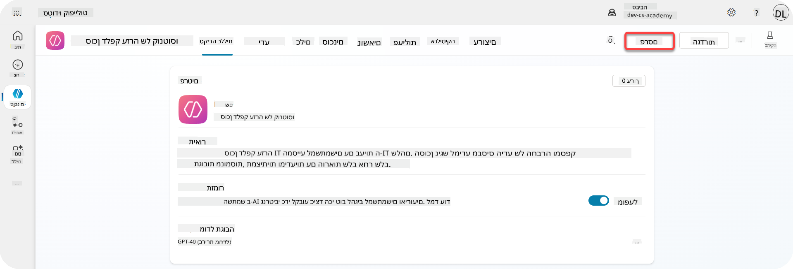

1. בחר בכפתור **Publish** בסוכן שלך

    ייפתח חלון קופץ לאישור שאתה באמת רוצה לפרסם את הסוכן שלך.

    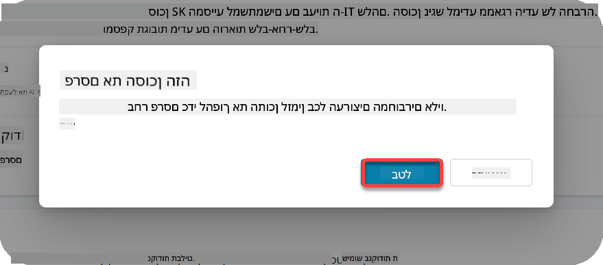

1. בחר **Publish** כדי לאשר את פרסום הסוכן שלך

    כעת מופיעה הודעה שהסוכן שלך מתפרסם. אין צורך להשאיר את החלון הקופץ פתוח. תקבל הודעה כשהסוכן יפורסם.

    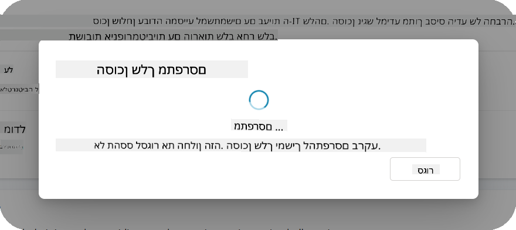

    כשהסוכן סיים להתפרסם, תראה את ההודעה בראש דף הסוכן.

    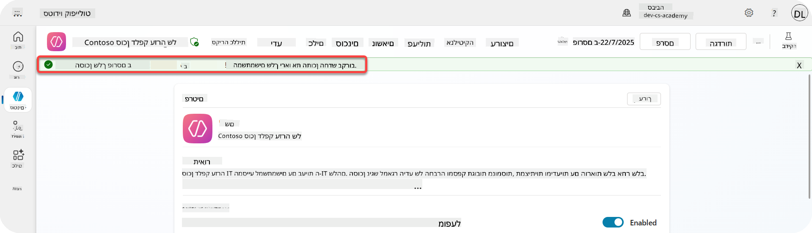

אבל - רק פרסמנו את הסוכן, עדיין לא הוספנו אותו לערוץ, אז בואו נתקן את זה עכשיו!

### 11.2 הוסף את ערוץ Teams ו-Microsoft 365 Copilot

1. כדי להוסיף את ערוץ Teams ו-Microsoft 365 Copilot לסוכן שלנו, עלינו לבחור **Channel** בניווט העליון של הסוכן

    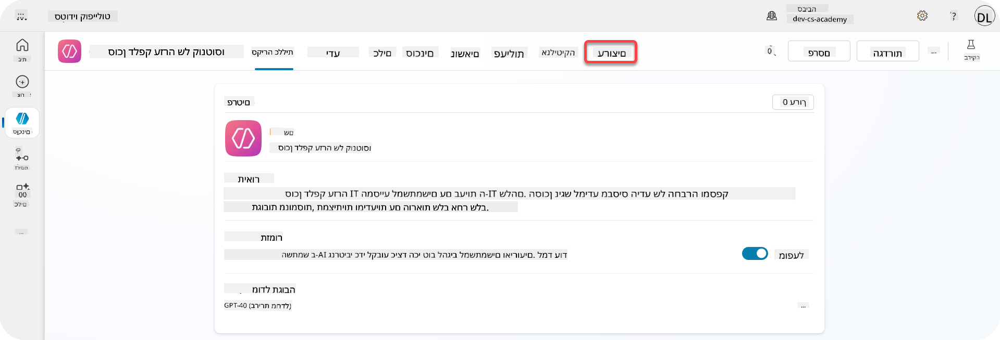

    כאן נוכל לראות את כל הערוצים שניתן להוסיף לסוכן הזה.

1. בחר **Teams ו-Microsoft 365**

    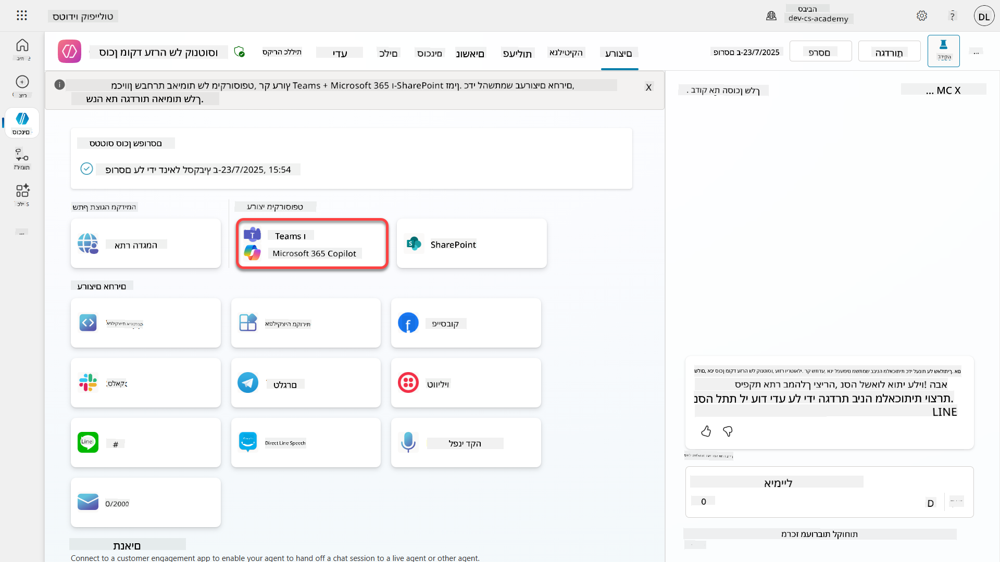

1. בחר **Add channel** כדי להשלים את האשף ולהוסיף את הערוץ לסוכן

    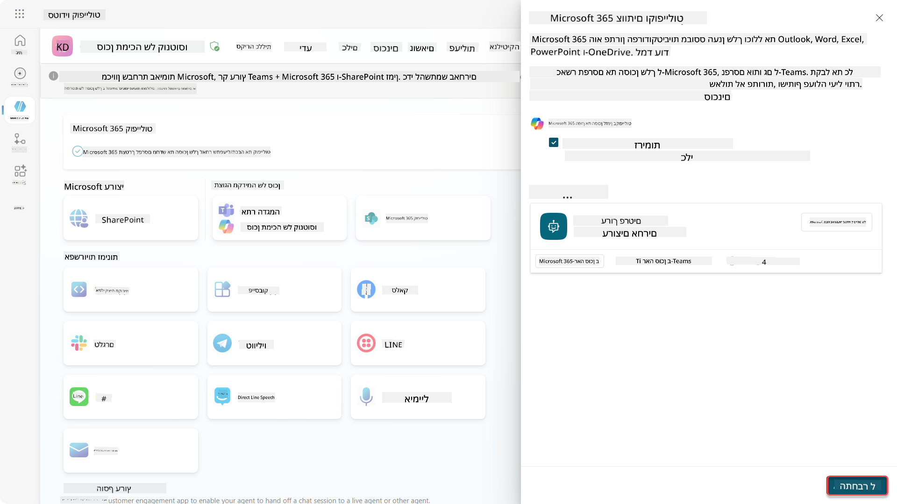

    זה ייקח קצת זמן עד שזה יתווסף. לאחר שזה יתווסף, תופיע הודעה ירוקה בראש הסרגל הצדדי.

    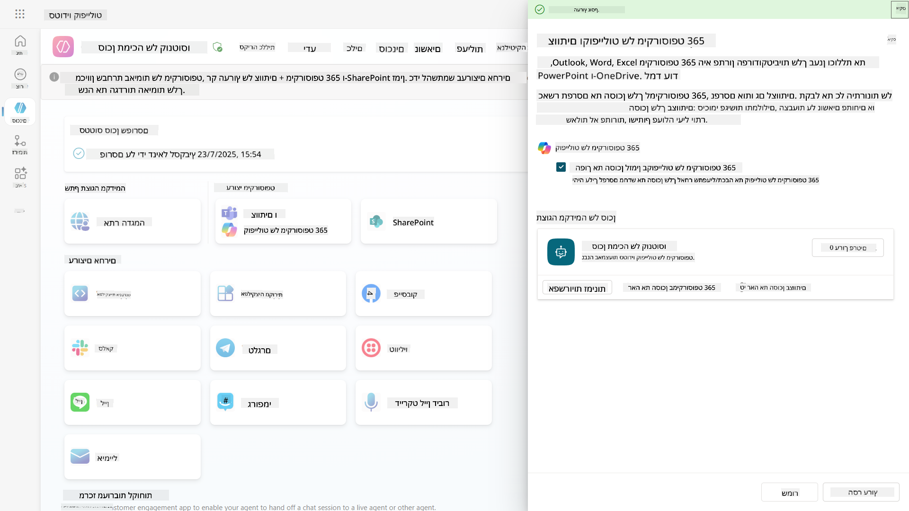

1. בחר **See agent in Teams** כדי לפתוח כרטיסייה חדשה

    

1. בחר **Add** כדי להוסיף את סוכן התמיכה הטכנית של Contoso ל-Teams

    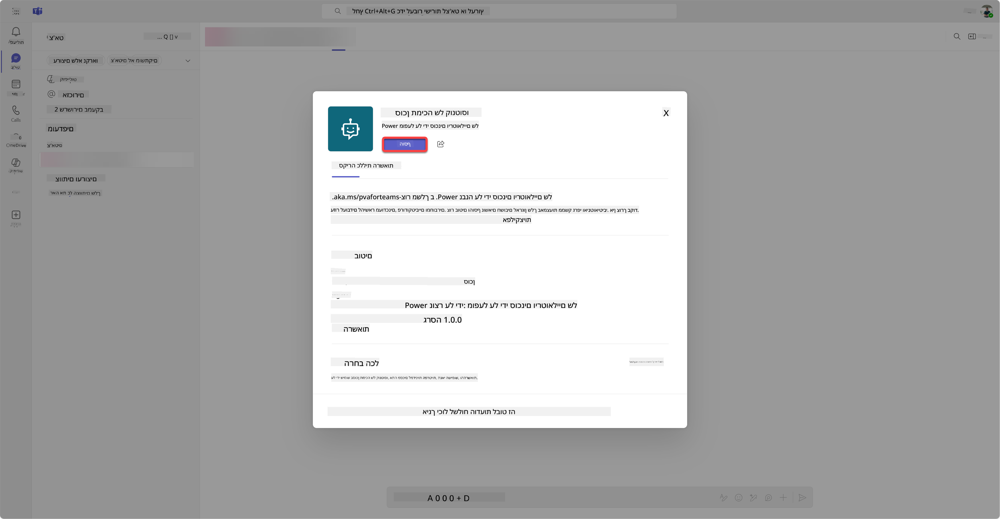

    זה ייקח קצת זמן. לאחר מכן תופיע המסך הבא:

    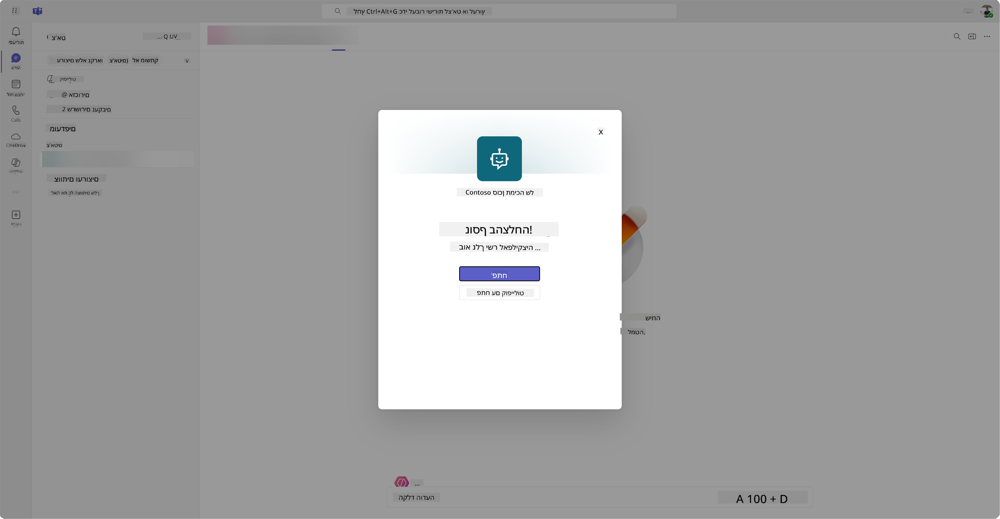

1. בחר **Open** כדי לפתוח את הסוכן ב-Teams

    זה יפתח את הסוכן ב-Teams כאפליקציה של Teams

    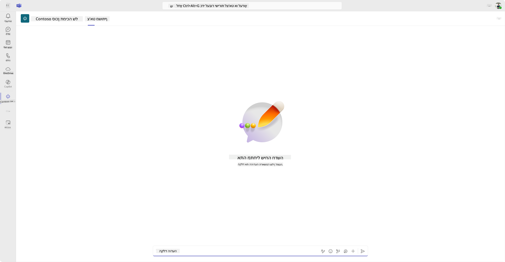

כעת פרסמנו את הסוכן לעבודה עבורך ב-Microsoft Teams, אבל ייתכן שתרצה להפוך אותו לזמין עבור יותר אנשים.

### 11.3 הפוך את הסוכן לזמין לכל המשתמשים בדייר

1. סגור את כרטיסיית הדפדפן שבה סוכן התמיכה הטכנית של Contoso פתוח

    זה אמור להחזיר אותך ל-Copilot Studio שבו עדיין פתוח לוח הצד של Teams ו-Microsoft 365 Copilot. כרגע רק פתחנו את הסוכן ב-Teams, אבל אנחנו יכולים לעשות הרבה יותר כאן. אנחנו יכולים לערוך את פרטי הסוכן, לפרוס את הסוכן ליותר משתמשים ועוד.

1. בחר **Edit details**

    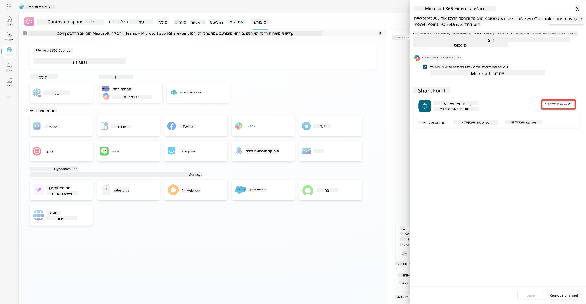
זה יפתח חלון שבו נוכל לשנות מגוון פרטים והגדרות של הסוכן. ניתן לשנות פרטים בסיסיים כמו האייקון, צבע הרקע של האייקון והתיאורים. בנוסף, ניתן לשנות הגדרות של Teams (לדוגמה, לאפשר למשתמש להוסיף את הסוכן לצוות או להשתמש בסוכן בצ'אטים קבוצתיים ובפגישות) כאן. כאשר תבחרו *עוד*, תוכלו גם לשנות פרטים של המפתח כמו שם המפתח, האתר, הצהרת הפרטיות ותנאי השימוש.

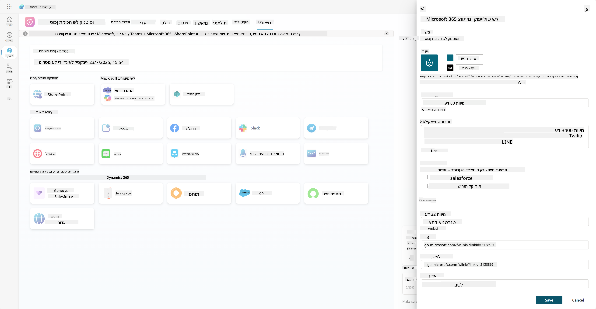

1. בחרו **ביטול** כדי לסגור את חלון עריכת הפרטים.

1. בחרו **אפשרויות זמינות**

    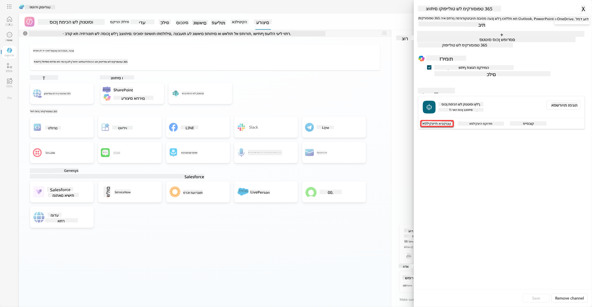

    זה יפתח את חלון אפשרויות הזמינות, שבו תוכלו להעתיק קישור לשליחה למשתמשים כדי להשתמש בסוכן (שימו לב, יש לשתף את הסוכן עם המשתמש גם כן) ותוכלו להוריד קובץ להוספת הסוכן לחנות Microsoft Teams או Microsoft 365. כדי להציג את הסוכן בחנות, יש לכם אפשרויות נוספות: תוכלו להציג אותו לחברי הצוות ולמשתמשים משותפים (להצגה בקטגוריית *נבנה עם Power Platform*) או להציג אותו לכל המשתמשים בארגון (זה דורש אישור מנהל).

1. בחרו **הצג לכולם בארגון שלי**

    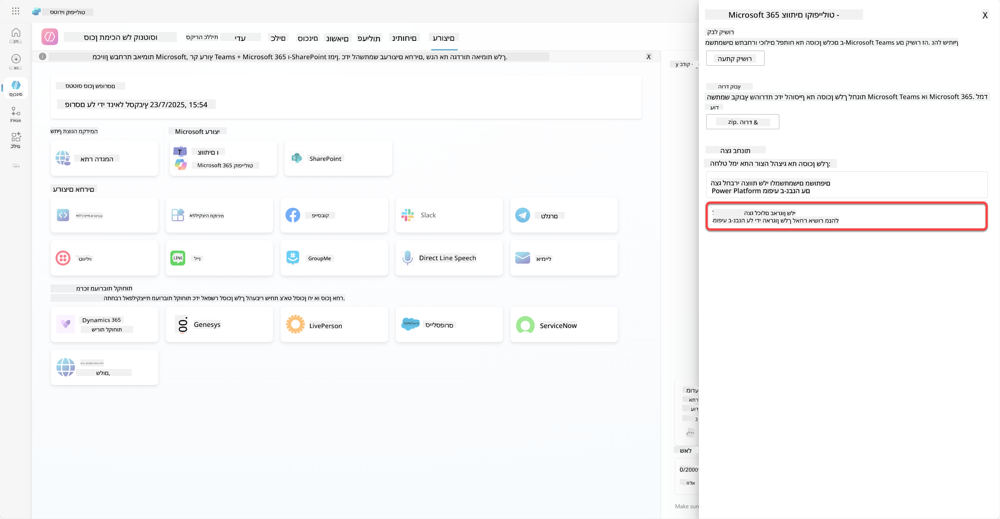

1. בחרו **שלח לאישור מנהל**

    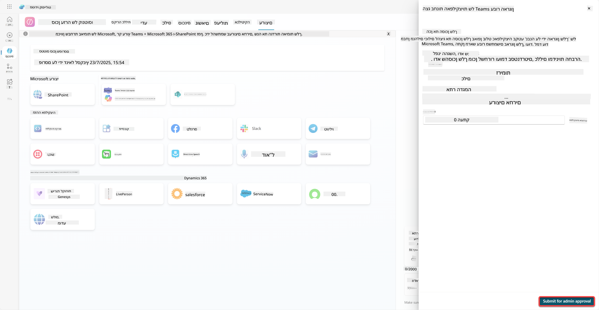

    עכשיו, המנהל שלכם צריך לאשר את הגשת הסוכן. הוא יכול לעשות זאת על ידי כניסה למרכז הניהול של Teams וחיפוש אחר Contoso Helpdesk Agent באפליקציות. בתמונה ניתן לראות מה המנהל יראה במרכז הניהול של Teams.

    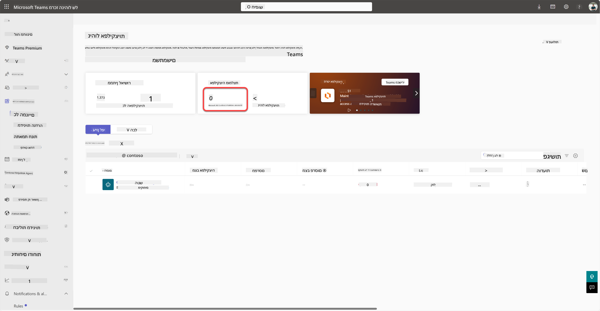

    המנהל צריך לבחור את Contoso Helpdesk Agent ולבחור *פרסם* כדי לפרסם את הסוכן לכל המשתמשים.

    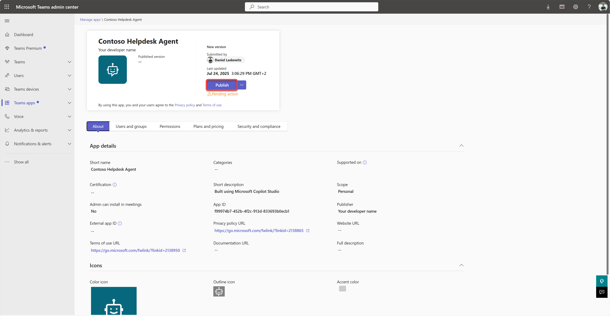

    כאשר המנהל פרסם את הגשת הסוכן, תוכלו לרענן את Copilot Studio ותראו את הבאנר *זמין בחנות האפליקציות* באפשרויות הזמינות.

    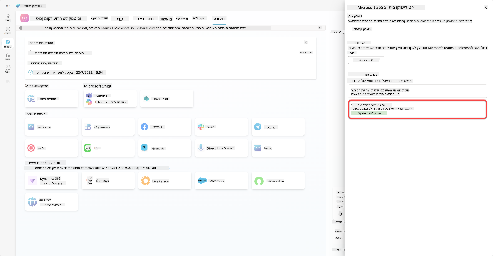

יש כאן אפילו יותר אפשרויות. המנהל שלכם יכול לשנות את מדיניות ההגדרה הגלובלית ולהתקין אוטומטית את Contoso Helpdesk Agent לכל המשתמשים בדייר. בנוסף לכך - אתם יכולים להצמיד את Contoso Helpdesk Agent לסרגל השמאלי כך שלכולם תהיה גישה נוחה אליו.

## ✅ משימה הושלמה

🎉 **מזל טוב!** הצלחתם לפרסם את הסוכן שלכם ולהוסיף אותו ל-Teams ול-Microsoft 365 Copilot! המשימה הבאה היא המשימה האחרונה בקורס: הבנת רישוי.

⏭️ [עברו לשיעור **הבנת רישוי**](../12-understanding-licensing/README.md)

## 📚 משאבים טקטיים

🔗 [תיעוד ערוצי פרסום](https://learn.microsoft.com/microsoft-copilot-studio/publication-fundamentals-publish-channels)

---

**כתב ויתור**:  
מסמך זה תורגם באמצעות שירות תרגום AI [Co-op Translator](https://github.com/Azure/co-op-translator). למרות שאנו שואפים לדיוק, יש להיות מודעים לכך שתרגומים אוטומטיים עשויים להכיל שגיאות או אי דיוקים. המסמך המקורי בשפתו המקורית צריך להיחשב כמקור סמכותי. עבור מידע קריטי, מומלץ להשתמש בתרגום מקצועי אנושי. איננו אחראים לאי הבנות או לפרשנויות שגויות הנובעות משימוש בתרגום זה.