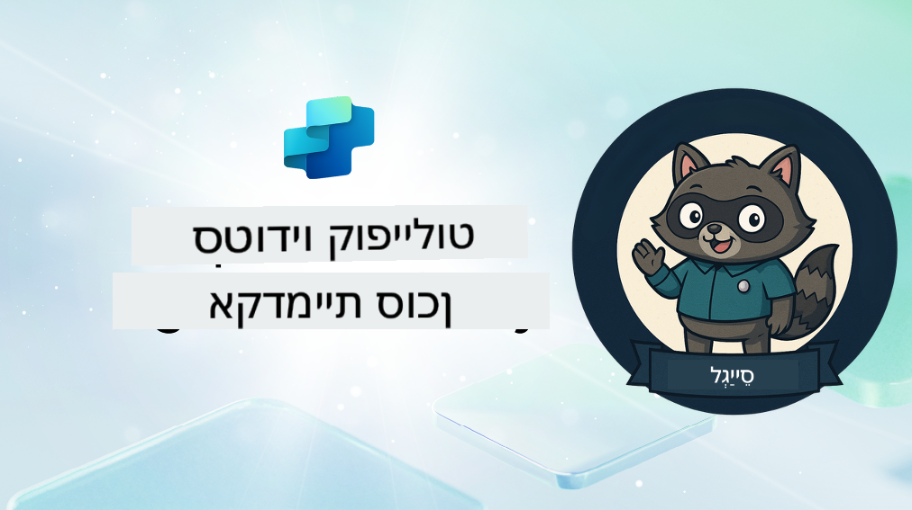

<!--
CO_OP_TRANSLATOR_METADATA:
{
  "original_hash": "8b5ecad9d5d073ea3f4c2b844e80f2e5",
  "translation_date": "2025-10-17T01:14:16+00:00",
  "source_file": "docs/recruit/README.md",
  "language_code": "he"
}
-->
# ברוך הבא מגויס

**ברוך הבא, מגויס.**  
המשימה שלך—אם תבחר לקבל אותה—היא לשלוט באמנות בניית סוכנים באמצעות **Microsoft Copilot Studio**.

ההכשרה המעשית הזו היא נקודת הכניסה שלך אל **עולם הסוכנים**: החל מהנחיות מבוססות ועד כרטיסי Adaptive וזרימות סוכנים, תלמד כיצד לבנות, להרחיב ולפרוס סוכנים חכמים באמצעות כלים ומקרי שימוש אמיתיים.

---

## 🎯 מטרת המשימה

עם סיום אקדמיית הסוכנים, תוכל:

- להבין מה הם סוכנים בהקשר של Microsoft Copilot Studio
- לחקור כיצד מודלים שפתיים גדולים (LLMs), יצירה מוגברת על ידי אחזור (RAG) ותזמור משתלבים יחד בסוכן
- לבנות סוכנים **הצהרתיים** וגם **מותאמים אישית**
- לשפר סוכנים באמצעות **נושאים**, **כרטיסי Adaptive**, ו**זרימות סוכנים**
- לפרוס סוכנים ל**Microsoft Teams** ול**Microsoft 365 Copilot**

---

## 🧪 דרישות מקדימות

כדי להשלים את כל המשימות, תצטרך:

- דייר מפתח של Microsoft 365 (עם SharePoint מופעל)
- גישה ל**Microsoft Copilot Studio** (גרסת ניסיון או רישיון)
- אופציונלי: ידע בסיסי ב-SharePoint, Power Platform או Power Fx

---

## 🧬 למי זה מיועד

הקורס הזה מתאים ל:

- יוצרים ומפתחים שחוקרים את **Copilot Studio**
- אנשי IT שבונים **הרחבות Microsoft 365 Copilot**
- חובבי Power Platform שרוצים **להתקדם** עם סוכנים חכמים
- כל מי שמעדיף ללמוד דרך **עשייה**

---

## 🧭 סקירת תכנית הלימודים

האקדמיה מחולקת לשיעורים מתקדמים—כל אחד מהם מעוצב כמשימת שטח לשיפור יכולות בניית הסוכנים שלך.

| שיעור | כותרת | תדריך משימה |
|--------|-------|------------------|
| `00` | 🧰 [הגדרת הקורס](./00-course-setup/README.md) | הגדר את סביבת הפיתוח שלך, גרסת הניסיון של Copilot Studio ואתר SharePoint |
| `01` | 🧠 [מבוא לסוכנים](./01-introduction-to-agents/README.md) | הבן מושגים של AI שיחתי, LLMs, וסוכנים אוטונומיים מול הצהרתיים |
| `02` | 🛠️ [יסודות Copilot Studio](./02-copilot-studio-fundamentals/README.md) | למד את אבני הבניין: ידע, מיומנויות, אוטונומיה |
| `03` | 👩‍💻 [יצירת סוכן הצהרתי](./03-create-a-declarative-agent-for-M365Copilot/README.md) | הוסף את הסוכן שלך ל-Microsoft 365 Copilot, מבוסס על הנחיה |
| `04` | 🧩 [יצירת פתרון](./04-creating-a-solution/README.md) | ארוז את הסוכן שלך לפתרון לשימוש חוזר לניהול סביבה |
| `05` | 🚀 [התחל עם סוכנים מוכנים מראש](./05-using-prebuilt-agents/README.md) | השתמש והתאם תבנית סוכן להאצת ההגדרה |
| `06` | ✍️ [בניית סוכן מותאם אישית](./06-create-agent-from-conversation/README.md) | צור Copilot חדש המבוסס על מקורות ידע |
| `07` | 🧠 [הוספת נושא עם טריגרים](./07-add-new-topic-with-trigger/README.md) | השתמש בנושאים כדי להגדיר מסלולי שאלה/תשובה מותאמים אישית |
| `08` | 🪪 [שיפור עם כרטיסי Adaptive](./08-add-adaptive-card/README.md) | בנה כרטיס Adaptive באמצעות Power Fx ו-SharePoint |
| `09` | 🔁 [אוטומציה עם זרימות סוכנים](./09-add-an-agent-flow/README.md) | השתמש בקלט כרטיס Adaptive כדי להפעיל זרימות אחוריות |
| `10` | 🧭 [הוספת טריגרים לאירועים](./10-add-event-triggers/README.md) | אפשר לסוכן שלך לפעול באופן אוטונומי באמצעות לוגיקה מבוססת אירועים |
| `11` | 📢 [פרסום הסוכן שלך](./11-publish-your-agent/README.md) | פרוס את הסוכן שלך ל-Microsoft Teams ול-Microsoft 365 Copilot |
| `12` | 🪪 [הבנת רישוי](./12-understanding-licensing/README.md) | למד כיצד רישוי וחיוב עובדים עם Copilot Studio |
| `13` | 🚨 [השגת תג המגויס שלך](./course-completion-badges-recruit/README.md) | קבל את התג שלך וסמן את ההישג שלך! |

!!! note
    ✅ השלמת תכנית הלימודים הזו תזכה אותך בתג **מגויס**.  
    🔓 **מבצע** ו**מפקד** ייפתחו בשלבים עתידיים.

<!-- markdownlint-disable-next-line MD033 -->

---

**כתב ויתור**:  
מסמך זה תורגם באמצעות שירות תרגום מבוסס AI [Co-op Translator](https://github.com/Azure/co-op-translator). למרות שאנו שואפים לדיוק, יש לקחת בחשבון שתרגומים אוטומטיים עשויים להכיל שגיאות או אי דיוקים. המסמך המקורי בשפתו המקורית צריך להיחשב כמקור סמכותי. עבור מידע קריטי, מומלץ להשתמש בתרגום מקצועי אנושי. איננו אחראים לאי הבנות או לפרשנויות שגויות הנובעות משימוש בתרגום זה.