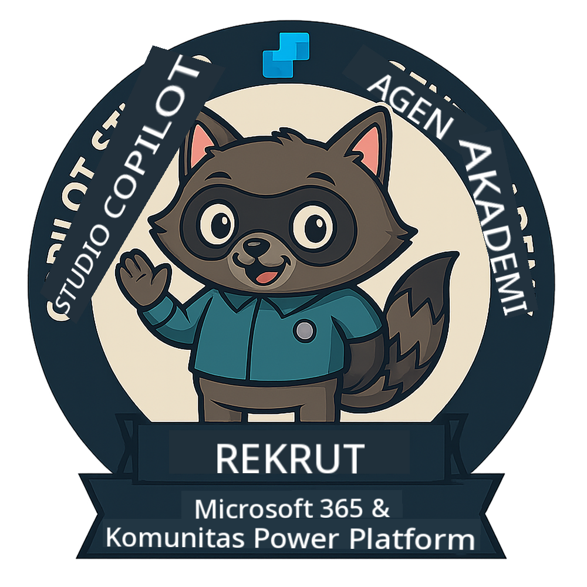
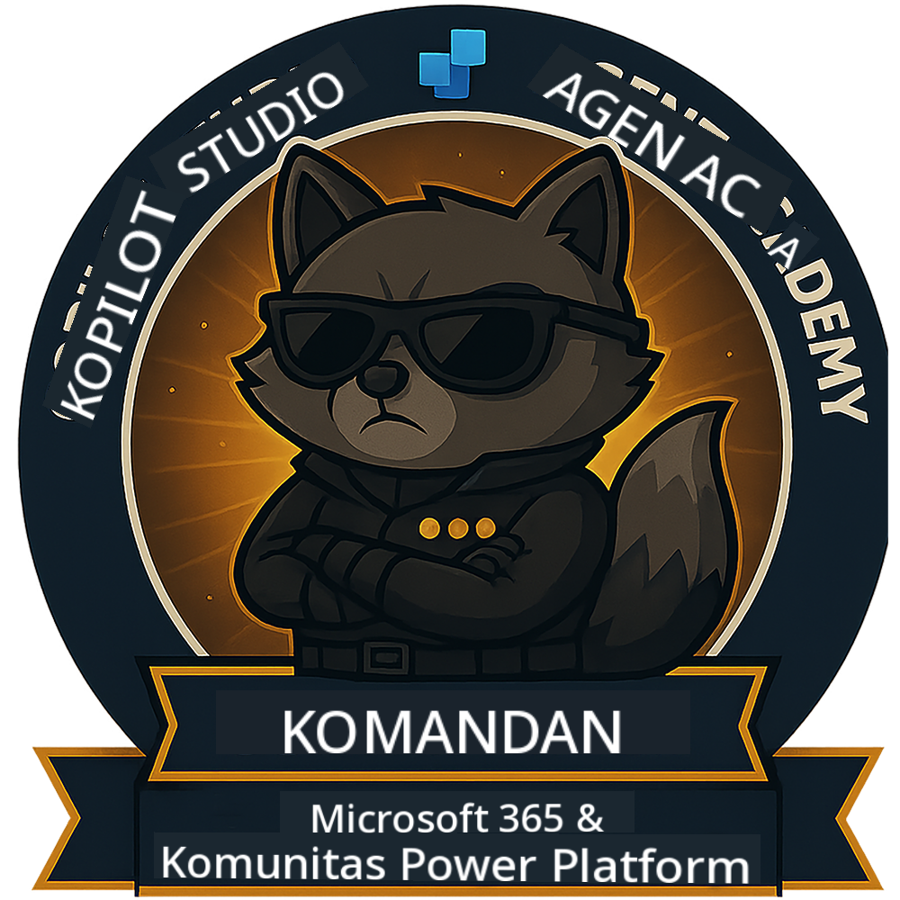

<!--
CO_OP_TRANSLATOR_METADATA:
{
  "original_hash": "15e57e059ce7689d602d7853187235cd",
  "translation_date": "2025-10-17T17:07:36+00:00",
  "source_file": "docs/index.md",
  "language_code": "id"
}
-->
---
hide:
- navigation
---

# Akademi Agen Copilot Studio

**Selamat datang di Akademi Agen Copilot Studio.**  

Misi Anda—jika Anda memilih untuk menerimanya—adalah menguasai seni membangun agen menggunakan **Microsoft Copilot Studio**.

Pelatihan langsung ini adalah pintu masuk Anda ke **dunia agen**: mulai dari prompt yang terarah hingga Adaptive Cards dan alur agen, Anda akan belajar cara membangun, mengembangkan, dan menerapkan agen cerdas menggunakan alat dan kasus penggunaan nyata.

---

## 🏅 Peningkatan Peringkat

**Akademi Agen Copilot Studio** adalah program pelatihan multi-fase yang dirancang untuk meningkatkan keterampilan Anda melalui tiga peringkat agen. Setiap level mencakup lencana dan tanggung jawab yang semakin meningkat:

| Peringkat         | Level | Visual |
|------------------|:-----:|--------|
| 🟢 **Rekrut**  [🚀 Mulai sekarang](https://aka.ms/agent-academy-recruit){ .md-button .md-button--primary }     | •     | { width="300" }     |
| 🔵 **Operatif** (Segera Hadir)   | ••    | { width="300" } |
| 🟡 **Komandan** (Segera Hadir)    | •••   | { width="300" } |

Setiap level membangun keterampilan dari level sebelumnya. Selesaikan misi Rekrut Anda, dan nantikan untuk meningkatkan kredensial agen Anda.

---

## 🎒 Kursus Lainnya

Lihat kursus lainnya untuk terus belajar tentang AI dan Agen:

- [Microsoft Copilot Studio <3 MCP Lab](https://aka.ms/mcsmcplab)
- [Copilot Developer Camp](https://microsoft.github.io/copilot-camp/)
- [AI Agents untuk Pemula](https://microsoft.github.io/ai-agents-for-beginners/)
- [Model Context Protocol (MCP) untuk Pemula](https://github.com/microsoft/mcp-for-beginners)

---

## 🚑 Masalah

Kami sangat menghargai masukan Anda! Silakan gunakan [daftar masalah](https://github.com/microsoft/agent-academy/issues) untuk berbagi komentar dan masalah Anda. Terima kasih!

---

## 📜 Kode Etik

Proyek ini telah mengadopsi [Kode Etik Sumber Terbuka Microsoft](https://opensource.microsoft.com/codeofconduct/).

!!! info "Sumber Daya:"

    - [Kode Etik Sumber Terbuka Microsoft](https://opensource.microsoft.com/codeofconduct/)
    - [FAQ Kode Etik Microsoft](https://opensource.microsoft.com/codeofconduct/faq/)
    - Hubungi [opencode@microsoft.com](mailto:opencode@microsoft.com) untuk pertanyaan atau kekhawatiran

---

[⭐️ Beri bintang pada repositori kami](https://github.com/microsoft/agent-academy){ .md-button .md-button--primary }

<!-- markdownlint-disable-next-line MD033 -->

---

**Penafian**:  
Dokumen ini telah diterjemahkan menggunakan layanan penerjemahan AI [Co-op Translator](https://github.com/Azure/co-op-translator). Meskipun kami berupaya untuk memberikan hasil yang akurat, harap diketahui bahwa terjemahan otomatis mungkin mengandung kesalahan atau ketidakakuratan. Dokumen asli dalam bahasa aslinya harus dianggap sebagai sumber yang otoritatif. Untuk informasi yang penting, disarankan menggunakan jasa penerjemahan manusia profesional. Kami tidak bertanggung jawab atas kesalahpahaman atau interpretasi yang keliru yang timbul dari penggunaan terjemahan ini.