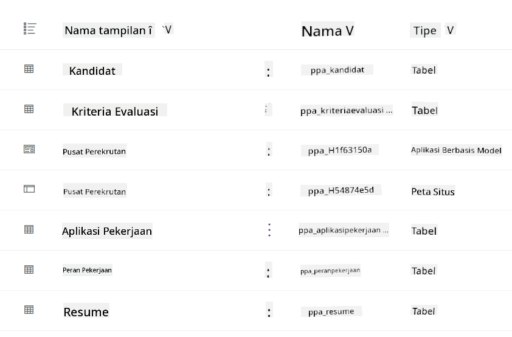
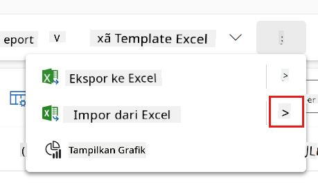
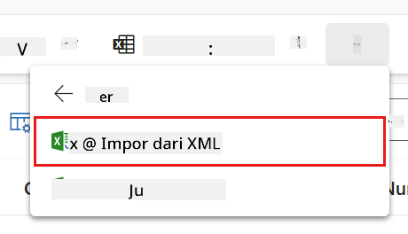
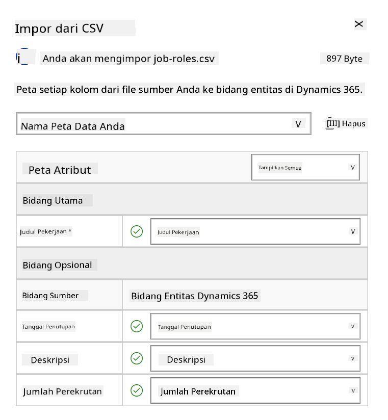
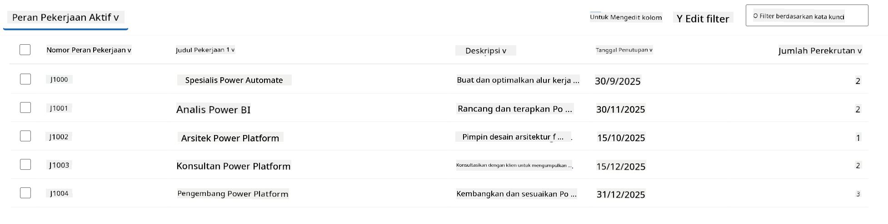
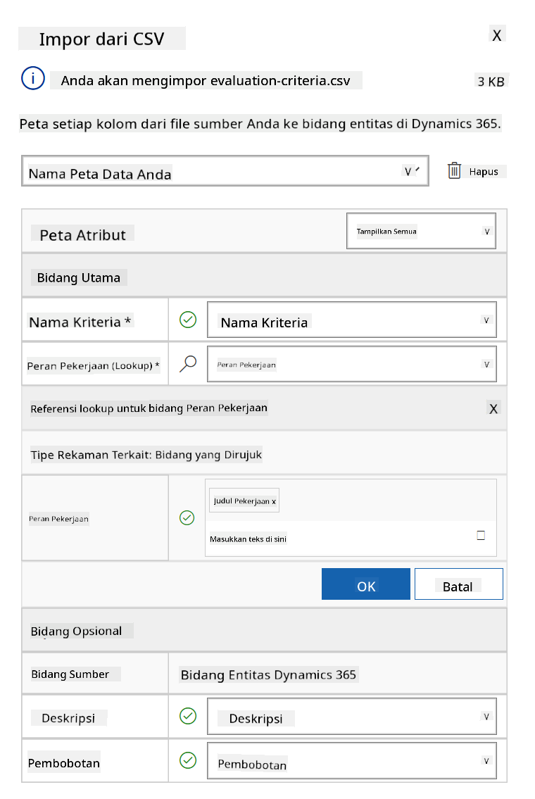
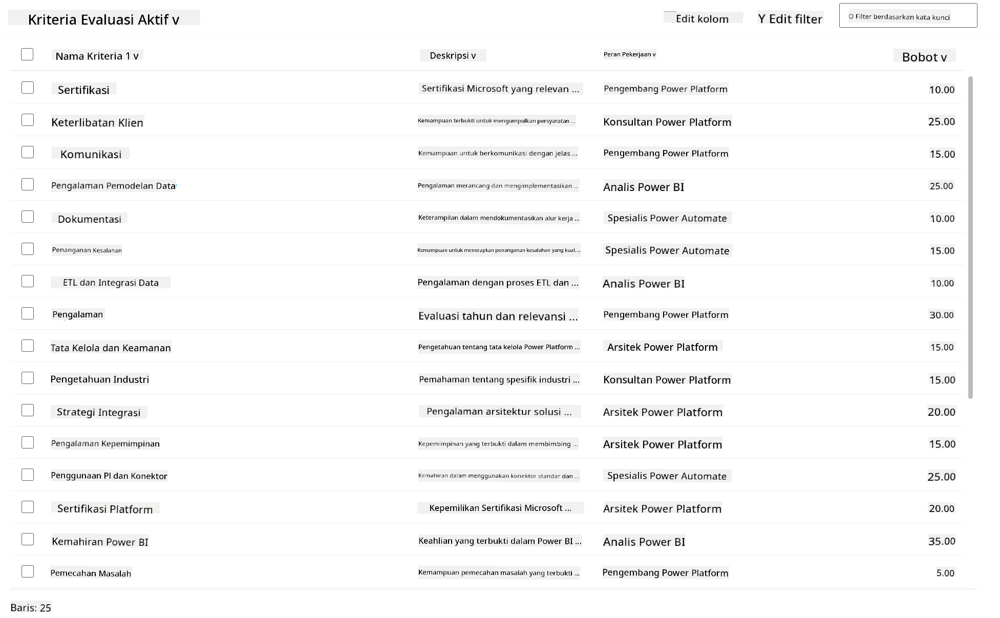

<!--
CO_OP_TRANSLATOR_METADATA:
{
  "original_hash": "2620cf9eaf09a3fc6be7fa31a3a62956",
  "translation_date": "2025-10-17T17:17:30+00:00",
  "source_file": "docs/operative-preview/01-get-started/README.md",
  "language_code": "id"
}
-->
# 🚨 Misi 01: Memulai dengan Hiring Agent

--8<-- "disclaimer.md"

## 🕵️‍♂️ NAMA KODE: `OPERASI PENCARI TALENTA`

> **⏱️ Waktu Operasi:** `~45 menit`

## 🎯 Penjelasan Misi

Selamat datang, Agen. Tugas pertama Anda adalah **Operasi Pencari Talenta** - membangun infrastruktur dasar untuk sistem rekrutmen berbasis AI yang akan mengubah cara organisasi mengidentifikasi dan merekrut talenta terbaik.

Misi Anda, jika Anda memilih untuk menerimanya, adalah mengimplementasikan dan mengonfigurasi sistem manajemen rekrutmen yang komprehensif menggunakan Microsoft Copilot Studio. Anda akan mengimpor solusi yang sudah dibuat sebelumnya yang berisi semua struktur data yang diperlukan, lalu membuat agen AI pertama Anda - **Hiring Agent** - yang akan menjadi pengatur utama untuk semua operasi rekrutmen di masa depan.

Implementasi awal ini akan menjadi pusat kendali yang akan Anda tingkatkan selama program Operative Agent Academy. Anggap ini sebagai basis operasi Anda - fondasi untuk membangun jaringan agen khusus di misi-misi berikutnya.

---

## 🔎 Tujuan

Dengan menyelesaikan misi ini, Anda akan:

- **Pemahaman Skenario**: Mendapatkan pengetahuan mendalam tentang tantangan dan solusi otomatisasi rekrutmen
- **Implementasi Solusi**: Berhasil mengimpor dan mengonfigurasi dasar-dasar sistem manajemen rekrutmen
- **Pembuatan Agen**: Membuat Hiring Agent yang menjadi awal dari skenario yang akan Anda bangun sebagai Operative Agent Academy

---

## 🔍 Prasyarat

Sebelum memulai misi ini, pastikan Anda memiliki:

- Lisensi Copilot Studio
- Akses ke lingkungan Microsoft Power Platform
- Izin administratif untuk membuat solusi dan agen

---

## 🏢 Memahami Skenario Otomatisasi Rekrutmen

Skenario ini menunjukkan bagaimana sebuah perusahaan dapat menggunakan Microsoft Copilot Studio untuk meningkatkan dan mengotomatisasi proses rekrutmen mereka. Sistem ini memperkenalkan jaringan agen yang bekerja sama untuk menangani tugas-tugas seperti meninjau resume, merekomendasikan peran pekerjaan, mempersiapkan materi wawancara, dan mengevaluasi kandidat.

### Nilai Bisnis

Solusi ini membantu tim HR menghemat waktu dan membuat keputusan yang lebih baik dengan:

- Memproses resume yang diterima melalui email secara otomatis.
- Menyarankan peran pekerjaan yang sesuai berdasarkan profil kandidat.
- Membuat aplikasi pekerjaan dan panduan wawancara yang disesuaikan untuk setiap kandidat.
- Memastikan praktik rekrutmen yang adil dan sesuai melalui fitur keamanan dan moderasi bawaan.
- Mengumpulkan umpan balik untuk meningkatkan solusi.

### Cara Kerjanya

- **Hiring Agent** pusat mengoordinasikan proses dan menyimpan data di Microsoft Dataverse.
- **Application Intake Agent** membaca resume dan membuat aplikasi pekerjaan.
- **Interview Prep Agent** menghasilkan pertanyaan wawancara dan dokumen berdasarkan latar belakang kandidat.
- Sistem ini dapat dipublikasikan ke situs demo, memungkinkan para pemangku kepentingan untuk berinteraksi dengannya.

Skenario ini sangat cocok untuk organisasi yang ingin memodernisasi alur kerja rekrutmen mereka menggunakan otomatisasi berbasis AI, sambil tetap menjaga transparansi, keadilan, dan efisiensi.

---

## 🧪 Lab: Menyiapkan Hiring Agent

Dalam lab ini, Anda akan membangun dasar untuk sistem otomatisasi rekrutmen Anda. Anda akan mulai dengan mengimpor solusi yang sudah dikonfigurasi sebelumnya yang berisi semua tabel Dataverse dan struktur data yang diperlukan untuk mengelola kandidat, posisi pekerjaan, dan alur kerja rekrutmen. Selanjutnya, Anda akan mengisi tabel-tabel ini dengan data contoh yang akan mendukung pembelajaran Anda sepanjang modul ini dan memberikan skenario realistis untuk pengujian. Akhirnya, Anda akan membuat Hiring Agent di Copilot Studio, mengatur antarmuka percakapan dasar yang akan menjadi landasan untuk semua fitur lain yang akan Anda tambahkan di misi-misi mendatang.

### 🧪 Lab 1.1: Mengimpor solusi

1. Pergi ke **[Copilot Studio](https://copilotstudio.microsoft.com)**
1. Pilih **...** di navigasi kiri dan pilih **Solutions**
1. Pilih tombol **Import Solution** di bagian atas
1. **[Unduh](https://raw.githubusercontent.com/microsoft/agent-academy/refs/heads/main/docs/operative-preview/01-get-started/assets/Operative_1_0_0_0.zip)** solusi yang telah disiapkan
1. Pilih **Browse** dan pilih solusi yang telah diunduh dari langkah sebelumnya
1. Pilih **Next**
1. Pilih **Import**

!!! success
    Jika berhasil, Anda akan melihat bilah notifikasi hijau dengan pesan berikut saat selesai:  
    "Solusi "Operative" berhasil diimpor."

Setelah solusi diimpor, lihat apa yang telah Anda impor dengan memilih nama tampilan solusi (`Operative`).



Komponen berikut telah diimpor:

| Nama Tampilan | Tipe | Deskripsi |
|---------------|------|-----------|
| Candidate | Tabel | Informasi kandidat |
| Evaluation Criteria | Tabel | Kriteria evaluasi untuk peran |
| Hiring Hub | Model-Driven App | Aplikasi untuk mengelola proses rekrutmen |
| Hiring Hub | Site Map | Struktur navigasi untuk aplikasi Hiring Hub |
| Job Application | Tabel | Aplikasi pekerjaan |
| Job Role | Tabel | Peran pekerjaan |
| Resume | Tabel | Resume kandidat |

Sebagai tugas terakhir untuk lab ini, pilih tombol **Publish all customizations** di bagian atas halaman.

### 🧪 Lab 1.2: Mengimpor data contoh

Dalam lab ini, Anda akan menambahkan data contoh ke beberapa tabel yang telah Anda impor di lab 1.1.

#### Unduh file untuk diimpor

1. **[Unduh](https://raw.githubusercontent.com/microsoft/agent-academy/refs/heads/main/docs/operative-preview/01-get-started/assets/evaluation-criteria.csv)** file CSV dengan kriteria evaluasi
1. **[Unduh](https://raw.githubusercontent.com/microsoft/agent-academy/refs/heads/main/docs/operative-preview/01-get-started/assets/job-roles.csv)** file CSV dengan peran pekerjaan

#### Mengimpor data contoh Job Role

1. Kembali ke solusi yang baru saja Anda impor di lab sebelumnya
1. Pilih **Hiring Hub** Model-Driven App dengan memilih tanda centang di depan baris
1. Pilih tombol **Play** di bagian atas

    !!! warning
        Anda mungkin diminta untuk login lagi. Pastikan untuk melakukannya. Setelah itu, Anda akan melihat aplikasi Hiring Hub.

1. Pilih **Job Roles** di navigasi kiri
1. Pilih ikon **More** (tiga titik vertikal) di bilah perintah
1. Pilih **panah kanan** di sebelah *Import from Excel*

    

1. Pilih **Import from CSV**

    

1. Pilih tombol **Choose File**, pilih file **job-roles.csv** yang baru saja Anda unduh, lalu pilih **Open**
1. Pilih **Next**
1. Biarkan langkah berikutnya seperti apa adanya dan pilih **Review Mapping**

    

1. Pastikan pemetaan sudah benar dan pilih **Finish Import**

    !!! info
        Ini akan memulai proses impor dan Anda dapat melacak kemajuan atau menyelesaikan proses segera dengan memilih **Done**

1. Pilih **Done**

Proses ini mungkin memakan waktu, tetapi Anda dapat menekan tombol **Refresh** untuk melihat apakah impor telah berhasil.



#### Mengimpor data contoh Evaluation Criteria

1. Pilih **Evaluation Criteria** di navigasi kiri
1. Pilih ikon **More** (tiga titik vertikal) di bilah perintah
1. Pilih **panah kanan** di sebelah *Import from Excel*

    

1. Pilih **Import from CSV**

    

1. Pilih tombol **Choose File**, pilih file **evaluation-criteria.csv** yang baru saja Anda unduh, lalu pilih **Open**
1. Pilih **Next**
1. Biarkan langkah berikutnya seperti apa adanya dan pilih **Review Mapping**

    

1. Sekarang kita perlu melakukan sedikit lebih banyak pekerjaan untuk pemetaan. Pilih ikon kaca pembesar (🔎) di sebelah bidang Job Role
1. Pastikan **Job Title** dipilih di sini, dan jika tidak - tambahkan
1. Pilih **OK**
1. Pastikan pemetaan lainnya juga benar dan pilih **Finish Import**

    !!! info
        Ini akan memulai proses impor lagi dan Anda dapat melacak kemajuan atau menyelesaikan proses segera dengan memilih **Done**

1. Pilih **Done**

Proses ini mungkin memakan waktu, tetapi Anda dapat menekan tombol **Refresh** untuk melihat apakah impor telah berhasil.



### 🧪 Lab 1.3: Membuat Hiring Agent

Sekarang Anda telah menyelesaikan pengaturan prasyarat, saatnya untuk pekerjaan utama! Mari tambahkan Hiring Agent kita terlebih dahulu!

1. Pergi ke **[Copilot Studio](https://copilotstudio.microsoft.com)** dan pastikan Anda berada di lingkungan yang sama dengan tempat Anda mengimpor solusi dan data
1. Pilih **Agents** di navigasi kiri
1. Pilih **New Agent**
1. Pilih **Configure**
1. Untuk **Name**, masukkan:

    ```text
    Hiring Agent
    ```

1. Untuk **Description**, masukkan:

    ```text
    Central orchestrator for all hiring activities
    ```

1. Pilih **...** di sebelah tombol *Create* di sudut kanan atas
1. Pilih **Update advanced settings**
1. Sebagai **Solution**, pilih `Operative`
1. Pilih **Update**
1. Pilih **Create** di sudut kanan atas

Ini akan membuat Hiring Agent untuk Anda, yang akan Anda gunakan sepanjang kursus Operative ini.

---

## 🎉 Misi Selesai

Misi 01 selesai! Anda sekarang telah menguasai keterampilan berikut:

✅ **Pemahaman Skenario**: Pengetahuan mendalam tentang tantangan dan solusi otomatisasi rekrutmen  
✅ **Implementasi Solusi**: Berhasil mengimpor dan mengonfigurasi dasar-dasar sistem manajemen rekrutmen  
✅ **Pembuatan Agen**: Membuat Hiring Agent yang menjadi awal dari skenario yang akan Anda bangun sebagai Operative Agent Academy  

Selanjutnya adalah [Misi 02](../02-multi-agent/README.md): Membuat agen Anda siap multi-agen dengan agen yang terhubung.

---

## 📚 Sumber Daya Taktis

📖 [Microsoft Copilot Studio - Membuat agen](https://learn.microsoft.com/microsoft-copilot-studio/authoring-first-bot)  
📖 [Dokumentasi Microsoft Dataverse](https://learn.microsoft.com/power-apps/maker/data-platform)

---

**Penafian**:  
Dokumen ini telah diterjemahkan menggunakan layanan penerjemahan AI [Co-op Translator](https://github.com/Azure/co-op-translator). Meskipun kami berupaya untuk memberikan hasil yang akurat, harap diketahui bahwa terjemahan otomatis mungkin mengandung kesalahan atau ketidakakuratan. Dokumen asli dalam bahasa aslinya harus dianggap sebagai sumber yang otoritatif. Untuk informasi yang penting, disarankan menggunakan jasa penerjemahan manusia profesional. Kami tidak bertanggung jawab atas kesalahpahaman atau penafsiran yang keliru yang timbul dari penggunaan terjemahan ini.