<!--
CO_OP_TRANSLATOR_METADATA:
{
  "original_hash": "75efaf515d5694d4fd549bfd6518901a",
  "translation_date": "2025-10-17T17:19:13+00:00",
  "source_file": "docs/operative-preview/03-automate-triggers/README.md",
  "language_code": "id"
}
-->
# Misi 03: Tambahkan Pemicu Acara untuk bertindak secara mandiri

--8<-- "disclaimer.md"

## 🕵️‍♂️ NAMA KODE: `OPERASI TITIK SINYAL`

> **⏱️ Waktu Operasi:** `~45 menit`

## 🎯 Ringkasan Misi

Selamat datang kembali, Agen. Dalam [Misi 02](../02-multi-agent/README.md) - Anda telah belajar cara membangun agen anak untuk Penerimaan Aplikasi dan agen terhubung untuk Persiapan Wawancara guna memperluas kemampuan Agen Perekrutan utama Anda.

Tugas Anda, jika Anda memilih untuk menerimanya, adalah **Operasi Titik Sinyal** - mendalami **pemicu acara** - meningkatkan sistem agen Anda dari reaktif menjadi **operasi mandiri**. Anda akan mengubah agen Anda dari menunggu input manusia menjadi merespons secara proaktif terhadap acara eksternal dan mengambil tindakan cerdas tanpa pengawasan.

Anggaplah ini sebagai peningkatan dari agen yang _menjawab pertanyaan_ menjadi agen yang _mengantisipasi kebutuhan_ dan _bertindak secara mandiri_. Melalui pemicu acara dan alur kerja otomatis, Agen Perekrutan Anda akan mendeteksi email resume yang masuk, memproses lampiran secara otomatis, menyimpan data di Dataverse, dan memberi tahu tim rekrutmen HR Anda melalui Microsoft Teams - semuanya sementara Anda fokus pada tugas yang lebih bernilai tinggi.

Selamat datang di dunia di mana otomatisasi bertemu dengan kecerdasan.

## 🔎 Tujuan

Dalam misi ini, Anda akan belajar:

1. Bagaimana pemicu acara memungkinkan perilaku agen mandiri tanpa interaksi pengguna
1. Perbedaan antara agen interaktif dan mandiri di Copilot Studio
1. Cara membuat pemicu acara yang secara otomatis memproses lampiran email dan mengunggah file ke Dataverse
1. Cara membangun alur agen yang memposting kartu adaptif ke saluran Teams untuk pemberitahuan
1. Cara meneruskan data antara pemicu acara dan alur agen untuk otomatisasi ujung ke ujung

## 🤔 Apa itu Pemicu Acara?

Sebelumnya dalam [Recruit](../../recruit/10-add-event-triggers/README.md), kita telah belajar tentang pemicu acara. Mari kita lakukan rekap cepat tentang ini jika Anda melewatkannya.

**Pemicu acara** memungkinkan agen _bertindak_ sendiri ketika sesuatu terjadi di sistem lain - tidak diperlukan pesan pengguna. Ketika acara yang dikonfigurasi terjadi - seperti “item baru di SharePoint,” “email baru,” “tugas Planner ditugaskan,” atau bahkan pengulangan berbasis waktu, konektor mengirimkan payload pemicu ke agen Anda. Agen kemudian mengikuti instruksi Anda untuk memutuskan tindakan atau topik mana yang akan dipanggil.

### Karakteristik Utama

- **Aktivasi mandiri:**
      - Tidak seperti pemicu topik yang dimulai ketika pengguna mengetik ke agen, pemicu acara terjadi dari acara eksternal, memungkinkan perilaku proaktif.

- **Berbasis payload:**
      - Setiap acara mengirimkan payload (variabel + instruksi opsional) melalui konektor. Agen menggunakan instruksi yang Anda tentukan dan payload untuk memilih apa yang harus dilakukan selanjutnya.
      - Misalnya _memanggil topik_ atau _menjalankan tindakan yang ditentukan oleh Tools_.

- **Contoh bawaan:**
      - File atau item SharePoint/OneDrive dibuat
      - Tugas Planner selesai/diberikan
      - Respons Microsoft Forms dikirimkan
      - Pengulangan/jadwal

    Ketersediaan tergantung pada kebijakan data organisasi Anda yang dikonfigurasi di Power Automate.

- **Memerlukan orkestrasi generatif:**
      - Pemicu acara hanya tersedia ketika orkestrasi generatif diaktifkan untuk agen.

- **Penagihan/penggunaan:**
      - Setiap pengiriman pemicu dihitung sebagai pesan terhadap kapasitas Copilot Studio.
      - Misalnya pengulangan 10 menit mengirimkan pesan setiap 10 menit.

- **Model otentikasi dan pengaturan:**
      - Anda menambahkan pemicu dalam Ikhtisar agen, di bawah _Triggers_. Otentikasi untuk konektor pemicu menggunakan akun pembuat agen (“otentikasi penulis agen”).
      - Anda dapat mengedit parameter pemicu dan payload di portal pembuat Power Automate.

- **Pengujian & observabilitas:**
      - Anda dapat menguji pemicu dari panel uji agen dan memeriksa perilaku dengan peta aktivitas sebelum menerbitkan.

!!! info "TL;DR untuk pengembang"

    Anggaplah pemicu acara sebagai **sinyal mirip webhook** yang mendorong payload terstruktur ke agen Anda, memungkinkan agen _memulai_ pekerjaan dan menghubungkan tindakan di seluruh sistem - tanpa menunggu pengguna untuk bertanya.

### Pemicu topik - bagaimana mereka berbeda

Sebelumnya Anda telah belajar tentang pemicu topik dalam [Recruit](../../recruit/07-add-new-topic-with-trigger/README.md), namun Anda mungkin masih bertanya-tanya bagaimana _Pemicu Topik_ berbeda dari _Pemicu Acara_, dan mengapa perbedaan itu penting untuk memahami apa yang membuat agen mandiri.

Pemicu topik mengontrol _kapan topik berjalan_, biasanya sebagai respons terhadap pesan pengguna.

- Dalam orkestrasi generatif, pemicu default adalah **Oleh agen** - perencana memilih topik yang nama/deskripsinya paling cocok dengan pesan pengguna.
- Dalam orkestrasi klasik, default adalah **Frasa** - perencana memilih topik ketika satu atau beberapa frasa pemicu paling cocok dengan pesan pengguna.

Jenis pemicu lainnya termasuk `Pesan diterima`, `Acara diterima`, `Aktivitas diterima`, `Pembaruan percakapan`, `Invoke diterima`, `Pengalihan`, `Tidak aktif`, dan `Rencana selesai`.

!!! info "Perbedaan inti"

    Pemicu topik adalah pemula _aktivitas percakapan_ di dalam obrolan.
    
    Pemicu acara adalah pemula _acara sistem_ yang dikirimkan melalui konektor yang dapat menjalankan agen tanpa percakapan sama sekali.

### Panduan cepat Pemicu Topik vs Pemicu Acara

- **Pemicu topik:** Pengguna (atau aktivitas obrolan) mengatakan/melakukan X ➡️ jalankan Topik T.
- **Pemicu acara:** SharePoint/Planner/Email/Timer terjadi dengan payload P ➡️ agen mengevaluasi instruksi ➡️ memanggil Tindakan/Topik sesuai.

## 🏓 Agen interaktif vs Agen mandiri - perbandingan

Sekarang Anda tahu perbedaan antara pemicu acara dan pemicu topik, mari kita pelajari perbedaan antara agen interaktif vs agen mandiri.

Dalam istilah Copilot Studio, "interaktif" merujuk pada agen yang terutama berinteraksi melalui **topik** dalam obrolan atau saluran. "Mandiri" merujuk pada agen yang juga memanfaatkan **pemicu acara** untuk berjalan tanpa input pengguna.

Tabel berikut merangkum perbedaan dan kesamaan mereka.

| Dimensi                             | Agen interaktif       | Agen mandiri                                                                                                  |
|-------------------------------------|-----------------------|---------------------------------------------------------------------------------------------------------------|
| Bagaimana memulai                   | Pengguna (atau aktivitas obrolan) memicu topik. Contoh: Oleh agen, Frasa, Pesan diterima.   | Pemicu acara eksternal mengirimkan payload melalui konektor ke agen. Contoh: SharePoint, Planner, email, jadwal, dll. |
| Penggunaan utama                    | Tanya jawab, alur kerja terpandu, tindakan berbasis permintaan dalam obrolan - Teams, web, dll.  | Operasi proaktif dan otomatisasi latar belakang - bereaksi terhadap perubahan sistem lalu memberi tahu, mengarsipkan, atau mengatur tugas. |
| Permukaan pemicu                    | Pemicu topik: Oleh agen / Frasa / Pesan diterima / Jenis aktivitas / Invoke / Tidak aktif / Rencana selesai | Perpustakaan pemicu acara melalui konektor; payload mencakup data acara + instruksi opsional. |
| Perencana (orkestrasi generatif)    | Sangat digunakan untuk pemicu Oleh agen dan Rencana selesai untuk memilih/mengurutkan topik. | Diperlukan untuk pemicu acara; agen menggunakan instruksi + payload untuk memutuskan tindakan/topik mana yang akan dipanggil. |
| Contoh khas                         | Pengguna bertanya "Apa kebijakan pengembalian dana kita?" → Topik berjalan, kueri pengetahuan, respons. | Tugas Planner baru ditugaskan → Pemicu acara terjadi → Agen memposting pesan Teams, memperbarui catatan, atau memanggil topik. |
| Jalur pengaturan                    | Buat topik, tentukan jenis pemicu, buat dialog/tindakan; terbitkan ke saluran. | Tambahkan pemicu acara (Ikhtisar → Triggers), otentikasi konektor dengan kredensial penulis agen, konfigurasikan payload/instruksi; uji melalui panel uji; terbitkan. |
| Otentikasi dan tata kelola          | Berjalan di bawah konteks saluran/otentikasi; pemicu topik merespons aktivitas obrolan di saluran yang diizinkan. | Ketersediaan pemicu tergantung pada kebijakan data Power Automate; konektor berjalan di bawah akun pembuat agen. |
| Observabilitas                      | Uji topik dalam Copilot Studio, periksa transkrip percakapan/aktivitas. | Gunakan Uji pemicu dan peta aktivitas untuk memvalidasi eksekusi sebelum menerbitkan, pantau aktivitas setelah menerbitkan. |
| Dampak kapasitas                    | Setiap pesan pengguna/respons agen adalah pesan yang mengonsumsi kapasitas. | Setiap pengiriman acara juga merupakan pesan, ditambah tindakan berikutnya. Contoh: pengulangan 10 menit = 6 pesan/jam |

### Kapan menggunakan yang mana?

- Pilih **pemicu topik (interaktif)** ketika pengguna memulai percakapan agen - FAQ, penerimaan terpandu, atau tugas gaya perintah di dalam obrolan. Pemicu Oleh agen perencana mengurangi kurasi frasa manual.
- Tambahkan **pemicu acara (mandiri)** ketika agen harus memulai percakapan atau mengambil tindakan sendiri - pada pembaruan di SharePoint/Dataverse, email masuk, atau pada jadwal. Ini mengubah Anda dari operasi reaktif menjadi proaktif.

## Tips & perhatian untuk pengembang

1. **Aktifkan orkestrasi generatif** untuk agen apa pun yang ingin Anda buat mandiri. Pemicu acara tidak akan muncul jika tidak diaktifkan.

1. **Model payload lebih awal.** Tentukan bidang minimal apa yang dibutuhkan agen Anda dari pemicu seperti `itemId`, `assignedTo`, `dueDate` dan tambahkan instruksi ringkas yang memberi tahu agen tindakan/topik mana yang harus dipanggil berdasarkan nilai payload.

1. **Lingkup otentikasi penting.** Pemicu mengotentikasi menggunakan akun pembuat agen. Pastikan akun tersebut memiliki izin konektor yang tepat dan mematuhi kebijakan data Power Automate.

1. **Kontrol biaya dan kebisingan.** Pengulangan frekuensi tinggi atau sumber yang sangat aktif dapat dengan cepat meningkatkan konsumsi pesan - batasi jika memungkinkan atau tambahkan kondisi dalam pemicu untuk menyaring acara.

1. **Uji sebelum menerbitkan.** Gunakan **Uji pemicu** dan peta aktivitas untuk melihat rencana dan tindakan yang dipanggil - iterasi pada instruksi/payload hingga perilaku stabil.

## 🧪 Lab 03 - Mengotomatisasi email aplikasi kandidat

Selanjutnya kita akan menambahkan pemicu acara ke **Agen Perekrutan** dan membangun alur agen di agen anak **Penerimaan Aplikasi** untuk menangani pemrosesan lebih lanjut secara mandiri.

### ✨ Skenario penggunaan

!!! info ""

    **Sebagai** Perekrut HR

    **Saya ingin** diberi tahu ketika email dengan resume tiba di Inbox saya yang telah diunggah secara otomatis ke Dataverse

    **Sehingga saya dapat** tetap diberi tahu tentang resume yang dikirim melalui email untuk aplikasi yang diunggah secara otomatis ke Dataverse

Kita akan mencapai ini menggunakan dua teknik

1. Pemicu acara untuk ketika email tiba,
    1. Periksa `contentType` file sama dengan `PDF` sebagai format tipe.
    1. Ekstrak file dan unggah ke Dataverse menggunakan tindakan melalui konektor Dataverse.
    1. Kemudian kirimkan prompt ke agen untuk pemrosesan lebih lanjut dengan meneruskan parameter input dari tindakan Dataverse.

1. Alur agen akan ditambahkan ke agen anak **Penerimaan Aplikasi** yang dipanggil oleh prompt dalam pemicu acara.
    1. Gunakan parameter input yang diteruskan dari prompt pemicu acara dalam kartu adaptif yang diposting ke saluran di Microsoft Teams untuk memberi tahu tim Rekrutmen HR. Kartu adaptif akan memiliki tautan ke baris di Dataverse yang akan dilihat di **Agen Perekrutan**.

Mari kita mulai!

### ✨ Prasyarat untuk menyelesaikan misi ini

Anda perlu **salah satu**:

- **Telah menyelesaikan Misi 01 dan Misi 02** dan memiliki Agen Perekrutan Anda siap, **ATAU**
- **Impor solusi awal Misi 03** jika Anda memulai dari awal atau perlu mengejar ketinggalan. [Unduh Solusi Awal Misi 03](https://aka.ms/agent-academy)

!!! note "Impor Solusi dan Data Contoh"
    Jika Anda menggunakan solusi awal, lihat [Misi 01](../01-get-started/README.md) untuk instruksi rinci tentang cara mengimpor solusi dan data contoh ke lingkungan Anda.

Anda juga memerlukan akses ke **Microsoft Teams** untuk menyelesaikan latihan lab kedua memposting kartu adaptif ke Microsoft Teams.

### Lab 3.1 - Mengotomatisasi pengunggahan resume ke Dataverse yang diterima melalui email

1. Di Agen Perekrutan, gulir ke bawah di **tab Ikhtisar** dan pilih **+ Tambahkan pemicu**.

       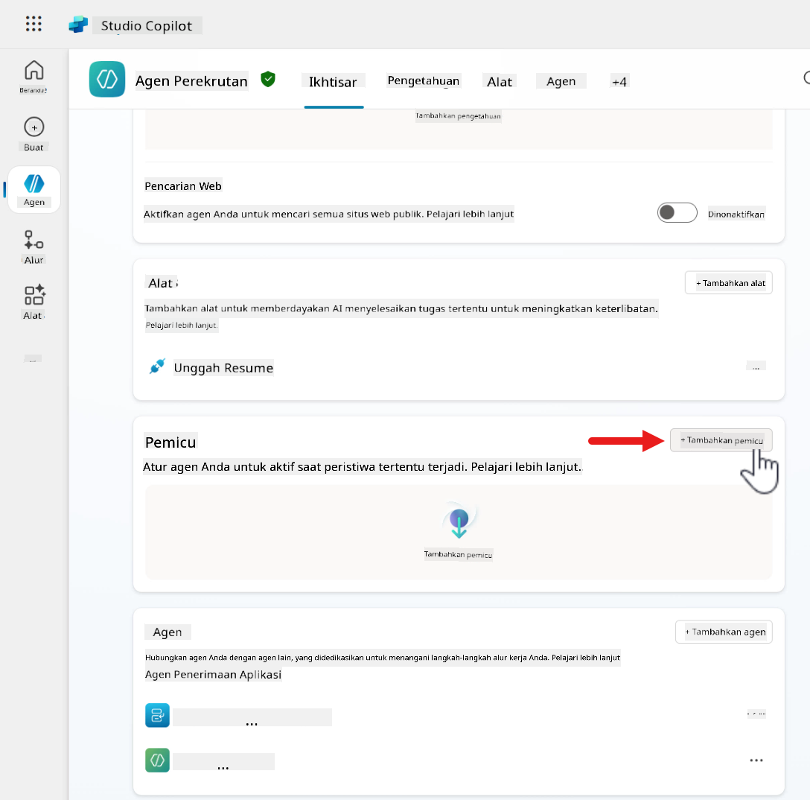

1. Daftar pemicu akan muncul. Pilih **Ketika email baru tiba (V3)** dan pilih **Berikutnya**.

       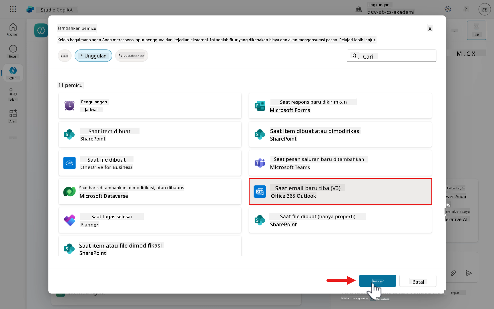

1. Sekarang kita akan melihat **Nama Pemicu** dan referensi koneksi **Masuk** untuk aplikasi yang terdaftar.

       Ubah nama pemicu menjadi berikut ini,
    
       ```text
       Ketika email baru tiba dari pelamar
       ```

       Pastikan Anda melihat tanda centang hijau di setiap referensi koneksi aplikasi yang terdaftar. Jika Anda tidak melihat tanda centang hijau, masuk melalui elipsis (...) dan pilih **+ Referensi koneksi baru** untuk membuat referensi koneksi baru.

       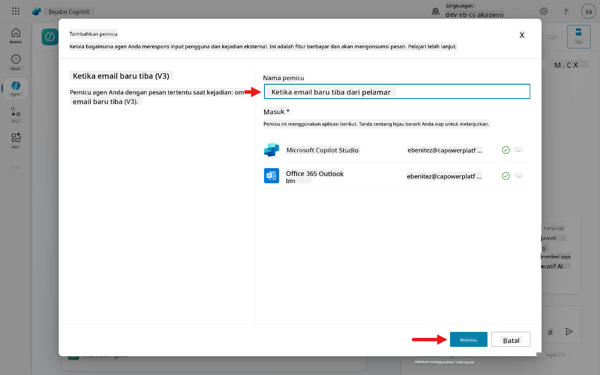

1. Langkah terakhir adalah mengatur properti input pemicu. Perbarui properti berikut ke nilai berikut,

     | Properti | Cara Mengatur | Detail |
     |----------|---------------|--------|
     | **Sertakan Lampiran (Opsional)** | Dropdown | Ya |
     | **Filter Subjek (Opsional)** | Ketik/Masukkan dengan keyboard | Aplikasi |
     | **Hanya dengan Lampiran (Opsional)** | Dropdown | Ya |

       Pilih **Buat pemicu**.

       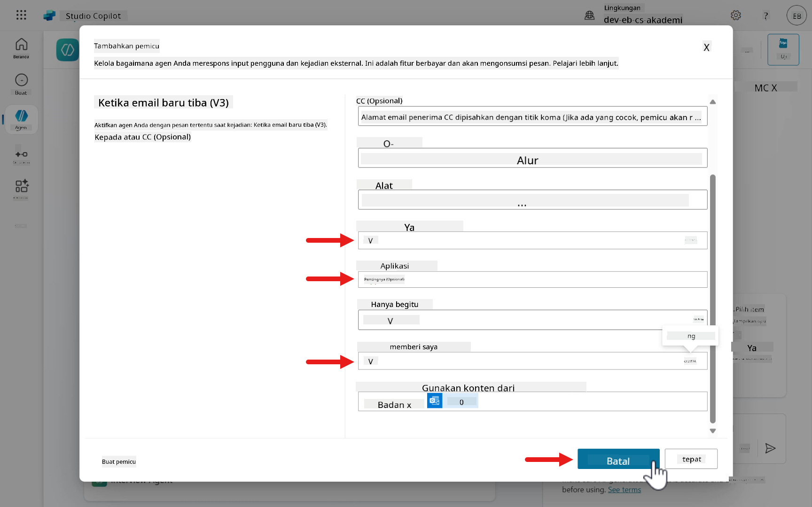

1. Setelah dibuat, pesan konfirmasi akan muncul bahwa pemicu telah ditambahkan ke agen. Pilih **Tutup** dan pemicu akan terdaftar di bagian **Triggers**.
Sekarang kita akan memperbarui pemicu acara untuk menambahkan beberapa kemampuan otomatisasi lebih lanjut. Pilih **ellipsis (...)** pada pemicu dan pilih **Edit in Power Automate**.

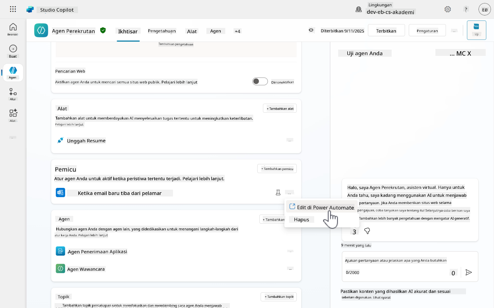

1. Pemicu kemudian akan dimuat sebagai alur di portal pembuat Power Automate. Apa yang Anda lihat adalah desainer alur di portal pembuat Power Automate. Di sinilah kita dapat menambahkan logika dan tindakan lebih lanjut untuk otomatisasi tambahan. Pemicu akan muncul di bagian atas, diikuti oleh **Mengirimkan prompt ke copilot yang ditentukan untuk diproses** sebagai tindakan terakhir dalam alur.

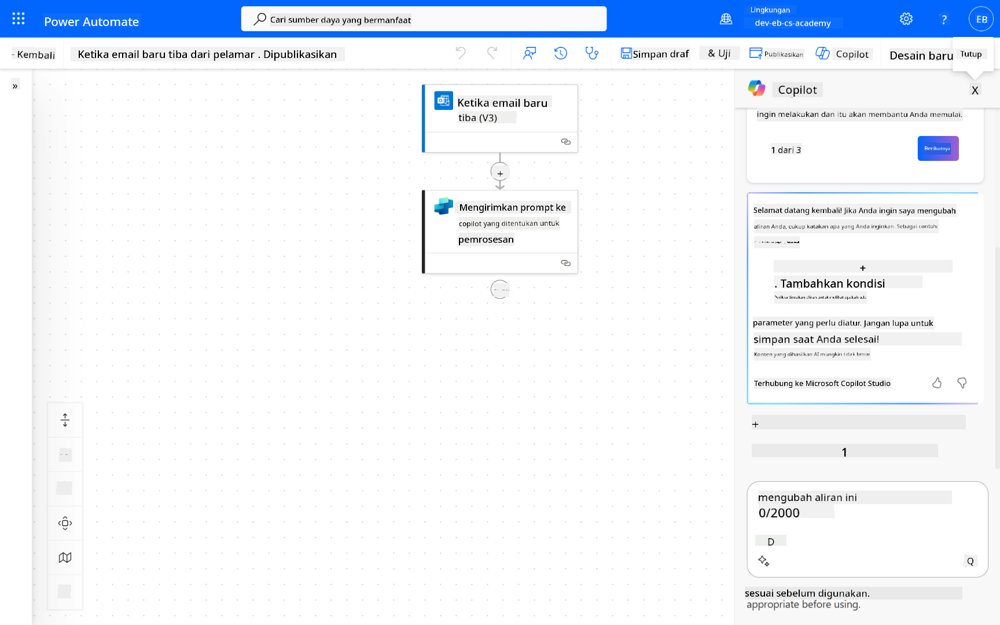

1. Secara default, pemicu **Ketika email baru tiba** di Power Automate dapat memproses beberapa email sekaligus jika beberapa email tiba bersamaan, menjalankan alur hanya sekali untuk batch tersebut.

Untuk memastikan alur berjalan secara terpisah untuk setiap email, aktifkan pengaturan **Split On** di pengaturan pemicu dan pilih `@triggerOutputs()?['body/value']` di bidang array dropdown.

Dengan **Split On** diaktifkan dan bidang array diatur ke `@triggerOutputs()?['body/value']`, alur akan berjalan secara individual untuk setiap pesan, bahkan jika banyak pesan tiba secara bersamaan.

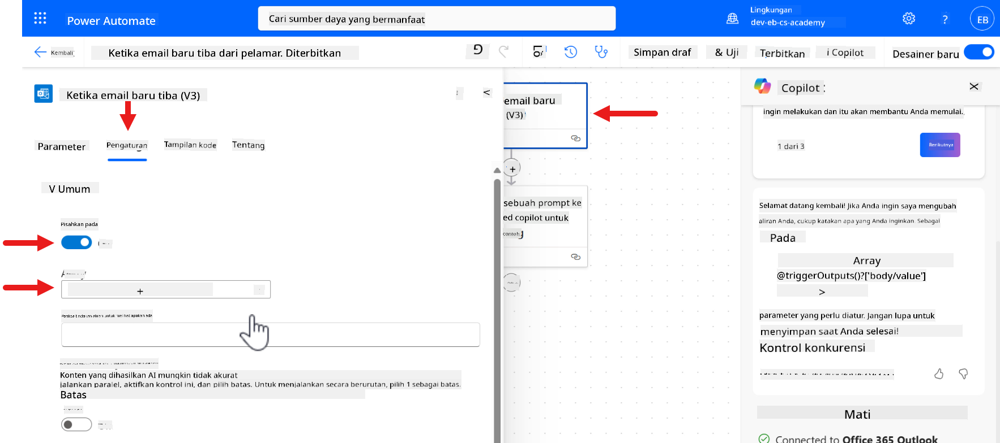

1. Selanjutnya, kita akan menambahkan logika untuk memeriksa jenis file lampiran, kita hanya ingin mengunggah lampiran file .PDF dan bukan gambar (ini bisa berasal dari tanda tangan email). Pilih ikon **+** di bawah pemicu dan pilih **Control** di bagian **Built in tools**.

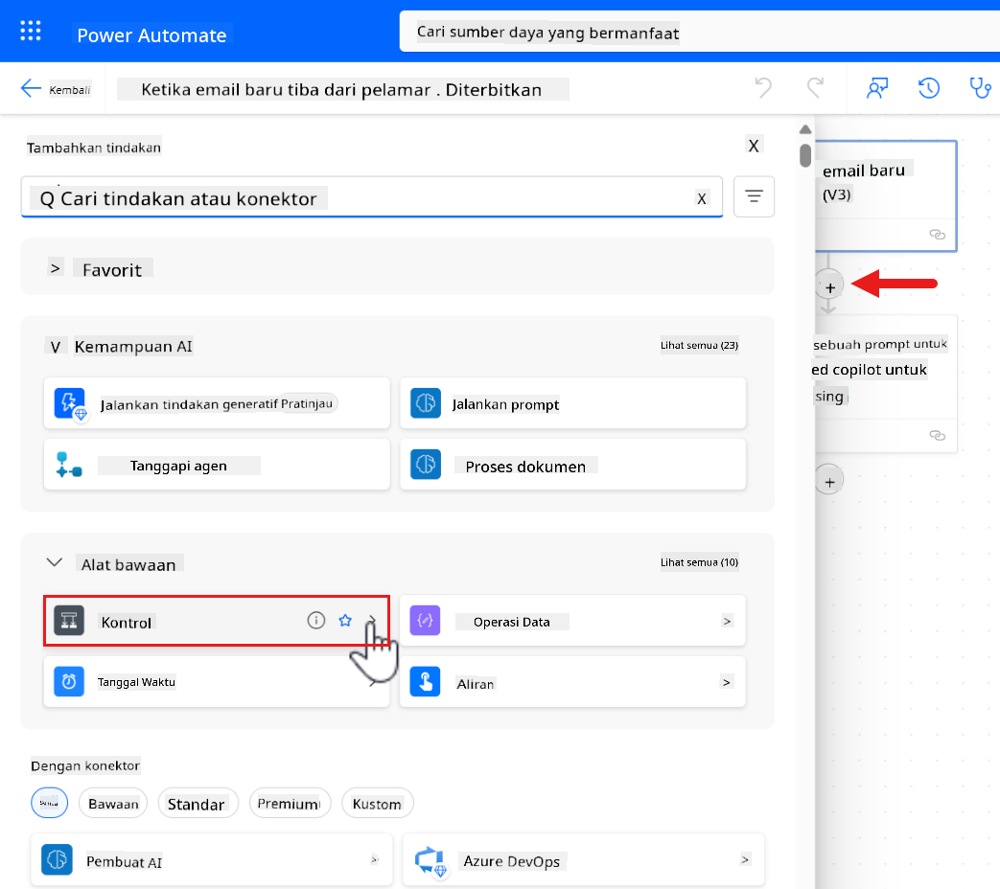

1. Pilih tindakan **Condition**.

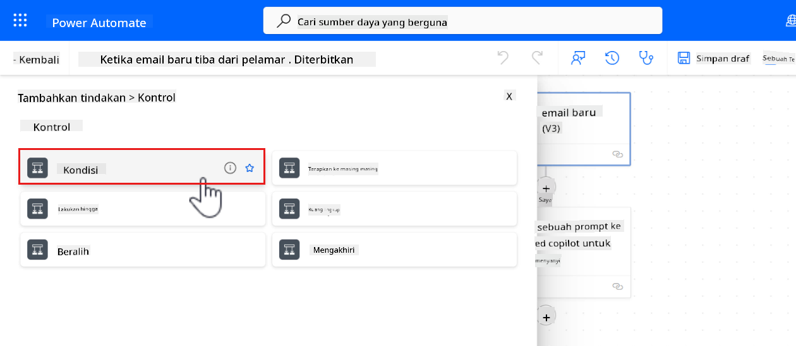

1. Sekarang kita mengonfigurasi kondisi untuk memeriksa apakah jenis file lampiran adalah .PDF. Di bidang **Choose a value**, pilih **ikon petir** atau **ikon fx** di sebelah kanan.

1. Di bidang **Search**, ketik berikut ini,

```text
content type
```

1. Kemudian pilih parameter **Attachments Content-Type** dari pemicu.

1. Selanjutnya, pilih **Add** untuk menambahkan input konten dinamis ke parameter **Id** dari tindakan.

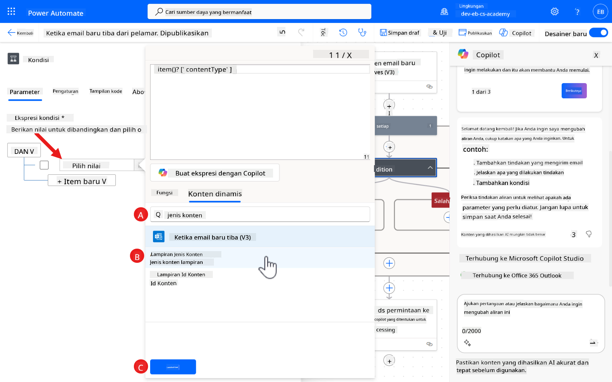

1. Mari kita berhenti sejenak di sini, Anda mungkin memperhatikan bahwa tindakan **For each** secara otomatis muncul.

Pilih tindakan **For each**. Tindakan ini mewakili pengulangan melalui setiap lampiran dalam email, karena parameter **Attachments Content-Type** dari pemicu terikat pada setiap lampiran.

Di balik layar, ini adalah array dan itulah mengapa tindakan **For each** secara otomatis ditambahkan ketika kita memilih parameter **Attachments Content-Type** di tindakan **Condition**.

Untuk mempelajari lebih lanjut tentang ini, perluas blok pembelajaran tambahan berikut.

??? info "Pembelajaran Tambahan: Tindakan For each secara otomatis muncul"

🤔 **Mengapa "Apply to each" atau "For each" Muncul Secara Otomatis?**

Ketika Anda memilih parameter (konten dinamis) yang mewakili daftar atau array item - misalnya, daftar lampiran, email, atau baris - Power Automate mengenali bahwa Anda mungkin ingin memproses setiap item secara individual.

Untuk membantu Anda melakukan ini, Power Automate secara otomatis menambahkan loop **“Apply to each”** (atau **For each**) di sekitar tindakan Anda. Ini memastikan bahwa tindakan Anda akan berjalan sekali untuk setiap item dalam daftar, daripada mencoba memproses seluruh daftar sekaligus (yang dapat menyebabkan kesalahan).

🦋 **Contoh**

- Jika Anda memilih "Attachments" dari tindakan sebelumnya (yang merupakan array), dan mencoba menggunakannya dalam tindakan yang mengharapkan satu file, Power Automate membungkus tindakan Anda dalam loop **"Apply to each"** (atau **For each**). 
- Dengan cara ini, tindakan Anda akan berjalan untuk **setiap lampiran** - satu per satu.

💡 **Poin Penting**

- **Otomatis:** Loop muncul secara otomatis untuk membantu Anda memproses setiap item dalam koleksi.
- **Mencegah kesalahan:** Tanpa loop, tindakan Anda mungkin gagal karena tidak dapat menangani beberapa item sekaligus.
- **Petunjuk visual:** Ini adalah cara visual untuk menunjukkan bahwa alur Anda akan mengulangi tindakan untuk setiap item dalam daftar.

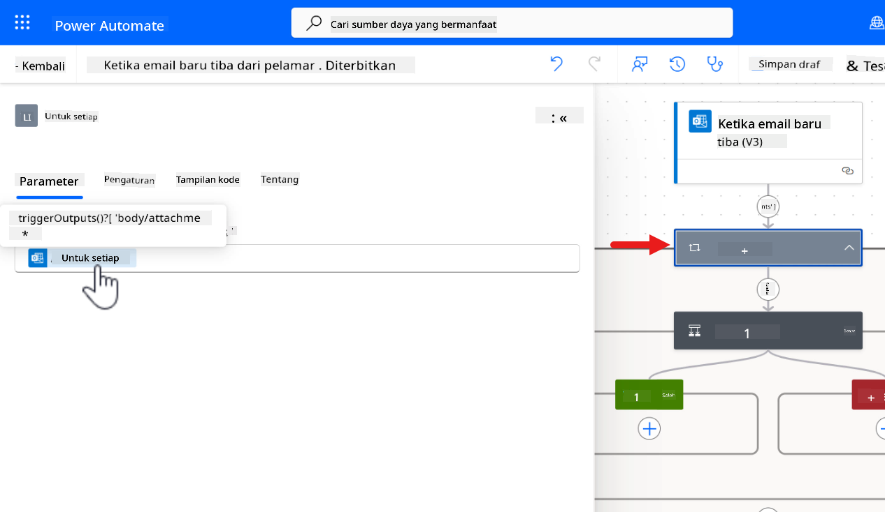

1. Selanjutnya, di bidang **Choose a value** lainnya, ketik berikut ini,

```text
application/pdf
```

Ini akan memastikan bahwa untuk setiap lampiran file, akan memeriksa format ekstensi file adalah .PDF.

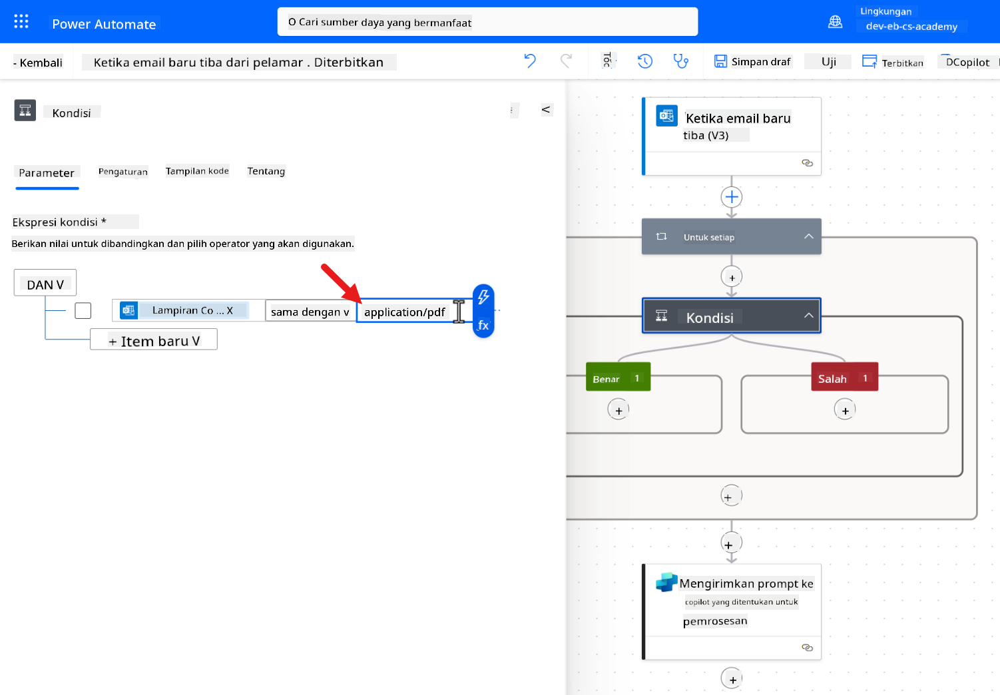

1. Sekarang kita akan mengonfigurasi jalur **True** untuk mengekstrak file dari email dan mengunggahnya ke tabel **Resume** di Dataverse.

Tambahkan tindakan baru di bawah jalur **True** dan cari `html to text`. Pilih tindakan **Html to text**.

Untuk mempelajari lebih lanjut tentang tindakan **Html to text**, perluas blok pembelajaran tambahan berikut.

??? info "Pembelajaran Tambahan: Tindakan Html to text"

🤔 **Apa itu Tindakan "HTML to text"?**

Tindakan **HTML to text** di Power Automate digunakan untuk mengonversi konten yang diformat HTML menjadi teks biasa. Ini sangat berguna ketika Anda menerima data (seperti email, konten web, atau respons API) yang berisi tag HTML, dan Anda ingin mengekstrak hanya teks yang dapat dibaca tanpa format atau kode.

⚙️ **Bagaimana cara kerjanya?**

- **Input:** Anda memberikan string konten HTML (misalnya, isi email).
- **Output:** Tindakan menghapus semua tag HTML dan hanya mengembalikan teks biasa.

👍🏻 **Kapan Anda harus menggunakannya?**

- Ketika Anda ingin mengekstrak teks yang dapat dibaca dari email, halaman web, atau respons API yang berisi HTML.
- Sebelum mengirimkan konten ke sistem yang tidak mendukung format HTML (seperti SMS, pesan Teams, atau database).
- Untuk membersihkan data untuk pemrosesan atau analisis lebih lanjut.

🔭 **Di mana menemukannya?**

- Di Power Automate untuk Agent Flows, cari tindakan yang disebut `HTML to text`. Ini berada di bawah konektor **Data Operations**.

💡 **Poin Penting**

- Menghapus semua tag HTML dan hanya menyisakan teks.
- Tidak menafsirkan atau menjalankan skrip/gaya - hanya menghapus tag.
- Berguna untuk membersihkan data dan menyiapkan konten untuk output teks biasa.

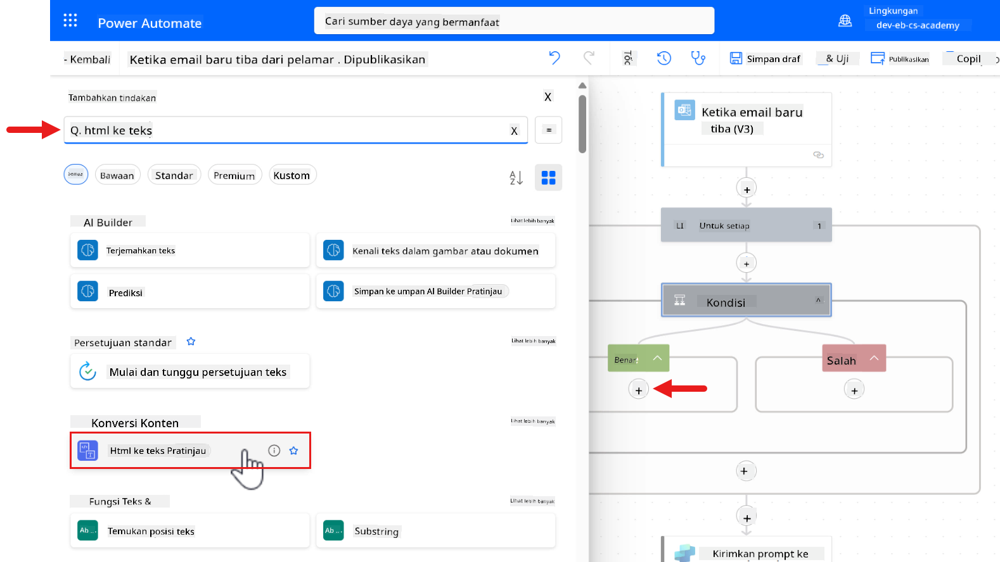

1. Selanjutnya, kita perlu membuat referensi koneksi baru untuk tindakan **Html to text** dengan memilih **Add new**.

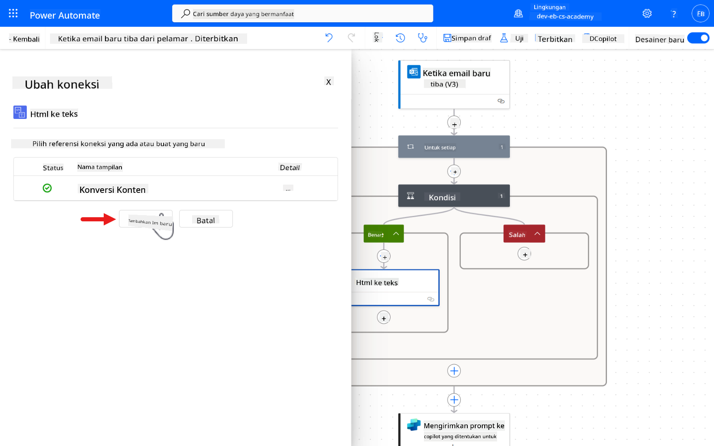

1. Tindakan sekarang dapat dikonfigurasi. Mari kita tambahkan parameter **Body** dari pemicu. Di bidang **Content**, pilih **ikon petir** atau **ikon fx** di sebelah kanan.

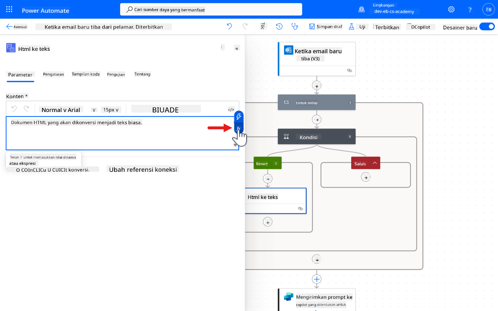

1. Di tab **Dynamic content**, cari `body` dan pilih parameter **Body**, lalu pilih **Add**.

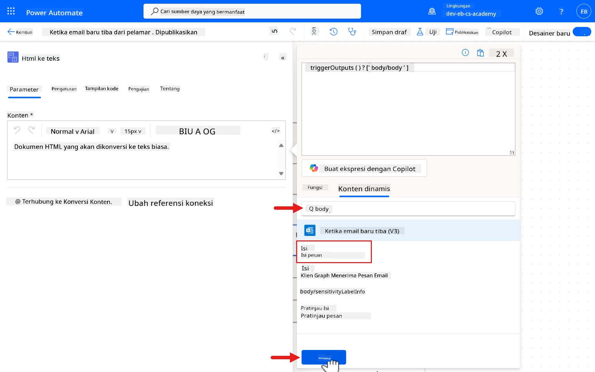

1. Kita telah selesai mengonfigurasi tindakan ini, jadi mari keluar dari tindakan dengan memilih dua tanda sudut («) yang mengarah ke kiri untuk menutup panel.

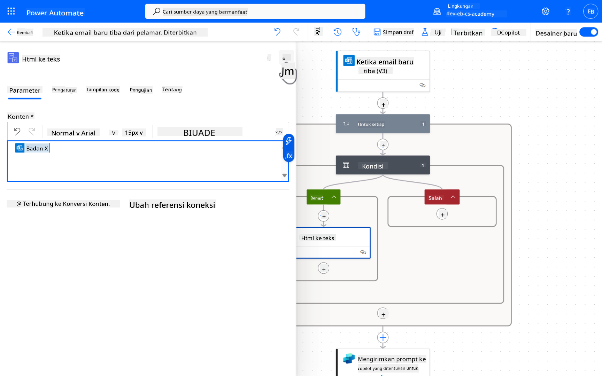

1. Kita akan menambahkan tindakan baru dengan memilih **ikon +** di bawah tindakan **Html to text** yang akan memuat panel untuk menambahkan tindakan. Pilih konektor **Microsoft Dataverse**.

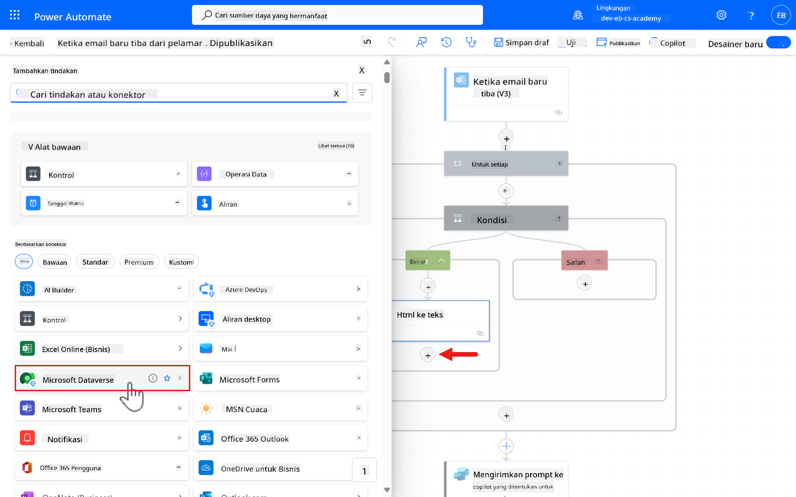

1. Pilih tindakan **Add a new row**.

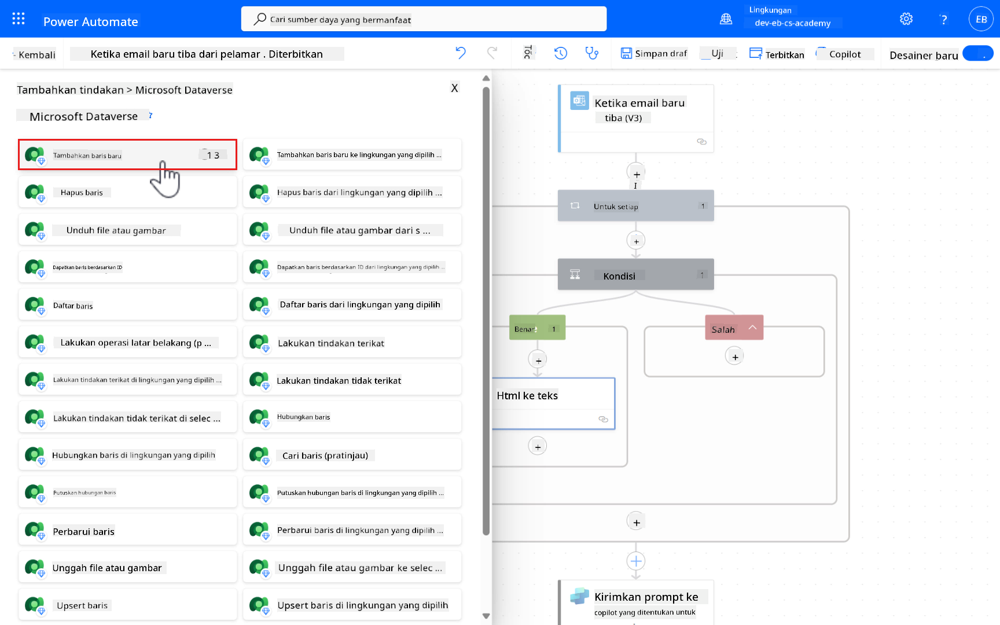

1. Ubah nama tindakan dengan memilih **Ellipsis (...)**, salin dan tempelkan berikut ini sebagai nama,

```text
Add a new Resume row
```

Untuk parameter **Table name**, cari `res` dan pilih tabel **Resumes**.

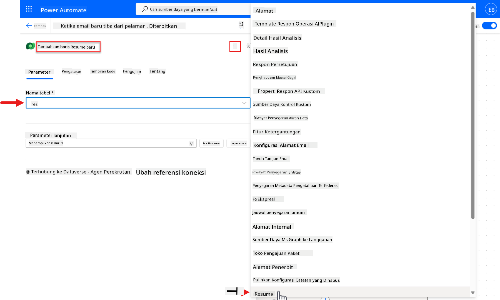

1. Pilih bidang **Resume Title** berikutnya dan pilih **ikon petir** atau **ikon fx** di sebelah kanan.

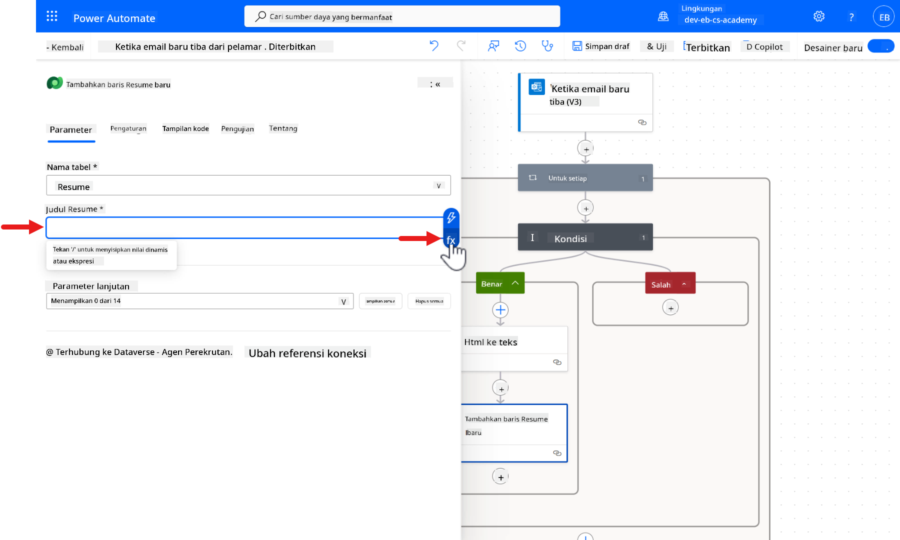

1. Di tab **Function**, masukkan ekspresi berikut yang menggunakan fungsi `item()`.

```text
item()?['name']
```

Untuk mempelajari lebih lanjut tentang fungsi `item()`, perluas blok pembelajaran tambahan berikut.

??? info "Pembelajaran Tambahan: Fungsi `item()`"

🤔 **Apa itu fungsi `item()`?**

- Ketika Anda menggunakan tindakan **Apply to each**, Power Automate akan melalui setiap elemen dalam koleksi (array).
- Ini paling sering digunakan di dalam tindakan seperti **Apply to each** (atau **For each**), **Select**, atau **Filter array**.

⚙️ **Bagaimana cara kerjanya?**

- `item()` adalah fungsi yang mengembalikan item saat ini yang sedang diproses dalam loop atau operasi array.
- Di dalam loop itu, `item()` merujuk pada _elemen saat ini_ yang sedang diproses.

📌 **Di mana Anda menggunakannya?**

- **Apply to each:** untuk mengakses properti dari item saat ini.
- **Select:** untuk mengubah setiap item dalam array.
- **Filter array:** untuk merujuk item saat ini yang sedang dievaluasi.

🦋 **Contoh**

- Ekspresi di dalam loop:
       -  `item()?['Email']`
- Ini mengambil properti `Email` dari item saat ini.

💡 **Poin Penting**

- `item()` bersifat _konteks-sensitif_: selalu merujuk pada item saat ini dalam loop atau operasi array yang Anda gunakan.
- Jika Anda membuat loop bersarang, Anda dapat menggunakan `items('LoopName')` untuk merujuk pada item dalam loop tertentu.

Pilih **Add** untuk menambahkan ekspresi ke parameter **Resume Title**.

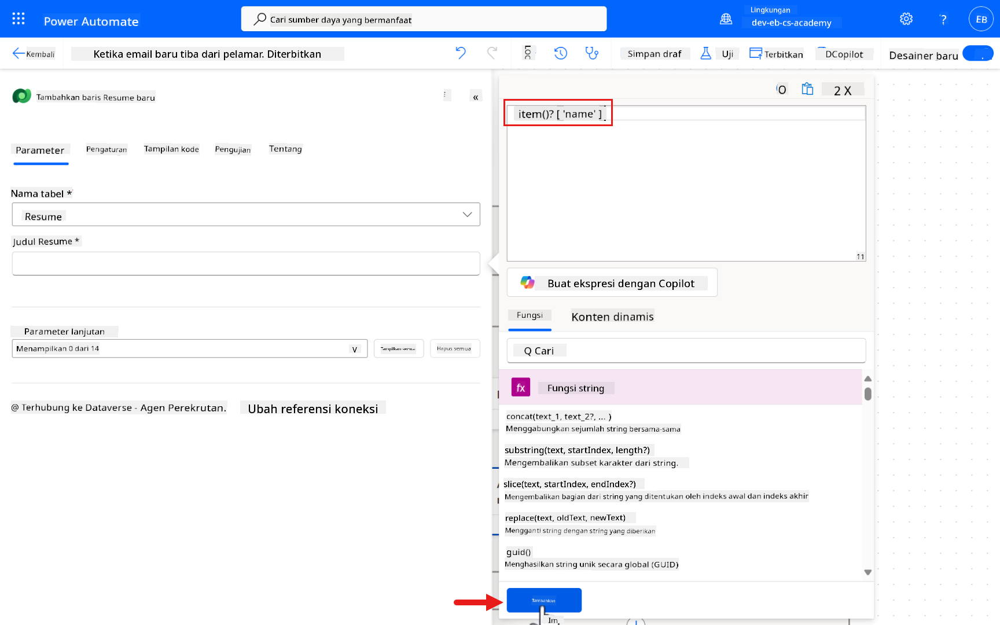

1. Kita masih perlu mengonfigurasi beberapa parameter lagi, pilih **Show all** dan di bidang **Cover Letter**, pilih **ikon petir** atau **ikon fx** di sebelah kanan.

Di tab **Function**, masukkan ekspresi berikut yang menggunakan ekspresi yang sama dalam [misi sebelumnya](../02-multi-agent/README.md).

```text
if(greater(length(body('Html_to_text')), 2000), substring(body('Html_to_text'), 0, 2000), body('Html_to_text'))
```

Ekspresi ini memeriksa apakah _teks_ dari tindakan **Html to text** lebih panjang dari 2000 karakter, dan jika ya, hanya mengembalikan 2000 karakter pertama; jika tidak, mengembalikan teks penuh.

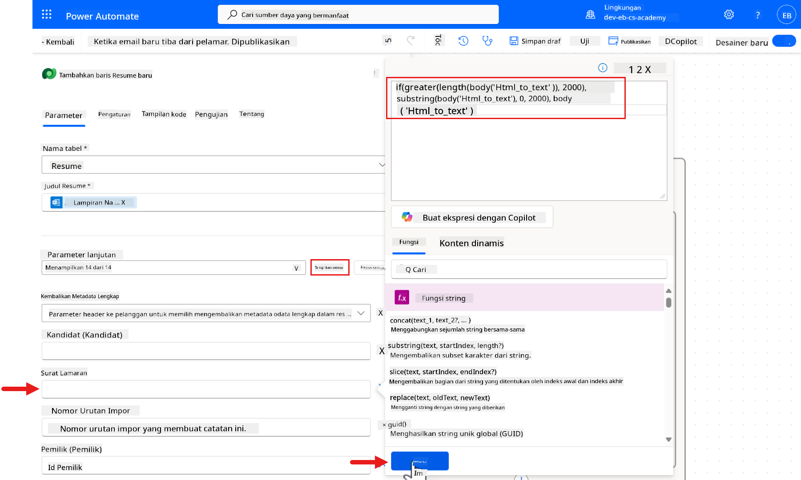

1. Ekspresi sekarang akan ditambahkan ke bidang **Cover Letter**.

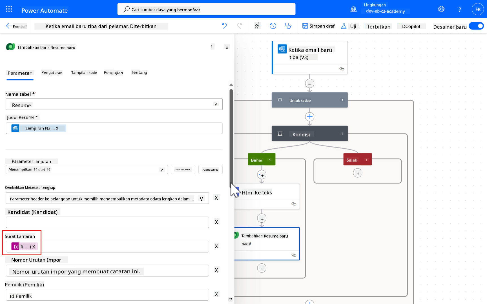

1. Untuk bidang **Source Email Address**, cari `from` dan pilih parameter **From** dari pemicu karena ini berisi nilai alamat email.

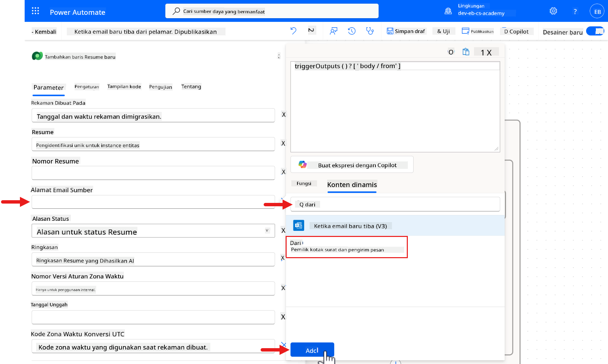

1. Untuk bidang **Upload Date**, pilih **ikon petir** atau **ikon fx** di sebelah kanan. Di tab **Function**, masukkan ekspresi berikut yang menggunakan fungsi `utcNow()`.

```text
utcNow()
```

Untuk mempelajari lebih lanjut tentang fungsi `utcNow`, perluas blok pembelajaran tambahan berikut.

??? info "Pembelajaran Tambahan: Fungsi `utcNow`"

🤔 **Apa itu fungsi `utcNow()`?**

- Fungsi utcnow() di Power Automate mengembalikan tanggal dan waktu saat ini dalam Waktu Universal Terkoordinasi (UTC) dalam format ISO 8601, seperti: `2025-09-23T04:32:14Z`

🦋 **Contoh**

- Ekspresi:
       -  `concat('Laporan dibuat pada ', utcnow())`
- Output adalah:
       - Laporan dibuat pada `2025-09-23T04:32:14Z`

💡 **Poin Penting**
- **Tidak memerlukan argumen (parameter input):** selalu memberikan stempel waktu UTC saat ini.
   - **Kasus penggunaan**
       - Menambahkan stempel waktu ke log atau nama file
       - Membandingkan waktu saat ini dengan tanggal lainnya
       - Penjadwalan atau kondisi berbasis waktu

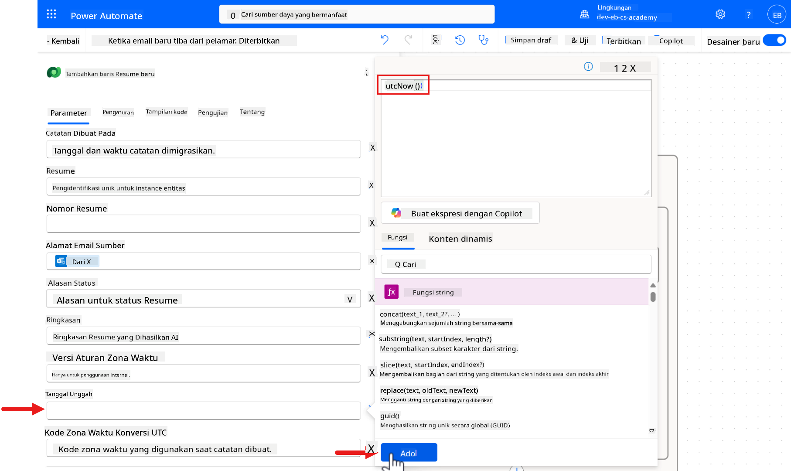

1. Kita telah selesai mengonfigurasi aksi **Tambahkan baris Resume baru**, jadi mari keluar dari panel dengan mengecilkannya.

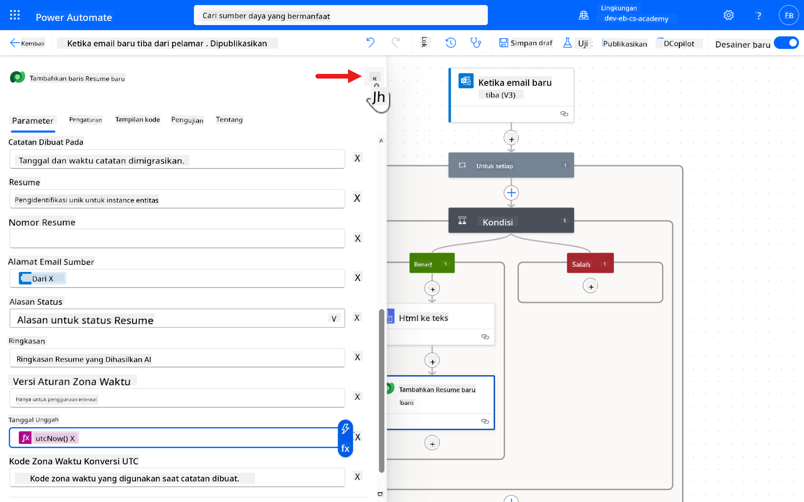

1. Kita akan menambahkan aksi baru dengan memilih **ikon +** di bawah aksi **Tambahkan baris Resume baru** yang akan memuat panel untuk menambahkan aksi. Pilih konektor **Microsoft Dataverse** lagi.

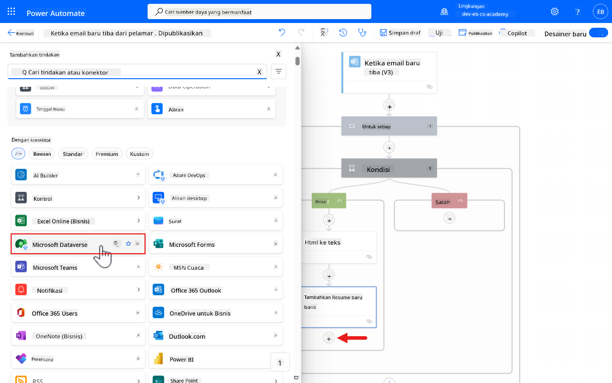

1. Pilih aksi **Unggah file atau gambar**.

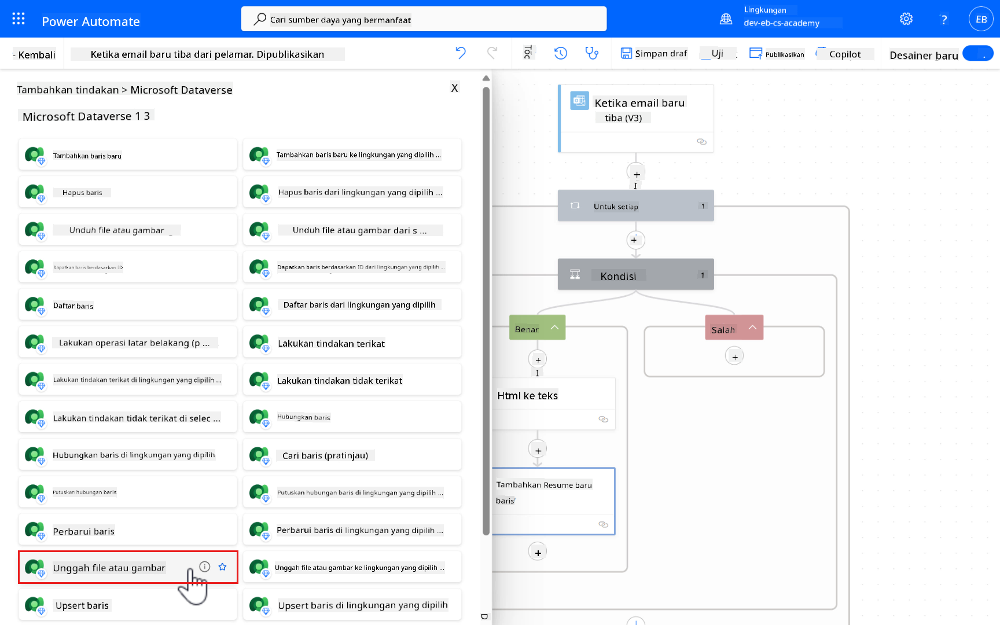

1. Ubah nama aksi dengan memilih **Ellipsis (...)**, salin dan tempel teks berikut sebagai nama,

```text
Unggah File Resume
```

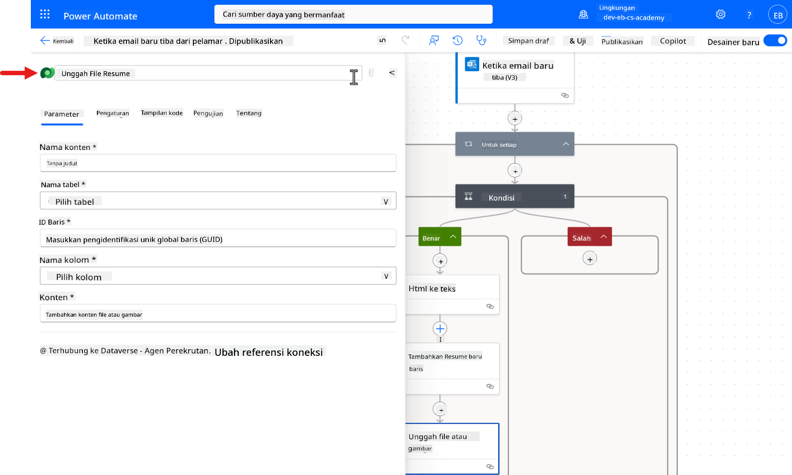

1. Pilih bidang **Nama Konten** berikutnya dan pilih **ikon petir** atau **ikon fx** di sebelah kanan.

Di tab **Fungsi**, masukkan ekspresi berikut yang menggunakan fungsi `item ()`. Ini mengambil properti `name` dari item saat ini (file lampiran).

```text
item()?['name']
```

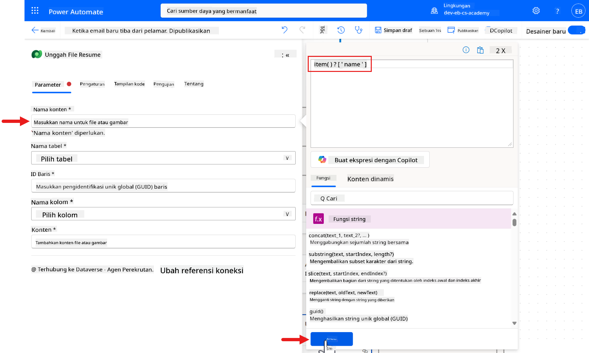

1. Untuk parameter **Nama Tabel**, cari `res` dan pilih tabel **Resumes**.

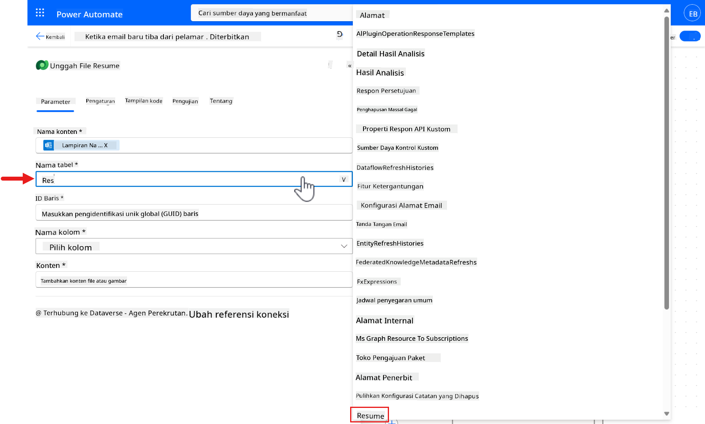

1. Pilih bidang **ID Baris** berikutnya dan pilih **ikon petir** atau **ikon fx** di sebelah kanan.

Cari `ID` dan pilih parameter **Resume** dari aksi _Tambahkan baris baru_ Dataverse karena ini berisi nilai ID dari baris tempat file PDF akan diunggah.

Pilih **Tambahkan**.

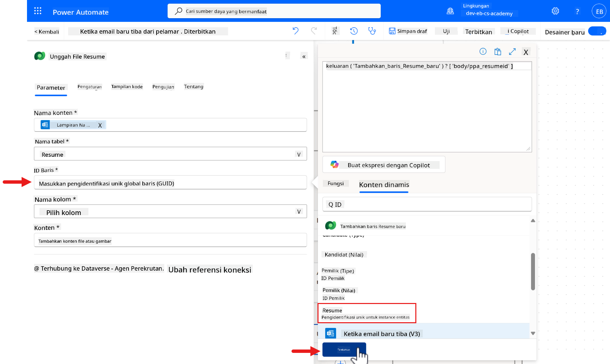

1. Pilih bidang **Nama Kolom** dan pilih opsi **Resume PDF**.

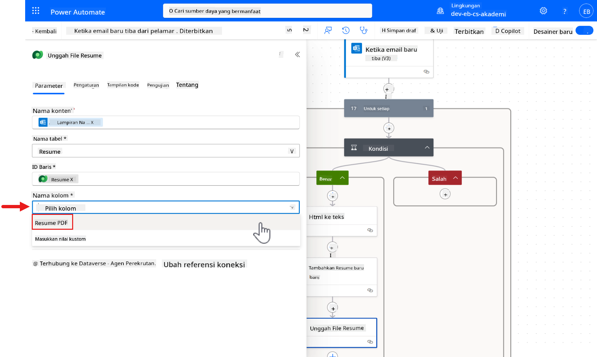

1. Pilih bidang **Konten** dan pilih **ikon petir** atau **ikon fx** di sebelah kanan.

Di tab **Fungsi**, masukkan ekspresi berikut yang menggunakan fungsi `item ()`. Ini mengambil properti `contentBytes` dari item saat ini (file lampiran). `contentBytes` mengacu pada data biner mentah dari file atau lampiran, yang dikodekan sebagai string Base64.

```text
item()?['contentBytes']
```

1. Kita telah selesai mengonfigurasi aksi ini, jadi mari keluar dari aksi dengan memilih dua tanda kurung sudut («) yang mengarah ke kiri untuk mengecilkan panel.

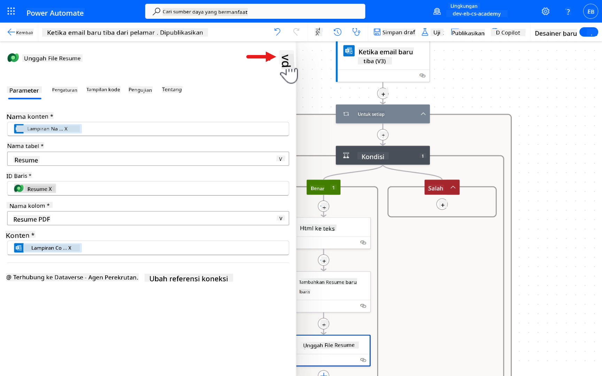

1. Selanjutnya, pilih **Mengirimkan prompt ke copilot yang ditentukan untuk diproses**, lalu seret dan letakkan aksi ini di bawah aksi **Unggah File Resume** di jalur _True_ dari kondisi.

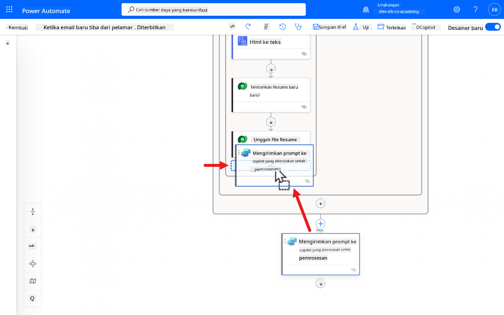

1. Pilih **Mengirimkan prompt ke copilot yang ditentukan untuk diproses** untuk mengonfigurasinya.

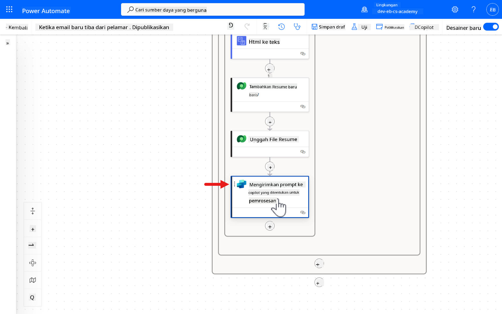

1. Di bidang **Isi/Pesan**, pilih semua konten bidang dan hapus.


1. Salin dan tempel teks berikut ke dalam bidang **Isi/Pesan** dan sorot `RESUME ID PLACEHOLDER`.

```text
Kirim [ResumeId (text)] = "RESUME ID PLACEHOLDER" dan [ResumeTitle (text_1)] = "RESUME TITLE PLACEHOLDER" dan [ResumeNumber (text_2)]= "RESUME NUMBER PLACEHOLDER" ke Alat "Notify Teams Applicant channel" di agen anak "Application Intake Agent"
```

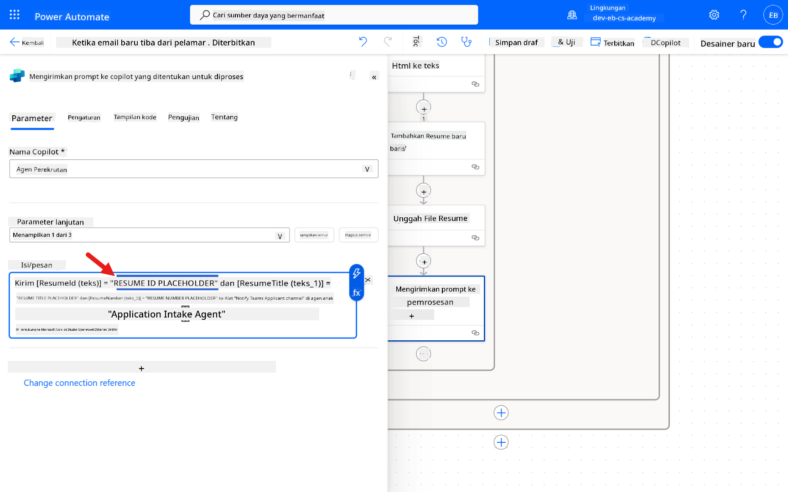

1. Pilih **ikon petir** atau **ikon fx** di sebelah kanan.

Cari `resume` dan pilih parameter **Resume** dari aksi _Tambahkan baris baru Dataverse_ karena ini berisi nilai `ID` dari baris Resume yang dibuat.

Pilih **Tambahkan**.

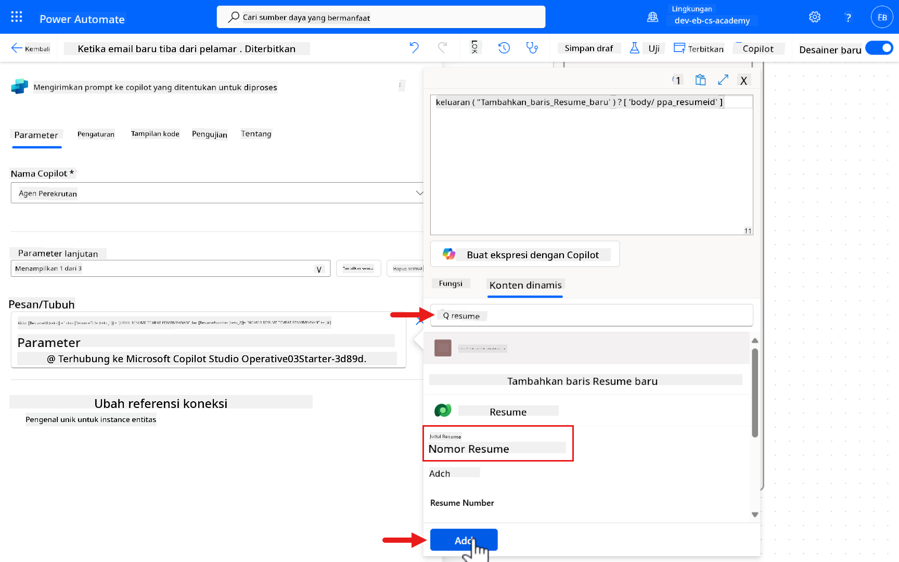

1. Sorot `RESUME TITLE PLACEHOLDER`. Pilih **ikon petir** atau **ikon fx** di sebelah kanan.

Cari `title` dan pilih parameter **Resume Title** dari aksi _Tambahkan baris baru Dataverse_ karena ini berisi nilai `resume title` dari baris Resume yang dibuat.

Pilih **Tambahkan**.

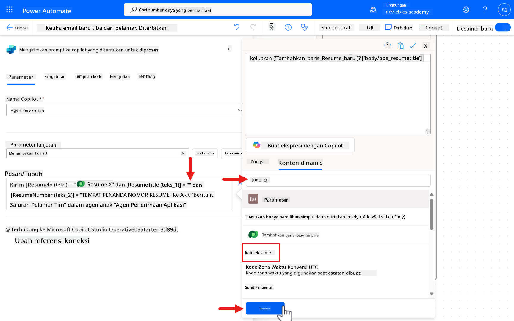

1. Sorot `RESUME NUMBER PLACEHOLDER`. Pilih **ikon petir** atau **ikon fx** di sebelah kanan.

Cari `resume number` dan pilih parameter **Resume Number** dari aksi _Tambahkan baris baru Dataverse_ karena ini berisi nilai `Resume Number` dari baris Resume yang dibuat.

Pilih **Tambahkan**.


1. Kita telah selesai mengonfigurasi aksi ini dan alur agen kita 🙌🏻 Kamu hebat! Sekarang mari simpan alur pemicu acara kita dengan memilih **Simpan draf**.

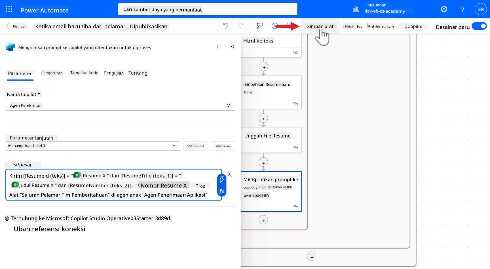

1. Sekarang kita perlu mengedit detail alur agen, pilih **Kembali**.

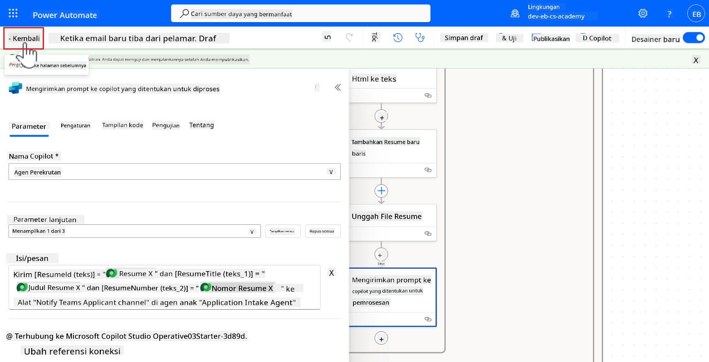

1. Pilih **Edit** di bagian **Detail** dan perbarui **Rencana** ke opsi **Copilot Studio**.

Pilih **Simpan**.

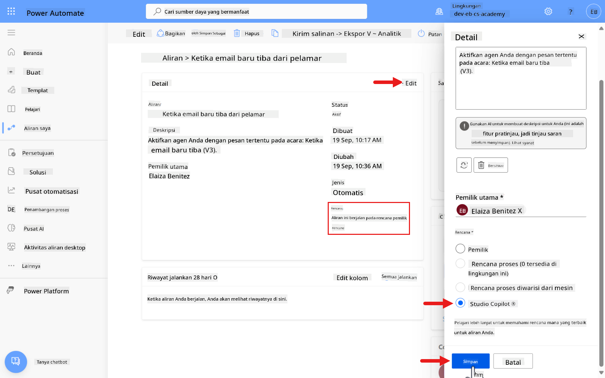

1. Sebuah modal akan muncul untuk meminta konfirmasi untuk beralih ke rencana Copilot Studio. Pilih **Konfirmasi**.

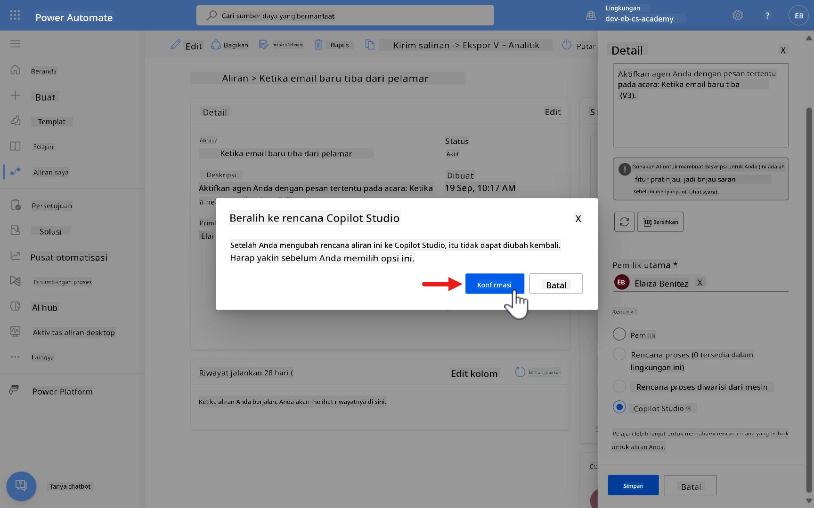

1. Rencana sekarang diperbarui ke **Copilot Studio**. Pilih **Edit** karena kita perlu mempublikasikan alur pemicu acara untuk agen kita.

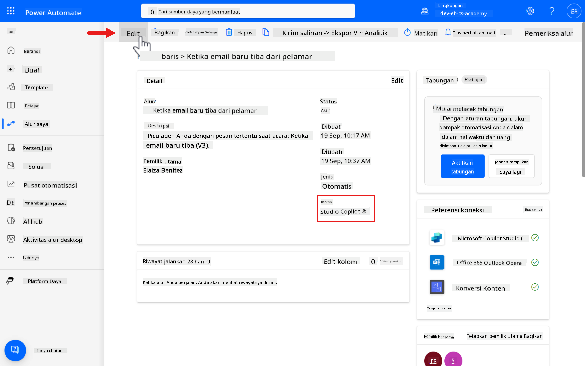

1. Pilih **Publikasikan**.

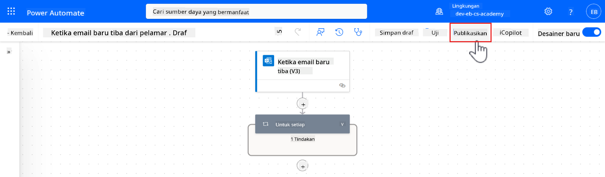

Hore! Alur pemicu acara sekarang telah dipublikasikan 😃

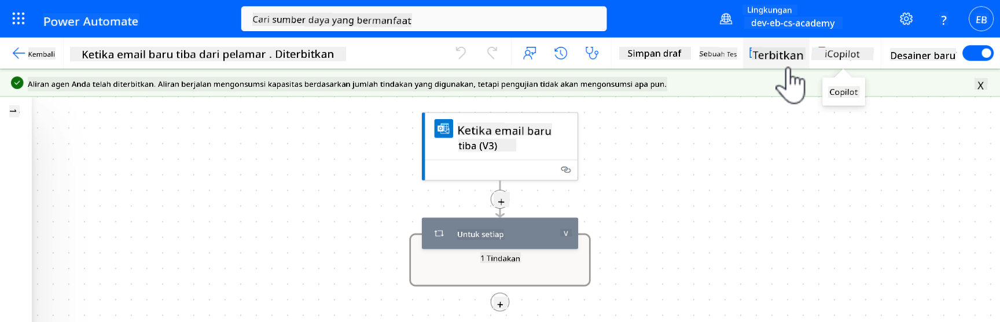

Mari lanjutkan membuat alur agen baru yang akan dipanggil oleh agen anak **Intake Application Agent**.

### Lab 3.2 - Memberi tahu saluran Teams menggunakan kartu adaptif

Sekarang kita akan membuat alur agen baru untuk agen anak **Intake Application Agent** yang menggunakan nilai-nilai yang diteruskan oleh pemicu acara, untuk memposting kartu adaptif ke saluran Teams. Kartu adaptif ini akan memberi tahu tim rekrutmen HR tentang PDF yang diunggah secara otomatis sehingga mereka dapat meninjaunya.

Mari kita mulai!

1. Di **Hiring Agent** pilih tab **Agen** dan pilih **Application Intake Agent**.

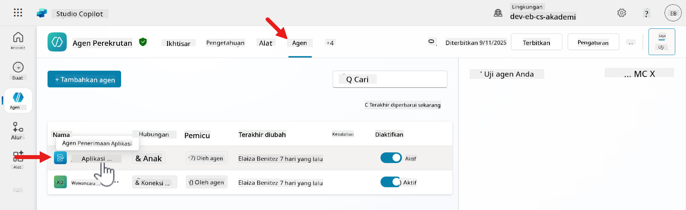

1. Gulir ke bawah ke **Alat** dan pilih **+ Tambahkan**.

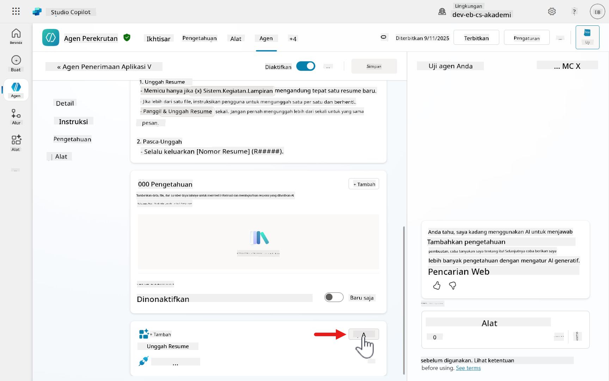

1. Modal **Tambahkan alat** akan muncul. Pilih **+ Alat baru**.

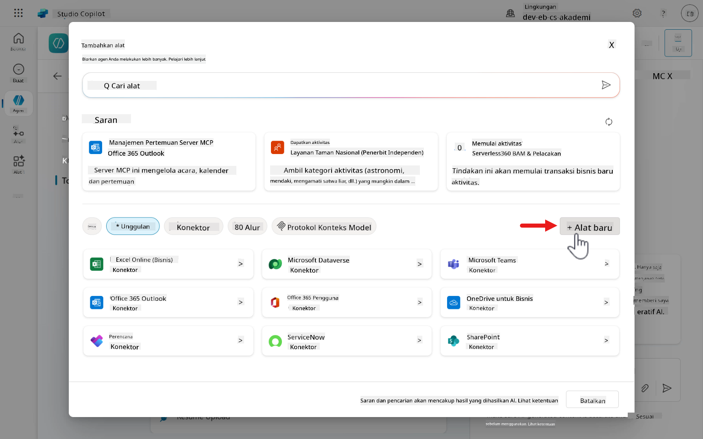

1. Pilih **Alur agen**.


1. **Desainer alur agen** akan dimuat berikutnya. Di pemicu **Ketika agen memanggil alur**, pilih **+ Tambahkan input**.


1. Pilih **Teks** sebagai jenis input pengguna.


1. Di bidang teks input, salin dan tempel teks berikut untuk nama parameter input.

```text
ResumeId
```


1. Ulangi langkah yang sama untuk menambahkan input teks kedua. Salin dan tempel teks berikut untuk nama parameter input.

```text
ResumeTitle
```


1. Ulangi langkah yang sama untuk menambahkan input teks ketiga. Salin dan tempel teks berikut untuk nama parameter input.

```text
ResumeNumber
```


1. Ingat bagaimana di [Recruit](../../recruit/08-add-adaptive-card/README.md#81-create-a-new-topic-with-an-adaptive-card-for-user-to-submit-their-request) kita menambahkan kartu adaptif dalam Topik untuk agen kita? Kali ini, kita akan menambahkan kartu adaptif dalam alur agen. Sekarang kita akan menambahkan aksi lain ke alur agen kita yang akan memposting kartu adaptif ke saluran Teams.

Pilih **ikon +** di bawah pemicu.


1. Pilih aksi **Post card in a chat or channel**.


1. Referensi koneksi ke Microsoft Teams perlu dibuat dengan akun pengguna yang masuk. Pilih **Masuk**.


1. Pilih akun pengguna Anda dan kemudian pilih **Izinkan akses**.


1. Untuk parameter input berikut,

| Parameter | Cara Mengatur | Detail |
|----------|------------|---------|
| **Post as** | Dropdown | Pilih opsi `Flow bot` |
| **Post in** | Dropdown | Pilih opsi `Channel` |
| **Team** | Dropdown | Pilih tim yang tersedia di lingkungan Anda yang Anda miliki akses untuk tujuan menyelesaikan latihan lab ini |
| **Team** | Dropdown | Pilih saluran yang tersedia di lingkungan Anda yang Anda miliki akses untuk tujuan menyelesaikan latihan lab ini |


1. Selanjutnya, kita akan mengonfigurasi bidang **Kartu Adaptif**. Pilih bidang **Kartu Adaptif**.


1. Buka [Resume Table Updated JSON file](../../../../../docs/operative-preview/03-automate-triggers/assets/3.2_ResumeTableUpdated.json), salin seluruh isinya, dan tempelkan ke dalam bidang Kartu Adaptif.


1. Mirip dengan apa yang kita lakukan di [Recruit](../../recruit/08-add-adaptive-card/README.md#81-create-a-new-topic-with-an-adaptive-card-for-user-to-submit-their-request), kita akan mengganti nilai yang ada di payload JSON dengan nilai aktual atau konten dinamis.

Pertama, mari kita perbarui URL untuk properti `url` dalam properti `selectAction`. URL ini akan diganti dengan URL tampilan sistem Resumes di aplikasi model-driven **Hiring Hub**. Ini akan memungkinkan Perekrut untuk memilih aksi dan diarahkan ke tampilan sistem Resumes di aplikasi model-driven.

Sorot nilai URL saat ini dan hapus.


1. Di aplikasi model-driven **Hiring Hub**, navigasikan ke tampilan sistem **Resumes** menggunakan menu sisi kiri dan salin URL. Kemudian navigasikan kembali ke alur agen, dan tempelkan URL yang disalin ke properti **url** dalam properti `selectAction`.


1. Anda seharusnya melihat hal berikut di mana yang disorot dengan warna kuning adalah detail lingkungan Anda dari aplikasi berbasis model **Hiring Hub**.

     | Parameter | Nilai | Penjelasan |
     |----------|------------|---------|
     | **Organization URI** | GUID | URL organisasi lingkungan Dataverse/Dynamics 365 |
     | **appid** | GUID | Untuk membuka aplikasi berbasis model tertentu, parameter kueri appid atau appname digunakan. Dalam kasus ini, appid digunakan |
     | **viewid** | GUID | Parameter kueri yang merupakan id dari tampilan |

       

1. Selanjutnya, kita akan menambahkan nilai konten dinamis untuk beberapa properti. Mari kita mulai dengan teks yang akan menampilkan referensi Nomor Resume dari baris yang dibuat oleh pemicu acara secara otomatis.

      Pilih ikon **panel** untuk memuat panel tindakan.

       

1. Gulir ke bawah ke baris di mana Anda melihat properti `text` untuk `RESUME NUMBER PLACEHOLDER`. Sorot nilai placeholder dan hapus.

       

1. Klik di antara tanda kutip ganda dan pilih ikon **petir** atau ikon **fx** di sebelah kanan.

      Di tab **Konten Dinamis**, pilih parameter **ResumeNumber** dan pilih **Tambahkan**.

       

1. Parameter **ResumeNumber** sekarang akan ditambahkan sebagai konten dinamis ke properti `text`.

       

1. Kita akan mengulangi langkah yang sama untuk `RESUME NAME PLACEHOLDER`. Gulir ke bawah ke baris di mana Anda melihat properti `text` untuk `RESUME NAME PLACEHOLDER`. Sorot nilai placeholder dan hapus.

       

1. Klik di antara tanda kutip ganda dan pilih ikon **petir** atau ikon **fx** di sebelah kanan.

      Di tab **Konten Dinamis**, pilih parameter **ResumeTitle** dan pilih **Tambahkan**.

       

1. Parameter **ResumeTitle** sekarang akan ditambahkan sebagai konten dinamis ke properti `text`.

       

1. Kita akan mengulangi langkah yang sama untuk nilai **Due Date** yang mewakili kapan perekrut harus meninjau resume. Gulir ke bawah ke baris di mana Anda melihat properti `text` untuk `May 21, 2023`.

       

1. Hapus nilai placeholder tanggal ini dan klik di antara tanda kutip ganda.

       

1. Pilih ikon **petir** atau ikon **fx** di sebelah kanan dan di tab **Fungsi**, masukkan ekspresi berikut dan pilih **Tambahkan**.

       ```text
       addDays(utcNow(), 3, 'MMM dd, yyyy')
       ```

      Ekspresi ini menggunakan dua fungsi.

     | Fungsi | Penjelasan |
     |----------|------------|
     | **addDays** | Menambahkan sejumlah hari tertentu ke tanggal yang diberikan dan mengembalikan tanggal hasil dalam format string |
     | **utcNow** | Mengembalikan tanggal dan waktu saat ini dalam format Waktu Universal Terkoordinasi (UTC) sebagai string. |

      Untuk nilai utcNow, kami memformat tanggal menjadi bulan dan tanggal, diikuti oleh tahun.

       

      Ekspresi sekarang akan ditambahkan ke properti `text`.

       

1. Terakhir, kita akan memperbarui URL untuk properti `url` dalam properti array `actions` di bagian bawah payload JSON. Placeholder URL saat ini akan diganti dengan URL baris Resume di aplikasi berbasis model **Hiring Hub**. Ini akan memungkinkan Perekrut untuk memilih tindakan `Action.OpenURL` dari kartu adaptif dan diarahkan ke Resume di aplikasi berbasis model.

       

1. Di aplikasi berbasis model **Hiring Hub**, buka baris di tampilan sistem **Resumes** menggunakan menu sisi kiri. Baris resume akan dimuat sebagai formulir di aplikasi berbasis model.

      Salin URL untuk baris Resume.

    ??? info "Cara kembali ke aplikasi berbasis model **Hiring Hub** jika Anda keluar/menutupnya"

        1. Jelajahi ke [https://make.powerapps.com](https://make.powerapps.com) dan pastikan Anda berada di lingkungan pengembang yang Anda gunakan untuk latihan lab ini, jika tidak, beralihlah ke sana.
        
        

        1. Pilih **Apps** di panel menu sisi kiri dan untuk aplikasi berbasis model **Hiring Hub**, pilih ikon **Play** untuk memuatnya di browser Anda.
        
        

       

1. Kemudian navigasikan kembali ke alur agen, sorot nilai placeholder URL saat ini dan hapus.

       

1. Kemudian tempelkan URL yang disalin ke properti **url** dalam properti `url`.

       

1. Anda seharusnya melihat hal berikut. Hapus nilai id `GUID` di akhir. Kita akan mengganti konten dinamis ini - parameter **ResumeId**.

       

1. Pilih ikon **petir** atau ikon **fx** di sebelah kanan.

      Di tab **Konten Dinamis**, pilih parameter **ResumeId** dan pilih **Tambahkan**.

       

1. **ResumeId** akan ditambahkan sebagai konten dinamis. Berikut yang disorot dengan warna kuning adalah detail lingkungan Anda dari aplikasi berbasis model **Hiring Hub**.

     | Parameter | Nilai | Penjelasan |
     |----------|------------|---------|
     | **Organization URI** | GUID | URL organisasi lingkungan Dataverse/Dynamics 365 |
     | **appid** | GUID | Untuk membuka aplikasi berbasis model tertentu, parameter kueri appid atau appname digunakan. Dalam kasus ini, appid digunakan |
     | **id** | GUID | Parameter kueri yang merupakan id dari baris Resume |

       

1. Kita telah selesai mengonfigurasi tindakan **Post card in a chat or channel** 👏🏻 Keluar dari panel konfigurasi tindakan dengan memilih ikon **x**.

       

1. Akhirnya, kita akan mengonfigurasi tindakan terakhir, **Respond to the agent** dengan mengirimkan teks kembali ke agen untuk mengakhiri pemrosesan.

      Di tindakan **Respond to the agent**, pilih **+Tambahkan output**.

       

1. Pilih **Text** sebagai jenis output.

       

1. Masukkan hal berikut sebagai nama output.

       

1. Masukkan hal berikut sebagai nilai untuk output.

       ```text
       Finished
       ```

       

1. Kita sekarang telah selesai mengonfigurasi alur agen. Pilih **Save draft** untuk menyimpan alur agen. Pesan konfirmasi akan muncul setelah disimpan.

       

1. Sebelum mempublikasikan alur agen, kita perlu memperbarui detail untuk alur agen. Pilih tab **Overview** dan pilih **Edit**.

      Di bidang nama alur, masukkan hal berikut.

       ```text
       Notify Teams Applicant channel
       ```      

      Setelah itu, pilih ikon **Refresh** untuk memperbarui deskripsi alur agen menggunakan AI.

      Kemudian pilih **Save** untuk menyimpan detail yang diperbarui untuk alur agen.

       

1. Navigasikan kembali ke tab **Designer** dan pilih **Publish** untuk mempublikasikan alur agen. Pesan konfirmasi akan muncul setelah disimpan.

       

1. Alur agen sekarang perlu ditambahkan sebagai alat di **Application Intake Agent**. Navigasikan kembali ke **Hiring Agent** dan pilih tab **Agents**, lalu pilih **Application Intake Agent**.

       

1. Di bagian **Details** dari agen, kita akan memperbarui bidang **Description**. Salin hal berikut dan tempelkan di akhir teks deskripsi.

       ```text
       and also notify the Teams Applicant channel
       ```

       

1. Selanjutnya, kita akan menambahkan alur agen sebagai alat. Gulir ke bawah dan pilih **+ Tambahkan**.

       

1. Pilih alur agen yang dibuat sebelumnya, **Notify Teams Applicant Channel**.

       

1. Pilih **Tambahkan dan konfigurasikan** selanjutnya.

       

1. Di bagian **Inputs** dari alur agen, tiga input yang kita konfigurasi sebelumnya di alur agen terlihat. Secara default, konfigurasi **Fill using** diatur ke **Dynamically fill with AI**. Kita akan mempertahankan pengaturan ini karena prompt dari pemicu acara (di tindakan terakhir, **Mengirimkan prompt ke copilot yang ditentukan untuk diproses** - ini adalah langkah 38-44 dari **Lab 3.1 - Automate uploading resumes to Dataverse received by email**) akan berisi nilai parameter yang akan diekstrak oleh AI.

       

1. Sekarang alat telah ditambahkan ke **Application Intake Agent**, instruksi agen perlu diperbarui. Pilih ikon **panah kembali** untuk kembali ke daftar agen.

       

1. Pilih **Application Intake Agent** di tab **Agents** dari **Hiring Agent**.

       

1. Di bidang **Instructions**, masukkan baris baru setelah instruksi `2.Post-Upload`. Salin dan tempelkan instruksi berikut.

       ```text
       Process for Resume Upload via Email
       1. When you receive a message, **Send [ResumeId (text)] = "1680265f-5793-f011-b41b-7c1e525be9f7" and [ResumeTitle (text_1)] = "TAYLOR TESTPERSON (FICTITIOUS).pdf" and [ResumeNumber (text_2)]= "R01026" to the Tool "Notify Teams Applicant channel"** in the child agent "Application Intake Agent", call [AGENT FLOW PLACEHOLDER]
       ```

       

1. Sorot teks `[AGENT FLOW PLACEHOLDER`.

       

1. Masukkan karakter garis miring, `/`, dan pilih alat **Notify Teams Applicant Channel**.

       
1. Alur agen sekarang akan dijalankan oleh **Application Intake Agent** sesuai dengan instruksi, setelah tindakan terakhir (**Mengirimkan prompt ke copilot yang ditentukan untuk diproses**) dalam pemicu acara mengirimkan prompt yang berisi nilai parameter kembali ke agen.

      Pilih **Save** untuk menyimpan instruksi yang diperbarui untuk **Application Intake Agent**.

       

1. Instruksi sekarang akan diperbarui setelah agen disimpan.

       

1. Sekarang kita perlu **Publish** **Hiring Agent**. Pilih **Publish** di kanan atas, dan dalam _modal Publish this agent_ yang muncul, pilih **Publish**.

       

1. Setelah dipublikasikan, pesan konfirmasi akan muncul bahwa agen telah dipublikasikan.

       

Sekarang kita bisa menguji agen!

### Lab 3.3 - Uji pemicu acara

1. Untuk menjalankan pemicu acara, email perlu dikirim dengan file pdf Resume. Di Outlook, buat pesan email baru.

     | Komponen Email | Detail |
     |----------|------------|
     | **Penerima** | Gunakan akun pengguna yang Anda gunakan untuk masuk sebagai nilai |
     | **Lampiran file** | Unggah file [TAYLOR TESTPERSON (FICTITIOUS)](../../../../../docs/operative-preview/test-data/resumes/TAYLOR%20TESTPERSON%20(FICTITIOUS).pdf) |
     | **Isi email** | Salin dan tempel teks berikut sebagai isi email |

       ```text
       Dear Hiring Manager,

       Saya menulis untuk menyampaikan minat saya pada posisi Senior Power Platform Engineer di organisasi Anda. Dengan pengalaman lebih dari sembilan tahun dalam memberikan solusi yang aman dan skalabel di platform cloud Microsoft, saya yakin dapat berkontribusi secara efektif pada tim Anda.

       Dalam peran saya yang terakhir sebagai Lead Power Platform Engineer, saya mengembangkan pipeline penerimaan resume otomatis, mengurangi triase manual dan meningkatkan kemampuan pencarian. Saya telah memberikan aplikasi manajemen kasus HR, memperkenalkan alur yang sadar solusi, dan menerapkan pemeriksaan PR untuk meningkatkan waktu penyebaran. Keahlian saya mencakup Power Apps, Power Automate, Power Pages, Dataverse, dan berbagai layanan Microsoft 365, serta integrasi dengan Graph/REST API dan Azure Functions.

       Sebelumnya, saya mengembangkan persetujuan Teams dengan kartu adaptif, mempercepat waktu persetujuan hingga hari yang sama, dan menciptakan kerangka kerja penanganan kesalahan yang kuat. Latar belakang saya juga mencakup migrasi alur kerja lama ke Power Automate dan membangun portal layanan mandiri yang diadopsi oleh ratusan karyawan.

       Saya memiliki gelar B.Sc. dalam Ilmu Komputer dan bersertifikat sebagai Power Platform Developer (PL-400) dan Solution Architect (PL-600). Saya juga memiliki semangat untuk membimbing dan telah menjadi sukarelawan di kelompok pembuat lokal.

       Mohon temukan CV saya terlampir untuk pertimbangan Anda. Saya akan sangat senang untuk mendiskusikan bagaimana keterampilan dan pengalaman saya sesuai dengan kebutuhan Anda.

       Terima kasih atas waktu dan perhatian Anda.

       Salam hangat,  
       Taylor Testperson
       ```

       **Kirimkan** email setelah selesai dibuat.

       

1. Di portal pembuat Power Automate untuk alur pemicu acara, pilih ikon **Refresh** untuk melihat alur yang berhasil dijalankan untuk email yang dikirim.

       

1. Kembali ke Copilot Studio di **Hiring Agent**, pilih tab **Activity**.

       

1. Tab **Activity** akan dimuat yang menampilkan semua aktivitas dari **Hiring Agent**. Akan ada aktivitas dengan nama **Automated** yang memiliki status **Complete**. Aktivitas ini mewakili pemicu acara dan alur agen yang dijalankan.

       

1. Pilih aktivitas tersebut, dan pilih pemicu acara di peta aktivitas. Di panel sisi kanan, perhatikan bagaimana parameter input dalam prompt berisi nilai parameter `Resume Id`, `Resume Title`, dan `Resume Number` dari baris **Dataverse** yang dibuat. Ini berasal dari nilai konten dinamis yang dikonfigurasi sebelumnya di langkah 18 - 27 dari **Lab 3.1 - Automate uploading resumes to Dataverse received by email**.

       

1. Kembali ke aplikasi model-driven **Hiring Hub** dan di tampilan sistem **Resumes**, pilih **Refresh** untuk memperbarui tampilan. Baris baru untuk resume yang dikirim melalui email sekarang akan terdaftar karena dibuat melalui pemicu acara.

       

1. Kembali ke Copilot Studio dan pilih alur agen **Notify Teams Applicant Channel** dalam **Application Intake Agent** di peta aktivitas. Di panel sisi kanan, perhatikan bagaimana input memiliki nilai dari baris Dataverse. Ini berasal dari prompt yang dikirim oleh tindakan terakhir (**Mengirimkan prompt ke copilot yang ditentukan untuk diproses**) dalam pemicu acara yang berisi nilai parameter dari baris Dataverse yang baru dibuat. Inilah cara kita dapat meneruskan nilai parameter dari pemicu acara ke alur agen.

       

1. Akhirnya, mari kita lihat kartu adaptif yang diposting ke saluran di **Microsoft Teams**. Di saluran tersebut, kita akan melihat kartu adaptif yang menampilkan informasi tentang baris Resume yang baru dibuat di Dataverse. Arahkan kursor ke hyperlink di awal kartu adaptif, perhatikan bagaimana URL adalah URL tampilan sistem Resumes yang kita konfigurasi sebelumnya dalam payload JSON (langkah 15 - 19 dari **Lab 3.2 - Notify a Teams channel using an adaptive card**) kartu adaptif.

       

1. Pilih hyperlink tersebut, dan Anda akan diarahkan ke tampilan sistem Resumes di aplikasi model-driven **Hiring Hub** di browser Anda.

       

1. Kembali ke kartu adaptif yang diposting ke saluran di Microsoft Teams. Kali ini, arahkan kursor ke **View Resume** yang merupakan tindakan `Action.OpenURL` dari kartu adaptif. Perhatikan bagaimana URL adalah baris Resume yang kita konfigurasi sebelumnya dalam payload JSON (langkah 30 - 36 dari **Lab 3.2 - Notify a Teams channel using an adaptive card**) kartu adaptif.

       

1. Pilih tindakan tersebut, dan Anda akan diarahkan ke formulir baris Resume di aplikasi model-driven **Hiring Hub** di browser Anda.

       

## ✅ Misi Selesai

Selamat! 👏🏻 Kerja luar biasa, Operative.

✅ Pemicu acara: Anda telah membuat pemicu acara yang meneruskan nilai parameter Dataverse ke alur agen.  
✅ Membangun alur agen: menggunakan nilai parameter Dataverse untuk memposting kartu adaptif ke saluran di Microsoft Teams untuk memberi tahu tim rekrutmen HR.  
✅ Memperbarui instruksi agen anak: untuk menjalankan alur setelah pemicu acara selesai.

Ini memungkinkan **Hiring Agent** bekerja secara otomatis setiap kali resume diterima sebagai lampiran email dan memberi tahu tim rekrutmen HR untuk tinjauan manual.

Ini adalah akhir dari **Lab 03 - Automating candidate application emails**, pilih tautan di bawah untuk melanjutkan ke pelajaran berikutnya.

⏭️ [Lanjut ke pelajaran **Authoring Agent Instructions**](../04-agent-instructions/README.md)

## 📚 Sumber Daya Taktis

📖 [Buat agen Anda bekerja secara otomatis di Copilot Studio](https://learn.microsoft.com/training/modules/autonomous-agents-online-workshop/?WT.mc_id=power-188561-ebenitez)  

📖 [Tambahkan pemicu acara](https://learn.microsoft.com/microsoft-copilot-studio/authoring-trigger-event?WT.mc_id=power-188561-ebenitez)  

📖 [Gunakan alur agen dengan agen Anda](https://learn.microsoft.com/microsoft-copilot-studio/advanced-flow?WT.mc_id=power-188561-ebenitez)  

📖 [Pengantar pemicu Power Automate](https://learn.microsoft.com/power-automate/triggers-introduction?WT.mc_id=power-188561-ebenitez)  

📖 [Menggunakan alur Power Automate dengan agen](https://learn.microsoft.com/microsoft-copilot-studio/advanced-flow-create?WT.mc_id=power-188561-ebenitez)  

📖 [Pencegahan kehilangan data untuk Copilot Studio](https://learn.microsoft.com/microsoft-copilot-studio/admin-data-loss-prevention?WT.mc_id=power-188561-ebenitez)  

---

**Penafian**:  
Dokumen ini telah diterjemahkan menggunakan layanan penerjemahan AI [Co-op Translator](https://github.com/Azure/co-op-translator). Meskipun kami berusaha untuk memberikan hasil yang akurat, harap diketahui bahwa terjemahan otomatis dapat mengandung kesalahan atau ketidakakuratan. Dokumen asli dalam bahasa aslinya harus dianggap sebagai sumber yang otoritatif. Untuk informasi yang penting, disarankan menggunakan jasa penerjemahan manusia profesional. Kami tidak bertanggung jawab atas kesalahpahaman atau interpretasi yang keliru yang timbul dari penggunaan terjemahan ini.