<!--
CO_OP_TRANSLATOR_METADATA:
{
  "original_hash": "616d142d4fb5f45d2a168fad6c1f9545",
  "translation_date": "2025-10-17T17:20:53+00:00",
  "source_file": "docs/operative-preview/07-multimodal-prompts/README.md",
  "language_code": "id"
}
-->
# 🚨 Misi 07: Ekstraksi Konten Resume dengan Prompt Multimodal

--8<-- "disclaimer.md"

## 🕵️‍♂️ NAMA KODE: `DOCUMENT RESUME RECON`

> **⏱️ Jangka Waktu Operasi:** `~45 menit`

## 🎯 Ringkasan Misi

Selamat datang, Operatif. Misi-misi sebelumnya telah membekali Anda dengan keterampilan orkestrasi agen yang kuat, tetapi sekarang saatnya untuk membuka kemampuan yang mengubah permainan: **analisis dokumen multimodal**.

Tugas Anda, jika Anda memilih untuk menerimanya, adalah **Document Resume Recon** - mengekstraksi data terstruktur dari dokumen apa pun dengan presisi. Meskipun agen Anda dapat memproses teks dengan mudah, dunia nyata membutuhkan penanganan PDF, gambar, dan dokumen kompleks setiap hari. Resume menumpuk, faktur perlu diproses, dan formulir membutuhkan digitalisasi instan.

Misi ini akan mengubah Anda dari pembuat agen berbasis teks menjadi **ahli multimodal**. Anda akan belajar mengonfigurasi AI yang membaca dan memahami dokumen seperti analis manusia - tetapi dengan kecepatan dan konsistensi AI. Pada akhir misi, Anda akan membangun sistem ekstraksi resume lengkap yang terintegrasi dengan alur kerja perekrutan Anda.

Teknik yang Anda pelajari di sini akan sangat penting untuk operasi pengikatan data lanjutan di misi berikutnya.

## 🔎 Tujuan

Dalam misi ini, Anda akan mempelajari:

1. Apa itu prompt multimodal dan kapan menggunakan model AI yang berbeda
1. Cara mengonfigurasi prompt dengan input gambar dan dokumen
1. Cara memformat output prompt sebagai JSON untuk ekstraksi data terstruktur
1. Praktik terbaik untuk rekayasa prompt dengan analisis dokumen
1. Cara mengintegrasikan prompt multimodal dengan Agent Flows

## 🧠 Memahami prompt multimodal

### Apa yang membuat sebuah prompt menjadi "multimodal"?

Prompt tradisional hanya bekerja dengan teks. Tetapi prompt multimodal dapat memproses berbagai jenis konten:

- **Teks**: Instruksi dan konten tertulis
- **Gambar**: Foto, tangkapan layar, grafik, dan diagram (.PNG, .JPG, .JPEG)  
- **Dokumen**: Faktur, resume, formulir (.PDF)

Kemampuan ini membuka skenario yang kuat seperti menganalisis resume, memproses faktur, atau mengekstraksi data dari formulir.

### Mengapa multimodal penting untuk alur kerja Anda

Setiap hari, organisasi Anda menghadapi tantangan pemrosesan dokumen berikut:

- **Penyaringan resume**: Membaca ratusan resume secara manual memakan waktu berharga
- **Pemrosesan faktur**: Mengekstraksi detail vendor, jumlah, dan tanggal dari berbagai format dokumen
- **Analisis formulir**: Mengubah formulir kertas menjadi data digital

Prompt multimodal menghilangkan hambatan ini dengan menggabungkan pemahaman bahasa AI dengan kemampuan analisis visual. Ini memberikan kemampuan AI untuk memproses dokumen seefektif teks.

### Skenario bisnis umum

Berikut adalah beberapa contoh bagaimana prompt multimodal dapat diterapkan:

| Skenario                | Tugas                                                                                                                                      | Contoh Output Bidang                                                                                   |
|-------------------------|-------------------------------------------------------------------------------------------------------------------------------------------|---------------------------------------------------------------------------------------------------------|
| **Penyaringan resume**    | Mengekstraksi nama kandidat, email, telepon, jabatan saat ini, tahun pengalaman, dan keterampilan utama.                                                 | Nama Kandidat, Alamat Email, Nomor Telepon, Jabatan Saat Ini, Tahun Pengalaman, Keterampilan Utama         |
| **Pemrosesan faktur**  | Mengekstraksi informasi vendor, tanggal faktur, jumlah total, dan item baris dari faktur ini.                                                 | Nama Vendor, Tanggal Faktur, Jumlah Total, Item Baris Faktur                                             |
| **Analisis formulir**       | Menganalisis formulir aplikasi ini dan mengekstraksi semua bidang yang diisi.                                                                              | Nama Bidang (misalnya, Nama Pelamar), Nilai yang Dimasukkan (misalnya, John Doe), ...                                  |
| **Verifikasi dokumen identitas** | Mengekstraksi nama, nomor ID, tanggal kedaluwarsa, dan alamat dari dokumen identifikasi ini. Memverifikasi bahwa semua teks dapat dibaca dengan jelas dan menandai bagian yang tidak jelas. | Nama Lengkap, Nomor Identifikasi, Tanggal Kedaluwarsa, Alamat, Penanda Bagian Tidak Jelas                        |

## ⚙️ Pemilihan model di AI Builder

AI Builder menawarkan berbagai model yang dioptimalkan untuk tugas tertentu. Memahami model mana yang digunakan sangat penting untuk keberhasilan.

!!! note "Akurat per September 2025"
    Model AI Builder diperbarui secara berkala, jadi periksa dokumentasi [pengaturan model AI Builder](https://learn.microsoft.com/ai-builder/prompt-modelsettings) terbaru untuk ketersediaan model saat ini.

### Perbandingan model

Semua model berikut mendukung penglihatan dan pemrosesan dokumen

| Model | 💰Biaya | ⚡Kecepatan | ✅Terbaik untuk |
|-------|------|-------|----------|
| **GPT-4.1 mini** | Dasar (paling hemat biaya) | Cepat | Pemrosesan dokumen standar, ringkasan, proyek dengan anggaran terbatas |
| **GPT-4.1** | Standar | Sedang | Dokumen kompleks, pembuatan konten lanjutan, kebutuhan akurasi tinggi |
| **o3** | Premium | Lambat (prioritas alasan) | Analisis data, pemikiran kritis, pemecahan masalah canggih |
| **GPT-5 chat** | Standar | Ditingkatkan | Pemahaman dokumen terbaru, akurasi respons tertinggi |
| **GPT-5 reasoning** | Premium | Lambat (analisis kompleks) | Analisis paling canggih, perencanaan, penalaran lanjutan |

### Penjelasan pengaturan suhu

Suhu mengontrol seberapa kreatif atau dapat diprediksi respons AI Anda:

- **Suhu 0**: Hasil paling dapat diprediksi, konsisten (terbaik untuk ekstraksi data)
- **Suhu 0.5**: Keseimbangan kreativitas dan konsistensi  
- **Suhu 1**: Kreativitas maksimum (terbaik untuk pembuatan konten)

Untuk analisis dokumen, gunakan **suhu 0** untuk memastikan ekstraksi data yang konsisten.

## 📊 Format output: Teks vs JSON

Memilih format output yang tepat sangat penting untuk pemrosesan lanjutan.

### Kapan menggunakan output teks

Output teks cocok untuk:

- Ringkasan yang dapat dibaca manusia
- Klasifikasi sederhana
- Konten yang tidak memerlukan pemrosesan terstruktur

### Kapan menggunakan output JSON

Output JSON sangat penting untuk:

- Ekstraksi data terstruktur
- Integrasi dengan basis data atau sistem
- Pemrosesan alur Power Automate
- Pemetaan bidang yang konsisten

### Praktik terbaik JSON

1. **Tentukan nama bidang yang jelas**: Gunakan penamaan yang deskriptif dan konsisten
1. **Berikan contoh**: Sertakan output sampel dan nilai untuk setiap bidang
1. **Tentukan tipe data**: Sertakan contoh untuk tanggal, angka, dan teks
1. **Tangani data yang hilang**: Rencanakan untuk nilai null atau kosong
1. **Validasi struktur**: Uji dengan berbagai jenis dokumen

### Pertimbangan kualitas dokumen

- **Resolusi**: Pastikan gambar jelas dan dapat dibaca
- **Orientasi**: Putar dokumen ke orientasi yang benar sebelum diproses
- **Dukungan format**: Uji dengan jenis dokumen spesifik Anda (PDF, JPG, PNG)
- **Batas ukuran**: Perhatikan batas ukuran file di lingkungan Anda

### Optimasi kinerja

- **Pilih model yang sesuai**: Tingkatkan model hanya jika diperlukan
- **Optimalkan prompt**: Seringkali, instruksi yang lebih pendek dan jelas memberikan hasil yang lebih baik
- **Penanganan kesalahan**: Rencanakan untuk dokumen yang tidak dapat diproses
- **Pantau biaya**: Model yang berbeda mengonsumsi jumlah kredit AI Builder yang berbeda

## 🧪 Lab 7: Membangun sistem ekstraksi resume

Saatnya menerapkan pengetahuan multimodal Anda. Anda akan membangun sistem ekstraksi resume yang komprehensif yang menganalisis dokumen kandidat dan mengubahnya menjadi data terstruktur untuk alur kerja perekrutan Anda.

### Prasyarat untuk menyelesaikan misi ini

1. Anda perlu **salah satu**:

    - **Telah menyelesaikan Misi 06** dan memiliki sistem perekrutan multi-agen Anda siap, **ATAU**
    - **Mengimpor solusi awal Misi 07** jika Anda memulai dari awal atau perlu mengejar ketinggalan. [Unduh Solusi Awal Misi 07](https://aka.ms/agent-academy)

1. Dokumen resume sampel dari [Test Resumes](https://download-directory.github.io/?url=https://github.com/microsoft/agent-academy/tree/main/operative/sample-data/resumes&filename=operative_sampledata)

!!! note "Impor Solusi dan Data Sampel"
    Jika Anda menggunakan solusi awal, lihat [Misi 01](../01-get-started/README.md) untuk instruksi rinci tentang cara mengimpor solusi dan data sampel ke lingkungan Anda.

### 7.1 Membuat prompt multimodal

Tujuan pertama Anda: membuat prompt yang mampu menganalisis dokumen resume dan mengekstraksi data terstruktur.

1. Masuk ke [Copilot Studio](https://copilotstudio.microsoft.com) dan pilih **Tools** dari navigasi kiri.

1. Pilih **+ New tool**, lalu pilih **Prompt**.  
    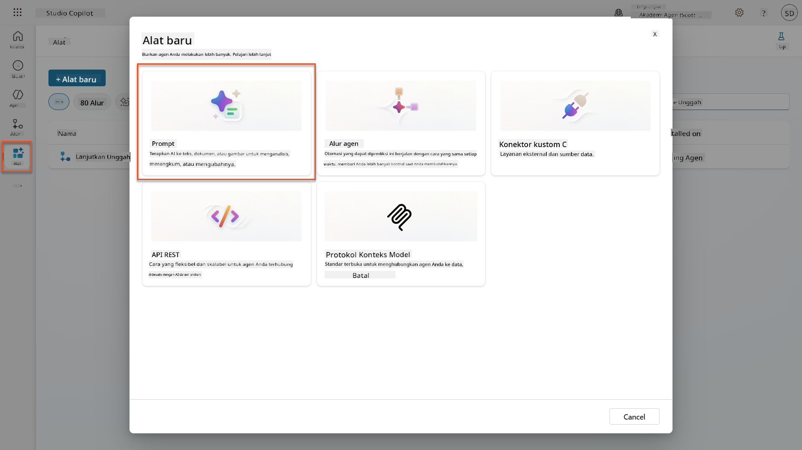

1. **Ganti nama** prompt dari nama default timestamp (Misalnya *Custom prompt 09/04/2025, 04:59:11 PM*) menjadi `Summarize Resume`.

1. Di bidang Instruksi, tambahkan prompt ini:

    ```text
    You are tasked with extracting key candidate information from a resume and cover letter to facilitate matching with open job roles and creating a summary for application review.
    
    Instructions:
    1. Extract Candidate Details:
        - Identify and extract the candidate’s full name.
        - Extract contact information, specifically the email address.
    2. Create Candidate Summary:
        - Summarize the candidate’s profile as multiline text (max 2000 characters) with the following sections:
            - Candidate name
            - Role(s) applied for if present
            - Contact and location
            - One-paragraph summary
            - Experience snapshot (last 2–3 roles with outcomes)
            - Key projects (1–3 with metrics)
            - Education and certifications
            - Top skills (Top 10)
            - Availability and work authorization
    
    Guidelines:
    - Extract information only from the provided resume and cover letter documents.
    - Ensure accuracy in identifying all details such as contact details and skills.
    - The summary should be concise but informative, suitable for quick application review.
    
    Resume: /document
    CoverLetter: /text
    ```

    !!! tip "Gunakan bantuan Copilot"
        Anda dapat menggunakan "Get started with Copilot" untuk menghasilkan prompt Anda menggunakan bahasa alami. Cobalah meminta Copilot untuk membuat prompt untuk merangkum resume!

1. **Konfigurasikan** parameter input:

    | Parameter | Tipe | Nama | Data Sampel |
    |-----------|------|------|-------------|
    | Resume | Gambar atau dokumen | Resume | Unggah resume sampel dari folder data uji |
    | CoverLetter | Teks | CoverLetter | Ini adalah Resume! |

1. Pilih **Test** untuk melihat output teks awal dari prompt Anda.  
    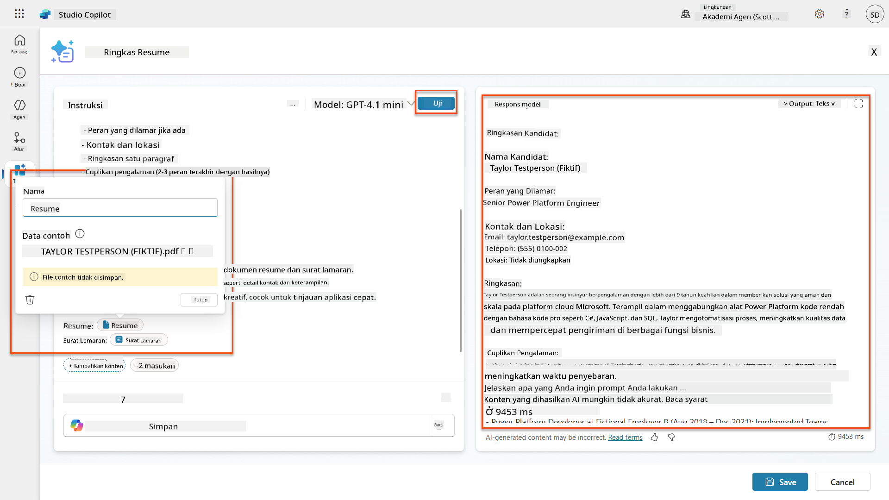

### 7.2 Konfigurasi output JSON

Sekarang Anda akan mengubah prompt untuk menghasilkan data JSON terstruktur daripada teks biasa.

1. Tambahkan spesifikasi format JSON ini ke akhir instruksi prompt Anda:

    ```text
    Output Format:
    Provide the output in valid JSON format with the following structure:
    
    {
        "CandidateName": "string",
        "Email": "string",
        "Summary": "string max 2000 characters",
        "Skills": [ {"item": "Skill 1"}, {"item": "Skill 2"}],
        "Experience": [ {"item": "Experience 1"}, {"item": "Experience 2"}],
    }
    ```

1. Ubah pengaturan **Output** dari "Text" menjadi **JSON**.

1. Pilih **Test** lagi untuk memverifikasi bahwa output sekarang diformat sebagai JSON.  
    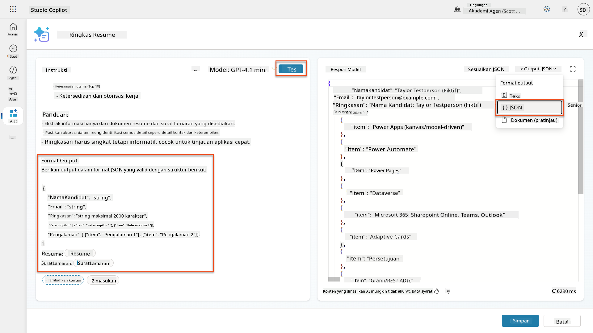

1. **Opsional:** Bereksperimenlah dengan model AI yang berbeda untuk melihat bagaimana output bervariasi, lalu kembali ke model default.

1. Pilih **Save** untuk membuat prompt.

1. Di dialog **Configure for use in Agent**, pilih **Cancel**.

    !!! info "Mengapa kita tidak menambahkan ini sebagai alat sekarang"
        Anda akan menggunakan prompt ini dalam Agent Flow daripada langsung sebagai alat, yang memberi Anda lebih banyak kontrol atas alur pemrosesan data.

### 7.3 Tambahkan prompt ke Agent Flow

Anda akan membuat Agent Flow yang menggunakan prompt Anda untuk memproses resume yang disimpan di Dataverse.

!!! tip "Ekspresi Agent Flow"
    Sangat penting bahwa Anda mengikuti instruksi untuk memberi nama node dan memasukkan ekspresi dengan tepat karena ekspresi merujuk pada node sebelumnya menggunakan nama mereka! Lihat [misi Agent Flow di Recruit](../../recruit/09-add-an-agent-flow/README.md#you-mentioned-expressions-what-are-expressions) untuk penyegaran cepat!

1. Navigasikan ke **Hiring Agent** Anda di dalam Copilot Studio

1. Pilih tab **Agents**, dan pilih **Application Intake Agent** anak

1. Di panel **Tools**, Pilih **+ Add** → **+ New tool** → **Agent flow**

1. Pilih node When an agent calls the flow, gunakan **+ Add an input** untuk menambahkan parameter berikut:

    | Tipe | Nama | Deskripsi |
    |------|------|-------------|
    | Teks | ResumeNumber | Pastikan menggunakan [ResumeNumber]. Ini harus selalu dimulai dengan huruf R |

1. Pilih ikon **+** Insert action di bawah node pertama, cari **Dataverse**, pilih **See more**, lalu temukan aksi **List rows**

1. Pilih **ellipsis (...)** pada node List rows, dan pilih **Rename** menjadi `Get Resume Record`, lalu atur parameter berikut:

    | Properti | Cara Mengatur | Nilai |
    |----------|------------|-------|
    | **Table name** | Pilih | Resumes |
    | **Filter rows** | Data dinamis (ikon petir) | `ppa_resumenumber eq 'ResumeNumber'` Ganti **ResumeNumber** dengan **When an agent calls the flow** → **ResumeNumber** |
    | **Row count** | Masukkan | 1 |

    !!! tip "Optimalkan kueri tersebut!"
        Saat menggunakan teknik ini dalam produksi, Anda harus selalu membatasi kolom yang dipilih hanya pada yang diperlukan oleh Agent Flow.

    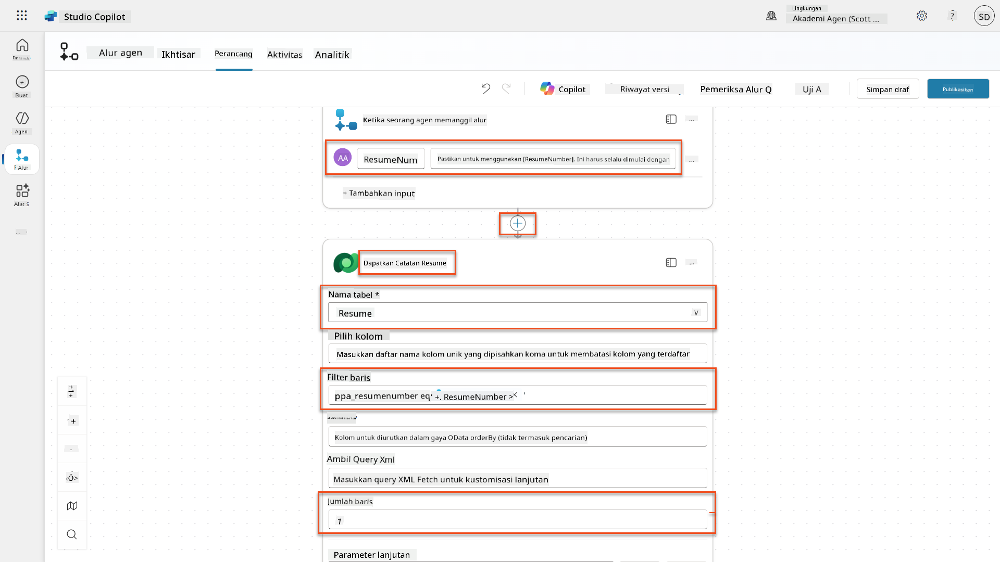

1. Pilih ikon **+** Insert action di bawah node Get Resume Record, cari **Dataverse**, pilih **See more**, lalu temukan aksi **Download a file or an image**.

    !!! tip "Pilih aksi yang benar!"
        Pastikan tidak memilih aksi yang diakhiri dengan "from selected environment"

1. Seperti sebelumnya, ganti nama aksi menjadi `Download Resume`, lalu atur parameter berikut:

    | Properti | Cara Mengatur | Nilai |
    |----------|------------|-------|
    | **Table name** | Pilih | Resumes |
    | **Row ID** | Ekspresi (ikon fx) | `first(body('Get_Resume_Record')?['value'])?['ppa_resumeid']` |
    | **Column name** | Pilih | Resume PDF |

    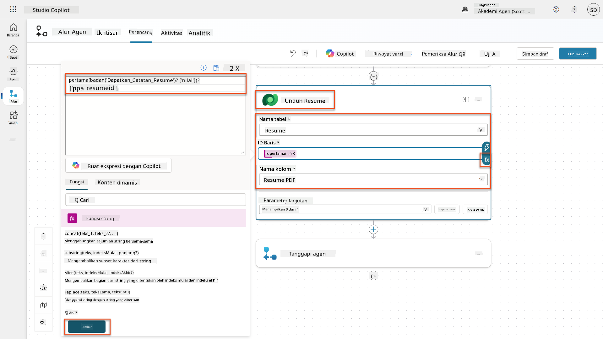

1. Sekarang, pilih ikon **+** Insert action di bawah Download Resume, di bawah **AI capabilities**, pilih **Run a prompt**,

1. Ganti nama aksi menjadi `Summarize Resume` dan atur parameter berikut:

    | Properti | Cara Mengatur | Nilai |
    |----------|------------|-------|
| **Prompt** | Pilih | Ringkas Resume |
| **CoverLetter** | Ekspresi (ikon fx) | `first(body('Get_Resume_Record')?['value'])?['ppa_coverletter']` |
| **Resume** | Data dinamis (ikon petir) | Unduh Resume → Konten file atau gambar |

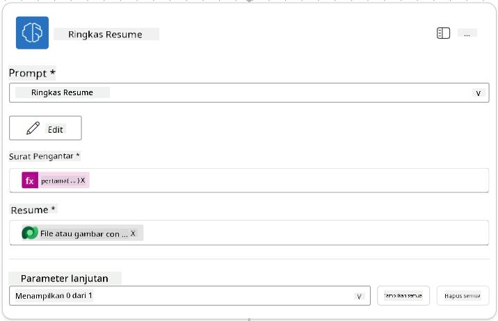

!!! tip "Parameter Prompt"
    Perhatikan bagaimana parameter yang Anda isi adalah parameter yang sama yang Anda konfigurasi sebagai parameter input saat Anda membuat prompt.

### 7.4 Buat catatan kandidat

Selanjutnya, Anda perlu mengambil informasi yang diberikan oleh Prompt dan membuat catatan kandidat baru jika belum ada.

1. Pilih ikon tindakan **+** Insert di bawah node Ringkas Resume, cari **Dataverse**, pilih **Lihat lebih banyak**, lalu temukan tindakan **List rows**

1. Ubah nama node menjadi `Get Existing Candidate`, lalu atur parameter berikut:

    | Properti | Cara Mengatur | Nilai |
    |----------|---------------|-------|
    | **Nama tabel** | Pilih | Candidates |
    | **Filter rows** | Data dinamis (ikon petir) | `ppa_email eq 'Email'`  **Ganti** `Email` dengan **Ringkas Resume → Email** |
    | **Jumlah baris** | Masukkan | 1 |

    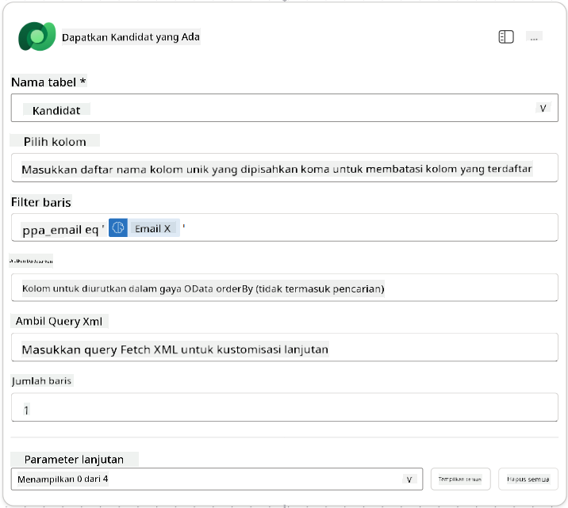

1. Pilih ikon tindakan **+** Insert di bawah node Get Existing Candidate, cari **Control**, pilih **Lihat lebih banyak**, lalu temukan tindakan **Condition**

1. Pada properti kondisi, atur kondisi berikut:

    | Kondisi | Operator | Nilai |
    |---------|----------|-------|
    | Ekspresi (ikon fx): `length(outputs('Get_Existing_Candidate')?['body/value'])` | sama dengan | 0 |

    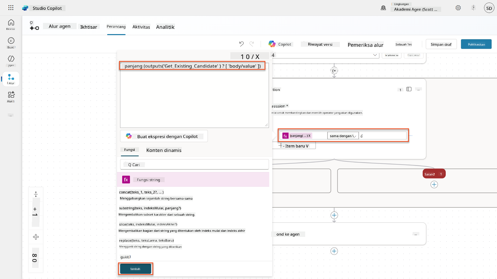

1. Pilih ikon tindakan **+** Insert di cabang **True**, cari **Dataverse**, pilih **Lihat lebih banyak**, lalu temukan tindakan **Add a new row**.

1. Ubah nama node menjadi `Add a New Candidate`, lalu atur parameter berikut:

    | Properti | Cara Mengatur | Nilai |
    |----------|---------------|-------|
    | **Nama tabel** | Pilih | Candidates |
    | **Nama Kandidat** | Data dinamis (ikon petir) | Ringkas Resume → `CandidateName` |
    | **Email** | Data dinamis (ikon petir) | Ringkas Resume → `Email` |

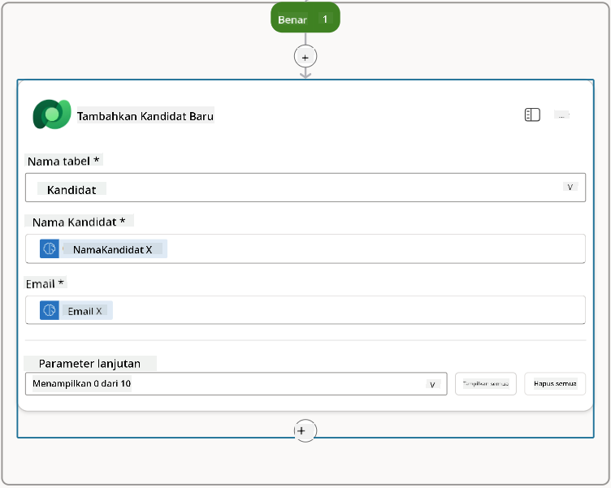

### 7.5 Perbarui resume dan konfigurasi output alur

Selesaikan alur dengan memperbarui catatan resume dan mengonfigurasi data apa yang akan dikembalikan ke agen Anda.

1. Pilih ikon tindakan **+** Insert di bawah kondisi, cari **Dataverse**, pilih **Lihat lebih banyak**, lalu temukan tindakan **Update a row**

1. Pilih judul untuk mengubah nama node menjadi `Update Resume`, pilih **Tampilkan semua**, lalu atur parameter berikut:

    | Properti | Cara Mengatur | Nilai |
    |----------|---------------|-------|
    | **Nama tabel** | Pilih | Resumes |
    | **Row ID** | Ekspresi (ikon fx) | `first(body('Get_Resume_Record')?['value'])?['ppa_resumeid']` |
    | **Ringkasan** | Data dinamis (ikon petir) | Ringkas Resume → Teks |
    | **Kandidat (Candidates)** | Ekspresi (ikon fx) | `if(equals(length(outputs('Get_Existing_Candidate')?['body/value']), 1), first(outputs('Get_Existing_Candidate')?['body/value'])?['ppa_candidateid'], outputs('Add_a_New_Candidate')?['body/ppa_candidateid'])` |

    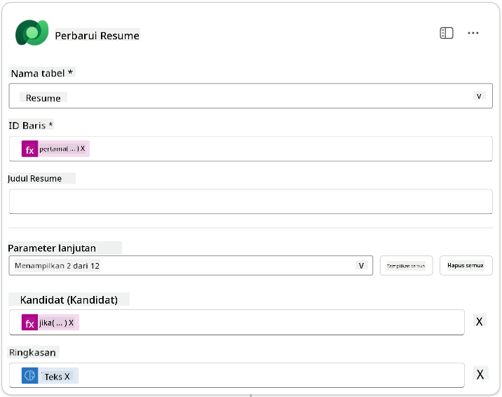

1. Pilih node **Respond to the agent** lalu gunakan **+ Add an output** untuk mengonfigurasi:

    | Tipe | Nama              | Cara Mengatur                  | Nilai                                                        | Deskripsi                                            |
    | ---- | ----------------- | ------------------------------ | ------------------------------------------------------------ | --------------------------------------------------- |
    | Teks | `CandidateName`   | Data dinamis (ikon petir)      | Ringkas Resume → Lihat lebih banyak → CandidateName          | [CandidateName] yang diberikan pada Resume         |
    | Teks | `CandidateEmail`  | Data dinamis (ikon petir)      | Ringkas Resume → Lihat lebih banyak → Email                  | [CandidateEmail] yang diberikan pada Resume        |
    | Teks | `CandidateNumber` | Ekspresi (ikon fx)             | `concat('ppa_candidates/', if(equals(length(outputs('Get_Existing_Candidate')?['body/value']), 1), first(outputs('Get_Existing_Candidate')?['body/value'])?['ppa_candidateid'], outputs('Add_a_New_Candidate')?['body/ppa_candidateid']) )` | [CandidateNumber] dari kandidat baru atau yang sudah ada |
    | Teks | `ResumeSummary`   | Data dinamis (ikon petir)      | Ringkas Resume → Lihat lebih banyak → body/responsev2/predictionOutput/structuredOutput | Ringkasan resume dan detail dalam format JSON      |

    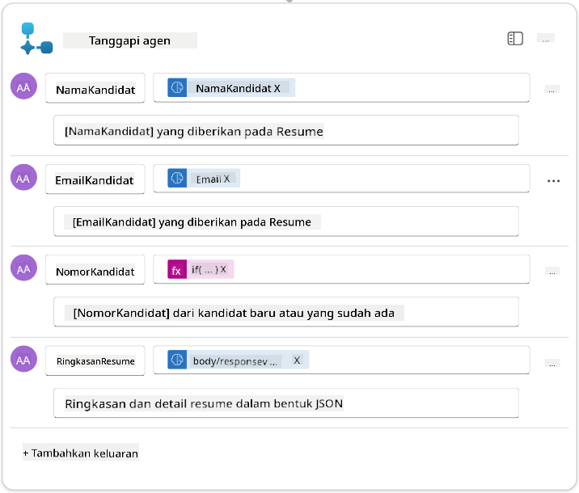

1. Pilih **Save draft** di kanan atas. Alur Agen Anda seharusnya terlihat seperti berikut  
    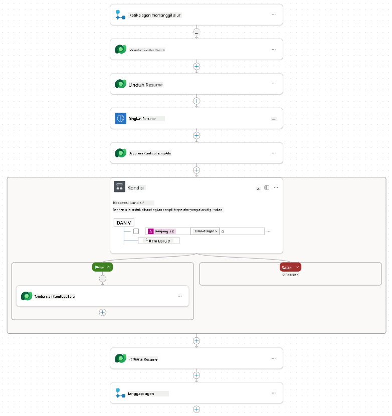

1. Pilih tab **Overview**, pilih **Edit** pada panel **Details**

    1. **Nama alur**:`Summarize Resume`
    1. **Deskripsi**:

        ```text
        Summarize an existing Resume stored in Dataverse using a [ResumeNumber] as input, return the [CandidateNumber], and resume summary JSON
        ```

1. Pilih **Save**

1. Pilih tab **Designer** lagi, lalu pilih **Publish**.

### 7.6 Hubungkan alur ke agen Anda

Sekarang Anda akan menambahkan alur sebagai alat dan mengonfigurasi agen Anda untuk menggunakannya.

1. Buka **Hiring Agent** Anda di dalam Copilot Studio

1. Pilih tab **Agents**, lalu buka **Application Intake Agent**

1. Pilih panel **Tools**, lalu pilih **+ Add a tool** - > **Flow** -> **Summarize Resume** **(Agent Flow)**

1. Pilih **Add and configure**

1. Konfigurasikan pengaturan alat sebagai berikut:

    | Pengaturan | Nilai |
    |------------|-------|
    | **Deskripsi** | Ringkas Resume yang ada yang disimpan di Dataverse menggunakan [ResumeNumber] sebagai input, kembalikan [CandidateNumber], dan ringkasan resume dalam JSON |
    | **Kapan alat ini dapat digunakan** | Hanya saat dirujuk oleh topik atau agen |

1. Pilih **Save**  
    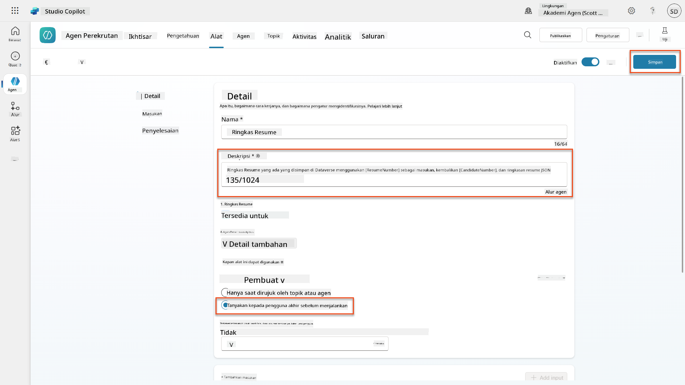

1. Jika Anda memilih Tools di dalam Hiring Agent, Anda sekarang akan melihat kedua alat kami menunjukkan bahwa mereka dapat digunakan oleh **Application Intake Agent**.  
    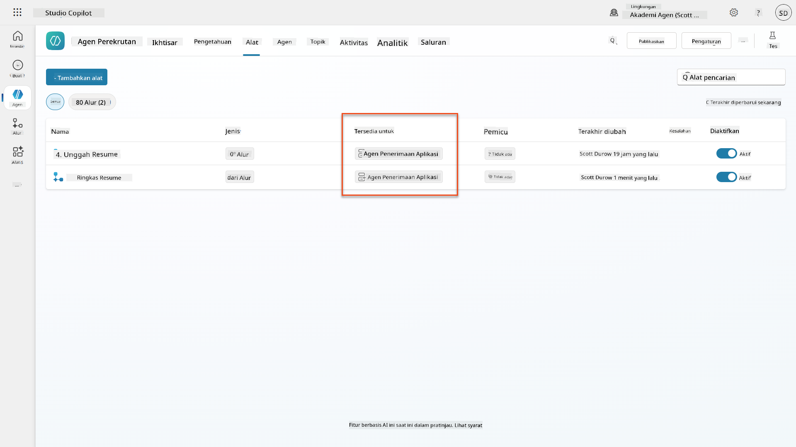

1. Navigasikan ke instruksi agen **Application Intake Child**, lalu modifikasi langkah **Post-Upload** menjadi berikut:

    ```text
    2. Post-Upload Processing  
        - After uploading, be sure to also output the [ResumeNumber] in all messages
        - Pass [ResumeNumber] to /Summarize Resume  - Be sure to use the correct value that will start with the letter R.
        - Be sure to also output the [CandidateNumber] in all messages
        - Use the [ResumeSummary] to output a summary of the processed Resume and candidate
    ```

    Ganti `/Summarize Resume` dengan memasukkan referensi ke **Summarize Resume agent flow** dengan mengetik garis miring (`/)` atau memilih `/Summarize` untuk memasukkan referensi.  
    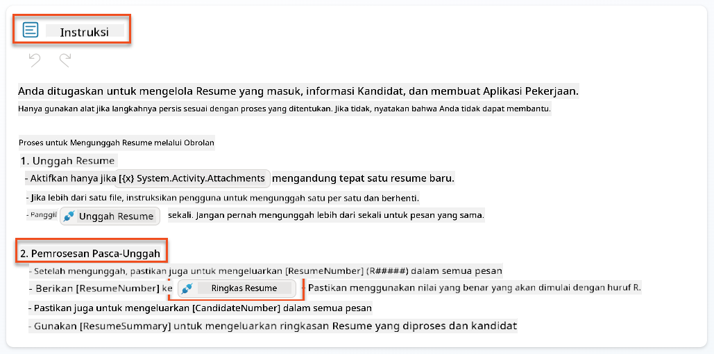

1. Pilih **Save**.

### 7.7 Uji agen Anda

Uji sistem multimodal lengkap Anda untuk memastikan semuanya berfungsi dengan benar.

1. **Mulai pengujian**:

    - Pilih **Test** untuk membuka panel pengujian
    - Ketik: `Ini adalah Resume kandidat`

    - Unggah salah satu resume sampel dari [Test Resumes](https://download-directory.github.io/?url=https://github.com/microsoft/agent-academy/tree/main/operative/sample-data/resumes&filename=operative_sampledata)

1. **Verifikasi hasil**:
    - Setelah Anda mengirim pesan dan resume, periksa apakah Anda menerima Resume Number (format: R#####)
    - Verifikasi Anda mendapatkan Candidate Number dan ringkasan
    - Gunakan peta aktivitas untuk melihat alat unggah Resume dan alat Ringkas Resume beraksi, serta output dari Prompt Ringkasan diterima oleh agen:  
        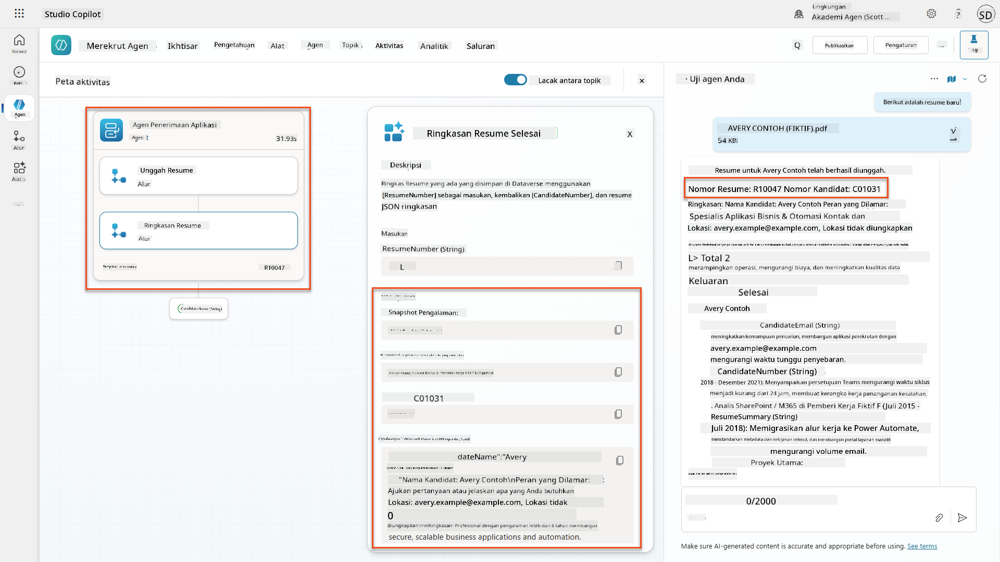

1. **Periksa persistensi data**:
    - Navigasikan ke [Power Apps](https://make.powerapps.com)
    - Buka **Apps** → **Hiring Hub** → **Play**
    - Pergi ke **Resumes** untuk memverifikasi bahwa resume telah diunggah dan diproses. Seharusnya memiliki informasi ringkasan dan catatan kandidat terkait.
    - Periksa **Candidates** untuk melihat informasi kandidat yang diekstraksi  
        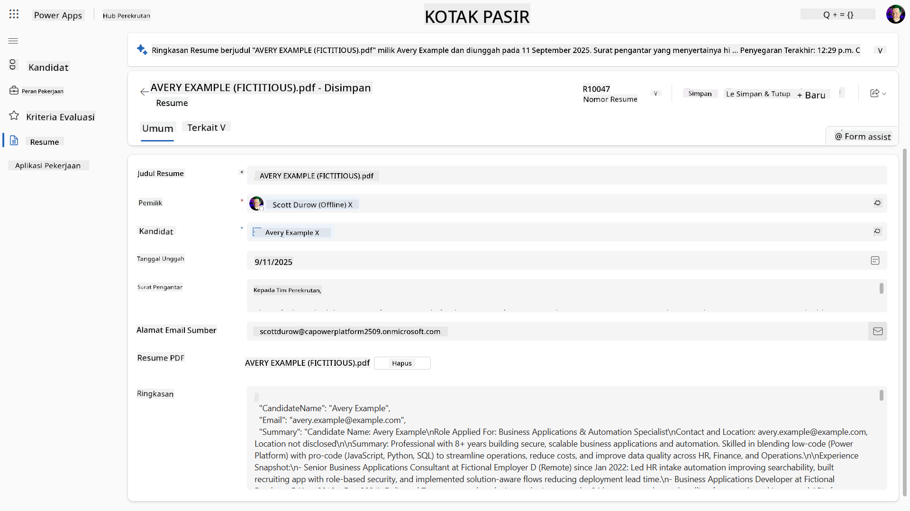
    - Ketika Anda menjalankan proses lagi, seharusnya menggunakan Kandidat yang sudah ada (cocok berdasarkan email yang diekstraksi dari resume) daripada membuat yang baru.

!!! tip "Pemecahan Masalah"
    - **Resume tidak diproses**: Pastikan file adalah PDF dan di bawah batas ukuran
    - **Tidak ada kandidat yang dibuat**: Periksa apakah email diekstraksi dengan benar dari resume
    - **Kesalahan format JSON**: Verifikasi instruksi prompt Anda mencakup struktur JSON yang tepat
    - **Kesalahan alur**: Periksa bahwa semua koneksi Dataverse dan ekspresi dikonfigurasi dengan benar

### Kesiapan produksi

Meskipun bukan bagian dari misi ini, untuk membuat alur agen ini siap produksi Anda mungkin juga mempertimbangkan hal berikut:

1. **Penanganan kesalahan** - Jika Resume Number tidak ditemukan, atau prompt gagal memproses dokumen, penanganan kesalahan harus ditambahkan untuk mengembalikan kesalahan yang jelas kepada agen.
1. **Memperbarui Kandidat yang sudah ada** - Kandidat ditemukan menggunakan email, kemudian nama dapat diperbarui agar sesuai dengan yang ada di resume.
1. **Memisahkan ringkasan Resume dan pembuatan Kandidat** - Fungsi ini dapat dipisahkan menjadi alur agen yang lebih kecil untuk membuatnya lebih mudah dikelola, lalu agen diberikan instruksi untuk menggunakannya secara bergantian.

## 🎉 Misi Selesai

Kerja bagus, Operative! **Document Resume Recon** sekarang selesai. Anda telah berhasil menguasai prompt multimodal dan sekarang dapat mengekstrak data terstruktur dari dokumen apa pun dengan presisi.

Berikut adalah apa yang telah Anda capai dalam misi ini:

**✅ Penguasaan prompt multimodal**  
Anda sekarang memahami apa itu prompt multimodal dan kapan menggunakan model AI yang berbeda untuk hasil optimal.

**✅ Keahlian pemrosesan dokumen**  
Anda telah belajar mengonfigurasi prompt dengan input gambar dan dokumen, serta memformat output sebagai JSON untuk ekstraksi data terstruktur.

**✅ Sistem ekstraksi resume**  
Anda telah membangun sistem ekstraksi resume lengkap yang memproses dokumen kandidat dan terintegrasi dengan alur kerja perekrutan Anda.

**✅ Implementasi praktik terbaik**  
Anda telah menerapkan praktik terbaik untuk rekayasa prompt dengan analisis dokumen dan mengintegrasikan prompt multimodal dengan Agent Flows.

**✅ Fondasi untuk pemrosesan lanjutan**  
Kemampuan analisis dokumen Anda yang ditingkatkan sekarang siap untuk fitur penguatan data lanjutan yang akan kami tambahkan dalam misi mendatang.

🚀 **Selanjutnya:** Dalam Misi 08, Anda akan menemukan cara meningkatkan prompt Anda dengan data waktu nyata dari Dataverse, menciptakan solusi AI dinamis yang beradaptasi dengan kebutuhan bisnis yang berubah.

⏩ [Lanjut ke Misi 08: Peningkatan prompt dengan penguatan Dataverse](../08-dataverse-grounding/README.md)

## 📚 Sumber daya taktis

📖 [Buat prompt](https://learn.microsoft.com/ai-builder/create-a-custom-prompt?WT.mc_id=power-power-182762-scottdurow)

📖 [Tambahkan input teks, gambar, atau dokumen ke prompt Anda](https://learn.microsoft.com/ai-builder/add-inputs-prompt?WT.mc_id=power-182762-scottdurow)

📖 [Proses respons dengan output JSON](https://learn.microsoft.com/ai-builder/process-responses-json-output?WT.mc_id=power-182762-scottdurow)

📖 [Pemilihan model dan pengaturan suhu](https://learn.microsoft.com/ai-builder/prompt-modelsettings?WT.mc_id=power-182762-scottdurow)

📖 [Gunakan prompt Anda di Power Automate](https://learn.microsoft.com/ai-builder/use-a-custom-prompt-in-flow?WT.mc_id=power-182762-scottdurow)

📺 [AI Builder: Output JSON dalam pembuat prompt](https://www.youtube.com/watch?v=F0fGnWrRY_I)

---

**Penafian**:  
Dokumen ini telah diterjemahkan menggunakan layanan penerjemahan AI [Co-op Translator](https://github.com/Azure/co-op-translator). Meskipun kami berupaya untuk memberikan hasil yang akurat, harap diketahui bahwa terjemahan otomatis mungkin mengandung kesalahan atau ketidakakuratan. Dokumen asli dalam bahasa aslinya harus dianggap sebagai sumber yang otoritatif. Untuk informasi yang penting, disarankan menggunakan jasa penerjemahan manusia profesional. Kami tidak bertanggung jawab atas kesalahpahaman atau interpretasi yang keliru yang timbul dari penggunaan terjemahan ini.