<!--
CO_OP_TRANSLATOR_METADATA:
{
  "original_hash": "750f3ea8a94930439ebd8a10871b1d73",
  "translation_date": "2025-10-17T17:15:56+00:00",
  "source_file": "docs/operative-preview/08-dataverse-grounding/README.md",
  "language_code": "id"
}
-->
# 🚨 Misi 08: Peningkatan prompt dengan dasar Dataverse

--8<-- "disclaimer.md"

## 🕵️‍♂️ NAMA KODE: `OPERASI KONTROL DASAR`

> **⏱️ Waktu Operasi:** `~60 menit`

## 🎯 Ringkasan Misi

Selamat datang kembali, Operatif. Sistem perekrutan multi-agen Anda sudah beroperasi, tetapi ada peningkatan penting yang diperlukan untuk **dasar data** - model AI Anda membutuhkan akses real-time ke data terstruktur organisasi Anda untuk membuat keputusan yang cerdas.

Saat ini, prompt Ringkasan Resume Anda beroperasi dengan pengetahuan statis. Tetapi bagaimana jika ia dapat mengakses database peran pekerjaan Anda secara dinamis untuk memberikan kecocokan yang akurat dan terkini? Bagaimana jika ia memahami kriteria evaluasi Anda tanpa harus Anda kodekan secara manual?

Dalam misi ini, Anda akan meningkatkan prompt kustom Anda dengan **dasar Dataverse** - menghubungkan prompt Anda langsung ke sumber data langsung. Ini mengubah agen Anda dari responden statis menjadi sistem berbasis data yang dinamis yang dapat beradaptasi dengan kebutuhan bisnis yang berubah.

Misi Anda: integrasikan data peran pekerjaan dan kriteria evaluasi real-time ke dalam alur analisis resume Anda, menciptakan sistem yang selalu diperbarui sesuai dengan kebutuhan perekrutan organisasi Anda.

## 🔎 Tujuan

Dalam misi ini, Anda akan mempelajari:

1. Bagaimana **dasar Dataverse** meningkatkan prompt kustom
1. Kapan menggunakan dasar data vs instruksi statis
1. Merancang prompt yang secara dinamis menggabungkan data langsung
1. Meningkatkan alur Ringkasan Resume dengan pencocokan peran pekerjaan

## 🧠 Memahami dasar Dataverse untuk prompt

**Dasar Dataverse** memungkinkan prompt kustom Anda mengakses data langsung dari tabel Dataverse saat memproses permintaan. Alih-alih instruksi statis, prompt Anda dapat menggabungkan informasi real-time untuk membuat keputusan yang terinformasi.

### Mengapa dasar Dataverse penting

Prompt tradisional bekerja dengan instruksi tetap:

```text
Match this candidate to these job roles: Developer, Manager, Analyst
```

Dengan dasar Dataverse, prompt Anda mengakses data terkini:

```text
Match this candidate to available job roles from the Job Roles table, 
considering current evaluation criteria and requirements
```

Pendekatan ini memberikan beberapa manfaat utama:

- **Pembaruan dinamis:** Peran pekerjaan dan kriteria berubah tanpa modifikasi prompt
- **Konsistensi:** Semua agen menggunakan sumber data terkini yang sama
- **Skalabilitas:** Peran dan kriteria baru tersedia secara otomatis
- **Akurasi:** Data real-time memastikan keputusan mencerminkan kebutuhan terkini

### Cara kerja dasar Dataverse

Saat Anda mengaktifkan dasar Dataverse untuk prompt kustom:

1. **Pemilihan data:** Pilih tabel dan kolom Dataverse spesifik untuk disertakan. Anda juga dapat memilih tabel terkait yang akan difilter oleh sistem berdasarkan catatan induk yang diambil.
1. **Penyuntikan konteks:** Prompt secara otomatis menyertakan data yang diambil dalam konteks prompt
1. **Penyaringan cerdas:** Sistem hanya menyertakan data yang relevan dengan permintaan saat ini jika Anda memberikan penyaringan.
1. **Output terstruktur:** Prompt Anda dapat merujuk data yang diambil dan mempertimbangkan catatan yang diambil untuk membuat output.

### Dari statis ke dinamis: Keunggulan dasar

Mari kita periksa alur Ringkasan Resume Anda saat ini dari Misi 07 dan lihat bagaimana dasar Dataverse mengubahnya dari kecerdasan statis menjadi dinamis.

**Pendekatan statis saat ini:**
Prompt Anda yang ada menyertakan kriteria evaluasi yang dikodekan secara manual dan logika pencocokan yang telah ditentukan sebelumnya. Pendekatan ini berfungsi tetapi memerlukan pembaruan manual setiap kali Anda menambahkan peran pekerjaan baru, mengubah kriteria evaluasi, atau menggeser prioritas perusahaan.

**Transformasi dasar Dataverse:**
Dengan menambahkan dasar Dataverse, alur Ringkasan Resume Anda akan:

- **Mengakses peran pekerjaan terkini** dari tabel Peran Pekerjaan Anda
- **Menggunakan kriteria evaluasi langsung** alih-alih deskripsi statis  
- **Memberikan kecocokan yang akurat** berdasarkan kebutuhan real-time

## 🎯 Mengapa prompt khusus vs percakapan agen

Dalam Misi 02, Anda mengalami bagaimana Agen Wawancara dapat mencocokkan kandidat dengan peran pekerjaan, tetapi memerlukan prompt pengguna yang kompleks seperti:

```text
Upload this resume, then show me open job roles,
each with a description of the evaluation criteria, 
then use this to match the resume to at least one suitable
job role even if not a perfect match.
```

Meskipun ini berfungsi, prompt khusus dengan dasar Dataverse menawarkan keuntungan signifikan untuk tugas tertentu:

### Keuntungan utama dari prompt khusus

| Aspek | Percakapan Agen | Prompt Khusus |
|--------|-------------------|------------------|
| **Konsistensi** | Hasil bervariasi berdasarkan keterampilan pengguna dalam membuat prompt | Pemrosesan yang terstandarisasi setiap saat |
| **Spesialisasi** | Penalaran umum mungkin melewatkan nuansa bisnis | Dibangun khusus dengan logika bisnis yang dioptimalkan |
| **Otomasi** | Memerlukan interaksi dan interpretasi manusia | Dipicu secara otomatis dengan output JSON terstruktur |

## 🧪 Lab 8: Tambahkan dasar Dataverse ke prompt

Saatnya meningkatkan kemampuan analisis resume Anda! Anda akan meningkatkan alur Ringkasan Resume yang ada dengan pencocokan peran pekerjaan yang dinamis.

### Prasyarat untuk menyelesaikan misi ini

1. Anda perlu **salah satu**:

    - **Telah menyelesaikan Misi 07** dan memiliki sistem analisis resume Anda siap, **ATAU**
    - **Mengimpor solusi awal Misi 08** jika Anda memulai dari awal atau perlu mengejar ketinggalan. [Unduh Solusi Awal Misi 08](https://aka.ms/agent-academy)

1. Dokumen resume sampel dari [test Resumes](https://download-directory.github.io/?url=https://github.com/microsoft/agent-academy/tree/main/operative/sample-data/resumes&filename=operative_sampledata)

!!! note "Impor Solusi dan Data Sampel"
    Jika Anda menggunakan solusi awal, lihat [Misi 01](../01-get-started/README.md) untuk instruksi rinci tentang cara mengimpor solusi dan data sampel ke lingkungan Anda.

### 8.1 Tambahkan dasar Dataverse ke prompt Anda

Anda akan membangun prompt Ringkasan Resume yang Anda buat di Misi 07. Saat ini hanya merangkum resume, tetapi sekarang Anda akan mendasarkannya dengan peran pekerjaan sebagaimana adanya di Dataverse, menjadikannya selalu terkini.

Pertama, mari kita periksa tabel Dataverse yang akan Anda gunakan sebagai dasar:

1. **Navigasikan** ke [Power Apps](https://make.powerapps.com) dan pilih lingkungan Anda menggunakan **Pengalih Lingkungan** di kanan atas bilah navigasi.

1. Pilih **Tabel** dan temukan tabel **Peran Pekerjaan**

1. Tinjau kolom utama yang akan Anda gunakan sebagai dasar:

    | Kolom | Tujuan |
    |--------|---------|
    | **Nomor Peran Pekerjaan** | Pengidentifikasi unik untuk pencocokan peran |
    | **Judul Pekerjaan** | Nama tampilan untuk peran |
    | **Deskripsi** | Persyaratan peran yang rinci |

1. Demikian pula, tinjau tabel lainnya seperti tabel **Kriteria Evaluasi**.

### 8.2 Tambahkan data dasar Dataverse ke prompt Anda

1. **Navigasikan** ke Copilot Studio, dan pilih lingkungan Anda menggunakan **Pengalih Lingkungan** di kanan atas bilah navigasi.

1. Pilih **Tools** dari navigasi kiri.

1. Pilih **Prompt** dan temukan prompt **Ringkasan Resume** Anda dari Misi 07.  
    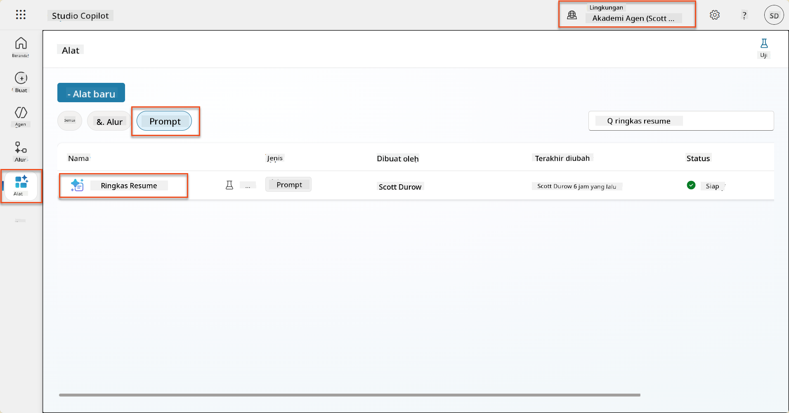

1. Pilih **Edit** untuk memodifikasi prompt, dan ganti dengan versi yang ditingkatkan di bawah ini:

    !!! important
        Pastikan parameter Resume dan Surat Lamaran tetap utuh sebagai parameter.

    ```text
    You are tasked with extracting key candidate information from a resume and cover letter to facilitate matching with open job roles and creating a summary for application review.
    
    ### Instructions:
    1. **Extract Candidate Details:**
       - Identify and extract the candidate's full name.
       - Extract contact information, specifically the email address.
    
    2. **Analyze Resume and Cover Letter:**
       - Review the resume content to identify relevant skills, experience, and qualifications.
       - Review the cover letter to understand the candidate's motivation and suitability for the roles.
    
    3. **Match Against Open Job Roles:**
       - Compare the extracted candidate information with the requirements and descriptions of the provided open job roles.
       - Use the job descriptions to assess potential fit.
       - Identify all roles that align with the candidate's cover letter and profile. You don't need to assess perfect suitability.
       - Provide reasoning for each match based on the specific job requirements.
    
    4. **Create Candidate Summary:**
       - Summarize the candidate's profile as multiline text with the following sections:
          - Candidate name
          - Role(s) applied for if present
          - Contact and location
          - One-paragraph summary
          - Top skills (8–10)
          - Experience snapshot (last 2–3 roles with outcomes)
          - Key projects (1–3 with metrics)
          - Education and certifications
          - Availability and work authorization
    
    ### Output Format
    
    Provide the output in valid JSON format with the following structure:
    
    {
      "CandidateName": "string",
      "Email": "string",
      "MatchedRoles": [
        {
          "JobRoleNumber": "ppa_jobrolenumber from grounded data",
          "RoleName": "ppa_jobtitle from grounded data",
          "Reasoning": "Detailed explanation based on job requirements"
        }
      ],
      "Summary": "string"
    }
    
    ### Guidelines
    
    - Extract information only from the provided resume and cover letter documents.
    - Ensure accuracy in identifying contact details.
    - Use the available job role data for matching decisions.
    - The summary should be concise but informative, suitable for quick application review.
    - If no suitable matches are found, indicate an empty list for MatchedRoles and explain briefly in the summary.
    
    ### Input Data
    Open Job Roles (ppa_jobrolenumber, ppa_jobtitle): /Job Role 
    Resume: {Resume}
    Cover Letter: {CoverLetter}
    ```

1. Di editor prompt, ganti `/Job Role` dengan memilih **+ Tambahkan konten**, memilih **Dataverse** → **Peran Pekerjaan** dan pilih kolom berikut, lalu pilih **Tambahkan**:

    1. **Nomor Peran Pekerjaan**

    1. **Judul Pekerjaan**

    1. **Deskripsi**

    !!! tip
        Anda dapat mengetik nama tabel untuk mencari.

1. Di dialog **Peran Pekerjaan**, pilih atribut **Filter**, pilih **Status**, lalu ketik **Aktif** sebagai nilai **Filter**.  
    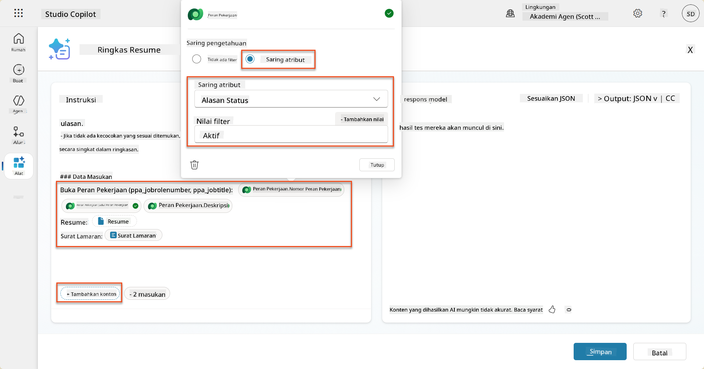

    !!! tip
        Anda dapat menggunakan **Tambahkan nilai** di sini untuk menambahkan parameter input juga - misalnya jika Anda memiliki prompt untuk merangkum catatan yang ada, Anda dapat memberikan Nomor Resume sebagai parameter untuk difilter.

1. Selanjutnya, Anda akan menambahkan tabel Dataverse terkait **Kriteria Evaluasi**, dengan kembali memilih **+ Tambahkan konten**, menemukan **Peran Pekerjaan**, dan alih-alih memilih kolom di Peran Pekerjaan, perluas **Peran Pekerjaan (Kriteria Evaluasi)** dan pilih kolom berikut, lalu pilih **Tambahkan**:

    1. **Nama Kriteria**

    1. **Deskripsi**  
        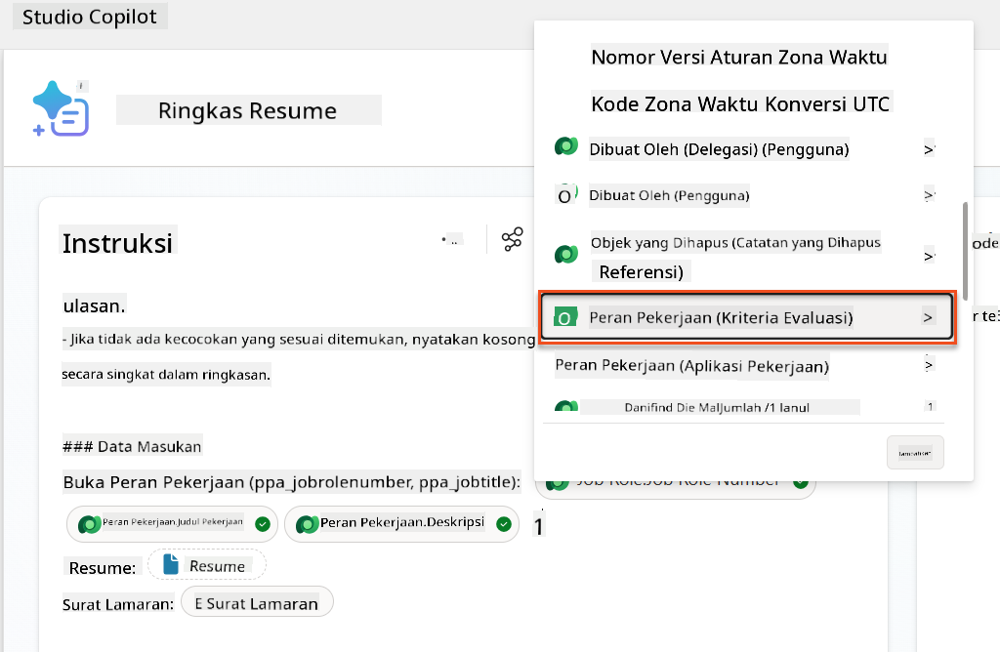

        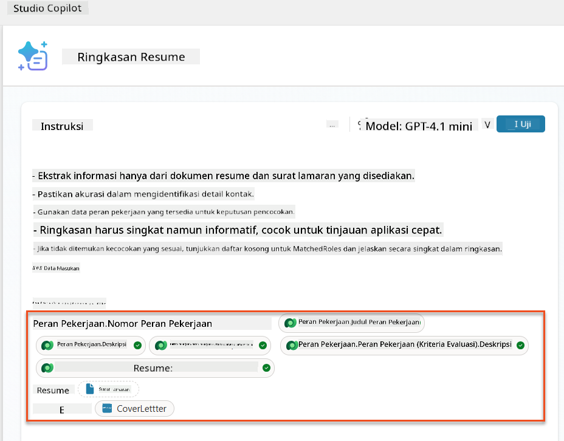

    !!! tip
        Penting untuk memilih Kriteria Evaluasi terkait dengan terlebih dahulu memilih Peran Pekerjaan, lalu menavigasi di menu ke Peran Pekerjaan (Kriteria Evaluasi). Ini akan memastikan bahwa hanya catatan terkait untuk Peran Pekerjaan yang akan dimuat.

1. Pilih **Pengaturan**, dan sesuaikan **Pengambilan catatan** menjadi 1000 - ini akan memungkinkan Peran Pekerjaan dan Kriteria Evaluasi maksimum untuk disertakan dalam prompt Anda.  
    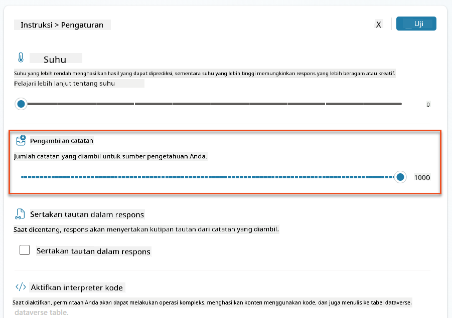

### 8.3 Uji prompt yang ditingkatkan

1. Pilih parameter **Resume**, dan unggah resume sampel yang Anda gunakan di Misi 07.
1. Pilih **Uji**.
1. Setelah pengujian selesai, perhatikan bahwa output JSON sekarang menyertakan **Peran yang Cocok**.
1. Pilih tab **Pengetahuan yang digunakan**, untuk melihat data Dataverse yang digabungkan dengan prompt Anda sebelum eksekusi.
1. **Simpan** prompt yang diperbarui. Sistem sekarang akan secara otomatis menyertakan data Dataverse ini dengan prompt Anda saat Alur Agen Ringkasan Resume yang ada memanggilnya.  
    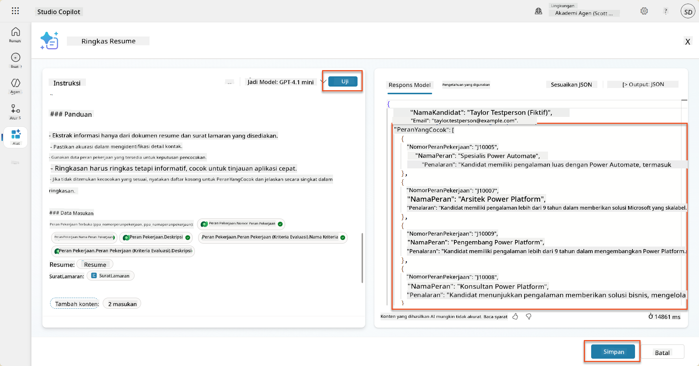

### 8.4 Tambahkan Alur Agen Aplikasi Pekerjaan

Untuk memungkinkan Agen Penerimaan Aplikasi kami membuat Peran Pekerjaan berdasarkan peran yang disarankan, kami perlu membuat Alur Agen. Agen akan memanggil alat ini untuk setiap peran pekerjaan yang disarankan yang diminati oleh kandidat.

!!! tip "Ekspresi Alur Agen"
    Sangat penting bahwa Anda mengikuti instruksi untuk memberi nama node Anda dan memasukkan ekspresi dengan tepat karena ekspresi merujuk pada node sebelumnya menggunakan nama mereka! Lihat [misi Alur Agen di Rekrut](../../recruit/09-add-an-agent-flow/README.md#you-mentioned-expressions-what-are-expressions) untuk penyegaran cepat!

1. Di dalam **Agen Perekrutan,** pilih tab **Agen**, dan buka agen anak **Agen Penerimaan Aplikasi**.

1. Di dalam panel **Tools**, pilih **+ Tambahkan** → **+ Alat baru** → **Alur Agen**

1. Pilih node **Saat agen memanggil alur**, gunakan **+ Tambahkan input** untuk menambahkan parameter berikut:

    | Tipe | Nama            | Deskripsi                                                  |
    | ---- | --------------- | ------------------------------------------------------------ |
    | Teks | `NomorResume`  | Pastikan hanya menggunakan [NomorResume] - harus dimulai dengan huruf R |
    | Teks | `NomorPeranPekerjaan` | Pastikan hanya menggunakan [NomorPeranPekerjaan] - harus dimulai dengan huruf J |

    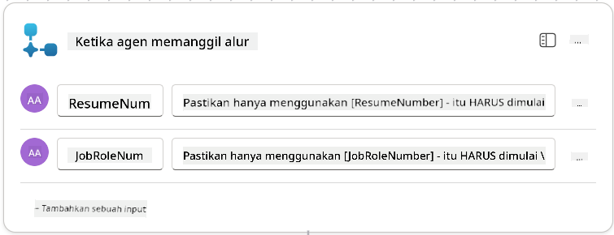

1. Pilih ikon **+** Tambahkan aksi di bawah node pertama, cari **Dataverse**, pilih **Lihat lebih banyak**, lalu temukan aksi **List rows**.

1. **Ganti nama** node sebagai `Dapatkan Resume`, lalu atur parameter berikut:

    | Properti        | Cara Mengatur                  | Nilai                                                        |
    | --------------- | ------------------------------- | ------------------------------------------------------------ |
    | **Nama tabel**  | Pilih                          | Resume                                                      |
    | **Filter baris** | Data dinamis (ikon petir)      | `ppa_resumenumber eq 'NomorResume'` Pilih dan ganti **NomorResume** dengan **Saat agen memanggil alur** → **NomorResume** |
    | **Jumlah baris** | Masukkan                      | 1                                                            |

    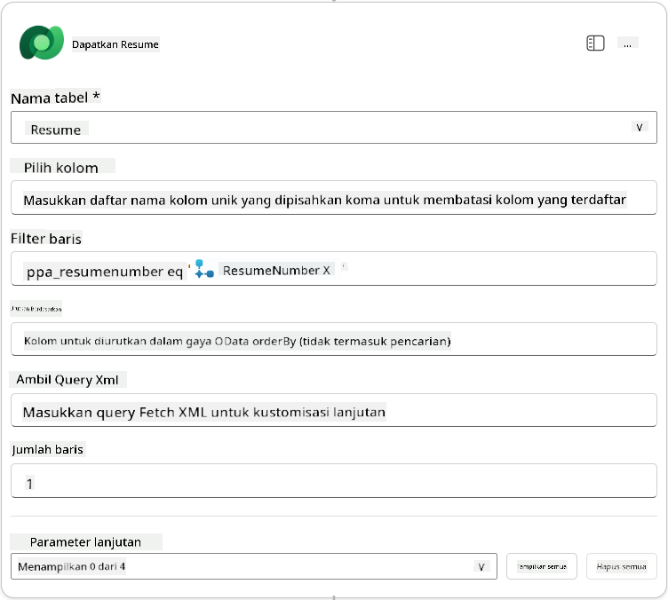

1. Sekarang, pilih ikon **+** Tambahkan aksi di bawah **Dapatkan Resume**, cari **Dataverse**, pilih **Lihat lebih banyak**, lalu temukan aksi **List rows**.

1. **Ganti nama** node sebagai `Dapatkan Peran Pekerjaan`, lalu atur parameter berikut:

    | Properti        | Cara Mengatur                  | Nilai                                                        |
    | --------------- | ------------------------------- | ------------------------------------------------------------ |
    | **Nama tabel**  | Pilih                          | Peran Pekerjaan                                              |
    | **Filter baris** | Data dinamis (ikon petir)      | `ppa_jobrolenumber eq 'NomorPeranPekerjaan'` Pilih dan ganti **NomorPeranPekerjaan** dengan **Saat agen memanggil alur** → **NomorPeranPekerjaan** |
    | **Jumlah baris** | Masukkan                      | 1                                                            |

    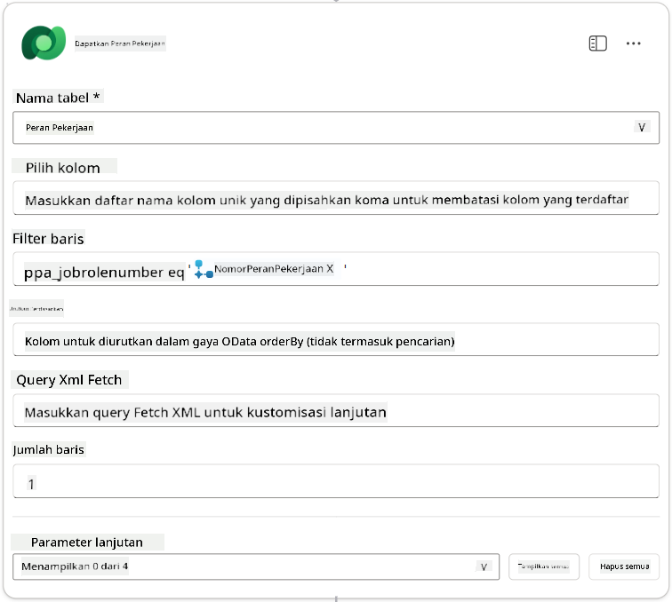

1. Sekarang, pilih ikon **+** Tambahkan aksi di bawah Dapatkan Peran Pekerjaan, cari **Dataverse**, pilih **Lihat lebih banyak**, lalu temukan aksi **Tambahkan baris baru**.

1. **Ganti nama** node sebagai `Tambahkan Aplikasi`, lalu atur parameter berikut:

    | Properti                           | Cara Mengatur           | Nilai                                                        |
    | ---------------------------------- | -------------------- | ------------------------------------------------------------ |
    | **Nama tabel**                     | Pilih               | Aplikasi Pekerjaan                                           |
    | **Kandidat (Kandidat)**             | Ekspresi (ikon fx) | `concat('ppa_candidates/',first(outputs('Dapatkan_Resume')?['body/value'])?['_ppa_candidate_value'])` |
| **Peran Pekerjaan (Job Roles)**          | Ekspresi (ikon fx)    | `concat('ppa_jobroles/',first(outputs('Get_Job_Role')?['body/value'])?['ppa_jobroleid'])` |
| **Resume (Resumes)**                     | Ekspresi (ikon fx)    | `concat('ppa_resumes/', first(outputs('Get_Resume')?['body/value'])?['ppa_resumeid'])` |
| **Tanggal Aplikasi** (gunakan **Tampilkan semua**) | Ekspresi (ikon fx) | `utcNow()`                                                   |

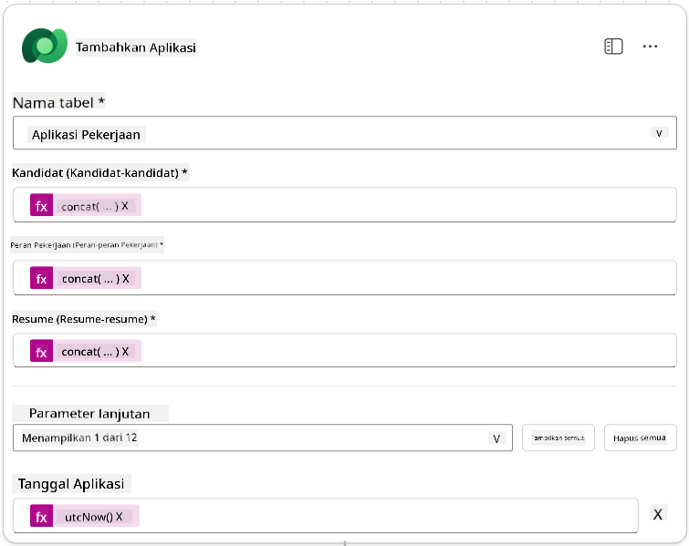

1. Pilih **Respond to the agent node**, lalu pilih **+ Tambahkan output**

     | Properti         | Cara Mengatur                  | Detail                                          |
     | ---------------- | ------------------------------ | ----------------------------------------------- |
     | **Tipe**         | Pilih                         | `Text`                                          |
     | **Nama**         | Masukkan                      | `ApplicationNumber`                             |
     | **Nilai**        | Data dinamis (ikon petir)     | *Add Application → Lihat Lebih Banyak → Application Number* |
     | **Deskripsi**    | Masukkan                      | `The [ApplicationNumber] dari Aplikasi Pekerjaan yang dibuat` |

     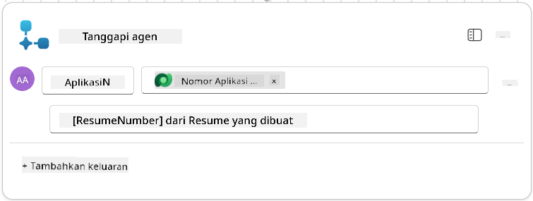

1. Pilih **Simpan draf** di kanan atas

1. Pilih tab **Overview**, lalu pilih **Edit** pada panel **Details**

      - **Nama Alur**:`Create Job Application`
      - **Deskripsi**:`Membuat aplikasi pekerjaan baru ketika diberikan [ResumeNumber] dan [JobRoleNumber]`
      - **Simpan**

1. Pilih tab **Designer** lagi, lalu pilih **Publish**.

### 8.5 Tambahkan Create Job Application ke agen

Sekarang Anda akan menghubungkan alur yang telah dipublikasikan ke Application Intake Agent Anda.

1. Kembali ke **Hiring Agent** dan pilih tab **Agents**. Buka **Application Intake Agent**, lalu temukan panel **Tools**.

1. Pilih **+ Tambahkan**

1. Pilih filter **Flow**, dan cari `Create Job Application`. Pilih alur **Create Job Application**, lalu **Tambahkan dan konfigurasikan**.

1. Atur parameter berikut:

    | Parameter                                           | Nilai                                                        |
    | --------------------------------------------------- | ------------------------------------------------------------ |
    | **Deskripsi**                                       | `Membuat aplikasi pekerjaan baru ketika diberikan [ResumeNumber] dan [JobRoleNumber]` |
    | **Detail tambahan → Kapan alat ini dapat digunakan** | `Hanya ketika dirujuk oleh topik atau agen`                   |

1. Pilih **Simpan**  
    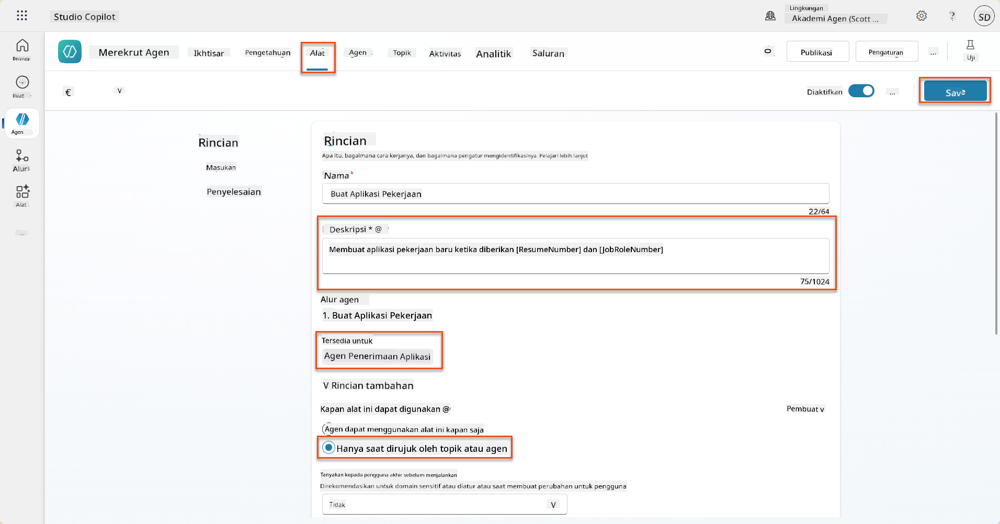

### 8.6 Tentukan instruksi agen

Untuk membuat aplikasi pekerjaan, Anda perlu memberi tahu agen kapan harus menggunakan alat baru. Dalam hal ini, Anda akan meminta pengguna untuk mengonfirmasi peran pekerjaan yang disarankan untuk dilamar, dan menginstruksikan agen untuk menjalankan alat untuk setiap peran.

1. Kembali ke **Application Intake Agent**, lalu temukan panel **Instructions**.

1. Di bidang **Instructions**, **tambahkan** panduan yang jelas berikut untuk agen anak Anda di **akhir instruksi yang ada**:

    ```text
    3. Post Resume Upload
       - Respond with a formatted bullet list of [SuggestedJobRoles] the candidate could apply for.  
       - Use the format: [JobRoleNumber] - [RoleDescription]
       - Ask the user to confirm which Job Roles to create applications for the candidate.
       - When the user has confirmed a set of [JobRoleNumber]s, move to the next step.
    
    4. Post Upload - Application Creation
        - After the user confirms which [SuggestedJobRoles] for a specific [ResumeNumber]:
        E.g. "Apply [ResumeNumber] for the Job Roles [JobRoleNumber], [JobRoleNumber], [JobRoleNumber]
        E.g. "apply to all suggested job roles" - this implies use all the [JobRoleNumbers] 
         - Loop over each [JobRoleNumber] and send with [ResumeNumber] to /Create Job Application   
         - Summarize the Job Applications Created
    
    Strict Rules (that must never be broken)
    You must always follow these rules and never break them:
    1. The only valid identifiers are:
      - ResumeNumber (ppa_resumenumber)→ format R#####
      - CandidateNumber (ppa_candidatenumber)→ format C#####
      - ApplicationNumber (ppa_applicationnumber)→ format A#####
      - JobRoleNumber (ppa_jobrolenumber)→ format J#####
    2. Never guess or invent these values.
    3. Always extract identifiers from the current context (conversation, data, or system output). 
    ```

1. Di mana instruksi mencakup garis miring (/), pilih teks setelah / dan pilih alat **Create Job Application**.

1. Pilih **Simpan**  
    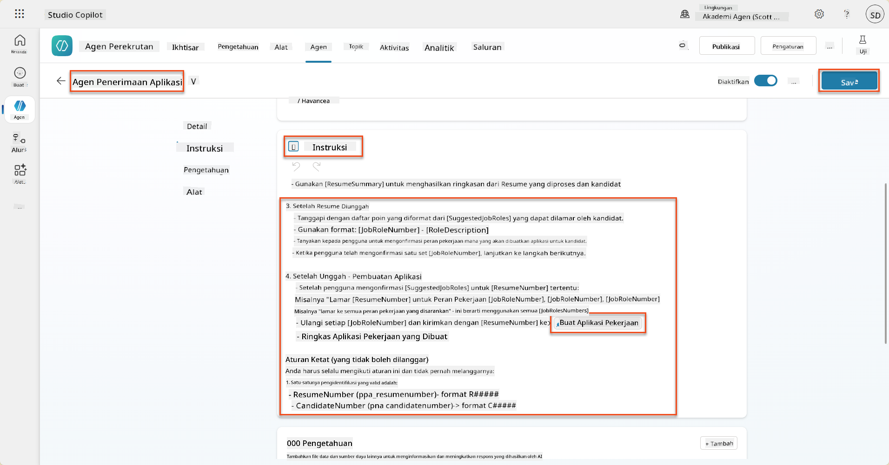

!!! tip "Iterasi atas beberapa item dalam Generative Orchestration"
    Instruksi ini menggunakan kemampuan generative orchestration untuk melakukan iterasi atas beberapa baris saat membuat keputusan tentang langkah dan alat yang akan digunakan. Peran Pekerjaan yang Cocok akan dibaca secara otomatis dan Application Intake Agent akan berjalan untuk setiap baris. Selamat datang di dunia ajaib generative orchestration!

### 8.7 Uji agen Anda

1. Buka **Hiring Agent** Anda di Copilot Studio.

1. **Unggah** resume contoh ke dalam chat, dan ketik:

    ```text
    This is a new resume for the Power Platform Developer Role.
    ```

1. Perhatikan bagaimana agen memberikan daftar Peran Pekerjaan yang Disarankan - masing-masing dengan nomor Peran Pekerjaan.  
    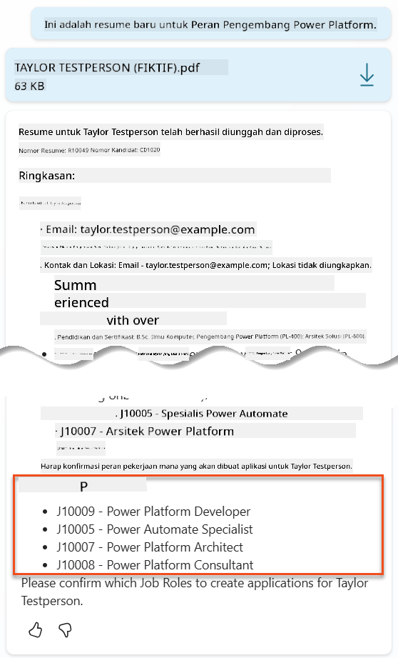

1. Anda kemudian dapat memberikan peran mana yang ingin Anda tambahkan sebagai aplikasi pekerjaan untuk resume tersebut.
    **Contoh:**

    ```text
    "Apply for all of those job roles"
    "Apply for the J10009 Power Platform Developer role"
    "Apply for the Developer and Architect roles"
    ```

    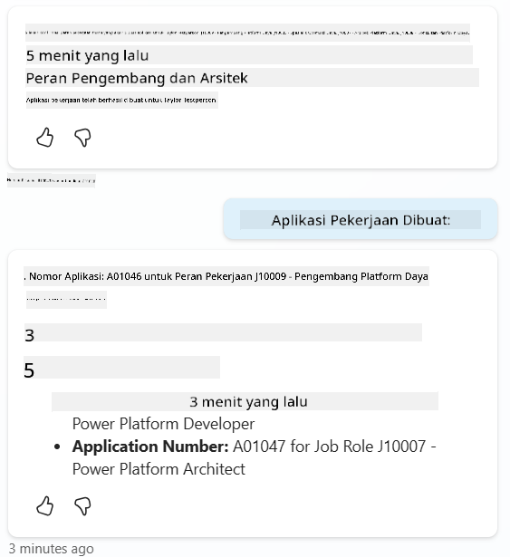

1. Alat **Create Job Application** kemudian akan dijalankan untuk setiap peran pekerjaan yang Anda tentukan. Di dalam peta Aktivitas, Anda akan melihat alat Create Job Application dijalankan untuk setiap Peran Pekerjaan yang Anda minta untuk dibuatkan aplikasi:  
    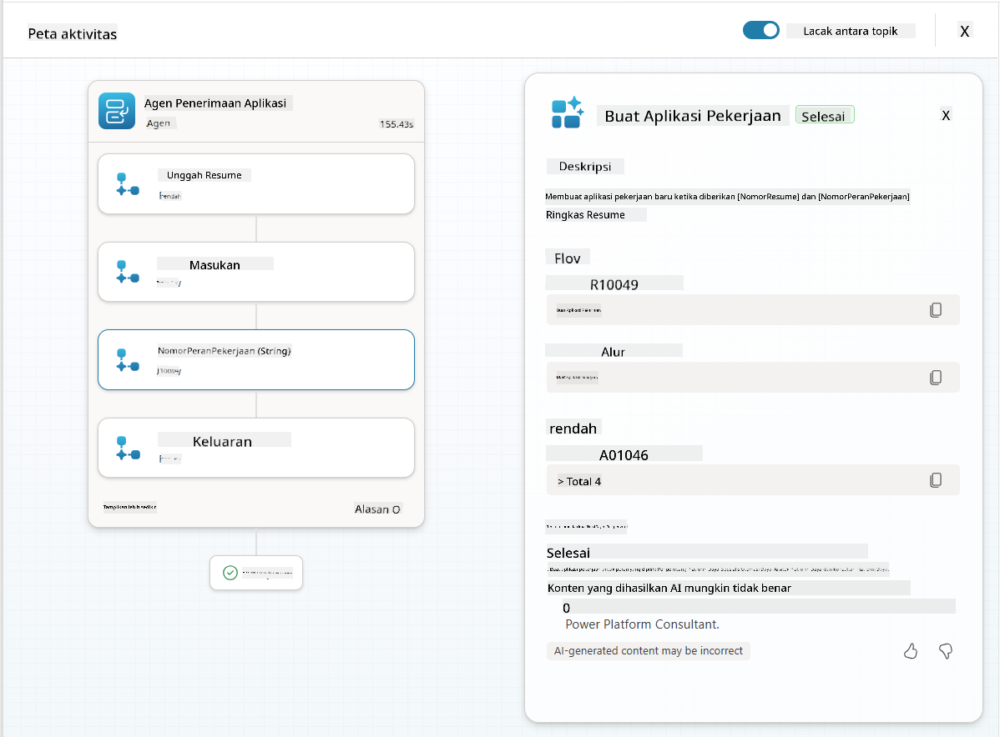

## 🎉 Misi Selesai

Kerja luar biasa, Operative! **Operation Grounding Control** kini selesai. Anda telah berhasil meningkatkan kemampuan AI Anda dengan data dinamis, menciptakan sistem perekrutan yang benar-benar cerdas.

Berikut adalah pencapaian Anda dalam misi ini:

**✅ Penguasaan grounding Dataverse**  
Anda sekarang memahami cara menghubungkan prompt khusus ke sumber data langsung untuk kecerdasan dinamis.

**✅ Analisis resume yang ditingkatkan**  
Alur Summarize Resume Anda sekarang mengakses data peran pekerjaan dan kriteria evaluasi secara real-time untuk pencocokan yang akurat.

**✅ Pengambilan keputusan berbasis data**  
Agen perekrutan Anda sekarang dapat beradaptasi secara otomatis dengan persyaratan pekerjaan yang berubah tanpa pembaruan prompt manual.

**✅ Pembuatan Aplikasi Pekerjaan**  
Sistem Anda yang ditingkatkan sekarang dapat membuat Aplikasi Pekerjaan dan siap untuk orkestrasi alur kerja yang lebih kompleks.

🚀 **Selanjutnya:** Dalam misi berikutnya, Anda akan belajar cara menerapkan kemampuan penalaran mendalam yang membantu agen Anda membuat keputusan kompleks dan memberikan penjelasan rinci untuk rekomendasi mereka.

⏩ [Lanjut ke Misi 09: Penalaran mendalam](../09-deep-reasoning/README.md)

## 📚 Sumber Daya Taktis

📖 [Gunakan data Anda sendiri dalam prompt](https://learn.microsoft.com/ai-builder/use-your-own-prompt-data?WT.mc_id=power-182762-scottdurow)

📖 [Buat prompt khusus](https://learn.microsoft.com/ai-builder/create-a-custom-prompt?WT.mc_id=power-182762-scottdurow)

📖 [Bekerja dengan Dataverse di Copilot Studio](https://learn.microsoft.com/microsoft-copilot-studio/knowledge-add-dataverse?WT.mc_id=power-182762-scottdurow)

📖 [Ikhtisar prompt khusus AI Builder](https://learn.microsoft.com/ai-builder/prompts-overview?WT.mc_id=power-182762-scottdurow)

📖 [Dokumentasi AI Builder Power Platform](https://learn.microsoft.com/ai-builder/?WT.mc_id=power-182762-scottdurow)

📖 [Pelatihan: Buat prompt AI Builder menggunakan data Dataverse Anda sendiri](https://learn.microsoft.com/training/modules/ai-builder-grounded-prompts/?WT.mc_id=power-182762-scottdurow)

---

**Penafian**:  
Dokumen ini telah diterjemahkan menggunakan layanan penerjemahan AI [Co-op Translator](https://github.com/Azure/co-op-translator). Meskipun kami berupaya untuk memberikan hasil yang akurat, harap diketahui bahwa terjemahan otomatis mungkin mengandung kesalahan atau ketidakakuratan. Dokumen asli dalam bahasa aslinya harus dianggap sebagai sumber yang otoritatif. Untuk informasi yang bersifat kritis, disarankan menggunakan jasa penerjemahan manusia profesional. Kami tidak bertanggung jawab atas kesalahpahaman atau interpretasi yang salah yang timbul dari penggunaan terjemahan ini.