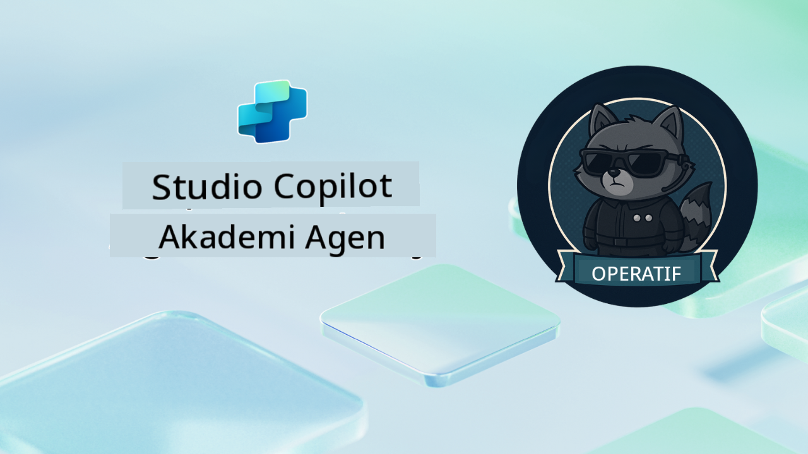

<!--
CO_OP_TRANSLATOR_METADATA:
{
  "original_hash": "24fcbe9a57d3439e05f8866e550c0a84",
  "translation_date": "2025-10-17T17:15:40+00:00",
  "source_file": "docs/operative-preview/README.md",
  "language_code": "id"
}
-->
# Selamat Datang, Operatif

**Selamat datang, Operatif.**  
Misi lanjutan Anda—jika Anda memilih untuk menerimanya—adalah menguasai seni membangun **sistem multi-agen kelas enterprise** menggunakan **Microsoft Copilot Studio**.

Pelatihan intensif ini membawa Anda melampaui pembuatan agen dasar ke dunia yang lebih canggih yaitu **orkestrasi multi-agen**: mulai dari otomatisasi perekrutan hingga keamanan AI, Anda akan belajar membangun, mengoordinasikan, dan menerapkan ekosistem agen cerdas menggunakan skenario bisnis nyata.

--8<-- "disclaimer.md"

---

## 🎯 Tujuan Misi

Dengan menyelesaikan program Agent Academy Operative, Anda akan mampu:

- Merancang dan mengimplementasikan **sistem multi-agen** untuk skenario bisnis yang kompleks
- Menguasai pola **orkestrasi agen** dan kolaborasi
- Menerapkan **keamanan AI dan moderasi konten** dalam sistem produksi
- Membuat **prompt multi-modal** untuk pemrosesan dan analisis dokumen
- Menerapkan **agen siap enterprise** dengan tata kelola dan pengujian yang tepat

---

## 🧪 Prasyarat

Untuk menyelesaikan semua misi, Anda memerlukan:

- Telah menyelesaikan pelatihan **Agent Academy Recruit**
- Lingkungan Microsoft Power Platform dengan lisensi **Copilot Studio**
- Akses ke **Microsoft Dataverse**
- Izin administratif untuk membuat solusi dan agen

---

## 🧬 Siapa yang Cocok Mengikuti

Kursus lanjutan ini ideal untuk:

- **Arsitek solusi** yang merancang sistem AI enterprise
- **Pengembang** yang membangun solusi agen siap produksi
- **Profesional IT** yang menerapkan tata kelola dan keamanan AI
- **Analis bisnis** yang menciptakan alur kerja otomatisasi yang kompleks
- Siapa saja yang siap **meningkatkan kemampuan** dari agen dasar ke sistem enterprise

---

## 🧭 Gambaran Kurikulum

Akademi ini disusun sebagai serangkaian operasi lapangan yang progresif—setiap misi membangun dasar untuk menciptakan sistem otomatisasi perekrutan yang komprehensif.

| Misi | Judul | Penjelasan Operasi |
|------|-------|--------------------|
| `01` | 🚨 [Memulai dengan Agen Perekrutan](./01-get-started/README.md) | Menerapkan infrastruktur dasar dan membuat agen pengatur pusat |
| `02` | 🎭 [Membuat agen Anda siap multi-agen dengan agen terhubung](./02-multi-agent/README.md) | Mengubah agen tunggal menjadi sistem multi-agen yang terkoordinasi |
| `03` | ⚡ [Otomatisasi agen Anda dengan Pemicu](./03-automate-triggers/README.md) | Menerapkan perilaku agen otonom dengan pemicu berbasis peristiwa |
| `04` | 📝 [Menulis Instruksi untuk Agen](./04-agent-instructions/README.md) | Menguasai komunikasi agen yang tepat dan kontrol perilaku |
| `05` | 💬 [Personalisasi Respons Agen](./05-agent-responses/README.md) | Menyesuaikan respons agen untuk dampak dan keterlibatan maksimal |
| `06` | 🛡️ [Moderasi Konten dan Esensial Keamanan AI](./06-ai-safety/README.md) | Menerapkan langkah-langkah keamanan dan kepatuhan tingkat enterprise |
| `07` | 🎨 [Ekstraksi Konten Resume dengan Prompt Multi-Modal](./07-multimodal-prompts/README.md) | Memproses dokumen dan gambar dengan kemampuan AI canggih |
| `08` | 🗄️ [Prompt - Dasar Dataverse](./08-dataverse-grounding/README.md) | Menghubungkan agen dengan data enterprise untuk respons yang akurat |
| `09` | 🧠 [Menerapkan Penalaran Mendalam untuk Mengevaluasi Kesesuaian Kandidat dan Persiapan Wawancara](./09-deep-reasoning/README.md) | Menerapkan penalaran AI canggih untuk keputusan yang kompleks |
| `10` | 📄 [Menghasilkan Dokumen Wawancara Spesifik Kandidat dengan Prompt](./10-generate-documents/README.md) | Membuat dokumen dinamis berdasarkan analisis agen |
| `11` | 📊 [Mendapatkan Umpan Balik Pengguna dengan Kartu Adaptif](./11-obtain-user-feedback/README.md) | Mengumpulkan dan memproses umpan balik pengguna untuk perbaikan berkelanjutan |
| `12` | 🌐 [Menerbitkan Agen Anda ke Situs Demo untuk Pengujian Pemangku Kepentingan](./12-demo-website/README.md) | Menerapkan solusi lengkap untuk demonstrasi dan pengujian pemangku kepentingan |

!!! note
    ✅ Menyelesaikan kurikulum ini akan memberikan Anda lencana **Operative**.  
    🔓 **Commander** akan tersedia di fase mendatang.

<!-- markdownlint-disable-next-line MD033 -->

---

**Penafian**:  
Dokumen ini telah diterjemahkan menggunakan layanan penerjemahan AI [Co-op Translator](https://github.com/Azure/co-op-translator). Meskipun kami berusaha untuk memberikan hasil yang akurat, harap diketahui bahwa terjemahan otomatis dapat mengandung kesalahan atau ketidakakuratan. Dokumen asli dalam bahasa aslinya harus dianggap sebagai sumber yang otoritatif. Untuk informasi yang bersifat kritis, disarankan menggunakan jasa penerjemahan manusia profesional. Kami tidak bertanggung jawab atas kesalahpahaman atau interpretasi yang keliru yang timbul dari penggunaan terjemahan ini.