<!--
CO_OP_TRANSLATOR_METADATA:
{
  "original_hash": "d9cd8cd1a4fbd8915171a2ed972cc322",
  "translation_date": "2025-10-17T17:10:00+00:00",
  "source_file": "docs/recruit/00-course-setup/README.md",
  "language_code": "id"
}
-->
# 🚨 Misi 00: Pengaturan Kursus

## 🕵️‍♂️ NAMA KODE: `OPERASI SIAP DEPLOY`

> **⏱️ Waktu Operasi:** `~30 menit`  

## 🎯 Ringkasan Misi

Selamat datang di misi pertama pelatihan Anda sebagai Agen Copilot Studio.  
Sebelum Anda mulai membangun agen AI pertama Anda, Anda perlu menyiapkan **lingkungan pengembangan siap lapangan**.

Briefing ini menjelaskan sistem, kredensial akses, dan langkah-langkah pengaturan yang diperlukan untuk beroperasi dengan sukses di ekosistem Microsoft 365.

## 🔎 Tujuan

Misi Anda meliputi:

1. Mendapatkan akun Microsoft 365  
1. Mendapatkan akses ke Microsoft Copilot Studio  
1. (Opsional) Mendapatkan lisensi Microsoft 365 Copilot untuk publikasi produksi  
1. Membuat lingkungan pengembang sebagai lingkungan Copilot Studio Anda untuk membangun  
1. Membuat situs SharePoint untuk digunakan sebagai sumber data dalam misi berikutnya  

---

## 🔍 Prasyarat

Sebelum memulai, pastikan Anda memiliki:

1. **Alamat email kerja atau sekolah** (email pribadi seperti @outlook.com, @gmail.com, dll., tidak didukung).  
1. Akses ke internet dan browser modern (disarankan Edge, Chrome, atau Firefox).  
1. Pemahaman dasar tentang Microsoft 365 (misalnya, masuk ke aplikasi Office atau Teams).  
1. (Opsional) Kartu kredit atau metode pembayaran jika Anda berencana membeli lisensi berbayar.

---

## Langkah 1: Dapatkan Akun Microsoft 365

Copilot Studio berada di dalam Microsoft 365, jadi Anda memerlukan akun Microsoft 365 untuk mengaksesnya. Anda dapat menggunakan akun yang sudah ada jika Anda memilikinya atau mengikuti langkah-langkah ini untuk mendapatkan lisensi yang sesuai:

1. **Dapatkan Langganan Microsoft 365 Business Berbayar**  
   1. Kunjungi [Halaman Rencana dan Harga Microsoft 365 Business](https://www.microsoft.com/microsoft-365/business/microsoft-365-plans-and-pricing)  
   1. Pilihan termurah untuk memulai adalah paket Microsoft 365 Business Basic. Pilih `Coba gratis` dan ikuti formulir panduan untuk mengisi detail langganan, detail akun, dan informasi pembayaran Anda.  
   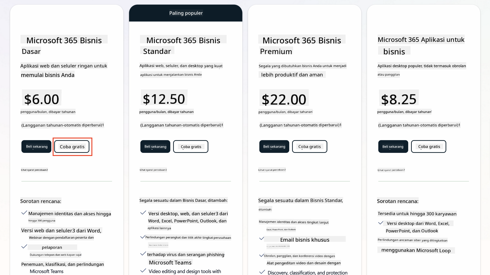  
   1. Setelah Anda memiliki akun baru, masuklah.

    !!! Tip
        Jika Anda berencana untuk menerbitkan agen ke Microsoft 365 Copilot Chat atau menghubungkan ke data organisasi (SharePoint, OneDrive, Dataverse), diperlukan lisensi Microsoft 365 Copilot. Ini adalah lisensi tambahan yang dapat Anda pelajari lebih lanjut [di situs lisensi](https://www.microsoft.com/microsoft-365/copilot#plans).

---

## Langkah 2: Mulai Uji Coba Copilot Studio

Setelah Anda memiliki Tenant Microsoft 365, Anda perlu mendapatkan akses ke Copilot Studio. Anda dapat mencoba gratis selama 30 hari dengan mengikuti langkah-langkah ini:

1. Kunjungi [aka.ms/TryCopilotStudio](https://aka.ms/TryCopilotStudio).  
1. Masukkan alamat email dari akun baru yang Anda konfigurasikan pada langkah sebelumnya dan pilih `Next`.  
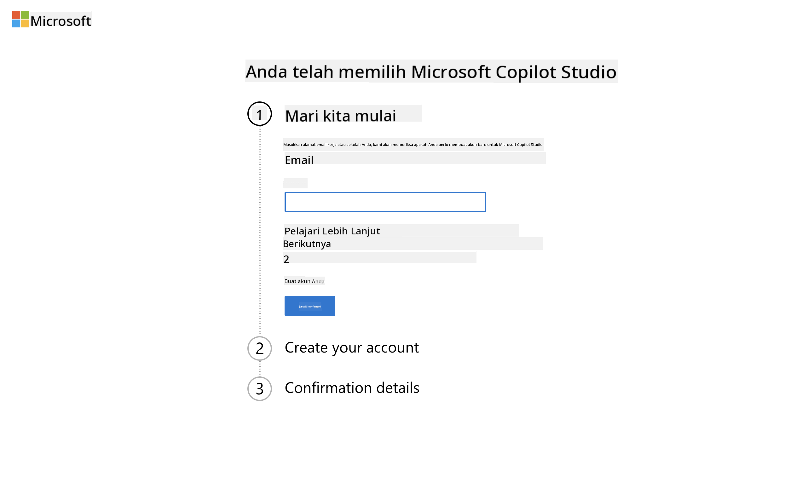  
1. Sistem akan mengenali akun Anda. Pilih `Sign In`.  
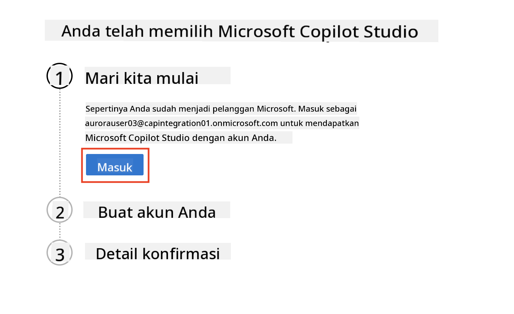  
1. Pilih `Start Free Trial`.  

!!! info "Catatan Uji Coba"  
     1. Uji coba gratis menyediakan **kemampuan penuh Copilot Studio**.  
     1. Anda akan menerima notifikasi email tentang masa berlaku uji coba Anda. Anda dapat memperpanjang uji coba dalam interval 30 hari (hingga 90 hari runtime agen).  
     1. Jika administrator tenant Anda menonaktifkan pendaftaran mandiri, Anda akan melihat kesalahan—hubungi admin Microsoft 365 Anda untuk mengaktifkannya kembali.

---

## Langkah 3: Buat lingkungan pengembang baru

### Daftar untuk Rencana Pengembang Power Apps

Menggunakan tenant Microsoft 365 yang sama dari Langkah 1, daftar untuk Rencana Pengembang Power Apps untuk membuat lingkungan pengembangan gratis untuk membangun dan menguji dengan Copilot Studio.

1. Daftar di [situs web Rencana Pengembang Power Apps](https://aka.ms/PowerAppsDevPlan).

    - Masukkan alamat email Anda  
    - Centang kotak  
    - Pilih **Mulai gratis**  

    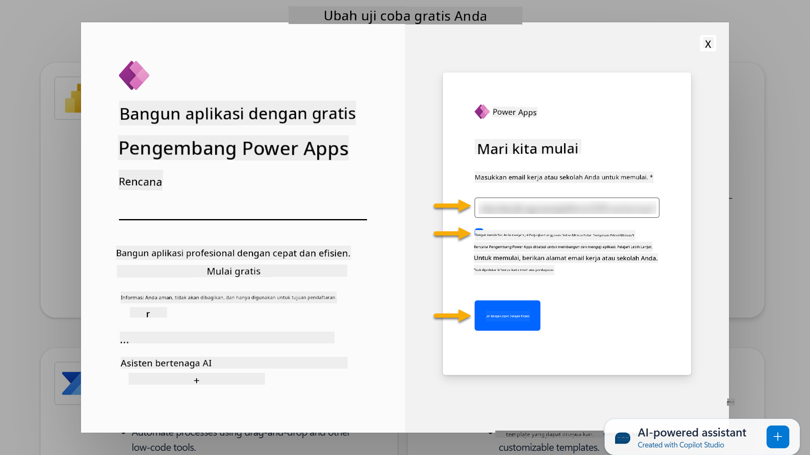

1. Setelah mendaftar untuk Rencana Pengembang, Anda akan diarahkan ke [Power Apps](https://make.powerapps.com/). Lingkungan menggunakan nama Anda, misalnya **Lingkungan Adele Vance**. Jika sudah ada lingkungan dengan nama tersebut, lingkungan pengembang baru diberi nama **Lingkungan Adele Vance (1)**.

    Gunakan lingkungan pengembang ini di Copilot Studio saat menyelesaikan lab.

!!! Note
    Jika Anda menggunakan akun Microsoft 365 yang sudah ada dan tidak membuatnya di Langkah 1, misalnya - menggunakan akun Anda sendiri di organisasi kerja Anda, tim administrator IT Anda (atau yang setara) yang mengelola tenant/lingkungan Anda mungkin telah menonaktifkan proses pendaftaran. Dalam hal ini, silakan hubungi administrator Anda, atau buat tenant uji coba sesuai Langkah 1.

---

## Langkah 4: Buat situs SharePoint baru

Sebuah situs SharePoint baru perlu dibuat yang akan digunakan dalam [Pelajaran 06 - Membuat agen kustom menggunakan pengalaman pembuatan percakapan dengan Copilot dan menghubungkannya dengan data Anda](../06-create-agent-from-conversation/README.md#62-add-an-internal-knowledge-source-using-a-sharepoint-site).

1. Pilih ikon waffle di sisi kiri atas Microsoft Copilot Studio untuk melihat menu. Pilih SharePoint dari menu.

    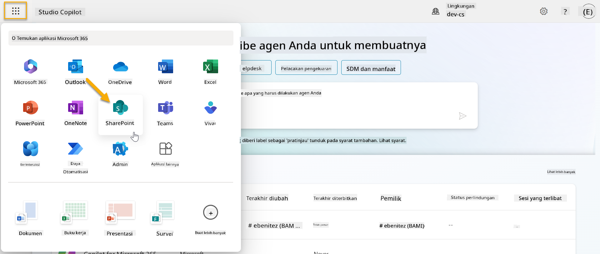

1. SharePoint akan dimuat. Pilih **+ Buat situs** untuk membuat situs SharePoint baru.

    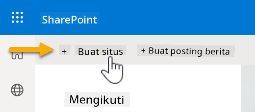

1. Sebuah dialog akan muncul untuk memandu Anda dalam membuat situs SharePoint baru. Pilih **Situs tim**.

    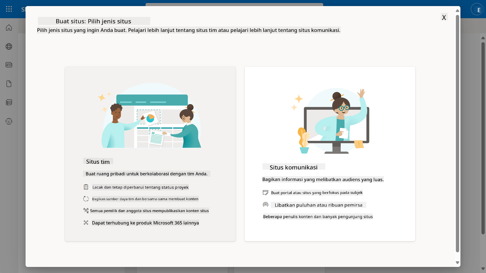

1. Pada langkah berikutnya, daftar template Microsoft akan dimuat secara default. Gulir ke bawah dan pilih template **IT help desk**.

    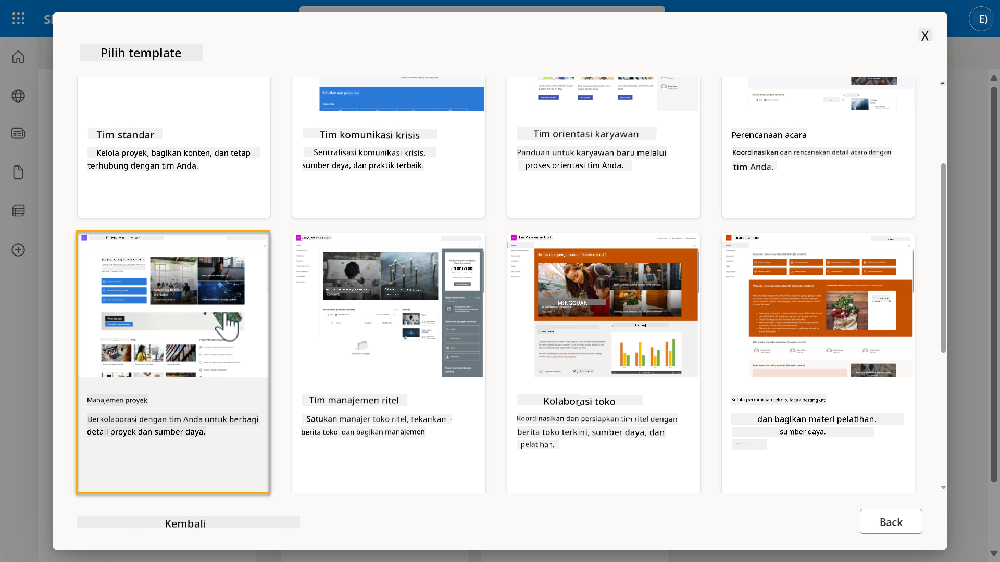

1. Pilih **Gunakan template** untuk membuat situs SharePoint baru menggunakan template IT help desk.

    

1. Masukkan informasi untuk situs Anda. Berikut adalah contoh:

    | Field | Value |
    | --- | --- |
    | Nama situs | Contoso IT |
    | Deskripsi situs | Copilot Studio untuk Pemula |
    | Alamat situs | ContosoIT |

    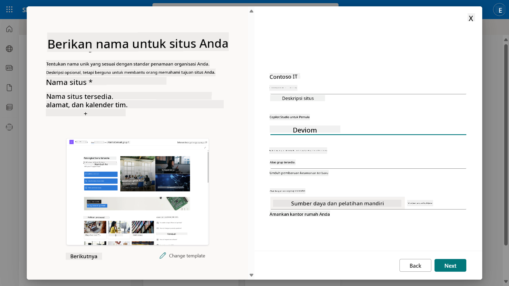

1. Pada langkah terakhir, bahasa dapat dipilih untuk situs SharePoint. Secara default akan menjadi **Bahasa Inggris**. Biarkan Bahasa sebagai **Bahasa Inggris** dan pilih **Buat situs**.

    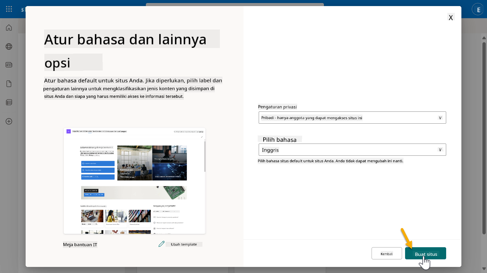

1. Situs SharePoint akan diproses selama beberapa detik. Sementara itu, Anda dapat memilih untuk menambahkan pengguna lain ke situs Anda dengan memasukkan alamat email mereka di bidang **Tambahkan anggota**. Setelah selesai, pilih **Selesai**.

    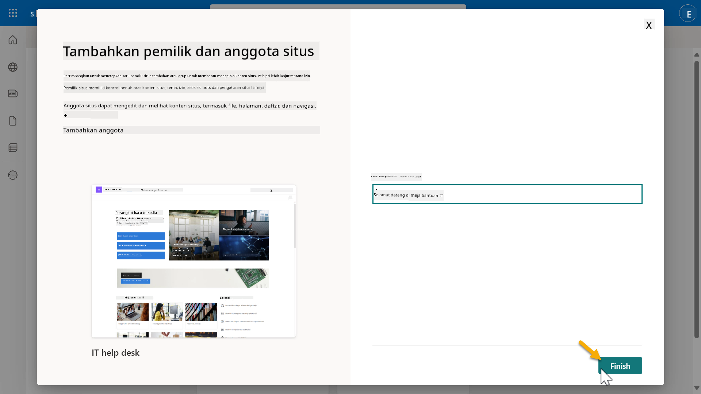

1. Halaman utama situs SharePoint akan dimuat berikutnya. **Salin** URL situs SharePoint.

1. Template ini menyediakan halaman dengan data contoh tentang berbagai kebijakan IT dan dua daftar contoh (Tiket dan Perangkat).

### Gunakan daftar SharePoint Perangkat

Kita akan menggunakan daftar **Perangkat** dalam [Misi 07 - Tambahkan topik baru dengan pemicu dan node](../07-add-new-topic-with-trigger/README.md#73-add-a-tool-using-a-connector).

### Tambahkan kolom baru

Gulir ke paling kanan dalam daftar dan pilih tombol **+ Tambahkan kolom**. Pilih tipe **hyperlink**, masukkan **Gambar** untuk nama kolom, dan pilih tambahkan.

### Buat data contoh dalam daftar SharePoint Perangkat

Anda perlu memastikan bahwa Anda mengisi daftar ini dengan setidaknya 4 item data contoh dan menambahkan satu kolom tambahan ke daftar ini.  

Saat menambahkan data contoh, pastikan bahwa bidang berikut diisi:

- Foto perangkat - gunakan gambar dari [folder gambar perangkat](https://github.com/microsoft/agent-academy/tree/main/docs/recruit/00-course-setup/images/device-images)  
- Judul  
- Status  
- Produsen  
- Model  
- Jenis aset  
- Warna  
- Nomor seri  
- Tanggal pembelian  
- Harga pembelian  
- Nomor pesanan  
- Gambar - gunakan tautan berikut  

|Perangkat  |URL  |
|---------|---------|
|Surface Laptop 13     | [https://raw.githubusercontent.com/microsoft/agent-academy/refs/heads/main/docs/recruit/00-course-setup/images/device-images/Surface-Laptop-13.png](https://raw.githubusercontent.com/microsoft/agent-academy/refs/heads/main/docs/recruit/00-course-setup/images/device-images/Surface-Laptop-13.png)        |
|Surface Laptop 15     | [https://raw.githubusercontent.com/microsoft/agent-academy/refs/heads/main/docs/recruit/00-course-setup/images/device-images/Surface-Laptop-15.png](https://raw.githubusercontent.com/microsoft/agent-academy/refs/heads/main/docs/recruit/00-course-setup/images/device-images/Surface-Laptop-15.png)        |
|Surface Pro    | [https://raw.githubusercontent.com/microsoft/agent-academy/refs/heads/main/docs/recruit/00-course-setup/images/device-images/Surface-Pro-12.png](https://raw.githubusercontent.com/microsoft/agent-academy/refs/heads/main/docs/recruit/00-course-setup/images/device-images/Surface-Pro-12.png)        |
|Surface Studio    | [https://raw.githubusercontent.com/microsoft/agent-academy/refs/heads/main/docs/recruit/00-course-setup/images/device-images/Surface-Studio.png](https://raw.githubusercontent.com/microsoft/agent-academy/refs/heads/main/docs/recruit/00-course-setup/images/device-images/Surface-Studio.png)        |

---

## ✅ Misi Selesai

Anda telah berhasil:

- Menyiapkan lingkungan pengembang Microsoft 365  
- Mengaktifkan uji coba Copilot Studio Anda  
- Membuat situs SharePoint untuk menghubungkan agen  
- Mengisi daftar Perangkat untuk digunakan dalam misi mendatang  

Anda secara resmi siap untuk memulai pelatihan agen tingkat **Rekrut** di [Pelajaran 01](../01-introduction-to-agents/README.md).  

<!-- markdownlint-disable-next-line MD033 -->

---

**Penafian**:  
Dokumen ini telah diterjemahkan menggunakan layanan penerjemahan AI [Co-op Translator](https://github.com/Azure/co-op-translator). Meskipun kami berupaya untuk memberikan hasil yang akurat, harap diketahui bahwa terjemahan otomatis mungkin mengandung kesalahan atau ketidakakuratan. Dokumen asli dalam bahasa aslinya harus dianggap sebagai sumber yang otoritatif. Untuk informasi yang penting, disarankan menggunakan jasa penerjemahan manusia profesional. Kami tidak bertanggung jawab atas kesalahpahaman atau interpretasi yang keliru yang timbul dari penggunaan terjemahan ini.