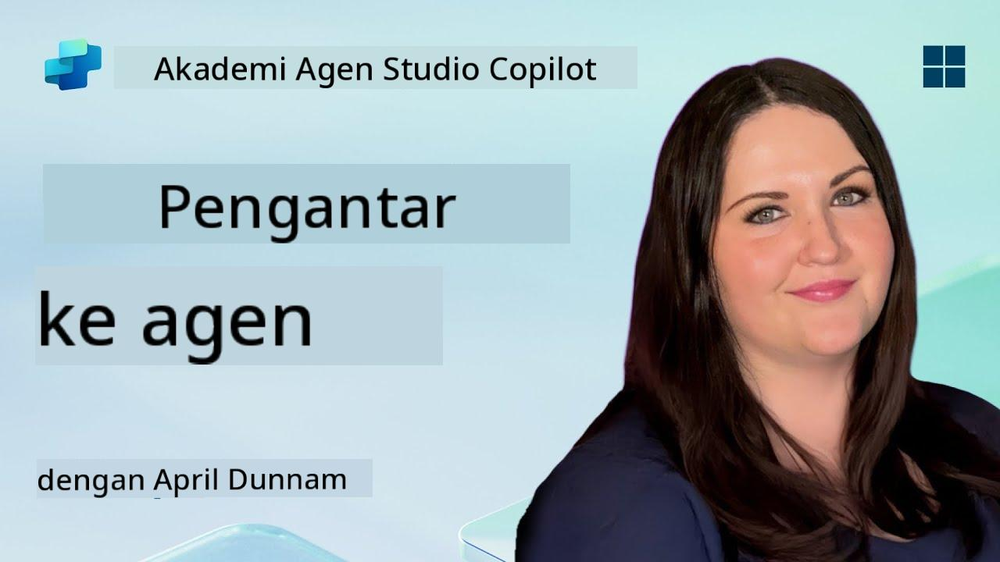

<!--
CO_OP_TRANSLATOR_METADATA:
{
  "original_hash": "d6706e107678264168d77b2e107710b1",
  "translation_date": "2025-10-17T17:14:26+00:00",
  "source_file": "docs/recruit/01-introduction-to-agents/README.md",
  "language_code": "id"
}
-->
# 🚨 Misi 01: Pengantar Agen

## 🕵️‍♂️ NAMA KODE: `OPERASI DECODE AGEN AI`

> **⏱️ Waktu Operasi:** `~30 menit – hanya intel, tidak ada kerja lapangan`

🎥 **Tonton Panduan**

## 🎯 Ringkasan Misi

Selamat datang, Rekrut. Sebelum kita mulai membangun agen, Anda perlu memahami konsep AI yang mendasarinya. Misi ini akan memberikan Anda pengetahuan dasar tentang AI percakapan, model bahasa besar (LLM), generasi berbasis pengambilan (RAG), dan jenis agen yang dapat Anda buat di Copilot Studio.

## 🔎 Tujuan

Dalam misi ini, Anda akan mempelajari:

1. Apa itu AI percakapan dan mengapa itu penting  
1. Bagaimana Model Bahasa Besar (LLM) mendukung pengalaman chat  
1. Apa yang ditawarkan oleh Generasi Berbasis Pengambilan (RAG)  
1. Perbedaan antara agen percakapan dan agen otonom  
1. Bagaimana agen di Copilot Studio memanfaatkan konsep-konsep ini  

Mari kita mulai!

---

## Apa Itu AI Percakapan?

AI percakapan mengacu pada sistem apa pun yang dapat memahami, memproses, dan merespons bahasa manusia – baik teks maupun suara – dengan cara yang terasa alami. Contohnya adalah chatbot di meja bantuan atau asisten virtual di aplikasi favorit Anda. Di balik layar, sebagian besar AI percakapan modern bergantung pada Model Bahasa Besar (LLM), yang akan kita bahas selanjutnya.

### Mengapa Penting

- **Pengalaman Pengguna:** Antarmuka percakapan sering kali lebih intuitif daripada mengklik menu.  
- **Skalabilitas:** Satu agen dapat menangani puluhan atau ratusan percakapan secara bersamaan.  
- **Efisiensi:** Alih-alih membangun skrip berbasis aturan khusus, agen yang didukung LLM dapat beradaptasi dengan masukan pengguna secara langsung.  
- **Ekstensibilitas:** Dengan desain yang tepat, agen dapat mengakses basis pengetahuan, terhubung ke API, atau bertindak sebagai “rekan kerja digital” dalam alur kerja bisnis.

---

## Model Bahasa Besar (LLM) 101

Di inti sebagian besar sistem AI percakapan adalah **Model Bahasa Besar** – jaringan saraf yang dilatih pada korpus teks yang sangat besar. Mereka mempelajari pola statistik bahasa sehingga dapat menghasilkan kalimat yang koheren, menjawab pertanyaan, atau bahkan memberikan ide. Poin-poin penting yang perlu dipahami:

1. **Data Pelatihan:** LLM mengonsumsi terabyte teks (halaman web, buku, artikel). Pengetahuan “dunia” ini memungkinkan mereka merespons berbagai topik.  
1. **Tokenisasi:** Teks dipecah menjadi unit-unit kecil yang disebut token (kata, subkata, atau karakter). Model memprediksi satu token pada satu waktu.  
1. **Jendela Konteks:** Setiap LLM memiliki batasan berapa banyak token yang dapat “dilihat” sekaligus. Di luar batas itu, token sebelumnya akan dipotong.  
1. **Prompting:** Anda berinteraksi dengan LLM dengan mengirimkan prompt. Semakin baik prompt Anda, semakin fokus dan relevan responsnya.  
1. **Zero-shot vs. Fine-tuning:** Zero-shot berarti menggunakan LLM apa adanya (hanya bobot mentah). Fine-tuning berarti menyesuaikan model pada data spesifik domain agar menjawab lebih akurat sesuai kebutuhan Anda.

!!! Tip "Tip Profesional"
    Analogi umum adalah bahwa LLM seperti “autokoreksi super pintar.” Mereka tidak benar-benar memahami makna seperti otak manusia, tetapi sangat baik dalam memprediksi kata (atau frasa) terbaik berikutnya dalam sebuah urutan.

---

## Generasi Berbasis Pengambilan (RAG)

Ketika LLM hanya mengandalkan data pelatihan statis, mereka mungkin berhalusinasi atau menjadi usang. RAG mengatasi ini dengan memungkinkan model “mencari” informasi terbaru sebelum menyusun jawaban. Secara garis besar, RAG bekerja seperti ini:

1. **Pertanyaan Pengguna:** Pengguna mengajukan pertanyaan (misalnya, “Apa kabar terbaru tentang pendapatan kuartalan Contoso?”).  
1. **Langkah Pengambil:** Sistem mencari sumber pengetahuan (dokumen, basis data internal, pustaka SharePoint, dll.) untuk menemukan bagian yang relevan.  
1. **Augmentasi:** Bagian yang diambil ditambahkan atau disisipkan sebelum prompt LLM.  
1. **Generasi:** LLM mengonsumsi pertanyaan pengguna dan konteks yang diambil, lalu menghasilkan respons yang didasarkan pada data terkini.  

Dengan RAG, agen Anda dapat memanggil wiki perusahaan internal, API plugin, atau mencari basis pengetahuan FAQ—dan memberikan jawaban yang tidak terbatas pada parameter model yang dipublikasikan secara statis.

---

## Agen Percakapan vs. Agen Otonom

Dalam konteks Copilot Studio, istilah **agen** dapat merujuk pada berbagai jenis asisten AI. Penting untuk membedakan antara:

**Agen Percakapan:**

- Fokus utama pada dialog dua arah.  
- Menyimpan konteks di beberapa giliran percakapan.  
- Biasanya diatur melalui alur atau pemicu yang telah ditentukan sebelumnya (misalnya, “Jika pengguna mengatakan X, respons dengan Y”).  
- Ideal untuk dukungan pelanggan, FAQ, interaksi terpandu, penjadwalan, atau tanya jawab sederhana.  
  - Contoh:
    - Chatbot Teams yang menjawab pertanyaan kebijakan HR.  
    - Bot Power Virtual Agents di halaman SharePoint untuk membimbing pengguna melalui formulir.  

**Agen Otonom:**

- Melampaui percakapan bolak-balik; mereka dapat **melakukan tindakan** atas nama pengguna.  
- Menggunakan loop penalaran LLM (pikirkan “rencana → tindakan → observasi → rencana ulang”) untuk menyelesaikan tugas.  
- Terhubung ke alat atau API eksternal (misalnya, memanggil alur Power Automate, mengirim undangan kalender, memanipulasi data di Dataverse).  
- Beroperasi tanpa masukan manusia yang terus-menerus—setelah dipicu, mereka dapat menangani proses multi-langkah secara otonom.  
  - Contoh:  
    - Agen yang membuat rencana perjalanan, memesan penerbangan, dan mengirimkan konfirmasi melalui email.  
    - Agen “Ringkasan Rapat” yang bergabung dalam panggilan Teams, mentranskripsinya secara real-time, dan menulis ringkasan eksekutif ke OneNote.  

!!! Info "Perbedaan Utama"
    Agen percakapan menunggu masukan pengguna dan tetap pada dialog. Agen otonom secara proaktif merencanakan dan melaksanakan serangkaian langkah menggunakan akses alat yang lebih luas.

---

## Agen di Copilot Studio

**Copilot Studio** menyatukan skenario percakapan dan otonom dalam satu kerangka kerja. Berikut cara Copilot Studio membantu Anda membangun agen:

1. **Desainer Agen Visual:** Kanvas low-code untuk mendefinisikan prompt, memori, dan alat untuk alur kerja chat dan tindakan.  
1. **Konfigurasi LLM:** Pilih dari berbagai model OpenAI atau GPT kelas enterprise Microsoft untuk mencocokkan kebutuhan kinerja dan biaya Anda.  
1. **Konektor Pengambilan:** Integrasi bawaan untuk SharePoint, OneDrive, Azure Cognitive Search, dan Dataverse, memungkinkan RAG secara langsung.  
1. **Alat & Fungsi Kustom:** Definisikan tindakan HTTP kustom atau alur Power Automate yang dapat dipanggil agen Anda secara otonom.  
1. **Dukungan Multi-Modal:** Selain teks, agen Copilot Studio dapat mengonsumsi gambar, file, atau data terstruktur untuk memperkaya konteks.  
1. **Penerbitan & Distribusi:** Setelah agen Anda siap, Anda dapat menerbitkannya ke Microsoft 365 Copilot (sehingga pengguna memanggilnya di Teams, SharePoint, Outlook, dll.) atau menyematkannya sebagai widget chat mandiri di halaman web.

---

## 🎉 Misi Selesai

Anda telah menyelesaikan pengantar agen dan konsep dasar AI. Anda memahami:

1. **LLM = “Otak” Agen Anda**  
   - Bertanggung jawab atas pemahaman dan generasi bahasa.  
   - Lebih banyak token = konteks lebih kaya, tetapi juga biaya per panggilan lebih tinggi.  

1. **RAG = Integrasi Pengetahuan Real-Time**  
   - Menjembatani kesenjangan antara LLM statis dan sumber data yang terus berubah.  
   - Mengambil dan menyisipkan dokumen atau catatan yang relevan ke dalam prompt LLM.  

1. **Percakapan vs. Otonom**  
   - **Percakapan:** Fokus pada alur dialog dan menjaga konteks (misalnya, “Memori Sesi”).  
   - **Otonom:** Tambahkan “Blok Tindakan” yang memungkinkan agen memanggil alat atau layanan eksternal.

---
Selanjutnya, Anda akan menjelajahi [dasar-dasar Copilot Studio](../02-copilot-studio-fundamentals/README.md)!

Tetap tajam, Rekrut - perjalanan AI Anda baru saja dimulai!

## 📚 Sumber Daya Taktis

🔗 [Dokumentasi Utama Copilot Studio](https://learn.microsoft.com/microsoft-copilot-studio/)

---

<!-- markdownlint-disable-next-line MD033 -->

---

**Penafian**:  
Dokumen ini telah diterjemahkan menggunakan layanan penerjemahan AI [Co-op Translator](https://github.com/Azure/co-op-translator). Meskipun kami berupaya untuk memberikan hasil yang akurat, harap diketahui bahwa terjemahan otomatis dapat mengandung kesalahan atau ketidakakuratan. Dokumen asli dalam bahasa aslinya harus dianggap sebagai sumber yang otoritatif. Untuk informasi yang penting, disarankan menggunakan jasa penerjemahan manusia profesional. Kami tidak bertanggung jawab atas kesalahpahaman atau penafsiran yang timbul dari penggunaan terjemahan ini.