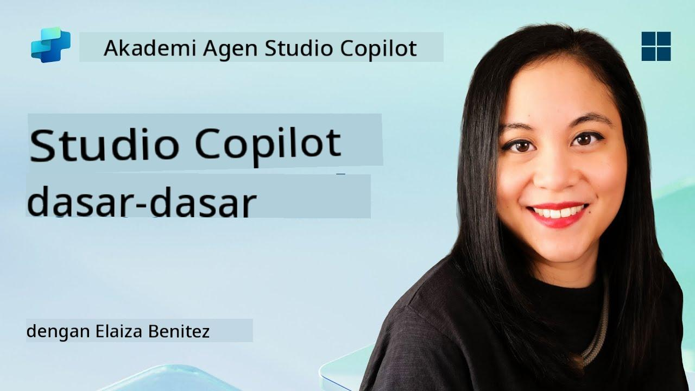
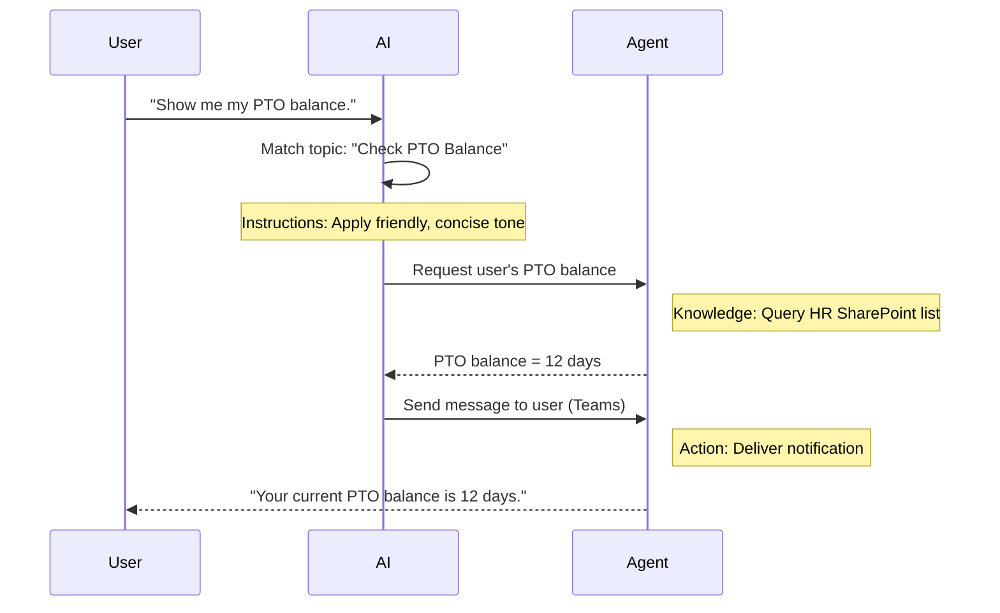

<!--
CO_OP_TRANSLATOR_METADATA:
{
  "original_hash": "90a3c5122f5687bbc8cc819990f175d4",
  "translation_date": "2025-10-17T17:14:43+00:00",
  "source_file": "docs/recruit/02-copilot-studio-fundamentals/README.md",
  "language_code": "id"
}
-->
# 🚨 Misi 02: Dasar-Dasar Copilot Studio

## 🕵️‍♂️ NAMA KODE: `OPERASI PROTOKOL INTI`

> **⏱️ Waktu Operasi:** `~30 menit – hanya intel, tidak ada kerja lapangan`  

🎥 **Tonton Panduan**

[](https://www.youtube.com/watch?v=x4OCwDRGeLE "Tonton panduan di YouTube")

## 🎯 Ringkasan Misi

Selamat datang, Rekrut. Misi ini akan memberikan intel dasar untuk memahami cara kerja Copilot Studio dan bagaimana membangun agen cerdas yang memberikan nilai bisnis nyata.

Sebelum membangun agen pertama Anda, Anda perlu memahami empat komponen utama yang membentuk setiap agen AI kustom: Pengetahuan, Alat, Topik, dan Instruksi. Anda juga akan belajar bagaimana elemen-elemen ini bekerja bersama dalam pengatur Copilot Studio.

## 🔎 Tujuan

Dalam misi ini, Anda akan:

- **Belajar apa itu Copilot Studio**
- **Belajar kapan dan mengapa menggunakan agen**
- **Mengeksplorasi empat blok bangunan agen**
      - **Pengetahuan**
      - **Alat**
      - **Topik**
      - **Instruksi**
- **Memahami bagaimana komponen-komponen ini bekerja bersama** untuk menciptakan agen cerdas yang otomatis

---

## Apa Itu Agen di Copilot Studio?

**Agen** adalah asisten AI khusus yang Anda desain untuk menangani tugas atau pertanyaan tertentu. Berbeda dengan chatbot umum, agen Anda:

- **Mengetahui data spesifik perusahaan** (kebijakan, dokumen, basis data)  
- **Melakukan tugas dunia nyata** (mengirim pesan, membuat acara kalender, memperbarui catatan)  
- **Mempertahankan konteks percakapan** sehingga dapat menindaklanjuti pertanyaan sebelumnya  

Karena Copilot Studio adalah low-code, Anda dapat menyeret dan melepaskan komponen yang sudah dibuat—tidak memerlukan keterampilan coding yang mendalam. Setelah agen Anda dibuat, orang dapat menggunakannya di dalam Teams, Slack, atau bahkan halaman web kustom untuk mendapatkan jawaban atau memicu alur kerja secara otomatis.

---

## Kapan dan Mengapa Menggunakan Copilot Studio

Sementara Microsoft 365 Copilot menyediakan bantuan AI umum di aplikasi Office, Anda akan membutuhkan agen kustom ketika:

### Anda membutuhkan pengetahuan spesifik domain

- Copilot bawaan mungkin tidak mengetahui prosedur internal atau data perusahaan Anda. Agen dapat mengakses situs SharePoint, basis data, atau sumber kustom Anda untuk memberikan jawaban yang akurat dan terkini.  

### Anda ingin mengotomatisasi alur kerja multi-langkah

- Contohnya: "Ketika seseorang mengajukan pengeluaran, kirim untuk persetujuan, perbarui pelacak keuangan, dan beri tahu manajer." Agen kustom dapat menangani setiap langkah, dipicu oleh satu perintah atau peristiwa.  

### Anda membutuhkan pengalaman kontekstual di dalam alat  

- Bayangkan agen Onboarding Karyawan Baru di Teams yang membimbing staf HR melalui setiap kebijakan, mengirimkan formulir yang diperlukan, dan menjadwalkan pertemuan orientasi—langsung di dalam platform kolaborasi Anda yang sudah ada.  

---

## Empat Blok Bangunan Agen

Setiap agen Copilot Studio dibangun dari empat komponen inti:

1. **Pengetahuan**  
1. **Alat (Tindakan)**  
1. **Topik**  
1. **Instruksi**

Di bawah ini, kami akan mendefinisikan setiap blok bangunan dan menunjukkan bagaimana mereka bekerja bersama untuk membuat agen yang efektif.

### 1. Pengetahuan

**Pengetahuan** adalah data dan konteks yang digunakan agen Anda untuk menjawab pertanyaan dengan akurat. Pengetahuan memiliki dua bagian:

#### Instruksi & Konteks Kustom

- Anda menulis deskripsi singkat tentang tujuan dan nada agen. Contohnya:  

    ```text
    You are an IT support agent. You help employees troubleshoot common software issues, provide troubleshooting steps, and escalate urgent tickets.
    ```

- Selama percakapan, agen mengingat giliran sebelumnya sehingga dapat merujuk kembali pada apa yang sudah dibahas (misalnya, jika pengguna pertama mengatakan, "Printer saya offline," lalu bertanya, "Apakah Anda memeriksa level tinta?" agen mengingat konteks printer).

#### Sumber Pengetahuan (Data Dasar)

- Anda menghubungkan agen Anda ke beberapa sumber data—perpustakaan SharePoint, situs dokumentasi, wiki, atau basis data lainnya.  
- Ketika pengguna mengajukan pertanyaan, agen menarik kutipan relevan dari sumber-sumber tersebut sehingga jawaban **berdasarkan** kebijakan organisasi Anda, manual produk, atau informasi kepemilikan lainnya.  
- Anda bahkan dapat memaksa agen untuk hanya merespons dengan informasi dari sumber-sumber tersebut, mencegahnya menebak atau memberikan jawaban yang tidak akurat.

!!! contoh
    Agen "Asisten Kebijakan" mungkin terhubung ke situs SharePoint HR Anda. Jika pengguna bertanya, "Berapa tingkat akumulasi PTO kami?" agen mengambil teks tepat dari dokumen kebijakan HR daripada mengandalkan respons AI generik.

---

### 2. Alat (Tindakan)

**Alat (Tindakan)** mendefinisikan apa yang dapat dilakukan agen di luar percakapan. Setiap tindakan adalah tugas yang dieksekusi agen secara programatik, seperti:

- Mengirim email atau pesan Teams  
- Membuat atau memperbarui acara kalender  
- Menambahkan atau mengedit catatan di basis data (misalnya, daftar SharePoint atau tabel Dataverse)  
- Memanggil alur Power Automate atau REST API  

#### Cara Kerja Tindakan

- **Definisikan Input & Output**  
      - Contohnya, tindakan Kirim Email mungkin membutuhkan:  
        - `RecipientEmailAddress`  
        - `SubjectLine`  
        - `EmailBody`  

- **Gabungkan Tindakan ke dalam Alur Kerja**  
      - Seringkali, memenuhi permintaan pengguna melibatkan beberapa langkah.  
      - Anda dapat mengurutkan tindakan sehingga:  
             1. Agen mengambil data dari daftar SharePoint.  
             2. Agen menghasilkan ringkasan menggunakan LLM.  
             3. Agen mengirim pesan Teams dengan ringkasan tersebut.  

- **Hubungkan ke Sistem Eksternal**  
      - Jika Anda perlu memperbarui CRM atau memanggil API internal, buat tindakan kustom untuk menangani itu.  
      - Copilot Studio dapat terintegrasi dengan Power Platform atau endpoint berbasis HTTP apa pun.

!!! contoh "Agen "Pembantu Pengeluaran" dapat:"  
    1. Mendengarkan permintaan "Ajukan Pengeluaran."  
    2. Mengambil detail pengeluaran pengguna dari formulir.  
    3. Menggunakan tindakan "Tambahkan ke Daftar SharePoint" untuk menyimpan data.  
    4. Memicu tindakan "Kirim Email" untuk memberi tahu pihak yang menyetujui.  

---

### 3. Topik

**Topik** mendefinisikan pemicu percakapan atau titik masuk untuk agen Anda. Setiap topik sesuai dengan bagian fungsi atau kategori pertanyaan.

#### Pemicu Percakapan  

- Topik mungkin berupa "Ajukan Tiket IT," "Periksa Saldo Cuti," atau "Buat Laporan Penjualan."  
- Di balik layar, Copilot Studio menggunakan **orkestrasi generatif**: daripada mengandalkan kata kunci yang tepat, AI menafsirkan maksud pengguna dan memilih topik yang tepat berdasarkan deskripsi singkat yang Anda berikan.  

#### Deskripsi Topik  

- Dalam setiap topik, Anda menulis deskripsi yang jelas dan ringkas tentang apa yang dicakup oleh topik tersebut.

!!! contoh "Contoh deskripsi topik"
    Topik ini membantu pengguna mengajukan tiket dukungan IT dengan mengumpulkan detail masalah, prioritas, dan informasi kontak.

- AI menggunakan deskripsi tersebut untuk memutuskan kapan mengaktifkan topik ini, bahkan jika frasa pengguna tidak persis sama.

#### Memetakan Topik ke Tindakan  

- Setiap topik terhubung ke satu atau lebih tindakan atau langkah pengambilan data.  
- Ketika AI memilih topik, AI memandu percakapan melalui urutan yang Anda definisikan (mengajukan pertanyaan lanjutan, memanggil tindakan, mengembalikan hasil).

!!! contoh
    Jika pengguna mengatakan, "Saya butuh bantuan mengatur laptop baru saya," AI mungkin mencocokkan maksud tersebut dengan topik "Ajukan Tiket IT." Agen kemudian meminta model laptop, detail pengguna, dan secara otomatis memasukkan tiket ke dalam sistem helpdesk.

---

### 4. Instruksi

**Instruksi** (kadang disebut "Prompt" atau "Pesan Sistem") membimbing nada, gaya, dan batasan LLM. Instruksi membentuk cara agen merespons dalam situasi apa pun.

#### Peran & Persona  

- Anda memberi tahu AI siapa dirinya (misalnya, "Anda adalah agen layanan pelanggan untuk Contoso Retail").  
- Ini menetapkan nada—ramah, ringkas, formal, atau santai—tergantung pada kasus penggunaan Anda.

#### Pedoman Respons  

- Tentukan aturan apa pun yang harus diikuti agen, seperti:  
      - "Selalu ringkas informasi kebijakan dalam poin-poin."  
      - "Jika Anda tidak tahu jawabannya, katakan ‘Maaf, saya tidak memiliki informasi tersebut.’"  
      - "Jangan pernah menyertakan data rahasia di luar konteks."

#### Aturan Memori & Konteks

- Anda dapat menginstruksikan agen berapa banyak giliran percakapan yang harus diingat.  
- Contohnya: "Ingat detail dari permintaan pengguna ini hingga tiga pertanyaan lanjutan."

!!! contoh "Dalam agen "Penasihat Manfaat," Anda mungkin menyertakan:"
    "Selalu merujuk pada buku pedoman HR terbaru saat menjawab pertanyaan. Jika ditanya tentang tenggat waktu pendaftaran, berikan tanggal spesifik dari kebijakan. Jaga jawaban tetap di bawah 150 kata."

---

## Bagaimana Empat Blok Bangunan Bekerja Bersama

Ketika Anda merakit **Pengetahuan**, **Alat**, **Topik**, dan **Instruksi**, pengatur AI Copilot Studio menciptakan agen yang:

1. **Mendengarkan Topik yang relevan** (dipandu oleh deskripsi topik Anda).  
1. **Menerapkan Instruksi** untuk menetapkan nada, memutuskan kapan mengajukan pertanyaan lanjutan, dan menegakkan aturan.  
1. **Memanfaatkan Sumber Pengetahuan** untuk mendasarkan jawabannya pada data organisasi Anda.  
1. **Memanggil Alat (Tindakan)** sesuai kebutuhan untuk melakukan tugas—mengirim pesan, memperbarui catatan, atau memanggil API.  

Di balik layar, pengatur menggunakan pendekatan **perencanaan generatif**: ia memutuskan langkah apa yang harus diambil, dalam urutan apa, untuk memenuhi permintaan pengguna. Jika tindakan gagal (misalnya, email tidak dapat dikirim), agen mengikuti pedoman penanganan pengecualian Anda (mengajukan pertanyaan klarifikasi atau melaporkan kesalahan). Karena LLM beradaptasi dengan konteks percakapan, agen dapat mempertahankan memori selama beberapa giliran dan menggabungkan informasi baru saat percakapan berlangsung.

**Contoh Alur Visual:**  
<!--
1. **Pengguna:** "Tunjukkan saldo cuti saya."
1. **AI (Topik):** Mencocokkan topik "Periksa Saldo Cuti."  
1. **AI (Instruksi):** Menggunakan nada ramah dan ringkas.  
1. **Agen (Pengetahuan):** Mengakses daftar SharePoint HR untuk saldo pengguna.  
1. **Agen (Tindakan):** Mengambil nilai dan mengirim pesan Teams:  
   > "Saldo cuti Anda saat ini adalah 12 hari."  
-->



---

## 🎉 Misi Selesai

Anda telah berhasil menyelesaikan pengarahan dasar Anda. Anda sekarang telah mempelajari empat blok bangunan penting dari setiap agen di Copilot Studio:

1. **Pengetahuan** – Tempat agen mencari informasi faktual dan mempertahankan memori percakapan.  
1. **Alat** – Tugas yang dapat dilakukan agen untuk membuat sesuatu terjadi secara otomatis.  
1. **Topik** – Cara agen mengenali maksud pengguna dan memutuskan alur kerja mana yang dijalankan.  
1. **Instruksi** – Aturan, nada, dan batasan yang membimbing setiap respons.

Dengan komponen-komponen ini, Anda dapat membangun agen dasar yang menjawab pertanyaan dan menjalankan alur kerja sederhana. Dalam pelajaran berikutnya, kami akan memandu Anda melalui tutorial langkah demi langkah untuk membuat agen "Service Desk"—mulai dari menghubungkan sumber pengetahuan pertama Anda hingga mendefinisikan topik dan menghubungkan tindakan.

Selanjutnya: Anda akan membangun [agen deklaratif pertama Anda untuk M365 Copilot](../03-create-a-declarative-agent-for-M365Copilot/README.md).

<!-- markdownlint-disable-next-line MD033 -->


---

**Penafian**:  
Dokumen ini telah diterjemahkan menggunakan layanan penerjemahan AI [Co-op Translator](https://github.com/Azure/co-op-translator). Meskipun kami berupaya untuk memberikan hasil yang akurat, harap diketahui bahwa terjemahan otomatis mungkin mengandung kesalahan atau ketidakakuratan. Dokumen asli dalam bahasa aslinya harus dianggap sebagai sumber yang otoritatif. Untuk informasi yang penting, disarankan menggunakan jasa penerjemahan manusia profesional. Kami tidak bertanggung jawab atas kesalahpahaman atau interpretasi yang keliru yang timbul dari penggunaan terjemahan ini.