<!--
CO_OP_TRANSLATOR_METADATA:
{
  "original_hash": "0c51aabca81d6256990caf4c015e6195",
  "translation_date": "2025-10-17T17:12:16+00:00",
  "source_file": "docs/recruit/04-creating-a-solution/README.md",
  "language_code": "id"
}
-->
# 🚨 Misi 04: Membuat Solusi untuk Agen Anda

## 🕵️‍♂️ NAMA KODE: `OPERASI CTRL-ALT-PACKAGE`

> **⏱️ Waktu Operasi:** `~45 menit`

🎥 **Tonton Panduan**

[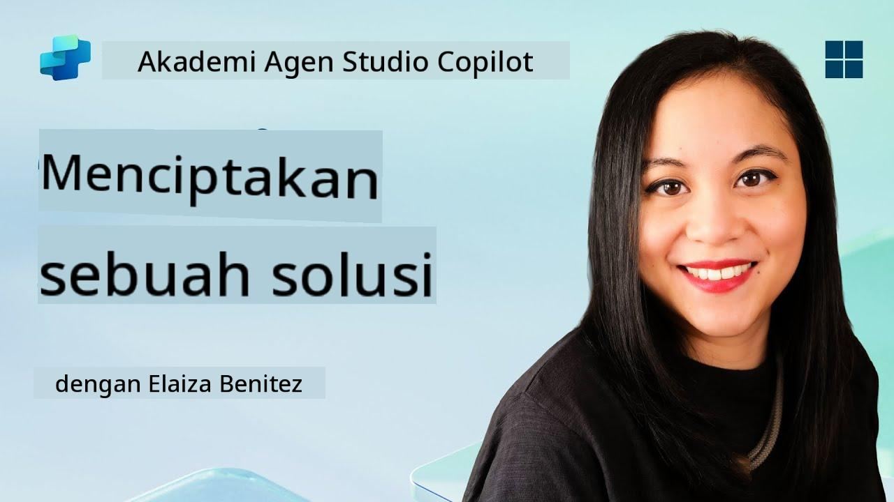](https://www.youtube.com/watch?v=1iATbkgfcpU "Tonton panduan di YouTube")

## 🎯 Ringkasan Misi

Pembuat Agen, selamat datang di operasi taktis berikutnya. Dalam misi ini, Anda akan belajar merakit Solusi - kendaraan resmi untuk penerapan Agen IT Helpdesk Anda yang dibangun dengan Microsoft Copilot Studio. Anggap ini sebagai membuat koper digital yang menyimpan agen Anda dan artefaknya.

Setiap agen membutuhkan rumah yang terstruktur dengan baik. Itulah yang disediakan oleh solusi Power Platform - keteraturan, portabilitas, dan kesiapan untuk produksi.

Mari kita mulai.

## 🔎 Tujuan

Dalam misi ini, Anda akan belajar:

1. Memahami apa itu solusi Power Platform dan perannya dalam pengembangan agen
1. Mempelajari manfaat menggunakan solusi untuk mengorganisasi dan menerapkan agen
1. Mengeksplorasi penerbit solusi dan pentingnya dalam pengelolaan komponen
1. Memahami siklus hidup solusi Power Platform dari pengembangan hingga produksi
1. Membuat penerbit solusi dan solusi khusus untuk Agen IT Helpdesk Anda

## 🕵🏻‍♀️ Solusi? Apa itu?

Dalam Microsoft Power Platform, solusi adalah seperti wadah atau paket yang menyimpan semua bagian dari aplikasi atau agen Anda - ini bisa berupa tabel, formulir, alur, dan logika khusus. Solusi sangat penting untuk Application Lifecycle Management (ALM), memungkinkan Anda mengelola aplikasi dan agen Anda dari ide hingga pengembangan, pengujian, penerapan, dan pembaruan.

Di Copilot Studio, setiap agen yang Anda buat disimpan dalam solusi Power Platform. Secara default, agen dibuat dalam solusi Default, kecuali Anda membuat solusi khusus baru untuk membuat agen Anda di dalamnya. Inilah yang akan kita pelajari 🤓 dalam pelajaran ini dan di lab praktik.

Solusi secara tradisional dibuat di **portal pembuat Power Apps** - antarmuka berbasis web di mana Anda dapat membangun dan menyesuaikan aplikasi, Dataverse, alur, mengeksplorasi komponen AI, dan lainnya.

   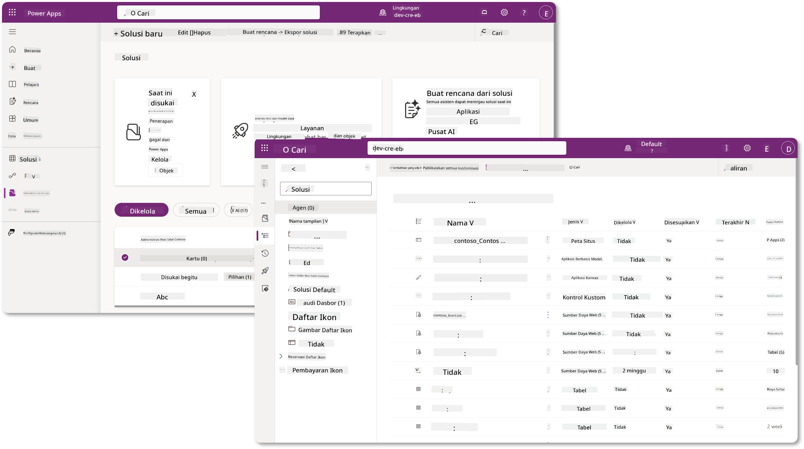

Di Copilot Studio, sekarang ada **Solution Explorer** di mana Anda dapat mengelola solusi Anda secara langsung. Anda tidak perlu lagi beralih ke portal pembuat Power Apps untuk mengelola solusi Anda, semuanya dapat dilakukan langsung di dalam Copilot Studio 🪄

Ini berarti Anda dapat melakukan tugas-tugas terkait solusi seperti biasa:

- **Membuat solusi** - solusi khusus memungkinkan agen diekspor dan diimpor antar lingkungan.
- **Mengatur solusi pilihan Anda** - pilih solusi tempat agen, aplikasi, dll akan dibuat secara default.
- **Menambahkan atau menghapus komponen** - agen Anda mungkin merujuk komponen lain seperti variabel lingkungan atau alur cloud. Oleh karena itu, komponen ini perlu dimasukkan dalam solusi.
- **Mengekspor solusi** - untuk memindahkan solusi ke lingkungan target lainnya.
- **Mengimpor solusi** - mengimpor solusi yang dibuat di tempat lain, termasuk peningkatan atau pembaruan solusi.
- **Membuat dan mengelola pipeline solusi** - mengotomatisasi penerapan solusi antar lingkungan.
- **Integrasi Git** - memungkinkan pengembang menghubungkan solusi dengan repositori Git untuk kontrol versi, kolaborasi, dan ALM. Dimaksudkan untuk digunakan hanya di lingkungan pengembang.

   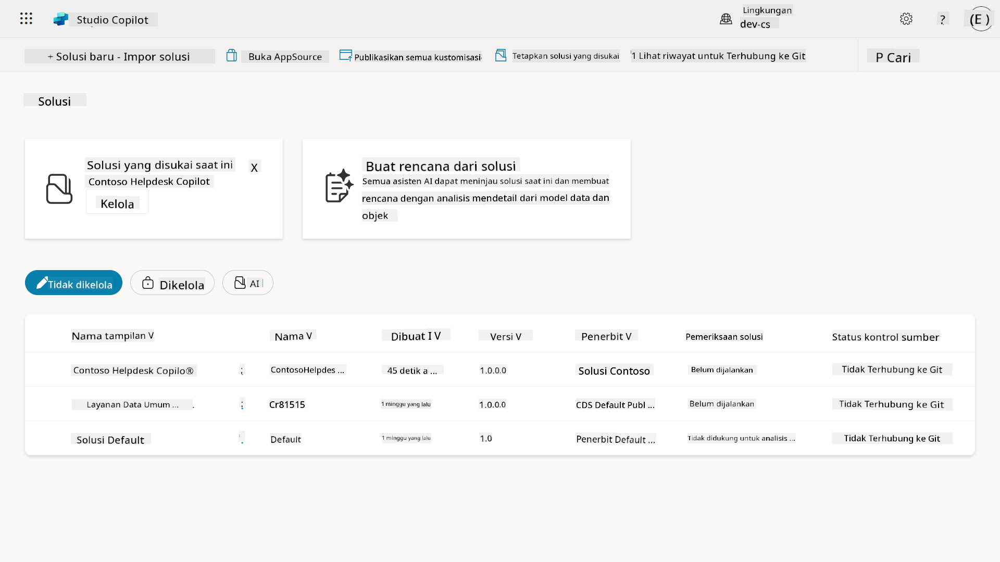

Ada dua jenis solusi:

- **Solusi tidak terkelola** - digunakan selama pengembangan. Anda dapat mengedit dan menyesuaikan dengan bebas sesuai kebutuhan.
- **Solusi terkelola** - digunakan saat Anda siap menerapkan aplikasi ke pengujian atau produksi. Solusi ini dikunci untuk mencegah perubahan yang tidak disengaja.

## 🤔 Mengapa _harus_ menggunakan Solusi untuk agen saya?

Anggap Solusi sebagai _kotak alat_. Ketika Anda perlu memperbaiki atau membangun sesuatu (agen) di lokasi lain (lingkungan), Anda mengumpulkan semua alat yang diperlukan (komponen) dan memasukkannya ke dalam kotak alat Anda (Solusi). Anda kemudian dapat membawa kotak alat ini ke lokasi baru (lingkungan) dan menggunakan alat-alat tersebut (komponen) untuk menyelesaikan pekerjaan Anda, atau menambahkan alat baru (komponen) untuk menyesuaikan agen atau proyek yang sedang Anda bangun.

!!! quote "Elaiza, advokat cloud ramah Anda muncul di sini 🙋🏻‍♀️ untuk berbagi beberapa kata:"
    Kami memiliki pepatah di Selandia Baru, "Jadilah Kiwi yang rapi!" yang merupakan seruan bagi warga Selandia Baru 🥝 untuk bertanggung jawab atas lingkungan mereka dengan membuang sampah dengan benar dan menjaga kebersihan ruang publik. Kita dapat menggunakan konteks yang sama untuk agen dengan menjaga segala sesuatu yang terkait dengan agen Anda tetap terorganisasi dan portabel, dan ini akan membantu Anda menjaga lingkungan yang rapi.

Adalah praktik yang baik untuk membuat agen dalam solusi khusus di lingkungan sumber (pengembang) Anda. Berikut alasan mengapa solusi itu berharga:

🧩 **Pengembangan yang terorganisasi**

- Anda menjaga agen Anda terpisah dari solusi Default yang berisi segala sesuatu di lingkungan. Semua komponen agen Anda berada di satu tempat 🎯

- Segala sesuatu yang Anda butuhkan untuk agen Anda ada dalam solusi, membuatnya lebih mudah untuk diekspor dan diimpor ke lingkungan target 👉🏻 ini adalah kebiasaan sehat dari ALM.

🧩 **Penerapan yang aman**

- Anda dapat mengekspor aplikasi atau agen Anda sebagai solusi terkelola dan menerapkannya ke lingkungan target lainnya (seperti pengujian atau produksi) tanpa risiko pengeditan yang tidak disengaja.

🧩 **Kontrol versi**

- Anda dapat membuat patch (perbaikan target), pembaruan (perubahan yang lebih komprehensif) atau peningkatan (mengganti solusi - biasanya perubahan besar dan memperkenalkan fitur baru).

- Membantu Anda meluncurkan perubahan dengan cara yang terkontrol.

🧩 **Manajemen ketergantungan**

- Solusi melacak bagian mana yang bergantung pada yang lain. Ini mencegah Anda merusak sesuatu saat Anda melakukan perubahan.

🧩 **Kolaborasi tim**

- Pengembang dan pembuat dapat bekerja sama menggunakan solusi tidak terkelola dalam pengembangan, kemudian menyerahkan solusi terkelola untuk penerapan.

## 🪪 Memahami Penerbit Solusi

Penerbit Solusi dalam Power Platform adalah seperti label atau merek yang mengidentifikasi siapa yang membuat atau memiliki solusi. Ini adalah bagian kecil tetapi penting dalam mengelola aplikasi, agen, dan kustomisasi alur Anda, terutama saat bekerja dalam tim atau lintas lingkungan.

Saat Anda membuat solusi, Anda harus memilih penerbit. Penerbit ini menentukan:

- Awalan yang ditambahkan ke semua komponen khusus (seperti tabel, bidang, dan alur).

- Nama dan informasi kontak untuk organisasi atau orang yang memiliki solusi.

### 🤔 Mengapa ini penting?

1. **Identifikasi mudah** - awalan (Contoh - `new_` atau `abc_`) membantu Anda dengan cepat mengidentifikasi komponen mana yang milik solusi atau tim mana.

1. **Menghindari konflik** - jika dua tim membuat kolom bernama status, awalan mereka (`teamA_status`, `teamB_status`) mencegah tabrakan nama.

1. **Mendukung ALM** - saat memindahkan solusi antar lingkungan (Dev → Test → Prod), penerbit membantu melacak kepemilikan dan menjaga konsistensi.

### ✨ Contoh

Misalnya Anda membuat penerbit bernama Contoso Solutions dengan awalan `cts_`.

Jika Anda menambahkan kolom khusus bernama _Priority_, kolom tersebut akan disimpan sebagai `cts_Priority` dalam solusi.

Siapa pun yang menemukan kolom tersebut di tingkat solusi, terlepas dari lingkungan tempat mereka berada, dapat dengan mudah mengidentifikasinya sebagai kolom yang terkait dengan Contoso Solutions.

## 🧭 Siklus hidup Solusi Power Platform

Sekarang Anda memahami tujuan Solusi, mari kita pelajari siklus hidupnya.

**1. Buat Solusi di lingkungan Pengembangan** - mulai dengan membuat solusi baru di lingkungan Pengembangan Anda.

**2. Tambahkan Komponen** - tambahkan aplikasi, alur, tabel, dan elemen lainnya ke solusi Anda.

**3. Ekspor sebagai solusi Terkelola** - paketkan solusi Anda untuk penerapan dengan mengekspornya sebagai solusi Terkelola.

**4. Impor ke lingkungan Pengujian** - uji solusi Anda di lingkungan Pengujian terpisah untuk memastikan semuanya berfungsi seperti yang diharapkan.

**5. Impor ke lingkungan Produksi** - terapkan solusi yang telah diuji ke lingkungan Produksi langsung Anda.

**6. Terapkan Patch, Pembaruan, atau Peningkatan** - lakukan perbaikan atau peningkatan menggunakan patch, pembaruan, atau peningkatan. 🔁 Ulangi siklusnya!

### ✨ Contoh

Bayangkan Anda sedang membangun agen IT helpdesk untuk membantu karyawan dengan masalah seperti masalah perangkat, pemecahan masalah jaringan, pengaturan printer, dan lainnya.

- Anda mulai di lingkungan Pengembangan menggunakan solusi tidak terkelola.

- Setelah siap, Anda mengekspornya sebagai solusi terkelola dan mengimpornya ke lingkungan target seperti Pengujian Sistem atau Pengujian Penerimaan Pengguna (UAT).

- Setelah pengujian, Anda memindahkannya ke lingkungan Produksi - semuanya tanpa menyentuh versi pengembangan asli.

## 🧪 Lab 04: Membuat Solusi Baru

Sekarang kita akan belajar

- [4.1 Cara membuat penerbit Solusi](../../../../../docs/recruit/04-creating-a-solution)
- [4.2 Cara membuat Solusi](../../../../../docs/recruit/04-creating-a-solution)

Kita akan tetap menggunakan contoh dari sebelumnya, di mana kita akan membuat solusi di lingkungan Copilot Studio khusus untuk membangun agen IT helpdesk kita.

Mari kita mulai!

### Prasyarat

#### Peran keamanan

Di Copilot Studio, apa yang _dapat Anda lakukan_ di solution explorer bergantung pada peran keamanan pengguna Anda.
Jika Anda tidak memiliki izin untuk mengelola solusi di pusat admin Power Apps, Anda juga tidak akan dapat melakukan tugas-tugas tersebut di Copilot Studio.

Untuk memastikan semuanya berjalan lancar, periksa apakah Anda memiliki peran keamanan dan izin yang tepat. Atau jika Anda tidak mengelola lingkungan di organisasi Anda, tanyakan kepada administrator IT Anda (atau tim yang setara) yang mengelola tenant/lingkungan Anda.

Berikut adalah peran keamanan yang memungkinkan pengguna untuk membuat solusi di lingkungan mereka.

| Peran Keamanan    | Deskripsi |
| ---------- | ---------- |
| Pembuat Lingkungan | Memberikan izin yang diperlukan untuk membuat, menyesuaikan, dan mengelola sumber daya dalam lingkungan tertentu, termasuk solusi  |
| Penyesuai Sistem  | Izin yang lebih luas daripada Pembuat Lingkungan, termasuk kemampuan untuk menyesuaikan lingkungan dan mengelola peran keamanan |
| Administrator Sistem   | Tingkat izin tertinggi dan dapat mengelola semua aspek lingkungan, termasuk membuat dan menetapkan peran keamanan     |

#### Lingkungan pengembang

Pastikan Anda beralih ke lingkungan pengembang khusus Anda, lihat [Pelajaran 00 - Pengaturan Kursus - Langkah 3: Buat lingkungan pengembang baru](../00-course-setup/README.md#step-3-create-new-developer-environment).

1. Di kanan atas, pilih ikon **Roda Gigi** dan beralih dari lingkungan default ke lingkungan Anda, misalnya **Lingkungan Adele Vance**.

    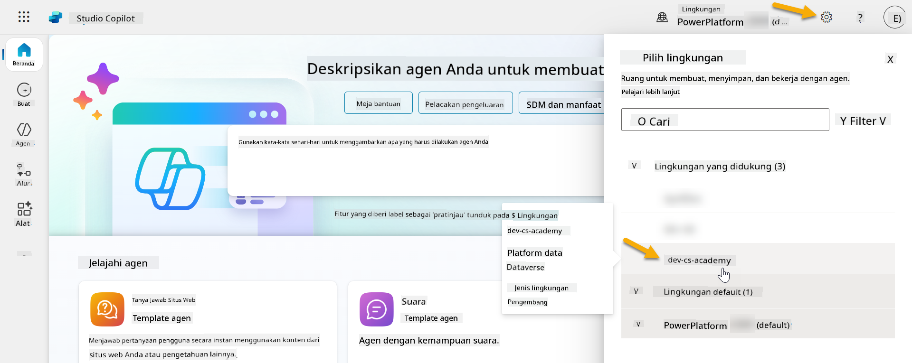

### 4.1 Membuat penerbit Solusi

1. Menggunakan lingkungan Copilot Studio yang sama seperti yang digunakan dalam pelajaran sebelumnya, pilih ikon **titik tiga (. . .)** di menu sisi kiri di Copilot Studio. Pilih **Solusi** di bawah header **Explore**.

    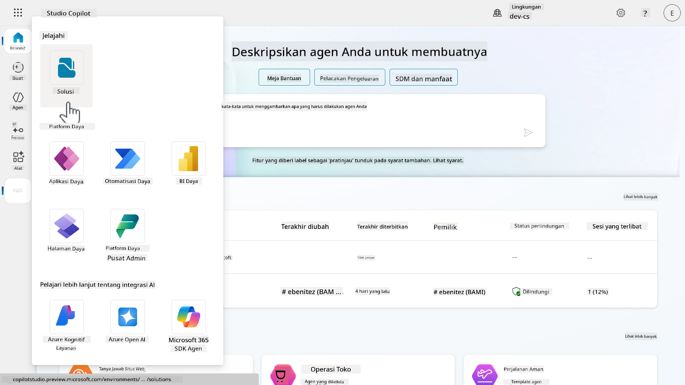

1. **Solution Explorer** di Copilot Studio akan dimuat. Pilih **+ Solusi baru**

    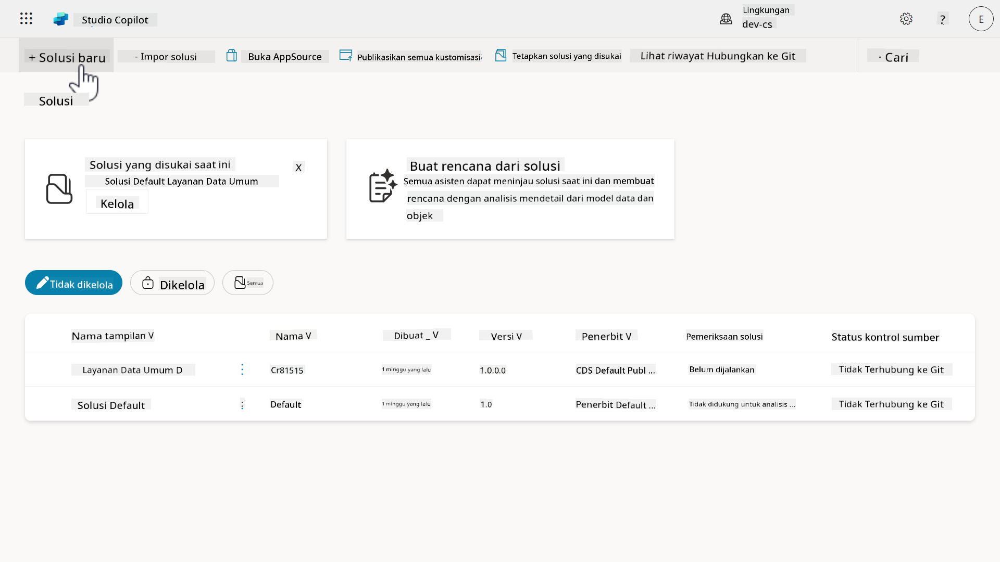

1. Panel **Solusi baru** akan muncul di mana kita dapat menentukan detail solusi kita. Pertama, kita perlu membuat penerbit baru. Pilih **+ Penerbit baru**.

    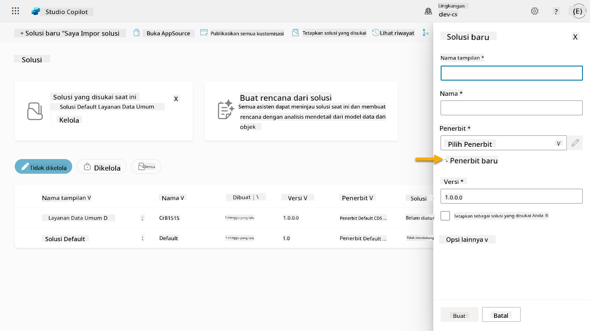  

1. Tab **Properti** dari panel **Penerbit baru** akan muncul dengan kolom yang wajib dan tidak wajib diisi di tab **Properti**. Di sinilah kita dapat menguraikan detail penerbit yang akan digunakan sebagai label atau merek yang mengidentifikasi siapa yang membuat atau memiliki solusi.

    | Properti    | Deskripsi | Wajib |
    | ---------- | ---------- | :----------: |
    | Nama tampilan | Nama tampilan untuk penerbit | Ya   |
    | Nama  | Nama unik dan nama skema untuk penerbit  | Ya    |
    | Deskripsi   | Menguraikan tujuan solusi    | Tidak     |
    | Awalan    | Awalan penerbit yang akan diterapkan pada komponen yang baru dibuat   | Ya      |
    | Awalan nilai pilihan   | Menghasilkan angka berdasarkan awalan penerbit. Angka ini digunakan saat Anda menambahkan opsi ke pilihan dan memberikan indikator solusi mana yang digunakan untuk menambahkan opsi tersebut.   | Ya      |

    Salin dan tempel yang berikut sebagai **Nama tampilan**,

    ```text
    Contoso Solutions
    ```

    Salin dan tempel yang berikut sebagai **Nama**,

    ```text
    ContosoSolutions
    ```

    Salin dan tempel yang berikut sebagai **Deskripsi**,

    ```text
    Copilot Studio Agent Academy
    ```

    Salin dan tempel yang berikut untuk **Awalan**,

    ```text
    cts
    ```

    Secara default, awalan **Nilai pilihan** akan menampilkan nilai integer. Perbarui nilai integer ini ke angka ribuan terdekat. Misalnya, dalam tangkapan layar saya di bawah, awalnya adalah `77074`. Perbarui ini dari `77074` menjadi `77000`.

    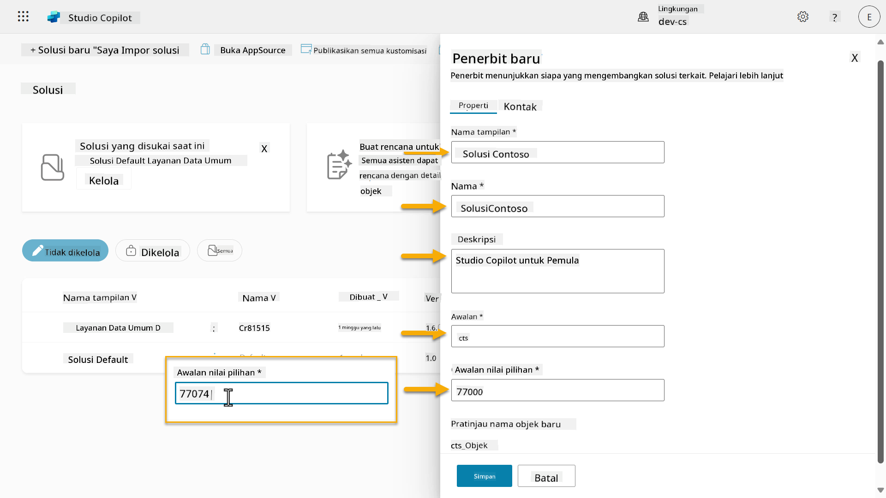  

1. Jika Anda ingin memberikan detail kontak untuk Solusi, pilih tab **Kontak** dan isi kolom berikut yang ditampilkan.

    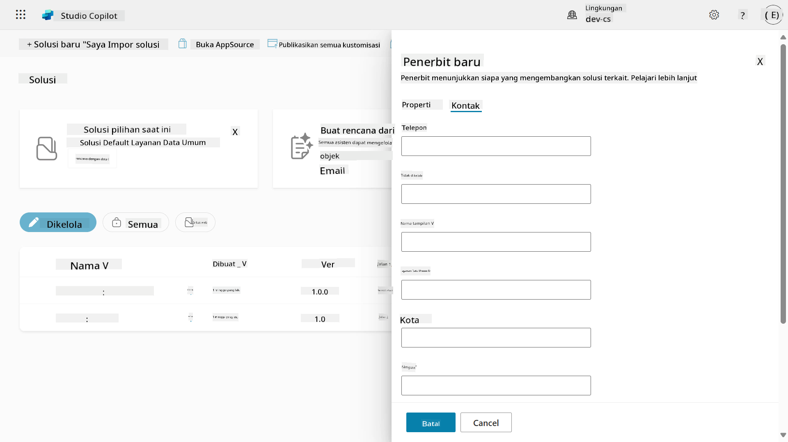

1. Pilih tab **Properti** dan pilih **Simpan** untuk membuat Penerbit.

    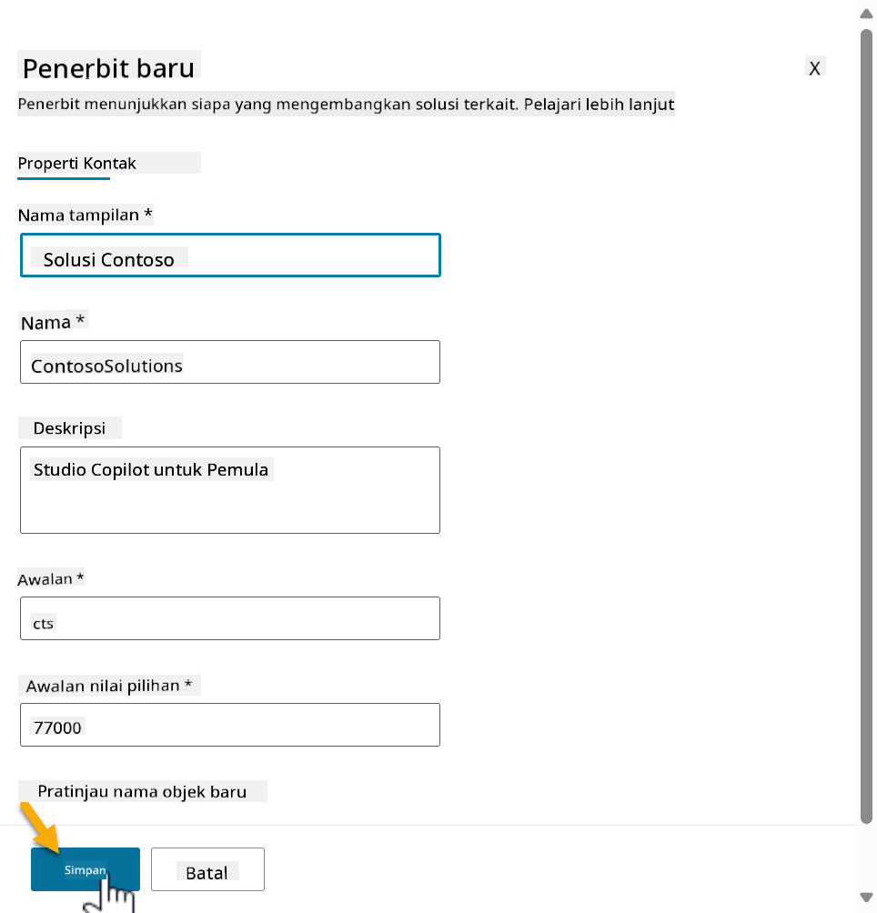
1. Panel **Penerbit Baru** akan tertutup dan Anda akan kembali ke panel **Solusi Baru** dengan Penerbit yang baru saja dibuat sudah dipilih.

    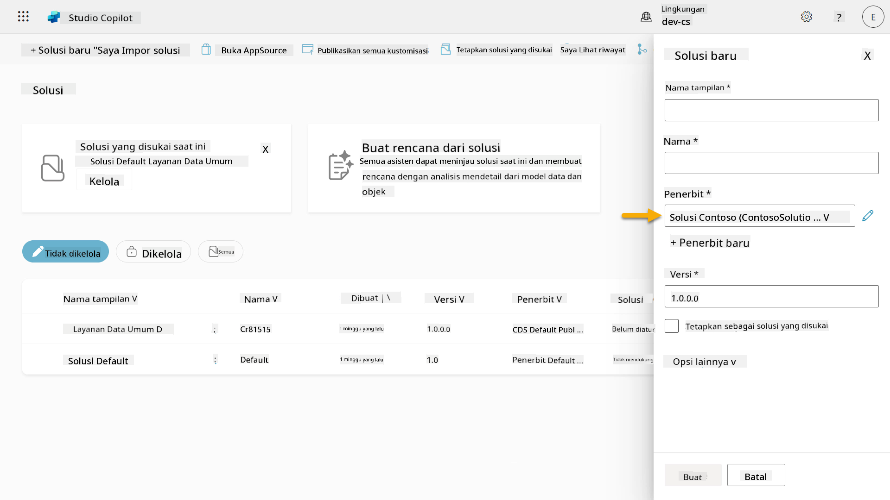  

Selamat, Anda telah berhasil membuat Penerbit Solusi! 🙌🏻 Selanjutnya, kita akan belajar cara membuat solusi kustom baru.

### 4.2 Membuat Solusi Baru

1. Sekarang setelah kita membuat penerbit solusi, kita dapat melengkapi sisa formulir di panel **Solusi Baru**.

    Salin dan tempel teks berikut sebagai **Nama Tampilan**,

    ```text
    Contoso Helpdesk Agent
    ```

    Salin dan tempel teks berikut sebagai **Nama**,

    ```text
    ContosoHelpdeskAgent
    ```

    Karena kita sedang membuat solusi baru, [**Nomor Versi**](https://learn.microsoft.com/power-apps/maker/data-platform/update-solutions#understanding-version-numbers-for-updates/?WT.mc_id=power-172615-ebenitez) secara default akan menjadi `1.0.0.0`.

    Centang kotak **Tetapkan sebagai solusi pilihan Anda**.

    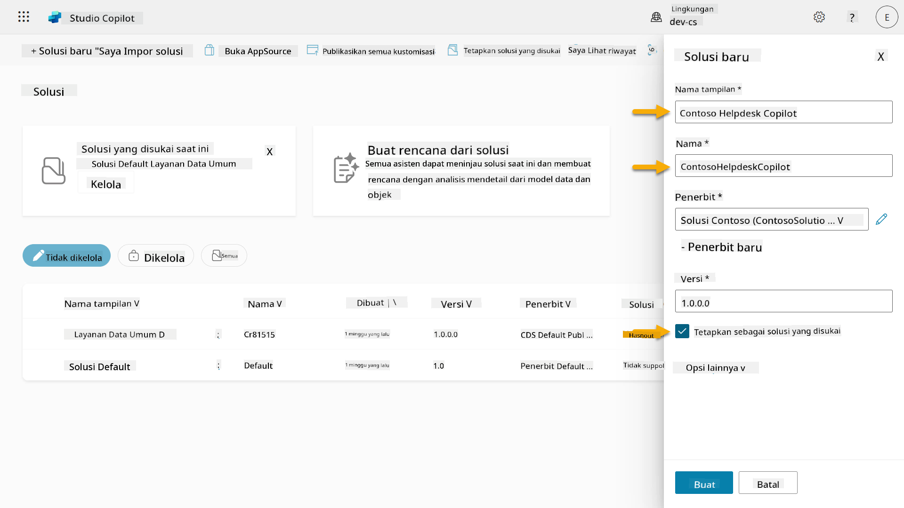  

1. Perluas **Opsi lainnya** untuk melihat detail tambahan yang dapat disediakan dalam solusi.

    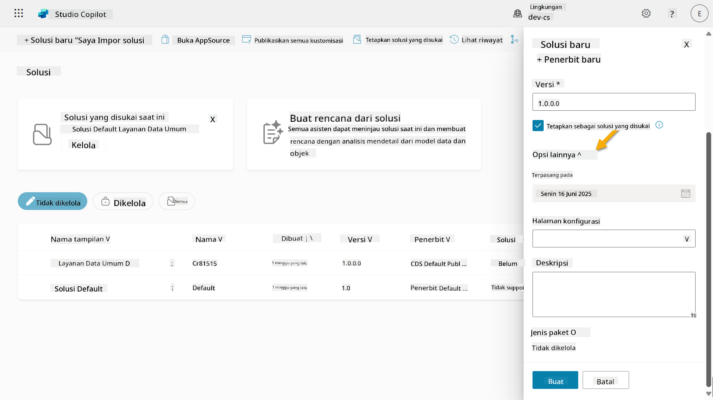

1. Anda akan melihat hal berikut,

    - **Diinstal pada** - tanggal saat Solusi diinstal.

    - **Halaman konfigurasi** - pengembang mengatur sumber daya web HTML untuk membantu pengguna berinteraksi dengan aplikasi, agen, atau alat mereka, yang akan muncul sebagai halaman web di bagian Informasi dengan instruksi atau tombol. Ini biasanya digunakan oleh perusahaan atau pengembang yang membangun dan berbagi solusi dengan orang lain.

    - **Deskripsi** - menjelaskan solusi atau gambaran umum tentang halaman konfigurasi.

    Kita akan membiarkan bagian ini kosong untuk lab ini.

    Pilih **Buat**.

    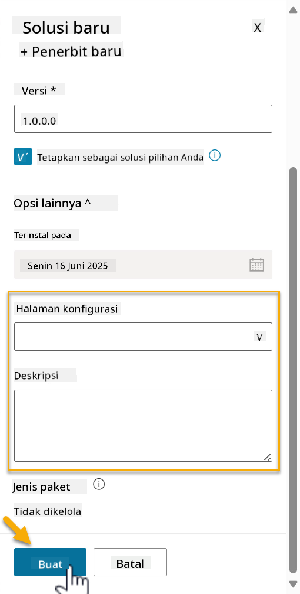

1. Solusi untuk Contoso Helpdesk Agent sekarang telah dibuat. Akan ada nol komponen hingga kita membuat agen di Copilot Studio.

    Pilih ikon **panah kembali** untuk kembali ke Solution Explorer.

    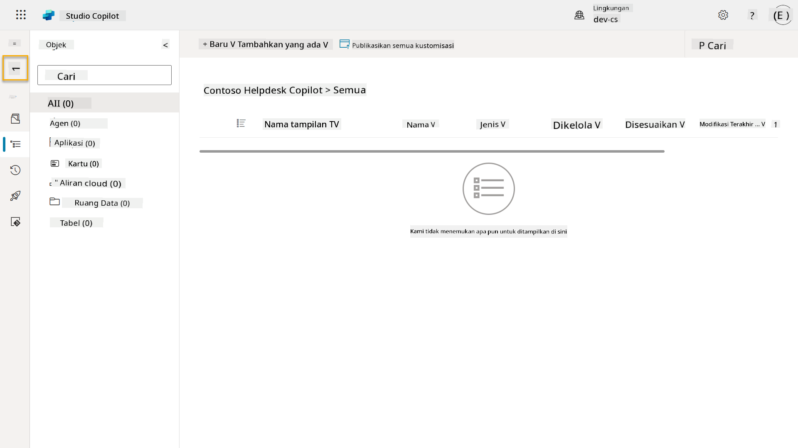

1. Perhatikan bagaimana Contoso Helpdesk Agent sekarang ditampilkan sebagai **Solusi pilihan saat ini** karena kita telah mencentang kotak **Tetapkan sebagai solusi pilihan Anda** sebelumnya.

    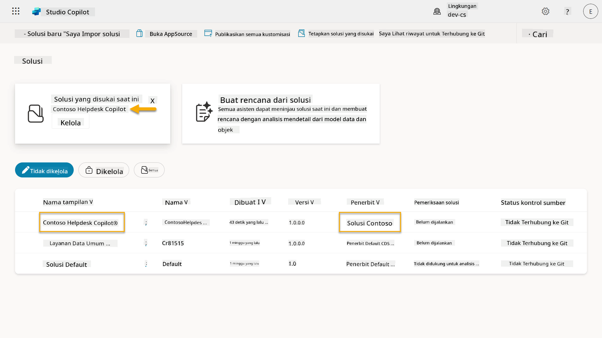

## ✅ Misi Selesai

Selamat! 👏🏻 Anda telah membuat Penerbit dan menggunakannya dalam Solusi baru yang Anda buat untuk membangun agen Anda!

Kerja bagus, Pembuat Agen. Jejak digital yang rapi adalah langkah pertama menuju operabilitas dalam skala besar. Sekarang Anda memiliki alat dan pola pikir untuk pengembangan agen yang berkelanjutan dan siap untuk perusahaan.

Ini adalah akhir dari **Lab 04 - Membuat Solusi**, pilih tautan di bawah untuk melanjutkan ke pelajaran berikutnya. Solusi yang Anda buat dalam lab ini akan digunakan dalam lab pelajaran berikutnya.

⏭️ [Lanjut ke pelajaran **Memulai dengan cepat menggunakan agen yang sudah dibuat sebelumnya**](../05-using-prebuilt-agents/README.md)

## 📚 Sumber Daya Taktis

🔗 [Membuat solusi](https://learn.microsoft.com/power-apps/maker/data-platform/create-solution/?WT.mc_id=power-172615-ebenitez)

🔗 [Membuat dan mengelola solusi di Copilot Studio](https://learn.microsoft.com/microsoft-copilot-studio/authoring-solutions-overview/?WT.mc_id=power-172615-ebenitez)

🔗 [Berbagi agen dengan pengguna lain](https://learn.microsoft.com/microsoft-copilot-studio/admin-share-bots/?WT.mc_id=power-172615-ebenitez)

🔗 [Ringkasan sumber daya yang tersedia untuk peran keamanan yang telah ditentukan sebelumnya](https://learn.microsoft.com/power-platform/admin/database-security#summary-of-resources-available-to-predefined-security-roles/?WT.mc_id=power-172615-ebenitez)

🔗 [Meningkatkan atau memperbarui solusi](https://learn.microsoft.com/power-apps/maker/data-platform/update-solutions/?WT.mc_id=power-172615-ebenitez)

🔗 [Ikhtisar pipeline di Power Platform](https://learn.microsoft.com/power-platform/alm/pipelines/?WT.mc_id=power-172615-ebenitez)

🔗 [Ikhtisar integrasi Git di Power Platform](https://learn.microsoft.com/power-platform/alm/git-integration/overview/?WT.mc_id=power-172615-ebenitez)

<!-- markdownlint-disable-next-line MD033 -->


---

**Penafian**:  
Dokumen ini telah diterjemahkan menggunakan layanan penerjemahan AI [Co-op Translator](https://github.com/Azure/co-op-translator). Meskipun kami berupaya untuk memberikan hasil yang akurat, harap diketahui bahwa terjemahan otomatis dapat mengandung kesalahan atau ketidakakuratan. Dokumen asli dalam bahasa aslinya harus dianggap sebagai sumber yang otoritatif. Untuk informasi yang penting, disarankan menggunakan jasa penerjemahan manusia profesional. Kami tidak bertanggung jawab atas kesalahpahaman atau penafsiran yang timbul dari penggunaan terjemahan ini.