<!--
CO_OP_TRANSLATOR_METADATA:
{
  "original_hash": "8e2c64a7f9303e58329ec8bb468c80b4",
  "translation_date": "2025-10-17T17:07:55+00:00",
  "source_file": "docs/recruit/05-using-prebuilt-agents/README.md",
  "language_code": "id"
}
-->
# 🧰 Misi 05: Menggunakan Agen yang Sudah Dibangun  

## 🕵️‍♂️ NAMA KODE: `OPERASI PERJALANAN AMAN`

> **⏱️ Waktu Operasi:** `~30 menit`

🎥 **Tonton Panduan**

[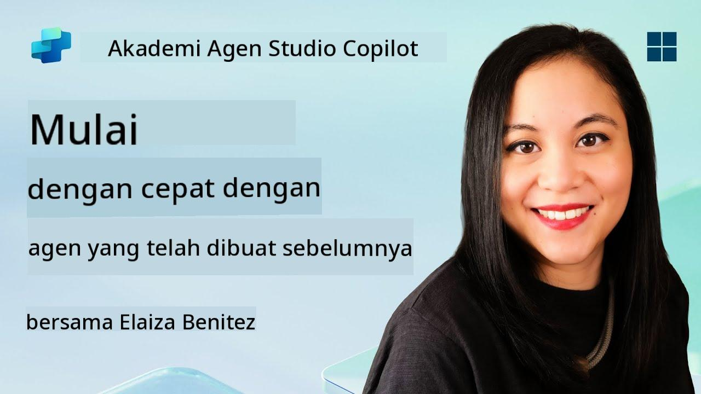](https://www.youtube.com/watch?v=NmXsx8WjWuM "Tonton panduan di YouTube")

## 🎯 Ringkasan Misi

Selamat datang di misi berikutnya di Copilot Studio Agent Academy. Anda akan menjelajahi dunia **agen yang sudah dibangun**—agen cerdas yang dirancang khusus oleh Microsoft untuk mempercepat penerapan dan mengurangi waktu hingga mendapatkan hasil.

Alih-alih membangun dari awal, agen yang sudah dibangun (juga disebut **template agen**) memberikan Anda awal yang cepat dengan menyediakan skenario siap pakai yang dapat Anda sesuaikan dan terapkan dalam hitungan menit.

Dalam misi ini, Anda akan menerapkan agen **Safe Travels**—agen yang membantu pengguna Anda mempersiapkan perjalanan bisnis, memahami kebijakan perusahaan, dan menyederhanakan perencanaan.

---

## 🧭 Tujuan

Tujuan Anda dalam misi ini adalah:

1. Memahami apa itu agen yang sudah dibangun dan mengapa itu penting  
1. Menerapkan template agen **Safe Travels**  
1. Menyesuaikan respons dan konten agen  
1. Menguji dan menerbitkan agen  

---

## 🧠 Apa Itu Agen yang Sudah Dibangun?

Agen yang sudah dibangun adalah agen AI siap pakai yang dibuat oleh Microsoft yang:

- Menjawab kebutuhan bisnis umum (seperti perjalanan, HR, dukungan IT)
- Termasuk topik yang berfungsi penuh, frasa pemicu, instruksi, dan contoh pengetahuan.
- Dapat diedit, diperluas, dan disesuaikan dengan data Anda sendiri

Agen ini sangat cocok untuk memulai dengan cepat atau mempelajari bagaimana struktur agen dibuat.

---

## 🧪 Lab 05: Memulai dengan cepat menggunakan agen yang sudah dibangun

Sekarang kita akan belajar bagaimana memilih agen yang sudah dibangun dan menyesuaikannya.

- [5.1 Meluncurkan Copilot Studio](../../../../../docs/recruit/05-using-prebuilt-agents)
- [5.2 Memilih Template Agen Safe Travels](../../../../../docs/recruit/05-using-prebuilt-agents)
- [5.3 Menyesuaikan Agen](../../../../../docs/recruit/05-using-prebuilt-agents)
- [5.4 Menguji dan Menerbitkan](../../../../../docs/recruit/05-using-prebuilt-agents)

Kita akan tetap menggunakan contoh sebelumnya, di mana kita akan membuat solusi di lingkungan Copilot Studio khusus untuk membangun agen helpdesk IT kita.

Mari kita mulai!

### 5.1 Meluncurkan Copilot Studio

1. Buka [https://copilotstudio.microsoft.com](https://copilotstudio.microsoft.com)

1. Masuk dengan akun kerja atau sekolah Microsoft 365 Anda

!!! warning
    Anda harus berada di tenant di mana Copilot Studio diaktifkan. Jika Anda tidak melihat Copilot Studio, kunjungi kembali [Misi 00](../00-course-setup/README.md) untuk menyelesaikan pengaturan Anda.

### 5.2 Memilih Template Agen Safe Travels

1. Dari halaman utama Copilot Studio, klik **+ Create**
    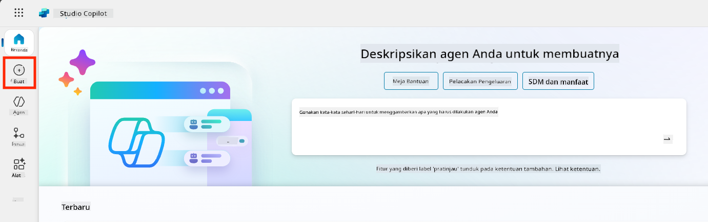

1. Gulir ke bawah ke bagian **Start with an agent template**

1. Temukan dan pilih **Safe Travels**

    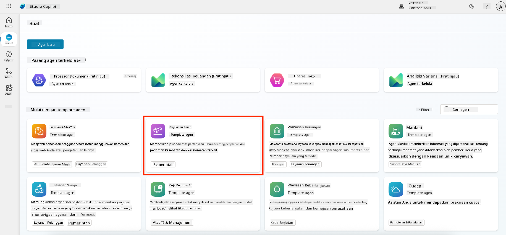

1. Perhatikan bahwa template ini sudah dilengkapi dengan deskripsi, instruksi, dan pengetahuan.

    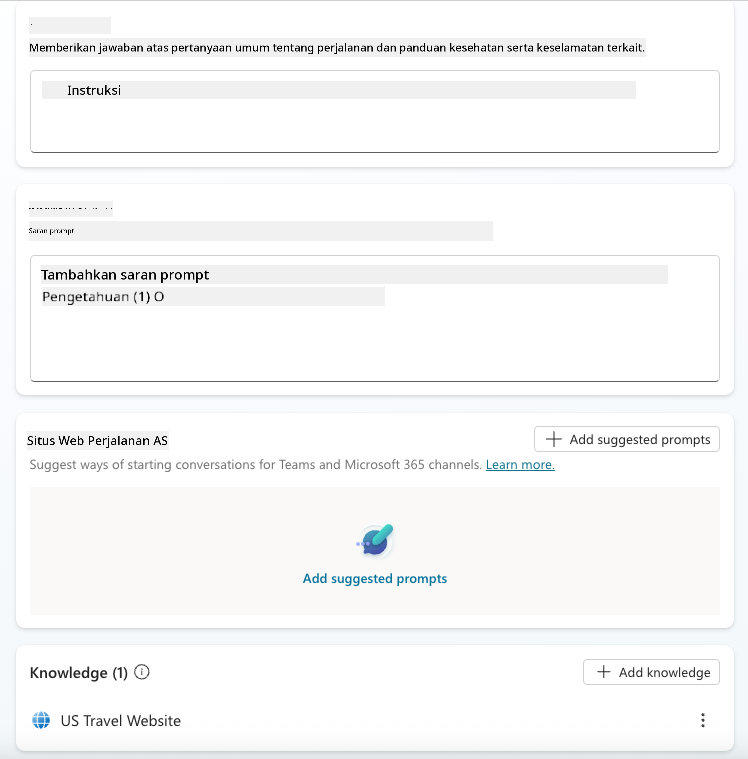

1. Klik **Create**

    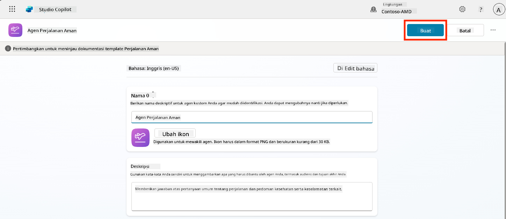

Ini akan membuat agen baru di lingkungan Anda berdasarkan konfigurasi Safe Travels.

### 5.3 Menyesuaikan Agen

Sekarang agen telah dibuat, mari kita sesuaikan dengan organisasi Anda:

1. Pilih **Enabled generative AI** untuk mengaktifkan fitur AI generatif sehingga dapat menggunakan instruksi yang disediakan dalam template.

    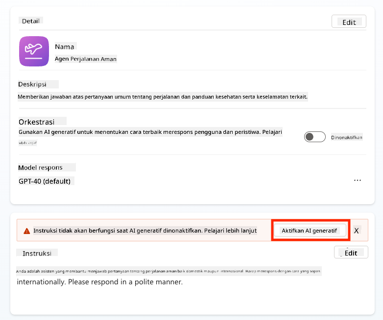

1. Sekarang kita akan melengkapi agen dengan sumber pengetahuan tambahan sehingga dapat menjawab pertanyaan tentang perjalanan di Eropa. Untuk melakukannya, gulir ke bawah ke bagian **knowledge** dan pilih **Add knowledge**

    

1. Pilih **Public websites**

    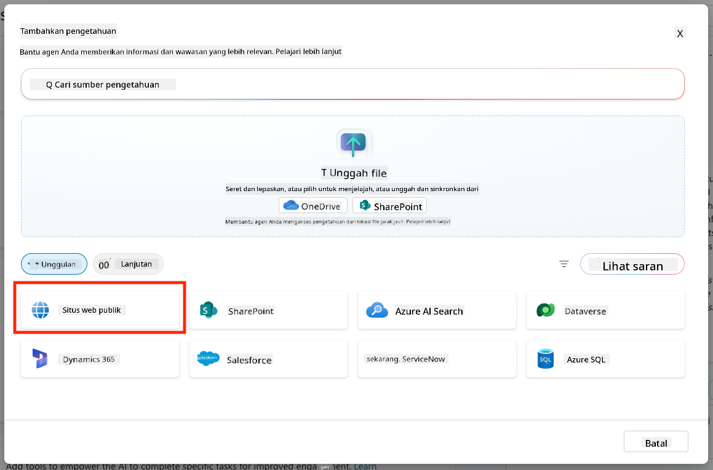

1. Di input teks, tempelkan **<https://european-union.europa.eu/>** dan pilih **Add**

    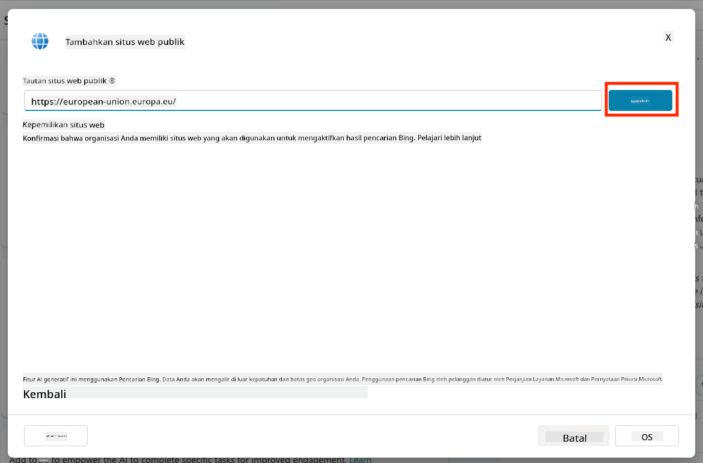

1. Pilih **Add to agent**

    

### 5.4 Menguji dan Menerbitkan

1. Klik **Test** di kanan atas untuk meluncurkan jendela pengujian  

1. Coba frasa seperti:

    - `“Apakah saya memerlukan visa untuk bepergian dari AS ke Amsterdam?”`
    - `“Berapa lama waktu yang dibutuhkan untuk mendapatkan Paspor AS?”`
    - `“Di mana kedutaan AS terdekat di Valencia, Spanyol?”`

1. Pastikan agen merespons dengan informasi yang akurat dan bermanfaat serta amati Peta Aktivitas untuk melihat dari mana informasi tersebut diambil.

    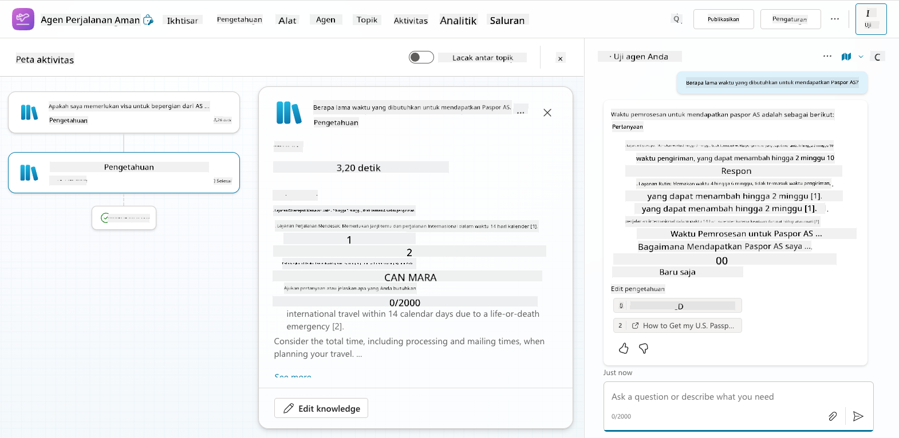

1. Saat siap, klik **Publish**

    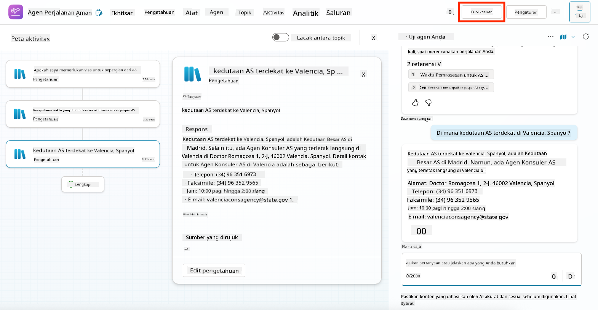

1. Pilih **Publish** lagi di kotak dialog
    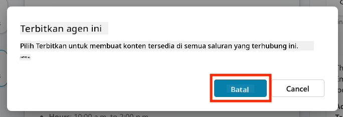

1. Opsional, tambahkan agen ke Microsoft Teams menggunakan fitur bawaan **Channels**.

!!! note "🧳 Tujuan Bonus"
    Cobalah menghubungkan agen Safe Travels dengan situs SharePoint atau file FAQ untuk membuatnya lebih relevan dengan kebijakan perjalanan perusahaan Anda.

## ✅ Misi Selesai

Anda sekarang telah berhasil:

- Menerapkan agen yang sudah dibangun oleh Microsoft  
- Menyesuaikan agen
- Menguji dan menerbitkan versi Anda sendiri dari template agen **Safe Travels**

⏭️ [Lanjut ke pelajaran **Membuat agen khusus dari awal**](../06-create-agent-from-conversation/README.md).

<!-- markdownlint-disable-next-line MD033 -->

---

**Penafian**:  
Dokumen ini telah diterjemahkan menggunakan layanan penerjemahan AI [Co-op Translator](https://github.com/Azure/co-op-translator). Meskipun kami berupaya untuk memberikan hasil yang akurat, harap diketahui bahwa terjemahan otomatis mungkin mengandung kesalahan atau ketidakakuratan. Dokumen asli dalam bahasa aslinya harus dianggap sebagai sumber yang otoritatif. Untuk informasi yang penting, disarankan menggunakan jasa penerjemahan manusia profesional. Kami tidak bertanggung jawab atas kesalahpahaman atau penafsiran yang timbul dari penggunaan terjemahan ini.