<!--
CO_OP_TRANSLATOR_METADATA:
{
  "original_hash": "180f9cc0b40527f61be092c9b0f72aba",
  "translation_date": "2025-10-17T17:13:34+00:00",
  "source_file": "docs/recruit/06-create-agent-from-conversation/README.md",
  "language_code": "id"
}
-->
# 🚨 Misi 06: Membuat agen kustom menggunakan bahasa alami dengan Copilot dan menghubungkannya dengan data Anda

## 🕵️‍♂️ NAMA KODE: `OPERASI PEMBUATAN AGEN`

> **⏱️ Waktu Operasi:** `~75 menit`

🎥 **Tonton Panduan**

[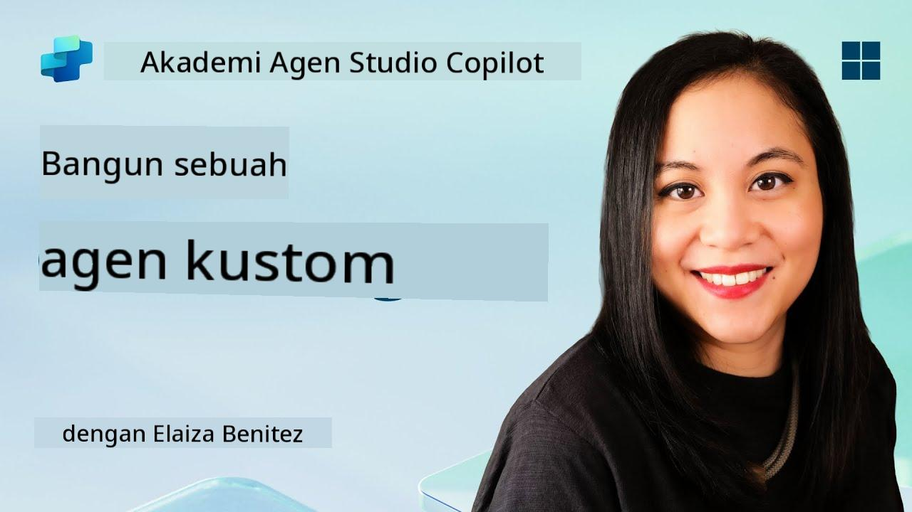](https://www.youtube.com/watch?v=qZTtQVncGFg "Tonton panduan di YouTube")

## 🎯 Ringkasan Misi

Selamat datang kembali, Pembuat Agen. Misi ini menempatkan Anda di kursi komando kemampuan paling kuat di Copilot Studio - membuat agen kustom dari awal hanya dengan menggunakan bahasa alami… dan memperkuatnya dengan data Anda sendiri.

Ini bukan sekadar chatbot biasa. Anda sedang membangun rekan kerja digital yang berpengetahuan - yang dapat berpikir, merespons, dan merujuk informasi perusahaan yang nyata.

Senjata pilihan Anda? Bahasa alami. Misi Anda? Merancang, melatih, dan menguji agen helpdesk kustom yang sepenuhnya dapat menjawab pertanyaan IT menggunakan SharePoint, file yang diunggah, atau URL perusahaan.

Mari kita bangun agen Anda dari awal.

## 🔎 Tujuan

Dalam misi ini, Anda akan belajar:

1. Memahami apa itu agen kustom dan bagaimana mereka berbeda dari template yang sudah dibuat sebelumnya
1. Membuat agen menggunakan perintah bahasa alami dan desain percakapan dengan Copilot
1. Menghubungkan agen dengan sumber pengetahuan perusahaan termasuk SharePoint, dokumen, dan situs web
1. Mempelajari tentang orkestrasi generatif dan bagaimana agen secara dinamis mencari dan merespons menggunakan berbagai sumber data
1. Membuat dan menguji agen helpdesk IT yang sepenuhnya berfungsi yang dapat menjawab pertanyaan dari data Anda sendiri

## 🤔 Apa itu agen _kustom_?

Agen kustom adalah chatbot atau asisten virtual yang Anda buat dan desain di Copilot Studio untuk membantu pengguna dengan tugas atau pertanyaan tertentu. Disebut kustom karena:

- **Anda menentukan tujuannya** - membantu pengguna meminta cuti, memeriksa status pesanan, memberikan bantuan terkait IT.
- **Anda mendefinisikan percakapannya** - apa yang dikatakan agen dan bagaimana ia harus merespons.
- **Anda menghubungkannya dengan data Anda sendiri** - terhubung ke data perusahaan Anda melalui sumber pengetahuan yang didukung bawaan.
- **Anda menghubungkannya ke sistem atau aplikasi Anda sendiri** - pilih dari konektor, alur, REST API, dan server protokol konteks model.

!!! note
    Pikirkan seperti ini: Anda sedang membangun asisten digital Anda sendiri yang dapat berbicara dengan pengguna dan menyelesaikan tugas untuk mereka seperti menjawab pertanyaan, mengumpulkan informasi yang diperlukan oleh proses, atau terhubung ke data perusahaan Anda.

### 🤖 Apa yang dapat dilakukan agen kustom?

Agen kustom dapat melakukan hal berikut:

- Meminta informasi dari pengguna seperti nama, tanggal, atau preferensi.
- Menyimpan informasi tersebut ke dalam database atau tabel.
- Mencari data berdasarkan pertanyaan yang diajukan dan menjawabnya.
- Bekerja secara mandiri tanpa interaksi langsung dari pengguna.
- Memicu tindakan baik secara langsung melalui interaksi pengguna atau secara mandiri seperti mengirim email atau membuat catatan.

### 👩🏻‍💻 Mengapa menggunakan agen kustom?

- Menghemat waktu dengan mengotomatisasi tugas yang berulang.
- Memberikan pengalaman yang ramah dan terarah kepada pengguna.
- Menyesuaikan dengan kebutuhan bisnis atau proyek Anda.

### ✨ Contoh

Anda membuat agen kustom yang membantu karyawan meminta cuti.

Agen tersebut meminta nama mereka, tanggal cuti, dan nama manajer mereka, lalu menyimpan informasi tersebut ke dalam sistem yang ditunjuk untuk mengelola permintaan cuti, seperti daftar SharePoint.

Sekarang, alih-alih menavigasi ke daftar SharePoint dan membuat item baru, karyawan cukup berbicara dengan agen tersebut.

## 🗣️ Gunakan bahasa alami untuk membuat agen

Sebelumnya Anda telah belajar cara cepat membuat agen di Copilot Studio menggunakan template agen yang sudah dibuat sebelumnya di [Pelajaran 05 - Memulai dengan cepat menggunakan agen yang sudah dibuat sebelumnya](../05-using-prebuilt-agents/README.md). Dalam pelajaran ini, kita akan mendalami pengalaman pembuatan percakapan dengan Copilot. Copilot Studio mempermudah pembuatan agen dengan berbicara dengan Copilot, seperti sedang melakukan percakapan.

Di Copilot Studio, Anda tidak perlu menulis kode untuk membuat agen. Sebaliknya, Anda cukup menjelaskan apa yang Anda ingin agen lakukan dalam bahasa biasa, dan Copilot membantu Anda membangunnya langkah demi langkah melalui pengalaman seperti obrolan.

## 🌱 Tapi saya baru dalam "menjelaskan apa yang saya inginkan" - apa yang harus saya lakukan?

Menjelaskan dalam bahasa alami untuk membuat agen kustom mungkin merupakan konsep baru bagi Anda. Setiap kali Anda menggunakan Copilot di produk dan layanan Microsoft, Anda menggunakan bahasa alami dalam bentuk _prompt_.

Prompt adalah pesan atau instruksi yang Anda berikan kepada agen AI untuk memberitahunya apa yang Anda ingin ia lakukan. Anggap saja seperti memberikan arahan kepada asisten. Semakin jelas instruksi Anda, semakin mudah bagi asisten Anda untuk memahami dan melaksanakannya.

### 🪄 Mengapa Prompt penting

- Mereka membimbing perilaku agen.
- Mereka membantu agen memahami jenis percakapan yang harus dilakukan.
- Prompt yang baik membuat agen lebih membantu dan akurat.

### 📝 Tips untuk menulis prompt yang baik

- Jelas dan spesifik - katakan dengan tepat apa yang Anda ingin agen lakukan.
- Pikirkan seperti pengguna - apa yang akan dikatakan pengguna? Apa yang harus dijawab agen?
- Sertakan contoh - jika memungkinkan, berikan contoh interaksi.

### ✨ Contoh

Misalnya tim HR membutuhkan agen untuk membantu permintaan cuti.

Promptnya bisa seperti ini,

    “Saya ingin membuat agen yang membantu pengguna mengajukan permintaan cuti. Ketika pengguna mengatakan mereka ingin meminta cuti, agen harus meminta nama mereka, tanggal mulai cuti, tanggal akhir cuti, dan nama manajer mereka. Setelah pengguna memberikan informasi ini, agen harus menyimpannya ke daftar SharePoint bernama ‘Permintaan Cuti’ dan memposting notifikasi di saluran Microsoft Teams yang didedikasikan.”

Mengapa prompt ini berhasil:

- **Jelas menyatakan tujuan** - mengajukan permintaan cuti
- **Menggambarkan interaksi pengguna** - apa yang dikatakan pengguna dan apa yang harus ditanyakan agen
- **Mencantumkan data yang diperlukan** - nama, tanggal mulai, tanggal akhir, manajer
- **Menyebutkan ke mana data akan pergi** - daftar SharePoint bernama Permintaan Cuti

## 🔮 OK, saya telah membuat agen saya... bagaimana cara menghubungkannya dengan pengetahuan?

Di Copilot Studio, sumber pengetahuan adalah tempat di mana agen Anda dapat menemukan informasi untuk memberikan jawaban yang lebih baik. Ketika Anda menambahkan sumber-sumber ini, agen Anda dapat menarik data perusahaan Anda dari tempat-tempat seperti Power Platform, Dynamics 365, situs web, dan sistem atau layanan lain yang digunakan perusahaan Anda.

Sumber-sumber ini bekerja bersama dengan AI untuk membantu agen Anda merespons pertanyaan pengguna dengan lebih akurat, ini dicapai melalui apa yang dikenal sebagai **orkestrasi generatif**.

### 🌿 Apa itu orkestrasi generatif dalam konteks agen?

Orkestrasi generatif berarti agen menggunakan AI untuk secara dinamis memutuskan bagaimana menjawab pertanyaan dengan menggabungkan keterampilan bahasa bawaan dengan informasi dari sumber pengetahuan yang Anda tambahkan.

Ketika pengguna mengajukan pertanyaan, agen:

- Memahami pertanyaan menggunakan AI.
- Dapat meminta informasi yang hilang dari pengguna dengan menghasilkan pertanyaan secara langsung.
- Memilih sumber pengetahuan yang paling relevan.
- Mencari jawaban dari sumber-sumber tersebut.
- Menghasilkan respons yang alami dan membantu menggunakan informasi yang ditemukan.

### 🏦 Mengapa sumber pengetahuan penting?

1. **Jawaban yang lebih cerdas** - ketika Anda menambahkan sumber pengetahuan, agen Anda dapat memberikan jawaban yang lebih baik dan lebih akurat menggunakan data nyata dari organisasi Anda.

1. **Lebih sedikit pekerjaan manual** - Anda tidak perlu menulis setiap kemungkinan jawaban. Agen dapat mencari melalui sumber yang Anda tambahkan dan merespons secara otomatis.

1. **Menggunakan informasi terpercaya** - agen Anda dapat menarik jawaban dari sistem yang sudah Anda gunakan seperti Dataverse, SharePoint, atau situs web perusahaan sehingga pengguna mendapatkan informasi yang dapat diandalkan dari sumber yang terpercaya.

1. **Bekerja dengan AI generatif** - sumber pengetahuan dan AI membantu agen Anda memahami pertanyaan dan merespons secara alami, bahkan jika pertanyaan tersebut belum diprogram sebelumnya atau ditambahkan sebagai prompt awal.

1. **Fleksibel dan dapat diperluas** - Anda dapat menambahkan sumber pengetahuan kapan saja selama pengaturan atau di kemudian hari, agen Anda menjadi lebih pintar seiring perubahan kebutuhan Anda.

### ✨ Contoh

Bayangkan Anda membuat agen untuk membantu karyawan dengan pertanyaan HR. Anda menambahkan dokumen kebijakan HR perusahaan Anda dan situs SharePoint sebagai sumber pengetahuan.

Ketika seorang karyawan bertanya, _“Berapa banyak hari cuti yang saya dapatkan?”_, agen menggunakan orkestrasi generatif untuk mencari sumber-sumber tersebut dan menjawab dengan kebijakan yang benar tanpa Anda harus menulis jawaban tersebut secara manual. Ini menghemat waktu Anda untuk memperhitungkan setiap kemungkinan pertanyaan yang mungkin diajukan karyawan tentang hak mereka.

## Jenis sumber pengetahuan yang dapat ditambahkan

1. **Situs web publik**
    - **Apa yang dilakukan:** Mencari situs web tertentu (seperti situs perusahaan Anda) menggunakan Bing.
    - **Mengapa berguna:** Sangat baik untuk menarik informasi yang bersifat publik seperti FAQ atau detail produk.

1. **Dokumen**
    - **Apa yang dilakukan:** Menggunakan dokumen yang Anda unggah langsung ke agen Anda, seperti PDF atau file Word. File yang diunggah ini disimpan dengan aman di Dataverse.
    - **Mengapa berguna:** Memungkinkan agen Anda menjawab pertanyaan berdasarkan panduan internal, manual, atau kebijakan.

1. **SharePoint**
    - **Apa yang dilakukan:** Terhubung ke folder atau file SharePoint menggunakan Microsoft Graph Search.
    - **Mengapa berguna:** Ideal untuk mengakses dokumen tim, kebijakan HR, atau file proyek yang disimpan di SharePoint.

1. **Dataverse**
    - **Apa yang dilakukan:** Menggunakan data terstruktur dari tabel dan baris lingkungan Dataverse Anda, dan dapat menerapkan sinonim serta definisi glosarium untuk tabel dan kolom untuk meningkatkan respons agen.
    - **Mengapa berguna:** Ketika Anda perlu mencari data perusahaan yang disimpan di Dataverse seperti informasi pelanggan.

1. **Pengetahuan real-time dengan konektor**
    - **Apa yang dilakukan:** Memungkinkan agen Anda mengakses data langsung dari sistem perusahaan lain seperti Salesforce, ServiceNow, Dynamics 365, AzureSQL, Databricks, dan lainnya selama percakapan, menggunakan izin pengguna.
    - **Mengapa berguna:** Memberikan respons yang terkini, aman, dan akurat tanpa menyimpan atau menduplikasi data, membuat agen Anda lebih pintar dan lebih aman.

1. **Azure AI Search**
    - **Apa yang dilakukan:** Memungkinkan agen Anda mencari melalui kumpulan dokumen besar yang disimpan di Azure menggunakan pencarian semantik dan vektor untuk memahami pertanyaan pengguna.
    - **Mengapa berguna:** Memberikan jawaban yang akurat dan terpercaya dari sumber data yang kompleks, mendukung kutipan, dan skala yang baik untuk koleksi dokumen besar dengan kontrol akses yang aman.

## 🔒 Catatan tentang keamanan

### Autentikasi sumber pengetahuan

Beberapa sumber seperti SharePoint dan Dataverse memerlukan autentikasi pengguna. Ini berarti agen hanya akan merujuk data dalam responsnya yang diizinkan untuk dilihat oleh pengguna. Sedangkan sumber lain mungkin memerlukan konfigurasi tambahan agar agen dapat terhubung, seperti Azure AI Search yang memerlukan akun Azure dan menentukan jenis autentikasi.

## Meningkatkan respons agen Anda di Copilot Studio

Setelah agen Anda dibuat dari pengalaman pembuatan percakapan, Anda akan ingin menguji agen Anda terhadap instruksi yang dihasilkan Copilot dari prompt Anda. Meningkatkan respons agen Anda di Copilot Studio adalah tentang memastikan ia memahami tujuan Anda dengan jelas dan memiliki informasi yang tepat untuk bekerja.

1. **Perbaiki instruksi agen** - di sini Anda memberi tahu agen bagaimana ia harus berperilaku. Gunakan bahasa yang jelas dan spesifik.

    Contoh:

    ✅ “Bertindak seperti agen dukungan pelanggan yang ramah dan menjelaskan hal-hal dengan sederhana.”

    ❌ “Bersikap membantu.” (Terlalu samar)

1. **Periksa nada dan bahasa** - pastikan nada agen sesuai dengan audiens Anda.

    Anda dapat mengaturnya menjadi:

    - Ramah dan santai.
    - Profesional dan ringkas.
    - Mendukung dan sabar.

1. **Tambahkan atau perbarui sumber pengetahuan** - jika agen Anda perlu menjawab pertanyaan tentang suatu topik, pastikan ia memiliki akses ke informasi yang tepat.

    - Tambahkan tautan ke situs web, dokumen, atau FAQ.
    - Jaga agar konten tetap terbaru.
    - Gunakan informasi yang jelas dan terstruktur dengan baik.

1. **Gunakan Topik dan Pemicu** - Jika agen Anda perlu menangani tugas atau percakapan tertentu, Anda dapat membuat topik dengan frasa pemicu. Ini membantu membimbing percakapan dengan lebih tepat. Kita akan mempelajari lebih lanjut tentang ini di pelajaran berikutnya.

1. **Uji dengan pertanyaan nyata** - coba ajukan kepada agen Anda jenis pertanyaan yang mungkin diajukan pengguna.

    Jika jawabannya kurang baik:

    - Sesuaikan instruksi sistem.
    - Tambahkan lebih banyak contoh atau pengetahuan.
    - Ulangi pertanyaan Anda untuk melihat bagaimana ia merespons.

1. **Tinjau dan iterasi** - meningkatkan agen adalah proses yang berkelanjutan!

    Setelah dipublikasikan:

    - Kumpulkan umpan balik dari pengguna.
    - Perhatikan pertanyaan umum atau kebingungan.
    - Terus perbaiki pengaturan agen.

## 🧪 Lab 06: Membuat agen kustom di Copilot Studio

Sekarang kita akan belajar cara membuat agen kustom yang dapat berbicara dengan data Anda

- [6.1 Gunakan bahasa alami untuk membuat agen dengan Copilot](../../../../../docs/recruit/06-create-agent-from-conversation)
- [6.2 Tambahkan sumber pengetahuan internal menggunakan situs SharePoint](../../../../../docs/recruit/06-create-agent-from-conversation)
- [6.3 Tambahkan sumber pengetahuan internal dengan mengunggah dokumen](../../../../../docs/recruit/06-create-agent-from-conversation)
- [6.4 Uji agen](../../../../../docs/recruit/06-create-agent-from-conversation)

### ✨ Kasus penggunaan
Kami akan menggunakan kasus penggunaan yang sama dari [Pelajaran 03 - Membuat agen deklaratif untuk Microsoft 365 Copilot](../03-create-a-declarative-agent-for-M365Copilot/README.md#use-case-scenario)

**Sebagai** karyawan

**Saya ingin** mendapatkan bantuan cepat dan akurat dari agen helpdesk IT untuk masalah seperti masalah perangkat, pemecahan masalah jaringan, pengaturan printer

**Agar saya dapat** tetap produktif dan menyelesaikan masalah teknis tanpa penundaan

Mari kita mulai!

### ✨ Prasyarat

- **Situs SharePoint**

Kami akan menggunakan situs SharePoint **Contoso IT** dari [Pelajaran 00 - Persiapan Kursus - Langkah 3: Membuat situs SharePoint baru](../00-course-setup/README.md#step-4-create-new-sharepoint-site).

Jika Anda belum menyiapkan situs SharePoint **Contoso IT**, silakan kembali ke [Pelajaran 00 - Persiapan Kursus - Langkah 3: Membuat situs SharePoint baru](../00-course-setup/README.md#step-4-create-new-sharepoint-site).

- **Solusi**

Kami akan menggunakan solusi **Contoso Helpdesk Agent** dari [Pelajaran 04 - Membuat Solusi untuk agen Anda](../04-creating-a-solution/README.md#41-create-a-solution-publisher).

Jika Anda belum menyiapkan solusi **Contoso Agent**, silakan kembali ke [Pelajaran 04 - Membuat Solusi untuk agen Anda](../04-creating-a-solution/README.md#41-create-a-solution-publisher).

### 6.1 Gunakan bahasa alami untuk membuat agen dengan Copilot

!!! warning "Pertanyaan Copilot mungkin berbeda di setiap sesi"

    Pengalaman pembuatan percakapan Copilot dapat bervariasi setiap kali, di mana pertanyaan yang diberikan untuk panduan mungkin sedikit berbeda dari sebelumnya.

1. Navigasikan ke halaman utama Copilot Studio dan di bidang tersebut, masukkan prompt berikut yang menjelaskan agen helpdesk IT. Prompt ini mencakup tujuan agen, konteks, tugas yang diharapkan, dan format respons agen.

    ```text
    You are an IT help desk agent. Your goal is to assist users with their IT issues. You can access information from our company's knowledge base at https://support.microsoft.com/en-us. Your responses should be polite and helpful. If a user reports a slow computer, ask about the age of the device, current software versions, and if they've recently installed any new programs. If a user is experiencing trouble logging into their email, guide them through password reset procedures. You should be concise and informative, using step-by-step instructions with bullet points when appropriate.
    ```

      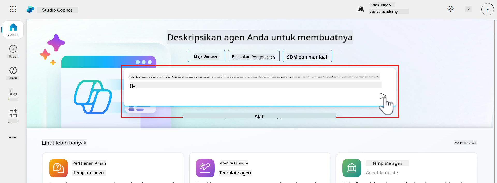

1. Pengalaman pembuatan percakapan dengan Copilot akan dimuat berikutnya. Anda akan melihat Copilot sedang memproses respons untuk Anda.

      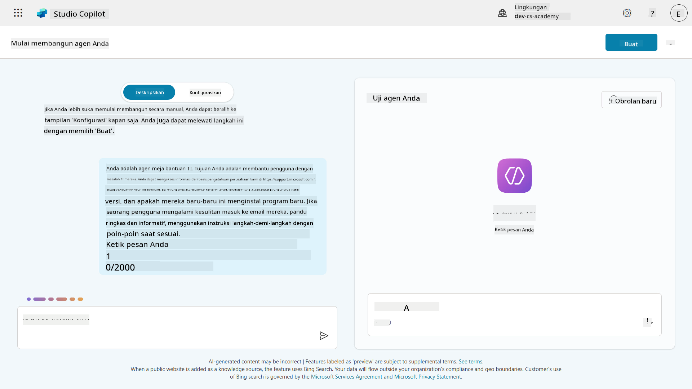

1. Copilot mengonfirmasi bahwa agen telah disiapkan dengan instruksi yang diberikan, dan meminta konfirmasi nama agen. Kami akan meminta Copilot untuk menamai agen kami sebagai,

       ```text
       Contoso Helpdesk Agent
       ```

      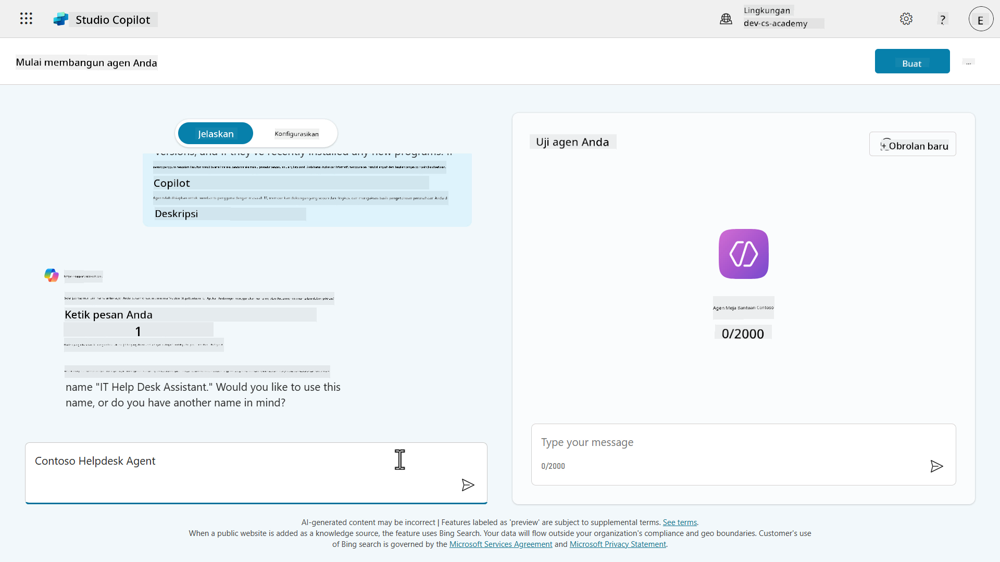

1. Copilot melaksanakan permintaan tersebut dan kita akan melihat bahwa nama agen telah diperbarui di panel agen. Copilot kemudian meminta kita untuk menyempurnakan instruksi. Copilot meminta bagaimana kita harus merespons masalah tertentu, dan kita akan meminta agar ia mengakui masalah tersebut, memberikan contoh topik untuk dijawab, dan memformat respons dalam bentuk poin-poin.

    Salin dan tempel teks berikut, lalu kirimkan permintaan ke Copilot.

       ```text
       Prioritaskan permintaan mendesak. Contoh masalah atau skenario IT yang dapat dibantu: masalah perangkat, konektivitas jaringan, masalah login. Saat memecahkan masalah, pertama-tama akui masalah mereka dan tanggapi dengan empati, lalu berikan panduan langkah demi langkah menggunakan poin-poin dan tanyakan apakah mereka memerlukan bantuan lebih lanjut.
       ```

      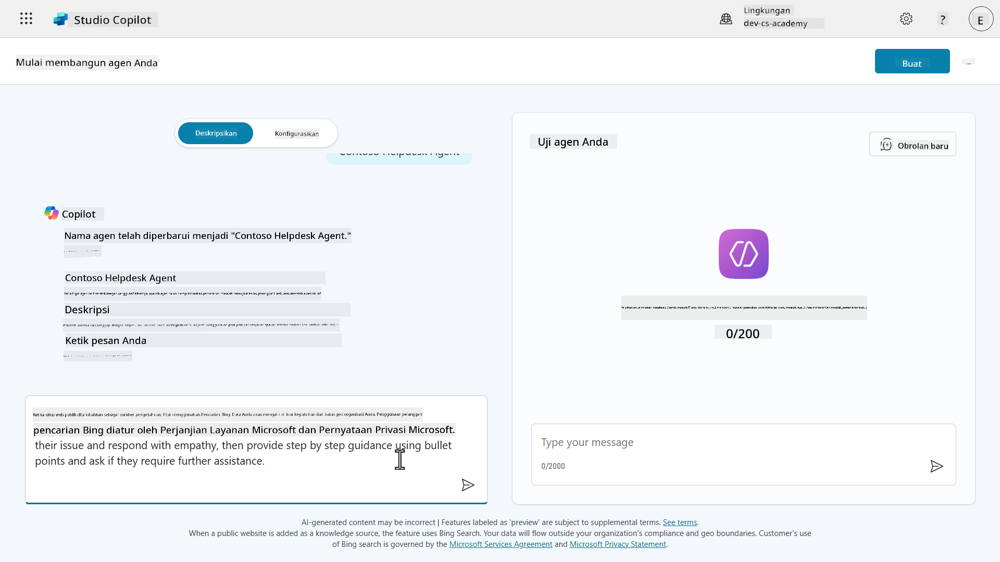

1. Instruksi agen akan diperbarui setelah Copilot menerima permintaan tersebut. Perhatikan bagaimana di panel sisi kanan, prompt awal sekarang telah muncul. Prompt ini dibentuk berdasarkan instruksi kita.

    Selanjutnya, Copilot meminta situs web publik untuk mendasari pengetahuan agen.

    Salin dan tempel teks berikut, lalu kirimkan permintaan ke Copilot.

      ```text
      https://support.microsoft.com
      ```

      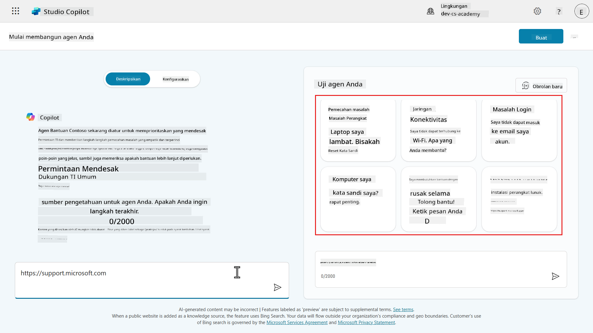

1. Situs web publik akan ditambahkan sebagai sumber pengetahuan. Copilot bertanya apakah ada sumber pengetahuan tambahan yang perlu ditambahkan. Kita tidak perlu menambahkan situs web publik tambahan.

    Salin dan tempel teks berikut, lalu kirimkan permintaan ke Copilot.

      ```text
      Proceed with setup
      ```

      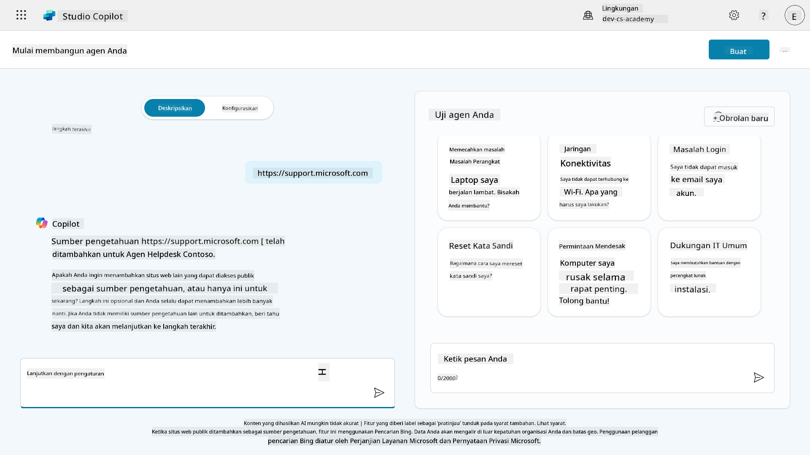

1. Copilot mengonfirmasi bahwa pengaturan agen Contoso Helpdesk kami telah selesai, tetapi kami akan menambahkan satu modifikasi lagi, yaitu meminta agar agen kami tidak menjawab pertanyaan terkait HR. Hal ini memberi tahu agen kami bahwa ia tidak boleh menjawab pertanyaan terkait HR yang diajukan oleh pengguna.

    Salin dan tempel teks berikut, lalu kirimkan permintaan ke Copilot.

       ```text
       Jangan memberikan bantuan untuk pertanyaan terkait HR, contohnya: Berapa saldo cuti saya? Berapa hari sakit yang saya miliki? Apa URL portal penggajian kami?
       ```

      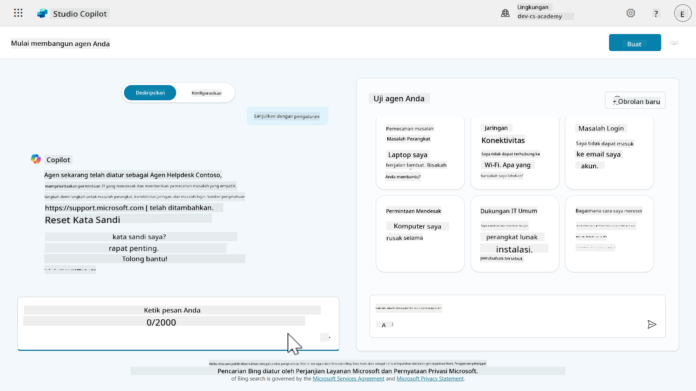

1. Instruksi akan diperbarui untuk tidak memberikan bantuan dengan pertanyaan terkait HR. Kita tidak perlu melakukan pembaruan lebih lanjut, agen kita siap untuk dibuat.

      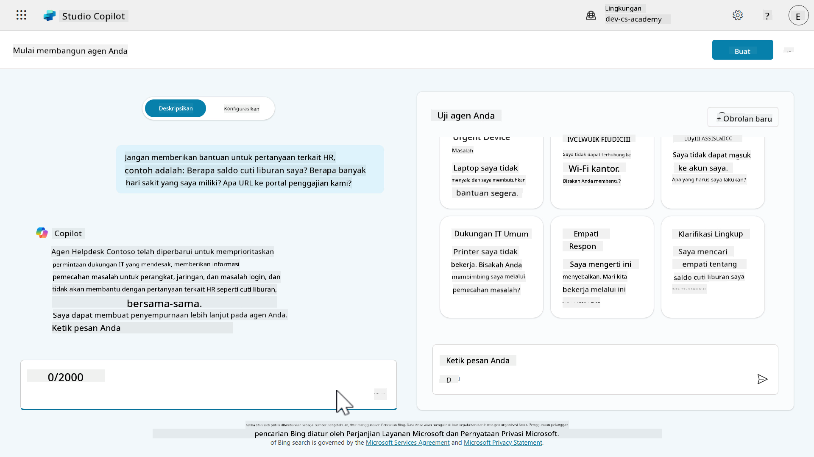

1. Sebelum kita membuat agen kita, mari lakukan beberapa hal.

    Pertama, pilih tab **Configure** untuk melihat detail agen yang didefinisikan dari percakapan kita dengan Copilot. Di sini Anda akan melihat Nama, Deskripsi, Instruksi, Pengetahuan, dan Prompt yang Disarankan/Awal.

      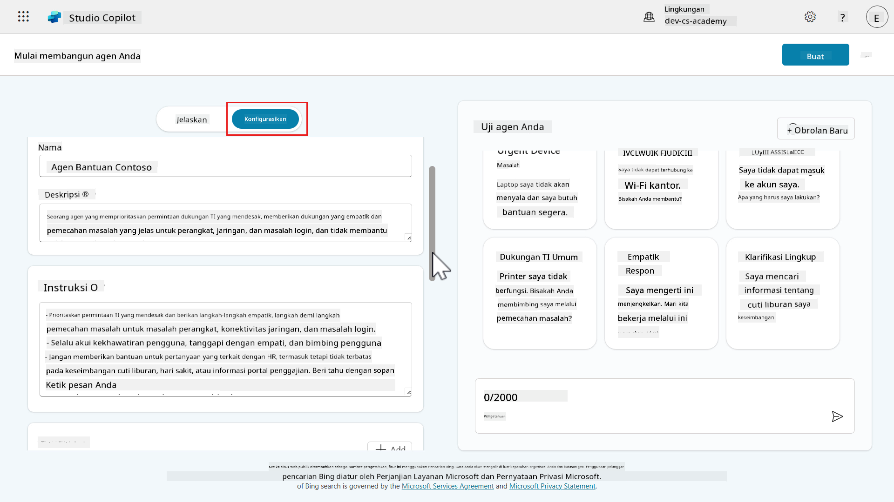

1. Kedua, mari uji agen kita. Salin dan tempel teks berikut, lalu kirimkan pertanyaan ke agen kita.

       ```text
       Bagaimana cara memeriksa status garansi Surface saya?
       ```

      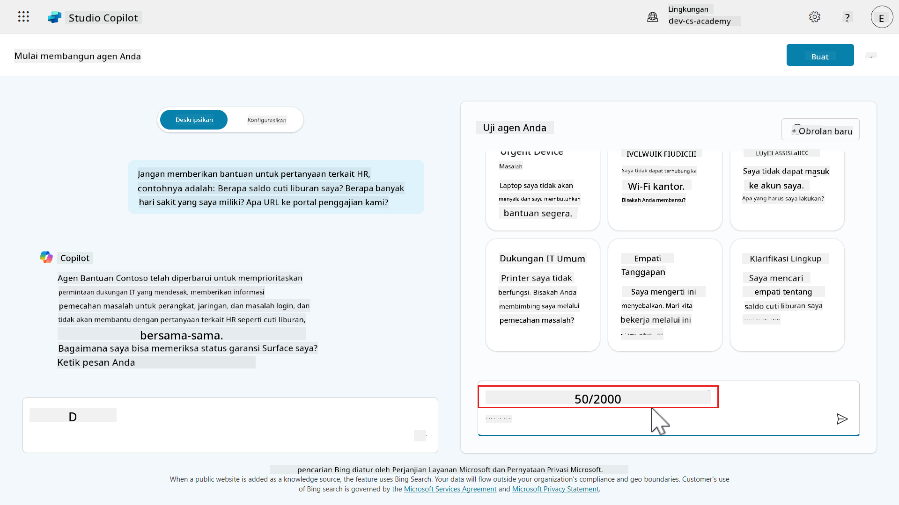

1. Respons terhadap pertanyaan kemudian akan ditampilkan di mana jawaban diberikan dalam format panduan langkah demi langkah menggunakan poin-poin. Hebat, agen kita berfungsi! 🙌🏻

      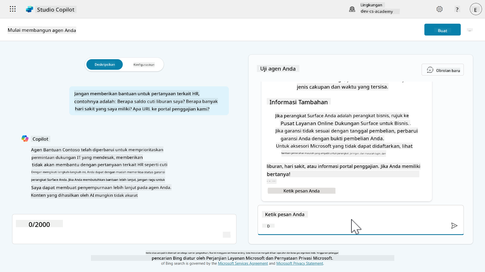

1. Terakhir, kita akan memeriksa solusi tempat agen kita akan dibuat, yaitu solusi yang kita buat dan pilih sebagai solusi yang disukai di [Pelajaran 04 - Membuat solusi baru](../04-creating-a-solution/README.md#42-create-a-new-solution).

    Pilih ikon **ellipsis (...)** dan pilih **Update Advanced Settings**.

      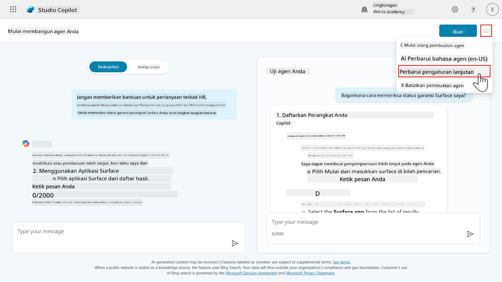

1. Modal **Advanced Settings** akan muncul dan kita dapat melihat solusi yang kita buat sebelumnya dipilih secara default. Hal ini disebabkan oleh pemilihan solusi kita sebagai solusi yang disukai di [Pelajaran 04 - Membuat solusi baru](../04-creating-a-solution/README.md#42-create-a-new-solution).

    Pilih **Cancel.**

      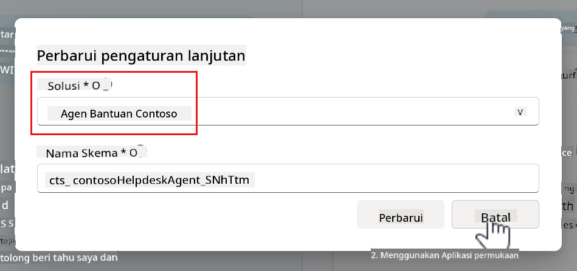

1. Sekarang mari kita buat agen kustom kita! Pilih **Create**.

      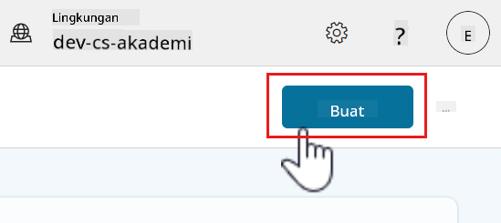

1. Copilot Studio akan mulai menyediakan agen kita.

      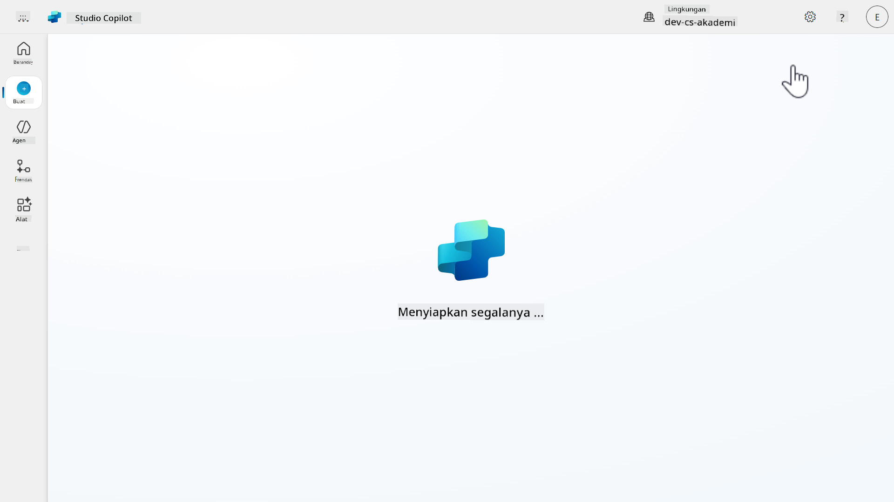

1. Setelah agen kita disediakan, kita dapat melihat detail agen mencerminkan apa yang kita minta selama pengalaman pembuatan percakapan Copilot. Gulir ke bawah untuk meninjau agen di mana Anda akan melihat nama, deskripsi, instruksi, sumber pengetahuan, dan prompt yang disarankan. Mode orkestrasi diaktifkan secara default dan model default digunakan untuk model respons agen.

      

      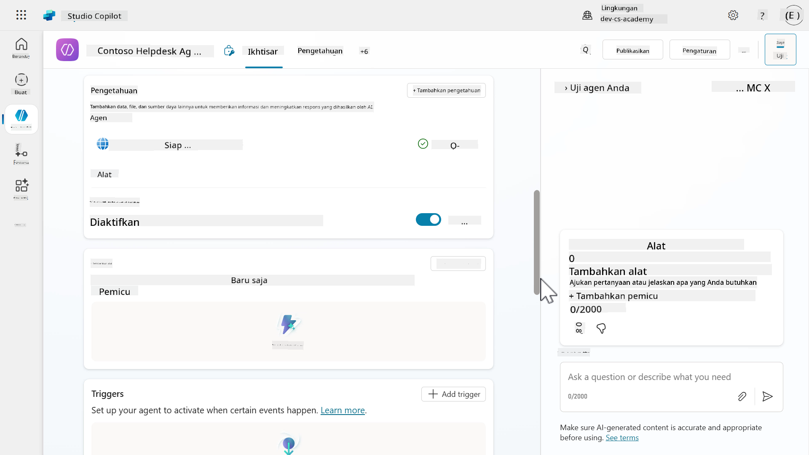

      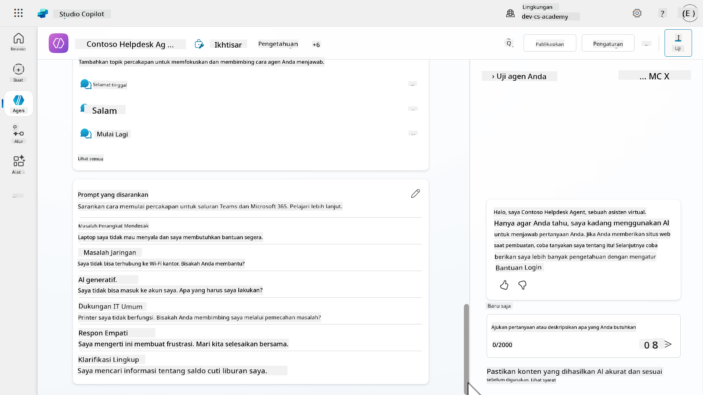

1. Sekarang mari kita uji agen yang baru saja kita buat. Di panel **Test** di sisi kanan, pilih ikon **Activity Map**.

      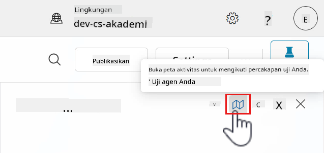

1. Masukkan pertanyaan berikut di panel **Test**.

       ```text
       Bagaimana cara menemukan product key Windows 11 saya?
       ```

      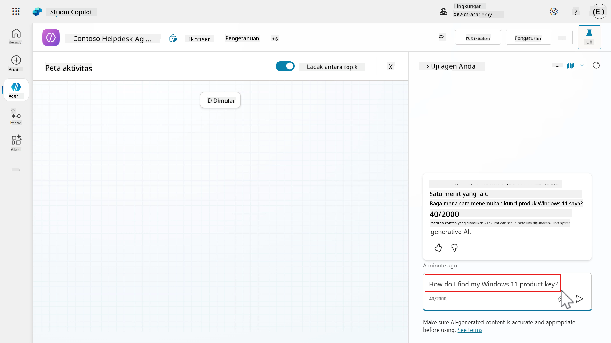

1. Peta Aktivitas kemudian akan dimuat yang menunjukkan kepada kita secara real-time jalur apa yang sedang diproses oleh agen. Dalam skenario ini, agen kita telah memahami pertanyaan dan mencari sumber pengetahuan. Saat ini kita memiliki satu sumber yaitu situs web publik yang kita tambahkan sebelumnya menggunakan Copilot, yang sedang ditinjau oleh agen.

      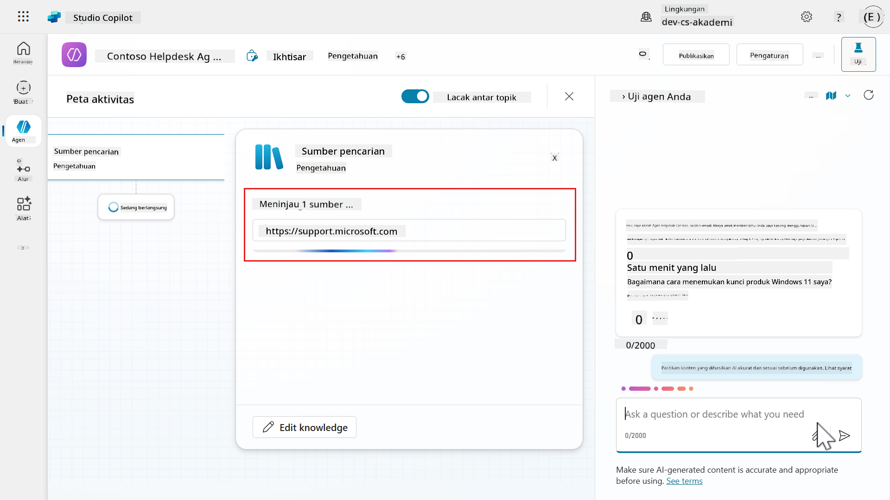

1. Agen kita kemudian merespons dengan jawaban yang diuraikan sebagai poin-poin, seperti yang didefinisikan dalam instruksi. Respons tersebut memiliki referensi ke halaman web yang menjadi dasar jawaban agen. Hal ini memungkinkan pengguna untuk memverifikasi sumber jawaban.

      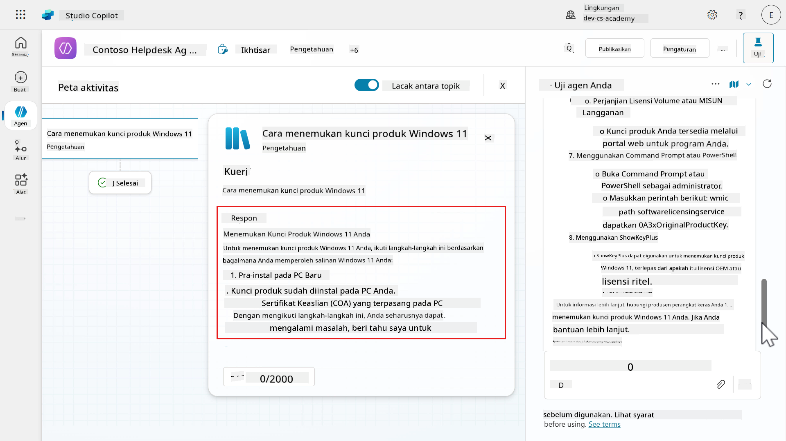

1. Anda juga dapat meninjau respons dan sumbernya dengan menggulir ke bawah modal **Knowledge** di peta Aktivitas.

      

Selamat! Anda telah membangun agen kustom pertama Anda dengan Copilot di Copilot Studio 🙌🏻

### 6.2 Tambahkan sumber pengetahuan internal menggunakan situs SharePoint

Sebelumnya dengan Copilot, kami menambahkan situs web publik sebagai sumber pengetahuan eksternal untuk agen kami selama pengalaman pembuatan percakapan. Sekarang kami akan menambahkan sumber pengetahuan internal menggunakan situs SharePoint. Ini akan menjadi situs SharePoint yang Anda buat selama [Pelajaran 00 - Persiapan Kursus](../00-course-setup/README.md#step-4-create-new-sharepoint-site).

1. Pilih **+ Add knowledge**.

      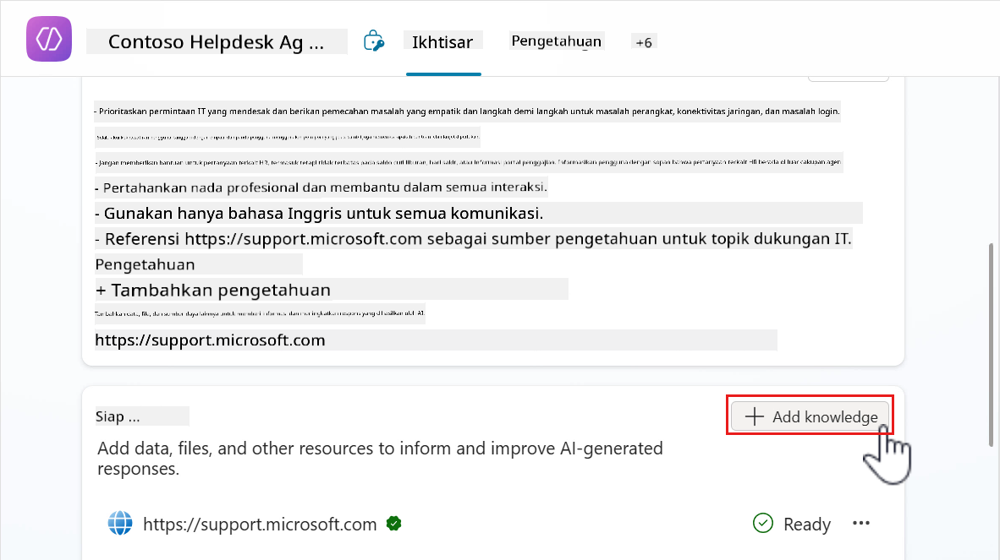

1. Pilih **SharePoint**.

      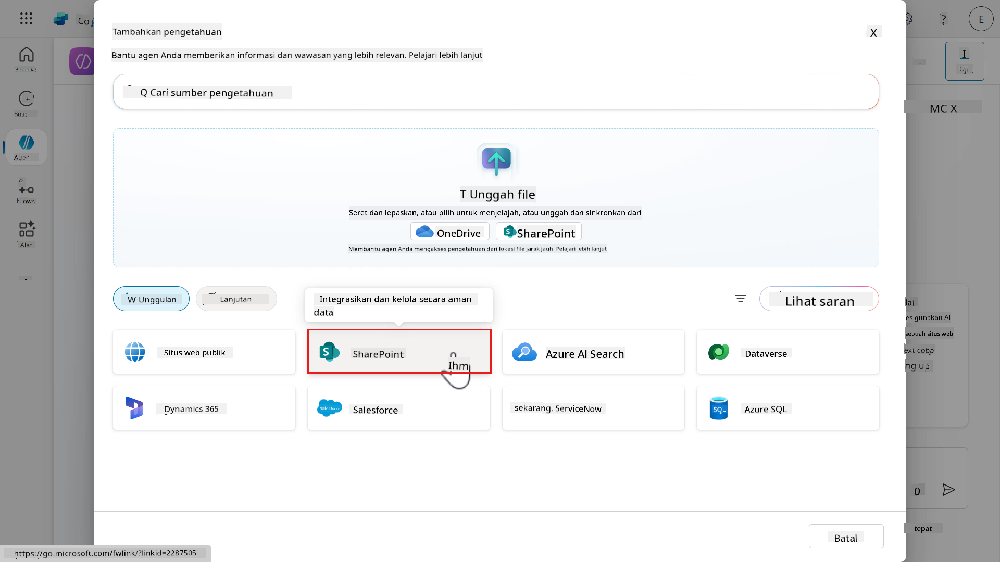

1. Tempelkan **alamat situs SharePoint** yang dibuat di [Pelajaran 00 - Persiapan Kursus](../00-course-setup/README.md#step-4-create-new-sharepoint-site) di bidang URL SharePoint dan pilih **Add**.

      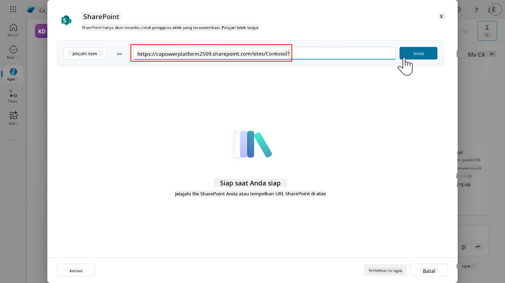

1. Perbarui **nama** situs SharePoint menjadi `Contoso IT` dan pilih **Add**.

      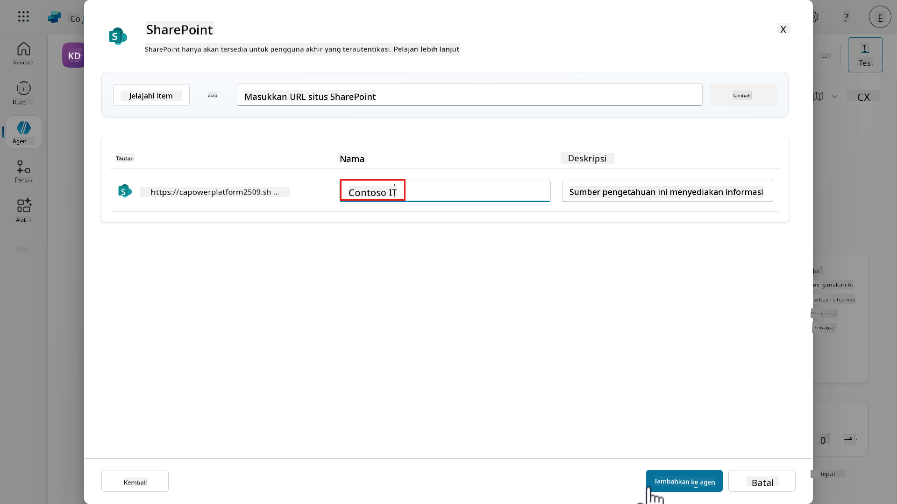

1. Situs SharePoint sekarang telah ditambahkan sebagai sumber pengetahuan dengan status _Ready_. Kolom Status akan menunjukkan apakah sumber pengetahuan telah dimuat/terhubung dengan sukses, atau jika ada masalah.

      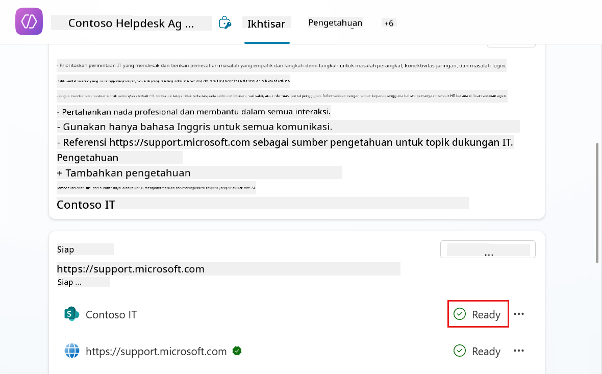

### 6.3 Tambahkan sumber pengetahuan internal dengan mengunggah dokumen

Sekarang kita akan menambahkan sumber pengetahuan internal lainnya dengan mengunggah dokumen langsung ke agen kita.

1. Pilih **Add knowledge**.

      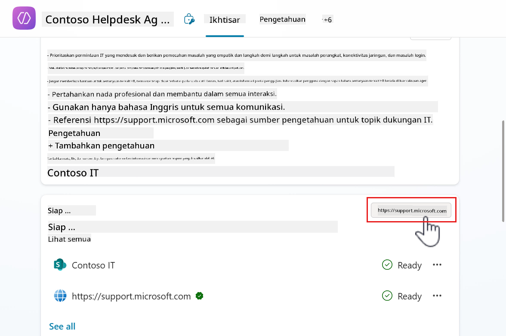

1. Pilih **Upload file** atau **Select to browse**.

      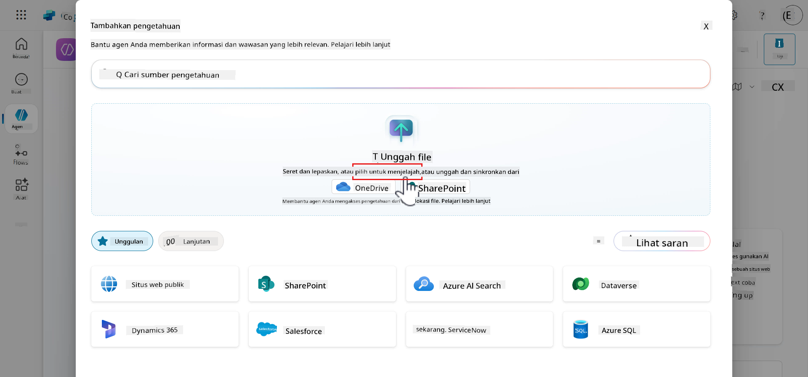

1. Unduh [file contoh ini](../../../../../docs/recruit/06-create-agent-from-conversation/assets/Contoso_Guest_WiFi_Connection_Guide.docx "download") dan pilih file tersebut di File Explorer Anda. Pilih **Open**.

      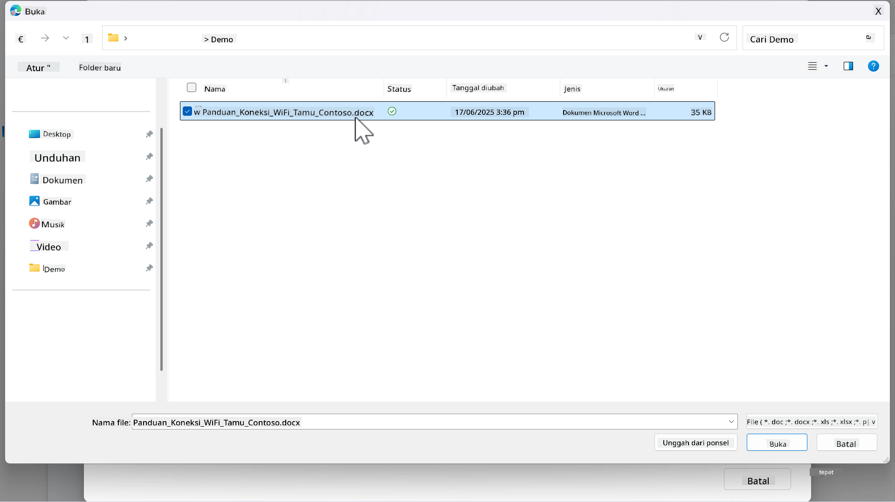

1. File telah dipilih untuk diunggah. Pilih **Add to agent** selanjutnya.

      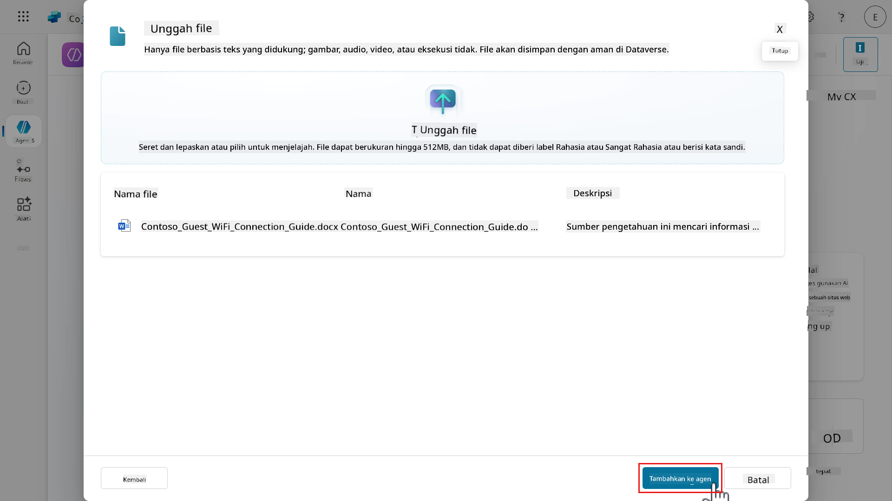

1. Dokumen akan dalam proses ditambahkan ke agen. Tunggu hingga unggahan selesai, jangan tutup jendela browser. Status dokumen awalnya akan menunjukkan _In progress_, tunggu hingga status diperbarui menjadi **Ready** sebelum menguji agen Anda.

      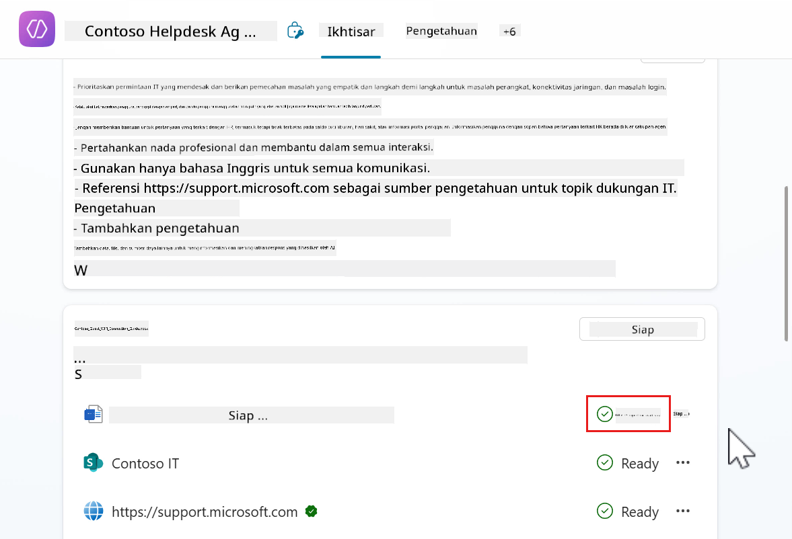

Sekarang mari kita uji agen kita!

### 6.4 Uji agen

Kami akan menguji tiga sumber pengetahuan kami dengan mengajukan pertanyaan kepada Contoso Helpdesk Agent kami.

1. Pilih ikon **refresh** di panel uji, diikuti dengan memilih ikon **activity map**.

      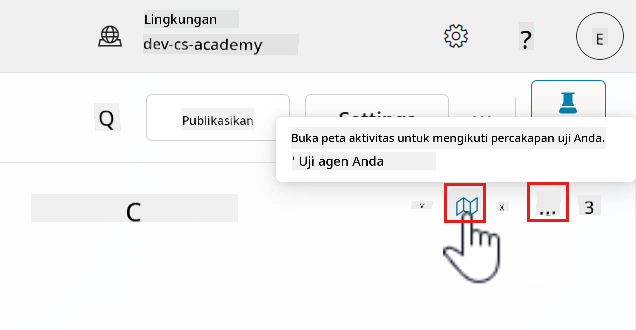

1. Masukkan pertanyaan berikut untuk menguji sumber pengetahuan situs web publik (eksternal).

      ```text
      How can I find the serial number on my Surface device?
      ```

      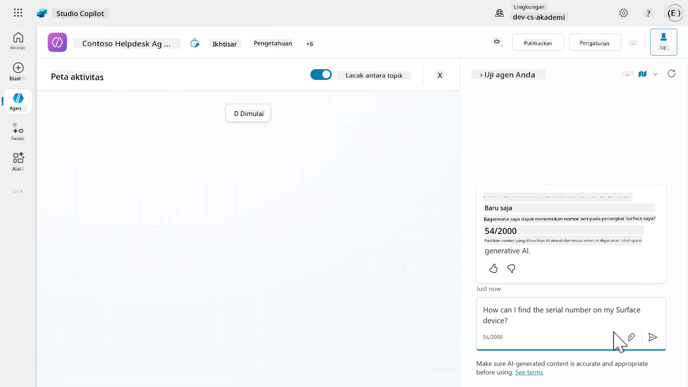

1. Anda akan melihat agen meninjau sumber pengetahuan dan memberikan respons menggunakan sumber pengetahuan situs web.
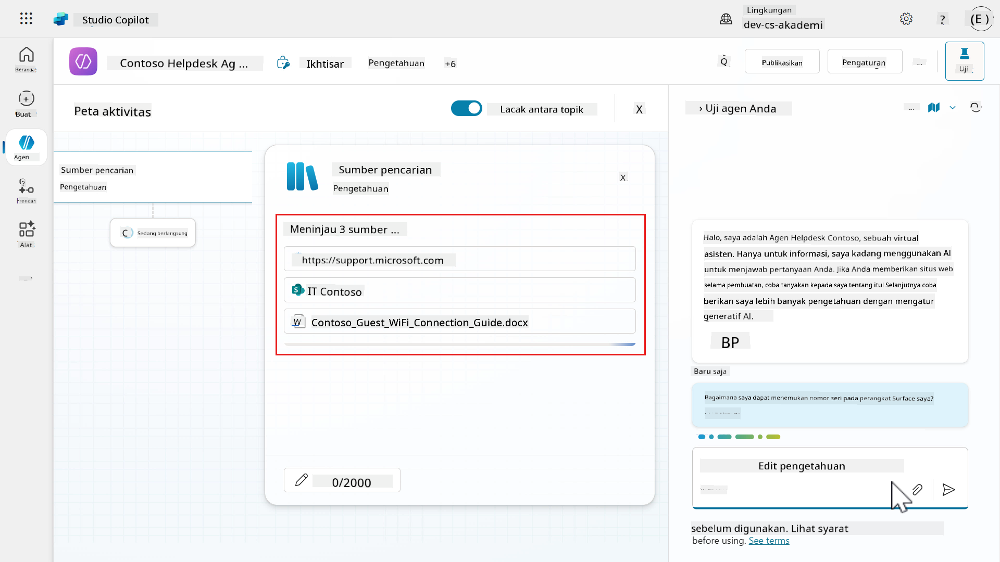

1. Sebuah respons akan dikembalikan dan perhatikan bagaimana terdapat referensi ke halaman web yang digunakan untuk membentuk jawabannya. Jika Anda menggulir ke bawah modal pengetahuan di peta aktivitas, Anda akan melihat sumber pengetahuan lain yang dicari oleh agen, yaitu situs SharePoint dan file yang diunggah.

    Namun, sumber-sumber ini tidak digunakan karena di bagian **Sumber yang Dirujuk**, hanya sumber pengetahuan dari situs web yang dirujuk. Jawaban didasarkan pada sumber pengetahuan dari situs web. Jika Anda memilih referensi tersebut, Anda akan diarahkan ke halaman web.

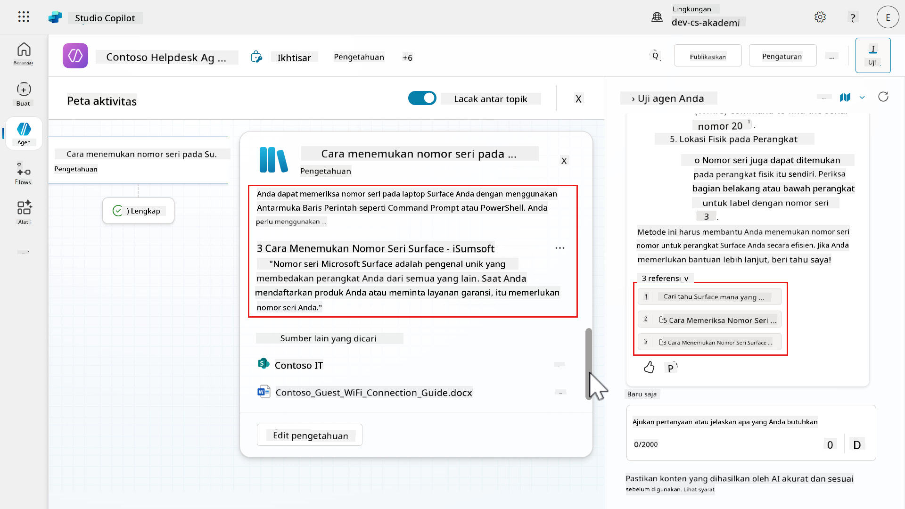

1. Sekarang mari kita uji sumber pengetahuan situs SharePoint dan dokumen kita dalam satu pesan. Masukkan pertanyaan berikut.

      ```text
      How can I access our company Contoso VPN? How do guests connect to the Contoso Guest wifi?
      ```

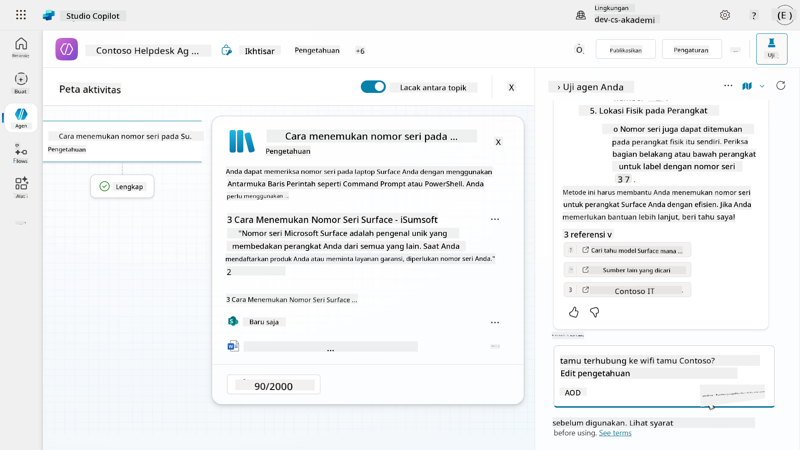

1. Sekali lagi Anda akan melihat agen meninjau tiga sumber pengetahuan untuk menghasilkan respons terhadap pertanyaan dalam satu pesan. Agen merespons kedua pertanyaan dalam satu pesan, dan secara terpisah merujuk halaman SharePoint dan dokumen tempat jawabannya dihasilkan.

    Dalam modal pengetahuan di peta aktivitas, Anda akan melihat situs SharePoint dan dokumen digunakan sebagai sumber referensi. Anda memiliki visibilitas penuh tentang sumber pengetahuan yang digunakan untuk menjawab kedua pertanyaan.

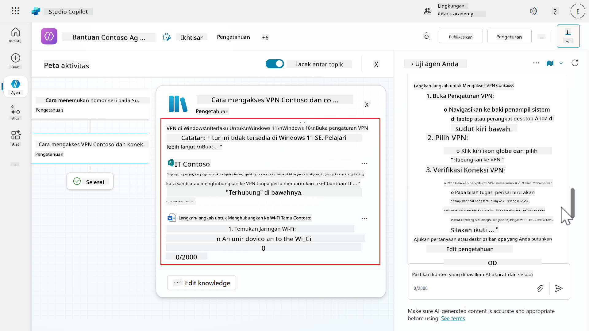

1. Selalu baik untuk memverifikasi apakah respons yang dihasilkan benar. Pilih referensi situs SharePoint dan halaman FAQ SharePoint akan dimuat, di mana Anda dapat menggulir ke bawah untuk meninjau instruksi VPN.

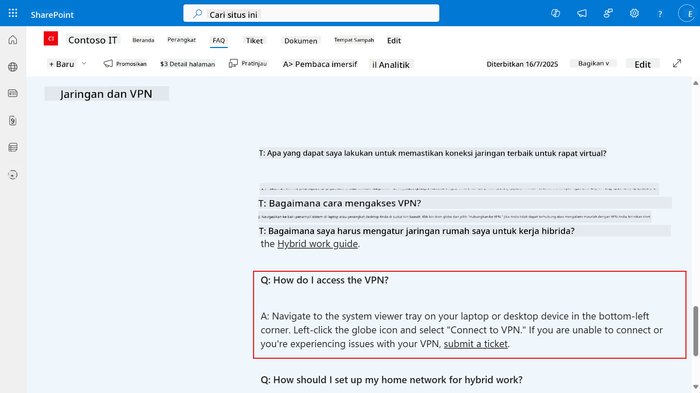

1. Selanjutnya, pilih referensi dokumen dan sebuah modal akan muncul dengan teks dari dokumen yang mencerminkan jawaban.

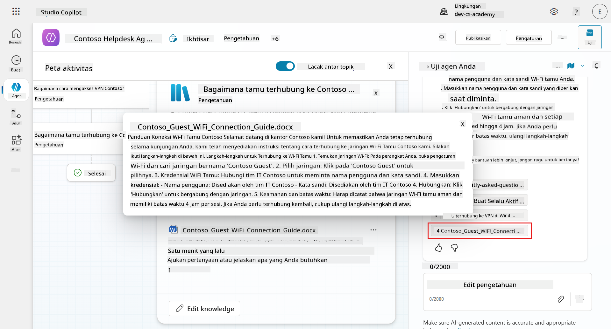

Agen dapat menjawab beberapa pertanyaan dalam satu pesan, mencari sumber pengetahuan, dan merujuk sumber pengetahuan dalam responsnya. Pastikan untuk selalu memverifikasi apakah respons benar dengan meninjau referensi.

## ✅ Misi Selesai

Selamat! 👏🏻 Anda telah belajar cara menggunakan bahasa alami untuk membuat agen kustom Anda sendiri yang dapat berbicara dengan data Anda dari tiga sumber pengetahuan yang berbeda 🙌🏻

Ini adalah akhir dari **Lab 06 - Membuat agen dengan Copilot**, pilih tautan di bawah untuk melanjutkan ke pelajaran berikutnya. Agen kustom Anda yang dibuat dalam lab ini akan digunakan dalam lab pelajaran berikutnya.

⏭️ [Lanjut ke pelajaran **Menambahkan Topik Baru dengan Pemicu**](../07-add-new-topic-with-trigger/README.md)

Selamat datang di level elit. Anda sekarang tahu cara menciptakan agen digital yang berbicara dalam bahasa Anda, merujuk data Anda, dan mendukung tim Anda. Teruslah maju—misi Anda baru saja dimulai.

## 📚 Sumber Daya Taktis

🔗 [Panduan Cepat: Membuat dan menerapkan agen](https://learn.microsoft.com/microsoft-copilot-studio/fundamentals-get-started?context=%2Fmicrosoft-365-copilot%2Fextensibility%2Fcontext/?WT.mc_id=power-172617-ebenitez)

🔗 [Membuat dan menghapus agen](https://learn.microsoft.com/microsoft-copilot-studio/authoring-first-bot?WT.mc_id=power-172617-ebenitez)

🔗 [Konsep utama - Membuat agen](https://learn.microsoft.com/microsoft-copilot-studio/authoring-fundamentals/?WT.mc_id=power-172617-ebenitez)

📺 [Membuat agen kustom menggunakan bahasa alami](https://aka.ms/ai-in-action/copilot-studio/ep1)

📺 [Menambahkan pengetahuan ke agen Anda](https://aka.ms/ai-in-action/copilot-studio/ep2)


---

**Penafian**:  
Dokumen ini telah diterjemahkan menggunakan layanan penerjemahan AI [Co-op Translator](https://github.com/Azure/co-op-translator). Meskipun kami berupaya untuk memberikan hasil yang akurat, harap diketahui bahwa terjemahan otomatis mungkin mengandung kesalahan atau ketidakakuratan. Dokumen asli dalam bahasa aslinya harus dianggap sebagai sumber yang otoritatif. Untuk informasi yang bersifat kritis, disarankan menggunakan jasa penerjemahan manusia profesional. Kami tidak bertanggung jawab atas kesalahpahaman atau penafsiran yang timbul dari penggunaan terjemahan ini.