<!--
CO_OP_TRANSLATOR_METADATA:
{
  "original_hash": "cd99a76bcb7372ac2771b6ae178b023d",
  "translation_date": "2025-10-17T17:15:05+00:00",
  "source_file": "docs/recruit/10-add-event-triggers/README.md",
  "language_code": "id"
}
-->
# 🚨 Misi 10: Tambahkan Pemicu Acara - Aktifkan kemampuan agen otonom

## 🕵️‍♂️ NAMA KODE: `OPERASI RUTIN HANTU`

> **⏱️ Jangka Waktu Operasi:** `~45 menit`

🎥 **Tonton Panduan**

[](https://www.youtube.com/watch?v=ZgwHL8PQ1nY "Tonton panduan di YouTube")

## 🎯 Ringkasan Misi

Saatnya meningkatkan agen Anda dari asisten percakapan menjadi operator otonom. Misi Anda adalah memungkinkan agen Anda bertindak tanpa dipanggil - merespons sinyal dari seluruh domain digital Anda dengan presisi dan kecepatan.

Dengan Pemicu Acara, Anda akan melatih agen Anda untuk memantau sistem eksternal seperti SharePoint, Teams, dan Outlook, serta menjalankan tindakan cerdas saat sinyal diterima. Operasi ini mengubah agen Anda menjadi aset lapangan yang sepenuhnya operasional - diam, cepat, dan selalu mengawasi.

Keberhasilan berarti membangun agen yang memulai nilai - bukan hanya meresponsnya.

## 🔎 Tujuan

📖 Pelajaran ini akan mencakup:

- Memahami Pemicu Acara dan bagaimana mereka memungkinkan perilaku agen otonom
- Mempelajari perbedaan antara pemicu acara dan pemicu topik, termasuk alur kerja pemicu dan payload
- Mengeksplorasi skenario Pemicu Acara yang umum
- Memahami pertimbangan autentikasi, keamanan, dan publikasi untuk agen berbasis acara
- Membangun agen Help Desk IT otonom yang merespons acara SharePoint dan mengirimkan pengakuan email

## 🤔 Apa itu Pemicu Acara?

**Pemicu Acara** adalah mekanisme yang memungkinkan agen Anda bertindak secara otonom sebagai respons terhadap acara eksternal, tanpa memerlukan input langsung dari pengguna. Anggap saja sebagai cara membuat agen Anda "mengawasi" acara tertentu dan secara otomatis mengambil tindakan saat acara tersebut terjadi.

Berbeda dengan pemicu topik, yang membutuhkan pengguna untuk mengetik sesuatu untuk mengaktifkan percakapan, pemicu acara diaktifkan berdasarkan hal-hal yang terjadi di sistem yang terhubung. Contohnya:

- Ketika file baru dibuat di SharePoint atau OneDrive for Business
- Ketika catatan dibuat di Dataverse
- Ketika tugas selesai di Planner
- Ketika respons Microsoft Form baru dikirimkan
- Ketika pesan Microsoft Teams baru ditambahkan
- Berdasarkan jadwal berulang (seperti pengingat harian)  
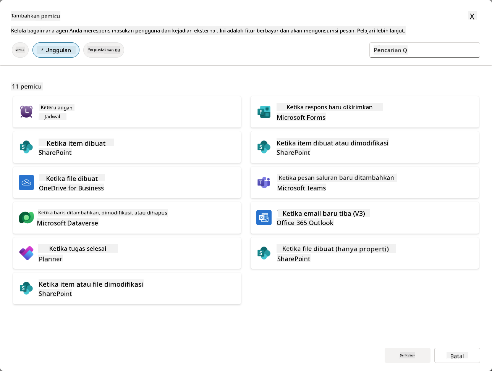

### Mengapa Pemicu Acara penting untuk agen otonom

Pemicu acara mengubah agen Anda dari asisten reaktif menjadi pembantu otonom yang proaktif:

1. **Operasi otonom** - agen Anda dapat bekerja 24/7 tanpa intervensi manusia, merespons acara saat mereka terjadi.
    - *Contoh:* Secara otomatis menyambut anggota tim baru saat mereka ditambahkan ke tim.

1. **Responsivitas waktu nyata** - alih-alih menunggu pengguna mengajukan pertanyaan, agen Anda merespons segera terhadap acara yang relevan.
    - *Contoh*: Memberi tahu tim IT saat dokumen SharePoint dimodifikasi.

1. **Otomasi alur kerja** - menghubungkan beberapa tindakan berdasarkan satu acara pemicu.
    - *Contoh:* Ketika tiket dukungan baru dibuat, buat tugas, beri tahu manajer, dan perbarui dasbor pelacakan.

1. **Proses yang konsisten** - memastikan langkah-langkah penting tidak pernah terlewatkan dengan mengotomasi respons terhadap acara utama.
    - *Contoh:* Setiap karyawan baru secara otomatis mendapatkan materi orientasi dan permintaan akses.

1. **Tindakan berbasis data** - menggunakan informasi dari acara pemicu untuk membuat keputusan cerdas dan mengambil tindakan yang sesuai.
    - *Contoh:* Mengarahkan tiket mendesak ke staf senior berdasarkan tingkat prioritas dalam payload pemicu.

## ⚙️ Bagaimana Pemicu Acara bekerja?

Pemicu acara beroperasi melalui alur kerja tiga langkah yang memungkinkan agen Anda merespons secara otonom terhadap acara eksternal:

### Alur kerja pemicu

1. **Deteksi Acara** - Acara tertentu terjadi di sistem yang terhubung (SharePoint, Teams, Outlook, dll.)
1. **Aktivasi Pemicu** - Pemicu acara mendeteksi acara ini dan mengirimkan payload ke agen Anda melalui Power Automate Cloud Flow.
1. **Respons Agen** - Agen Anda menerima payload dan menjalankan instruksi yang telah Anda tentukan.

### Pemicu Acara vs Pemicu Topik

Memahami perbedaan antara kedua jenis pemicu ini sangat penting:

| **Pemicu Acara** | **Pemicu Topik** |
|-------------------|-------------------|
| Diaktifkan oleh acara sistem eksternal | Diaktifkan oleh input/frasa pengguna |
| Memungkinkan perilaku agen otonom | Memungkinkan respons percakapan |
| Menggunakan autentikasi pembuat | Opsi untuk autentikasi pengguna |
| Berjalan tanpa interaksi pengguna | Membutuhkan pengguna untuk memulai percakapan |
| Contoh: File dibuat, email diterima | Contoh: "Bagaimana cuacanya?" |

## 📦 Memahami payload pemicu

Ketika sebuah acara terjadi, pemicu mengirimkan **payload** ke agen Anda yang berisi informasi tentang acara dan instruksi tentang cara merespons.

### Payload default vs kustom

Setiap jenis pemicu memiliki struktur payload default, tetapi Anda dapat menyesuaikannya:

**Payload default** - Menggunakan format standar seperti `Gunakan konten dari {Body}`

- Berisi informasi acara dasar
- Menggunakan instruksi pemrosesan umum
- Baik untuk skenario sederhana

**Payload kustom** - Menambahkan instruksi spesifik dan format data

- Menyertakan arahan terperinci untuk agen Anda
- Menentukan data apa yang digunakan dan bagaimana cara menggunakannya
- Lebih baik untuk alur kerja yang kompleks

### Instruksi agen vs instruksi payload kustom

Anda memiliki dua tempat untuk mengarahkan perilaku agen Anda dengan pemicu acara:

**Instruksi Agen** (Global)

- Panduan luas yang berlaku untuk semua pemicu
- Contoh: "Saat memproses tiket, selalu periksa duplikat terlebih dahulu"
- Terbaik untuk pola perilaku umum

**Instruksi Payload** (Spesifik Pemicu)

- Arahan spesifik untuk jenis pemicu individu  
- Contoh: "Untuk pembaruan SharePoint ini, kirimkan ringkasan ke saluran proyek"
- Terbaik untuk agen kompleks dengan banyak pemicu

💡 **Tips profesional**: Hindari instruksi yang bertentangan antara kedua level ini, karena dapat menyebabkan perilaku yang tidak terduga.

## 🎯 Skenario Pemicu Acara yang umum

Berikut adalah contoh praktis bagaimana pemicu acara dapat meningkatkan agen Anda:

### Agen Help Desk IT

- **Pemicu**: Item daftar SharePoint baru (tiket dukungan)
- **Tindakan**: Secara otomatis mengkategorikan, menetapkan prioritas, dan memberi tahu anggota tim yang sesuai

### Agen Orientasi Karyawan

- **Pemicu**: Pengguna baru ditambahkan ke Dataverse
- **Tindakan**: Mengirim pesan selamat datang, membuat tugas orientasi, dan menyediakan akses

### Agen Manajemen Proyek

- **Pemicu**: Tugas selesai di Planner
- **Tindakan**: Memperbarui dasbor proyek, memberi tahu pemangku kepentingan, dan memeriksa hambatan

### Agen Manajemen Dokumen

- **Pemicu**: File diunggah ke folder SharePoint tertentu
- **Tindakan**: Mengekstrak metadata, menerapkan tag, dan memberi tahu pemilik dokumen

### Agen Asisten Rapat

- **Pemicu**: Acara kalender dibuat
- **Tindakan**: Mengirim pengingat dan agenda pra-rapat, memesan sumber daya

## ⚠️ Pertimbangan publikasi dan autentikasi

Sebelum agen Anda dapat menggunakan pemicu acara dalam produksi, Anda perlu memahami implikasi autentikasi dan keamanan.

### Autentikasi pembuat

Pemicu acara menggunakan **kredensial pembuat agen** untuk semua autentikasi:

- Agen Anda mengakses sistem menggunakan izin Anda
- Pengguna dapat berpotensi mengakses data melalui kredensial Anda
- Semua tindakan dilakukan "atas nama Anda" bahkan ketika pengguna berinteraksi dengan agen

### Praktik terbaik perlindungan data

Untuk menjaga keamanan saat menerbitkan agen dengan pemicu acara:

1. **Evaluasi akses data** - Tinjau sistem dan data apa yang dapat diakses oleh pemicu Anda
1. **Uji secara menyeluruh** - Pahami informasi apa yang disertakan pemicu dalam payload
1. **Persempit cakupan pemicu** - Gunakan parameter spesifik untuk membatasi acara yang mengaktifkan pemicu
1. **Tinjau data payload** - Pastikan pemicu tidak mengekspos informasi sensitif
1. **Pantau penggunaan** - Lacak aktivitas pemicu dan konsumsi sumber daya

## ⚠️ Pemecahan masalah dan batasan

Perhatikan pertimbangan penting ini saat bekerja dengan pemicu acara:

### Dampak kuota dan penagihan

- Setiap aktivasi pemicu dihitung terhadap konsumsi pesan Anda
- Pemicu yang sering (seperti pengulangan setiap menit) dapat dengan cepat menghabiskan kuota
- Pantau penggunaan untuk menghindari pembatasan

### Persyaratan teknis

- Hanya tersedia untuk agen dengan orkestrasi generatif yang diaktifkan
- Membutuhkan berbagi alur cloud yang sadar solusi diaktifkan di lingkungan Anda

### Pencegahan Kehilangan Data (DLP)

- Kebijakan DLP organisasi Anda menentukan pemicu mana yang tersedia
- Administrator dapat memblokir pemicu acara sepenuhnya
- Hubungi admin Anda jika pemicu yang diharapkan tidak tersedia

## 🧪 Lab 10 - Tambahkan Pemicu Acara untuk perilaku agen otonom

### 🎯 Kasus penggunaan

Anda akan meningkatkan agen Help Desk IT Anda untuk secara otomatis merespons permintaan dukungan baru. Ketika seseorang membuat item baru di daftar tiket dukungan SharePoint Anda, agen Anda akan:

1. Memicu secara otonom saat tiket SharePoint dibuat
1. Memberikan detail tiket dan instruksi tentang langkah-langkah yang ingin Anda lakukan
1. Secara otomatis mengakui tiket kepada pengirim melalui email yang dihasilkan AI

Lab ini menunjukkan bagaimana pemicu acara memungkinkan perilaku agen yang benar-benar otonom.

### Prasyarat

Sebelum memulai lab ini, pastikan Anda memiliki:

- ✅ Menyelesaikan lab sebelumnya (terutama Lab 6-8 untuk agen Help Desk IT)
- ✅ Akses ke situs SharePoint dengan daftar tiket dukungan IT
- ✅ Lingkungan Copilot Studio dengan pemicu acara diaktifkan
- ✅ Agen Anda memiliki orkestrasi generatif yang diaktifkan
- ✅ Izin yang sesuai di SharePoint dan lingkungan Copilot Studio Anda

### 10.1 Aktifkan AI Generatif dan buat pemicu pembuatan item SharePoint

1. Buka **agen Help Desk IT** Anda di **Copilot Studio**

1. Pertama, pastikan **AI Generatif** diaktifkan untuk agen Anda:
   - Navigasikan ke tab **Overview**
   - Di bawah bagian Orkestrasi, Aktifkan **Generative orchestration** ke **On** jika belum diaktifkan  
     

1. Navigasikan ke tab **Overview** dan temukan bagian **Triggers**

1. Klik **+ Add trigger** untuk membuka pustaka pemicu  
    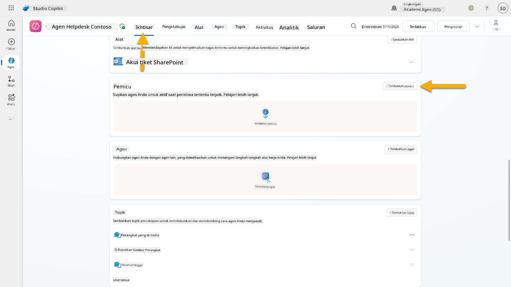

1. Cari dan pilih **When an item is created** (SharePoint)  
    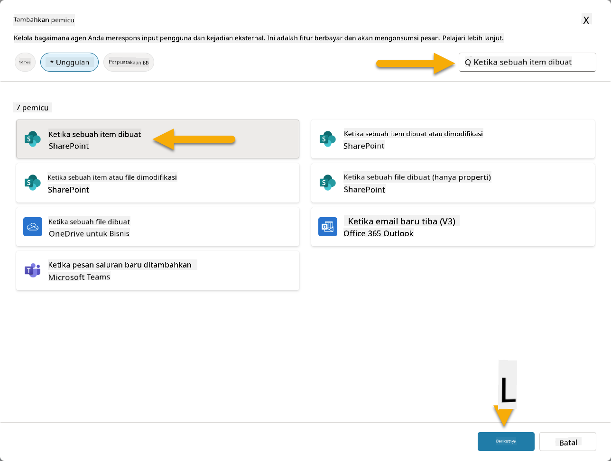

1. Konfigurasikan nama pemicu dan koneksi:

   - **Nama Pemicu:** Tiket Dukungan Baru Dibuat di SharePoint

1. Tunggu koneksi untuk dikonfigurasi, dan pilih **Next** untuk melanjutkan.  
   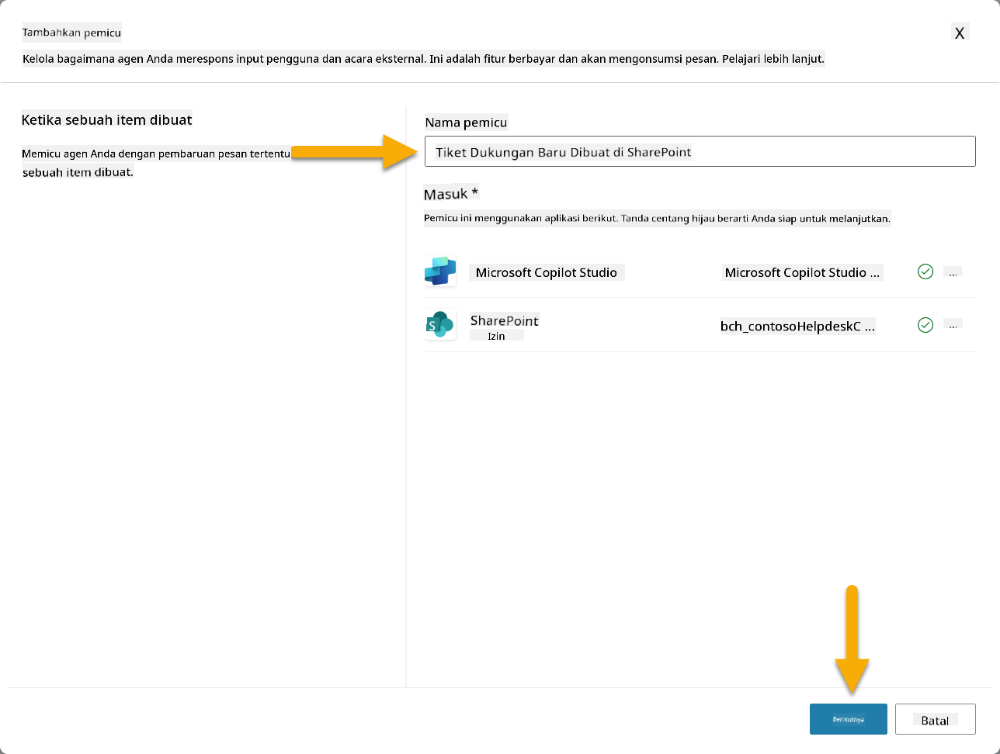

1. Konfigurasikan parameter pemicu:

   - **Alamat Situs**: Pilih situs SharePoint "Contoso IT" Anda

   - **Nama Daftar**: Pilih daftar "Tickets" Anda

   - **Instruksi tambahan untuk agen saat dipanggil oleh pemicu:**

     ```text
     New Support Ticket Created in SharePoint: {Body}
     
     Use the 'Acknowledge SharePoint Ticket' tool to generate the email body automatically and respond.
     
     IMPORTANT: Do not wait for any user input. Work completely autonomously.
     ```

     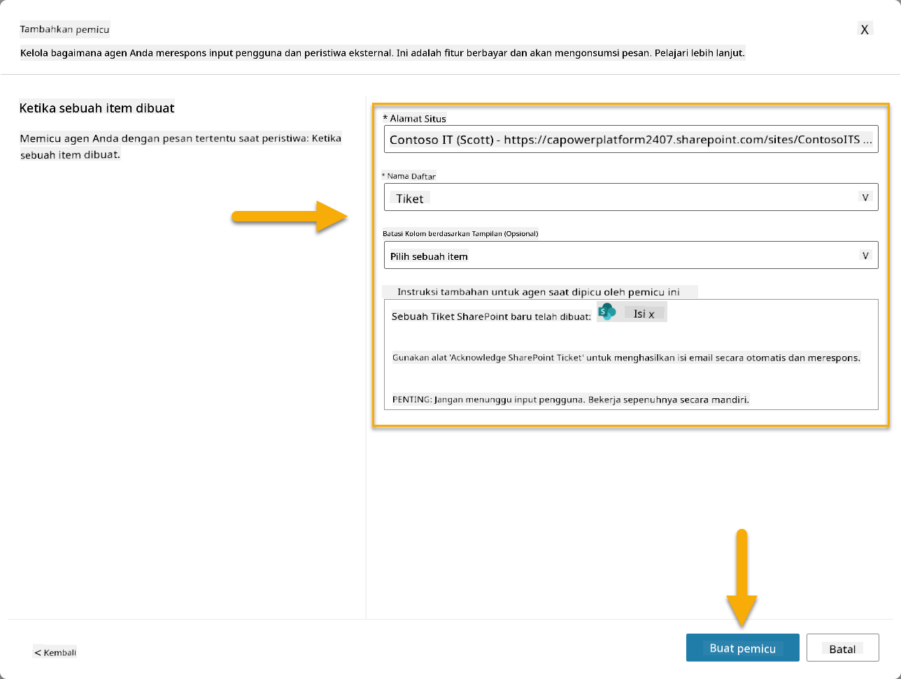

1. Pilih **Create trigger** untuk menyelesaikan pembuatan pemicu. Alur Power Automate Cloud secara otomatis dibuat untuk memicu agen secara otonom.

1. Pilih **Close**.

### 10.2 Edit Pemicu

1. Di dalam bagian **Triggers** pada tab **Overview**, Pilih menu **...** pada pemicu **Tiket Dukungan Baru Dibuat di SharePoint**

1. Pilih **Edit in Power Automate**  
   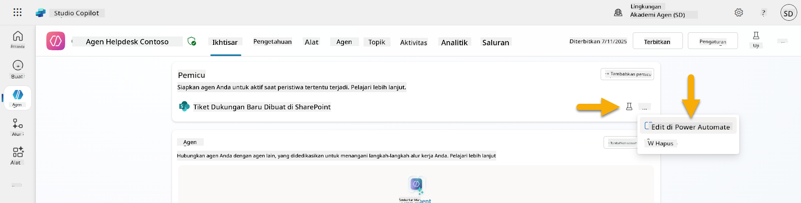

1. Pilih node **Sends a prompt to the specified copilot for processing**

1. Di bidang **Body/message**, hapus konten Body, **tekan tombol garis miring** (/) dan pilih **Insert Expression**  
   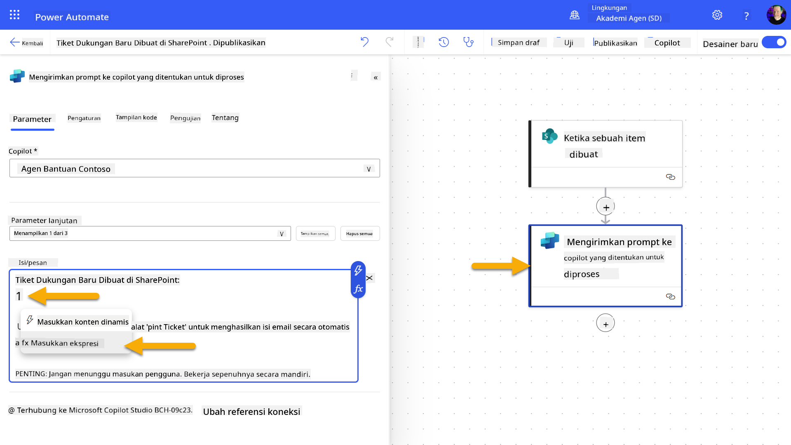

1. Masukkan ekspresi berikut untuk memberikan agen detail spesifik tentang tiket:

    ```text
    concat('Submitted By Name: ', first(triggerOutputs()?['body/value'])?['Author/DisplayName'], '\nSubmitted By Email: ', first(triggerOutputs()?['body/value'])?['Author/Email'], '\nTitle: ', first(triggerOutputs()?['body/value'])?['Title'], '\nIssue Description: ', first(triggerOutputs()?['body/value'])?['Description'], '\nPriority: ', first(triggerOutputs()?['body/value'])?['Priority/Value'],'\nTicket ID : ', first(triggerOutputs()?['body/value'])?['ID'])
    ```

1. Pilih **Add**  
   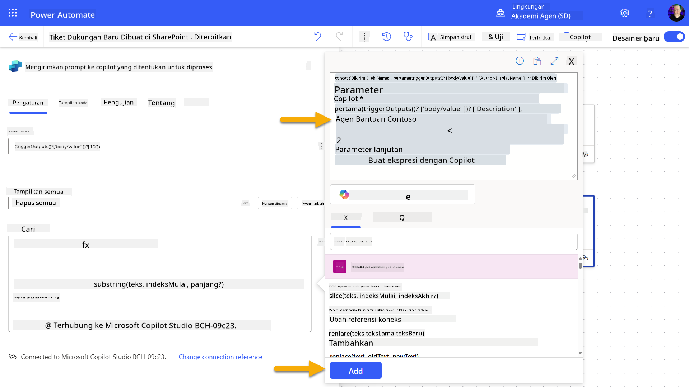

1. Pilih **Publish** di toolbar kanan atas.

### 10.3 Buat alat untuk pengakuan email

1. **Kembali** ke Agen Anda di Copilot Studio

1. Navigasikan ke tab **Tools** di agen Anda

1. Klik **+ Add a tool** dan pilih **Connector**

1. Cari dan pilih konektor **Send an email (V2)**  
    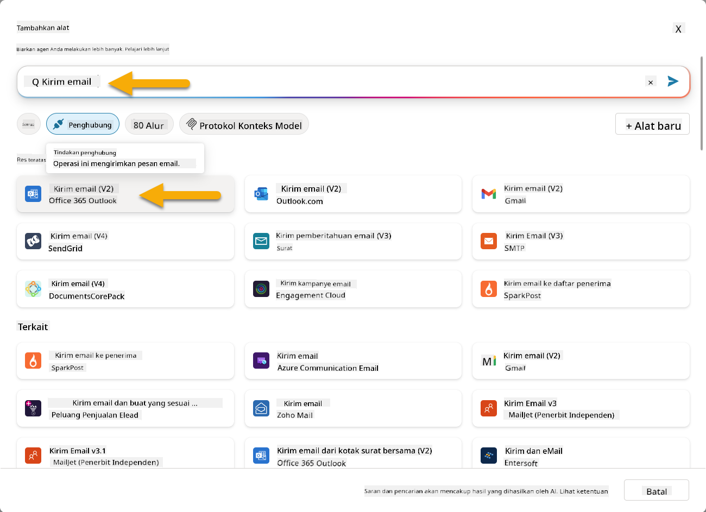

1. Tunggu koneksi untuk dikonfigurasi, lalu pilih **Add and configure**

1. Konfigurasikan pengaturan alat:

   - **Nama**: Acknowledge SharePoint ticket
   - **Deskripsi**: Alat ini mengirimkan pengakuan email bahwa tiket telah diterima.

1. Pilih **Customize** di sebelah parameter input dan konfigurasikan sebagai berikut:

    **To**:

    - **Deskripsi**: Alamat email orang yang mengirimkan Tiket SharePoint
    - **Identifikasi sebagai**: Email

    **Body**:

    - **Deskripsi**: Pengakuan bahwa Tiket telah diterima, dan kami akan merespons dalam waktu 3 hari kerja.

    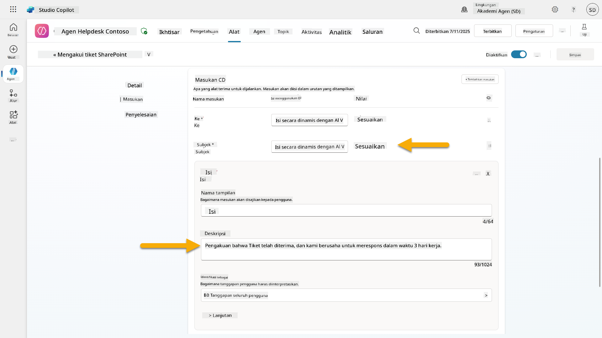

1. Pilih **Save**

### 10.4 Uji pemicu

1. Di dalam **Help Desk Agent** Anda, pilih tab **Overview**
1. Klik ikon **Test Trigger** di sebelah pemicu **Tiket Dukungan Baru Dibuat di SharePoint**. Ini akan memuat jendela **Test your trigger**.
1. Buka tab browser baru dan navigasikan ke **Daftar Tiket Dukungan IT SharePoint** Anda  
1. Klik **+ Tambahkan item baru** untuk membuat tiket uji:  
   - **Judul**: "Tidak dapat terhubung ke VPN"  
   - **Deskripsi**: "Tidak dapat terhubung ke jaringan WIFI perusahaan setelah pembaruan terbaru"  
   - **Prioritas**: "Normal"  

1. **Simpan** item SharePoint  
      
1. Kembali ke **Copilot Studio** dan pantau panel **Uji pemicu Anda** untuk aktivasi pemicu. Gunakan ikon **Refresh** untuk memuat acara pemicu, ini mungkin memerlukan beberapa menit.  
    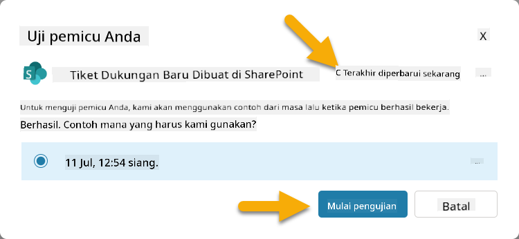  
1. Setelah pemicu muncul, pilih **Mulai pengujian**  
1. Pilih **Ikon Peta Aktivitas** di bagian atas panel **Uji agen Anda**  
1. Verifikasi bahwa agen Anda:  
   - Menerima payload pemicu  
   - Memanggil alat "Acknowledge SharePoint ticket"  
     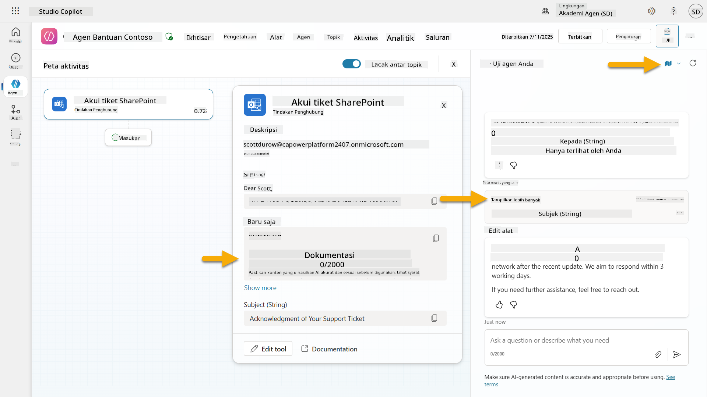  
1. Periksa kotak masuk email pengirim untuk memastikan email konfirmasi telah dikirim  
    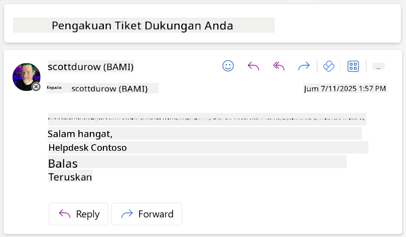  
1. Tinjau tab **Aktivitas** di Copilot Studio untuk melihat pemicu dan eksekusi alat secara lengkap  

## ✅ Misi Selesai  

🎉 **Selamat!** Anda telah berhasil mengimplementasikan pemicu acara dengan alat konektor yang memungkinkan agen Anda beroperasi secara mandiri, secara otomatis mengirimkan email konfirmasi dan memproses tiket dukungan tanpa intervensi pengguna. Setelah agen Anda dipublikasikan, ia akan bertindak secara mandiri atas nama Anda.  

🚀 **Selanjutnya**: Dalam pelajaran berikutnya, Anda akan belajar cara [mempublikasikan agen Anda](../11-publish-your-agent/README.md) ke Microsoft Teams dan Microsoft 365 Copilot, membuatnya tersedia untuk seluruh organisasi Anda!  

⏭️ [Lanjut ke pelajaran **Publikasikan agen Anda**](../11-publish-your-agent/README.md)  

## 📚 Sumber Daya Taktis  

Siap untuk mendalami pemicu acara dan agen mandiri? Lihat sumber daya berikut:  

- **Microsoft Learn**: [Jadikan agen Anda mandiri di Copilot Studio](https://learn.microsoft.com/training/modules/autonomous-agents-online-workshop/?WT.mc_id=power-177340-scottdurow)  
- **Dokumentasi**: [Tambahkan pemicu acara](https://learn.microsoft.com/microsoft-copilot-studio/authoring-trigger-event?WT.mc_id=power-177340-scottdurow)  
- **Praktik Terbaik**: [Pengantar pemicu Power Automate](https://learn.microsoft.com/power-automate/triggers-introduction?WT.mc_id=power-177340-scottdurow)  
- **Skenario Lanjutan**: [Menggunakan alur Power Automate dengan agen](https://learn.microsoft.com/microsoft-copilot-studio/advanced-flow-create?WT.mc_id=power-177340-scottdurow)  
- **Keamanan**: [Pencegahan kehilangan data untuk Copilot Studio](https://learn.microsoft.com/microsoft-copilot-studio/admin-data-loss-prevention?WT.mc_id=power-177340-scottdurow)  

<!-- markdownlint-disable-next-line MD033 -->


---

**Penafian**:  
Dokumen ini telah diterjemahkan menggunakan layanan penerjemahan AI [Co-op Translator](https://github.com/Azure/co-op-translator). Meskipun kami berusaha untuk memberikan hasil yang akurat, harap diketahui bahwa terjemahan otomatis dapat mengandung kesalahan atau ketidakakuratan. Dokumen asli dalam bahasa aslinya harus dianggap sebagai sumber yang otoritatif. Untuk informasi yang penting, disarankan menggunakan jasa penerjemahan manusia profesional. Kami tidak bertanggung jawab atas kesalahpahaman atau interpretasi yang keliru yang timbul dari penggunaan terjemahan ini.