<!--
CO_OP_TRANSLATOR_METADATA:
{
  "original_hash": "9dceeba2eae2bb73e328602a060eddab",
  "translation_date": "2025-10-17T17:11:47+00:00",
  "source_file": "docs/recruit/11-publish-your-agent/README.md",
  "language_code": "id"
}
-->
# 🚨 Misi 11: Publikasikan Agen Anda

## 🕵️‍♂️ NAMA KODE: `OPERASI PUBLIKASI PUBLIKASI PUBLIKASI`

> **⏱️ Waktu Operasi:** `~30 menit`  

🎥 **Tonton Panduan**

[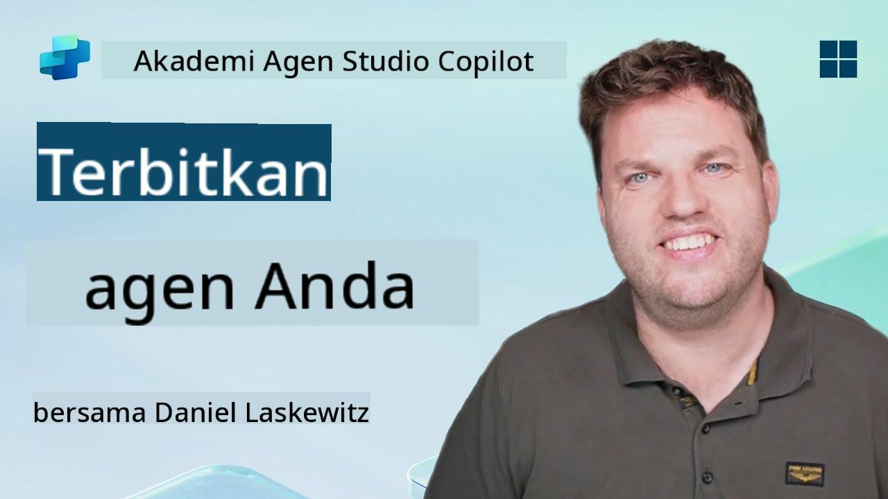](https://www.youtube.com/watch?v=eVZmljhYlSI "Tonton panduan di YouTube")

## 🎯 Ringkasan Misi

Setelah menyelesaikan serangkaian modul yang menantang, Pembuat Agen, Anda kini siap untuk langkah paling penting: mempublikasikan agen Anda. Saatnya membuat kreasi Anda tersedia bagi pengguna di Microsoft Teams dan Microsoft 365 Copilot.

Agen Anda—dilengkapi dengan misi yang jelas, alat yang kuat, dan akses ke sumber pengetahuan utama—siap melayani. Dengan menggunakan Microsoft Copilot Studio, Anda dapat menerapkan agen Anda sehingga dapat mulai membantu pengguna nyata di tempat mereka bekerja.

Mari luncurkan agen Anda ke dalam aksi.

## 🔎 Tujuan

📖 Pelajaran ini mencakup:

1. Mengapa penting untuk mempublikasikan agen Anda
1. Apa yang terjadi saat Anda mempublikasikan agen Anda
1. Cara menambahkan saluran (Microsoft Teams & Microsoft 365 Copilot)
1. Cara menambahkan agen di Microsoft Teams
1. Cara membuat agen tersedia di Microsoft Teams untuk seluruh organisasi Anda

## 🚀 Publikasikan agen

Setiap kali Anda bekerja pada agen di Copilot Studio, Anda mungkin memperbaruinya dengan menambahkan pengetahuan atau alat. Ketika Anda sudah siap dengan semua perubahan dan telah menguji dengan cermat, Anda siap untuk mempublikasikannya. Publikasi memastikan bahwa pembaruan terbaru tersedia secara langsung. Jika Anda memperbarui agen Anda dengan alat baru dan tidak menekan tombol publikasi, pembaruan tersebut belum tersedia untuk pengguna akhir.

Pastikan selalu menekan tombol publikasi ketika Anda ingin mendorong pembaruan kepada pengguna agen Anda. Agen Anda mungkin memiliki saluran yang ditambahkan padanya, dan ketika Anda menekan tombol publikasi, pembaruan tersedia untuk semua saluran yang telah Anda tambahkan ke agen.

## ⚙️ Konfigurasi saluran

Saluran menentukan di mana pengguna Anda dapat mengakses dan berinteraksi dengan agen Anda. Setelah Anda mempublikasikan agen Anda, Anda dapat membuatnya tersedia di beberapa saluran. Setiap saluran mungkin menampilkan konten agen Anda dengan cara yang berbeda.

Anda dapat menambahkan agen Anda ke saluran berikut:

- **Microsoft Teams dan Microsoft 365 Copilot** - Buat agen Anda tersedia di obrolan dan rapat Teams, serta dalam pengalaman Microsoft 365 Copilot ([Pelajari lebih lanjut](https://learn.microsoft.com/microsoft-copilot-studio/publication-add-bot-to-microsoft-teams))
- **Situs demo** - Uji agen Anda di situs demo yang disediakan oleh Copilot Studio ([Pelajari lebih lanjut](https://learn.microsoft.com/microsoft-copilot-studio/publication-connect-bot-to-web-channels))
- **Situs kustom** - Sematkan agen Anda langsung ke situs web Anda sendiri ([Pelajari lebih lanjut](https://learn.microsoft.com/microsoft-copilot-studio/publication-connect-bot-to-web-channels))
- **Aplikasi seluler** - Integrasikan agen Anda ke aplikasi seluler kustom ([Pelajari lebih lanjut](https://learn.microsoft.com/microsoft-copilot-studio/publication-connect-bot-to-custom-application))
- **SharePoint** - Tambahkan agen Anda ke situs SharePoint untuk bantuan dokumen dan situs ([Pelajari lebih lanjut](https://learn.microsoft.com/microsoft-copilot-studio/publication-add-bot-to-sharepoint))
- **Facebook Messenger** - Terhubung dengan pengguna melalui platform pesan Facebook ([Pelajari lebih lanjut](https://learn.microsoft.com/microsoft-copilot-studio/publication-add-bot-to-facebook))
- **Power Pages** - Integrasikan agen Anda ke situs web Power Pages ([Pelajari lebih lanjut](https://learn.microsoft.com/microsoft-copilot-studio/publication-add-bot-to-power-pages))
- **Saluran Azure Bot Service** - Akses saluran tambahan termasuk Slack, Telegram, Twilio SMS, dan lainnya ([Pelajari lebih lanjut](https://learn.microsoft.com/microsoft-copilot-studio/publication-connect-bot-to-azure-bot-service-channels))

Untuk menambahkan saluran, navigasikan ke tab **Channels** di agen Anda dan pilih saluran yang ingin Anda konfigurasi. Setiap saluran memiliki persyaratan pengaturan khusus dan mungkin memerlukan langkah autentikasi atau konfigurasi tambahan.

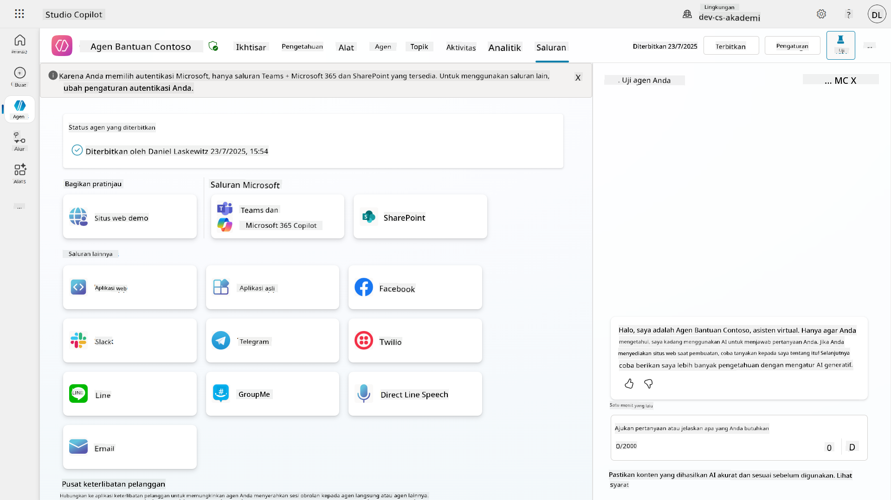

## 📺 Pengalaman saluran

Saluran yang berbeda memiliki pengalaman pengguna yang berbeda. Saat membangun agen untuk beberapa saluran, pastikan untuk menyadari perbedaan di setiap saluran. Strategi yang baik adalah menguji agen Anda di beberapa saluran untuk memastikan bahwa agen tersebut benar-benar berfungsi sesuai yang Anda inginkan.

| Pengalaman                        | Situs web     | Teams dan Microsoft 365 Copilot         | Facebook                 | Dynamics Omnichannel untuk Layanan Pelanggan                |
| --------------------------------- | ------------- | --------------------------------------- | ------------------------ | ----------------------------------------------------------- |
| [Survei kepuasan pelanggan][1]    | Kartu adaptif | Hanya teks                              | Hanya teks               | Hanya teks                                                  |
| [Pilihan ganda][1]                | Didukung      | [Didukung hingga enam (sebagai kartu hero)][4] | [Didukung hingga 13][6]  | [Sebagian didukung][8]                                      |
| [Markdown][2]                     | Didukung      | [Sebagian didukung][5]                  | [Sebagian didukung][7]   | [Sebagian didukung][9]                                      |
| [Pesan selamat datang][1]         | Didukung      | Didukung                                | Tidak didukung           | Didukung untuk [Chat][10]. Tidak didukung untuk saluran lainnya. |
| [Did-You-Mean][3]                 | Didukung      | Didukung                                | Didukung                 | Didukung untuk [Microsoft Teams][11], [Chat][10], Facebook, dan saluran hanya teks (pesan singkat (SMS) melalui [TeleSign][12] dan [Twilio][13], [WhatsApp][14], [WeChat][15], dan [Twitter][16]). Tindakan yang disarankan disajikan sebagai daftar hanya teks; pengguna harus mengetik ulang opsi untuk merespons. |

[1]: https://learn.microsoft.com/microsoft-copilot-studio/authoring-create-edit-topics  
[2]: https://daringfireball.net/projects/markdown/  
[3]: https://learn.microsoft.com/microsoft-copilot-studio/advanced-ai-features  
[4]: https://learn.microsoft.com/microsoftteams/platform/concepts/cards/cards-reference#hero-card  
[5]: https://learn.microsoft.com/microsoftteams/platform/bots/how-to/format-your-bot-messages#text-only-messages  
[6]: https://developers.facebook.com/docs/messenger-platform/send-messages/quick-replies/  
[7]: https://www.facebook.com/help/147348452522644?helpref=related  
[8]: https://learn.microsoft.com/dynamics365/customer-service/asynchronous-channels#suggested-actions-support  
[9]: https://learn.microsoft.com/dynamics365/customer-service/asynchronous-channels#preview-support-for-formatted-messages  
[10]: https://learn.microsoft.com/dynamics365/customer-service/set-up-chat-widget  
[11]: https://learn.microsoft.com/dynamics365/customer-service/configure-microsoft-teams  
[12]: https://learn.microsoft.com/dynamics365/customer-service/configure-sms-channel  
[13]: https://learn.microsoft.com/dynamics365/customer-service/configure-sms-channel-twilio  
[14]: https://learn.microsoft.com/dynamics365/customer-service/configure-whatsapp-channel  
[15]: https://learn.microsoft.com/dynamics365/customer-service/configure-wechat-channel  
[16]: https://learn.microsoft.com/dynamics365/customer-service/configure-twitter-channel  

> [!NOTE]  
> Ada beberapa contoh di mana Anda dapat menggunakan logika yang berbeda untuk saluran yang berbeda. Contohnya dapat ditemukan di repositori Power Platform Snippets:  
>  
> Henry Jammes membagikan contoh cara menampilkan kartu adaptif yang berbeda ketika salurannya adalah Microsoft Teams. ([Tautan ke contoh](https://github.com/pnp/powerplatform-snippets/blob/main/copilot-studio/multiple-topics-matched-topic/source/multiple-topics-matched.yaml#L40))

## 🧪 Lab 11: Publikasikan agen Anda ke Teams dan Microsoft 365 Copilot

### 🎯 Kasus penggunaan

Agen Bantuan IT Contoso Anda kini telah sepenuhnya dikonfigurasi dengan kemampuan yang kuat—agen ini dapat mengakses sumber pengetahuan SharePoint, membuat tiket dukungan, mengirim notifikasi proaktif, dan merespons pertanyaan pengguna dengan cerdas. Namun, semua fitur ini saat ini hanya tersedia di lingkungan pengembangan tempat Anda membangunnya.

**Tantangan:** Pengguna akhir tidak dapat memanfaatkan kemampuan agen Anda hingga agen tersebut dipublikasikan dengan benar dan dibuat dapat diakses melalui saluran tempat mereka bekerja.

**Solusi:** Memublikasikan agen Anda memastikan bahwa versi terbaru—dengan semua pembaruan terbaru, topik baru, sumber pengetahuan yang ditingkatkan, dan alur yang dikonfigurasi—tersedia untuk pengguna nyata. Tanpa publikasi, pengguna masih akan berinteraksi dengan versi lama agen Anda yang mungkin kehilangan fungsi penting.

Menambahkan saluran Teams dan Microsoft 365 Copilot sama pentingnya karena:

- **Integrasi Teams**: Karyawan organisasi Anda menghabiskan sebagian besar waktu mereka di Microsoft Teams untuk kolaborasi, rapat, dan komunikasi. Dengan menambahkan agen Anda ke Teams, pengguna dapat mendapatkan dukungan IT tanpa meninggalkan lingkungan kerja utama mereka.

- **Microsoft 365 Copilot**: Pengguna dapat mengakses agen bantuan IT khusus Anda langsung dalam pengalaman Microsoft 365 Copilot mereka, membuatnya terintegrasi dengan mulus ke dalam alur kerja harian mereka di aplikasi Office.

- **Akses Terpusat**: Alih-alih mengingat situs web atau aplikasi terpisah, pengguna dapat mengakses dukungan IT melalui platform yang sudah mereka gunakan, mengurangi hambatan dan meningkatkan adopsi.

Misi ini mengubah pekerjaan pengembangan Anda menjadi solusi siap produksi yang memberikan nilai nyata bagi pengguna akhir organisasi Anda.

### Prasyarat

Sebelum memulai lab ini, pastikan Anda memiliki:

- ✅ Menyelesaikan lab sebelumnya dan memiliki Agen Bantuan Contoso yang sepenuhnya dikonfigurasi
- ✅ Agen Anda telah diuji dan siap digunakan di produksi
- ✅ Izin di lingkungan Copilot Studio Anda untuk mempublikasikan agen
- ✅ Akses ke Microsoft Teams di organisasi Anda

### 11.1 Publikasikan agen Anda

Sekarang semua pekerjaan kita pada agen telah selesai, kita harus memastikan semua pekerjaan kita tersedia untuk pengguna akhir yang akan menggunakan agen kita. Untuk memastikan konten tersedia untuk semua pengguna, kita perlu mempublikasikan agen kita.

1. Pergi ke Agen Bantuan Contoso di Copilot Studio (melalui [portal pembuat Copilot Studio](https://copilotstudio.microsoft.com))

    Di Copilot Studio, mudah untuk mempublikasikan agen Anda. Anda hanya perlu memilih tombol publikasi di bagian atas tampilan agen.

    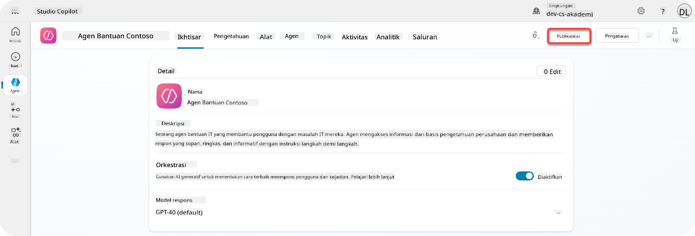

1. Pilih tombol **Publish** di agen Anda

    Ini akan membuka pop-up publikasi - untuk mengonfirmasi bahwa Anda benar-benar ingin mempublikasikan agen Anda.

    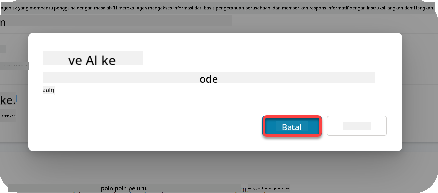

1. Pilih **Publish** untuk mengonfirmasi publikasi agen Anda

    Sekarang pesan akan muncul bahwa agen Anda sedang dipublikasikan. Anda tidak perlu menjaga pop-up itu tetap terbuka. Anda akan diberi tahu ketika agen telah dipublikasikan.

    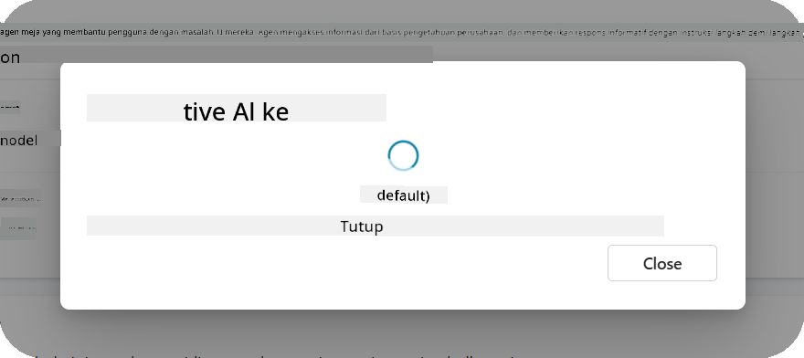

    Ketika agen selesai dipublikasikan, Anda akan melihat notifikasi di bagian atas halaman agen.

    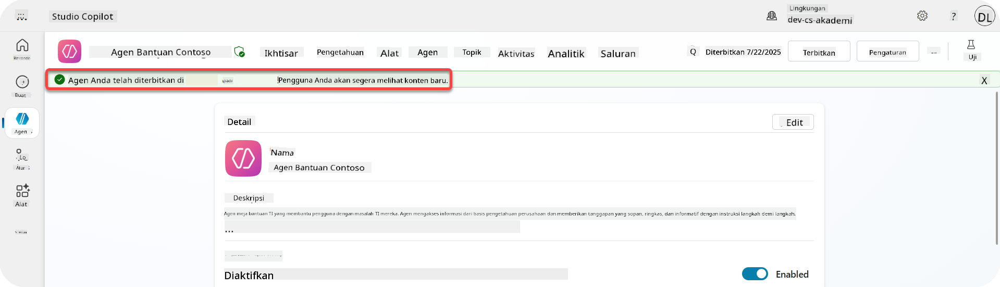

Namun - kita hanya mempublikasikan agen, kita belum menambahkannya ke saluran, jadi mari kita perbaiki sekarang!

### 11.2 Tambahkan saluran Teams dan Microsoft 365 Copilot

1. Untuk menambahkan saluran Teams dan Microsoft 365 Copilot ke agen kita, kita perlu memilih **Channel** di navigasi atas agen

    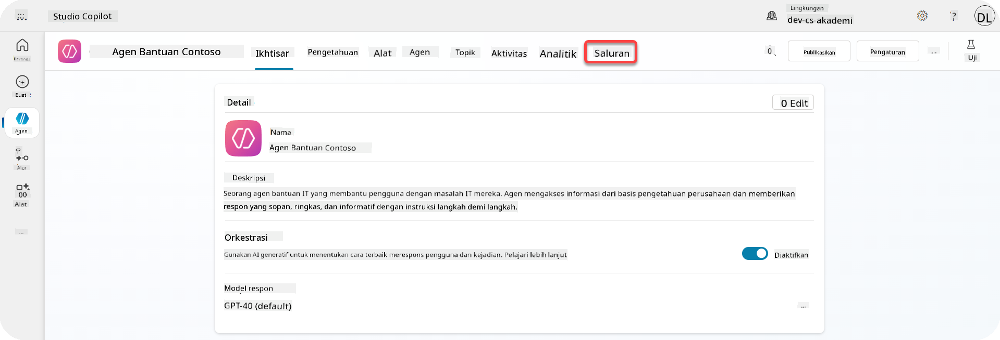

    Di sini kita dapat melihat semua saluran yang dapat kita tambahkan ke agen ini.

1. Pilih **Teams dan Microsoft 365**

    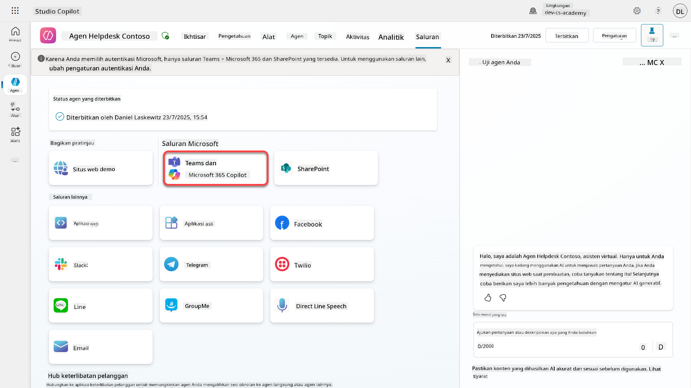

1. Pilih **Add channel** untuk menyelesaikan wizard dan menambahkan saluran ke agen

    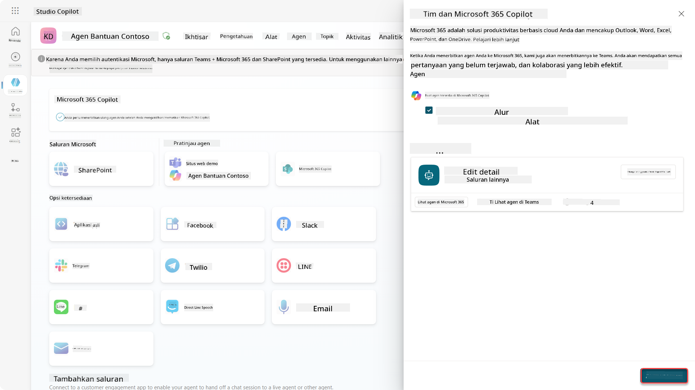

    Ini akan memakan waktu sebentar hingga ditambahkan. Setelah ditambahkan, notifikasi hijau akan muncul di bagian atas sidebar.

    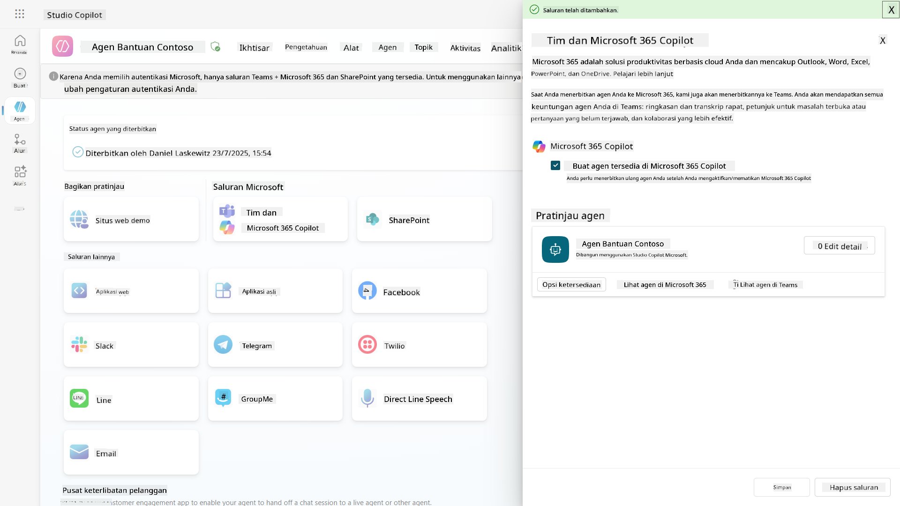

1. Pilih **See agent in Teams** untuk membuka tab baru

    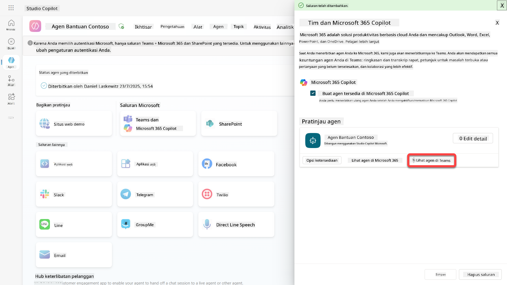

1. Pilih **Add** untuk menambahkan Agen Bantuan Contoso ke Teams

    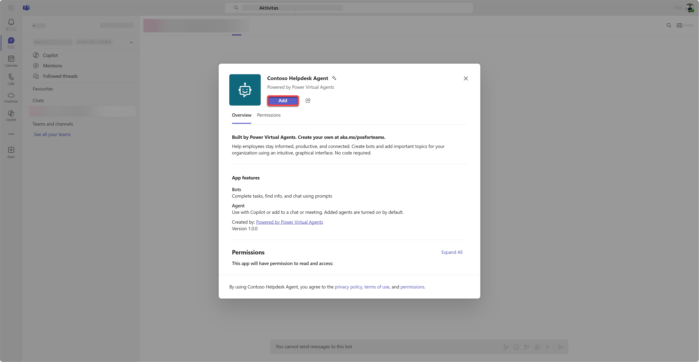

    Ini akan memakan waktu sebentar. Setelah selesai, layar berikut akan muncul:

    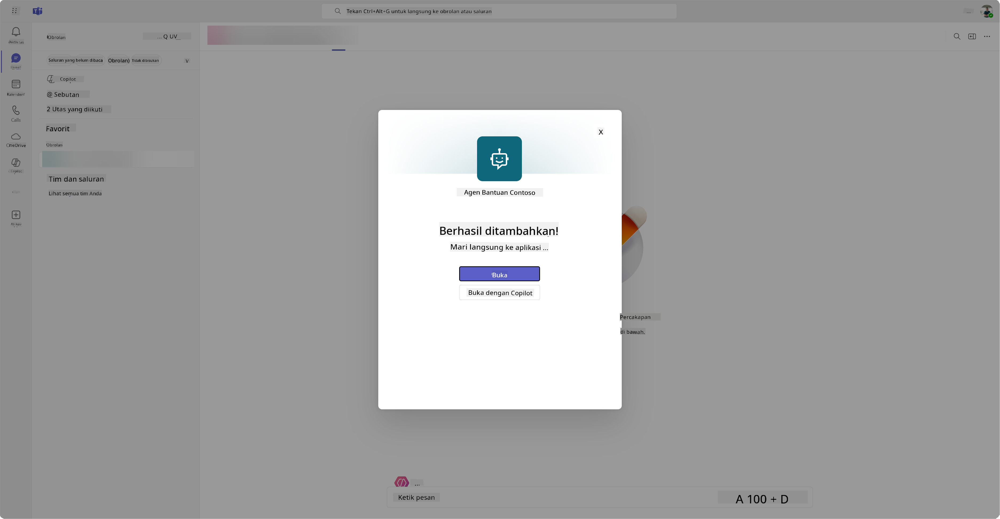

1. Pilih **Open** untuk membuka agen di Teams

    Ini akan membuka agen di Teams sebagai aplikasi Teams

    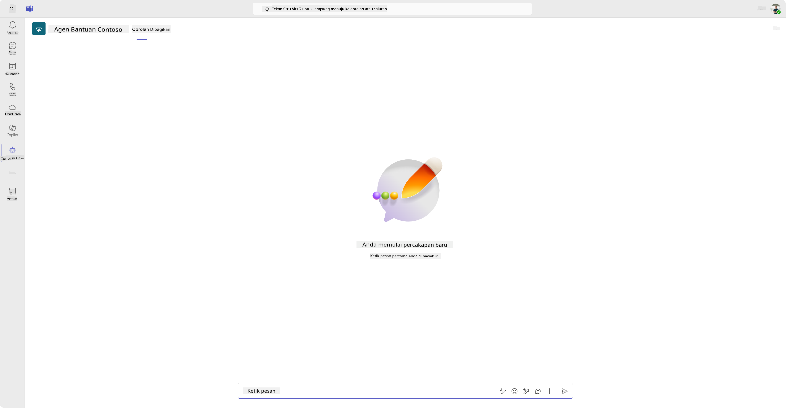

Sekarang kita telah mempublikasikan agen untuk bekerja di Microsoft Teams, tetapi Anda mungkin ingin membuatnya tersedia untuk lebih banyak orang.

### 11.3 Buat agen tersedia untuk semua pengguna di tenant

1. Tutup tab browser tempat Agen Bantuan Contoso dibuka

    Ini akan membawa Anda kembali ke Copilot Studio di mana panel samping Teams dan Microsoft 365 Copilot masih terbuka. Kita hanya membuka agen di Teams sekarang, tetapi kita dapat melakukan lebih banyak hal di sini. Kita dapat mengedit detail agen, kita dapat menerapkan agen ke lebih banyak pengguna, dan lainnya.

1. Pilih **Edit details**

    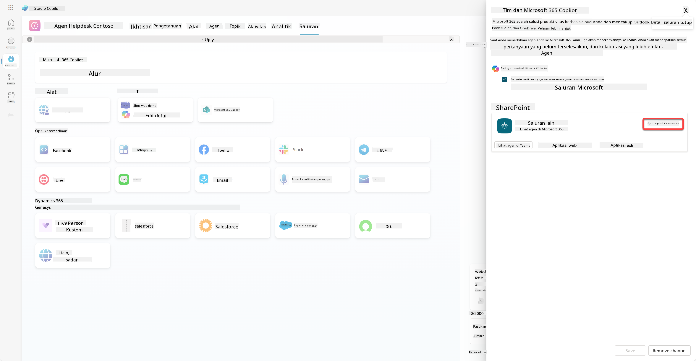
Ini akan membuka panel tempat kita dapat mengubah berbagai detail dan pengaturan agen. Kita dapat mengubah detail dasar seperti ikon, warna latar belakang ikon, dan deskripsi. Kita juga dapat mengubah pengaturan Teams (misalnya, memungkinkan pengguna untuk menambahkan agen ke tim, atau menggunakan agen ini dalam obrolan grup dan rapat) di sini. Saat Anda memilih *lebih banyak*, Anda juga dapat mengubah detail pengembang seperti nama pengembang, situs web, pernyataan privasi, dan syarat penggunaan.

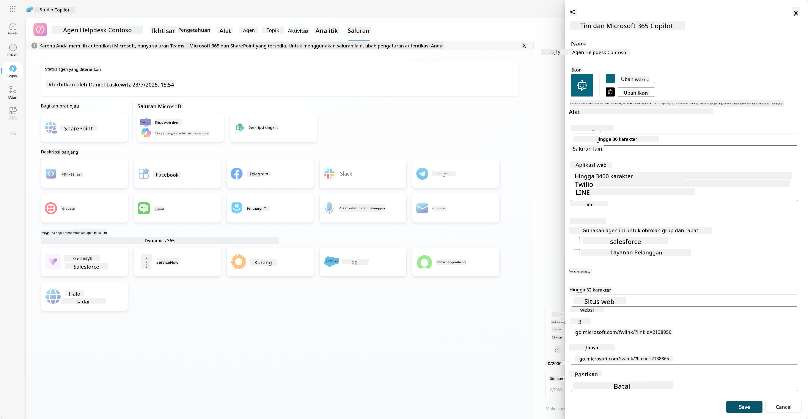

1. Pilih **Cancel** untuk menutup panel Edit details

1. Pilih **Availability options**

    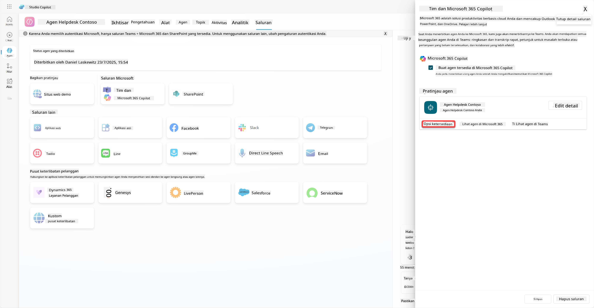

    Ini akan membuka panel opsi ketersediaan, di mana Anda dapat menyalin tautan untuk dikirimkan kepada pengguna agar mereka dapat menggunakan agen ini (perlu diingat, Anda juga harus membagikan agen dengan pengguna tersebut) dan Anda dapat mengunduh file untuk menambahkan agen Anda ke Microsoft Teams atau Microsoft 365 store. Untuk menampilkan agen di store, Anda memiliki opsi lain juga: Anda dapat menampilkannya kepada rekan tim dan pengguna yang dibagikan (untuk ditampilkan di bagian *Built with Power Platform*) atau Anda dapat menampilkannya kepada semua orang di organisasi Anda (ini memerlukan persetujuan administrator).

1. Pilih **Show to everyone in my org**

    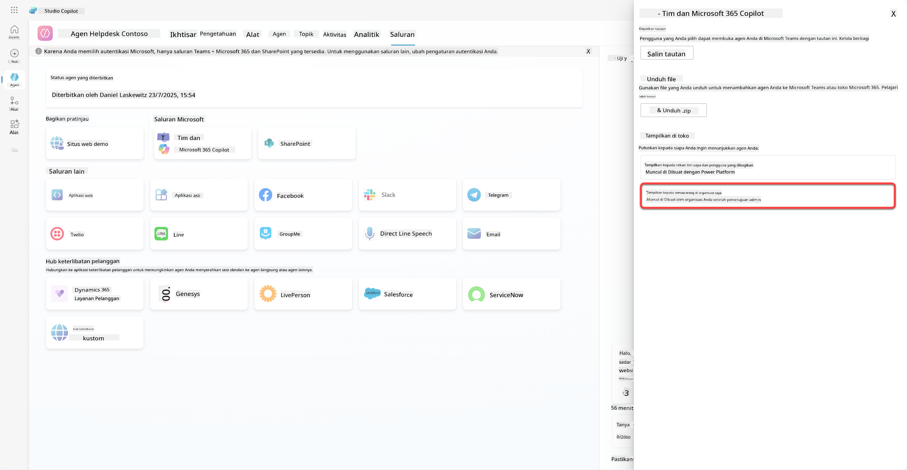

1. Pilih **Submit for admin approval**

    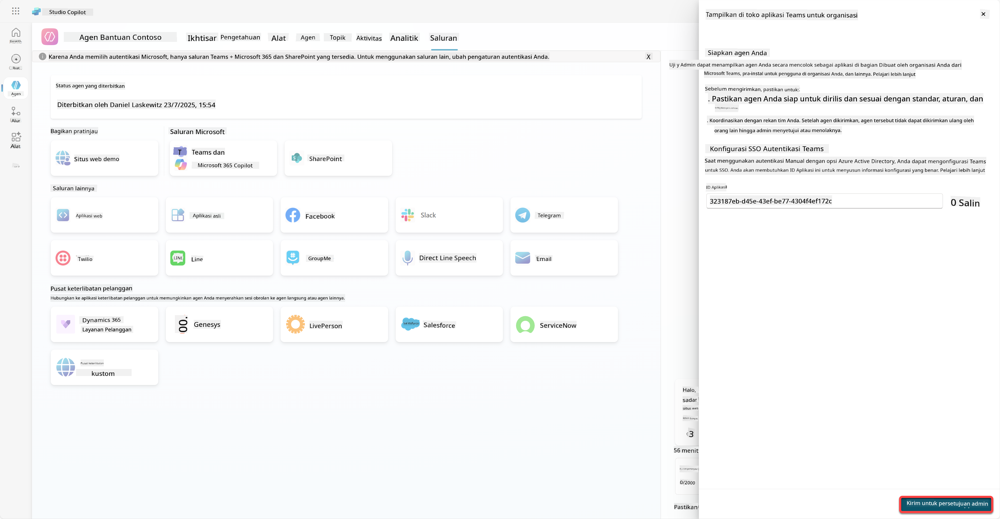

    Sekarang, administrator Anda harus menyetujui pengajuan agen Anda. Mereka dapat melakukannya dengan pergi ke Teams Admin Center dan mencari Contoso Helpdesk Agent di Apps. Pada tangkapan layar, Anda dapat melihat apa yang akan dilihat oleh administrator di Teams Admin Center.

    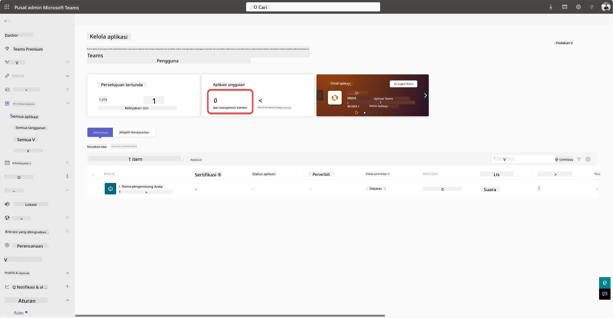

    Administrator harus memilih Contoso Helpdesk Agent dan memilih *Publish* untuk mempublikasikan Contoso Helpdesk Agent kepada semua orang.

    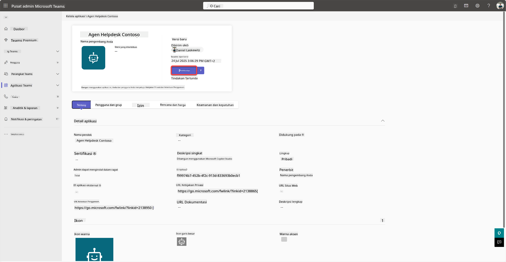

    Ketika administrator telah mempublikasikan pengajuan agen, Anda akan dapat menyegarkan Copilot Studio dan Anda seharusnya melihat banner *available in app store* di opsi ketersediaan.

    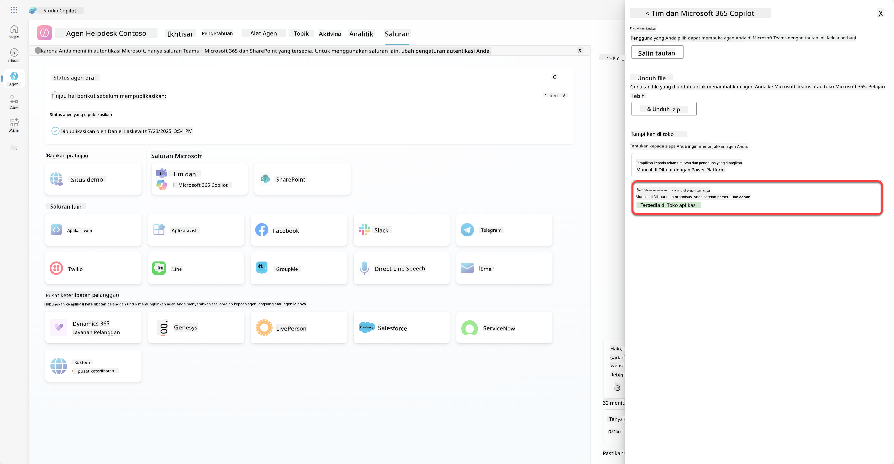

Ada lebih banyak kemungkinan di sini. Administrator Anda dapat mengubah kebijakan pengaturan global dan secara otomatis menginstal Contoso Helpdesk Agent untuk semua orang di tenant. Selain itu, Anda dapat menyematkan Contoso Helpdesk Agent ke panel kiri sehingga semua orang memiliki akses mudah ke sana.

## ✅ Misi Selesai

🎉 **Selamat!** Anda berhasil mempublikasikan agen Anda dan menambahkannya ke Teams dan Microsoft 365 Copilot! Selanjutnya adalah misi terakhir dari kursus ini: Memahami lisensi.

⏭️ [Lanjut ke pelajaran **Memahami lisensi**](../12-understanding-licensing/README.md)

## 📚 Sumber Daya Taktis

🔗 [Dokumentasi saluran publikasi](https://learn.microsoft.com/microsoft-copilot-studio/publication-fundamentals-publish-channels)

---

**Penafian**:  
Dokumen ini telah diterjemahkan menggunakan layanan penerjemahan AI [Co-op Translator](https://github.com/Azure/co-op-translator). Meskipun kami berupaya untuk memberikan hasil yang akurat, harap diketahui bahwa terjemahan otomatis mungkin mengandung kesalahan atau ketidakakuratan. Dokumen asli dalam bahasa aslinya harus dianggap sebagai sumber yang otoritatif. Untuk informasi yang bersifat kritis, disarankan menggunakan jasa penerjemahan manusia profesional. Kami tidak bertanggung jawab atas kesalahpahaman atau penafsiran yang keliru yang timbul dari penggunaan terjemahan ini.