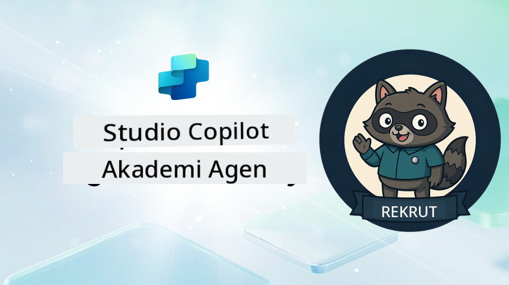

<!--
CO_OP_TRANSLATOR_METADATA:
{
  "original_hash": "8b5ecad9d5d073ea3f4c2b844e80f2e5",
  "translation_date": "2025-10-17T17:07:44+00:00",
  "source_file": "docs/recruit/README.md",
  "language_code": "id"
}
-->
# Selamat Datang, Rekrut

**Selamat datang, Rekrut.**  
Misi Anda—jika Anda memilih untuk menerimanya—adalah menguasai seni membangun agen menggunakan **Microsoft Copilot Studio**.

Pelatihan langsung ini adalah pintu masuk Anda ke **dunia agen**: mulai dari pembuatan prompt yang terarah hingga Adaptive Cards dan alur agen, Anda akan belajar cara membangun, mengembangkan, dan menerapkan agen cerdas menggunakan alat dan kasus nyata.

---

## 🎯 Tujuan Misi

Dengan menyelesaikan Akademi Agen, Anda akan dapat:

- Memahami apa itu agen dalam konteks Microsoft Copilot Studio
- Mengeksplorasi bagaimana Large Language Models (LLMs), retrieval-augmented generation (RAG), dan orkestrasi bekerja bersama dalam sebuah agen
- Membangun agen **deklaratif** dan **kustom**
- Meningkatkan agen dengan **Topik**, **Adaptive Cards**, dan **Alur Agen**
- Menerapkan agen ke **Microsoft Teams** dan **Microsoft 365 Copilot**

---

## 🧪 Prasyarat

Untuk menyelesaikan semua misi, Anda memerlukan:

- Tenant Pengembang Microsoft 365 (dengan SharePoint diaktifkan)
- Akses ke **Microsoft Copilot Studio** (versi uji coba atau berlisensi)
- Opsional: Pengetahuan dasar tentang SharePoint, Power Platform, atau Power Fx

---

## 🧬 Untuk Siapa Kursus Ini

Kursus ini ideal untuk:

- Pembuat dan pengembang yang mengeksplorasi **Copilot Studio**
- Profesional IT yang membangun **ekstensi Microsoft 365 Copilot**
- Penggemar Power Platform yang ingin **meningkatkan kemampuan** dengan agen cerdas
- Siapa saja yang lebih suka belajar dengan **praktik langsung**

---

## 🧭 Gambaran Kurikulum

Akademi ini dibagi menjadi pelajaran progresif—masing-masing dirancang sebagai misi lapangan untuk meningkatkan keterampilan Anda dalam membangun agen.

| Pelajaran | Judul | Ringkasan Misi |
|-----------|-------|----------------|
| `00` | 🧰 [Persiapan Kursus](./00-course-setup/README.md) | Siapkan lingkungan pengembangan Anda, uji coba Copilot Studio, dan situs SharePoint |
| `01` | 🧠 [Pengantar Agen](./01-introduction-to-agents/README.md) | Memahami konsep AI percakapan, LLMs, dan agen otonom vs. deklaratif |
| `02` | 🛠️ [Dasar-Dasar Copilot Studio](./02-copilot-studio-fundamentals/README.md) | Pelajari elemen dasar: pengetahuan, keterampilan, otonomi |
| `03` | 👩‍💻 [Membuat Agen Deklaratif](./03-create-a-declarative-agent-for-M365Copilot/README.md) | Tambahkan agen Anda sendiri ke Microsoft 365 Copilot, berdasarkan prompt |
| `04` | 🧩 [Membuat Solusi](./04-creating-a-solution/README.md) | Paketkan agen Anda ke dalam solusi yang dapat digunakan kembali untuk pengelolaan lingkungan |
| `05` | 🚀 [Memulai dengan Agen yang Sudah Dibangun](./05-using-prebuilt-agents/README.md) | Gunakan dan sesuaikan agen template untuk mempercepat pengaturan |
| `06` | ✍️ [Membangun Agen Kustom](./06-create-agent-from-conversation/README.md) | Buat Copilot baru yang didasarkan pada sumber pengetahuan |
| `07` | 🧠 [Menambahkan Topik dengan Pemicu](./07-add-new-topic-with-trigger/README.md) | Gunakan Topik untuk mendefinisikan jalur pertanyaan/jawaban kustom |
| `08` | 🪪 [Meningkatkan dengan Adaptive Cards](./08-add-adaptive-card/README.md) | Bangun Adaptive Card menggunakan Power Fx dan SharePoint |
| `09` | 🔁 [Otomatisasi dengan Alur Agen](./09-add-an-agent-flow/README.md) | Gunakan input Adaptive Card untuk memicu alur belakang |
| `10` | 🧭 [Menambahkan Pemicu Acara](./10-add-event-triggers/README.md) | Aktifkan agen Anda untuk bertindak secara otonom menggunakan logika berbasis acara |
| `11` | 📢 [Menerbitkan Agen Anda](./11-publish-your-agent/README.md) | Terapkan agen Anda ke Microsoft Teams dan Microsoft 365 Copilot |
| `12` | 🪪 [Memahami Lisensi](./12-understanding-licensing/README.md) | Pelajari cara kerja lisensi dan penagihan dengan Copilot Studio |
| `13` | 🚨 [Mengamankan Lencana Rekrut Anda](./course-completion-badges-recruit/README.md) | Klaim lencana Anda dan tandai pencapaian Anda! |

!!! note
    ✅ Menyelesaikan kurikulum ini akan memberikan Anda lencana **Rekrut**.  
    🔓 **Operatif** dan **Komandan** akan dibuka pada fase berikutnya.

<!-- markdownlint-disable-next-line MD033 -->

---

**Penafian**:  
Dokumen ini telah diterjemahkan menggunakan layanan penerjemahan AI [Co-op Translator](https://github.com/Azure/co-op-translator). Meskipun kami berupaya untuk memberikan hasil yang akurat, harap diketahui bahwa terjemahan otomatis mungkin mengandung kesalahan atau ketidakakuratan. Dokumen asli dalam bahasa aslinya harus dianggap sebagai sumber yang otoritatif. Untuk informasi yang penting, disarankan menggunakan jasa penerjemahan manusia profesional. Kami tidak bertanggung jawab atas kesalahpahaman atau interpretasi yang keliru yang timbul dari penggunaan terjemahan ini.