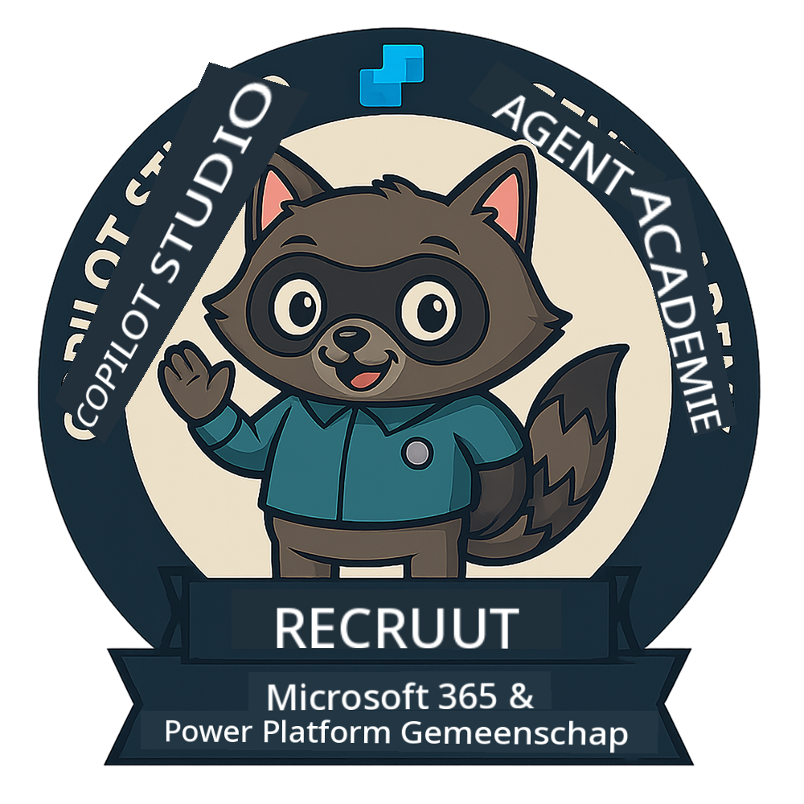
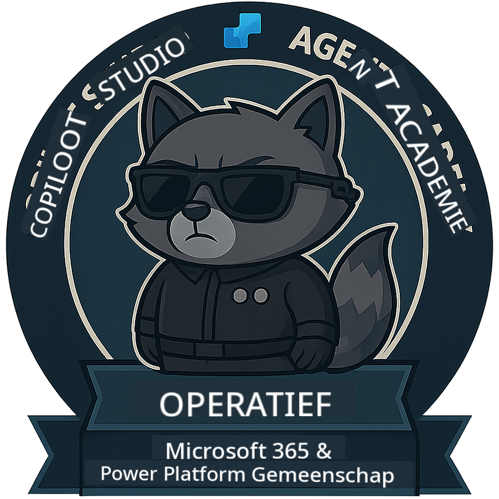

<!--
CO_OP_TRANSLATOR_METADATA:
{
  "original_hash": "15e57e059ce7689d602d7853187235cd",
  "translation_date": "2025-10-17T01:13:36+00:00",
  "source_file": "docs/index.md",
  "language_code": "nl"
}
-->
---
hide:
- navigation
---

# Copilot Studio Agent Academy

**Welkom bij Copilot Studio Agent Academy.**  

Jouw missie—als je deze accepteert—is om de kunst van het bouwen van agents te beheersen met **Microsoft Copilot Studio**.

Deze praktische training is jouw toegang tot de **wereld van agents**: van gerichte prompts tot Adaptive Cards en agent flows. Je leert hoe je intelligente agents kunt bouwen, opschalen en implementeren met behulp van echte tools en praktijkvoorbeelden.

---

## 🏅 Rangvoortgang

De **Copilot Studio Agent Academy** is een trainingsprogramma in meerdere fasen, ontworpen om jouw vaardigheden op te bouwen over drie agent-rangen. Elk niveau bevat een badge en toenemende verantwoordelijkheden:

| Rang             | Niveau | Visueel |
|------------------|:-----:|--------|
| 🟢 **Rekruut**  [🚀 Aan de slag](https://aka.ms/agent-academy-recruit){ .md-button .md-button--primary }     | •     | { width="300" }     |
| 🔵 **Operative** (Binnenkort beschikbaar)   | ••    | { width="300" } |
| 🟡 **Commandant** (Binnenkort beschikbaar)    | •••   | { width="300" } |

Elk niveau bouwt voort op het vorige. Voltooi jouw Rekruut-missie en blijf op de hoogte om jouw agent-kwalificaties verder te ontwikkelen.

---

## 🎒 Andere Cursussen

Bekijk deze andere cursussen om meer te leren over AI en Agents:

- [Microsoft Copilot Studio <3 MCP Lab](https://aka.ms/mcsmcplab)
- [Copilot Developer Camp](https://microsoft.github.io/copilot-camp/)
- [AI Agents voor Beginners](https://microsoft.github.io/ai-agents-for-beginners/)
- [Model Context Protocol (MCP) Voor Beginners](https://github.com/microsoft/mcp-for-beginners)

---

## 🚑 Problemen

We waarderen jouw feedback enorm! Gebruik de [problemenlijst](https://github.com/microsoft/agent-academy/issues) om jouw opmerkingen en problemen te delen. Bedankt!

---

## 📜 Gedragscode

Dit project heeft de [Microsoft Open Source Gedragscode](https://opensource.microsoft.com/codeofconduct/) aangenomen.

!!! info "Bronnen:"

    - [Microsoft Open Source Gedragscode](https://opensource.microsoft.com/codeofconduct/)
    - [Microsoft Gedragscode FAQ](https://opensource.microsoft.com/codeofconduct/faq/)
    - Neem contact op met [opencode@microsoft.com](mailto:opencode@microsoft.com) voor vragen of zorgen

---

[⭐️ Geef onze repo een ster](https://github.com/microsoft/agent-academy){ .md-button .md-button--primary }

<!-- markdownlint-disable-next-line MD033 -->

---

**Disclaimer**:  
Dit document is vertaald met behulp van de AI-vertalingsservice [Co-op Translator](https://github.com/Azure/co-op-translator). Hoewel we streven naar nauwkeurigheid, dient u zich ervan bewust te zijn dat geautomatiseerde vertalingen fouten of onnauwkeurigheden kunnen bevatten. Het originele document in de oorspronkelijke taal moet worden beschouwd als de gezaghebbende bron. Voor kritieke informatie wordt professionele menselijke vertaling aanbevolen. Wij zijn niet aansprakelijk voor eventuele misverstanden of verkeerde interpretaties die voortvloeien uit het gebruik van deze vertaling.