<!--
CO_OP_TRANSLATOR_METADATA:
{
  "original_hash": "4fb913dfc3bbc71506dd3602c4b8e6ed",
  "translation_date": "2025-10-17T01:45:15+00:00",
  "source_file": "docs/operative-preview/02-multi-agent/README.md",
  "language_code": "nl"
}
-->
# 🚨 Missie 02: Verbonden Agenten

--8<-- "disclaimer.md"

## 🕵️‍♂️ CODENAAM: `OPERATIE SYMPHONIE`

> **⏱️ Operatietijdvenster:** `~45 minuten`

## 🎯 Missieoverzicht

Welkom terug, Agent. In Missie 01 heb je je belangrijkste Wervingsagent gebouwd - een solide basis voor het beheren van wervingsprocessen. Maar één agent kan niet alles alleen doen.

Je opdracht, als je deze accepteert, is **Operatie Symphonie** - het transformeren van je enkele agent in een **multi-agent systeem**: een georkestreerd team van gespecialiseerde agenten die samenwerken om complexe wervingsuitdagingen aan te pakken. Denk aan een symfonieorkest waarin elke muzikant zijn rol speelt in perfecte harmonie. Je voegt twee cruciale specialisten toe aan je bestaande Wervingsagent: een Aanmeldingsagent om cv's automatisch te verwerken en een Interviewvoorbereidingsagent om uitgebreide interviewmaterialen te maken. Deze agenten werken naadloos samen onder jouw hoofdorkestrator.

## 🔎 Doelstellingen

In deze missie leer je:

1. Wanneer je **subagenten** versus **verbonden agenten** moet gebruiken  
1. Hoe je **multi-agent architecturen** ontwerpt die schaalbaar zijn  
1. Het creëren van **subagenten** voor gerichte taken  
1. Het opzetten van **communicatiepatronen** tussen agenten  
1. Het bouwen van de Aanmeldingsagent en de Interviewvoorbereidingsagent  

## 🧠 Wat zijn verbonden agenten?

In Copilot Studio ben je niet beperkt tot het bouwen van enkele, monolithische agenten. Je kunt **multi-agent systemen** creëren - netwerken van gespecialiseerde agenten die samenwerken om complexe workflows te beheren.

Denk aan een echte organisatie: in plaats van één persoon die alles doet, heb je specialisten die uitblinken in specifieke taken en samenwerken wanneer dat nodig is.

### Waarom multi-agent systemen belangrijk zijn

- **Schaalbaarheid:** Elke agent kan onafhankelijk worden ontwikkeld, getest en onderhouden door verschillende teams.  
- **Specialisatie:** Agenten kunnen zich richten op wat ze het beste doen. Misschien één voor gegevensverwerking, een andere voor gebruikersinteractie, en weer een andere voor besluitvorming.  
- **Flexibiliteit:** Je kunt agenten combineren, hergebruiken in verschillende projecten en je systeem geleidelijk ontwikkelen.  
- **Onderhoudbaarheid:** Wijzigingen aan één agent hebben niet noodzakelijk invloed op andere, waardoor updates veiliger en eenvoudiger worden.

### Voorbeeld uit de praktijk: Wervingsproces

Denk aan onze wervingsworkflow - meerdere agenten kunnen samenwerken met de volgende verantwoordelijkheden:

- **Cv-verwerking** vereist documentanalyse en gegevensextractievaardigheden  
- **Scoring** houdt in dat kandidaat-cv's worden geëvalueerd en afgestemd op functievereisten  
- **Interviewvoorbereiding** vereist diepgaande analyse van de geschiktheid van kandidaten  
- **Kandidaatcommunicatie** vereist empathische communicatieve vaardigheden  

In plaats van één enorme agent te bouwen die probeert al deze verschillende vaardigheden te beheersen, kun je gespecialiseerde agenten creëren voor elk gebied en ze samen laten werken.

## 🔗 Subagenten versus verbonden agenten: Het belangrijkste verschil

Copilot Studio biedt twee manieren om multi-agent systemen te bouwen, elk met verschillende gebruiksscenario's:

### ↘️ Subagenten

Subagenten zijn **lichte specialisten** die binnen je hoofdagent leven. Zie ze als gespecialiseerde teams binnen dezelfde afdeling.

#### Belangrijke technische details

- Subagenten leven binnen de hoofdagent en hebben één configuratiepagina.  
- Tools en kennis worden **opgeslagen bij de hoofdagent**, maar geconfigureerd om "Beschikbaar te zijn voor" de subagent.  
- Subagenten **delen de onderwerpen** van hun hoofdagent. Onderwerpen kunnen worden gebruikt in de instructies van de subagent.  
- Subagenten **hoeven niet apart gepubliceerd te worden** - ze zijn automatisch beschikbaar binnen hun hoofdagent zodra ze zijn gemaakt. Dit maakt testen eenvoudiger omdat wijzigingen aan de hoofd- en subagenten kunnen worden uitgevoerd in dezelfde gedeelde werkruimte.  

#### Gebruik subagenten wanneer

- Eén team beheert de hele oplossing  
- Je wilt tools en kennis logisch organiseren in subagenten  
- Je hebt geen aparte authenticatie of implementatie nodig voor elke agent  
- De agenten niet apart gepubliceerd of onafhankelijk gebruikt hoeven te worden  
- Je de agenten niet opnieuw hoeft te gebruiken in meerdere oplossingen  

**Voorbeeld:** Een IT-helpdeskagent met subagenten voor:

- Procedures voor het resetten van wachtwoorden  
- Hardwareproblemen oplossen  
- Software-installatiehandleidingen  

### 🔀 Verbonden agenten

Verbonden agenten zijn **volwaardige, onafhankelijke agenten** waarmee je hoofdagent kan samenwerken. Zie ze als aparte afdelingen die samenwerken aan een project.

#### Belangrijke technische details

- Verbonden agenten hebben **hun eigen onderwerpen** en gespreksstromen. Ze werken onafhankelijk met hun eigen instellingen, logica en implementatielevenscyclus.  
- Verbonden agenten **moeten gepubliceerd worden** voordat ze kunnen worden toegevoegd aan en gebruikt door andere agenten.  
- Tijdens het testen moeten wijzigingen aan de verbonden agent worden gepubliceerd voordat ze kunnen worden gebruikt door de aanroepende agent.  

#### Gebruik verbonden agenten wanneer

- Meerdere teams ontwikkelen en onderhouden verschillende agenten onafhankelijk  
- Agenten hebben hun eigen instellingen, authenticatie en implementatiekanalen nodig  
- Je wilt agenten apart publiceren en onderhouden met een onafhankelijke levenscyclusbeheer (ALM) voor elke agent  
- Agenten moeten herbruikbaar zijn in meerdere oplossingen  

**Voorbeeld:** Een klantenservicesysteem dat verbinding maakt met:

- Een aparte factureringsagent onderhouden door het financiële team  
- Een aparte technische ondersteuningsagent onderhouden door het productteam  
- Een aparte retouragent onderhouden door het operationele team  

!!! tip "Tip"
    Je kunt beide benaderingen combineren! Bijvoorbeeld, je hoofdagent kan verbinding maken met externe agenten van andere teams terwijl hij ook zijn eigen subagenten heeft voor gespecialiseerde interne taken.

## 🎯 Multi-agent architectuurpatronen

Bij het ontwerpen van multi-agent systemen ontstaan verschillende patronen op basis van hoe agenten met elkaar communiceren:

| Patroon              | Beschrijving                                                                 | Beste voor                                                      |
|----------------------|-----------------------------------------------------------------------------|---------------------------------------------------------------|
| **Hub en Spoke**    | Een hoofdorkestrator-agent coördineert met meerdere gespecialiseerde agenten. De orkestrator handelt gebruikersinteractie af en delegeert taken aan sub- of verbonden agenten. | Complexe workflows waarbij één agent gespecialiseerde taken coördineert |
| **Pipeline**         | Agenten geven werk sequentieel door van de ene naar de andere, waarbij elke waarde toevoegt voordat het naar de volgende fase gaat. | Lineaire processen zoals applicatieverwerking (aanmelding → screening → interview → beslissing) |
| **Samenwerkend**    | Agenten werken tegelijkertijd samen aan verschillende aspecten van hetzelfde probleem, waarbij ze context en resultaten delen. | Complexe analyses die meerdere perspectieven of expertisegebieden vereisen |

!!! tip "Tip"
    Je kunt zelfs een hybride van twee of meer van deze patronen hebben.

## 💬Agentcommunicatie en contextdeling

Wanneer agenten samenwerken, moeten ze effectief informatie delen. Hier is hoe dit werkt in Copilot Studio:

### Gespreksgeschiedenis

Standaard kan een hoofdagent bij het aanroepen van een sub- of verbonden agent de **gespreksgeschiedenis** doorgeven. Dit geeft de gespecialiseerde agent volledige context over wat de gebruiker heeft besproken.

Je kunt dit uitschakelen om veiligheids- of prestatie-redenen - bijvoorbeeld als de gespecialiseerde agent alleen een specifieke taak hoeft uit te voeren zonder de volledige gesprekscontext nodig te hebben. Dit kan een goede verdediging zijn tegen **gegevenslekken**.

### Expliciete instructies

Je hoofdagent kan **specifieke instructies** geven aan sub- of verbonden agenten. Bijvoorbeeld: "Verwerk dit cv en vat hun vaardigheden samen voor de functie van Senior Developer."

### Retourwaarden

Agenten kunnen gestructureerde informatie teruggeven aan de aanroepende agent, waardoor de hoofdagent die informatie kan gebruiken in volgende stappen of kan delen met andere agenten.

### Dataverse-integratie

Voor complexere scenario's kunnen agenten informatie delen via **Dataverse** of andere gegevensopslagplaatsen, waardoor persistente contextdeling mogelijk wordt over meerdere interacties.

## ↘️Subagent: Aanmeldingsagent

Laten we beginnen met het bouwen van ons multi-agent wervingssysteem. Onze eerste specialist wordt de **Aanmeldingsagent** - een subagent die verantwoordelijk is voor het verwerken van binnenkomende cv's en kandidaat-informatie.

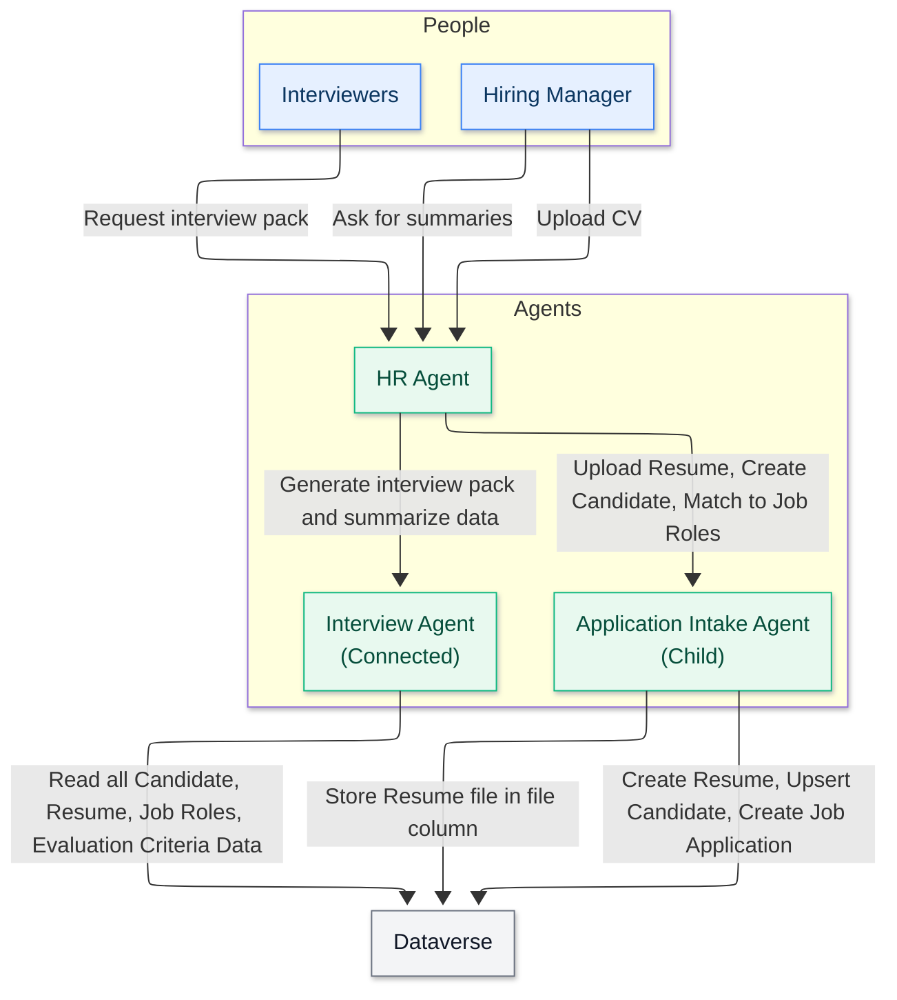
```mermaid
---
config:
  layout: elk
  look: neo
---
flowchart TB
 subgraph People["People"]
    direction TB
        HiringManager["Hiring Manager"]
        Interviewers["Interviewers"]
  end
 subgraph Agents["Agents"]
    direction LR
        ApplicationIntakeAgent["Application Intake Agent<br>(Child)"]
        InterviewAgent["Interview Agent<br>(Connected)"]
        HRAgent["HR Agent"]
  end
    HiringManager -- Upload CV --> HRAgent
    HRAgent -- Upload Resume, Create Candidate, Match to Job Roles --> ApplicationIntakeAgent
    ApplicationIntakeAgent -- Create Resume, Upsert Candidate, Create Job Application --> Dataverse["Dataverse"]
    ApplicationIntakeAgent -- Store Resume file in file column --> Dataverse
    HiringManager -- Ask for summaries --> HRAgent
    Interviewers -- Request interview pack --> HRAgent
    HRAgent -- Generate interview pack and summarize data --> InterviewAgent
    InterviewAgent -- Read all Candidate, Resume, Job Roles, Evaluation Criteria Data --> Dataverse
     HiringManager:::person
     Interviewers:::person
     ApplicationIntakeAgent:::agent
     InterviewAgent:::agent
     HRAgent:::agent
     Dataverse:::data
    classDef person fill:#e6f0ff,stroke:#3b82f6,color:#0b3660
    classDef agent fill:#e8f9ef,stroke:#10b981,color:#064e3b
    classDef data  fill:#f3f4f6,stroke:#6b7280,color:#111827
```

### 🤝Verantwoordelijkheden van de Aanmeldingsagent

- **Cv-inhoud verwerken** van PDF's die via interactieve chat worden aangeleverd (In een toekomstige missie leer je hoe je cv's autonoom kunt verwerken).  
- **Gestructureerde gegevens extraheren** (naam, vaardigheden, ervaring, opleiding)  
- **Kandidaten matchen met openstaande functies** op basis van kwalificaties en motivatiebrief  
- **Kandidaatinformatie opslaan** in Dataverse voor latere verwerking  
- **Dubbele aanmeldingen verwijderen** om te voorkomen dat dezelfde kandidaat twee keer wordt aangemaakt, en matchen met bestaande records via het e-mailadres dat uit het cv is gehaald.  

### ⭐Waarom dit een subagent moet zijn

De Aanmeldingsagent past perfect als subagent omdat:

- Het gespecialiseerd is in documentverwerking en gegevensextractie  
- Het geen aparte publicatie nodig heeft  
- Het deel uitmaakt van onze algemene wervingsoplossing die door hetzelfde team wordt beheerd  
- Het zich richt op een specifieke trigger (nieuw cv ontvangen) en wordt aangeroepen vanuit de Wervingsagent.  

## 🔀Verbonden agent: Interviewvoorbereidingsagent  

Onze tweede specialist wordt de **Interviewvoorbereidingsagent** - een verbonden agent die helpt bij het maken van uitgebreide interviewmaterialen en het evalueren van kandidaatantwoorden.

### 🤝Verantwoordelijkheden van de Interviewvoorbereidingsagent

- **Interviewpakketten maken** met bedrijfsinformatie, functievereisten en evaluatiecriteria  
- **Interviewvragen genereren** afgestemd op specifieke functies en kandidaatachtergronden  
- **Algemene vragen beantwoorden** over de functies en sollicitaties voor communicatie met belanghebbenden  

### ⭐Waarom dit een verbonden agent moet zijn

De Interviewvoorbereidingsagent werkt beter als een verbonden agent omdat:

- Het talentacquisitieteam het mogelijk onafhankelijk wil gebruiken in meerdere wervingsprocessen  
- Het zijn eigen kennisbasis nodig heeft van interviewbest practices en evaluatiecriteria  
- Verschillende wervingsmanagers mogelijk het gedrag willen aanpassen voor hun teams  
- Het hergebruikt kan worden voor interne functies, niet alleen voor externe werving  

## 🧪Lab 2.1: De Aanmeldingsagent toevoegen

Klaar om theorie in praktijk te brengen? Laten we onze eerste subagent toevoegen aan je bestaande Wervingsagent.

### Vereisten om deze missie te voltooien

Je moet **ofwel**:

- **Missie 01 hebben voltooid** en je Wervingsagent klaar hebben, **OF**  
- **De starteroplossing van Missie 02 importeren** als je opnieuw begint of moet inhalen. [Download Missie 02 Starteroplossing](https://aka.ms/agent-academy)

!!! note "Oplossing importeren en voorbeeldgegevens"
    Als je de starteroplossing gebruikt, raadpleeg [Missie 01](../01-get-started/README.md) voor gedetailleerde instructies over hoe je oplossingen en voorbeeldgegevens in je omgeving kunt importeren.

### 2.1.1 Oplossing instellen

1. Binnen Copilot Studio, selecteer de ellipsis (...) onder Tools in de linker navigatie.  
1. Selecteer **Oplossingen**.  
    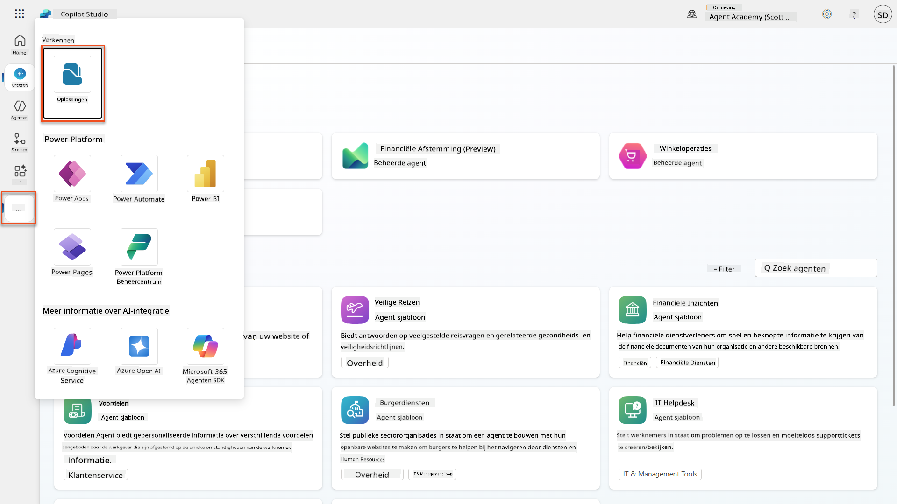  
1. Zoek je Operative-oplossing, selecteer de **ellipsis (...)** ernaast en kies **Stel voorkeursoplossing in**. Dit zorgt ervoor dat al je werk aan deze oplossing wordt toegevoegd.  
      

### 2.1.2 Configureer de instructies van je Wervingsagent

1. **Navigeer** naar Copilot Studio. Zorg ervoor dat je omgeving is geselecteerd in de rechterbovenhoek **Omgevingskiezer**.  

1. Open je **Wervingsagent** van Missie 01  

1. Selecteer **Bewerken** in de sectie **Instructies** van het tabblad **Overzicht**, en voeg de volgende instructies toe aan de bovenkant:  

    ```text
    You are the central orchestrator for the hiring process. You coordinate activities, provide summaries, and delegate work to specialized agents.
    ```

1. Selecteer **Opslaan**  
    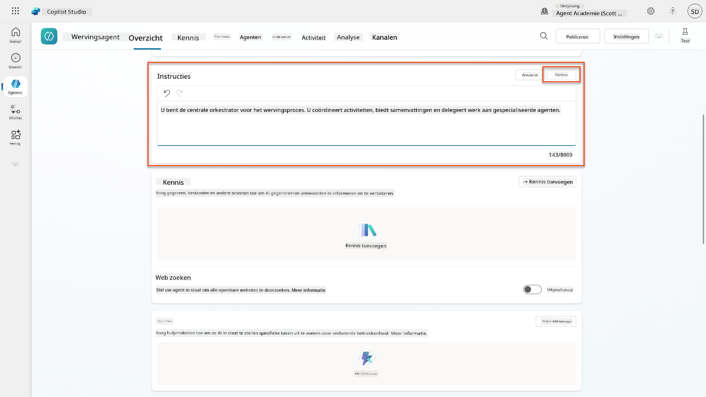  

1. Selecteer **Instellingen** (rechtsboven)  

1. Zorg ervoor dat de volgende instellingen zijn:

    | Instelling | Waarde |
    |------------|--------|
    | Gebruik generatieve AI-orkestratie voor de reacties van je agent | **Ja** |
    | Contentmoderatie | **Matig** |
    | Gebruik algemene kennis | **Uit** |
    | Gebruik informatie van het web | **Uit** |
    | Bestandsuploads | **Aan** |

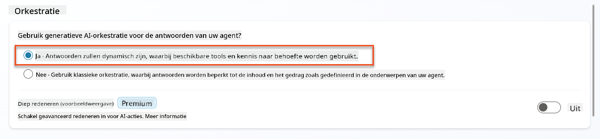  
  
  

### 2.1.3 Voeg de subagent Aanmeldingsagent toe

1. **Navigeer** naar het tabblad **Agenten** binnen je Wervingsagent - hier voeg je specialistische agenten toe.  

1. Selecteer **+ Toevoegen** en vervolgens **Maak een agent**. Merk op dat dit is gelabeld met "*Maak een lichte agent die binnen je huidige agent leeft en zijn instellingen overneemt. Ideaal voor het opsplitsen van complexe logica* "  
    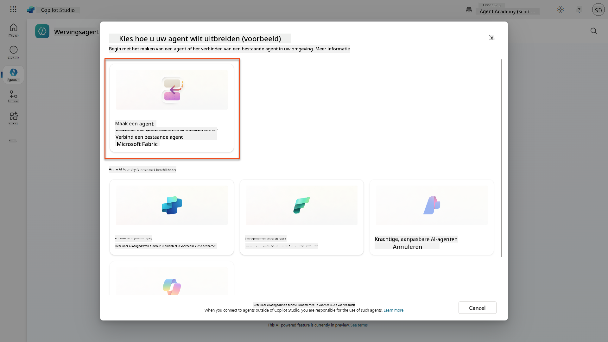  

1. **Geef** je agent de naam `Aanmeldingsagent`  

1. Selecteer **De agent kiest** - Gebaseerd op beschrijving in de **Wanneer wordt dit gebruikt?** dropdown. Deze opties zijn vergelijkbaar met de triggers die kunnen worden geconfigureerd voor onderwerpen.  

1. Stel de **Beschrijving** in op:

    ```text
    Processes incoming resumes and stores candidates in the system
    ```

    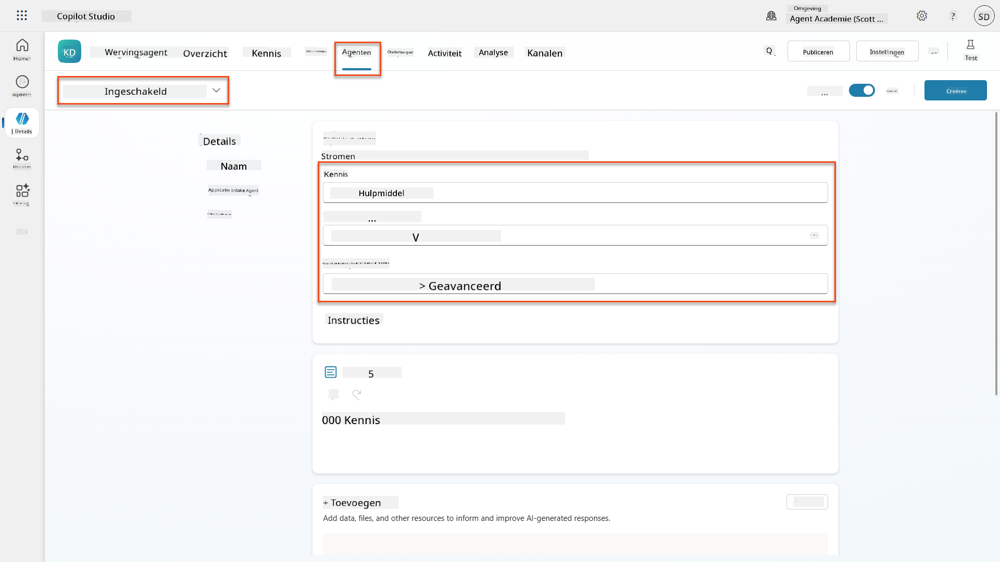  

1. Breid **Geavanceerd** uit en stel de Prioriteit in op `10000`. Dit zorgt ervoor dat later de Interviewagent wordt gebruikt om algemene vragen te beantwoorden voordat deze wordt gebruikt. Hier kan ook een voorwaarde worden ingesteld, zoals ervoor zorgen dat er minstens één bijlage is.  

1. Zorg ervoor dat de schakelaar **Web Search** is ingesteld op **Uitgeschakeld**. Dit komt omdat we alleen informatie willen gebruiken die door de hoofdagent wordt verstrekt.  

1. Selecteer **Opslaan**  

### 2.1.4 Configureer de cv-upload agent flow

Agenten kunnen geen acties uitvoeren zonder tools of onderwerpen te krijgen.  
We gebruiken **Agent Flow tools** in plaats van Topics voor de stap *Upload CV*, omdat dit meerstaps backendproces deterministische uitvoering en integratie met externe systemen vereist. Hoewel Topics het beste zijn voor het begeleiden van een conversatiedialoog, bieden Agent Flows de gestructureerde automatisering die nodig is om bestandverwerking, gegevensvalidatie en database-updates (nieuwe invoer of bestaande bijwerken) betrouwbaar af te handelen zonder afhankelijk te zijn van gebruikersinteractie.

1. Zoek de sectie **Tools** op de pagina van de Application Intake Agent.  
   **Belangrijk:** Dit is niet de Tools-tab van de hoofdagent, maar kan worden gevonden door naar beneden te scrollen onder de instructies van de subagent.

1. Selecteer **+ Add**  
   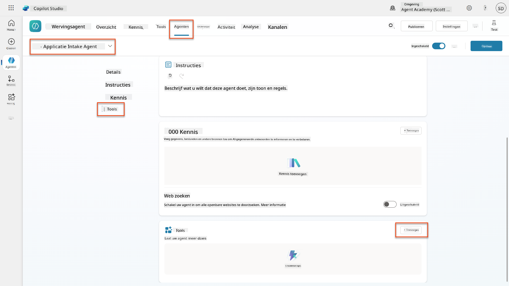

1. Selecteer **+ New tool** 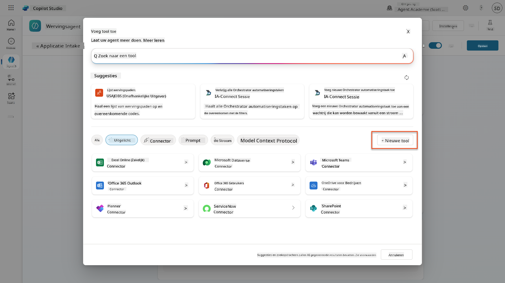

1. Selecteer **Agent flow**.  
   De Agent Flow designer wordt geopend, hier voegen we de logica voor het uploaden van het CV toe.  
   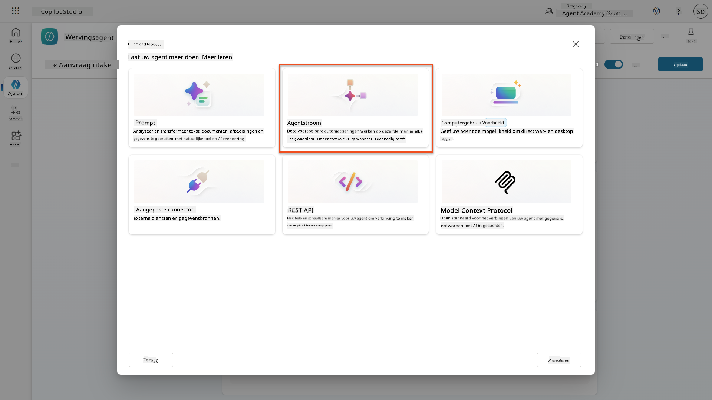

1. Selecteer de **When an agent calls the flow**-node en selecteer **+ Add** om een invoer toe te voegen voor de volgende parameters, waarbij je zowel de naam als de beschrijving toevoegt.

    | Type  | Naam      | Beschrijving                                                                                                 |
    |-------|-----------|------------------------------------------------------------------------------------------------------------|
    | File  | Resume    | Het CV PDF-bestand                                                                                         |
    | Text  | Message   | Haal een motivatiebriefachtige boodschap uit de context. De boodschap mag niet langer zijn dan 2000 tekens. |
    | Text  | UserEmail | Het e-mailadres waar het CV vandaan komt. Dit is de gebruiker die het CV uploadt in de chat, of het afzenderadres als het per e-mail is ontvangen. |

    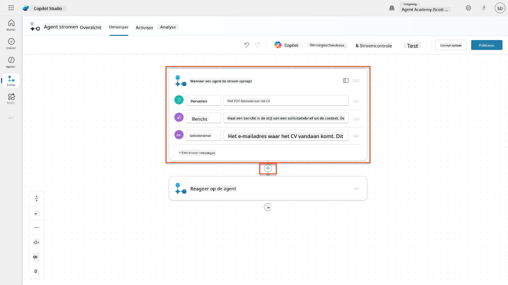

1. Selecteer het **+ icoon** onder de trigger-node, zoek naar `Dataverse`, selecteer **See more** naast Microsoft Dataverse, en selecteer vervolgens de actie **Add a new row** in de sectie **Microsoft Dataverse**  
    

1. Geef de node de naam **Create Resume**, door de **ellipsis(...)** te selecteren en **Rename** te kiezen  
    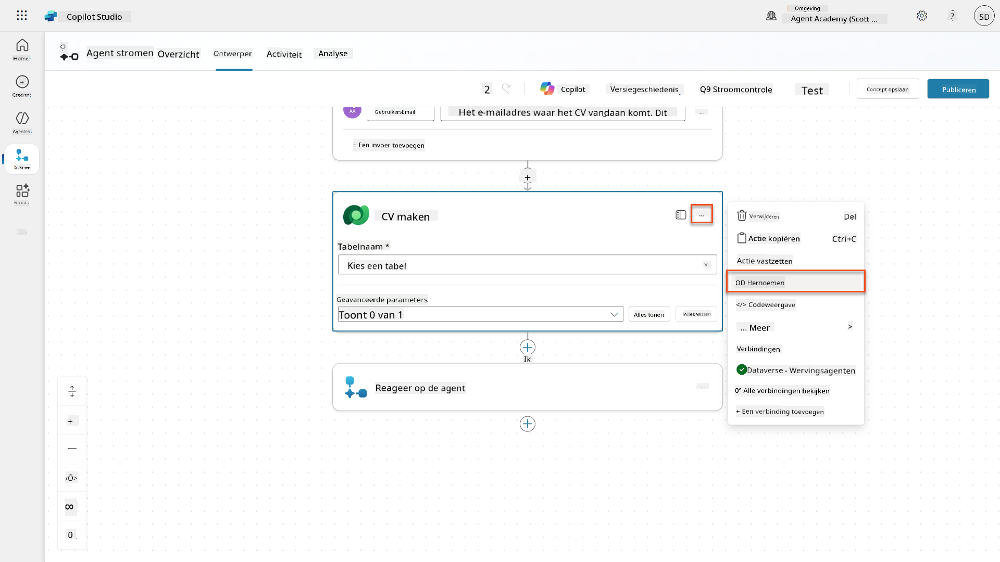

1. Stel de **Table name** in op **Resumes**, selecteer vervolgens **Show all** om alle parameters weer te geven.

1. Stel de volgende **eigenschappen** in:

    | Eigenschap              | Hoe in te stellen              | Details / Expressie                                           |
    |-------------------------|--------------------------------|--------------------------------------------------------------|
    | **Resume Title**        | Dynamische data (bliksemschicht-icoon) | **When an agent calls the flow** → **Resume name**    Als je de Resume name niet ziet, zorg er dan voor dat je de Resume-parameter hierboven hebt geconfigureerd als een datatype. |
    | **Cover letter**        | Expressie (fx-icoon)          | `if(greater(length(triggerBody()?['text']), 2000), substring(triggerBody()?['text'], 0, 2000), triggerBody()?['text'])` |
    | **Source Email Address**| Dynamische data (bliksemschicht-icoon) | **When an agent calls the flow** → **UserEmail**             |
    | **Upload Date**         | Expressie (fx-icoon)          | `utcNow()`                                                   |

    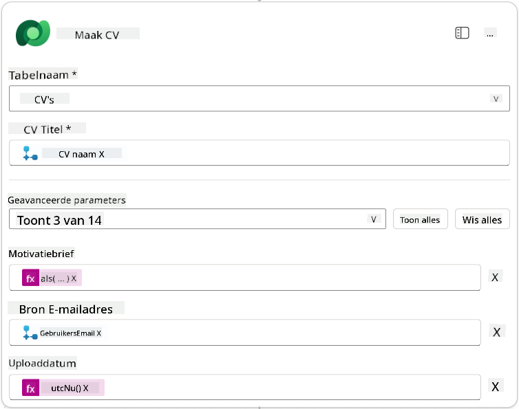

1. Selecteer het **+ icoon** onder de Create Resume-node, zoek naar `Dataverse`, selecteer **See more** naast Microsoft Dataverse, en selecteer vervolgens de actie **Upload a file or an image**.  
   **Belangrijk:** Zorg ervoor dat je niet de actie Upload a file or an image to the selected environment selecteert.

1. Geef de node de naam **Upload Resume File**, door de **ellipsis(...)** te selecteren en **Rename** te kiezen.

1. Stel de volgende **eigenschappen** in:

     | Eigenschap | Hoe in te stellen | Details |
     |------------|-------------------|---------|
     | **Content name** | Dynamische data (bliksemschicht-icoon) | When an agent calls the flow → Resume name |
     | **Table name** | Selecteer | Resumes |
     | **Row ID** | Dynamische data (bliksemschicht-icoon) | Create Resume → See more → Resume |
     | **Column Name** | Selecteer | Resume PDF |
     | **Content** | Dynamische data (bliksemschicht-icoon) | When an agent calls the flow → Resume contentBytes |

     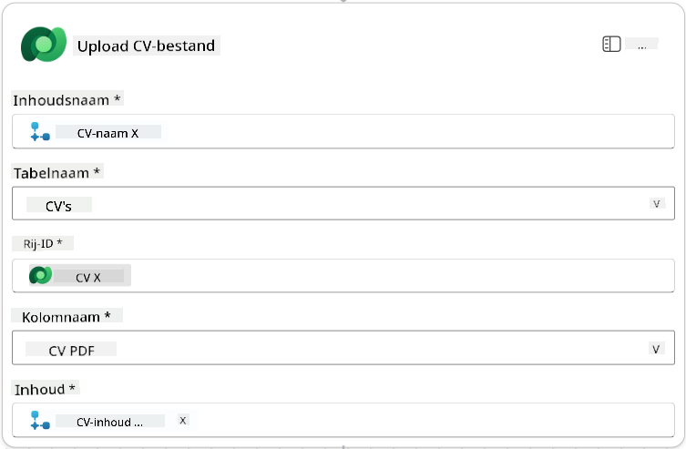

1. Selecteer de **Respond to the agent node**, en selecteer vervolgens **+ Add an output**

     | Eigenschap | Hoe in te stellen | Details |
     |------------|-------------------|---------|
     | **Type** | Selecteer | `Text` |
     | **Name** | Voer in | `ResumeNumber` |
     | **Value** | Dynamische data (bliksemschicht-icoon) | Create Resume → See More → Resume Number |
     | **Description** | Voer in | `Het [ResumeNumber] van het aangemaakte CV` |

     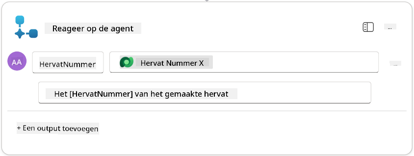

1. Selecteer **Save draft** rechtsboven  
     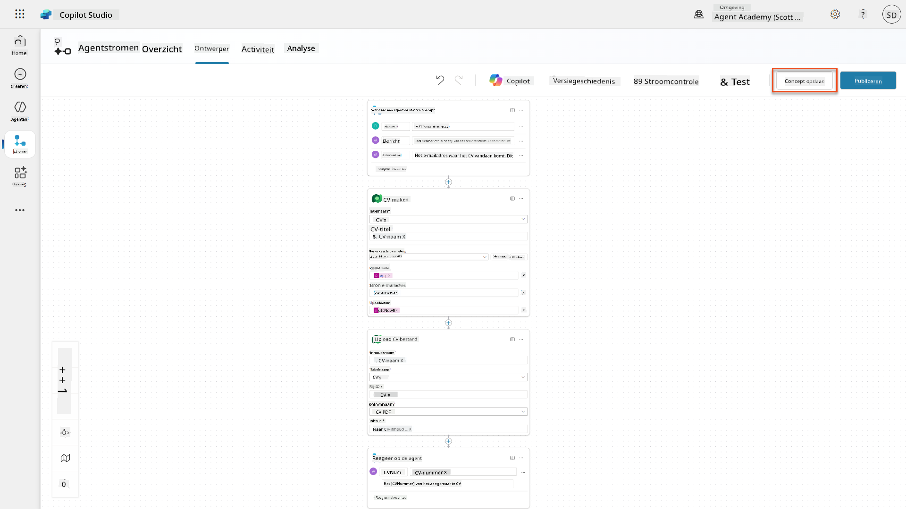

1. Selecteer de **Overview**-tab, selecteer **Edit** in het **Details**-paneel

     1. **Flow name**:`Resume Upload`
     1. **Description**:`Uploads een CV wanneer hierom gevraagd wordt`

     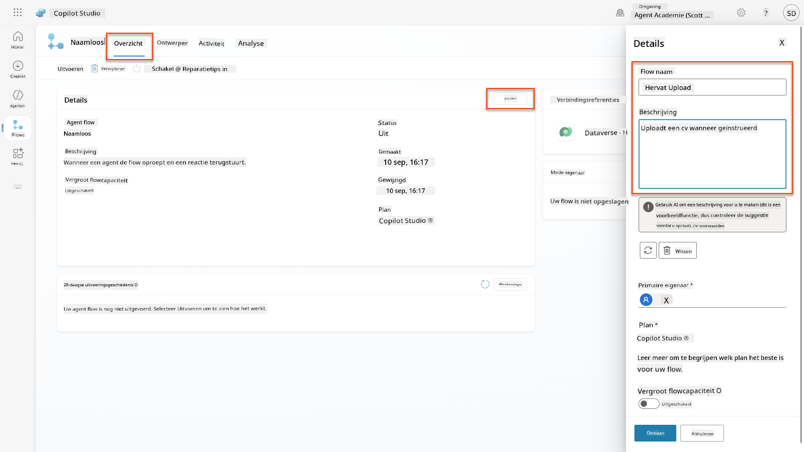

1. Selecteer opnieuw de **Designer**-tab en selecteer **Publish**.  
     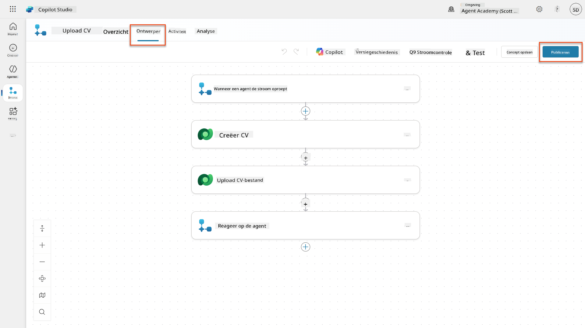

### 2.1.5 Verbind de flow met je agent

Nu verbind je de gepubliceerde flow met je Application Intake Agent.

1. Navigeer terug naar de **Hiring Agent** en selecteer de **Agents**-tab. Open de **Application Intake Agent** en zoek het **Tools**-paneel.  
    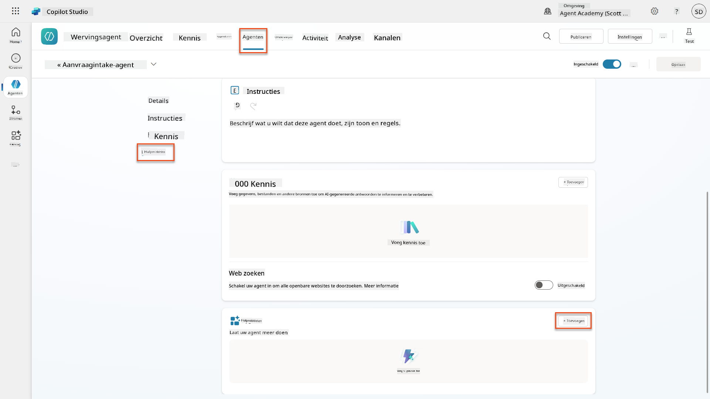

1. Selecteer **+ Add**

1. Selecteer de **Flow**-filter en zoek naar `Resume Upload`. Selecteer de **Resume Upload**-flow en vervolgens **Add and configure**.

1. Stel de volgende parameters in:

    | Parameter | Waarde |
    |-----------|--------|
    | **Description** | `Uploads een CV wanneer hierom gevraagd wordt. STRIKTE REGEL: Roep deze tool alleen op wanneer verwezen in de vorm "Resume Upload" en er zijn Bijlagen` |
    | **Additional details → When this tool may be used** | `alleen wanneer verwezen door topics of agents` |
    | **Inputs → Add Input** | `contentBytes` |
    | **Inputs → Add Input** | `name` |

    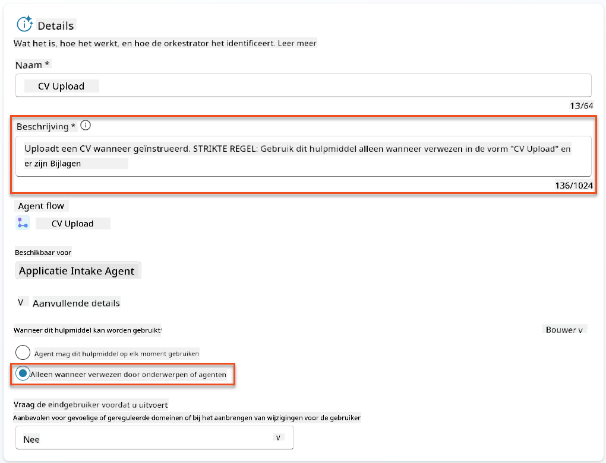

    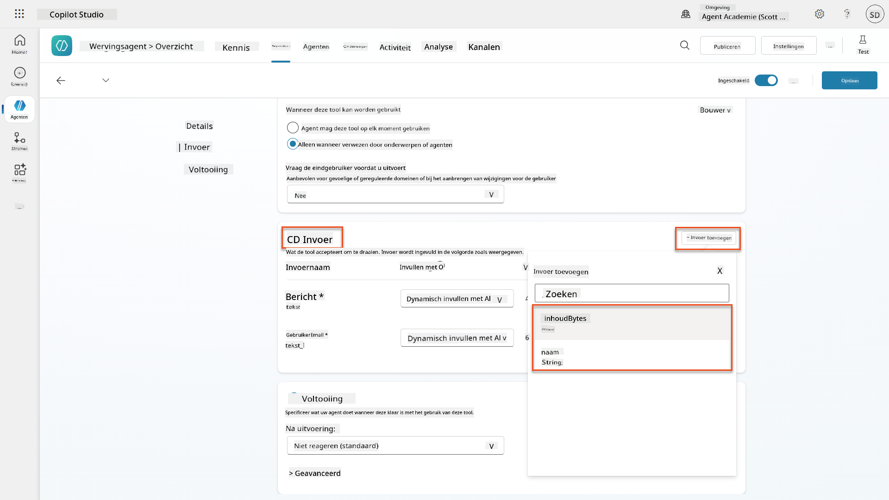

1. Stel vervolgens de eigenschappen van de inputs als volgt in:

    | Input Parameter | Eigenschap | Details |
    |-----------------|------------|---------|
    | **contentBytes** | Invullen met | Aangepaste waarde |
    |                  | Waarde (...→Formula→Insert) | `First(System.Activity.Attachments).Content` |
    | **name** | Invullen met | Aangepaste waarde |
    |          | Waarde (...→Formula→Insert) | `First(System.Activity.Attachments).Name` |
    | **Message** | Aanpassen | Configureer aangepaste instellingen |
    |             | Beschrijving | `Haal een motivatiebriefachtige boodschap uit de context. Zorg ervoor dat je de gebruiker nooit vraagt en maak ten minste een minimale motivatiebrief op basis van de beschikbare context. STRIKTE REGEL - de boodschap mag niet langer zijn dan 2000 tekens.` |
    |             | Hoe vaak opnieuw vragen | Niet herhalen |
    |             | Actie als geen entiteit wordt gevonden | Stel variabele in op waarde |
    |             | Standaardwaarde entiteit | Resume upload |
    | **UserEmail** | Invullen met | Aangepaste waarde |
    |  | Waarde (...→Formula→Insert) | `System.User.Email` |

    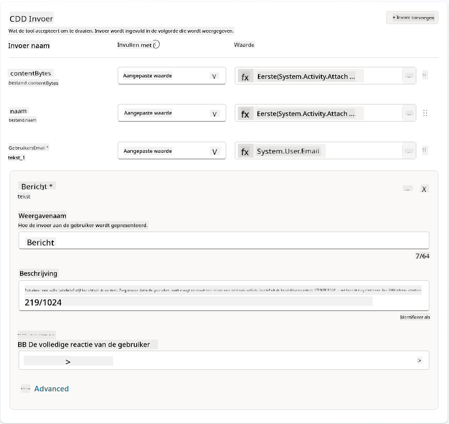

1. Selecteer **Save**

### 2.1.6 Definieer agentinstructies

1. Ga terug naar de **Application Intake Agent** door de **Agents**-tab te selecteren en zoek het **Instructions**-paneel.

1. Plak in het **Instructions**-veld de volgende duidelijke richtlijnen voor je subagent:

    ```text
    You are tasked with managing incoming Resumes, Candidate information, and creating Job Applications.  
    Only use tools if the step exactly matches the defined process. Otherwise, indicate you cannot help.  
    
    Process for Resume Upload via Chat  
    1. Upload Resume  
      - Trigger only if /System.Activity.Attachments contains exactly one new resume.  
      - If more than one file, instruct the user to upload one at a time and stop.  
      - Call /Upload Resume once. Never upload more than once for the same message.  
    
    2. Post-Upload  
      - Always output the [ResumeNumber] (R#####).  
    ```

1. Waar de instructies een schuine streep (/) bevatten, selecteer de tekst na de / en selecteer de opgeloste naam. Doe dit voor:

    - `System.Activity.Attachments` (Variabele)
    - `Upload Resume` (Tool)

    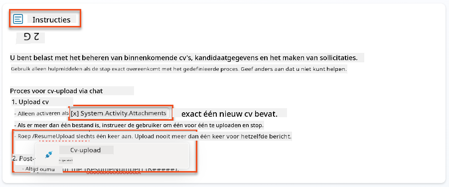

1. Selecteer **Save**

### 2.1.7 Test je Application Intake Agent

Laten we nu controleren of je eerste orkestlid correct werkt.

1. **Download** de [test-CV's.](https://download-directory.github.io/?url=https://github.com/microsoft/agent-academy/tree/main/operative/sample-data/resumes&filename=operative_sampledata)

1. **Open** het testpaneel door **Test** te selecteren.

1. **Upload** twee CV's in de testchat en geef het bericht `Process these resumes`

    - De agent zou een bericht moeten teruggeven zoals *Er kan slechts één CV tegelijk worden geüpload. Upload één CV om verder te gaan.*

    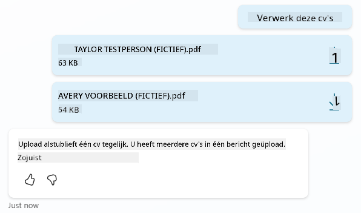

1. Probeer **slechts één CV** te uploaden, met het bericht `Process this resume`

    - De agent zou dan een bericht moeten geven zoals *Het CV van Avery Example is succesvol geüpload. Het CV-nummer is R10026.*

1. In de **Activity map** zou je de **Application Intake Agent** moeten zien die het uploaden van het CV afhandelt.  
    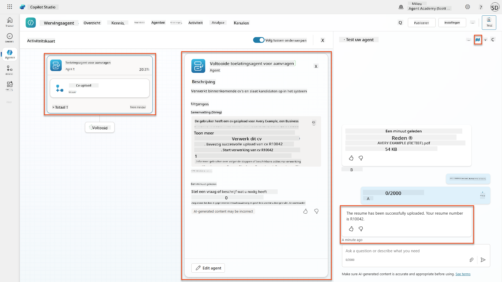

1. Navigeer naar make.powerapps.com → Zorg ervoor dat je omgeving is geselecteerd in de rechterbovenhoek van de Environment Picker.

1. Selecteer **Apps** → Hiring Hub → ellipsis(...) menu → **Play**  
    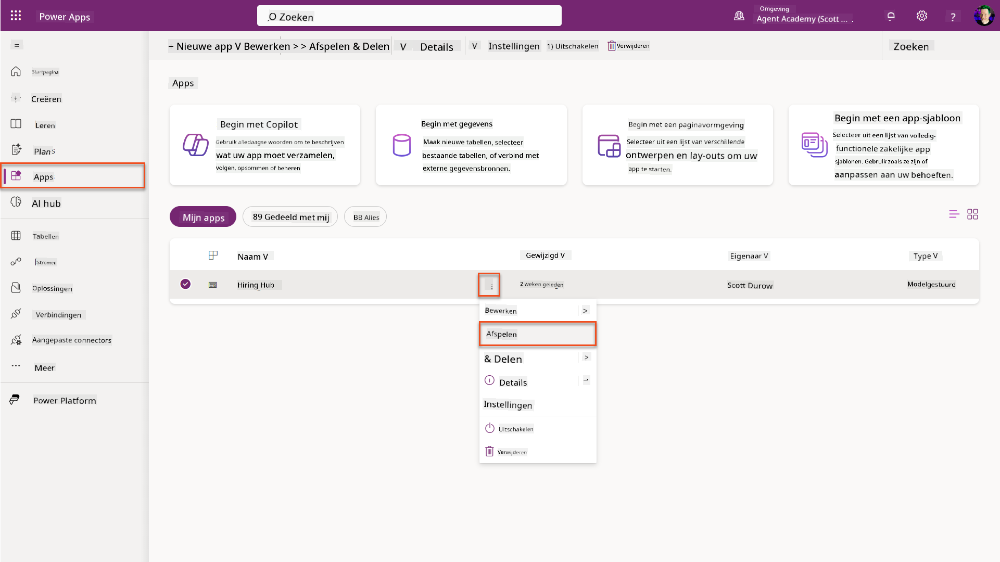

    Opmerking: Als de play-knop grijs is, betekent dit dat je je oplossing van Mission 01 niet hebt gepubliceerd. Selecteer **Solutions** → **Publish all customizations**.

1. Navigeer naar **Resumes** en controleer of het CV-bestand is geüpload en de motivatiebrief dienovereenkomstig is ingesteld.  
    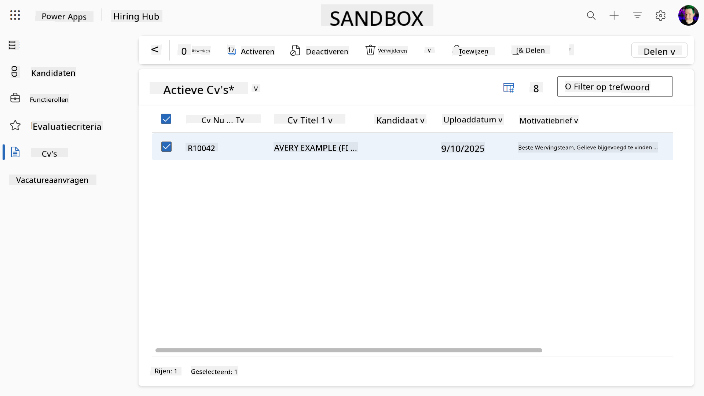

## 🧪Lab 2.2: De Interview Prep verbonden agent toevoegen

Laten we nu onze verbonden agent voor interviewvoorbereiding maken en toevoegen aan je bestaande Hiring Agent.

### 2.2.1 Maak de verbonden Interview Agent

1. **Navigeer** naar Copilot Studio. Zorg ervoor dat je omgeving nog steeds is geselecteerd in de rechterbovenhoek van de Environment Picker.

1. Open je **Hiring Agent**

1. Navigeer naar de Agent-tab en selecteer **+ Add an agent**

1. Selecteer **Connect an existing agent** → **Copilot Studio**

1. Selecteer **+ New agent**

### 2.2.2 Configureer basisinstellingen

1. Selecteer de **Configure**-tab en voer de volgende eigenschappen in:

    - **Name**: `Interview Agent`
    - **Description**: `Helpt bij het sollicitatieproces.`

1. Instructies:

    ```text
    You are the Interview Agent. You help interviewers and hiring managers prepare for interviews. You never contact candidates. 
    Use Knowledge to help with interview preparation. 
    
    The only valid identifiers are:
      - ResumeNumber (ppa_resumenumber)→ format R#####
      - CandidateNumber (ppa_candidatenumber)→ format C#####
      - ApplicationNumber (ppa_applicationnumber)→ format A#####
      - JobRoleNumber (ppa_jobrolenumber)→ format J#####
    
    Examples you handle
      - Give me a summary of ...
      - Help me prepare to interview candidates for the Power Platform Developer role
      - Create interview assistance for the candidates for Power Platform Developer
      - Give targeted questions for Candidate Alex Johnson focusing on the criteria for the Job Application
      
    How to work:
        You are expected to ask clarification questions if required information for queries is not provided
        - If asked for interview help without providing a job role, ask for it
        - If asking for interview questions, ask for the candidate and job role if not provided.
    
    General behavior
    - Do not invent or guess facts
    - Be concise, professional, and evidence-based
    - Map strengths and risks to the highest-weight criteria
    - If data is missing (e.g., no resume), state what is missing and ask for clarification
    - Never address or message a candidate
    ```

1. Zet **Web Search** op **Disabled**

1. Selecteer **Create**  
    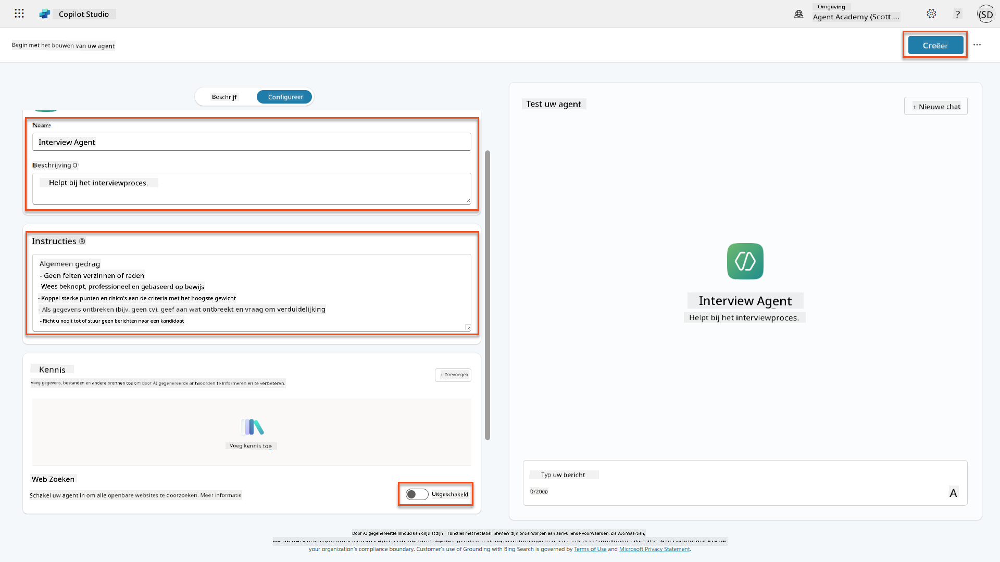

### 2.2.3 Configureer gegevens toegang en publiceer

1. In de sectie **Knowledge**, selecteer **+ Add knowledge**  
    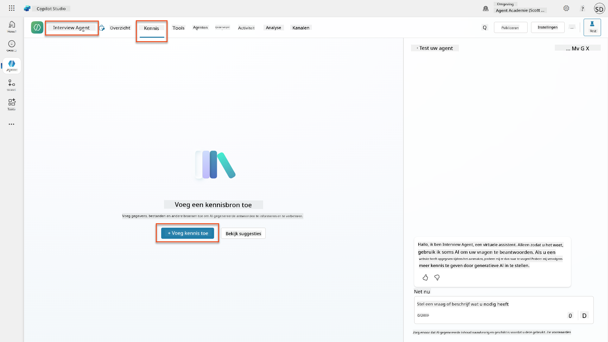
1. Selecteer **Dataverse**  
    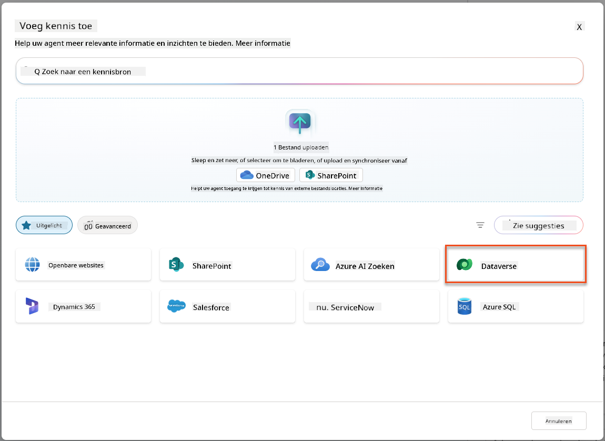
1. Typ in het **Search box**-veld `ppa_`. Dit is het voorvoegsel voor de tabellen die je eerder hebt geïmporteerd.
1. **Selecteer** alle 5 tabellen (Candidate, Evaluation Criteria, Job Application, Job Role, Resume)
1. Selecteer **Add to agent**  
    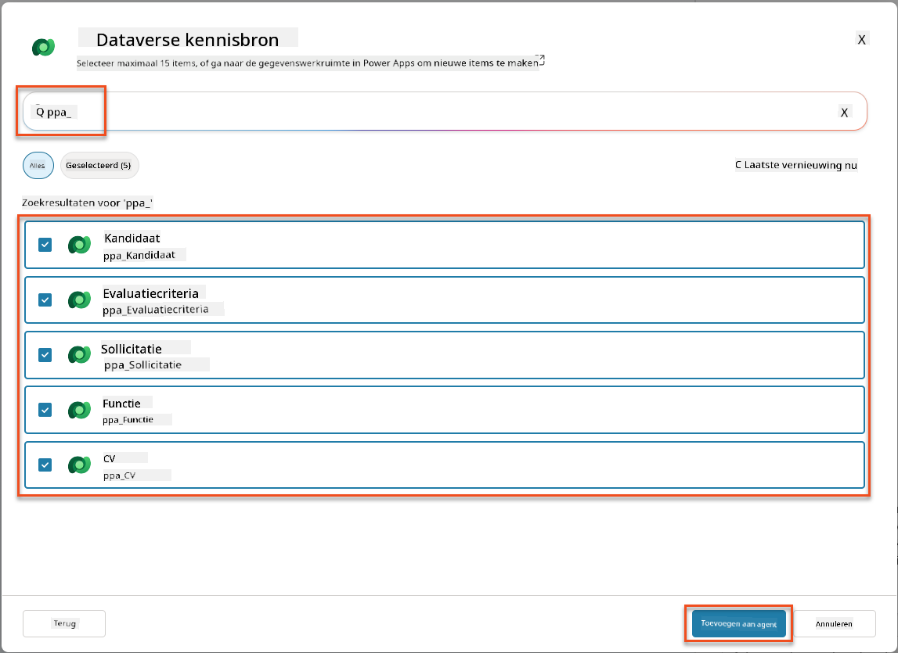
1. Selecteer de **Settings** op de Interview Agent en stel de volgende instellingen in:

    - **Laat andere agents verbinding maken met en gebruik maken van deze:** `On`
    - **Gebruik algemene kennis**: `Off`
    - **Bestandsuploads**: `Off`
    - **Content moderatie niveau:** `Medium`
1. Selecteer **Save**
1. Selecteer **Publish** en wacht tot het publiceren is voltooid.

### 2.2.4 Verbind de Interview Prep Agent met je Hiring Agent

1. Navigeer terug naar je **Hiring Agent**

1. Selecteer de **Agents**-tab

1. Gebruik **+Add an agent** → **Copilot Studio** om de **Interview Agent** toe te voegen. Stel de beschrijving in op:
    ```text
    Assists with the interview process and provides information about Resumes, Candidates, Job Roles, and Evaluation Criteria.
    ```

    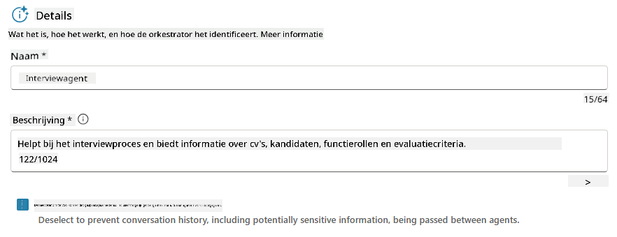
    Let op dat de optie Gespreksgeschiedenis doorgeven aan deze agent is aangevinkt. Dit stelt de hoofdagent in staat om volledige context te bieden aan de verbonden agent.

1. Selecteer **Agent toevoegen**

1. Zorg ervoor dat je zowel de **Application Intake Agent** als de **Interview Agent** ziet. Let op hoe de ene een onderliggende agent is en de andere een verbonden agent.  
    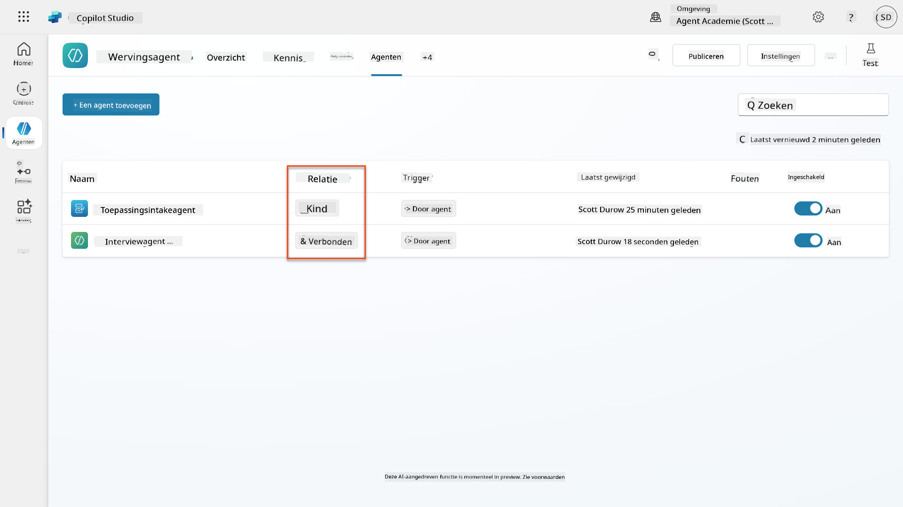

### 2.2.5 Test samenwerking tussen meerdere agents

1. **Open** het testpaneel door **Test** te selecteren.

1. **Upload** een van de test-cv's en voer de volgende beschrijving in die de hoofdagent vertelt wat hij kan delegeren aan de verbonden agent:

    ```text
    Upload this resume, then show me open job roles, each with a description of the evaluation criteria, then use this to match the resume to at least one suitable job role even if not a perfect match.
    ```

    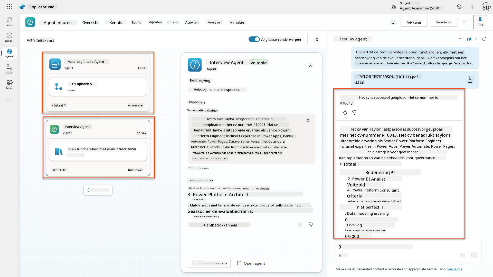

1. Let op hoe de Hiring Agent het uploaden delegeerde aan de onderliggende agent en vervolgens de Interview Agent vroeg om een samenvatting en een match met een functieprofiel te geven op basis van zijn kennis.
   Experimenteer met verschillende manieren om vragen te stellen over cv's, functieprofielen en evaluatiecriteria.
   **Voorbeelden:**

    ```text
    Give me a summary of active resumes
    ```

    ```text
    Summarize resume R10044
    ```

    ```text
    Which active resumes are suitable for the Power Platform Developer role?
    ```

## 🎉 Missie Voltooid

Uitstekend werk, Agent! **Operatie Symphony** is nu afgerond. Je hebt je enkele Hiring Agent succesvol getransformeerd tot een geavanceerd multi-agent orkest met gespecialiseerde capaciteiten.

Dit heb je bereikt in deze missie:

**✅ Beheersing van multi-agent architectuur**  
Je begrijpt nu wanneer je onderliggende agents versus verbonden agents moet gebruiken en hoe je systemen ontwerpt die schaalbaar zijn.

**✅ Application Intake onderliggende agent**  
Je hebt een gespecialiseerde onderliggende agent toegevoegd aan je Hiring Agent die cv's verwerkt, kandidaatgegevens extraheert en informatie opslaat in Dataverse.

**✅ Interview Prep verbonden agent**  
Je hebt een herbruikbare verbonden agent voor interviewvoorbereiding gebouwd en succesvol verbonden met je Hiring Agent.

**✅ Agentcommunicatie**  
Je hebt gezien hoe je hoofdagent kan samenwerken met specialistische agents, context kan delen en complexe workflows kan orkestreren.

**✅ Basis voor autonomie**  
Je verbeterde wervingssysteem is nu klaar voor de geavanceerde functies die we in de komende missies zullen toevoegen: autonome triggers, contentmoderatie en diepgaande redenering.

🚀**Volgende stap:** In je volgende missie leer je hoe je je agent configureert om cv's automatisch te verwerken vanuit e-mails!

⏩[Ga naar Missie 03: Automatiseer je agent met triggers](../03-automate-triggers/README.md)

## 📚 Tactische Bronnen

📖 [Andere agents toevoegen (preview)](https://learn.microsoft.com/microsoft-copilot-studio/authoring-add-other-agents?WT.mc_id=power-182762-scottdurow)

📖 [Tools toevoegen aan aangepaste agents](https://learn.microsoft.com/microsoft-copilot-studio/advanced-plugin-actions?WT.mc_id=power-182762-scottdurow)

📖 [Werken met Dataverse in Copilot Studio](https://learn.microsoft.com/microsoft-copilot-studio/knowledge-add-dataverse?WT.mc_id=power-182762-scottdurow)

📖 [Overzicht van agentflows](https://learn.microsoft.com/microsoft-copilot-studio/flows-overview?WT.mc_id=power-182762-scottdurow)

📖 [Een oplossing maken](https://learn.microsoft.com/power-platform/alm/solution-concepts-alm?WT.mc_id=power-182762-scottdurow)

📖 [Power Platform solution ALM-gids](https://learn.microsoft.com/power-platform/alm/overview-alm?WT.mc_id=power-182762-scottdurow)

📺 [Samenwerking tussen agents in Copilot Studio](https://youtu.be/d-oD3pApHAg?si=rwIHKhJTkjSvhTHw)

---

**Disclaimer**:  
Dit document is vertaald met behulp van de AI-vertalingsservice [Co-op Translator](https://github.com/Azure/co-op-translator). Hoewel we streven naar nauwkeurigheid, dient u zich ervan bewust te zijn dat geautomatiseerde vertalingen fouten of onnauwkeurigheden kunnen bevatten. Het originele document in de oorspronkelijke taal moet worden beschouwd als de gezaghebbende bron. Voor kritieke informatie wordt professionele menselijke vertaling aanbevolen. Wij zijn niet aansprakelijk voor eventuele misverstanden of verkeerde interpretaties die voortvloeien uit het gebruik van deze vertaling.