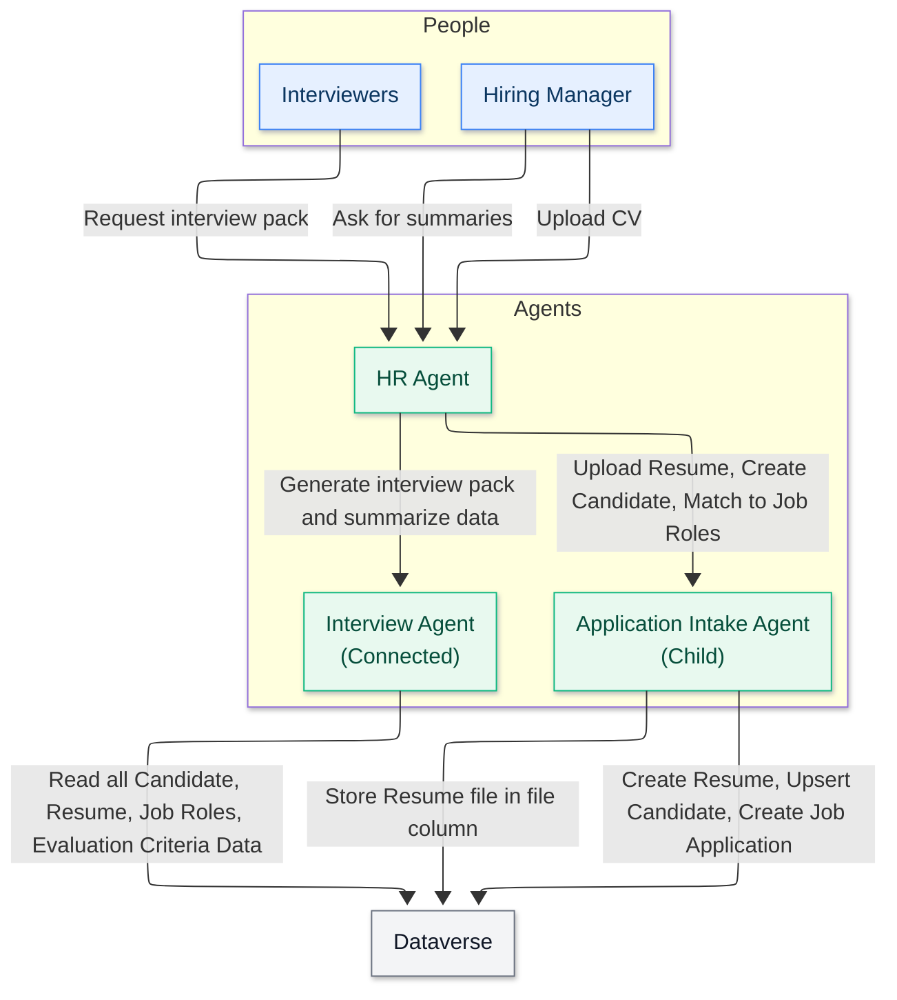

<!--
CO_OP_TRANSLATOR_METADATA:
{
  "original_hash": "02c15421de88efe63b32ca403c366f86",
  "translation_date": "2025-10-17T01:48:08+00:00",
  "source_file": "docs/operative-preview/02-multi-agent/assets/connected-agents-diagram.md",
  "language_code": "nl"
}
-->
# Diagram van Verbonden Agenten

---

**Disclaimer**:  
Dit document is vertaald met behulp van de AI-vertalingsservice [Co-op Translator](https://github.com/Azure/co-op-translator). Hoewel we streven naar nauwkeurigheid, dient u zich ervan bewust te zijn dat geautomatiseerde vertalingen fouten of onnauwkeurigheden kunnen bevatten. Het originele document in de oorspronkelijke taal moet worden beschouwd als de gezaghebbende bron. Voor kritieke informatie wordt professionele menselijke vertaling aanbevolen. Wij zijn niet aansprakelijk voor eventuele misverstanden of verkeerde interpretaties die voortvloeien uit het gebruik van deze vertaling.