<!--
CO_OP_TRANSLATOR_METADATA:
{
  "original_hash": "75efaf515d5694d4fd549bfd6518901a",
  "translation_date": "2025-10-17T01:57:47+00:00",
  "source_file": "docs/operative-preview/03-automate-triggers/README.md",
  "language_code": "nl"
}
-->
# Missie 03: Voeg Event Triggers toe om autonoom te handelen

--8<-- "disclaimer.md"

## 🕵️‍♂️ CODENAAM: `OPERATIE SIGNAL POINT`

> **⏱️ Operatietijdvenster:** `~45 minuten`

## 🎯 Missieoverzicht

Welkom terug, Agent. In [Missie 02](../02-multi-agent/README.md) - leerde je hoe je een Application Intake subagent en een Interview Prep verbonden agent kunt bouwen om de mogelijkheden van je hoofd Hiring Agent uit te breiden.

Je opdracht, als je ervoor kiest om deze te accepteren, is **Operatie Signal Point** - dieper duiken in **event triggers** - je agentsysteem verheffen van reactief naar **autonome werking**. Je transformeert je agents van wachten op menselijke input naar proactief reageren op externe gebeurtenissen en intelligente acties ondernemen zonder toezicht.

Zie het als een upgrade van agents die _vragen beantwoorden_ naar agents die _behoeften anticiperen_ en _zelfstandig handelen_. Door event triggers en geautomatiseerde workflows zal je Hiring Agent inkomende cv-e-mails detecteren, bijlagen automatisch verwerken, gegevens opslaan in Dataverse en je HR-recruitmentteam via Microsoft Teams op de hoogte stellen - terwijl jij je richt op taken met hogere waarde.

Welkom in de wereld waar automatisering en intelligentie samenkomen.

## 🔎 Doelstellingen

In deze missie leer je:

1. Hoe event triggers autonoom gedrag van agents mogelijk maken zonder gebruikersinteractie
1. De verschillen tussen interactieve en autonome agents in Copilot Studio
1. Hoe je event triggers maakt die e-mailbijlagen automatisch verwerken en bestanden uploaden naar Dataverse
1. Hoe je agentflows bouwt die adaptieve kaarten posten naar Teams-kanalen voor meldingen
1. Hoe je gegevens doorgeeft tussen event triggers en agentflows voor end-to-end automatisering

## 🤔 Wat is een Event Trigger?

Eerder in [Recruit](../../recruit/10-add-event-triggers/README.md), leerden we over event triggers. Laten we dit snel herhalen voor het geval je het gemist hebt.

**Event triggers** laten een agent _zelf handelen_ wanneer er iets gebeurt in een ander systeem - geen gebruikersbericht vereist. Wanneer de geconfigureerde gebeurtenis plaatsvindt - zoals “nieuw SharePoint-item,” “nieuwe e-mail,” “Planner-taak toegewezen,” of zelfs een tijdgebaseerde herhaling, stuurt een connector een triggerpayload naar je agent. De agent volgt dan jouw instructies om te beslissen welke acties of onderwerpen opgeroepen moeten worden.

### Belangrijke kenmerken

- **Autonome activatie:**
      - In tegenstelling tot topic triggers die starten wanneer een gebruiker met de agent communiceert, worden event triggers geactiveerd door externe gebeurtenissen, wat proactief gedrag mogelijk maakt.

- **Payload-gestuurd:**
      - Elke gebeurtenis levert een payload (variabelen + optionele instructies) via een connector. De agent gebruikt jouw gedefinieerde instructies en de payload om te bepalen wat er vervolgens moet gebeuren.
      - Bijvoorbeeld _een onderwerp oproepen_ of _acties uitvoeren die door Tools zijn gedefinieerd_.

- **Voorbeelden standaard beschikbaar:**
      - SharePoint/OneDrive bestand of item aangemaakt
      - Planner-taak voltooid/toegewezen
      - Microsoft Forms-reactie ingediend
      - Herhaling/schema

    Beschikbaarheid hangt af van de databeleid van je organisatie die is geconfigureerd in Power Automate.

- **Vereist generatieve orkestratie:**
      - Event triggers zijn alleen beschikbaar wanneer generatieve orkestratie is ingeschakeld voor de agent.

- **Facturering/gebruik:**
      - Elke triggerlevering telt als een bericht binnen de capaciteit van Copilot Studio.
      - Bijvoorbeeld een herhaling van 10 minuten stuurt elke 10 minuten een bericht.

- **Authenticatiemodel en setup:**
      - Je voegt triggers toe binnen het agentoverzicht, onder _Triggers_. Authenticatie voor de triggerconnector gebruikt het account van de agentmaker (“authenticatie door agentauteur”).
      - Je kunt triggerparameters en payload bewerken in de Power Automate-makerportal.

- **Testen & observatie:**
      - Je kunt triggers testen vanuit het testpaneel van de agent en het gedrag inspecteren met de activiteitenkaart voordat je publiceert.

!!! info "TL;DR voor ontwikkelaars"

    Denk aan event triggers als **webhook-achtige signalen** die een gestructureerde payload naar je agent sturen, waardoor deze _werk kan starten_ en acties kan koppelen tussen systemen - zonder te wachten tot een gebruiker erom vraagt.

### Topic triggers - hoe ze verschillen

Eerder leerde je over topic triggers in [Recruit](../../recruit/07-add-new-topic-with-trigger/README.md), maar je vraagt je misschien nog steeds af hoe _Topic_ triggers verschillen van _Event_ triggers, en waarom dat onderscheid belangrijk is om te begrijpen wat een agent autonoom maakt.

Topic triggers bepalen _wanneer een onderwerp wordt uitgevoerd_, meestal als reactie op een gebruikersbericht.

- In generatieve orkestratie is de standaardtrigger **Door agent** - de planner kiest een onderwerp waarvan de naam/beschrijving het beste overeenkomt met het bericht van de gebruiker.
- In klassieke orkestratie is de standaardtrigger **Zinnen** - de planner kiest een onderwerp wanneer een of meerdere triggerzinnen het beste overeenkomen met het bericht van de gebruiker.

Andere triggertypes zijn `Bericht ontvangen`, `Event ontvangen`, `Activiteit ontvangen`, `Gespreksupdate`, `Invoke ontvangen`, `Inactiviteit`, en `Plan voltooid`.

!!! info "Belangrijk verschil"

    Topic triggers starten _gespreksactiviteiten_ binnen de chat.
    
    Event triggers starten _systeemevenementen_ geleverd via connectors die de agent kunnen laten werken zonder enige conversatie.

### Snelle gids voor Topic trigger vs Event trigger

- **Topic trigger:** Gebruiker (of chatactiviteit) zei/deed X ➡️ voer Onderwerp T uit.
- **Event trigger:** SharePoint/Planner/E-mail/Timer geactiveerd met payload P ➡️ agent evalueert instructies ➡️ voert Acties/Onderwerpen uit.

## 🏓 Interactieve agent vs Autonome agent - vergelijking

Nu je het verschil kent tussen event triggers en topic triggers, laten we verder leren over het verschil tussen een interactieve agent en een autonome agent.

In Copilot Studio termen, "interactief" verwijst naar agents die voornamelijk communiceren via **onderwerpen** in een chat of kanaal. "Autonoom" verwijst naar agents die ook gebruik maken van **event triggers** om te werken zonder gebruikersinput.

De volgende tabel vat hun verschillen en overeenkomsten samen.

| Dimensie                             | Interactieve agent     | Autonome agent                                                                                              |
|-------------------------------------|-----------------------|-------------------------------------------------------------------------------------------------------------|
| Hoe het start                       | Gebruiker (of chatactiviteit) triggert een onderwerp. Voorbeeld: Door agent, Zinnen, Bericht ontvangen.   | Externe event trigger stuurt een payload via connector naar de agent. Voorbeeld: SharePoint, Planner, e-mail, schema, etc. |
| Primaire gebruik                    | V&A, begeleide workflows, verzoekgestuurde acties in chat - Teams, web, etc.  | Proactieve operaties en achtergrondautomatisering - reageren op systeemwijzigingen en vervolgens melden, opslaan of taken orkestreren. |
| Triggeroppervlak                    | Topic triggers: Door agent / Zinnen / Bericht ontvangen / Activiteitstypes / Invoke / Inactiviteit / Plan voltooid | Event triggers bibliotheek via connectors; payload bevat gebeurtenisgegevens + optionele instructies. |
| Planner (generatieve orkestratie)   | Sterk gebruikt voor Door agent en Plan voltooid triggers om onderwerpen te selecteren/sequencen. | Vereist voor event triggers; de agent gebruikt instructies + payload om te bepalen welke acties/onderwerpen op te roepen. |
| Typisch voorbeeld                   | Gebruiker vraagt "Wat is ons restitutiebeleid?" → Onderwerp wordt uitgevoerd, kennis wordt opgevraagd, antwoord. | Nieuwe Planner-taak toegewezen → Event trigger wordt geactiveerd → Agent post een Teams-bericht, werkt een record bij, of roept een onderwerp op. |
| Instelpad                           | Maak onderwerpen, definieer triggertype, schrijf dialoog/acties; publiceer naar kanalen. | Voeg event trigger toe (Overzicht → Triggers), verifieer connector met agentauteurreferenties, configureer payload/instructies; test via testpaneel; publiceer. |
| Auth en governance                  | Werkt onder kanaal/auth context; topic triggers reageren op chatactiviteiten in toegestane kanalen. | Triggerbeschikbaarheid hangt af van Power Automate databeleid; connectors werken onder het account van de agentmaker. |
| Observatie                          | Test onderwerpen binnen Copilot Studio, inspecteer gespreksverslagen/activiteiten. | Gebruik Test trigger en activiteitenkaart om uitvoering te valideren voordat je publiceert, monitor activiteit na publicatie. |
| Capaciteitsimpact                   | Elk gebruikersbericht/agentantwoord is een bericht dat capaciteit verbruikt. | Elke gebeurtenislevering is ook een bericht, plus eventuele daaropvolgende acties. Voorbeeld: een herhaling van 10 minuten = 6 berichten/uur |

### Wanneer gebruik je wat?

- Kies **topic triggers (interactief)** wanneer gebruikers het agentgesprek starten - FAQ, begeleide intake, of opdrachtstijl taken binnen chat. De Door agent trigger van de planner vermindert handmatige zinnenverzameling.
- Voeg **event triggers (autonoom)** toe wanneer de agent het gesprek moet starten of zelf actie moet ondernemen - bij updates in SharePoint/Dataverse, inkomende e-mail, of op een schema. Dit verschuift je van reactieve naar proactieve operaties.

## Ontwikkelaarstips & aandachtspunten

1. **Schakel generatieve orkestratie in** voor elke agent die je autonoom wilt maken. Event triggers verschijnen anders niet.

1. **Modelleer de payload vroeg.** Bepaal welke minimale velden je agent nodig heeft van de trigger, zoals `itemId`, `assignedTo`, `dueDate`, en voeg beknopte instructies toe die de agent vertellen welke actie/onderwerp op te roepen op basis van payloadwaarden.

1. **Auth-scope is belangrijk.** Triggers verifiëren met het account van de agentmaker. Zorg ervoor dat dat account de juiste connectorrechten heeft en voldoet aan Power Automate databeleid.

1. **Beheers kosten en ruis.** Hoge frequentieherhalingen of zeer drukke bronnen kunnen snel berichtenverbruik veroorzaken - beperk waar mogelijk of voeg voorwaarden toe in de trigger om gebeurtenissen te filteren.

1. **Test voordat je publiceert.** Gebruik **Test trigger** en de activiteitenkaart om het plan en de opgeroepen acties te bekijken - herhaal instructies/payload totdat het gedrag stabiel is.

## 🧪 Lab 03 - Automatiseren van sollicitatie-e-mails

We gaan nu een event trigger toevoegen aan de **Hiring Agent** en een agentflow bouwen in de subagent **Application Intake Agent** om verdere verwerking voor autonomie te regelen.

### ✨ Gebruiksscenario

!!! info ""

    **Als** HR-recruiter

    **Wil ik** op de hoogte worden gesteld wanneer een e-mail met een cv in mijn inbox is aangekomen en automatisch is geüpload naar Dataverse

    **Zodat ik** op de hoogte blijf van cv's die per e-mail worden verzonden voor sollicitaties die automatisch naar Dataverse worden geüpload

We bereiken dit met twee technieken:

1. Een event trigger voor wanneer de e-mail arriveert,
    1. Controleer of de `contentType` van het bestand gelijk is aan `PDF` als bestandsformaat.
    1. Haal het bestand op en upload het naar Dataverse met acties via de Dataverse-connector.
    1. Stuur vervolgens een prompt naar de agent voor verdere verwerking door invoerparameters door te geven vanuit de Dataverse-acties.

1. Een agentflow wordt toegevoegd aan de subagent **Application Intake Agent** die wordt aangeroepen door de prompt in de event trigger.
    1. Gebruik de invoerparameters die zijn doorgegeven vanuit de prompt van de event trigger in een adaptieve kaart die wordt gepost naar een kanaal in Microsoft Teams om het HR-recruitmentteam te informeren. De adaptieve kaart bevat een link naar de rij in Dataverse die wordt bekeken in de **Hiring Agent**.

Laten we beginnen!

### ✨ Vereisten om deze missie te voltooien

Je moet **ofwel**:

- **Missie 01 en Missie 02 hebben voltooid** en je Hiring Agent klaar hebben, **OF**
- **De starteroplossing van Missie 03 importeren** als je opnieuw begint of moet inhalen. [Download Mission 03 Starter Solution](https://aka.ms/agent-academy)

!!! note "Oplossing importeren en voorbeeldgegevens"
    Als je de starteroplossing gebruikt, raadpleeg [Missie 01](../01-get-started/README.md) voor gedetailleerde instructies over het importeren van oplossingen en voorbeeldgegevens in je omgeving.

Je hebt ook toegang nodig tot **Microsoft Teams** om de tweede laboefening van het posten van een adaptieve kaart naar Microsoft Teams te voltooien.

### Lab 3.1 - Automatisch cv's uploaden naar Dataverse die per e-mail worden ontvangen

1. In de Hiring Agent, scroll naar beneden in het **Overzicht-tabblad** en selecteer **+ Trigger toevoegen**.

       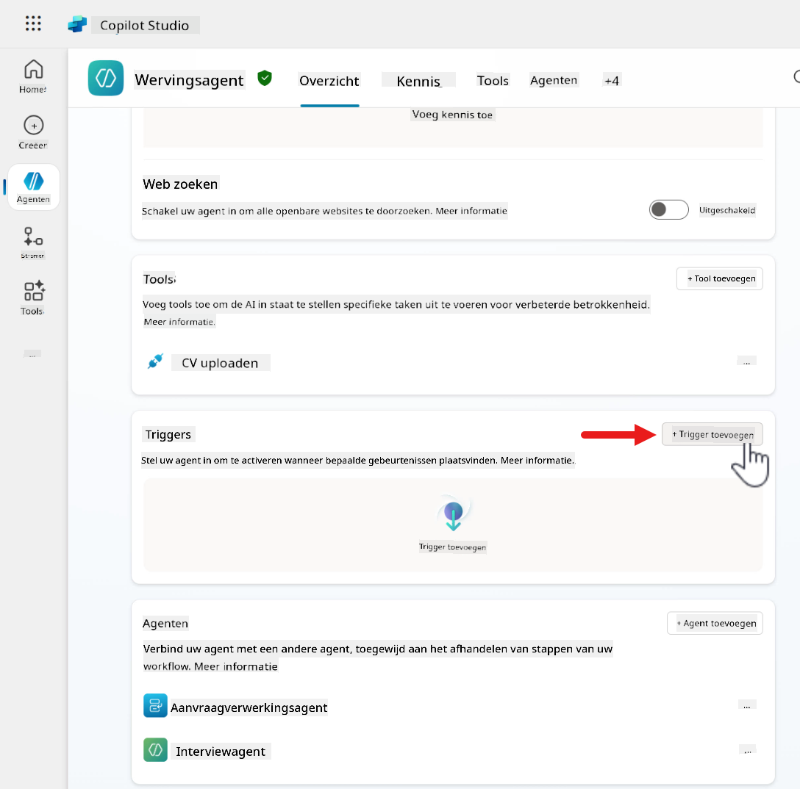

1. Er verschijnt een lijst met triggers. Selecteer **Wanneer een nieuwe e-mail arriveert (V3)** en selecteer **Volgende**.

       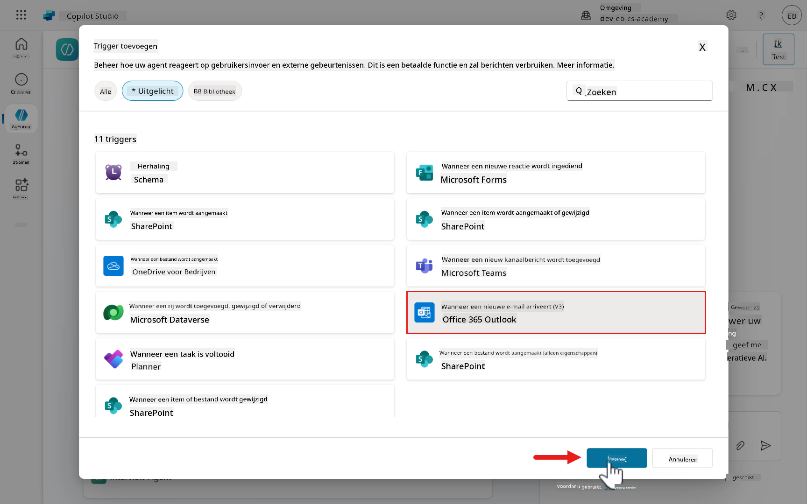

1. We zien nu de **Triggernaam** en de **Aanmeldingsverbindingreferenties** voor de vermelde apps.

       Hernoem de triggernaam naar het volgende,
    
       ```text
       Wanneer een nieuwe e-mail arriveert van een sollicitant
       ```

       Zorg ervoor dat je een groen vinkje ziet bij elk van de verbindingreferenties van de vermelde apps. Als je geen groen vinkje ziet, meld je aan via de ellipsen (...) en selecteer **+ Nieuwe verbindingreferentie** om een nieuwe verbindingreferentie te maken.

       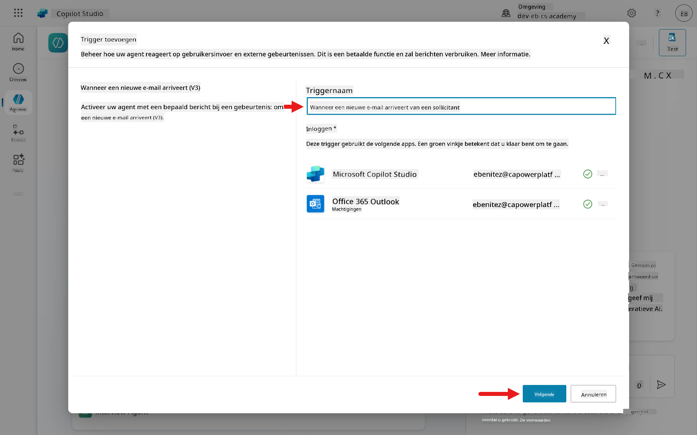

1. De laatste stap is het instellen van de invoereigenschappen van de trigger. Werk de volgende eigenschappen bij naar het volgende,

     | Eigenschap | Hoe in te stellen | Details |
     |------------|-------------------|---------|
     | **Bijlagen opnemen (Optioneel)** | Dropdown | Ja |
     | **Onderwerpfilter (Optioneel)** | Typ/voer in met toetsenbord | Sollicitatie |
     | **Alleen met bijlagen (Optioneel)** | Dropdown | Ja |

       Selecteer **Trigger maken**.

       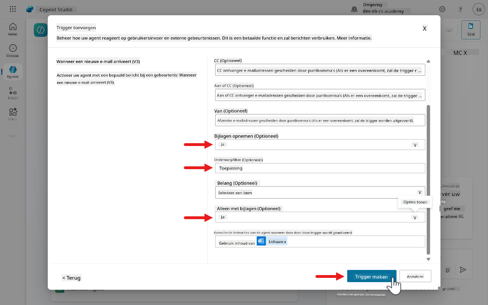

1. Zodra de trigger is gemaakt, verschijnt er een bevestigingsbericht dat de trigger is toegevoegd aan de agent. Selecteer **Sluiten** en de trigger wordt vermeld in de sectie **Triggers**.
We gaan nu de gebeurtenistrigger bijwerken om meer automatiseringsmogelijkheden toe te voegen. Selecteer de **ellipsen (...)** bij de trigger en kies **Bewerken in Power Automate**.


1. De trigger wordt vervolgens geladen als een stroom in het Power Automate-makerportaal. Wat je ziet, is de stroomontwerper in het Power Automate-makerportaal. Hier kunnen we extra logica en acties toevoegen voor meer automatisering. De trigger verschijnt bovenaan, gevolgd door **Stuurt een prompt naar de opgegeven copilot voor verwerking** als laatste actie in de stroom.


1. Standaard kan de trigger **Wanneer een nieuwe e-mail arriveert** in Power Automate meerdere e-mails tegelijk verwerken als er meerdere tegelijk binnenkomen, waarbij de stroom slechts één keer wordt uitgevoerd voor de batch.

Om ervoor te zorgen dat de stroom afzonderlijk wordt uitgevoerd voor elke e-mail, schakel je de instelling **Split On** in de triggerinstellingen in en selecteer je `@triggerOutputs()?['body/value']` in het dropdown-arrayveld.

Met **Split On** ingeschakeld en het arrayveld ingesteld op `@triggerOutputs()?['body/value']`, wordt de stroom afzonderlijk uitgevoerd voor elk bericht, zelfs als er veel tegelijk binnenkomen.

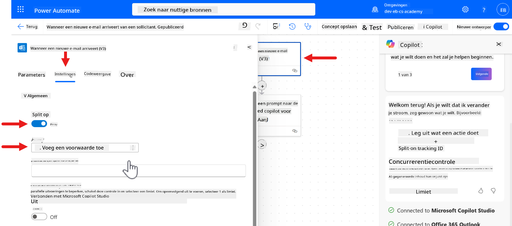

1. Laten we nu wat logica toevoegen om het bestandstype van de bijlage te controleren. We willen alleen .PDF-bestandsbijlagen uploaden en geen afbeeldingen (deze kunnen afkomstig zijn van e-mailhandtekeningen). Selecteer het **+**-pictogram onder de trigger en kies **Control** onder de sectie **Ingebouwde tools**.

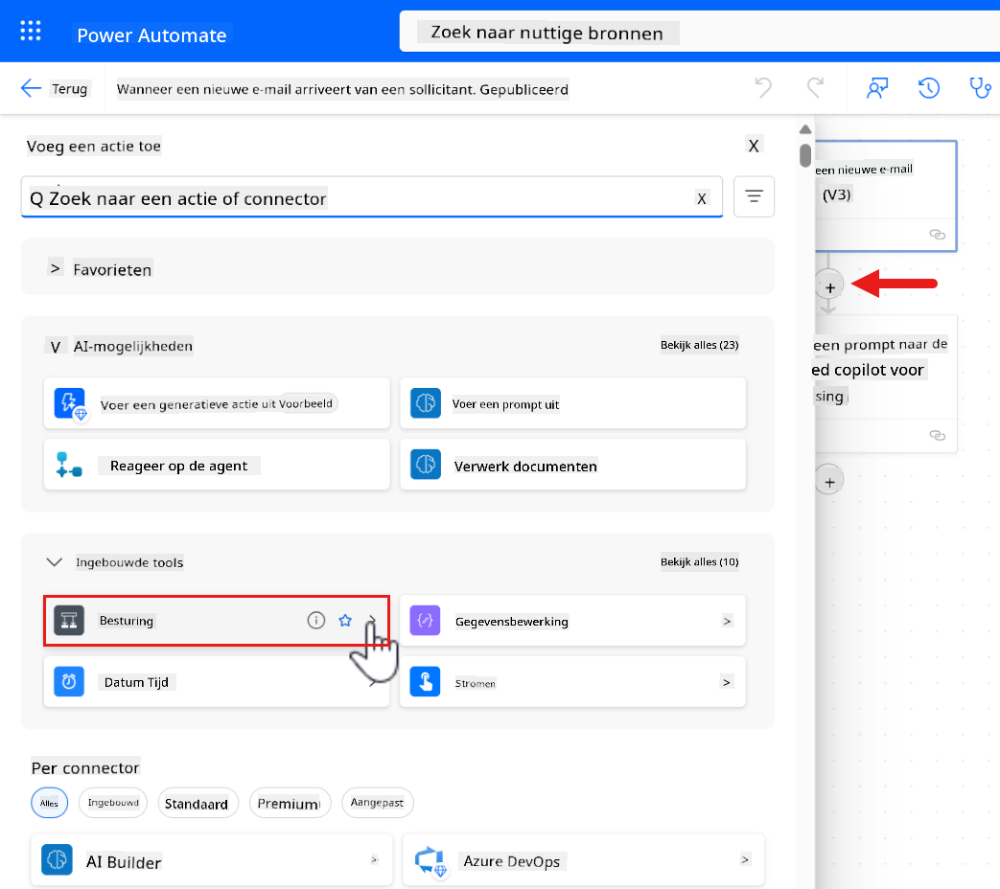

1. Selecteer de actie **Voorwaarde**.

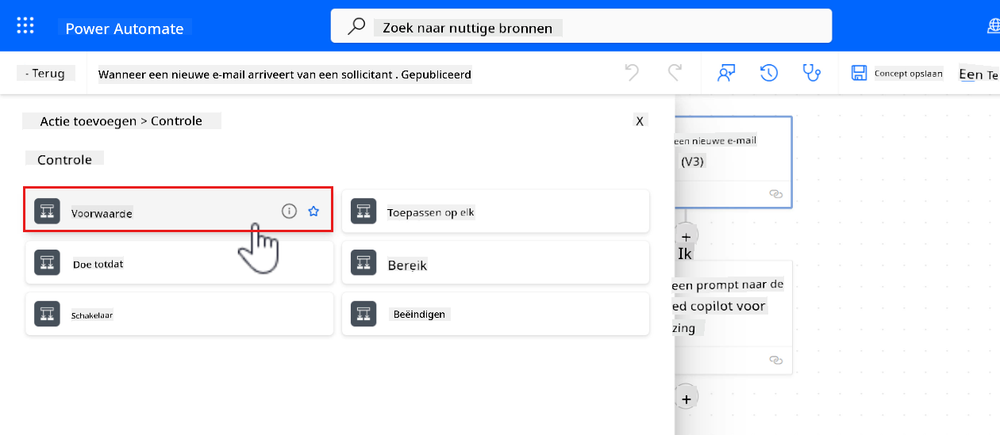

1. Nu configureren we de voorwaarde om te controleren of het bestandstype van de bijlage .PDF is. In het veld **Een waarde kiezen**, selecteer je het **bliksemschichtpictogram** of **fx-pictogram** aan de rechterkant.

1. Typ in het veld **Zoeken** het volgende:

```text
content type
```

1. Selecteer vervolgens de parameter **Bijlagen Content-Type** van de trigger.

1. Klik daarna op **Toevoegen** om de dynamische inhoud in te voegen in de parameter **Id** van de actie.

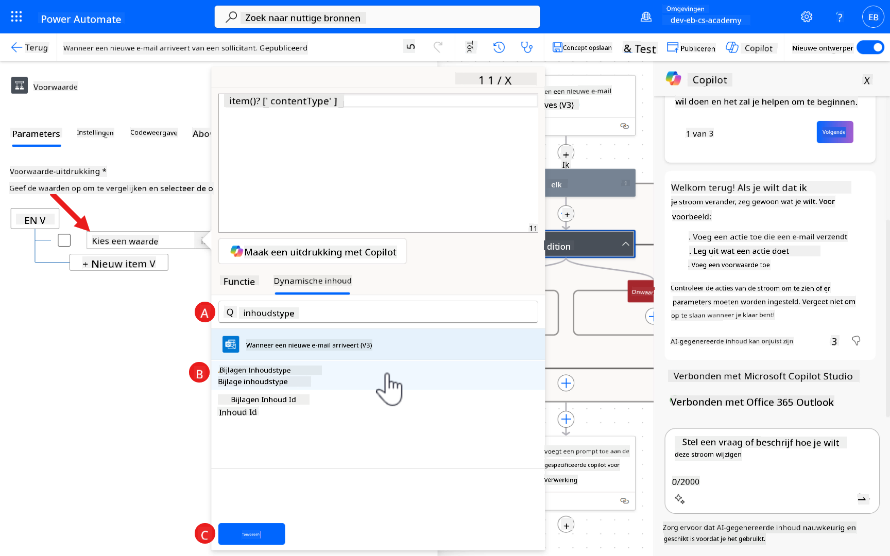

1. Laten we hier even pauzeren, je hebt waarschijnlijk gemerkt dat de actie **Voor elk** automatisch is verschenen.

Selecteer de actie **Voor elk**. Deze actie vertegenwoordigt het doorlopen van elke bijlage in de e-mail, aangezien de parameter **Bijlagen Content-Type** van de trigger is gekoppeld aan elke bijlage.

Onder de motorkap is het een array en daarom is de actie **Voor elk** automatisch toegevoegd toen we de parameter **Bijlagen Content-Type** selecteerden in de actie **Voorwaarde**.

Om hier meer over te leren, vouw je het volgende extra leerblok uit.

??? info "Extra leren: Actie Voor elk automatisch verschijnen"

🤔 **Waarom verschijnt "Toepassen op elk" of "Voor elk" automatisch?**

Wanneer je een parameter (dynamische inhoud) selecteert die een lijst of array van items vertegenwoordigt - bijvoorbeeld een lijst van bijlagen, e-mails of rijen - herkent Power Automate dat je mogelijk elk item afzonderlijk wilt verwerken.

Om je hierbij te helpen, voegt Power Automate automatisch een **"Toepassen op elk"** (of **Voor elk**) lus toe rond je actie. Dit zorgt ervoor dat je actie één keer wordt uitgevoerd voor elk item in de lijst, in plaats van te proberen de hele lijst in één keer te verwerken (wat fouten kan veroorzaken).

🦋 **Voorbeeld**

- Als je "Bijlagen" selecteert van een vorige actie (wat een array is), en probeert deze te gebruiken in een actie die een enkel bestand verwacht, voegt Power Automate je actie in een **"Toepassen op elk"** (of **Voor elk**) lus.
- Op deze manier wordt je actie uitgevoerd voor **elke bijlage** - één tegelijk.

💡 **Belangrijke punten**

- **Automatisch:** De lus verschijnt automatisch om je te helpen elk item in een verzameling te verwerken.
- **Voorkomt fouten:** Zonder de lus kan je actie mislukken omdat deze mogelijk niet meerdere items tegelijk kan verwerken.
- **Visuele aanwijzing:** Het is een visuele manier om te laten zien dat je stroom de actie herhaalt voor elk item in de lijst.

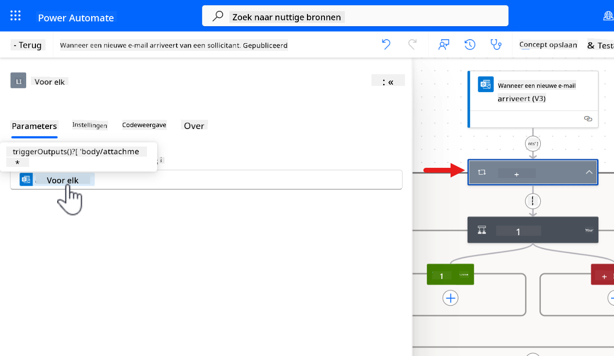

1. Voer vervolgens in het andere veld **Een waarde kiezen** het volgende in:

```text
application/pdf
```

Dit zorgt ervoor dat voor elke bestandbijlage wordt gecontroleerd of het bestandsextensieformaat .PDF is.

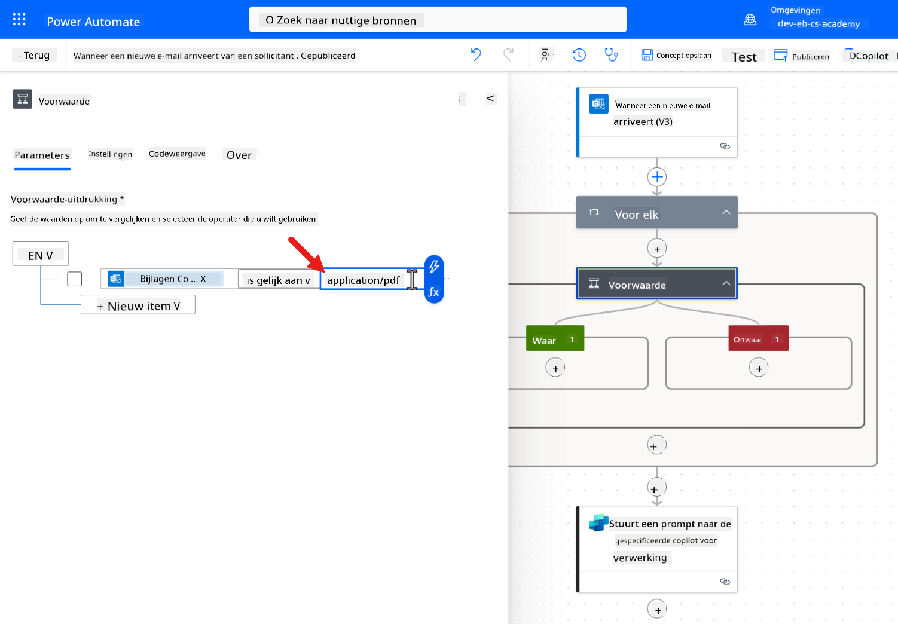

1. Nu configureren we het **True**-pad om het bestand uit de e-mail te halen en te uploaden naar de **CV**-tabel in Dataverse.

Voeg een nieuwe actie toe onder het **True**-pad en zoek naar `html to text`. Selecteer de actie **Html naar tekst**.

Om meer te leren over de actie **Html naar tekst**, vouw je het volgende extra leerblok uit.

??? info "Extra leren: Html naar tekst actie"

🤔 **Wat is de actie "HTML naar tekst"?**

De actie **HTML naar tekst** in Power Automate wordt gebruikt om HTML-geformatteerde inhoud om te zetten in platte tekst. Dit is vooral handig wanneer je gegevens ontvangt (zoals e-mails, webinhoud of API-reacties) die HTML-tags bevatten, en je alleen de leesbare tekst wilt extraheren zonder enige opmaak of code.

⚙️ **Hoe werkt het?**

- **Invoer:** Je geeft een string van HTML-inhoud op (bijvoorbeeld de tekst van een e-mail).
- **Uitvoer:** De actie verwijdert alle HTML-tags en geeft alleen de platte tekst terug.

👍🏻 **Wanneer gebruik je het?**

- Wanneer je leesbare tekst wilt extraheren uit e-mails, webpagina's of API-reacties die HTML bevatten.
- Voordat je inhoud verzendt naar systemen die geen HTML-opmaak ondersteunen (zoals SMS, Teams-berichten of databases).
- Om gegevens op te schonen voor verdere verwerking of analyse.

🔭 **Waar vind je het?**

- In Power Automate voor Agent Flows, zoek naar de actie genaamd `HTML naar tekst`. Het bevindt zich onder de connector **Gegevensbewerkingen**.

💡 **Belangrijke punten**

- Het verwijdert alle HTML-tags en laat alleen de tekst over.
- Het interpreteert of voert geen scripts/stijlen uit - het verwijdert alleen tags.
- Handig voor gegevensopschoning en het voorbereiden van inhoud voor uitvoer in platte tekst.

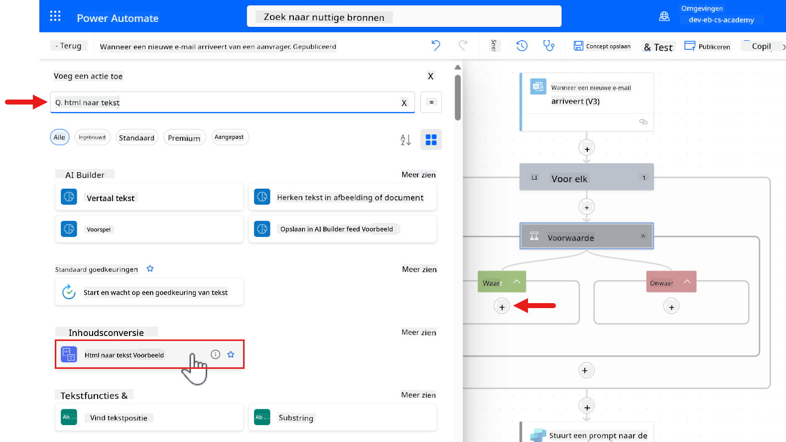

1. Vervolgens moeten we een nieuwe verbindingsreferentie maken voor de actie **Html naar tekst** door **Nieuw toevoegen** te selecteren.

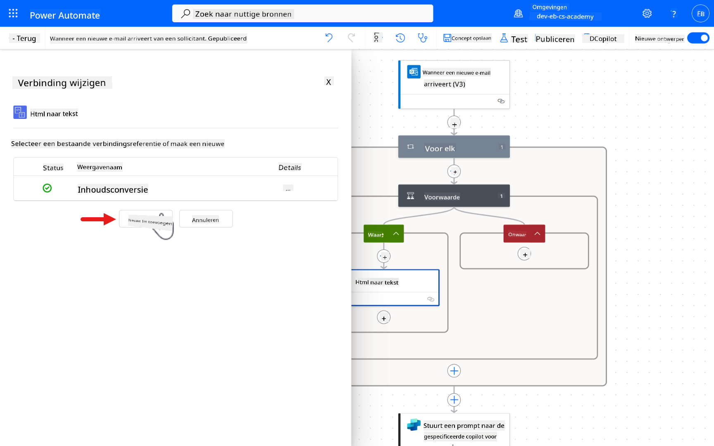

1. De actie kan nu worden geconfigureerd. Voeg de parameter **Body** van de trigger toe. In het veld **Inhoud**, selecteer je het **bliksemschichtpictogram** of **fx-pictogram** aan de rechterkant.

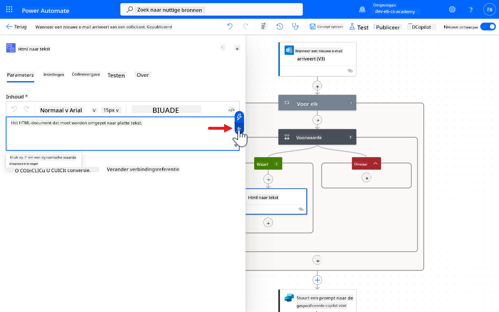

1. Zoek in het tabblad **Dynamische inhoud** naar `body` en selecteer de parameter **Body**, gevolgd door **Toevoegen**.

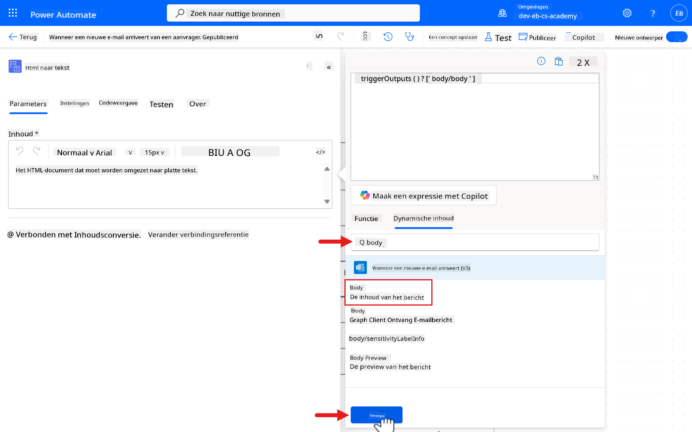

1. We hebben deze actie geconfigureerd, dus laten we de actie afsluiten door de twee naar links wijzende hoekige haakjes («) te selecteren om het paneel in te klappen.

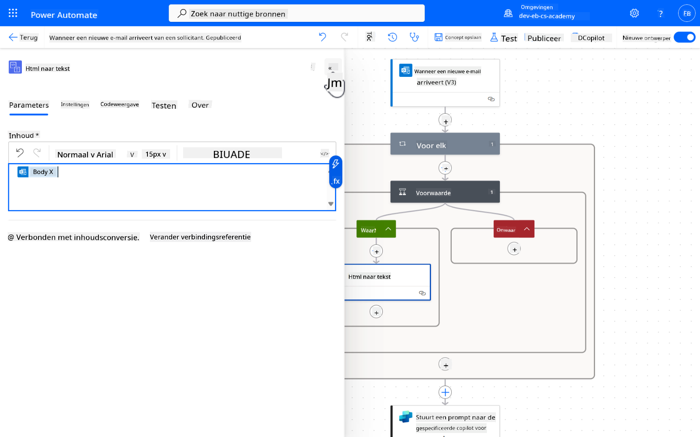

1. Voeg een nieuwe actie toe door het **+ icoon** onder de actie **Html naar tekst** te selecteren, waardoor het paneel wordt geladen om acties toe te voegen. Selecteer de connector **Microsoft Dataverse**.

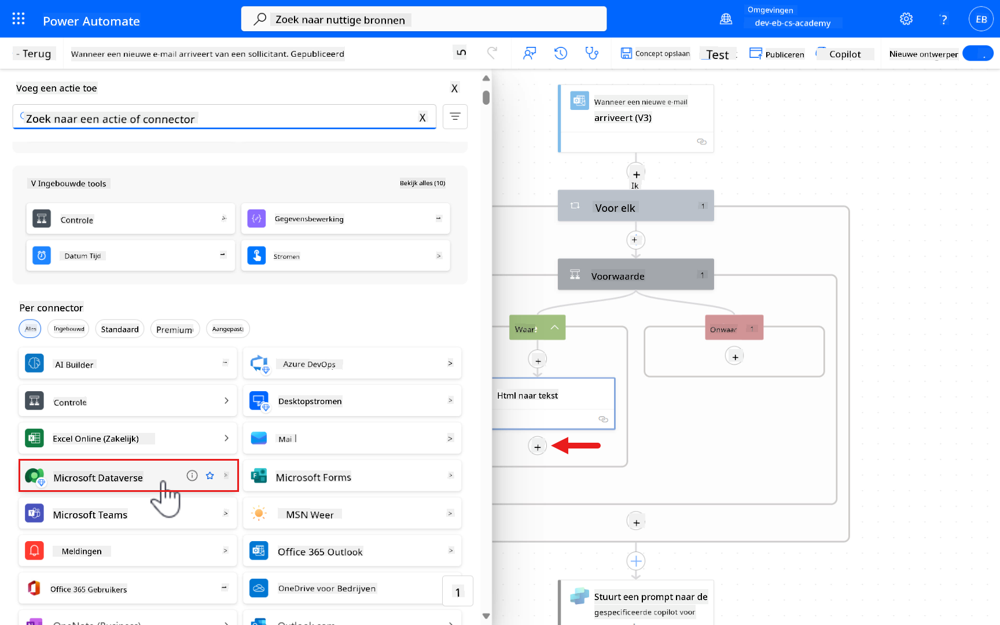

1. Selecteer de actie **Een nieuwe rij toevoegen**.

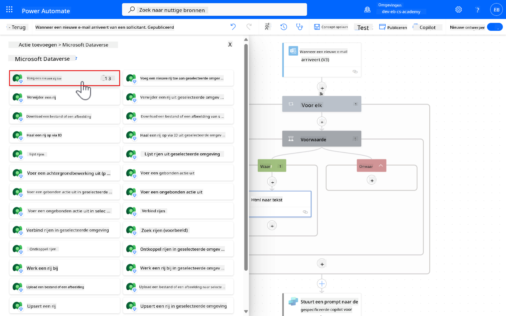

1. Hernoem de actie door de **Ellipsen (...)** te selecteren, kopieer en plak het volgende als naam:

```text
Voeg een nieuwe CV-rij toe
```

Voor de parameter **Tabelnaam**, zoek naar `res` en selecteer de tabel **CV's**.

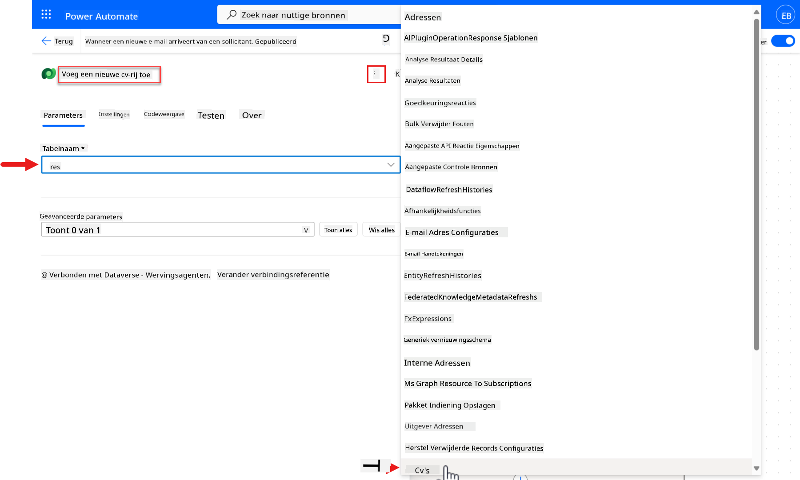

1. Selecteer het veld **CV-titel** en selecteer het **bliksemschichtpictogram** of **fx-pictogram** aan de rechterkant.

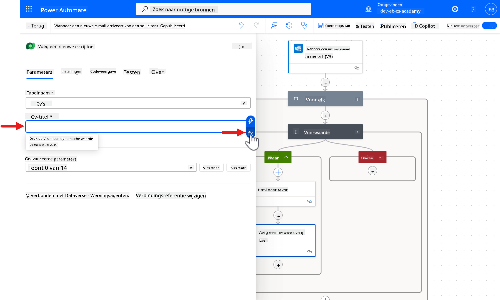

1. Voer in het tabblad **Functie** de volgende expressie in die de functie `item()` gebruikt:

```text
item()?['name']
```

Om meer te leren over de functie `item()`, vouw je het volgende extra leerblok uit.

??? info "Extra leren: `item()` functie"

🤔 **Wat is de `item()` functie?**

- Wanneer je een actie **Toepassen op elk** gebruikt, doorloopt Power Automate elk element in een verzameling (array).
- Het wordt meestal gebruikt binnen acties zoals **Toepassen op elk** (of **Voor elk**), **Selecteren**, of **Filter array**.

⚙️ **Hoe werkt het?**

- `item()` is een functie die het huidige item retourneert dat wordt verwerkt in een lus of arraybewerking.
- Binnen die lus verwijst `item()` naar het _huidige element_ dat wordt verwerkt.

📌 **Waar gebruik je het?**

- **Toepassen op elk:** om eigenschappen van het huidige item te openen.
- **Selecteren:** om elk item in een array te transformeren.
- **Filter array:** om te verwijzen naar het huidige item dat wordt geëvalueerd.

🦋 **Voorbeeld**

- Expressie binnen een lus:
       -  `item()?['Email']`
- Dit haalt de eigenschap `Email` van het huidige item op.

💡 **Belangrijke punten**

- `item()` is _contextgevoelig_: het verwijst altijd naar het huidige item in de lus of arraybewerking waarin je je bevindt.
- Als je lussen nestelt, kun je `items('LoopName')` gebruiken om te verwijzen naar items in een specifieke lus.

Selecteer **Toevoegen** om de expressie toe te voegen aan de parameter **CV-titel**.

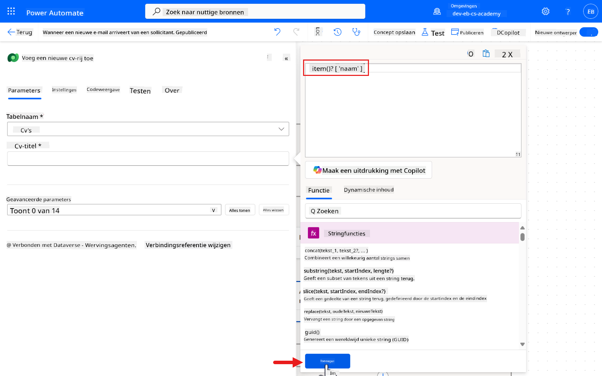

1. We moeten nog enkele parameters configureren. Selecteer **Alles weergeven** en selecteer in het veld **Motivatiebrief** het **bliksemschichtpictogram** of **fx-pictogram** aan de rechterkant.

Voer in het tabblad **Functie** de volgende expressie in die dezelfde expressie gebruikt als in de vorige [missie](../02-multi-agent/README.md).

```text
if(greater(length(body('Html_to_text')), 2000), substring(body('Html_to_text'), 0, 2000), body('Html_to_text'))
```

Deze expressie controleert of de _tekst_ van de actie **Html naar tekst** langer is dan 2000 tekens, en als dat zo is, retourneert alleen de eerste 2000 tekens; anders retourneert het de volledige tekst.

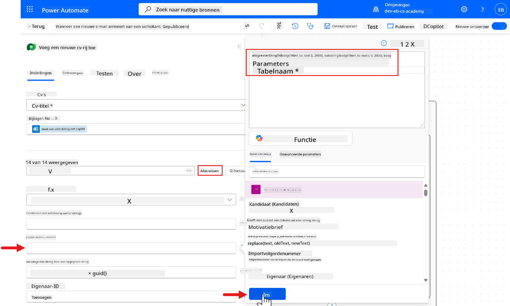

1. De expressie wordt nu toegevoegd aan het veld **Motivatiebrief**.

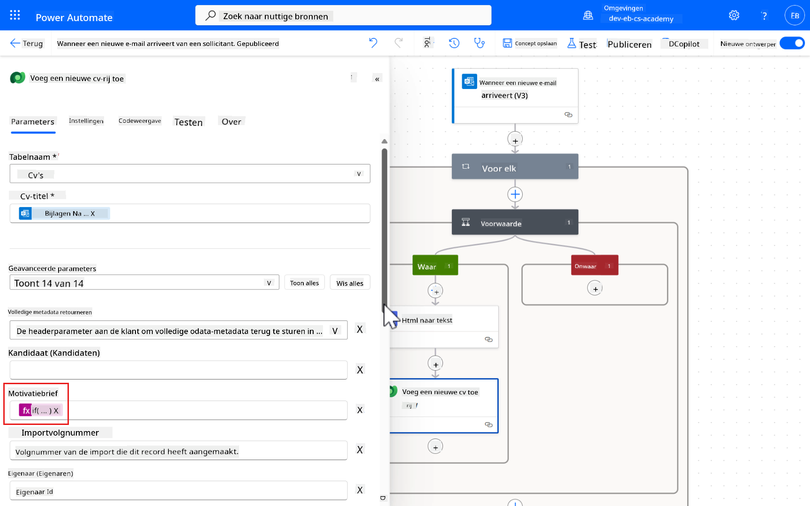

1. Voor het veld **Bron e-mailadres**, zoek naar `from` en selecteer de parameter **Van** van de trigger, aangezien deze de waarde van het e-mailadres bevat.

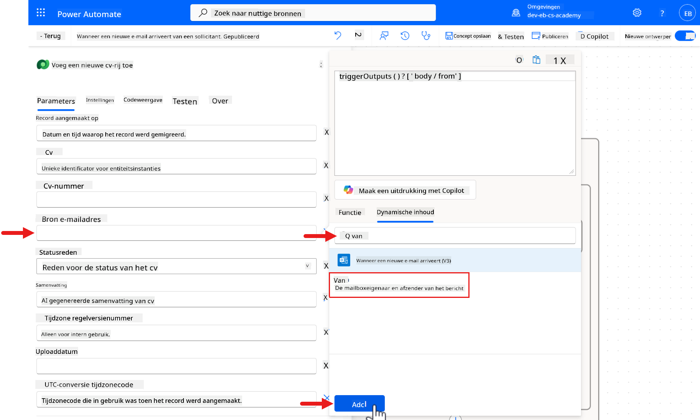

1. Voor het veld **Uploaddatum**, selecteer het **bliksemschichtpictogram** of **fx-pictogram** aan de rechterkant. Voer in het tabblad **Functie** de volgende expressie in die de functie `utcNow()` gebruikt:

```text
utcNow()
```

Om meer te leren over de functie `utcNow`, vouw je het volgende extra leerblok uit.

??? info "Extra leren: `utcNow` functie"

🤔 **Wat is de `utcNow()` functie?**

- De functie utcNow() in Power Automate retourneert de huidige datum en tijd in Coordinated Universal Time (UTC) in een ISO 8601-formaat, zoals: `2025-09-23T04:32:14Z`

🦋 **Voorbeeld**

- Expressie:
       -  `concat('Rapport gegenereerd op ', utcNow())`
- Uitvoer is:
       - Rapport gegenereerd op `2025-09-23T04:32:14Z`

💡 **Belangrijke punten**
- **Geen argumenten (invoerparameters) vereist:** geeft altijd de huidige UTC-tijdstempel.
   - **Toepassingen**
       - Tijdsregistratie toevoegen aan logbestanden of bestandsnamen
       - Huidige tijd vergelijken met andere datums
       - Plannen of tijdsgebonden voorwaarden

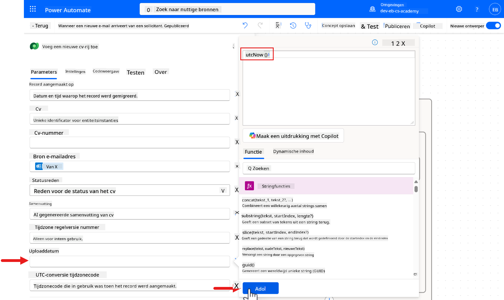

1. We hebben nu de configuratie van de actie **Een nieuwe CV-rij toevoegen** voltooid, dus laten we het paneel sluiten door het in te klappen.

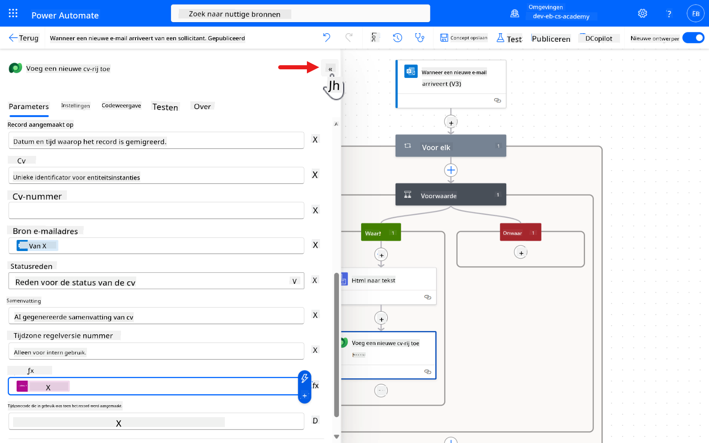

1. We voegen een nieuwe actie toe door op het **+ icoon** onder de actie **Een nieuwe CV-rij toevoegen** te klikken, waarmee het paneel voor het toevoegen van acties wordt geladen. Selecteer opnieuw de **Microsoft Dataverse**-connector.

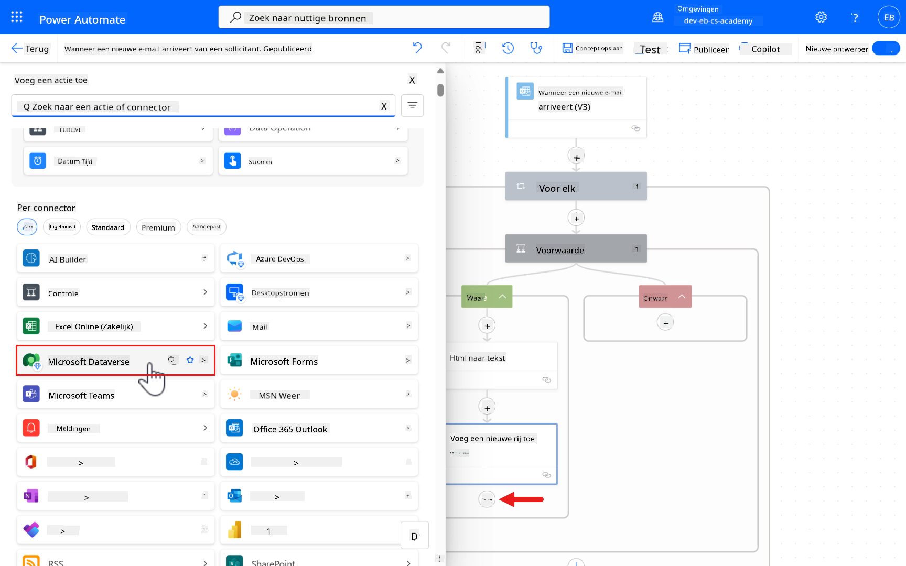

1. Selecteer de actie **Een bestand of afbeelding uploaden**.

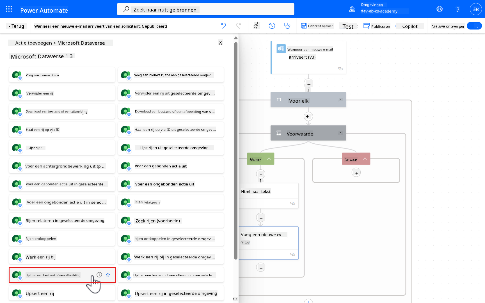

1. Hernoem de actie door op de **Ellipsis (...)** te klikken, kopieer en plak de volgende naam:

```text
Upload CV-bestand
```

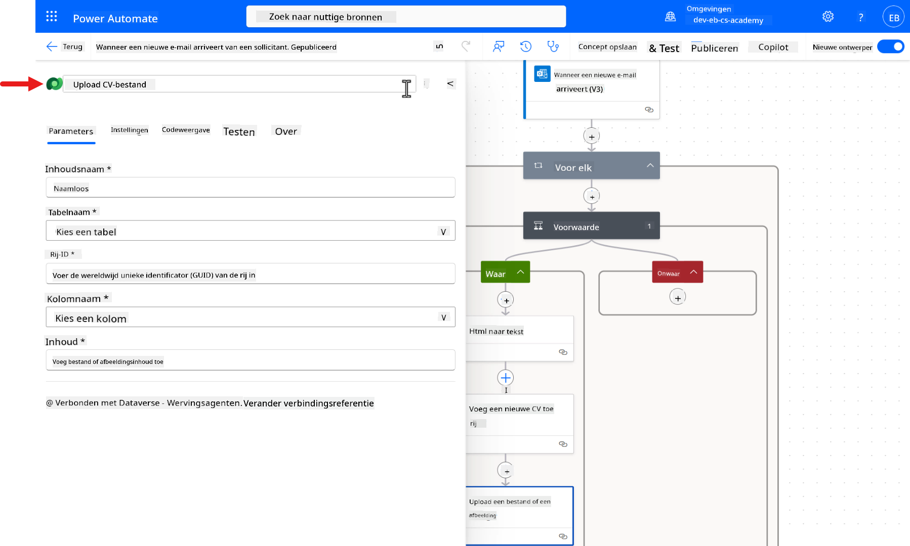

1. Selecteer vervolgens het veld **Inhoudsnaam** en klik op het **bliksemschicht-icoon** of **fx-icoon** aan de rechterkant.

In het **Functie-tabblad**, voer de volgende expressie in die de `item()`-functie gebruikt. Dit haalt de `name`-eigenschap op van het huidige item (het bijgevoegde bestand).

```text
item()?['name']
```

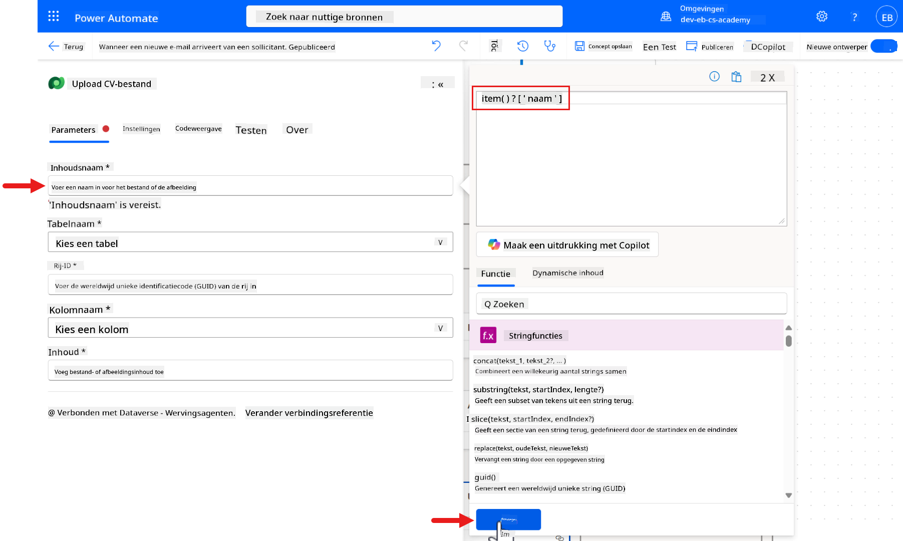

1. Voor de parameter **Tabelnaam**, zoek naar `res` en selecteer de tabel **CV's**.

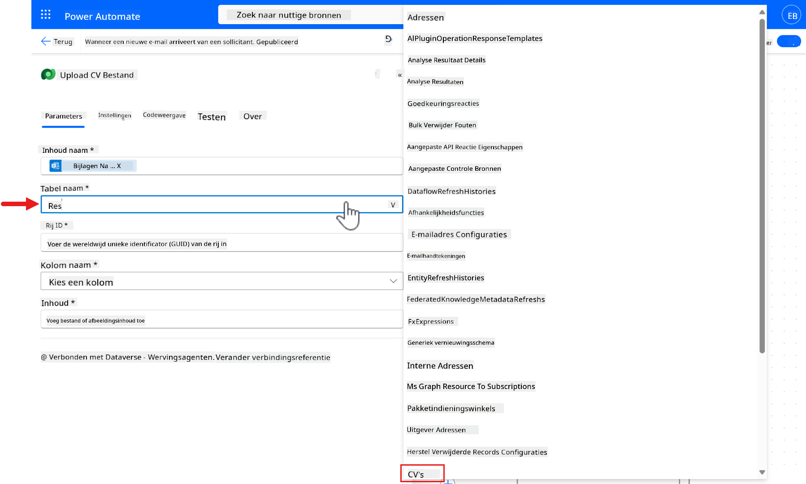

1. Selecteer vervolgens het veld **Rij-ID** en klik op het **bliksemschicht-icoon** of **fx-icoon** aan de rechterkant.

Zoek naar `ID` en selecteer de parameter **CV** van de _Een nieuwe rij toevoegen_-Dataverse-actie, omdat deze de ID-waarde bevat van de rij waarnaar het PDF-bestand moet worden geüpload.

Klik op **Toevoegen**.

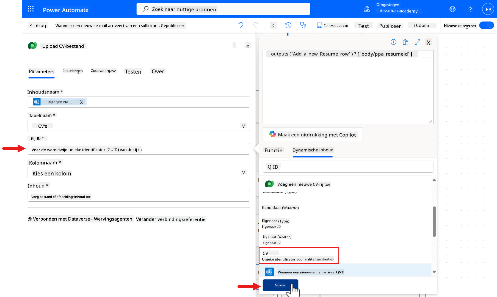

1. Selecteer het veld **Kolomnaam** en kies de optie **CV PDF**.

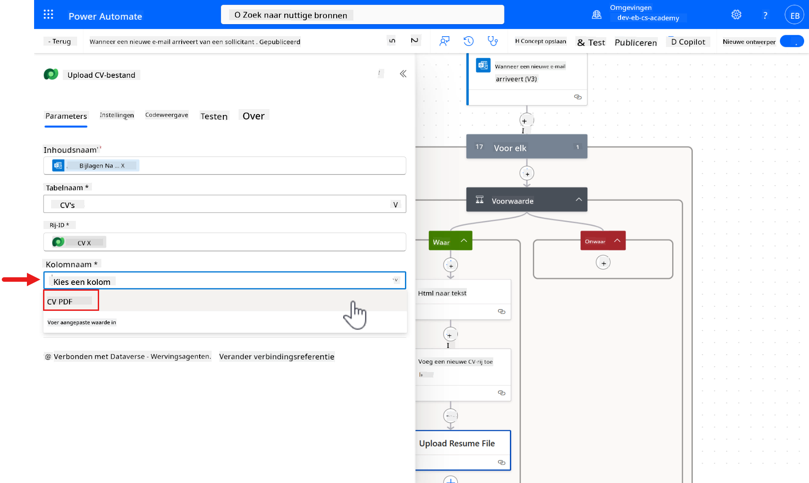

1. Selecteer het veld **Inhoud** en klik op het **bliksemschicht-icoon** of **fx-icoon** aan de rechterkant.

In het **Functie-tabblad**, voer de volgende expressie in die de `item()`-functie gebruikt. Dit haalt de `contentBytes`-eigenschap op van het huidige item (het bijgevoegde bestand). `contentBytes` verwijst naar de ruwe binaire gegevens van een bestand of bijlage, gecodeerd als een Base64-string.

```text
item()?['contentBytes']
```

1. We hebben deze actie geconfigureerd, dus laten we het paneel sluiten door op de twee naar links wijzende hoekige haakjes («) te klikken.

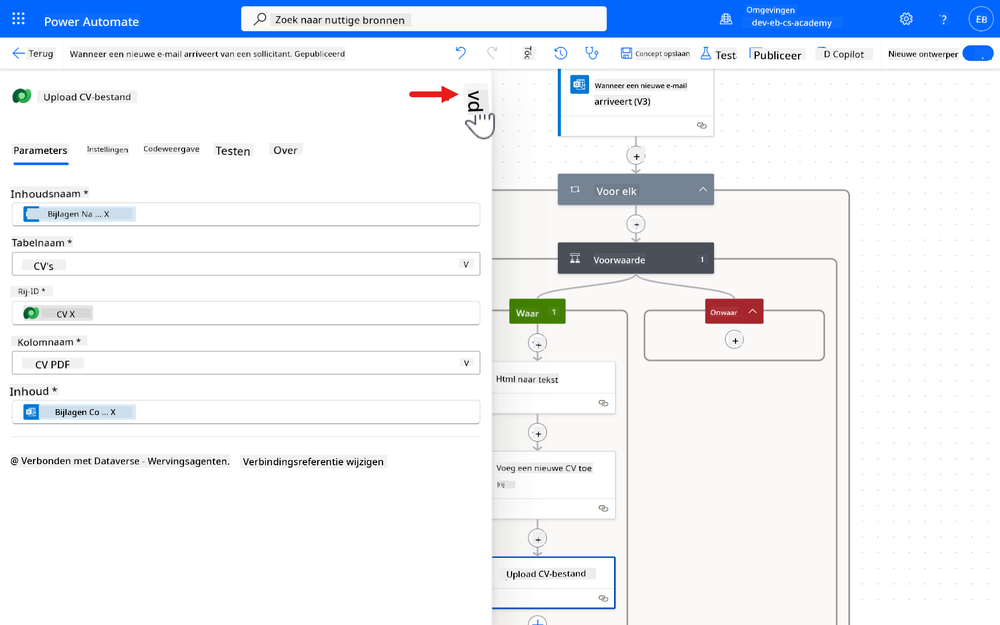

1. Selecteer vervolgens **Stuurt een prompt naar de opgegeven copilot voor verwerking**, en sleep deze actie onder de actie **Upload CV-bestand** in het _True_-pad van de voorwaarde.

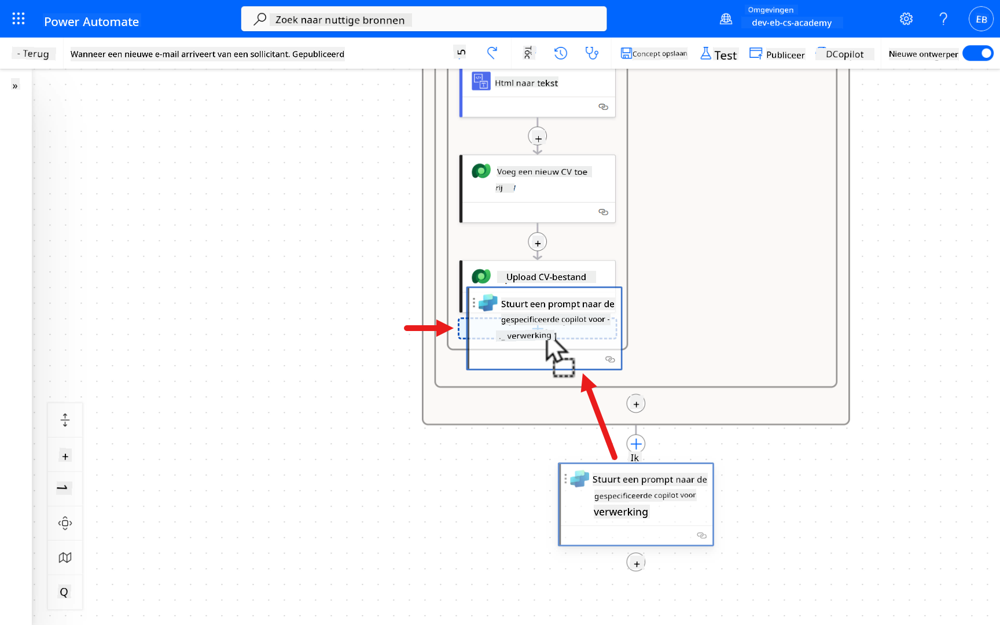

1. Selecteer **Stuurt een prompt naar de opgegeven copilot voor verwerking** om deze te configureren.

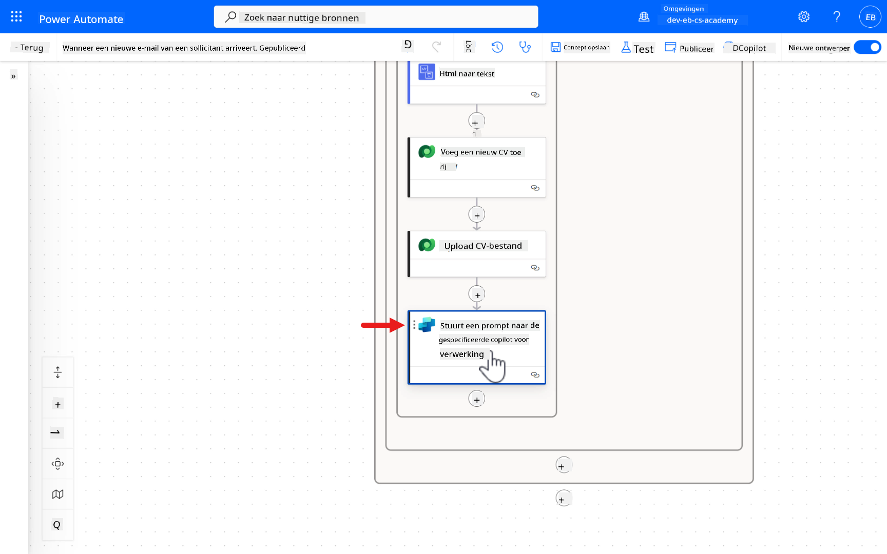

1. Selecteer alle inhoud in het veld **Body/bericht** en wis/verwijder deze.

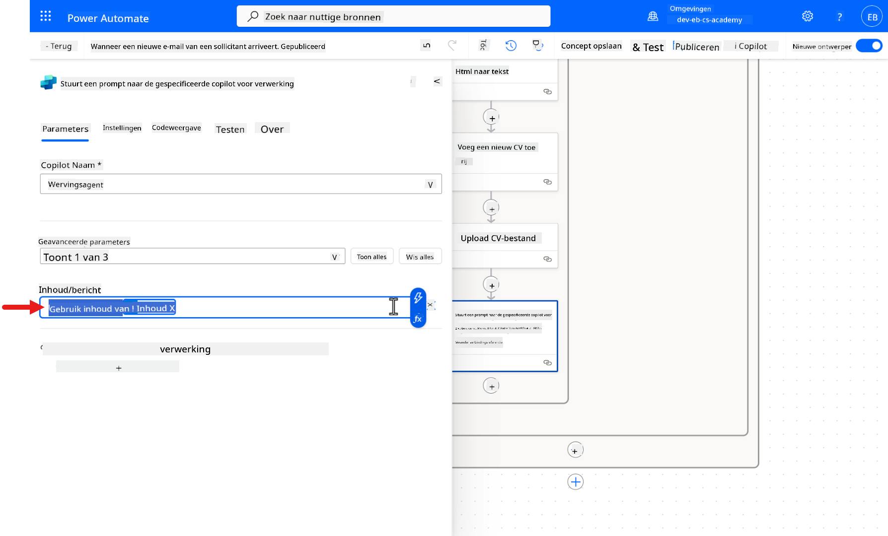

1. Kopieer en plak de volgende tekst in het veld **Body/bericht** en markeer de `CV-ID PLAATSHOUDER`.

```text
Stuur [CV-ID (tekst)] = "CV-ID PLAATSHOUDER" en [CV-Titel (tekst_1)] = "CV-TITEL PLAATSHOUDER" en [CV-Nummer (tekst_2)] = "CV-NUMMER PLAATSHOUDER" naar de Tool "Teams Bewerkerkanaal informeren" in de subagent "Aanvraagverwerkingsagent"
```

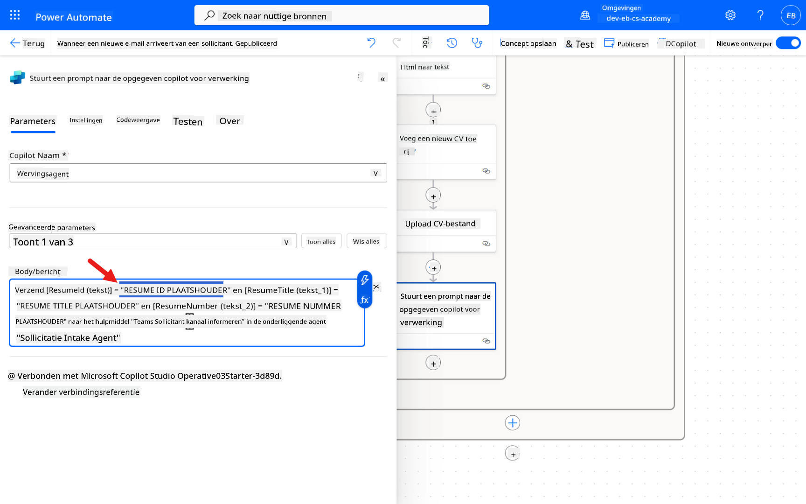

1. Klik op het **bliksemschicht-icoon** of **fx-icoon** aan de rechterkant.

Zoek naar `cv` en selecteer de parameter **CV** van de _Een nieuwe rij toevoegen Dataverse_-actie, omdat deze de `ID`-waarde bevat van de CV-rij die is aangemaakt.

Klik op **Toevoegen**.

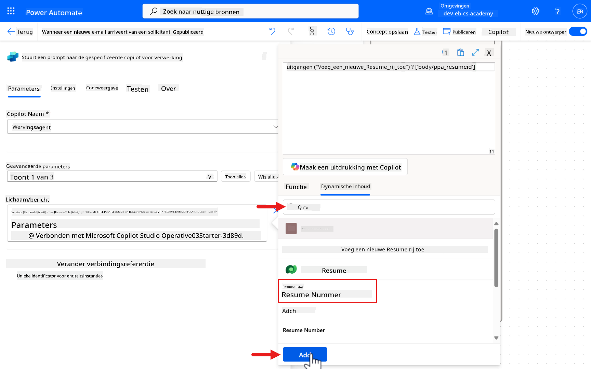

1. Markeer de `CV-TITEL PLAATSHOUDER`. Klik op het **bliksemschicht-icoon** of **fx-icoon** aan de rechterkant.

Zoek naar `titel` en selecteer de parameter **CV-Titel** van de _Een nieuwe rij toevoegen Dataverse_-actie, omdat deze de `cv-titel`-waarde bevat van de CV-rij die is aangemaakt.

Klik op **Toevoegen**.

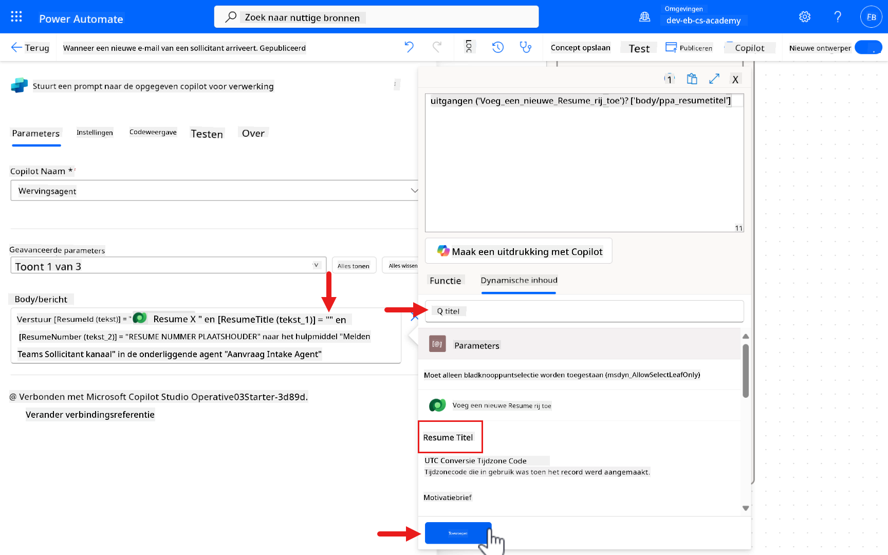

1. Markeer de `CV-NUMMER PLAATSHOUDER`. Klik op het **bliksemschicht-icoon** of **fx-icoon** aan de rechterkant.

Zoek naar `cv-nummer` en selecteer de parameter **CV-Nummer** van de _Een nieuwe rij toevoegen Dataverse_-actie, omdat deze de `CV-Nummer`-waarde bevat van de CV-rij die is aangemaakt.

Klik op **Toevoegen**.

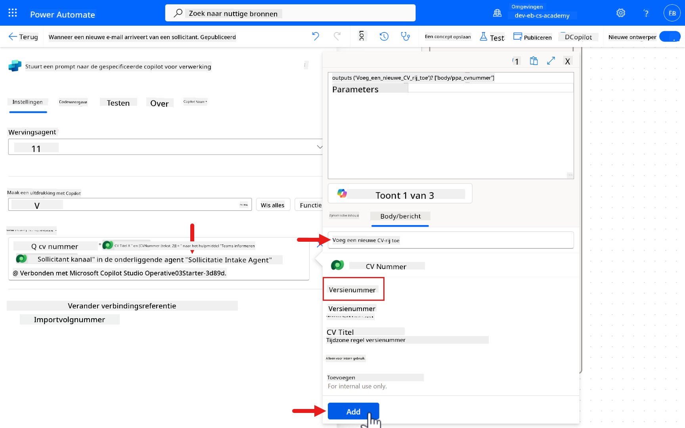

1. We hebben deze actie geconfigureerd en onze agentflow is voltooid 🙌🏻 Goed bezig! Laten we nu onze gebeurtenistriggerflow opslaan door **Concept opslaan** te selecteren.

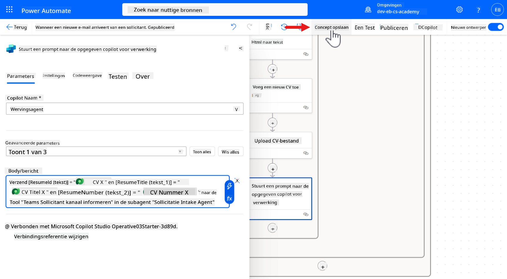

1. We moeten nu de details van de agentflow bewerken, selecteer **Terug**.

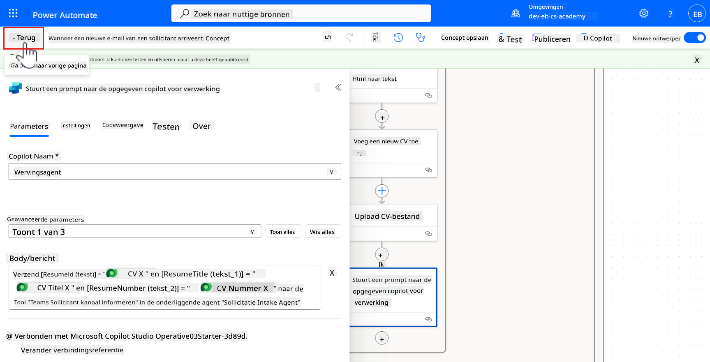

1. Selecteer **Bewerken** in de sectie **Details** en werk het **Plan** bij naar de optie **Copilot Studio**.

Klik op **Opslaan**.

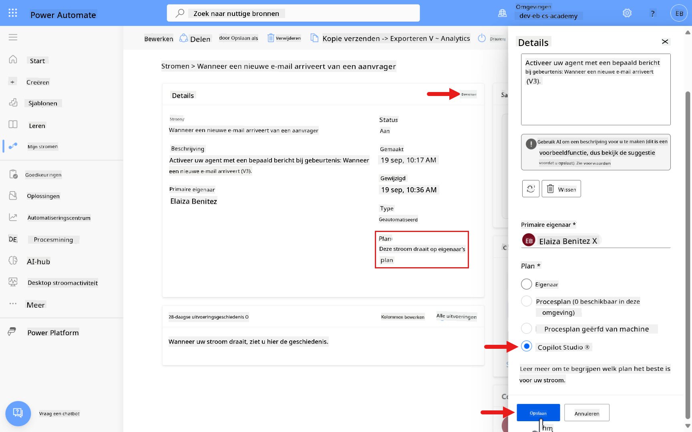

1. Er verschijnt een modal waarin wordt gevraagd om te bevestigen dat je wilt overschakelen naar het Copilot Studio-plan. Selecteer **Bevestigen**.

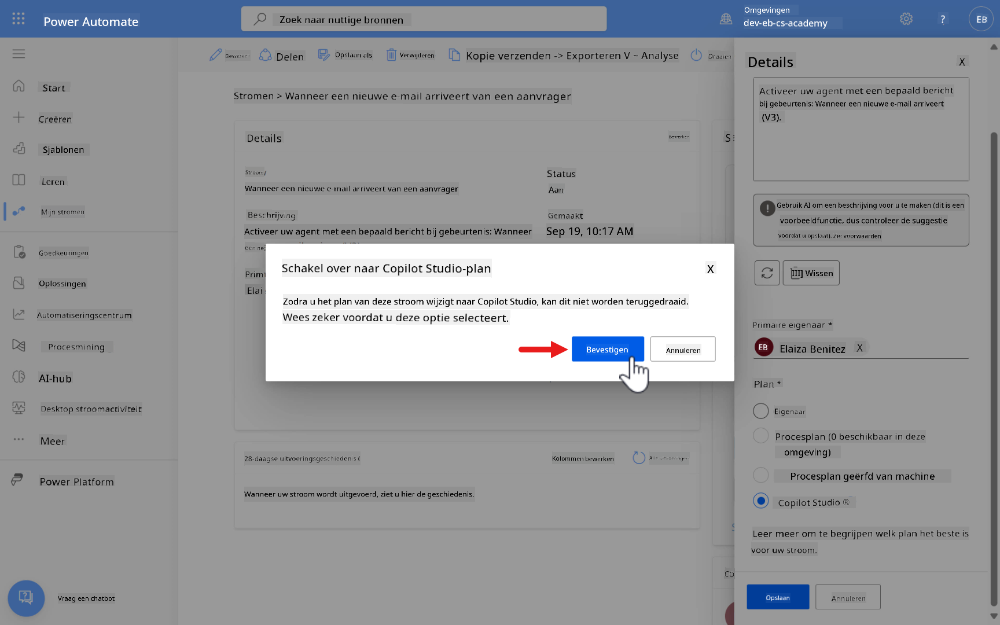

1. Het plan is nu bijgewerkt naar **Copilot Studio**. Selecteer **Bewerken**, omdat we de gebeurtenistriggerflow voor onze agent moeten publiceren.

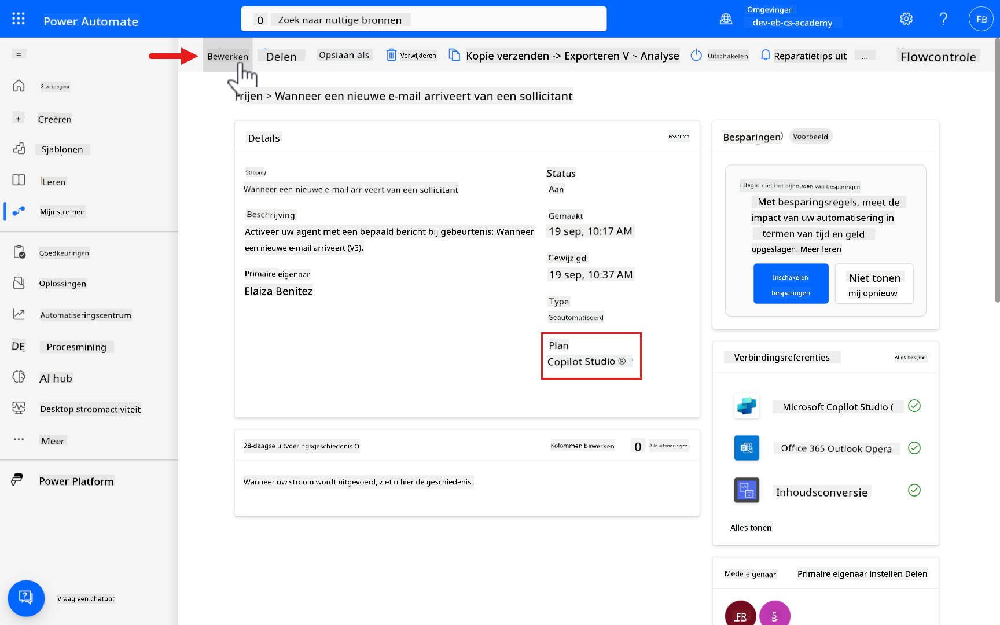

1. Selecteer **Publiceren**.

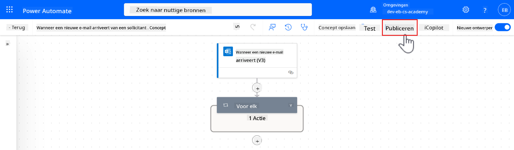

Hoera! De gebeurtenistriggerflow is nu gepubliceerd 😃

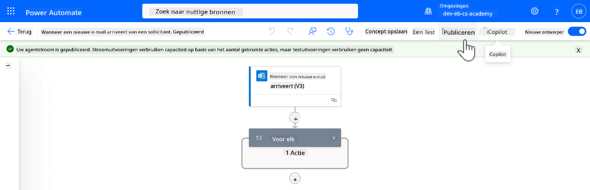

Laten we doorgaan met het maken van een nieuwe agentflow die wordt aangeroepen door de subagent **Aanvraagverwerkingsagent**.

### Lab 3.2 - Een Teams-kanaal informeren met een adaptieve kaart

We gaan nu een nieuwe agentflow maken voor de subagent **Aanvraagverwerkingsagent** die de waarden gebruikt die door de gebeurtenistrigger zijn doorgegeven, om een adaptieve kaart te posten in een Teams-kanaal. Deze adaptieve kaart zal het HR-recruitmentteam waarschuwen over de PDF die automatisch is geüpload, zodat ze deze kunnen beoordelen.

Laten we beginnen!

1. Selecteer in de **Wervingsagent** het tabblad **Agents** en kies de **Aanvraagverwerkingsagent**.

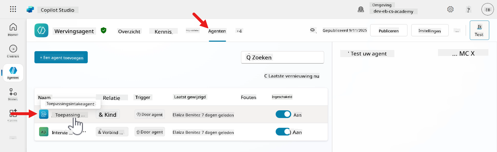

1. Scroll naar beneden naar **Tools** en selecteer **+ Toevoegen**.

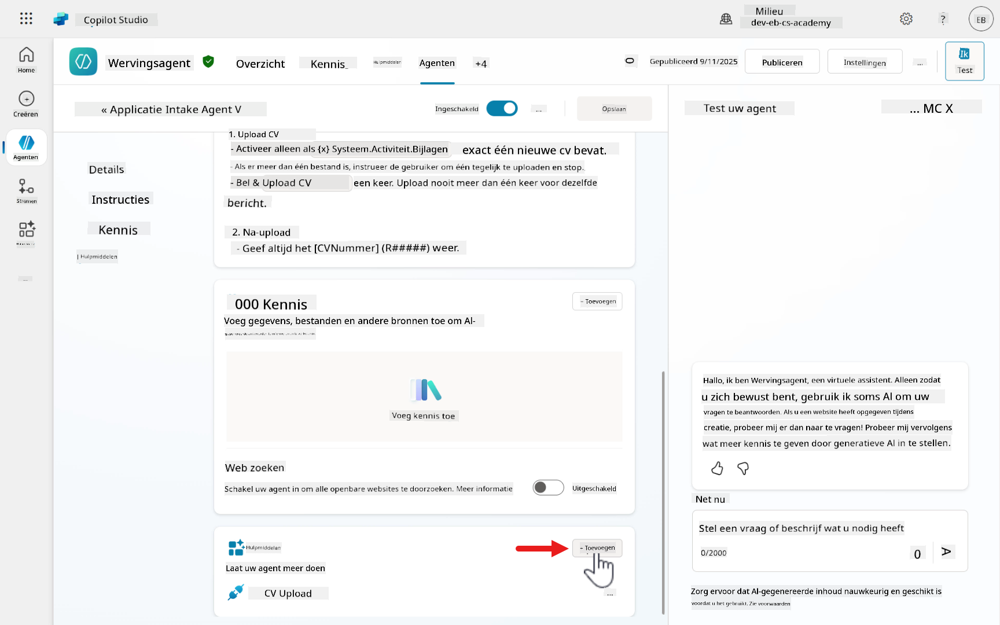

1. De modal **Tool toevoegen** verschijnt. Selecteer **+ Nieuwe tool**.

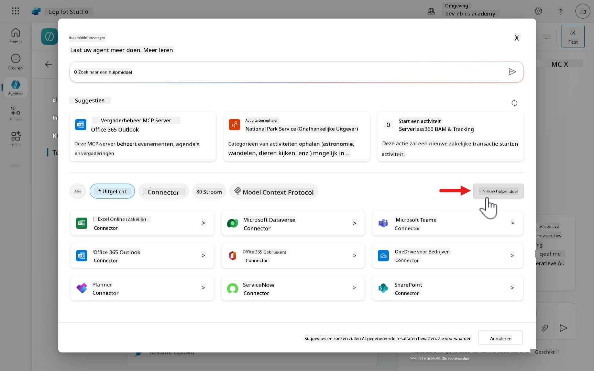

1. Selecteer **Agentflow**.


1. De **agentflow-ontwerper** wordt geladen. Selecteer in de trigger **Wanneer een agent de flow oproept** **+ Een invoer toevoegen**.


1. Selecteer **Tekst** als type gebruikersinvoer.


1. Kopieer en plak de volgende naam voor de invoerparameter in het tekstveld.

```text
CV-ID
```


1. Herhaal dezelfde stappen om een tweede tekstinvoer toe te voegen. Kopieer en plak de volgende naam voor de invoerparameter.

```text
CV-Titel
```


1. Herhaal dezelfde stappen om een derde tekstinvoer toe te voegen. Kopieer en plak de volgende naam voor de invoerparameter.

```text
CV-Nummer
```


1. Herinner je je nog hoe we in [Recruit](../../recruit/08-add-adaptive-card/README.md#81-create-a-new-topic-with-an-adaptive-card-for-user-to-submit-their-request) een adaptieve kaart hebben toegevoegd binnen een onderwerp voor onze agent? Deze keer gaan we een adaptieve kaart toevoegen in een agentflow. We gaan nu een andere actie toevoegen aan onze agentflow die een adaptieve kaart post in een Teams-kanaal.

Selecteer het **+ icoon** onder de trigger.


1. Selecteer de actie **Kaart posten in een chat of kanaal**.


1. Er moet een verbindingsreferentie naar Microsoft Teams worden gemaakt met je ingelogde gebruikersaccount. Selecteer **Inloggen**.


1. Selecteer je gebruikersaccount en klik vervolgens op **Toegang toestaan**.


1. Voor de volgende invoerparameters:

| Parameter | Hoe in te stellen | Details |
|----------|------------|---------|
| **Posten als** | Dropdown | Selecteer de optie `Flow bot` |
| **Posten in** | Dropdown | Selecteer de optie `Kanaal` |
| **Team** | Dropdown | Selecteer een team dat beschikbaar is in je omgeving en waartoe je toegang hebt voor het voltooien van deze laboefening |
| **Kanaal** | Dropdown | Selecteer een kanaal dat beschikbaar is in je omgeving en waartoe je toegang hebt voor het voltooien van deze laboefening |


1. Vervolgens configureren we het veld **Adaptieve kaart**. Selecteer het veld **Adaptieve kaart**.


1. Open het [JSON-bestand met bijgewerkte CV-tabel](../../../../../docs/operative-preview/03-automate-triggers/assets/3.2_ResumeTableUpdated.json), kopieer de volledige inhoud en plak deze in het veld Adaptieve kaart.


1. Net zoals we deden in [Recruit](../../recruit/08-add-adaptive-card/README.md#81-create-a-new-topic-with-an-adaptive-card-for-user-to-submit-their-request), gaan we bestaande waarden in de JSON-payload vervangen door daadwerkelijke waarden of dynamische inhoud.

Laten we eerst de URL voor de `url`-eigenschap binnen de `selectAction`-eigenschap bijwerken. Deze URL wordt vervangen door de URL van de CV's systeemweergave in de **Hiring Hub** modelgestuurde app. Hierdoor kan de recruiter de actie selecteren en naar de CV's systeemweergave in de modelgestuurde app worden geleid.

Markeer de huidige URL-waarde en verwijder deze.


1. Navigeer in de **Hiring Hub** modelgestuurde app naar de **CV's** systeemweergave via het menu aan de linkerkant en kopieer de URL. Navigeer vervolgens terug naar de agentflow en plak de gekopieerde URL in de **url**-eigenschap binnen de `selectAction`-eigenschap.


1. Je zou het volgende moeten zien, waarbij de geel gemarkeerde delen de details van jouw omgeving zijn in de **Hiring Hub** modelgestuurde app.

     | Parameter | Waarde | Uitleg |
     |----------|------------|---------|
     | **Organisatie-URI** | GUID | De URL van de Dataverse/Dynamics 365 omgeving |
     | **appid** | GUID | Om een specifieke modelgestuurde app te openen, wordt de queryparameter appid of appname gebruikt. In dit geval wordt appid gebruikt |
     | **viewid** | GUID | De queryparameter die de id van de weergave is |

       

1. Vervolgens voegen we dynamische inhoudswaarden toe voor verschillende eigenschappen. Laten we beginnen met de tekst die het referentienummer van de cv weergeeft die autonoom is aangemaakt door de gebeurtenistrigger.

      Selecteer het **paneel**-icoon om het actiepaneel te laden.

       

1. Scroll naar de regel waar je de eigenschap `text` ziet voor `RESUME NUMBER PLACEHOLDER`. Markeer de placeholderwaarde en verwijder deze.

       

1. Klik tussen de dubbele aanhalingstekens en selecteer het **bliksemschicht-icoon** of **fx-icoon** aan de rechterkant.

      In het tabblad **Dynamische inhoud** selecteer je de parameter **ResumeNumber** en klik op **Toevoegen**.

       

1. De parameter **ResumeNumber** wordt nu toegevoegd als dynamische inhoud aan de eigenschap `text`.

       

1. We herhalen dezelfde stappen voor de `RESUME NAME PLACEHOLDER`. Scroll naar de regel waar je de eigenschap `text` ziet voor `RESUME NAME PLACEHOLDER`. Markeer de placeholderwaarde en verwijder deze.

       

1. Klik tussen de dubbele aanhalingstekens en selecteer het **bliksemschicht-icoon** of **fx-icoon** aan de rechterkant.

      In het tabblad **Dynamische inhoud** selecteer je de parameter **ResumeTitle** en klik op **Toevoegen**.

       

1. De parameter **ResumeTitle** wordt nu toegevoegd als dynamische inhoud aan de eigenschap `text`.

       

1. We herhalen dezelfde stappen voor de waarde **Due Date**, die aangeeft wanneer een recruiter de cv moet beoordelen. Scroll naar de regel waar je de eigenschap `text` ziet voor `May 21, 2023`.

       

1. Verwijder deze placeholderwaarde en klik tussen de dubbele aanhalingstekens.

       

1. Selecteer het **bliksemschicht-icoon** of **fx-icoon** aan de rechterkant en voer in het tabblad **Functie** de volgende expressie in en klik op **Toevoegen**.

       ```text
       addDays(utcNow(), 3, 'MMM dd, yyyy')
       ```

      Deze expressie maakt gebruik van twee functies.

     | Functie | Uitleg |
     |----------|------------|
     | **addDays** | Voegt een opgegeven aantal dagen toe aan een gegeven datum en retourneert de resulterende datum in stringformaat |
     | **utcNow** | Retourneert de huidige datum en tijd in Coordinated Universal Time (UTC) formaat als een string. |

      Voor de waarde utcNow formatteren we de datum als maand en dag, gevolgd door het jaar.

       

      De expressie wordt nu toegevoegd aan de eigenschap `text`.

       

1. Tot slot werken we de URL bij voor de eigenschap `url` binnen de eigenschap `actions` array onderaan de JSON-payload. Deze huidige placeholder-URL wordt vervangen door de URL van de cv-rij in de **Hiring Hub** modelgestuurde app. Dit stelt de recruiter in staat om de actie `Action.OpenURL` van de adaptieve kaart te selecteren en naar de cv in de modelgestuurde app te worden geleid.

       

1. Open in de **Hiring Hub** modelgestuurde app een rij in de systeemweergave **Resumes** via het menu aan de linkerkant. De cv-rij wordt geladen als een formulier in de modelgestuurde app.

      Kopieer de URL van de cv-rij.

    ??? info "Hoe navigeer je terug naar de **Hiring Hub** modelgestuurde app als je deze hebt verlaten/gesloten"

        1. Ga naar [https://make.powerapps.com](https://make.powerapps.com) en zorg ervoor dat je in de ontwikkelaarsomgeving bent die je gebruikt voor deze lab-oefeningen, anders schakel je naar deze omgeving.
        
        

        1. Selecteer **Apps** in het menu aan de linkerkant en selecteer voor de **Hiring Hub** modelgestuurde app het **Afspelen**-icoon om deze in je browser te laden.
        
        

       

1. Navigeer vervolgens terug naar de agent flow, markeer de huidige placeholder-URL-waarde en verwijder deze.

       

1. Plak vervolgens de gekopieerde URL in de eigenschap **url** binnen de eigenschap `url`.

       

1. Je zou het volgende moeten zien. Verwijder de `GUID` id-waarde aan het einde. We vervangen dit door dynamische inhoud - de parameter **ResumeId**.

       

1. Selecteer het **bliksemschicht-icoon** of **fx-icoon** aan de rechterkant.

      In het tabblad **Dynamische inhoud** selecteer je de parameter **ResumeId** en klik op **Toevoegen**.

       

1. De **ResumeId** wordt toegevoegd als dynamische inhoud. Het volgende, geel gemarkeerd, zijn jouw omgevingsdetails van de **Hiring Hub** modelgestuurde app.

     | Parameter | Waarde | Uitleg |
     |----------|------------|---------|
     | **Organisatie-URI** | GUID | De URL van de Dataverse/Dynamics 365 omgeving |
     | **appid** | GUID | Om een specifieke modelgestuurde app te openen, wordt de queryparameter appid of appname gebruikt. In dit geval wordt appid gebruikt |
     | **id** | GUID | De queryparameter die de id van de cv-rij is |

       

1. We hebben de configuratie van de actie **Post card in a chat or channel** voltooid 👏🏻 Sluit het configuratiepaneel van de actie door op het **x**-icoon te klikken.

       

1. Tot slot configureren we de laatste actie, **Respond to the agent**, door een tekst terug te sturen naar de agent om de verwerking te beëindigen.

      Selecteer in de actie **Respond to the agent** **+Een output toevoegen**.

       

1. Selecteer **Tekst** als het type output.

       

1. Voer het volgende in als naam van de output.

       

1. Voer het volgende in als waarde voor de output.

       ```text
       Finished
       ```

       

1. We hebben nu de configuratie van de agent flow voltooid. Selecteer **Concept opslaan** om de agent flow op te slaan. Er verschijnt een bevestigingsbericht zodra het is opgeslagen.

       

1. Voordat we de agent flow publiceren, moeten we de details voor de agent flow bijwerken. Selecteer het tabblad **Overzicht** en klik op **Bewerken**.

      Voer in het veld voor de naam van de flow het volgende in.

       ```text
       Notify Teams Applicant channel
       ```      

      Selecteer daarna het **Vernieuwen**-icoon om de beschrijving van de agent flow bij te werken met behulp van AI.

      Klik vervolgens op **Opslaan** om de bijgewerkte details voor de agent flow op te slaan.

       

1. Navigeer terug naar het tabblad **Ontwerper** en selecteer **Publiceren** om de agent flow te publiceren. Er verschijnt een bevestigingsbericht zodra het is opgeslagen.

       

1. De agent flow moet nu worden toegevoegd als een tool in de **Application Intake Agent**. Navigeer terug naar de **Hiring Agent** en selecteer het tabblad **Agents**, selecteer vervolgens de **Application Intake Agent**.

       

1. In de sectie **Details** van de agent werken we het veld **Beschrijving** bij. Kopieer het volgende en plak dit aan het einde van de beschrijvingstekst.

       ```text
       en ook de Teams Applicant channel notificeren
       ```

       

1. Vervolgens voegen we de agent flow toe als een tool. Scroll naar beneden en selecteer **+ Toevoegen**.

       

1. Selecteer de eerder aangemaakte agent flow, **Notify Teams Applicant Channel**.

       

1. Selecteer vervolgens **Toevoegen en configureren**.

       

1. In de sectie **Inputs** van de agent flow zijn de drie inputs die we eerder hebben geconfigureerd zichtbaar. Standaard is de configuratie **Automatisch invullen met AI** ingesteld. We laten deze instelling zoals deze is, omdat de prompt van de gebeurtenistrigger (in de laatste actie, **Verstuurt een prompt naar de opgegeven copilot voor verwerking** - dit zijn stappen 38-44 van **Lab 3.1 - Automatisch cv's uploaden naar Dataverse ontvangen via e-mail**) de parameterwaarden bevat die AI zal extraheren.

       

1. Nu de tool is toegevoegd aan de **Application Intake Agent**, moeten de instructies van de agent worden bijgewerkt. Selecteer het **terug-pijl**-icoon om terug te keren naar de lijst met agents.

       

1. Selecteer de **Application Intake Agent** in het tabblad **Agents** van de **Hiring Agent**.

       

1. In het veld **Instructies** voeg je een nieuwe regel toe na de `2.Post-Upload` instructies. Kopieer en plak de volgende instructies.

       ```text
       Proces voor het uploaden van cv's via e-mail
       1. Wanneer je een bericht ontvangt, **Stuur [ResumeId (text)] = "1680265f-5793-f011-b41b-7c1e525be9f7" en [ResumeTitle (text_1)] = "TAYLOR TESTPERSON (FICTIEF).pdf" en [ResumeNumber (text_2)]= "R01026" naar de tool "Notify Teams Applicant channel"** in de subagent "Application Intake Agent", roep [AGENT FLOW PLACEHOLDER] aan.
       ```

       

1. Markeer de tekst `[AGENT FLOW PLACEHOLDER]`.

       

1. Voer het schuine streepje, `/`, in en selecteer de tool **Notify Teams Applicant Channel**.

       
1. De agentflow zal nu worden gestart door de **Application Intake Agent** volgens de instructies, nadat de laatste actie (**Stuurt een prompt naar de opgegeven copilot voor verwerking**) in de event trigger de prompt met de parameterwaarden terugstuurt naar de agent.

      Selecteer **Opslaan** om de bijgewerkte instructies voor de **Application Intake Agent** op te slaan.

       

1. De instructies worden nu bijgewerkt zodra de agent is opgeslagen.

       

1. We moeten nu de **Hiring Agent** publiceren. Selecteer **Publiceren** rechtsboven en selecteer **Publiceren** in de _Publiceer deze agent-modal_ die verschijnt.

       

1. Na publicatie verschijnt een bevestigingsbericht dat de agent is gepubliceerd.

       

We kunnen nu de agent testen!

### Lab 3.3 - Test event trigger

1. Om de event trigger uit te voeren, moet er een e-mail worden verzonden met een pdf-bestand van een cv. Stel een nieuwe e-mail op in Outlook.

     | E-mailonderdeel | Details |
     |----------|------------|
     | **Aan ontvanger** | Gebruik je ingelogde gebruikersaccount als waarde |
     | **Bestandsbijlage** | Upload het bestand [TAYLOR TESTPERSON (FICTIEF)](../../../../../docs/operative-preview/test-data/resumes/TAYLOR%20TESTPERSON%20(FICTITIOUS).pdf) |
     | **Tekst** | Kopieer en plak de onderstaande tekst als de inhoud van de e-mail |

       ```text
       Beste Hiring Manager,

       Ik schrijf u om mijn interesse kenbaar te maken in de functie van Senior Power Platform Engineer bij uw organisatie. Met meer dan negen jaar ervaring in het leveren van veilige en schaalbare oplossingen op Microsoft-cloudplatforms, ben ik ervan overtuigd dat ik effectief kan bijdragen aan uw team.

       In mijn meest recente rol als Lead Power Platform Engineer heb ik een geautomatiseerde cv-intake pipeline ontwikkeld, waardoor handmatige triage werd verminderd en de doorzoekbaarheid werd verbeterd. Ik heb HR-casebeheerapplicaties geleverd, oplossing-bewuste flows geïntroduceerd en PR-controles geïmplementeerd om de implementatietijden te verbeteren. Mijn expertise omvat Power Apps, Power Automate, Power Pages, Dataverse en een reeks Microsoft 365-diensten, evenals integratie met Graph/REST API's en Azure Functions.

       Eerder heb ik goedkeuringen in Teams ontwikkeld met adaptieve kaarten, waardoor goedkeuringstijden werden teruggebracht tot dezelfde dag, en robuuste foutafhandelingsframeworks gecreëerd. Mijn achtergrond omvat ook het migreren van legacy-workflows naar Power Automate en het bouwen van selfserviceportalen die door honderden medewerkers zijn geadopteerd.

       Ik heb een B.Sc. in Computer Science en ben gecertificeerd als Power Platform Developer (PL-400) en Solution Architect (PL-600). Daarnaast ben ik gepassioneerd over mentoring en heb ik vrijwilligerswerk gedaan bij lokale maker-groepen.

       Bijgevoegd vindt u mijn cv ter overweging. Ik zou graag de kans krijgen om te bespreken hoe mijn vaardigheden en ervaring aansluiten bij uw behoeften.

       Dank u voor uw tijd en overweging.

       Met vriendelijke groet,  
       Taylor Testperson
       ```

       **Verzend** de e-mail zodra deze is opgesteld.

       

1. Ga in het Power Automate-makerportaal naar de event trigger flow en selecteer het **Vernieuwen**-icoon om de geslaagde flowuitvoering voor de verzonden e-mail te bekijken.

       

1. Ga terug naar Copilot Studio in de **Hiring Agent** en selecteer het tabblad **Activiteit**.

       

1. Het tabblad **Activiteit** wordt geladen en toont alle activiteiten van de **Hiring Agent**. Er zal een activiteit zijn met de naamwaarde **Automated** en de status **Voltooid**. Deze activiteit vertegenwoordigt de event trigger en de agentflow die is gestart.

       

1. Selecteer de activiteit en selecteer de event trigger in de activiteitenkaart. In het paneel aan de rechterkant zie je hoe de invoerparameters in de prompt de waarden `Resume Id`, `Resume Title` en `Resume Number` bevatten van de **Dataverse**-rij die is aangemaakt. Dit komt voort uit de dynamische inhoudswaarden die eerder zijn geconfigureerd in stappen 18 - 27 van **Lab 3.1 - Automatisch cv's uploaden naar Dataverse die per e-mail zijn ontvangen**.

       

1. Navigeer terug naar de **Hiring Hub** modelgestuurde app en selecteer in de **Resumes system view** de optie **Vernieuwen** om de weergave te verversen. De nieuw aangemaakte rij voor het cv dat per e-mail is verzonden, wordt nu weergegeven omdat deze is aangemaakt via de event trigger.

       

1. Navigeer terug naar Copilot Studio en selecteer de **Notify Teams Applicant Channel** agentflow binnen de **Application Intake Agent** in de activiteitenkaart. In het paneel aan de rechterkant zie je hoe de invoerwaarden afkomstig zijn van de Dataverse-rij. Dit komt voort uit de prompt die is verzonden door de laatste actie (**Stuurt een prompt naar de opgegeven copilot voor verwerking**) in de event trigger die de parameterwaarden bevat van de nieuw aangemaakte Dataverse-rij. Zo kunnen we parameterwaarden doorgeven van event triggers naar agentflows.

       

1. Laten we tot slot kijken naar de adaptieve kaart die is gepost in het kanaal in **Microsoft Teams**. In het kanaal zien we de adaptieve kaart die informatie weergeeft over de nieuw aangemaakte cv-rij in Dataverse. Beweeg de muis over de hyperlink aan het begin van de adaptieve kaart en merk op hoe de URL de Resumes system view-URL is die we eerder hebben geconfigureerd in de JSON (stappen 15 - 19 van **Lab 3.2 - Een Teams-kanaal informeren met een adaptieve kaart**) payload van de adaptieve kaart.

       

1. Selecteer de hyperlink en je wordt doorgestuurd naar de Resumes system view in de **Hiring Hub** modelgestuurde app in je browser.

       

1. Navigeer terug naar de adaptieve kaart die is gepost in het kanaal in Microsoft Teams. Beweeg deze keer de muis over **View Resume**, wat de `Action.OpenURL`-actie is van de adaptieve kaart. Merk op hoe de URL de cv-rij is die we eerder hebben geconfigureerd in de JSON (stappen 30 - 36 van **Lab 3.2 - Een Teams-kanaal informeren met een adaptieve kaart**) payload van de adaptieve kaart.

       

1. Selecteer de actie en je wordt doorgestuurd naar het cv-rijformulier in de **Hiring Hub** modelgestuurde app in je browser.

       

## ✅ Missie Voltooid

Gefeliciteerd! 👏🏻 Uitstekend werk, Operative.

✅ Event trigger: je hebt een event trigger gemaakt die Dataverse-parameterwaarden doorgeeft aan een agentflow.  
✅ Een agentflow gebouwd: gebruikt de Dataverse-parameterwaarden om een adaptieve kaart te posten in een kanaal in Microsoft Teams om het HR-recruitmentteam te waarschuwen.  
✅ Instructies voor onderliggende agent bijgewerkt: om de flow te starten zodra de event trigger is voltooid.

Dit stelt de **Hiring Agent** in staat om autonoom te werken wanneer cv's als e-mailbijlagen worden ontvangen en het HR-recruitmentteam te informeren voor handmatige beoordeling.

Dit is het einde van **Lab 03 - Automatiseren van sollicitatie-e-mails**, selecteer de onderstaande link om door te gaan naar de volgende les.

⏭️ [Ga naar de les **Agentinstructies opstellen**](../04-agent-instructions/README.md)

## 📚 Tactische Bronnen

📖 [Maak je agent autonoom in Copilot Studio](https://learn.microsoft.com/training/modules/autonomous-agents-online-workshop/?WT.mc_id=power-188561-ebenitez)  

📖 [Een event trigger toevoegen](https://learn.microsoft.com/microsoft-copilot-studio/authoring-trigger-event?WT.mc_id=power-188561-ebenitez)  

📖 [Agentflows gebruiken met je agent](https://learn.microsoft.com/microsoft-copilot-studio/advanced-flow?WT.mc_id=power-188561-ebenitez)  

📖 [Introductie Power Automate triggers](https://learn.microsoft.com/power-automate/triggers-introduction?WT.mc_id=power-188561-ebenitez)  

📖 [Power Automate flows gebruiken met agents](https://learn.microsoft.com/microsoft-copilot-studio/advanced-flow-create?WT.mc_id=power-188561-ebenitez)  

📖 [Preventie van gegevensverlies voor Copilot Studio](https://learn.microsoft.com/microsoft-copilot-studio/admin-data-loss-prevention?WT.mc_id=power-188561-ebenitez)  

---

**Disclaimer**:  
Dit document is vertaald met behulp van de AI-vertalingsservice [Co-op Translator](https://github.com/Azure/co-op-translator). Hoewel we streven naar nauwkeurigheid, dient u zich ervan bewust te zijn dat geautomatiseerde vertalingen fouten of onnauwkeurigheden kunnen bevatten. Het originele document in de oorspronkelijke taal moet worden beschouwd als de gezaghebbende bron. Voor kritieke informatie wordt professionele menselijke vertaling aanbevolen. Wij zijn niet aansprakelijk voor eventuele misverstanden of verkeerde interpretaties die voortvloeien uit het gebruik van deze vertaling.