<!--
CO_OP_TRANSLATOR_METADATA:
{
  "original_hash": "750f3ea8a94930439ebd8a10871b1d73",
  "translation_date": "2025-10-17T01:42:36+00:00",
  "source_file": "docs/operative-preview/08-dataverse-grounding/README.md",
  "language_code": "nl"
}
-->
# 🚨 Missie 08: Verbeterde prompts met Dataverse-koppeling

## 🕵️‍♂️ CODENAAM: `OPERATIE GROUNDING CONTROL`

> **⏱️ Operatietijdvenster:** `~60 minuten`

## 🎯 Missieoverzicht

Welkom terug, Agent. Je multi-agent aanwervingssysteem is operationeel, maar er is een cruciale verbetering nodig voor **datakoppeling** - je AI-modellen hebben real-time toegang nodig tot de gestructureerde gegevens van je organisatie om intelligente beslissingen te nemen.

Momenteel werkt je "Samenvat CV"-prompt met statische kennis. Maar wat als het dynamisch toegang zou hebben tot je database met functierollen om nauwkeurige, actuele matches te bieden? Wat als het je evaluatiecriteria begreep zonder dat je deze handmatig moest coderen?

In deze missie verbeter je je aangepaste prompt met **Dataverse-koppeling** - het direct verbinden van je prompts met live gegevensbronnen. Dit transformeert je agents van statische respondenten naar dynamische, datagestuurde systemen die zich aanpassen aan veranderende zakelijke behoeften.

Je missie: integreer real-time functierollen en evaluatiecriteria in je CV-analyseworkflow, en creëer een zelf-updaterend systeem dat up-to-date blijft met de aanwervingsvereisten van je organisatie.

## 🔎 Doelstellingen

In deze missie leer je:

1. Hoe **Dataverse-koppeling** aangepaste prompts verbetert
1. Wanneer je datakoppeling moet gebruiken in plaats van statische instructies
1. Het ontwerpen van prompts die dynamisch live gegevens integreren
1. Het verbeteren van de "Samenvat CV"-workflow met functierol-matching

## 🧠 Begrijpen van Dataverse-koppeling voor prompts

**Dataverse-koppeling** stelt je aangepaste prompts in staat om live gegevens uit je Dataverse-tabellen te gebruiken bij het verwerken van verzoeken. In plaats van statische instructies kunnen je prompts real-time informatie opnemen om geïnformeerde beslissingen te nemen.

### Waarom Dataverse-koppeling belangrijk is

Traditionele prompts werken met vaste instructies:

```text
Match this candidate to these job roles: Developer, Manager, Analyst
```

Met Dataverse-koppeling heeft je prompt toegang tot actuele gegevens:

```text
Match this candidate to available job roles from the Job Roles table, 
considering current evaluation criteria and requirements
```

Deze aanpak biedt verschillende belangrijke voordelen:

- **Dynamische updates:** Functierollen en criteria veranderen zonder dat prompts aangepast hoeven te worden
- **Consistentie:** Alle agents gebruiken dezelfde actuele gegevensbronnen
- **Schaalbaarheid:** Nieuwe rollen en criteria zijn automatisch beschikbaar
- **Nauwkeurigheid:** Real-time gegevens zorgen ervoor dat beslissingen aansluiten bij de huidige behoeften

### Hoe Dataverse-koppeling werkt

Wanneer je Dataverse-koppeling inschakelt voor een aangepaste prompt:

1. **Gegevensselectie:** Kies specifieke Dataverse-tabellen en kolommen om op te nemen. Je kunt ook gerelateerde tabellen selecteren die het systeem filtert op basis van de opgehaalde hoofdrecords.
1. **Contextinjectie:** De prompt voegt automatisch de opgehaalde gegevens toe aan de promptcontext.
1. **Intelligent filteren:** Het systeem neemt alleen gegevens op die relevant zijn voor het huidige verzoek als je een filter opgeeft.
1. **Gestructureerde output:** Je prompt kan de opgehaalde gegevens refereren en redeneren over de records om de output te creëren.

### Van statisch naar dynamisch: Het voordeel van koppeling

Laten we je huidige "Samenvat CV"-workflow van Missie 07 bekijken en zien hoe Dataverse-koppeling het transformeert van statische naar dynamische intelligentie.

**Huidige statische aanpak:**
Je bestaande prompt bevatte hardgecodeerde evaluatiecriteria en vooraf bepaalde matchinglogica. Deze aanpak werkt, maar vereist handmatige updates telkens wanneer je nieuwe functierollen toevoegt, evaluatiecriteria wijzigt of bedrijfsprioriteiten verschuift.

**Transformatie door Dataverse-koppeling:**
Door Dataverse-koppeling toe te voegen, zal je "Samenvat CV"-workflow:

- **Toegang krijgen tot actuele functierollen** uit je Functierollen-tabel
- **Live evaluatiecriteria gebruiken** in plaats van statische beschrijvingen  
- **Nauwkeurige matches bieden** op basis van real-time vereisten

## 🎯 Waarom toegewijde prompts versus agentgesprekken

In Missie 02 heb je ervaren hoe de Interview Agent kandidaten kon matchen met functierollen, maar dit vereiste complexe gebruikersprompts zoals:

```text
Upload this resume, then show me open job roles,
each with a description of the evaluation criteria, 
then use this to match the resume to at least one suitable
job role even if not a perfect match.
```

Hoewel dit werkte, bieden toegewijde prompts met Dataverse-koppeling aanzienlijke voordelen voor specifieke taken:

### Belangrijkste voordelen van toegewijde prompts

| Aspect | Agentgesprekken | Toegewijde Prompts |
|--------|-------------------|------------------|
| **Consistentie** | Resultaten variëren afhankelijk van de promptvaardigheden van de gebruiker | Gestandaardiseerde verwerking elke keer |
| **Specialisatie** | Algemeen redeneren kan zakelijke nuances missen | Specifiek ontworpen met geoptimaliseerde bedrijfslogica |
| **Automatisering** | Vereist menselijke interactie en interpretatie | Wordt automatisch geactiveerd met gestructureerde JSON-output |

## 🧪 Lab 8: Voeg Dataverse-koppeling toe aan prompts

Tijd om je CV-analysecapaciteiten te upgraden! Je zult de bestaande "Samenvat CV"-workflow verbeteren met dynamische functierol-matching.

### Vereisten om deze missie te voltooien

1. Je hebt **ofwel**:

    - **Missie 07 voltooid** en je CV-analysesysteem klaar, **OF**
    - **De starteroplossing van Missie 08 geïmporteerd** als je opnieuw begint of moet inhalen. [Download Missie 08 Starteroplossing](https://aka.ms/agent-academy)

1. Voorbeeld-CV-documenten van [test CV's](https://download-directory.github.io/?url=https://github.com/microsoft/agent-academy/tree/main/operative/sample-data/resumes&filename=operative_sampledata)

!!! note "Oplossing importeren en voorbeeldgegevens"
    Als je de starteroplossing gebruikt, raadpleeg dan [Missie 01](../01-get-started/README.md) voor gedetailleerde instructies over hoe je oplossingen en voorbeeldgegevens in je omgeving importeert.

### 8.1 Voeg Dataverse-koppeling toe aan je prompt

Je bouwt voort op de "Samenvat CV"-prompt die je in Missie 07 hebt gemaakt. Momenteel vat deze alleen het CV samen, maar nu koppel je het met de functierollen zoals ze momenteel in Dataverse bestaan, zodat het altijd actueel blijft.

Eerst bekijken we de Dataverse-tabellen waarmee je gaat koppelen:

1. **Navigeer** naar [Power Apps](https://make.powerapps.com) en selecteer je omgeving met behulp van de **Omgevingsschakelaar** rechtsboven in de navigatiebalk.

1. Selecteer **Tabellen** en zoek de tabel **Functierollen**.

1. Bekijk de belangrijkste kolommen die je zult gebruiken voor koppeling:

    | Kolom | Doel |
    |--------|---------|
    | **Functierolnummer** | Unieke identificatie voor rolmatching |
    | **Functietitel** | Weergavenaam voor de rol |
    | **Beschrijving** | Gedetailleerde rolvereisten |

1. Bekijk op dezelfde manier de andere tabellen, zoals de tabel **Evaluatiecriteria**.

### 8.2 Voeg Dataverse-koppelingsgegevens toe aan je prompt

1. **Navigeer** naar Copilot Studio en selecteer je omgeving met behulp van de **Omgevingsschakelaar** rechtsboven in de navigatiebalk.

1. Selecteer **Tools** in de linker navigatiebalk.

1. Kies **Prompt** en zoek je **Samenvat CV**-prompt van Missie 07.  
    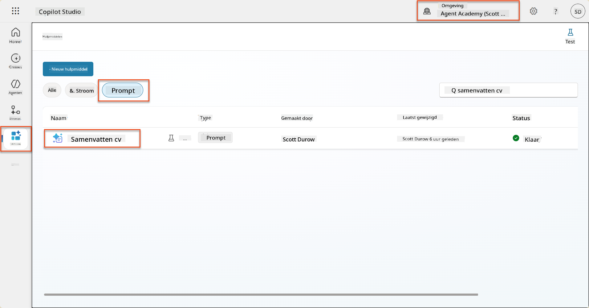

1. Selecteer **Bewerken** om de prompt te wijzigen en vervang deze door de verbeterde versie hieronder:

    !!! important
        Zorg ervoor dat de parameters CV en Motivatiebrief intact blijven als parameters.

    ```text
    You are tasked with extracting key candidate information from a resume and cover letter to facilitate matching with open job roles and creating a summary for application review.
    
    ### Instructions:
    1. **Extract Candidate Details:**
       - Identify and extract the candidate's full name.
       - Extract contact information, specifically the email address.
    
    2. **Analyze Resume and Cover Letter:**
       - Review the resume content to identify relevant skills, experience, and qualifications.
       - Review the cover letter to understand the candidate's motivation and suitability for the roles.
    
    3. **Match Against Open Job Roles:**
       - Compare the extracted candidate information with the requirements and descriptions of the provided open job roles.
       - Use the job descriptions to assess potential fit.
       - Identify all roles that align with the candidate's cover letter and profile. You don't need to assess perfect suitability.
       - Provide reasoning for each match based on the specific job requirements.
    
    4. **Create Candidate Summary:**
       - Summarize the candidate's profile as multiline text with the following sections:
          - Candidate name
          - Role(s) applied for if present
          - Contact and location
          - One-paragraph summary
          - Top skills (8–10)
          - Experience snapshot (last 2–3 roles with outcomes)
          - Key projects (1–3 with metrics)
          - Education and certifications
          - Availability and work authorization
    
    ### Output Format
    
    Provide the output in valid JSON format with the following structure:
    
    {
      "CandidateName": "string",
      "Email": "string",
      "MatchedRoles": [
        {
          "JobRoleNumber": "ppa_jobrolenumber from grounded data",
          "RoleName": "ppa_jobtitle from grounded data",
          "Reasoning": "Detailed explanation based on job requirements"
        }
      ],
      "Summary": "string"
    }
    
    ### Guidelines
    
    - Extract information only from the provided resume and cover letter documents.
    - Ensure accuracy in identifying contact details.
    - Use the available job role data for matching decisions.
    - The summary should be concise but informative, suitable for quick application review.
    - If no suitable matches are found, indicate an empty list for MatchedRoles and explain briefly in the summary.
    
    ### Input Data
    Open Job Roles (ppa_jobrolenumber, ppa_jobtitle): /Job Role 
    Resume: {Resume}
    Cover Letter: {CoverLetter}
    ```

1. In de prompteditor vervang je `/Functierol` door **+ Inhoud toevoegen**, selecteer **Dataverse** → **Functierol** en selecteer de volgende kolommen, en selecteer vervolgens **Toevoegen**:

    1. **Functierolnummer**

    1. **Functietitel**

    1. **Beschrijving**

    !!! tip
        Je kunt de tabelnaam typen om te zoeken.

1. In het **Functierol**-dialoogvenster selecteer je het **Filter**-attribuut, selecteer **Status**, en typ **Actief** als de **Filter**-waarde.  
    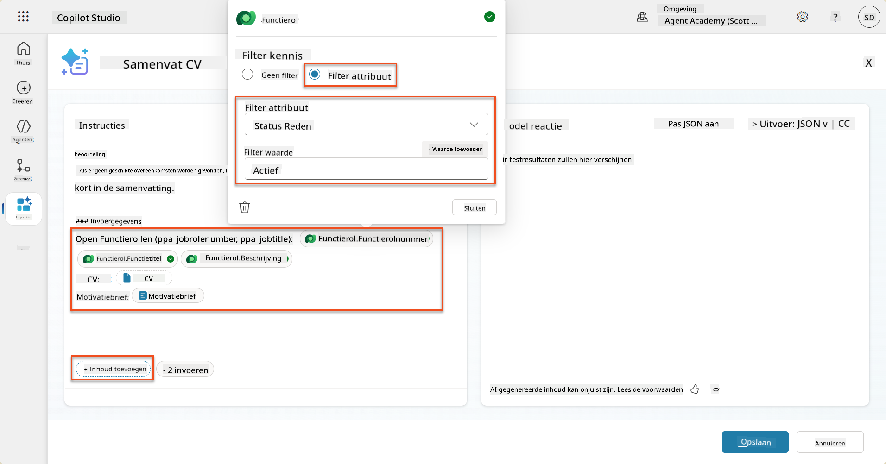

    !!! tip
        Je kunt hier **Waarde toevoegen** gebruiken om een invoerparameter toe te voegen - bijvoorbeeld als je een prompt had om een bestaand record samen te vatten, kun je het CV-nummer als parameter opgeven om te filteren.

1. Vervolgens voeg je de gerelateerde Dataverse-tabel **Evaluatiecriteria** toe door opnieuw **+ Inhoud toevoegen** te selecteren, **Functierollen** te vinden, en in plaats van de kolommen op Functierol te selecteren, **Functierol (Evaluatiecriteria)** uit te vouwen en de volgende kolommen te selecteren, en vervolgens **Toevoegen**:

    1. **Criterianaam**

    1. **Beschrijving**  
        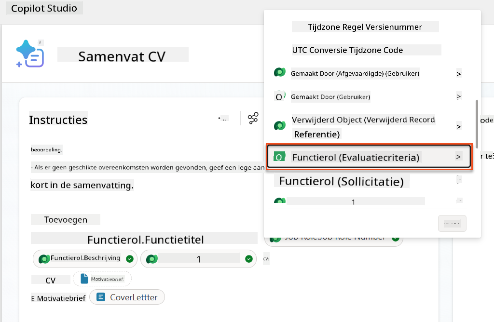

        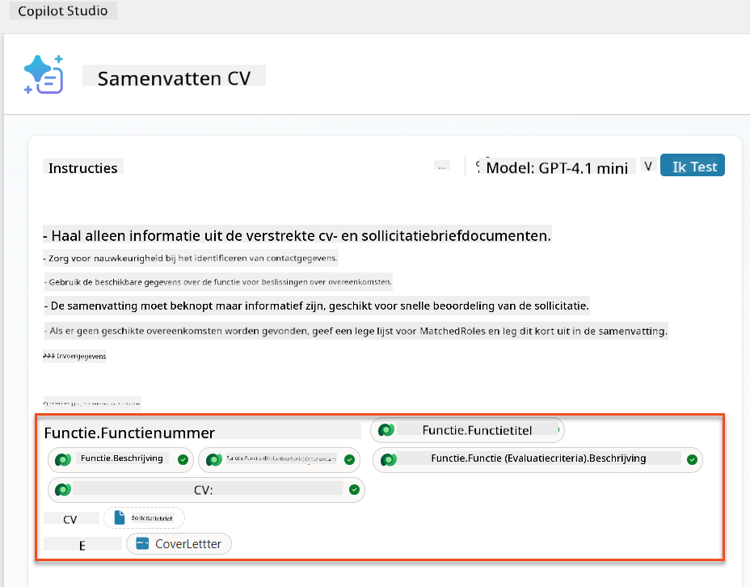

    !!! tip
        Het is belangrijk om de gerelateerde Evaluatiecriteria te selecteren door eerst de Functierol te selecteren en vervolgens in het menu naar Functierol (Evaluatiecriteria) te navigeren. Dit zorgt ervoor dat alleen de gerelateerde records voor de Functierol worden geladen.

1. Selecteer **Instellingen** en pas de **Recordophaling** aan naar 1000 - dit zorgt ervoor dat het maximum aantal Functierollen en Evaluatiecriteria in je prompt wordt opgenomen.  
    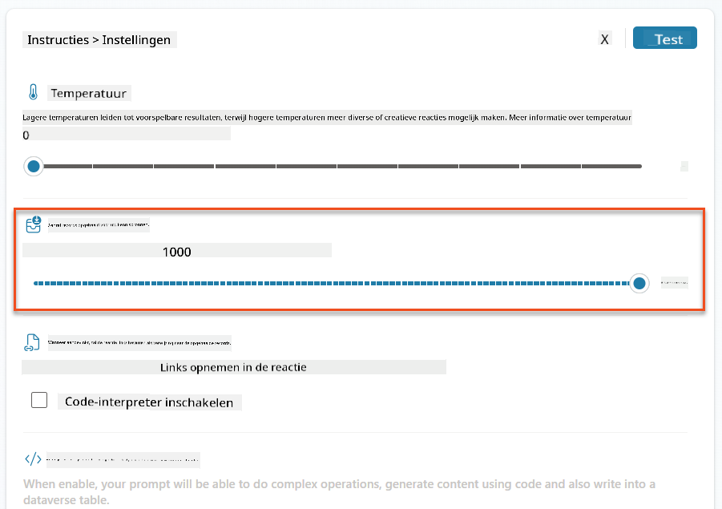

### 8.3 Test de verbeterde prompt

1. Selecteer de parameter **CV** en upload een voorbeeld-CV dat je in Missie 07 hebt gebruikt.
1. Selecteer **Test**.
1. Zodra de test is uitgevoerd, merk je dat de JSON-output nu de **Gematchte Rollen** bevat.
1. Selecteer het tabblad **Gebruikte kennis** om de Dataverse-gegevens te zien die met je prompt zijn samengevoegd vóór uitvoering.
1. **Sla** je bijgewerkte prompt op. Het systeem zal nu automatisch deze Dataverse-gegevens opnemen in je prompt wanneer de bestaande "Samenvat CV"-Agent Flow deze oproept.  
    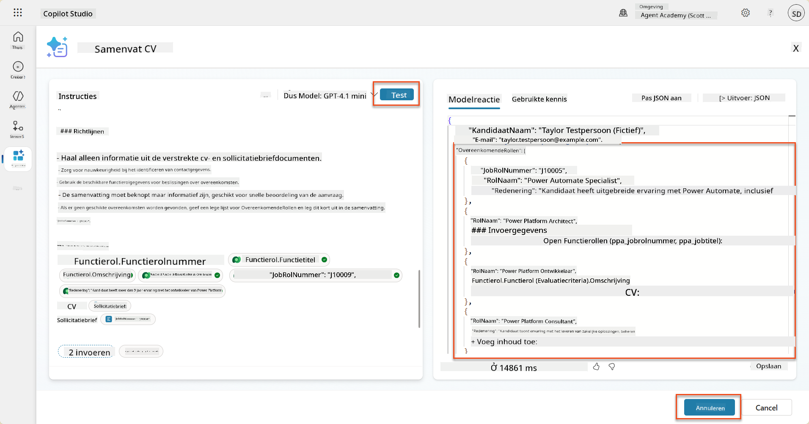

### 8.4 Voeg Job Application Agent Flow toe

Om onze Application Intake Agent in staat te stellen Functierollen te creëren op basis van de voorgestelde rollen, moeten we een Agent Flow maken. De agent zal deze tool aanroepen voor elk van de voorgestelde functierollen waarin de kandidaat geïnteresseerd is.

!!! tip "Agent Flow Expressies"
    Het is erg belangrijk dat je de instructies voor het benoemen van je knooppunten en het invoeren van expressies precies volgt, omdat de expressies verwijzen naar de vorige knooppunten met hun naam! Raadpleeg de [Agent Flow-missie in Recruit](../../recruit/09-add-an-agent-flow/README.md#you-mentioned-expressions-what-are-expressions) voor een snelle opfriscursus!

1. Binnen de **Hiring Agent** selecteer je het tabblad **Agents** en open je de subagent **Application Intake Agent**.

1. Binnen het **Tools**-paneel selecteer je **+ Toevoegen** → **+ Nieuwe tool** → **Agent Flow**.

1. Selecteer het knooppunt **Wanneer een agent de flow aanroept**, gebruik **+ Voeg een invoer toe** om de volgende parameter toe te voegen:

    | Type | Naam            | Beschrijving                                                  |
    | ---- | --------------- | ------------------------------------------------------------ |
    | Tekst | `ResumeNumber`  | Zorg ervoor dat je alleen het [ResumeNumber] gebruikt - het MOET beginnen met de letter R |
    | Tekst | `JobRoleNumber` | Zorg ervoor dat je alleen het [JobRoleNumber] gebruikt - het MOET beginnen met de letter J |

    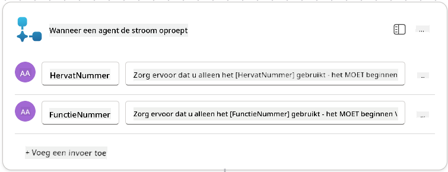

1. Selecteer het **+**-icoon onder het eerste knooppunt, zoek naar **Dataverse**, selecteer **Meer weergeven**, en zoek vervolgens de actie **Rijen ophalen**.

1. **Hernoem** het knooppunt naar `Get Resume` en stel de volgende parameters in:

    | Eigenschap        | Hoe in te stellen             | Waarde                                                        |
    | --------------- | ------------------------------- | ------------------------------------------------------------ |
    | **Tabelnaam**  | Selecteer                          | Resumes                                                      |
    | **Filterrijen** | Dynamische gegevens (bliksemschicht-icoon) | `ppa_resumenumber eq 'ResumeNumber'` Selecteer en vervang **ResumeNumber** door **Wanneer een agent de flow aanroept** → **ResumeNumber** |
    | **Rijenaantal**   | Invoeren                           | 1                                                            |

    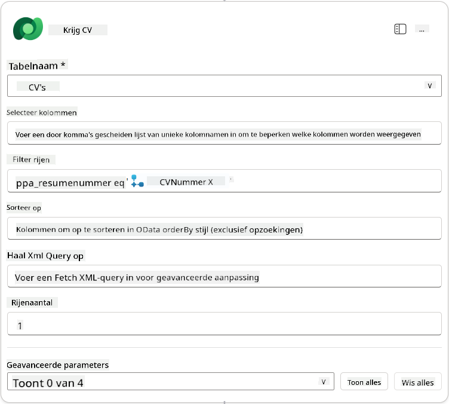

1. Selecteer nu het **+**-icoon onder **Get Resume**, zoek naar **Dataverse**, selecteer **Meer weergeven**, en zoek vervolgens de actie **Rijen ophalen**.

1. **Hernoem** het knooppunt naar `Get Job Role` en stel de volgende parameters in:

    | Eigenschap        | Hoe in te stellen             | Waarde                                                        |
    | --------------- | ------------------------------- | ------------------------------------------------------------ |
    | **Tabelnaam**  | Selecteer                          | Job Roles                                                    |
    | **Filterrijen** | Dynamische gegevens (bliksemschicht-icoon) | `ppa_jobrolenumber eq 'JobRoleNumber'` Selecteer en vervang **JobRoleNumber** door **Wanneer een agent de flow aanroept** → **JobRoleNumber** |
    | **Rijenaantal**   | Invoeren                           | 1                                                            |

    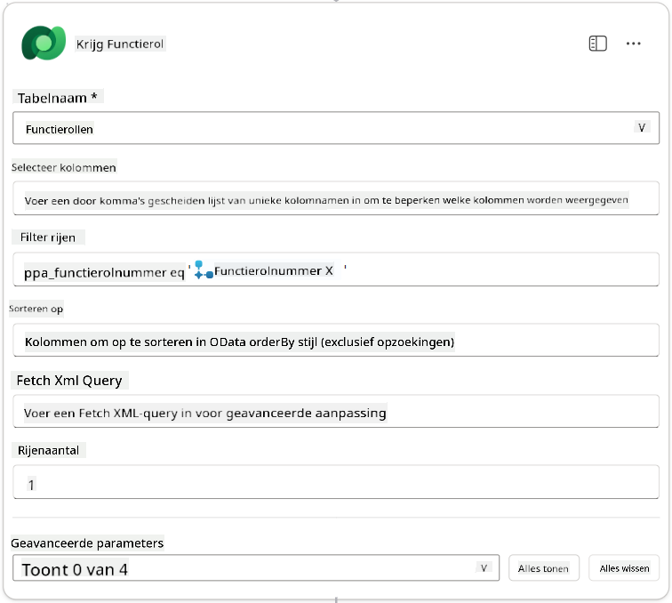

1. Selecteer nu het **+**-icoon onder Get Job Role, zoek naar **Dataverse**, selecteer **Meer weergeven**, en zoek vervolgens de actie **Nieuwe rij toevoegen**.

1. **Hernoem** het knooppunt naar `Add Application` en stel de volgende parameters in:

    | Eigenschap                           | Hoe in te stellen           | Waarde                                                        |
    | ---------------------------------- | -------------------- | ------------------------------------------------------------ |
    | **Tabelnaam**                     | Selecteer               | Job Applications                                             |
    | **Kandidaat (Kandidaten)**             | Expressie (fx-icoon) | `concat('ppa_candidates/',first(outputs('Get_Resume')?['body/value'])?['_ppa_candidate_value'])` |
| **Functierol (Functierollen)**           | Expressie (fx-icoon) | `concat('ppa_jobroles/',first(outputs('Get_Job_Role')?['body/value'])?['ppa_jobroleid'])` |
| **CV (CV's)**                            | Expressie (fx-icoon) | `concat('ppa_resumes/', first(outputs('Get_Resume')?['body/value'])?['ppa_resumeid'])` |
| **Sollicitatiedatum** (gebruik **Alles weergeven**) | Expressie (fx-icoon) | `utcNow()`                                                   |

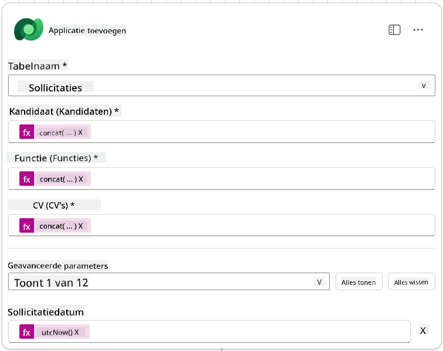

1. Selecteer de **Reageer op de agent-node** en klik vervolgens op **+ Een output toevoegen**

     | Eigenschap      | Hoe in te stellen               | Details                                         |
     | --------------- | ------------------------------- | ----------------------------------------------- |
     | **Type**        | Selecteren                      | `Text`                                          |
     | **Naam**        | Invoeren                        | `ApplicationNumber`                             |
     | **Waarde**      | Dynamische data (bliksemschicht-icoon) | *Sollicitatie toevoegen → Meer weergeven → Sollicitatienummer* |
     | **Beschrijving** | Invoeren                       | `Het [ApplicationNumber] van de aangemaakte sollicitatie`      |

     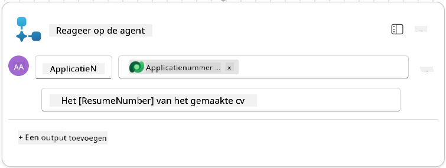

1. Klik rechtsboven op **Concept opslaan**

1. Selecteer het tabblad **Overzicht**, klik op **Bewerken** in het **Details**-paneel

      - **Flownaam**:`Create Job Application`
      - **Beschrijving**:`Maakt een nieuwe sollicitatie aan op basis van [ResumeNumber] en [JobRoleNumber]`
      - **Opslaan**

1. Ga terug naar het tabblad **Ontwerper** en klik op **Publiceren**.

### 8.5 Voeg 'Create Job Application' toe aan de agent

Nu ga je de gepubliceerde flow koppelen aan je Application Intake Agent.

1. Navigeer terug naar de **Hiring Agent** en selecteer het tabblad **Agents**. Open de **Application Intake Agent** en zoek het **Tools**-paneel.

1. Klik op **+ Toevoegen**

1. Selecteer de filter **Flow** en zoek naar `Create Job Application`. Selecteer de flow **Create Job Application** en klik op **Toevoegen en configureren**.

1. Stel de volgende parameters in:

    | Parameter                                           | Waarde                                                       |
    | --------------------------------------------------- | ------------------------------------------------------------ |
    | **Beschrijving**                                     | `Maakt een nieuwe sollicitatie aan op basis van [ResumeNumber] en [JobRoleNumber]` |
    | **Aanvullende details → Wanneer deze tool kan worden gebruikt** | `Alleen wanneer verwezen door onderwerpen of agents`          |

1. Klik op **Opslaan**  
    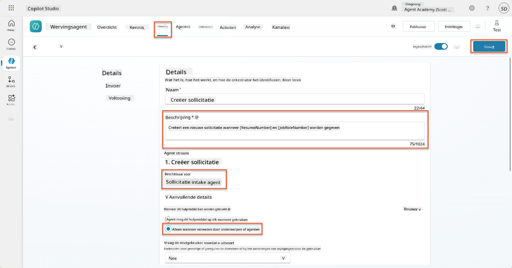

### 8.6 Definieer instructies voor de agent

Om sollicitaties te maken, moet je de agent vertellen wanneer de nieuwe tool te gebruiken. In dit geval vraag je de gebruiker om te bevestigen op welke voorgestelde functierollen ze willen solliciteren en instrueer je de agent om de tool voor elke rol te gebruiken.

1. Ga terug naar de **Application Intake Agent** en zoek het **Instructies**-paneel.

1. Voeg in het veld **Instructies** de volgende duidelijke richtlijnen toe voor je subagent aan het **einde van de bestaande** instructies:

    ```text
    3. Post Resume Upload
       - Respond with a formatted bullet list of [SuggestedJobRoles] the candidate could apply for.  
       - Use the format: [JobRoleNumber] - [RoleDescription]
       - Ask the user to confirm which Job Roles to create applications for the candidate.
       - When the user has confirmed a set of [JobRoleNumber]s, move to the next step.
    
    4. Post Upload - Application Creation
        - After the user confirms which [SuggestedJobRoles] for a specific [ResumeNumber]:
        E.g. "Apply [ResumeNumber] for the Job Roles [JobRoleNumber], [JobRoleNumber], [JobRoleNumber]
        E.g. "apply to all suggested job roles" - this implies use all the [JobRoleNumbers] 
         - Loop over each [JobRoleNumber] and send with [ResumeNumber] to /Create Job Application   
         - Summarize the Job Applications Created
    
    Strict Rules (that must never be broken)
    You must always follow these rules and never break them:
    1. The only valid identifiers are:
      - ResumeNumber (ppa_resumenumber)→ format R#####
      - CandidateNumber (ppa_candidatenumber)→ format C#####
      - ApplicationNumber (ppa_applicationnumber)→ format A#####
      - JobRoleNumber (ppa_jobrolenumber)→ format J#####
    2. Never guess or invent these values.
    3. Always extract identifiers from the current context (conversation, data, or system output). 
    ```

1. Waar de instructies een schuine streep (/) bevatten, selecteer je de tekst na de / en selecteer je de tool **Create Job Application**.

1. Klik op **Opslaan**  
    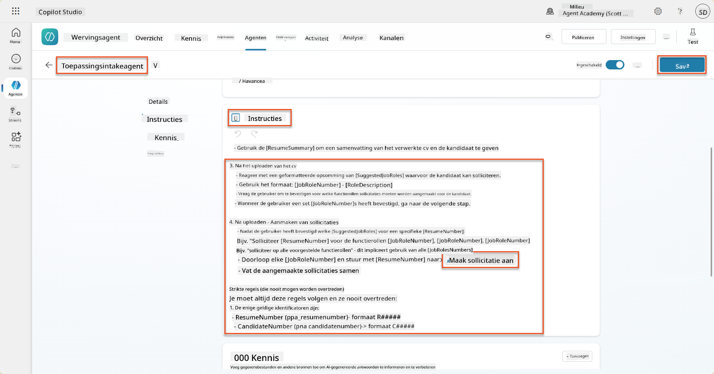

!!! tip "Itereren over meerdere items in Generative Orchestration"
    Deze instructies maken gebruik van de mogelijkheid van generative orchestration om over meerdere rijen te itereren bij het nemen van beslissingen over welke stappen en tools te gebruiken. De Matchende Functierollen worden automatisch gelezen en de Application Intake Agent wordt uitgevoerd voor elke rij. Welkom in de magische wereld van generative orchestration!

### 8.7 Test je agent

1. Open je **Hiring Agent** in Copilot Studio.

1. **Upload** een voorbeeld-CV in de chat en typ:

    ```text
    This is a new resume for the Power Platform Developer Role.
    ```

1. Merk op hoe de agent een lijst met voorgestelde functierollen geeft - elk met een functierolnummer.  
    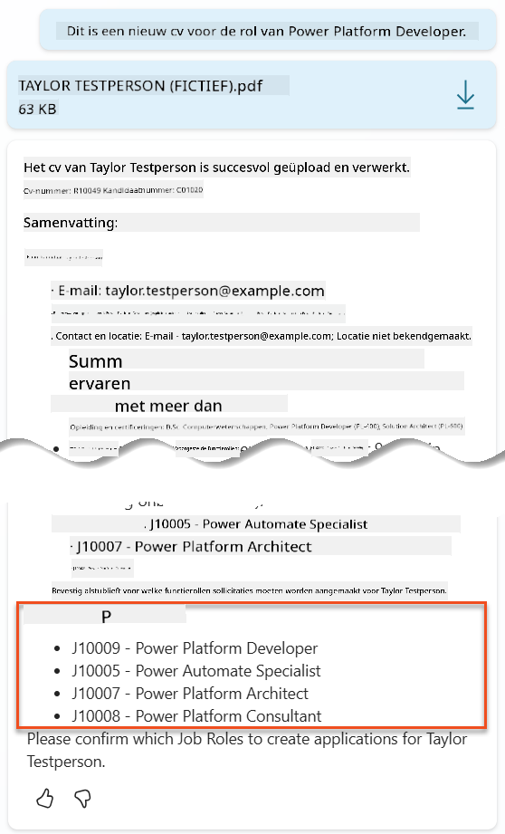

1. Je kunt vervolgens aangeven voor welke van deze rollen je het CV als sollicitatie wilt indienen.
    **Voorbeelden:**

    ```text
    "Apply for all of those job roles"
    "Apply for the J10009 Power Platform Developer role"
    "Apply for the Developer and Architect roles"
    ```

    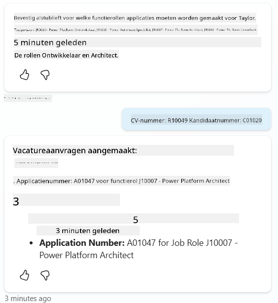

1. De **Create Job Application tool** wordt vervolgens uitgevoerd voor elke functierol die je hebt opgegeven. In de Activiteitenkaart zie je dat de tool Create Job Application wordt uitgevoerd voor elke functierol waarvoor je een sollicitatie hebt aangemaakt:  
    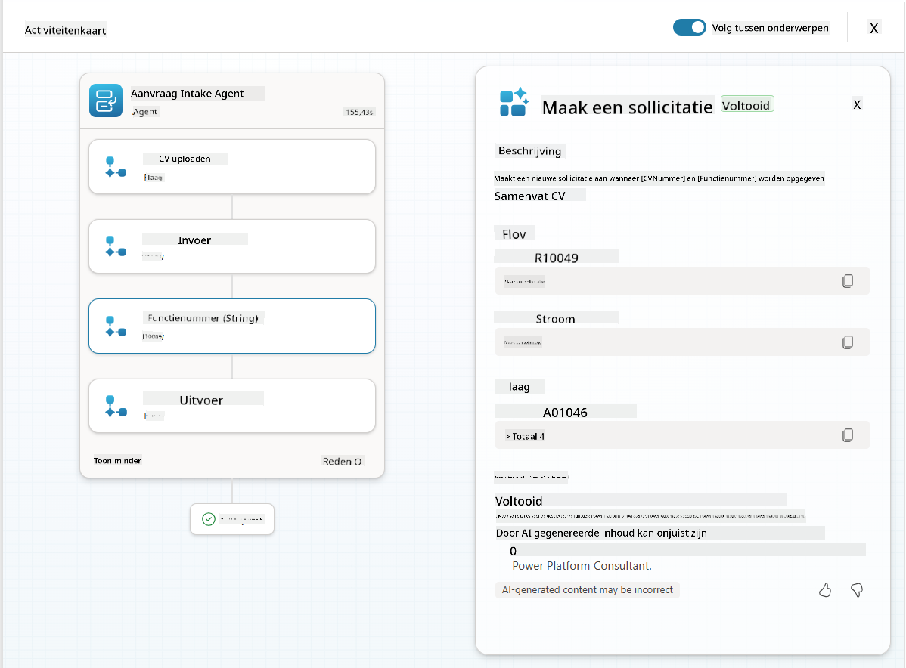

## 🎉 Missie Voltooid

Uitstekend werk, Operative! **Operatie Grounding Control** is nu voltooid. Je hebt met succes je AI-capaciteiten verbeterd met dynamische dataverankering en een echt intelligent wervingssysteem gecreëerd.

Dit heb je bereikt in deze missie:

**✅ Meesterschap in Dataverse-rankering**  
Je begrijpt nu hoe je aangepaste prompts kunt koppelen aan live gegevensbronnen voor dynamische intelligentie.

**✅ Verbeterde CV-analyse**  
Je flow 'Samenvatten CV' heeft nu toegang tot realtime functierolgegevens en evaluatiecriteria voor nauwkeurige matching.

**✅ Data-gedreven besluitvorming**  
Je wervingsagents kunnen nu automatisch aanpassen aan veranderende functievereisten zonder handmatige promptupdates.

**✅ Sollicitatiecreatie**  
Je verbeterde systeem kan nu sollicitaties aanmaken en is klaar voor verdere complexe workfloworkestratie.

🚀 **Volgende stap:** In je volgende missie leer je hoe je diepgaande redeneercapaciteiten implementeert die je agents helpen complexe beslissingen te nemen en gedetailleerde uitleg te geven voor hun aanbevelingen.

⏩ [Ga naar Missie 09: Diepgaand redeneren](../09-deep-reasoning/README.md)

## 📚 Tactische Bronnen

📖 [Gebruik je eigen gegevens in een prompt](https://learn.microsoft.com/ai-builder/use-your-own-prompt-data?WT.mc_id=power-182762-scottdurow)

📖 [Maak een aangepaste prompt](https://learn.microsoft.com/ai-builder/create-a-custom-prompt?WT.mc_id=power-182762-scottdurow)

📖 [Werken met Dataverse in Copilot Studio](https://learn.microsoft.com/microsoft-copilot-studio/knowledge-add-dataverse?WT.mc_id=power-182762-scottdurow)

📖 [AI Builder overzicht van aangepaste prompts](https://learn.microsoft.com/ai-builder/prompts-overview?WT.mc_id=power-182762-scottdurow)

📖 [Power Platform AI Builder documentatie](https://learn.microsoft.com/ai-builder/?WT.mc_id=power-182762-scottdurow)

📖 [Training: Maak AI Builder prompts met je eigen Dataverse-gegevens](https://learn.microsoft.com/training/modules/ai-builder-grounded-prompts/?WT.mc_id=power-182762-scottdurow)

---

**Disclaimer**:  
Dit document is vertaald met behulp van de AI-vertalingsservice [Co-op Translator](https://github.com/Azure/co-op-translator). Hoewel we streven naar nauwkeurigheid, dient u zich ervan bewust te zijn dat geautomatiseerde vertalingen fouten of onnauwkeurigheden kunnen bevatten. Het originele document in de oorspronkelijke taal moet worden beschouwd als de gezaghebbende bron. Voor kritieke informatie wordt professionele menselijke vertaling aanbevolen. Wij zijn niet aansprakelijk voor eventuele misverstanden of verkeerde interpretaties die voortvloeien uit het gebruik van deze vertaling.