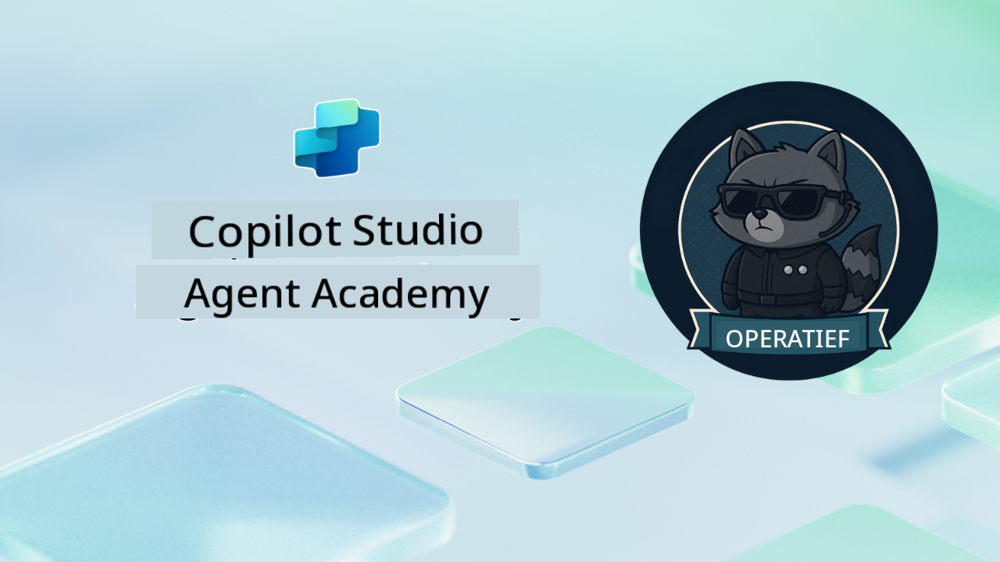

<!--
CO_OP_TRANSLATOR_METADATA:
{
  "original_hash": "24fcbe9a57d3439e05f8866e550c0a84",
  "translation_date": "2025-10-17T01:41:15+00:00",
  "source_file": "docs/operative-preview/README.md",
  "language_code": "nl"
}
-->
# Welkom Operative

**Welkom, Operative.**  
Je geavanceerde missie—als je deze accepteert—is om de kunst te beheersen van het bouwen van **enterprise-grade multi-agent systemen** met **Microsoft Copilot Studio**.

Deze intensieve training neemt je mee voorbij de basis van agentcreatie naar de verfijnde wereld van **multi-agent orkestratie**: van automatisering bij werving tot AI-veiligheid. Je leert intelligente agentecosystemen te bouwen, coördineren en implementeren aan de hand van echte bedrijfsvoorbeelden.

--8<-- "disclaimer.md"

---

## 🎯 Missiedoelstelling

Door het voltooien van het Agent Academy Operative-programma kun je:

- **Multi-agent systemen** ontwerpen en implementeren voor complexe bedrijfsomgevingen
- Beheersing van **agent orkestratie** en samenwerkingspatronen
- **AI-veiligheid en contentmoderatie** implementeren in productiesystemen
- **Multi-modale prompts** bouwen voor documentverwerking en analyse
- **Enterprise-ready agents** implementeren met de juiste governance en testen

---

## 🧪 Vereisten

Om alle missies te voltooien, heb je nodig:

- Voltooide **Agent Academy Recruit** training
- Een Microsoft Power Platform-omgeving met een **Copilot Studio** licentie
- Toegang tot **Microsoft Dataverse**
- Beheerdersrechten om oplossingen en agents te creëren

---

## 🧬 Voor Wie Is Dit

Deze geavanceerde cursus is ideaal voor:

- **Solution architects** die enterprise AI-systemen ontwerpen
- **Ontwikkelaars** die productieklare agentoplossingen bouwen
- **IT-professionals** die AI-governance en veiligheid implementeren
- **Business analysts** die complexe automatiseringsworkflows creëren
- Iedereen die klaar is om **door te groeien** van basisagents naar enterprise-systemen

---

## 🧭 Overzicht Curriculum

Deze academy is gestructureerd als een progressieve reeks veldoperaties—elke missie bouwt voort op de vorige om een uitgebreide wervingsautomatiseringssysteem te creëren.

| Missie | Titel | Operationele Briefing |
|--------|-------|-----------------------|
| `01` | 🚨 [Aan de slag met de Wervingsagent](./01-get-started/README.md) | Basisinfrastructuur implementeren en je centrale orkestratoragent creëren |
| `02` | 🎭 [Maak je agent multi-agent klaar met verbonden agents](./02-multi-agent/README.md) | Transformeer een enkele agent naar een gecoördineerd multi-agent systeem |
| `03` | ⚡ [Automatiseer je agent met Triggers](./03-automate-triggers/README.md) | Implementeer autonome agentgedragingen met event-driven triggers |
| `04` | 📝 [Agentinstructies schrijven](./04-agent-instructions/README.md) | Beheers nauwkeurige communicatie en gedragscontrole van agents |
| `05` | 💬 [Agentreacties personaliseren](./05-agent-responses/README.md) | Pas agentreacties aan voor maximale impact en betrokkenheid |
| `06` | 🛡️ [Contentmoderatie en AI-veiligheid Essentials](./06-ai-safety/README.md) | Implementeer veiligheid en compliance op enterprise-niveau |
| `07` | 🎨 [Inhoud van cv's extraheren met multi-modale prompts](./07-multimodal-prompts/README.md) | Verwerk documenten en afbeeldingen met geavanceerde AI-mogelijkheden |
| `08` | 🗄️ [Prompts - Dataverse Gronding](./08-dataverse-grounding/README.md) | Verbind agents met bedrijfsdata voor nauwkeurige antwoorden |
| `09` | 🧠 [Diepgaande redenering toepassen om kandidaatgeschiktheid en interviewvoorbereiding te evalueren](./09-deep-reasoning/README.md) | Implementeer geavanceerde AI-redenering voor complexe beslissingen |
| `10` | 📄 [Genereer kandidaat-specifieke interviewdocumenten met prompts](./10-generate-documents/README.md) | Maak dynamische documenten op basis van agentanalyse |
| `11` | 📊 [Verkrijg gebruikersfeedback met Adaptive Cards](./11-obtain-user-feedback/README.md) | Verzamel en verwerk gebruikersfeedback voor continue verbetering |
| `12` | 🌐 [Publiceer je agents op een demo-website voor stakeholdertesten](./12-demo-website/README.md) | Implementeer een complete oplossing voor demonstratie en testen door stakeholders |

!!! note
    ✅ Het voltooien van dit curriculum levert je de **Operative** badge op.  
    🔓 **Commander** wordt in toekomstige fases ontgrendeld.

<!-- markdownlint-disable-next-line MD033 -->

---

**Disclaimer**:  
Dit document is vertaald met behulp van de AI-vertalingsservice [Co-op Translator](https://github.com/Azure/co-op-translator). Hoewel we streven naar nauwkeurigheid, dient u zich ervan bewust te zijn dat geautomatiseerde vertalingen fouten of onnauwkeurigheden kunnen bevatten. Het originele document in de oorspronkelijke taal moet worden beschouwd als de gezaghebbende bron. Voor kritieke informatie wordt professionele menselijke vertaling aanbevolen. Wij zijn niet aansprakelijk voor eventuele misverstanden of verkeerde interpretaties die voortvloeien uit het gebruik van deze vertaling.