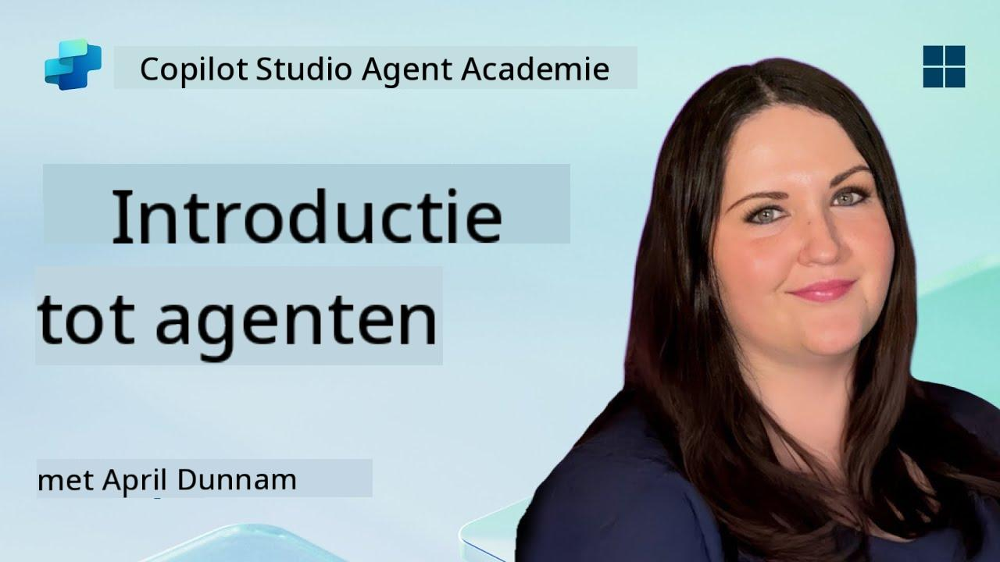

<!--
CO_OP_TRANSLATOR_METADATA:
{
  "original_hash": "d6706e107678264168d77b2e107710b1",
  "translation_date": "2025-10-17T01:37:14+00:00",
  "source_file": "docs/recruit/01-introduction-to-agents/README.md",
  "language_code": "nl"
}
-->
# 🚨 Missie 01: Introductie tot Agents

## 🕵️‍♂️ CODENAAM: `OPERATIE AI AGENT DECODERING`

> **⏱️ Operatietijdvenster:** `~30 minuten – alleen informatie, geen veldwerk vereist`

🎥 **Bekijk de walkthrough**

## 🎯 Missiebriefing

Welkom, Rekruut. Voordat we beginnen met het bouwen van agents, moet je een goed begrip hebben van de AI-concepten die hen aandrijven. Deze missie zal je voorzien van fundamentele kennis over conversatie-AI, grote taalmodellen (LLMs), retrieval-augmented generation (RAG) en de soorten agents die je kunt maken in Copilot Studio.

## 🔎 Doelstellingen

In deze missie leer je:

1. Wat conversatie-AI is en waarom het belangrijk is  
1. Hoe grote taalmodellen (LLMs) chatervaringen aandrijven  
1. Wat Retrieval-Augmented Generation (RAG) toevoegt  
1. Het verschil tussen conversatie-agents en autonome agents  
1. Hoe agents in Copilot Studio deze concepten benutten  

Laten we beginnen!

---

## Wat is Conversatie-AI?

Conversatie-AI verwijst naar elk systeem dat menselijke taal – of het nu tekst of spraak is – kan begrijpen, verwerken en beantwoorden op een manier die natuurlijk aanvoelt. Denk aan chatbots in helpdesks of virtuele persoonlijke assistenten in je favoriete apps. Achter de schermen vertrouwen de meeste moderne conversatie-AI's op grote taalmodellen (LLMs), waar we hierna op ingaan.

### Waarom het belangrijk is

- **Gebruikerservaring:** Conversatie-interfaces zijn vaak intuïtiever dan door menu's klikken.  
- **Schaalbaarheid:** Eén agent kan tientallen of honderden gesprekken tegelijkertijd afhandelen.  
- **Efficiëntie:** In plaats van aangepaste scriptregels te bouwen, passen LLM-aangedreven agents zich direct aan op gebruikersinput.  
- **Uitbreidbaarheid:** Met het juiste ontwerp kunnen agents toegang krijgen tot kennisbanken, verbinding maken met API's of fungeren als "digitale collega's" binnen bedrijfsprocessen.

---

## Grote Taalmodellen (LLMs) 101

De kern van de meeste conversatie-AI-systemen wordt gevormd door **grote taalmodellen** – neurale netwerken die zijn getraind op enorme tekstcorpora. Ze leren statistische patronen in taal, zodat ze samenhangende zinnen kunnen genereren, vragen kunnen beantwoorden of zelfs ideeën kunnen bedenken. Belangrijke punten om te begrijpen:

1. **Trainingsdata:** LLMs verwerken terabytes aan tekst (webpagina's, boeken, artikelen). Deze "wereldkennis" stelt hen in staat om over veel onderwerpen te reageren.  
1. **Tokenisatie:** Tekst wordt opgedeeld in kleinere eenheden, tokens genoemd (woorden, subwoorden of tekens). Het model voorspelt één token tegelijk.  
1. **Contextvenster:** Elk LLM heeft een limiet op hoeveel tokens het tegelijkertijd kan "zien". Buiten die limiet worden eerdere tokens afgekapt.  
1. **Prompting:** Je communiceert met een LLM door een prompt te sturen. Hoe beter je prompt, hoe gerichter en relevanter de reactie.  
1. **Zero-shot vs. Fine-tuning:** Zero-shot betekent een LLM gebruiken zoals het is (alleen de ruwe gewichten). Fine-tuning betekent het model aanpassen met domeinspecifieke data, zodat het nauwkeuriger antwoordt op jouw behoeften.

!!! Tip "Pro Tip"
    Een veelgebruikte analogie is dat een LLM als een "superintelligente autocomplete" is. Het begrijpt betekenis niet echt zoals een menselijk brein, maar het is extreem goed in het voorspellen van het volgende beste woord (of zin) in een reeks.

---

## Retrieval-Augmented Generation (RAG)

Wanneer LLMs alleen vertrouwen op statische trainingsdata, kunnen ze hallucineren of verouderd raken. RAG lost dit op door het model "verse informatie" te laten opzoeken voordat het een antwoord samenstelt. Op hoofdlijnen werkt RAG als volgt:

1. **Gebruikersvraag:** Een gebruiker stelt een vraag (bijv. "Wat is het laatste nieuws over de kwartaalresultaten van Contoso?").  
1. **Retriever-stap:** Het systeem zoekt in een kennisbron (documenten, interne databases, SharePoint-bibliotheken, etc.) naar relevante passages.  
1. **Augmentatie:** Opgehaalde passages worden toegevoegd aan of voorafgegaan aan de LLM-prompt.  
1. **Generatie:** De LLM verwerkt zowel de vraag van de gebruiker als de opgehaalde context en genereert een antwoord dat gebaseerd is op actuele data.  

Met RAG kan je agent interne bedrijfswiki's raadplegen, plugin-API's gebruiken of een FAQ-kennisbank doorzoeken – en antwoorden geven die niet beperkt zijn tot statisch gepubliceerde modelparameters.

---

## Conversatie- vs. Autonome Agents

In de context van Copilot Studio kan de term **agent** verwijzen naar verschillende soorten AI-assistenten. Het is handig om onderscheid te maken tussen:

**Conversatie-agents:**

- Gericht op tweerichtingsdialoog.  
- Behouden context gedurende meerdere beurten in een gesprek.  
- Worden meestal georkestreerd via vooraf gedefinieerde stromen of triggers (bijv. "Als gebruiker X zegt, reageer met Y").  
- Ideaal voor klantenservice, FAQ's, begeleide interacties, planning of eenvoudige vraag-en-antwoord.  
  - Voorbeelden:
    - Een Teams-chatbot die vragen over HR-beleid beantwoordt.  
    - Een Power Virtual Agents-bot op een SharePoint-pagina die gebruikers door een formulier leidt.  

**Autonome agents:**

- Gaan verder dan heen-en-weer chatten; ze kunnen **acties ondernemen** namens de gebruiker.  
- Gebruiken LLM-redeneerlussen (denk aan "plannen → handelen → observeren → herplannen") om taken te voltooien.  
- Kunnen verbinding maken met externe tools of API's (bijv. een Power Automate-stroom starten, kalenderuitnodigingen verzenden, gegevens in Dataverse beheren).  
- Werken zonder constante menselijke input – eenmaal geactiveerd, kunnen ze zelfstandig meerstapsprocessen afhandelen.  
  - Voorbeelden:  
    - Een agent die een reisroute genereert, vluchten boekt en bevestigingen e-mailt.  
    - Een "Vergaderingssamenvatter"-agent die deelneemt aan een Teams-gesprek, het in realtime transcribeert en een samenvatting schrijft in OneNote.  

!!! Info "Belangrijk verschil"
    Conversatie-agents wachten op gebruikersinput en blijven bij dialoog. Autonome agents plannen en voeren proactief een reeks stappen uit met bredere toegang tot tools.

---

## Agents in Copilot Studio

**Copilot Studio** verenigt zowel conversatie- als autonome scenario's binnen één framework. Zo helpt Copilot Studio je bij het bouwen van agents:

1. **Visuele Agent Designer:** Een low-code canvas om prompts, geheugen en tools te definiëren voor zowel chat- als actie-workflows.  
1. **LLM-configuraties:** Kies uit verschillende OpenAI-modellen of Microsoft's enterprise-grade GPT om aan je prestatie- en kostenbehoeften te voldoen.  
1. **Retrieval-connectors:** Vooraf gebouwde integraties voor SharePoint, OneDrive, Azure Cognitive Search en Dataverse, waarmee RAG direct beschikbaar is.  
1. **Aangepaste tools & functies:** Definieer aangepaste HTTP-acties of Power Automate-stromen die je agent autonoom kan uitvoeren.  
1. **Multi-modale ondersteuning:** Naast tekst kunnen Copilot Studio-agents afbeeldingen, bestanden of gestructureerde data verwerken om context te verrijken.  
1. **Publicatie & distributie:** Zodra je agent klaar is, kun je deze publiceren naar Microsoft 365 Copilot (zodat gebruikers hem kunnen gebruiken in Teams, SharePoint, Outlook, etc.) of embedden als een zelfstandige chatwidget op een webpagina.

---

## 🎉 Missie Voltooid

Je hebt nu je introductie tot agents en fundamentele AI-concepten voltooid. Je begrijpt:

1. **LLMs = Het “Brein” van je Agent**  
   - Verantwoordelijk voor taalbegrip en -generatie.  
   - Meer tokens = rijkere context, maar ook hogere kosten per oproep.  

1. **RAG = Integratie van realtime kennis**  
   - Overbrugt de kloof tussen een statische LLM en voortdurend veranderende gegevensbronnen.  
   - Haalt relevante documenten of records op en injecteert deze in de LLM-prompt.  

1. **Conversatie vs. Autonoom**  
   - **Conversatie:** Gericht op dialoogstromen en het behouden van context (bijv. "Sessiegeheugen").  
   - **Autonoom:** Voeg “Actieblokken” toe waarmee de agent externe tools of services kan aanroepen.

---
Hierna ga je de [fundamenten van Copilot Studio](../02-copilot-studio-fundamentals/README.md) verkennen!

Blijf scherp, Rekruut - je AI-reis is net begonnen!

## 📚 Tactische bronnen

🔗 [Copilot Studio Documentatie Home](https://learn.microsoft.com/microsoft-copilot-studio/)

---

<!-- markdownlint-disable-next-line MD033 -->

---

**Disclaimer**:  
Dit document is vertaald met behulp van de AI-vertalingsservice [Co-op Translator](https://github.com/Azure/co-op-translator). Hoewel we streven naar nauwkeurigheid, dient u zich ervan bewust te zijn dat geautomatiseerde vertalingen fouten of onnauwkeurigheden kunnen bevatten. Het originele document in de oorspronkelijke taal moet worden beschouwd als de gezaghebbende bron. Voor kritieke informatie wordt professionele menselijke vertaling aanbevolen. Wij zijn niet aansprakelijk voor misverstanden of verkeerde interpretaties die voortvloeien uit het gebruik van deze vertaling.