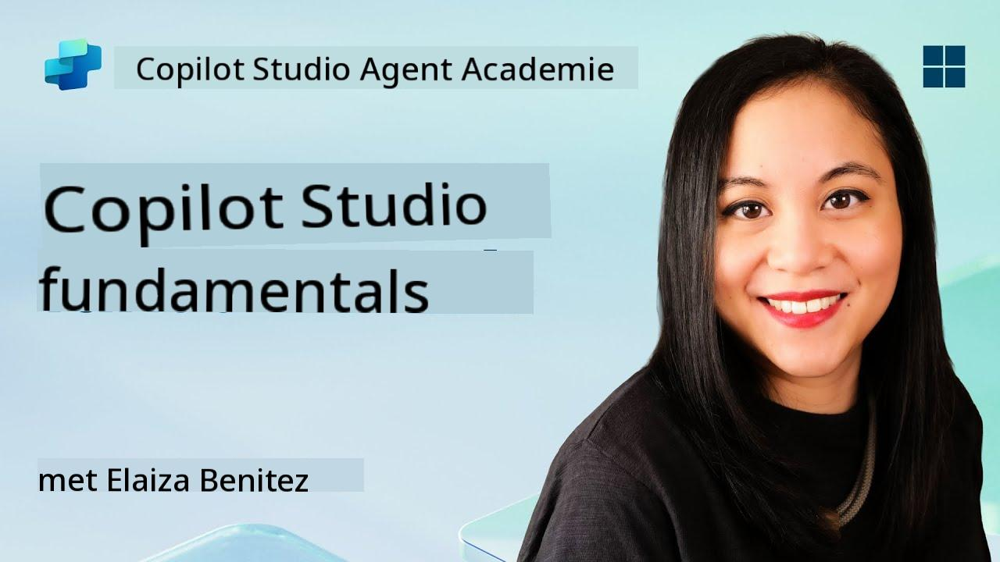
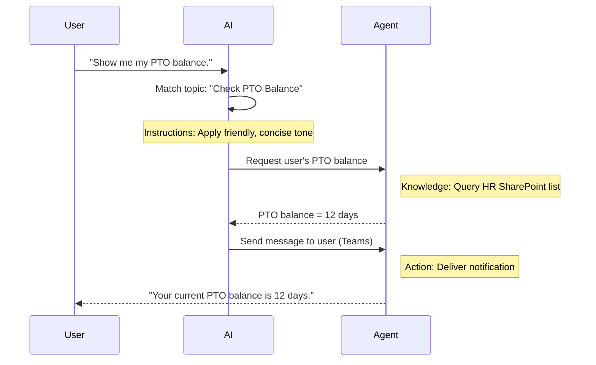

<!--
CO_OP_TRANSLATOR_METADATA:
{
  "original_hash": "90a3c5122f5687bbc8cc819990f175d4",
  "translation_date": "2025-10-17T01:38:19+00:00",
  "source_file": "docs/recruit/02-copilot-studio-fundamentals/README.md",
  "language_code": "nl"
}
-->
# 🚨 Missie 02: Copilot Studio Basisprincipes

## 🕵️‍♂️ CODENAAM: `OPERATIE KERNPROTOCOL`

> **⏱️ Operatietijdvenster:** `~30 minuten – alleen informatie, geen veldwerk vereist`  

🎥 **Bekijk de walkthrough**

[](https://www.youtube.com/watch?v=x4OCwDRGeLE "Bekijk de walkthrough op YouTube")

## 🎯 Missieoverzicht

Welkom, Rekruut. Deze missie geeft je de basisinformatie die je nodig hebt om te begrijpen hoe Copilot Studio werkt en hoe je intelligente agents kunt bouwen die echte zakelijke waarde leveren.

Voordat je je eerste agent bouwt, moet je de vier belangrijkste componenten begrijpen die elke aangepaste AI-agent vormen: Kennis, Tools, Onderwerpen en Instructies. Je leert ook hoe deze elementen samenwerken in de Copilot Studio orkestrator.

## 🔎 Doelstellingen

In deze missie leer je:

- **Wat Copilot Studio is**
- **Wanneer en waarom je agents moet gebruiken**
- **De vier bouwstenen van agents verkennen**
      - **Kennis**
      - **Tools**
      - **Onderwerpen**
      - **Instructies**
- **Begrijpen hoe deze componenten samenwerken** om een intelligente, geautomatiseerde agent te creëren

---

## Wat zijn agents in Copilot Studio?

Een **agent** is een gespecialiseerde AI-assistent die je ontwerpt om specifieke taken of vragen af te handelen. In tegenstelling tot een algemene chatbot:

- **Kent het bedrijfsspecifieke gegevens** (beleid, documenten, databases)  
- **Voert echte taken uit** (berichten verzenden, agenda-afspraken maken, records bijwerken)  
- **Behoudt conversatiecontext** zodat het kan voortbouwen op eerdere vragen  

Omdat Copilot Studio low-code is, kun je vooraf gebouwde componenten slepen en neerzetten—geen diepgaande programmeervaardigheden vereist. Zodra je agent is gebouwd, kunnen mensen deze gebruiken in Teams, Slack of zelfs een aangepaste webpagina om antwoorden te krijgen of workflows automatisch te starten.

---

## Wanneer en waarom Copilot Studio gebruiken

Hoewel Microsoft 365 Copilot algemene AI-assistentie biedt in Office-apps, wil je een aangepaste agent gebruiken wanneer:

### Je specifieke domeinkennis nodig hebt

- De standaard Copilot kent mogelijk de interne procedures of gegevens van je bedrijf niet. Een agent kan je SharePoint-sites, databases of aangepaste bronnen raadplegen om nauwkeurige en actuele antwoorden te geven.  

### Je multi-step workflows wilt automatiseren

- Bijvoorbeeld: "Wanneer iemand een uitgave indient, stuur deze ter goedkeuring, werk de financiële tracker bij en informeer de manager." Een aangepaste agent kan elke stap afhandelen, geactiveerd door een enkel commando of gebeurtenis.  

### Je een contextuele, in-tool ervaring nodig hebt  

- Stel je een Onboarding-agent voor nieuwe medewerkers in Teams voor die HR-medewerkers door elk beleid begeleidt, de benodigde formulieren verzendt en oriëntatiebijeenkomsten plant—direct binnen je bestaande samenwerkingsplatform.  

---

## Vier bouwstenen van een agent

Elke Copilot Studio-agent is opgebouwd uit vier kerncomponenten:

1. **Kennis**  
1. **Tools (Acties)**  
1. **Onderwerpen**  
1. **Instructies**

Hieronder definiëren we elke bouwsteen en laten we zien hoe ze samenwerken om een effectieve agent te creëren.

### 1. Kennis

**Kennis** is de gegevens en context die je agent gebruikt om vragen nauwkeurig te beantwoorden. Het bestaat uit twee delen:

#### Aangepaste instructies & context

- Je schrijft een korte beschrijving van het doel en de toon van de agent. Bijvoorbeeld:  

    ```text
    You are an IT support agent. You help employees troubleshoot common software issues, provide troubleshooting steps, and escalate urgent tickets.
    ```

- Tijdens een gesprek onthoudt de agent eerdere interacties, zodat het kan verwijzen naar wat al is besproken (bijvoorbeeld als de gebruiker eerst zegt: "Mijn printer is offline," en later vraagt: "Heb je het inktniveau gecontroleerd?" herinnert de agent zich de printercontext).

#### Kennisbronnen (Basisgegevens)

- Je verbindt je agent met meerdere gegevensbronnen—SharePoint-bibliotheken, documentatiesites, wiki's of andere databases.  
- Wanneer een gebruiker een vraag stelt, haalt de agent relevante fragmenten uit die bronnen, zodat antwoorden **gebaseerd** zijn op de werkelijke beleidsregels, handleidingen of andere vertrouwelijke informatie van je organisatie.  
- Je kunt de agent zelfs dwingen om alleen te reageren met informatie uit die bronnen, zodat het geen gokt of "hallucinaties" geeft.

!!! example
    Een "Beleidsassistent"-agent kan verbinding maken met je HR SharePoint-site. Als een gebruiker vraagt: "Wat is ons PTO-opbouwpercentage?" haalt de agent de exacte tekst uit het HR-beleidsdocument in plaats van te vertrouwen op een generiek AI-antwoord.

---

### 2. Tools (Acties)

**Tools (Acties)** definiëren wat de agent kan doen naast chatten. Elke actie is een taak die de agent programmatisch uitvoert, zoals:

- Een e-mail of Teams-bericht verzenden  
- Een agenda-afspraak maken of bijwerken  
- Een record toevoegen of bewerken in een database (bijv. een SharePoint-lijst of Dataverse-tabel)  
- Een Power Automate-flow of REST API aanroepen  

#### Hoe acties werken

- **Definieer invoer & uitvoer**  
      - Bijvoorbeeld, een actie "E-mail verzenden" kan vereisen:  
        - `OntvangerEmailAdres`  
        - `OnderwerpRegel`  
        - `EmailInhoud`  

- **Combineer acties in workflows**  
      - Vaak omvat het vervullen van een gebruikersverzoek meerdere stappen.  
      - Je kunt acties in een volgorde plaatsen zodat:  
             1. De agent gegevens ophaalt uit een SharePoint-lijst.  
             2. Een samenvatting genereert met behulp van de LLM.  
             3. Een Teams-bericht verzendt met die samenvatting.  

- **Verbind met externe systemen**  
      - Als je een CRM moet bijwerken of een interne API moet aanroepen, maak je een aangepaste actie om dat te doen.  
      - Copilot Studio kan integreren met het Power Platform of elk HTTP-gebaseerd eindpunt.

!!! example "Een "Uitgavehulp"-agent kan:"  
    1. Luisteren naar een "Uitgave indienen"-verzoek.  
    2. De uitgavegegevens van de gebruiker ophalen uit een formulier.  
    3. Een "Toevoegen aan SharePoint-lijst"-actie gebruiken om de gegevens op te slaan.  
    4. Een "E-mail verzenden"-actie activeren om de goedkeurder te informeren.  

---

### 3. Onderwerpen

**Onderwerpen** definiëren de conversatietriggers of startpunten voor je agent. Elk onderwerp komt overeen met een functionaliteit of een categorie van vragen.

#### Conversatietriggers  

- Een onderwerp kan zijn "IT-ticket indienen," "Vakantiesaldo controleren," of "Verkooprapport maken."  
- Onder de motorkap gebruikt Copilot Studio **generatieve orkestratie**: in plaats van te vertrouwen op exacte trefwoorden, interpreteert de AI de intentie van de gebruiker en kiest het juiste onderwerp op basis van een korte beschrijving die je opgeeft.  

#### Onderwerpbeschrijvingen  

- In elk onderwerp schrijf je een duidelijke, beknopte beschrijving van wat dat onderwerp behandelt.

!!! example "Voorbeeld van onderwerpbeschrijving"
    Dit onderwerp helpt gebruikers een IT-ondersteuningsticket in te dienen door de details van het probleem, prioriteit en contactinformatie te verzamelen.

- De AI gebruikt die beschrijving om te bepalen wanneer dit onderwerp moet worden geactiveerd, zelfs als de formulering van de gebruiker niet exact overeenkomt.

#### Onderwerpen koppelen aan acties  

- Elk onderwerp is verbonden met een of meer acties of gegevensophaalstappen.  
- Wanneer de AI een onderwerp kiest, begeleidt het de conversatie door de door jou gedefinieerde volgorde (stel vervolgvragen, roep acties aan, geef resultaten terug).

!!! example
    Als een gebruiker zegt: "Ik heb hulp nodig bij het instellen van mijn nieuwe laptop," kan de AI die intentie koppelen aan het onderwerp "IT-ticket indienen." De agent vraagt dan om het laptopmodel, gebruikersgegevens en plaatst automatisch een ticket in het helpdesksysteem.

---

### 4. Instructies

**Instructies** (soms "Prompts" of "Systeemberichten" genoemd) sturen de toon, stijl en grenzen van de LLM. Ze bepalen hoe de agent in elke situatie reageert.

#### Rol & Persoonlijkheid  

- Je vertelt de AI wie het is (bijv. "Je bent een klantenserviceagent voor Contoso Retail").  
- Dit bepaalt de toon—vriendelijk, beknopt, formeel of informeel—afhankelijk van je gebruikssituatie.

#### Richtlijnen voor antwoorden  

- Specificeer regels die de agent moet volgen, zoals:  
      - "Vat beleidsinformatie altijd samen in opsommingstekens."  
      - "Als je het antwoord niet weet, zeg dan ‘Sorry, ik heb die informatie niet.’"  
      - "Geef nooit vertrouwelijke gegevens buiten de context."

#### Regels voor geheugen & context

- Je kunt de agent instrueren hoeveel beurten van het gesprek hij moet onthouden.  
- Bijvoorbeeld: "Onthoud details van de verzoeken van deze gebruiker voor maximaal drie vervolgvragen."

!!! example "In een "Voordelenadviseur"-agent kun je opnemen:"
    "Verwijs altijd naar de meest recente HR-handleiding bij het beantwoorden van vragen. Als er wordt gevraagd naar inschrijvingsdeadlines, geef dan de specifieke datums uit het beleid. Houd antwoorden onder de 150 woorden."

---

## Hoe de vier bouwstenen samenwerken

Wanneer je **Kennis**, **Tools**, **Onderwerpen** en **Instructies** samenvoegt, creëert de AI-orkestrator van Copilot Studio een agent die:

1. **Luistert naar een relevant onderwerp** (geleid door jouw onderwerpbeschrijvingen).  
1. **Past instructies toe** om de toon te bepalen, te beslissen wanneer vervolgvragen te stellen en regels te handhaven.  
1. **Benut kennisbronnen** om antwoorden te baseren op de gegevens van jouw organisatie.  
1. **Roept tools (acties) aan** indien nodig om taken uit te voeren—berichten verzenden, records bijwerken of API's aanroepen.  

Onder de motorkap gebruikt de orkestrator een **generatieve planningsaanpak**: het bepaalt welke stappen moeten worden genomen, in welke volgorde, om een gebruikersverzoek te vervullen. Als een actie mislukt (bijvoorbeeld, een e-mail kan niet worden verzonden), volgt de agent jouw richtlijnen voor het omgaan met uitzonderingen (stel een verduidelijkende vraag of rapporteer de fout). Omdat de LLM zich aanpast aan de context van het gesprek, kan de agent geheugen behouden over meerdere beurten en nieuwe informatie opnemen terwijl het gesprek zich ontvouwt.

**Visueel stroomvoorbeeld:**  
<!--
1. **Gebruiker:** "Laat me mijn vakantiesaldo zien."
1. **AI (Onderwerpen):** Koppelt aan het onderwerp "Vakantiesaldo controleren."  
1. **AI (Instructies):** Gebruikt een vriendelijke, beknopte toon.  
1. **Agent (Kennis):** Vraagt de HR SharePoint-lijst op voor het saldo van de gebruiker.  
1. **Agent (Acties):** Haalt de waarde op en verzendt een Teams-bericht:  
   > "Je huidige vakantiesaldo is 12 dagen."  
-->



---

## 🎉 Missie Voltooid

Je hebt je basisbriefing succesvol afgerond. Je hebt nu geleerd over de vier essentiële bouwstenen van elke agent in Copilot Studio:

1. **Kennis** – Waar de agent feitelijke informatie opzoekt en gesprekcontext behoudt.  
1. **Tools** – De taken die de agent kan uitvoeren om dingen automatisch te regelen.  
1. **Onderwerpen** – Hoe de agent gebruikersintentie herkent en beslist welke workflow moet worden uitgevoerd.  
1. **Instructies** – De regels, toon en grenzen die elke reactie sturen.

Met deze componenten kun je een basisagent bouwen die vragen beantwoordt en eenvoudige workflows uitvoert. In de volgende les doorlopen we een stapsgewijze tutorial om een "Service Desk"-agent te maken—van het verbinden van je eerste kennisbron tot het definiëren van een onderwerp en het koppelen van een actie.

Volgende stap: Je gaat je [eerste declaratieve agent voor M365 Copilot bouwen](../03-create-a-declarative-agent-for-M365Copilot/README.md).

<!-- markdownlint-disable-next-line MD033 -->


---

**Disclaimer**:  
Dit document is vertaald met behulp van de AI-vertalingsservice [Co-op Translator](https://github.com/Azure/co-op-translator). Hoewel we streven naar nauwkeurigheid, dient u zich ervan bewust te zijn dat geautomatiseerde vertalingen fouten of onnauwkeurigheden kunnen bevatten. Het originele document in de oorspronkelijke taal moet worden beschouwd als de gezaghebbende bron. Voor kritieke informatie wordt professionele menselijke vertaling aanbevolen. Wij zijn niet aansprakelijk voor eventuele misverstanden of verkeerde interpretaties die voortvloeien uit het gebruik van deze vertaling.