<!--
CO_OP_TRANSLATOR_METADATA:
{
  "original_hash": "0c51aabca81d6256990caf4c015e6195",
  "translation_date": "2025-10-17T01:29:51+00:00",
  "source_file": "docs/recruit/04-creating-a-solution/README.md",
  "language_code": "nl"
}
-->
# 🚨 Missie 04: Een oplossing creëren voor jouw agent

## 🕵️‍♂️ CODENAAM: `OPERATIE CTRL-ALT-PACKAGE`

> **⏱️ Tijdvenster voor de operatie:** `~45 minuten`

🎥 **Bekijk de walkthrough**

[](https://www.youtube.com/watch?v=1iATbkgfcpU "Bekijk de walkthrough op YouTube")

## 🎯 Missiebriefing

Agent Maker, welkom bij je volgende tactische operatie. In deze missie leer je hoe je een oplossing samenstelt - het officiële implementatievoertuig voor jouw IT Helpdesk Agent, gebouwd met Microsoft Copilot Studio. Zie het als het maken van een digitale koffer die jouw agent en zijn artefacten bevat.

Elke agent heeft een goed gestructureerd thuis nodig. Dat is wat een Power Platform-oplossing biedt - orde, draagbaarheid en gereedheid voor productie.

Laten we inpakken.

## 🔎 Doelstellingen

In deze missie leer je:

1. Begrijpen wat Power Platform-oplossingen zijn en hun rol in de ontwikkeling van agents
1. De voordelen van het gebruik van oplossingen voor het organiseren en implementeren van agents
1. Het verkennen van oplossing-uitgevers en hun belang in componentbeheer
1. Begrijpen van de levenscyclus van Power Platform-oplossingen van ontwikkeling tot productie
1. Het maken van je eigen oplossing-uitgever en aangepaste oplossing voor jouw IT Helpdesk Agent

## 🕵🏻‍♀️ Oplossing? Wat is dat?

In Microsoft Power Platform zijn oplossingen als containers of pakketten die alle onderdelen van jouw apps of agents bevatten - dit kunnen tabellen, formulieren, flows en aangepaste logica zijn. Oplossingen zijn essentieel voor Application Lifecycle Management (ALM); ze stellen je in staat om je app en agents te beheren van idee tot ontwikkeling, testen, implementatie en updates.

In Copilot Studio wordt elke agent die je maakt opgeslagen in een Power Platform-oplossing. Standaard worden agents gemaakt in de standaardoplossing, tenzij je een nieuwe aangepaste oplossing maakt om je agent in te creëren. Dit is wat we gaan leren 🤓 in deze les en in het praktijklab.

Oplossingen werden traditioneel gemaakt in de **Power Apps maker portal** - een webinterface waar je apps kunt bouwen en aanpassen, Dataverse kunt verkennen, flows kunt maken, AI-componenten kunt verkennen en meer.

   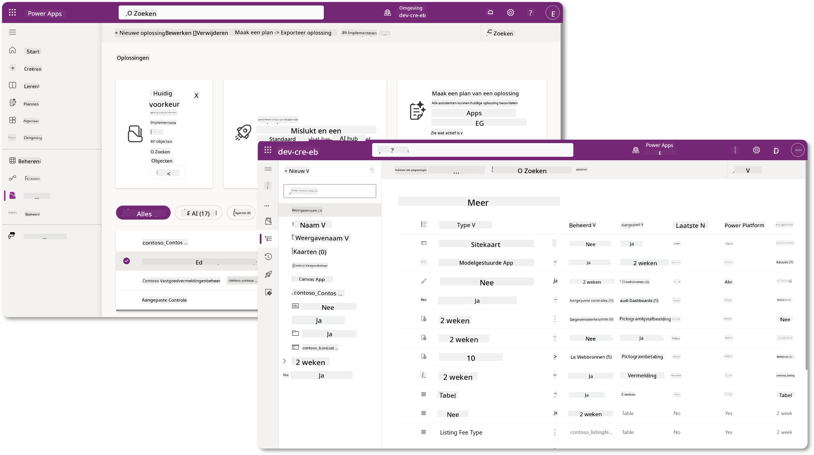

In Copilot Studio is er nu de **Solution Explorer**, waar je jouw oplossingen direct kunt beheren. Je hoeft niet meer over te schakelen naar de Power Apps maker portal om je oplossingen te beheren; dit kan nu direct in Copilot Studio 🪄

Dit betekent dat je de gebruikelijke oplossing-gerelateerde taken kunt uitvoeren:

- **Een oplossing maken** - aangepaste oplossingen maken het mogelijk om agents te exporteren en te importeren tussen omgevingen.
- **Je voorkeursoplossing instellen** - kies de oplossing waarin agents, apps, enz. standaard worden gemaakt.
- **Componenten toevoegen of verwijderen** - jouw agent kan andere componenten zoals omgevingsvariabelen of cloudflows refereren. Daarom moeten deze componenten in de oplossing worden opgenomen.
- **Oplossingen exporteren** - om oplossingen naar een andere doelomgeving te verplaatsen.
- **Oplossingen importeren** - oplossingen importeren die elders zijn gemaakt, inclusief het upgraden of bijwerken van oplossingen.
- **Oplossing-pijplijnen maken en beheren** - de implementatie van oplossingen tussen omgevingen automatiseren.
- **Git-integratie** - stelt ontwikkelaars in staat om oplossingen te koppelen aan Git-repositories voor versiebeheer, samenwerking en ALM. Bedoeld om alleen in ontwikkelaarsomgevingen te worden gebruikt.

   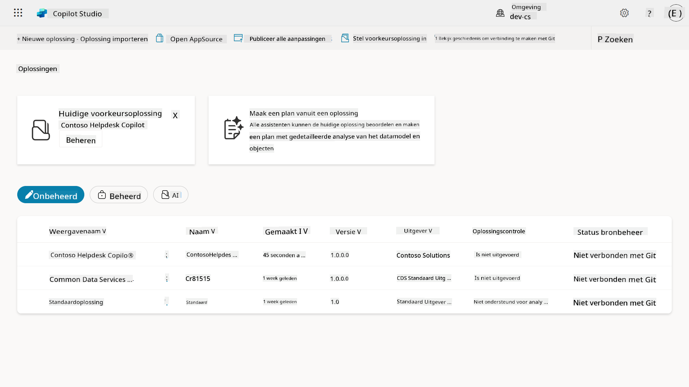

Er zijn twee soorten oplossingen:

- **Onbeheerde oplossingen** - gebruikt tijdens de ontwikkeling. Je kunt vrij bewerken en aanpassen zoals nodig.
- **Beheerde oplossingen** - gebruikt wanneer je klaar bent om je app te implementeren in testen of productie. Deze zijn vergrendeld om onbedoelde wijzigingen te voorkomen.

## 🤔 Waarom _zou_ ik een oplossing moeten gebruiken voor mijn agent?

Denk aan oplossingen als een _gereedschapskist_. Wanneer je iets (een agent) moet repareren of bouwen op een andere locatie (omgeving), verzamel je alle benodigde gereedschappen (componenten) en stop je ze in je gereedschapskist (oplossing). Vervolgens kun je deze gereedschapskist naar de nieuwe locatie (omgeving) brengen en de gereedschappen (componenten) gebruiken om je werk te voltooien, of nieuwe gereedschappen (componenten) toevoegen om je agent of project aan te passen.

!!! quote "Elaiza, jouw vriendelijke cloud-advocaat komt hier even binnen 🙋🏻‍♀️ om wat woorden te delen:"
    We hebben een gezegde in Nieuw-Zeeland: "Wees een nette Kiwi!" wat een oproep is aan Nieuw-Zeelanders 🥝 om verantwoordelijkheid te nemen voor hun omgeving door afval op de juiste manier weg te gooien en openbare ruimtes schoon te houden. We kunnen dezelfde context gebruiken voor agents door alles wat met jouw agent te maken heeft georganiseerd en draagbaar te houden, en het zal je helpen een nette omgeving te behouden.

Het is een goede gewoonte om een agent te maken in een toegewijde oplossing in jouw bron (ontwikkelaars)omgeving. Hier is waarom oplossingen waardevol zijn:

🧩 **Georganiseerde ontwikkeling**

- Je houdt jouw agent gescheiden van de standaardoplossing die alles in de omgeving bevat. Alle componenten van jouw agent bevinden zich op één plek 🎯

- Alles wat je nodig hebt voor jouw agent zit in een oplossing, waardoor het gemakkelijker wordt om te exporteren en te importeren naar een doelomgeving 👉🏻 dit is een gezonde gewoonte binnen ALM.

🧩 **Veilige implementatie**

- Je kunt jouw app of agent exporteren als een beheerde oplossing en implementeren in andere doelomgevingen (zoals testen of productie) zonder risico op onbedoelde wijzigingen.

🧩 **Versiebeheer**

- Je kunt patches (gerichte fixes), updates (een meer uitgebreide wijziging) of upgrades (vervanging van een oplossing - meestal grote wijzigingen en introductie van nieuwe functies) maken.

- Helpt je wijzigingen gecontroleerd uit te rollen.

🧩 **Afhankelijkheidsbeheer**

- Oplossingen houden bij welke onderdelen van elkaar afhankelijk zijn. Dit voorkomt dat je dingen breekt wanneer je wijzigingen aanbrengt.

🧩 **Team samenwerking**

- Ontwikkelaars en makers kunnen samenwerken met onbeheerde oplossingen in ontwikkeling en vervolgens een beheerde oplossing overdragen voor implementatie.

## 🪪 Begrip van oplossing-uitgevers

Een oplossing-uitgever in Power Platform is als een label of merk dat aangeeft wie een oplossing heeft gemaakt of bezit. Het is een klein maar belangrijk onderdeel van het beheren van jouw apps, agents en flow-aanpassingen, vooral bij het werken in teams of tussen verschillende omgevingen.

Wanneer je een oplossing maakt, moet je een uitgever kiezen. Deze uitgever definieert:

- Een prefix die wordt toegevoegd aan alle aangepaste componenten (denk aan tabellen, velden en flows).

- Een naam en contactgegevens voor de organisatie of persoon die de oplossing bezit.

### 🤔 Waarom is dit belangrijk?

1. **Gemakkelijke identificatie** - de prefix (bijvoorbeeld `new_` of `abc_`) helpt je snel te identificeren welke componenten bij welke oplossing of team horen.

1. **Voorkomt conflicten** - als twee teams een kolom genaamd status maken, voorkomen hun prefixes (`teamA_status`, `teamB_status`) naamconflicten.

1. **Ondersteunt ALM** - bij het verplaatsen van oplossingen tussen omgevingen (Dev → Test → Prod) helpt de uitgever eigendom bij te houden en consistentie te behouden.

### ✨ Voorbeeld

Stel dat je een uitgever maakt genaamd Contoso Solutions met de prefix `cts_`.

Als je een aangepaste kolom genaamd _Prioriteit_ toevoegt, wordt deze opgeslagen als `cts_Prioriteit` in de oplossing.

Iedereen die de kolom tegenkomt op het niveau van de oplossing, ongeacht in welke omgeving ze zich bevinden, kan gemakkelijk identificeren dat het een kolom is die geassocieerd is met Contoso Solutions.

## 🧭 Levenscyclus van Power Platform-oplossingen

Nu je het doel van een oplossing begrijpt, laten we leren over de levenscyclus.

**1. Maak een oplossing in de ontwikkelomgeving** - begin met het maken van een nieuwe oplossing in jouw ontwikkelomgeving.

**2. Voeg componenten toe** - voeg apps, flows, tabellen en andere elementen toe aan jouw oplossing.

**3. Exporteer als beheerde oplossing** - pak jouw oplossing in voor implementatie door deze te exporteren als een beheerde oplossing.

**4. Importeer naar testomgeving** - test jouw oplossing in een aparte testomgeving om ervoor te zorgen dat alles naar verwachting werkt.

**5. Importeer naar productieomgeving** - implementeer de geteste oplossing in jouw live productieomgeving.

**6. Pas patches, updates of upgrades toe** - voer verbeteringen of fixes uit met patches, updates of upgrades. 🔁 Herhaal de cyclus!

### ✨ Voorbeeld

Stel je bouwt een IT-helpdeskagent om medewerkers te helpen met problemen zoals apparaatproblemen, netwerkstoringen, printerinstellingen en meer.

- Je begint in een ontwikkelomgeving met een onbeheerde oplossing.

- Zodra het klaar is, exporteer je het als een beheerde oplossing en importeer je het in een doelomgeving zoals een systeemtest of User Acceptance Testing (UAT) omgeving.

- Na het testen verplaats je het naar de productieomgeving - allemaal zonder de originele ontwikkelversie aan te raken.

## 🧪 Lab 04: Maak een nieuwe oplossing

We gaan nu leren:

- [4.1 Hoe maak je een oplossing-uitgever](../../../../../docs/recruit/04-creating-a-solution)
- [4.2 Hoe maak je een oplossing](../../../../../docs/recruit/04-creating-a-solution)

We blijven bij het eerdere voorbeeld, waar we een oplossing gaan maken in de toegewijde Copilot Studio-omgeving om onze IT-helpdeskagent in te bouwen.

Laten we beginnen!

### Vereisten

#### Beveiligingsrol

In Copilot Studio hangt wat je _kunt doen_ in de Solution Explorer af van jouw gebruikersbeveiligingsrol.
Als je geen toestemming hebt om oplossingen te beheren in het Power Apps admin center, kun je die taken ook niet uitvoeren in Copilot Studio.

Om ervoor te zorgen dat alles soepel verloopt, controleer of je de juiste beveiligingsrollen en machtigingen hebt. Of als je geen omgevingen beheert in jouw organisatie, vraag dan jouw IT-beheerder (of het equivalent) team dat jouw tenant/omgevingen beheert.

De volgende beveiligingsrollen stellen gebruikers in staat om een oplossing te maken in hun omgeving.

| Beveiligingsrol    | Beschrijving |
| ---------- | ---------- |
| Omgevingsmaker | Biedt de nodige machtigingen om middelen binnen een specifieke omgeving te maken, aan te passen en te beheren, inclusief oplossingen  |
| Systeemaanpasser  | Breder dan Omgevingsmaker, inclusief de mogelijkheid om de omgeving aan te passen en beveiligingsrollen te beheren |
| Systeembeheerder   | Hoogste niveau van machtigingen en kan alle aspecten van de omgeving beheren, inclusief het maken en toewijzen van beveiligingsrollen     |

#### Ontwikkelomgeving

Zorg ervoor dat je overschakelt naar jouw toegewijde ontwikkelomgeving, zie [Les 00 - Cursusinstelling - Stap 3: Maak nieuwe ontwikkelaar](../00-course-setup/README.md#step-3-create-new-developer-environment).

1. Selecteer rechtsboven het **Tandwiel**-icoon en schakel over van de standaardomgeving naar jouw omgeving, bijvoorbeeld **Adele Vance's omgeving**.

    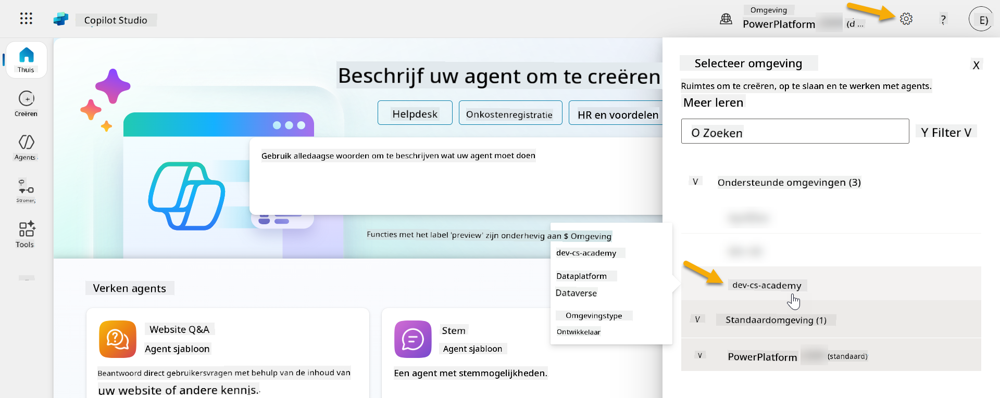

### 4.1 Maak een oplossing-uitgever

1. Gebruik dezelfde Copilot Studio-omgeving als in de vorige les en selecteer het **ellips-icoon (. . .)** in het menu aan de linkerkant in Copilot Studio. Selecteer **Oplossingen** onder de kop **Verkennen**.

    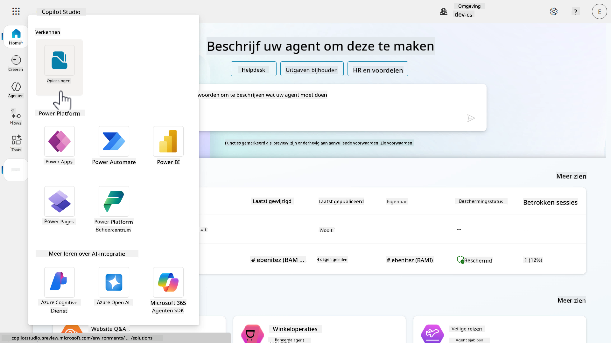

1. De **Solution Explorer** in Copilot Studio wordt geladen. Selecteer **+ Nieuwe oplossing**

    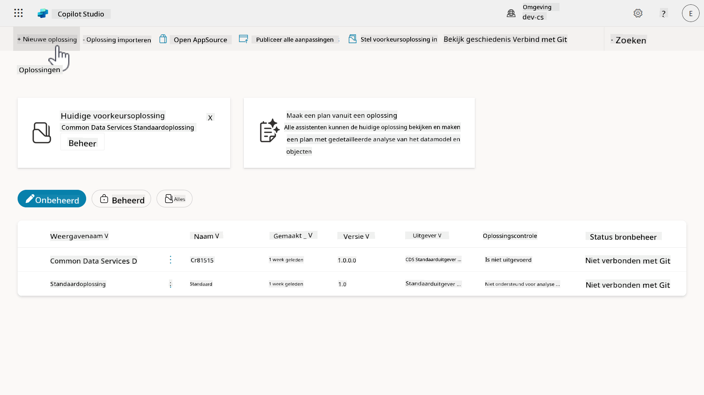

1. Het **Nieuwe oplossing**-paneel verschijnt waar we de details van onze oplossing kunnen definiëren. Eerst moeten we een nieuwe uitgever maken. Selecteer **+ Nieuwe uitgever**.

    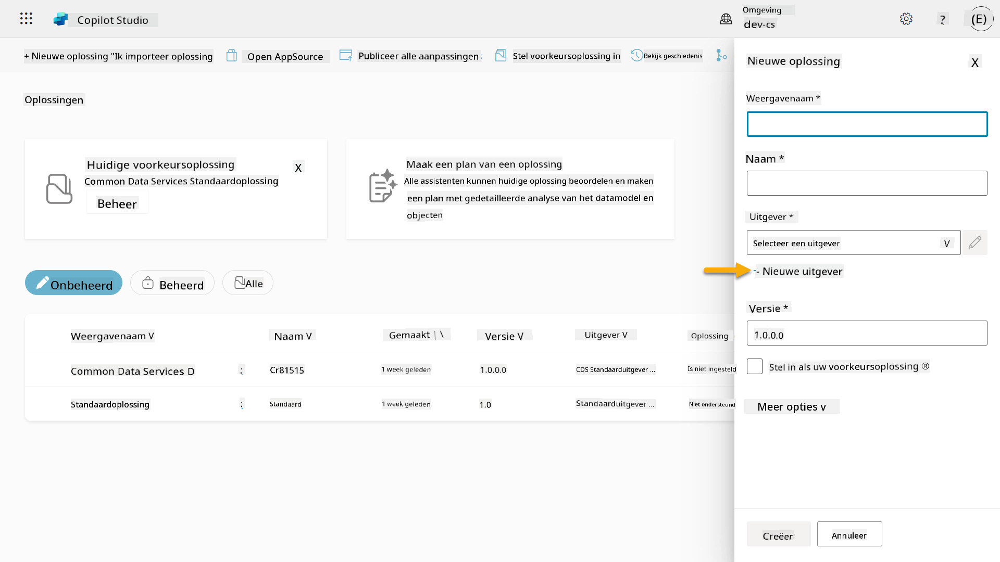  

1. Het tabblad **Eigenschappen** van het **Nieuwe uitgever**-paneel verschijnt met verplichte en niet-verplichte velden die moeten worden ingevuld in het tabblad **Eigenschappen**. Hier kunnen we de details van de uitgever schetsen, die zal worden gebruikt als het label of merk dat aangeeft wie de oplossing heeft gemaakt of bezit.

    | Eigenschap    | Beschrijving | Verplicht |
    | ---------- | ---------- | :----------: |
    | Weergavenaam | Weergavenaam voor de uitgever | Ja   |
    | Naam  | De unieke naam en schemanaam voor de uitgever  | Ja    |
    | Beschrijving   | Beschrijft het doel van de oplossing    | Nee     |
    | Prefix    | Uitgever-prefix die wordt toegepast op nieuw gemaakte componenten   | Ja      |
    | Keuzewaarde-prefix   | Genereert een nummer op basis van de uitgever-prefix. Dit nummer wordt gebruikt wanneer je opties toevoegt aan keuzes en biedt een indicator van welke oplossing is gebruikt om de optie toe te voegen.   | Ja      |

    Kopieer en plak het volgende als de **Weergavenaam**,

    ```text
    Contoso Solutions
    ```

    Kopieer en plak het volgende als de **Naam**,

    ```text
    ContosoSolutions
    ```

    Kopieer en plak het volgende als de **Beschrijving**,

    ```text
    Copilot Studio Agent Academy
    ```

    Kopieer en plak het volgende voor de **Prefix**,

    ```text
    cts
    ```

    Standaard wordt de **Keuzewaarde**-prefix weergegeven als een geheel getal. Werk dit geheel getal bij naar het dichtstbijzijnde duizendtal. Bijvoorbeeld, in mijn screenshot hieronder was het aanvankelijk `77074`. Werk dit bij van `77074` naar `77000`.

    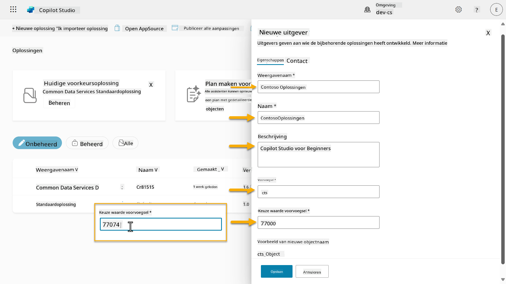  

1. Als je contactgegevens voor de oplossing wilt opgeven, selecteer je het tabblad **Contact** en vul je de weergegeven kolommen in.

    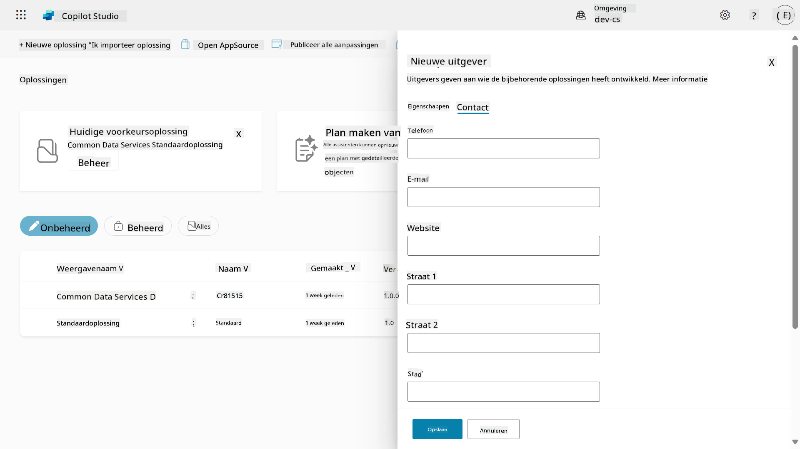

1. Selecteer het tabblad **Eigenschappen** en selecteer **Opslaan** om de uitgever te maken.

    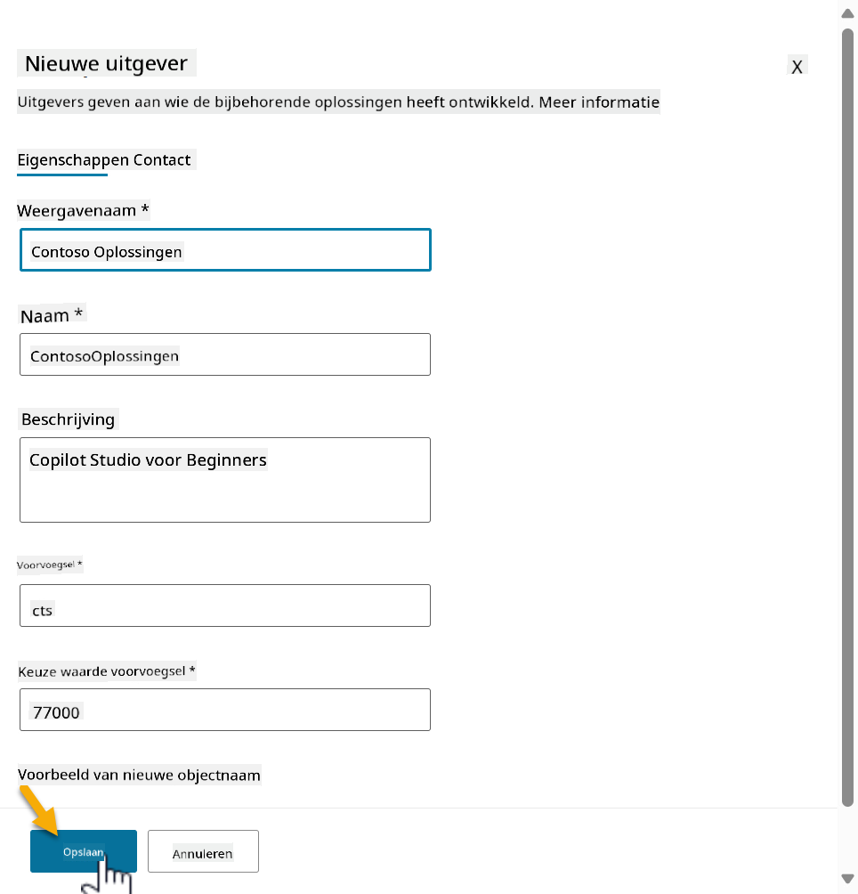
1. Het paneel **Nieuwe uitgever** wordt gesloten en je wordt teruggebracht naar het paneel **Nieuwe oplossing** met de zojuist aangemaakte uitgever geselecteerd.

    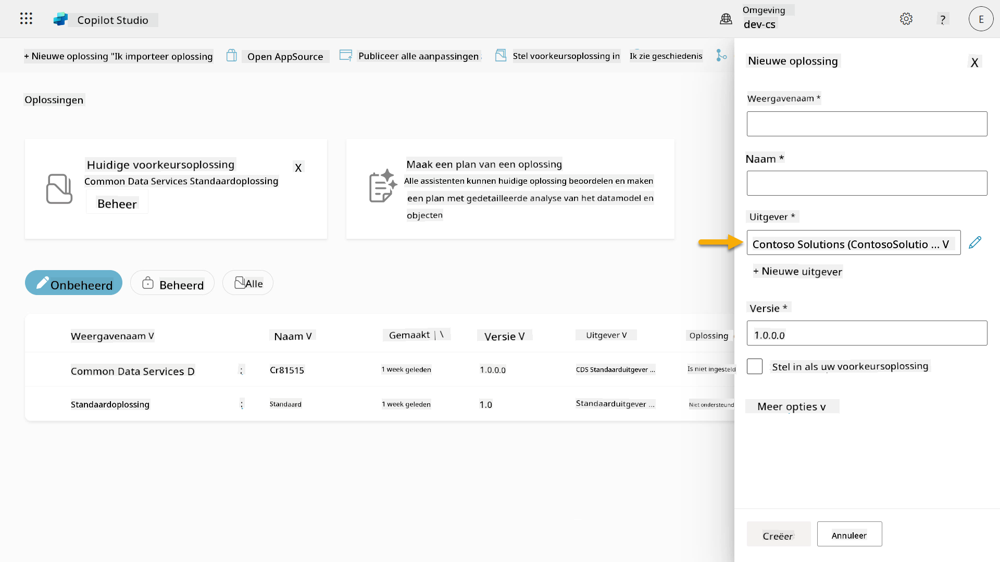  

High five, je hebt nu een Solution Publisher aangemaakt! 🙌🏻 We gaan nu leren hoe je een nieuwe aangepaste oplossing maakt.

### 4.2 Een nieuwe oplossing maken

1. Nu we onze uitgevers hebben aangemaakt, kunnen we de rest van het formulier in het paneel **Nieuwe oplossing** invullen.

    Kopieer en plak het volgende als **Weergavenaam**,

    ```text
    Contoso Helpdesk Agent
    ```

    Kopieer en plak het volgende als **Naam**,

    ```text
    ContosoHelpdeskAgent
    ```

    Omdat we een nieuwe oplossing maken, zal het [**Versienummer**](https://learn.microsoft.com/power-apps/maker/data-platform/update-solutions#understanding-version-numbers-for-updates/?WT.mc_id=power-172615-ebenitez) standaard `1.0.0.0` zijn.

    Vink het selectievakje **Instellen als uw voorkeursoplossing** aan.

    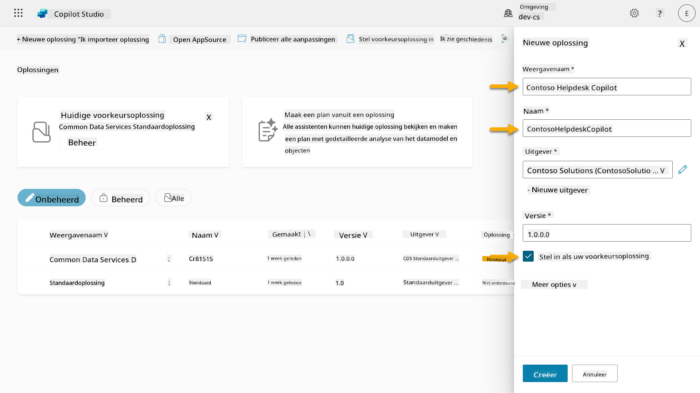  

1. Vouw de **Meer opties** uit om aanvullende details te bekijken die in een oplossing kunnen worden opgegeven.

    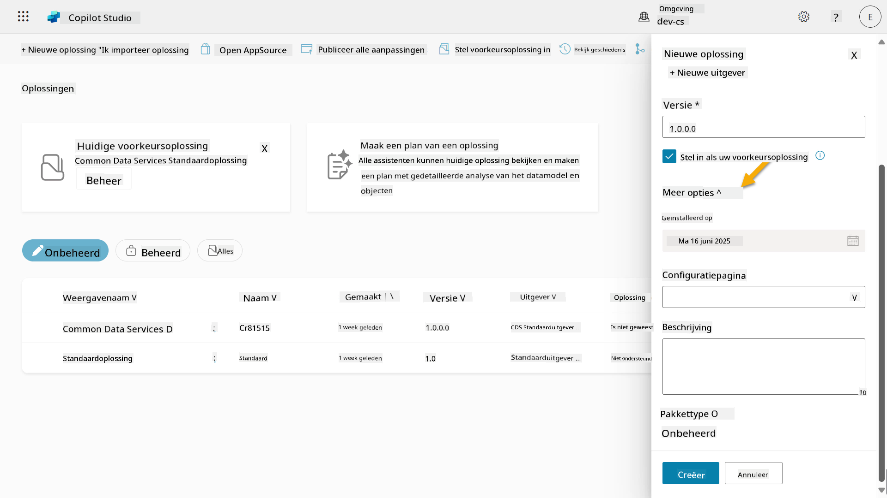

1. Je ziet het volgende:

    - **Geïnstalleerd op** - de datum waarop de oplossing is geïnstalleerd.

    - **Configuratiepagina** - ontwikkelaars stellen een HTML-webresource in om gebruikers te helpen interactie te hebben met hun app, agent of tool, waar het zal verschijnen als een webpagina in de Informatiesectie met instructies of knoppen. Dit wordt meestal gebruikt door bedrijven of ontwikkelaars die oplossingen bouwen en delen met anderen.

    - **Beschrijving** - beschrijft de oplossing of een algemene beschrijving van de configuratiepagina.

    We laten deze velden leeg voor deze oefening.

    Selecteer **Maken**.

    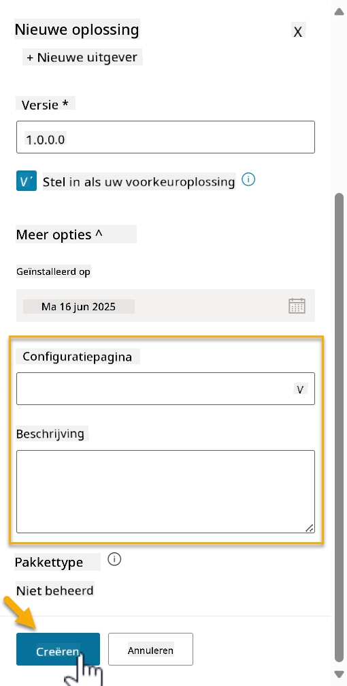

1. De oplossing voor Contoso Helpdesk Agent is nu aangemaakt. Er zullen geen componenten zijn totdat we een agent maken in Copilot Studio.

    Selecteer het pictogram **terugpijl** om terug te keren naar de Solution Explorer.

    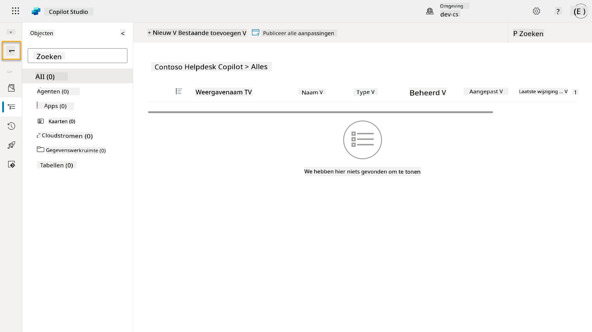

1. Merk op dat de Contoso Helpdesk Agent nu wordt weergegeven als de **Huidige voorkeursoplossing**, omdat we eerder het selectievakje **Instellen als uw voorkeursoplossing** hebben aangevinkt.

    

## ✅ Missie Voltooid

Gefeliciteerd! 👏🏻 Je hebt een uitgever aangemaakt en deze gebruikt in je nieuw aangemaakte oplossing om je agent te bouwen!

Goed gedaan, Agent Maker. Een nette digitale voetafdruk is de eerste stap naar schaalbare operabiliteit. Nu heb je de tools en de mindset voor duurzame, bedrijfsgerichte agentontwikkeling.

Dit is het einde van **Lab 04 - Een oplossing maken**, selecteer de onderstaande link om door te gaan naar de volgende les. De oplossing die je in deze lab hebt gemaakt, zal worden gebruikt in de lab van de volgende les.

⏭️ [Ga naar de les **Snel aan de slag met vooraf gebouwde agents**](../05-using-prebuilt-agents/README.md)

## 📚 Tactische Bronnen

🔗 [Een oplossing maken](https://learn.microsoft.com/power-apps/maker/data-platform/create-solution/?WT.mc_id=power-172615-ebenitez)

🔗 [Oplossingen maken en beheren in Copilot Studio](https://learn.microsoft.com/microsoft-copilot-studio/authoring-solutions-overview/?WT.mc_id=power-172615-ebenitez)

🔗 [Agents delen met andere gebruikers](https://learn.microsoft.com/microsoft-copilot-studio/admin-share-bots/?WT.mc_id=power-172615-ebenitez)

🔗 [Samenvatting van beschikbare bronnen voor vooraf gedefinieerde beveiligingsrollen](https://learn.microsoft.com/power-platform/admin/database-security#summary-of-resources-available-to-predefined-security-roles/?WT.mc_id=power-172615-ebenitez)

🔗 [Een oplossing upgraden of bijwerken](https://learn.microsoft.com/power-apps/maker/data-platform/update-solutions/?WT.mc_id=power-172615-ebenitez)

🔗 [Overzicht van pipelines in Power Platform](https://learn.microsoft.com/power-platform/alm/pipelines/?WT.mc_id=power-172615-ebenitez)

🔗 [Overzicht van Git-integratie in Power Platform](https://learn.microsoft.com/power-platform/alm/git-integration/overview/?WT.mc_id=power-172615-ebenitez)


---

**Disclaimer**:  
Dit document is vertaald met behulp van de AI-vertalingsservice [Co-op Translator](https://github.com/Azure/co-op-translator). Hoewel we streven naar nauwkeurigheid, dient u zich ervan bewust te zijn dat geautomatiseerde vertalingen fouten of onnauwkeurigheden kunnen bevatten. Het originele document in de oorspronkelijke taal moet worden beschouwd als de gezaghebbende bron. Voor kritieke informatie wordt professionele menselijke vertaling aanbevolen. Wij zijn niet aansprakelijk voor eventuele misverstanden of verkeerde interpretaties die voortvloeien uit het gebruik van deze vertaling.