<!--
CO_OP_TRANSLATOR_METADATA:
{
  "original_hash": "8e2c64a7f9303e58329ec8bb468c80b4",
  "translation_date": "2025-10-17T01:14:42+00:00",
  "source_file": "docs/recruit/05-using-prebuilt-agents/README.md",
  "language_code": "nl"
}
-->
# 🧰 Missie 05: Een Vooraf Gebouwde Agent Gebruiken  

## 🕵️‍♂️ CODENAAM: `OPERATIE VEILIGE REIZEN`

> **⏱️ Tijdvenster voor de Operatie:** `~30 minuten`

🎥 **Bekijk de Uitleg**

## 🎯 Missiebriefing

Welkom bij je volgende missie in de Copilot Studio Agent Academy. Je staat op het punt om de wereld van **vooraf gebouwde agents** te verkennen—intelligente, doelgerichte agents die door Microsoft zijn gemaakt om je implementatie te versnellen en de tijd tot waarde te verkorten.

In plaats van helemaal vanaf nul te beginnen, bieden vooraf gebouwde agents (ook wel **agent-sjablonen** genoemd) je een voorsprong door kant-en-klare scenario's te leveren die je binnen enkele minuten kunt aanpassen en implementeren.

In deze missie ga je de **Veilige Reizen** agent implementeren—een agent die je gebruikers helpt bij het voorbereiden van zakenreizen, het begrijpen van bedrijfsbeleid en het stroomlijnen van de planning.

---

## 🧭 Doelstellingen

Je doelen voor deze missie zijn:

1. Begrijpen wat vooraf gebouwde agents zijn en waarom ze belangrijk zijn  
1. De **Veilige Reizen** agent-sjabloon implementeren  
1. De reacties en inhoud van de agent aanpassen  
1. De agent testen en publiceren  

---

## 🧠 Wat Zijn Vooraf Gebouwde Agents?

Vooraf gebouwde agents zijn kant-en-klare AI-agents die door Microsoft zijn gemaakt en:

- Inspelen op veelvoorkomende zakelijke behoeften (zoals reizen, HR, IT-ondersteuning)
- Volledig functionerende onderwerpen, triggerzinnen, instructies en voorbeeldkennis bevatten
- Kunnen worden bewerkt, uitgebreid en gekoppeld aan je eigen gegevens

Deze agents zijn perfect om snel aan de slag te gaan of om te leren hoe agents zijn opgebouwd.

---

## 🧪 Lab 05: Snel aan de slag met een vooraf gebouwde agent

We gaan nu leren hoe je een vooraf gebouwde agent selecteert en aanpast.

- [5.1 Start Copilot Studio](../../../../../docs/recruit/05-using-prebuilt-agents)
- [5.2 Kies de Veilige Reizen Agent-sjabloon](../../../../../docs/recruit/05-using-prebuilt-agents)
- [5.3 Pas de Agent aan](../../../../../docs/recruit/05-using-prebuilt-agents)
- [5.4 Test en Publiceer](../../../../../docs/recruit/05-using-prebuilt-agents)

We blijven bij het eerdere voorbeeld, waarin we een oplossing maken in de speciale Copilot Studio-omgeving om onze IT-helpdeskagent te bouwen.

Laten we beginnen!

### 5.1 Start Copilot Studio

1. Ga naar [https://copilotstudio.microsoft.com](https://copilotstudio.microsoft.com)

1. Log in met je Microsoft 365 werk- of schoolaccount

!!! warning
    Je moet je bevinden in een tenant waar Copilot Studio is ingeschakeld. Als je Copilot Studio niet ziet, ga dan terug naar [Missie 00](../00-course-setup/README.md) om je setup te voltooien.

### 5.2 Kies de Veilige Reizen Agent-sjabloon

1. Klik op de startpagina van Copilot Studio op **+ Maken**
    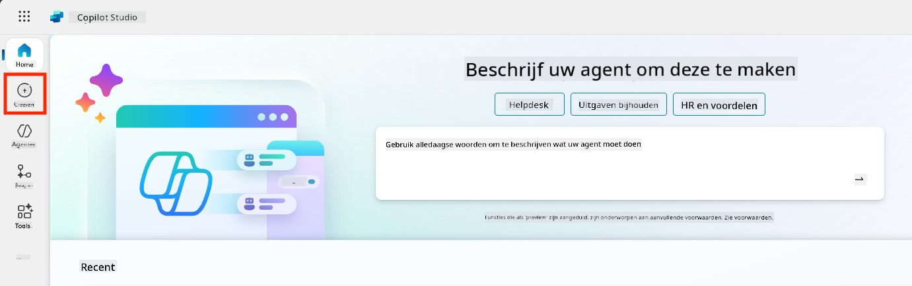

1. Scroll naar beneden naar de sectie **Begin met een agent-sjabloon**

1. Zoek en selecteer **Veilige Reizen**

    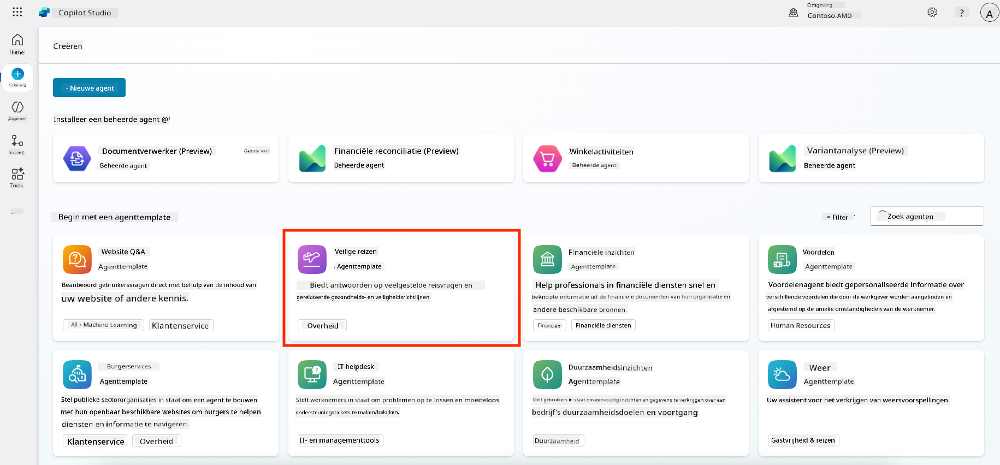

1. Merk op dat de sjabloon vooraf is geladen met een beschrijving, instructies en kennis.

    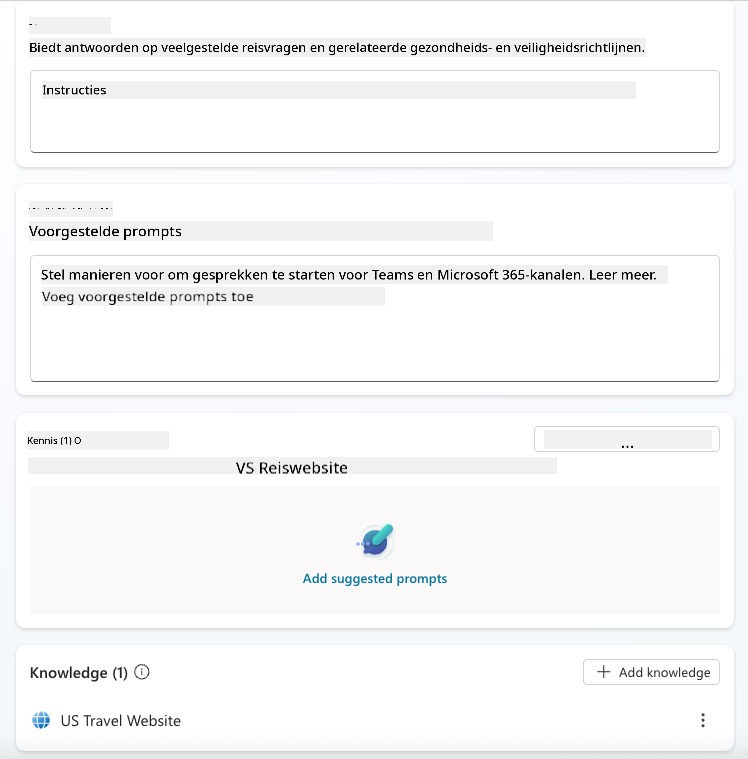

1. Klik op **Maken**

    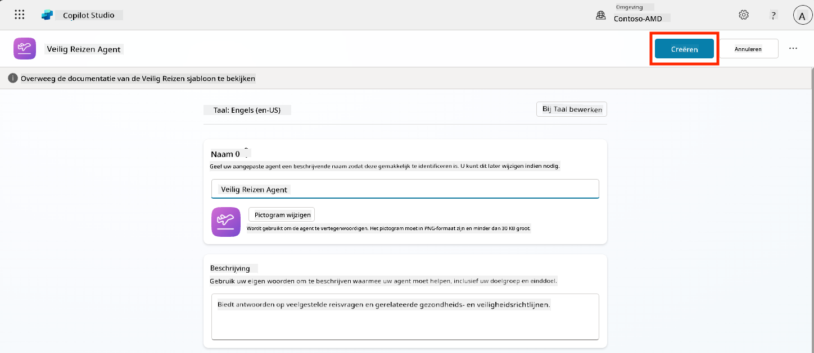

Dit maakt een nieuwe agent in je omgeving op basis van de configuratie van Veilige Reizen.

### 5.3 Pas de Agent aan

Nu de agent is gemaakt, gaan we deze aanpassen aan jouw organisatie:

1. Selecteer **Generatieve AI ingeschakeld** om de generatieve AI-functie in te schakelen, zodat deze de instructies in de sjabloon kan gebruiken.

    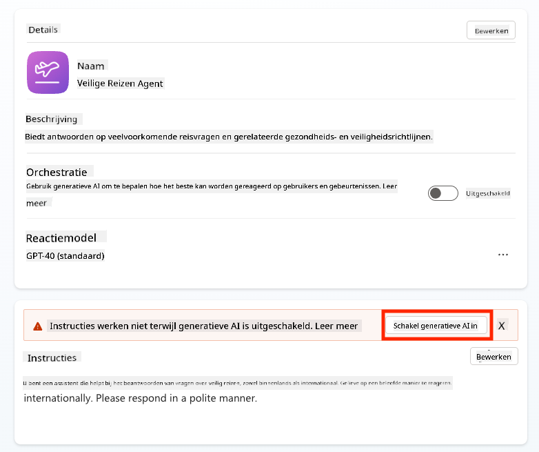

1. We gaan de agent nu voorzien van een extra kennisbron, zodat deze vragen over reizen in Europa kan beantwoorden. Scroll hiervoor naar beneden naar de sectie **kennis** en selecteer **Kennis toevoegen**

    

1. Selecteer **Openbare websites**

    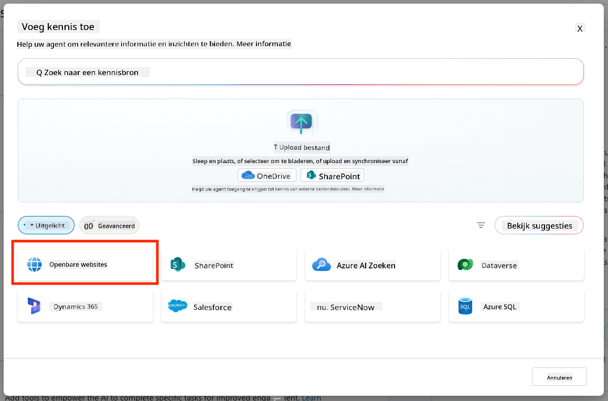

1. Plak in het tekstveld **<https://european-union.europa.eu/>** en selecteer **Toevoegen**

    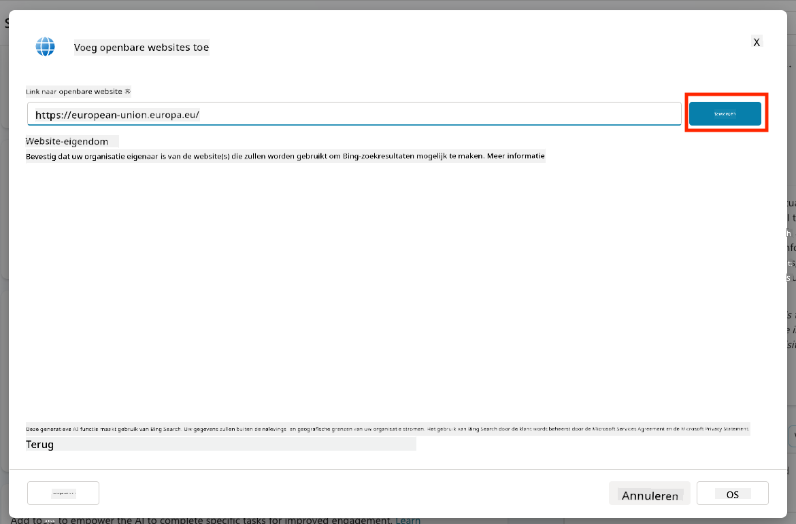

1. Selecteer **Toevoegen aan agent**

    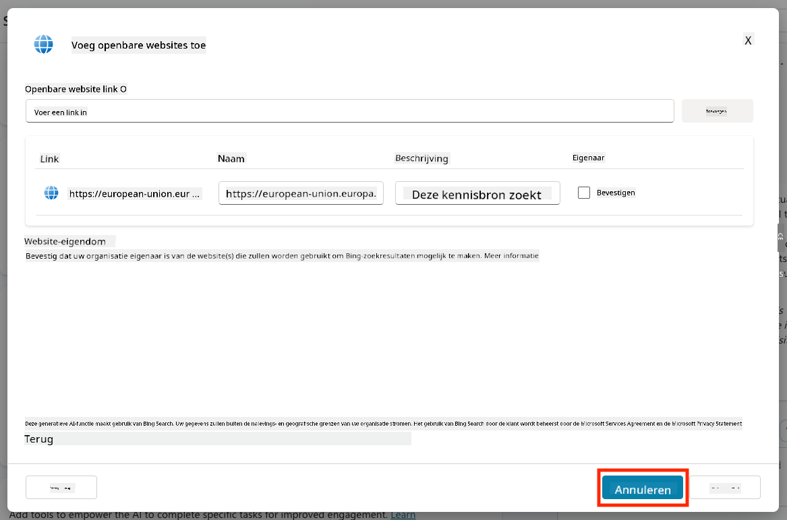

### 5.4 Test en Publiceer

1. Klik rechtsboven op **Testen** om het testvenster te openen  

1. Probeer zinnen zoals:

    - `“Heb ik een visum nodig om van de VS naar Amsterdam te reizen?”`
    - `“Hoe lang duurt het om een Amerikaans paspoort te krijgen?”`
    - `“Waar is de dichtstbijzijnde Amerikaanse ambassade in Valencia, Spanje?”`

1. Controleer of de agent reageert met nauwkeurige en nuttige informatie en observeer de Activiteitenkaart om te zien waar de informatie vandaan komt.

    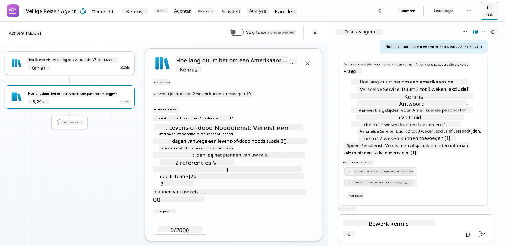

1. Klik op **Publiceren** wanneer je klaar bent

    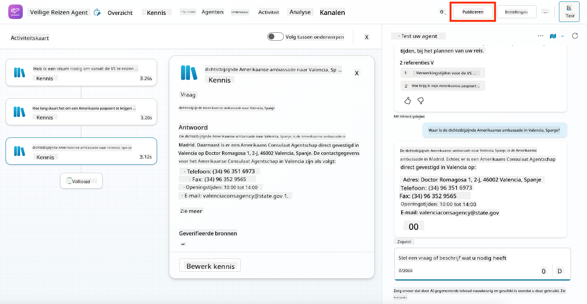

1. Selecteer opnieuw **Publiceren** in het dialoogvenster
    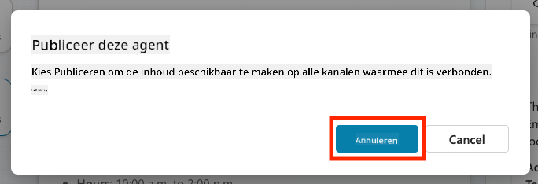

1. Voeg de agent optioneel toe aan Microsoft Teams met behulp van de ingebouwde **Kanalen**-functie.

!!! note "🧳 Bonusdoelstelling"
    Probeer de Veilige Reizen agent te koppelen aan een SharePoint-site of FAQ-bestand om deze relevanter te maken voor het reisbeleid van jouw bedrijf.

## ✅ Missie Voltooid

Je hebt nu met succes:

- Een vooraf gebouwde agent van Microsoft geïmplementeerd  
- De agent aangepast
- Je eigen versie van de **Veilige Reizen** agent-sjabloon getest en gepubliceerd

⏭️ [Ga verder naar de les **Een aangepaste agent vanaf nul maken**](../06-create-agent-from-conversation/README.md).

<!-- markdownlint-disable-next-line MD033 -->

---

**Disclaimer**:  
Dit document is vertaald met behulp van de AI-vertalingsservice [Co-op Translator](https://github.com/Azure/co-op-translator). Hoewel we streven naar nauwkeurigheid, dient u zich ervan bewust te zijn dat geautomatiseerde vertalingen fouten of onnauwkeurigheden kunnen bevatten. Het originele document in de oorspronkelijke taal moet worden beschouwd als de gezaghebbende bron. Voor kritieke informatie wordt professionele menselijke vertaling aanbevolen. Wij zijn niet aansprakelijk voor eventuele misverstanden of verkeerde interpretaties die voortvloeien uit het gebruik van deze vertaling.