<!--
CO_OP_TRANSLATOR_METADATA:
{
  "original_hash": "180f9cc0b40527f61be092c9b0f72aba",
  "translation_date": "2025-10-17T01:35:00+00:00",
  "source_file": "docs/recruit/06-create-agent-from-conversation/README.md",
  "language_code": "nl"
}
-->
# 🚨 Missie 06: Maak een aangepaste agent met natuurlijke taal met Copilot en verbind deze met je eigen data

## 🕵️‍♂️ CODENAAM: `OPERATIE AGENT FORGE`

> **⏱️ Operatietijd:** `~75 minuten`

🎥 **Bekijk de Uitleg**

[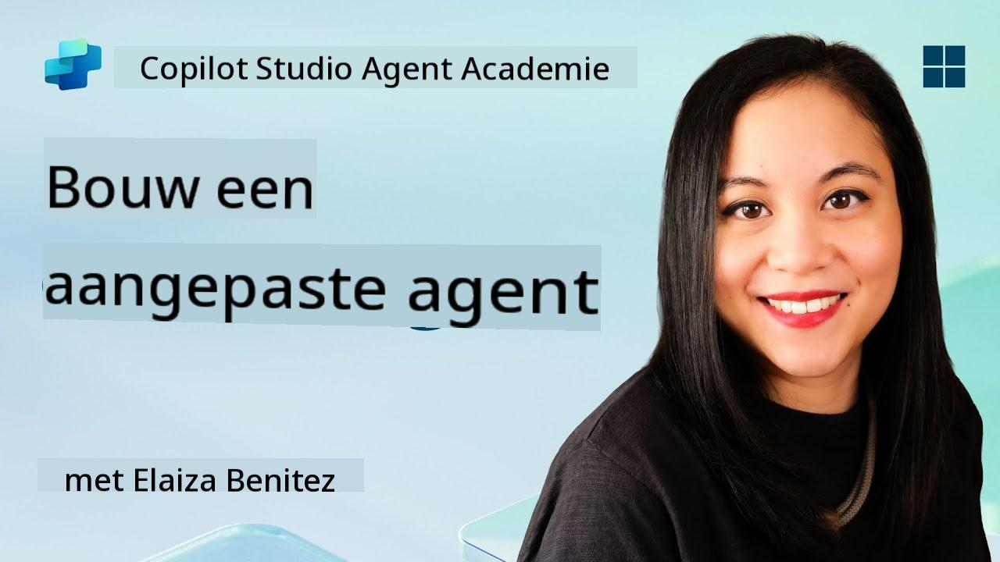](https://www.youtube.com/watch?v=qZTtQVncGFg "Bekijk de uitleg op YouTube")

## 🎯 Missieoverzicht

Welkom terug, Agent Maker. Deze missie plaatst je in de commandostoel van de krachtigste functie in Copilot Studio - het creëren van een aangepaste agent vanaf nul met alleen natuurlijke taal... en deze versterken met je eigen data.

Dit is niet zomaar een chatbot. Je bouwt een kennisgedreven digitale collega - een die kan redeneren, reageren en echte bedrijfsinformatie kan raadplegen.

Je wapen? Natuurlijke taal. Je missie? Ontwerp, train en test een volledig aangepaste helpdeskagent die IT-vragen beantwoordt met behulp van SharePoint, geüploade bestanden of bedrijfs-URL's.

Laten we je agent vanaf de basis opbouwen.

## 🔎 Doelstellingen

In deze missie leer je:

1. Begrijpen wat aangepaste agents zijn en hoe ze verschillen van vooraf gebouwde sjablonen.
1. Agents maken met natuurlijke taal prompts en conversatieontwerp met Copilot.
1. Agents verbinden met bedrijfskennisbronnen zoals SharePoint, documenten en websites.
1. Meer leren over generatieve orkestratie en hoe agents dynamisch zoeken en reageren met meerdere databronnen.
1. Een volledig functionele IT-helpdeskagent bouwen en testen die vragen kan beantwoorden met je eigen data.

## 🤔 Wat is een _aangepaste_ agent?

Een aangepaste agent is een chatbot of virtuele assistent die je in Copilot Studio maakt en ontwerpt om gebruikers te helpen met specifieke taken of vragen. Het wordt aangepast genoemd omdat:

- **Jij bepaalt het doel** - gebruikers helpen met vakantieaanvragen, orderstatus controleren, hulp bieden bij IT-gerelateerde vragen.
- **Jij definieert de conversatie** - wat de agent zegt en hoe deze moet reageren.
- **Jij verbindt het met je eigen data** - verbinding maken met je bedrijfsdata via de ingebouwde ondersteunde kennisbronnen.
- **Jij koppelt het aan je eigen systemen of applicaties** - kies uit connectors, flows, REST API's en model context protocol servers.

!!! note
    Zie het zo: je bouwt je eigen digitale helper die met gebruikers kan praten en taken voor hen kan uitvoeren, zoals vragen beantwoorden, informatie verzamelen die nodig is voor een proces, of verbinding maken met je bedrijfsdata.

### 🤖 Wat kan een aangepaste agent doen?

Een aangepaste agent kan het volgende doen:

- Gebruikers om informatie vragen, zoals namen, datums of voorkeuren.
- Die informatie opslaan in een database of tabel.
- Data opzoeken op basis van gestelde vragen en antwoorden geven.
- Autonoom werken zonder dat gebruikers direct met de agent interageren.
- Acties uitvoeren, zowel op aanvraag via directe gebruikersinteractie als autonoom, zoals e-mails verzenden of records aanmaken.

### 👩🏻‍💻 Waarom een aangepaste agent gebruiken?

- Bespaart tijd door repetitieve taken te automatiseren.
- Biedt gebruikers een vriendelijke, begeleide ervaring.
- Kan worden afgestemd op de behoeften van je bedrijf of project.

### ✨ Voorbeeld

Je bouwt een aangepaste agent die werknemers helpt bij het aanvragen van vakantiedagen.

De agent vraagt om hun naam, vakantiedata en de naam van hun manager, en slaat deze informatie op in het aangewezen systeem dat vakantieverzoeken beheert, zoals een SharePoint-lijst.

Nu hoeven werknemers niet meer naar de SharePoint-lijst te navigeren en een nieuw item aan te maken; ze kunnen gewoon met de agent chatten.

## 🗣️ Gebruik natuurlijke taal om agents te maken

Eerder heb je geleerd hoe je snel agents kunt bouwen in Copilot Studio met vooraf gebouwde agentsjablonen in [Les 05 - Snel aan de slag met vooraf gebouwde agents](../05-using-prebuilt-agents/README.md). In deze les duiken we in de conversatiegerichte creatie-ervaring met Copilot. Copilot Studio maakt het eenvoudig om agents te bouwen door met Copilot te chatten, net alsof je een gesprek voert.

In Copilot Studio hoef je geen code te schrijven om een agent te maken. In plaats daarvan beschrijf je wat je wilt dat je agent doet in gewone taal, en Copilot helpt je stap voor stap bij het bouwen via een chatachtige ervaring.

## 🌱 Maar ik ben nieuw in "beschrijven wat ik wil" - wat moet ik doen?

Het beschrijven in natuurlijke taal om een aangepaste agent te maken kan een nieuw concept voor je zijn. Telkens wanneer je Copilot gebruikt in Microsoft-producten en -diensten, gebruik je natuurlijke taal in de vorm van een _prompt_.

Een prompt is het bericht of de instructie die je aan een AI-agent geeft om te vertellen wat je wilt dat deze doet. Zie het als het geven van aanwijzingen aan een assistent. Hoe duidelijker je instructies zijn, hoe gemakkelijker het is voor je assistent om ze te begrijpen en uit te voeren.

### 🪄 Waarom prompts belangrijk zijn

- Ze sturen het gedrag van de agent.
- Ze helpen de agent begrijpen wat voor soort gesprek er moet plaatsvinden.
- Een goede prompt maakt de agent behulpzamer en nauwkeuriger.

### 📝 Tips voor het schrijven van een goede prompt

- Wees duidelijk en specifiek - zeg precies wat je wilt dat de agent doet.
- Denk als de gebruiker - wat zal de gebruiker zeggen? Wat moet de agent antwoorden?
- Voeg voorbeelden toe - geef indien mogelijk een voorbeeldinteractie.

### ✨ Voorbeeld

Stel dat het HR-team een agent nodig heeft om te helpen met vakantieaanvragen.

De prompt kan zijn:

    “Ik wil een agent bouwen die gebruikers helpt een vakantieaanvraag in te dienen. Wanneer een gebruiker zegt dat ze vrij willen nemen, moet de agent vragen naar hun naam, de startdatum van hun vakantie, de einddatum van hun vakantie en de naam van hun manager. Zodra de gebruiker deze informatie heeft verstrekt, moet de agent deze opslaan in een SharePoint-lijst genaamd ‘Vakantieaanvragen’ en een melding plaatsen in een speciale Microsoft Teams-kanaal.”

Waarom deze prompt werkt:

- **Geeft duidelijk het doel aan** - een vakantieaanvraag indienen.
- **Beschrijft de gebruikersinteractie** - wat de gebruiker zegt en wat de agent moet vragen.
- **Lijst de benodigde gegevens op** - naam, startdatum, einddatum, manager.
- **Vermeldt waar de gegevens naartoe gaan** - een SharePoint-lijst genaamd Vakantieaanvragen.

## 🔮 Oké, ik heb mijn agent gemaakt... hoe verbind ik deze vervolgens met kennis?

In Copilot Studio zijn kennisbronnen plekken waar je agent informatie kan vinden om betere antwoorden te geven. Wanneer je deze bronnen toevoegt, kan je agent bedrijfsdata ophalen uit plekken zoals Power Platform, Dynamics 365, websites en andere systemen of diensten die je bedrijf gebruikt.

Deze bronnen werken samen met AI om je agent te helpen nauwkeuriger te reageren op gebruikersvragen, dit wordt bereikt door wat bekend staat als **generatieve orkestratie**.

### 🌿 Wat is generatieve orkestratie in de context van agents?

Generatieve orkestratie betekent dat de agent AI gebruikt om dynamisch te beslissen hoe een vraag te beantwoorden door zijn ingebouwde taalvaardigheden te combineren met informatie uit je toegevoegde kennisbronnen.

Wanneer een gebruiker een vraag stelt, doet de agent het volgende:

- Begrijpt de vraag met behulp van AI.
- Kan gebruikers om ontbrekende informatie vragen door vragen ter plekke te genereren.
- Selecteert de meest relevante kennisbronnen.
- Zoekt in die bronnen naar antwoorden.
- Genereert een natuurlijke, behulpzame reactie met behulp van de gevonden informatie.

### 🏦 Waarom kennisbronnen belangrijk zijn?

1. **Slimmere antwoorden** - wanneer je kennisbronnen toevoegt, kan je agent betere, nauwkeurigere antwoorden geven met echte data van je organisatie.

1. **Minder handmatig werk** - je hoeft niet elk mogelijk antwoord te schrijven. De agent kan door je toegevoegde bronnen zoeken en automatisch reageren.

1. **Gebruik betrouwbare informatie** - je agent kan antwoorden halen uit systemen die je al gebruikt, zoals Dataverse, SharePoint of bedrijfswebsites, zodat gebruikers betrouwbare informatie krijgen uit een bron van waarheid.

1. **Werkt met generatieve AI** - kennisbronnen en AI helpen je agent vragen te begrijpen en natuurlijk te reageren, zelfs als de vraag niet vooraf is geprogrammeerd of als startprompt is toegevoegd.

1. **Flexibel en uitbreidbaar** - je kunt kennisbronnen op elk moment toevoegen tijdens de setup of later, je agent wordt slimmer naarmate je behoeften veranderen.

### ✨ Voorbeeld

Stel je voor dat je een agent bouwt om werknemers te helpen met HR-vragen. Je voegt het HR-beleid van je bedrijf en de SharePoint-site toe als kennisbronnen.

Wanneer een werknemer vraagt, _“Hoeveel vakantiedagen heb ik recht op?”_, gebruikt de agent generatieve orkestratie om die bronnen te doorzoeken en te antwoorden met het juiste beleid zonder dat je dat antwoord handmatig hoeft te schrijven. Dit bespaart je tijd omdat je niet voor elke mogelijke vraag een antwoord hoeft te bedenken.

## Soorten kennisbronnen die kunnen worden toegevoegd

1. **Publieke websites**
    - **Wat het doet:** Doorzoekt specifieke websites (zoals de site van je bedrijf) met Bing.
    - **Waarom het nuttig is:** Ideaal voor het ophalen van openbare informatie zoals veelgestelde vragen of productdetails.

1. **Documenten**
    - **Wat het doet:** Gebruikt documenten die je direct naar je agent uploadt, zoals PDF's of Word-bestanden. Deze geüploade bestanden worden veilig opgeslagen in Dataverse.
    - **Waarom het nuttig is:** Maakt het mogelijk dat je agent vragen beantwoordt op basis van interne handleidingen, handleidingen of beleidsdocumenten.

1. **SharePoint**
    - **Wat het doet:** Verbindt met SharePoint-mappen of bestanden via Microsoft Graph Search.
    - **Waarom het nuttig is:** Ideaal voor toegang tot teamdocumenten, HR-beleid of projectbestanden die zijn opgeslagen in SharePoint.

1. **Dataverse**
    - **Wat het doet:** Gebruikt gestructureerde data uit je Dataverse-omgeving, zoals tabellen en rijen, en kan synoniemen en woordenlijsten toepassen voor tabellen en kolommen om de reacties van de agent te verbeteren.
    - **Waarom het nuttig is:** Wanneer je bedrijfsdata nodig hebt die is opgeslagen in Dataverse, zoals klantinformatie.

1. **Realtime kennis met connectors**
    - **Wat het doet:** Laat je agent toegang krijgen tot live data van andere bedrijfssystemen zoals Salesforce, ServiceNow, Dynamics 365, AzureSQL, Databricks en meer tijdens een gesprek, met behulp van de eigen machtigingen van de gebruiker.
    - **Waarom het nuttig is:** Het biedt actuele, veilige en nauwkeurige antwoorden zonder data op te slaan of te dupliceren, waardoor je agent slimmer en veiliger wordt.

1. **Azure AI Search**
    - **Wat het doet:** Laat je agent grote sets documenten doorzoeken die in Azure zijn opgeslagen met semantische en vectorzoekopdrachten om gebruikersvragen te begrijpen.
    - **Waarom het nuttig is:** Levert nauwkeurige, betrouwbare antwoorden uit complexe databronnen, ondersteunt citaten en schaalt goed voor grote documentcollecties met beveiligde toegangscontroles.

## 🔒 Opmerking over beveiliging

### Authenticatie van kennisbronnen

Sommige bronnen, zoals SharePoint en Dataverse, vereisen gebruikersauthenticatie. Dit betekent dat de agent alleen data in zijn antwoord zal opnemen die de gebruiker mag zien. Andere bronnen kunnen aanvullende configuratie vereisen voor de agent om verbinding te maken, zoals Azure AI Search, waarvoor een Azure-account en een specifieke authenticatietype nodig zijn.

## Het verbeteren van de reacties van je agent in Copilot Studio

Nadat je agent is aangemaakt via de conversatiegerichte creatie-ervaring, wil je je agent testen aan de hand van de instructies die Copilot heeft gegenereerd op basis van je prompt. Het verbeteren van de reacties van je agent in Copilot Studio draait om ervoor zorgen dat deze je doelen duidelijk begrijpt en over de juiste informatie beschikt.

1. **Verfijn de instructies van de agent** - hier vertel je je agent hoe deze zich moet gedragen. Gebruik duidelijke, specifieke taal.

    Bijvoorbeeld:

    ✅ “Gedraag je als een vriendelijke klantenserviceagent die dingen eenvoudig uitlegt.”

    ❌ “Wees behulpzaam.” (Te vaag)

1. **Controleer de toon en taal** - zorg ervoor dat de toon van de agent past bij je doelgroep.

    Je kunt deze instellen als:

    - Vriendelijk en informeel.
    - Professioneel en beknopt.
    - Ondersteunend en geduldig.

1. **Voeg kennisbronnen toe of werk ze bij** - als je agent vragen over een onderwerp moet beantwoorden, zorg er dan voor dat deze toegang heeft tot de juiste informatie.

    - Voeg links toe naar websites, documenten of veelgestelde vragen.
    - Houd de inhoud up-to-date.
    - Gebruik duidelijke, goed gestructureerde informatie.

1. **Gebruik onderwerpen en triggers** - Als je agent specifieke taken of gesprekken moet afhandelen, kun je onderwerpen maken met triggerzinnen. Dit helpt om het gesprek nauwkeuriger te sturen. Hier leren we meer over in de volgende les.

1. **Test met echte vragen** - probeer je agent de soorten vragen te stellen die gebruikers zouden kunnen stellen.

    Als de antwoorden niet goed zijn:

    - Pas de systeeminstructies aan.
    - Voeg meer voorbeelden of kennis toe.
    - Herschrijf je vragen om te zien hoe de agent reageert.

1. **Evalueer en verbeter** - het verbeteren van een agent is een doorlopend proces!

    Na publicatie:

    - Verzamel feedback van gebruikers.
    - Let op veelgestelde vragen of verwarring.
    - Blijf de instellingen van de agent verfijnen.

## 🧪 Lab 06: Maak een aangepaste agent in Copilot Studio

We gaan nu leren hoe je een aangepaste agent maakt die kan chatten over je data.

- [6.1 Gebruik natuurlijke taal om een agent te maken met Copilot](../../../../../docs/recruit/06-create-agent-from-conversation)
- [6.2 Voeg een interne kennisbron toe via een SharePoint-site](../../../../../docs/recruit/06-create-agent-from-conversation)
- [6.3 Voeg een interne kennisbron toe door een document te uploaden](../../../../../docs/recruit/06-create-agent-from-conversation)
- [6.4 Test de agent](../../../../../docs/recruit/06-create-agent-from-conversation)

### ✨ Gebruiksscenario
We gebruiken hetzelfde gebruiksscenario als in [Les 03 - Een declaratieve agent maken voor Microsoft 365 Copilot](../03-create-a-declarative-agent-for-M365Copilot/README.md#use-case-scenario)

**Als een** medewerker

**Wil ik** snel en nauwkeurige hulp krijgen van de IT-helpdeskagent voor problemen zoals apparaatproblemen, netwerkstoringen, printerinstallatie

**Zodat ik** productief kan blijven en technische problemen zonder vertraging kan oplossen

Laten we beginnen!

### ✨ Vereisten

- **SharePoint-site**

We gebruiken de **Contoso IT** SharePoint-site uit [Les 00 - Cursusinstelling - Stap 3: Nieuwe SharePoint-site maken](../00-course-setup/README.md#step-4-create-new-sharepoint-site).

Als je de **Contoso IT** SharePoint-site nog niet hebt ingesteld, ga dan terug naar [Les 00 - Cursusinstelling - Stap 3: Nieuwe SharePoint-site maken](../00-course-setup/README.md#step-4-create-new-sharepoint-site).

- **Oplossing**

We gebruiken de **Contoso Helpdesk Agent**-oplossing uit [Les 04 - Een oplossing maken voor je agent](../04-creating-a-solution/README.md#41-create-a-solution-publisher).

Als je de **Contoso Agent**-oplossing nog niet hebt ingesteld, ga dan terug naar [Les 04 - Een oplossing maken voor je agent](../04-creating-a-solution/README.md#41-create-a-solution-publisher).

### 6.1 Gebruik natuurlijke taal om een agent te maken met Copilot

!!! warning "Copilot-vragen kunnen per sessie verschillen"

    De conversatie-ervaring van Copilot kan elke keer variëren, waarbij de verstrekte vragen voor begeleiding enigszins kunnen verschillen van eerder.

1. Navigeer naar de startpagina van Copilot Studio en voer in het veld de volgende prompt in die de IT-helpdeskagent beschrijft. De prompt bevat het doel van de agent, de context, de verwachte taken en het formaat van de reactie van de agent.

    ```text
    You are an IT help desk agent. Your goal is to assist users with their IT issues. You can access information from our company's knowledge base at https://support.microsoft.com/en-us. Your responses should be polite and helpful. If a user reports a slow computer, ask about the age of the device, current software versions, and if they've recently installed any new programs. If a user is experiencing trouble logging into their email, guide them through password reset procedures. You should be concise and informative, using step-by-step instructions with bullet points when appropriate.
    ```

      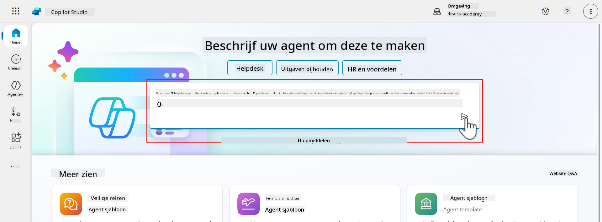

1. De conversatie-ervaring met Copilot wordt vervolgens geladen. Je ziet dat Copilot bezig is met reageren.

      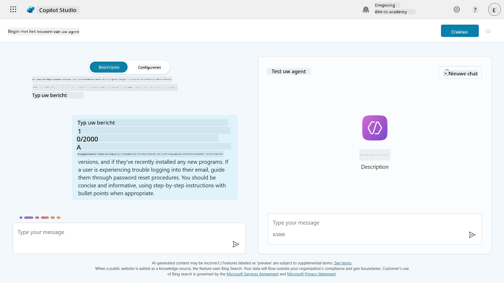

1. Copilot bevestigt dat de agent is ingesteld met de verstrekte instructies en vraagt om bevestiging van de naam van de agent. We vragen Copilot om onze agent de naam te geven:

       ```text
       Contoso Helpdesk Agent
       ```

      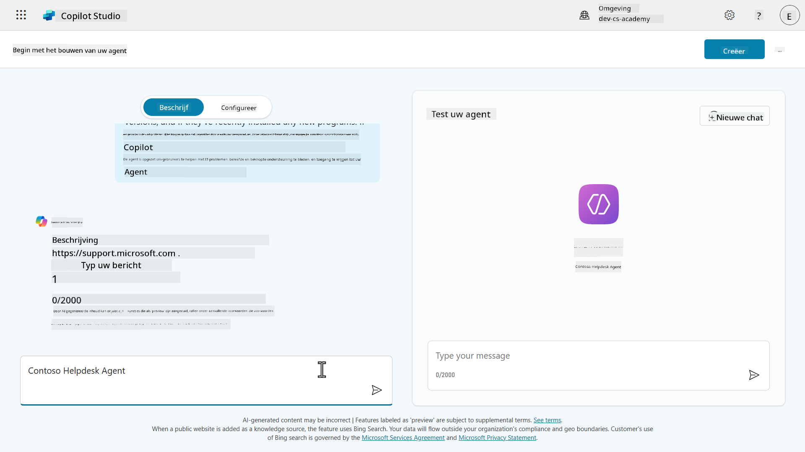

1. Copilot voert het verzoek uit en we zien dat de naam van de agent is bijgewerkt in het agentpaneel. Copilot vraagt ons vervolgens om de instructies te verfijnen. Het vraagt hoe we moeten reageren op specifieke problemen en we verzoeken dat het het probleem erkent, voorbeelden van onderwerpen geeft om te beantwoorden en de reactie in de vorm van opsommingstekens formatteert.

    Kopieer en plak het volgende en dien het verzoek in bij Copilot.

       ```text
       Geef prioriteit aan dringende verzoeken. Voorbeelden van IT-problemen of scenario's om mee te helpen: apparaatproblemen, netwerkconnectiviteit, inlogproblemen. Bij het oplossen van problemen, erken eerst hun probleem en reageer met empathie, geef vervolgens stapsgewijze begeleiding met behulp van opsommingstekens en vraag of ze verdere hulp nodig hebben.
       ```

      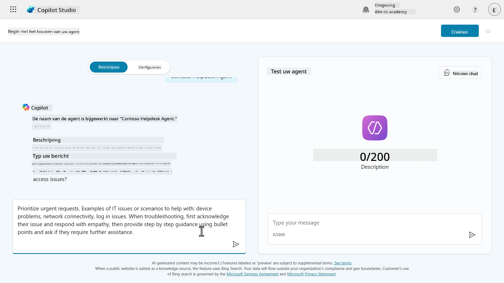

1. De instructies van de agent worden bijgewerkt nadat Copilot het verzoek heeft ontvangen. Let op hoe in het rechterpaneel nu startprompts zijn verschenen. Deze zijn gevormd op basis van onze instructies.

    Vervolgens vraagt Copilot om openbare websites om de kennis van de agent te onderbouwen.

    Kopieer en plak het volgende en dien het verzoek in bij Copilot.

      ```text
      https://support.microsoft.com
      ```

      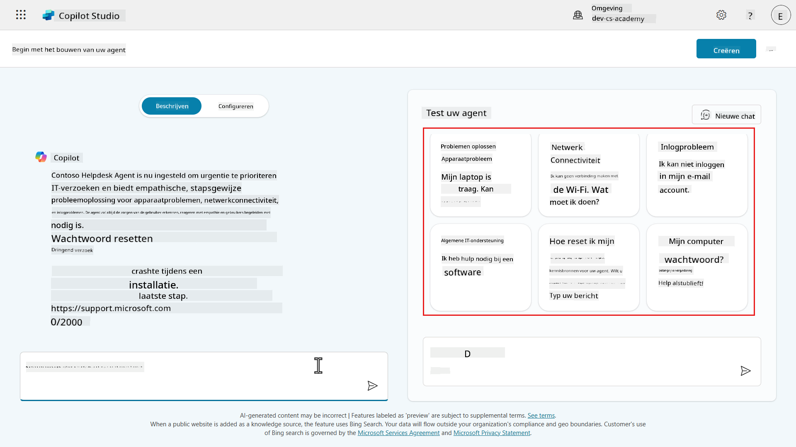

1. De openbare website wordt toegevoegd als kennisbron. Copilot vraagt of er aanvullende kennisbronnen moeten worden toegevoegd. We hoeven geen extra openbare websites toe te voegen.

    Kopieer en plak het volgende en dien het verzoek in bij Copilot.

      ```text
      Proceed with setup
      ```

      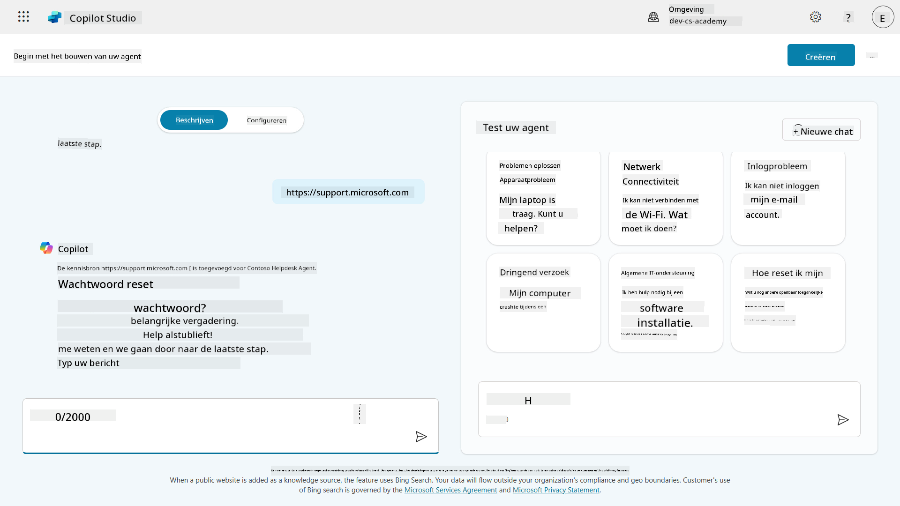

1. Copilot bevestigt dat de setup van onze Contoso Helpdesk Agent is voltooid, maar we voegen nog een wijziging toe: we gaan verzoeken dat onze agent geen vragen over HR beantwoordt. Dit laat onze agent weten dat het geen HR-gerelateerde vragen van gebruikers moet beantwoorden.

    Kopieer en plak het volgende en dien het verzoek in bij Copilot.

       ```text
       Geef geen hulp bij vragen met betrekking tot HR, voorbeelden zijn: Wat is mijn saldo voor vakantiedagen? Hoeveel ziektedagen heb ik? Wat is de URL van ons payrollportaal?
       ```

      

1. De instructies worden bijgewerkt om geen hulp te bieden bij HR-gerelateerde vragen. We hoeven geen verdere updates te maken, onze agent is klaar om te worden gemaakt.

      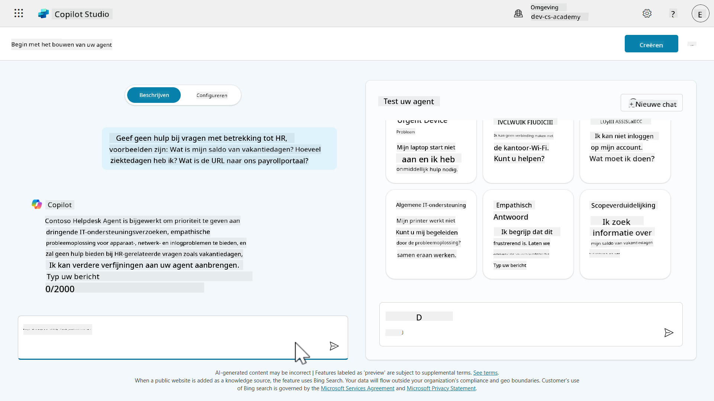

1. Voordat we onze agent maken, doen we een paar dingen.

    Selecteer eerst het tabblad **Configureren** om de agentdetails te bekijken die zijn gedefinieerd vanuit ons gesprek met Copilot. Hier zie je de naam, beschrijving, instructies, kennis en voorgestelde/startprompts.

      

1. Ten tweede testen we onze agent. Kopieer en plak het volgende en dien de vraag in bij onze agent.

       ```text
       Hoe kan ik de garantie van mijn Surface controleren?
       ```

      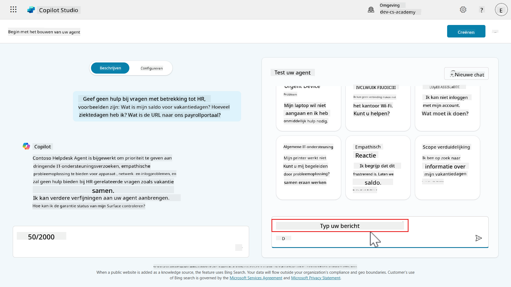

1. Het antwoord op de vraag wordt vervolgens weergegeven, waarbij de antwoorden zijn geformuleerd als een stapsgewijze handleiding met opsommingstekens. Geweldig, onze agent werkt! 🙌🏻

      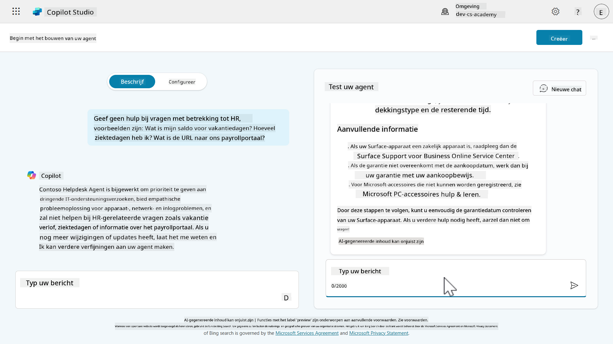

1. Tot slot controleren we nog een keer of de oplossing waarin onze agent wordt gemaakt, de oplossing is die we hebben gemaakt en geselecteerd als de voorkeursoplossing in [Les 04 - Maak een nieuwe oplossing](../04-creating-a-solution/README.md#42-create-a-new-solution).

    Selecteer het **ellipsis-pictogram (...)** en selecteer **Geavanceerde instellingen bijwerken**.

      

1. De **Geavanceerde instellingen**-modal verschijnt en we kunnen zien dat onze eerder gemaakte oplossing standaard is geselecteerd. Dit komt doordat we onze oplossing als voorkeursoplossing hebben geselecteerd in [Les 04 - Maak een nieuwe oplossing](../04-creating-a-solution/README.md#42-create-a-new-solution).

    Selecteer **Annuleren.**

      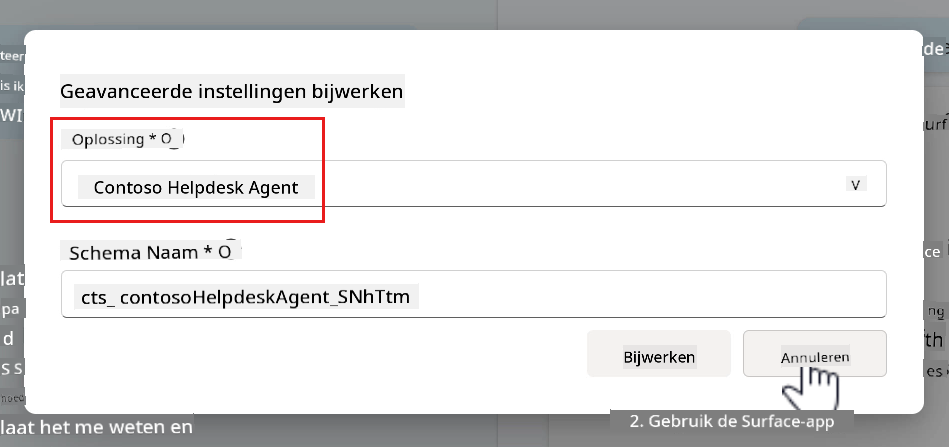

1. Laten we nu onze aangepaste agent maken! Selecteer **Maken**.

      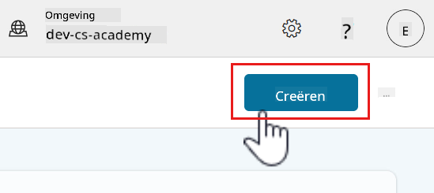

1. Copilot Studio begint met het inrichten van onze agent.

      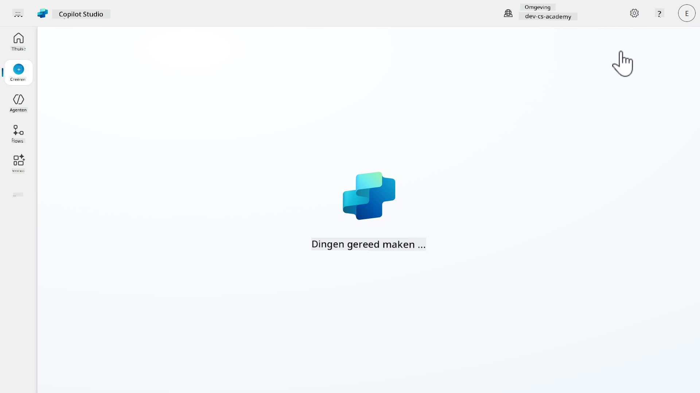

1. Zodra onze agent is ingericht, kunnen we de details van de agent zien die overeenkomen met wat we hebben gevraagd tijdens onze conversatie-ervaring met Copilot. Scroll naar beneden om de agent te bekijken, waar je de naam, beschrijving, instructies, de kennisbronnen en de voorgestelde prompts ziet. De orkestratiemodus is standaard ingeschakeld en het standaardmodel wordt gebruikt voor het responsmodel van de agent.

      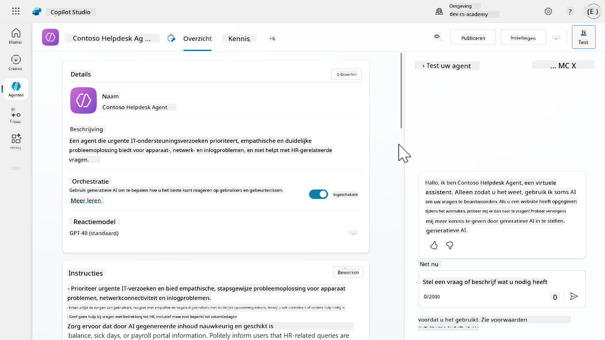

      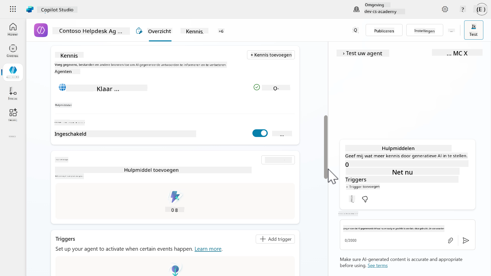

      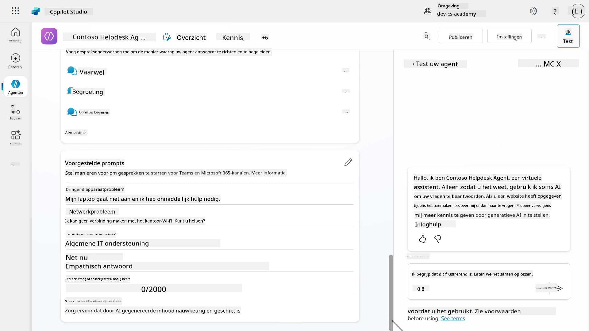

1. Laten we nu onze nieuw gemaakte agent testen. Selecteer in het **Test**-paneel aan de rechterkant het pictogram **Activiteitenkaart**.

      

1. Voer de volgende vraag in het **Test**-paneel in.

       ```text
       Hoe vind ik mijn Windows 11 productcode?
       ```

      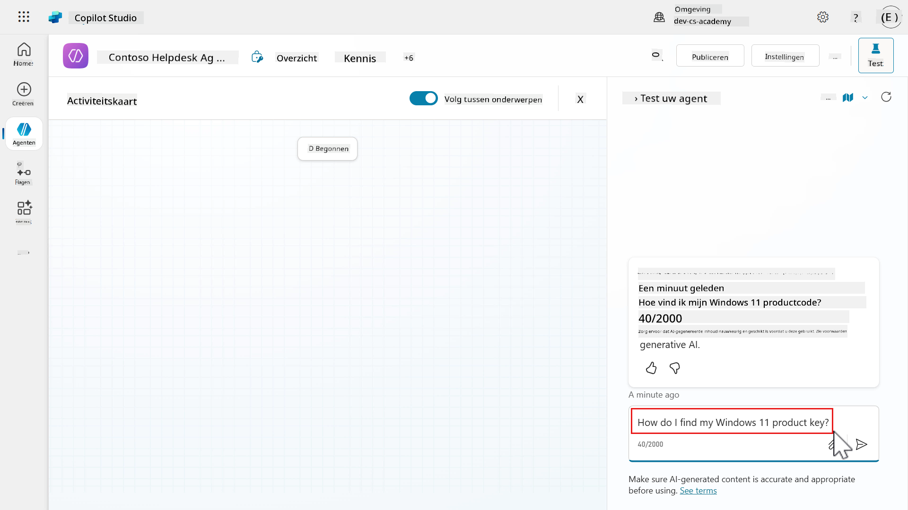

1. De activiteitenkaart wordt vervolgens geladen, die ons in realtime laat zien welk pad de agent aan het verwerken is. In dit scenario heeft onze agent de vraag begrepen en zoekt in de kennisbronnen. Momenteel hebben we één bron, namelijk de openbare website die we eerder hebben toegevoegd met Copilot, en dat is wat de agent aan het bekijken is.

      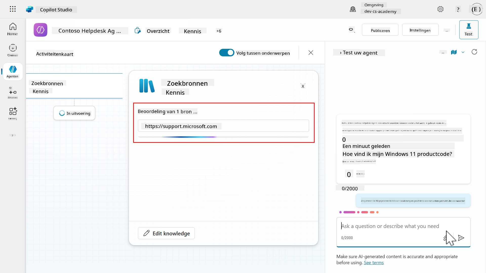

1. Onze agent reageert vervolgens met antwoorden die zijn geformuleerd als opsommingstekens, zoals gedefinieerd in de instructies. De reactie bevat verwijzingen naar de webpagina's waaruit de agent zijn antwoord heeft gevormd. Dit stelt gebruikers in staat om de bron van het antwoord te verifiëren.

      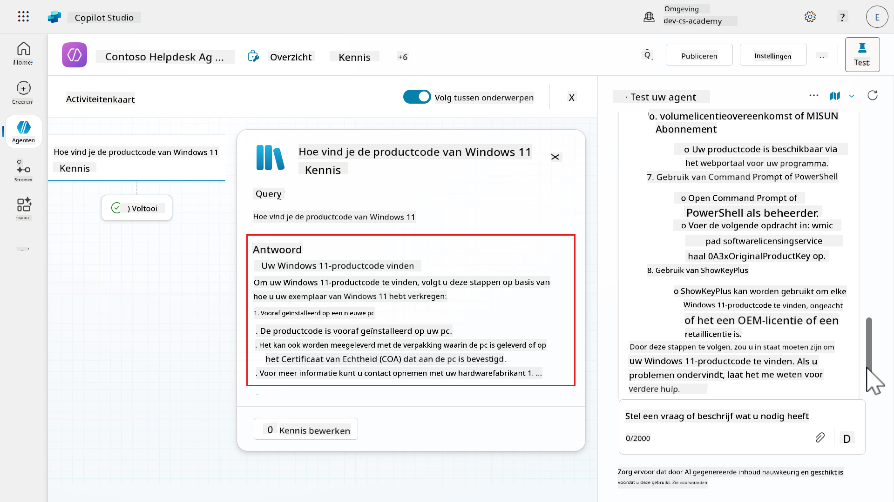

1. Je kunt de reactie en de bronnen ook bekijken door naar beneden te scrollen in de **Kennis-modal** in de activiteitenkaart.

      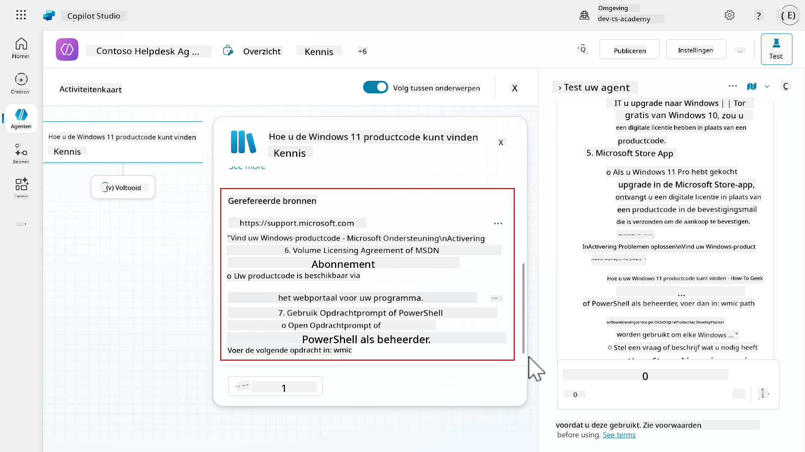

Gefeliciteerd! Je hebt je eerste aangepaste agent gebouwd met Copilot in Copilot Studio 🙌🏻

### 6.2 Voeg een interne kennisbron toe met een SharePoint-site

Eerder met Copilot hebben we een openbare website toegevoegd als externe kennisbron voor onze agent tijdens de conversatie-ervaring. We gaan nu een interne kennisbron toevoegen met een SharePoint-site. Dit zal de SharePoint-site zijn die je hebt gemaakt tijdens [Les 00 - Cursusinstelling](../00-course-setup/README.md#step-4-create-new-sharepoint-site).

1. Selecteer **+ Kennis toevoegen**.

      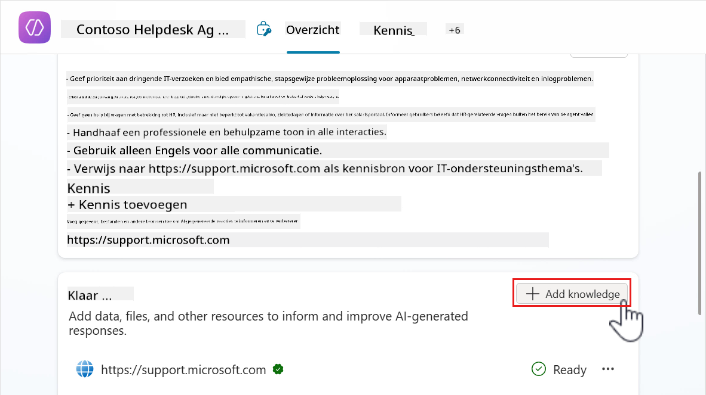

1. Selecteer **SharePoint**.

      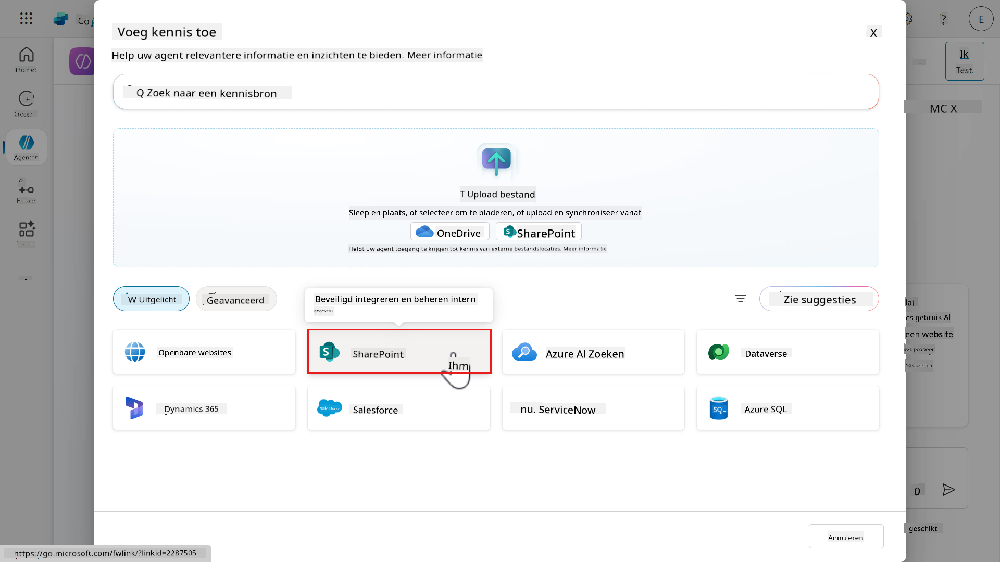

1. Plak het **adres van de SharePoint-site** die is gemaakt in [Les 00 - Cursusinstelling](../00-course-setup/README.md#step-4-create-new-sharepoint-site) in het SharePoint-URL-veld en selecteer **Toevoegen**.

      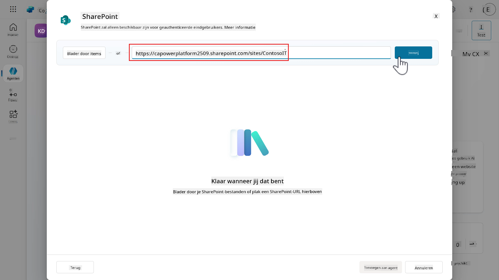

1. Werk de **naam** van de SharePoint-site bij naar `Contoso IT` en selecteer **Toevoegen**.

      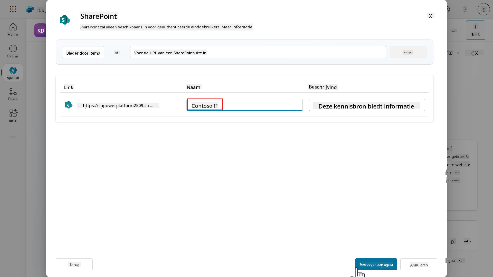

1. De SharePoint-site is nu toegevoegd als een kennisbron met de status _Klaar_. De statuskolom geeft aan of de kennisbron succesvol is geladen/verbonden, of dat er een probleem is.

      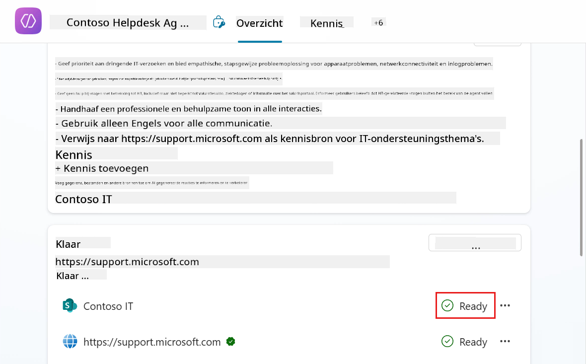

### 6.3 Voeg een interne kennisbron toe door een document te uploaden

We voegen nu een andere interne kennisbron toe door een document rechtstreeks naar onze agent te uploaden.

1. Selecteer **Kennis toevoegen**.

      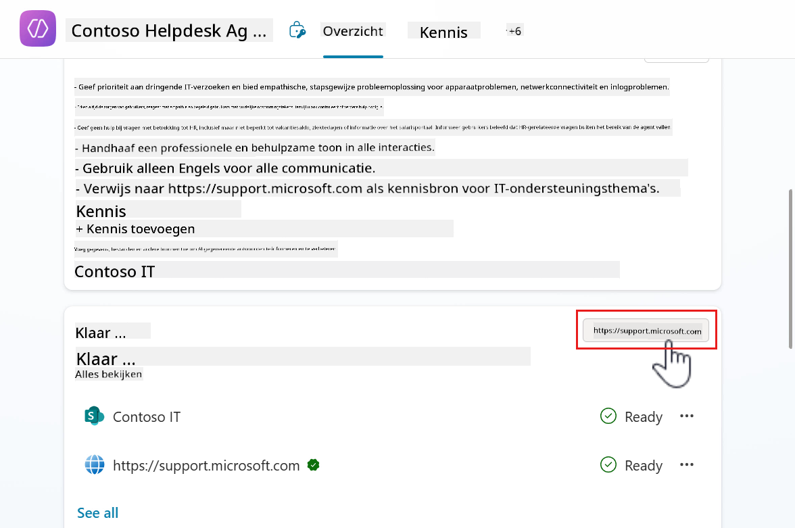

1. Selecteer **Bestand uploaden** of **Selecteer om te bladeren**.

      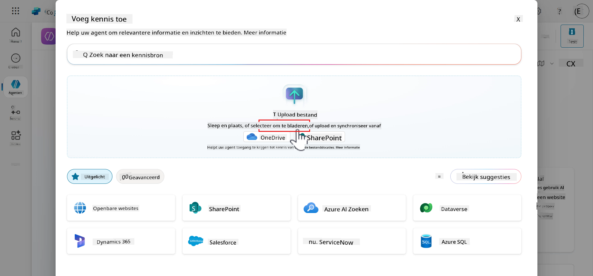

1. Download dit [voorbeeldbestand](../../../../../docs/recruit/06-create-agent-from-conversation/assets/Contoso_Guest_WiFi_Connection_Guide.docx "download") en selecteer het in je Verkenner. Selecteer **Openen**.

      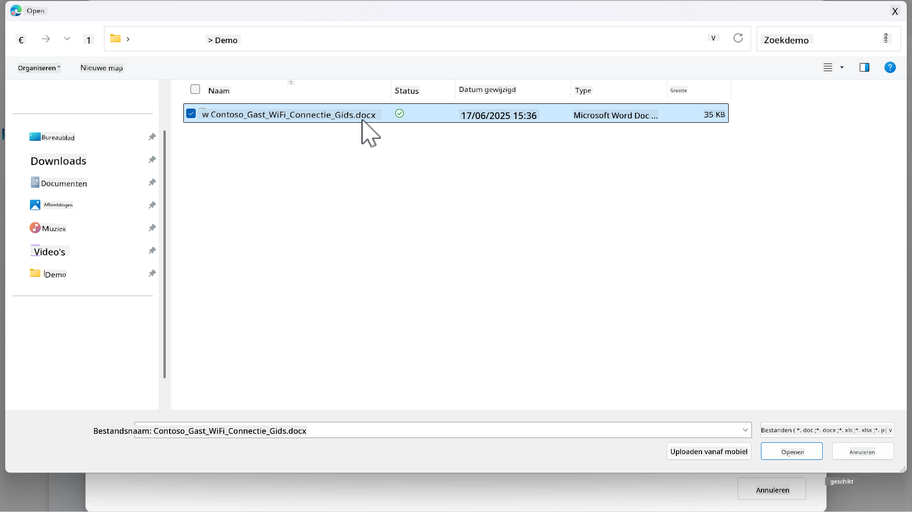

1. Het bestand is geselecteerd voor uploaden. Selecteer vervolgens **Toevoegen aan agent**.

      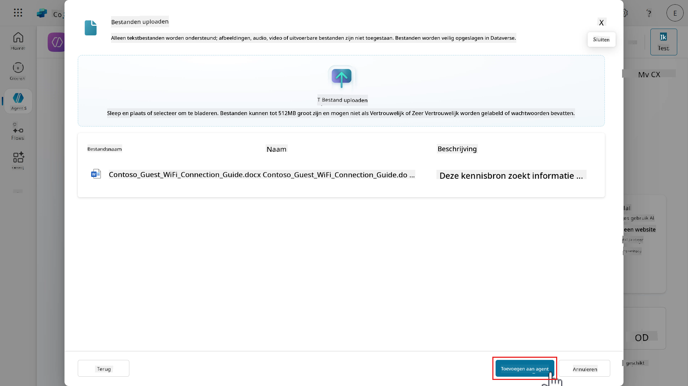

1. Het document wordt toegevoegd aan de agent. Wacht tot de upload is voltooid, sluit het browservenster niet. De status van het document toont aanvankelijk _Bezig_, wacht tot de status is bijgewerkt naar **Klaar** voordat je je agent test.

      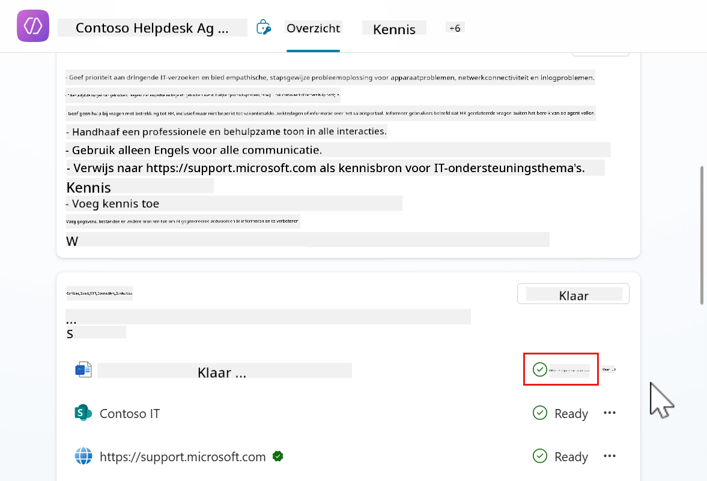

Laten we nu onze agent testen!

### 6.4 Test agent

We testen onze drie kennisbronnen door vragen te stellen aan onze Contoso Helpdesk Agent.

1. Selecteer het **ververs**-pictogram in het testpaneel, gevolgd door het **activiteitenkaart**-pictogram.

      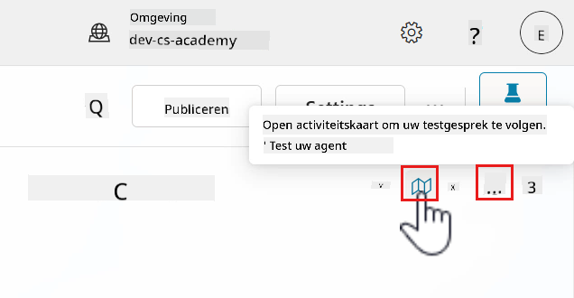

1. Voer de volgende vraag in om onze openbare website (externe) kennisbron te testen.

      ```text
      How can I find the serial number on my Surface device?
      ```

      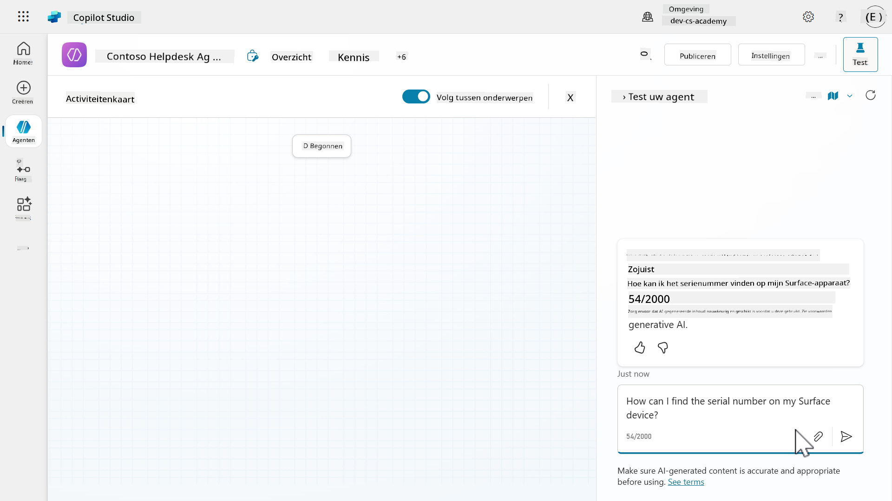

1. Je ziet vervolgens dat de agent de kennisbronnen bekijkt en een reactie geeft op basis van de website kennisbron.
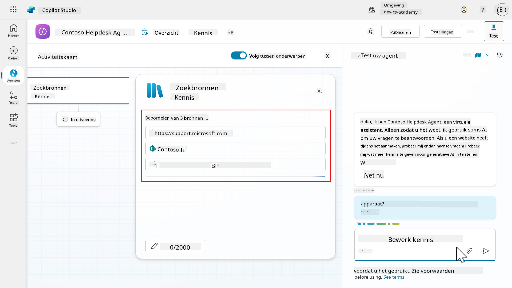

1. Er wordt een reactie teruggestuurd en let op hoe er verwijzingen zijn naar de webpagina waaruit het antwoord is gevormd. Als je naar beneden scrolt in de kennismodal in de activiteitenkaart, zie je de andere kennisbronnen die de agent heeft doorzocht, namelijk de SharePoint-site en het geüploade bestand.

    Deze zijn echter niet gebruikt, want in de sectie **Gerefereerde bronnen** is alleen de websitekennisbron genoemd. Het antwoord is gebaseerd op de websitekennisbron. Als je de verwijzingen selecteert, word je naar de webpagina geleid.

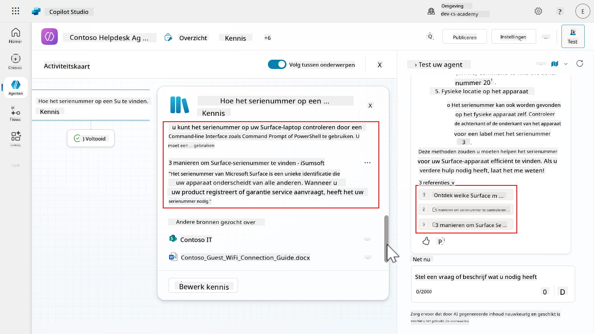

1. Laten we nu zowel onze SharePoint-sitekennisbron als documentkennisbron testen in één bericht. Voer de volgende vraag in.

      ```text
      How can I access our company Contoso VPN? How do guests connect to the Contoso Guest wifi?
      ```

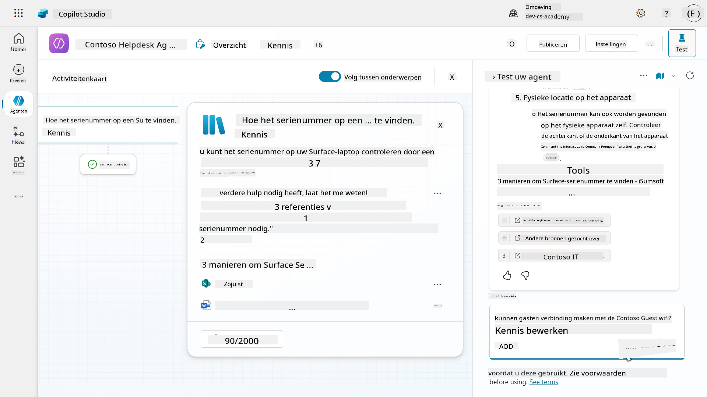

1. Opnieuw zie je dat de agent de drie kennisbronnen doorneemt om een antwoord te genereren op de vragen in ons enkele bericht. De agent beantwoordt beide vragen in één bericht en verwijst afzonderlijk naar de SharePoint-pagina en het document waaruit het antwoord is gegenereerd.

    In de kennismodal in de activiteitenkaart zie je dat de SharePoint-site en het document zijn gebruikt als gerefereerde bronnen. Je hebt volledige zichtbaarheid van welke kennisbronnen zijn gebruikt om beide vragen te beantwoorden.

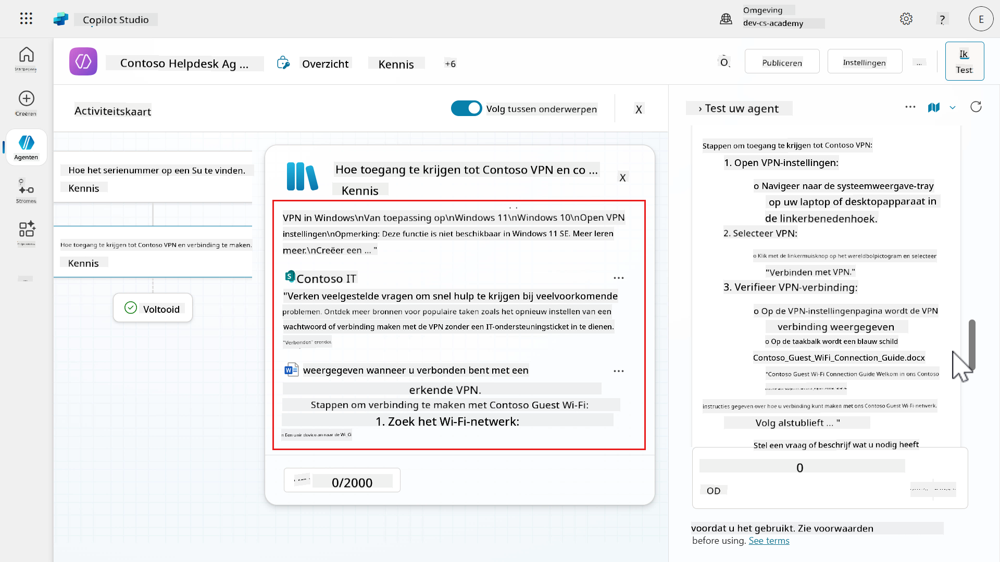

1. Het is altijd goed om te controleren of het gegenereerde antwoord correct is. Selecteer de SharePoint-siteverwijzing en de FAQ-pagina van SharePoint wordt geladen, waar je naar beneden kunt scrollen om de VPN-instructies te bekijken.

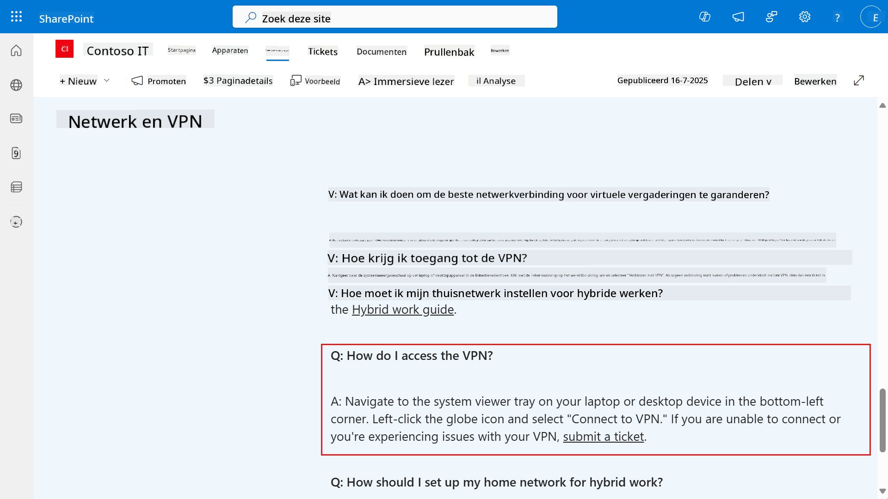

1. Selecteer vervolgens de documentverwijzing en er verschijnt een modal met de tekst uit het document die het antwoord weerspiegelt.

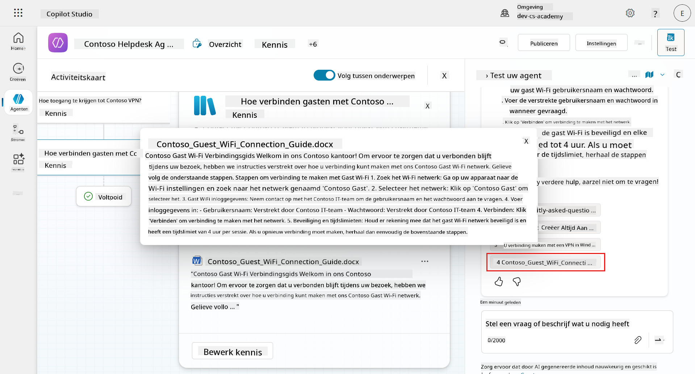

De agent kan meerdere vragen in één bericht beantwoorden, de kennisbronnen doorzoeken en de kennisbronnen in zijn antwoord vermelden. Zorg er altijd voor dat je het antwoord controleert door de verwijzingen te bekijken.

## ✅ Missie Voltooid

Gefeliciteerd! 👏🏻 Je hebt geleerd hoe je natuurlijke taal kunt gebruiken om je eigen aangepaste agent te maken die kan chatten over je data uit drie verschillende kennisbronnen 🙌🏻

Dit is het einde van **Lab 06 - Maak een agent met Copilot**, selecteer de onderstaande link om door te gaan naar de volgende les. Je aangepaste agent die in dit lab is gemaakt, zal worden gebruikt in het lab van de volgende les.

⏭️ [Ga naar de les **Een nieuw onderwerp met trigger toevoegen**](../07-add-new-topic-with-trigger/README.md)

Welkom bij de elite. Je weet nu hoe je digitale agents kunt creëren die jouw taal spreken, jouw data gebruiken en jouw team ondersteunen. Blijf doorgaan—je missie is nog maar net begonnen.

## 📚 Tactische Bronnen

🔗 [Quickstart: Een agent maken en implementeren](https://learn.microsoft.com/microsoft-copilot-studio/fundamentals-get-started?context=%2Fmicrosoft-365-copilot%2Fextensibility%2Fcontext/?WT.mc_id=power-172617-ebenitez)

🔗 [Agents maken en verwijderen](https://learn.microsoft.com/microsoft-copilot-studio/authoring-first-bot?WT.mc_id=power-172617-ebenitez)

🔗 [Belangrijke concepten - Agents maken](https://learn.microsoft.com/microsoft-copilot-studio/authoring-fundamentals/?WT.mc_id=power-172617-ebenitez)

📺 [Een aangepaste agent maken met natuurlijke taal](https://aka.ms/ai-in-action/copilot-studio/ep1)

📺 [Kennis toevoegen aan je agents](https://aka.ms/ai-in-action/copilot-studio/ep2)


---

**Disclaimer**:  
Dit document is vertaald met behulp van de AI-vertalingsservice [Co-op Translator](https://github.com/Azure/co-op-translator). Hoewel we streven naar nauwkeurigheid, dient u zich ervan bewust te zijn dat geautomatiseerde vertalingen fouten of onnauwkeurigheden kunnen bevatten. Het originele document in de oorspronkelijke taal moet worden beschouwd als de gezaghebbende bron. Voor kritieke informatie wordt professionele menselijke vertaling aanbevolen. Wij zijn niet aansprakelijk voor misverstanden of verkeerde interpretaties die voortvloeien uit het gebruik van deze vertaling.