<!--
CO_OP_TRANSLATOR_METADATA:
{
  "original_hash": "cd99a76bcb7372ac2771b6ae178b023d",
  "translation_date": "2025-10-17T01:39:43+00:00",
  "source_file": "docs/recruit/10-add-event-triggers/README.md",
  "language_code": "nl"
}
-->
# 🚨 Missie 10: Voeg Event Triggers toe - Schakel autonome agentmogelijkheden in

## 🕵️‍♂️ CODENAAM: `OPERATIE GHOST ROUTINE`

> **⏱️ Operatietijdvenster:** `~45 minuten`

🎥 **Bekijk de walkthrough**

[](https://www.youtube.com/watch?v=ZgwHL8PQ1nY "Bekijk de walkthrough op YouTube")

## 🎯 Missieoverzicht

Het is tijd om je agent te upgraden van een conversatie-assistent naar een autonome operatieve eenheid. Jouw missie is om je agent in staat te stellen te handelen zonder dat hij wordt opgeroepen - met precisie en snelheid reageren op signalen vanuit je digitale domein.

Met Event Triggers train je je agent om externe systemen zoals SharePoint, Teams en Outlook te monitoren en intelligente acties uit te voeren zodra een signaal wordt ontvangen. Deze operatie transformeert je agent in een volledig operationele veldagent - stil, snel en altijd alert.

Succes betekent het bouwen van agents die waarde initiëren - niet alleen erop reageren.

## 🔎 Doelstellingen

📖 Deze les behandelt:

- Begrijpen wat Event Triggers zijn en hoe ze autonoom gedrag van agents mogelijk maken
- Leren wat het verschil is tussen event triggers en topic triggers, inclusief trigger workflows en payloads
- Verkennen van veelvoorkomende scenario's met Event Triggers
- Begrijpen van authenticatie, beveiliging en publicatieoverwegingen voor event-gedreven agents
- Bouwen van een autonome IT Helpdesk-agent die reageert op SharePoint-events en e-mailbevestigingen verstuurt

## 🤔 Wat is een Event Trigger?

Een **Event Trigger** is een mechanisme waarmee je agent autonoom kan handelen in reactie op externe gebeurtenissen, zonder directe gebruikersinput. Zie het als een manier om je agent "te laten kijken" naar specifieke gebeurtenissen en automatisch actie te ondernemen wanneer die gebeurtenissen plaatsvinden.

In tegenstelling tot topic triggers, die vereisen dat gebruikers iets typen om een gesprek te starten, worden event triggers geactiveerd door gebeurtenissen in je verbonden systemen. Bijvoorbeeld:

- Wanneer een nieuw bestand wordt aangemaakt in SharePoint of OneDrive for Business
- Wanneer een record wordt aangemaakt in Dataverse
- Wanneer een taak wordt voltooid in Planner
- Wanneer een nieuwe Microsoft Form-reactie wordt ingediend
- Wanneer een nieuw Microsoft Teams-bericht wordt toegevoegd
- Op basis van een terugkerend schema (zoals dagelijkse herinneringen)  
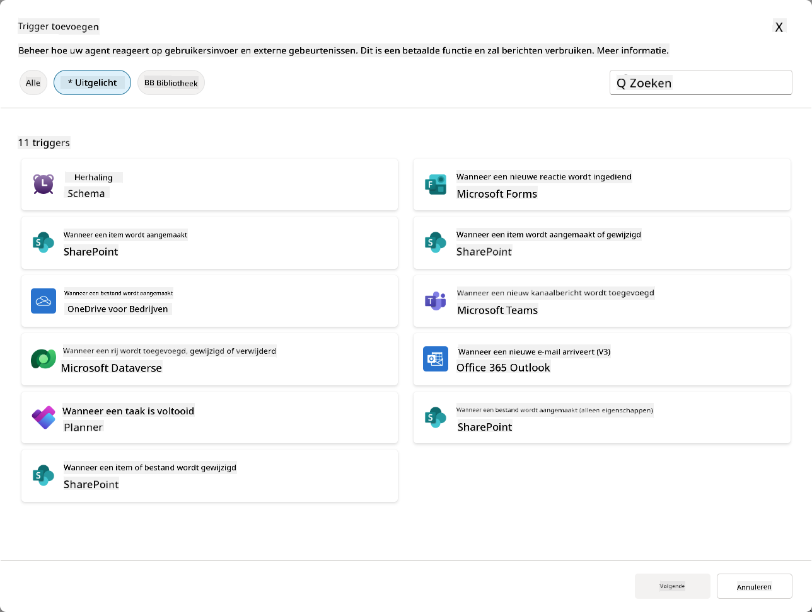

### Waarom Event Triggers belangrijk zijn voor autonome agents

Event triggers transformeren je agent van een reactieve assistent naar een proactieve, autonome helper:

1. **Autonome werking** - je agent kan 24/7 werken zonder menselijke tussenkomst, en reageert op gebeurtenissen zodra ze plaatsvinden.
    - *Voorbeeld:* Nieuwe teamleden automatisch welkom heten wanneer ze aan een team worden toegevoegd.

1. **Realtime responsiviteit** - in plaats van te wachten tot gebruikers vragen stellen, reageert je agent onmiddellijk op relevante gebeurtenissen.
    - *Voorbeeld*: Waarschuw het IT-team wanneer een SharePoint-document wordt gewijzigd.

1. **Workflow-automatisering** - koppel meerdere acties aan één triggergebeurtenis.
    - *Voorbeeld:* Wanneer een nieuw supportticket wordt aangemaakt, maak een taak aan, informeer de manager en werk het trackingdashboard bij.

1. **Consistente processen** - zorg ervoor dat belangrijke stappen nooit worden overgeslagen door reacties op belangrijke gebeurtenissen te automatiseren.
    - *Voorbeeld:* Elke nieuwe medewerker ontvangt automatisch onboarding-materialen en toegangsverzoeken.

1. **Data-gedreven acties** - gebruik informatie van de triggergebeurtenis om slimme beslissingen te nemen en passende acties te ondernemen.
    - *Voorbeeld:* Stuur urgente tickets naar senior medewerkers op basis van het prioriteitsniveau in de trigger-payload.

## ⚙️ Hoe werken Event Triggers?

Event triggers werken via een workflow in drie stappen die je agent in staat stelt autonoom te reageren op externe gebeurtenissen:

### De trigger workflow

1. **Detectie van gebeurtenis** - Een specifieke gebeurtenis vindt plaats in een verbonden systeem (SharePoint, Teams, Outlook, etc.)
1. **Activatie van trigger** - De event trigger detecteert deze gebeurtenis en stuurt een payload naar je agent via een Power Automate Cloud Flow.
1. **Reactie van agent** - Je agent ontvangt de payload en voert de door jou gedefinieerde instructies uit.

### Event triggers versus topic triggers

Het begrijpen van het verschil tussen deze twee soorten triggers is cruciaal:

| **Event Triggers** | **Topic Triggers** |
|-------------------|-------------------|
| Geactiveerd door externe systeemgebeurtenissen | Geactiveerd door gebruikersinput/zinnen |
| Maakt autonoom gedrag van agents mogelijk | Maakt conversatiereacties mogelijk |
| Gebruikt authenticatie van de maker | Optie voor authenticatie van de gebruiker |
| Werkt zonder gebruikersinteractie | Vereist dat de gebruiker een gesprek start |
| Voorbeelden: Bestand aangemaakt, e-mail ontvangen | Voorbeeld: "Wat is het weer?" |

## 📦 Begrijpen van trigger-payloads

Wanneer een gebeurtenis plaatsvindt, stuurt de trigger een **payload** naar je agent met informatie over de gebeurtenis en instructies over hoe te reageren.

### Standaard versus aangepaste payloads

Elke trigger type heeft een standaard payloadstructuur, maar je kunt deze aanpassen:

**Standaard payload** - Gebruikt het standaardformaat zoals `Gebruik inhoud van {Body}`

- Bevat basisinformatie over de gebeurtenis
- Gebruikt generieke verwerkingsinstructies
- Geschikt voor eenvoudige scenario's

**Aangepaste payload** - Voeg specifieke instructies en gegevensformattering toe

- Bevat gedetailleerde richtlijnen voor je agent
- Specificeert precies welke gegevens te gebruiken en hoe
- Beter voor complexe workflows

### Agent-instructies versus aangepaste payload-instructies

Je hebt twee plekken om het gedrag van je agent te sturen met event triggers:

**Agent-instructies** (Globaal)

- Brede richtlijnen die van toepassing zijn op alle triggers
- Voorbeeld: "Bij het verwerken van tickets, controleer altijd eerst op duplicaten"
- Beste voor algemene gedragspatronen

**Payload-instructies** (Trigger-specifiek)

- Specifieke richtlijnen voor individuele trigger types  
- Voorbeeld: "Voor deze SharePoint-update, stuur een samenvatting naar het projectkanaal"
- Beste voor complexe agents met meerdere triggers

💡 **Pro tip**: Vermijd conflicterende instructies tussen deze twee niveaus, omdat dit onverwacht gedrag kan veroorzaken.

## 🎯 Veelvoorkomende scenario's met Event Triggers

Hier zijn praktische voorbeelden van hoe event triggers je agent kunnen verbeteren:

### IT Helpdesk Agent

- **Trigger**: Nieuw SharePoint-lijstitem (supportticket)
- **Actie**: Automatisch categoriseren, prioriteit toewijzen en relevante teamleden informeren

### Medewerker Onboarding Agent

- **Trigger**: Nieuwe gebruiker toegevoegd aan Dataverse
- **Actie**: Stuur welkomstbericht, maak onboarding-taken aan en regel toegang

### Projectmanagement Agent

- **Trigger**: Taak voltooid in Planner
- **Actie**: Werk projectdashboard bij, informeer belanghebbenden en controleer op blokkades

### Documentbeheer Agent

- **Trigger**: Bestand geüpload naar specifieke SharePoint-map
- **Actie**: Metadata extraheren, tags toepassen en documenteigenaren informeren

### Vergaderassistent Agent

- **Trigger**: Agenda-item aangemaakt
- **Actie**: Stuur herinneringen en agenda voorafgaand aan de vergadering, boek middelen

## ⚠️ Publicatie- en authenticatieoverwegingen

Voordat je agent event triggers in productie kan gebruiken, moet je de authenticatie- en beveiligingsimplicaties begrijpen.

### Authenticatie van de maker

Event triggers gebruiken de **referenties van de agentmaker** voor alle authenticatie:

- Je agent heeft toegang tot systemen met jouw machtigingen
- Gebruikers kunnen mogelijk toegang krijgen tot gegevens via jouw referenties
- Alle acties worden uitgevoerd "als jij" zelfs wanneer gebruikers met de agent interageren

### Beste praktijken voor gegevensbescherming

Om de beveiliging te handhaven bij het publiceren van agents met event triggers:

1. **Evalueer gegevens toegang** - Controleer welke systemen en gegevens je triggers kunnen benaderen
1. **Test grondig** - Begrijp welke informatie triggers bevatten in payloads
1. **Beperk triggerbereik** - Gebruik specifieke parameters om te beperken welke gebeurtenissen triggers activeren
1. **Controleer payloadgegevens** - Zorg ervoor dat triggers geen gevoelige informatie blootgeven
1. **Monitor gebruik** - Volg triggeractiviteit en resourceverbruik

## ⚠️ Problemen oplossen en beperkingen

Houd deze belangrijke overwegingen in gedachten bij het werken met event triggers:

### Quota- en factureringsimpact

- Elke triggeractivatie telt mee voor je berichtverbruik
- Frequente triggers (zoals elke minuut herhaling) kunnen snel quota verbruiken
- Monitor gebruik om throttling te voorkomen

### Technische vereisten

- Alleen beschikbaar voor agents met generatieve orkestratie ingeschakeld
- Vereist oplossing-bewuste cloud flow sharing in je omgeving

### Data Loss Prevention (DLP)

- DLP-beleid van je organisatie bepaalt welke triggers beschikbaar zijn
- Beheerders kunnen event triggers volledig blokkeren
- Neem contact op met je beheerder als verwachte triggers niet beschikbaar zijn

## 🧪 Lab 10 - Voeg Event Triggers toe voor autonoom agentgedrag

### 🎯 Gebruiksscenario

Je zult je IT Helpdesk-agent verbeteren om automatisch te reageren op nieuwe supportverzoeken. Wanneer iemand een nieuw item aanmaakt in je SharePoint-supportticketslijst, zal je agent:

1. Autonoom activeren wanneer het SharePoint-ticket wordt aangemaakt
1. De ticketdetails en instructies geven over de stappen die je wilt dat het uitvoert
1. Het ticket automatisch bevestigen aan de indiener via een AI gegenereerde e-mail

Dit lab demonstreert hoe event triggers echt autonoom agentgedrag mogelijk maken.

### Vereisten

Voordat je dit lab start, zorg ervoor dat je:

- ✅ Eerdere labs hebt voltooid (vooral Lab 6-8 voor de IT Helpdesk-agent)
- ✅ Toegang hebt tot de SharePoint-site met de IT-supportticketslijst
- ✅ Copilot Studio-omgeving met event triggers ingeschakeld
- ✅ Je agent generatieve orkestratie heeft ingeschakeld
- ✅ Geschikte machtigingen hebt in SharePoint en je Copilot Studio-omgeving

### 10.1 Schakel Generatieve AI in en maak een SharePoint-itemcreatietrigger

1. Open je **IT Helpdesk-agent** in **Copilot Studio**

1. Zorg er eerst voor dat **Generatieve AI** is ingeschakeld voor je agent:
   - Navigeer naar het **Overzicht**-tabblad
   - Onder het Orkestratiegedeelte, schakel **Generatieve orkestratie** in als deze nog niet is ingeschakeld  
     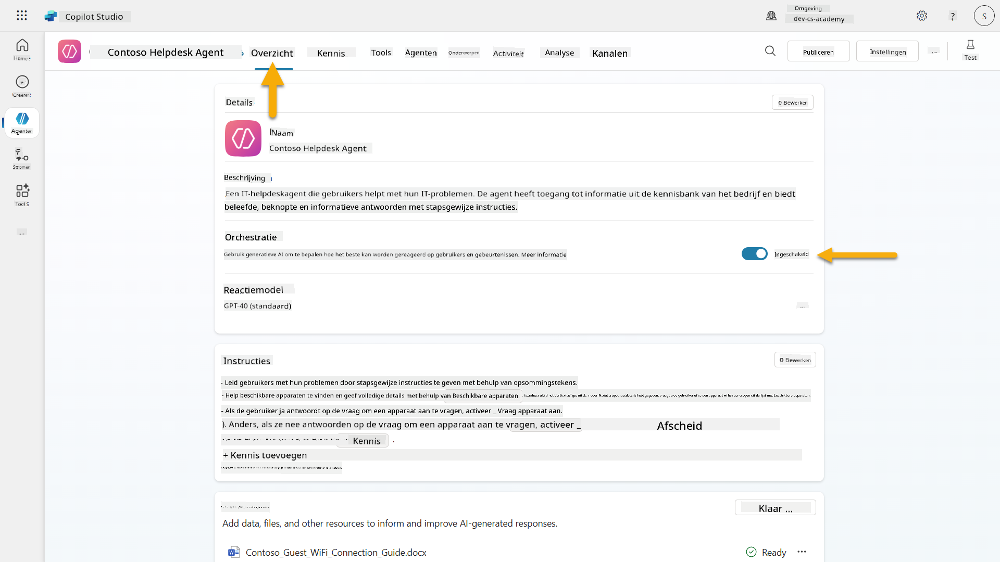

1. Navigeer naar het **Overzicht**-tabblad en zoek het **Triggers**-gedeelte

1. Klik op **+ Trigger toevoegen** om de triggerbibliotheek te openen  
    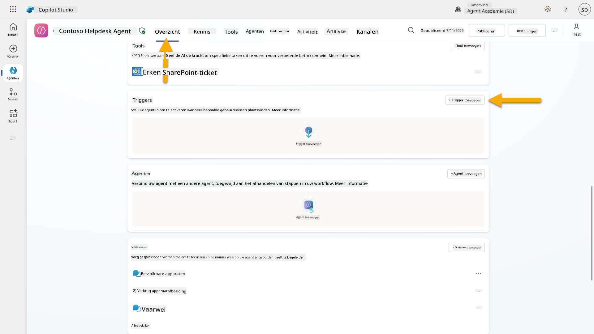

1. Zoek en selecteer **Wanneer een item wordt aangemaakt** (SharePoint)  
    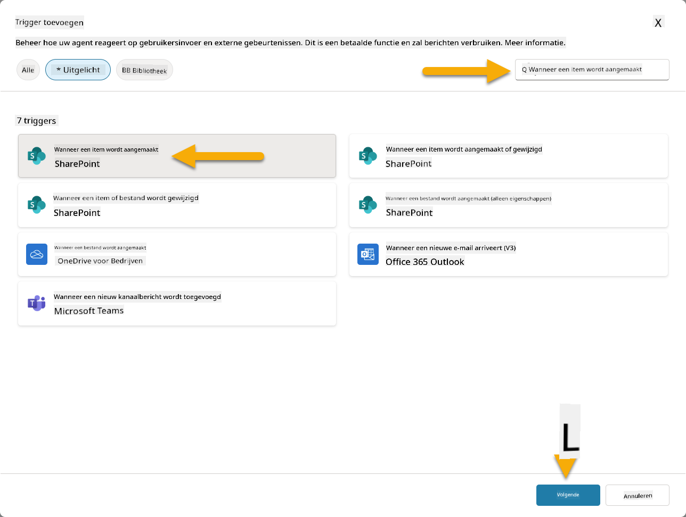

1. Configureer de triggernaam en verbindingen:

   - **Triggernaam:** Nieuw Support Ticket Aangemaakt in SharePoint

1. Wacht tot de verbindingen zijn geconfigureerd en selecteer **Volgende** om door te gaan.  
   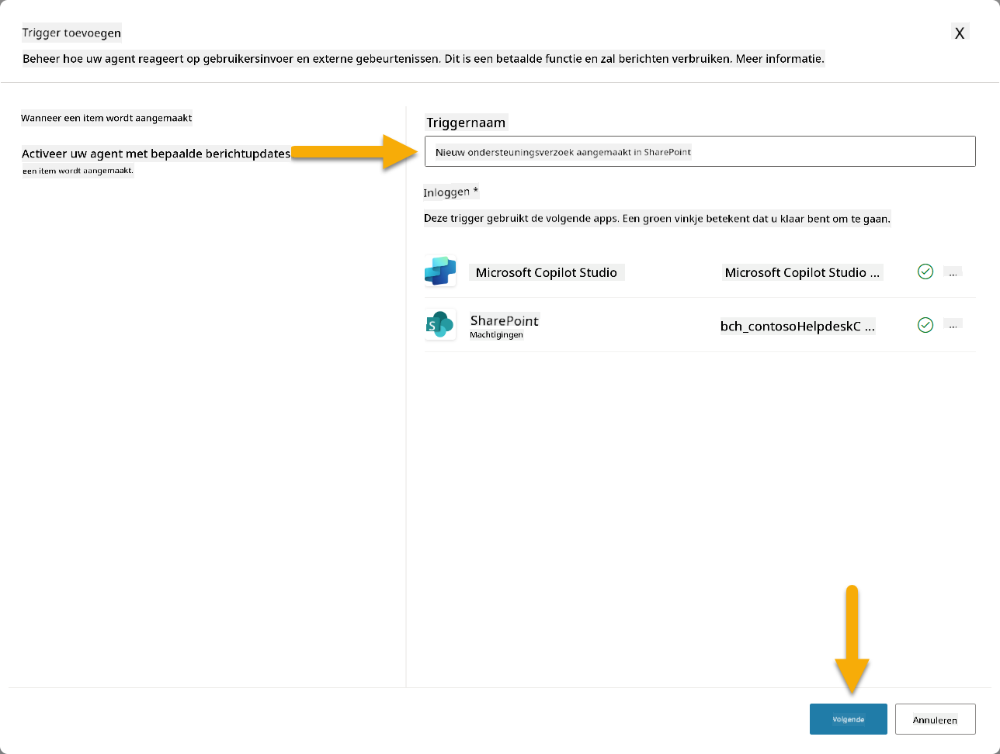

1. Configureer de triggerparameters:

   - **Siteadres**: Selecteer je "Contoso IT" SharePoint-site

   - **Lijstnaam**: Kies je "Tickets"-lijst

   - **Aanvullende instructies aan de agent wanneer deze wordt geactiveerd door de trigger:**

     ```text
     New Support Ticket Created in SharePoint: {Body}
     
     Use the 'Acknowledge SharePoint Ticket' tool to generate the email body automatically and respond.
     
     IMPORTANT: Do not wait for any user input. Work completely autonomously.
     ```

     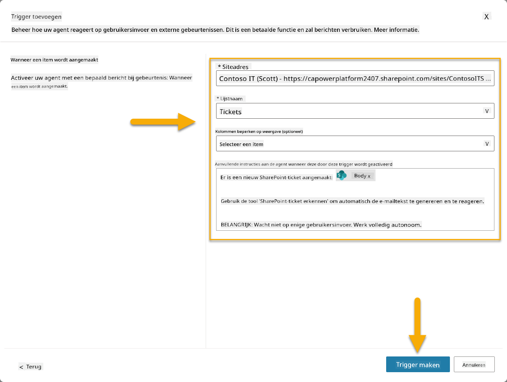

1. Selecteer **Trigger maken** om de triggercreatie te voltooien. Er wordt automatisch een Power Automate Cloud Flow aangemaakt om de agent autonoom te activeren.

1. Selecteer **Sluiten**.

### 10.2 Bewerk de Trigger

1. Binnen het **Triggers**-gedeelte van het **Overzicht**-tabblad, selecteer het **...**-menu op de trigger **Nieuw Support Ticket Aangemaakt in SharePoint**

1. Selecteer **Bewerken in Power Automate**  
   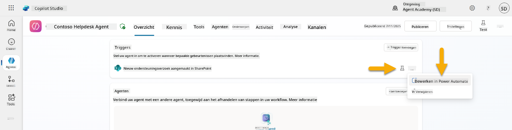

1. Selecteer de **Verzendt een prompt naar de opgegeven copilot voor verwerking**-node

1. In het veld **Body/bericht**, verwijder de inhoud van Body, **druk op de schuine streep-toets** (/) en selecteer **Expressie invoegen**  
   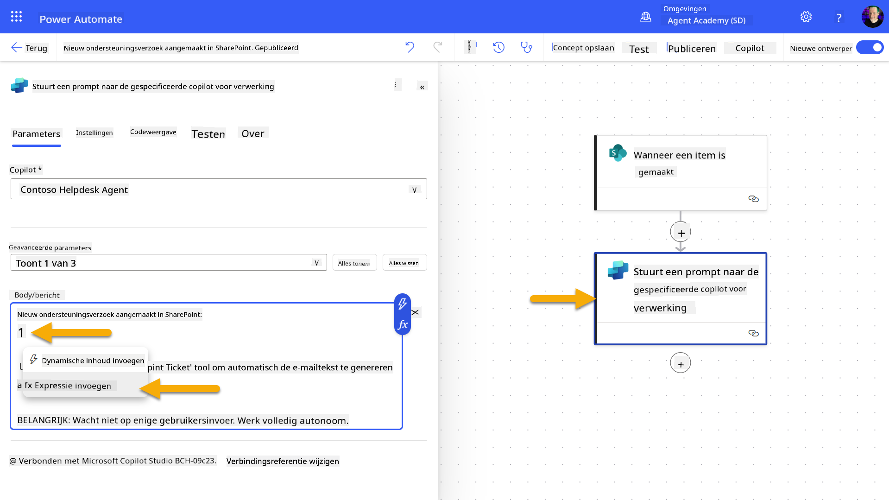

1. Voer de volgende expressie in om de agent specifieke details over het ticket te geven:

    ```text
    concat('Submitted By Name: ', first(triggerOutputs()?['body/value'])?['Author/DisplayName'], '\nSubmitted By Email: ', first(triggerOutputs()?['body/value'])?['Author/Email'], '\nTitle: ', first(triggerOutputs()?['body/value'])?['Title'], '\nIssue Description: ', first(triggerOutputs()?['body/value'])?['Description'], '\nPriority: ', first(triggerOutputs()?['body/value'])?['Priority/Value'],'\nTicket ID : ', first(triggerOutputs()?['body/value'])?['ID'])
    ```

1. Selecteer **Toevoegen**  
   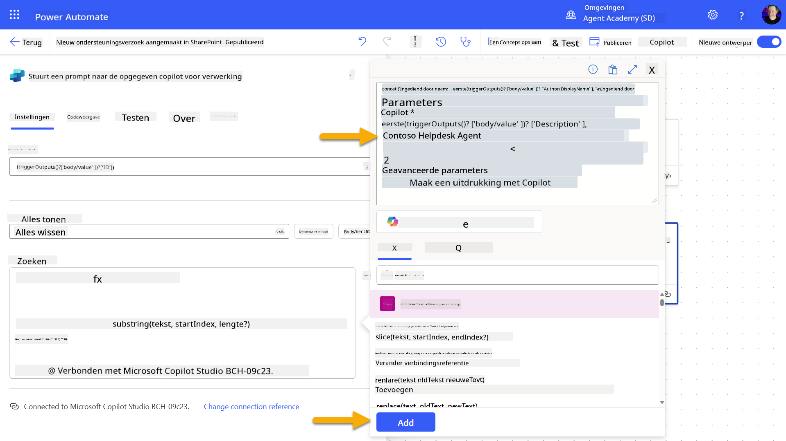

1. Selecteer **Publiceren** in de rechterbovenhoek van de werkbalk.

### 10.3 Maak een tool voor e-mailbevestiging

1. **Keer terug** naar je Agent in Copilot Studio

1. Navigeer naar het **Tools**-tabblad in je agent

1. Klik op **+ Een tool toevoegen** en selecteer **Connector**

1. Zoek en selecteer de connector **E-mail verzenden (V2)**  
    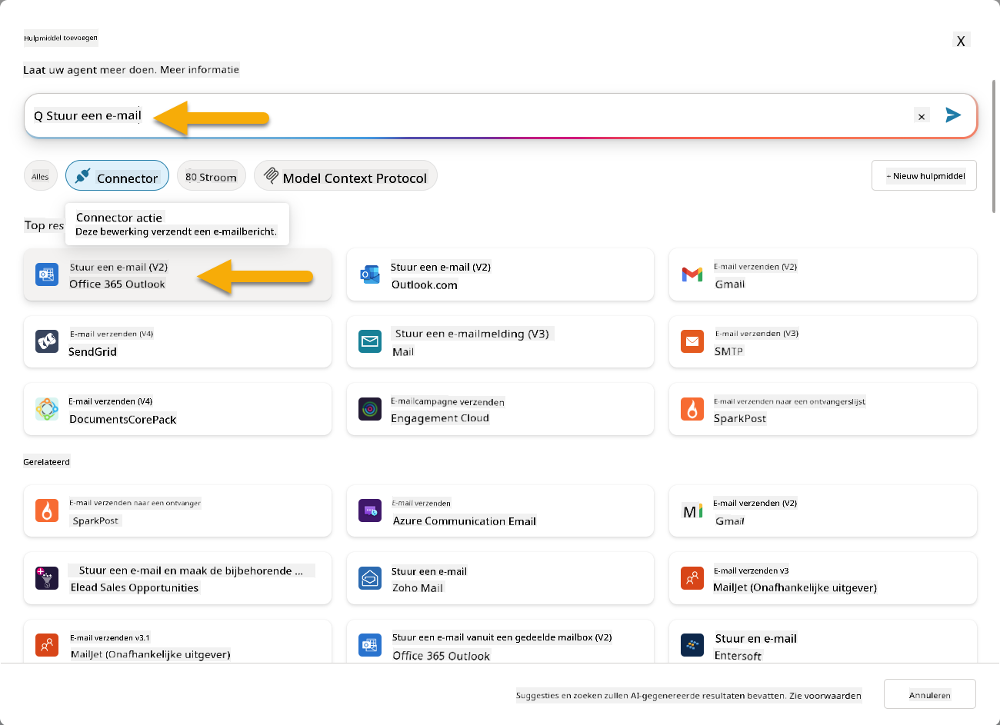

1. Wacht tot de verbinding is geconfigureerd en selecteer vervolgens **Toevoegen en configureren**

1. Configureer de toolinstellingen:

   - **Naam**: Bevestig SharePoint-ticket
   - **Beschrijving**: Deze tool verstuurt een e-mailbevestiging dat een ticket is ontvangen.

1. Selecteer **Aanpassen** naast de invoerparameters en configureer als volgt:

    **Aan**:

    - **Beschrijving**: Het e-mailadres van de persoon die het SharePoint-ticket indient
    - **Identificeer als**: E-mail

    **Body**:

    - **Beschrijving**: Een bevestiging dat het ticket is ontvangen en dat we binnen 3 werkdagen zullen reageren.

    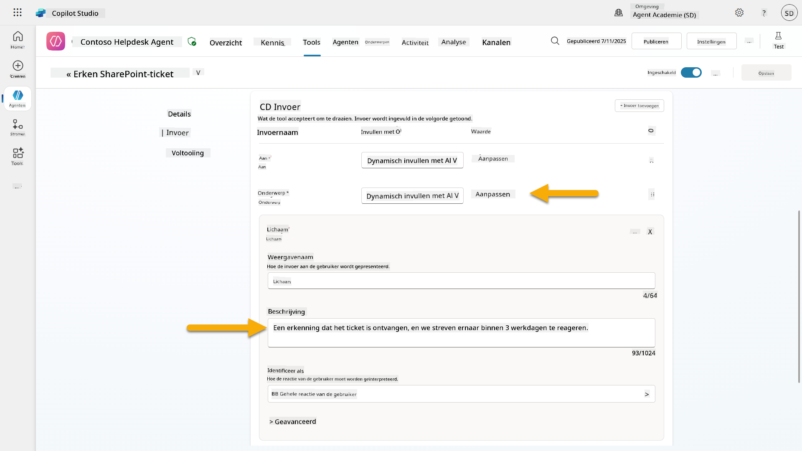

1. Selecteer **Opslaan**

### 10.4 Test de trigger

1. Binnen je **Helpdesk Agent**, selecteer het **Overzicht**-tabblad
1. Klik op het **Test Trigger**-pictogram naast de trigger **Nieuw Support Ticket Aangemaakt in SharePoint**. Hiermee wordt het venster **Test je trigger** geladen.
1. Open een nieuw browsertabblad en ga naar je **SharePoint IT Support Tickets-lijst**  
1. Klik op **+ Nieuw item toevoegen** om een testticket aan te maken:  
   - **Titel**: "Kan geen verbinding maken met VPN"  
   - **Beschrijving**: "Kan geen verbinding maken met het bedrijfs-WIFI-netwerk na recente update"  
   - **Prioriteit**: "Normaal"  

1. **Opslaan** van het SharePoint-item  
    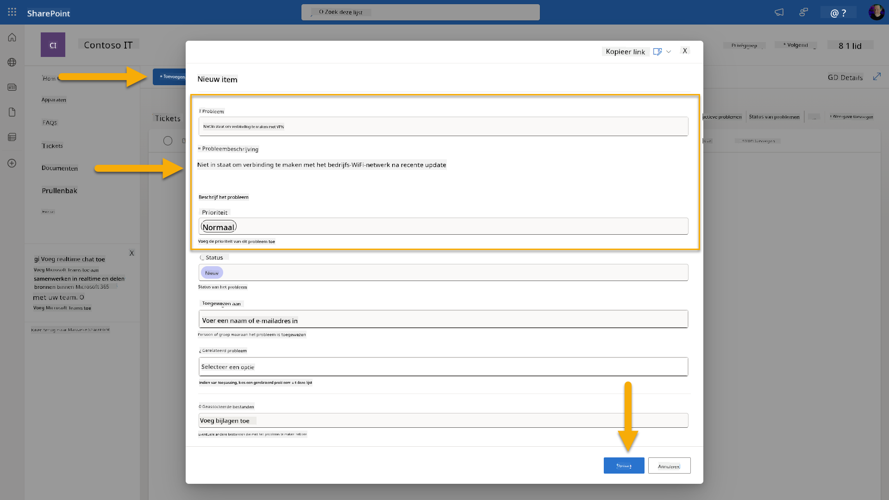  
1. Ga terug naar **Copilot Studio** en houd het paneel **Test je trigger** in de gaten voor de activering van de trigger. Gebruik het **Vernieuwen**-icoon om het triggerevenement te laden, dit kan enkele minuten duren.  
    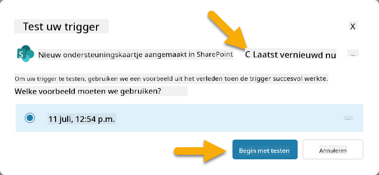  
1. Zodra de trigger verschijnt, selecteer **Start testen**  
1. Selecteer het **Activiteitenkaart-icoon** bovenaan het paneel **Test je agent**  
1. Controleer of je agent:  
   - De trigger payload heeft ontvangen  
   - De tool "SharePoint-ticket bevestigen" heeft aangeroepen  
     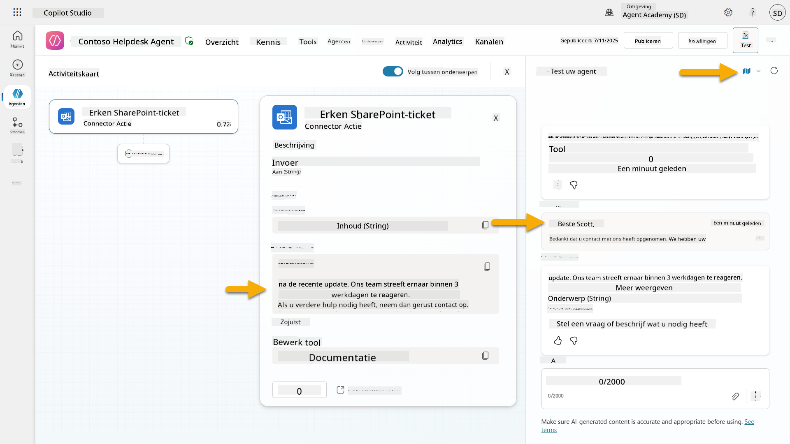  
1. Controleer de e-mailinbox van de indiener om te bevestigen dat de bevestigingsmail is verzonden  
    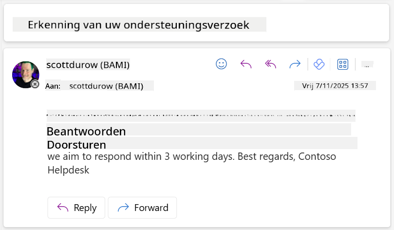  
1. Bekijk het tabblad **Activiteit** in Copilot Studio om de volledige trigger- en tooluitvoering te zien  

## ✅ Missie Voltooid  

🎉 **Gefeliciteerd!** Je hebt succesvol evenementtriggers geïmplementeerd met connector-tools die je agent in staat stellen autonoom te werken, automatisch e-mailbevestigingen te verzenden en supporttickets te verwerken zonder tussenkomst van gebruikers. Zodra je agent is gepubliceerd, zal deze autonoom namens jou handelen.  

🚀 **Volgende stap**: In onze volgende les leer je hoe je [je agent publiceert](../11-publish-your-agent/README.md) naar Microsoft Teams en Microsoft 365 Copilot, zodat deze beschikbaar wordt voor je hele organisatie!  

⏭️ [Ga naar de les **Je agent publiceren**](../11-publish-your-agent/README.md)  

## 📚 Tactische Bronnen  

Klaar om dieper in te gaan op evenementtriggers en autonome agents? Bekijk deze bronnen:  

- **Microsoft Learn**: [Maak je agent autonoom in Copilot Studio](https://learn.microsoft.com/training/modules/autonomous-agents-online-workshop/?WT.mc_id=power-177340-scottdurow)  
- **Documentatie**: [Een evenementtrigger toevoegen](https://learn.microsoft.com/microsoft-copilot-studio/authoring-trigger-event?WT.mc_id=power-177340-scottdurow)  
- **Best Practices**: [Introductie triggers in Power Automate](https://learn.microsoft.com/power-automate/triggers-introduction?WT.mc_id=power-177340-scottdurow)  
- **Geavanceerde Scenario's**: [Power Automate-flows gebruiken met agents](https://learn.microsoft.com/microsoft-copilot-studio/advanced-flow-create?WT.mc_id=power-177340-scottdurow)  
- **Beveiliging**: [Preventie van gegevensverlies voor Copilot Studio](https://learn.microsoft.com/microsoft-copilot-studio/admin-data-loss-prevention?WT.mc_id=power-177340-scottdurow)  

  

---

**Disclaimer**:  
Dit document is vertaald met behulp van de AI-vertalingsservice [Co-op Translator](https://github.com/Azure/co-op-translator). Hoewel we streven naar nauwkeurigheid, dient u zich ervan bewust te zijn dat geautomatiseerde vertalingen fouten of onnauwkeurigheden kunnen bevatten. Het originele document in de oorspronkelijke taal moet worden beschouwd als de gezaghebbende bron. Voor kritieke informatie wordt professionele menselijke vertaling aanbevolen. Wij zijn niet aansprakelijk voor eventuele misverstanden of verkeerde interpretaties die voortvloeien uit het gebruik van deze vertaling.