<!--
CO_OP_TRANSLATOR_METADATA:
{
  "original_hash": "9dceeba2eae2bb73e328602a060eddab",
  "translation_date": "2025-10-17T01:28:11+00:00",
  "source_file": "docs/recruit/11-publish-your-agent/README.md",
  "language_code": "nl"
}
-->
# 🚨 Missie 11: Publiceer je Agent

## 🕵️‍♂️ CODENAAM: `OPERATIE PUBLICEREN PUBLICEREN PUBLICEREN`

> **⏱️ Operatietijdvenster:** `~30 minuten`  

🎥 **Bekijk de Uitleg**

[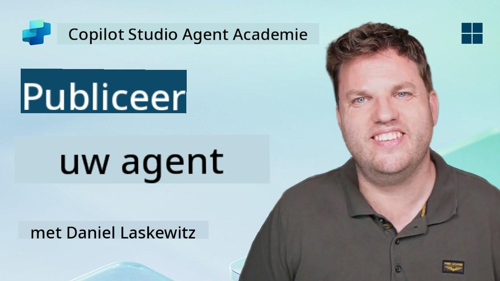](https://www.youtube.com/watch?v=eVZmljhYlSI "Bekijk de uitleg op YouTube")

## 🎯 Missieoverzicht

Na het voltooien van een reeks uitdagende modules, Agent Maker, ben je nu klaar voor je meest cruciale stap: het publiceren van je agent. Het is tijd om je creatie beschikbaar te maken voor gebruikers in Microsoft Teams en Microsoft 365 Copilot.

Je agent—uitgerust met een duidelijke missie, krachtige tools en toegang tot belangrijke kennisbronnen—is klaar om te dienen. Met behulp van Microsoft Copilot Studio kun je je agent inzetten zodat deze echte gebruikers kan ondersteunen, precies daar waar ze werken.

Laten we je agent in actie brengen.

## 🔎 Doelstellingen

📖 Deze les behandelt:

1. Waarom het belangrijk is om je agent te publiceren
1. Wat er gebeurt wanneer je je agent publiceert
1. Hoe je een kanaal toevoegt (Microsoft Teams & Microsoft 365 Copilot)
1. Hoe je de agent toevoegt in Microsoft Teams
1. Hoe je de agent beschikbaar maakt in Microsoft Teams voor je hele organisatie

## 🚀 Publiceer een agent

Elke keer dat je aan een agent werkt in Copilot Studio, kun je deze bijwerken door kennis of tools toe te voegen. Wanneer je klaar bent met alle wijzigingen en grondig hebt getest, ben je klaar om te publiceren. Publiceren zorgt ervoor dat de nieuwste updates live zijn. Als je je agent bijwerkt met nieuwe tools en niet op de publiceerknop drukt, zijn deze nog niet beschikbaar voor eindgebruikers.

Zorg ervoor dat je altijd op de publiceerknop drukt wanneer je de updates wilt doorvoeren naar de gebruikers van je agent. Je agent kan kanalen hebben toegevoegd, en wanneer je publiceert, zijn de updates beschikbaar voor alle kanalen die je aan de agent hebt toegevoegd.

## ⚙️ Kanalen configureren

Kanalen bepalen waar je gebruikers toegang hebben tot en interactie kunnen hebben met je agent. Nadat je je agent hebt gepubliceerd, kun je deze beschikbaar maken in meerdere kanalen. Elk kanaal kan de inhoud van je agent op een andere manier weergeven.

Je kunt je agent toevoegen aan de volgende kanalen:

- **Microsoft Teams en Microsoft 365 Copilot** - Maak je agent beschikbaar in Teams-chats en -vergaderingen, en binnen Microsoft 365 Copilot-ervaringen ([Meer informatie](https://learn.microsoft.com/microsoft-copilot-studio/publication-add-bot-to-microsoft-teams))
- **Demo-website** - Test je agent op een demo-website die door Copilot Studio wordt aangeboden ([Meer informatie](https://learn.microsoft.com/microsoft-copilot-studio/publication-connect-bot-to-web-channels))
- **Aangepaste website** - Embed je agent direct in je eigen website ([Meer informatie](https://learn.microsoft.com/microsoft-copilot-studio/publication-connect-bot-to-web-channels))
- **Mobiele app** - Integreer je agent in een aangepaste mobiele applicatie ([Meer informatie](https://learn.microsoft.com/microsoft-copilot-studio/publication-connect-bot-to-custom-application))
- **SharePoint** - Voeg je agent toe aan SharePoint-sites voor document- en siteondersteuning ([Meer informatie](https://learn.microsoft.com/microsoft-copilot-studio/publication-add-bot-to-sharepoint))
- **Facebook Messenger** - Maak verbinding met gebruikers via het berichtenplatform van Facebook ([Meer informatie](https://learn.microsoft.com/microsoft-copilot-studio/publication-add-bot-to-facebook))
- **Power Pages** - Integreer je agent in Power Pages-websites ([Meer informatie](https://learn.microsoft.com/microsoft-copilot-studio/publication-add-bot-to-power-pages))
- **Azure Bot Service-kanalen** - Toegang tot extra kanalen zoals Slack, Telegram, Twilio SMS en meer ([Meer informatie](https://learn.microsoft.com/microsoft-copilot-studio/publication-connect-bot-to-azure-bot-service-channels))

Om een kanaal toe te voegen, navigeer je naar het tabblad **Kanalen** in je agent en selecteer je het kanaal dat je wilt configureren. Elk kanaal heeft specifieke instellingsvereisten en kan aanvullende verificatie- of configuratiestappen vereisen.

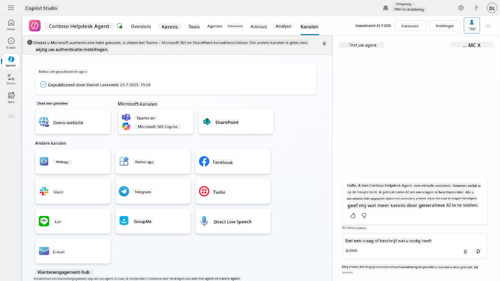

## 📺 Kanaalervaringen

Verschillende kanalen bieden verschillende gebruikerservaringen. Wanneer je een agent bouwt voor meerdere kanalen, is het belangrijk om je bewust te zijn van de verschillen per kanaal. Het is altijd een goede strategie om je agent in meerdere kanalen te testen om te zien of deze echt doet wat je bedoeld hebt.

| Ervaring                          | Website       | Teams en Microsoft 365 Copilot         | Facebook                 | Dynamics Omnichannel voor Klantenservice                   |
| --------------------------------- | ------------- | --------------------------------------- | ------------------------ | ----------------------------------------------------------- |
| [Klanttevredenheidsonderzoek][1]  | Adaptive card | Alleen tekst                            | Alleen tekst             | Alleen tekst                                                |
| [Meerkeuzeopties][1]              | Ondersteund   | [Ondersteund tot zes (als hero card)][4] | [Ondersteund tot 13][6]  | [Gedeeltelijk ondersteund][8]                               |
| [Markdown][2]                     | Ondersteund   | [Gedeeltelijk ondersteund][5]           | [Gedeeltelijk ondersteund][7] | [Gedeeltelijk ondersteund][9]                               |
| [Welkomstbericht][1]              | Ondersteund   | Ondersteund                             | Niet ondersteund         | Ondersteund voor [Chat][10]. Niet ondersteund voor andere kanalen. |
| [Bedoelde-U-Dit][3]               | Ondersteund   | Ondersteund                             | Ondersteund              | Ondersteund voor [Microsoft Teams][11], [Chat][10], Facebook en tekst-only kanalen (short message service (SMS) via [TeleSign][12] en [Twilio][13], [WhatsApp][14], [WeChat][15], en [Twitter][16]). Voorgestelde acties worden gepresenteerd als een tekst-only lijst; gebruikers moeten een optie opnieuw typen om te reageren. |

[1]: https://learn.microsoft.com/microsoft-copilot-studio/authoring-create-edit-topics
[2]: https://daringfireball.net/projects/markdown/
[3]: https://learn.microsoft.com/microsoft-copilot-studio/advanced-ai-features
[4]: https://learn.microsoft.com/microsoftteams/platform/concepts/cards/cards-reference#hero-card
[5]: https://learn.microsoft.com/microsoftteams/platform/bots/how-to/format-your-bot-messages#text-only-messages
[6]: https://developers.facebook.com/docs/messenger-platform/send-messages/quick-replies/
[7]: https://www.facebook.com/help/147348452522644?helpref=related
[8]: https://learn.microsoft.com/dynamics365/customer-service/asynchronous-channels#suggested-actions-support
[9]: https://learn.microsoft.com/dynamics365/customer-service/asynchronous-channels#preview-support-for-formatted-messages
[10]: https://learn.microsoft.com/dynamics365/customer-service/set-up-chat-widget
[11]: https://learn.microsoft.com/dynamics365/customer-service/configure-microsoft-teams
[12]: https://learn.microsoft.com/dynamics365/customer-service/configure-sms-channel
[13]: https://learn.microsoft.com/dynamics365/customer-service/configure-sms-channel-twilio
[14]: https://learn.microsoft.com/dynamics365/customer-service/configure-whatsapp-channel
[15]: https://learn.microsoft.com/dynamics365/customer-service/configure-wechat-channel
[16]: https://learn.microsoft.com/dynamics365/customer-service/configure-twitter-channel

> [!NOTE]
> Er zijn enkele voorbeelden van waar je verschillende logica kunt gebruiken voor verschillende kanalen. Een voorbeeld hiervan is te vinden in de Power Platform Snippets repository:
>
> Henry Jammes deelde een voorbeeld van hoe je een andere adaptive card kunt weergeven wanneer het kanaal Microsoft Teams is. ([Link naar voorbeeld](https://github.com/pnp/powerplatform-snippets/blob/main/copilot-studio/multiple-topics-matched-topic/source/multiple-topics-matched.yaml#L40))

## 🧪 Lab 11: Publiceer je agent naar Teams en Microsoft 365 Copilot

### 🎯 Gebruiksscenario

Je Contoso IT Helpdesk-agent is nu volledig geconfigureerd met krachtige mogelijkheden—het kan toegang krijgen tot SharePoint-kennisbronnen, supporttickets aanmaken, proactieve meldingen verzenden en intelligent reageren op gebruikersvragen. Maar al deze functies zijn momenteel alleen beschikbaar in de ontwikkelomgeving waarin je ze hebt gebouwd.

**De uitdaging:** Eindgebruikers kunnen niet profiteren van de mogelijkheden van je agent totdat deze correct is gepubliceerd en toegankelijk is gemaakt via de kanalen waar ze daadwerkelijk werken.

**De oplossing:** Door je agent te publiceren, zorg je ervoor dat de nieuwste versie—met al je recente updates, nieuwe onderwerpen, verbeterde kennisbronnen en geconfigureerde workflows—beschikbaar is voor echte gebruikers. Zonder publicatie zouden gebruikers nog steeds interactie hebben met een oudere versie van je agent die mogelijk cruciale functionaliteit mist.

Het toevoegen van het Teams- en Microsoft 365 Copilot-kanaal is net zo belangrijk omdat:

- **Teams-integratie**: Werknemers van je organisatie brengen het grootste deel van hun dag door in Microsoft Teams voor samenwerking, vergaderingen en communicatie. Door je agent toe te voegen aan Teams, kunnen gebruikers IT-ondersteuning krijgen zonder hun primaire werkomgeving te verlaten.

- **Microsoft 365 Copilot**: Gebruikers kunnen rechtstreeks toegang krijgen tot je gespecialiseerde IT-helpdeskagent binnen hun Microsoft 365 Copilot-ervaring, waardoor deze naadloos wordt geïntegreerd in hun dagelijkse workflow binnen Office-toepassingen.

- **Gecentraliseerde toegang**: In plaats van aparte websites of applicaties te onthouden, kunnen gebruikers toegang krijgen tot IT-ondersteuning via de platforms die ze al gebruiken, wat de drempel verlaagt en de adoptie verhoogt.

Deze missie transformeert je ontwikkelwerk in een productieklare oplossing die echte waarde biedt aan de eindgebruikers van je organisatie.

### Vereisten

Voordat je aan deze lab begint, zorg ervoor dat je:

- ✅ Eerdere labs hebt voltooid en een volledig geconfigureerde Contoso Helpdesk Agent hebt
- ✅ Je agent hebt getest en klaar is voor productiegebruik
- ✅ Rechten hebt in je Copilot Studio-omgeving om agents te publiceren
- ✅ Toegang hebt tot Microsoft Teams in je organisatie

### 11.1 Publiceer je agent

Nu al ons werk aan de agent is voltooid, moeten we ervoor zorgen dat al ons werk beschikbaar is voor de eindgebruikers die onze agent gaan gebruiken. Om ervoor te zorgen dat de inhoud beschikbaar is voor alle gebruikers, moeten we onze agent publiceren.

1. Ga naar de Contoso Helpdesk Agent in Copilot Studio (via de [Copilot Studio maker portal](https://copilotstudio.microsoft.com))

    In Copilot Studio is het eenvoudig om je agent te publiceren. Je kunt gewoon de publiceerknop selecteren bovenaan het overzicht van de agent.

    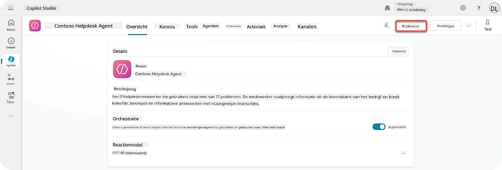

1. Selecteer de **Publiceer**-knop in je agent

    Er verschijnt een publiceer-popup om te bevestigen dat je je agent echt wilt publiceren.

    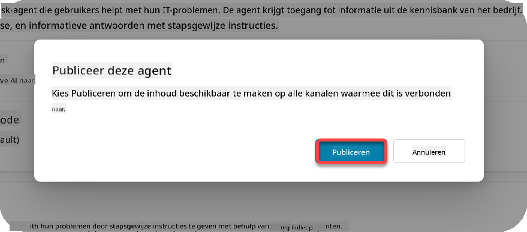

1. Selecteer **Publiceer** om het publiceren van je agent te bevestigen

    Nu verschijnt er een bericht dat je agent wordt gepubliceerd. Je hoeft die popup niet open te houden. Je krijgt een melding wanneer de agent is gepubliceerd.

    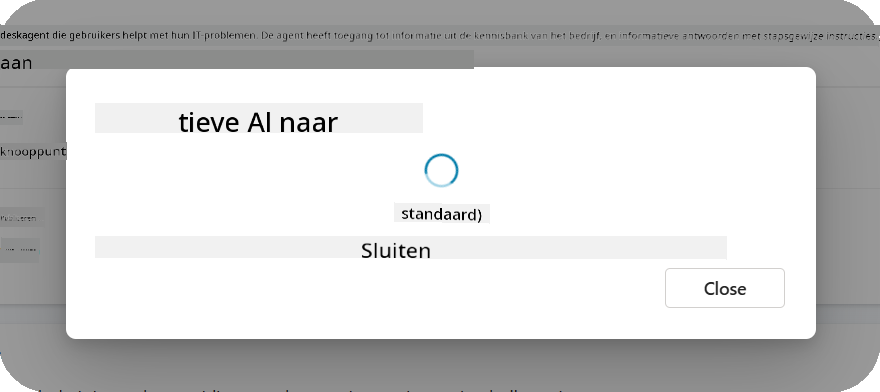

    Wanneer de agent klaar is met publiceren, zie je de melding bovenaan de agentpagina.

    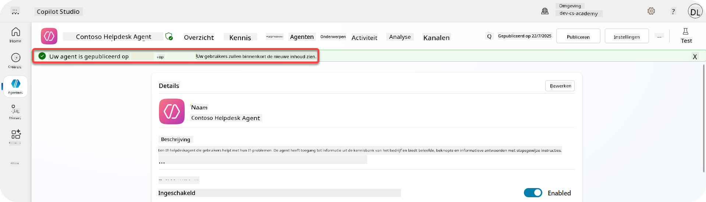

Maar - we hebben alleen de agent gepubliceerd, we hebben deze nog niet aan een kanaal toegevoegd, dus laten we dat nu oplossen!

### 11.2 Voeg het Teams- en Microsoft 365 Copilot-kanaal toe

1. Om het Teams- en Microsoft 365 Copilot-kanaal aan onze agent toe te voegen, moeten we **Kanaal** selecteren in de bovenste navigatie van de agent

    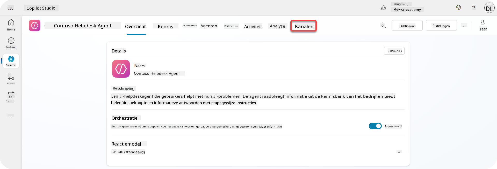

    Hier kunnen we alle kanalen zien die we aan deze agent kunnen toevoegen.

1. Selecteer **Teams en Microsoft 365**

    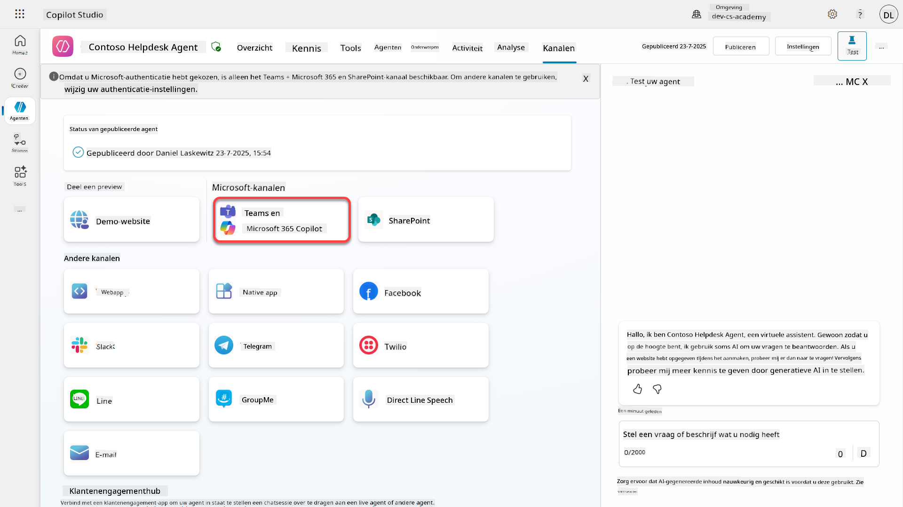

1. Selecteer **Kanaal toevoegen** om de wizard te voltooien en het kanaal aan de agent toe te voegen

    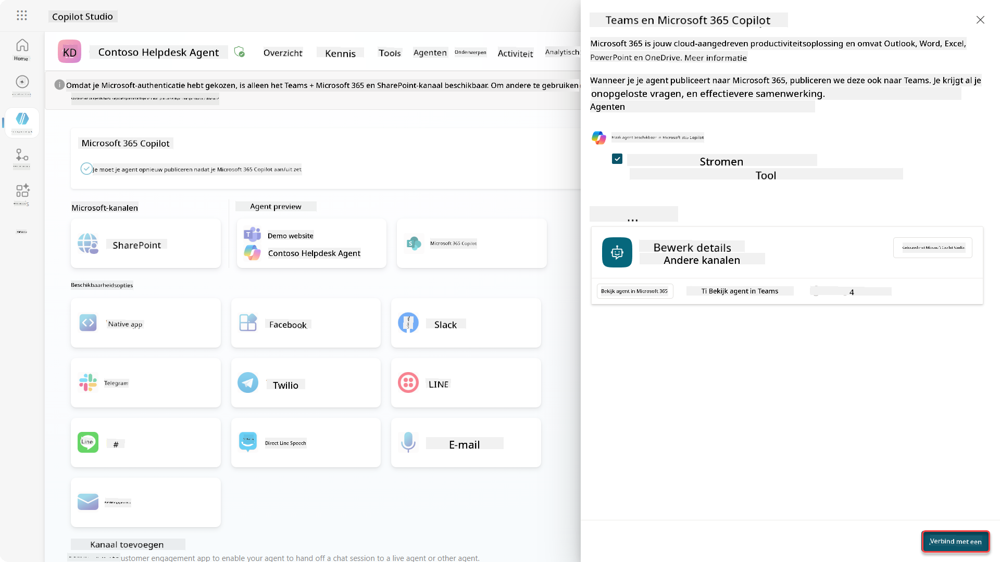

    Het duurt even voordat het is toegevoegd. Nadat het is toegevoegd, verschijnt er een groene melding bovenaan de zijbalk.

    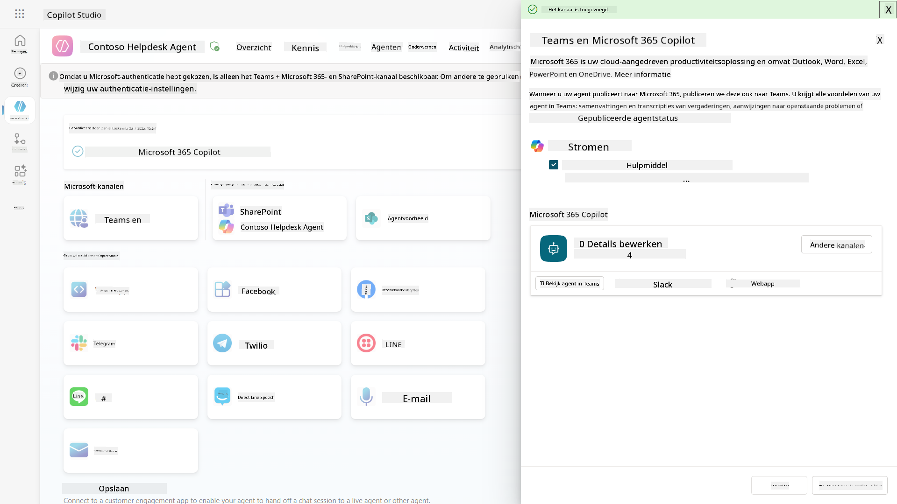

1. Selecteer **Bekijk agent in Teams** om een nieuw tabblad te openen

    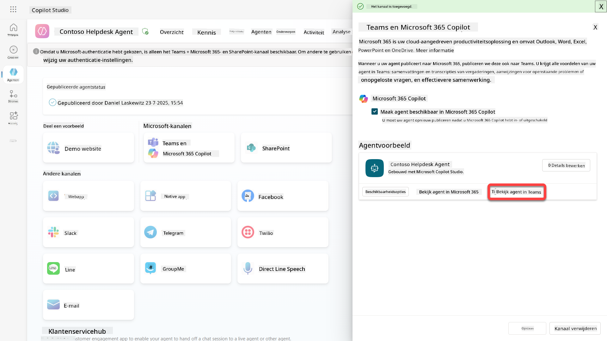

1. Selecteer **Toevoegen** om de Contoso Helpdesk Agent toe te voegen aan Teams

    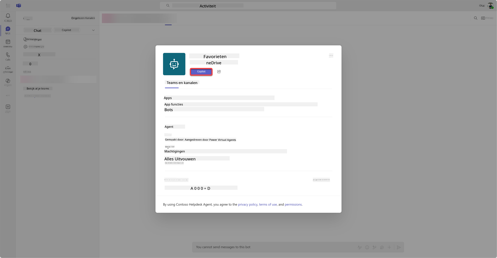

    Dit duurt even. Daarna zou het volgende scherm moeten verschijnen:

    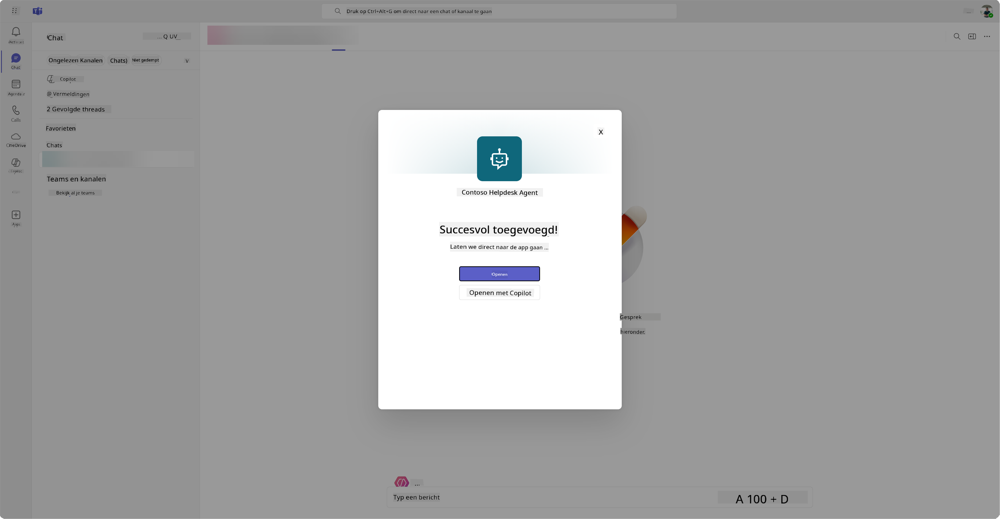

1. Selecteer **Openen** om de agent in Teams te openen

    Dit opent de agent in Teams als een Teams-app

    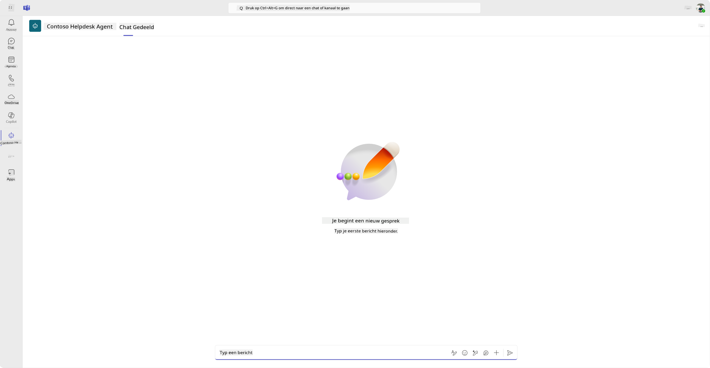

Nu hebben we de agent gepubliceerd zodat deze werkt in Microsoft Teams, maar je wilt deze mogelijk beschikbaar maken voor meer mensen.

### 11.3 Maak de agent beschikbaar voor alle gebruikers in de tenant

1. Sluit het browsertabblad waar de Contoso Helpdesk Agent is geopend

    Dit zou je terug moeten brengen naar Copilot Studio waar het Teams- en Microsoft 365 Copilot zijpaneel nog steeds open is. We hebben de agent nu alleen geopend in Teams, maar we kunnen hier veel meer doen. We kunnen de details van de agent bewerken, de agent implementeren voor meer gebruikers en meer.

1. Selecteer **Details bewerken**

    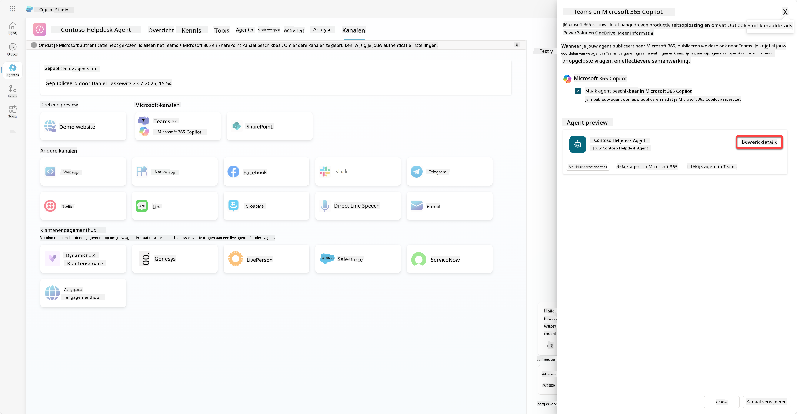
Dit opent een paneel waar we een aantal details en instellingen van de agent kunnen wijzigen. We kunnen basisdetails aanpassen, zoals het pictogram, de achtergrondkleur van het pictogram en de beschrijvingen. Ook kunnen we hier Teams-instellingen wijzigen (bijvoorbeeld toestaan dat een gebruiker de agent toevoegt aan een team, of toestaan dat deze agent wordt gebruikt in groeps- en vergaderchats). Wanneer je *meer* selecteert, kun je ook ontwikkelaarsdetails aanpassen, zoals de naam van de ontwikkelaar, de website, de privacyverklaring en de gebruiksvoorwaarden.

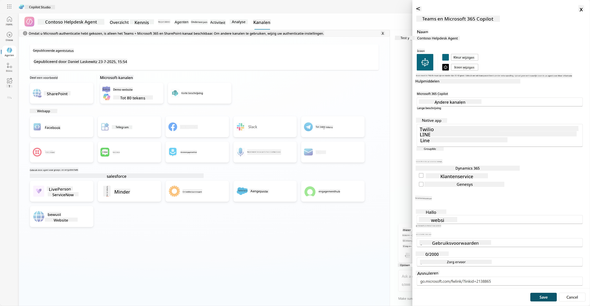

1. Selecteer **Annuleren** om het paneel Details bewerken te sluiten.

1. Selecteer **Beschikbaarheidsopties**

    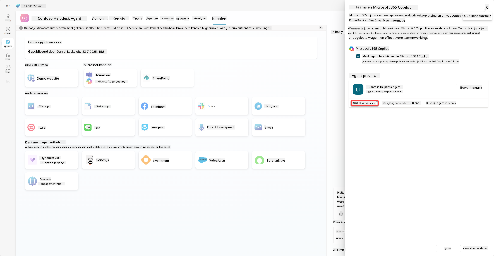

    Dit opent het paneel Beschikbaarheidsopties, waar je een link kunt kopiëren om naar gebruikers te sturen zodat ze deze agent kunnen gebruiken (let op, je moet de agent ook met de gebruiker delen) en je kunt een bestand downloaden om je agent toe te voegen aan de Microsoft Teams- of Microsoft 365-winkel. Om de agent in de winkel te tonen, zijn er andere opties: je kunt hem tonen aan je teamgenoten en gedeelde gebruikers (om hem te tonen in de sectie *Gebouwd met Power Platform*) of je kunt hem tonen aan iedereen in je organisatie (dit vereist goedkeuring van de beheerder).

1. Selecteer **Tonen aan iedereen in mijn organisatie**

    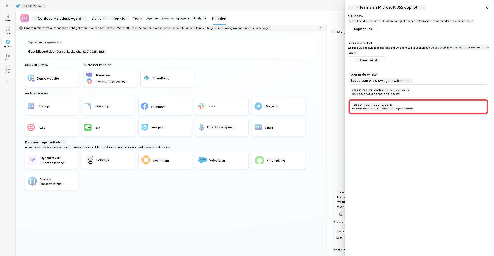

1. Selecteer **Indienen voor goedkeuring door beheerder**

    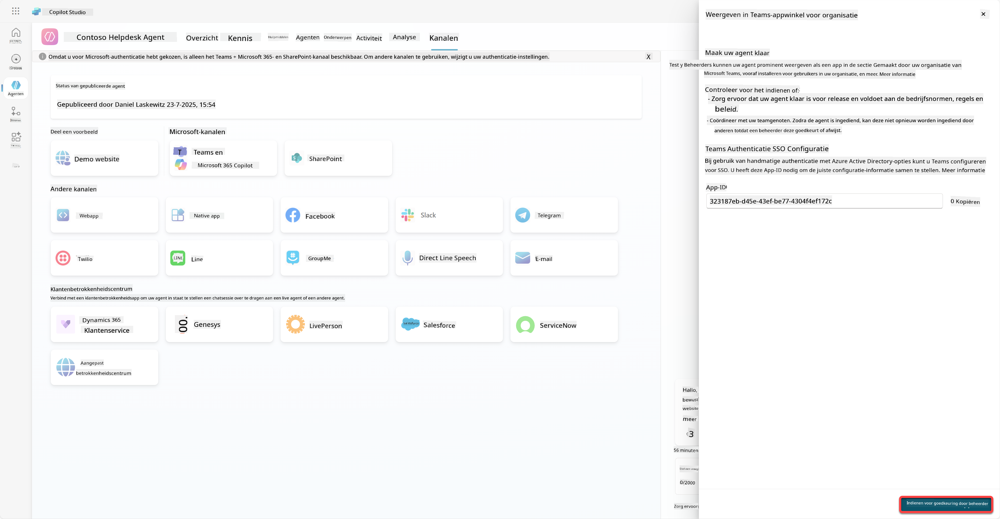

    Nu moet je beheerder je agentindiening goedkeuren. Dit kan door naar het Teams Admin Center te gaan en de Contoso Helpdesk Agent op te zoeken in Apps. In de screenshot kun je zien wat de beheerder zou zien in het Teams Admin Center.

    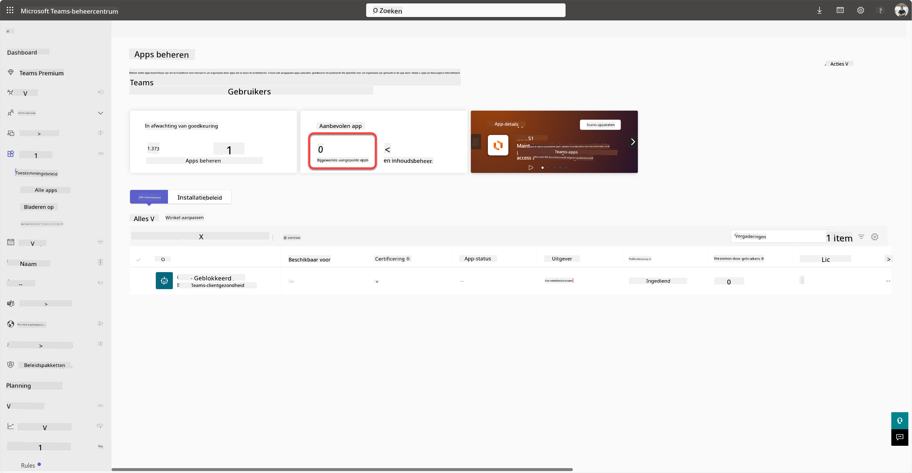

    De beheerder moet de Contoso Helpdesk Agent selecteren en *Publiceren* kiezen om de Contoso Helpdesk Agent voor iedereen te publiceren.

    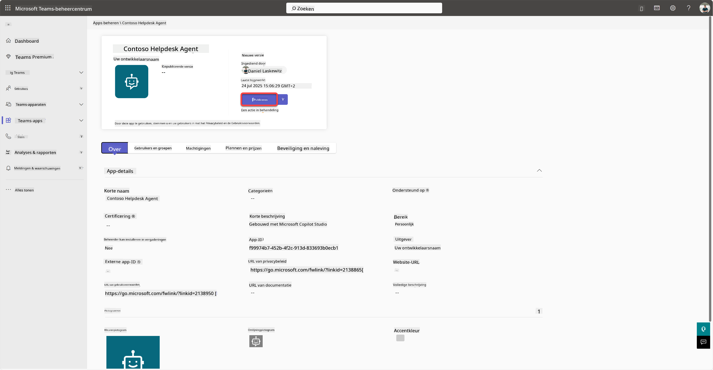

    Wanneer de beheerder de agentindiening heeft gepubliceerd, kun je Copilot Studio vernieuwen en zou je de banner *beschikbaar in app store* moeten zien in de beschikbaarheidsopties.

    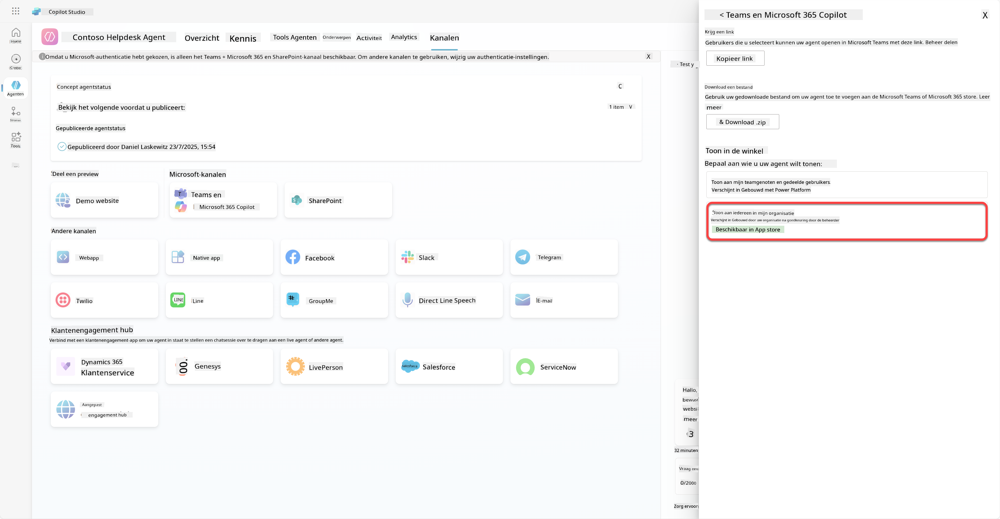

Er zijn hier nog meer mogelijkheden. Je beheerder kan het globale installatiebeleid wijzigen en de Contoso Helpdesk Agent automatisch installeren voor iedereen in de tenant. Daarnaast kun je de Contoso Helpdesk Agent vastpinnen aan de linker zijbalk zodat iedereen er gemakkelijk toegang toe heeft.

## ✅ Missie Voltooid

🎉 **Gefeliciteerd!** Je hebt je agent succesvol gepubliceerd en toegevoegd aan Teams en Microsoft 365 Copilot! De volgende stap is de laatste missie van de cursus: Begrijpen van licenties.

⏭️ [Ga naar de les **Begrijpen van licenties**](../12-understanding-licensing/README.md)

## 📚 Tactische Bronnen

🔗 [Documentatie over publicatiekanalen](https://learn.microsoft.com/microsoft-copilot-studio/publication-fundamentals-publish-channels)

---

**Disclaimer**:  
Dit document is vertaald met behulp van de AI-vertalingsservice [Co-op Translator](https://github.com/Azure/co-op-translator). Hoewel we streven naar nauwkeurigheid, dient u zich ervan bewust te zijn dat geautomatiseerde vertalingen fouten of onnauwkeurigheden kunnen bevatten. Het originele document in de oorspronkelijke taal moet worden beschouwd als de gezaghebbende bron. Voor kritieke informatie wordt professionele menselijke vertaling aanbevolen. Wij zijn niet aansprakelijk voor eventuele misverstanden of verkeerde interpretaties die voortvloeien uit het gebruik van deze vertaling.