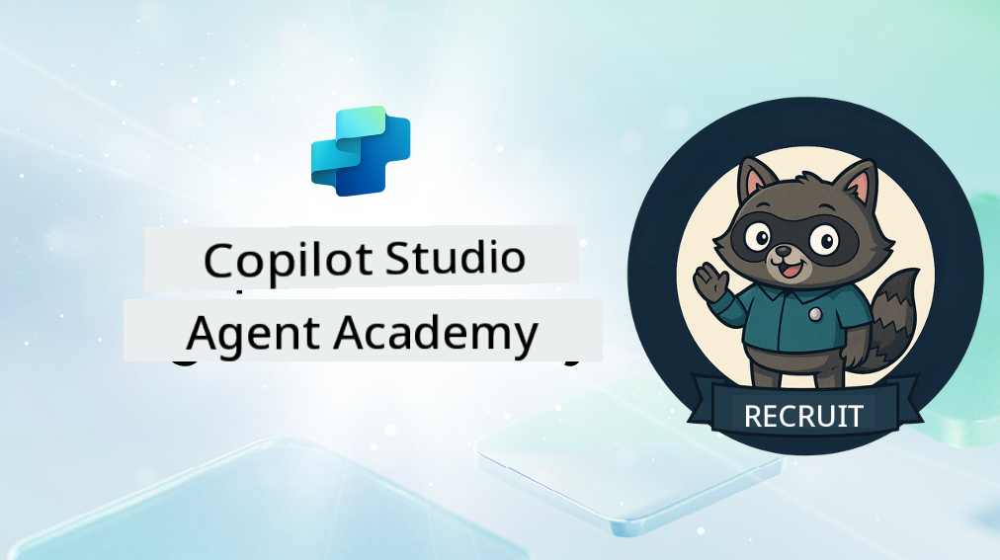

<!--
CO_OP_TRANSLATOR_METADATA:
{
  "original_hash": "8b5ecad9d5d073ea3f4c2b844e80f2e5",
  "translation_date": "2025-10-17T01:14:06+00:00",
  "source_file": "docs/recruit/README.md",
  "language_code": "nl"
}
-->
# Welkom Rekruut

**Welkom, Rekruut.**  
Jouw missie—als je deze accepteert—is om de kunst van het bouwen van agents te beheersen met **Microsoft Copilot Studio**.

Deze praktische training is jouw toegangspoort tot de **wereld van agents**: van gerichte prompts tot Adaptive Cards en agent flows. Je leert hoe je intelligente agents kunt bouwen, schalen en implementeren met behulp van echte tools en praktijkvoorbeelden.

---

## 🎯 Missiedoelstelling

Na het voltooien van de Agent Academy kun je:

- Begrijpen wat agents zijn in de context van Microsoft Copilot Studio
- Ontdekken hoe Large Language Models (LLMs), retrieval-augmented generation (RAG) en orkestratie samenkomen in een agent
- Zowel **declaratieve** als **aangepaste agents** bouwen
- Agents verbeteren met **Topics**, **Adaptive Cards** en **Agent Flows**
- Agents implementeren in **Microsoft Teams** en **Microsoft 365 Copilot**

---

## 🧪 Vereisten

Om alle missies te voltooien, heb je nodig:

- Een Microsoft 365 Developer tenant (met SharePoint ingeschakeld)
- Toegang tot **Microsoft Copilot Studio** (proefversie of licentie)
- Optioneel: Basiskennis van SharePoint, Power Platform of Power Fx

---

## 🧬 Voor Wie Is Dit?

Deze cursus is ideaal voor:

- Makers en ontwikkelaars die **Copilot Studio** verkennen
- IT-professionals die **Microsoft 365 Copilot-extensies** bouwen
- Power Platform-enthousiastelingen die willen **groeien** met intelligente agents
- Iedereen die liever **al doende** leert

---

## 🧭 Overzicht van de Curriculum

Deze academy is opgedeeld in progressieve lessen—elk ontworpen als een veldmissie om je vaardigheden in het bouwen van agents te verbeteren.

| Les | Titel | Missiebriefing |
|-----|-------|----------------|
| `00` | 🧰 [Cursusinstelling](./00-course-setup/README.md) | Stel je ontwikkelomgeving, Copilot Studio proefversie en SharePoint-site in |
| `01` | 🧠 [Introductie tot Agents](./01-introduction-to-agents/README.md) | Begrijp concepten van conversatie-AI, LLMs en autonome vs. declaratieve agents |
| `02` | 🛠️ [Copilot Studio Basisprincipes](./02-copilot-studio-fundamentals/README.md) | Leer de bouwstenen: kennis, vaardigheden, autonomie |
| `03` | 👩‍💻 [Maak een Declaratieve Agent](./03-create-a-declarative-agent-for-M365Copilot/README.md) | Voeg je eigen agent toe aan Microsoft 365 Copilot, gebaseerd op een prompt |
| `04` | 🧩 [Een Oplossing Maken](./04-creating-a-solution/README.md) | Verpak je agent in een herbruikbare oplossing voor omgevingsbeheer |
| `05` | 🚀 [Aan de Slag met Vooraf Gebouwde Agents](./05-using-prebuilt-agents/README.md) | Gebruik en pas een sjabloonagent aan om de setup te versnellen |
| `06` | ✍️ [Bouw een Aangepaste Agent](./06-create-agent-from-conversation/README.md) | Maak een nieuwe Copilot gebaseerd op kennisbronnen |
| `07` | 🧠 [Voeg een Topic met Triggers Toe](./07-add-new-topic-with-trigger/README.md) | Gebruik Topics om aangepaste vraag/antwoordpaden te definiëren |
| `08` | 🪪 [Verbeter met Adaptive Cards](./08-add-adaptive-card/README.md) | Bouw een Adaptive Card met Power Fx en SharePoint |
| `09` | 🔁 [Automatiseer met Agent Flows](./09-add-an-agent-flow/README.md) | Gebruik Adaptive Card-input om back-end flows te activeren |
| `10` | 🧭 [Voeg Event Triggers Toe](./10-add-event-triggers/README.md) | Laat je agent autonoom handelen met event-gebaseerde logica |
| `11` | 📢 [Publiceer Je Agent](./11-publish-your-agent/README.md) | Implementeer je agent in Microsoft Teams en Microsoft 365 Copilot |
| `12` | 🪪 [Begrijp Licenties](./12-understanding-licensing/README.md) | Leer hoe licenties en facturering werken met Copilot Studio |
| `13` | 🚨 [Beveilig Je Rekruut Badge](./course-completion-badges-recruit/README.md) | Claim je badge en markeer je prestatie! |

!!! note
    ✅ Het voltooien van deze curriculum levert je de **Rekruut** badge op.  
    🔓 **Operative** en **Commander** worden in toekomstige fases ontgrendeld.

<!-- markdownlint-disable-next-line MD033 -->

---

**Disclaimer**:  
Dit document is vertaald met behulp van de AI-vertalingsservice [Co-op Translator](https://github.com/Azure/co-op-translator). Hoewel we streven naar nauwkeurigheid, dient u zich ervan bewust te zijn dat geautomatiseerde vertalingen fouten of onnauwkeurigheden kunnen bevatten. Het originele document in de oorspronkelijke taal moet worden beschouwd als de gezaghebbende bron. Voor kritieke informatie wordt professionele menselijke vertaling aanbevolen. Wij zijn niet aansprakelijk voor eventuele misverstanden of verkeerde interpretaties die voortvloeien uit het gebruik van deze vertaling.