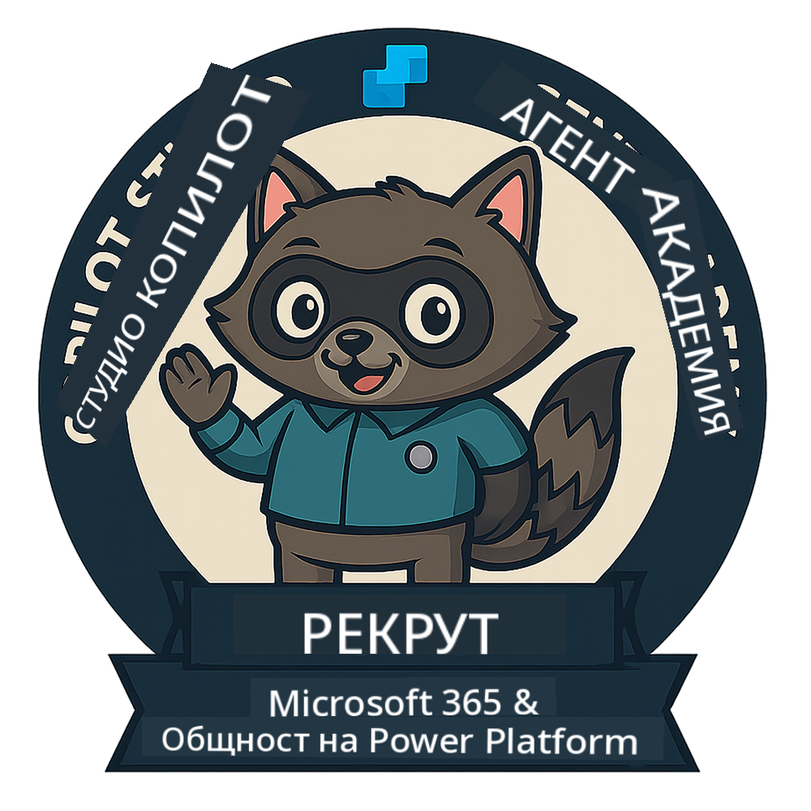

<!--
CO_OP_TRANSLATOR_METADATA:
{
  "original_hash": "15e57e059ce7689d602d7853187235cd",
  "translation_date": "2025-10-20T22:41:00+00:00",
  "source_file": "docs/index.md",
  "language_code": "bg"
}
-->
---
hide:
- navigation
---

# Академия за агенти на Copilot Studio

**Добре дошли в Академията за агенти на Copilot Studio.**  

Вашата мисия – ако решите да я приемете – е да овладеете изкуството на създаване на агенти с помощта на **Microsoft Copilot Studio**.

Това практическо обучение е вашият вход към **света на агентите**: от създаване на насочени подсказки до Adaptive Cards и потоци на агенти, ще научите как да изграждате, мащабирате и внедрявате интелигентни агенти, използвайки реални инструменти и примери.

---

## 🏅 Напредък в ранговете

**Академията за агенти на Copilot Studio** е многоетапна програма за обучение, предназначена да развие вашите умения в три ранга на агенти. Всеки ранг включва значка и нарастващи отговорности:

| Ранг             | Ниво | Визуализация |
|------------------|:-----:|--------------|
| 🟢 **Рекрут**  [🚀 Започнете](https://aka.ms/agent-academy-recruit){ .md-button .md-button--primary }     | •     | { width="300" }     |
| 🔵 **Оперативен агент** (Очаквайте скоро)   | ••    | { width="300" } |
| 🟡 **Командир** (Очаквайте скоро)    | •••   | { width="300" } |

Всеки ранг надгражда предишния. Завършете мисията си като Рекрут и следете за възможността да повишите своите агентски умения.

---

## 🎒 Други курсове

Разгледайте тези други курсове, за да продължите да учите за AI и агенти:

- [Microsoft Copilot Studio <3 MCP Lab](https://aka.ms/mcsmcplab)
- [Copilot Developer Camp](https://microsoft.github.io/copilot-camp/)
- [AI агенти за начинаещи](https://microsoft.github.io/ai-agents-for-beginners/)
- [Протокол за контекст на модела (MCP) за начинаещи](https://github.com/microsoft/mcp-for-beginners)

---

## 🚑 Проблеми

Много ценим вашата обратна връзка! Моля, използвайте [списъка с проблеми](https://github.com/microsoft/agent-academy/issues), за да споделите вашите коментари и проблеми. Благодарим!

---

## 📜 Кодекс на поведение

Този проект е приел [Кодекса на поведение за отворен код на Microsoft](https://opensource.microsoft.com/codeofconduct/).

!!! info "Ресурси:"

    - [Кодекс на поведение за отворен код на Microsoft](https://opensource.microsoft.com/codeofconduct/)
    - [Често задавани въпроси за Кодекса на поведение на Microsoft](https://opensource.microsoft.com/codeofconduct/faq/)
    - Свържете се с [opencode@microsoft.com](mailto:opencode@microsoft.com) за въпроси или притеснения

---

[⭐️ Дайте звезда на нашето хранилище](https://github.com/microsoft/agent-academy){ .md-button .md-button--primary }

<!-- markdownlint-disable-next-line MD033 -->

---

**Отказ от отговорност**:  
Този документ е преведен с помощта на AI услуга за превод [Co-op Translator](https://github.com/Azure/co-op-translator). Въпреки че се стремим към точност, моля, имайте предвид, че автоматизираните преводи може да съдържат грешки или неточности. Оригиналният документ на неговия роден език трябва да се счита за авторитетен източник. За критична информация се препоръчва професионален човешки превод. Ние не носим отговорност за каквито и да било недоразумения или погрешни интерпретации, произтичащи от използването на този превод.