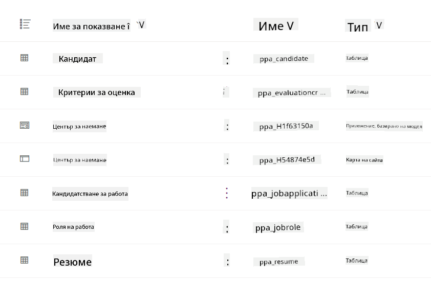
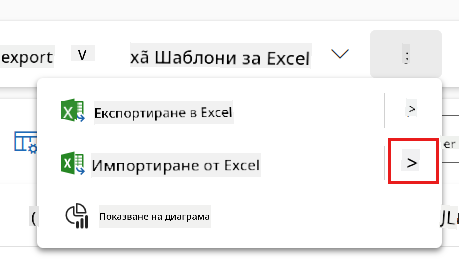
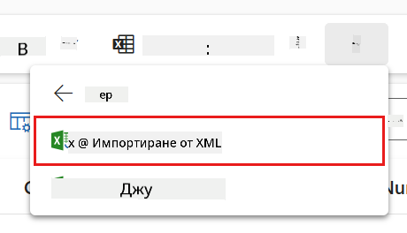
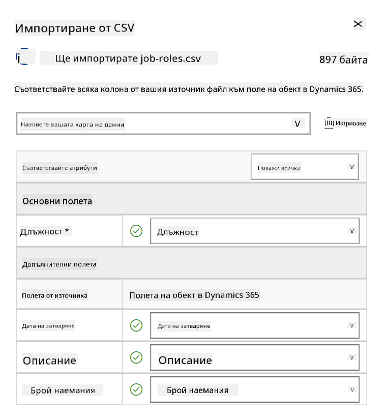
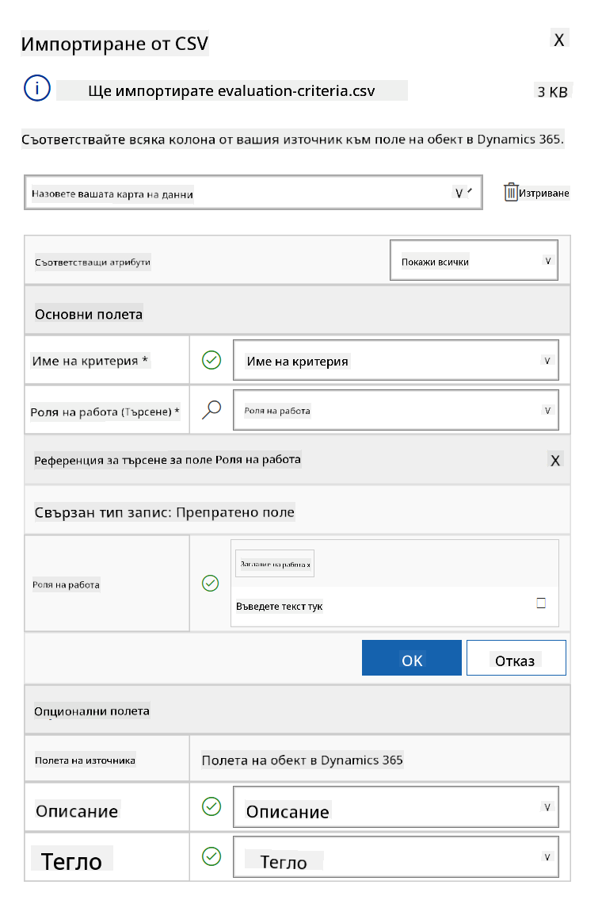
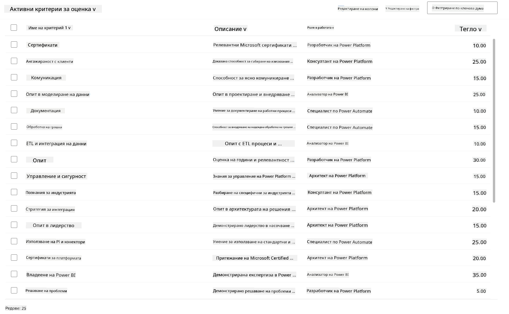

<!--
CO_OP_TRANSLATOR_METADATA:
{
  "original_hash": "2620cf9eaf09a3fc6be7fa31a3a62956",
  "translation_date": "2025-10-20T23:06:11+00:00",
  "source_file": "docs/operative-preview/01-get-started/README.md",
  "language_code": "bg"
}
-->
# 🚨 Мисия 01: Започнете с Hiring Agent

--8<-- "disclaimer.md"

## 🕵️‍♂️ КОДОВО ИМЕ: `ОПЕРАЦИЯ ТЪРСАЧ НА ТАЛАНТИ`

> **⏱️ Времеви прозорец на операцията:** `~45 минути`

## 🎯 Описание на мисията

Добре дошли, агент. Вашата първа задача е **Операция Търсач на таланти** - създаване на основната инфраструктура за система за набиране на персонал, задвижвана от AI, която ще трансформира начина, по който организациите идентифицират и наемат най-добрите таланти.

Вашата мисия, ако решите да я приемете, е да внедрите и конфигурирате цялостна система за управление на наемането, използвайки Microsoft Copilot Studio. Ще импортирате предварително изградено решение, съдържащо всички необходими структури от данни, след което ще създадете първия си AI агент - **Hiring Agent** - който ще служи като централен координатор за всички бъдещи операции по наемане.

Това първоначално внедряване установява командния център, който ще подобрявате през цялата програма на Agent Academy Operative. Помислете за това като за вашата база - основата, върху която ще изградите цяла мрежа от специализирани агенти в следващите мисии.

---

## 🔎 Цели

С изпълнението на тази мисия ще постигнете:

- **Разбиране на сценария**: Придобиване на цялостно познание за предизвикателствата и решенията в автоматизацията на наемането
- **Внедряване на решение**: Успешно импортиране и конфигуриране на основите на система за управление на наемането
- **Създаване на агент**: Създаване на Hiring Agent, който е началото на сценария, който ще изграждате като оперативен агент в Agent Academy

---

## 🔍 Предварителни условия

Преди да започнете тази мисия, уверете се, че разполагате с:

- Лиценз за Copilot Studio
- Достъп до Microsoft Power Platform среда
- Административни права за създаване на решения и агенти

---

## 🏢 Разбиране на сценария за автоматизация на наемането

Този сценарий демонстрира как една компания може да използва Microsoft Copilot Studio, за да подобри и автоматизира процеса си на наемане. Той представя система от агенти, които работят заедно, за да се справят със задачи като преглед на автобиографии, препоръчване на подходящи позиции, подготовка на материали за интервюта и оценка на кандидатите.

### Бизнес стойност

Решението помага на HR екипите да спестят време и да вземат по-добри решения чрез:

- Автоматично обработване на автобиографии, получени по имейл.
- Предлагане на подходящи позиции въз основа на профилите на кандидатите.
- Създаване на заявления за работа и ръководства за интервюта, съобразени с всеки кандидат.
- Осигуряване на справедливи и съобразени с правилата практики за наемане чрез вградени функции за безопасност и модерация.
- Събиране на обратна връзка за подобряване на решението.

### Как работи

- Централният **Hiring Agent** координира процеса и съхранява данни в Microsoft Dataverse.
- **Application Intake Agent** чете автобиографии и създава заявления за работа.
- **Interview Prep Agent** генерира въпроси за интервю и документи въз основа на опита на кандидата.
- Системата може да бъде публикувана на демонстрационен уебсайт, позволявайки на заинтересованите страни да взаимодействат с нея.

Този сценарий е идеален за организации, които искат да модернизират своите процеси за наемане чрез автоматизация, задвижвана от AI, като същевременно поддържат прозрачност, справедливост и ефективност.

---

## 🧪 Лаборатория: Настройка на Hiring Agent

В тази практическа лаборатория ще създадете основата за вашата система за автоматизация на наемането. Ще започнете с импортиране на предварително конфигурирано решение, което съдържа всички необходими таблици и структури от данни за управление на кандидати, позиции и работни процеси за наемане. След това ще попълните тези таблици с примерни данни, които ще подпомогнат вашето обучение през този модул и ще предоставят реалистични сценарии за тестване. Накрая ще създадете Hiring Agent в Copilot Studio, като настроите основния интерфейс за разговори, който ще служи като основа за всички останали функции, които ще добавите в бъдещите мисии.

### 🧪 Лаборатория 1.1: Импортиране на решение

1. Отидете на **[Copilot Studio](https://copilotstudio.microsoft.com)**
1. Изберете **...** в лявата навигация и изберете **Solutions**
1. Изберете бутона **Import Solution** в горната част
1. **[Изтеглете](https://raw.githubusercontent.com/microsoft/agent-academy/refs/heads/main/docs/operative-preview/01-get-started/assets/Operative_1_0_0_0.zip)** подготвеното решение
1. Изберете **Browse** и изберете изтегленото решение от предишната стъпка
1. Изберете **Next**
1. Изберете **Import**

!!! success
    При успех ще видите зелена лента за уведомление със следното съобщение, когато процесът приключи:  
    "Solution "Operative" imported successfully."

Когато решението бъде импортирано, разгледайте какво сте импортирали, като изберете дисплейното име на решението (`Operative`).



Следните компоненти са импортирани:

| Дисплейно име | Тип | Описание |
|-------------|------|-------------|
| Candidate | Таблица | Информация за кандидата |
| Evaluation Criteria | Таблица | Критерии за оценка на ролята |
| Hiring Hub | Приложение с модел | Приложение за управление на процеса на наемане |
| Hiring Hub | Карта на сайта | Структура за навигация за приложението Hiring Hub |
| Job Application | Таблица | Заявления за работа |
| Job Role | Таблица | Работни позиции |
| Resume | Таблица | Автобиографии на кандидатите |

Като последна задача за тази лаборатория, изберете бутона **Publish all customizations** в горната част на страницата.

### 🧪 Лаборатория 1.2: Импортиране на примерни данни

В тази лаборатория ще добавите примерни данни към някои от таблиците, които сте импортирали в лаборатория 1.1.

#### Изтегляне на файловете за импортиране

1. **[Изтеглете](https://raw.githubusercontent.com/microsoft/agent-academy/refs/heads/main/docs/operative-preview/01-get-started/assets/evaluation-criteria.csv)** CSV-файла с критериите за оценка
1. **[Изтеглете](https://raw.githubusercontent.com/microsoft/agent-academy/refs/heads/main/docs/operative-preview/01-get-started/assets/job-roles.csv)** CSV-файла с работните позиции

#### Импортиране на примерни данни за Job Role

1. Върнете се към решението, което току-що импортирахте в последната лаборатория
1. Изберете **Hiring Hub** Приложение с модел, като поставите отметка пред реда
1. Изберете бутона **Play** в горната част

    !!! warning
        Може да бъдете подканени да влезете отново. Уверете се, че го правите. След това трябва да видите приложението Hiring Hub.

1. Изберете **Job Roles** в лявата навигация
1. Изберете иконата **More** (три точки една под друга) в командната лента
1. Изберете **дясната стрелка** до *Import from Excel*

    

1. Изберете **Import from CSV**

    

1. Изберете бутона **Choose File**, изберете файла **job-roles.csv**, който току-що изтеглихте, и след това изберете **Open**
1. Изберете **Next**
1. Оставете следващата стъпка както е и изберете **Review Mapping**

    

1. Уверете се, че съпоставянето е правилно и изберете **Finish Import**

    !!! info
        Това ще стартира импортиране и ще можете да проследите напредъка или да завършите процеса веднага, като изберете **Done**

1. Изберете **Done**

Това може да отнеме известно време, но можете да натиснете бутона **Refresh**, за да видите дали импортирането е успешно.


#### Импортиране на примерни данни за Evaluation Criteria

1. Изберете **Evaluation Criteria** в лявата навигация
1. Изберете иконата **More** (три точки една под друга) в командната лента
1. Изберете **дясната стрелка** до *Import from Excel*

    

1. Изберете **Import from CSV**

    

1. Изберете бутона **Choose File**, изберете файла **evaluation-criteria.csv**, който току-що изтеглихте, и след това изберете **Open**
1. Изберете **Next**
1. Оставете следващата стъпка както е и изберете **Review Mapping**

    

1. Сега трябва да направим малко повече работа за съпоставянето. Изберете лупата (иконата 🔎) до полето Job Role
1. Уверете се, че **Job Title** е избрано тук, и ако не е - добавете го
1. Изберете **OK**
1. Уверете се, че останалото съпоставяне също е правилно и изберете **Finish Import**

    !!! info
        Това отново ще стартира импортиране и ще можете да проследите напредъка или да завършите процеса веднага, като изберете **Done**

1. Изберете **Done**

Това може да отнеме известно време, но можете да натиснете бутона **Refresh**, за да видите дали импортирането е успешно.



### 🧪 Лаборатория 1.3: Създаване на Hiring Agent

Сега, когато сте готови с настройката на предварителните условия, е време за същинската работа! Нека първо добавим нашия Hiring Agent!

1. Отидете на **[Copilot Studio](https://copilotstudio.microsoft.com)** и се уверете, че сте в същата среда, където сте импортирали решението и данните
1. Изберете **Agents** в лявата навигация
1. Изберете **New Agent**
1. Изберете **Configure**
1. За **Name**, въведете:

    ```text
    Hiring Agent
    ```

1. За **Description**, въведете:

    ```text
    Central orchestrator for all hiring activities
    ```

1. Изберете **...** до бутона *Create* в горния десен ъгъл
1. Изберете **Update advanced settings**
1. Като **Solution**, изберете `Operative`
1. Изберете **Update**
1. Изберете **Create** в горния десен ъгъл

Това ще създаде Hiring Agent за вас, който ще използвате през целия курс Operative.

---

## 🎉 Мисията е завършена

Мисия 01 е изпълнена! Сега сте усвоили следните умения:

✅ **Разбиране на сценария**: Цялостно познание за предизвикателствата и решенията в автоматизацията на наемането  
✅ **Внедряване на решение**: Успешно импортиране и конфигуриране на основите на система за управление на наемането  
✅ **Създаване на агент**: Създаване на Hiring Agent, който е началото на сценария, който ще изграждате като оперативен агент в Agent Academy  

Следва [Мисия 02](../02-multi-agent/README.md): Подгответе вашия агент за работа с други агенти чрез свързани агенти.

---

## 📚 Тактически ресурси

📖 [Microsoft Copilot Studio - Създаване на агент](https://learn.microsoft.com/microsoft-copilot-studio/authoring-first-bot)  
📖 [Microsoft Dataverse Документация](https://learn.microsoft.com/power-apps/maker/data-platform)

---

**Отказ от отговорност**:  
Този документ е преведен с помощта на AI услуга за превод [Co-op Translator](https://github.com/Azure/co-op-translator). Въпреки че се стремим към точност, моля, имайте предвид, че автоматизираните преводи може да съдържат грешки или неточности. Оригиналният документ на неговия роден език трябва да се счита за авторитетен източник. За критична информация се препоръчва професионален човешки превод. Ние не носим отговорност за каквито и да е недоразумения или погрешни интерпретации, произтичащи от използването на този превод.