<!--
CO_OP_TRANSLATOR_METADATA:
{
  "original_hash": "4fb913dfc3bbc71506dd3602c4b8e6ed",
  "translation_date": "2025-10-20T22:44:18+00:00",
  "source_file": "docs/operative-preview/02-multi-agent/README.md",
  "language_code": "bg"
}
-->
# 🚨 Мисия 02: Свързани агенти

--8<-- "disclaimer.md"

## 🕵️‍♂️ КОДОВО ИМЕ: `ОПЕРАЦИЯ СИМФОНИЯ`

> **⏱️ Времеви прозорец на операцията:** `~45 минути`

## 🎯 Кратко описание на мисията

Добре дошли отново, агент. В Мисия 01 създадохте основния си агент за наемане - солидна основа за управление на процесите по подбор. Но един агент може да направи само толкова.

Вашата задача, ако решите да я приемете, е **Операция Симфония** - трансформиране на вашия единствен агент в **система от множество агенти**: организиран екип от специализирани агенти, които работят заедно, за да се справят със сложни предизвикателства при наемането. Представете си това като надграждане от самостоятелен оператор до командване на специализиран екип.

Както симфоничен оркестър, където всеки музикант играе своята роля в перфектна хармония, ще добавите два критични специалиста към съществуващия си агент за наемане: агент за приемане на заявления, който автоматично обработва автобиографии, и агент за подготовка на интервюта, който създава подробни материали за интервюта. Тези агенти ще работят заедно безпроблемно под ръководството на вашия основен оркестратор.

## 🔎 Цели

В тази мисия ще научите:

1. Кога да използвате **дъщерни агенти** срещу **свързани агенти**
1. Как да проектирате **архитектури с множество агенти**, които се мащабират  
1. Създаване на **дъщерни агенти** за фокусирани задачи
1. Установяване на **модели за комуникация** между агентите
1. Създаване на агент за приемане на заявления и агент за подготовка на интервюта

## 🧠 Какво представляват свързаните агенти?

В Copilot Studio не сте ограничени до създаването на единични, монолитни агенти. Можете да създавате **системи от множество агенти** - мрежи от специализирани агенти, които работят заедно, за да се справят със сложни работни процеси.

Представете си това като реална организация: вместо един човек да прави всичко, имате специалисти, които се отличават в специфични задачи и си сътрудничат, когато е необходимо.

### Защо системите от множество агенти са важни

- **Мащабируемост:** Всеки агент може да бъде разработен, тестван и поддържан независимо от различни екипи.  
- **Специализация:** Агенти могат да се фокусират върху това, което правят най-добре. Например един за обработка на данни, друг за взаимодействие с потребители, трети за вземане на решения.  
- **Гъвкавост:** Можете да комбинирате и съчетавате агенти, да ги използвате повторно в различни проекти и да развивате системата си постепенно.  
- **Поддръжка:** Промените в един агент не задължително засягат другите, което прави актуализациите по-безопасни и лесни.

### Пример от реалния свят: Процес на наемане

Помислете за нашия работен процес по наемане - множество агенти могат да работят заедно със следните отговорности:

- **Приемане на автобиографии** изисква умения за обработка на документи и извличане на данни
- **Оценяване** включва анализ на автобиографиите на кандидатите и съпоставянето им с изискванията за работа
- **Подготовка за интервю** изисква задълбочено разсъждение за съвместимостта на кандидата  
- **Комуникация с кандидати** изисква емпатични комуникационни умения

Вместо да изграждате един масивен агент, който се опитва да се справи с всички тези различни умения, можете да създадете специализирани агенти за всяка област и да ги организирате заедно.

## 🔗 Дъщерни агенти срещу свързани агенти: Основната разлика

Copilot Studio предлага два начина за изграждане на системи от множество агенти, всеки с различни случаи на употреба:

### ↘️ Дъщерни агенти

Дъщерните агенти са **леко специализирани** и съществуват в рамките на вашия основен агент. Представете си ги като специализирани екипи в същия отдел.

#### Основни технически детайли

- Дъщерните агенти съществуват в рамките на родителския агент и имат една страница за конфигурация.
- Инструментите и знанията са **съхранени в родителския** агент, но са конфигурирани да бъдат "достъпни за" дъщерния агент.
- Дъщерните агенти **споделят темите** на родителския агент. Темите могат да бъдат реферирани от инструкциите на дъщерния агент.
- Дъщерните агенти **не се нуждаят от отделно публикуване** - те са автоматично достъпни в рамките на родителския агент след създаване. Това прави тестването по-лесно, защото промените в родителския и дъщерните агенти могат да се извършват в **едно споделено работно пространство**.

#### Използвайте дъщерни агенти, когато

- Един екип управлява цялото решение
- Искате логически да организирате инструменти и знания в подагенти
- Не се нуждаете от отделна автентикация или внедряване за всеки агент
- Агенти няма да бъдат публикувани отделно или използвани независимо
- Не се нуждаете от повторно използване на агенти в множество решения

**Пример:** Агент за помощен център за IT с дъщерни агенти за:

- Процедури за нулиране на пароли
- Отстраняване на проблеми с хардуера  
- Ръководства за инсталиране на софтуер

### 🔀 Свързани агенти

Свързаните агенти са **пълноценни, независими агенти**, с които вашият основен агент може да си сътрудничи. Представете си ги като отделни отдели, които работят заедно по проект.

#### Основни технически детайли

- Свързаните агенти имат **собствени теми** и потоци на разговор. Те работят независимо със собствени настройки, логика и жизнен цикъл на внедряване.
- Свързаните агенти **трябва да бъдат публикувани**, преди да бъдат добавени и използвани от други агенти.
- По време на тестване, промените в свързания агент трябва да бъдат публикувани, преди да могат да бъдат използвани от агента, който ги извиква.

#### Използвайте свързани агенти, когато

- Множество екипи разработват и поддържат различни агенти независимо
- Агенти се нуждаят от собствени настройки, автентикация и канали за внедряване
- Искате да публикувате и поддържате агенти отделно с независим жизнен цикъл на приложение (ALM) за всеки агент
- Агенти трябва да бъдат използвани повторно в множество решения

**Пример:** Система за обслужване на клиенти, която се свързва с:

- Отделен агент за фактуриране, поддържан от финансовия екип
- Отделен агент за техническа поддръжка, поддържан от продуктовия екип
- Отделен агент за връщане на продукти, поддържан от оперативния екип

!!! tip "Съвет"
    Можете да комбинирате и двата подхода! Например, вашият основен агент може да се свърже с външни агенти от други екипи, като същевременно има свои собствени дъщерни агенти за специализирани вътрешни задачи.

## 🎯 Модели на архитектурата на множество агенти

При проектирането на системи от множество агенти се появяват няколко модела, базирани на начина, по който агентите взаимодействат:

| Модел                | Описание                                                                 | Най-подходящ за                                               |
|----------------------|-------------------------------------------------------------------------|---------------------------------------------------------------|
| **Център и спици**   | Основен оркестратор координира с множество специализирани агенти. Операторът управлява взаимодействието с потребителя и делегира задачи на дъщерни или свързани агенти. | Сложни работни процеси, където един агент координира специализирани задачи |
| **Поток**            | Агенти предават работа последователно един на друг, като всеки добавя стойност, преди да я предаде на следващия етап. | Линейни процеси като обработка на заявления (приемане → оценка → интервю → решение) |
| **Сътрудничество**   | Агенти работят заедно едновременно върху различни аспекти на един и същ проблем, споделяйки контекст и резултати. | Сложен анализ, изискващ множество перспективи или области на експертиза |

!!! tip "Съвет"
    Може да имате и хибрид от два или повече от тези модели.

## 💬Комуникация между агенти и споделяне на контекст

Когато агентите работят заедно, те трябва ефективно да споделят информация. Ето как това работи в Copilot Studio:

### История на разговорите

По подразбиране, когато основен агент извика дъщерен или свързан агент, той може да предаде **историята на разговора**. Това дава на специализирания агент пълен контекст за това, което потребителят е обсъждал.

Можете да деактивирате това поради съображения за сигурност или производителност - например, ако специализираният агент трябва само да изпълни конкретна задача, без да се нуждае от пълния контекст на разговора. Това може да бъде добра защита срещу **изтичане на данни**.

### Ясни инструкции

Вашият основен агент може да даде **специфични инструкции** на дъщерни или свързани агенти. Например: "Обработете тази автобиография и обобщете уменията на кандидата за позицията старши разработчик."

### Връщане на стойности

Агенти могат да връщат структурирана информация обратно на агента, който ги извиква, позволявайки на основния агент да използва тази информация в следващи стъпки или да я сподели с други агенти.

### Интеграция с Dataverse

За по-сложни сценарии, агентите могат да споделят информация чрез **Dataverse** или други хранилища на данни, позволявайки устойчиво споделяне на контекст през множество взаимодействия.

## ↘️Дъщерен агент: Агент за приемане на заявления

Нека започнем изграждането на нашата система за наемане с множество агенти. Нашият първи специалист ще бъде **Агент за приемане на заявления** - дъщерен агент, отговорен за обработката на входящи автобиографии и информация за кандидати.

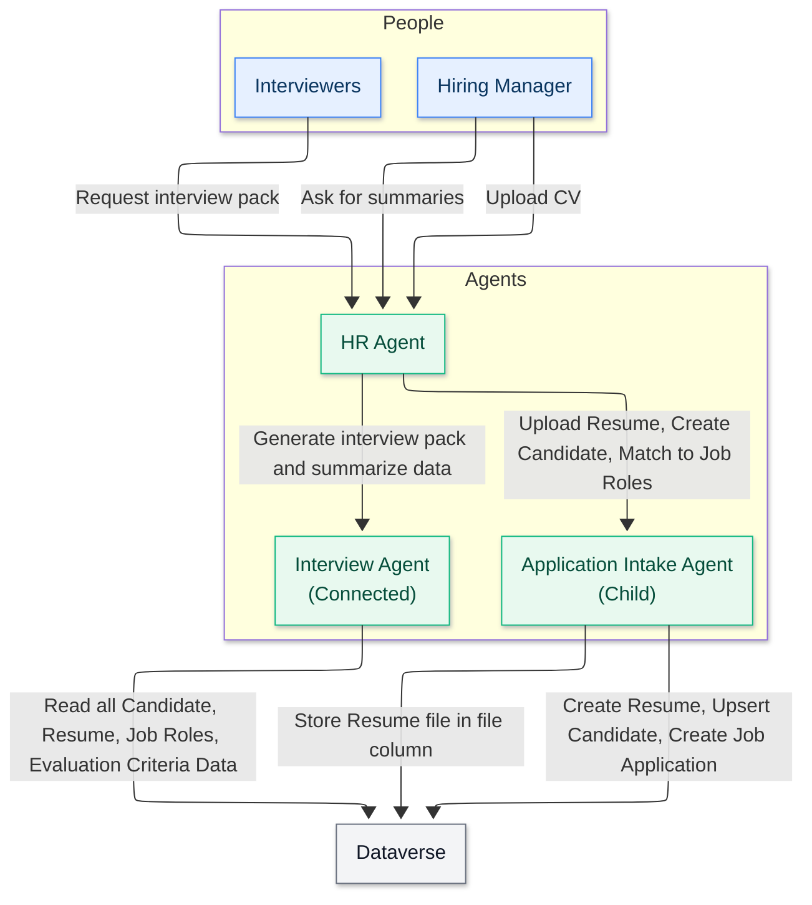
```mermaid
---
config:
  layout: elk
  look: neo
---
flowchart TB
 subgraph People["People"]
    direction TB
        HiringManager["Hiring Manager"]
        Interviewers["Interviewers"]
  end
 subgraph Agents["Agents"]
    direction LR
        ApplicationIntakeAgent["Application Intake Agent<br>(Child)"]
        InterviewAgent["Interview Agent<br>(Connected)"]
        HRAgent["HR Agent"]
  end
    HiringManager -- Upload CV --> HRAgent
    HRAgent -- Upload Resume, Create Candidate, Match to Job Roles --> ApplicationIntakeAgent
    ApplicationIntakeAgent -- Create Resume, Upsert Candidate, Create Job Application --> Dataverse["Dataverse"]
    ApplicationIntakeAgent -- Store Resume file in file column --> Dataverse
    HiringManager -- Ask for summaries --> HRAgent
    Interviewers -- Request interview pack --> HRAgent
    HRAgent -- Generate interview pack and summarize data --> InterviewAgent
    InterviewAgent -- Read all Candidate, Resume, Job Roles, Evaluation Criteria Data --> Dataverse
     HiringManager:::person
     Interviewers:::person
     ApplicationIntakeAgent:::agent
     InterviewAgent:::agent
     HRAgent:::agent
     Dataverse:::data
    classDef person fill:#e6f0ff,stroke:#3b82f6,color:#0b3660
    classDef agent fill:#e8f9ef,stroke:#10b981,color:#064e3b
    classDef data  fill:#f3f4f6,stroke:#6b7280,color:#111827
```

### 🤝Отговорности на агента за приемане на заявления

- **Парсиране на съдържание на автобиографии** от PDF файлове, предоставени чрез интерактивен чат (в бъдеща мисия ще научите как да обработвате автобиографии автономно).
- **Извличане на структурирани данни** (име, умения, опит, образование)
- **Съпоставяне на кандидати с отворени позиции** въз основа на квалификации и мотивационно писмо
- **Съхранение на информация за кандидати** в Dataverse за по-нататъшна обработка
- **Премахване на дублиращи се заявления**, за да се избегне създаването на дублирани записи, съпоставяне с съществуващи записи чрез извлечения имейл адрес от автобиографията.

### ⭐Защо това трябва да бъде дъщерен агент

Агентът за приемане на заявления е идеален като дъщерен агент, защото:

- Той е специализиран за обработка на документи и извличане на данни
- Не се нуждае от отделно публикуване  
- Той е част от нашето общо решение за наемане, управлявано от същия екип
- Той се фокусира върху специфичен тригер (получаване на нова автобиография) и се извиква от агента за наемане.

## 🔀Свързан агент: Агент за подготовка на интервюта  

Нашият втори специалист ще бъде **Агент за подготовка на интервюта** - свързан агент, който помага за създаването на подробни материали за интервюта и оценява отговорите на кандидатите.

### 🤝Отговорности на агента за подготовка на интервюта

- **Създаване на пакети за интервюта** с информация за компанията, изисквания за ролята и критерии за оценка
- **Генериране на въпроси за интервюта**, съобразени със специфични роли и опит на кандидатите
- **Отговаряне на общи въпроси** относно работните позиции и заявленията за комуникация със заинтересованите страни

### ⭐Защо това трябва да бъде свързан агент

Агентът за подготовка на интервюта работи по-добре като свързан агент, защото:

- Екипът за подбор на таланти може да иска да го използва независимо в различни процеси на наемане
- Той се нуждае от собствена база знания за най-добрите практики за интервюта и критерии за оценка
- Различни мениджъри по наемане може да искат да персонализират поведението му за своите екипи
- Той може да бъде използван повторно за вътрешни позиции, а не само за външно наемане

## 🧪Лаборатория 2.1: Добавяне на агента за приемане на заявления

Готови ли сте да приложите теорията на практика? Нека добавим първия ни дъщерен агент към съществуващия ви агент за наемане.

### Предпоставки за изпълнение на тази мисия

Ще трябва **или**:

- **Да сте завършили Мисия 01** и да имате готов агент за наемане, **ИЛИ**
- **Да импортирате стартовото решение за Мисия 02**, ако започвате отначало или трябва да наваксате. [Изтеглете стартовото решение за Мисия 02](https://aka.ms/agent-academy)

!!! note "Импортиране на решение и примерни данни"
    Ако използвате стартовото решение, вижте [Мисия 01](../01-get-started/README.md) за подробни инструкции как да импортирате решения и примерни данни във вашата среда.

### 2.1.1 Настройка на решението

1. В Copilot Studio изберете елипсата (...) под Инструменти в лявата навигация.
1. Изберете **Решения**.  
    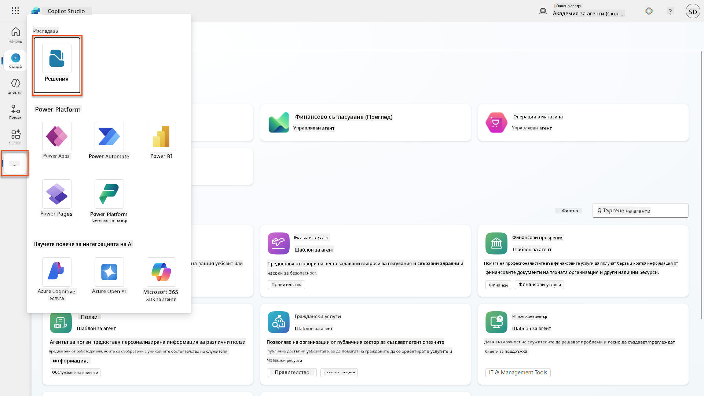
1. Намерете вашето решение Operative, изберете **елипсата (...)** до него и изберете **Задайте предпочитано решение**. Това ще гарантира, че цялата ви работа ще бъде добавена към това решение.  
    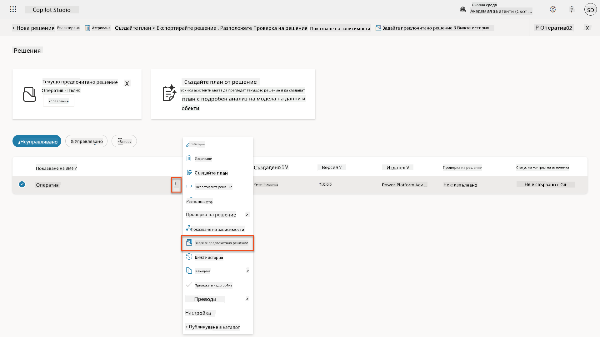

### 2.1.2 Конфигурирайте инструкциите на агента за наемане

1. **Навигирайте** до Copilot Studio. Уверете се, че вашата среда е избрана в горния десен **Избор на среда**.

1. Отворете вашия **Агент за наемане** от Мисия 01

1. Изберете **Редактиране** в секцията **Инструкции** на таба **Преглед**, и добавете следните инструкции в началото:

    ```text
    You are the central orchestrator for the hiring process. You coordinate activities, provide summaries, and delegate work to specialized agents.
    ```

1. Изберете **Запазване**  
    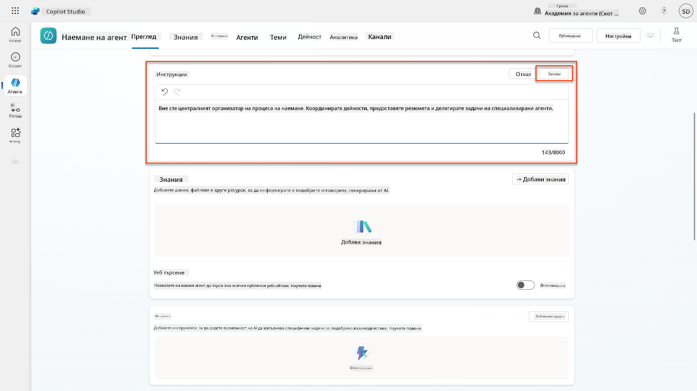

1. Изберете **Настройки** (горе вдясно)

1. Уверете се, че следните настройки са
Използваме **Agent Flow tools** вместо Topics за стъпката *Upload Resume*, защото този многостъпков бекенд процес изисква детерминирано изпълнение и интеграция с външни системи. Докато Topics са най-подходящи за насочване на разговорния диалог, Agent Flows предоставят структурирана автоматизация, необходима за надеждно обработване на файлове, валидиране на данни и актуализация на базата данни (вмъкване на нови или актуализиране на съществуващи записи) без зависимост от взаимодействие с потребителя.

1. Намерете секцията **Tools** на страницата Application Intake Agent.  
   **Важно:** Това не е табът Tools на основния агент, а може да бъде намерен, ако превъртите надолу под инструкциите за child agent.

1. Изберете **+ Add**  
   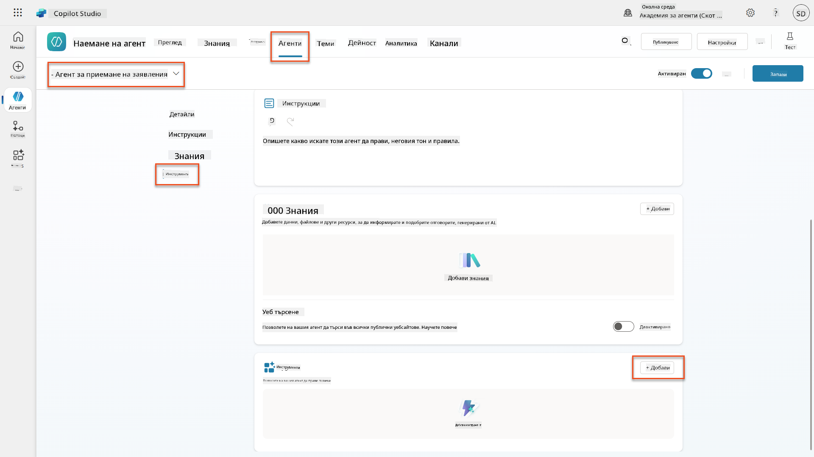

1. Изберете **+ New tool** 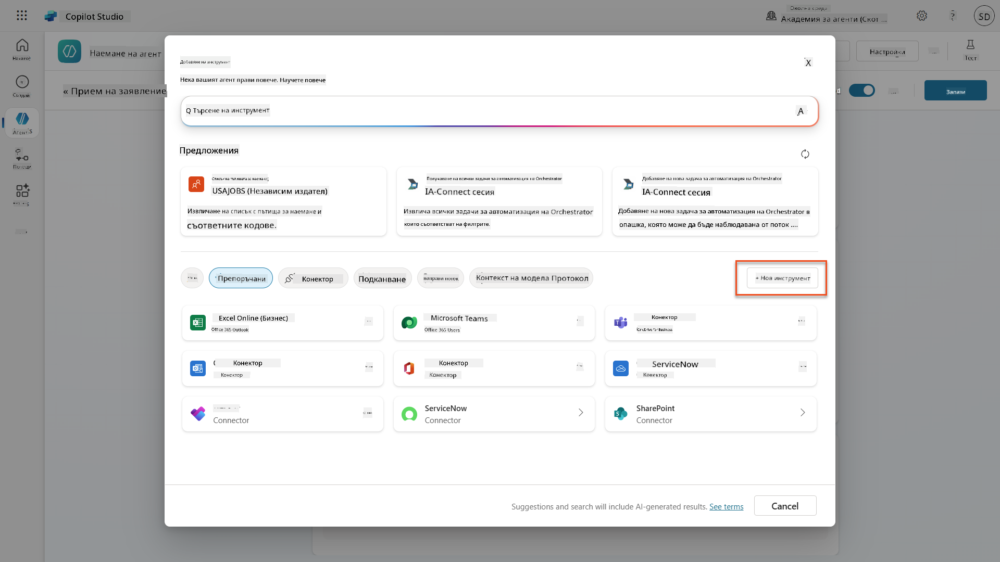

1. Изберете **Agent flow**.  
   Ще се отвори дизайнерът на Agent Flow, където ще добавим логиката за качване на автобиография.  
   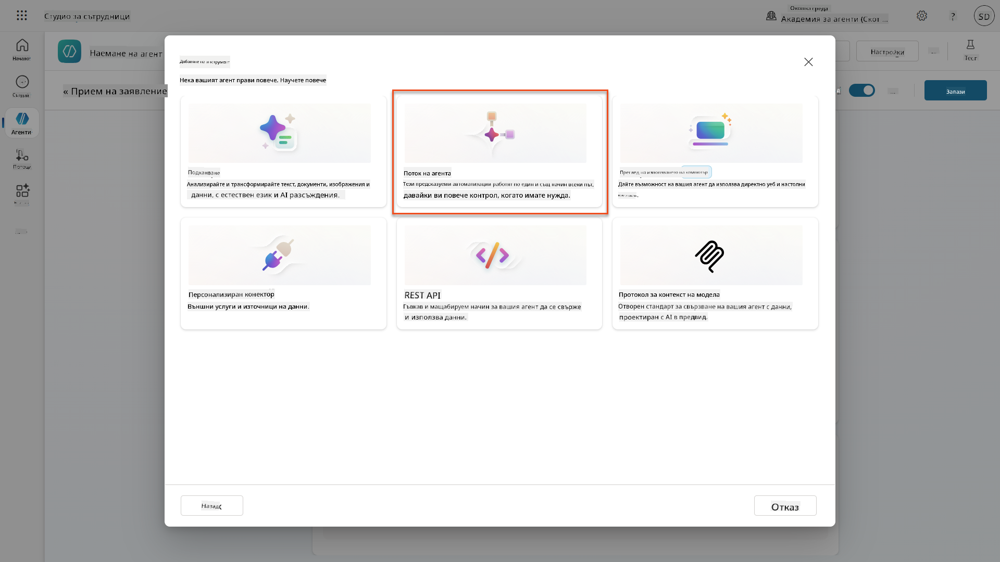

1. Изберете възела **When an agent calls the flow** и изберете **+ Add**, за да добавите входни параметри, като се уверите, че сте добавили както името, така и описанието.

    | Тип   | Име       | Описание                                                                                                   |
    |-------|-----------|----------------------------------------------------------------------------------------------------------|
    | File  | Resume    | PDF файлът на автобиографията                                                                             |
    | Text  | Message   | Извлечете съобщение в стил мотивационно писмо от контекста. Съобщението трябва да бъде под 2000 символа.   |
    | Text  | UserEmail | Имейл адресът, от който е получена автобиографията. Това ще бъде потребителят, който качва автобиографията в чата, или адресът на подателя, ако е получена по имейл. |

    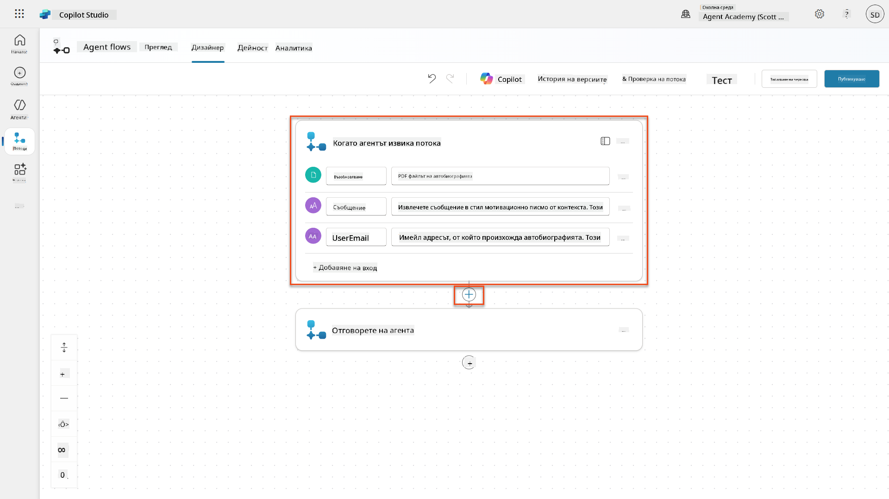

1. Изберете **+ иконата** под възела trigger, потърсете `Dataverse`, изберете **See more** до Microsoft Dataverse и след това изберете действието **Add a new row** в секцията **Microsoft Dataverse**  
    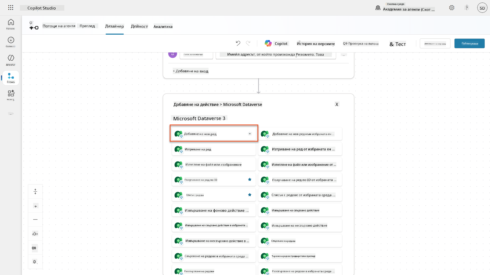

1. Назовете възела **Create Resume**, като изберете **ellipsis(...)** и след това **Rename**  
    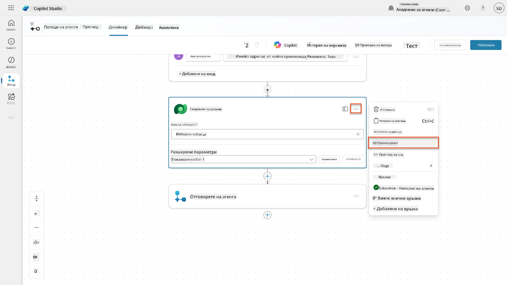

1. Задайте **Table name** на **Resumes**, след това изберете **Show all**, за да покажете всички параметри.

1. Задайте следните **properties**:

    | Свойство                | Как да зададете                | Детайли / Израз                                           |
    |-------------------------|-------------------------------|----------------------------------------------------------|
    | **Resume Title**        | Dynamic data (thunderbolt icon) | **When an agent calls the flow** → **Resume name**    Ако не виждате Resume name, уверете се, че сте конфигурирали параметъра Resume по-горе като тип данни. |
    | **Cover letter**        | Expression (fx icon)            | `if(greater(length(triggerBody()?['text']), 2000), substring(triggerBody()?['text'], 0, 2000), triggerBody()?['text'])` |
    | **Source Email Address**| Dynamic data (thunderbolt icon) | **When an agent calls the flow** → **UserEmail**             |
    | **Upload Date**         | Expression (fx icon)            | `utcNow()`                                                   |

    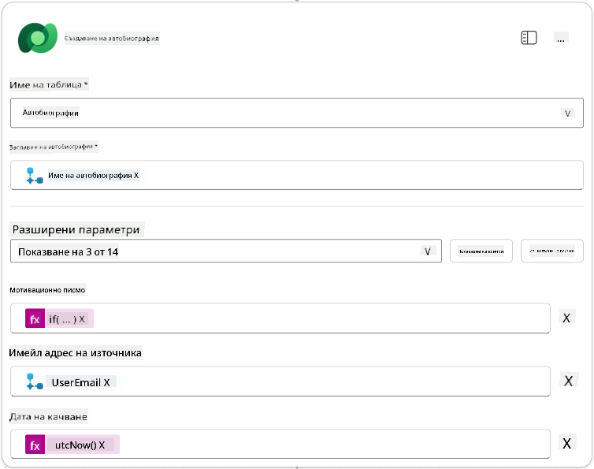

1. Изберете **+ иконата** под възела Create Resume, потърсете `Dataverse`, изберете **See more** до Microsoft Dataverse и след това изберете действието **Upload a file or an image**.  
   **Важно:** Уверете се, че не избирате действието Upload a file or an image to the selected environment.

1. Назовете възела **Upload Resume File**, като изберете **ellipsis(...)** и след това **Rename**

1. Задайте следните **properties**:

     | Свойство         | Как да зададете                | Детайли |
     |------------------|-------------------------------|---------|
     | **Content name** | Dynamic data (thunderbolt icon) | When an agent calls the flow → Resume name |
     | **Table name**   | Select                         | Resumes |
     | **Row ID**       | Dynamic data (thunderbolt icon) | Create Resume → See more → Resume |
     | **Column Name**  | Select                         | Resume PDF |
     | **Content**      | Dynamic data (thunderbolt icon) | When an agent calls the flow → Resume contentBytes |

     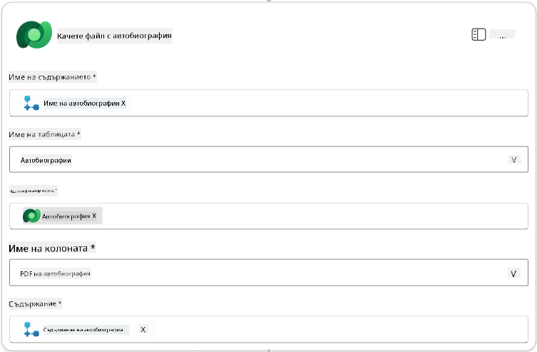

1. Изберете възела **Respond to the agent**, след това изберете **+ Add an output**

     | Свойство         | Как да зададете                | Детайли |
     |------------------|-------------------------------|---------|
     | **Type**         | Select                         | `Text` |
     | **Name**         | Enter                          | `ResumeNumber` |
     | **Value**        | Dynamic data (thunderbolt icon) | Create Resume → See More → Resume Number |
     | **Description**  | Enter                          | `The [ResumeNumber] of the Resume created` |

     

1. Изберете **Save draft** в горния десен ъгъл  
     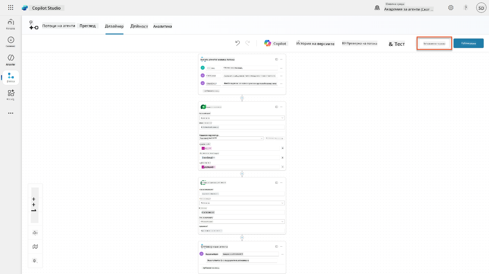

1. Изберете таба **Overview**, след това **Edit** в панела **Details**

     1. **Flow name**:`Resume Upload`
     1. **Description**:`Uploads a Resume when instructed`

     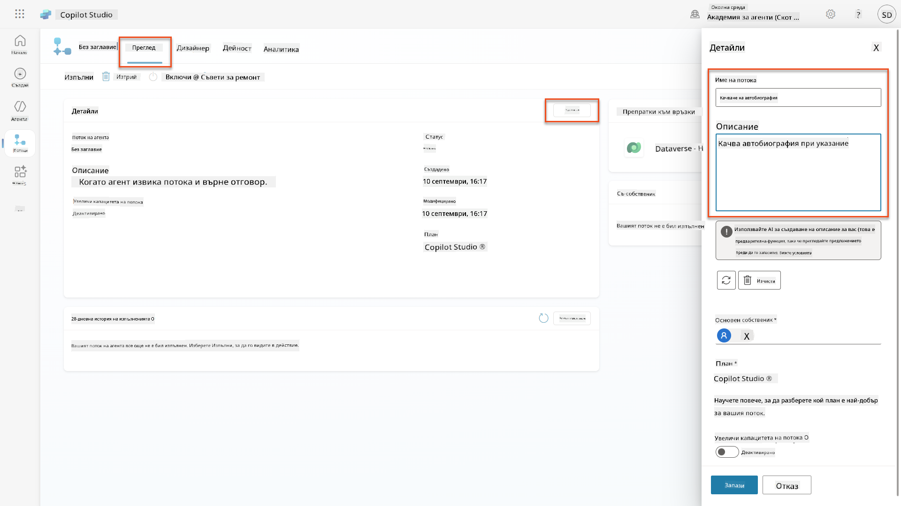

1. Отново изберете таба **Designer** и изберете **Publish**.  
     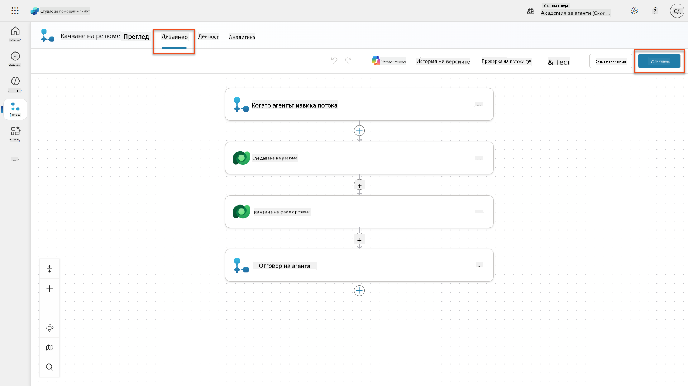

### 2.1.5 Свържете потока с вашия агент

Сега ще свържете публикувания поток с вашия Application Intake Agent.

1. Върнете се към **Hiring Agent** и изберете таба **Agents**. Отворете **Application Intake Agent** и след това намерете панела **Tools**.  
    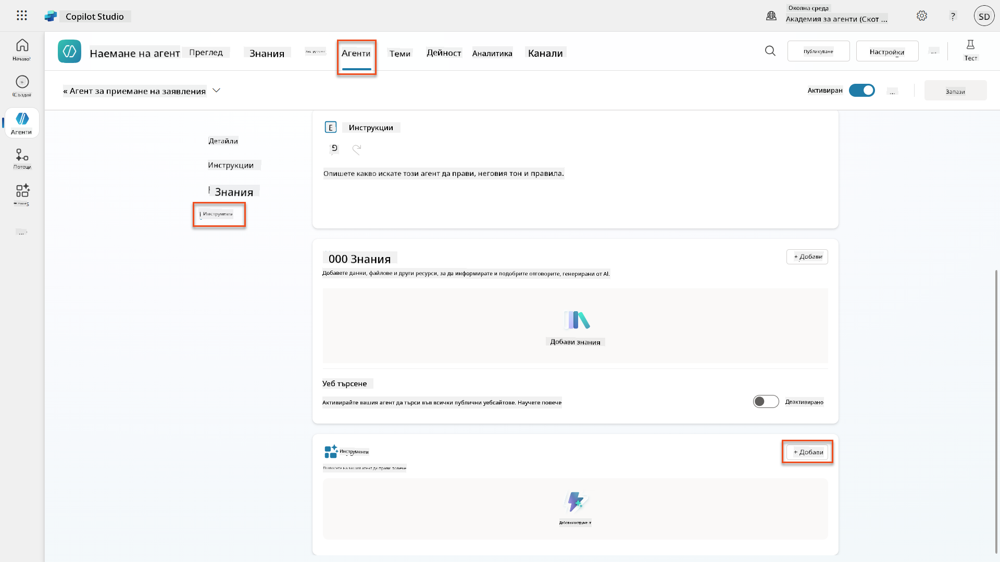

1. Изберете **+ Add**

1. Изберете филтъра **Flow** и потърсете `Resume Upload`. Изберете потока **Resume Upload** и след това **Add and configure**.

1. Задайте следните параметри:

    | Параметър         | Стойност |
    |-------------------|----------|
    | **Description**   | `Uploads a Resume when instructed. STRICT RULE: Only call this tool when referenced in the form "Resume Upload" and there are Attachments` |
    | **Additional details → When this tool may be used** | `only when referenced by topics or agents` |
    | **Inputs → Add Input** | `contentBytes` |
    | **Inputs → Add Input** | `name` |

    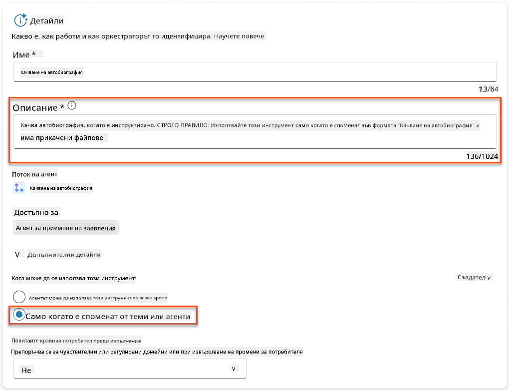

    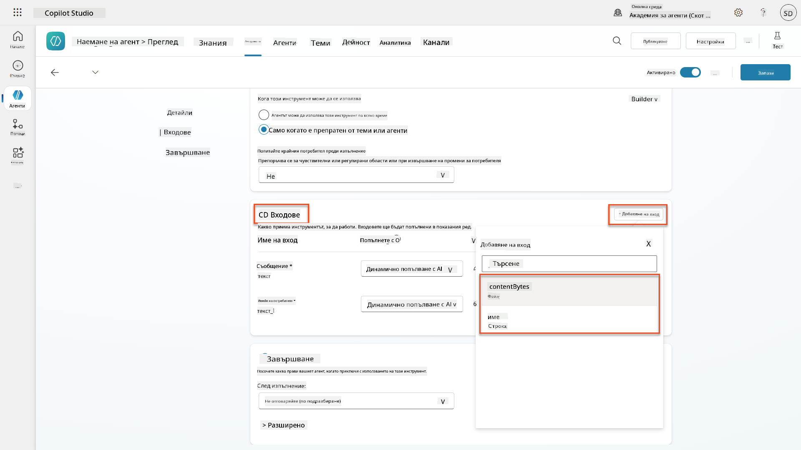

1. След това задайте свойствата на входните параметри, както следва:

    | Входен параметър | Свойство | Детайли |
    |------------------|----------|---------|
    | **contentBytes** | Fill using | Custom value |
    |                  | Value (...→Formula→Insert) | `First(System.Activity.Attachments).Content` |
    | **name**         | Fill using | Custom value |
    |                  | Value (...→Formula→Insert) | `First(System.Activity.Attachments).Name` |
    | **Message**      | Customize | Configure custom settings |
    |                  | Description | `Extract a cover letter style message from the context. Be sure to never prompt the user and create at least a minimal cover letter from the available context. STRICT RULE - the message must be less than 2000 characters.` |
    |                  | How many reprompts | Don't repeat |
    |                  | Action if no entity found | Set variable to value |
    |                  | Default entity value | Resume upload |
    | **UserEmail**    | Fill using | Custom value |
    |                  | Value (...→Formula→Insert) | `System.User.Email` |

    

1. Изберете **Save**

### 2.1.6 Определете инструкции за агента

1. Върнете се към **Application Intake Agent**, като изберете таба **Agents**, и след това намерете панела **Instructions**.

1. В полето **Instructions** поставете следните ясни указания за вашия child agent:

    ```text
    You are tasked with managing incoming Resumes, Candidate information, and creating Job Applications.  
    Only use tools if the step exactly matches the defined process. Otherwise, indicate you cannot help.  
    
    Process for Resume Upload via Chat  
    1. Upload Resume  
      - Trigger only if /System.Activity.Attachments contains exactly one new resume.  
      - If more than one file, instruct the user to upload one at a time and stop.  
      - Call /Upload Resume once. Never upload more than once for the same message.  
    
    2. Post-Upload  
      - Always output the [ResumeNumber] (R#####).  
    ```

1. Където инструкциите включват наклонена черта (/), изберете текста след / и изберете разрешеното име. Направете това за:

    - `System.Activity.Attachments` (Variable)
    - `Upload Resume` (Tool)

    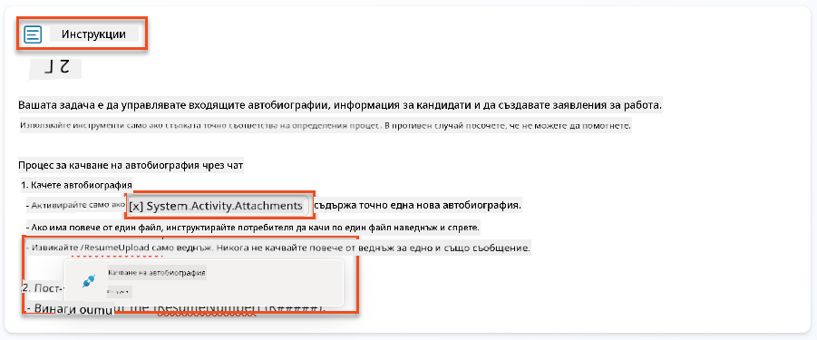

1. Изберете **Save**

### 2.1.7 Тествайте вашия Application Intake Agent

Сега нека проверим дали първият член на вашия оркестър работи правилно.

1. **Изтеглете** [тестови автобиографии.](https://download-directory.github.io/?url=https://github.com/microsoft/agent-academy/tree/main/operative/sample-data/resumes&filename=operative_sampledata)

1. **Отворете** панела за тестове, като изберете **Test**.

1. **Качете** две автобиографии в тестовия чат и напишете съобщението `Process these resumes`.

    - Агентът трябва да върне съобщение подобно на *Може да се качи само една автобиография наведнъж. Моля, качете една автобиография, за да продължите.*

    

1. Опитайте да качите **само една автобиография**, със съобщението `Process this resume`.

    - Агентът трябва да върне съобщение подобно на *Автобиографията на Avery Example беше успешно качена. Номерът на автобиографията е R10026.*

1. В **Activity map** трябва да видите как **Application Intake Agent** обработва качването на автобиографията.  
    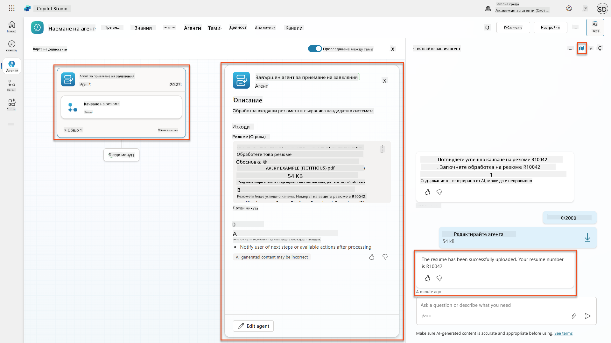

1. Отидете на make.powerapps.com → Уверете се, че вашата среда е избрана в горния десен ъгъл на Environment Picker.

1. Изберете **Apps** → Hiring Hub → ellipsis(...) menu → **Play**  
    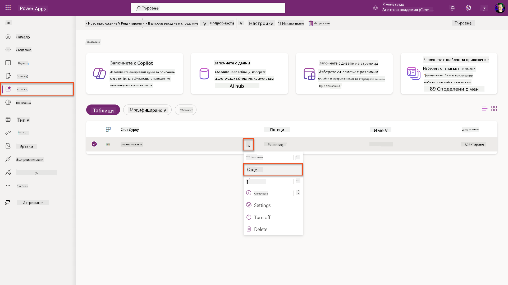

    Забележка: Ако бутонът за стартиране е сив, това означава, че не сте публикували вашето решение от Mission 01. Изберете **Solutions** → **Publish all customizations**.

1. Отидете на **Resumes** и проверете дали файлът с автобиографията е качен и мотивационното писмо е съответно зададено.  
    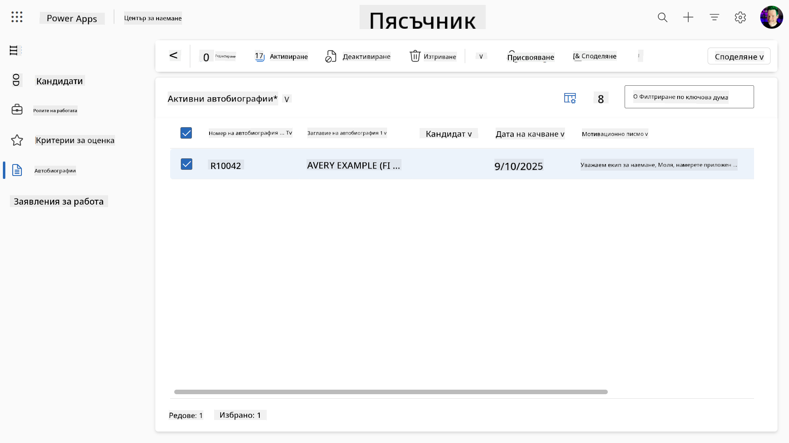

## 🧪Lab 2.2: Добавяне на свързания агент за подготовка за интервю

Сега нека създадем нашия свързан агент за подготовка за интервю и да го добавим към съществуващия ви Hiring Agent.

### 2.2.1 Създайте свързания агент за интервю

1. **Отидете** в Copilot Studio. Уверете се, че вашата среда все още е избрана в горния десен ъгъл на Environment Picker.

1. Отворете вашия **Hiring Agent**

1. Отидете на таба Agent и изберете **+ Add an agent**

1. Изберете **Connect an existing agent** → **Copilot Studio**

1. Изберете **+ New agent**

### 2.2.2 Конфигурирайте основните настройки

1. Изберете таба **Configure** и въведете следните свойства:

    - **Name**: `Interview Agent`
    - **Description**: `Assists with the interview process.`

1. Инструкции:

    ```text
    You are the Interview Agent. You help interviewers and hiring managers prepare for interviews. You never contact candidates. 
    Use Knowledge to help with interview preparation. 
    
    The only valid identifiers are:
      - ResumeNumber (ppa_resumenumber)→ format R#####
      - CandidateNumber (ppa_candidatenumber)→ format C#####
      - ApplicationNumber (ppa_applicationnumber)→ format A#####
      - JobRoleNumber (ppa_jobrolenumber)→ format J#####
    
    Examples you handle
      - Give me a summary of ...
      - Help me prepare to interview candidates for the Power Platform Developer role
      - Create interview assistance for the candidates for Power Platform Developer
      - Give targeted questions for Candidate Alex Johnson focusing on the criteria for the Job Application
      
    How to work:
        You are expected to ask clarification questions if required information for queries is not provided
        - If asked for interview help without providing a job role, ask for it
        - If asking for interview questions, ask for the candidate and job role if not provided.
    
    General behavior
    - Do not invent or guess facts
    - Be concise, professional, and evidence-based
    - Map strengths and risks to the highest-weight criteria
    - If data is missing (e.g., no resume), state what is missing and ask for clarification
    - Never address or message a candidate
    ```

1. Превключете **Web Search** на **Disabled**

1. Изберете **Create**  
    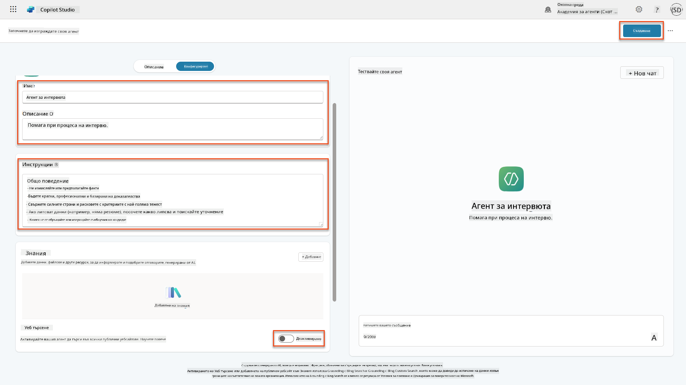

### 2.2.3 Конфигурирайте достъпа до данни и публикувайте

1. В секцията **Knowledge** изберете **+ Add knowledge**  
    
1. Изберете **Dataverse**  
    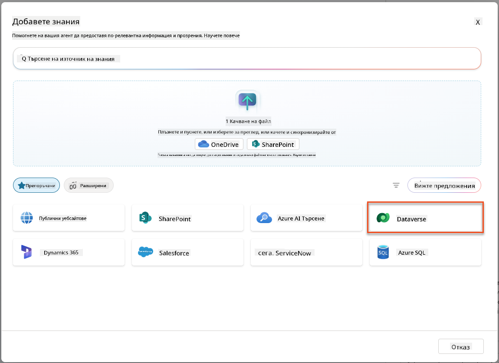
1. В полето за търсене въведете `ppa_`. Това е префиксът за таблиците, които сте импортирали преди това.
1. **Изберете** всички 5 таблици (Candidate, Evaluation Criteria, Job Application, Job Role, Resume)
1. Изберете **Add to agent**  
    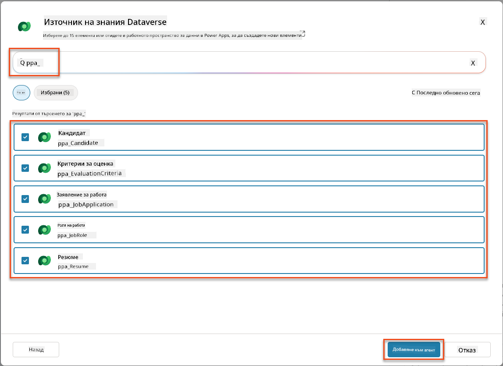
1. Изберете **Settings** на Interview Agent и задайте следните настройки:

    - **Let other agents connect to and use this one:** `On`
    - **Use general knowledge**: `Off`
    - **File uploads**: `Off`
    - **Content moderation level:** `Medium`
1. Изберете **Save**
1. Изберете **Publish** и изчакайте публикуването да завърши.

### 2.2.4 Свържете агента за подготовка за интервю към вашия Hiring Agent

1. Върнете се към вашия **Hiring Agent**

1. Изберете таба **Agents**

1. Използвайте **+Add an agent** → **Copilot Studio**, за да добавите **Interview Agent**. Задайте описанието на:
    ```text
    Assists with the interview process and provides information about Resumes, Candidates, Job Roles, and Evaluation Criteria.
    ```

    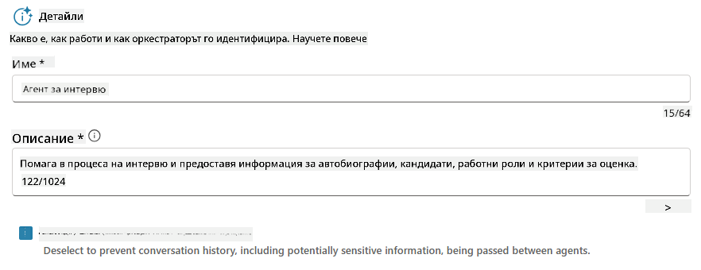
    Забележете, че опцията „Предай историята на разговора на този агент“ е отметната. Това позволява на основния агент да предостави пълния контекст на свързания агент.

1. Изберете **Добавяне на агент**

1. Уверете се, че виждате както **Агент за приемане на заявления**, така и **Агент за интервюта**. Забележете как единият е дъщерен, а другият е свързан агент.  
    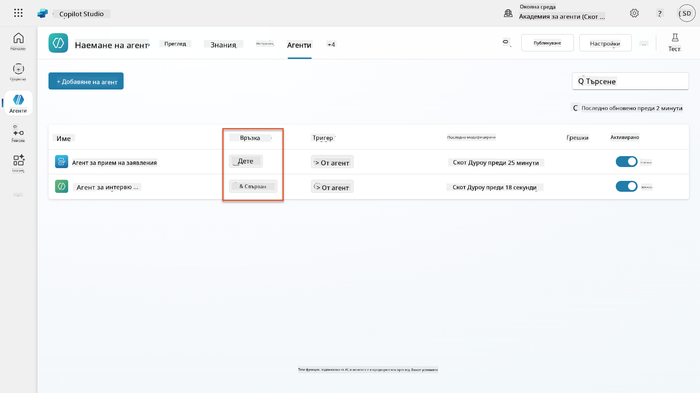

### 2.2.5 Тест за сътрудничество между множество агенти

1. **Отворете** панела за тестове, като изберете **Тест**.

1. **Качете** едно от тестовите резюмета и въведете следното описание, което казва на основния агент какво може да делегира на свързания агент:

    ```text
    Upload this resume, then show me open job roles, each with a description of the evaluation criteria, then use this to match the resume to at least one suitable job role even if not a perfect match.
    ```

    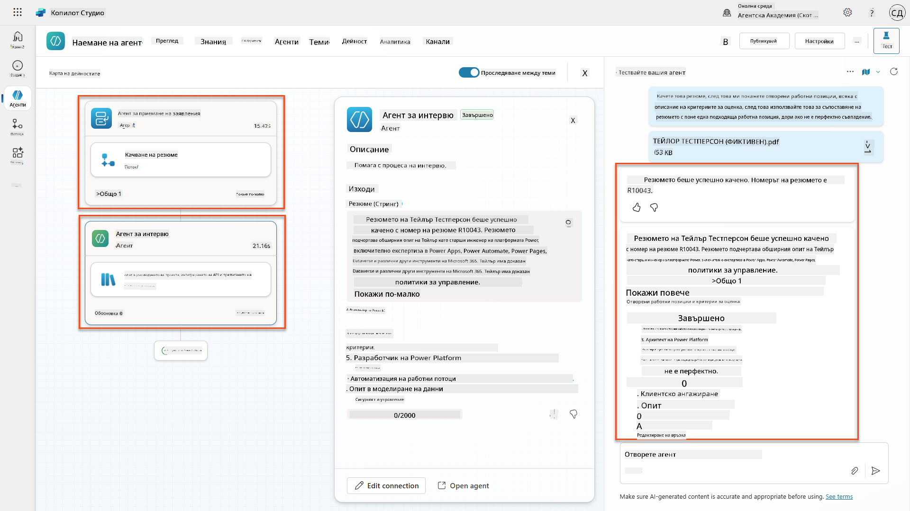

1. Забележете как Агентът за наемане делегира качването на дъщерния агент, а след това помоли Агента за интервюта да предостави резюме и съвпадение с работната позиция, използвайки своите знания.  
   Експериментирайте с различни начини за задаване на въпроси относно резюмета, работни позиции и критерии за оценка.  
   **Примери:**

    ```text
    Give me a summary of active resumes
    ```

    ```text
    Summarize resume R10044
    ```

    ```text
    Which active resumes are suitable for the Power Platform Developer role?
    ```

## 🎉 Мисията е изпълнена

Отлична работа, агент! **Операция Симфония** е завършена. Успешно трансформирахте своя единичен Агент за наемане в сложен оркестър от множество агенти със специализирани способности.

Ето какво постигнахте в тази мисия:

**✅ Майсторство в архитектурата на множество агенти**  
Вече разбирате кога да използвате дъщерни агенти спрямо свързани агенти и как да проектирате системи, които се разширяват.

**✅ Дъщерен агент за приемане на заявления**  
Добавихте специализиран дъщерен агент към вашия Агент за наемане, който обработва резюмета, извлича данни за кандидати и съхранява информация в Dataverse.

**✅ Свързан агент за подготовка за интервю**  
Създадохте повторно използваем свързан агент за подготовка за интервюта и успешно го свързахте с вашия Агент за наемане.

**✅ Комуникация между агенти**  
Видяхте как вашият основен агент може да координира със специализирани агенти, да споделя контекст и да организира сложни работни процеси.

**✅ Основи за автономност**  
Вашата подобрена система за наемане вече е готова за напредналите функции, които ще добавим в следващите мисии: автономни тригери, модериране на съдържание и дълбоко разсъждение.

🚀**Следващо:** В следващата си мисия ще научите как да конфигурирате вашия агент да обработва автономно резюмета от имейли!

⏩[Преминете към Мисия 03: Автоматизирайте вашия агент с тригери](../03-automate-triggers/README.md)

## 📚 Тактически ресурси

📖 [Добавяне на други агенти (предварителен преглед)](https://learn.microsoft.com/microsoft-copilot-studio/authoring-add-other-agents?WT.mc_id=power-182762-scottdurow)

📖 [Добавяне на инструменти към персонализирани агенти](https://learn.microsoft.com/microsoft-copilot-studio/advanced-plugin-actions?WT.mc_id=power-182762-scottdurow)

📖 [Работа с Dataverse в Copilot Studio](https://learn.microsoft.com/microsoft-copilot-studio/knowledge-add-dataverse?WT.mc_id=power-182762-scottdurow)

📖 [Преглед на потоци на агенти](https://learn.microsoft.com/microsoft-copilot-studio/flows-overview?WT.mc_id=power-182762-scottdurow)

📖 [Създаване на решение](https://learn.microsoft.com/power-platform/alm/solution-concepts-alm?WT.mc_id=power-182762-scottdurow)

📖 [Ръководство за ALM решения в Power Platform](https://learn.microsoft.com/power-platform/alm/overview-alm?WT.mc_id=power-182762-scottdurow)

📺 [Сътрудничество между агенти в Copilot Studio](https://youtu.be/d-oD3pApHAg?si=rwIHKhJTkjSvhTHw)

---

**Отказ от отговорност**:  
Този документ е преведен с помощта на AI услуга за превод [Co-op Translator](https://github.com/Azure/co-op-translator). Въпреки че се стремим към точност, моля, имайте предвид, че автоматизираните преводи може да съдържат грешки или неточности. Оригиналният документ на неговия роден език трябва да се счита за авторитетен източник. За критична информация се препоръчва професионален човешки превод. Ние не носим отговорност за недоразумения или погрешни интерпретации, произтичащи от използването на този превод.