<!--
CO_OP_TRANSLATOR_METADATA:
{
  "original_hash": "616d142d4fb5f45d2a168fad6c1f9545",
  "translation_date": "2025-10-20T23:01:25+00:00",
  "source_file": "docs/operative-preview/07-multimodal-prompts/README.md",
  "language_code": "bg"
}
-->
# 🚨 Мисия 07: Извличане на съдържание от автобиографии с многомодални подсказки

--8<-- "disclaimer.md"

## 🕵️‍♂️ КОДОВО ИМЕ: `ДОКУМЕНТ АВТОБИОГРАФИЯ РЕКОН`

> **⏱️ Времеви прозорец на операцията:** `~45 минути`

## 🎯 Кратко описание на мисията

Добре дошли, оперативен агент. Предишните ви мисии ви дадоха мощни умения за оркестрация на агенти, но сега е време да отключите революционна способност: **анализ на многомодални документи**.

Вашата задача, ако решите да я приемете, е **Документ Автобиография Рекон** - извличане на структурирани данни от всеки документ с прецизност. Докато вашите агенти могат лесно да обработват текст, реалният свят изисква ежедневно работа с PDF файлове, изображения и сложни документи. Автобиографиите се натрупват, фактурите трябва да се обработват, а формулярите изискват моментална дигитализация.

Тази мисия ще ви трансформира от създател на агенти, работещи само с текст, в **експерт по многомодални документи**. Ще научите как да конфигурирате AI, който чете и разбира документи като човешки анализатор - но с AI скорост и последователност. До края на мисията ще сте изградили цялостна система за извличане на автобиографии, която се интегрира с вашия процес на наемане.

Техниките, които ще научите тук, ще бъдат от съществено значение за напредналите операции по обосновка на данни в следващата ви мисия.

## 🔎 Цели

В тази мисия ще научите:

1. Какво представляват многомодалните подсказки и кога да използвате различни AI модели
1. Как да конфигурирате подсказки с входове от изображения и документи
1. Как да форматирате изходите на подсказките като JSON за извличане на структурирани данни
1. Най-добри практики за инженеринг на подсказки с анализ на документи
1. Как да интегрирате многомодални подсказки с Agent Flows

## 🧠 Разбиране на многомодалните подсказки

### Какво прави една подсказка "многомодална"?

Традиционните подсказки работят само с текст. Но многомодалните подсказки могат да обработват множество типове съдържание:

- **Текст**: Писмени инструкции и съдържание
- **Изображения**: Снимки, скрийншотове, графики и диаграми (.PNG, .JPG, .JPEG)  
- **Документи**: Фактури, автобиографии, формуляри (.PDF)

Тази способност отваря мощни сценарии като анализ на автобиографии, обработка на фактури или извличане на данни от формуляри.

### Защо многомодалността е важна за вашите работни процеси

Всеки ден вашата организация се сблъсква с тези предизвикателства при обработката на документи:

- **Преглед на автобиографии**: Ръчното четене на стотици автобиографии отнема ценно време
- **Обработка на фактури**: Извличане на данни за доставчици, суми и дати от различни формати на документи
- **Анализ на формуляри**: Превръщане на хартиени формуляри в дигитални данни

Многомодалните подсказки премахват тези пречки, като комбинират езиковото разбиране на AI с визуални аналитични способности. Това дава на вашия AI способността да обработва документи толкова ефективно, колкото и текст.

### Чести бизнес сценарии

Ето някои примери за приложение на многомодални подсказки:

| Сценарий                | Задача                                                                                                                                      | Примерни изходни полета                                                                                   |
|-------------------------|-------------------------------------------------------------------------------------------------------------------------------------------|---------------------------------------------------------------------------------------------------------|
| **Преглед на автобиографии**    | Извличане на име на кандидат, имейл, телефон, текуща длъжност, години опит и ключови умения.                                                 | Име на кандидат, Имейл адрес, Телефонен номер, Текуща длъжност, Години опит, Ключови умения         |
| **Обработка на фактури**  | Извличане на информация за доставчик, дата на фактура, обща сума и елементи от фактурата.                                                 | Име на доставчик, Дата на фактура, Обща сума, Елементи от фактурата                                             |
| **Анализ на формуляри**       | Анализиране на този формуляр за кандидатстване и извличане на всички попълнени полета.                                                                              | Име на поле (напр. Име на кандидат), Въведена стойност (напр. Иван Иванов), ...                                  |
| **Проверка на документи за идентификация** | Извличане на име, номер на идентификация, дата на изтичане и адрес от този документ за идентификация. Проверка дали целият текст е ясно четим и отбелязване на неясни секции. | Пълно име, Номер на идентификация, Дата на изтичане, Адрес, Флаг за неясни секции                        |

## ⚙️ Избор на модел в AI Builder

AI Builder предлага различни модели, оптимизирани за специфични задачи. Разбирането кой модел да използвате е от решаващо значение за успеха.

!!! note "Актуално към септември 2025"
    Моделите на AI Builder се актуализират редовно, затова проверете последната [документация за настройки на моделите на AI Builder](https://learn.microsoft.com/ai-builder/prompt-modelsettings) за текуща наличност на модели.

### Сравнение на модели

Всички следващи модели поддържат визуална и документална обработка

| Модел | 💰Цена | ⚡Скорост | ✅Най-добър за |
|-------|------|-------|----------|
| **GPT-4.1 mini** | Основен (най-икономичен) | Бърз | Стандартна обработка на документи, обобщение, проекти с ограничен бюджет |
| **GPT-4.1** | Стандартен | Умерен | Сложни документи, създаване на напреднало съдържание, нужда от висока точност |
| **o3** | Премиум | Бавен (първо разсъждения) | Анализ на данни, критично мислене, сложни решения |
| **GPT-5 chat** | Стандартен | Подобрен | Най-ново разбиране на документи, най-висока точност на отговорите |
| **GPT-5 reasoning** | Премиум | Бавен (сложен анализ) | Най-сложен анализ, планиране, напреднало разсъждение |

### Обяснение на настройките за температура

Температурата контролира колко креативни или предсказуеми са отговорите на AI:

- **Температура 0**: Най-предсказуеми, последователни резултати (най-добро за извличане на данни)
- **Температура 0.5**: Балансирана креативност и последователност  
- **Температура 1**: Максимална креативност (най-добро за генериране на съдържание)

За анализ на документи използвайте **температура 0**, за да осигурите последователно извличане на данни.

## 📊 Формати на изхода: Текст срещу JSON

Изборът на правилния формат на изхода е от решаващо значение за последващата обработка.

### Кога да използвате текстов изход

Текстовият изход работи добре за:

- Човешки четими обобщения
- Прости класификации
- Съдържание, което не изисква структурирана обработка

### Кога да използвате JSON изход

JSON изходът е от съществено значение за:

- Извличане на структурирани данни
- Интеграция с бази данни или системи
- Обработка на Power Automate потоци
- Последователно картографиране на полета

### Най-добри практики за JSON

1. **Определете ясни имена на полета**: Използвайте описателни, последователни наименования
1. **Осигурете примери**: Включете примерни изходи и стойности за всяко поле
1. **Уточнете типове данни**: Включете примери за дати, числа и текст
1. **Обработвайте липсващи данни**: Планирайте за null или празни стойности
1. **Валидирайте структурата**: Тествайте с различни типове документи

### Съображения за качество на документите

- **Резолюция**: Уверете се, че изображенията са ясни и четими
- **Ориентация**: Завъртете документите в правилната ориентация преди обработка
- **Поддръжка на формати**: Тествайте с вашите специфични типове документи (PDF, JPG, PNG)
- **Ограничения за размер**: Бъдете наясно с ограниченията за размер на файловете във вашата среда

### Оптимизация на производителността

- **Изберете подходящи модели**: Актуализирайте моделите само когато е необходимо
- **Оптимизирайте подсказките**: Често по-кратки, по-ясни инструкции се представят по-добре
- **Обработка на грешки**: Планирайте за документи, които не могат да бъдат обработени
- **Следете разходите**: Различните модели консумират различни количества кредити на AI Builder

## 🧪 Лаборатория 7: Изграждане на система за извличане на автобиографии

Време е да приложите вашите знания за многомодалност на практика. Ще изградите цялостна система за извличане на автобиографии, която анализира документи на кандидати и ги преобразува в структурирани данни за вашия процес на наемане.

### Предварителни условия за завършване на мисията

1. Ще трябва **или**:

    - **Да сте завършили Мисия 06** и да имате готова система за наемане с множество агенти, **ИЛИ**
    - **Да импортирате стартовото решение за Мисия 07**, ако започвате отначало или трябва да наваксате. [Изтеглете стартовото решение за Мисия 07](https://aka.ms/agent-academy)

1. Примерни документи за автобиографии от [Тестови автобиографии](https://download-directory.github.io/?url=https://github.com/microsoft/agent-academy/tree/main/operative/sample-data/resumes&filename=operative_sampledata)

!!! note "Импортиране на решение и примерни данни"
    Ако използвате стартовото решение, вижте [Мисия 01](../01-get-started/README.md) за подробни инструкции как да импортирате решения и примерни данни във вашата среда.

### 7.1 Създаване на многомодална подсказка

Вашата първа цел: създайте подсказка, способна да анализира документи с автобиографии и да извлича структурирани данни.

1. Влезте в [Copilot Studio](https://copilotstudio.microsoft.com) и изберете **Инструменти** от лявата навигация.

1. Изберете **+ Нов инструмент**, след това изберете **Подсказка**.  
    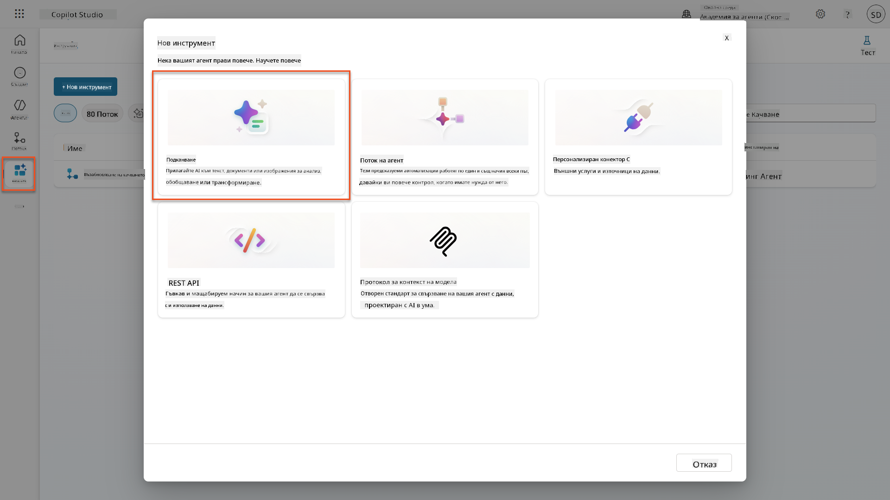

1. **Преименувайте** подсказката от стандартното име с времеви печат (напр. *Custom prompt 09/04/2025, 04:59:11 PM*) на `Обобщи автобиография`.

1. В полето за инструкции добавете тази подсказка:

    ```text
    You are tasked with extracting key candidate information from a resume and cover letter to facilitate matching with open job roles and creating a summary for application review.
    
    Instructions:
    1. Extract Candidate Details:
        - Identify and extract the candidate’s full name.
        - Extract contact information, specifically the email address.
    2. Create Candidate Summary:
        - Summarize the candidate’s profile as multiline text (max 2000 characters) with the following sections:
            - Candidate name
            - Role(s) applied for if present
            - Contact and location
            - One-paragraph summary
            - Experience snapshot (last 2–3 roles with outcomes)
            - Key projects (1–3 with metrics)
            - Education and certifications
            - Top skills (Top 10)
            - Availability and work authorization
    
    Guidelines:
    - Extract information only from the provided resume and cover letter documents.
    - Ensure accuracy in identifying all details such as contact details and skills.
    - The summary should be concise but informative, suitable for quick application review.
    
    Resume: /document
    CoverLetter: /text
    ```

    !!! tip "Използвайте помощта на Copilot"
        Можете да използвате "Започнете с Copilot", за да генерирате вашата подсказка с естествен език. Опитайте да помолите Copilot да създаде подсказка за обобщение на автобиография!

1. **Конфигурирайте** входните параметри:

    | Параметър | Тип | Име | Примерни данни |
    |-----------|------|------|-------------|
    | Автобиография | Изображение или документ | Автобиография | Качете примерна автобиография от папката с тестови данни |
    | Мотивационно писмо | Текст | Мотивационно писмо | Ето автобиография! |

1. Изберете **Тест**, за да видите първоначалния текстов изход от вашата подсказка.  
    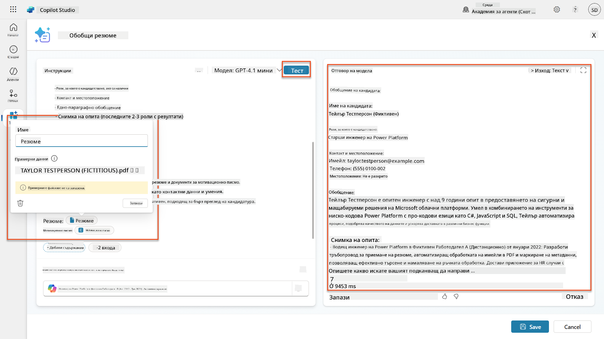

### 7.2 Конфигуриране на JSON изход

Сега ще преобразувате подсказката, за да изведе структурирани JSON данни вместо обикновен текст.

1. Добавете тази спецификация за JSON формат в края на инструкциите на вашата подсказка:

    ```text
    Output Format:
    Provide the output in valid JSON format with the following structure:
    
    {
        "CandidateName": "string",
        "Email": "string",
        "Summary": "string max 2000 characters",
        "Skills": [ {"item": "Skill 1"}, {"item": "Skill 2"}],
        "Experience": [ {"item": "Experience 1"}, {"item": "Experience 2"}],
    }
    ```

1. Променете настройката **Изход** от "Текст" на **JSON**.

1. Изберете **Тест** отново, за да проверите дали изходът вече е форматиран като JSON.  
    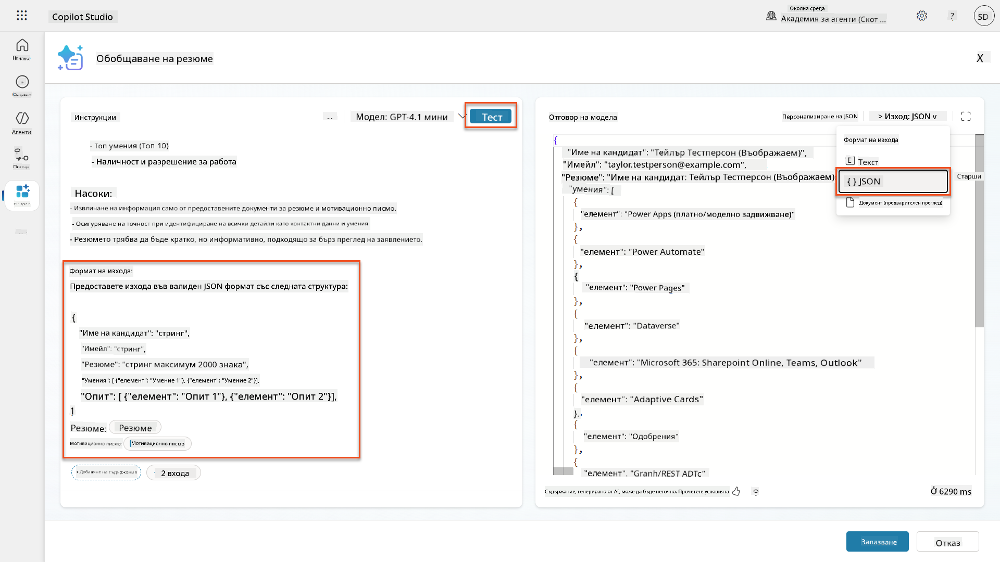

1. **По избор:** Експериментирайте с различни AI модели, за да видите как се различават изходите, след това се върнете към стандартния модел.

1. Изберете **Запази**, за да създадете подсказката.

1. В диалога **Конфигуриране за използване в агент**, изберете **Отказ**.

    !!! info "Защо не добавяме това като инструмент още"
        Ще използвате тази подсказка в Agent Flow, вместо директно като инструмент, което ви дава повече контрол върху работния процес на обработка на данни.

### 7.3 Добавяне на подсказка към Agent Flow

Ще създадете Agent Flow, който използва вашата подсказка за обработка на автобиографии, съхранявани в Dataverse.

!!! tip "Изрази в Agent Flow"
    Много е важно да следвате инструкциите за именуване на вашите възли и въвеждане на изрази точно, защото изразите се отнасят към предишните възли, използвайки тяхното име! Вижте [Мисията за Agent Flow в Recruit](../../recruit/09-add-an-agent-flow/README.md#you-mentioned-expressions-what-are-expressions) за бързо опресняване!

1. Отидете до вашия **Агент за наемане** в Copilot Studio

1. Изберете таба **Агенти** и изберете подчинения **Агент за приемане на заявления**

1. В панела **Инструменти** изберете **+ Добави** → **+ Нов инструмент** → **Agent flow**

1. Възелът "Когато агент извика потока", използвайте **+ Добави вход**, за да добавите следния параметър:

    | Тип | Име | Описание |
    |------|------|-------------|
    | Текст | Номер на автобиография | Уверете се, че използвате [Номер на автобиография]. Това винаги трябва да започва с буквата R |

1. Изберете **+** иконата за вмъкване на действие под първия възел, потърсете **Dataverse**, изберете **Виж повече**, и след това намерете действието **Списък с редове**

1. Изберете **елипсите (...)** на възела Списък с редове и изберете **Преименувай** на `Вземи запис на автобиография`, след което задайте следните параметри:

    | Свойство | Как да зададете | Стойност |
    |----------|------------|-------|
    | **Име на таблица** | Изберете | Автобиографии |
    | **Филтриране на редове** | Динамични данни (икона на светкавица) | `ppa_resumenumber eq 'Номер на автобиография'` Заменете **Номер на автобиография** с **Когато агент извика потока** → **Номер на автобиография** |
    | **Брой редове** | Въведете | 1 |

    !!! tip "Оптимизирайте тези заявки!"
        Когато използвате тази техника в продукция, винаги трябва да ограничавате избраните колони
| **Подканва** | Изберете | Обобщете автобиографията |
| **Мотивационно писмо** | Израз (fx икона) | `first(body('Get_Resume_Record')?['value'])?['ppa_coverletter']` |
| **Автобиография** | Динамични данни (икона светкавица) | Изтеглете автобиография → Съдържание на файл или изображение |

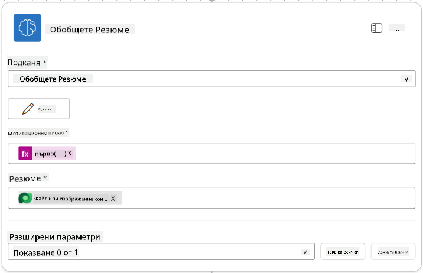

!!! tip "Параметри на подканвата"
    Обърнете внимание, че параметрите, които попълвате, са същите, които конфигурирахте като входни параметри, когато създавахте подканвата.

### 7.4 Създаване на запис за кандидат

Следващата стъпка е да вземете информацията, предоставена от подканвата, и да създадете нов запис за кандидат, ако вече не съществува.

1. Изберете иконата **+** за добавяне на действие под възела за обобщение на автобиографията, потърсете **Dataverse**, изберете **Вижте повече**, и намерете действието **List rows**.

1. Преименувайте възела на `Get Existing Candidate` и задайте следните параметри:

    | Свойство | Как да зададете | Стойност |
    |----------|-----------------|----------|
    | **Име на таблицата** | Изберете | Candidates |
    | **Филтриране на редове** | Динамични данни (икона светкавица) | `ppa_email eq 'Email'`  **Заменете** `Email` с **Summarize Resume → Email** |
    | **Брой редове** | Въведете | 1 |

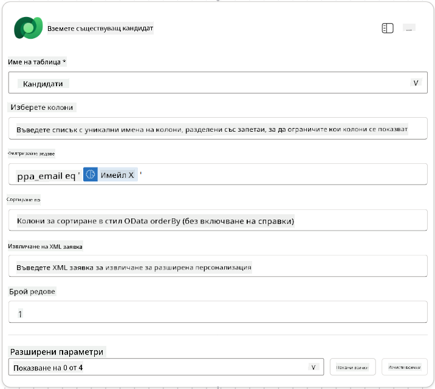

1. Изберете иконата **+** за добавяне на действие под възела Get Existing Candidate, потърсете **Control**, изберете **Вижте повече**, и намерете действието **Condition**.

1. В свойствата на условието задайте следното условие:

    | Условие | Оператор | Стойност |
    |---------|----------|----------|
    | Израз (fx икона): `length(outputs('Get_Existing_Candidate')?['body/value'])` | е равно на | 0 |

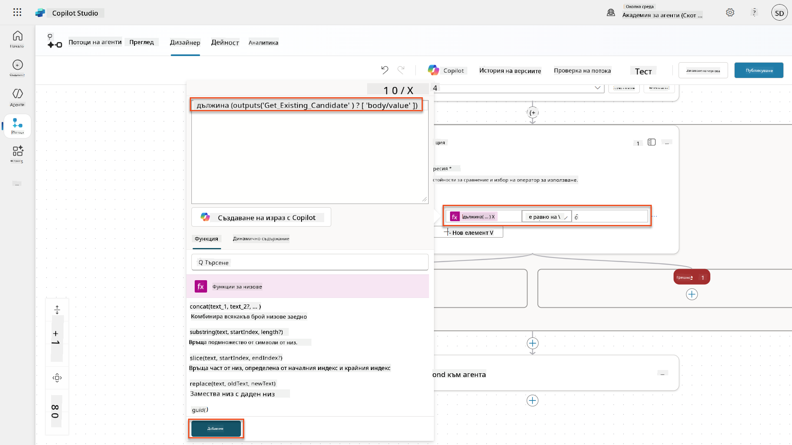

1. Изберете иконата **+** за добавяне на действие в клона **True**, потърсете **Dataverse**, изберете **Вижте повече**, и намерете действието **Add a new row**.

1. Преименувайте възела на `Add a New Candidate` и задайте следните параметри:

    | Свойство | Как да зададете | Стойност |
    |----------|-----------------|----------|
    | **Име на таблицата** | Изберете | Candidates |
    | **Име на кандидата** | Динамични данни (икона светкавица) | Summarize Resume → `CandidateName` |
    | **Имейл** | Динамични данни (икона светкавица) | Summarize Resume → `Email` |

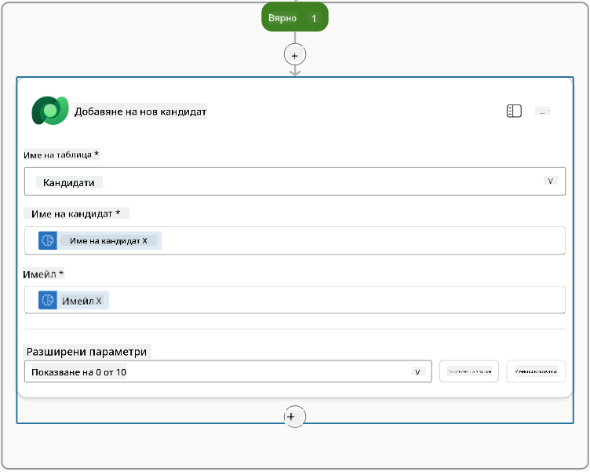

### 7.5 Актуализиране на автобиографията и конфигуриране на изходните данни на потока

Завършете потока, като актуализирате записа за автобиографията и конфигурирате какви данни да се върнат на вашия агент.

1. Изберете иконата **+** за добавяне на действие под условието, потърсете **Dataverse**, изберете **Вижте повече**, и намерете действието **Update a row**.

1. Изберете заглавието, за да преименувате възела на `Update Resume`, изберете **Покажи всички**, и задайте следните параметри:

    | Свойство | Как да зададете | Стойност |
    |----------|-----------------|----------|
    | **Име на таблицата** | Изберете | Resumes |
    | **Идентификатор на ред** | Израз (fx икона) | `first(body('Get_Resume_Record')?['value'])?['ppa_resumeid']` |
    | **Обобщение** | Динамични данни (икона светкавица) | Summarize Resume → Text |
    | **Кандидат (Candidates)** | Израз (fx икона) | `if(equals(length(outputs('Get_Existing_Candidate')?['body/value']), 1), first(outputs('Get_Existing_Candidate')?['body/value'])?['ppa_candidateid'], outputs('Add_a_New_Candidate')?['body/ppa_candidateid'])` |

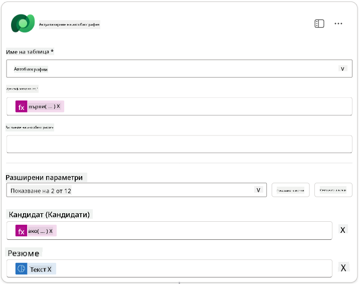

1. Изберете възела **Respond to the agent** и след това използвайте **+ Add an output**, за да конфигурирате:

    | Тип | Име               | Как да зададете                  | Стойност                                                      | Описание                                              |
    |-----|-------------------|----------------------------------|--------------------------------------------------------------|------------------------------------------------------|
    | Текст | `CandidateName`   | Динамични данни (икона светкавица) | Summarize Resume → Вижте повече → CandidateName              | [CandidateName], посочено в автобиографията          |
    | Текст | `CandidateEmail`  | Динамични данни (икона светкавица) | Summarize Resume → Вижте повече → Email                      | [CandidateEmail], посочено в автобиографията         |
    | Текст | `CandidateNumber` | Израз (fx икона)                | `concat('ppa_candidates/', if(equals(length(outputs('Get_Existing_Candidate')?['body/value']), 1), first(outputs('Get_Existing_Candidate')?['body/value'])?['ppa_candidateid'], outputs('Add_a_New_Candidate')?['body/ppa_candidateid']) )` | [CandidateNumber] на новия или съществуващия кандидат |
    | Текст | `ResumeSummary`   | Динамични данни (икона светкавица) | Summarize Resume → Вижте повече → body/responsev2/predictionOutput/structuredOutput | Обобщението и детайлите на автобиографията в JSON формат |

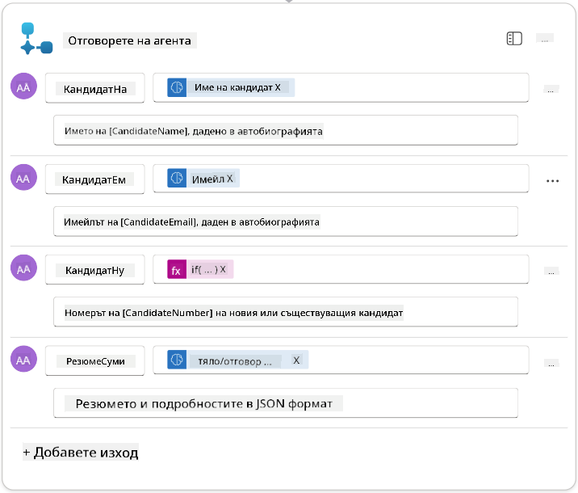

1. Изберете **Запази чернова** в горния десен ъгъл. Вашият поток за агента трябва да изглежда така:  
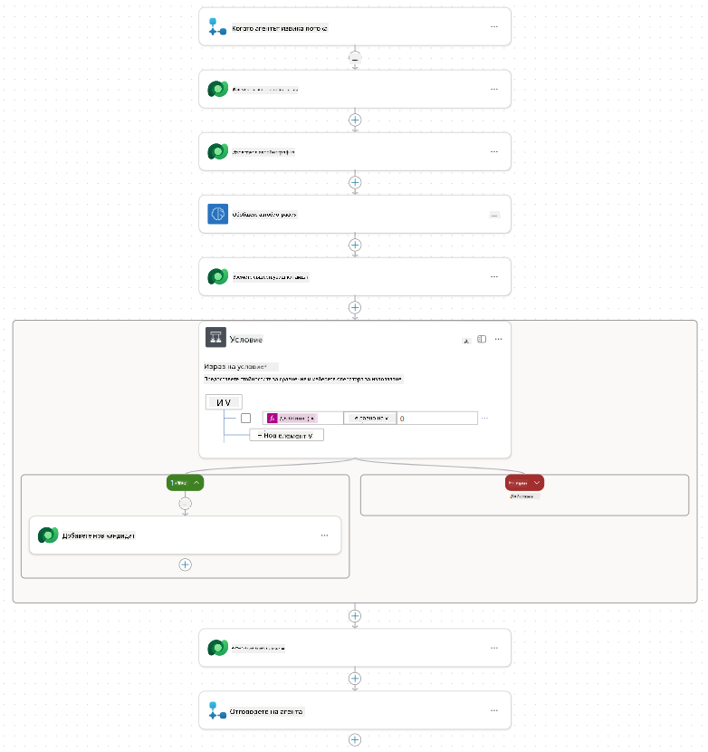

1. Изберете таба **Преглед**, изберете **Редактиране** в панела **Детайли**.

    1. **Име на потока**:`Summarize Resume`
    1. **Описание**:

        ```text
        Summarize an existing Resume stored in Dataverse using a [ResumeNumber] as input, return the [CandidateNumber], and resume summary JSON
        ```

1. Изберете **Запази**.

1. Отново изберете таба **Дизайнер** и изберете **Публикувай**.

### 7.6 Свързване на потока с вашия агент

Сега ще добавите потока като инструмент и ще конфигурирате вашия агент да го използва.

1. Отворете вашия **Hiring Agent** в Copilot Studio.

1. Изберете таба **Агенти** и отворете **Application Intake Agent**.

1. Изберете панела **Инструменти** и изберете **+ Добави инструмент** → **Flow** → **Summarize Resume** **(Agent Flow)**.

1. Изберете **Добави и конфигурирай**.

1. Конфигурирайте настройките на инструмента, както следва:

    | Настройка | Стойност |
    |-----------|----------|
    | **Описание** | Обобщете съществуваща автобиография, съхранена в Dataverse, използвайки [ResumeNumber] като вход, върнете [CandidateNumber] и JSON обобщение на автобиографията |
    | **Кога може да се използва този инструмент** | Само когато е рефериран от теми или агенти |

1. Изберете **Запази**  
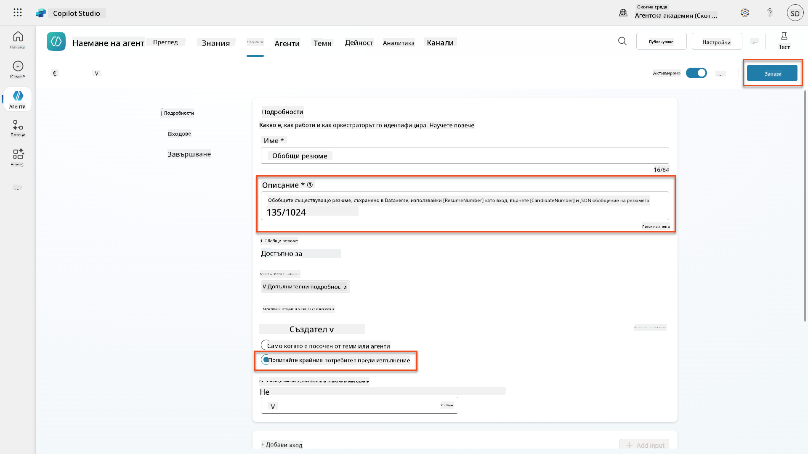

1. Ако изберете Инструменти в Hiring Agent, сега ще видите и двата инструмента, показващи, че са използваеми от **Application Intake Agent**.  
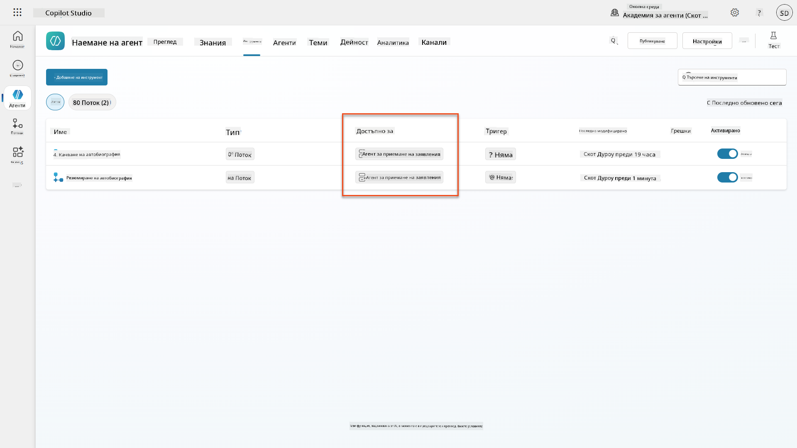

1. Навигирайте до инструкциите на агента **Application Intake Child** и модифицирайте стъпката **Post-Upload**, както следва:

    ```text
    2. Post-Upload Processing  
        - After uploading, be sure to also output the [ResumeNumber] in all messages
        - Pass [ResumeNumber] to /Summarize Resume  - Be sure to use the correct value that will start with the letter R.
        - Be sure to also output the [CandidateNumber] in all messages
        - Use the [ResumeSummary] to output a summary of the processed Resume and candidate
    ```

    Заменете `/Summarize Resume`, като вмъкнете референция към потока **Summarize Resume agent flow**, като напишете наклонена черта (`/`) или изберете `/Summarize`, за да вмъкнете референцията.  
    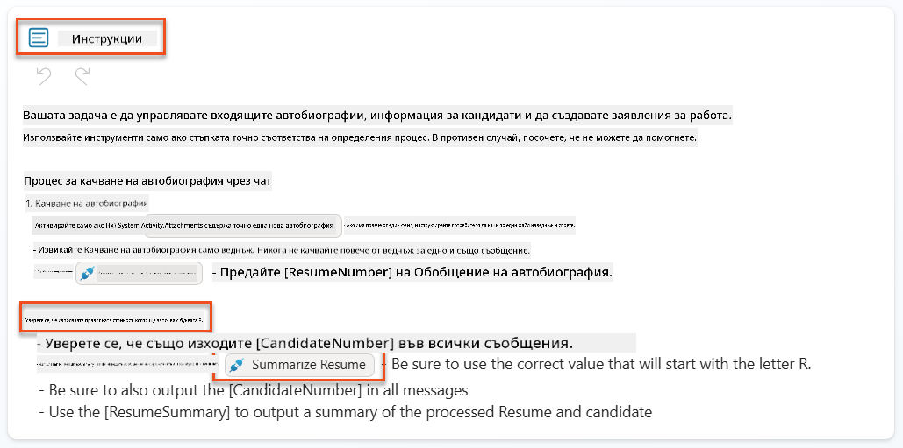

1. Изберете **Запази**.

### 7.7 Тествайте вашия агент

Тествайте цялостната мултимодална система, за да се уверите, че всичко работи правилно.

1. **Започнете тестване**:

    - Изберете **Тест**, за да отворите панела за тестване.
    - Напишете: `Това е автобиография на кандидат`.

    - Качете една от примерните автобиографии от [Примерни автобиографии](https://download-directory.github.io/?url=https://github.com/microsoft/agent-academy/tree/main/operative/sample-data/resumes&filename=operative_sampledata).

1. **Проверете резултатите**:
    - След като изпратите съобщението и автобиографията, проверете дали получавате номер на автобиография (формат: R#####).
    - Уверете се, че получавате номер на кандидат и обобщение.
    - Използвайте картата на активностите, за да видите как работят инструментите за качване на автобиография и обобщение на автобиографията, и как агентът получава резултатите от подканвата за обобщение:  
        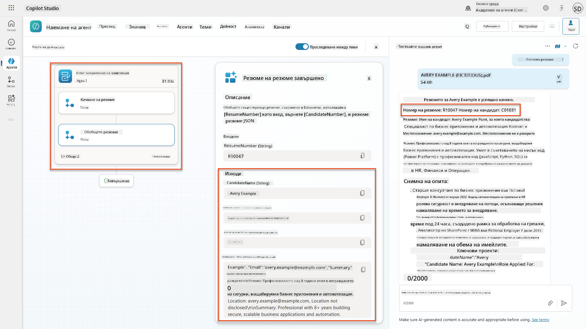

1. **Проверете запазването на данни**:
    - Навигирайте до [Power Apps](https://make.powerapps.com).
    - Отворете **Apps** → **Hiring Hub** → **Play**.
    - Отидете на **Resumes**, за да проверите дали автобиографията е качена и обработена. Тя трябва да съдържа както информация за обобщението, така и свързан запис за кандидат.
    - Проверете **Candidates**, за да видите извлечената информация за кандидата.  
        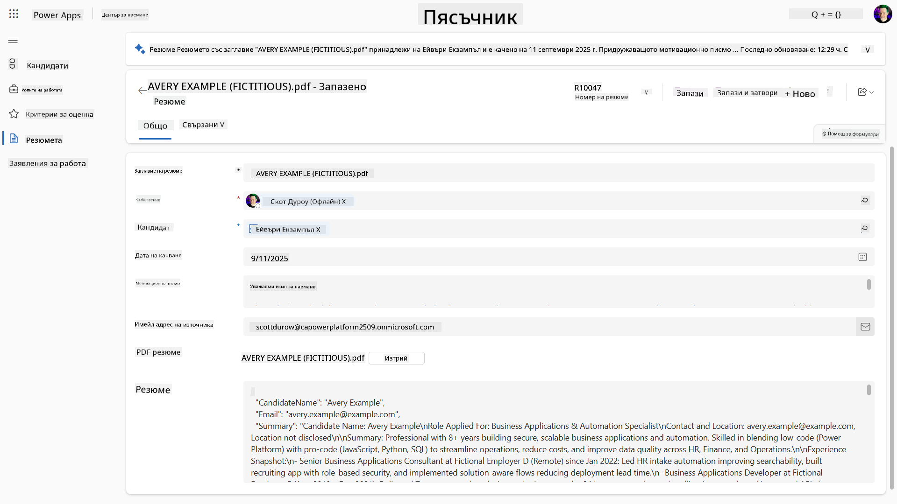
    - Когато изпълните процеса отново, той трябва да използва съществуващия кандидат (съответстващ на извлечения имейл от автобиографията), вместо да създава нов.

!!! tip "Отстраняване на проблеми"
    - **Автобиографията не се обработва**: Уверете се, че файлът е PDF и е под допустимия размер.
    - **Не е създаден кандидат**: Проверете дали имейлът е извлечен правилно от автобиографията.
    - **Грешки във формата на JSON**: Уверете се, че инструкциите на подканвата включват точната структура на JSON.
    - **Грешки в потока**: Проверете дали всички връзки с Dataverse и изрази са конфигурирани правилно.

### Готовност за производство

Въпреки че не е част от тази мисия, за да направите този поток на агента готов за производство, може да обмислите следното:

1. **Обработка на грешки** - Ако номерът на автобиографията не е намерен или подканвата не успее да анализира документа, трябва да се добави обработка на грешки, за да се върне ясно съобщение за грешка на агента.
1. **Актуализиране на съществуващи кандидати** - Ако кандидатът е намерен чрез имейла, името може да бъде актуализирано, за да съответства на това в автобиографията.
1. **Разделяне на обобщението на автобиографията и създаването на кандидата** - Тази функционалност може да бъде разделена на по-малки потоци на агента, за да се улесни поддръжката, а след това агентът да получи инструкции да ги използва последователно.

## 🎉 Мисията е завършена

Отлична работа, Оперативен! **Документално разузнаване на автобиографии** е завършено. Вие успешно овладяхте мултимодалните подканви и вече можете да извличате структурирани данни от всеки документ с прецизност.

Ето какво постигнахте в тази мисия:

**✅ Овладяване на мултимодални подканви**  
Вече разбирате какво представляват мултимодалните подканви и кога да използвате различни AI модели за оптимални резултати.

**✅ Експертност в обработката на документи**  
Научихте как да конфигурирате подканви с входни данни от изображения и документи и да форматирате изходните данни като JSON за извличане на структурирана информация.

**✅ Система за извличане на автобиографии**  
Създадохте цялостна система за извличане на автобиографии, която обработва документи на кандидати и се интегрира с вашия процес на наемане.

**✅ Прилагане на добри практики**  
Приложихте добри практики за инженеринг на подканви с анализ на документи и интегрирахте мултимодални подканви с потоци на агента.

**✅ Основи за напреднала обработка**  
Вашите подобрени възможности за анализ на документи вече са готови за напредналите функции за свързване на данни, които ще добавим в предстоящите мисии.

🚀 **Следващо:** В Мисия 08 ще откриете как да подобрите вашите подканви с данни в реално време от Dataverse, създавайки динамични AI решения, които се адаптират към променящите се бизнес изисквания.

⏩ [Преминете към Мисия 08: Подобрени подканви със свързване към Dataverse](../08-dataverse-grounding/README.md)

## 📚 Тактически ресурси

📖 [Създаване на подканва](https://learn.microsoft.com/ai-builder/create-a-custom-prompt?WT.mc_id=power-power-182762-scottdurow)

📖 [Добавяне на текст, изображение или документ като входни данни към подканва](https://learn.microsoft.com/ai-builder/add-inputs-prompt?WT.mc_id=power-182762-scottdurow)

📖 [Обработка на отговори с JSON изход](https://learn.microsoft.com/ai-builder/process-responses-json-output?WT.mc_id=power-182762-scottdurow)

📖 [Избор на модел и настройки на температурата](https://learn.microsoft.com/ai-builder/prompt-modelsettings?WT.mc_id=power-182762-scottdurow)

📖 [Използване на подканва в Power Automate](https://learn.microsoft.com/ai-builder/use-a-custom-prompt-in-flow?WT.mc_id=power-182762-scottdurow)

📺 [AI Builder: JSON изходи в създателя на подканви](https://www.youtube.com/watch?v=F0fGnWrRY_I)

---

**Отказ от отговорност**:  
Този документ е преведен с помощта на AI услуга за превод [Co-op Translator](https://github.com/Azure/co-op-translator). Въпреки че се стремим към точност, моля, имайте предвид, че автоматизираните преводи може да съдържат грешки или неточности. Оригиналният документ на неговия роден език трябва да се счита за авторитетен източник. За критична информация се препоръчва професионален човешки превод. Ние не носим отговорност за каквито и да било недоразумения или погрешни интерпретации, произтичащи от използването на този превод.