<!--
CO_OP_TRANSLATOR_METADATA:
{
  "original_hash": "750f3ea8a94930439ebd8a10871b1d73",
  "translation_date": "2025-10-20T22:49:51+00:00",
  "source_file": "docs/operative-preview/08-dataverse-grounding/README.md",
  "language_code": "bg"
}
-->
# 🚨 Мисия 08: Подобрени подсказки с Dataverse основа

--8<-- "disclaimer.md"

## 🕵️‍♂️ КОДОВО ИМЕ: `ОПЕРАЦИЯ КОНТРОЛ НА ОСНОВАТА`

> **⏱️ Времеви прозорец на операцията:** `~60 минути`

## 🎯 Описание на мисията

Добре дошли отново, Оперативен агент. Вашата система за наемане на много агенти е активна, но има критична необходимост от подобрение на **основата на данните** - вашите AI модели се нуждаят от достъп в реално време до структурирани данни на вашата организация, за да вземат интелигентни решения.

В момента вашата подсказка за обобщение на автобиографията работи със статични знания. Но какво, ако тя може динамично да получава достъп до базата данни с работни позиции, за да предоставя точни и актуални съвпадения? Какво, ако разбира вашите критерии за оценка, без да се налага да ги кодирате ръчно?

В тази мисия ще подобрите вашата персонализирана подсказка с **Dataverse основа** - свързвайки вашите подсказки директно с живи източници на данни. Това ще трансформира вашите агенти от статични отговарящи в динамични, базирани на данни системи, които се адаптират към променящите се бизнес нужди.

Вашата мисия: интегрирайте данни за работни позиции и критерии за оценка в реално време във вашия работен процес за анализ на автобиографии, създавайки самообновяваща се система, която остава актуална с изискванията за наемане на вашата организация.

## 🔎 Цели

В тази мисия ще научите:

1. Как **Dataverse основата** подобрява персонализираните подсказки
1. Кога да използвате основа на данни вместо статични инструкции
1. Проектиране на подсказки, които динамично включват живи данни
1. Подобряване на потока за обобщение на автобиографии с съвпадение на работни позиции

## 🧠 Разбиране на Dataverse основата за подсказки

**Dataverse основата** позволява на вашите персонализирани подсказки да получават достъп до живи данни от вашите Dataverse таблици при обработка на заявки. Вместо статични инструкции, вашите подсказки могат да включват информация в реално време, за да вземат информирани решения.

### Защо Dataverse основата е важна

Традиционните подсказки работят със фиксирани инструкции:

```text
Match this candidate to these job roles: Developer, Manager, Analyst
```

С Dataverse основа, вашата подсказка получава достъп до текущи данни:

```text
Match this candidate to available job roles from the Job Roles table, 
considering current evaluation criteria and requirements
```

Този подход предоставя няколко ключови предимства:

- **Динамични актуализации:** Работните позиции и критериите се променят без модификации на подсказките
- **Последователност:** Всички агенти използват едни и същи текущи източници на данни
- **Мащабируемост:** Новите позиции и критерии автоматично стават достъпни
- **Точност:** Данните в реално време гарантират, че решенията отразяват текущите нужди

### Как работи Dataverse основата

Когато активирате Dataverse основа за персонализирана подсказка:

1. **Избор на данни:** Изберете специфични Dataverse таблици и колони за включване. Можете също така да изберете свързани таблици, които системата ще филтрира въз основа на извлечените родителски записи.
1. **Инжектиране на контекст:** Подсказката автоматично включва извлечените данни в контекста на подсказката
1. **Интелигентно филтриране:** Системата включва само данни, които са релевантни за текущата заявка, ако предоставите някакво филтриране.
1. **Структуриран изход:** Вашата подсказка може да се позовава на извлечените данни и да разсъждава върху записите, за да създаде изхода.

### От статично към динамично: Предимството на основата

Нека разгледаме текущия ви поток за обобщение на автобиографии от Мисия 07 и да видим как Dataverse основата го трансформира от статична към динамична интелигентност.

**Текущ статичен подход:**
Вашата съществуваща подсказка включва твърдо кодирани критерии за оценка и предварително определена логика за съвпадение. Този подход работи, но изисква ръчни актуализации всеки път, когато добавите нови работни позиции, промените критерии за оценка или промените приоритетите на компанията.

**Трансформация с Dataverse основа:**
Чрез добавяне на Dataverse основа, вашият поток за обобщение на автобиографии ще:

- **Получава текущи работни позиции** от вашата таблица с работни позиции
- **Използва живи критерии за оценка** вместо статични описания  
- **Осигурява точни съвпадения** въз основа на изисквания в реално време

## 🎯 Защо специализирани подсказки вместо разговори с агенти

В Мисия 02 видяхте как Интервюиращият агент може да съпоставя кандидати с работни позиции, но изисква сложни потребителски подсказки като:

```text
Upload this resume, then show me open job roles,
each with a description of the evaluation criteria, 
then use this to match the resume to at least one suitable
job role even if not a perfect match.
```

Докато това работеше, специализираните подсказки с Dataverse основа предлагат значителни предимства за специфични задачи:

### Ключови предимства на специализираните подсказки

| Аспект | Разговори с агенти | Специализирани подсказки |
|--------|-------------------|-------------------------|
| **Последователност** | Резултатите варират според уменията на потребителя за създаване на подсказки | Стандартизирана обработка всеки път |
| **Специализация** | Общото разсъждение може да пропусне бизнес нюанси | Създадени с оптимизирана бизнес логика |
| **Автоматизация** | Изисква човешко взаимодействие и интерпретация | Активира се автоматично със структуриран JSON изход |

## 🧪 Лаборатория 8: Добавяне на Dataverse основа към подсказки

Време е да подобрите вашите възможности за анализ на автобиографии! Ще подобрите съществуващия поток за обобщение на автобиографии с динамично съвпадение на работни позиции.

### Предварителни условия за изпълнение на мисията

1. Трябва **или**:

    - **Да сте завършили Мисия 07** и да имате готова система за анализ на автобиографии, **ИЛИ**
    - **Да импортирате началното решение за Мисия 08**, ако започвате отначало или трябва да наваксате. [Изтеглете началното решение за Мисия 08](https://aka.ms/agent-academy)

1. Примерни документи с автобиографии от [тестови автобиографии](https://download-directory.github.io/?url=https://github.com/microsoft/agent-academy/tree/main/operative/sample-data/resumes&filename=operative_sampledata)

!!! note "Импортиране на решение и примерни данни"
    Ако използвате началното решение, вижте [Мисия 01](../01-get-started/README.md) за подробни инструкции как да импортирате решения и примерни данни във вашата среда.

### 8.1 Добавяне на Dataverse основа към вашата подсказка

Ще надградите подсказката за обобщение на автобиографии, която създадохте в Мисия 07. В момента тя просто обобщава автобиографията, но сега ще я свържете с работните позиции, които съществуват в Dataverse, за да я поддържате винаги актуална.

Първо, нека разгледаме Dataverse таблиците, с които ще работите:

1. **Навигирайте** до [Power Apps](https://make.powerapps.com) и изберете вашата среда, използвайки **Превключвателя на среда** в горния десен ъгъл на навигационната лента.

1. Изберете **Таблици** и намерете таблицата **Работни позиции**.

1. Прегледайте ключовите колони, които ще използвате за основа:

    | Колона | Цел |
    |--------|-----|
    | **Номер на работна позиция** | Уникален идентификатор за съвпадение на позиции |
    | **Заглавие на позицията** | Име за показване на позицията |
    | **Описание** | Подробни изисквания за позицията |

1. По същия начин прегледайте другите таблици, като таблицата **Критерии за оценка**.

### 8.2 Добавяне на данни от Dataverse основа към вашата подсказка

1. **Навигирайте** до Copilot Studio и изберете вашата среда, използвайки **Превключвателя на среда** в горния десен ъгъл на навигационната лента.

1. Изберете **Инструменти** от лявата навигация.

1. Изберете **Подсказка** и намерете вашата подсказка **Обобщение на автобиография** от Мисия 07.  
    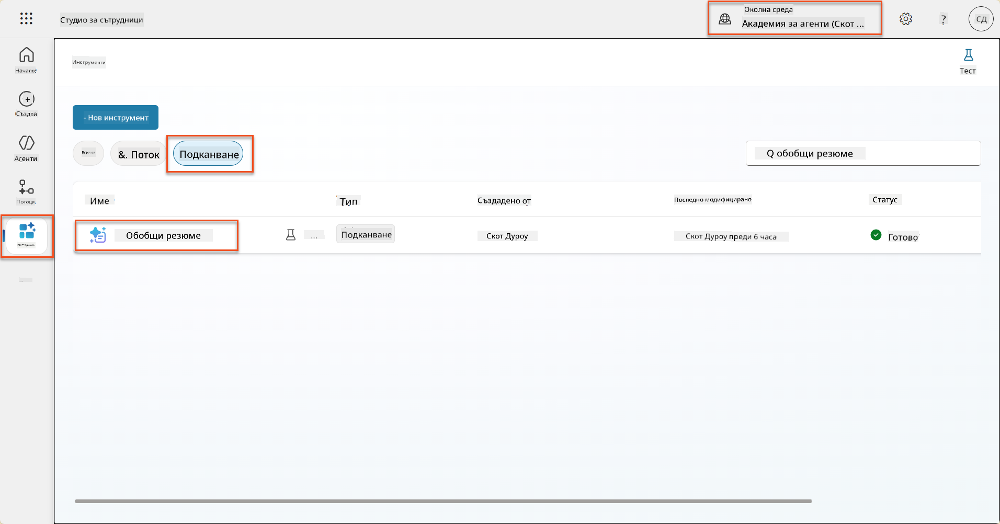

1. Изберете **Редактиране**, за да модифицирате подсказката, и я заменете с подобрената версия по-долу:

    !!! important
        Уверете се, че параметрите за автобиография и мотивационно писмо остават непроменени като параметри.

    ```text
    You are tasked with extracting key candidate information from a resume and cover letter to facilitate matching with open job roles and creating a summary for application review.
    
    ### Instructions:
    1. **Extract Candidate Details:**
       - Identify and extract the candidate's full name.
       - Extract contact information, specifically the email address.
    
    2. **Analyze Resume and Cover Letter:**
       - Review the resume content to identify relevant skills, experience, and qualifications.
       - Review the cover letter to understand the candidate's motivation and suitability for the roles.
    
    3. **Match Against Open Job Roles:**
       - Compare the extracted candidate information with the requirements and descriptions of the provided open job roles.
       - Use the job descriptions to assess potential fit.
       - Identify all roles that align with the candidate's cover letter and profile. You don't need to assess perfect suitability.
       - Provide reasoning for each match based on the specific job requirements.
    
    4. **Create Candidate Summary:**
       - Summarize the candidate's profile as multiline text with the following sections:
          - Candidate name
          - Role(s) applied for if present
          - Contact and location
          - One-paragraph summary
          - Top skills (8–10)
          - Experience snapshot (last 2–3 roles with outcomes)
          - Key projects (1–3 with metrics)
          - Education and certifications
          - Availability and work authorization
    
    ### Output Format
    
    Provide the output in valid JSON format with the following structure:
    
    {
      "CandidateName": "string",
      "Email": "string",
      "MatchedRoles": [
        {
          "JobRoleNumber": "ppa_jobrolenumber from grounded data",
          "RoleName": "ppa_jobtitle from grounded data",
          "Reasoning": "Detailed explanation based on job requirements"
        }
      ],
      "Summary": "string"
    }
    
    ### Guidelines
    
    - Extract information only from the provided resume and cover letter documents.
    - Ensure accuracy in identifying contact details.
    - Use the available job role data for matching decisions.
    - The summary should be concise but informative, suitable for quick application review.
    - If no suitable matches are found, indicate an empty list for MatchedRoles and explain briefly in the summary.
    
    ### Input Data
    Open Job Roles (ppa_jobrolenumber, ppa_jobtitle): /Job Role 
    Resume: {Resume}
    Cover Letter: {CoverLetter}
    ```

1. В редактора на подсказки заменете `/Job Role`, като изберете **+ Добавяне на съдържание**, изберете **Dataverse** → **Работна позиция** и изберете следните колони, след което изберете **Добавяне**:

    1. **Номер на работна позиция**

    1. **Заглавие на позицията**

    1. **Описание**

    !!! tip
        Можете да въведете името на таблицата, за да я потърсите.

1. В диалога **Работна позиция** изберете атрибута **Филтър**, изберете **Статус**, и въведете **Активен** като стойност на **Филтър**.  
    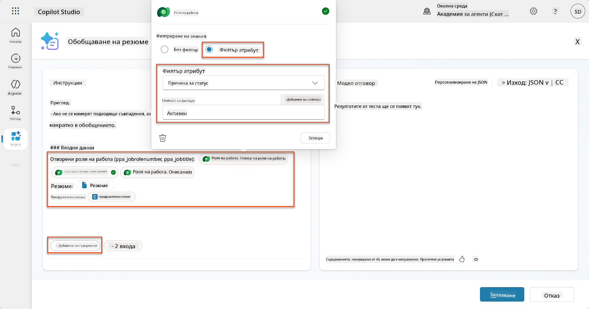

    !!! tip
        Можете да използвате **Добавяне на стойност** тук, за да добавите входен параметър - например, ако имате подсказка за обобщение на съществуващ запис, можете да предоставите Номер на автобиография като параметър за филтриране.

1. След това ще добавите свързаната Dataverse таблица **Критерии за оценка**, като отново изберете **+ Добавяне на съдържание**, намерите **Работни позиции**, и вместо да изберете колоните на Работна позиция, разширете **Работна позиция (Критерии за оценка)** и изберете следните колони, след което изберете **Добавяне**:

    1. **Име на критерия**

    1. **Описание**  
        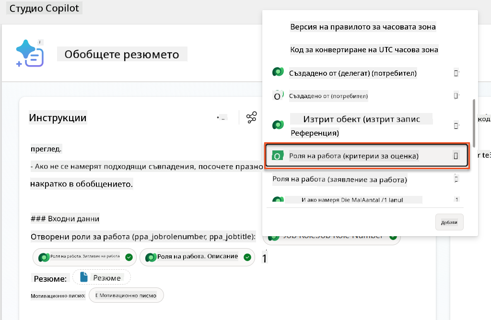

        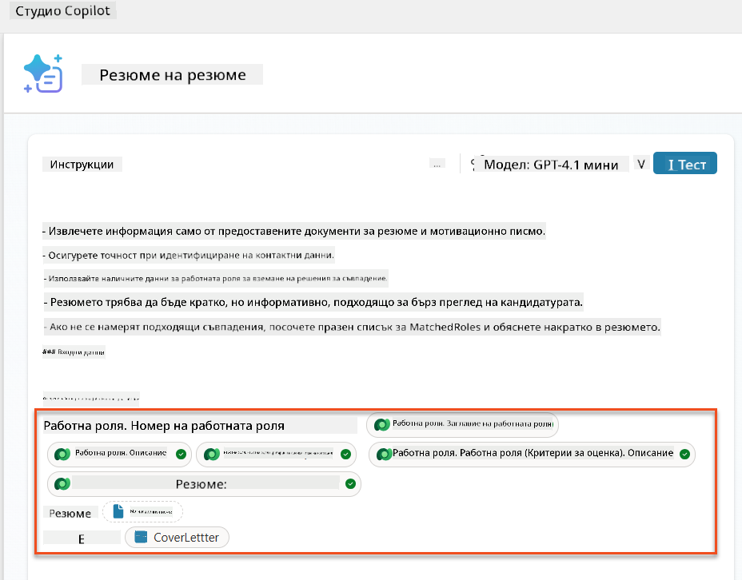

    !!! tip
        Важно е да изберете свързаните Критерии за оценка, като първо изберете Работна позиция, и след това навигирате в менюто до Работна позиция (Критерии за оценка). Това ще гарантира, че само свързаните записи за Работната позиция ще бъдат заредени.

1. Изберете **Настройки** и коригирайте **Извличане на записи** на 1000 - това ще позволи максималния брой Работни позиции и Критерии за оценка да бъдат включени във вашата подсказка.  
    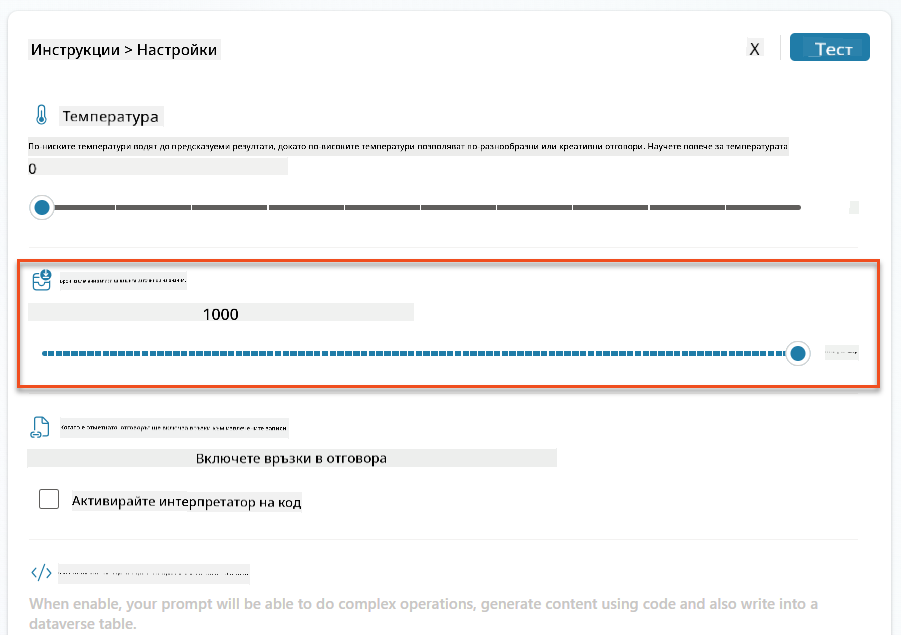

### 8.3 Тест на подобрената подсказка

1. Изберете параметъра **Автобиография** и качете примерна автобиография, която сте използвали в Мисия 07.
1. Изберете **Тест**.
1. След като тестът приключи, забележете, че JSON изходът вече включва **Съвпаднали позиции**.
1. Изберете таба **Използвани знания**, за да видите Dataverse данните, които са се обединили с вашата подсказка преди изпълнението.
1. **Запазете** вашата обновена подсказка. Системата вече автоматично ще включва тези Dataverse данни с вашата подсказка, когато съществуващият поток за агент Обобщение на автобиография го извика.  
    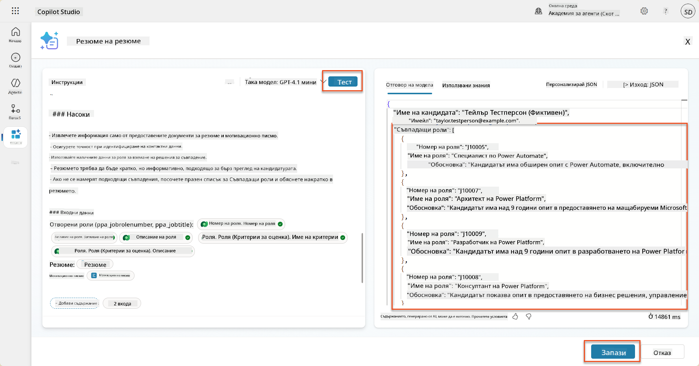

### 8.4 Добавяне на поток за агент за кандидатстване за работа

За да позволим на нашия агент за приемане на кандидатури да създава работни позиции въз основа на предложените позиции, трябва да създадем поток за агент. Агентът ще извика този инструмент за всяка от предложените работни позиции, които интересуват кандидата.

!!! tip "Изрази в потока за агент"
    Много е важно да следвате инструкциите за именуване на вашите възли и въвеждане на изрази точно, защото изразите се отнасят до предишните възли, използвайки техните имена! Вижте [Мисия за потока за агент в Recruit](../../recruit/09-add-an-agent-flow/README.md#you-mentioned-expressions-what-are-expressions) за бързо опресняване!

1. Вътре в **Агент за наемане**, изберете таба **Агенти** и отворете подагента **Агент за приемане на кандидатури**.

1. В панела **Инструменти** изберете **+ Добавяне** → **+ Нов инструмент** → **Поток за агент**

1. Изберете възела **Когато агент извика потока**, използвайте **+ Добавяне на вход**, за да добавите следния параметър:

    | Тип | Име            | Описание                                                  |
    | ---- | --------------- | ------------------------------------------------------------ |
    | Текст | `Номер на автобиография`  | Уверете се, че използвате само [Номер на автобиография] - той ТРЯБВА да започва с буквата R |
    | Текст | `Номер на работна позиция` | Уверете се, че използвате само [Номер на работна позиция] - той ТРЯБВА да започва с буквата J |

    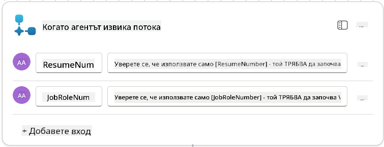

1. Изберете **+** иконата за вмъкване на действие под първия възел, потърсете **Dataverse**, изберете **Виж повече**, и след това намерете действието **Списък с редове**.

1. **Преименувайте** възела като `Получаване на автобиография`, и след това задайте следните параметри:

    | Свойство        | Как да зададете                      | Стойност                                                        |
    | --------------- | ------------------------------- | ------------------------------------------------------------ |
    | **Име на таблица**  | Изберете                          | Автобиографии                                                      |
    | **Филтриране на редове** | Динамични данни (икона на светкавица) | `ppa_resumenumber eq 'Номер на автобиография'` Изберете и заменете **Номер на автобиография** с **Когато агент извика потока** → **Номер на автобиография** |
    | **Брой редове**   | Въведете                           | 1                                                            |

    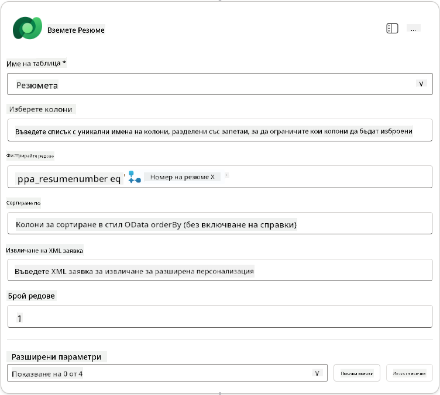

1. Сега изберете **+** иконата за вмъкване на действие под **Получаване на автобиография**, потърсете **Dataverse**, изберете **Виж повече**, и след това намерете действието **Списък с редове**.

1. **Преименувайте** възела като `Получаване на работна позиция`, и след това задайте следните параметри:

    | Свойство        | Как да зададете                      | Стойност                                                        |
    | --------------- | ------------------------------- | ------------------------------------------------------------ |
    | **Име на таблица**  | Избер
| **Роля на работа (Роли на работа)**       | Израз (fx икона) | `concat('ppa_jobroles/',first(outputs('Get_Job_Role')?['body/value'])?['ppa_jobroleid'])` |
| **Автобиография (Автобиографии)**         | Израз (fx икона) | `concat('ppa_resumes/', first(outputs('Get_Resume')?['body/value'])?['ppa_resumeid'])` |
| **Дата на кандидатстване** (използвайте **Покажи всички**) | Израз (fx икона) | `utcNow()`                                                   |

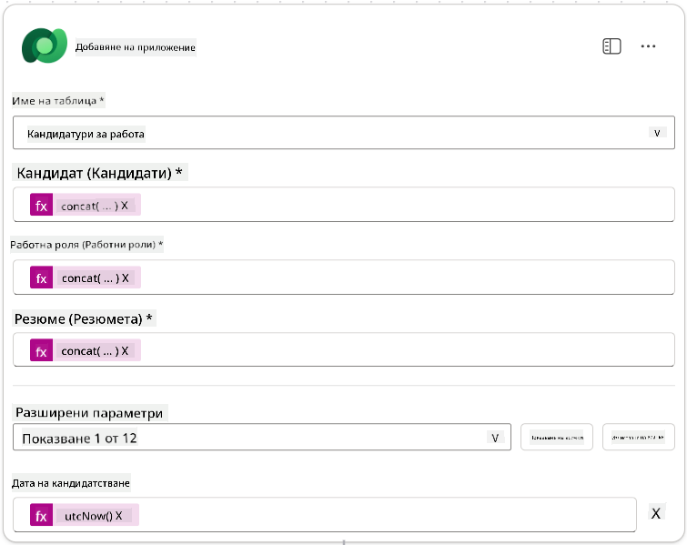

1. Изберете **Отговор към възел на агент**, след това изберете **+ Добавяне на изход**

     | Свойство        | Как да зададете                 | Детайли                                         |
     | --------------- | ------------------------------- | ----------------------------------------------- |
     | **Тип**         | Изберете                       | `Текст`                                         |
     | **Име**         | Въведете                       | `ApplicationNumber`                             |
     | **Стойност**    | Динамични данни (икона светкавица) | *Добавяне на кандидатура → Виж повече → Номер на кандидатура* |
     | **Описание**    | Въведете                       | `Номерът [ApplicationNumber] на създадената кандидатура за работа` |

     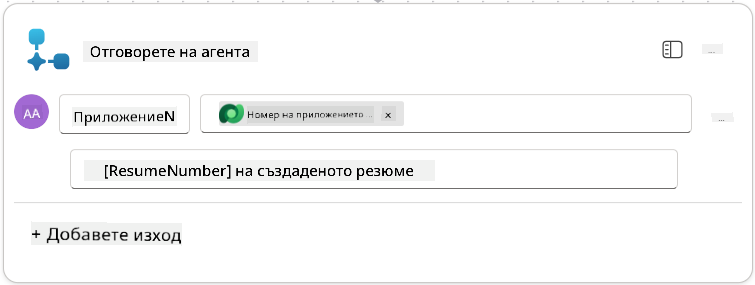

1. Изберете **Запазване на чернова** в горния десен ъгъл

1. Изберете таба **Преглед**, след това изберете **Редактиране** в панела **Детайли**

      - **Име на поток**:`Създаване на кандидатура за работа`
      - **Описание**:`Създава нова кандидатура за работа при предоставяне на [ResumeNumber] и [JobRoleNumber]`
      - **Запазване**

1. Отново изберете таба **Дизайнер**, след това изберете **Публикуване**.

### 8.5 Добавяне на Създаване на кандидатура за работа към агент

Сега ще свържете публикувания поток към вашия агент за приемане на кандидатури.

1. Върнете се към **Агент за наемане** и изберете таба **Агенти**. Отворете **Агент за приемане на кандидатури**, след това намерете панела **Инструменти**.

1. Изберете **+ Добавяне**

1. Изберете филтъра **Поток**, и потърсете `Създаване на кандидатура за работа`. Изберете потока **Създаване на кандидатура за работа**, след това **Добавяне и конфигуриране**.

1. Задайте следните параметри:

    | Параметър                                         | Стойност                                                      |
    | ------------------------------------------------ | ------------------------------------------------------------ |
    | **Описание**                                     | `Създава нова кандидатура за работа при предоставяне на [ResumeNumber] и [JobRoleNumber]` |
    | **Допълнителни детайли → Кога този инструмент може да се използва** | `Само когато е рефериран от теми или агенти`                   |

1. Изберете **Запазване**  
    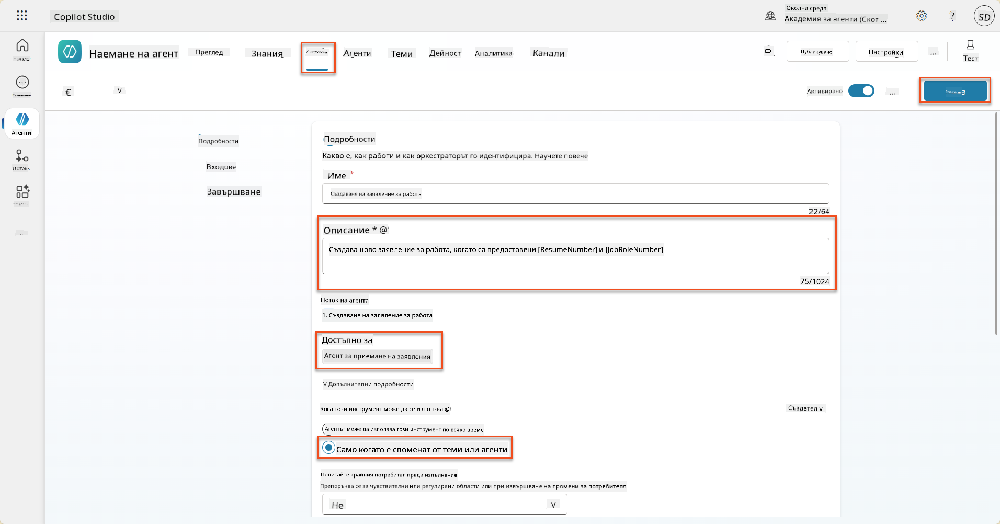

### 8.6 Дефиниране на инструкции за агент

За да създадете кандидатури за работа, трябва да кажете на агента кога да използва новия инструмент. В този случай ще помолите потребителя да потвърди към кои предложени роли да кандидатства и ще инструктирате агента да изпълни инструмента за всяка роля.

1. Върнете се към **Агент за приемане на кандидатури**, след това намерете панела **Инструкции**.

1. В полето **Инструкции**, **добавете** следните ясни указания за вашия подчинен агент **в края на съществуващите** инструкции:

    ```text
    3. Post Resume Upload
       - Respond with a formatted bullet list of [SuggestedJobRoles] the candidate could apply for.  
       - Use the format: [JobRoleNumber] - [RoleDescription]
       - Ask the user to confirm which Job Roles to create applications for the candidate.
       - When the user has confirmed a set of [JobRoleNumber]s, move to the next step.
    
    4. Post Upload - Application Creation
        - After the user confirms which [SuggestedJobRoles] for a specific [ResumeNumber]:
        E.g. "Apply [ResumeNumber] for the Job Roles [JobRoleNumber], [JobRoleNumber], [JobRoleNumber]
        E.g. "apply to all suggested job roles" - this implies use all the [JobRoleNumbers] 
         - Loop over each [JobRoleNumber] and send with [ResumeNumber] to /Create Job Application   
         - Summarize the Job Applications Created
    
    Strict Rules (that must never be broken)
    You must always follow these rules and never break them:
    1. The only valid identifiers are:
      - ResumeNumber (ppa_resumenumber)→ format R#####
      - CandidateNumber (ppa_candidatenumber)→ format C#####
      - ApplicationNumber (ppa_applicationnumber)→ format A#####
      - JobRoleNumber (ppa_jobrolenumber)→ format J#####
    2. Never guess or invent these values.
    3. Always extract identifiers from the current context (conversation, data, or system output). 
    ```

1. Където инструкциите включват наклонена черта (/), изберете текста след / и изберете инструмента **Създаване на кандидатура за работа**.

1. Изберете **Запазване**  
    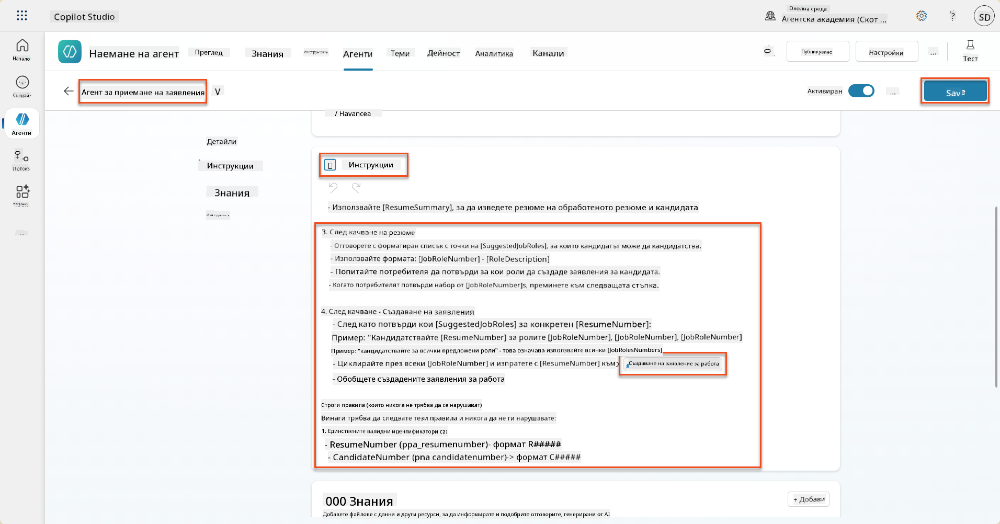

!!! tip "Итерация върху множество елементи в Генеративна оркестрация"
    Тези инструкции използват способността на генеративната оркестрация да итерация върху множество редове при вземане на решения за това кои стъпки и инструменти да се използват. Съвпадащите роли за работа ще бъдат автоматично прочетени и Агентът за приемане на кандидатури ще се изпълни за всеки ред. Добре дошли в магическия свят на генеративната оркестрация!

### 8.7 Тест на вашия агент

1. Отворете вашия **Агент за наемане** в Copilot Studio.

1. **Качете** примерна автобиография в чата и напишете:

    ```text
    This is a new resume for the Power Platform Developer Role.
    ```

1. Забележете как агентът предоставя списък с предложени роли за работа - всяка с номер на роля.  
    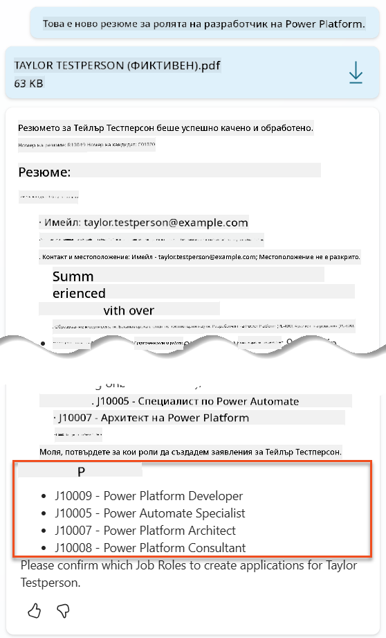

1. След това можете да посочите за кои от тях искате автобиографията да бъде добавена като кандидатура за работа.
    **Примери:**

    ```text
    "Apply for all of those job roles"
    "Apply for the J10009 Power Platform Developer role"
    "Apply for the Developer and Architect roles"
    ```

    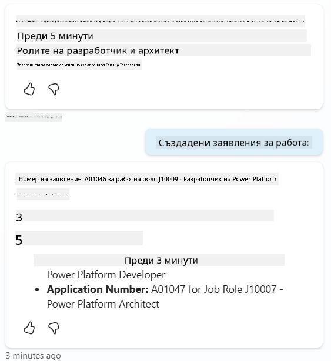

1. Инструментът **Създаване на кандидатура за работа** ще бъде изпълнен за всяка роля, която сте посочили. В картата на активностите ще видите как инструментът Създаване на кандидатура за работа се изпълнява за всяка от ролите, за които сте поискали да се създаде кандидатура:  
    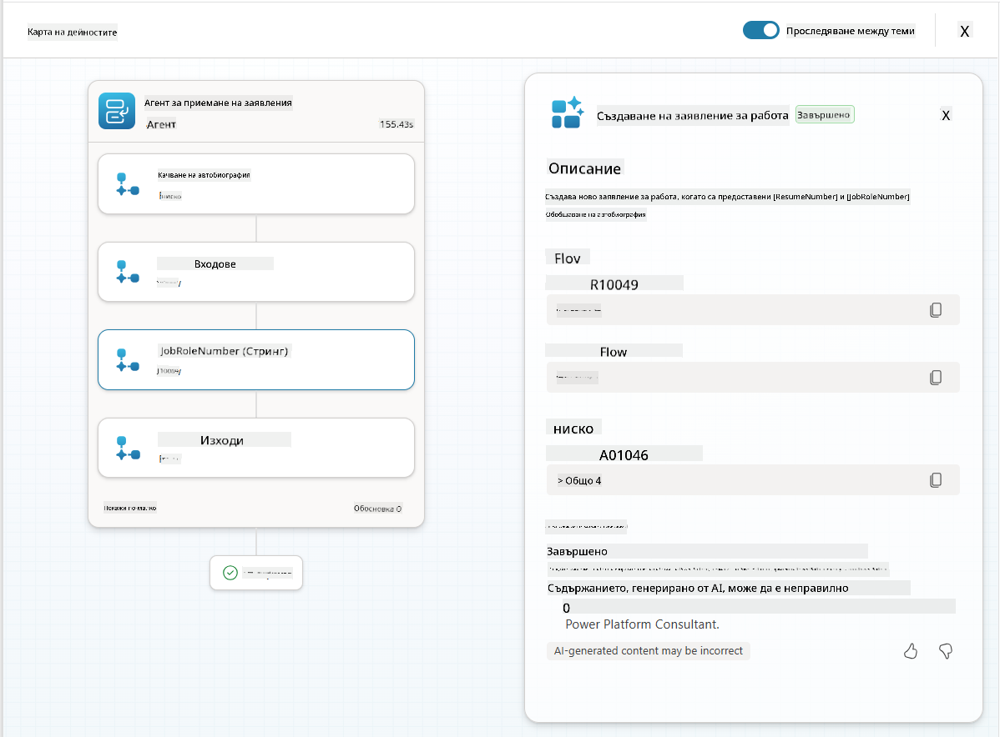

## 🎉 Мисията е изпълнена

Отлична работа, Оперативен! **Операция Grounding Control** е успешно завършена. Вие успешно подобрихте вашите AI възможности с динамично свързване на данни, създавайки наистина интелигентна система за наемане.

Ето какво постигнахте в тази мисия:

**✅ Майсторство в свързване с Dataverse**  
Вече разбирате как да свържете персонализирани подканвания с живи източници на данни за динамична интелигентност.

**✅ Подобрена анализ на автобиографии**  
Вашият поток за обобщение на автобиографии вече има достъп до реални данни за роли и критерии за оценка за точно съвпадение.

**✅ Вземане на решения, базирани на данни**  
Вашите агенти за наемане вече могат автоматично да се адаптират към променящите се изисквания за работа без ръчни актуализации на подканванията.

**✅ Създаване на кандидатури за работа**  
Вашата подобрена система вече може да създава кандидатури за работа и е готова за по-сложна оркестрация на работни потоци.

🚀 **Следващо:** В следващата си мисия ще научите как да внедрите способности за дълбоко разсъждение, които да помогнат на вашите агенти да вземат сложни решения и да предоставят подробни обяснения за техните препоръки.

⏩ [Преминете към Мисия 09: Дълбоко разсъждение](../09-deep-reasoning/README.md)

## 📚 Тактически ресурси

📖 [Използване на ваши собствени данни в подканване](https://learn.microsoft.com/ai-builder/use-your-own-prompt-data?WT.mc_id=power-182762-scottdurow)

📖 [Създаване на персонализирано подканване](https://learn.microsoft.com/ai-builder/create-a-custom-prompt?WT.mc_id=power-182762-scottdurow)

📖 [Работа с Dataverse в Copilot Studio](https://learn.microsoft.com/microsoft-copilot-studio/knowledge-add-dataverse?WT.mc_id=power-182762-scottdurow)

📖 [Преглед на персонализирани подканвания в AI Builder](https://learn.microsoft.com/ai-builder/prompts-overview?WT.mc_id=power-182762-scottdurow)

📖 [Документация за AI Builder в Power Platform](https://learn.microsoft.com/ai-builder/?WT.mc_id=power-182762-scottdurow)

📖 [Обучение: Създаване на подканвания в AI Builder с използване на ваши собствени данни от Dataverse](https://learn.microsoft.com/training/modules/ai-builder-grounded-prompts/?WT.mc_id=power-182762-scottdurow)

---

**Отказ от отговорност**:  
Този документ е преведен с помощта на AI услуга за превод [Co-op Translator](https://github.com/Azure/co-op-translator). Въпреки че се стремим към точност, моля, имайте предвид, че автоматизираните преводи може да съдържат грешки или неточности. Оригиналният документ на неговия роден език трябва да се счита за авторитетен източник. За критична информация се препоръчва професионален човешки превод. Не носим отговорност за недоразумения или погрешни интерпретации, произтичащи от използването на този превод.